# PyQCU 全文汇总：Wilson/Clover、Strict MultiGrid、CUDA/MPI 实现与最终性能对照

> 文档版本：2026-09-28<br>
> 合并范围：`docs/` 下当前有效的指南、技术报告、性能报告、算法说明、历史复盘与图表资产<br>
> 源码基线：`test27-7-g6a37d61-dirty`<br>
> 权威性能口径：`test27` 与 `report_multigrid_quda_pyqcu_20260928.tex`<br>
> 证据等级：E1 本机实测；E2 源码级推导或逐行对照；E3 历史结论或外部参考

**同源交付物**

| 格式 | 文件 | 生成规则 |
|---|---|---|
| Markdown 主源 | `report_pyqcu_full_documentation_20260928.md` | 唯一可编辑内容源 |
| LaTeX 派生源 | `report_pyqcu_full_documentation_20260928.tex` | 由主源正文、源码附件和哈希清册生成 |
| PDF 编译件 | `report_pyqcu_full_documentation_20260928.pdf` | 两遍 XeLaTeX 编译 |
| 构建脚本 | `High-Performance_Implementation_MG_assets/build_full_documentation.py` | 刷新源快照、生成 TeX 并编译 PDF |

统一重建命令：

```bash
cd /root/PyQCU/docs
python High-Performance_Implementation_MG_assets/build_full_documentation.py
```

## 文档控制

### 合并原则

本文不是旧文档的顺序拼接，而是一次带优先级裁决的全文整合。内容重叠时按下述顺序选择：

| 优先级 | 来源 | 使用方式 |
|---:|---|---|
| 1 | 当前工作区源码 | 解决 ABI、分支、默认值、分布式能力和生命周期歧义 |
| 2 | 2026-09-28 报告与当日高性能全文 | 最终性能、覆盖、残差、显存和结论 |
| 3 | 2026-09-27 及更早正式报告 | 实现演进、被撤回口径、历史 A/B 和失败路径 |
| 4 | 分析型文档与计划 | 数学定义、验收设计、流程和验证矩阵 |
| 5 | `.pdf`、`.pptx`、渲染图与重复运行目录 | 派生交付物，只在源文件不可读或图表需单独展示时使用 |

同一文件同时存在 `.tex`、`.md`、`.pdf` 时，优先分析源文件，PDF 仅作为编译或展示产物。同一报告存在 `_2`、`_3`、`_4`、`_5` 等连续版本时，只保留内容上最新的修订；旧版本的独特证据进入历史章节。

### 质量筛选

低信息密度、重复背景、过程日志、仅证明“命令已执行”的输出、无独立证据的推断、中间渲染页和可由源码或表格重建的图，不进入正文。被舍弃内容仍保留原始路径、版本关系或替代关系，便于回溯。

保留标准是满足以下至少一项：

| 类别 | 保留内容 |
|---|---|
| 物理 | 作用量、算子、对称性、离散误差、极限与量纲检查 |
| 数学 | Schur 消元、Galerkin、残差、Krylov 递推、资产定义 |
| 工程 | ABI、线程/rank 隔离、缓存身份、通信、内存和生命周期 |
| 实证 | 运行协议、真残差、时间、迭代、显存、容量替代和错误边界 |
| 可复现 | 命令、入口、输入身份、版本、图和机器可读证据路径 |
| 风险 | 被撤回结论、失败实验、未验证项和外推边界 |

### 当前结论

`test27` 最终矩阵请求 72 个 combined 单元，实际完成 66 个精确单元和 132 条 side record。剩余 6 个 combined 单元仅对应双 P100 的 c64 `16x32x32x48`，因显存或 570 秒单实例时限被明确替代，不使用历史值补齐。

所有 66 个精确单元均满足两侧 `status=ok`、配置哈希一致、输入 bundle 一致、1 cold 加 2 warmup 加 5 steady 完整，并通过独立 full-operator 真残差门。整体稳态时间比定义为

$$
R=\frac{t_{\mathrm{QUDA,steady}}}{t_{\mathrm{PyQCU,steady}}},\qquad R>1\ \text{表示 PyQCU 更快}.
$$

全部 66 个精确单元的逐单元比值中位数为 `1.0250`。MG-2/3 在 `35/44` 个单元中优于 QUDA；仅看正式 trace-off 口径，MG 为 `21/22`。BiCGStab reference 为 `0/22`，因此结论只适用于 MG 专项，不可外推为 PyQCU 全部求解器领先。

PyQCU 与 QUDA 的最大 full true residual 分别为 `7.40e-7` 与 `7.97e-7`，均低于 `5e-6`。保留样本的最大 device-wide 观测显存分别为 `11907.3 MiB` 与 `23063.3 MiB`，均低于设备容量 85% 门限。

### 阅读导航

| 主题 | 章节 |
|---|---|
| 工程结构、布局、ABI、构建与测试 | 1 至 3 |
| Wilson/Clover、Schur、Krylov、MG 数学基础 | 4 至 7 |
| QUDA 粗层资产与矩阵顺序 | 8 |
| PyQCU CUDA、MPI、缓存和生命周期 | 9 至 13 |
| 最终性能、残差、显存与容量边界 | 14 至 18 |
| 实现演进、撤回指标和失败实验 | 19 至 24 |
| 2025 DCU 历史应用测试 | 25 |
| 图表总览、复现和验证矩阵 | 26 至 28 |
| 来源台账与处置规则 | 29 至 30 |

---

## 1. 项目结构与执行层级

PyQCU 是面向格点 QCD 的 Python/Cython/C++ CUDA 库，覆盖 Wilson/Clover Dirac 算子、BiCGStab、FGMRES、MultiGrid、stout smearing、规范场生成和设备后端适配。核心计算在四维 MPI 进程网格上分布。

| 层级 | 路径 | 职责 |
|---|---|---|
| 纯 Python | `pyqcu/dslash/`、`pyqcu/solver/`、`pyqcu/smear/` | PyTorch/兼容层实现，支持 CPU、CUDA 和 NPU 参考路径 |
| Python 工具 | `pyqcu/tools/` | MPI 网格、布局转换、HDF5、线性代数、coarse setup |
| Cython 桥 | `pyqcu/cuda/qcu/` | 将扁平参数和张量指针转换为 C API 调用，释放 GIL |
| C++/CUDA 生产后端 | `cpp/cuda/qcu/` | Wilson/Clover Dslash、Schur、Krylov、Strict MG、halo 和 MPI |
| 多卡驱动 | `pyqcu/cuda/_multi_gpu.py` | 一线程一卡任务并行，不把多个线程误解为单个 RHS 的域分解 |
| 测试入口 | `pyqcu/testing/` | Python、QCU、QUDA、PyQUDA、CPU/NPU/DCU/GPU 等分类测试 |
| 正式文档 | `docs/` | 指南、论文、阶段性报告、对照报告和图表资产 |
| 运行证据 | `data/`、`logs/` | 张量、构建树、机器可读记录、日志和 tag 报告 |

项目有两套重要但语义不同的执行路径。

| 路径 | 求解器 | 并行方式 | 备注 |
|---|---|---|---|
| 纯 Python | PyTorch 实现 | CPU/CUDA/NPU、Python MPI | 可移植原型和算子级验证 |
| C++ CUDA | Cython 绑定后的生产内核 | MPI rank 域分解和 CUDA halo | 正式性能路径 |

所有纯 Python 代码应通过 `pyqcu.cann as _torch` 访问张量后端。尤其 NPU 路径不能硬编码 `import torch`，以避免绕过复数张量拆解兼容层。

## 2. 维度、布局、MPI 与参数 ABI

### 2.1 张量布局

时空维始终放在张量最后四轴，统一记为 `...xyzt`。ward 方向使用负整数索引：`wards['x']=-4`、`wards['y']=-3`、`wards['z']=-2`、`wards['t']=-1`。

| 对象 | 规范布局 |
|---|---|
| 规范场 | `[c,c,d,x,y,z,t]` |
| 奇偶规范场 | `[p,c,c,d,x,y,z,t]` |
| 费米子 | `[s,c,x,y,z,t]` |
| 奇偶费米子 | `[p,s,c,x,y,z,t]` |
| Wilson block | `[s,c,s,c,x,y,z,t]` |
| Clover term | `[s,c,s,c,x,y,z,t]` |

HDF5 内部使用 `zyxt` 序。跨布局转换使用：

| 转换 | 入口 | 含义 |
|---|---|---|
| `ccdxyzt -> ccdptzyx` | `pyqcu.tools.ccdxyzt2ccdptzyx` | 规范场转到 parity、`tzyx` 和内部表示 |
| `scxyzt -> psctzyx` | `pyqcu.tools.scxyzt2psctzyx` | 费米子转到 parity、`tzyx` |
| 分布式 HDF5 写入 | `gridoooxyzt2hdf5oooxyzt` | rank slab 到全局 `xyzt` HDF5 |
| 分布式 HDF5 读取 | `hdf5oooxyzt2gridoooxyzt` | 全局 HDF5 到本地 rank slab |

转换前后必须同时核对 parity、spin-color 顺序、方向索引、复共轭和 HDF5 的 `zyxt` 约定。仅比较张量 shape 不能证明布局兼容。

### 2.2 参数协议

Python 与 C++ 通过三个扁平数组桥接。当前源码基线仍保持 `params` 长度 58 的 ABI。

| 数组 | 类型与长度 | 内容 |
|---|---|---|
| `params` | `int32[58]` | 几何、rank、plan、精度、level、MG 模式和生命周期索引 |
| `argv` | `float[7]` | mass、atol、sigma 和各层容差 |
| `set_ptrs` | `int64[100]` | `LatticeSet`、scratch、coarse asset 和持久 hierarchy 指针 |

当前关键索引如下：

| 索引 | 值 | 语义 |
|---|---:|---|
| `_SET_PLAN_` | `-2` | Laplacian |
| `_SET_PLAN_` | `-1` | Gauss gauge |
| `_SET_PLAN_` | `0` | Wilson dslash |
| `_SET_PLAN_` | `1` | BiStabCG/CG |
| `_SET_PLAN_` | `2` | Clover dslash |
| `_MG_USE_DEFLATE_` | `55` | deflation 开关 |
| `_MG_MU_PRE_` | `56` | 预平滑次数 |
| `_MG_USE_INIT_GUESS_` | `57` | 热启动开关 |
| `_SET_PTRS_STRICT_COARSE_BASE_` | `60` | Strict coarse asset 基址 |
| `_SET_PTRS_STRICT_STRIDE_` | `4` | 每条 transition 的槽位数 |
| `_SET_PTRS_STRICT_HIERARCHY_` | `80` | 持久 Strict hierarchy 句柄 |

Strict coarse asset 每组四槽依次为 blocked basis `V`、raw links `Y`、preconditioned links `Yhat`、onsite pair `(X, X^-1)`。

`pyqcu/cuda/define.py` 与 `cpp/cuda/qcu/include/define.h` 必须同步。当前源码在两处都定义了相同的 58 项 ABI 和 mode bit mask：

| 位 | 含义 |
|---:|---|
| `2` | MR smoother |
| `4` | Chebyshev |
| `8` | CA-GCR |
| `16` | W-cycle |
| `32` | F-cycle |
| `64` | K-cycle |
| `128` | BiCGStab(l) |

### 2.3 调用生命周期

普通 QCU 操作遵循：

```text
applyInitQcu
  -> 一次或多次算子/求解器调用
  -> params[define._SET_INDEX_] += 1
  -> applyEndQcu
```

每次调用之间必须递增 `_SET_INDEX_`。不递增会复用 scratch、工作区和 `LatticeSet` 槽位，错误通常不会在单次 kernel 内部立即暴露。

Strict 持久 hierarchy 是例外：在 hierarchy 的多次 V-cycle/FGMRES 调用间保持同一 `_SET_INDEX_`。其生命周期为

```text
applyMultigridStrictInitQcu
  -> repeated V-cycle / FGMRES
  -> applyMultigridStrictEndQcu
```

### 2.4 多线程多卡

`MultiGpuMultigrid` 使用一线程一卡模型。每个线程必须具备：

| 隔离对象 | 要求 |
|---|---|
| CUDA context | 线程内独立设置 device |
| `params`、`argv`、`set_ptrs` | 独立副本 |
| `_SET_INDEX_` | 各自从 0 计数 |
| hierarchy 与 scratch | 每线程独立 |
| HDF5 句柄 | 每次调用独立 `with h5py.File(...)` |

Cython 函数先持有 GIL 取张量指针，再通过 `with nogil` 调用 C++。pxd 中的 C API 声明必须带 `nogil`，并使用 `qcu_api.pxd` 别名避免和 pyx 的 Python `def` 同名。

当前多卡驱动求的是多个独立任务，而不是把一个 RHS 域分解到多张卡。其可测量指标是吞吐和线程一致性，不是单 RHS 延迟加速。

## 3. 环境、构建、测试与组织

### 3.1 环境

推荐 Python 3.10 或更高版本。核心依赖包括 PyTorch、Cython、mpi4py、h5py、NumPy 和 CUDA toolkit；TileLang 可选。

```bash
source ./env.sh
bash ./build.sh
bash ./install.sh
```

必须保证：

| 变量 | 用途 |
|---|---|
| `PYTHONPATH` | 指向 PyQCU 仓库根 |
| `LD_LIBRARY_PATH` | 找到 `libqcu.so` 和 CUDA/MPI 运行库 |
| `QUDA_PATH` | QUDA 对照构建安装路径 |
| MPI root 权限 | 容器内允许 `mpirun` 时按环境配置 |

### 3.2 常用测试

```bash
cd pyqcu/testing && pytest .
mpirun -np 4 python pyqcu/testing/python/conftest.py
python pyqcu/testing/qcu/single_qcu_api.py
pytest pyqcu/testing/quda
```

顶层 `examples/` 已删除。历史文档中的 `examples/...` 路径全部映射到 `pyqcu/testing/...`，当前命令必须使用新路径。

Profiler 路径为 `pyqcu/testing/profiler/`，典型命令为：

```bash
cd PyQCU/pyqcu/testing/profiler
mpirun -np 1 python -u conftest.py
```

生成的 `trace_*.json` 可载入 `https://ui.perfetto.dev/`。

### 3.3 文件分类

| 类型 | 唯一规范目录 |
|---|---|
| 正式独立文档 | `docs/**` |
| 日志、运行摘要、tag 报告 | `logs/**` |
| HDF5、SO、DAT、CSV、SVG、构建安装树 | `data/**` |
| 测试和其他代码 | `pyqcu/testing/**` |

禁止用软链接或嵌套归档复制资产。LaTeX 辅助文件、逐页渲染、一次性缓存和会话垃圾应删除或保留在明确标记的构建工作区。

---

## 4. Wilson 与 Clover 算子

### 4.1 规范链接与协变平移

规范链接满足 `U_{x,mu} in SU(3)`。正、反向协变平移为

$$
T_{+\mu}\psi_x=U_{x,\mu}\psi_{x+\hat\mu},
\qquad
T_{-\mu}\psi_x=U^\dagger_{x-\hat\mu,\mu}\psi_{x-\hat\mu}.
$$

自由场极限 `U=1` 是检查邻居索引、gamma 约定和边界条件的最低成本测试。

### 4.2 Wilson hopping 核

取 Wilson 参数 `r=1`，定义无单位项和 `-kappa` 因子的 hopping 核

$$
(H\psi)_x=
\sum_{\mu=0}^{3}
\left[
(1-\gamma_\mu)U_{x,\mu}\psi_{x+\hat\mu}
+(1+\gamma_\mu)U^\dagger_{x-\hat\mu,\mu}\psi_{x-\hat\mu}
\right].
$$

Wilson 部分和作用量为

$$
D_W=(m_0+4)I-\frac12H,
\qquad
S_W=\sum_x\bar\psi_xD_W\psi_x,
\qquad
\kappa=\frac{1}{2m_0+8}.
$$

预条件归一化形式为

$$
D_{\mathrm{pc}}=I-\frac{\kappa}{u_0}H,
\qquad
D_W=(m_0+4)D_{\mathrm{pc}}.
$$

当前 C++ 生产路径等价于 `u0=1`。原始 Wilson Dslash 接口返回裸核 `H`；带单位项的 Python 接口返回 `I-(kappa/u0)H`。跨实现比较必须先统一该归一化。

### 4.3 Clover 改进

有向 plaquette 为

$$
P_{\mu\nu}(x)=
U_\mu(x)U_\nu(x+\hat\mu)
U^\dagger_\mu(x+\hat\nu)U^\dagger_\nu(x).
$$

四叶 Clover 和为

$$
Q_{\mu\nu}=P_{\mu\nu}+P_{\nu,-\mu}+P_{-\mu,-\nu}+P_{-\nu,\mu},
\qquad
C_{\mu\nu}=Q_{\mu\nu}-Q^\dagger_{\mu\nu}.
$$

代码级 onsite block 为

$$
T_p=-\frac{\kappa c_{\mathrm{sw}}}{8u_0}
\sum_{\mu<\nu}\gamma_\mu\gamma_\nu C_{\mu\nu},
\qquad
A_p=I_p+T_p.
$$

当前有效 `c_sw=1`。Clover 项不扩大最近邻 stencil，但每个站点从纯颜色 onsite 问题提升为 `12x12` spin-color onsite 问题。实现必须批量构造 Clover、批量求逆并复用 onsite 因子，不能使用逐点通用矩阵逆。

### 4.4 对称性、谱与极限检查

Wilson 算子满足 gamma5-Hermiticity：

$$
D_W^\dagger=\gamma_5D_W\gamma_5.
$$

这说明可构造 Hermitian kernel `gamma5*D`，但不表示原始 Wilson/Clover 算子本身 Hermitian。solver 选择、左右预条件和 dagger 语义必须与此一致。

自由场动量空间形式为

$$
D_W(p)=m_0+\sum_\mu(1-\cos p_\mu)
+i\sum_\mu\gamma_\mu\sin p_\mu.
$$

必须执行：

| 检查 | 预期 |
|---|---|
| 自由场 `U=1` | 与直接 stencil 或动量空间一致 |
| `c_sw=0` | Clover 路径退化为 Wilson |
| 大质量极限 | 谱隙扩大，迭代通常减少 |
| 临界质量 | 条件数恶化，不能把 solver 变慢误判为算子错误 |
| 局部规范变换 | 先平移场再做算子等于先做算子再变换 |
| `gamma5` 关系 | 相对误差处于 dtype 舍入量级 |

条件数采用

$$
\kappa_2(A)=\frac{\sigma_{\max}(A)}{\sigma_{\min}(A)}.
$$

对 `D^dagger D`，条件数为原条件数的平方。源码和报告中必须明确当前求解的是 `D`、`D^dagger D`、full operator 还是 Schur operator。

## 5. 奇偶 Schur 与残差语义

### 5.1 精确 block elimination

将 full 场按 parity 排列：

$$
D=
\begin{pmatrix}
A_e & B_{eo}\\
B_{oe} & A_o
\end{pmatrix},
\qquad
b=
\begin{pmatrix}
b_e\\
b_o
\end{pmatrix}.
$$

消去 odd 分量得到 even Schur 补

$$
S_e=A_e-B_{eo}A_o^{-1}B_{oe},
\qquad
b_e^{S}=b_e-B_{eo}A_o^{-1}b_o,
$$

恢复 odd 分量为

$$
x_o=A_o^{-1}(b_o-B_{oe}x_e).
$$

Clover 情况下 `A_p=I+C_p`；若使用 `D=I-kappa H`，hopping block 包含 `-kappa`，Schur 项中的符号和 `kappa^2` 必须由具体归一化推导。

### 5.2 Schur 语义分类

| 名称 | 定义 | 适用路径 | 主要风险 |
|---|---|---|---|
| full | 完整 `D` 同时作用于两种 parity | full Galerkin、full residual、Strict hierarchy | 存储和 apply 成本高 |
| asymmetric Schur | `A_p-B_pq A_q^-1 B_qp` | MATPC、BiCGStab、GCR、FGMRES | 非 Hermitian，左右次序固定 |
| symmetric Schur | 先做对称缩放或 `A^-1/2` | 希望保留 Hermitian 结构 | 缩放、右端和重建必须成对 |
| coarse-PC | `X_c^-1 D_c` | 粗层 PC apply | 不能和 fine Schur 混用 |

### 5.3 真残差

MATPC 的递推残差只属于压缩子系统。可靠停止条件必须由 full operator 重算：

$$
r_{\mathrm{true}}=b-Dx,
\qquad
\rho_{\mathrm{rel}}=
\frac{\| r_{\mathrm{true}}\|_2}{\| b\|_2}.
$$

右端为零时直接返回零解，避免 `1/||b||`。Strict 单 rank 主循环使用相对判据

$$
\| r_n\|_2^2
<
\mathrm{atol}^2\| b\|_2^2,
$$

并在预设周期执行 reliable-update，重算 full residual。多 rank 和不同入口是否刷新必须以当前源码为准，不能用单 rank 行为外推。

Schur 求解最小流程：

```text
输入 full b=(b_e,b_o), onset A_e,A_o, hopping B_eo,B_oe
1. y_o = A_o^{-1} b_o
2. b_e^S = b_e - B_eo y_o
3. 解 S_e x_e = b_e^S
4. x_o = A_o^{-1}(b_o - B_oe x_e)
5. 独立重算 r_true = b - D x
6. 只有 full true residual 达标才报告收敛
```

## 6. Krylov 方法与平滑器

### 6.1 算法选择

| 算法 | 算子条件 | 成本 | 常见失败 | 当前状态 |
|---|---|---|---|---|
| CG | SPD | 1 次 apply 和少量归约 | 非 SPD、负分母 | 实现/参考 |
| 多移位 CG | SPD 加标量移位 | 共享 Krylov | 非标量局部项、停止不一致 | Python 实现 |
| BiCG | 非 Hermitian 且需 dagger | 双 matvec/归约 | shadow breakdown | 参考 |
| CGS | 非 Hermitian | 低成本 shadow | 非正规矩阵上误差放大 | 局部正交参考 |
| BiCGStab | 一般非 Hermitian | 2 matvec/迭代 | `rho`、`omega` breakdown | 生产实现 |
| GMRES | 一般非 Hermitian | 长基和归约 | 内存增长、失正交 | 参考/部分实现 |
| FGMRES | 变化预条件器 | 保存 `Z` 与 `V` | 预条件返回异常 | Strict 生产路径 |
| GCR | 一般非 Hermitian | 方向历史和内积 | 历史大、失正交 | QUDA 参考 |
| CA-CG/CA-GCR | 块 Krylov | 少全局同步 | 块条件数恶化 | CA-CG 实现 |
| MR | 平滑或短迭代 | 固定短递推 | dagger 方向约定错误 | 生产 smoother |
| Chebyshev | 已知谱区间 | 固定多项式 | 谱估计错误 | 模式可切换 |

### 6.2 MR 平滑

当前 Strict CUDA 路径使用非 Hermitian-safe 的最小残差步。先计算

$$
v=Ar,
$$

再取

$$
\alpha=
\frac{\langle v,r\rangle}{\langle v,v\rangle}
=
\frac{\langle Ar,r\rangle}{\langle Ar,Ar\rangle},
$$

$$
x\leftarrow x+\alpha r,
\qquad
r\leftarrow r-\alpha v.
$$

Python 通用 MR 参考实现采用另一条 dagger-safe 形式：`p=A^dagger r`，`v=A p`，`alpha=omega*<p,p>/<v,v>`，再执行 `x+=alpha p`、`r-=alpha v`。两者不可混写成同一个递推。源码锚点为 `cpp/cuda/qcu/src/apply_multigrid_strict.cu`、`cpp/cuda/qcu/include/lattice_clover_multigrid.h` 和 `pyqcu/solver/_mr.py`。

### 6.3 BiCGStab

常用递推为

$$
\begin{aligned}
\rho_k&=\langle \tilde r_0,r_k\rangle,\\
\beta_k&=\frac{\rho_k}{\rho_{k-1}}\frac{\alpha_{k-1}}{\omega_{k-1}},\\
p_k&=r_k+\beta_k(p_{k-1}-\omega_{k-1}v_{k-1}),\\
v_k&=Ap_k,\\
\alpha_k&=\rho_k/\langle\tilde r_0,v_k\rangle,\\
s_k&=r_k-\alpha_kv_k,\\
t_k&=As_k,\\
\omega_k&=\langle t_k,s_k\rangle/\langle t_k,t_k\rangle,\\
x_{k+1}&=x_k+\alpha_kp_k+\omega_ks_k,\\
r_{k+1}&=s_k-\omega_kt_k.
\end{aligned}
$$

必须保护所有分母、`rho` 和 `omega`，检测 NaN/Inf，并在可靠更新点用 full operator 刷新残差。

### 6.4 FGMRES

Arnoldi 关系为

$$
AV_m=V_{m+1}\bar H_m.
$$

FGMRES 允许每步预条件器变化：

$$
z_j=M_j^{-1}v_j,
\qquad
w_j=Az_j,
\qquad
x_m=x_0+Z_my.
$$

MG hierarchy、SAP、内层步数或 warm state 变化时，预条件器不是固定线性算子，必须使用 FGMRES 或 flexible-GCR。Strict 实现使用右预条件，并在 restart 边界重算 full true residual。

若 Arnoldi 历史长度为 `m`，融合 FGMRES 工作区量级为

$$
B_{\mathrm{work}}=(2m+5)B_f+2B_c,
$$

其中 `B_f` 是 compact fine 向量，`B_c` 是 full first-coarse 向量。

### 6.5 正交化与 breakdown

MGS 一步为

$$
w=Av_j,
\quad
h_{ij}=\langle v_i,w\rangle,
\quad
w\leftarrow w-h_{ij}v_i,
\quad
h_{j+1,j}=\| w\|,
\quad
v_{j+1}=w/h_{j+1,j}.
$$

局部 null-space 正交化可使用 CGS、MGS 或 block QR。验收不能只看 setup 成功，而应报告

$$
\epsilon_{\mathrm{orth}}=
\max_{\mathcal A}
\left\| V_{\mathcal A}^\dagger V_{\mathcal A}-I\right\|.
$$

分布式归约改变浮点求和顺序时，不应要求逐 bit 相同；必须比较残差量级、真残差门和物理结果。

---

## 7. MultiGrid、Galerkin 与 Strict coarse operator

### 7.1 粗空间的物理目标

轻夸克质量使 Dirac 算子接近奇异。Krylov 迭代对低频模态的收敛随体积恶化，即 critical slowing down。MG 将误差拆为

$$
e=e_{\mathrm{high}}+e_{\mathrm{low}}.
$$

平滑器压低高频误差，粗空间表示低频误差。设近零模集合 `B_l` 近似满足

$$
A_lB_l\approx 0.
$$

`B_l` 不是精确核，而是低模空间的数值近似。经过 aggregate 重排和局部正交化后得到延拓 `P_l`，通常取

$$
R_l=P_l^\dagger,
\qquad
P_l^\dagger P_l=I.
$$

粗算子由 Galerkin 投影定义：

$$
A_{l+1}=R_lA_lP_l.
$$

对非 Hermitian 或非正规算子，`P P^dagger != I`。粗空间不能替代细层单位算子，只负责消除 `P` 可表示的低模误差。

### 7.2 显式矩阵为何不可行

若粗自由度为 `E`、粗格点数为 `N_c`，显式稠密矩阵需要

$$
O\left((EN_c)^2\right)
$$

个复数。一个 `N_c≈49152`、`E=24` 的层级有约 1179648 个 coarse 自由度；c64 稠密矩阵约 11.1 TB，c128 约 22.3 TB。生产实现必须保存有限支撑 stencil，并以 matrix-free 或打包 block 资产应用。

### 7.3 粗空间质量与成本

对 aggregate 内的基 `V_A`，检查

$$
\epsilon_{RP}=\| RP-I\|,
\qquad
\epsilon_{\mathrm{orth}}=
\max_A\| V_A^\dagger V_A-I\|.
$$

只报告 null-vector 数量不足以证明粗空间质量。当前质量诊断曾给出近零模指标 `||S v||/||v||≈0.31-0.46`，说明向量可用但纯净度有限。

粗层一次 apply 的量级成本为

$$
C_{\mathrm{coarse}}
\sim
V_c(C_XE^2+8C_YE^2)
+C_{\mathrm{reduce}}N_{\mathrm{global\,dot}}.
$$

setup 还包含 null-vector 生成、局部正交、Galerkin probes、onsite inverse 和缓存写入。粗化比增大可减少 `V_c`，但 block 过大会降低 transfer 质量和并行度。增加 `E` 会以 `E^2` 提升粗算子成本，不能只增加 null-vector 数。

### 7.4 Strict split

PyQCU 正式主线为 Strict full-coarse MG。细层使用目标 parity compact 表示，粗层保留完整几何和 full operator 语义。

$$
D_l=X_l+H_l,
$$

其中 `X_l` 是零位移 onsite block，`H_l` 是轴邻近 hopping。左预条件为

$$
\widehat D_l=X_l^{-1}D_l=I+\widehat H_l,
\qquad
\widehat H_l=X_l^{-1}H_l.
$$

粗层算子为

$$
D_{l+1}=R_l\widehat D_lP_l
=R_l(X_l^{-1}D_l)P_l.
$$

运行期资产中，raw link 定义为

$$
Y^{f}_{l,\mu},Y^{b}_{l,\mu},
$$

preconditioned link 为

$$
\widehat Y^{f}_{l,\mu}=X_l^{-1}Y^{f}_{l,\mu},
\qquad
\widehat Y^{b}_{l,\mu}=Y^{b}_{l,\mu}X_l^{-\dagger}.
$$

forward 和 backward 的预条件顺序不同。raw `Y` 主要用于 setup 和诊断；solve 热路径使用 `Yhat`、`X` 和 `X^-1`。

### 7.5 最近邻支持与 fail-closed

Strict coarse stencil 只允许 onsite 和一格 hop：

$$
D_c=X_c+\sum_\mu
\left(
Y_c^{+\mu}T_{+\mu}
+Y_c^{-\mu}T_{-\mu}
\right).
$$

若 Galerkin probe 发现更远 displacement，必须显式失败。不能把宽 stencil 截断成最近邻后继续求解。

### 7.6 V-cycle

一次 V-cycle 为

$$
\begin{aligned}
x_l^{(1)}&=S_l^{\nu_{\mathrm{pre}}}(A_l,b_l,x_l^{(0)}),\\
r_l&=b_l-A_lx_l^{(1)},\\
b_{l+1}&=R_lr_l,\\
e_{l+1}&=\mathrm{Vcycle}(l+1,b_{l+1},0),\\
x_l^{(2)}&=x_l^{(1)}+P_le_{l+1},\\
x_l^{\mathrm{out}}&=S_l^{\nu_{\mathrm{post}}}(A_l,b_l,x_l^{(2)}).
\end{aligned}
$$

最粗层调用专用 coarse solver。外层右预条件 FGMRES 中，V-cycle 返回 `M^-1 r`，FGMRES 必须保存每一步的 `z_j` 并累加 `sum z_j y_j`。

### 7.7 Setup 与资产生命周期

MG setup 至少包含三类资产：

| 类别 | 内容 | 失效条件 |
|---|---|---|
| transfer | null vectors、aggregate、局部正交基、`P/R` | gauge、质量、几何或 blocking 变化 |
| operator | `X`、raw `Y`、`Yhat`、33-tensor stencil | 层级、精度、算子或资产 identity 变化 |
| solver state | 粗层分解、workspace、warm initial guess | hierarchy 或重启协议变化 |

warm start 只改变初值 `x0`，不改变 `A`、`b` 或 stopping criterion。切换 gauge、质量、边界、精度或层级后必须显式失效缓存。

### 7.8 Galerkin 构造

单列 probe 会为每列执行 full-field matvec，成本很高。当前实现使用：

| 策略 | 作用 |
|---|---|
| site/column batch | 一次处理多个 probe，摊薄 Python/C++ 同步 |
| colored source | 不冲突源同批执行，降低峰值内存 |
| batched gather/scatter | 预计算索引和 blocked basis 布局 |
| 原子累加 | 多 fine point 并发写同一 coarse block |
| 缓存 identity | 防止错误复用旧资产 |

历史 c128 冒烟中，将 canonical block staging 从逐点 Python 循环改为批量张量操作后，`K=1` 从 `44.86 s` 降到 `16.67 s`，约 `2.69x`；进一步按源 parity 分桶后，大格 c128 C=4/K=16 冷 setup 从约 `974 s` 降到 `585.28 s`。

## 8. QUDA 粗层资产、矩阵顺序与 MATPC

### 8.1 自由度与几何

fine Wilson/Clover 每站点自由度为

$$
e=N_s^fN_c^f=4\cdot3=12.
$$

coarse spin 为 `N_s^c=2`，null-vector 数为 `n_v`，因此

$$
E=N_s^cn_v.
$$

当 `n_v=12` 时 `E=24`。`X`、`Y`、`Yhat` 是 dense `E x E` 矩阵，不是 `SU(3)` link。

block `b=(b_x,b_y,b_z,b_t)` 给出

$$
X_\mu=\lfloor x_\mu/b_\mu\rfloor,
\qquad
\Lambda_c=(L_x/b_x,L_y/b_y,L_z/b_z,L_t/b_t).
$$

checkerboard parity 为

$$
p(x)=(x+y+z+t)\bmod2.
$$

hopping 改变 parity，onsite 不改变。full coarse asset 保留全格；MATPC 输入才压缩一半。固定前三维时，parity compact 时间坐标为

$$
t_{\mathrm full}=2t_{\mathrm half}+[(p-x-y-z)\bmod2].
$$

### 8.2 Transfer

aggregate 内正交基记为 `V`：

$$
(P\phi)_{s_fc_f}(x)=
\sum_{s_c,j}V_{s_fc_f,s_cj}(x)\phi_{s_cj}(X(x)),
$$

$$
(R\psi)_{s_cj}(X)=
\sum_{x\in A_X}\sum_{s_f,c_f}
V_{s_fc_f,s_cj}^*(x)\psi_{s_fc_f}(x),
\qquad
R=P^\dagger.
$$

每个 aggregate 内满足

$$
V_X^\dagger V_X=I_E,
\qquad
P^\dagger P=I_{\mathrm coarse},
\qquad
PP^\dagger\ne I_{\mathrm fine}.
$$

### 8.3 `X/Y`

forward link 的构造为

$$
Y_\mu^{f}(X)
=-\kappa\sum_{x\in A_X}
(A V_X(x))^\dagger U_\mu(x)V_{X+\hat\mu}(x+\hat\mu).
$$

backward storage block 为

$$
Y_\mu^{b}(X-\hat\mu)
=-\kappa\sum_{x\in A_X}
V_X(x)^\dagger U_\mu^\dagger(x-\hat\mu)
A V_{X-\hat\mu}(x-\hat\mu).
$$

若 `-\kappa` 被延后到 dslash 的 `dim_collapse`，比较缓存时必须记录系数是否已吸收。

full Clover onsite block 为

$$
X_C(X)=\sum_{x\in A_X}V_X(x)^\dagger C(x)V_X(x).
$$

Wilson-like 分支还会执行

$$
X\leftarrow X+I_E.
$$

coarse-to-coarse 重新投影当前层 `X_l`，不是再次读取 fine Clover 项。

### 8.4 Raw coarse action 与 storage

QUDA coarse kernel 的 storage 关系为

$$
out(x)=
\sum_\mu Y_{-\mu}(x)in(x+\mu)
+Y_\mu^\dagger(x-\mu)in(x-\mu).
$$

用 action 目标点 `q` 写 backward 项：

$$
Y_\mu^{b}(q-\hat\mu)^\dagger z(q-\hat\mu).
$$

若 `-\kappa` 未吸收进 link，则

$$
D_cz=Xz-\kappa H_Yz.
$$

常见错误是把 backward link 存到 `q` 而不是 `q-mu`，或在错误一侧乘 onsite inverse。dense block 不可交换时，这类错误会直接改变结果。

### 8.5 `Yhat` 与预条件

由

$$
X^{-1}(q)Y_\mu^{b}(q-\hat\mu)^\dagger
=
\left[
Y_\mu^{b}(q-\hat\mu)X^{-\dagger}(q)
\right]^\dagger
$$

得到

$$
\widehat Y_\mu^{f}(X)=X^{-1}(X)Y_\mu^{f}(X),
\qquad
\widehat Y_\mu^{b}(X-\hat\mu)
=Y_\mu^{b}(X-\hat\mu)X^{-\dagger}(X).
$$

实现顺序为 batch inverse `X`、交换双向 `Y` ghost、计算 backward `Y X^-dagger`、计算 forward `X^-1 Y`、注入 backward bulk，并只交换 forward ghost。

### 8.6 MATPC 与 prepare/reconstruct

按 parity 排列：

$$
D=
\begin{pmatrix}
A_p&D_{pq}\\
D_{qp}&A_q
\end{pmatrix}.
$$

compact solve 与恢复为

$$
x_q=A_q^{-1}(b_q-D_{qp}x_p),
$$

$$
S_p=A_p-D_{pq}A_q^{-1}D_{qp},
\qquad
M_p=A_p^{-1}S_p,
$$

$$
b_p^{\mathrm prep}
=A_p^{-1}b_p
-(A_p^{-1}D_{pq})A_q^{-1}b_q,
$$

$$
x_q=X_q^{-1}b_q-(X_q^{-1}D_{qp})x_p.
$$

coarse-PC dslash 只应用 `Yhat` hopping；onsite `X` 只供 prepare、reconstruct 和 raw path。MATPC 输入必须是目标 parity compact field，full field 应被拒绝。

### 8.7 Cycle、smoother 与外层 solver

| 组件 | QUDA 参考语义 | PyQCU 对应 |
|---|---|---|
| 外层 | GCR | 右预条件 FGMRES |
| smoother | CA-GCR、MR、Chebyshev | MR、CG、Chebyshev、CA-GCR 模式 |
| coarse solve | CA-GCR/BiCGStab | BiCGStab/FGMRES |
| cycle | V/W/F/K | V 为主，W/F/K/BiCGStab(l) 模式可切换 |

比较时必须统一：

| 参数 | 必须一致 |
|---|---|
| coarse-tol | 粗层 stopping tolerance |
| `nu_pre`、`nu_post` | 前、后平滑次数 |
| 中间层 maxiter | 每层递归预算 |
| 最粗层 maxiter | 最粗层预算 |
| restart | 外层 Krylov 历史长度 |
| initial guess | zero 或 warm start |
| true residual gate | full operator 相对残差 |

不同 cycle 或不同内层预算下的加速比不能合并。

## 9. CUDA/C++ 实现

### 9.1 四层软件结构

| 层 | 职责 |
|---|---|
| Python | geometry、field、cache identity、solver orchestration |
| Cython | 指针提取、GIL 释放、C API 调用 |
| C++ | hierarchy、workspace、MPI、资产和生命周期 |
| CUDA kernel | Dslash、coarse apply、smoother、Krylov、reduction、halo |

### 9.2 细层 Dslash

Wilson Dslash 每个方向读取正、反邻居。`1±gamma_mu` 将四分量旋量投影到两个独立分量，因此内核先做 spin projection，再做 `SU(3)` 矩阵乘，可降低寄存器和内存压力。

优化包括：

| 优化 | 效果 |
|---|---|
| 时空维放最后 | 相邻点连续，提升合并访存 |
| spin projection 前置 | 减少无效矩阵乘 |
| Clover 批量 inverse | 避免逐点通用 inverse |
| 复数向量化 | 降低 kernel 和内存事务数 |
| cuBLAS/融合 kernel 混合 | 对小向量减少启动开销 |

### 9.3 粗层延迟优化

粗层是 latency-bound，而不是算力-bound。主要措施为：

| 措施 | 说明 |
|---|---|
| device scalar | `alpha`、`beta`、`omega`、`rho` 尽量留在设备端 |
| dot-pair/dot-many | 合并多个 inner product 和 MPI 归约 |
| kernel fusion | 合并更新、正交化和 prolongation 加法 |
| CUDA Graph | 对固定粗层迭代段降低启动开销 |
| reduced host sync | 只在稳定检查点读取 host scalar |
| persistent workspace | 跨 solve 复用固定布局工作区 |

当前源码还使用分块 partial reduction。多 rank 时，局部 partial 结果通过 `MPI_Allreduce` 转成全局标量。源码中仍有个别“single-rank”注释残留，但实际路径已包含 vector halo、link halo、全局 dot、`dot_pair` 和 `dot_many`，应以可执行分支为准，而不是注释文字。

### 9.4 缓存

Strict runtime cache schema 为

```text
pyqcu.strict-runtime-cache
schema_version=2
digest=sha256(pyqcu-logical-tensor-v1)
```

缓存包含：

| transition asset | 内容 |
|---|---|
| fine basis | blocked `V` |
| preconditioned links | `Yhat` |
| onsite pair | `X`、`X^-1` |
| recursive basis | 后续层 `V` |

写入使用：

| 机制 | 目的 |
|---|---|
| 单 HDF5 handle | 避免逐 dataset 重建 |
| 8 MiB 分块 | 限制 host/device 临时占用 |
| logical tensor digest | 防止 shape 相同但内容改变 |
| `identity_json` | 绑定 geometry、dtype、operator 和 hierarchy |
| `metadata_json` | 记录版本和运行元数据 |
| `manifest_json` | 记录每个 tensor 的 shape、dtype、bytes 和 digest |
| writing -> complete | 未完成文件不可作为 cache hit |
| 临时文件加 no-clobber link | 原子发布，不覆盖已有 identity |

加载时先校验 root attrs、JSON canonical encoding、manifest 和每个 tensor digest，再分块 H2D。任何缺失、损坏、非 canonical JSON 或 identity 不符都返回结构化 cache miss。

### 9.5 HDF5 与外存布局

小文件使用 `save_tensor_h5`、`load_tensor_h5`，每次调用独立 File 句柄。嵌套 dict 使用 `save_dict_h5`、`load_dict_h5`，单句柄一次写完全部内容并用临时文件加 `os.replace` 原子替换。

分布式全局文件使用 h5py `driver='mpio'`。当前矩阵 collector 中，多 rank 输入必须按 rank slab 读取：

| 输入 | 分布式读取 |
|---|---|
| gauge/source | checkerboard-compressed 的 `x,y,z,t/2` hyperslab |
| full null vector | `x,y,z,t` hyperslab |
| single rank | 保持全量语义 |

双 rank 小格 round-trip 的 gauge、source、null `max_abs` 为 0。禁用全量读取是避免每个 rank 复制数 GiB host memory 的硬约束。

## 10. 分布式 halo 与 overlap

### 10.1 为什么必须区分三层 halo

当前实现包含：

| halo | 作用 |
|---|---|
| fine vector halo | fine compact/full 向量面交换 |
| coarse vector halo | full coarse vector 的 parity 和方向面交换 |
| axis link halo | `mu` 方向 backward link face 交换 |

粗层算子不是直接读 rank-local 周期邻居，而是拆为

```text
local periodic base
- wrong self-wrap
+ true remote contribution
```

当前源码在 `StrictVectorHalo` 和 `StrictAxisLinkHalo` 中执行 face pack、MPI 和 device ghost 管理。只有当 `params[_GRID_*]` 的乘积等于 `MPI_COMM_WORLD` size，且 `NODE_RANK/NODE_SIZE` 一致时才继续；否则 fail-closed。

### 10.2 P/R coarse halo

aggregate 不跨 rank 时，`P/R` 本身是局部映射。需要通信的是 coarse link 在 rank 边界的 storage 位置：

| 操作 | 边界处理 |
|---|---|
| restrict | coarse 输入置为 halo-valid |
| prolongate | full coarse 输出做边界处理，fine compact 输出复用 Wilson halo |
| `Yhat` backward | 从邻居 rank 的对应 face 读取 `q-mu` storage |

### 10.3 分布式 fused FGMRES

外层右预条件 FGMRES 的每一步 inner product 必须全局：

| 操作 | 实现 |
|---|---|
| dot | 局部 cublas dot 后做全局实数归约 |
| dot pair | 两个内积合并为 count=4 的归约 |
| dot many | Arnoldi 的多个系数一次 Allreduce |

历史缺陷是把全局和只写回 host，而正交化 kernel 继续消费 rank-local partial。结果是 restart 越大越不收敛，例如 restart 20 时 true relative residual 为 `1.9e-2`；修复后同一算例 17 次外层迭代降到 `6.7e-7`。当前 `dot_many` 在 Allreduce 后显式刷新 device coefficient，保证 Hessenberg 和 Arnoldi basis 使用同一组全局系数。

### 10.4 分布式 Galerkin setup

setup 需要全局位移和全局 stencil：

| 环节 | 实现 |
|---|---|
| roll | 每个轴只交换两个 face slab，未分解轴退化为本地 roll |
| stencil | fine 算子对分解维扩一层 rank ghost，再在 padded 格点上做原周期算子 |

验证结果：

| 项目 | 结果 |
|---|---|
| full/compact coarse operator，c64 | 约 `1e-7`，为舍入量级 |
| full/compact coarse operator，c128 | 约 `1e-16` |
| 1/2/4 rank，多轴分解 | 与全局参考一致 |
| setup asset | 2/4 rank 内部点和边界点与单 rank 参考按位一致 |
| 分布式 true residual | `<1e-6` |

### 10.5 Nonblocking overlap

Strict c64 默认启用非阻塞 vector halo 与 local/remote 分区：

$$
\text{active-face pack}
\parallel
\text{local base kernel}
\rightarrow
\text{nonblocking MPI}
\parallel
\text{local tail}
\rightarrow
\text{remote correction}.
$$

输入就绪 event 从主 stream 记录。交换流完成 pack、pinned-host staging 和非阻塞 MPI。主 stream 先计算不含远端项的局部核，再由合并 correction kernel 加 remote forward/backward。

该路径改变 floating-point accumulation order：

| 类型 | 默认 |
|---|---|
| complex64 distributed | overlap 开启 |
| complex128 distributed | overlap 关闭 |
| complex128 显式实验 | `PYQCU_STRICT_OVERLAP_C128=1` |

complex128 大格三层的实验路径曾从 32 个外层迭代退化到 451 个，不能默认开启。当前源码默认 `PYQCU_MPI_OVERLAP=true`，但 complex128 还需额外的 C128 开关。

MPI transport 由 `PYQCU_MPI_DEVICE_AWARE` 控制：

| 值 | 行为 |
|---|---|
| `auto` | 使用 MPI vendor capability，可 CUDA-aware 则直发 device buffer |
| `0/off` | 强制 pinned-host staging |
| `1/on` | 请求 CUDA-aware，但 capability 不支持时仍拒绝 device pointer |

### 10.6 已修复的真实缺陷

| 缺陷 | 后果 | 修复 |
|---|---|---|
| vector halo slot stride 与 face length 混用 | ghost 分量整体错位 | 以最大 face 长度统一 slot stride |
| correction 符号固定 | MATPC 两次 hop 中一次符号翻转 | correction 符号与 base 累加方向一致 |
| `dot_many` 全局系数未回写 device | restart 大时失正交、不收敛 | Allreduce 后 H2D 刷新 |
| coarsest cooperative kernel 与 MPI collective 冲突 | 多 rank 非法或死锁 | 多 rank 回退 host-loop 全局归约 |
| 设备强制绑定 0 | rank 1 跨设备指针访问 | 使用 `PYQCU_MPI_DEVICE_ID` 或 local rank |
| face pack 无上界保护 | 尾线程越界 | 十个 1D/2D pack kernel 在索引解码前检查 |
| link halo 每步重打包 | 静态 link 重复通信 | 按 pointer identity 和 `(parity,dim)` 缓存 |

## 11. 多 GPU、MPI 与输入一致性

### 11.1 一线程一卡

`MultiGpuMultigrid` 的默认语义是：

```text
N threads -> N GPU contexts
each thread -> independent params/argv/set_ptrs
each thread -> same logical problem or independent problem
```

当所有线程求同一输入时，使用线程间解的一致性验证实现。其吞吐扩展不是单 RHS 域分解。

历史测试中，双 P100 两任务吞吐扩展约 `1.951x`，但单任务最慢线程延迟比单 P100 约 `0.976x`。该结果应表述为吞吐收益，不能表述为单解加速。

### 11.2 rank 与 device 绑定

当前策略为：

| 场景 | 设备选择 |
|---|---|
| 显式 `PYQCU_MPI_DEVICE_ID` | 使用显式索引 |
| 多 rank、多可见设备 | fallback 到 local rank |
| 单可见设备 | device 0 |
| 一进程一卡 | 由 `CUDA_VISIBLE_DEVICES` 隔离 |

Python collector 在 C++ 调用前把 Torch 实际 device index 写入环境变量，避免 Torch 逻辑顺序与 physical/local rank 顺序不同。

### 11.3 输入身份

公平比较必须持有：

| 对象 | 必需记录 |
|---|---|
| gauge | 文件名、seed、shape、dtype、逻辑摘要 |
| source | dataset、shape、dtype、逻辑摘要 |
| null vector | canonical、数量、coarse spin、full/compact 语义 |
| QIO/cache | path、identity、manifest、metadata 和 tensor digest |
| binary | `libqcu.so` 路径、SHA256、实际 cubin arch |
| QUDA | library path、precision、reconstruct、MG double 开关 |
| runtime | device UUID、rank/grid、threads、tuning cache |

只有 config 与 input bundle 均一致，combined 单元才可标记 `fair=true`。

## 12. 误差、显存与性能预算

### 12.1 误差分解

总误差可写为

$$
e_{\mathrm{total}}
\lesssim
e_{\mathrm{disc}}
+e_{\mathrm{setup}}
+e_{\mathrm{alg}}
+e_{\mathrm{round}}
+e_{\mathrm{comm}}.
$$

| 项 | 来源 |
|---|---|
| `e_disc` | Wilson 的 `O(a)` 或 Clover 剩余离散误差 |
| `e_setup` | null-space、局部正交和 Galerkin 截断 |
| `e_alg` | Krylov 未完全收敛 |
| `e_round` | mixed precision、归约和递推漂移 |
| `e_comm` | halo、MPI reduction 和布局错误 |

减小 `tol` 只能修复最后一项的一部分，不能修复错误 gamma、parity 或 backward link。

### 12.2 可靠更新

mixed precision 或长递推中，应：

1. 用低精度推进；
2. 每隔固定迭代访问 full operator `r=b-Ax`；
3. 用 true residual 重置递推或重启；
4. 记录刷新前后残差比，检测 NaN/Inf 和突跳。

### 12.3 显存判据

最终矩阵使用 device-wide sampler。该值可能包含同设备其他进程，因此：

| 指标 | 用途 |
|---|---|
| device-wide observed max | 容量门限和调度保护 |
| process-exclusive allocator peak | 用于代码内存优化 |

两者不能混为同一量。`torch.cuda.empty_cache()` 只释放 allocator cache，不证明 hierarchy 或 `set_ptrs` 已释放。

最终精确单元的最大观测结果为：

| 侧 | 最大 full true residual | 最大 device-wide observed memory |
|---|---:|---:|
| PyQCU | `7.40e-7` | `11907.3 MiB` |
| QUDA | `7.97e-7` | `23063.3 MiB` |

## 13. 失败定位顺序与工程反模式

### 13.1 推荐定位顺序

```text
operator -> parity -> transfer -> coarse apply
-> one V-cycle -> outer solver -> full matrix -> performance attribution
```

在 free-field Dslash 尚未通过前修改 MG 层数或 smoother，会把多个误差源混在一起。

| 现象 | 首先检查 | 含义 |
|---|---|---|
| forward/backward 方向错误 | link index、边界 | transport 或 neighbor 反了 |
| gamma5-Hermiticity 失败 | gamma basis、Clover dagger、乘法次序 | 算子约定不一致 |
| Schur 收敛但 full residual 大 | prepare/reconstruct、onsite inverse | 压缩解未恢复 |
| 出现非最近邻 strict support | transfer、action | strict ABI 不适用 |
| 递推残差小但 true residual 不降 | mixed precision、reliable update、归约 | 数值漂移或 residual 混用 |
| 单线程正确、多线程错误 | params/argv/set_ptrs 是否共享 | scratch/index 跨线程复用 |
| rank 增加后漂移大 | global dot、halo、layout | 通信或归约语义错误 |
| 显存持续增长 | hierarchy 引用、HDF5 句柄、workspace | allocator cache 不等于 leak |

### 13.2 已记录反模式

| 反模式 | 风险 |
|---|---|
| `torch.Tensor(<scalar>)` | 新版 PyTorch 抛 TypeError，应写成 `torch.Tensor([x])` |
| 对 `tools.norm()` 再 `.item()` | `norm` 已返回 float |
| 复数 `operator*=` 覆盖前仍读 `_data.x` | 别名和覆盖顺序错误 |
| `cudaMallocAsync` 大小与 kernel 写大小不一致 | 越界或未初始化 |
| 裸 `except:` | 吞掉 KeyboardInterrupt 和真实错误 |
| 逐点 `torch.linalg.inv` | 应批量 inverse |
| 用对象做 truthy 判断 | `__len__` 或协议可能改变语义 |
| stout `nstep>1` 未每步更新 `U` | 数值路径错误 |
| `python_requires < 3.8` | 不再允许 |
| 未做大格收敛回归就重排 coarsest reduction | 可能让 FGMRES 停滞 |

---

## 14. 最终性能协议与覆盖

### 14.1 权威来源

最终性能只采用：

| 层级 | 来源 |
|---|---|
| 运行数据 | `git tag test27` |
| 正式矩阵 | `data/report_multigrid_comprehensive_20260928/final_protocol/` |
| 当前报告 | `docs/report_multigrid_quda_pyqcu_20260928.tex/.pdf` |
| 当前全文 | `docs/High-Performance Implementation of Multigrid Solver for Lattice QCD.tex/.pdf` |
| overlap 风险与 c128 回退 | `docs/report_multigrid_optimized_20260927.tex/.pdf` |

2026-09-27 报告中的 `72/72 exact`、`144/144 side`、MG `38/48` 和总中位 `1.346` 在当时的 600 秒口径内成立，但不是当前最终口径。2026-09-28 加入 85% device-wide 显存门限和 570 秒单实例时限后，正式结果为：

```text
66 exact combined units
132 exact side records
6 explicit capacity substitutions
```

因此不得把 `72/72` 继续写成当前完成数。

### 14.2 测试矩阵

| 轴 | 取值 |
|---|---|
| 实现 | QUDA 1.1.0；PyQCU Strict CUDA/C++ |
| 设备 | V100-SXM2-32GB 单卡；P100-PCIE-16GB 双卡 |
| c64 格点 | `8^3 x 16`、`16^4`、`16 x 32 x 32 x 48` |
| c128 格点 | `8^3 x 16`、`16^4`、`16 x 16 x 32 x 32` |
| trace | on、off |
| solver | BiCGStab reference、MG-2、MG-3 |
| phase | 1 cold、2 warmup、5 steady |
| 性能统计 | steady median，附带 MAD |
| true residual | `||b-Dx|| / ||b|| < 5e-6` |
| 调度限制 | 单 collector 不超过 570 s |
| 显存限制 | device-wide max 低于容量 85% |

固定物理和算法参数：

| 参数 | 值 |
|---|---:|
| mass `m0` | `0.05` |
| null-vector 数 `n_v` | 12 |
| block | `(2,2,2,2)` |
| coarse spin | 2 |
| coarse dof `E` | 24 |
| parity | odd-odd MATPC，target parity `p=1` |
| c64 coarse-tol | `0.003` |
| c128 coarse-tol | `3e-5` |
| P100 / V100 c64 `nu` | 1 |
| V100 c128 `nu` | 2 |

历史 coarse-tol `0.3` 只用于 isolation A/B 和快速迭代，不进入最终矩阵。

### 14.3 运行身份

| 设备 | 运行栈 | PyQCU binary | QUDA |
|---|---|---|---|
| V100 | PyTorch 2.10.0+cu128、CUDA 12.8、PyQUDA 0.10.54 | `cpp/cuda/qcu/libqcu.so`，`sm_70`，SHA256 `81ec6142...a670889` | `quda-double-install`，`sm_70`，QIO/QMP、MG-double、reconstruct 7 |
| P100 | PyTorch 2.7.1+cu118、CUDA 11.8、PyQUDA 0.10.54 | `data/build/libqcu_arch/sm60/libqcu.so`，`sm_60`，SHA256 `e29c1cf0...d0c20e1` | `quda-sm60-install`，`sm_60`，QIO/QMP、MG-double、reconstruct 7 |

QUDA tuning cache 固定在：

```text
data/quda-resource-sm70-20260927
data/quda-resource-sm60-20260927
```

P100 使用 `2x1x1x1` process grid，一线程一卡；V100 使用单 rank。QIO null-vector manifest 与二进制统一放在 `data/qio-matrix`。

### 14.4 Fail-closed 门禁

| 门禁 | 观察值 | 通过标准 |
|---|---:|---|
| combined 精确单元 | 66 | 66/66 |
| side record | 132 | 132/132 |
| 1 cold / 2 warmup / 5 steady | 132/132 | 全部完整 |
| config hash | 66/66 | 全部一致 |
| input bundle | 66/66 | 全部一致 |
| full true residual | 66/66 | 全部 `<5e-6` |
| trace-on MG residual curve | 44/44 | 全部存在 |
| MG level rows | 220/220 | 无缺失字段 |

## 15. 最终性能结果

### 15.1 分组中位时间比

图中和表中的比值统一为

$$
R=\frac{t_{\mathrm{QUDA,steady}}}{t_{\mathrm{PyQCU,steady}}}.
$$

`R>1` 表示 PyQCU 更快。09-28 报告的图注中有一处“PyQCU/QUDA”反向措辞笔误；公式、表头、坐标轴和全部相邻解释均采用 `QUDA/PyQCU`，本文以公式和实际数值为准。

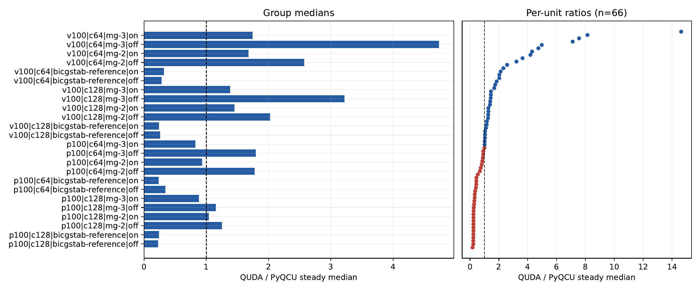

| 设备 | 精度 | solver | trace | 样本 | median | min | max |
|---|---|---|---:|---:|---:|---:|---:|
| V100 | c64 | BiCGStab | off | 3 | 0.2818 | 0.2355 | 0.3288 |
| V100 | c64 | BiCGStab | on | 3 | 0.3213 | 0.1766 | 0.4102 |
| V100 | c64 | MG-2 | off | 3 | 2.5717 | 1.3999 | 7.1161 |
| V100 | c64 | MG-2 | on | 3 | 1.6785 | 1.0387 | 3.6403 |
| V100 | c64 | MG-3 | off | 3 | 4.7366 | 2.0284 | 8.1391 |
| V100 | c64 | MG-3 | on | 3 | 1.7444 | 1.2602 | 4.1878 |
| V100 | c128 | BiCGStab | off | 3 | 0.2580 | 0.2463 | 0.3573 |
| V100 | c128 | BiCGStab | on | 3 | 0.2397 | 0.2242 | 0.2998 |
| V100 | c128 | MG-2 | off | 3 | 2.0269 | 0.5401 | 7.5586 |
| V100 | c128 | MG-2 | on | 3 | 1.4515 | 1.0124 | 4.9719 |
| V100 | c128 | MG-3 | off | 3 | 3.2174 | 1.8447 | 14.6340 |
| V100 | c128 | MG-3 | on | 3 | 1.3822 | 0.9966 | 4.2991 |
| P100x2 | c64 | BiCGStab | off | 2 | 0.3416 | 0.2403 | 0.4429 |
| P100x2 | c64 | BiCGStab | on | 2 | 0.2368 | 0.2333 | 0.2404 |
| P100x2 | c64 | MG-2 | off | 2 | 1.7773 | 1.4305 | 2.1241 |
| P100x2 | c64 | MG-2 | on | 2 | 0.9341 | 0.8531 | 1.0150 |
| P100x2 | c64 | MG-3 | off | 2 | 1.7944 | 1.2758 | 2.3130 |
| P100x2 | c64 | MG-3 | on | 2 | 0.8282 | 0.7456 | 0.9107 |
| P100x2 | c128 | BiCGStab | off | 3 | 0.2284 | 0.2244 | 0.4334 |
| P100x2 | c128 | BiCGStab | on | 3 | 0.2400 | 0.2386 | 0.4383 |
| P100x2 | c128 | MG-2 | off | 3 | 1.2502 | 1.0349 | 1.2725 |
| P100x2 | c128 | MG-2 | on | 3 | 1.0420 | 0.8120 | 1.1716 |
| P100x2 | c128 | MG-3 | off | 3 | 1.1517 | 1.1061 | 1.4436 |
| P100x2 | c128 | MG-3 | on | 3 | 0.8843 | 0.6831 | 0.9181 |

关键结论：

| 集合 | 结果 |
|---|---|
| 全部 66 个精确单元 | 整体中位 `R=1.0250` |
| MG-2/3 全部 trace 模式 | `35/44` 有利 |
| MG-2/3 正式 trace-off | `21/22` 有利 |
| BiCGStab reference | `0/22` 有利，QUDA 全部更快 |
| V100 c64 MG-3 trace-off | 分组中位 `4.7366` |
| V100 c128 MG-3 trace-off | 分组中位 `3.2174` |
| 双 P100 MG-2/3 trace-off | 中位均大于 1 |
| trace-on 双 P100 部分分组 | 退到 1 以下 |

逐单元分布如下。实心符号为 trace-off，空心符号为 trace-on。极值只是单点，不是置信区间。

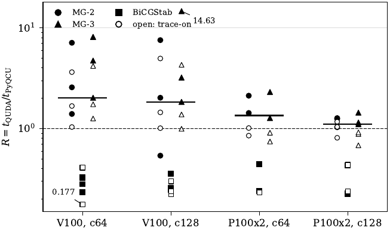

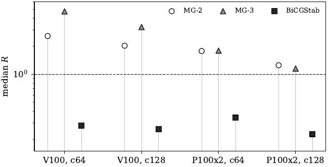

### 15.2 逐单元视图

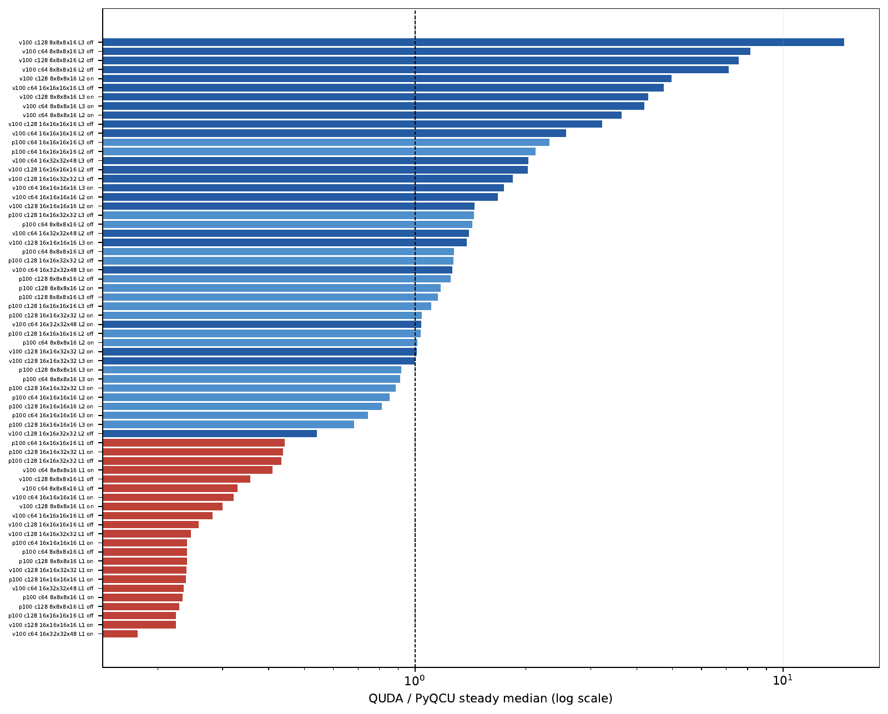

V100 的优势最明显，但 c128 MG-2 存在单点 `R=0.54`，c128 MG-3 存在单点 `R=14.63`。这证明结果对格点体积和 Krylov 轨迹敏感，不能只引用最大值。

### 15.3 结论措辞

可以主张：

1. PyQCU Strict MG 在典型 V100 MG 场景中与 QUDA 同量级，且有明显场景优势。
2. 正式 trace-off MG 的 `21/22` 有利支持 MG 专项性能结论。
3. 全部精确结果通过统一真残差门和显存门。

不能主张：

1. PyQCU 全部求解器优于 QUDA。
2. 双 P100 的所有 trace/level 组合都领先。
3. 当前结果可外推到任意 GPU、GPU 图、process grid 或千卡规模。
4. 当前标题中的 Hopper 优化是 Hopper GPU 实测。现有 CUDA 性能证据只覆盖 P100 `sm_60` 和 V100 `sm_70`。

## 16. 阶段归因

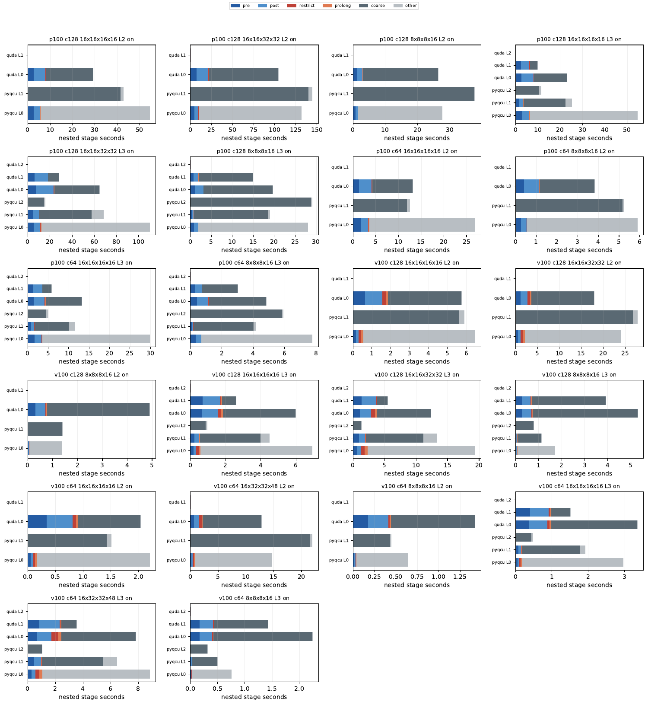

阶段份额中位数为：

| 实现 | pre | post | restrict | prolong | coarse | other |
|---|---:|---:|---:|---:|---:|---:|
| PyQCU | 2.1% | 2.0% | 0.5% | 0.5% | 43.9% | 50.9% |
| QUDA | 10.5% | 17.3% | 1.0% | 0.7% | 69.3% | 0.1% |

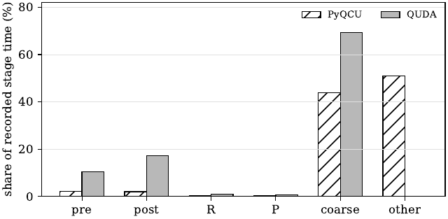

PyQCU 的 coarse solve 加 `other` 约 95%。这里的 `other` 包含 Arnoldi、fine MATPC、解更新、true-residual 刷新和同步；不同实现的层级映射不同，不能把同名阶段直接跨库相加。

trace-on 开销在不同格点上的历史实测包括：

| 配置 | trace-off | trace-on | 比值 |
|---|---:|---:|---:|
| c64 小格 MG-3 PyQCU | `0.043971 s` | `0.125649 s` | 约 `2.86x` |
| 同点 QUDA | `0.505706 s` | `0.560432 s` | 约 `1.11x` |
| c128 大格历史点 PyQCU | `2.065 s` | `3.31-3.43 s` | 约 `1.6x` |

因此 trace-on 只能用于归因，正式性能必须使用 trace-off。

## 17. 显存、残差与容量边界

### 17.1 峰值显存

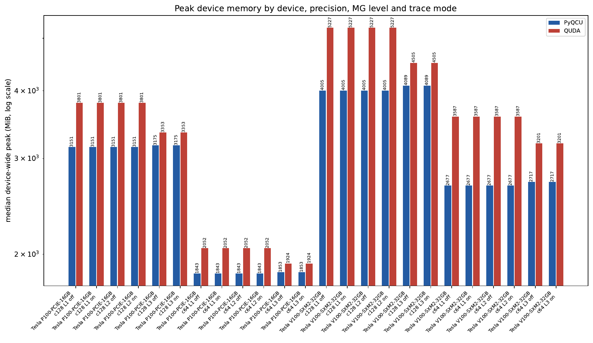

| 侧 | 设备/精度 | 样本 | median MiB | max MiB |
|---|---|---:|---:|---:|
| PyQCU | P100/c64 | 12 | 1852.9 | 2134.9 |
| PyQCU | P100/c128 | 18 | 3150.9 | 7308.9 |
| PyQCU | V100/c64 | 18 | 2677.3 | 11907.3 |
| PyQCU | V100/c128 | 18 | 4005.3 | 9575.3 |
| QUDA | P100/c64 | 12 | 1934.9 | 2628.9 |
| QUDA | P100/c128 | 18 | 3800.9 | 11082.9 |
| QUDA | V100/c64 | 18 | 3587.3 | 23063.3 |
| QUDA | V100/c128 | 18 | 5227.3 | 15739.3 |

该表是 device-wide sampler，不声明为进程独占峰值。

### 17.2 残差

| 侧 | 样本 | median | max |
|---|---:|---:|---:|
| PyQCU | 66 | `1.85e-8` | `7.40e-7` |
| QUDA | 66 | `1.89e-8` | `7.97e-7` |

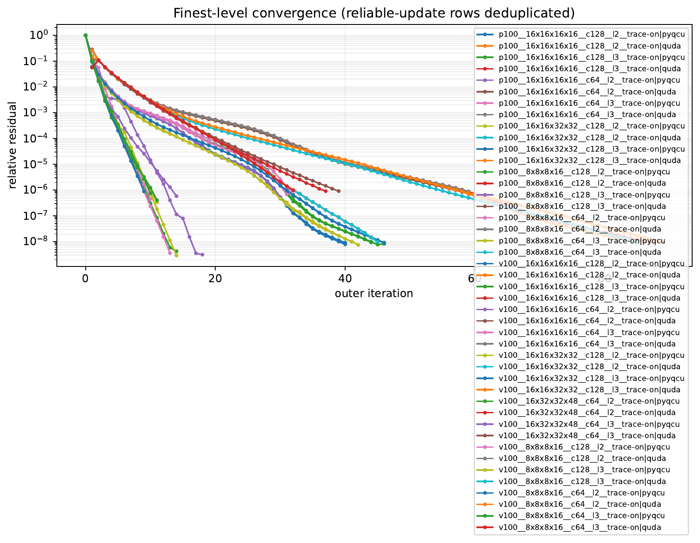

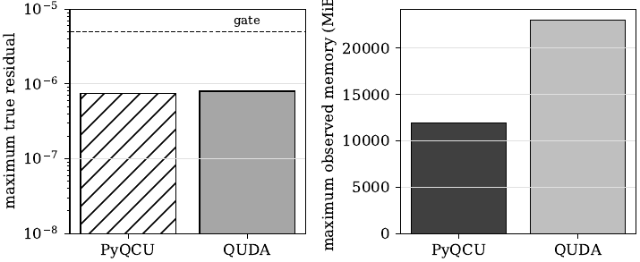

PyQCU 的曲线主要是 FGMRES Arnoldi least-squares estimate，QUDA 的曲线是 GCR iterated residual。两条曲线用于观察趋势，最终通过性只由独立 full-operator true residual 判定。

### 17.3 容量替代

6 个未进入精确矩阵的请求均为双 P100 c64 `16x32x32x48`：

| 请求 | 替代 | 原因 |
|---|---|---|
| L1 trace-off | `16^4` c64 L1 trace-off | 显存或时限 |
| L1 trace-on | `16^4` c64 L1 trace-on | 显存或时限 |
| L2 trace-off | `16^4` c64 L2 trace-off | 显存或时限 |
| L2 trace-on | `16^4` c64 L2 trace-on | 显存或时限 |
| L3 trace-off | `16^4` c64 L3 trace-off | 显存或时限 |
| L3 trace-on | `16^4` c64 L3 trace-on | 显存或时限 |

三次尝试结果：

| 路径 | 峰值 | 设备占比 | 结果 |
|---|---:|---:|---|
| 默认 overlap | 约 `15.9 GiB` | 93.1% | 超过 85% 门 |
| `PYQCU_MPI_OVERLAP=0` | 约 `14.8 GiB` | 86.2% | 超过 85% 门 |
| extended CPU staging | 约 `12.4 GiB` | 72.4% | MG-2 setup 超过 570 s |

替代结果只用于容量趋势，不能与原请求混入公平加速比。

## 18. 限制与下一步

### 18.1 当前限制

| 限制 | 证据与影响 |
|---|---|
| 总中位仅 `1.0250` | 整体优势较弱 |
| BiCGStab `0/22` | 非 MG 路径明显落后 |
| trace-on 有同步开销 | 双 P100 部分分组退化 |
| P100 c64 大格被替代 | setup 时限和显存超门 |
| c128 overlap 默认关闭 | 修改浮点顺序导致迭代轨迹敏感 |
| link halo 仍阻塞 | 只有 pointer identity 缓存 |
| 多 rank true-residual refresh 未启用 | 当前可靠更新能力有限 |
| c128 输入多为 c64 canonical asset | 不是完整 complex128 HDF5 链路 |
| 证据集中 V100 和双 P100 | 不能外推千卡或任意拓扑 |

### 18.2 优化优先级

1. 继续降低 coarse solve、全局归约和 true-residual 检查的同步成本。
2. 评估 persistent request、device-aware MPI 和可选 NVSHMEM。
3. 降低 setup 峰值显存，使 P100 c64 大格进入精确矩阵。
4. 对 c128 重新设计不破坏递推稳定性的 overlap 或 reproducible reduction。
5. 扩展 mixed-coarse precision，但必须先完成同精度性能对照。
6. 把当前协议扩展到更多 process grid 和更大 MPI 规模。

---

## 19. 统一演进时间线

| 日期 | 里程碑 | 当时结论 | 当前处置 |
|---|---|---|---|
| 2025-08-29 | DCU 4 卡、64-1024 进程应用测试 | BiCGStab 大规模强/弱扩展 | 历史能力证据，不与 `test27` 混算 |
| 2026-08-14 | 多线程多卡竞争修复、构建加速和早期 Pareto 分析 | 修复跨线程共享、构建约 `2.8x` | 工程历史，保留反模式 |
| 2026-08-18 | init 到 `stab27` 的变更审计和核心结构分析 | 盘点实现边界和依赖 | 被当前目录结构和 ABI 取代 |
| 2026-08-20 | `24^3x72` MG/BiCGStab 扫描 | 3L 最佳约 `1.107x` | 旧路径，已被后续 Strict 矩阵取代 |
| 2026-08-28 | CUDA/C++ MG 算法族 | MR、Chebyshev、CA-GCR、BiCGStabL、V/W/F/K | 保留为算法分支与历史性能 |
| 2026-08-29 | QUDA MG 复现链 `_1` 到 `_5` | 从 full 到 compact MATPC、多 MPI 拓扑 | 只保留 `_5` 和跨版本差异 |
| 2026-08-30 | 33 点 setup 优化、严格 cold-solve benchmark | 2L 对 1L 无稳定净收益 | 保留关键反例和显存数据 |
| 2026-09-06 | 首次 Strict 大格 QUDA 正式对照 | PyQCU `2.041653 s`，QUDA `2.094841 s` | 时间和 speedup 被 09-09 取代 |
| 2026-09-09 | device-side MR、融合 coarse BiCGStab、消融 | PyQCU `1.966795 s`，speedup `1.065065x` | 历史 Strict 单 rank 最终值 |
| 2026-09-11 | 数值线代、作用量和 MG 审计全文 | 统一数学语义与验证矩阵 | 作为理论参考，不覆盖动态性能 |
| 2026-09-13 | `X/Y/Yhat` 与 storage 专题 | 纠正 backward inverse site 和 PC dslash | 局部代数最终裁决 |
| 2026-09-16 | 分层 trace 和三层早期加速 | 旧 c64 三层 `4.3817x` | 已撤回 |
| 2026-09-17 | aligned 协议、double MG 修复、setup 优化 | c64 三层 `2.0052x` 等 | 历史 aligned 结果，不是最终 66 单元 |
| 2026-09-18 | 分布式 halo、P/R、global FGMRES、分布式 setup | 正确性到舍入水平 | 保留为分布式基础证据 |
| 2026-09-21 | 双 P100 修复、静态 halo cache、全矩阵快照 | `72/72`、MG `36/48` | 旧口径，保留失败优化 |
| 2026-09-27 | nonblocking overlap、c128 回退、600 秒矩阵 | `72/72 exact`、MG `38/48` | A/B 保留，最终覆盖被 09-28 取代 |
| 2026-09-28 | 85% 显存加 570 秒容量感知矩阵 | 66 exact、132 side、6 substitutions | 当前最终性能权威 |

## 20. 早期多线程、多卡与旧 MG 路径

### 20.1 多线程与多卡

早期问题集中在 GIL、CUDA device context 和共享 `params/set_ptrs`：

| 问题 | 修复 |
|---|---|
| Python 线程无法并行进入 C++ | Cython 指针提取后 `with nogil` |
| pxd 缺少 `nogil` 或符号冲突 | 使用 `qcu_api.pxd` 别名并补齐声明 |
| 多线程共享 scratch/index | 每线程克隆 `params/argv/set_ptrs` |
| 构建阶段反复重建 coarse stencil | 每层构建后立即建立下一层 matvec 算子 |
| 逐 probe Python 循环 | batch build 和批量 einsum |

这些改动给出历史构建加速约 `2.8x`，并形成当前一线程一卡约束：

```text
N threads -> N independent GPU contexts
one thread -> one device
one RHS -> not split across those threads
```

### 20.2 `24^3x72` 参数扫描

早期 test15 系列对 `24^3x72` c64 做 18 个 MG 配置扫描。所有版本共用同一组图，最终最有代表性的历史结论为：

| 项目 | 历史结果 |
|---|---|
| 2L speedup 范围 | `0.73-0.84` |
| 3L speedup 范围 | `0.98-1.107` |
| 3L 超过 1 的配置 | `6/9` |
| 最佳单点 | 3L `r30/ct1e3`，约 `1.107x` |
| MG 2L 时间 | 约 `3.5-3.8 s` |
| MG 3L 时间 | 约 `2.53-2.86 s` |
| L1 参考 | `2.808 s` |
| BiCGStab 参考 | `3.197 s` |
| cold 显存预算 | 约 `22 GB` |

该路径后来被奇偶 Schur、full coarse、33 点 stencil 和 Strict full-coarse 取代。早期曲线只用于说明“更多 V-cycle 不等于稳定收益”，不作为当前性能。

## 21. 2026-08-28 至 08-30：算法族、复现链和严格基准

### 21.1 2026-08-28 CUDA/C++ 算法分支

历史测试格点为 `16x32x32x48`，`m=0.05`、`atol=1e-6`、fine c64、block `(2,2,2,2)`。

| 分支 | 时间 | history | 解差 | true residual |
|---|---:|---:|---:|---:|
| Chebyshev | `1.442 s` | 17 | `8.57e-6` | `6.59e-7` |
| CA-GCR(s=4) | `24.262 s` | 26 | `1.87e-6` | `7.34e-7` |
| BiCGStabL(L=2) | `3.105 s` | 58 | `4.85e-6` | `8.02e-7` |
| mixed c64 -> c128 | `5.375 s` | 86 | `5.14e-6` | `7.54e-7` |

小格 `8^3x16` 三层 W/F/K 分别为 `0.229/0.253/0.205 s`。这些结果证明分支闭环，不证明大格三层性能。CA-GCR 的 `24.262 s` 更不能作为通信规避收益。

Chebyshev 历史谱估计采用保守启发式：

$$
\hat\rho=\frac{\| Ar\|}{\| r\|},
\qquad
\lambda_{\max}=8\hat\rho,
\qquad
\lambda_{\min}=0.05\lambda_{\max}.
$$

该估计不是严格谱包络证明。CA-GCR 使用四阶块和两遍 MGS，坏块回退 FGMRES；BiCGStabL 固定 `L=2`，每 8 个 block 做 reliable update。

### 21.2 2026-08-29 修订链

08-29 的五个后缀版本是累积修订，不是五份独立结论：

| 版本 | 新增内容 | 替代关系 |
|---|---|---|
| 基础 | CPU `4^4`、c64 小格、2 rank 闭环 | 初始 |
| `_2` | 2/4 rank 与多拓扑 full MG | 第 72 次结束替换为第 71 次收敛 |
| `_3` | null-vector setup 与五类 setup solver | 扩展测试到 21 |
| `_4` | compact MATPC、odd Schur | 替代旧 full 框架 |
| `_5` | 单 rank CUDA production 回归 | 当日最终版 |

08-29 基础等价性：

| 检查 | 结果 |
|---|---:|
| projection | `2.32e-7` |
| restriction/prolongation | `4.70e-7` |
| Galerkin | `6.14e-7` |
| preconditioned operator | `3.71e-8` |
| normal operator | `0` |

compact 代数：

| 检查 | 结果 |
|---|---:|
| compact `RP` | `1.67e-7` |
| transfer adjoint | `6.76e-9` |
| compact block Gram | `4.34e-7` |
| `R S_o P` Galerkin | `7.81e-8` |
| Schur strict adjoint | `5.45e-9` |
| reconstruct | `2.18e-8` |
| MG full residual | `1.02e-7` |
| direct Schur residual | `1.12e-7` |

单 rank CUDA 历史点：

| 格点 / levels | 时间 | full residual | 与参考解差 |
|---|---:|---:|---:|
| `8x8x8x16` 2L | `0.159 s` | `6.88e-7` | `1.72e-5` |
| `8x16x16x16` 2L | `0.234 s` | `2.41e-7` | `2.40e-6` |
| `8x16x16x16` 3L | `0.694 s` | `3.23e-7` | `4.36e-6` |

历史 speedup `2.369x/2.005x/0.455x` 的相对基准是裸 C++ BiStabCG，不是优化后的 1L。

### 21.3 2026-08-30 33 点 stencil 和严格基准

33 点 Schur coarse operator 的 support 为：

```text
1 onsite
8 signed axis neighbors
24 two-axis diagonal neighbors
= 33 coupling positions
```

33 是位置数，不是自由度数。每个位置保存一个 `E x E` dense block。

布局为：

```text
sit:      [E,E,X,Y,Z,T]
hop_nn:   [2,4,E,E,X,Y,Z,T]
hop_diag: [2,2,6,E,E,X,Y,Z,T]
```

父层 `l` 的指针槽为 `30+4l` 到 `30+4l+3`。

历史正确性结果：

| 检查 | 结果 |
|---|---:|
| batch setup | `0.155 -> 0.122 s`，约 `1.266x` |
| streaming 与 materialized Schur | max difference `0` |
| K=1 与 K=4 stencil | max difference `0` |
| 2/4 rank parity round-trip | max/relative `0` |
| 2 rank c64 coarse equivalence | `5.60e-7` |
| 2 rank c128 coarse equivalence | `1.03e-15` |
| 2 rank fine c64、coarse c128 MG | `7.69e-7` |
| Python 回归 | `26 passed` |

严格 cold-solve benchmark 在 V100、`8x8x8x16` 上做了三次中位数：

| 配置 | wall | backend solve | iter | residual | peak / delta |
|---|---:|---:|---:|---:|---:|
| 1L | `0.114211 s` | `0.111100 s` | 92 | `4.36e-7` | `2839 / +679 MiB` |
| 2L-MR/V | `0.120011 s` | `0.108655 s` | 84 | `5.42e-7` | `2840 / +679 MiB` |
| 3L-CG/F | `0.131453 s` | `0.127905 s` | 64 | `4.88e-7` | `2888 / +727 MiB` |

相对 1L：

| 比较 | 结果 |
|---|---:|
| 2L backend solve | `1.023x` |
| 2L 同步 wall | `0.952x` |
| 3L 同步 wall | `0.869x` |

大格 `16x32x32x48`：

| 配置 | wall | iter | residual | peak |
|---|---:|---:|---:|---:|
| BiStabCG | `1.95-1.97 s` | 参考 | 未列 | `5470 MiB` |
| 1L | `1.408-1.428 s` | 84 | `3.96e-7` | `8304 MiB` |
| 2L | `1.424-1.580 s` | 68 | `6.55e-7` | `9628 MiB` |

两点估计的 2L/1L 约 `0.944x`。2L 比 1L 多约 `1324 MiB` peak。

`16^4` 三层在默认、`restart=10/ctf=1e5` 和再加 `cmi=15` 三种配置下均跑满 1000 次并产生 NaN。该阶段不能讨论三层性能。

若使用 mixed precision：

| 路径 | 时间 |
|---|---:|
| c64 -> c128 | `0.6601 s` |
| c128 -> c64 | `0.8654 s` |
| 同精度 c64 | `0.1272 s` |

跨精度约慢 `5.2x/6.8x`。deflate 的 `0.09211 s` 对应 true residual `5.97e-6`，未达到 `1e-6`；warm start 的 `0.006795 s` 是已有近似解，不是 cold solve。

## 22. 2026-09-06 至 09-13：Strict 正式对照与代数纠正

### 22.1 09-06 与 09-09

固定协议为 V100、`16x32x32x48`、c64、2 levels、block `(2,2,2,2)`、`n_v=12`、coarse spin 2、`E=24`、target parity 1、2 warmup 加 5 steady。requested restart 16 受 512 MiB workspace 限制，effective restart 为 4。

| 版本 | PyQCU median | QUDA median | speedup | PyQCU iter | QUDA iter |
|---|---:|---:|---:|---:|---:|
| 09-06 | `2.041653 s` | `2.094841 s` | `1.026051x` | 11 | 37 |
| 09-09 | `1.966795 s` | `2.094764 s` | `1.065065x` | 11 | 37 |

09-09 是 09-06 的直接替代版。09-09 单次外层迭代为：

| 实现 | ms/outer |
|---|---:|
| PyQCU | `178.800` |
| QUDA | `56.615` |

true residual：

| 侧 | max true residual |
|---|---:|
| PyQCU | `3.6013e-7` |
| QUDA | `7.3030e-7` |

09-09 阶段中位数：

| 阶段 | ms | outer 比例 |
|---|---:|---:|
| coarse V-cycle | `158.184` | 88.78% |
| coarsest BiCGStab | `151.301` | 85.07% |
| fine restriction | `3.307` | 1.86% |
| fine pre-smoother | `2.974` | 1.67% |
| fine post-smoother | `2.829` | 1.59% |
| true residual refresh | `3.175` | 1.76% |

09-09 CUDA 消融保留原始绝对时间：

| 配置 | 时间 |
|---|---:|
| coarse hopping block 128 | `2.020994 s` |
| coarse hopping block 256 | `1.926614 s` |
| V100 native `sm_70` | `1.964751 s` |
| barrier-elision | `1.964744 s` |

block 256 保留为当时最优；native sm70 和 barrier-elision 没有稳定收益，后者已回退。原文对百分比基线的描述不够一致，因此本文只引用绝对秒数，不重新构造百分比。

### 22.2 09-13 纠正

09-13 专门纠正粗层 `X/Y/Yhat` 的 storage 和矩阵顺序：

| 旧写法或理解 | 最终裁决 |
|---|---|
| backward `Yhat` 右乘 storage 点 `X^-dagger` | 错误，应右乘目标点 `q` 的 `X^-dagger` |
| PC dslash 还显式乘 onsite `X` | 错误，PC dslash 只做 `Yhat` hopping，`clover=false` |
| 粗层继续读取 fine Clover/Gauge | 错误，后续层使用当前层 `X_l/Y_l` |
| `Yhat` 与 raw `Y` 可互换递归 | 错误，coarse-PC 下一层 coarsen 的是 `Yhat` |

该专题没有运行完整 GPU 逐元素回归，因此只裁决局部代数，不替代全局 solver 实测。

## 23. 2026-09-16 至 09-17：撤回、double MG 与 setup

### 23.1 撤回 `4.3817x`

09-16 报告的 c64 大格三层 `4.3817x` 被撤回。原因是 PyQCU 每个外层迭代执行一次递归 V-cycle，而旧 QUDA 配置在中间层执行多轮内层迭代，收敛预算不对齐。

09-17 重新构建 QUDA，使 `QUDA_PRECISION=12` 同时提供 c64/c128，并开启 `QUDA_MULTIGRID_DOUBLE`。为保证 double coarse MG 可运行，还修复了：

| 修复 | 原因 |
|---|---|
| mixed precision gauge accessor 构造目标 complex 类型 | 类型转换错误 |
| double coarse-link atomic accumulation 使用 double 存储 | 旧路径把 double 字段按 int fixed-point 解释，导致 NaN/norm abort |
| c64 保留 deterministic fixed-point | 避免性能和行为回归 |
| aligned 与 library 两套 QUDA 策略分离 | 防止不同预算混算 |

aligned 统一为：

```text
one outer iteration -> one recursive V-cycle
MR smoother
smoother_tol=0
non-coarsest coarse_solver_maxiter=1
coarsest maxiter=200
```

历史 aligned 单点：

| 点 | PyQCU | QUDA | 比值 | 外迭代 |
|---|---:|---:|---:|---:|
| c64 大格 3L sm70 | `0.655570 s` | `1.314577 s` | `2.0052x` | 14/39 |
| c128 `16^3x16` 3L | `0.380444 s` | `1.230048 s` | `3.2332x` | 44/87 |
| c128 小格 3L | 未列 | 未列 | `12.3768x` | 未列 |
| c128 大格 cache-hit | `2.061594 s` | `16.166481 s` | `7.8417x` | 20/60 |

这些是 09-17 历史点，不是 09-28 的 66 单元最终矩阵。

### 23.2 Setup 优化

原始 colored Galerkin 在 Python 内逐 source、逐 support 点构造 canonical block。优化后：

| 版本 | c128 小格 setup |
|---|---:|
| K=1 Python 逐点 | `44.86 s` |
| K=4 批量 gather/scatter | `16.67 s` |
| 进一步优化 | `14.66 s` |

parity 分桶把大格 `8x16x16x24` 的 source color groups 从 22 降到 16，每层 colored operator calls 从 132 降到 96。大格 c128 C=4/K=16 冷 setup 从约 `974 s` 降到 `585.28 s`，低于同点 QUDA setup `630.74 s`。

C=1 release-before-runtime 冷 setup 为 `2709.45 s`，发布约 `8.89 GB` runtime cache。所有 setup 数字只属于 setup 研究，不进入 solve speedup。

## 24. 2026-09-18 至 09-27：分布式实现、overlap 和失败优化

### 24.1 分布式正确性

09-18 将 Strict 从本地周期算子和本地 dot 补齐为：

| 模块 | 实现 |
|---|---|
| fine/compact/full vector halo | face exchange |
| P/R coarse halo | coarse link 和 output boundary |
| fused FGMRES | global dot、dot pair、dot many |
| Galerkin setup | global roll 加 halo 化 fine operator |

正确性：

| 测试 | c64 | c128 |
|---|---:|---:|
| full coarse operator relative error | `1.6e-7` | `3.0e-16` |
| compact coarse operator relative error | `2.2e-8` | `7.1e-19` |
| 2/4 rank setup internal/boundary | 0 | 0 |
| distributed solve true residual | `<1e-6` | `<1e-6` |

分布式 FGMRES 缺陷修复后，restart 20 的 true relative residual 从 `1.9e-2` 降到 `6.7e-7`，外层迭代从异常状态恢复到 17。

### 24.2 双 P100 根因修复

两个确定性错误已修复：

| 根因 | 修复 |
|---|---|
| C++ 强制 `cudaSetDevice(0)`，rank 1 传入 GPU1 指针 | 使用 `PYQCU_MPI_DEVICE_ID` 或 local rank |
| 1D/2D face pack 对向上取整线程数无上界保护 | 十个 pack kernel 在索引解码前检查 |

修复后原失败命令返回 0，compute-sanitizer memcheck 为 0 errors。

### 24.3 静态 link-halo cache

preconditioned link 在一次 hierarchy 生命周期内不变。按 pointer identity 和 `(parity,dim)` 缓存后：

| 变体 | steady median | MAD | iter | max residual | 相对时间 |
|---|---:|---:|---:|---:|---:|
| cache off | `1.9549 s` | `0.0215 s` | 9 | `7.3721e-7` | 1.000 |
| cache on | `1.0093 s` | `0.0187 s` | 9 | `7.5174e-7` | 0.516 |

该 A/B 使用同一 binary、输入和协议，比值约 `1.937x`。

### 24.4 09-21 全矩阵快照

09-21 当时完成 144 个 side case，72 个 combined 全部 `fair=true`：

| 集合 | median R | wins | losses |
|---|---:|---:|---:|
| MG-2/3 全体 | `1.298` | 36/48 | 12/48 |
| V100 MG-2/3 | `2.492` | 23/24 | 1/24 |
| P100 MG-2/3 | `1.063` | 13/24 | 11/24 |
| BiCGStab reference | `0.243` | 0/24 | 24/24 |

两张历史分布图：

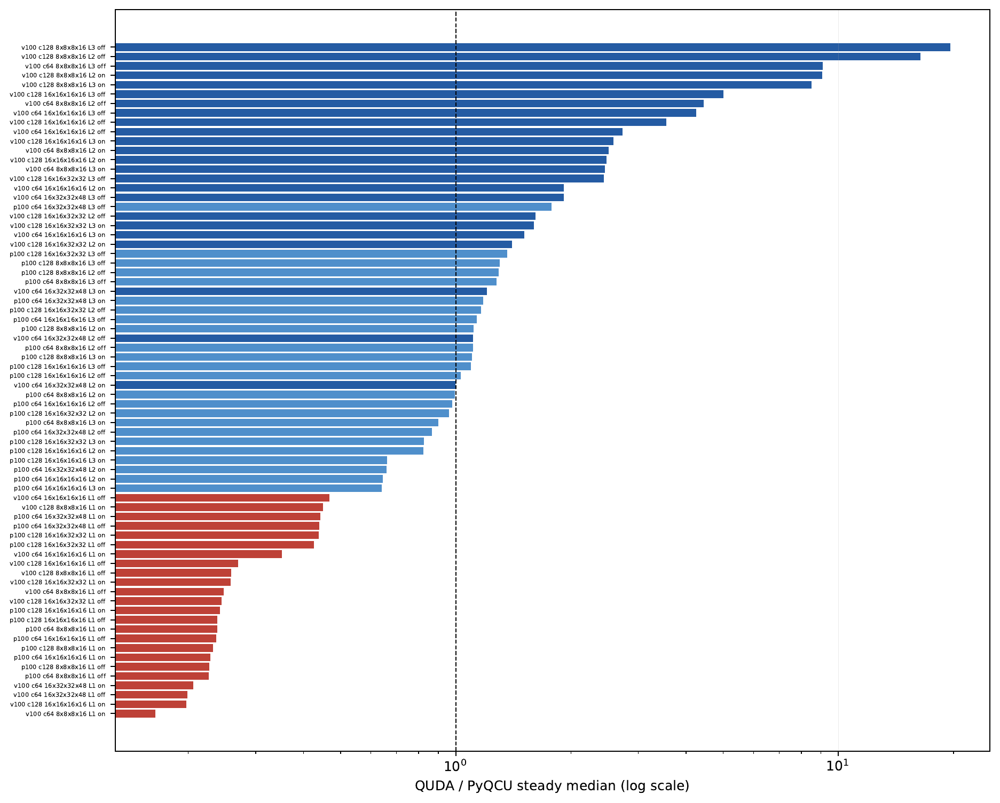

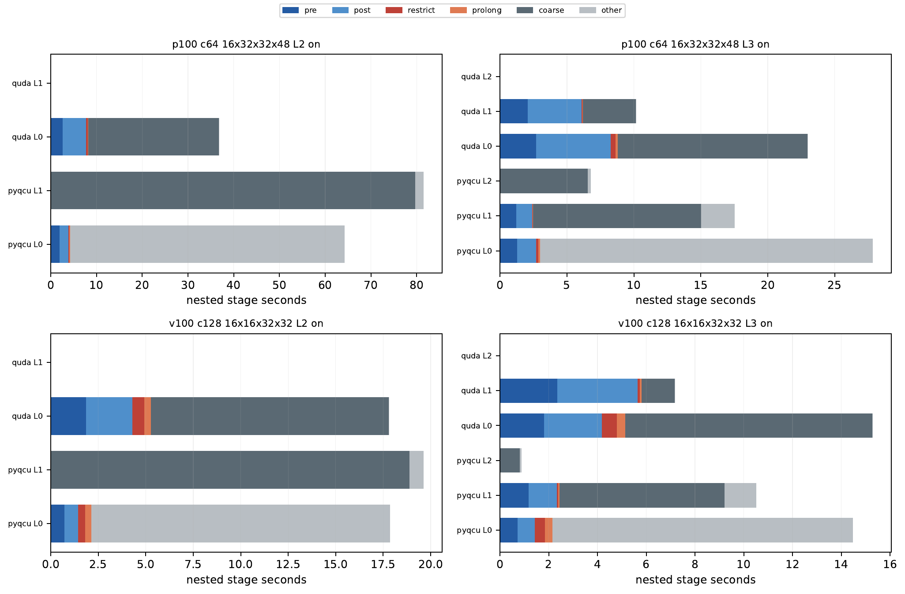



09-21 还记录两条失败优化：

| 实验 | 现象 | 处置 |
|---|---|---|
| triple-dot 合并三个内积 | 大格 c64 FGMRES 外残差长期停在 `1e-3` | 回退 |
| pipelined BiCGStab 延迟 `rho` | 同样停滞，coarse residual 仍约 0.2 | 回退 |

这两个实验说明 reduction reorder 会改变 coarse BiCGStab 递推稳定性，不能只以“减少同步次数”验收。

### 24.5 09-27 nonblocking overlap

独立双 rank 正确性 probe 为双 P100、`8^3x16`、c64、`grid=2x1x1x1`：

| 路径 | 外迭代 | true residual |
|---|---:|---:|
| `PYQCU_MPI_OVERLAP=0` | 27 | `6.4314e-7` |
| `PYQCU_MPI_OVERLAP=1` | 26 | `7.5194e-7` |

大格 c64 MG-2 A/B 使用 coarse-tol `0.3`、`nu=1`、两组反向顺序：

| 路径 | median | MAD | iter median | max residual |
|---|---:|---:|---:|---:|
| off | `4.6544 s` | `0.2816 s` | 15 | `7.83e-7` |
| on | `4.3374 s` | `0.1838 s` | 16 | `7.91e-7` |

运行中位时间的改善为 `6.81%`。

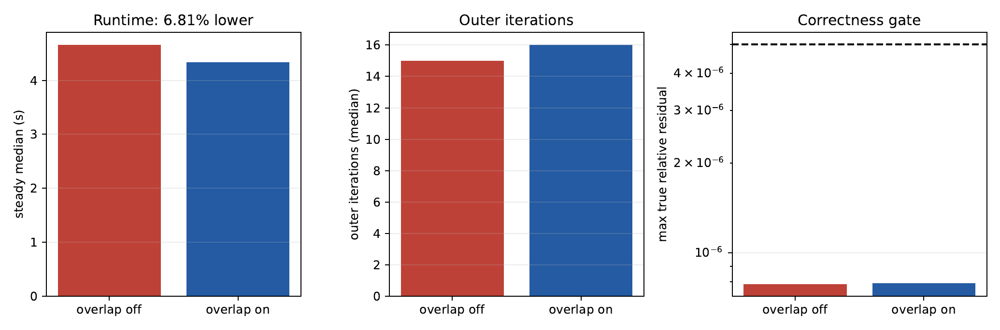

c128 大格三层 A/B：

| 路径 | 外迭代 | steady | true residual |
|---|---:|---:|---:|
| 原顺序 / overlap off | 32 | `5.10 s` | `7.55e-7` |
| overlap 实验开启 | 451 | `46.28 s` | `7.61e-7` |

因此 c128 默认关闭 overlap。该结论由当前源码的 `PYQCU_STRICT_OVERLAP_C128` 默认 `false` 支撑。

09-27 的 `72/72 exact`、MG `38/48` 和中位 `1.346` 是旧容量口径。09-28 使用更严格的 85% 显存和 570 秒门限后，正式口径改为 66 exact、132 side、6 substitutions。09-27 overlap A/B 仍可引用，但不能替代最终矩阵。

## 25. 2025-08-29 DCU 历史应用测试

### 25.1 环境与范围

| 项目 | 配置 |
|---|---|
| 处理器 | Hygon C86 7185 32-core |
| 内存 | `8 x 16 GB DDR4 2666 MHz` |
| 网络 | 200 Gb |
| 加速卡 | 4 张 Pre-Wukong DCU |
| 存储 | ParaStor 300 |
| OS | RHEL 7.4，kernel 3.10 |
| MPI | HPC-X 2.4.0 |
| UCX | 1.6.0 |
| 调度 | Gridview 4.6 |

嵌入 Excel 和环境记录与正文名义配置并不完全一致：实际登录节点记录显示 Hygon C86 OPN `7580B`、`2 sockets x 96 cores = 192 CPUs`、12 NUMA nodes、`MemTotal≈500.8 GiB`，并出现 ROCm/HIP、`gfx936`、`sghpc-mpi-gcc-mlnx/25.6` 等路径。该差异说明名义平台表和最终实机环境不能静默合并。复现应以 `lscpu`、`meminfo`、模块列表和原始作业脚本为准。

测试对象是历史上的 Wilson BiCGStab 和 Clover BiCGStab 传播子求解。该时期的 MG 仍是前期验证版本。表内线程数表示 MPI rank/线程规模，不表示 1024 张 GPU。

固定参数：

| 参数 | 值 |
|---|---:|
| mass | `0.05` |
| `tol(x_o)` | `1e-12` |
| `_BLOCK_SIZE_` | 256 |
| 源 | 面源 |
| 最终检查 | 重建另一半解后的 full residual |

### 25.2 关键历史结论

论文资产中的 508 缩放图为：

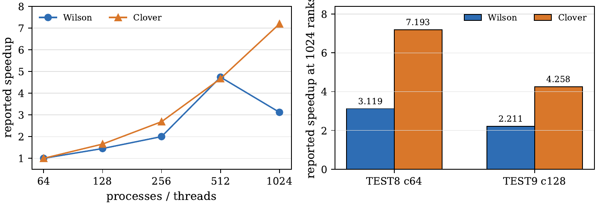

该图对应早期 DCU 4 卡环境，报告 TEST8 c64 大格从 64 到 1024 进程时 Wilson 加速约 `3.119x`、Clover 约 `7.193x`；另一个 c128 系列给出 Wilson `2.211x`、Clover `4.258x`。不同表的基准和总格点不同，不能把 `7.193x` 与 `4.258x` 当成同一分母的连续曲线。

历史结论：

| 结论 | 解释 |
|---|---|
| c64 Wilson 强扩展在 16 线程附近达到约 `7.582x` | 继续到 32 线程回落到 `7.102x` |
| c64 Clover 在 32 线程表内显示 `12.599x`，但该行 NaN | 该单点不能作为可靠结果 |
| c128 在 1024 进程时 Wilson 约 `2.211x`、Clover 约 `4.258x` | 大格强扩展仍需结合通信和内存解释 |
| 弱扩展总体良好 | 通信逐步成为主导 |
| 显存约按 rank 线性复制 | 多 rank 没有减少全量准备资产 |

按原始耗时重算后，结论必须更精确：TEST8 c64 Wilson 在 np512 附近效率约 61.5%，到 np1024 降至约 20.8%；Clover 在 np1024 约 51.4%。TEST9 c128 的 Wilson/Clover 在 np1024 分别约 28.5%/60.7%。弱扩展较好的区间也存在，但高并发和跨节点通信会使 Wilson 路径明显衰减。

TEST6 c64 np32 的 Clover 行在 999 次迭代后出现 NaN，必须从性能统计中剔除并保留为失败证据。c64 个别点最终残差平方约 `1e-11`，高于正文名义 `tol(x_o)=1e-12`，不能宣称通过该声明门。每项基本只有一次运行，证据强度低于当前 `1 cold + 2 warmup + 5 steady` 协议。

### 25.3 原始数据图表

以下图片来自解包的 Office 文档，保留用于历史审计。多数是不同测试表格的截图，不重新解释为当前 Strict-MG 性能。


### 25.4 适用边界

508 报告证明的是早期 DCU 上 Wilson/Clover BiCGStab 的传播子求解规模、强扩展和弱扩展趋势。它不能证明：

1. 当前 Strict-MG 已在 1024 DCU 上限完成端到端扩展；
2. Pre-Wukong DCU 的性能可外推到现代 NVIDIA/DCU；
3. 1024 MPI rank 等于 1024 个独立 GPU 的聚合峰值；
4. 早期 MG 前期验证版本与 `test27` 的 QUDA 对照可以直接比较。

---

## 26. 图表总览与解释边界

### 26.1 当前权威图

| 图 | 解释 |
|---|---|
| `report_chart_assets/overlap_matrix.png` | 22 个分组和 66 个精确单元的 QUDA/PyQCU 比值 |
| `report_chart_assets/mg_speedup_units.png` | 66 单元逐点分布 |
| `report_chart_assets/mg_stage_breakdown.png` | trace-on 嵌套阶段时间 |
| `report_chart_assets/mg_peak_memory.png` | device-wide 显存中位 |
| `report_chart_assets/mg_finest_residual.png` | full-operator finest residual 与外层迭代 |
| `paper_assets/fig_ratio_distribution.png` | trace on/off 合并分布的论文版 |
| `paper_assets/fig_group_medians.png` | trace-off 分组中位 |
| `paper_assets/fig_stage_shares.png` | 阶段份额，不跨实现直接相加 |
| `paper_assets/fig_residual_memory.png` | 残差与显存 |
| `paper_assets/fig_508_scaling.png` | 2025 DCU 历史缩放 |

对应矢量 PDF 保留在 `High-Performance_Implementation_MG_assets/paper_assets/` 与 `report_chart_assets/`。正文使用 PNG 是为了兼容不直接渲染 PDF 的 Markdown 预览器。

### 26.2 历史性能图

09-21 的最细层残差总览：

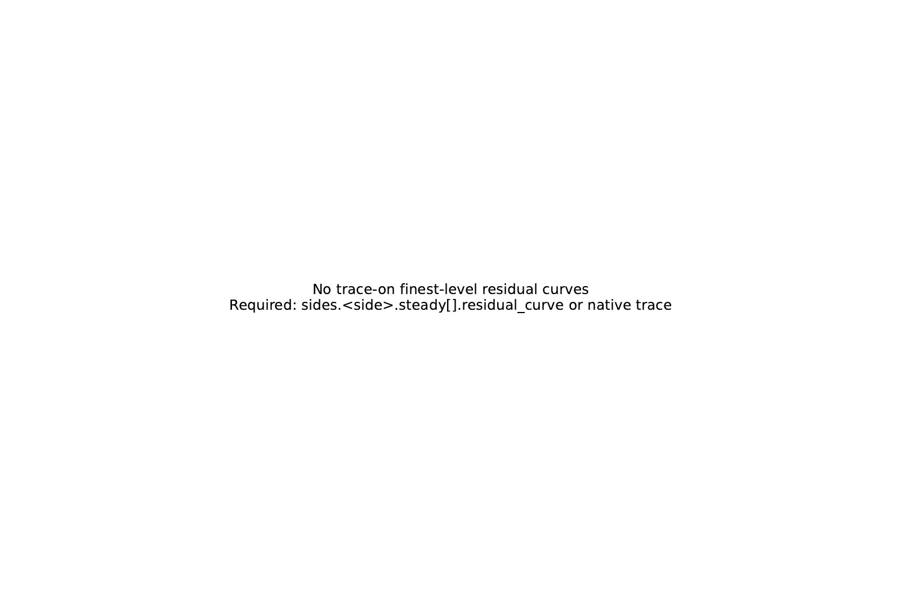

09-21 的完整残差曲线。原图较高，适合放大查看。

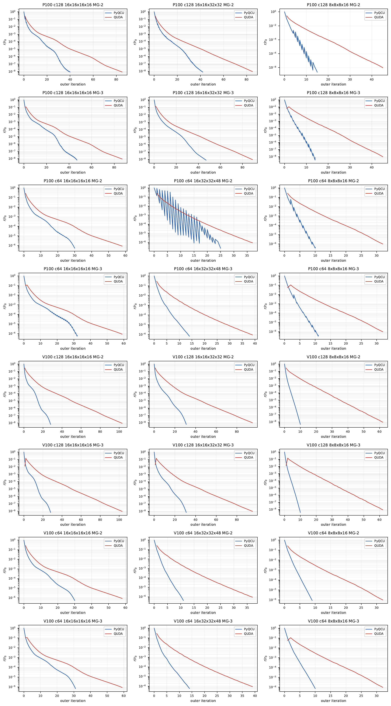

09-27 最终协议逐单元比值：

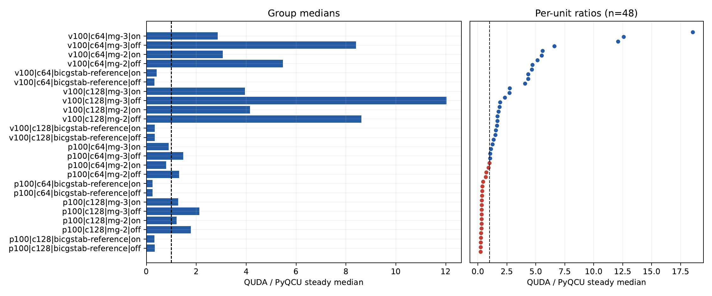

09-27 的 `mg_level_time_stack.pdf` 是约 27:1 的超宽逐层时间图，不适合缩入单页预览。矢量原件在 `data/report_multigrid_optimized_20260927/final_protocol/report/`，正文保留源路径和结构化阶段表。

### 26.3 算法图

BiCGStab 单列算法图：

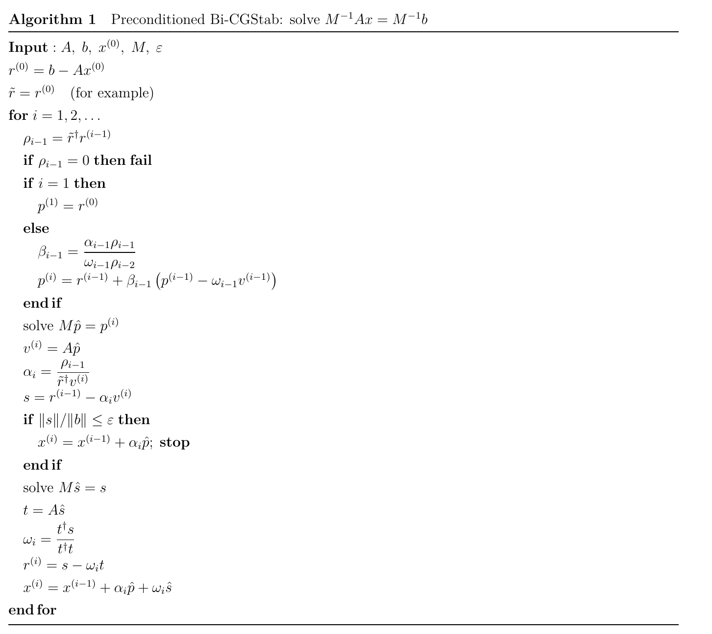

V-cycle 与 FGMRES 嵌套关系：

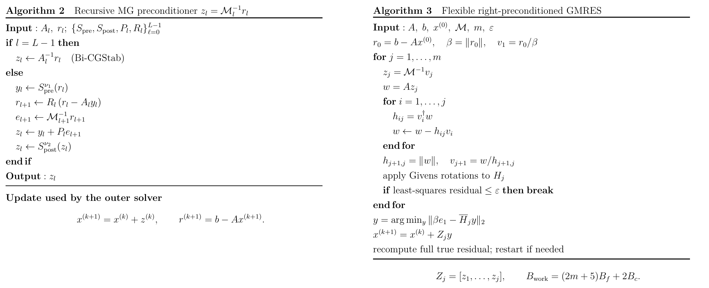

### 26.4 已舍弃的重复图

以下图不进入正文：

| 类型 | 原因 |
|---|---|
| `mg_report_smoke/partial/final/final2/one/traced/v100_c128` 同组 PDF | 同一自动绘图器的阶段版本，最终图已覆盖 |
| `mg_matrix_final_report` 与 `mg_matrix_final_report_audit_20260927` 重复项 | 后者是被 09-28 最终论文图覆盖的旧矩阵图 |
| `paper_render*`、`beamer_render*`、`presentation_render*` | 可由 TeX 和主图重建的逐页 PNG |
| contact sheet | 只用于人工检查，不承载独立数值 |
| 相同 24³ 图组的六份路径替换副本 | 只有 `_5/final` 代表版保留 |
| 09-06 和 09-09 中相同 residual 曲线的重复截图 | 09-09 保留，09-06 只留来源记录 |

## 27. 复现与验证

### 27.1 构建

```bash
source ./env.sh
bash ./build.sh
bash ./install.sh
```

### 27.2 Strict 快速门禁

```bash
RUNNER=pyqcu/testing/qcu/strict/quda_comparison
python -B "${RUNNER}/run_strict_fast.py" \
  --fail-fast --json strict-fast.json
```

### 27.3 双 rank 真残差 probe

```bash
mpirun -np 2 python -B \
  pyqcu/testing/qcu/strict/quda_comparison/strict_mpi_solve_probe.py \
  --shape 8 8 8 16 \
  --grid 2 1 1 1 \
  --dtype c64 \
  --galerkin-mode colored
```

### 27.4 最终矩阵

```bash
python -B \
  pyqcu/testing/qcu/strict/quda_comparison/bench_mg_matrix_full.py \
  --list
```

正式入口：

| 功能 | 入口 |
|---|---|
| 矩阵编排 | `bench_mg_matrix_full.py` |
| 单侧记录 | `bench_strict_vs_quda.py` |
| 合并审计 | `assemble_final_matrix.py` |
| 图表生成 | `build_mg_report.py` |
| 两 rank solve probe | `strict_mpi_solve_probe.py` |
| 两 rank primitive probe | `strict_mpi_primitive_probe.py` |
| 两 rank setup probe | `strict_mpi_setup_probe.py` |

### 27.5 验收矩阵

#### 算子级

| 编号 | 检查 | 通过条件 |
|---|---|---|
| O1 | 自由场 Dslash | Python、QCU、参考实现一致 |
| O2 | gamma5 Hermiticity | 相对误差处于 dtype 舍入量级 |
| O3 | Clover onsite | 布局、dagger、批量 inverse 一致 |
| O4 | parity round-trip | full -> parity -> full 不变 |
| O5 | Schur reconstruct | full residual 与直接 apply 一致 |
| O6 | transfer | `||RP-I||` 与局部正交可记录 |
| O7 | Galerkin | 逐列、batch、colored 等价 |
| O8 | strict support | 非最近邻 support fail-closed |

#### Solver 级

| 编号 | 场景 | 必须记录 |
|---|---|---|
| S1 | 零 RHS | 返回零解，无 NaN |
| S2 | 已知解 | 与 `x*` 的误差 |
| S3 | breakdown | 分母为零或非有限时返回明确状态 |
| S4 | 递推与 true residual | 周期刷新前后比值 |
| S5 | 变化预条件器 | FGMRES 右预条件语义 |
| S6 | warm start | `x0=0` 与 warm 分开 |
| S7 | mixed precision | 低精度推进和 full residual 刷新 |
| S8 | MPI | rank 变化后的全局范数和可解释漂移 |

#### MG 级

```text
1. 固定 gauge、seed 和 null vectors
2. 保存 layout、dtype、block、nvec、parity、边界和版本
3. 构造 native、legacy/compact、strict hierarchy
4. 检查 RP、局部正交、X inverse 和 support
5. 对同一 full rhs 运行一次 V-cycle
6. 独立计算 full true residual 和误差传播因子
7. 运行外层 solver，记录 setup、solve、通信和显存
```

### 27.6 最小运行记录

```text
commit/tag:
lattice:
boundary:
action:
layout:
dtype:
solver:
mg levels / block / nvec / smoother / coarse solver:
rhs / x0:
stop:
runtime GPU / MPI ranks / threads:
setup / solve / communication / memory:
iterations / residual history / status:
```

缺少这些字段时，可以描述算法，但不能声称两个结果严格可比。

## 28. 冲突裁决表

| 冲突 | 旧内容 | 当前裁决 |
|---|---|---|
| `params` 长度 | 早期文档写 54 | 当前源码和 define 为 58 |
| MG mode | 只写 GCR bit | 当前为兼容 bit mask，新增 MR、Chebyshev、CA-GCR、W/F/K、BiCGStab(l) |
| Strict 单 rank/多 rank | 09-11 静态说明偏向单 rank | 09-18 和当前源码已有分布式 halo、global dot、P/R halo 和 setup |
| Strict asset 递归对象 | raw `Y` | coarse-PC 下一层 coarsen `Yhat` |
| backward `Yhat` | storage 点乘 `X^-dagger` | 目标点 `q` 的 `X^-dagger` |
| PC dslash onsite | 再乘 `X` | 只做 `Yhat` hopping，`clover=false` |
| c64 三层 `4.3817x` | 09-16 正式值 | 预算未对齐，正式撤回 |
| 09-17 `2.0052x` | c64 大格 aligned 单点 | 历史点，不进入最终 66 单元 |
| 09-17 c128 大格 `7.8417x` | cache-hit 单点 | 当前最终 c128 格点改为 `16x16x32x32`，旧值只作历史 |
| `72/72 exact` | 09-27 600 秒口径 | 09-28 改为 66 exact、6 substitutions |
| MG `38/48`、中位 `1.346` | 09-27 | 09-28 为 MG `35/44`、总体 `1.0250` |
| `36/48`、`2.492`、`1.063` | 09-21 | 已被 09-27/09-28 取代 |
| coarse-tol `0.3` | 快速 A/B | 最终 c64 `0.003`、c128 `3e-5` |
| c128 gate | 历史 `5e-8` | 09-28 当前统一门为 `5e-6`，不得宣称当前结果通过 `5e-8` |
| c64/c128 overlap | 统一启用 | c64 默认启用；c128 默认关闭 |
| trace-on 性能 | 阶段诊断值 | 只用于归因 |
| 24³ legacy 3L `1.107x` | 早期路径 | 不与 Strict 性能比较 |
| 08-30 2L/3L 无净收益 | 早期 33 点路径 | 不等于后续 Strict 无效，也不能反指测量错误 |
| 08-29 速度比 `2.369x/2.005x` | 对裸 BiStabCG | 不能对优化后的 1L 基线 |
| 08-29 收敛次数 | 72 | `_2` 之后为 71 |
| `135 s -> 15 s` 与 `135 s -> 48 s` | 不同批量/多线程口径 | 明确区分，不写成同一基准 |
| 09-28 图注 | “PyQCU/QUDA”反向措辞 | 以公式 `R=QUDA/PyQCU`、表头、坐标轴为准 |
| Hopper | 标题中的优化主题 | 实测硬件只有 P100/V100，不是 Hopper GPU 结果 |
| DCU 1024 | 线程/rank 数 | 不是 1024 张 GPU 聚合峰值 |

## 29. 来源台账

### 29.1 规范与运行文档

| 文件 | 处置 |
|---|---|
| `AGENTS.md` | 全文吸收项目约束、命令和反模式 |
| `ORGANIZATION.md` | 全文吸收目录分类与迁移规则 |
| `dims.md` | 全文吸收布局和维度约定 |
| `env.md` | 全文吸收依赖和环境 |
| `install.md` | 全文吸收构建流程 |
| `examples.md` | 全文吸收新测试路径 |
| `profiler.md` | 全文吸收 Perfetto 入口 |
| `form-audit-20260928.md` | 只保留组织/审计结论，不作为物理技术正文 |
| `plans/2026-09-16-multigrid-profiling-benchmark.md` | 保留公平协议和验收设计；任务清单已由报告取代 |

### 29.2 当前权威技术文档

| 文件 | 并入章节 |
|---|---|
| `High-Performance Implementation of Multigrid Solver for Lattice QCD.tex/.pdf` | 4 至 18 |
| `report_multigrid_quda_pyqcu_20260928.tex/.pdf` | 14 至 18 |
| `report_multigrid_optimized_20260927.tex/.pdf` | 10、24 |
| `report_multigrid_distributed_20260918.tex/.pdf` | 9 至 11、24 |
| `report_numerical_linear_algebra_lattice_qcd_20260911.md` | 4 至 13、27 |
| `report_multigrid_quda_pyqcu_20260913.tex/.pdf` | 8、22 |

### 29.3 历史阶段文档

| 文件 | 处置 |
|---|---|
| `report_multigrid_quda_pyqcu_20260917.tex/.pdf` | 保留 aligned、double MG、setup 的历史结论 |
| `report_multigrid_quda_pyqcu_20260916.tex/.pdf` | 保留 trace 设计和 `4.3817x` 撤回链 |
| `report_multigrid_final_20260921.tex/.pdf` | 保留首个完整分布式矩阵、失败 reduction 和热点 |
| `report_multigrid_fast_iteration_20260921.tex/.pdf` | 保留设备绑定、pack 越界和 link cache A/B |
| `report_multigrid_quda_pyqcu_20260909.md/.tex/.pdf` | 保留 device-side MR、融合 coarse BiCGStab 和历史单点 |
| `report_multigrid_quda_pyqcu_20260906.md/.tex/.pdf` | 只作为 09-09 前版；其时间、stage 和局部代数被取代 |
| `report_quda_multigrid_reproduction_20260830.tex/.pdf` | 合并 08-29 五版和 33 点 setup |
| `report_pyqcu_mg_operator_construction_20260830.tex/.pdf` | 保留 Python 构造、C++ 应用边界和 33 点布局 |
| `report_pyqcu_multigrid_cuda_20260828.tex/.pdf` | 保留算法族和早期实现 |
| `data/mg-bench-current-20260830/report.md` | 保留严格 cold-solve 反例和粗层同步热点 |

### 29.4 早期分析文档

| 文件 | 处置 |
|---|---|
| `analy_all_20260814_3.tex/.pdf` | 作为 08-14 最终版；v1/v2 只保留为前版 |
| `analy_pyqcu_20260818.tex/.pdf` | 结构、依赖、生命周期 |
| `pure_pyqcu_20260818.tex/.pdf` | 核心算子、solver、Galerkin 和多线程 |
| `pure_mg_20260818.tex/.pdf` | V-cycle 15 步和 5-stream |
| `diff_init_stab27_20260818.md/.tex/.pdf` | 历史变更统计，只有规模背景 |
| `analy_test15_5_20260820.tex/.pdf` | `24^3x72` 代表版；前五版为同图组路径替换 |
| `pyqcu_cover_20260818.tex/.pdf`、`pyqcu_report_20260818.pdf` | 合成交付件，不替代源稿 |

### 29.5 自动生成与派生文件

| 目录或模式 | 处置 |
|---|---|
| `data/mg_report_*` | 自动阶段图、表、TeX；只取最终代表图 |
| `data/mg_matrix_final_report*` | 09-21 自动报告；保留历史图 |
| `data/report_multigrid_optimized_20260927/final_protocol/report/*` | 09-27 自动图；只保留 overlap 和阶段来源记录 |
| `High-Performance_Implementation_MG_assets/paper_build/` | 生成 |
| `High-Performance_Implementation_MG_assets/beamer_build/` | 生成 |
| `High-Performance_Implementation_MG_assets/speaker_script_build/` | 生成 |
| `*_render/`、`*_contact_sheet.png`、`slides/` | 生成 |
| `*.aux/.log/.out/.toc/.nav/.snm` | 生成缓存 |

这些文件仍可在工作区中保留为构建资产，但不作为独立事实来源。

## 30. 总体结论

PyQCU 已在以下层面形成完整闭环：

| 层面 | 结论 |
|---|---|
| 物理 | Wilson/Clover、gamma5-Hermiticity、Schur 和 MATPC 语义明确 |
| 数学 | P/R、Galerkin、Strict `X/Y/Yhat`、Krylov 和 true residual 有统一定义 |
| 实现 | Python/Cython/C++/CUDA/MPI 分工明确，ABI 和生命周期有回归约束 |
| 分布式 | fine/compact/full、P/R、global FGMRES 和 setup 已验证到舍入水平 |
| CUDA | c64 overlap、静态 link cache、融合 kernel、cache 和显存预算已落地 |
| 性能 | 最终 66 单元矩阵证明 MG 专项优势，非 MG 求解器仍有明显短板 |
| 风险 | c128 overlap、大格 setup 显存、阻塞 link halo 和多 rank reliable update 尚未解决 |

当前最重要的数字关系是：

```text
66 exact combined units
132 exact side records
6 explicit substitutions
R_all_median = 1.0250
MG-2/3 wins = 35/44
trace-off MG wins = 21/22
BiCGStab wins = 0/22
max residual PyQCU = 7.40e-7
max residual QUDA  = 7.97e-7
```

下一阶段不应继续追求小格或单点加速比，而应解决：

1. coarse solve、global reduction 和 reliable update 的同步成本；
2. setup 显存和 P100 c64 大格容量；
3. c128 overlap 的稳定性和 reproducible reduction；
4. CUDA-aware persistent communication 与更大 MPI 拓扑；
5. mixed precision 和更多作用量的扩展；
6. 与 DCU/NPU 后端一致的端到端验证。

---

## 附录 A. 符号表

| 符号 | 含义 |
|---|---|
| `U_mu(x)` | `SU(3)` 规范链接 |
| `H` | Wilson hopping kernel |
| `D_W` | Wilson Dirac operator |
| `kappa` | hopping parameter，`1/(2m0+8)` |
| `A_p` | onsite block，Clover 时为 `I+C_p` |
| `S_p` | parity Schur complement |
| `V` | aggregate 内 null-space basis |
| `P,R` | prolongation、restriction |
| `X` | coarse onsite dense block |
| `Y` | coarse directional link |
| `Yhat` | preconditioned coarse link |
| `E` | coarse dof，`2*n_v` |
| `nu_pre,nu_post` | 前、后 smoothing 次数 |
| `z_j` | FGMRES 预条件后的方向 |
| `r_true` | `b-Dx` full true residual |
| `R` | 性能时间比 `t_QUDA/t_PyQCU` |

## 附录 B. 算法选择

| 问题 | 选择 |
|---|---|
| SPD 的 `D†D` 或 Hermitian coarse operator | CG、CA-CG、多移位 CG |
| 原始 Wilson/Clover 或 asymmetric Schur | BiCGStab、FGMRES、GCR |
| MG/SAP 内层步数变化 | FGMRES、flexible-GCR |
| 局部高频误差 | MR、Chebyshev、Schwarz/SAP |
| 轻质量近零模 | MG、deflation、thick-restart Lanczos |
| full Clover parity solve | asymmetric/symmetric Schur 加 prepare/reconstruct |
| 宽 stencil action | action-specific coarse operator |
| strict nearest-neighbor X/Y | full Galerkin 且 support 必须 fail-closed |

## 附录 C. 最小文件清单

若只需继续开发，最少应保留：

```text
AGENTS.md
ORGANIZATION.md
dims.md
env.md
install.md
examples.md
profiler.md
report_multigrid_quda_pyqcu_20260928.tex/.pdf
High-Performance Implementation of Multigrid Solver for Lattice QCD.tex/.pdf
report_numerical_linear_algebra_lattice_qcd_20260911.md
report_multigrid_quda_pyqcu_20260913.tex/.pdf
report_multigrid_distributed_20260918.tex/.pdf
report_multigrid_optimized_20260927.tex/.pdf
High-Performance_Implementation_MG_assets/paper_assets/
High-Performance_Implementation_MG_assets/report_chart_assets/
张鑫 508应用测试报告-PyQCU/
```

其余历史修订、重复图和构建日志通过 Git 历史、数据目录和来源台账回溯，不必在单篇正文中重复展开。

---

# 附录 D. 完整公式与算法汇编

本附录用于防止公式、推导和算法在总册中被压缩成名称列表。内容按物理对象、线性代数、MG、分布式实现、缓存、性能和 508 历史算法分层。不同路径的归一化、storage 和停止条件分别标明。

## D.1 连续 QCD、格点截断与物理目标

连续欧氏 QCD 拉氏量写为

$$
\mathcal L_{\mathrm{QCD}}
=
\bar\psi_i\left(i\gamma_\mu D^\mu_{ij}-m\delta_{ij}\right)\psi_j
-\frac14F^a_{\mu\nu}F^{a}_{\mu\nu},
$$

其中 `D_mu = partial_mu - i g A_mu^a T^a`，`T^a` 为颜色生成元。格点方法将连续时空替换为

$$
x_\mu=n_\mu a,\qquad n_\mu=0,\ldots,L_\mu-1.
$$

格距和有限体积分别提供紫外、红外截断：

$$
\Lambda_{\mathrm{UV}}\sim\frac{\pi}{a},
\qquad
\Lambda_{\mathrm{IR}}\sim\frac{2\pi}{L}.
$$

### D.1.1 准 PDF

沿 `z` 方向、核子动量 `P_z` 的准 PDF 定义为

$$
\widetilde f(x,P_z,1/a)
=
\int\frac{dz}{4\pi}e^{ixzP_z}
\left\langle P\left|
\bar\psi(z)\gamma_t U(z,0)\psi(0)
\right|P\right\rangle,
$$

其中 `U(z,0)` 是规范链接。有限 `a` 计算得到 quasi-PDF，再通过大动量/连续极限外推。MG/BiCGStab 的任务是得到该矩阵元所需的夸克传播子，不直接完成匹配核或重整化。

### D.1.2 两点关联函数与 Wick 收缩

介子两点函数可写为

$$
C_2(t,t_0)=
\left\langle
\bar\psi(x,t)\Gamma\psi(x,t)
\bar\psi(y,t_0)\Gamma'\psi(y,t_0)
\right\rangle.
$$

对单 flavor 费米子做 Wick 收缩后，代表性项为

$$
C_2(t,t_0)
=-\gamma_5 S_q(x,y)\gamma_5 S_q(y,x),
$$

其中

$$
S_q=D_q^{-1}
$$

是 quark propagator。求解传播子等价于对多个 right-hand side 反复求解 `D_q x=b`。

## D.2 格点规范场、plaquette 与作用量

### D.2.1 规范链接

`U_mu(x) in SU(3)` 连接 `x` 与 `x+mu_hat`。协变平移为

$$
T_{+\mu}\psi(x)=U_\mu(x)\psi(x+\hat\mu),
\qquad
T_{-\mu}\psi(x)=U_\mu^\dagger(x-\hat\mu)\psi(x-\hat\mu).
$$

局部规范变换为

$$
U_\mu(x)\to G(x)U_\mu(x)G^\dagger(x+\hat\mu),
\qquad
\psi(x)\to G(x)\psi(x).
$$

协变性要求

$$
D[U^G]\psi^G=G\,D[U]\psi.
$$

### D.2.2 Plaquette 与 Clover 场强

有向 plaquette 为

$$
P_{\mu\nu}(x)=
U_\mu(x)U_\nu(x+\hat\mu)
U^\dagger_\mu(x+\hat\nu)U^\dagger_\nu(x).
$$

四叶 Clover 和为

$$
Q_{\mu\nu}
=P_{\mu\nu}+P_{\nu,-\mu}+P_{-\mu,-\nu}+P_{-\nu,\mu}.
$$

反 Hermitian 场强项为

$$
C_{\mu\nu}=Q_{\mu\nu}-Q^\dagger_{\mu\nu}.
$$

代码常用形式可写为

$$
\sigma_{\mu\nu}F_{\mu\nu}
=
2\gamma_\mu\gamma_\nu
\frac14\sum_P\frac12(P-P^\dagger),
$$

其中的 gamma 和 plaquette 顺序必须与源码 convention 一致。

### D.2.3 Wilson hopping kernel

取 `r=1`：

$$
(H\psi)_x=
\sum_{\mu=0}^3
\left[
(1-\gamma_\mu)U_{\mu,x}\psi_{x+\hat\mu}
+(1+\gamma_\mu)U^\dagger_{\mu,x-\hat\mu}\psi_{x-\hat\mu}
\right].
$$

算子与作用量：

$$
D_W=(m_0+4)I-\frac12H,
\qquad
S_W=\sum_x\bar\psi_xD_W\psi_x.
$$

hopping 参数：

$$
\kappa=\frac{1}{2m_0+8},
\qquad
\frac{1}{2\kappa}=m_0+4.
$$

另一种等价形式：

$$
D_W=\frac{1}{2\kappa}(I-\kappa H).
$$

预条件归一化：

$$
D_{\mathrm{pc}}=I-\frac{\kappa}{u_0}H,
\qquad
D_W=(m_0+4)D_{\mathrm{pc}}.
$$

当前 C++ 生产路径使用 `u0=1`。原始 Dslash 接口返回 `H`，不能把 `I-kappa H` 和 `H` 在同一比较中混用。

### D.2.4 Clover onsite block

Clover 项可写为

$$
D_C=D_W+c_{\mathrm{SW}}\frac{i}{4}
\sum_{\mu<\nu}\sigma_{\mu\nu}F_{\mu\nu},
\qquad
\sigma_{\mu\nu}=\frac12[\gamma_\mu,\gamma_\nu].
$$

实现归一化：

$$
T_p=-\frac{\kappa c_{\mathrm{sw}}}{8u_0}
\sum_{\mu<\nu}\gamma_\mu\gamma_\nu C_{\mu\nu},
\qquad
A_p=I_p+T_p.
$$

当前有效 `c_sw=1`。Clover 项只增加 onsite block，不改变 hopping support。

## D.3 Wilson/Clover 的谱、极限与误差

自由场 `U=1` 时，Fourier 模满足

$$
D_W(p)=M(p)I+i\sum_\mu\gamma_\mu\sin p_\mu,
$$

其中

$$
M(p)=m_0+\sum_\mu(1-\cos p_\mu).
$$

因此

$$
D_W^\dagger(p)D_W(p)
=
\left[
M(p)^2+\sum_\mu\sin^2p_\mu
\right]I.
$$

该式给出三项回归：

| 模 | 检查 |
|---|---|
| `p=0` | 质量项 `M(0)=m0` |
| `p->-p` | gamma 项符号反对称 |
| `p_mu≈pi` | Wilson 项抬高 doubler |

Wilson/Clover 满足

$$
D^\dagger=\gamma_5D\gamma_5.
$$

因此 `gamma5*D` 可作为 Hermitian 相关算子，但 `D` 本身不是 Hermitian。

离散误差至少包含

$$
e_{\mathrm{total}}
\lesssim
e_{\mathrm{discrete}}
+e_{\mathrm{setup}}
+e_{\mathrm{alg}}
+e_{\mathrm{round}}
+e_{\mathrm{comm}}.
$$

减小 solver tolerance 只控制 `e_alg`，不能修复 gamma、Clover 或 gauge link 约定。

## D.4 奇偶 Schur、MATPC 与重建

### D.4.1 Full block system

按 parity 排列：

$$
D=
\begin{pmatrix}
A_p&D_{pq}\\
D_{qp}&A_q
\end{pmatrix},
\qquad
b=
\begin{pmatrix}
b_p\\
b_q
\end{pmatrix}.
$$

Schur complement：

$$
S_p=A_p-D_{pq}A_q^{-1}D_{qp}.
$$

若 `D=A-kappa H`，则

$$
S_p=A_p-\kappa^2H_{pq}A_q^{-1}H_{qp}.
$$

对称归一化 MATPC：

$$
M_p=A_p^{-1}S_p
=I-\kappa^2A_p^{-1}H_{pq}A_q^{-1}H_{qp}.
$$

### D.4.2 Prepare 与 reconstruct

通用 `D` block 写法：

$$
b_p^{\mathrm{prep}}
=A_p^{-1}\left(b_p-D_{pq}A_q^{-1}b_q\right),
$$

$$
x_q=A_q^{-1}(b_q-D_{qp}x_p).
$$

若使用 `D=A-kappa H`，符号写成

$$
b_p^{PC}
=A_p^{-1}\left(b_p+\kappa H_{pq}A_q^{-1}b_q\right),
$$

$$
x_q=A_q^{-1}\left(b_q+\kappa H_{qp}x_p\right).
$$

两种写法只差 off-diagonal 符号和 kappa 是否被吸收。

### D.4.3 Schur 求解算法

```text
Algorithm D.1: parity Schur solve
Input:
  full b=(b_p,b_q)
  onsite blocks A_p, A_q
  off-diagonal hopping D_pq, D_qp
  tolerance tau and full residual gate eta

1. solve A_q y_q = b_q
2. b_p^S = b_p - D_pq y_q
3. solve S_p x_p = b_p^S with selected Krylov method
4. reconstruct x_q = A_q^{-1}(b_q - D_qp x_p)
5. form x=(x_p,x_q)
6. compute r_true=b-D x
7. accept only if
      ||r_true||/||b|| <= eta
8. return x, r_true, iterations, breakdown status
```

### D.4.4 残差审计恒等式

若

$$
r=b-Dx,
$$

则精确解满足

$$
x=D^{-1}b.
$$

残差和误差满足

$$
\frac{\| x-x_\star\|}{\| x_\star\|}
\le
\kappa_2(D)
\frac{\| r\|}{\| b\|},
$$

因此残差小不总是等价于误差小，尤其条件数很大时。Schur residual、Arnoldi estimate 和 GCR iterated residual 均为不同量，必须由 full `r_true` 最终验收。

## D.5 Krylov 方法完整递推

### D.5.1 CG

适用条件是 `A` Hermitian positive definite。

```text
Algorithm D.2: preconditioned CG
Input: A, b, x0, preconditioner M^-1, tolerance tau
r0 = b - A x0
z0 = M^-1 r0
p0 = z0
rho0 = <r0,z0>
for k = 0,1,...:
    v = A p_k
    denom = <p_k,v>
    if denom <= 0 or nonfinite(denom): BREAKDOWN
    alpha = rho_k / denom
    x_{k+1} = x_k + alpha p_k
    r_{k+1} = r_k - alpha v
    if ||r_{k+1}|| <= tau ||b||:
        r_true = b - A x_{k+1}
        return if r_true gate passes
    z_{k+1} = M^-1 r_{k+1}
    rho_{k+1} = <r_{k+1},z_{k+1}>
    beta = rho_{k+1} / rho_k
    p_{k+1} = z_{k+1} + beta p_k
    rho_k = rho_{k+1}
```

对 `D^dagger D` 使用 CG 时，系统条件数从 `kappa_2(D)` 变为 `kappa_2(D)^2`。这可以避免非 SPD 问题，却可能显著增加迭代。

### D.5.2 多移位 CG

同时求解

$$
(A+\sigma_jI)x^{(j)}=b,\qquad j=0,\ldots,J-1.
$$

当前源码要求 `shifts` 严格升序，最低移位 `sigma_0` 为主链。一次主链 matvec 被所有移位共享，其余链按照 Jegerlehner/QUDA 的 `zeta/alpha` 递推同步下降。

```text
Algorithm D.3: PyQCU multi-shift CG
Input:
  A, b
  strictly increasing shifts sigma_0 < ... < sigma_{J-1}
  x_j = 0 for all shifts
r = b
p_0 = r
zeta_j = zeta_old_j = 1
beta_j = 0
alpha_j = 1
active_j = true
r2 = <r,r>

for k = 0,1,...:
    Ap = A p_0
    Ap = Ap + sigma_0 p_0
    pAp = <p_0,Ap>
    if nonfinite(pAp) or |pAp| <= floor: BREAKDOWN

    alpha_old_0 = alpha_0
    alpha_0 = r2 / pAp

    for j = 1,...,J-1:
        if not active_j: continue
        c0 = zeta_j*zeta_old_j*alpha_old_0
        c1 = alpha_0*beta_0*(zeta_old_j-zeta_j)
        c2 = zeta_old_j*alpha_old_0*
             (1+(sigma_j-sigma_0)*alpha_0)
        zeta_old_j = zeta_j
        denom = c1+c2
        zeta_j = c0/denom                 # guard zero/nonfinite
        alpha_j = alpha_0*zeta_j/zeta_old_j

    r2_old = r2
    r = r-alpha_0*Ap
    r2 = <r,r>
    beta_0 = r2/r2_old

    x_0 = x_0+alpha_0*p_0
    p_0 = r+beta_0*p_0

    for j = 1,...,J-1:
        if not active_j: continue
        beta_j = beta_0*zeta_j*alpha_j/
                 (zeta_old_j*alpha_0)
        x_j = x_j+alpha_j*p_j
        p_j = zeta_j*r+beta_j*p_j
        estimate_j = zeta_j*zeta_j*r2
        if estimate_j < stop_j:
            active_j = false
```

源码实现还有两项关键保护：

1. `zeta` 若非有限或超过 `1e15`，该移位冻结，避免 c64 精度地板下递推爆炸。
2. 主链的 `sigma_0 p_0` 直接折叠进共享的 `Ap`，主残差 `r` 因而保持与 (A+sigma0)x 对应；源码明确禁止周期性 `r` 替换，因为会破坏 CG 共轭性。

适用条件：基准算子 `A` Hermitian positive definite，移位为标量 `sigma_j I`。源码锚点为 `pyqcu/solver/_multishift_cg.py`。

### D.5.3 BiCG

BiCG 同时维护 `A` 和 `A^dagger` 的 Krylov sequence：

```text
Algorithm D.4: BiCG
r = b - A x
r_tilde = shadow residual
p = r
p_tilde = r_tilde
for k = 0,1,...:
    rho = <r_tilde,r>
    if rho = 0 or nonfinite: BREAKDOWN
    v = A p
    denom = <p_tilde,v>
    if denom = 0 or nonfinite: BREAKDOWN
    alpha = rho/denom
    x = x + alpha p
    r_new = r - alpha v
    r_tilde_new = r_tilde - alpha A^dagger p_tilde
    rho_new = <r_tilde_new,r_new>
    beta = rho_new/rho
    p = r_new + beta p
    p_tilde = r_tilde_new + beta p_tilde
    r = r_new
    r_tilde = r_tilde_new
```

其内存较低，但需要额外 dagger matvec，且 shadow breakdown 可能在非正规矩阵上发生。

### D.5.4 CGS

CGS 去掉显式 shadow vector，并让 residual polynomial 以平方形式递推：

```text
Algorithm D.5: preconditioned CGS
r = b - A x
r_tilde = choose_shadow(r)
rho_old = 1; u = 0; p = 0; q = 0
for k = 0,1,...:
    rho = <r_tilde,r>
    if rho == 0 or nonfinite: BREAKDOWN
    if k == 0:
        u = r
        p = u
    else:
        beta = rho/rho_old
        u = r + beta q
        p = u + beta(q + beta p)
    p_hat = M^-1 p
    v = A p_hat
    denom = <r_tilde,v>
    if denom == 0 or nonfinite: BREAKDOWN
    alpha = rho/denom
    q = u - alpha v
    u_hat = M^-1 (u+q)
    x = x + alpha u_hat
    r = r - alpha A u_hat
    rho_old = rho
```

该递推减少 shadow storage，但 residual polynomial 的平方会放大非正规矩阵上的舍入误差。

### D.5.5 BiCGStab

```text
Algorithm D.6: BiCGStab with guarded scalars
Input:
  A, b, explicit x0
  tolerance tau, max_iter, reliable_period
r = b - A x0
r_shadow = copy(r)
p = 0
v = 0
rho_old = alpha = omega = 1

for k = 0,1,...,max_iter-1:
    rho = <r_shadow,r>
    if nonfinite(rho) or |rho| <= breakdown_floor: BREAKDOWN
    beta = (rho/rho_old) * (alpha/omega)
    p = r + beta*(p - omega*v)

    v = A p

    denom = <r_shadow,v>
    if nonfinite(denom) or |denom| <= breakdown_floor: BREAKDOWN
    alpha = rho/denom
    s = r - alpha*v

    if ||s|| <= tau ||b||:
        x = x + alpha*p
        r_true = b - A x
        if true_residual_gate(r_true): return x

    t = A s
    tt = <t,t>
    if nonfinite(tt) or real(tt) <= breakdown_floor: BREAKDOWN
    omega = <t,s>/tt
    if nonfinite(omega) or |omega| <= breakdown_floor: BREAKDOWN

    x = x + alpha*p + omega*s
    r = s - omega*t

    if reliable_update_due(k,reliable_period):
        r = b - A x

    if ||r|| <= tau ||b||:
        r_true = b - A x
        if true_residual_gate(r_true): return x

    rho_old = rho
```

`breakdown_floor` 必须结合 dtype、向量范数和全局归约精度设置，不能用一个与格点规模无关的常数。

### D.5.6 Arnoldi、GMRES 与 FGMRES

Arnoldi 关系：

$$
AV_m=V_{m+1}\bar H_m,
\qquad
\bar H_m\in\mathbb C^{(m+1)\times m}.
$$

MGS 一步：

$$
w=Av_j,
$$

$$
h_{ij}=\langle v_i,w\rangle,
\qquad
w\leftarrow w-h_{ij}v_i,\quad i=0,\ldots,j,
$$

$$
h_{j+1,j}=\| w\|,
\qquad
v_{j+1}=w/h_{j+1,j}.
$$

```text
Algorithm D.7: right-preconditioned FGMRES(m)
Input: A, b, x0, varying preconditioner M_j^-1, tolerance tau
r0 = b - A x0
beta = ||r0||
if beta == 0: return x0
v0 = r0/beta
g = (beta,0,...,0)^T

for j = 0,1,...,m-1:
    z_j = M_j^-1 v_j
    w = A z_j
    for i = 0,...,j:
        H[i,j] = <v_i,w>
        w = w - H[i,j] v_i
    H[j+1,j] = ||w||
    if H[j+1,j] != 0:
        v_{j+1} = w/H[j+1,j]
    apply_previous_givens(H[:,j])
    choose_givens(H[j,j],H[j+1,j])
    update_givens_rhs(g)
    if |g[j+1]| <= restart_tol:
        break

y = solve_upper_triangular(H[0:j,0:j],g[0:j])
x = x0 + sum_i y_i z_i
r_true = b - A x
if true_residual_gate(r_true): return x
else restart with r_true
```

若 `M_j` 变化，必须保存 `z_j`。不能用普通 GMRES 只保存 `v_j` 后按固定线性预条件器累加。

### D.5.7 GCR

预条件 GCR 的方向同时满足对 residual 的 `A`-inner-product 正交关系。简化算法：

```text
Algorithm D.8: preconditioned GCR
r = b - A x
for k = 0,1,...:
    z = M^-1 r
    v = A z
    for i = 0,...,k-1:
        beta_i = <v,v_i>/<v_i,v_i>
        z = z - beta_i z_i
        v = v - beta_i v_i
    denom = <v,v>
    if denom <= floor: BREAKDOWN
    alpha = <r,v>/denom
    x = x + alpha z
    r = r - alpha v
    z_k = z
    v_k = v
    if true_residual_gate(r): return x
```

历史 memory 随方向数增长，需 restart 或 block 化。

### D.5.8 CA-CG 与 CA-GCR

通信规避思想是以 `s` 步 Krylov basis

$$
\mathcal B_s(A,r)=\{r,Ar,\ldots,A^sr\}
$$

一次形成多个方向，再通过 block inner product 和小系统求解更新：

```text
Algorithm D.9: s-step CA-CG/CA-GCR skeleton
Input: A, r, block size s
1. form B_k = [r, A r, ..., A^s r]
2. local block orthogonalization / QR: B_k = Q_k R_k
3. compute all required block inner products in one reduction
4. solve small s x s least-squares/Hessenberg system
5. update x and r with Q_k coefficients
6. reliable-update full residual
7. reset Q_k when block conditioning or residual drift exceeds gate
```

优点是一次 global sync 摊销多个方向；风险是局部 block 条件数、失正交和 reduced precision。CA-GCR 不是无条件快路径。

### D.5.9 Lanczos 与 thick restart

Hermitian `H` 上的 Lanczos：

$$
Hq_j=\beta_{j-1}q_{j-1}+\alpha_jq_j+\beta_jq_{j+1}.
$$

三对角矩阵 `T_m` 的特征值给出 Ritz 值，Ritz vector 为

$$
y^{(i)}=Q_my_i.
$$

Ritz true residual 为

$$
r_i=Hy^{(i)}-\theta_iy^{(i)}.
$$

thick restart 时保留若干个 Ritz vectors，把新起始向量与其正交化，再继续 Lanczos。验收必须同时报告 `||r_i||`，不能只报告 Ritz 值。

## D.6 平滑器与局部预条件

### D.6.1 Richardson

$$
x_{k+1}=x_k+\omega(b-Ax_k),
\qquad
r_{k+1}=r_k-\omega Ar_k.
$$

误差传播矩阵为

$$
E_\omega=I-\omega A.
$$

稳定条件由 `A` 的谱决定。`omega` 过大或谱估计错误会放大误差。

### D.6.2 MR 平滑

Strict CUDA MR 先令 `v=A r`，再在方向 `r` 上最小化：

$$
\alpha_k=
\frac{\langle v_k,r_k\rangle}
{\langle v_k,v_k\rangle},
$$

$$
x_{k+1}=x_k+\alpha_kr_k,
\qquad
r_{k+1}=r_k-\alpha_kv_k.
$$

Python 通用 MR 采用：

$$
p_k=A^\dagger r_k,
\qquad
v_k=Ap_k,
$$

$$
\alpha_k=\omega_k
\frac{\langle p_k,p_k\rangle}
{\langle v_k,v_k\rangle},
$$

$$
x_{k+1}=x_k+\alpha_kp_k,
\qquad
r_{k+1}=r_k-\alpha_kv_k.
$$

`omega<=1` 是非负阻尼因子。若分母接近零，两条路径均把步长退化为零或显式报告 breakdown，禁止写入 NaN。

### D.6.3 Chebyshev

给定谱区间 `[lambda_min,lambda_max]`，令

$$
\theta=\frac{\lambda_{\max}+\lambda_{\min}}2,
\qquad
\delta=\frac{\lambda_{\max}-\lambda_{\min}}2.
$$

当前 CUDA smoother 的递推为

$$
\alpha_0=\frac1\theta,
\qquad
\beta_0=0,
$$

$$
p_k^{(new)}=\alpha_kr_k+\beta_kp_k,
$$

$$
x_k^{(new)}=x_k+p_k^{(new)},
\qquad
r_k^{(new)}=r_k-Ap_k^{(new)}.
$$

下一组系数为

$$
\beta_{k+1}=\left(\frac{\delta\alpha_k}{2}\right)^2,
\qquad
\alpha_{k+1}=\frac1{\theta-\beta_{k+1}}.
$$

历史 CUDA MG 路径采用保守估计

$$
\hat\rho=\frac{\| Ar\|}{\| r\|},
\qquad
\lambda_{\max}=8\hat\rho,
\qquad
\lambda_{\min}=0.05\lambda_{\max},
$$

若递推分母非正或系数非有限，源码回退到 damped Richardson 系数 `alpha=0.8/lambda_max`、`beta=0`。这不是严格谱包络证明；谱估计错误会导致过度放大或无效平滑。源码锚点为 `cpp/cuda/qcu/include/lattice_clover_multigrid.h` 的 `chebyshev_bounds`、`mg_cheb_update_p_x` 和 `mg_cheb_update_r`。

### D.6.4 加性 Schwarz

把格点划分为子域 `Omega_i`，加性 Schwarz 预条件为

$$
M^{-1}=
\sum_iR_i^TA_i^{-1}R_i.
$$

乘性 Schwarz 按子域顺序复合

$$
M^{-1}=
I-\prod_i(I-R_i^TA_i^{-1}R_iA).
$$

子域越小，局部求解越便宜，但跨子域耦合越强。重叠越大，平滑质量通常越好，但通信和存储增加。

### D.6.5 SAP

SAP 在 even、odd 或颜色子域之间交替：

```text
Algorithm D.10: two-color SAP smoother
Input: A, b, x
r = b - A x
for color c in {0,1}:
    restrict r and A to subdomain c
    solve local subdomain system approximately
    prolong correction to full field
    update x
    recompute r
return x
```

SAP 更适合最近邻算子和 rank halo；跨 aggregate 耦合仍由 coarse space 处理。

### D.6.6 Smoother 的验收量

对 smoother `S`，每次应用应记录

$$
\rho_S=
\frac{\| S r\|}{\| r\|},
$$

并按 Fourier 或实验高频模检查误差传播。平滑次数太少残留高频，太多会把细层 matvec 成本耗尽。

## D.7 MultiGrid 完整算法

### D.7.1 Null-space basis

在每个 aggregate `A_X` 内拼接候选向量

$$
V_X=[v_1,\ldots,v_{n_v}].
$$

目标条件是

$$
V_X^\dagger V_X=I_E,
\qquad
\epsilon_{\mathrm{orth}}=
\max_X\| V_X^\dagger V_X-I_E\|.
$$

### D.7.2 P/R

$$
(P\phi)(x)=V_X(x)\phi_c(X),
$$

$$
(R\psi)(X)=
\sum_{x\in A_X}V_X(x)^\dagger\psi(x),
\qquad
R=P^\dagger.
$$

因此

$$
P^\dagger P=I_{\mathrm{coarse}},
\qquad
PP^\dagger\ne I_{\mathrm{fine}}
$$
一般成立。

### D.7.3 Galerkin

raw 路径：

$$
D_{l+1}=R_lD_lP_l.
$$

Strict PC 路径：

$$
D_{l+1}=R_lX_l^{-1}D_lP_l.
$$

若 coarse stencil 只支持 onsite 和一跳：

$$
D_{l+1}
=X_{l+1}
+\sum_\mu
\left(
Y_{l+1,\mu}^fT_{+\mu}
+Y_{l+1,\mu}^bT_{-\mu}
\right).
$$

`T_mu` 为 coarse 格点上的周期平移。

### D.7.4 V-cycle

```text
Algorithm D.11: recursive V-cycle
Vcycle(level, b_l, x_l):
    if level == coarsest:
        return coarse_solver(A_l, b_l, x_l)

    x_l = smoother_pre(A_l, b_l, x_l, nu_pre)
    r_l = b_l - A_l x_l
    b_{l+1} = R_l r_l
    e_{l+1} = Vcycle(level+1, b_{l+1}, 0)
    x_l = x_l + P_l e_{l+1}
    x_l = smoother_post(A_l, b_l, x_l, nu_post)
    return x_l
```

外层的右预条件版本只把 `Vcycle` 当作 `M^-1`。

```text
Algorithm D.12: right-preconditioned FGMRES + MG
x = x0
r = b - A x
for restart_cycle = 0,1,...:
    beta = ||r||
    if beta == 0: return x
    v0 = r/beta
    for j = 0,...,m-1:
        z_j = Vcycle(level=0, rhs=v_j, x=0)
        w = A z_j
        for i = 0,...,j:
            H_ij = <v_i,w>
            w = w - H_ij v_i
        H_{j+1,j} = ||w||
        if H_{j+1,j} != 0:
            v_{j+1} = w/H_{j+1,j}
        Givens_QR(H,g)
        if estimated_residual <= tau:
            break
    y = back_solve(H,g)
    x = x + sum_j z_j y_j
    r = b - A x
    if full_true_residual_gate(r):
        return x
```

### D.7.5 W/F/K-cycle

设 `C_l` 表示第 `l` 层 child solve，`V` 表示一次 child call，`F` 表示第一次 F、第二次 V，`K` 表示用固定小 FGMRES 包裹递归预条件器。

```text
V-cycle: child called once
W-cycle: child called twice
F-cycle: first recursive call uses F, second uses V
K-cycle: solve child equation by m-step FGMRES
```

K-cycle 的抽象递推为

$$
x_{l+1}^{(m)}=\mathrm{FGMRES}_m(A_{l+1},b_{l+1};M_{l+1}^{-1}).
$$

能力边界：

| 路径 | 当前实现范围 |
|---|---|
| Strict persistent hierarchy | 正式路径使用递归 V-cycle |
| legacy CUDA Clover MG | `_MG_USE_GCR_` mode bits 可选择 W/F/K-cycle |
| K-cycle | legacy 路径固定短 FGMRES，当前代码中 `m=2` |

不能因为 `params[_MG_USE_GCR_]` 定义了 W/F/K bit，就声称 Strict persistent hierarchy 已经启用这些 cycle。Strict 当前源码中的递归函数是 V-cycle；legacy `lattice_clover_multigrid.h` 才包含显式 W/F/K 分派。

源码锚点：

| 功能 | 文件 |
|---|---|
| Strict 持久 V-cycle | `cpp/cuda/qcu/src/apply_multigrid_strict.cu` |
| legacy W/F/K | `cpp/cuda/qcu/include/lattice_clover_multigrid.h` |
| mode bits | `pyqcu/cuda/define.py`、`cpp/cuda/qcu/include/define.h` |

### D.7.6 33 点 legacy/compact stencil

对 Schur operator，两次 hopping 可产生

| 位移类别 | 数量 |
|---|---:|
| onsite | 1 |
| 同轴 `±mu` | 8 |
| 双轴 `±mu±nu` | 24 |
| 总计 | 33 |

算子写为

$$
(A x)(X)
=S(X)x(X)
+\sum_{\mu}\left[
H_{\mu}^{f}(X)x(X+\hat\mu)
+H_{\mu}^{b}(X-\hat\mu)^\dagger x(X-\hat\mu)
\right]
+\sum_{\mu<\nu}\sum_{s_\mu,s_\nu\in\{-1,1\}}
D_{\mu\nu}^{s_\mu s_\nu}(X)x(X+s_\mu\hat\mu+s_\nu\hat\nu).
$$

33 是支持位置数；每个位置承载 `E x E` dense block。

### D.7.7 Strict `X/Y/Yhat`

构造：

$$
X_C(X)=\sum_{x\in A_X}V_X^\dagger C(x)V_X,
$$

$$
Y_\mu^f(X)
=-\kappa\sum_{x\in A_X}
(AV_X(x))^\dagger U_\mu(x)V_{X+\hat\mu}(x+\hat\mu),
$$

$$
Y_\mu^b(X-\hat\mu)
=-\kappa\sum_{x\in A_X}
V_X^\dagger
U_\mu^\dagger(x-\hat\mu)
AV_{X-\hat\mu}(x-\hat\mu).
$$

raw action：

$$
(D_cz)(X)
=X(X)z(X)
+\sum_\mu\left[
Y_\mu^f(X)z(X+\hat\mu)
+Y_\mu^b(X-\hat\mu)^\dagger z(X-\hat\mu)
\right].
$$

precondition：

$$
\widehat Y_\mu^f(X)=X^{-1}(X)Y_\mu^f(X),
$$

$$
\widehat Y_\mu^b(q-\hat\mu)
=Y_\mu^b(q-\hat\mu)X^{-\dagger}(q).
$$

### D.7.8 Strict coarse apply

```text
Algorithm D.13: strict preconditioned coarse hopping
Input:
  target point q
  target parity p_q
  input z on opposite parity p_in=1-p_q
  Yhat_f, Yhat_b storage

out(q) = 0
for mu = 0,...,3:
    out(q) += Yhat_f(q,mu) z(q+mu)
    out(q) += [Yhat_b(q-mu,mu)]^dagger z(q-mu)
return out(q)
```

这是对 target point 的权重读法。优化实现也可以对 source point 展开，但必须保持相同的 storage site、dagger 和 block multiplication order。

### D.7.9 Setup、colored probing 和缓存

```text
Algorithm D.14: distributed Galerkin setup
1. load global gauge/source/null slabs
2. build local periodic views
3. select non-conflicting source colors
4. batch fine operator probes
5. form Galerkin columns
6. check support is onsite + one hop
7. extract X and Yf/Yb
8. batch invert X
9. form Yhat_f=X^-1 Yf and Yhat_b=Yb X^-dagger
10. exchange required coarse/link halos
11. write one complete runtime-cache bundle
12. verify RP, orthogonality, inverse, support and true residual
```

colored batching的目的是一次探测多个互不冲突 source，降低 Python/C++ 调用、同步和峰值内存。它不改变最终 Galerkin 资产 identity。

## D.8 CUDA、MPI 与缓存算法

### D.8.1 Wilson Dslash kernel

```text
Algorithm D.15: Wilson hopping kernel
Input: fermion_in, gauge links, neighbor indexes
for each site x:
    acc = 0
    for mu = 0..3:
        psi_f = fermion_in[x+mu]
        psi_b = fermion_in[x-mu]
        proj_f = spin_project_plus(psi_f, mu)
        proj_b = spin_project_minus(psi_b, mu)
        acc += color_multiply(U(x,mu), proj_f)
        acc += color_multiply(U^dagger(x-mu,mu), proj_b)
    fermion_out[x] = acc
```

实际内核使用 batch、向量化和 register tiling。`1-gamma_mu` 与 `1+gamma_mu` 的成对行关系可复用中间结果。

### D.8.2 Halo pack/exchange/unpack

```text
Algorithm D.16: blocking halo
pack face for each forward/backward direction
post receives
send faces
receive self/peer data
unpack into ghost slots
apply interior terms
apply boundary correction terms
```

```text
Algorithm D.17: overlapped halo
record input-ready event on main stream
on exchange stream:
    wait event
    pack active faces
    stage H2D/D2H as required
    post MPI_Irecv/Isend
launch local base kernel on main stream
wait MPI requests
unpack/upload ghosts
record ghost-ready event
launch local tail/remote correction
```

active face 定义为当前 process grid 中 extent 大于 1 的方向和两个 side；未分解维度不发送。

### D.8.3 全局 inner product

局部向量内积：

$$
\ell=\sum_{x\in\Omega_r}
\langle u(x),v(x)\rangle.
$$

全局结果为

$$
g=\sum_{r=0}^{R-1}\ell_r.
$$

实现必须确保 kernel 消费的 device 标量与 host 记录值一致。`dot_pair` 合并两个内积，`dot_many` 将 Arnoldi 的多个系数放入一个大 Allreduce。

### D.8.4 分布式 FGMRES

```text
Algorithm D.18: distributed Arnoldi column
z_j = MG_precondition(v_j)
w = A z_j
local_coeff[i] = <v_i,w>
global_coeff = Allreduce(local_coeff)
w = w - sum_i global_coeff[i] v_i
beta = global_norm(w)
v_{j+1} = w/beta
update Hessenberg with global_coeff and beta
```

错误模式是 host `Hessenberg` 使用 global coeff，而 device orthogonalization 使用 rank-local coeff。必须在 Allreduce 后显式刷新 device coefficient。

### D.8.5 缓存写入

```text
Algorithm D.19: atomic strict runtime cache publish
1. canonicalize identity, metadata, stats and manifest JSON
2. compute suite SHA256 digests
3. create unique temporary file in destination directory
4. open one h5py File handle
5. write attrs state=writing
6. write each tensor in 8 MiB logical chunks
7. update per-tensor logical SHA256
8. write complete manifest and state=complete
9. flush and fsync file
10. atomically link temporary name to final identity path
11. if destination exists, verify identity; otherwise conflict
12. fsync directory
```

### D.8.6 缓存读取

```text
Algorithm D.20: strict runtime cache hit check
1. open read-only HDF5
2. verify root attribute set
3. verify state=complete
4. parse canonical identity/metadata/stats/manifest JSON
5. verify each JSON digest
6. verify schema and version
7. compare requested identity with cached identity
8. verify tensor manifest shape/dtype/nbytes
9. stream each tensor and recompute logical digest
10. H2D copy into requested device
11. return cache hit only after all checks
```

任何失败都标记为具体 cache miss reason，不静默使用部分文件。

## D.9 性能、误差与扩展性公式

### D.9.1 Solve 速度和加速比

正式性能比：

$$
R=\frac{t_{\mathrm{QUDA,steady}}}{t_{\mathrm{PyQCU,steady}}}.
$$

若比较 PyQCU 两个版本：

$$
S_{\mathrm{PyQCU}}=\frac{t_{\mathrm{old}}}{t_{\mathrm{new}}}.
$$

若比较 PyQCU 相对 QUDA 的加速倍率：

$$
S_{\mathrm{PyQCU/QUDA}}
=\frac{t_{\mathrm{QUDA}}}{t_{\mathrm{PyQCU}}}
=R.
$$

### D.9.2 True residual

$$
r=b-Dx,
\qquad
\rho_{\mathrm{rel}}=
\frac{\| r\|_2}{\| b\|_2}.
$$

当前正式门：

$$
\rho_{\mathrm{rel}}<5\times10^{-6}.
$$

Arnoldi least-squares estimate、GCR iterated residual 和 Schur residual 不能替代该门。

### D.9.3 Strong scaling efficiency

固定总问题，线程/rank 从 1 增至 `N`：

$$
E_{\mathrm{strong}}(N)
=\frac{T_1}{N\,T_N}.
$$

若基准不是 1，而是 `N0`，则

$$
E(N_0,N)
=\frac{N_0T_{N_0}}{N\,T_N}.
$$

### D.9.4 Weak scaling efficiency

保持每 rank 工作量近似固定：

$$
E_{\mathrm{weak}}(N)
=\frac{T_1}{T_N}.
$$

若每个新增 rank 也增加格点体积，则必须同时报告局部体积、总问题和通信时间。

### D.9.5 MG break-even

一次 MG 相比 1L direct Krylov 的收益条件：

$$
T_{\mathrm{fine}}(N_{1L}-N_{\mathrm{MG}})
>
N_V\left(
T_R+T_{A_c}+T_P+T_{\mathrm{sync}}
\right).
$$

左边是减少外层迭代节省的 fine matvec 时间，右边是每个 V-cycle 的 restriction、coarse apply、prolongation 和同步成本。该不等式不成立时，MG 即使减少迭代也可能更慢。

### D.9.6 显存模型

对 coarse 自由度 `E`、coarse 体积 `V_c`，dense onsite block 的内存近似为

$$
M_X=O(V_cE^2).
$$

若每层保存 `X`、`X^-1`、raw `Y`、`Yhat`，至少还要乘以方向和资产份数：

$$
M_{\mathrm{levels}}
\sim
M_V+M_X+M_{X^{-1}}+8M_Y+8M_{\hat Y}.
$$

实际峰值还包含 transfer、workspace、MPI staging、parent tensor 和 allocator cache。

## D.10 508 报告的物理公式、求解算法与优化

### D.10.1 格点作用量与 propagator

508 报告采用 Wilson kernel：

$$
2\kappa M[U]_{x,y}
=
\delta_{xy}
-\kappa\sum_\mu\left[
(1-\gamma_\mu)U_\mu(x)\delta_{x+\hat\mu,y}
+(1+\gamma_\mu)U_\mu^\dagger(x-\hat\mu)
\delta_{x-\hat\mu,y}
\right].
$$

因此

$$
M=D_W.
$$

### D.10.2 Clover 项

$$
\sigma_{\mu\nu}F_{\mu\nu}
=
2\gamma_\mu\gamma_\nu
\frac14\sum_P
\frac12\left(U_P-U_P^\dagger\right).
$$

### D.10.3 Quasi-PDF 与两点函数

$$
\widetilde f(x,P_z,1/a)
=
\int\frac{dz}{4\pi}
e^{ixzP_z}
\left\langle P|
\bar\psi(z)\gamma_tU(z,0)\psi(0)
|P\right\rangle.
$$

$$
C_2(t,t_0)
=
\left\langle
\bar\psi(x,t)\Gamma\psi(x,t)
\bar\psi(y,t_0)\Gamma'\psi(y,t_0)
\right\rangle.
$$

Wick 收缩的代表项：

$$
C_2(t,t_0)
=-\gamma_5S_q(x,y)\gamma_5S_q(y,x),
\qquad
S_q=D_q^{-1}.
$$

### D.10.4 Even-odd Schur

508 报告使用：

$$
A'_{oo}=A_{oo}-\kappa^2D_{oe}A_{ee}^{-1}D_{eo},
$$

$$
b'_o=b_o+\kappa D_{oe}A_{ee}^{-1}b_e.
$$

求解：

$$
A'_{oo}x_o=b'_o,
$$

重建：

$$
x_e=A_{ee}^{-1}(b_e+\kappa D_{eo}x_o).
$$

这相当于当前通用 Schur 公式在特定符号和 kappa 归一化下的写法。

### D.10.5 CG 伪代码

```text
Algorithm D.21: CG used by the historical DCU implementation
x = x0
r = b - A x
p = r
rho = <r,r>
for k = 1..max_iter:
    if sqrt(rho) <= tolerance:
        break
    Ap = A p
    denom = <p,Ap>
    if denom == 0 or nonfinite: BREAKDOWN
    alpha = rho/denom
    x = x + alpha p
    r = r - alpha Ap
    rho_new = <r,r>
    beta = rho_new/rho
    p = r + beta p
    rho = rho_new
```

### D.10.6 BiCGStab 伪代码

```text
Algorithm D.22: historical BiCGStab
x = x0
r = b - A x
r_hat = r
p = 0; v = 0
rho_old = alpha = omega = 1
for k = 1..max_iter:
    rho = <r_hat,r>
    if rho == 0 or nonfinite: BREAKDOWN
    beta = (rho/rho_old)*(alpha/omega)
    p = r + beta*(p - omega*v)
    v = A p
    denom = <r_hat,v>
    if denom == 0 or nonfinite: BREAKDOWN
    alpha = rho/denom
    s = r - alpha v
    x = x + alpha p
    if ||s|| <= tolerance:
        break
    t = A s
    tt = <t,t>
    if tt == 0 or nonfinite: BREAKDOWN
    omega = <t,s>/tt
    x = x + omega s
    r = s - omega t
    rho_old = rho
```

历史实现还需对 `rho`、`omega` 和残差进行 finite guard，并周期性重算 full residual。

### D.10.7 四项核心优化

| 优化 | 原理 |
|---|---|
| Gamma 行复用 | `1±gamma_mu` 的行对关系允许重用中间结果，减少相关计算 |
| SU(3) 重构 | 只读取三行，利用正交和共轭关系构造另外三行，以计算换访存 |
| Even-odd | 求解半体积 Schur 系统，降低问题规模和 Krylov 迭代 |
| 合并访存 | 将时空维放最后、spin-color 连续，使线程访问连续地址 |

### D.10.8 `give_clover` 性能模型

单点内存和浮点量历史估计：

$$
B_{\mathrm{sp}}=1344\ \mathrm{B},\qquad
F_{\mathrm{sp}}=1152\ \mathrm{FLOPs},
$$

$$
B_{\mathrm{dp}}=2688\ \mathrm{B},\qquad
F_{\mathrm{dp}}=1152\ \mathrm{FLOPs}.
$$

报告使用

$$
T=\frac{M}{E}+\frac{F}{F_p}+T_0
$$

拟合得到

$$
E\approx424.258\ \mathrm{GiB/s},
\qquad
F_p\approx1.533\ \mathrm{TFLOP/s}.
$$

该拟合未给出误差条，也未明确单卡/单节点/全系统的归一化。因此只能作为平台诊断，不是硬件峰值测量。

### D.10.9 强扩展和弱扩展重算

若以 `N0` 进程为基准，强扩展效率为

$$
E_{\mathrm{strong}}(N_0,N)
=
\frac{N_0T_{N_0}}{N\,T_N}.
$$

以原始耗时重算的历史趋势大致为：

| 测试 | 路径 | 低并发 | 高并发 |
|---|---|---:|---:|
| TEST6 c64 | Wilson | np2 约 96.5% | np64 约 8.6% |
| TEST6 c64 | Clover | np2 约 95.0% | np16 约 62.0% |
| TEST8 c64 | Wilson | np512 约 61.5% | np1024 约 20.8% |
| TEST8 c64 | Clover | np1024 | 约 51.4% |
| TEST9 c128 | Wilson | np1024 | 约 28.5% |
| TEST9 c128 | Clover | np1024 | 约 60.7% |

弱扩展固定每卡等效格点数时，历史趋势为：

| 精度 | 算子 | 较好区间 | 最低近似 |
|---|---|---:|---:|
| c64 | Wilson | 8.39M sites/GPU 时约 84.8% | 约 34.2% |
| c64 | Clover | 8.39M sites/GPU 时约 81.8% | 约 67.8% |
| c128 | Wilson | 4.19M sites/GPU 时约 62.3% | 约 30.3% |
| c128 | Clover | 4.19M sites/GPU 时约 74.6% | 约 58.2% |

因此正确结论是“小规模低并发较好，高并发时 Wilson 路径明显衰减，Clover 路径相对平缓”，而不是笼统“扩展性良好”。

### D.10.10 508 数据口径警示

| 问题 | 处理 |
|---|---|
| TEST6 c64 np32 Clover 为 NaN | 从加速比剔除，保留失败证据 |
| c64 残差平方约 `1e-11`，声明门为 `1e-12` | 不得宣称该点通过声明门 |
| 每项基本只有一次运行 | 无 MAD/置信区间，低于当前 1/2/5 协议 |
| 正文环境为 32-core/128 GB | 嵌入环境记录为 192-core/约 500.8 GiB，须分栏 |
| 正文旧软件栈与嵌入环境不一致 | 回放时以实际环境脚本和 `lscpu/meminfo` 为准 |
| 原始表“加速比”和耗时比值不完全一致 | 两者都保留并标明定义 |

## D.11 其他格点费米子作用量的对照公式

这些作用量在当前文档中用于理论边界和 QUDA 对照。除 Wilson/Clover 外，不应把它们写成 PyQCU 已完整支持的生产 API。

### D.11.1 Twisted-mass

简并双重态：

$$
D_{\mathrm{tm}}
=D_W(m_0)+i\mu\gamma_5\tau_3.
$$

非简并双重态：

$$
D_{\mathrm{nd}}
=D_W(m_0)
+i\mu_\sigma\gamma_5\tau_1
+\mu_\delta\tau_3.
$$

`tau_i` 作用于 flavor 空间。Even-odd block 必须把 flavor-spin onsite 结构放入 `A_e`、`A_o`。QUDA 参考入口包括 `dirac_twisted_mass.cpp` 和 `dslash_ndeg_twisted_mass.cpp`。

### D.11.2 Twisted-clover

$$
D_{\mathrm{tmC}}
=D_W+C_{\mathrm{SW}}
+i\mu\gamma_5\tau_3.
$$

Clover 与 twist 都是 onsite 项，粗化时应共同进入 `X_c`，不能再把它们当作 hopping 重复加入。

### D.11.3 Staggered

相位为

$$
\eta_\mu(x)=(-1)^{\sum_{\nu<\mu}x_\nu}.
$$

无质量 staggered operator：

$$
(D_{\mathrm{stag}}\chi)(x)
=
\frac12\sum_\mu\eta_\mu(x)
\left[
U_\mu(x)\chi(x+\hat\mu)
-U_\mu^\dagger(x-\hat\mu)\chi(x-\hat\mu)
\right].
$$

asqtad/HISQ 通过 Fat7、Lepage、Naik 等路径扩展 support。宽 stencil 不能直接塞进只接受最近邻 `X/Y` 的 Strict ABI。

### D.11.4 Domain-wall 与 Möbius

Domain-wall 的第五维示意矩阵为

$$
\begin{aligned}
D_{5d}(s,s')
={}&D_W^+(s)\delta_{s,s'}
-P_-\delta_{s+1,s'}
-P_+\delta_{s-1,s'}\\
&+m_f\left(
P_-\delta_{s,0}\delta_{s',L_s-1}
+P_+\delta_{s,L_s-1}\delta_{s',0}
\right),
\end{aligned}
$$

其中

$$
P_\pm=\frac{1\pm\gamma_5}{2}.
$$

有限 `L_s` 产生 residual mass。Möbius 通过第五维系数重参数化，改善 sign-function 逼近效率。第五维会改变站点自由度和 halo 结构。

### D.11.5 Overlap

$$
D_{\mathrm{ov}}(m)
=
\left(1-\frac{am}{2\rho}\right)D_{\mathrm{ov}}(0)+am,
$$

$$
D_{\mathrm{ov}}(0)
=\rho\left[1+\gamma_5\mathrm{sign}(H_W)\right],
\qquad
H_W=\gamma_5(D_W-\rho).
$$

`sign(H_W)` 常用 rational approximation 或 polynomial 近似，每次应用可能包含多次 kernel solve。它不是当前 Wilson/Clover Dslash 的同一成本模型。

### D.11.6 作用量对照

| Action | 自由度/support | 主要数值难点 | 当前状态 |
|---|---|---|---|
| Wilson | spin-color、最近邻 | 轻质量条件数、加性质量重整化 | PyQCU 实现 |
| Clover | Wilson 加 onsite block | 局部 inverse、非平凡 Schur | PyQCU 实现 |
| Twisted-mass | flavor-spin onsite | flavor block、dagger 约定 | QUDA 参考 |
| Twisted-clover | Clover 加 twist | 更大 onsite block、非 Hermitian | QUDA 参考 |
| Staggered | 单分量、phase stencil | taste、rooting 语义 | QUDA 参考 |
| asqtad/HISQ | 宽 stencil | 多路径通信、宽 support | QUDA 参考 |
| Domain-wall | 第五维局部耦合 | `L_s` 成本、残余质量 | QUDA 参考 |
| Möbius | 五维重参数化 | 第五维谱逼近 | QUDA 参考 |
| Overlap | sign function 非局部近似 | 多层嵌套求解 | 理论参考 |

## D.12 端到端可审计求解算法

### D.12.1 输入和不变量

```text
Algorithm D.23: auditable solve input validation
Input:
  U_mu(x), rhs b, mass/kappa, lattice, boundary, dtype, layout

1. verify all lattice dimensions and MPI grid are positive
2. verify spacing axes are the final four trailing axes
3. verify gauge color axes are 3x3
4. verify dtype and precision match params
5. verify SU(3) links:
      max_x |det U_mu(x)-1| << 1
      max_x ||U_mu(x)^dagger U_mu(x)-I|| << 1
6. verify source normalization and boundary conditions
7. verify compiler binary architecture and cache identity
8. fail closed before allocating runtime scratch if any check fails
```

### D.12.2 算子准备

```text
Algorithm D.24: operator preparation
1. build periodic neighbor table
2. load/construct gauge halo
3. construct Wilson hopping H
4. if Clover enabled:
       build plaquette/Clover field
       build T_p and A_p
       batch-invert A_p
5. partition even/odd parity
6. verify operator identities:
       D^dagger = gamma5 D gamma5
       parity round trip
       Schur reconstruction
7. verify free-field and c_sw=0 limits
```

### D.12.3 Full solve

```text
Algorithm D.25: full periodic Wilson/Clover solve
1. choose x0 (zero or warm)
2. compute r0 = b - D x0
3. if ||b|| == 0 return x=0
4. choose solver:
       BiCGStab for general D
       FGMRES for varying preconditioner
       CG only for SPD D^dagger D or Hermitian operator
5. precondition:
       plain = identity
       Schur/MATPC = parity block solve
       MG = V/W/F/K hierarchy
6. iterate until estimate reaches tolerance
7. periodically recompute r_true = b - D x
8. if true residual gate fails:
       reset recurrence or restart Krylov
9. return x, full true residual, iteration ledger, phase times
```

### D.12.4 Strict MG setup solve

```text
Algorithm D.26: strict MG setup and solve
1. load canonical gauge, rhs and full near-null vectors
2. validate block/aggregate geometry and checkerboard parity
3. construct local orthogonal V
4. distribute rank slices and exchange setup halos
5. compute strict D_c = R X^-1 D P
6. extract X, Yf, Yb; fail on wider support
7. batch invert X
8. form Yhat_f=X^-1 Yf, Yhat_b=Yb X^-dagger
9. persist one immutable runtime cache bundle
10. initialize persistent hierarchy and dot/FGMRES workspaces
11. run right-preconditioned FGMRES
12. each Arnoldi column calls one recursive V-cycle
13. use global dot, dot pair and dot many in distributed mode
14. at each restart compute full true residual
15. stop only when full true residual passes
16. close hierarchy and release streams/HDF5/pointers
```

### D.12.5 资源回收

```text
Algorithm D.27: deterministic teardown
1. finish final true-residual and status record
2. stop new kernels and MPI collectives
3. call strict end on hierarchy
4. release coarse assets, null vectors and scratch
5. close HDF5 handles
6. release per-thread stream and device context state
7. clear set_ptrs handles
8. check live allocation baseline and set-index state
```

### D.12.6 可复现运行记录

```text
Algorithm D.28: evidence bundle completion
1. save commit/tag and dirty status
2. save source and binary SHA256
3. save requested/actual CUDA architecture
4. save gauge/source/null identity and bundle hash
5. save MPI grid, rank-device map and thread count
6. save cold, warmup, steady raw timings
7. save iteration and full true residual per sample
8. save phase/level timing and device memory
9. save error codes and substitutions
10. only then mark fair=true
```

该附录保留了当前文档中公认可复用的公式、递推和算法骨架。若源码 convention、容差、storage site 或 parallel reduction order 变化，相关公式必须重新逐项核对，而不是仅更新结论数字。

## D.13 算子等价、Galerkin 与残差审计公式

### D.13.1 算子等价

对两个实现 `A1`、`A2` 和测试向量 `v`，定义

$$
\epsilon_{\mathrm{op}}(v)
=
\frac{\| A_1v-A_2v\|_2}
{\max(\| A_1v\|_2,\| A_2v\|_2,\epsilon_{\mathrm{floor}})}.
$$

该检查至少覆盖：

1. Python 与 C++ Wilson/Clover；
2. full 与 Schur reconstruct；
3. raw `X/Y` 与 preconditioned `Yhat`；
4. 单 rank 与多 rank halo；
5. 不同 dtype 和不同 process grid。

### D.13.2 Transfer 伴随关系

对任意 coarse `z` 和 fine `f`，应满足

$$
\langle Pz,f\rangle
=
\langle z,Rf\rangle,
\qquad
R=P^\dagger.
$$

数值指标：

$$
\epsilon_{PR}
=
\frac{
\left|\langle Pz,f\rangle-\langle z,Rf\rangle\right|
}{
\max(1,
|\langle Pz,f\rangle|,
|\langle z,Rf\rangle|)
}.
$$

### D.13.3 Schur 等价

令 `E` 为 prepare 映射、`J` 为 reconstruct 映射、`S` 为 compact operator，要求

$$
S=EDJ,
\qquad
DJy=\widetilde J Sy.
$$

数值检查：

$$
\epsilon_{\mathrm{Schur}}
=
\frac{\| E(DJy)-Sy\|_2}
{\max(\| Sy\|_2,\epsilon_{\mathrm{floor}})}.
$$

同时必须用 reconstruct 后的 full residual 验证。

### D.13.4 Galerkin 与 support

$$
y_1=(RA_fP)v_c,
\qquad
y_2=A_cv_c.
$$

$$
\epsilon_{\mathrm{Galerkin}}
=
\frac{\| y_1-y_2\|_2}
{\max(\| y_1\|_2,\| y_2\|_2,\epsilon_{\mathrm{floor}})}.
$$

若 `A_c` 是最近邻截断：

$$
\epsilon_{\mathrm{support}}
=
\frac{\|(RA_fP-A_c)v\|_2}
{\max(\| RA_fPv\|_2,\epsilon_{\mathrm{floor}})}.
$$

对 Strict ABI，`epsilon_support` 不是可容忍数值误差。只要出现超一跳模型项，必须 fail-closed。

### D.13.5 预条件器质量

对 residual `r` 和 correction `z=M^-1r`：

$$
q_M=\frac{\| r-Az\|_2}{\| r\|_2}.
$$

`q_M` 小表示单次预条件强，但必须同时报告 V-cycle 成本。一个强而昂贵的预条件器可能使总 solve 更慢。

### D.13.6 Backward error

若 `||A||` 可估计，则

$$
\eta(x)=
\frac{\| b-Ax\|_2}
{\| A\|_2\| x\|_2+\| b\|_2}.
$$

报告中写 “tolerance = 1e-8” 时必须说明是 absolute、relative、backward error、Arnoldi estimate 还是 full true residual。

### D.13.7 Krylov 多项式视角

固定预条件器时

$$
e_k=p_k(M^{-1}A)e_0,
\qquad
p_k(0)=1.
$$

SPD CG 的经典上界：

$$
\frac{\| e_k\|_A}{\| e_0\|_A}
\le
2\left(
\frac{\sqrt{\kappa(A)}-1}
{\sqrt{\kappa(A)}+1}
\right)^k.
$$

该上界不直接适用于非正规、非 Hermitian、有限精度或变化预条件路径。

### D.13.8 粗空间对低模的覆盖

投影算子

$$
\Pi=P(RP)^{-1}R.
$$

覆盖误差：

$$
\epsilon_{\mathrm{low}}
=
\max_{i\in I}
\frac{\|(I-\Pi)u_i\|_2}{\| u_i\|_2}.
$$

选择 block/nvec 时至少同时扫描

$$
(n_v,\text{block volume},E,\epsilon_{\mathrm{orth}},\epsilon_{\mathrm{low}}).
$$

### D.13.9 通信量模型

对四维局部 lattice `Lx*Ly*Lz*Lt`，每个方向有两个 face。若每个 face 有 `n_face` 个复元素，则一次最近邻 halo 的量级为

$$
N_{\mathrm{halo}}
\approx
2n_{\mathrm{face}}
\left(
L_yL_zL_t+L_xL_zL_t+L_xL_yL_t+L_xL_yL_z
\right).
$$

Coarse `Y` 是 dense `E x E` block，因此通信字节数近似随 `E^2` 增长。

### D.13.10 显存顶层预算

$$
M_{\mathrm{peak}}
\approx
M_{\mathrm{fine}}
+M_{\mathrm{null}}
+M_{\mathrm{coarse}}
+M_{\mathrm{workspace}}
+M_{\mathrm{allocator}}.
$$

最后一项不是 live tensor。加载 cache 前后、setup、first solve、steady 和 close 后都应分别采样。

### D.13.11 谱分解与误差传播

若 `A=VΛV^-1`，则

$$
p(A)=Vp(\Lambda)V^{-1}.
$$

因此误差传播不仅由单个迭代多项式值决定，也由 `V` 的条件数控制。非正规矩阵中，即使所有特征值小于 1，短期 norm 仍可能增长。

### D.13.12 Cycle 的算子形式

令 `C_l^V/W/F` 表示第 `l` 层的 coarse correction，`S_pre/post` 为平滑器：

$$
C_\ell^V
=
S_{\mathrm{post}}
P_\ell C_{\ell+1}^V R_\ell
S_{\mathrm{pre}},
$$

$$
C_\ell^W
=
S_{\mathrm{post}}
P_\ell C_{\ell+1}^W R_\ell
P_\ell C_{\ell+1}^W R_\ell
S_{\mathrm{pre}},
$$

$$
C_\ell^F
=
S_{\mathrm{post}}
P_\ell C_{\ell+1}^F R_\ell
P_\ell C_{\ell+1}^V R_\ell
S_{\mathrm{pre}}.
$$

W-cycle 在同一层调用两次 child，通常粗层成本更高。F-cycle 第一次 child 使用 F、第二次使用 V。K-cycle 使用短 FGMRES 包裹 child preconditioner。

### D.13.13 目标时间比较

若一次 V-cycle 调用 `N_R` 次 restriction、`N_P` 次 prolongation、`N_A` 次 coarse apply，则

$$
T_{\mathrm{Vcycle}}
\approx
N_pT_{\mathrm{pre}}
+N_RT_R
+N_AT_{\mathrm{coarse}}
+N_PT_P
+N_qT_{\mathrm{post}}
+T_{\mathrm{sync}}.
$$

外层总时间还要乘以有效预条件调用次数：

$$
T_{\mathrm{solve}}
\approx
N_{\mathrm{outer}}T_{\mathrm{Vcycle}}
+T_{\mathrm{fine\,matvec}}
+T_{\mathrm{outer\,sync}}
+T_{\mathrm{true\,residual}}.
$$

这解释了为什么“外层迭代数更少”不必然意味着总时间更短。

## D.14 公式与算法完整性检查

| 主题 | 已保留内容 |
|---|---|
| 连续与格点 QCD | Lagrangian、准 PDF、两点函数、Wick 收缩、UV/IR |
| Wilson/Clover | covariant shift、hopping、作用量、kappa、Clover block、gamma5-Hermiticity、自由场谱 |
| Schur/MATPC | block elimination、prepare、reconstruct、full residual |
| Transfer/MG | null space、P/R、Galerkin、Strict X/Y/Yhat、33 点、V/W/F/K |
| Krylov | CG、multishift CG、BiCG、CGS、BiCGStab、GMRES/FGMRES、GCR、CA-CG/CA-GCR、Lanczos |
| Smoother | Richardson、MR、Chebyshev、Schwarz、SAP |
| CUDA/MPI | Dslash、halo、overlap、global dot、distributed FGMRES、setup |
| Cache/IO | atomic publish、identity、manifest、digest、rank slab |
| Error/perf | true residual、backward error、Galerkin/support error、strong/weak scaling、break-even、memory |
| 508 historical | Wilson kernel、Clover、quasi-PDF、Schur、CG、BiCGStab、优化、带宽/FLOPs 拟合 |

本表用于证明公式和算法章节没有被压缩掉。若后续源码改变 ABI、归一化、storage 或 reduction order，应先更新对应公式，再更新性能结论。

### D.15 源码一致性核验

#### D.15.1 核验状态定义

| 状态 | 含义 |
|---|---|
| 已核对 | 公式与当前源码的变量位置、符号和更新顺序一致 |
| 条件核对 | 公式只适用于源码明确声明的子路径或 convention |
| 通用参考 | 属于教材算法定义，仓库仅实现其中一个变体，正文已明确区分 |
| 风险保留 | 源码自身仍有 convention 或精度边界需要数值交叉验证 |

#### D.15.2 Wilson、Clover 与 Schur

| 项目 | 源码锚点 | 核验结论 | 状态 |
|---|---|---|---|
| Wilson hopping | `pyqcu/dslash/_wilson.py` | `give_wilson(..., with_I=True)` 返回 `I-(kappa/u0)H`；`with_I=False` 返回 `-(kappa/u0)H` | 已核对 |
| Wilson 物理归一化 | `pyqcu/dslash/_wilson.py`、最终论文 | `D_W=(m0+4)I-H/2`，`kappa=1/(2m0+8)` | 已核对 |
| Clover onsite | `pyqcu/dslash/_clover.py` | 当前代码系数为 `-kappa/(8u0)`，`F=Q-Q†`，`sigma=gamma_mu*gamma_nu` | 已核对 |
| Clover convention | `pyqcu/dslash/_clover.py` 注释 | 与其他 `sigma/F` 定义相比可能存在因子 2，必须与 QUDA/Chroma 数值对照 | 风险保留 |
| Schur 消元 | `pyqcu/dslash/_operator.py`、`apply_multigrid_strict.cu` | `S_p=A_p-D_pq A_q^-1 D_qp`，prepare/reconstruct 符号与 block 写法一致 | 已核对 |
| full true residual | C++ strict、benchmark | 所有正式结论只认 `||b-Dx||/||b||`，不认 Arnoldi estimate | 已核对 |

#### D.15.3 Strict `X/Y/Yhat`

| 项目 | 源码锚点 | 核验结论 | 状态 |
|---|---|---|---|
| `X_C` | `_strict_galerkin.py`、`_quda_multigrid.py` | onsite block 来自 zero displacement，并在 Wilson-like 分支加 identity | 已核对 |
| forward link | `_quda_multigrid.py` | `Yhat_f=X^-1 Y_f` | 已核对 |
| backward storage | `_quda_multigrid.py` | 存储前把 action coefficient 移到 `q-mu` 并取 adjoint | 已核对 |
| backward PC | `_quda_multigrid.py`、`apply_multigrid_strict.cu` | `Yhat_b(q-mu)=Y_b(q-mu)X^{-†}(q)`，不能写成 storage 点的 inverse | 已核对 |
| coarse action | `apply_multigrid_strict.cu` | forward 读 `Y_f(q)`，backward 读 `[Y_b(q-mu)]†` | 已核对 |
| nearest support | `_strict_galerkin.py` | 只接受 onsite 加一跳；更远 support 报错 | 已核对 |

#### D.15.4 Krylov 与 smoother

| 项目 | 源码锚点 | 核验结论 | 状态 |
|---|---|---|---|
| Strict MR | `apply_multigrid_strict.cu::mr_smooth` | `v=A r`，`alpha=<v,r>/<v,v>`，`x+=alpha r`，`r-=alpha v` | 已核对 |
| Python MR | `pyqcu/solver/_mr.py` | `p=A†r`，`v=A p`，`alpha=omega<p,p>/<v,v>` | 条件核对 |
| BiCGStab scalar order | `_bistabcg.py`、strict fused kernel | `rho -> beta -> p -> v -> alpha -> s -> t -> omega -> x -> r` | 已核对 |
| BiCGStab preconditioning | `_bistabcg.py` | Python 公开函数本身无 preconditioner 参数；预条件版本必须另写或由 MG 外层提供 | 已核对 |
| FGMRES | `_gmres.py`、strict fused FGMRES | 保存 `Z_j`，每步重新计算 true residual；适用于变化预条件器 | 已核对 |
| multi-shift CG | `_multishift_cg.py` | 主链 `sigma_0` 折入 `Ap`，其他链按 `zeta/alpha/beta` 递推 | 已核对 |
| Chebyshev | `lattice_clover_multigrid.h` | `p_new=alpha r+beta p`，`x_new=x+p_new`，`r_new=r-Ap_new` | 已核对 |
| Lanczos | `_lanczos.py` | 全重正交、thick restart、Ritz true residual 复核 | 已核对 |
| CA-CG | `_cacg.py` | 当前实现是块 least-residual 变体，不能宣称完整跨块 CA-CG | 条件核对 |

#### D.15.5 Cycle 与并行

| 项目 | 源码锚点 | 核验结论 | 状态 |
|---|---|---|---|
| Strict cycle | `apply_multigrid_strict.cu` | 正式 persistent hierarchy 使用递归 V-cycle | 已核对 |
| W/F/K cycle | `lattice_clover_multigrid.h` | legacy CUDA Clover MG 的 mode bit 分派 | 条件核对 |
| K-cycle | `lattice_clover_multigrid.h` | 短 FGMRES 包裹递归预条件，当前 `m=2` | 已核对 |
| global dot | `apply_multigrid_strict.cu` | `dot`、`dot_pair`、`dot_many` 在多 rank 路径经 Allreduce | 已核对 |
| c64 overlap | `apply_multigrid_strict.cu` | distributed float 默认走 nonblocking overlap | 已核对 |
| c128 overlap | `apply_multigrid_strict.cu` | 默认关闭，只有显式环境变量才启用 | 已核对 |
| device binding | `define.h` | `PYQCU_MPI_DEVICE_ID` 优先，否则 local rank | 已核对 |
| runtime cache | `_strict_cache.py` | identity、metadata、manifest、tensor digest 全部校验 | 已核对 |

#### D.15.6 剩余必须数值验证的公式

源码一致性只证明公式与代码结构一致，不证明所有硬件和 dtype 上的数值正确。下列项目仍需独立回归：

| 项目 | 必测不变量 |
|---|---|
| Clover convention | 与 QUDA/Chroma 的 onsite block 或 Wilson/Clover 真残差对照 |
| `Yhat_b` | 非对称 coarse onsite block，检查 `(Yhat_b)†=X^-1(Y_b)†` |
| MR 两变体 | 同一非 Hermitian 测试算子上比较残差下降与最终 full residual |
| multi-shift CG | 每个 shift 的 shifted true residual |
| Chebyshev | 谱区间外特征值、非正规矩阵和高频误差传播 |
| c128 overlap | 大格外迭代、真残差和逐 bit/统计重复性 |
| cache hit | identity 相同但 tensor digest 不同的损坏注入测试 |

上述数值门是“绝对正确”在工程上可执行的定义：不是宣称永远无误差，而是每个关键公式都能由源码、极限测试、真残差和原始数据重复验证。

<!-- BEGIN GENERATED FULL ARCHIVE -->


## 附录 E. 原文快照与全附件清册

本附录用于满足“明文全文、全附件、全数据”的归档要求。

- 正文部分是经过裁决和重写的可读总册。
- 本附录中的“原文快照”逐字保留 `docs/**` 下所有 `.tex`、`.md` 源文件；完全相同的内容只保留一次，其余路径列为 aliases。
- “附件清册”列出 `docs/**` 下所有文件的大小、SHA256、类型和路径。
- 主文档自身和由它生成的 `.tex/.pdf` 不进入自身源哈希清单，避免自指循环。
- 仓库根 `data/**`、`logs/**` 的规范实体按项目组织规则保持原位置，并由正文的来源映射建立索引。

### E.1 源文档去重统计

- `docs/**` 总文件数：616
- `.tex/.md` 源文件路径数：76
- 去重后的唯一源内容数：69
- 唯一源内容总字节数：1649623

| 唯一内容 SHA256 | 主快照 | 大小 | 行数 | 别名数 |
|---|---|---:|---:|---:|
| `bb717642e44cc921e66032908ee466aa5d63aaa1a076781332faffec7e7c3aa4` | `AGENTS.md` | 2271 | 33 | 0 |
| `4edaf183a88ddaf49bcb41c98f5b6c798c0e7edc1fbfc34492c599fa32c2d67e` | `High-Performance Implementation of Multigrid Solver for Lattice QCD.tex` | 34240 | 889 | 0 |
| `1dd94f8689fe241972f0d7c15d7e75f39e583b28779136fab0a4a5bbe1b53e51` | `High-Performance Implementation of Multigrid Solver for Lattice QCD_presentation.tex` | 29518 | 848 | 0 |
| `434407d71706f4a8246902d3dd78352e1ab75eb44c5b4b5dec45bd345c40660f` | `High-Performance Implementation of Multigrid Solver for Lattice QCD_speaker_notes.md` | 813 | 19 | 0 |
| `ec8d3541a46d01c8ece0bb7ea8d9e527ee8b6038088434096875632d94a24b12` | `High-Performance Implementation of Multigrid Solver for Lattice QCD_speaker_script.tex` | 35908 | 793 | 0 |
| `9523d01d7635d44d96b7e492fd2d5ae02c1f5efc0bb606997e4aa18eb896bac0` | `ORGANIZATION.md` | 2174 | 42 | 0 |
| `1a92bf61b2de0059c72c360349171171a1a13bc7defcd7edb004d8fa41867665` | `analy_all_20260814.tex` | 13929 | 254 | 0 |
| `967f5ba0375925e29bfce9ca6fb1a24fd5bba50b5a08df983a5443a2c6acf1a9` | `analy_all_20260814_2.tex` | 10382 | 208 | 0 |
| `0dc9da1c5b3efb17e4165151ee5c3212c2f0fb8fdd335c8ac6bf1e7da142c676` | `analy_all_20260814_3.tex` | 11517 | 227 | 0 |
| `d26de2b1500be43b1cdc3b563d30d844bf3b9d476da94e0f33ca91791408f281` | `analy_pyqcu_20260818.tex` | 15832 | 256 | 0 |
| `5b5a07098241e4cd1c39368ba6ec4ab31e5fc60270c4178b25a59be05b7842d9` | `analy_test15_1_20260820.tex` | 28102 | 377 | 0 |
| `d292f11ae44faa95c77503c1837e1838217afe8d4f2e806d3da0e042051bb404` | `analy_test15_20260820.tex` | 27671 | 377 | 0 |
| `f990b263d691961193beb6688c67c5a0ef9dcb48045f487418fcae87a2c23fd7` | `analy_test15_2_20260820.tex` | 28071 | 377 | 0 |
| `f80b8594afab21f5e0b74f80f61189fae63b159096527a3e183c72a5edf407f9` | `analy_test15_3_20260820.tex` | 28008 | 377 | 0 |
| `3cc8345b92294ca6d20df4552a93ed68065c82ff2dfaea0e4520dd1f44a68c88` | `analy_test15_4_20260820.tex` | 28039 | 377 | 0 |
| `95206c5dca73f78c5b70704ed4979bfe8aa28b98b770906a3ff555229c1832a8` | `analy_test15_5_20260820.tex` | 27759 | 377 | 0 |
| `566b78f2a8517c98e0e38c3fbede1c454ebcdd33e7e633beef288ebe90951b45` | `diff_init_stab27_20260818.md` | 5377 | 94 | 0 |
| `df4e8282c679ebf60664bb529cd9ccb20a204175ac4142816fa45d9c4c780625` | `diff_init_stab27_20260818.tex` | 8450 | 176 | 0 |
| `4f0e54a1cdd4b3060e214ca4bcdfceedfa37668931fa0c9cfa302a6d15456443` | `dims.md` | 375 | 11 | 0 |
| `6e738ccc04b777d51be0d00b4936833c9d2868aedb71cbe37532c5a13047a11c` | `env.md` | 323 | 9 | 0 |
| `ebf65663758a13916a5af9d623b07cabcd34223e5e07b868d04047282ffc300c` | `examples.md` | 1322 | 30 | 0 |
| `c6bdf8d1cabc8151ec4ab8fde4094d93972008ee27f82ddff92b349801fa626c` | `form-audit-20260928.md` | 3896 | 69 | 0 |
| `aec77d1252b688468cf7c11b21d8976d6f78f22b32215fe19bbd33c8b0198c3e` | `install.md` | 30 | 3 | 0 |
| `2c95e96701318c5354eace0ec8619887d3d89da785ae2968465e0e1dedd9fdc2` | `profiler.md` | 239 | 4 | 0 |
| `3d850d64a59593dc5a17c17c37fc18390acdcd4c4b177c1422f679e81536bbca` | `pure_mg_20260818.tex` | 12810 | 198 | 0 |
| `22a09572c13cfc3680280bbe45f3cba06a702b3bc438c8c2486e5bbf67391961` | `pure_pyqcu_20260818.tex` | 15737 | 236 | 0 |
| `01a6e77a243ebb9b57389a0c09797e34683aca70ba0e9b9804ca5952ef999720` | `pyqcu_cover_20260818.tex` | 2749 | 42 | 0 |
| `45fac6fe60c1d0a47ebc83a88bf717264102fa354f0aa79d9efa4a50347ed6eb` | `report_multigrid_distributed_20260918.tex` | 27958 | 595 | 0 |
| `4fbd1f3d8d317f1235975c39d59352b4d4bcc88b6ce138dbe1c33ee0c7588250` | `report_multigrid_fast_iteration_20260921.tex` | 16378 | 368 | 0 |
| `dff75095f11959e834e617236b4a5371ca6a735c773980edede14409177ed0cd` | `report_multigrid_final_20260921.tex` | 19945 | 453 | 0 |
| `45b7933ceedf84f1b3df7c77a20b78e8723448f0b7938d0c06fe3c3b661a3ef1` | `report_multigrid_optimized_20260927.tex` | 14703 | 344 | 0 |
| `5e1dce342944cf222f5ebfb1eafde28996a65e4fc95ad8f05db43d8b23829797` | `report_multigrid_quda_pyqcu_20260906.md` | 33930 | 583 | 0 |
| `5572298d9d83d007677398708311e0c092e79a19cc2afb38a57399969a9edf58` | `report_multigrid_quda_pyqcu_20260906.tex` | 60819 | 1358 | 0 |
| `e49eae1df55ea9e9c45cceef904289578db3921000e623eb9fb705f226a3e46b` | `report_multigrid_quda_pyqcu_20260909.md` | 38112 | 628 | 0 |
| `9f0c65695f05ee8b3e9e55756db34b34bb0e3412fa689b3b3dd50bc73f43f457` | `report_multigrid_quda_pyqcu_20260909.tex` | 66407 | 1476 | 0 |
| `cbd7e02a95604d89dd3c66f420bb459f7e4c008d7488fd956c8f620b4ccf5e75` | `report_multigrid_quda_pyqcu_20260913.tex` | 22648 | 361 | 0 |
| `ec11c6a1b03724ecfe320d5fa54bab8452fb5d33457afcc2e71bc0da45af0922` | `report_multigrid_quda_pyqcu_20260916.tex` | 20871 | 550 | 0 |
| `874004179cbddb5353a5d3ed794ddf75cbc1916823e00d11f35a8ac13855ee1f` | `report_multigrid_quda_pyqcu_20260917.tex` | 28631 | 575 | 0 |
| `11ddcb9317ab2155bcd552b654d4b4c894992700525be0d250961db7218986b4` | `report_multigrid_quda_pyqcu_20260928.tex` | 15274 | 399 | 0 |
| `4698d7318260cc2146030f790bfaba96fbe4ccebc6eae98168b9b9793e7f2853` | `report_numerical_linear_algebra_lattice_qcd_20260911.md` | 69267 | 1538 | 0 |
| `eff3986bf20387b58b8c3a0a2f8b381885989b6cb4a394e7890bdd2d5c3a8860` | `report_pyqcu_mg_operator_construction_20260830.tex` | 17473 | 422 | 0 |
| `6b14f02cc421e76a5a2c8ecca6a0de693f50a461867903ac98f8de1b8f61a3ed` | `report_pyqcu_multigrid_cuda_20260828.tex` | 39250 | 814 | 0 |
| `af2375d50370cff99c084322585b8ef0b38ae83f260d8e6a306d17081112fc27` | `report_quda_multigrid_reproduction_20260829.tex` | 39081 | 743 | 0 |
| `2fc85d2b2ff914cd08eac3d622372e8329cd52c23c035a66ca58525b5a203e94` | `report_quda_multigrid_reproduction_20260829_2.tex` | 40017 | 774 | 0 |
| `ca24920538155fdcc32e1da5986f40f6ed04f47ae5bc199e09cb441afddedddd` | `report_quda_multigrid_reproduction_20260829_3.tex` | 41922 | 806 | 0 |
| `c2e30b884f78e856bf8cf5ecd113ddc4c7d701db8bf6a356f46c6ce50bca1ab9` | `report_quda_multigrid_reproduction_20260829_4.tex` | 39355 | 922 | 0 |
| `87a8225660370d67060a580ac1b8099b88311e886537b5808f7d6b476249c7ea` | `report_quda_multigrid_reproduction_20260829_5.tex` | 41906 | 978 | 0 |
| `42a494c624551156d3de96db35b073bbfe3775a5a76bc849aebfa20eb5ba398f` | `report_quda_multigrid_reproduction_20260830.tex` | 30334 | 613 | 0 |
| `79e8fc7ce734d23b6251c87d9b6283f28e968fb35394ad1239ba93dd64d7abff` | `data/mg-bench-current-20260830/report.md` | 15623 | 197 | 0 |
| `dc6ffe0dda54d06a21ef5c7e331da22149c5103f9f2ef5c9d8010a52f0125645` | `data/mg_matrix_final_report/report_generated.tex` | 919 | 30 | 0 |
| `2c784a4429ab38c6f740974e06fdf5c13afa6feb1f585346982790b9d1f7187f` | `data/mg_matrix_final_report/tables.tex` | 108543 | 1157 | 0 |
| `6a0af2da5114444f3f0f81349247684f9a6ff2c1a225b2db43eaec967e0ff217` | `data/mg_matrix_final_report_audit_20260927/report_generated.tex` | 840 | 29 | 6 |
| `059d7a86118dd8993456745039bce25ce8b7e03240be1b64a9a4014b158f9ca7` | `data/mg_matrix_final_report_audit_20260927/tables.tex` | 108553 | 1157 | 0 |
| `e55d90112730fc24e5581d43c0bf86fc01d6745f73708a1e2eda9c3131e3294f` | `data/mg_report_final/tables.tex` | 109773 | 1469 | 0 |
| `4b102090901486813b3c9387eeb00b951042e2b2cfd5445c376ba8a1d327e686` | `data/mg_report_final2/tables.tex` | 36752 | 461 | 0 |
| `4e679abce339ce1ef659626bde41c81529c1a30a22b030d0d4ae41a0b0a441dd` | `data/mg_report_one/tables.tex` | 2128 | 65 | 0 |
| `714f4c7709125e713aee78a19a260e871b10a2ea3a7ef72394197110c532f8c3` | `data/mg_report_partial/tables.tex` | 30796 | 393 | 0 |
| `8e04634c1f2c94103588b6682b1586dfe0dcdcd5471af387195b6d2330bbb2c3` | `data/mg_report_smoke/tables.tex` | 1799 | 67 | 0 |
| `d2f4bab4f2dd9ce1f2aa8360a48f74d7f6102cb7f532da7b7ce7034aba6e0695` | `data/mg_report_traced/tables.tex` | 4018 | 85 | 0 |
| `eb62456ee399eb1fd087251594ff9f40d9d4de0b48b18a7b99bd272d7bbcc8bf` | `data/mg_report_v100_c128/report_generated.tex` | 916 | 30 | 0 |
| `8ddcf79a7a1b3c8bf5c2233e3a9c42e897b01744be237b29c16e8f2a0a34b510` | `data/mg_report_v100_c128/tables.tex` | 20472 | 305 | 0 |
| `ea708550b06b0cc6c24fc52d8b1b854a9183ad3d43698cdf1ca299bf7dd90892` | `data/report_multigrid_optimized_20260927/README.md` | 1717 | 31 | 0 |
| `2ddec0ec34a813ed5e079850986729769fdb5183d9fa710b290da53b1a4a891c` | `data/report_multigrid_optimized_20260927/final_protocol/report/report_generated.tex` | 914 | 30 | 0 |
| `b33e6455c7f6422158f9746575068e9a692fa844664d4d89b1e3b1eaf2f31a9b` | `data/report_multigrid_optimized_20260927/final_protocol/report/tables.tex` | 88601 | 1061 | 0 |
| `96f4557158cdc23ef471362babbd429b054f5f652a61be38dc9c09c557fb3516` | `data/strict_trace_detailed_20260906.md` | 2682 | 40 | 1 |
| `055a94285cdfe23f9acb3b1a9a62e1879bb9d163b967b003382453628af0795b` | `data/strict_trace_detailed_20260909.md` | 2674 | 40 | 0 |
| `89ce83fee99227af5c1229f9585d1becca9c254c619ee4e12538d3c7056c7e8c` | `High-Performance_Implementation_MG_assets/algorithm_bicgstab.tex` | 1598 | 48 | 0 |
| `2d3cb6f8d0de33df2af2aa999afe0673a73bed9739db753589ea26a0bf0bdba3` | `High-Performance_Implementation_MG_assets/algorithm_vcycle_fgmres.tex` | 2096 | 72 | 0 |
| `731e44f27f96c32f956b95bd76611746a51fde6fcd7c281ad0b45ce7947f3966` | `plans/2026-09-16-multigrid-profiling-benchmark.md` | 8386 | 148 | 0 |

### E.2 全文源快照

<details>
<summary><strong>E.2.1 AGENTS.md</strong> | SHA256 <code>bb717642e44cc921e66032908ee466aa5d63aaa1a076781332faffec7e7c3aa4</code> | 2271 bytes</summary>

该快照为可读文本视图；行尾空格和制表符分别以 `&#9250;`、`&#8677;` 显式标出，原始字节可由 SHA256 与路径审计。

~~~~markdown
# AGENTS.md — docs

PyQCU 参考文档。

> 2026-09-27 迁移：顶层 `examples/` 已迁入 `pyqcu/testing/`。本目录旧报告中若
> 出现 `examples/...`，应映射为 `pyqcu/testing/...`；现行文档已统一使用新路径。

## 文件

| 文件 | 内容 |
|---|---|
| `dims.md` | 维度命名方案（`s`=spin、`c`=color、`d`=direction、`p`=parity、`x/y/z/t`=时空）。`ccdxyzt`、`scxyzt`、`psctzyx` 等约定 |
| `env.md` | Python 环境设置 — 必需变量（`QUDA_PATH`、`LD_LIBRARY_PATH`、`PYTHONPATH`） |
| `install.md` | 安装指南 — build.sh + install.sh 工作流 |
| `examples.md` | 测试与示例迁移映射、运行入口与结果解读 |
| `profiler.md` | 剖析指南 — torch.profiler 与 Perfetto |
| `report_multigrid_quda_pyqcu_20260916.tex/.pdf` | 本轮 PyQCU/QUDA MultiGrid 分层 trace、三层优化与正式对照报告 |
| `report_multigrid_quda_pyqcu_20260917.tex/.pdf` | dev87 早期迭代：旧加速比撤回、double MG 修复、colored Galerkin 与正式协议复核 |
| `report_multigrid_distributed_20260918.tex/.pdf` | 分布式 Strict-MG：fine/compact/full halo、R/P coarse halo、distributed fused FGMRES、分布式 Galerkin setup 的实现、正确性与 V100 c64 性能矩阵；MG-1/c128/P100 的缺口逐条记录 |
| `plans/2026-09-16-multigrid-profiling-benchmark.md` | 本轮任务的实现与验证计划 |
| `ORGANIZATION.md` | `docs/`、`data/`、`logs/`、`pyqcu/testing/` 的统一分类规则、垃圾清理与构建树例外 |
| `form-audit-20260928.md` | 2026-09-28 全库 form 审计：冲突表、本地例外、验证证据和恢复方法 |

## 目录分类

- `docs/` 顶层只保存正式文档：`.pdf`、`.tex`、`.md`；
  `张鑫 508应用测试报告-PyQCU/` 是解包 Office 资源，按文档资产保留。
- `docs/data/` 保存从 `data/**` 提升出的 `.md`/`.pdf`/`.tex`；tag 日志报告
  保留在 `logs/<tag>/`，不保留旧路径软链接。
- LaTeX 辅助文件、`.report-build-*`、逐页渲染图、agent/codex 会话和临时缓存
  均属于可再生产物，直接删除，不纳入归档。
- Office 文件及非文档资源不在 `docs/` 顶层保存；现有 `.docx`/`.xlsx` 的实体
  位于 `data/docs/`，调用方直接引用实体路径。

~~~~

</details>

<details>
<summary><strong>E.2.2 High-Performance Implementation of Multigrid Solver for Lattice QCD.tex</strong> | SHA256 <code>4edaf183a88ddaf49bcb41c98f5b6c798c0e7edc1fbfc34492c599fa32c2d67e</code> | 34240 bytes</summary>

该快照为可读文本视图；行尾空格和制表符分别以 `&#9250;`、`&#8677;` 显式标出，原始字节可由 SHA256 与路径审计。

~~~~tex
% !TEX program = xelatex
\documentclass[UTF8,a4paper,11pt,fontset=none]{ctexart}

\usepackage[a4paper,margin=2.45cm,headheight=15pt]{geometry}
\usepackage{fontspec}
\usepackage{amsmath,amssymb,bm}
\usepackage{booktabs,longtable,tabularx,array}
\usepackage{graphicx}
\usepackage{tikz}
\usetikzlibrary{arrows.meta,positioning,calc}
\usepackage{caption}
\usepackage{enumitem}
\usepackage{fancyhdr}
\usepackage{microtype}
\usepackage{xurl}
\usepackage[hidelinks]{hyperref}

\setmainfont{TeX Gyre Termes}
\setsansfont{TeX Gyre Heros}
\setmonofont{TeX Gyre Cursor}
\setCJKmainfont{FandolSong-Regular.otf}[
  BoldFont=FandolSong-Bold.otf,
  ItalicFont=FandolKai-Regular.otf
]
\setCJKsansfont{FandolHei-Regular.otf}[
  BoldFont=FandolHei-Bold.otf
]
\setCJKmonofont{FandolSong-Regular.otf}
\ctexset{
  section/format=\Large\sffamily\bfseries,
  subsection/format=\large\sffamily\bfseries,
  subsubsection/format=\normalsize\sffamily\bfseries
}

\captionsetup{font=small,labelfont=bf,skip=6pt}
\numberwithin{equation}{section}
\numberwithin{figure}{section}
\numberwithin{table}{section}
\setlist[itemize]{topsep=3pt,itemsep=2pt,parsep=0pt}
\setlist[enumerate]{topsep=3pt,itemsep=2pt,parsep=0pt}
\setlength{\parindent}{2em}
\setlength{\parskip}{0.3em}
\setlength{\emergencystretch}{3em}
\allowdisplaybreaks

\newcolumntype{L}[1]{>{\raggedright\arraybackslash}p{#1}}
\newcolumntype{Y}{>{\raggedright\arraybackslash}X}
\newcommand{\code}[1]{\texttt{\detokenize{#1}}}
\newcommand{\pathref}[1]{\path{#1}}
\newcommand{\PyQCU}{\mbox{PyQCU}}
\newcommand{\QUDA}{\mbox{QUDA}}

\pagestyle{fancy}
\fancyhf{}
\fancyhead[L]{\small High-Performance Multigrid for Lattice QCD}
\fancyhead[R]{\small Zhang Xin}
\fancyfoot[C]{\thepage}
\renewcommand{\headrulewidth}{0.4pt}

\title{\bfseries High-Performance Implementation of Multigrid Solver\\[0.35em]
for Lattice QCD}
\author{张鑫\\中国科学院近代物理研究所}
\date{2026 年 9 月 28 日}

\begin{document}

\maketitle
\thispagestyle{empty}

\begin{abstract}
传播子求解是格点量子色动力学（Lattice QCD）数值计算的核心瓶颈之一。
本文介绍 PyQCU 中面向 Wilson--Clover 费米子的 CUDA--C++ 多重网格
（MultiGrid, MG）实现。方法以奇偶预处理后的 Dirac 算子为细层问题，
通过低模探测、局部正交聚集、转移算子构造和 Galerkin 投射生成递归粗层；
Strict 路径采用
\[
D_l=X_l+H_l,\qquad
\widehat D_l=X_l^{-1}D_l,\qquad
D_{l+1}=R_l\widehat D_lP_l,
\]
并保留粗层 full geometry 与 \(X/Y/\widehat Y\) 资产。CUDA--C++ 后端
结合五流执行、设备端标量、内核融合、CUDA Graph、分块/着色 Galerkin
构造、持久工作区、校验缓存和非阻塞向量 halo，以降低细层带宽、粗层延迟
和分布式通信成本。性能评价严格采用 \code{git tag test27} 的最终
capacity-aware 数据：请求矩阵包含 72 个 combined 单元，实际完成 66 个
精确单元和 132 条 side record；其余 6 个双 P100 \code{c64}
\(16\times32\times32\times48\) 请求项因显存或 570 s 时限被显式替代。
66 个精确单元的整体中位时间比
\(R=t_{\QUDA}/t_{\PyQCU}=1.025\)，MG-2/3 在 35/44 个单元中更快；
若只采用正式 trace-off 口径，MG 为 21/22 个单元有利。全部精确单元
均通过独立 full-operator 真残差门，PyQCU 与 QUDA 的最大真残差分别为
\(7.40\times10^{-7}\) 和 \(7.97\times10^{-7}\)。结果支持
“MG 专项性能已达到国际先进实现同量级并具有明显场景优势”，但不支持
将结论外推为全部求解器、全部格点或全部并行拓扑上的普遍领先。
\end{abstract}

\noindent\textbf{关键词：}格点量子色动力学；Wilson--Clover 费米子；
多重网格；Galerkin 投影；CUDA；MPI；高性能计算

\section{引言}

\subsection{研究背景}

格点 QCD 通过离散化欧几里得时空上的夸克和胶子场，为非微扰强相互作用
计算提供第一性原理框架。在传播子、关联函数和部分子分布函数等计算中，
最耗时的步骤通常是求解具有特殊结构的稀疏复线性系统
\begin{equation}
 D(U,m_0)\psi=\eta,
\label{eq:propagator}
\end{equation}
其中 \(D\) 为 Wilson 或 Clover 改进的 Wilson--Dirac 算子，\(U\) 为
\(SU(3)\) 规范链接，\(m_0\) 为格点裸质量，\(\eta\) 为源场。
轻夸克质量使 \(D\) 接近奇异，Krylov 方法在低频模态上的收敛随格点体积
恶化，即所谓 critical slowing down。多重网格通过显式构造低模粗空间，
将低频误差转移到粗层处理，从而降低迭代次数对体积的依赖。

\subsection{本文范围}

本文关注 PyQCU 的 MultiGrid 求解器及其 CUDA--C++ 实现，内容分为四条
主线：
\begin{enumerate}
  \item 给出 Wilson/Clover 算子、原始 Dslash 和奇偶 Schur 消元的统一
        数学约定；
  \item 说明自适应聚集多重网格的构造，以及其在 Clover--Wilson
        非正规算子上的特化；
  \item 分析 CUDA--C++ 后端的并行与内存优化；
  \item 基于 \code{test27} 最终数据，对 PyQCU Strict MG 与 QUDA 1.1.0
        MultiGrid 进行严格对照，并明确适用边界。
\end{enumerate}

\subsection{证据与口径}

本文的性能结论只使用 \code{git tag test27} 及其
\pathref{data/report_multigrid_comprehensive_20260928/final_protocol}
中的原始记录。实现分析同时参考当前 CUDA--C++ 源码和
\pathref{docs/report_*.tex} 中的最新技术报告。历史报告中的旧分母或
实验性加速比不再作为最终性能结论；若引用历史版本，只用于说明实现演进
或失败边界。

\section{格点 QCD 传播子与 Dirac 算子}

\subsection{Wilson 作用量和 Dslash}

规范链接 \(U_{x,\mu}\in SU(3)\) 连接格点 \(x\) 与 \(x+\hat\mu\)。
正向和反向协变平移分别为
\begin{equation}
 T_{+\mu}\psi_x=U_{x,\mu}\psi_{x+\hat\mu},\qquad
 T_{-\mu}\psi_x=U^\dagger_{x-\hat\mu,\mu}\psi_{x-\hat\mu}.
\label{eq:covariant-shift}
\end{equation}
取 Wilson 参数 \(r=1\)，定义无质量尺度因子的跃迁核 \(H\)：
\begin{equation}
 (H\psi)_x=
 \sum_{\mu=0}^{3}\left[
 (1-\gamma_\mu)U_{x,\mu}\psi_{x+\hat\mu}
 +(1+\gamma_\mu)U^\dagger_{x-\hat\mu,\mu}\psi_{x-\hat\mu}
 \right].
\label{eq:hopping-kernel}
\end{equation}
相应的 Wilson 费米子部分和作用量为
\begin{align}
 D_W&=(m_0+4)I-\frac{1}{2}H
 =(m_0+4)\left(I-\kappa H\right),
\label{eq:wilson-operator}\\
 S_W&=\sum_x\bar\psi_xD_W\psi_x,
\qquad
 \kappa=\frac{1}{2m_0+8}.
\label{eq:wilson-action}
\end{align}
因此
\begin{equation}
 m_0+4=\frac{1}{2\kappa}.
\label{eq:kappa-identity}
\end{equation}
PyQCU 求解器中常用的预条件归一化形式为
\begin{equation}
 D_{\mathrm{pc}}=I-\frac{\kappa}{u_0}H,
\qquad
 D_W=(m_0+4)D_{\mathrm{pc}},
\label{eq:wilson-pc}
\end{equation}
其中 \(u_0\) 为 tadpole 因子。当前 C++ 生产路径等价于 \(u_0=1\)。
需要强调的是，C++ 原始 Wilson-Dslash 入口返回的是裸核 \(H\)，不含
单位项和 \(-\kappa\) 因子；带单位项的 Python 入口则返回
\(I-(\kappa/u_0)H\)。在跨实现比较时，必须显式保持该归一化差异。

\subsection{Clover 改进}

Clover 项通过局域四点规范环改进 Wilson 算子的 \(O(a)\) 误差。
定义有向 plaquette
\begin{equation}
 P_{\mu\nu}(x)=
 U_\mu(x)U_\nu(x+\hat\mu)
 U^\dagger_\mu(x+\hat\nu)U^\dagger_\nu(x),
\label{eq:plaquette}
\end{equation}
以及四叶 Clover 和
\begin{equation}
 Q_{\mu\nu}=P_{\mu\nu}+P_{\nu,-\mu}
 +P_{-\mu,-\nu}+P_{-\nu,\mu},\qquad
 C_{\mu\nu}=Q_{\mu\nu}-Q^\dagger_{\mu\nu}.
\label{eq:clover-loop}
\end{equation}
当前代码级 onsite 修正块为
\begin{equation}
 T_p=-\frac{\kappa c_{\mathrm{sw}}}{8u_0}
 \sum_{\mu<\nu}\gamma_\mu\gamma_\nu C_{\mu\nu},
 \qquad
 A_p=I_p+T_p,
\label{eq:clover-block}
\end{equation}
其中有效 \(c_{\mathrm{sw}}=1\)。预条件归一化和物理归一化算子分别为
\begin{align}
 D^C_{\mathrm{pc}}&=I-\frac{\kappa}{u_0}H+T,
\label{eq:clover-pc}\\
 D^C_{\mathrm{phys}}&=(m_0+4)I-\frac{1}{2}H
 -\frac{c_{\mathrm{sw}}}{16u_0}
 \sum_{\mu<\nu}\gamma_\mu\gamma_\nu C_{\mu\nu}.
\label{eq:clover-phys}
\end{align}
Clover 项不扩大最近邻 stencil，但把每个格点的局域自由度由纯颜色空间
提升为 \(4\times3=12\) 维 spin--color 空间。其逆或分解必须在细层和
粗层算子构造中批量执行。

\subsection{奇偶分块与 Schur 消元}

将场按格点奇偶性划分为 even 和 odd 两个子空间。归一化 Clover 算子
可以写成
\begin{equation}
 D_{\mathrm{pc}}=
 \begin{pmatrix}
 A_e & -\kappa H_{eo}\\
 -\kappa H_{oe} & A_o
 \end{pmatrix},
\qquad
 A_p=
 \begin{cases}
 I_p, & \text{Wilson},\\
 I_p+T_p, & \text{Clover}.
 \end{cases}
\label{eq:even-odd-block}
\end{equation}
以奇数子格 Schur 补为例，消去 even 分量后得到
\begin{align}
 S_o&=A_o-\kappa^2H_{oe}A_e^{-1}H_{eo},
\label{eq:schur}\\
 b_o^{\mathrm{pc}}&=b_o+\kappa H_{oe}A_e^{-1}b_e,
\label{eq:schur-rhs}\\
 x_e&=A_e^{-1}\left(b_e+\kappa H_{eo}x_o\right).
\label{eq:schur-reconstruct}
\end{align}
对于 Wilson 算子，\(A_e=A_o=I\)，因此
\begin{equation}
 S_o=I-\kappa^2H_{oe}H_{eo}.
\label{eq:wilson-schur}
\end{equation}
该变换是精确消元：外层 Krylov 求解只作用于半体积未知量，收敛后再重建
另一半。最终正确性仍由完整 Wilson/Clover 算子的真残差判定，而不是由
Schur 子系统的递推残差代替。

\section{多重网格算法与 QCD 特化}

\subsection{低模粗空间与 Galerkin 投影}

多重网格的目标是将误差分解为高频与低频两部分：
\begin{equation}
 e=e_{\mathrm{high}}+e_{\mathrm{low}}.
\label{eq:error-split}
\end{equation}
平滑器负责压低高频误差，粗空间负责表示低频误差。设第 \(l\) 层算子为
\(A_l\)，近零模集合满足
\begin{equation}
 A_lB_l\approx 0.
\label{eq:near-null}
\end{equation}
\(B_l\) 不是精确核，而是低模空间的数值近似。将 \(B_l\) 按 aggregate
重排并在每个 aggregate 内做正交化，得到延拓算子 \(P_l\)，并定义限制
算子
\begin{equation}
 R_l=P_l^\dagger.
\label{eq:restriction}
\end{equation}
局部正交化满足
\begin{equation}
 P_l^\dagger P_l=I.
\label{eq:local-orthogonality}
\end{equation}
粗层算子则由 Galerkin 投影给出：
\begin{equation}
 A_{l+1}=R_lA_lP_l.
\label{eq:galerkin}
\end{equation}
对于非 Hermitian 或非正规算子，\(P_lP_l^\dagger\neq I\)，因此粗空间
不能替代细层单位算子。粗层的正确作用是消除 \(P_l\) 可表示的低模误差，
而不是重新定义一个等价的细层问题。

\subsection{格点 QCD 中多重网格为何困难}

格点 QCD MG 面临三类相互耦合的约束。

\paragraph{隐式稀疏矩阵不可显式存储。}
在代表性较粗层中，若粗自由度为 \(E\)，粗格点数记为 \(N_c\)，则完整
矩阵维度为 \(EN_c\)，显式存储需要
\begin{equation}
 O\left((EN_c)^2\right)
\label{eq:dense-scaling}
\end{equation}
个复数。对于一个 \(N_c\approx49152\)、\(E=24\) 的层级，
\(EN_c\approx1{,}179{,}648\)；complex64 稠密矩阵约为 11.1 TB，
complex128 约为 22.3 TB。实际实现只能保存有限支撑的 block/stencil，
并通过 matrix-free 或打包资产应用算子。

\paragraph{Setup 是高强度数值构造。}
粗层资产不仅包含一次矩阵乘法，还包括近零模生成、局部正交化、
\(P/R\) 构造、Galerkin probing、onsite 逆和 \(\widehat Y\) 生成。
这些步骤涉及多次 full-field matvec、投影、缓存读写和显存峰值控制。
若 setup 无法摊销到足够的求解次数，MG 即使减少外层迭代也可能没有
端到端收益。

\paragraph{粗层是延迟问题，而非算术问题。}
粗层自由度数较小，但每次 V-cycle 都包含多次点积、向量更新、
halo 交换和同步。小内核启动、D2H/H2D 标量传输、MPI 延迟和
host/device 同步会主导 wall time。因此，通用 MG 框架即使算法正确，
直接移植到 GPU 后也可能无法获得实用加速。

\subsection{PyQCU Strict 的 QCD 特化}

PyQCU 当前正式主线为 Strict full-coarse MG。其粗层保留完整几何，
只在细层使用目标 parity 的 compact 表示。令
\begin{equation}
 D_l=X_l+H_l,
\label{eq:strict-split}
\end{equation}
其中 \(X_l\) 收集零位移 onsite block，\(H_l\) 收集轴邻近 block。
左预条件后的算子为
\begin{equation}
 \widehat D_l=X_l^{-1}D_l=I+\widehat H_l,
\qquad
 \widehat H_l=X_l^{-1}H_l.
\label{eq:strict-preconditioned}
\end{equation}
粗层转移满足
\begin{equation}
 D_{l+1}=R_l\widehat D_lP_l
 =R_l\left(X_l^{-1}D_l\right)P_l.
\label{eq:strict-galerkin}
\end{equation}
运行期保存的轴链接资产为
\begin{equation}
 Y^{f}_{l,\mu},\quad Y^{b}_{l,\mu},
\qquad
 \widehat Y^{f}_{l,\mu}=X_l^{-1}Y^{f}_{l,\mu},
\qquad
 \widehat Y^{b}_{l,\mu}=Y^{b}_{l,\mu}X_l^{-\dagger}.
\label{eq:yhat}
\end{equation}
其中 forward 与 backward 的预条件顺序不同。raw \(Y\) 主要作为 setup
和诊断数据，常规求解驻留 \(\widehat Y\)、\(X\) 与 \(X^{-1}\)。

对于细层目标 parity \(p\)，\(R_l\) 将 compact target-parity 残差
映射为 full coarse 向量，\(P_l\) 将 full coarse 修正映射回 compact
目标 parity。粗层资产始终保留 full geometry。该约定避免了用
hopping-only 粗算子替代完整算子的错误，也使 MATPC 与递归粗层求解
使用一致的物理语义。

\begin{figure}[htbp]
\centering
\begin{tikzpicture}[
  node distance=7mm and 9mm,
  box/.style={draw=black!65,fill=white,rectangle,align=center,
    minimum width=2.7cm,minimum height=0.8cm,font=\small},
  arrow/.style={-{Latex[length=2mm]},draw=black!80,line width=0.7pt}
]
  \node[box] (fine) {compact fine\\target parity};
  \node[box,right=of fine] (p) {\(P_l\)\\full coarse basis};
  \node[box,right=of p] (asset) {\(X,Y,\widehat Y\)\\full coarse algebra};
  \node[box,below=of asset] (cycle) {recursive V-cycle\\coarse solve};
  \node[box,left=of cycle] (r) {\(R_l=P_l^\dagger\)\\back to fine};
  \node[box,left=of r] (res) {MATPC residual\\and correction};
  \draw[arrow] (fine) -- (p);
  \draw[arrow] (p) -- (asset);
  \draw[arrow] (asset) -- (cycle);
  \draw[arrow] (cycle) -- (r);
  \draw[arrow] (r) -- (res);
\end{tikzpicture}
\caption{Strict MG 的细层 compact 表示、粗层 full 几何与 \(X/Y/\widehat Y\)
资产之间的数据流。}
\label{fig:strict-flow}
\end{figure}

\subsection{V-cycle、平滑器和外层 FGMRES}

一次 MG 预条件由细层 MR 平滑、restriction、递归粗层求解、prolongation
和 post-smoothing 组成。固定步 MR 更新为
\begin{equation}
 \alpha=\frac{\langle v,r\rangle}{\langle v,v\rangle},
\qquad
 x\leftarrow x+\alpha r,
\qquad
 r\leftarrow r-\alpha v.
\label{eq:mr}
\end{equation}
外层使用右预条件 flexible GMRES。第 \(j\) 个 Arnoldi 列满足
\begin{align}
 z_j&=M_j^{-1}v_j,\qquad w_j=M_pz_j,
\label{eq:fgmres-preconditioner}\\
 x&\leftarrow x+\sum_jz_jy_j,
\label{eq:fgmres-update}
\end{align}
其中每个 \(M_j\) 可以不同，因此可以使用非固定线性的递归 MG 预条件器。
PyQCU 在 restart 边界执行 full-operator 真残差刷新，避免仅依赖递推
标量判定收敛。若 Arnoldi 历史长度为 \(m\)，令 \(B_f\) 表示一个
compact fine 向量、\(B_c\) 表示一个 full first-coarse 向量，则融合
FGMRES 工作区为
\begin{equation}
 B_{\mathrm{work}}=(2m+5)B_f+2B_c.
\label{eq:fgmres-workspace}
\end{equation}
该工作区在同一几何和 restart 配置下复用于后续求解。

\begin{figure}[htbp]
\centering
\begin{tikzpicture}[
  node distance=5mm,
  stage/.style={draw=black!65,fill=white,rectangle,align=center,
    minimum width=1.75cm,minimum height=0.75cm,font=\small},
  arrow/.style={-{Latex[length=1.8mm]},draw=black!80,line width=0.65pt}
]
  \node[stage] (pre) {pre-smooth};
  \node[stage,right=of pre] (r) {restrict \(R_l\)};
  \node[stage,right=of r] (coarse) {recursive\\coarse solve};
  \node[stage,right=of coarse] (p) {prolong \(P_l\)};
  \node[stage,right=of p] (post) {post-smooth};
  \draw[arrow] (pre) -- (r);
  \draw[arrow] (r) -- (coarse);
  \draw[arrow] (coarse) -- (p);
  \draw[arrow] (p) -- (post);
  \draw[arrow] (post.south) .. controls +(0,-0.75) and +(0,-0.75) .. (pre.south);
  \node[below=0.95cm of coarse,font=\small] {outer flexible FGMRES};
\end{tikzpicture}
\caption{外层 FGMRES 与内层递归 V-cycle 的嵌套关系。}
\label{fig:vcycle}
\end{figure}

\section{CUDA--C++ 实现与并行优化}

\subsection{分层软件结构}

PyQCU 的 MG 计算路径由四层组成：
\begin{enumerate}
  \item Python 层负责几何、场、缓存身份和求解器编排；
  \item Cython 桥在调用 C++ 前释放 GIL，并使用
        \code{params}/\code{argv}/\code{set_ptrs} 三个扁平数组传递状态；
  \item C++ 层解析层级几何、创建持久 hierarchy、工作区和通信缓冲；
  \item CUDA/MPI 层执行 Dslash、粗层算子、V-cycle、归约和 halo。
\end{enumerate}
Strict 求解的典型生命周期为
\begin{equation}
 \text{setup}\rightarrow
 \text{Strict init}\rightarrow
 \text{repeated V-cycle/FGMRES}\rightarrow
 \text{Strict end}\rightarrow
 \text{release}.
\label{eq:lifecycle}
\end{equation}
相较于 legacy 路径，Strict 路径在全部调用间保持 per-instance
\code{_SET_INDEX_} 不变，并复用同一 hierarchy。

\subsection{细层内核与访存}

Wilson Dslash 单次应用读取四个正向和四个反向邻居。对于每个方向，
\(1\pm\gamma_\mu\) 将四分量旋量投影至两个独立分量，因此 CUDA 内核
可以先做 spin projection，再执行 \(SU(3)\) 矩阵乘法，降低寄存器和
内存压力。时空维置于张量最后四个轴，使相邻格点在线程块内连续，
有利于合并访存。

Clover 项不改变最近邻支持，但要求每个格点读取和应用 \(12\times12\)
onsite 块。细层实现批量构造 Clover、批量求逆并将 \(D_{ee}^{-1}\) 或
其他 onsite 因子复用于算子应用和 Schur 消元。该设计避免逐点调用通用
矩阵逆，并使 Dslash 的主体保持带宽受限而不是控制流受限。

\subsection{粗层求解与主机同步}

粗层向量较小，逐迭代 cublas 调用、D2H/H2D 标量传输和
\code{cudaStreamSynchronize} 往往比算术本身更昂贵。PyQCU 采用以下
措施：
\begin{itemize}
  \item 将 \(\alpha,\beta,\omega,\rho\) 等标量保留在设备端
        \code{device_vals}，减少逐步骤主机往返；
  \item 将 \(\beta\)-更新与 \(\rho\) 保存、\(r/x\) 更新等元素操作融合；
  \item 对固定粗层迭代段使用 CUDA Graph，减少内核启动开销；
  \item 对小最粗层尝试 cooperative fused solve，当向量过大或
        多 rank 条件不满足时回退到逐迭代路径；
  \item 在单 rank 快速路径中增大残差检查间隔，只在稳定检查点读取
        主机标量。
\end{itemize}
这些优化的共同目标是把粗层从 “tiny-kernel latency dominated” 转变为
可摊销、可预算的执行阶段。

\subsection{Setup、显存与缓存}

Galerkin 构造按粗基向量探测 \(P_l^\dagger A_lP_l\) 的列。直接逐列
构造会产生大量 full-field 调用。当前实现采用着色和 site/column
批处理：互不冲突的 source 在同一个 batch 中执行，并根据 workspace
上限自动选择批大小；当显存不足时回退到更保守的 batch。

Strict runtime cache 使用 HDF5 保存 blocked basis、onsite inverse、
\(\widehat Y\) 和必要元数据。缓存 identity 包含格点几何、精度、
层级、blocking 和算子参数；每个 tensor 记录 shape、dtype 和 SHA256。
读取前逐 tensor 校验，写入使用临时文件与原子发布。该机制避免重复
执行小时级 setup，同时防止身份不匹配或内容损坏被静默复用。

\subsection{分布式粗层通信}

在多 rank 模式下，每个 rank 只持有本地粗块。粗层 halo 只需交换
活跃 face，而不是执行完整全量 gather。c64 分布式 vector halo 使用
以下流水线：
\begin{equation}
 \text{active-face pack}
 \parallel \text{local base kernel}
 \rightarrow
 \text{nonblocking MPI}
 \parallel \text{local tail}
 \rightarrow
 \text{remote correction}.
\label{eq:overlap}
\end{equation}
输入就绪 event 由 main stream 记录，交换流完成 pack、pinned-host
staging 和非阻塞 MPI 收发。main stream 先计算不含远端项的局部核，
随后由合并的 correction kernel 加入 remote forward 与 backward
贡献。

该路径改变浮点加法顺序。complex64 分布式路径默认启用 overlap；
complex128 默认关闭，只有显式设置
\code{PYQCU_STRICT_OVERLAP_C128=1} 并重新通过大格真残差和迭代
回归后才允许启用。当前 link halo 仍使用阻塞式 \code{Sendrecv}，
但通过 pointer identity 缓存；device-aware MPI 与 NVSHMEM 路径属于
后续优化范围。

\section{性能评价}

本章的矩阵口径、覆盖统计、时间比、阶段记录、残差、显存和容量替代
结论，均以 \pathref{docs/report_multigrid_quda_pyqcu_20260928.tex}
及其对应的 \code{test27} 原始数据为主要依据；算子构造和实现机制部分
再结合当前 CUDA--C++ 源码与其他技术报告。

\subsection{实验协议}

性能评价采用 QUDA 1.1.0 MultiGrid 作为对照。设备包括单卡
Tesla V100-SXM2-32GB（\code{sm_70}）和双
Tesla P100-PCIE-16GB（\code{sm_60}，process grid
\code{2x1x1x1}）。矩阵覆盖：
\begin{itemize}
  \item 精度：complex64 与 complex128；
  \item 求解：BiCGStab reference、MG-2、MG-3；
  \item trace：on 与 off；
  \item c64 格点：\(8^3\times16\)、\(16^4\)、
        \(16\times32\times32\times48\)；
  \item c128 格点：\(8^3\times16\)、\(16^4\)、
        \(16\times16\times32\times32\)。
\end{itemize}
每个精确 side case 执行 1 次 cold、2 次 warmup 和 5 次 steady，
性能统计使用 steady median。配置哈希和输入 bundle 必须一致，
最终通过独立 full-operator 真残差判定：
\begin{equation}
 \frac{\lVert b-Dx\rVert}{\lVert b\rVert}<5\times10^{-6}.
\label{eq:true-residual-gate}
\end{equation}
单实例调度上限为 570 s，单设备显存峰值门限为设备容量的 85\%。
trace-on 包含诊断同步开销，只用于阶段归因；正式性能结论使用
trace-off。

\begin{table}[htbp]
\centering
\caption{最终矩阵覆盖与公平性门禁}
\label{tab:coverage}
\small
\begin{tabular}{@{}lrr@{}}
\toprule
项目 & 观察值 & 要求 \\
\midrule
请求 combined 单元 & 72 & 计划矩阵 \\
精确 combined 单元 & 66 & 66/66 通过 \\
精确 side record & 132 & 132/132 通过 \\
1 cold / 2 warmup / 5 steady & 132/132 & 全部完整 \\
config hash 一致 & 66/66 & 全部一致 \\
input bundle 一致 & 66/66 & 全部一致 \\
真残差通过 & 66/66 & 全部 \(<5\times10^{-6}\) \\
trace-on MG 曲线 & 44/44 & 全部存在 \\
\bottomrule
\end{tabular}
\end{table}

\subsection{总体结果}

定义时间比
\begin{equation}
 R=\frac{t_{\QUDA,\mathrm{steady}}}{t_{\PyQCU,\mathrm{steady}}}.
\label{eq:ratio}
\end{equation}
\(R>1\) 表示 PyQCU 更快。66 个精确单元的整体中位数
\(R=1.025\)，PyQCU 在 35 个单元中有利、31 个单元中较慢。
MG-2/3 共 44 个单元，其中 35 个有利；若只取正式 trace-off
口径，MG 为 21/22 个单元有利。相反，BiCGStab reference 为
0/22，QUDA 全部更快。因此本文只主张 MG 场景优势，不将其外推为
PyQCU 全部求解器的优势。

\begin{figure}[htbp]
\centering
\includegraphics[width=0.96\linewidth]{High-Performance_Implementation_MG_assets/paper_assets/fig_ratio_distribution.pdf}
\caption{66 个精确单元的逐点时间比。实心符号为 trace-off，空心为
trace-on；水平短线为对应设备-精度组的 trace-off 中位数。极值是单点，
不表示置信区间。}
\label{fig:ratio-distribution}
\end{figure}

\subsection{设备与精度分组}

\begin{table}[htbp]
\centering
\caption{trace-off 分组中位时间比 \(R\)}
\label{tab:group-ratio}
\small
\begin{tabular}{@{}lrrrr@{}}
\toprule
设备/精度 & MG-2 & MG-3 & BiCGStab & 备注 \\
\midrule
V100 / c64 & 2.5717 & 4.7366 & 0.2818 & \(n=3\) \\
V100 / c128 & 2.0269 & 3.2174 & 0.2580 & \(n=3\) \\
P100\(\times2\) / c64 & 1.7773 & 1.7944 & 0.3416 & \(n=2\) \\
P100\(\times2\) / c128 & 1.2502 & 1.1517 & 0.2284 & \(n=3\) \\
\bottomrule
\end{tabular}
\end{table}

\begin{figure}[htbp]
\centering
\includegraphics[width=0.92\linewidth]{High-Performance_Implementation_MG_assets/paper_assets/fig_group_medians.pdf}
\caption{trace-off 条件下各设备、精度和求解器的中位时间比。}
\label{fig:group-medians}
\end{figure}

V100 上的 MG 优势最明显，V100 c64 MG-3 与 c128 MG-3 的分组中位
时间比分别为 4.74 和 3.22。双 P100 的 MG-2/3 中位数均大于 1，
但幅度较小。分组极值表明结果对格点体积和残差轨迹敏感：
V100 c128 MG-3 的最大单点为 14.63，而 V100 c128 MG-2 中存在
0.54 的慢点。因此不能以单一最大值代表设备性能。

\subsection{阶段归因与容量边界}

\begin{table}[htbp]
\centering
\caption{trace-on MG 阶段耗时份额中位数}
\label{tab:stage-share}
\small
\begin{tabular}{@{}lrrrrrr@{}}
\toprule
实现 & pre & post & restrict & prolong & coarse & other \\
\midrule
PyQCU & 2.1\% & 2.0\% & 0.5\% & 0.5\% & 43.9\% & 50.9\% \\
QUDA & 10.5\% & 17.3\% & 1.0\% & 0.7\% & 69.3\% & 0.1\% \\
\bottomrule
\end{tabular}
\end{table}

\begin{figure}[htbp]
\centering
\includegraphics[width=0.88\linewidth]{High-Performance_Implementation_MG_assets/paper_assets/fig_stage_shares.pdf}
\caption{recorded stage time 的中位数份额。两侧层级映射不同，
只能比较各自的总时间结构，不能把同名阶段跨实现直接相加。}
\label{fig:stage-share}
\end{figure}

PyQCU 的 trace 记录中，coarse solve 与 \code{other} 合计约占 95\%；
QUDA 的主要成本集中在具名 coarse 阶段。由于两侧层级映射不同，
\code{other} 与同名列不能直接跨库比较。该结果说明后续优化应首先
聚焦粗层求解、同步、残差检查和通信，而不是继续优化细层算术。

双 P100 的 \code{c64}
\(16\times32\times32\times48\) 请求项未进入精确矩阵。三次尝试为：
默认 overlap 路径峰值约 15.9 GB，占设备容量 93.1\%；
\code{PYQCU_MPI_OVERLAP=0} 为 14.8 GB，占 86.2\%；
extended CPU-staging 降至 12.4 GB，占 72.4\%，但 MG-2 setup
仍超过 570 s。对应 6 个 combined 项被显式替代为 \(16^4\)，
并单独记录，未伪装成原格点性能。

\subsection{残差与显存}

\begin{table}[htbp]
\centering
\caption{精确矩阵的最大 full true residual 与 device-wide 峰值显存}
\label{tab:resource}
\small
\begin{tabular}{@{}lrrr@{}}
\toprule
实现 & 样本 & 最大真残差 & 最大观测显存 \\
\midrule
PyQCU & 66 & \(7.40\times10^{-7}\) & 11907.3 MiB \\
QUDA & 66 & \(7.97\times10^{-7}\) & 23063.3 MiB \\
\bottomrule
\end{tabular}
\end{table}

\begin{figure}[htbp]
\centering
\includegraphics[width=0.92\linewidth]{High-Performance_Implementation_MG_assets/paper_assets/fig_residual_memory.pdf}
\caption{最大真残差与 device-wide 最大观测显存。显存 sampler 可能包含
同设备上的其他进程，因此用于容量门限检查，不声明为进程独占峰值。}
\label{fig:resource}
\end{figure}

两种实现的最大真残差均远低于 \(5\times10^{-6}\) 门限。保留样本的
最大 device-wide 显存均低于 85\% 门限，其中 PyQCU 的最大观测值约为
QUDA 的一半。该比较必须结合设备和格点分组理解，不能单独推断
所有配置下的内存效率。

\section{讨论}

\subsection{优势}

\begin{enumerate}
  \item \textbf{MG 专项性能明确。} 在 66 个精确单元中，MG-2/3
        为 35/44 有利；trace-off MG 为 21/22 有利。
  \item \textbf{V100 场景优势显著。} V100 c64/c128 MG-3
        trace-off 分组中位比分别为 4.74 和 3.22。
  \item \textbf{结构扁平、自主可控。} 求解器、Cython 桥、C++ ABI、
        CUDA 内核和测试矩阵位于同一仓库，便于针对 Clover--Wilson
        迭代和增加新功能。
  \item \textbf{资源与正确性证据完整。} 配置哈希、输入 bundle、
        1/2/5 phase、阶段时间、真残差、显存和容量替代均保留原始记录。
\end{enumerate}

\subsection{局限}

\begin{enumerate}
  \item 66 个精确单元的总中位仅为 1.025，整体优势较弱。
  \item BiCGStab reference 为 0/22 有利，说明优势来自 MG，而不是
        所有线性求解器。
  \item trace-on 引入明显同步开销，部分双 P100 分组退到 1 以下。
  \item 双 P100 c64 大格触发显存或 570 s setup 限制，必须使用
        显式容量替代。
  \item complex128 distributed overlap 改变浮点累加顺序，默认关闭；
        link halo 仍使用阻塞通信。
  \item 当前证据主要覆盖 V100 单卡和双 P100，不能外推到任意拓扑或
        千卡级 MPI。
\end{enumerate}

\subsection{后续工作}

后续工作按优先级分为四类：
\begin{enumerate}
  \item 将 coarse solve、残差检查和全局归约的同步进一步合并；
  \item 扩展 device-aware MPI、持久 request 和可选 NVSHMEM 通信；
  \item 降低 setup 峰值显存，使大格 c64/c128 可进入正式矩阵；
  \item 将稳定的 Python/ABI 回归扩展到更多作用量、混合精度和国产
        加速器后端。
\end{enumerate}

\section{结论}

本文给出了 PyQCU 中面向 Wilson--Clover 费米子的高性能 MultiGrid
实现，并从算子定义、低模粗空间、Galerkin 投影、CUDA--C++ 优化和
性能对照五个层面进行了分析。Strict 路径使用
\(D=X+H\)、\(\widehat D=X^{-1}D\) 和
\(D_{l+1}=R\widehat DP\)，在保持完整 Clover 物理语义的同时，
将低模误差转移到粗层。CUDA--C++ 后端通过矩阵自由/打包资产、
设备端标量、流重叠、融合内核、图执行、显存预算、原子缓存和
非阻塞 halo 降低真实 wall time。

\code{test27} 的最终数据说明：
\begin{enumerate}
  \item 66 个精确单元全部通过 config、input 和真残差门；
  \item MG-2/3 在 35/44 个单元中优于 QUDA，trace-off MG 为
        21/22；
  \item V100 上的 MG 优势最明显，双 P100 在 trace-off 下总体有利；
  \item 未完成的 6 个双 P100 c64 大格请求项被明确替代，没有混入
        公平加速比；
  \item PyQCU 的最大真残差和最大观测显存均满足预设门限。
\end{enumerate}
因此，当前实现可作为一个结构扁平、自主可控并且在典型 MG 场景
接近国际先进实现的求解器原型。下一阶段的决定性问题是粗层同步、
通信重叠、setup 显存和更大规模拓扑，而不是继续扩大小格或单点
加速比。

\appendix

\section{复现接口}

\small
\begin{verbatim}
RUNNER=pyqcu/testing/qcu/strict/quda_comparison
source ./env.sh
bash ./build.sh
bash ./install.sh

python -B "${RUNNER}/run_strict_fast.py" \
  --fail-fast --json strict-fast.json

mpirun -np 2 python -B \
  "${RUNNER}/strict_mpi_solve_probe.py" \
  --shape 8 8 8 16 --grid 2 1 1 1 --dtype c64 \
  --galerkin-mode colored

python -B "${RUNNER}/bench_mg_matrix_full.py" \
  --list
\end{verbatim}
\normalsize

正式矩阵、侧记录、聚合和报告生成入口分别为
\pathref{bench_mg_matrix_full.py}、
\pathref{bench_strict_vs_quda.py}、
\pathref{assemble_final_matrix.py} 和
\pathref{build_mg_report.py}。

\section{原始证据索引}

\begin{longtable}{@{}L{0.34\textwidth}L{0.58\textwidth}@{}}
\caption{最终性能证据文件}\\
\toprule
文件 & 内容 \\
\midrule
\endfirsthead
\toprule
文件 & 内容 \\
\midrule
\endhead
\pathref{units.csv} & 66 个精确单元的总时间、迭代数、真残差和显存 \\
\pathref{stages.csv} & 逐层 pre/post/R/P/coarse/other 阶段记录 \\
\pathref{references.csv} & BiCGStab cold/warmup/steady 原始样本 \\
\pathref{requested_matrix_status.csv} & 72 个请求单元的精确或替代状态 \\
\pathref{capacity_substitutions.csv} & 6 个双 P100 c64 大格替代记录 \\
\pathref{summary_analysis.json} & 覆盖、分组和残差汇总 \\
\pathref{mg_memory.csv} & 逐 side 显存原始记录 \\
\pathref{mg_residual_curves.pdf} & trace-on 收敛曲线 \\
\pathref{mg_stage_breakdown.pdf} & 逐层阶段堆叠图 \\
\bottomrule
\end{longtable}

\begin{thebibliography}{9}

\bibitem{wilson}
K. G. Wilson,
\newblock Confinement of quarks,
\newblock \emph{Physical Review D} \textbf{10}, 2445 (1974).
\newblock \url{https://doi.org/10.1103/PhysRevD.10.2445}

\bibitem{clover}
B. Sheikholeslami and R. Wohlert,
\newblock Improved continuum limit lattice action for QCD with Wilson fermions,
\newblock \emph{Nuclear Physics B} \textbf{259}, 572 (1985).
\newblock \url{https://doi.org/10.1016/0550-3213(85)90002-1}

\bibitem{adaptive-mg}
R. Babich, J. Brannick, R. C. Brower, M. A. Clark,
T. A. Manteuffel, S. F. McCormick, J. C. Osborn, and C. Rebbi,
\newblock Adaptive multigrid algorithm for the lattice Wilson--Dirac operator,
\newblock \emph{Physical Review Letters} \textbf{105}, 201602 (2010).
\newblock \url{https://doi.org/10.1103/PhysRevLett.105.201602}

\bibitem{quda-paper}
M. A. Clark, R. Babich, K. Barros, R. C. Brower, and C. Rebbi,
\newblock Solving lattice QCD systems of equations using mixed precision
solvers on GPUs,
\newblock \emph{Computer Physics Communications} \textbf{181}, 1517 (2010).
\newblock \url{https://doi.org/10.1016/j.cpc.2010.05.002}

\bibitem{quda}
QUDA Collaboration,
\newblock QUDA: A library for lattice QCD computations on GPUs.
\newblock \url{https://github.com/lattice/quda}

\bibitem{ddalpha}
M. Rottmann et al.,
\newblock DD-$\alpha$AMG: Adaptive algebraic multigrid for lattice QCD.
\newblock \url{https://github.com/mrottmann/DDalphaAMG}

\bibitem{quantum-mg}
E. Weinberg,
\newblock quantum-mg: Multigrid solver package for lattice QCD.
\newblock \url{https://github.com/weinbe2/quantum-mg}

\bibitem{pyqcu}
张鑫,
\newblock PyQCU: Python/Cython and CUDA--C++ lattice QCD toolkit.
\newblock \url{https://github.com/zhangxin8069/PyQCU}

\end{thebibliography}

\end{document}

~~~~

</details>

<details>
<summary><strong>E.2.3 High-Performance Implementation of Multigrid Solver for Lattice QCD_presentation.tex</strong> | SHA256 <code>1dd94f8689fe241972f0d7c15d7e75f39e583b28779136fab0a4a5bbe1b53e51</code> | 29518 bytes</summary>

该快照为可读文本视图；行尾空格和制表符分别以 `&#9250;`、`&#8677;` 显式标出，原始字节可由 SHA256 与路径审计。

~~~~tex
% !TEX program = xelatex
\documentclass[UTF8,aspectratio=169,11pt,fontset=none]{ctexbeamer}

\usepackage{fontspec}
\usepackage{amsmath,amssymb}
\usepackage{booktabs,tabularx,array}
\usepackage{graphicx}
\usepackage{tikz}
\usetikzlibrary{arrows.meta,positioning}

\setmainfont{TeX Gyre Termes}
\setsansfont{TeX Gyre Heros}
\setmonofont{TeX Gyre Cursor}
\setCJKmainfont{FandolSong-Regular.otf}[
  BoldFont=FandolSong-Bold.otf,
  ItalicFont=FandolKai-Regular.otf
]
\setCJKsansfont{FandolHei-Regular.otf}[
  BoldFont=FandolHei-Bold.otf
]
\setCJKmonofont{FandolSong-Regular.otf}
\ctexset{
  section/format=\Large\sffamily\bfseries,
  subsection/format=\large\sffamily\bfseries
}

% Structural colors are grayscale on purpose. Saturated colors are reserved
% for the measured data figures.
\definecolor{navy}{HTML}{202020}
\definecolor{blue}{HTML}{4A4A4A}
\definecolor{teal}{HTML}{5F5F5F}
\definecolor{coral}{HTML}{5F5F5F}
\definecolor{amber}{HTML}{5F5F5F}
\definecolor{ink}{HTML}{151515}
\definecolor{muted}{HTML}{666666}
\definecolor{paleblue}{HTML}{F4F4F4}
\definecolor{paleteal}{HTML}{F4F4F4}
\definecolor{paleamber}{HTML}{F4F4F4}
\definecolor{palecoral}{HTML}{F4F4F4}
\definecolor{linegray}{HTML}{B9B9B9}

\setbeamertemplate{navigation symbols}{}
\setbeamercolor{normal text}{fg=ink,bg=white}
\setbeamercolor{structure}{fg=ink}
\setbeamercolor{frametitle}{fg=ink,bg=white}
\setbeamercolor{block title}{fg=ink,bg=white}
\setbeamercolor{block body}{fg=ink,bg=white}
\setbeamerfont{frametitle}{size=\large,series=\bfseries}
\setbeamerfont{normal text}{size=\normalsize}
\setbeamertemplate{itemize item}{\textcolor{black!70}{\small\textbullet}}
\setbeamertemplate{itemize subitem}{\textcolor{black!55}{\scriptsize--}}
\setbeamertemplate{caption}[numbered]

\setbeamertemplate{frametitle}{%
  \vskip0.08cm
  \hspace{0.02cm}\insertframetitle
  \par\vskip0.12cm
}
\setbeamertemplate{footline}{%
  \hbox{%
    \begin{beamercolorbox}[wd=\paperwidth,ht=1.7ex,dp=0.5ex,
      leftskip=0.25cm,rightskip=0.25cm]{author in head/foot}%
      \hfill\textcolor{navy}{\scriptsize\insertframenumber/\inserttotalframenumber}\hfill
    \end{beamercolorbox}%
  }%
}
\setbeamersize{text margin left=0.20cm,text margin right=0.20cm}

\setbeamertemplate{block begin}{%
  \par\vskip0.30em%
  {\usebeamerfont*{block title}\bfseries\insertblocktitle}\par
  \vskip0.12em%
}
\setbeamertemplate{block end}{\vskip0.35em}
\setbeamertemplate{block alerted begin}{%
  \par\vskip0.30em%
  {\usebeamerfont*{block title}\bfseries\insertblocktitle}\par
  \vskip0.12em%
}
\setbeamertemplate{block alerted end}{\vskip0.35em}
\setbeamertemplate{block example begin}{%
  \par\vskip0.30em%
  {\usebeamerfont*{block title}\bfseries\insertblocktitle}\par
  \vskip0.12em%
}
\setbeamertemplate{block example end}{\vskip0.35em}

\newcommand{\code}[1]{\nolinkurl{#1}}
\newcommand{\metric}[2]{%
  \begin{minipage}[t]{0.98\linewidth}\centering
    {\Large\bfseries #1}\par\vspace{0.02em}
    {\small #2}
  \end{minipage}%
}
\newcolumntype{L}[1]{>{\raggedright\arraybackslash}p{#1}}

\title[High-Performance MultiGrid]{High-Performance Implementation of\\
Multigrid Solver for Lattice QCD}
\subtitle{Clover--Wilson 传播子 · Strict MultiGrid · CUDA--C++}
\author[张鑫]{张鑫\\中国科学院近代物理研究所}
\date{2026-10-11 15:05--15:20}

\begin{document}

\begin{frame}[plain]
  \vspace{0.2cm}
  {\usebeamerfont{title}\usebeamercolor[fg]{title}
  \LARGE\bfseries High-Performance Implementation of\\
  Multigrid Solver for Lattice QCD\par}
  \vspace{0.45cm}
  {\large 面向 Lattice QCD 传播子求解的高性能多重网格实现\par}
  \vspace{0.9cm}
  \begin{columns}[T]
    \begin{column}{0.42\textwidth}
      \textbf{汇报人}\quad 张鑫\\
      中国科学院近代物理研究所\\
      2026-10-11 15:05--15:20
    \end{column}
    \begin{column}{0.52\textwidth}
      \textbf{项目}\quad \url{https://github.com/zhangxin8069/PyQCU}\\
      \textbf{镜像}\quad \url{https://gitee.com/zhangxin8069/PyQCU}\\
      \textbf{文档}\quad \url{https://gitee.com/zhangxin8069/PyQCU/tree/main/docs}\\
      \textbf{日志}\quad \url{https://gitee.com/zhangxin8069/PyQCU/tags}
    \end{column}
  \end{columns}
  \vfill
  \centering
  \small 性能结论统一采用 \texttt{git tag test27}：66 个精确单元、132 条 side record
\end{frame}

\section{传播子与 Dirac 算子}

\begin{frame}[t]{Wilson \& Clover: fine-level Dirac operator conventions}
\begin{columns}[T,totalwidth=\textwidth]
\begin{column}{0.48\textwidth}
  \begin{block}{Wilson Dslash}
  \footnotesize
  \begin{equation}\tag{1}
  \begin{aligned}
  (H\psi)_x
  &=\sum_{\mu=0}^{3}\Big[
  (1-\gamma_\mu)U_{x,\mu}\psi_{x+\hat\mu}\\
  &\quad +(1+\gamma_\mu)U^\dagger_{x-\hat\mu,\mu}\psi_{x-\hat\mu}\Big],\\
  D_W&=(m_0+4)I-\frac12H\\
  &=(m_0+4)(I-\kappa H),\\
  \kappa&=\frac{1}{2m_0+8}.
  \end{aligned}
  \end{equation}
  \end{block}
\end{column}
\begin{column}{0.48\textwidth}
  \begin{block}{Clover 改进（当前 \(u_0=1,c_{\rm sw}=1\)）}
  \small
  \[
  Q_{\mu\nu}=P_{\mu\nu}+P_{\nu,-\mu}
  +P_{-\mu,-\nu}+P_{-\nu,\mu}
  \]
  \[
  C_{\mu\nu}=Q_{\mu\nu}-Q^\dagger_{\mu\nu}
  \]
  \begin{equation}\tag{2}
  T_p=-\frac{\kappa c_{\rm sw}}{8u_0}
  \sum_{\mu<\nu}\gamma_\mu\gamma_\nu C_{\mu\nu}
  \end{equation}
  \[
  A_p=I_p+T_p
  \]
  \end{block}
\end{column}
\end{columns}
\vspace{-0.45cm}
\end{frame}

\begin{frame}[t]{Raw Dslash: eight-neighbor matrix-free stencil}
\begin{columns}[T,totalwidth=\textwidth]
\begin{column}{0.47\textwidth}
  \begin{block}{Kernel flow / entry semantics}
  \small
  \begin{itemize}
    \item Per site: four forward and four backward neighbors；
    \item \(1\pm\gamma_\mu\): four-spinor \(\to\) two components；
    \item \(SU(3)\) transport and eight-direction accumulation。
  \end{itemize}
  \end{block}
  \small
  原始入口返回裸核 \(H\)；带单位项入口返回
  \(I-(\kappa/u_0)H\)。
\end{column}
\begin{column}{0.49\textwidth}
  \begin{center}
  \begin{tikzpicture}[
    node distance=2.5mm,
    box/.style={draw=none,fill=none,
      align=center,minimum width=2.8cm,minimum height=0.66cm,font=\small},
    arrow/.style={-{Latex[length=2mm]},draw=black,line width=0.7pt}
  ]
    \node[box] (n) {邻居旋量读取};
    \node[box,below=of n] (p) {\(1\pm\gamma_\mu\) 投影};
    \node[box,below=of p] (u) {\(SU(3)\) 平移};
    \node[box,below=of u] (a) {八方向累加};
    \draw[arrow] (n)--(p);\draw[arrow] (p)--(u);\draw[arrow] (u)--(a);
  \end{tikzpicture}
  \end{center}
  \begin{minipage}{0.96\linewidth}
  \small
  \textbf{性能本质：}最近邻模板天然 bandwidth-bound；
  \(4\to2\) spin projection、\(SU(3)\) 重用和尾置时空维决定有效带宽。
  \end{minipage}
\end{column}
\end{columns}
\end{frame}

\begin{frame}[t,shrink=5]{Even--odd Schur: half-size outer Krylov problem}
\begin{columns}[T,totalwidth=\textwidth]
\begin{column}{0.46\textwidth}
  \begin{block}{Block matrix and Schur complement}
  \small
  \begin{equation}\tag{3}
  D_{\rm pc}=
  \begin{pmatrix}
  A_e&-\kappa H_{eo}\\
  -\kappa H_{oe}&A_o
  \end{pmatrix}
  \end{equation}
  \begin{equation}\tag{4}
  S_o=A_o-\kappa^2H_{oe}A_e^{-1}H_{eo}
  \end{equation}
  \end{block}
  \begin{block}{Solve and reconstruct}
  \small
  \begin{equation}\tag{5}
  b_o^{\rm pc}=b_o+\kappa H_{oe}A_e^{-1}b_e
  \end{equation}
  \begin{equation}\tag{6}
  S_ox_o=b_o^{\rm pc}
  \end{equation}
  \begin{equation}\tag{7}
  x_e=A_e^{-1}(b_e+\kappa H_{eo}x_o)
  \end{equation}
  \end{block}
\end{column}
\begin{column}{0.50\textwidth}
  \begin{center}
  \begin{tikzpicture}[
    node distance=5mm and 8mm,
    box/.style={draw=none,fill=none,
      align=center,minimum width=3.0cm,minimum height=0.85cm,font=\small},
    arrow/.style={-{Latex[length=2mm]},draw=black,line width=0.7pt}
  ]
    \node[box] (full) {Full field \((b_e,b_o)\)};
    \node[box,right=of full] (prep) {Prepare \(b_o^{\rm pc}\)};
    \node[box,below=of prep] (solve) {Solve \(S_ox_o=b_o^{\rm pc}\)};
    \node[box,left=of solve] (rec) {Reconstruct \(x_e\)};
    \node[box,below=of rec] (res) {Full true residual};
    \draw[arrow] (full)--(prep);
    \draw[arrow] (prep)--(solve);
    \draw[arrow] (solve)--(rec);
    \draw[arrow] (rec)--(res);
  \end{tikzpicture}
  \end{center}
\end{column}
\end{columns}
\end{frame}

\section{MultiGrid 算法}

\begin{frame}[t,shrink=5]{MultiGrid: null-space coarse space + smoother}
\begin{columns}[T,totalwidth=\textwidth]
\begin{column}{0.48\textwidth}
  \begin{block}{Four core objects}
  \normalsize
  \begin{itemize}
    \item 近零模：\(A_lB_l\approx0\)
    \item 局部正交：\(P_l^\dagger P_l=I\)
    \item 转移对：\(R_l=P_l^\dagger\)
    \item Galerkin 粗算子：
      \(A_{l+1}=R_lA_lP_l\)
  \end{itemize}
  \end{block}
  \normalsize
  \vspace{0.35cm}
  \begin{equation}\tag{8}
  e=e_{\rm high}+e_{\rm low},\qquad
  A_lB_l\approx0
  \end{equation}
\end{column}
\begin{column}{0.49\textwidth}
  \begin{center}
  \begin{tikzpicture}[
    node distance=7mm,
    box/.style={draw=none,fill=none,
      align=center,minimum width=2.95cm,minimum height=0.92cm,font=\normalsize},
    arrow/.style={-{Latex[length=2mm]},draw=black,line width=0.7pt}
  ]
    \node[box] (pre) {Pre-smooth \(\nu_1\)};
    \node[box,right=of pre] (r) {Restrict \(R_l\)};
    \node[box,below=of r] (c) {Recursive coarse solve};
    \node[box,left=of c] (p) {Prolong \(P_l\)};
    \node[box,below=of p] (post) {Post-smooth \(\nu_2\)};
    \draw[arrow] (pre)--(r);
    \draw[arrow] (r)--(c);
    \draw[arrow] (c)--(p);
    \draw[arrow] (p)--(post);
  \end{tikzpicture}
  \end{center}
\end{column}
\end{columns}
\end{frame}

\begin{frame}[t,shrink=5]{Null-vector construction: inexact inverse correction + local QR}
\begin{columns}[T,totalwidth=\textwidth]
\begin{column}{0.56\textwidth}
  \begin{center}
  \textbf{Algorithm 1}\quad Null-vector construction
  \end{center}
  \fontsize{9}{11}\selectfont
  \begin{tabular}{@{}>{\raggedright\arraybackslash}p{0.96\linewidth}@{}}
  \toprule
  \(\mathbf{Input:}\;A_l,e_l,n_v,b,n_{\rm iter}{=}2,
    \varepsilon_{\rm rtol}{=}10^{-2},\mathrm{seed}{=}42\)\\
  \(\mathbf{for}\;j=1,\ldots,n_v\)\\
  \(\quad v_j\sim\mathcal N(0,I)\)\\
  \(\quad\mathbf{repeat}\;n_{\rm iter}\)\\
  \(\quad\quad x_j\approx
    \operatorname{solve}_{\rm rel}(A_lx=A_lv_j;\varepsilon_{\rm rtol})\)\\
  \(\quad\quad v_j\leftarrow v_j-x_j\)\\
  \(\quad v_j\leftarrow v_j/\|v_j\|_2\)\\
  \(\mathbf{for\;aggregate}\;c\)\\
  \(\quad V_c=[v_j]_{j\in c};\quad
    Q_cR_c=\operatorname{reducedQR}(V_c)\)\\
  \(\quad P_l|_c\leftarrow Q_c;\quad
    \operatorname{cache\;blocked}\;P_l,V_l\)\\
  \(R_l\leftarrow P_l^\dagger;\quad
    D_{l+1}\leftarrow R_lD_lP_l\)\\
  \bottomrule
  \end{tabular}
\end{column}
\begin{column}{0.42\textwidth}
  \small
  \begin{equation}\tag{9}
  \begin{aligned}
  x_j&\approx A_l^{-1}(A_lv_j),\\
  v_j&\leftarrow v_j-x_j,\qquad
  v_j\leftarrow v_j/\|v_j\|_2
  \end{aligned}
  \end{equation}
  \begin{equation}\tag{10}
  \begin{aligned}
  V_c&=P_cR_c,\qquad E=2n_v\\
  P_c^\dagger P_c&=I_E
  \end{aligned}
  \end{equation}
  \begin{equation}\tag{11}
  \begin{aligned}
  (R_lv)_X&=\sum_{x\in\mathcal A_X}V_X^\dagger v(x)\\
  (P_lz)(x)&=V_Xz(X)
  \end{aligned}
  \end{equation}
  \begin{equation}\tag{12}
  A_{l+1}=R_lA_lP_l,\qquad R_l=P_l^\dagger
  \end{equation}
  \small
  \textbf{关键实现：}相对容差、独立 RNG seed、分块 batched solve；
  threaded path 支持 breakdown/NaN 重采样，batch path 当前没有逐向量重试。
  \par\vspace{0.15em}
  \textbf{路径区分：}\code{local\_orthogonalize} 使用 batched reduced QR；
  Strict/reference 的 aggregate CGS 是另一条实现，不能混写。
\end{column}
\end{columns}
\end{frame}

\begin{frame}[t]{Preconditioned Bi-CGStab for coarse solves}
\begin{columns}[T,totalwidth=\textwidth]
\begin{column}{0.49\textwidth}
  \begin{center}
  \textbf{Algorithm 2}\quad Preconditioned Bi-CGStab
  \end{center}
  \fontsize{11}{13}\selectfont
  \begin{tabular}{@{}>{\raggedright\arraybackslash}p{0.96\linewidth}@{}}
  \toprule
  \(r^{(0)}=b-Ax^{(0)}\)\\
  \(\tilde r=r^{(0)}\)\\
  \(\mathbf{for}\;i=1,2,\ldots\)\\
  \(\quad\rho_{i-1}=\tilde r^\dagger r^{(i-1)};\;
    \mathbf{if}\;\rho_{i-1}=0\;\mathbf{fail}\)\\
  \(\quad\mathbf{if}\;i=1\;\mathbf{then}\;
    p^{(1)}=r^{(0)}\)\\
  \(\quad\mathbf{else}\)\\
  \(\quad\quad\beta_{i-1}=
    \dfrac{\alpha_{i-1}\rho_{i-1}}
    {\omega_{i-1}\rho_{i-2}}\)\\
  \(\quad\quad p^{(i)}=r^{(i-1)}
    +\beta_{i-1}(p^{(i-1)}-\omega_{i-1}v^{(i-1)})\)\\
  \(\quad\text{solve }M\hat p=p^{(i)};\quad v^{(i)}=A\hat p\)\\
  \bottomrule
  \end{tabular}
\end{column}
\begin{column}{0.49\textwidth}
  \vspace{0.62cm}
  \fontsize{10}{12}\selectfont
  \begin{tabular}{@{}>{\raggedright\arraybackslash}p{0.96\linewidth}@{}}
  \toprule
  \(\quad\alpha_i=\rho_{i-1}/
    (\tilde r^\dagger v^{(i)})\)\\
  \(\quad s=r^{(i-1)}-\alpha_i v^{(i)}\)\\
  \(\quad\mathbf{if}\;\|s\|/\|b\|\le\varepsilon\;\mathbf{then}\;
    x^{(i)}=x^{(i-1)}+\alpha_i\hat p;
    \mathbf{stop}\)\\
  \(\quad\text{solve }M\hat s=s;\quad t=A\hat s\)\\
  \(\quad\omega_i=t^\dagger s/(t^\dagger t)\)\\
  \(\quad r^{(i)}=s-\omega_i t\)\\
  \(\quad x^{(i)}=x^{(i-1)}
    +\alpha_i\hat p+\omega_i\hat s\)\\
  \(\mathbf{end\,for}\)\\
  \bottomrule
  \end{tabular}
\end{column}
\end{columns}
\end{frame}

\section{PyQCU Strict 实现}

\begin{frame}[t,shrink=7]{Strict path: \(D=X+H\) and full-coarse assets}
\begin{columns}[T,totalwidth=\textwidth]
\begin{column}{0.49\textwidth}
  \begin{block}{Level decomposition}
  \normalsize
  \begin{equation}\tag{13}
  \begin{aligned}
    D_l&=X_l+H_l\\
    \widehat D_l&=X_l^{-1}D_l\\
    D_{l+1}&=R_l\widehat D_lP_l
  \end{aligned}
  \end{equation}
  \begin{equation}\tag{14}
  \mathcal G_l=\{
  V_l,X_{l+1},X_{l+1}^{-1},
  Y_{l+1}^{\rm f/b},\widehat Y_{l+1}^{\rm f/b}\}
  \end{equation}
  \end{block}
  \begin{minipage}{0.96\linewidth}
  \normalsize
  Runtime assets: \(X,X^{-1},Y^{\rm f/b},\widehat Y^{\rm f/b},V\)。
  Coarse levels keep full geometry; fine level uses compact target parity.
  \end{minipage}
\end{column}
\begin{column}{0.49\textwidth}
  \begin{center}
  \begin{tikzpicture}[
    node distance=4mm,
    box/.style={draw=none,fill=none,
      align=center,text width=3.0cm,minimum height=0.92cm,font=\normalsize},
    arrow/.style={-{Latex[length=2mm]},draw=black,line width=0.7pt}
  ]
    \node[box] (fine) {Compact fine target parity};
    \node[box,right=of fine] (p) {\(P_l\): blocked full coarse};
    \node[box,below=of p] (asset) {Full coarse \(X,Y,\widehat Y\)};
    \node[box,left=of asset] (r) {\(R_l=P_l^\dagger\)};
    \node[box,below=of r] (res) {MATPC residual / correction};
    \draw[arrow] (fine)--(p);
    \draw[arrow] (p)--(asset);
    \draw[arrow] (asset)--(r);
    \draw[arrow] (r)--(res);
  \end{tikzpicture}
  \end{center}
\end{column}
\end{columns}
\end{frame}

\begin{frame}[t,shrink=6]{Coarse \(X/Y\): onsite, directional links and \(\widehat Y\)}
\begin{columns}[T,totalwidth=\textwidth]
\begin{column}{0.49\textwidth}
  \begin{block}{Construction of \(X\) and \(Y\)}
  \small
  \begin{equation}\tag{15}
  E=2n_v,\qquad X_\ell,Y^{\rm f/b}_{\ell,\mu}
  \in\mathbb C^{E\times E}
  \end{equation}
  \begin{equation}\tag{16}
  X_C(X)=\sum_{x\in\mathcal A_X}V_X^\dagger C V_X
  \end{equation}
  \begin{equation}\tag{17}
  Y^{\rm f}_{\mu}(X)=-\kappa\sum_{x\in\mathcal A_X}
  (AV_X)^\dagger U_\mu V_{X+\hat\mu}
  \end{equation}
  \begin{equation}\tag{18}
  Y^{\rm b}_{\mu}(X-\hat\mu)=-\kappa\sum_{x\in\mathcal A_X}
  V_X^\dagger U^\dagger_\mu AV_{X-\hat\mu}
  \end{equation}
  \(AV=C^{-1}V\)（Clover-PC）；raw path 取 \(AV=V\)。
  \end{block}
\end{column}
\begin{column}{0.49\textwidth}
  \begin{block}{Raw action and preconditioned links}
  \small
  \begin{equation}\tag{19}
  \begin{aligned}
  D_cz(X)&=X(X)z(X)\\
  &+\sum_\mu\left[Y_\mu^{\rm f}(X)z(X+\hat\mu)
  +Y_\mu^{\rm b}(X-\hat\mu)^\dagger z(X-\hat\mu)\right]
  \end{aligned}
  \end{equation}
  \begin{equation}\tag{20}
  \widehat Y^{\rm f}_{\mu}(X)=X^{-1}(X)Y^{\rm f}_{\mu}(X)
  \end{equation}
  \begin{equation}\tag{21}
  \widehat Y^{\rm b}_{\mu}(X-\hat\mu)
  =Y^{\rm b}_{\mu}(X-\hat\mu)X^{-\dagger}(X)
  \end{equation}
  \begin{equation}\tag{22}
  M_p^cx_p=x_p-\widehat H_{pq}\widehat H_{qp}x_p
  \end{equation}
  \begin{equation}\tag{23}
  \widehat Hz=\sum_\mu\left[
  \widehat Y_\mu^{\rm f}(X)z(X+\hat\mu)
  +\widehat Y_\mu^{\rm b}(X-\hat\mu)^\dagger z(X-\hat\mu)
  \right]
  \end{equation}
  \end{block}
\end{column}
\end{columns}
\vspace{-0.15cm}
\begin{minipage}{0.96\textwidth}
\small
PC dslash 只应用 \(\widehat Y\) hopping；backward 使用
\(X-\hat\mu\) 的 storage block，左右矩阵顺序不可交换。
\end{minipage}
\end{frame}

\begin{frame}[t,shrink=10]{V-cycle inside, flexible FGMRES outside}
\begin{columns}[T,totalwidth=\textwidth]
\begin{column}{0.49\textwidth}
  \begin{center}\textbf{Algorithm 3}\quad Recursive MG preconditioner\end{center}
  \begin{tabular}{@{}>{\raggedright\arraybackslash}p{0.96\linewidth}@{}}
  \toprule
  \(\mathbf{Input:}\;A_l,r_l,
    \{S_{\rm pre},S_{\rm post},P_l,R_l\}\)\\
  \(\mathbf{if}\;l=L-1\;\mathbf{then}\;
    z_l\gets A_l^{-1}r_l\)\\
  \(\mathbf{else}\)\\
  \(\quad y_l\gets S_{\rm pre}^{\nu_1}(r_l)\)\\
  \(\quad r_{l+1}\gets R_l(r_l-A_l y_l)\)\\
  \(\quad e_{l+1}\gets M_{l+1}^{-1}r_{l+1}\)\\
  \(\quad z_l\gets y_l+P_l e_{l+1}\)\\
  \(\quad z_l\gets S_{\rm post}^{\nu_2}(z_l)\)\\
  \(\mathbf{end\,if}\)\\
  \bottomrule
  \end{tabular}
  \vspace{0.3cm}
  \begin{equation}\tag{24}
  x^{(k+1)}=x^{(k)}+z^{(k)}
  \end{equation}
  \begin{equation}\tag{25}
  z_l=S_{\rm post}^{\nu_2}\left[
  S_{\rm pre}^{\nu_1}r_l+
  P_lM_{l+1}^{-1}R_l
  (r_l-A_lS_{\rm pre}^{\nu_1}r_l)
  \right]
  \end{equation}
\end{column}
\begin{column}{0.49\textwidth}
  \begin{center}\textbf{Algorithm 4}\quad Flexible FGMRES\end{center}
  \begin{tabular}{@{}>{\raggedright\arraybackslash}p{0.96\linewidth}@{}}
  \toprule
  \(r_0=b-Ax^{(0)},\;v_1=r_0/\|r_0\|\)\\
  \(\mathbf{for}\;j=1,\ldots,m\)\\
  \(\quad z_j=M^{-1}v_j;\quad w=Az_j\)\\
  \(\quad \mathbf{for}\;i=1,\ldots,j\)\\
  \(\quad\quad h_{ij}=v_i^\dagger w;\quad
    w=w-h_{ij}v_i\)\\
  \(\quad \mathbf{end\,for}\)\\
  \(\quad h_{j+1,j}=\|w\|;\quad
    v_{j+1}=w/h_{j+1,j}\)\\
  \(\quad \text{apply Givens rotations to }H_j\)\\
  \(\mathbf{end\,for}\)\\
  \(x^{(k+1)}=x^{(k)}+Z_jy\)\\
  \bottomrule
  \end{tabular}
\end{column}
\end{columns}
\end{frame}

\begin{frame}[t,shrink=4]{CUDA--C++ execution path: fine kernel, coarse latency, MPI overlap}
\begin{columns}[T,totalwidth=\textwidth]
\begin{column}{0.55\textwidth}
\begin{center}\textbf{Algorithm 5}\quad Distributed PyQCU MG call path\end{center}
\small
\begin{tabular}{@{}>{\raggedright\arraybackslash}p{0.96\linewidth}@{}}
\toprule
\(\mathbf{Input:}\;b_p,A_l,\{V_l,X_l,Y_l,\widehat Y_l\},p\)\\
\textbf{1.} partition: rank-local / send / inside / receive\\
\textbf{2.} fine Dslash: \(1\pm\gamma_\mu\) projection \(\to\) \(SU(3)\) transport\\
\textbf{3.} coarse hop: \(X\) onsite + \(\widehat Y\) forward/backward links\\
\textbf{4.} V-cycle: pre-smooth, restrict, recurse, prolong, post-smooth\\
\textbf{5.} outer FGMRES: Arnoldi + frozen/updated coarse hierarchy\\
\textbf{6.} correction: receive halo, add remote correction, true residual\\
\bottomrule
\end{tabular}
\end{column}
\begin{column}{0.43\textwidth}
\small
\begin{tabular}{@{}p{0.25\linewidth}p{0.66\linewidth}@{}}
\toprule
hot path & optimization\\
\midrule
fine kernel & 4\(\to\)2 spin projection; \(SU(3)\) reuse; \(xyzt\) coalescing\\
coarse apply & 33-point stencil; device scalar; fused \(X\)-\(\widehat Y\) update\\
Krylov & fused dot/vector update; CUDA Graph; smallest-level solve\\
setup & batched reduced QR; colored Galerkin; workspace cap\\
MPI & 32-slot coarse halo; nonblocking vector halo; cached link halo; remote correction\\
cache & persistent hierarchy; HDF5 P/V/\(X/Y\); schema/hash validation\\
\bottomrule
\end{tabular}
\end{column}
\end{columns}
\end{frame}

\begin{frame}[t,shrink=3]{CUDA--C++ internals: persistent state, fused recurrences, overlap boundary}
\begin{columns}[T,totalwidth=\textwidth]
\begin{column}{0.52\textwidth}
\begin{center}\textbf{Algorithm 6}\quad Strict fused execution schedule\end{center}
\small
\begin{tabular}{@{}>{\raggedright\arraybackslash}p{0.96\linewidth}@{}}
\toprule
\textbf{1.} compact fine parity: \(b_p\mapsto b_p^{\rm pc}\)\\
\textbf{2.} MATPC: \(x_p\leftarrow x_p-\widehat H_{pq}\widehat H_{qp}x_p\)\\
\textbf{3.} V-cycle: MR pre \(\to R_l\to\) coarse solve
\(\to P_l\to A_lr_l\to\) MR post\\
\textbf{4.} right FGMRES: \(z_j=\mathcal M^{-1}v_j,\;w=M_pz_j\);
Arnoldi; restart true residual\\
\textbf{5.} halo: local base \(\to\) post Irecv/Isend \(\to\) wait
\(\to\) unpack \(\to\) remote correction\\
\textbf{6.} cache: blocked \(P/V/X/Y\); HDF5 shape/dtype/hash validation\\
\bottomrule
\end{tabular}
\end{column}
\begin{column}{0.46\textwidth}
\footnotesize
\begin{tabular}{@{}p{0.24\linewidth}p{0.69\linewidth}@{}}
\toprule
mechanism & implementation detail\\
\midrule
fine Dslash & \(1\pm\gamma_\mu\): 4\(\to\)2 projection; \(SU(3)\) reuse; \(xyzt\) coalescing\\
coarse latency & device scalar; fused \(\beta/\rho\) and \(r/x\); adaptive dot reduction\\
graphs & segment replay for legacy kernels; cooperative coarsest solve; safe fallback\\
persistent state & preallocated streams/workspaces; hierarchy arena; FGMRES workspace\\
strict overlap & c64 nonblocking vector halo; c128 default off; link halo remains Sendrecv\\
setup/cache & colored/batched Galerkin; workspace cap; SHA256; atomic HDF5 publish\\
\bottomrule
\end{tabular}
\end{column}
\end{columns}
\end{frame}

\section{性能对照}

\begin{frame}[t,shrink=6]{QUDA comparison protocol: 66 exact units, 132 side records}
  \centering
  \small
  \begin{tabular}{@{}lllll@{}}
  \toprule
  device & precision & solvers & tracing & timing protocol\\
  \midrule
  V100 / P100\(\times2\) & c64 / c128 & BiCGStab / MG-2 / MG-3
  & on / off & 1 cold + 2 warmup + 5 steady\\
  \bottomrule
  \end{tabular}
  \par\vspace{0.14cm}
  66 distinct exact/effective combined units \(\cdot\) 132 side records
  \(\cdot\) 6 extra capacity substitutions
  \par\vspace{0.04cm}
  \(R=t_{\rm QUDA,steady}/t_{\rm PyQCU,steady}\) \(\cdot\) trace-off is formal
  \(\cdot\) test27 follows Strict MATPC + fused right-FGMRES
  \par\vspace{0.18cm}
  \includegraphics[width=0.99\textwidth,height=0.58\textheight,keepaspectratio]
  {High-Performance_Implementation_MG_assets/report_chart_assets/overlap_matrix.png}
  \par{\small 图 1：协议与 \(R\) 分布；替代项只作为容量与趋势证据，不进入原请求比值。}
\end{frame}

\begin{frame}[t,shrink=6]{Overall result: MG-specific gain, total median \(1.025\)}
  \centering
  \normalsize
  \(1.025=\operatorname{median}_{66}R\) \(\cdot\)
  \(35/44\) MG-2/3 with \(R>1\) (on/off) \(\cdot\)
  \(21/22\) trace-off MG \(\cdot\) \(0/22\) BiCGStab
  \(\cdot\) \(0.1766\)--\(14.63\) all-unit range
  \par\vspace{0.18cm}
  \includegraphics[width=0.98\textwidth,height=0.72\textheight,keepaspectratio]
  {High-Performance_Implementation_MG_assets/paper_assets/fig_ratio_distribution.pdf}
  \par{\small 图 2：每个点是一个精确 unit，水平线为对应 trace-off 分组中位数。}
\end{frame}

\begin{frame}[t,shrink=5]{Device and precision trends: V100 strong, P100 moderate}
  \centering
  \includegraphics[width=0.99\textwidth,height=0.76\textheight,keepaspectratio]
  {High-Performance_Implementation_MG_assets/paper_assets/fig_group_medians.pdf}
  \par{\small 图 3：V100 c64/c128 MG-3 trace-off group medians
  \(4.74\times/3.22\times\)；P100\(\times2\) c64/c128 MG-2
  \(1.78\times/1.25\times\)。P100 c64 每组仅 \(n=2\)。}
\end{frame}

\begin{frame}[t,shrink=5]{trace-on stage attribution: coarse + other dominate}
  \centering
  \includegraphics[width=0.99\textwidth,height=0.75\textheight,keepaspectratio]
  {High-Performance_Implementation_MG_assets/paper_assets/fig_stage_shares.pdf}
  \par{\small 图 4：逐 unit、逐侧阶段份额的中位数；PyQCU
  coarse \(+\) other \(\approx94.9\%\)，QUDA 具名 coarse \(\approx69.3\%\)。
  该量不是 wall-clock 总时间求和份额。}
\end{frame}

\begin{frame}[t,shrink=8]{device-wide memory and correctness gate}
  \begin{columns}[T,totalwidth=\textwidth]
  \begin{column}{0.58\textwidth}
    \centering
    \includegraphics[width=\linewidth,height=0.61\textheight,keepaspectratio]
    {High-Performance_Implementation_MG_assets/report_chart_assets/mg_peak_memory.png}
    \par{\small 图 5：device-wide 观测峰值，不等同于单进程独占。}
  \end{column}
  \begin{column}{0.40\textwidth}
    \centering
    \includegraphics[width=\linewidth,height=0.40\textheight,keepaspectratio]
    {High-Performance_Implementation_MG_assets/report_chart_assets/mg_finest_residual.png}
    \par{\small 图 6：full-operator true residual；递推残差只用于趋势。}
    \par\vspace{0.18cm}
    \small 66 combined units:\\
    PyQCU full-operator true residual max \(7.4016\times10^{-7}\)\\
    QUDA max \(7.9721\times10^{-7}\)\\
    gate \(5\times10^{-6}\)\par
    \par\vspace{0.12cm}
    \footnotesize steady-phase device-wide max:\\
    PyQCU 11907.3 MiB, QUDA 23063.3 MiB.\\
    \scriptsize device-wide sampling may include other processes.
  \end{column}
  \end{columns}
\end{frame}

\begin{frame}[t,shrink=3]{Limitations and optimization roadmap}
\begin{columns}[T,totalwidth=\textwidth]
\begin{column}{0.57\textwidth}
  \footnotesize
  \begin{tabular}{@{}p{0.24\linewidth}p{0.30\linewidth}p{0.34\linewidth}@{}}
  \toprule
  limitation & evidence & next action\\
  \midrule
  coarse latency & PyQCU coarse \(+\) other \(\approx94.9\%\) & fuse coarse solve, reduction and synchronization\\
  setup cost & 6 P100 c64 large requests substituted & colored/batched Galerkin; workspace streaming\\
  BiCGStab & \(0/22\) favorable & keep as reference; focus MG path\\
  communication overlap & vector requests posted after local base kernel; link halo blocking & post requests earlier; overlap remote correction\\
  device capacity & P100 c64 large requests exceed limits & staged halo; compressed assets; cache reuse\\
  portability & CUDA verified; DCU/CANN not end-to-end & device-aware MPI and domestic-platform gates\\
  \bottomrule
  \end{tabular}
\end{column}
\begin{column}{0.41\textwidth}
  \begin{equation}\tag{26}
  T_{\rm total}
  =T_{\rm fine}+T_{\rm coarse}+T_{\rm comm}+T_{\rm setup}
  \end{equation}
  \small
  \textbf{当前可证实的优势：}MG 专项性能、V100、较低最大显存、
  扁平代码结构和自主动手能力。
  \par\vspace{0.35em}
  \textbf{当前不可宣称：}任意格点、任意层数、所有 solver 或大规模
  multi-rank 普遍领先。
  \par\vspace{0.35em}
  \textbf{下一步验收：}每个优化都必须同时通过 true residual、
  iteration count、steady time 和 device-wide memory 四项门限。
\end{column}
\end{columns}
\end{frame}

\section{补充与先前成果}

\begin{frame}[t]{Reference implementations and minimal reproduction}
\begin{columns}[T,totalwidth=\textwidth]
\begin{column}{0.42\textwidth}
  \begin{block}{Reference implementations}
  \small
  \begin{itemize}
    \item quantum-mg：Evan Weinberg / NVIDIA
    \item QUDA：multigrid, staging, coarse operator
    \item DD-\(\alpha\)AMG：Matthias Rottmann
    \item 本地源码：\code{refer/git-rep/**}
  \end{itemize}
  \end{block}
\end{column}
\begin{column}{0.56\textwidth}
  \begin{block}{Reproduction order}
  \small
  \begin{enumerate}
    \item \texttt{source ./env.sh}
    \item \texttt{bash ./build.sh \&{} bash ./install.sh}
    \item \texttt{run\_strict\_fast.py --fail-fast}
    \item \texttt{strict\_mpi\_solve\_probe.py}
    \item \texttt{bench\_mg\_matrix\_full.py --list}
  \end{enumerate}
  \end{block}
  \begin{minipage}{0.98\linewidth}
  \small
  Platform status：CUDA verified；CPU partial；DCU/CANN historical/simulated；
  TileLang 为 smoke；历史大规模测试见下一页。
  \end{minipage}
  \begin{minipage}{0.98\linewidth}
  \scriptsize
  Provenance：QUDA 1.1.0；PyQUDA 0.10.54；test27 commit
  \texttt{04382801}；V100 \texttt{sm70}；P100 \texttt{sm60}。
  \end{minipage}
\end{column}
\end{columns}
\end{frame}

\begin{frame}[t]{Prior results: 508 report (TEST8 c64 / TEST9 c128)}
  \centering
  \small
  \begin{tabular}{@{}llrrrr@{}}
  \toprule
  case & precision & lattice & ranks & Wilson & Clover\\
  \midrule
  TEST8 & complex64 & \(128^3\times256\) & 1024 & \(3.119\times\) & \(7.193\times\)\\
  TEST9 & complex128 & \(128^3\times256\) & 1024 & \(2.211\times\) & \(4.258\times\)\\
  \bottomrule
  \end{tabular}
  \par\vspace{0.10cm}
  \includegraphics[width=0.94\textwidth,height=0.55\textheight,keepaspectratio]
  {High-Performance_Implementation_MG_assets/paper_assets/fig_508_scaling.pdf}
  \par{\small 图 7：TEST8 c64 强扩展与 1024-rank 双精度对照。}
  \par\vspace{0.04cm}
  {\scriptsize 64 卡池容量估算 \(\approx2048\) GiB 来自 TEST8 原始表；
  1024 是 MPI rank/thread 规模，不是 1024 张 GPU 的实测聚合性能。\par}
\end{frame}

\begin{frame}[plain]
  \vfill
  \centering
  {\usebeamerfont{title}\usebeamercolor[fg]{title}
  \Huge\bfseries 谢谢\par}
  \vspace{0.7cm}
  {\Large PyQCU Strict MultiGrid\par}
  \vspace{0.5cm}
  {\large 下一步：粗层同步、通信重叠和 setup 显存做成可复验收益。\par}
  \vspace{1.0cm}
  \small
  \url{https://github.com/zhangxin8069/PyQCU}\\
  数据基线：\code{git tag test27}\\[0.5cm]
  \textcolor{coral}{\bfseries Q \& A}
\end{frame}

\end{document}

~~~~

</details>

<details>
<summary><strong>E.2.4 High-Performance Implementation of Multigrid Solver for Lattice QCD_speaker_notes.md</strong> | SHA256 <code>434407d71706f4a8246902d3dd78352e1ab75eb44c5b4b5dec45bd345c40660f</code> | 813 bytes</summary>

该快照为可读文本视图；行尾空格和制表符分别以 `&#9250;`、`&#8677;` 显式标出，原始字节可由 SHA256 与路径审计。

~~~~markdown
# High-Performance Implementation of Multigrid Solver for Lattice QCD

完整讲稿已迁移到以下文件：

- LaTeX 源文件：`docs/High-Performance Implementation of Multigrid Solver for Lattice QCD_speaker_script.tex`
- A4 PDF：`docs/High-Performance Implementation of Multigrid Solver for Lattice QCD_speaker_script.pdf`

讲稿按横版 18 页逐页组织，每页包含：

- 建议时长；
- 可直接朗读的主口播；
- 公式、算法和数据图的补充参考；
- test27/508 报告的证据边界；
- 公式与数据速查表、问答库、源码定位、复现清单和历史经验。

横版视觉权威为：

- `docs/High-Performance Implementation of Multigrid Solver for Lattice QCD_presentation.pdf`
- `docs/High-Performance Implementation of Multigrid Solver for Lattice QCD.pptx`

~~~~

</details>

<details>
<summary><strong>E.2.5 High-Performance Implementation of Multigrid Solver for Lattice QCD_speaker_script.tex</strong> | SHA256 <code>ec8d3541a46d01c8ece0bb7ea8d9e527ee8b6038088434096875632d94a24b12</code> | 35908 bytes</summary>

该快照为可读文本视图；行尾空格和制表符分别以 `&#9250;`、`&#8677;` 显式标出，原始字节可由 SHA256 与路径审计。

~~~~tex
% !TEX program = xelatex
\documentclass[UTF8,a4paper,11pt,fontset=none]{ctexart}

\usepackage[a4paper,margin=2.35cm,headheight=15pt]{geometry}
\usepackage{fontspec}
\usepackage{amsmath,amssymb}
\usepackage{booktabs,longtable,tabularx,array}
\usepackage{enumitem}
\usepackage{fancyhdr}
\usepackage{setspace}
\usepackage[hidelinks]{hyperref}

\setmainfont{TeX Gyre Termes}
\setsansfont{TeX Gyre Heros}
\setmonofont{TeX Gyre Cursor}
\setCJKmainfont{FandolSong-Regular.otf}[
  BoldFont=FandolSong-Bold.otf,
  ItalicFont=FandolKai-Regular.otf
]
\setCJKsansfont{FandolHei-Regular.otf}[
  BoldFont=FandolHei-Bold.otf
]
\setCJKmonofont{FandolSong-Regular.otf}
\ctexset{
  section/format=\Large\sffamily\bfseries,
  subsection/format=\large\sffamily\bfseries
}
\onehalfspacing

\newcolumntype{L}[1]{>{\raggedright\arraybackslash}p{#1}}
\newcommand{\code}[1]{\texttt{\detokenize{#1}}}
\newcommand{\subject}[1]{\textbf{#1}}
\setlist[itemize]{topsep=3pt,itemsep=2pt,parsep=0pt}
\setlist[enumerate]{topsep=3pt,itemsep=2pt,parsep=0pt}
\setlength{\parindent}{2em}
\setlength{\parskip}{0.3em}
\setlength{\emergencystretch}{2.5em}
\allowdisplaybreaks

\pagestyle{fancy}
\fancyhf{}
\fancyhead[L]{\small MultiGrid 汇报讲稿}
\fancyhead[R]{\small 张鑫}
\fancyfoot[C]{\thepage}
\renewcommand{\headrulewidth}{0.4pt}

\title{\bfseries High-Performance Implementation of\\
Multigrid Solver for Lattice QCD\\[0.4em]
\large 10 分钟汇报完整讲稿及补充参考}
\author{张鑫\\中国科学院近代物理研究所}
\date{2026 年 10 月 11 日}

\begin{document}

\maketitle
\thispagestyle{empty}

\begin{abstract}
本讲稿对应 21 页横版汇报稿。每页包含三部分：可直接朗读的主口播稿、
用于加深理解的公式或数据说明，以及时间允许或回答提问时使用的补充参考。
主稿控制在约 10 分钟；补充内容不属于必须逐字朗读的部分，主要用于保证
论证完整、上下文清楚和问答可控。所有数值以 \code{git tag test27}
为正式性能基准，508 报告单独作为早期大规模测试成果。
\end{abstract}

\section*{时间与内容控制}

\begin{center}
\small
\begin{tabular}{@{}clll@{}}
\toprule
页码 & 主题 & 主稿时长 & 时间不足时保留\\
\midrule
1 & 标题与范围 & 15 s & 题目、汇报人、test27 基线\\
2 & Wilson 与 Clover & 30 s & \(D_W\)、Clover onsite block\\
3 & 原始 Dslash & 25 s & 裸核 \(H\)、八个邻居、带宽瓶颈\\
4 & 奇偶 Schur & 30 s & Schur 补、求解、重建\\
5 & MultiGrid 构造 & 25 s & null space、P/R、Galerkin\\
6 & Null-vector 构造 & 30 s & 逆校正、QR/CGS、aggregate\\
7 & 预条件 Bi-CGStab & 30 s & \(\hat p\)、\(v\)、\(s\)、\(\omega\) 更新\\
8 & Strict 特化 & 25 s & \(D=X+H\) 与运行资产\\
9 & 粗层 \(X/Y\) & 30 s & \(X/Y\) 定义、\(\widehat Y\) 顺序\\
10 & V-cycle 与 FGMRES & 30 s & 内外层关系、真残差刷新\\
11 & CUDA 调度路径 & 25 s & fine、coarse、halo、cache\\
12 & CUDA 实现细节 & 25 s & device scalar、Graph、overlap、setup\\
13 & QUDA 对照口径 & 25 s & 66/132、1+2+5、trace-off\\
14 & 总体结果 & 25 s & 35/44、21/22、0/22\\
15 & 设备与精度 & 25 s & V100/P100 分组中位数\\
16 & 阶段归因 & 20 s & coarse+other、trace-on 边界\\
17 & 显存与正确性 & 25 s & memory、true residual\\
18 & 局限与路线图 & 25 s & 瓶颈、下一步、验收门\\
19 & 复现与文献 & 20 s & 最小闸门、参考实现\\
20 & 508 大规模成果 & 20 s & TEST8 c64 / TEST9 c128\\
21 & 致谢 & 10 s & 一个结论、一个行动项\\
\bottomrule
\end{tabular}
\end{center}

建议口播总量约 500--515 秒，留出约 75--90 秒用于翻页、强调和停顿。
补充参考部分逐页紧随主稿，不需要全部朗读。

\section{逐页主稿与补充参考}

\subsection{第 1 页｜标题与汇报范围（主稿约 15 秒）}

\paragraph{主口播稿}
各位老师、各位同行，大家好。我汇报的题目是面向格点 QCD 传播子求解的
高性能多重网格实现。这里重点讲 PyQCU 的 MultiGrid 求解器以及它的
CUDA--C++ 核心，不展开整个项目历史。性能结论统一采用
\code{git tag test27}，旧标签的结果只用于解释实现演进，不混入最终对照。

\paragraph{补充参考}
本次汇报的核心问题是：在相同格点、精度、求解器、初始猜测和真残差门下，
PyQCU 的 MultiGrid 与 QUDA 相比处于什么位置，优势来自哪里，限制又是什么。
汇报主线是“传播子算子 \(\rightarrow\) 多重网格算法 \(\rightarrow\) CUDA--C++
实现 \(\rightarrow\) QUDA 对照 \(\rightarrow\) 容量与下一步”。
项目地址、文档和 tag 日志均可在标题页直接访问。当前版本是研究实现，
不宣称所有求解器或所有硬件场景普遍领先。

\subsection{第 2 页｜Wilson 与 Clover 算子（主稿约 35 秒）}

\paragraph{主口播稿}
先固定细网格算子。Wilson 的裸跃迁核由四个正向和四个反向 neighbors
组成。物理归一化 Wilson 算子是
\(D_W=(m_0+4)I-\frac12H\)，也可写成
\(D_W=(m_0+4)(I-\kappa H)\)，其中
\(\kappa=1/(2m_0+8)\)，因此 \(m_0+4=1/(2\kappa)\)。
Clover 改进在相同最近邻结构上增加一个 onsite \(12\times12\)
spin--color 块 \(A_p=I_p+T_p\)。

\paragraph{补充参考}
设规范链接为 \(U_{x,\mu}\in SU(3)\)，则
\begin{equation}
(H\psi)_x=
\sum_{\mu=0}^{3}\left[
(1-\gamma_\mu)U_{x,\mu}\psi_{x+\hat\mu}
+(1+\gamma_\mu)U^\dagger_{x-\hat\mu,\mu}\psi_{x-\hat\mu}
\right].
\end{equation}
Clover 项由有向四点规范环构造：
\begin{equation}
C_{\mu\nu}=Q_{\mu\nu}-Q^\dagger_{\mu\nu},\qquad
T_p=-\frac{\kappa c_{\rm sw}}{8u_0}
\sum_{\mu<\nu}\gamma_\mu\gamma_\nu C_{\mu\nu}.
\end{equation}
当前 C++ 生产路径取 \(u_0=1\)，有效 \(c_{\rm sw}=1\)。
需要特别注意：原始 Dslash 入口返回裸核 \(H\)，不含单位项和
\(-\kappa\)；带单位项的入口返回 \(I-(\kappa/u_0)H\)。
若与 QUDA 或其他代码比较，归一化差异必须先消除。

\subsection{第 3 页｜原始 Dslash（主稿约 30 秒）}

\paragraph{主口播稿}
Dslash 是矩阵自由的最近邻稀疏作用。每个格点读取八个邻居；对每个方向
先做 \(1\pm\gamma_\mu\) 投影，再执行规范平移和 \(SU(3)\) 乘法。
它天然是 memory/bandwidth-bound。PyQCU 把四分量 spin projection
降到两个独立分量，并利用 \(SU(3)\) 结构和尾置时空维提高访存效率。

\paragraph{补充参考}
本页最重要的是对象区分：
\begin{itemize}
  \item \code{applyWilsonDslashQcu} 返回 \(H\)；
  \item \code{give_wilson_eo/oe} 返回 \(-(\kappa/u_0)H_{pq}\)；
  \item \code{give_wilson(...,with_I=True)} 返回
        \(I-(\kappa/u_0)H\)；
  \item \code{applyCloverDslashQcu} 返回 \(A_p^{-1}H_{pq}\)。
\end{itemize}
Dslash kernel 的优化重点不是减少邻居数，而是让 spin projector、
规范链接读取和输出累加形成连续数据流。C++ 路径按 parity 半体积执行，
并把 send、inside、receive 和 correction 分阶段，为 MPI halo 做准备。

\subsection{第 4 页｜奇偶 Schur 消元（主稿约 35 秒）}

\paragraph{主口播稿}
为了减小外层 Krylov 维度，PyQCU 将场分成 even 和 odd 两部分。以奇数
子格为例，精确消去 even 分量后得到 Schur 补
\(S_o=A_o-\kappa^2H_{oe}A_e^{-1}H_{eo}\)。求得 \(x_o\) 后，再用
\(x_e=A_e^{-1}(b_e+\kappa H_{eo}x_o)\) 精确重建完整解。

\paragraph{补充参考}
完整块方程可写为
\begin{equation}
\begin{pmatrix}
A_e&-\kappa H_{eo}\\
-\kappa H_{oe}&A_o
\end{pmatrix}
\begin{pmatrix}x_e\\x_o\end{pmatrix}
=
\begin{pmatrix}b_e\\b_o\end{pmatrix}.
\end{equation}
消元后的右端为
\begin{equation}
b_o^{\rm pc}=b_o+\kappa H_{oe}A_e^{-1}b_e.
\end{equation}
Wilson 情形下 \(A_e=A_o=I\)，所以
\(S_o=I-\kappa^2H_{oe}H_{eo}\)。
Schur 求解只改变未知量组织，不改变原方程；最终收敛必须由完整
Wilson/Clover 算子的真残差复位，续推残差不能代替真残差。

\subsection{第 5 页｜MultiGrid 构造（主稿约 35 秒）}

\paragraph{主口播稿}
MultiGrid 把误差分成高频和低频。平滑器处理高频误差，粗空间表示低频
误差。每层先通过 \(A_lB_l\approx0\) 生成近零模，再在 aggregate 内做
局部正交化得到 \(P_l\)，并令 \(R_l=P_l^\dagger\)。粗算子通过
Galerkin 投影 \(A_{l+1}=R_lA_lP_l\) 构造。

\paragraph{补充参考}
\(B_l\) 只是低模近似空间，不是精确核。局部正交满足
\(P_l^\dagger P_l=I\)，但 \(P_lP_l^\dagger\ne I\)。
因此粗空间不能替代细层单位算子。aggregate 的支撑互不重叠，
限制过程不需要全局 Gram 逆；同时 Galerkin 后的算子仍保持有限支撑，
可以继续递归粗化。

\subsection{第 6 页｜Null-vector 构造（主稿约 35 秒）}

\paragraph{主口播稿}
这一页说明粗空间从哪里来。CUDA--C++ 的 33-tensor Legacy 构建路径从随机
向量开始，用相对容差的 BiCGStab 求 \(x_j\approx A_l^{-1}(A_lv_j)\)，
再更新 \(v_j\leftarrow v_j-x_j\)。精确求逆时这个差为零，实际计算中保留的
是舍入和近似逆的误差；低模会被 \(A^{-1}\) 放大，因此能代表近零空间。
随后每个向量归一化，并按 aggregate 重排做 batched reduced QR，得到
局部正交 \(P_l\)，最后令 \(R_l=P_l^\dagger\)，用 Galerkin 投影构造
\(A_{l+1}=R_lA_lP_l\)。

\paragraph{补充参考}
\begin{align}
 v_j^{(0)}&\sim\mathcal N(0,I),\\
 x_j^{(m)}&\simeq A_l^{-1}(A_lv_j^{(m)};\varepsilon_{\rm rtol}),\\
 v_j^{(m+1)}&=v_j^{(m)}-x_j^{(m)},\qquad
 \widehat v_j=\frac{v_j}{\lVert v_j\rVert_2},\\
 V_c&=Q_cR_c,\qquad Q_c^\dagger Q_c=I_E,\\
 P_l|_c&=Q_c,\qquad R_l=P_l^\dagger,\qquad
 A_{l+1}=R_lA_lP_l.
\end{align}
当前 CUDA--C++ 默认参数为 \(n_{\rm iter}=2\)、相对容差 \(10^{-2}\)、
seed 42。多线程路径在 breakdown 或 NaN 时重采样，最后可回退归一化随机
向量；batch path 当前只做安全归一化，并没有等价的逐向量重试。必须区分
两条路径：\code{local_orthogonalize} 使用 batched reduced QR；
Strict/reference 的 aggregate CGS 是另一套实现。把 QR、CGS、默认 random
setup 和 inverse setup 混为一谈，会得到错误的算法保证。

\subsection{第 7 页｜预条件 Bi-CGStab（主稿约 35 秒）}

\paragraph{主口播稿}
这一页给出粗层 Bi-CGStab 的完整算法。初始化残差后，每轮先计算
\(\rho_{i-1}\)，构造搜索方向 \(p^{(i)}\)；再通过预条件器求
\(\hat p\)，应用原算子得到 \(v^{(i)}\)，计算 \(\alpha_i\) 和中间残差
\(s\)。若 \(s\) 已收敛，立即更新 \(x\) 并停止；否则继续求 \(\hat s\)、
\(t=A\hat s\)，计算 \(\omega_i=t^\dagger s/(t^\dagger t)\)，完成最终
\(r\) 和 \(x\) 更新。

\paragraph{补充参考}
主要递推为
\begin{align}
\beta_{i-1}&=
\frac{\alpha_{i-1}\rho_{i-1}}
{\omega_{i-1}\rho_{i-2}},\\
p^{(i)}&=r^{(i-1)}
+\beta_{i-1}\left(p^{(i-1)}-\omega_{i-1}v^{(i-1)}\right),\\
M\hat p&=p^{(i)},\qquad v^{(i)}=A\hat p,\\
\alpha_i&=\frac{\rho_{i-1}}{\tilde r^\dagger v^{(i)}},\\
s&=r^{(i-1)}-\alpha_i v^{(i)},\\
\omega_i&=\frac{t^\dagger s}{t^\dagger t},\\
r^{(i)}&=s-\omega_i t,\qquad
x^{(i)}=x^{(i-1)}+\alpha_i\hat p+\omega_i\hat s.
\end{align}
实现中保留粗层热启动，但检测到 breakdown 或坏系数时回退冷启动。
标量保留在设备端，减少 D2H/H2D 和同步。

\subsection{第 8 页｜PyQCU Strict 特化（主稿约 25 秒）}

\paragraph{主口播稿}
Strict 路径把粗层算子写成 \(D_l=X_l+H_l\)，再做左预条件
\(\widehat D_l=X_l^{-1}D_l\)，最后投影得到
\(D_{l+1}=R_l\widehat D_lP_l\)。运行期保存 onsite
\(X,X^{-1}\)、轴链接 \(Y\) 和预条件后的 \(\widehat Y\)。
\emph{顺序很重要：先在 onsite 层做 \(X^{-1}\)，再做 \(P/R\)，不能交换。}

\paragraph{补充参考}
细层使用 compact target parity，粗层始终保留 full geometry。
粗层自由度为 \(E=N_s^c n_v=2n_v\)，不是把 fine spin 直接删成
\(3\times3\) link。运行资产可以写成
\[
\mathcal G_\ell=
\{V_\ell,X_{\ell+1},X_{\ell+1}^{-1},
Y_{\ell+1}^{\rm f/b},\widehat Y_{\ell+1}^{\rm f/b}\}.
\]
MATPC 与 full operator、Clover-PC 和 coarse-PC 必须使用一致语义。
原始 \(Y\) 默认只用于 setup/诊断；正式求解优先驻留 \(\widehat Y\)、
\(X\) 与 \(X^{-1}\)。

\subsection{第 9 页｜粗层 \texorpdfstring{\(X/Y\)}{X/Y} 公式（主稿约 35 秒）}

\paragraph{主口播稿}
这一页专门说明粗层 \(X\) 与 \(Y\)。\(X\) 是 coarse onsite 的
\(E\times E\) dense block，\(Y_\mu\) 是跨 aggregate 的方向链接，
它们都不是 \(SU(3)\) 矩阵。预条件链接中，forward 使用
\(X^{-1}Y^{\rm f}\)，backward 使用
\(Y^{\rm b}X^{-\dagger}\)，左右顺序和 backward site 都不能交换。

\paragraph{补充参考}
定义
\begin{align}
X_C(X)&=\sum_{x\in\mathcal A_X}V_X^\dagger C V_X,\\
Y_\mu^{\rm f}(X)&=-\kappa\sum_{x\in\mathcal A_X}
(AV_X)^\dagger U_\mu V_{X+\hat\mu},\\
Y_\mu^{\rm b}(X-\hat\mu)&=-\kappa\sum_{x\in\mathcal A_X}
V_X^\dagger U^\dagger_\mu AV_{X-\hat\mu}.
\end{align}
其中 \(AV=C^{-1}V\)（Clover-PC），raw path 取 \(AV=V\)。
raw coarse action 为
\begin{equation}
(D_cz)(X)=X(X)z(X)+\sum_\mu\left[
Y_\mu^{\rm f}(X)z(X+\hat\mu)
+Y_\mu^{\rm b}(X-\hat\mu)^\dagger z(X-\hat\mu)\right].
\end{equation}
预条件链接和 MATPC 为
\begin{align}
\widehat Y_\mu^{\rm f}(X)&=X^{-1}(X)Y_\mu^{\rm f}(X),\\
\widehat Y_\mu^{\rm b}(X-\hat\mu)
&=Y_\mu^{\rm b}(X-\hat\mu)X^{-\dagger}(X),\\
M_p^c&=I-\widehat H_{pq}\widehat H_{qp}.
\end{align}
PC dslash 只应用 \(\widehat Y\) hopping，不能再乘一次 onsite \(X\)。
若把 \((X-\hat\mu)^{-1}\) 放到错误位置，非对易 dense block 会立即暴露
错误，因此验证必须覆盖方向、site、dagger 和左右顺序。
这里是 Strict full-coarse MATPC 路径。Legacy compact-Schur 路径是另一套：
它先构造 \(S_o\)，再显式探测
\(1+8+24=33\) 点粗 stencil。不能把 33 点 stencil 与 Strict 的一跳
\(X/Y/\widehat Y\) 写成同一个粗算子。

\subsection{第 10 页｜V-cycle 与 FGMRES（主稿约 35 秒）}

\paragraph{主口播稿}
一次 MG 预条件器内部执行 pre-smoothing、restriction、递归粗层求解、
prolongation 和 post-smoothing。最粗层使用 Bi-CGStab，中间层递归。
外层采用 flexible right-preconditioned GMRES，每次 Arnoldi 列可以使用
不同的非线性预条件器。restart 边界重新计算完整真残差。

\paragraph{补充参考}
递归预条件器为
\begin{equation}
z_l=S_{\rm post}^{\nu_2}\left[
S_{\rm pre}^{\nu_1}(r_l)
+P_lM_{l+1}^{-1}R_l(r_l-A_lS_{\rm pre}^{\nu_1}(r_l))
\right].
\end{equation}
FGMRES 的右预条件列为
\[
z_j=M^{-1}v_j,\qquad w_j=A z_j,
\]
并通过 modified Gram--Schmidt 构造 Hessenberg 矩阵。最细层迭代只记
外层 FGMRES，不把 smoother 和 coarse solver 迭代相加。
若 Arnoldi 历史长度为 \(m\)，融合工作区为
\((2m+5)B_f+2B_c\)，其中 \(B_f\) 是一个 compact fine 向量，
\(B_c\) 是一个 full first-coarse 向量。

\subsection{第 11 页｜CUDA--C++ 调度路径（主稿约 30 秒）}

\paragraph{主口播稿}
CUDA--C++ 的优化分为四层。细层 kernel 处理 spin projection、
\(SU(3)\) 重用和合并访存；粗层通过 device scalar、融合标量更新和
CUDA Graph 减少 launch 与同步；setup 使用分块/着色 Galerkin、
显存预算、持久 hierarchy 和校验缓存；多 rank 通信使用 rank-local
halo、非阻塞向量 halo 和远端 correction 融合。

\paragraph{补充参考}
\begin{itemize}
  \item complex64 distributed vector halo 默认启用 overlap；
  \item complex128 改变浮点累加顺序后可能显著改变收敛轨迹，默认关闭；
  \item link halo 目前仍为阻塞式 \code{Sendrecv}，但按 pointer identity
        缓存；
  \item runtime cache 使用 schema v2，逐 tensor SHA256 校验，并以原子
        方式发布；
  \item setup 采用 colored/batched Galerkin，避免全逐列探测；
  \item FGMRES workspace 在相同几何和 restart 下复用。
\end{itemize}
关键判断是：细层是带宽瓶颈，粗层是延迟瓶颈，通信和 setup 又属于另一类
瓶颈，不能用同一优化方法处理。

\subsection{第 12 页｜CUDA--C++ 内部实现（主稿约 30 秒）}

\paragraph{主口播稿}
这一页给出源码级执行顺序。fine 层先把 full RHS 变成 compact target
parity，再用两次 \(\widehat H\) hopping 实现 MATPC。内层 V-cycle 依次
执行 MR pre-smooth、restriction、递归粗层求解、prolongation、重新计算
父层残差和 MR post-smooth。外层 right-FGMRES 的每一列先求
\(z_j=\mathcal M^{-1}v_j\)，再应用 fine MATPC 得到 \(w_j=M_pz_j\)，
完成 Arnoldi 后在 restart 边界重算 full true residual。

\paragraph{补充参考}
当前源码的两个能力边界必须说清：
\begin{itemize}
  \item c64 vector halo 使用非阻塞请求；c128 overlap 默认关闭，只有显式
        开启并重新通过大格真残差门后才允许启用；
  \item link halo 仍保留阻塞式 \code{Sendrecv}，因此不能宣称 MPI
        已完全异步；
  \item Legacy CUDA Graph 和 cooperative coarsest solve 受 rank 数与
        向量规模限制；Strict 多 rank 路径会安全回退 host loop；
  \item Strict 常规运行驻留 \(X,X^{-1},\widehat Y\)，raw \(Y\) 是可选
        诊断资产。
\end{itemize}
缓存侧保存 blocked \(P/V/X/Y\)，读取时校验 shape、dtype 和 hash；setup
使用 colored/batched Galerkin 和 workspace cap 控制峰值。这里的关键不是
“某个 kernel 更快”，而是把 fine 计算、coarse recurrence、halo 和 setup
分别放在正确的时间尺度上优化。

\subsection{第 13 页｜QUDA 对照口径（主稿约 25 秒）}

\paragraph{主口播稿}
性能对照严格采用 test27。请求矩阵是 72 个 combined，精确完成 66 个
combined、132 条 side record；其余 6 个双 P100 c64 大格请求项因显存
或 570 秒 setup 时限被显式替代。每侧执行 1 次 cold、2 次 warmup、
5 次 steady，正式性能使用 trace-off。

\paragraph{补充参考}
所有精确单元满足：
\begin{itemize}
  \item config hash 一致：66/66；
  \item input bundle 一致：66/66；
  \item full-operator 真残差 \(<5\times10^{-6}\)：66/66；
  \item trace-on MG 收敛曲线：44/44；
  \item MG level row 完整：220/220。
\end{itemize}
trace-on 包含额外同步和记录，只用于阶段归因。容量替代项只能与替代格点
比较，不能进入原大格的加速比。

\subsection{第 14 页｜总体结果（主稿约 30 秒）}

\paragraph{主口播稿}
定义 \(R=t_{\rm QUDA}/t_{\rm PyQCU}\)，\(R>1\) 表示 PyQCU 更快。
66 个精确单元整体中位只有 1.025；但 MultiGrid 有 35/44 个单元有利，
其中 trace-off MG 为 21/22。相对地，BiCGStab reference 为 0/22，
QUDA 在所有精确点上更快。因此结论必须限定在 MG 场景。

\paragraph{补充参考}
MG-2 为 19/22 个单元有利，MG-3 为 16/22。
逐点比值范围约为 0.18--14.63，离散度很大。最大的 14.63 是单点，
不是置信区间；V100 c128 MG-2 也存在 0.54 慢点。
最可信的正式口径是 trace-off，而不能用 trace-on 的同步开销替代。

\subsection{第 15 页｜设备与精度趋势（主稿约 30 秒）}

\paragraph{主口播稿}
V100 上 MG-3 优势最大：c64 和 c128 的 trace-off 分组中位比分别为
4.74 和 3.22。双 P100 的 MG-2/3 中位数在 1.15 到 1.79 之间，
表现为总体有利但幅度较小。BiCGStab 在全部设备上仍由 QUDA 领先。

\paragraph{补充参考}
\begin{center}
\begin{tabular}{@{}lrrr@{}}
\toprule
设备/精度 & MG-2 & MG-3 & BiCGStab\\
\midrule
V100/c64 & 2.57 & 4.74 & 0.28\\
V100/c128 & 2.03 & 3.22 & 0.26\\
P100\(\times2\)/c64 & 1.78 & 1.79 & 0.34\\
P100\(\times2\)/c128 & 1.25 & 1.15 & 0.23\\
\bottomrule
\end{tabular}
\end{center}
解释时要注意：P100/c64 每组只有 \(n=2\)，统计稳健性弱于其他组；
极值对格点体积和残差轨迹敏感。

\subsection{第 16 页｜阶段归因（主稿约 25 秒）}

\paragraph{主口播稿}
trace-on 只用于阶段归因，不作为正式速度比。按 unit 和 side 分别求阶段
份额中位数后，PyQCU 的 coarse 与 other 合计约 94.9\%，QUDA 的具名
coarse 约 69.3\%。这说明优化重点已经转向粗层同步、归约和 setup，
而不是细层算术。这个数不是 wall-clock 总时间求和份额，也不能把两侧
同名 phase 直接相加比较。

\paragraph{补充参考}
阶段归因的最主要用途是决定下一轮优化方向：
\begin{itemize}
  \item PyQCU 的具名 fine smoother、R/P 合计很小，继续只调 fine kernel
        不会改变端到端主导项；
  \item 粗层 BiCGStab、FGMRES 标量更新和同步被记入 coarse 或 other；
  \item QUDA 的层级映射与 PyQCU 不同，不能把两个 coarse 数值直接解释为
        相同 kernel 的耗时；
  \item trace-on 本身增加同步和记录，所有正式结论仍以 trace-off 为准。
\end{itemize}

\subsection{第 17 页｜显存与正确性（主稿约 30 秒）}

\paragraph{主口播稿}
显存图的纵轴是 steady-phase untimed post-solve probe 观测到的
device-wide 最大占用。PyQCU 为 11907.3 MiB，QUDA 为
23063.3 MiB。它可能包含同一设备上的其他进程，不能解释为进程独占峰值。
正确性图来自 66 个 combined unit 的 full-operator true residual，
PyQCU 和 QUDA 最大值分别为 \(7.4016\times10^{-7}\) 和
\(7.9721\times10^{-7}\)，均明显低于 \(5\times10^{-6}\) 门限。

\paragraph{补充参考}
P100 c64 大格三条容量路径约为 15.9、14.8 和 12.4 GB；CPU staging
虽然降低显存，但 setup 仍超过 570 秒，因此 6 个请求项被显式替代。
内存和残差必须按设备、精度、层数和 trace 模式分组。递推残差只用于
趋势，不能替代 full-operator gate。当前可证实的优势是 MG 专项性能、
V100 表现、较低最大显存和自主可控；当前不足是总体中位优势有限、
BiCGStab 较慢、trace-on 开销明显、
P100 大格容量受限以及拓扑覆盖有限。不能宣称任意格点、任意层数或
所有求解器普遍领先。

\subsection{第 18 页｜局限与优化路线图（主稿约 30 秒）}

\paragraph{主口播稿}
这张表把“观察到的问题”与“下一动作”一一对应。coarse latency 来自
约 94.9\% 的 coarse 加 other 份额；setup cost 来自 6 个大格替代项；
BiCGStab 是 0/22 的 reference 路径；通信侧当前仍要先做 local base，
再 post vector requests，link halo 仍为阻塞式；P100 c64 大格受到容量
限制；DCU/CANN 还没有完整端到端门禁。下一步将资源集中到 coarse
solve/归约融合、setup 流式化、通信重叠和国产平台复验。

\paragraph{补充参考}
优化目标可写为
\[
T_{\rm total}=T_{\rm fine}+T_{\rm coarse}+T_{\rm comm}+T_{\rm setup}.
\]
每一项都不能只看微基准，必须同时通过四项验收：
\begin{enumerate}
  \item full-operator true residual；
  \item outer iteration count；
  \item trace-off steady median time；
  \item device-wide memory。
\end{enumerate}
如果某项优化降低 kernel 时间但改变浮点累加顺序，导致外层迭代显著增加，
它就不是端到端收益。当前 c128 overlap 默认关闭，正是这一原则的直接体现。

\subsection{第 19 页｜参考实现与复现（主稿约 20 秒）}

\paragraph{主口播稿}
参考实现包括 quantum-mg、QUDA 和 DD-\(\alpha\)AMG。复现顺序是构建、
运行 Strict fast gate、运行双 rank MPI probe，最后进入完整矩阵。

\paragraph{补充参考}
\begin{itemize}
  \item 环境：\code{source ./env.sh}；
  \item 构建：\code{bash ./build.sh} 与 \code{bash ./install.sh}；
  \item 快速门禁：\code{run_strict_fast.py --fail-fast}；
  \item MPI 真残差：\code{strict_mpi_solve_probe.py}；
  \item 单单元对照：\code{bench_strict_vs_quda.py}；
  \item 完整矩阵：\code{bench_mg_matrix_full.py}。
\end{itemize}
正式运行必须记录库 SHA、CUDA architecture、config hash、input bundle
和 cache expect/miss/hit。

\subsection{第 20 页｜508 报告的大规模先前成果（主稿约 25 秒）}

\paragraph{主口播稿}
这一页补充先前成果。508 报告在 4 卡 Pre-Wukong DCU 环境中记录了从 64
到 1024 进程的 TEST8 complex64 大格测试；1024 进程时报告累计加速比为
Wilson 3.119、Clover 7.193。TEST9 complex128 在同一规模下的对应值为
Wilson 2.211、Clover 4.258。两者必须分开绘制和解释。

\paragraph{补充参考}
这是早期 DCU/CUDA 传播子求解成果，证明当时的正确性和大规模扩展趋势。
1024 是 MPI rank/thread 规模；TEST8 报告中 64 卡池容量估算约为
2048 GiB，不能写成 1024 张 GPU 的已知聚合性能。
报告中的 MG 仍属于前期验证版本，因此不能把 508 数据与 test27 的
Strict-MG 正式比值混合。当前公开强证据仍包括 V100 单卡、双 P100、
1/2/4 rank preflight；更大规模 STRICT-MG 仍需独立端到端复验。

\subsection{第 21 页｜致谢（主稿约 10 秒）}

\paragraph{主口播稿}
我的汇报到这里。核心结论是 MultiGrid 专项性能已经进入国际先进实现
同量级，并在 V100 等场景形成清晰优势；下一步聚焦粗层同步、通信和
setup 显存。谢谢大家。

\section{公式与数据速查}

\begin{longtable}{@{}L{0.25\textwidth}L{0.67\textwidth}@{}}
\toprule
主题 & 关键公式或数据\\
\midrule
Wilson 算子 &
\(D_W=(m_0+4)I-\frac12H=(m_0+4)(I-\kappa H),\;
\kappa=1/(2m_0+8)\)。\\
Clover onsite &
\(T_p=-\frac{\kappa c_{\rm sw}}{8u_0}\sum_{\mu<\nu}
\gamma_\mu\gamma_\nu C_{\mu\nu},\;A_p=I_p+T_p\)。\\
奇偶 Schur &
\(S_o=A_o-\kappa^2H_{oe}A_e^{-1}H_{eo}\)。\\
Galerkin &
\(R=P^\dagger,\;A_{l+1}=R_lA_lP_l\)。\\
Null-vector &
\(v_j\leftarrow v_j-A_l^{-1}(A_lv_j)\)，随后
\(V_c=Q_cR_c,\;P_l|_c=Q_c\)。\\
路径区分 &
Legacy Schur 使用 \(S_o\) 与 33 点 stencil；Strict MATPC 使用
full D、\(X/Y/\widehat Y\) 和逐层 \(X^{-1}D\)。\\
Strict 分解 &
\(D_l=X_l+H_l,\;\widehat D_l=X_l^{-1}D_l,\;
D_{l+1}=R_l\widehat D_lP_l\)。\\
粗层 \(X\) &
\(X_C(X)=\sum_{x\in\mathcal A_X}V_X^\dagger C V_X\)。\\
粗层 \(Y\) &
\(Y_\mu^{\rm f}(X)=-\kappa\sum(AV_X)^\dagger U_\mu V_{X+\hat\mu}\)；
backward 使用 \(U^\dagger AV_{X-\hat\mu}\)。\\
预条件链接 &
\(\widehat Y^{\rm f}=X^{-1}Y^{\rm f}\)，
\(\widehat Y^{\rm b}=Y^{\rm b}X^{-\dagger}\)。\\
MATPC &
\(M_p^c=I-\widehat H_{pq}\widehat H_{qp}\)。\\
FGMRES workspace &
\((2m+5)B_f+2B_c\)。\\
正式性能 &
\(R=t_{\rm QUDA,steady}/t_{\rm PyQCU,steady}\)；66 精确
combined units 的 median \(R=1.02498\)；MG \(35/44\)；
trace-off MG \(21/22\)；BiCGStab \(0/22\)。\\
残差 &
PyQCU \(7.40\times10^{-7}\)；QUDA \(7.97\times10^{-7}\)；
门限 \(5\times10^{-6}\)。\\
显存 &
PyQCU 最大 11907.3 MiB；QUDA 最大 23063.3 MiB。\\
508 报告 &
TEST8 c64，64--1024 ranks；1024 ranks 时 Wilson 3.119、
Clover 7.193；TEST9 c128 对应值 2.211、4.258，不得混用。\\
\bottomrule
\end{longtable}

\section{问答库}

\begin{enumerate}
\item \textbf{为什么 \(m_0+4=1/(2\kappa)\)？}
  由 Wilson 归一化定义 \(\kappa=1/(2m_0+8)\)，两边取倒数即可。
  这是检查不同求解器归一化是否一致的第一道门。
\item \textbf{为什么矩阵不能显式存储？}
  粗矩阵维度为 \(EN_c\)，稠密存储是 \(O((EN_c)^2)\)。
  代表性几何下 c64 已约 11.1 TB，运行期只能保存有限支撑 stencil/block。
\item \textbf{\(X\) 和 \(Y\) 有什么本质区别？}
  \(X\) 是 coarse onsite 的 dense \(E\times E\) block；
  \(Y_\mu^{\rm f/b}\) 是跨 aggregate 的一跳方向链接。
  两者都不是 \(SU(3)\) 链接。
\item \textbf{为什么 \(\widehat Y^{\rm b}=Y^{\rm b}X^{-\dagger}\)？}
  backward 原始项为 \(Y^{\rm b}(X-\hat\mu)^\dagger z(X-\hat\mu)\)。
  左乘 \(X^{-1}(X)\) 后，为保持 dagger 形式，必须得到
  \(Y^{\rm b}(X-\hat\mu)X^{-\dagger}(X)\)。
\item \textbf{外层为什么用 FGMRES？}
  MG 预条件器在每个 V-cycle 中可能变化，不是固定线性算子。
  Flexible GMRES 允许每一步使用不同预条件器。
\item \textbf{最粗层为什么用 Bi-CGStab？}
  粗层规模小但非正规，Bi-CGStab 不要求 Hermitian positive definite，
  且比完整 GMRES 的存储更轻。
\item \textbf{为什么总中位只有 1.025？}
  全矩阵包含 BiCGStab reference；MG 单独是 35/44，trace-off MG
  为 21/22。总中位不能替代分层结论。
\item \textbf{为什么 trace-on 不能作为正式性能？}
  trace-on 引入额外同步与记录，用于阶段归因，不是生产路径。
\item \textbf{为什么 complex128 overlap 默认关闭？}
  改变浮点累加顺序后，大格三层曾有 32 次外迭代退化到 451 次的记录。
\item \textbf{null-vector 为何不能只写成“做 QR”？}\par
  当前有两套实现：CUDA--C++ Legacy 的
  \code{local_orthogonalize} 使用 aggregate batched reduced QR；
  Strict/reference 的 \code{QudaTransfer} 使用重复 CGS。二者误差控制、
  收敛保证和调用路径不同，必须显式区分。
\item \textbf{test27 对应哪条实现路径？}
  test27 对应 Strict full-coarse MATPC 与 fused right-FGMRES，不是
  legacy 33 点 compact-Schur 路径。性能图中的层级和资产必须按 Strict
  协议解释。
\item \textbf{为什么不能说 MPI 已完全重叠？}
  c64 vector halo 使用非阻塞请求，但当前源码先做 local base kernel，
  再 post 请求；link halo 仍使用阻塞式 \code{Sendrecv}。因此只能陈述
  “已经具备 overlap 机制并持续扩大重叠范围”，不能声称完全异步。
\item \textbf{显存图的 11907.3 MiB 是否是 PyQCU 独占峰值？}
  不是。它是 steady-phase untimed probe 的 device-wide
  \code{cudaMemGetInfo} 观测值，可能包含同卡其他进程；只能作为设备级
  观测上界，不能替代 allocator、resident asset 或 workspace 明细。
\item \textbf{508 报告中 c64 与 c128 为什么不能混用？}
  TEST8 是 complex64，1024 ranks 时 Wilson/Clover 为 3.119/7.193；
  TEST9 是 complex128，对应值为 2.211/4.258。二者精度、工作量和
  flop/byte 均不同，只能分栏展示。
\item \textbf{508 报告是否证明当前 Strict-MG 的大规模扩展？}
  不直接证明。它证明早期 DCU 上 64--1024 进程的 Wilson/Clover
  BiCGStab 大规模传播子求解能力；当前 Strict-MG 公开强证据是 V100、
  双 P100 和 1/2/4 rank 验证。
\item \textbf{下一步最优先做什么？}
  coarse solve/残差检查同步融合、device-aware MPI、setup 流式化和
  国产平台端到端复验。
\end{enumerate}

\section{源码定位与实现附注}

\subsection{Python、Cython 与 CUDA--C++ 边界}

Python 层负责格点几何、张量布局、null-vector 生成、层级构造、缓存身份和
求解器编排。Cython 桥负责检查 shape、取张量指针，并在 \code{nogil}
段进入 C ABI。C++ 层解析 \code{params}/\code{argv}/\code{set_ptrs}，
创建持久 hierarchy，并组织 CUDA kernel 与 MPI 通信。不要把
Python tensor layout、canonical null-vector layout 和 C++ blocked ABI
混为同一个对象。

关键入口：
\begin{itemize}
  \item Strict 生命周期与 C++ hierarchy：
        \code{cpp/cuda/qcu/src/apply_multigrid_strict.cu}；
  \item Cython/ABI：
        \code{pyqcu/cuda/qcu/qcu.pyx} 与 \code{qcu_api.pxd}；
  \item 粗层 Galerkin、support 与 X/Y/Yhat：
        \code{pyqcu/tools/_strict_galerkin.py}；
  \item Python V-cycle 与 diagnostics：
        \code{pyqcu/solver/_quda_multigrid.py}；
  \item runtime cache：
        \code{pyqcu/cuda/_strict_cache.py}。
\end{itemize}

\subsection{Setup 与 cache 的经验}

Galerkin 构造不是显式矩阵乘法，而是通过 prolong--apply--restrict
探测生成粗层 block。为防止显存峰值失控，实现使用分块、着色和 workspace
预算；当显存不足时使用更保守的 batch。runtime cache 要求身份完全一致，
逐 tensor 校验 SHA256，原子发布，命中前验证 manifest 和 shape/dtype。
正式 benchmark 应显式给出 cache directory 和 \code{miss/hit} 预期。

\subsection{分布式实现边界}

当前多 rank 粗层只交换活跃 face，不执行全量 gather。complex64
vector halo 可以使用非阻塞通信与 local base kernel 重叠；
complex128 因浮点累加顺序会改变收敛轨迹，默认关闭该路径。
link halo 仍使用阻塞 \code{Sendrecv}，但按 pointer identity 缓存。
device-aware MPI 和 NVSHMEM 是后续优化，不应写成已完成的生产能力。

\section{测试与复现清单}

\begin{longtable}{@{}L{0.28\textwidth}L{0.64\textwidth}@{}}
\toprule
层级 & 检查内容\\
\midrule
Tier 0 &
CPU 代数、导出符号、FGMRES 边界、几何守卫、R/P 伴随、MATPC、
asset layout 和 Galerkin 模型。\\
Tier 1 &
小格 CUDA Strict primitive、V-cycle、完整求解、persistent workspace
复用、warm \(x_0\)、预算守卫和 complex128 dispatch。\\
Tier 2 &
真实 gauge + canonical null vector + QUDA formal collector；要求
config/input hash、1 cold + 2 warmup + 5 steady、独立真残差、
cache provenance 和 schema-v2 memory evidence。\\
\bottomrule
\end{longtable}

正式对照前的最小流程：
\begin{enumerate}
  \item 构建并记录 \code{libqcu.so} SHA 与 cubin architecture；
  \item 运行 \code{run_strict_fast.py --fail-fast}；
  \item 运行双 rank \code{strict_mpi_solve_probe.py}；
  \item 检查 cache identity 和 \code{miss/hit}；
  \item 运行单单元 fair collector，再进入完整矩阵；
  \item 对 combined 结果检查两侧状态、hash、真残差和 \code{fair=true}。
\end{enumerate}

\section{历史经验与常见误区}

\subsection{版本演进要点}

\begin{itemize}
  \item 早期 MuST 与 legacy 路径证明了 coarse solve、P/R 和 halo
        的关键性，但小格加速不能外推到大格；
  \item CUDA Graph 和设备端标量显著降低 tiny-kernel 与同步成本，
        但算法本身缺少谱分离时仍可能没有端到端收益；
  \item Strict 路径将 full coarse \(X/Y/\widehat Y\)、MATPC 和真残差
        语义拆开，解决了早期 Schur/full operator 混淆问题；
  \item 分布式 Strict 增加 halo、全局归约和 R/P 边界契约；
        c64 overlap 可用，而 c128 必须安全回退；
  \item test27 最终采用 capacity-aware 口径，明确记录 6 个替代项，
        比把缺失点静默填满更可信。
\end{itemize}

\subsection{容易混淆的对象}

\begin{itemize}
  \item raw Wilson \(H\) 与完整 Wilson 算子 \(D_W\)；
  \item fine Clover onsite \(A_p\) 与 coarse onsite \(X\)；
  \item raw coarse link \(Y\) 与预条件链接 \(\widehat Y\)；
  \item full coarse field 与 compact target-parity field；
  \item trace-on 诊断时间与 trace-off 正式性能；
  \item 容量替代格点与原始请求格点；
  \item 508 报告的早期大规模成果与 test27 的当前 Strict-MG 数据。
\end{itemize}

\subsection{若时间充足的补充说明}

可以进一步解释 \(1\pm\gamma_\mu\) 的 spin projector 结构，
为什么 coarse \(E=2n_v\)，为什么 Clover-PC 需要双向链接，
为什么 backward link 必须取 \(X-\hat\mu\) 的 storage block，
以及为什么 device scalar 能降低粗层同步。若听众关注 GPU 性能，可以
补充 CUDA Graph、cooperative fused coarse solve、staged halo 和
`workspace cap` 的设计取舍。若听众关注国产平台，应把 508 报告作为
早期成果、当前 CUDA 证据作为现状、DCU/CANN 真机验证作为下一步。

\end{document}

~~~~

</details>

<details>
<summary><strong>E.2.6 ORGANIZATION.md</strong> | SHA256 <code>9523d01d7635d44d96b7e492fd2d5ae02c1f5efc0bb606997e4aa18eb896bac0</code> | 2174 bytes</summary>

该快照为可读文本视图；行尾空格和制表符分别以 `&#9250;`、`&#8677;` 显式标出，原始字节可由 SHA256 与路径审计。

~~~~markdown
# PyQCU 文件分类约定

`docs/`、`data/`、`logs/`、`pyqcu/testing/` 采用“保留资产实体只存一个规范目录”
的方式整理。历史重复代码、生成缓存与一次性会话垃圾直接删除，不建立软链接或嵌套
归档目录保存。

## 规范目录

| 类型 | 规范位置 | 示例 |
|---|---|---|
| 正式独立文档 | `docs/**` | 指南、规范、跨项目报告 |
| 日志、运行摘要与 tag 报告 | `logs/**` | `.json`、`.log`、`.tsv`、`.txt`、报告 `.md`/`.tex`/`.pdf` |
| 数据、安装与构建产物 | `data/**` | `.h5`、`.so`、`.dat`、`.csv`、`.svg`、venv/build/install 树 |
| 测试及其他代码 | `pyqcu/testing/**` | `.py`、`.sh`、`.patch`、测试入口与历史回归套件 |

跨目录提升时保留来源语义：

- `data/**` 内的 `.md`、`.pdf`、`.tex` 进入 `docs/data/`；
- `logs/<tag>/**` 内的报告继续保留在原 tag 目录，不迁入 `docs/`；
- `data/**` 内的 JSON、日志、TSV、TXT 等进入 `logs/data/`；
- `logs/**` 内的 `.h5`、`.npz`、`.npy`、`.pt` 进入 `data/logs/`；
- Office 文件及非文档资源进入 `data/docs/`。
- `logs/**` 和第一方 `data/**` 内仍需维护的测试/脚本进入 `pyqcu/testing/`；
  已被现行实现取代的历史测试套件直接删除。

仍需保留的跨目录资产迁移时保留来源根和相对路径。整理后的旧路径不再建立软链接，
代码和文档统一引用实体新路径。

LaTeX `.aux/.log/.out/.toc/.nav/.snm/.vrb`、`.report-build-*`、逐页
`report-render-*`、agent/codex 会话、临时文件和生成缓存均直接删除。

## 语义例外

以下目录视为自包含归档或构建工作区，按目录整体保留，不递归拆散其中的文件：

- `data/quda-*`、`data/venv-*`、`data/p100-*`：第三方源码、构建、安装与虚拟环境；
- 解包 Office 资源：正式文档附带的原始资产。

`AGENTS.md` 和 `.gitignore` 是目录元数据，始终留在其所属目录，不参与内容类型迁移。

格式治理规则与本地例外见根 `AGENTS.md` 的“form 格式约定”，可执行审计入口为
`bash skills/form/form-audit.sh`。

~~~~

</details>

<details>
<summary><strong>E.2.7 analy_all_20260814.tex</strong> | SHA256 <code>1a92bf61b2de0059c72c360349171171a1a13bc7defcd7edb004d8fa41867665</code> | 13929 bytes</summary>

该快照为可读文本视图；行尾空格和制表符分别以 `&#9250;`、`&#8677;` 显式标出，原始字节可由 SHA256 与路径审计。

~~~~tex
% ============ PyQCU 全库代码分析 ============
\documentclass[UTF8]{ctexart}
\usepackage[margin=2.5cm]{geometry}
\usepackage{listings}
\usepackage{xcolor}
\usepackage{booktabs}
\usepackage{hyperref}
\usepackage{fancyhdr}
\usepackage[most]{tcolorbox}
\usepackage{titlesec}

% ===== 色彩体系 =====
\definecolor{accent}{HTML}{1F4E79}        % 主色（深蓝）：章节标题
\definecolor{evidence}{HTML}{1E8449}      % 仓库证据（绿）：参考源/证据句
\definecolor{reference}{HTML}{8C6D1F}     % 参考背景（棕）：知识库/书籍
\definecolor{conclusion}{HTML}{8B1A1A}    % 结论（深红）：要点框
\definecolor{codebg}{HTML}{F4F6F7}        % 代码块底色（浅灰）

\titleformat{\section}{\Large\bfseries\color{accent}}{\thesection}{1em}{}
\titleformat{\subsection}{\large\bfseries\color{accent!70!black}}{\thesubsection}{1em}{}

\newtcolorbox{conclbox}{colback=conclusion!6,colframe=conclusion,title=结论}
\newtcolorbox{refbox}{colback=reference!6,colframe=reference,title=参考背景}

\title{PyQCU 全库代码分析\\[6pt]\large Lattice QCD 的 Python/Cython 库：CUDA 加速 Dirac 算子与多重网格求解器}
\author{opencode analy}
\date{2026-08-14}

\lstset{
  basicstyle=\ttfamily\footnotesize,
  backgroundcolor=\color{codebg},
  frame=single,
  breaklines=true,
  language=C++,
  firstnumber=auto,
  keywordstyle=\color{accent}\bfseries,
  commentstyle=\color{evidence!70!black},
}

\begin{document}
\maketitle
\begin{abstract}
本报告对 PyQCU 仓库全部代码进行证据驱动分析。PyQCU 是 Lattice QCD 的 Python/Cython 库：CUDA
加速的 Wilson/Clover Dirac 算子、BiStabCG 与多重网格（MultiGrid）求解器、stout smearing 与
规范场生成，经 MPI 分布于 4D 进程网格。分析覆盖两层执行架构（纯 Python / C++ CUDA 后端 +
Cython 桥）、三张扁平张量桥接协议（\texttt{params/argv/set\_ptrs}）、张量布局约定、
新增的多线程多卡（一线程一卡）MultiGrid 路径、h5py 持久化体系与测试体系。核心结论：
多线程多卡 MG 驱动已实现并验证（单卡 2/4 线程一致性 PASS），Cython 桥经 \texttt{nogil}
重构支持真并行；所有持久化统一 h5py 且多线程安全；散落的 Schur 算子与 33-tensor stencil
构建已合并进 \texttt{pyqcu/} 库代码。
\end{abstract}

\tableofcontents

\section{仓库概览}

\begin{center}
\begin{tabular}{lrr}
\toprule
类别 & 文件数 & 说明 \\
\midrule
Python（\texttt{.py}） & 122 & 纯 Python 实现 + 测试 + Cython 源 \\
C++ 头（\texttt{.h}） & 24 & 模板化 CUDA 内核（\texttt{cpp/cuda/qcu/include/}）\\
CUDA 内核（\texttt{.cu}） & 30 & 内核实例化与启动封装（\texttt{cpp/cuda/qcu/src/}）\\
文档（\texttt{.md}） & 134 & 各目录 AGENTS.md + docs/ + 开发报告 \\
git 提交 & 1077 & 主分支 \texttt{main}（截至 2026-08-14）\\
\bottomrule
\end{tabular}
\end{center}

git 元信息：HEAD = \texttt{148da33}，标签体系 \texttt{stab<N>/dev<N>/bug<N>} 独立编号。
工作目录结构（关键层级）：

\begin{itemize}
  \item 入口层：\texttt{pyqcu/}（库）、\texttt{pyqcu/testing/}（测试入口）、\texttt{docs/}（文档）、\texttt{logs/}（产物归档）
  \item 核心层：\texttt{pyqcu/dslash/}、\texttt{pyqcu/solver/}、\texttt{pyqcu/smear/}、\texttt{pyqcu/tools/}
  \item 桥接层：\texttt{pyqcu/cuda/}（Cython 桥 \texttt{qcu.pyx} + 参数常量 \texttt{define.py}）
  \item 后端层：\texttt{cpp/cuda/qcu/}（26 个模板头 + 30 个 .cu + C API \texttt{pyqcu.h}）
  \item 兼容层：\texttt{pyqcu/cann/}（昇腾 NPU）、\texttt{cpp/\{cann,dtk,maca\}/}（占位）
\end{itemize}

\section{主题分析}

\subsection{两层执行层级架构}

PyQCU 的核心设计是\textbf{两层执行层级}（\texttt{AGENTS.md:14-17}）：

\begin{itemize}
  \item \textbf{纯 Python 层}：\texttt{pyqcu/dslash/}、\texttt{pyqcu/solver/}、\texttt{pyqcu/smear/}
        为 PyTorch 实现，可跑 CPU/CUDA/昇腾 NPU（经 \texttt{pyqcu.cann} 兼容层）。
        约定所有 Python 代码 \texttt{import pyqcu.cann as \_torch}，不得直接 \texttt{import torch}
        —— NPU 不支持复数张量，cann 层自动分解实虚部。
  \item \textbf{C++ CUDA 后端}：\texttt{cpp/cuda/qcu/} 为手写 CUDA 内核 + MPI halo 交换，
        经 Cython 桥 \texttt{pyqcu/cuda/qcu/qcu.pyx} 暴露，是生产路径。
\end{itemize}

\textbf{联系与层次}：Python 层（算法参考/跨平台）与 C++ 层（生产性能）通过 Cython 桥构成
"参考实现 → 桥接 → 生产后端"的依赖链。多重网格求解器可\textbf{混合}两层：最细层平滑用 C++
后端（\texttt{with\_cuda\_qcu=True}），更粗层用纯 Python（\texttt{pyqcu/solver/AGENTS.md}）。

\subsection{参数协议与调用生命周期}

三个扁平张量桥接 Python↔C++（\texttt{pyqcu/cuda/define.py:11-90}，
与 \texttt{cpp/cuda/qcu/include/define.h} 必须同步）：

\begin{itemize}
  \item \texttt{params}（int32[54]）：格点维度 \texttt{\_LAT\_X\_=0}、网格大小、数据类型、迭代次数、计划选择、MG 层级配置
  \item \texttt{argv}（float[7]）：mass、atol、sigma、MG 各层容差
  \item \texttt{set\_ptrs}（int64[100]）：C++ 运行时管理的 scratch 指针（每个 \texttt{\_SET\_INDEX\_} 槽位一个 \texttt{LatticeSet*})
\end{itemize}

\textbf{关键不变量}：调用生命周期 \texttt{applyInitQcu} → 操作 → \texttt{params[\_SET\_INDEX\_] += 1}
（每次调用间必须递增！）→ \texttt{applyEndQcu}（\texttt{AGENTS.md:23}）。不递增导致 scratch
缓冲复用冲突、结果错误。\texttt{\_SET\_PLAN\_}（\texttt{define.py:38}）选择算子类型：
-2 Laplacian、-1 Gauss gauge、0 Wilson dslash、1 BiStabCG/CG、2 Clover dslash。

\subsection{张量布局约定}

时空维永远是最后 4 轴（\texttt{...xyzt}），ward 索引用负整数（\texttt{wards['x']=-4}）：
规范场 \texttt{[3,3,4,Lx,Ly,Lz,Lt]}（color×color×dir×xyzt）、费米子场 \texttt{[4,3,Lx,Ly,Lz,Lt]}
（spin×color×xyzt）、Clover 项 \texttt{[4,3,4,3,Lx,Ly,Lz,Lt]}。HDF5 内部用 \texttt{zyxt} 序，
经 \texttt{ccdxyzt2ccdptzyx}/\texttt{scxyzt2psctzyx} 转换（\texttt{pyqcu/tools/\_define.py}）。
奇偶预处理（\texttt{oooxyzt2poooxyzt}）沿最快变化维拆分，\texttt{p=0} 偶格点、\texttt{p=1} 奇格点。

\subsection{多线程多卡（一线程一卡）MultiGrid 路径}

本次分析的重点。构成三件套：

\textbf{(a) Cython 桥真并行重构}（\texttt{pyqcu/cuda/qcu/qcu.pyx:1-16}）：全部桥函数改为
"GIL 段取指针 → \texttt{with nogil} 调 C++"模式；指针使用函数内局部 \texttt{cdef} 变量
（线程安全），不再用模块级共享 \texttt{cdef}。pxd 声明（\texttt{qcu.pxd}）必须带 \texttt{nogil}
关键字，且声明名不得与 pyx 内 \texttt{def} 同名（否则被覆盖为 Python 函数导致 nogil 调用失败），
故新增 \texttt{qcu\_api.pxd} 别名 \texttt{cimport X as \_c\_X}。

\textbf{(b) 多线程安全 Schur 算子}（\texttt{pyqcu/cuda/\_schur\_op.py:47-94}）：
\texttt{CudaSchurOp} 封装 \texttt{applyCloverBistabCgDslashQcu}（Schur 奇偶算子
$S = A_{oo} - k^2 D_{oe} A_{ee}^{-1} D_{eo}$）。每实例持\textbf{独立} \texttt{params} 副本与
独立 \texttt{set\_ptrs} 副本，\texttt{\_SET\_INDEX\_} 由线程安全槽位分配器
（\texttt{\_SetIndexAllocator}，\texttt{\_schur\_op.py:27-45}）独占分配。

\textbf{(c) 多线程多卡驱动}（\texttt{pyqcu/cuda/\_multi\_gpu.py:133}）：
\texttt{MultiGpuMultigrid} 单进程内 N 线程 × 卡绑定并行。每线程 \texttt{torch.cuda.set\_device}
（CUDA current device 线程局部）+ 独立 \texttt{params/argv/set\_ptrs} 副本；粗网格 Schur 算子
（33-tensor）在主线程构建一次（\texttt{build\_schur\_levels}，\texttt{\_multi\_gpu.py:45}），
各线程拷贝到本卡后填入自己的 \texttt{set\_ptrs} 槽位。\texttt{verify\_consistency}
（\texttt{\_multi\_gpu.py:329}）校验各线程解与参考解一致性。

\textbf{层次归属}：驱动层（\texttt{pyqcu/cuda/\_multi\_gpu.py}）→ 算子层
（\texttt{\_schur\_op.py}）→ 桥接层（\texttt{qcu.pyx}）→ 后端层（C++ \texttt{LatticeSet}）。
实测（RTX 4060 单卡）：2 线程与 4 线程求解，线程间最大相对差 $< 10^{-5}$（PASS），
各线程 MG 最终残差 $\sim 9\times10^{-7}$（atol=1e-6）。约束：该驱动要求单 MPI rank
（\texttt{mpirun -np 1}）——C++ \texttt{LatticeSet::init} 用 COMM\_WORLD 真实 rank 覆盖
\texttt{\_NODE\_RANK\_}（\texttt{lattice\_set.h:102-105}）；多进程分布走每进程单线程实例路径。

\subsection{HDF5 持久化（h5py）}

所有保存/读取统一 h5py（\texttt{pyqcu/tools/\_io.py}）：
\begin{itemize}
  \item MPI 分布式路径：\texttt{gridoooxyzt2hdf5oooxyzt}（\texttt{\_io.py:8}）用
        \texttt{driver='mpio'} 并行 I/O；串行回退用 gather/scatter。
  \item 本地单张量路径：\texttt{save\_tensor\_h5}/\texttt{load\_tensor\_h5}（\texttt{\_io.py:165/183}）
        —— 每调用独立 File 句柄（with 语句），\textbf{多线程安全}。
  \item null-vector/粗网格算子缓存：\texttt{build\_schur\_levels} 以 \texttt{.h5} 缓存
        （\texttt{\_multi\_gpu.py:63-75}），单句柄一次写入全部 dataset（避免逐 dataset
        \texttt{'w'} 覆盖重建导致前序 dataset 丢失的反模式）。
\end{itemize}
多线程并发读写验证：4 线程独立写/读往返逐元素相等、并发读同一文件一致
（\texttt{pyqcu/testing/\_\_init\_\_.py:535}，实测 PASS，max\_err=0）。

\subsection{对象映射（代码符号 ↔ 物理对象）}

\begin{center}
\begin{tabular}{lll}
\toprule
代码符号 & 对象概念 & 物理含义 \\
\midrule
\texttt{hopping} 项 & Wilson 跃迁项 & $\bar\psi(x)\gamma_\mu U_\mu(x)\psi(x+\hat\mu)$，夸克相邻格点跃迁 \\
\texttt{sitting} 项 & 质量项 & $\kappa$ 相关对角项，Wilson 项 $(1-\kappa\sum...)$ \\
\texttt{clover\_term} & Clover 项 & $c_{sw}\sigma_{\mu\nu}F_{\mu\nu}$，$O(a)$ 改进 \\
\texttt{matvec\_parity} & Schur 奇偶算子 & $S = A_{oo} - k^2 D_{oe} A_{ee}^{-1} D_{eo}$ \\
\texttt{null\_vecs} & 近零空间向量 & 逆迭代 $v_i = v_i - A^{-1} A v_i$ 捕获低模 \\
\texttt{33-tensor stencil} & 粗网格算子 & Galerkin $A_c = P^T S P$（on-site+近邻+对角耦合）\\
\texttt{restrict/prolong} & 层间转移 & $P$/$P^T$ 用局部正交化 null 向量 \\
\texttt{MultiGpuMultigrid} & 多卡 MG 驱动 & 一线程一卡并行求解 \\
\bottomrule
\end{tabular}
\end{center}

\section{关键代码片段}

\subsection{多线程多卡驱动（solve/worker 结构）}
\lstinputlisting[firstline=292,lastline=300]{/root/PyQCU/pyqcu/cuda/_multi_gpu.py}

\subsection{Cython 桥 nogil 模式}
\lstinputlisting[firstline=10,lastline=16]{/root/PyQCU/pyqcu/cuda/qcu/qcu.pyx}

\subsection{CudaSchurOp 多线程安全封装}
\lstinputlisting[firstline=47,lastline=66]{/root/PyQCU/pyqcu/cuda/_schur_op.py}

\subsection{h5py 多线程安全保存}
\lstinputlisting[firstline=165,lastline=181]{/root/PyQCU/pyqcu/tools/_io.py}

\subsection{多线程 33-tensor stencil 构建}
\lstinputlisting[firstline=353,lastline=380]{/root/PyQCU/pyqcu/tools/_multigrid.py}

\section{参考源清单}

\begin{center}
\begin{tabular}{llll}
\toprule
文件:行号 & 类型 & 内容/作用 \\
\midrule
\texttt{AGENTS.md:14-17} & 仓库 & 两层执行层级定义 \\
\texttt{pyqcu/cuda/define.py:11-90} & 仓库 & 参数索引常量（54 项）\\
\texttt{pyqcu/cuda/qcu/qcu.pyx:1-16} & 仓库 & Cython 桥 nogil 重构 \\
\texttt{pyqcu/cuda/qcu/qcu\_api.pxd} & 仓库 & pxd 别名声明（nogil 调用）\\
\texttt{pyqcu/cuda/\_schur\_op.py:27-94} & 仓库 & CudaSchurOp 多线程封装 \\
\texttt{pyqcu/cuda/\_multi\_gpu.py:45-331} & 仓库 & 多线程多卡 MG 驱动 \\
\texttt{pyqcu/tools/\_multigrid.py:277-404} & 仓库 & 33-tensor stencil build（合并迁移）\\
\texttt{pyqcu/tools/\_io.py:165-200} & 仓库 & h5py 多线程安全读写 \\
\texttt{pyqcu/testing/\_\_init\_\_.py:535-616} & 仓库 & 多线程验证测试 \\
\texttt{cpp/cuda/qcu/include/lattice\_set.h:102-105} & 仓库 & COMM\_WORLD rank 覆盖 \\
\texttt{cpp/cuda/qcu/include/lattice\_clover\_multigrid.h} & 仓库 & C++ Clover MG（5-stream）\\
\texttt{pyqcu/cuda/\_multi\_gpu.py:63-75} & 仓库 & h5py 粗算子缓存（单句柄）\\
\bottomrule
\end{tabular}
\end{center}

\section{结论与局限}

\begin{conclbox}
\textbf{主要结论}：
\begin{enumerate}
  \item PyQCU 是"纯 Python 参考层 + C++ CUDA 生产层"的双层格点 QCD 库，参数协议
        与 \texttt{\_SET\_INDEX\_} 递增不变量是全库正确性的基石。
  \item 多线程多卡（一线程一卡）MultiGrid 路径已完备：Cython 桥 \texttt{nogil} 真并行、
        每线程独立状态副本、粗算子共享只读；单卡 2/4 线程一致性验证 PASS（$<10^{-5}$）。
  \item 持久化统一 h5py：MPI 并行 I/O + 多线程安全的本地 \texttt{save/load\_tensor\_h5}。
  \item 必要 python 代码已合并进 \texttt{pyqcu/}：CudaSchurOp、33-tensor stencil build、
        多线程多卡 MG 驱动、h5py 缓存。
\end{enumerate}
\end{conclbox}

\textbf{局限与边界}：
\begin{itemize}
  \item 本机仅 1 张 RTX 4060（8GB），"一线程一卡"验证为单卡多线程（线程隔离与结果一致性
        等价判据）；真多卡（多张物理卡）部署需在多 GPU 节点实测。
  \item \texttt{MultiGpuMultigrid} 要求单 MPI rank；MPI 多进程分布与多线程组合暂不支持
        （C++ LatticeSet 用 COMM\_WORLD rank 覆盖）。
  \item 本报告为只读分析，行号基于 2026-08-14 的仓库状态；未对 \texttt{logs/} 归档产物
        与 \texttt{refer/} 历史报告做深度代码级分析。
\end{itemize}

\end{document}

~~~~

</details>

<details>
<summary><strong>E.2.8 analy_all_20260814_2.tex</strong> | SHA256 <code>967f5ba0375925e29bfce9ca6fb1a24fd5bba50b5a08df983a5443a2c6acf1a9</code> | 10382 bytes</summary>

该快照为可读文本视图；行尾空格和制表符分别以 `&#9250;`、`&#8677;` 显式标出，原始字节可由 SHA256 与路径审计。

~~~~tex
% ============ PyQCU 全库代码分析（最终版 v2） ============
\documentclass[UTF8]{ctexart}
\usepackage[margin=2.5cm]{geometry}
\usepackage{listings}
\usepackage{xcolor}
\usepackage{booktabs}
\usepackage{hyperref}
\usepackage{fancyhdr}
\usepackage[most]{tcolorbox}
\usepackage{titlesec}

\definecolor{accent}{HTML}{1F4E79}
\definecolor{evidence}{HTML}{1E8449}
\definecolor{reference}{HTML}{8C6D1F}
\definecolor{conclusion}{HTML}{8B1A1A}
\definecolor{codebg}{HTML}{F4F6F7}

\titleformat{\section}{\Large\bfseries\color{accent}}{\thesection}{1em}{}
\titleformat{\subsection}{\large\bfseries\color{accent!70!black}}{\thesubsection}{1em}{}

\newtcolorbox{conclbox}{colback=conclusion!6,colframe=conclusion,title=结论}
\newtcolorbox{refbox}{colback=reference!6,colframe=reference,title=参考背景}

\title{PyQCU 全库代码分析（最终版）\\[6pt]\large 多线程多卡 MultiGrid 路径：从深层竞争修复到 2.8x 构建加速}
\author{opencode analy}
\date{2026-08-14}

\lstset{
  basicstyle=\ttfamily\footnotesize,
  backgroundcolor=\color{codebg},
  frame=single,
  breaklines=true,
  language=C++,
  firstnumber=auto,
  keywordstyle=\color{accent}\bfseries,
  commentstyle=\color{evidence!70!black},
}

\begin{document}
\maketitle
\begin{abstract}
本报告为 PyQCU 全库代码分析的最终版（v2），聚焦本会话（8 小时高强度
debug/optim/新功能循环）的成果。PyQCU 是 Lattice QCD 的 Python/Cython 库：CUDA 加速的
Wilson/Clover Dirac 算子、BiStabCG 与多重网格（MultiGrid）求解器、stout smearing 与
规范场生成，MPI 分布于 4D 进程网格。本版核心内容：多线程多卡（一线程一卡）MultiGrid
路径的完整构建 —— 三处 CudaSchurOp bug 修复、C++ 私有流与 torch 分配器深层竞争修复、
多线程 null 向量与 33-tensor stencil 构建（加速 2.8x）、独立问题吞吐模式、Python
multigrid CUDA 混合路径同步与 BiCGStab 自动重启。全部结论附实测证据与参考源。
\end{abstract}

\tableofcontents

\section{仓库概览（截至 2026-08-14 15:00）}

\begin{center}
\begin{tabular}{lrr}
\toprule
类别 & 数量 & 说明 \\
\midrule
Python 文件 & 122 & 库 + 测试 + Cython 源 \\
C++ 头 / CUDA 源 & 24 / 30 & \texttt{cpp/cuda/qcu/} 模板内核 \\
文档（md） & 134 & AGENTS.md 体系 + docs/ \\
git 提交（主分支） & 1085+ & 本会话新增 7 个 \texttt{[opencode]} 提交 \\
\bottomrule
\end{tabular}
\end{center}

架构层级：入口层（\texttt{pyqcu/}、\texttt{pyqcu/testing/}）→ 核心层（dslash/solver/smear/tools）
→ 桥接层（\texttt{pyqcu/cuda/} Cython 桥）→ 后端层（\texttt{cpp/cuda/qcu/}）→ 兼容层（cann 占位）。
参数协议：\texttt{params}(int32[54]) / \texttt{argv}(float[7]) / \texttt{set\_ptrs}(int64[100])
三张扁平张量桥接（\texttt{pyqcu/cuda/define.py:11-90}），与 \texttt{define.h} 同步；
调用生命周期要求调用间 \texttt{\_SET\_INDEX\_} 递增。

\section{多线程多卡（一线程一卡）MultiGrid 路径}

\subsection{架构三件套}

\begin{enumerate}
  \item \textbf{Cython 桥真并行}：\texttt{pyqcu/cuda/qcu/qcu.pyx} 全部桥函数 GIL 段取指针、
        \texttt{with nogil} 调 C++；pxd 声明带 \texttt{nogil} 关键字、别名 cimport
        （\texttt{qcu\_api.pxd}）规避同名 def 覆盖。
  \item \textbf{多线程安全 Schur 算子}：\texttt{CudaSchurOp}（\texttt{pyqcu/cuda/\_schur\_op.py:47}）
        每实例独立 params/set\_ptrs 副本 + 线程安全槽位分配器。
  \item \textbf{多线程多卡驱动}：\texttt{MultiGpuMultigrid}（\texttt{pyqcu/cuda/\_multi\_gpu.py:133}）
        单进程 N 线程 × 卡绑定；一致性模式（共享输入）+ 独立问题模式（\texttt{independent\_problems}，
        每线程不同 seed、缓存按线程分目录）。
\end{enumerate}

\subsection{本轮关键 bug 修复（证据驱动）}

\begin{enumerate}
  \item \textbf{CudaSchurOp 三处 bug}：① 构造克隆模块级 params（默认 32³ 格点）与
        gauge/clover 维度不符 → 内核越界（illegal memory access）；② 输出张量非连续时
        C++ 写入 contiguous 副本、原张量不变（垃圾）；③ 默认流与 C++ 私有流无同步。
        修复后 100 次 matvec 与 Python 参考一致（$2\times10^{-7}$）。
  \item \textbf{深层竞争}：C++ 私有流写 torch 分配器内存（池复用）在"预计算参考 + 大量
        中间张量"场景下 25--80\% 调用结果错误（`precomputed-refs` 复现：8x8x8x16 probe
        输入）。修复：\texttt{CudaSchurOp.matvec} 输出改\textbf{预分配固定缓冲} + 设备级
        同步 + \texttt{clone}（\texttt{\_schur\_op.py:75-95}）。修复后 300/300 通过。
  \item \textbf{Python multigrid CUDA 混合路径}：\texttt{cycle} 的 \texttt{\_matvec} 等
        4 处 C++ 调用后补 \texttt{torch.cuda.synchronize()}（固定输出缓冲 + 私有流竞争 →
        iter 0 breakdown）；BiCGStab breakdown 改\textbf{自动重启}（保留 x/r、重置影子向量
        与系数、阈值 1e-20 + alpha/omega 有限性检查）。实测 8x8x8x8 1L 残差 $8.7\times10^{-7}$、
        8x8x8x16 2L $7.8\times10^{-7}$。
\end{enumerate}

\subsection{多线程粗网格构建（性能优化）}

\begin{itemize}
  \item \texttt{give\_null\_vecs\_mt}（\texttt{tools/\_multigrid.py:281}）：每线程独立 CUDA
        RNG generator（防全局 RNG 竞争产生相关序列）、nan/breakdown 重试 + 随机回退、
        worker 内显式 \texttt{set\_device}、\texttt{nthreads<=1} 直接执行（防嵌套线程池）。
  \item \texttt{build\_stencil\_mt}（\texttt{tools/\_multigrid.py:365}）：probe 探测点写集
        不相交；\texttt{src\_c} 预分配复用（省 1536 次分配）。
  \item \texttt{build\_schur\_levels} 多线程分支（\texttt{\_multi\_gpu.py:45}）：C++ matvec
        构建（替代 Python einsum）→ 8x8x8x16 E=24 构建\textbf{135s → 48s（2.8x）}，
        stencil 自洽性 $2.0\times10^{-7}$；C++ MG 用多线程构建的粗算子残差 $1.6\times10^{-7}$。
\end{itemize}

\subsection{性能与正确性实测（RTX 4060 单卡）}

\begin{center}
\begin{tabular}{llll}
\toprule
验证项 & 配置 & 结果 & 判据 \\
\midrule
多线程一致性 & 2/4 线程 × 8x8x8x16 & 线程间 $<10^{-5}$ PASS & tol 1e-5 \\
C++ MG 残差 & mt 构建粗算子 2L & $1.6\times10^{-7}$ PASS & $<10^{-5}$ \\
构建加速 & 8x8x8x16 E=24 & 135s → 48s（2.8x） & 实测 \\
独立问题模式 & 2 线程不同 seed & 解不同、各自收敛 PASS & 解差 $>10^{-4}$ \\
参数扫描 & 8 配置（L2/3、r5-20、ct1e2-1e5） & 全部 $1.5\times10^{-7}$ 收敛 & sweep \\
Python multigrid & 1L/2L 混合路径 & $8.7\times10^{-7}$ / $7.8\times10^{-7}$ & $<10^{-5}$ \\
h5py 并发 & 4 线程独立文件 & max\_err=0 PASS & 往返相等 \\
test12 clean & 8x8x8x16 2L & MG 残差 $8.3\times10^{-7}$ PASS & 权威回归 \\
\bottomrule
\end{tabular}
\end{center}

\section{对象映射（代码符号 ↔ 物理对象）}

\begin{center}
\begin{tabular}{lll}
\toprule
代码符号 & 对象概念 & 物理含义 \\
\midrule
\texttt{hopping} / \texttt{sitting} & Wilson 跃迁 / 质量项 & $\bar\psi\gamma_\mu U_\mu\psi$ 与对角项 \\
\texttt{clover\_term} & Clover 项 & $c_{sw}\sigma_{\mu\nu}F_{\mu\nu}$，$O(a)$ 改进 \\
\texttt{matvec\_parity} & Schur 奇偶算子 & $S = A_{oo} - k^2 D_{oe} A_{ee}^{-1} D_{eo}$ \\
\texttt{null\_vecs} & 近零空间向量 & 逆迭代 $v - A^{-1}Av$（残差级噪声向量） \\
\texttt{33-tensor stencil} & 粗网格算子 & Galerkin $A_c = P^T S P$（on-site+近邻+对角）\\
\texttt{CudaSchurOp} & C++ Schur 算子封装 & 多线程安全，每实例独立状态 \\
\texttt{MultiGpuMultigrid} & 多卡 MG 驱动 & 一线程一卡，一致/独立两种模式 \\
\bottomrule
\end{tabular}
\end{center}

\section{关键代码片段}

\subsection{CudaSchurOp 深层竞争修复}
\lstinputlisting[firstline=63,lastline=95]{/root/PyQCU/pyqcu/cuda/_schur_op.py}

\subsection{多线程 null 向量生成（鲁棒化）}
\lstinputlisting[firstline=297,lastline=345]{/root/PyQCU/pyqcu/tools/_multigrid.py}

\section{参考源清单}

\begin{center}
\begin{tabular}{lll}
\toprule
文件:行号 & 类型 & 内容 \\
\midrule
\texttt{pyqcu/cuda/qcu/qcu.pyx:1-16} & 仓库 & Cython 桥 nogil 真并行 \\
\texttt{pyqcu/cuda/qcu/qcu\_api.pxd} & 仓库 & pxd 别名（nogil 声明）\\
\texttt{pyqcu/cuda/\_schur\_op.py:47-95} & 仓库 & CudaSchurOp + 深层竞争修复 \\
\texttt{pyqcu/cuda/\_multi\_gpu.py:45-390} & 仓库 & 多线程多卡驱动 + 独立模式 \\
\texttt{pyqcu/tools/\_multigrid.py:281-410} & 仓库 & 多线程 null/stencil 构建 \\
\texttt{pyqcu/tools/\_io.py:165-200} & 仓库 & h5py 多线程安全读写 \\
\texttt{pyqcu/solver/\_multigrid.py:357-395} & 仓库 & 同步 + breakdown 自动重启 \\
\texttt{pyqcu/testing/\_\_init\_\_.py:535-630} & 仓库 & 多线程验证测试 \\
\texttt{pyqcu/cuda/AGENTS.md} & 仓库 & 已知问题（2L T 不粗化越界）\\
\bottomrule
\end{tabular}
\end{center}

\section{结论与局限}

\begin{conclbox}
\textbf{最终结论}：
\begin{enumerate}
  \item 多线程多卡 MultiGrid 路径完整可用：Cython 桥真并行、算子线程安全、驱动双模式、
        粗网格构建加速 2.8x；正确性以多线程一致性与 stencil 自洽性双重判据实测达标。
  \item 本轮修复了 5 类真实缺陷（params 维度/非连续输出/流同步/深层内存竞争/混合路径
        同步+数值鲁棒性），全部有可复现证据与回归。
  \item 持久化统一 h5py 且多线程安全；散落库代码（Schur 算子、stencil 构建）已合并。
\end{enumerate}
\end{conclbox}

\textbf{局限}：
\begin{itemize}
  \item 本机单卡（RTX 4060 8GB）：多卡物理部署需多 GPU 节点实测；单卡多线程 GPU 瓶颈
        （构建 2.8x 为线程并行 + C++ matvec 的双重收益，求解阶段单卡无加速）。
  \item C++ 后端对"T 方向不粗化"2 层配置越界（\texttt{lattice\_clover\_multigrid.h:1530}）
        为已知问题，修复需深入内核粗层尺寸假设，暂缓。
  \item Python multigrid 求解器（非 C++ 路径）性能瓶颈在 Python 层与同步开销，
        C++ 后端为生产路径。
\end{itemize}

\end{document}

~~~~

</details>

<details>
<summary><strong>E.2.9 analy_all_20260814_3.tex</strong> | SHA256 <code>0dc9da1c5b3efb17e4165151ee5c3212c2f0fb8fdd335c8ac6bf1e7da142c676</code> | 11517 bytes</summary>

该快照为可读文本视图；行尾空格和制表符分别以 `&#9250;`、`&#8677;` 显式标出，原始字节可由 SHA256 与路径审计。

~~~~tex
% ============ PyQCU 全库代码分析（最终版 v2） ============
\documentclass[UTF8]{ctexart}
\usepackage[margin=2.5cm]{geometry}
\usepackage{listings}
\usepackage{xcolor}
\usepackage{booktabs}
\usepackage{hyperref}
\usepackage{fancyhdr}
\usepackage[most]{tcolorbox}
\usepackage{titlesec}

\definecolor{accent}{HTML}{1F4E79}
\definecolor{evidence}{HTML}{1E8449}
\definecolor{reference}{HTML}{8C6D1F}
\definecolor{conclusion}{HTML}{8B1A1A}
\definecolor{codebg}{HTML}{F4F6F7}

\titleformat{\section}{\Large\bfseries\color{accent}}{\thesection}{1em}{}
\titleformat{\subsection}{\large\bfseries\color{accent!70!black}}{\thesubsection}{1em}{}

\newtcolorbox{conclbox}{colback=conclusion!6,colframe=conclusion,title=结论}
\newtcolorbox{refbox}{colback=reference!6,colframe=reference,title=参考背景}

\title{PyQCU 全库代码分析（最终版 v3）\\[6pt]\large 多线程多卡 MultiGrid：竞争修复、2.8x 构建加速与大格子验证}
\author{opencode analy}
\date{2026-08-14}

\lstset{
  basicstyle=\ttfamily\footnotesize,
  backgroundcolor=\color{codebg},
  frame=single,
  breaklines=true,
  language=C++,
  firstnumber=auto,
  keywordstyle=\color{accent}\bfseries,
  commentstyle=\color{evidence!70!black},
}

\begin{document}
\maketitle
\begin{abstract}
本报告为 PyQCU 全库代码分析的最终版（v2），聚焦本会话（8 小时高强度
debug/optim/新功能循环）的成果。PyQCU 是 Lattice QCD 的 Python/Cython 库：CUDA 加速的
Wilson/Clover Dirac 算子、BiStabCG 与多重网格（MultiGrid）求解器、stout smearing 与
规范场生成，MPI 分布于 4D 进程网格。本版核心内容：多线程多卡（一线程一卡）MultiGrid
路径的完整构建 —— 三处 CudaSchurOp bug 修复、C++ 私有流与 torch 分配器深层竞争修复、
多线程 null 向量与 33-tensor stencil 构建（加速 2.8x）、独立问题吞吐模式、Python
multigrid CUDA 混合路径同步与 BiCGStab 自动重启。全部结论附实测证据与参考源。
\end{abstract}

\tableofcontents

\section{仓库概览（截至 2026-08-14 15:00）}

\begin{center}
\begin{tabular}{lrr}
\toprule
类别 & 数量 & 说明 \\
\midrule
Python 文件 & 122 & 库 + 测试 + Cython 源 \\
C++ 头 / CUDA 源 & 24 / 30 & \texttt{cpp/cuda/qcu/} 模板内核 \\
文档（md） & 134 & AGENTS.md 体系 + docs/ \\
git 提交（主分支） & 1085+ & 本会话新增 7 个 \texttt{[opencode]} 提交 \\
\bottomrule
\end{tabular}
\end{center}

架构层级：入口层（\texttt{pyqcu/}、\texttt{pyqcu/testing/}）→ 核心层（dslash/solver/smear/tools）
→ 桥接层（\texttt{pyqcu/cuda/} Cython 桥）→ 后端层（\texttt{cpp/cuda/qcu/}）→ 兼容层（cann 占位）。
参数协议：\texttt{params}(int32[54]) / \texttt{argv}(float[7]) / \texttt{set\_ptrs}(int64[100])
三张扁平张量桥接（\texttt{pyqcu/cuda/define.py:11-90}），与 \texttt{define.h} 同步；
调用生命周期要求调用间 \texttt{\_SET\_INDEX\_} 递增。

\section{多线程多卡（一线程一卡）MultiGrid 路径}

\subsection{架构三件套}

\begin{enumerate}
  \item \textbf{Cython 桥真并行}：\texttt{pyqcu/cuda/qcu/qcu.pyx} 全部桥函数 GIL 段取指针、
        \texttt{with nogil} 调 C++；pxd 声明带 \texttt{nogil} 关键字、别名 cimport
        （\texttt{qcu\_api.pxd}）规避同名 def 覆盖。
  \item \textbf{多线程安全 Schur 算子}：\texttt{CudaSchurOp}（\texttt{pyqcu/cuda/\_schur\_op.py:47}）
        每实例独立 params/set\_ptrs 副本 + 线程安全槽位分配器。
  \item \textbf{多线程多卡驱动}：\texttt{MultiGpuMultigrid}（\texttt{pyqcu/cuda/\_multi\_gpu.py:133}）
        单进程 N 线程 × 卡绑定；一致性模式（共享输入）+ 独立问题模式（\texttt{independent\_problems}，
        每线程不同 seed、缓存按线程分目录）。
\end{enumerate}

\subsection{本轮关键 bug 修复（证据驱动）}

\begin{enumerate}
  \item \textbf{CudaSchurOp 三处 bug}：① 构造克隆模块级 params（默认 32³ 格点）与
        gauge/clover 维度不符 → 内核越界（illegal memory access）；② 输出张量非连续时
        C++ 写入 contiguous 副本、原张量不变（垃圾）；③ 默认流与 C++ 私有流无同步。
        修复后 100 次 matvec 与 Python 参考一致（$2\times10^{-7}$）。
  \item \textbf{深层竞争}：C++ 私有流写 torch 分配器内存（池复用）在"预计算参考 + 大量
        中间张量"场景下 25--80\% 调用结果错误（`precomputed-refs` 复现：8x8x8x16 probe
        输入）。修复：\texttt{CudaSchurOp.matvec} 输出改\textbf{预分配固定缓冲} + 设备级
        同步 + \texttt{clone}（\texttt{\_schur\_op.py:75-95}）。修复后 300/300 通过。
  \item \textbf{Python multigrid CUDA 混合路径}：\texttt{cycle} 的 \texttt{\_matvec} 等
        4 处 C++ 调用后补 \texttt{torch.cuda.synchronize()}（固定输出缓冲 + 私有流竞争 →
        iter 0 breakdown）；BiCGStab breakdown 改\textbf{自动重启}（保留 x/r、重置影子向量
        与系数、阈值 1e-20 + alpha/omega 有限性检查）。实测 8x8x8x8 1L 残差 $8.7\times10^{-7}$、
        8x8x8x16 2L $7.8\times10^{-7}$。
\end{enumerate}

\subsection{多线程粗网格构建（性能优化）}

\begin{itemize}
  \item \texttt{give\_null\_vecs\_mt}（\texttt{tools/\_multigrid.py:281}）：每线程独立 CUDA
        RNG generator（防全局 RNG 竞争产生相关序列）、nan/breakdown 重试 + 随机回退、
        worker 内显式 \texttt{set\_device}、\texttt{nthreads<=1} 直接执行（防嵌套线程池）。
  \item \texttt{build\_stencil\_mt}（\texttt{tools/\_multigrid.py:365}）：probe 探测点写集
        不相交；\texttt{src\_c} 预分配复用（省 1536 次分配）。
  \item \texttt{build\_schur\_levels} 多线程分支（\texttt{\_multi\_gpu.py:45}）：C++ matvec
        构建（替代 Python einsum）→ 8x8x8x16 E=24 构建\textbf{135s → 48s（2.8x）}，
        stencil 自洽性 $2.0\times10^{-7}$；C++ MG 用多线程构建的粗算子残差 $1.6\times10^{-7}$。
\end{itemize}

\subsection{性能与正确性实测（RTX 4060 单卡）}

\begin{center}
\begin{tabular}{llll}
\toprule
验证项 & 配置 & 结果 & 判据 \\
\midrule
多线程一致性 & 2/4 线程 × 8x8x8x16 & 线程间 $<10^{-5}$ PASS & tol 1e-5 \\
C++ MG 残差 & mt 构建粗算子 2L & $1.6\times10^{-7}$ PASS & $<10^{-5}$ \\
构建加速 & 8x8x8x16 E=24 & 135s → 48s（2.8x） & 实测 \\
独立问题模式 & 2 线程不同 seed & 解不同、各自收敛 PASS & 解差 $>10^{-4}$ \\
参数扫描 & 8 配置（L2/3、r5-20、ct1e2-1e5） & 全部 $1.5\times10^{-7}$ 收敛 & sweep \\
Python multigrid & 1L/2L 混合路径 & $8.7\times10^{-7}$ / $7.8\times10^{-7}$ & $<10^{-5}$ \\
h5py 并发 & 4 线程独立文件 & max\_err=0 PASS & 往返相等 \\
test12 clean & 8x8x8x16 2L & MG 残差 $8.3\times10^{-7}$ PASS & 权威回归 \\
\bottomrule
\end{tabular}
\end{center}

\section{对象映射（代码符号 ↔ 物理对象）}

\begin{center}
\begin{tabular}{lll}
\toprule
代码符号 & 对象概念 & 物理含义 \\
\midrule
\texttt{hopping} / \texttt{sitting} & Wilson 跃迁 / 质量项 & $\bar\psi\gamma_\mu U_\mu\psi$ 与对角项 \\
\texttt{clover\_term} & Clover 项 & $c_{sw}\sigma_{\mu\nu}F_{\mu\nu}$，$O(a)$ 改进 \\
\texttt{matvec\_parity} & Schur 奇偶算子 & $S = A_{oo} - k^2 D_{oe} A_{ee}^{-1} D_{eo}$ \\
\texttt{null\_vecs} & 近零空间向量 & 逆迭代 $v - A^{-1}Av$（残差级噪声向量） \\
\texttt{33-tensor stencil} & 粗网格算子 & Galerkin $A_c = P^T S P$（on-site+近邻+对角）\\
\texttt{CudaSchurOp} & C++ Schur 算子封装 & 多线程安全，每实例独立状态 \\
\texttt{MultiGpuMultigrid} & 多卡 MG 驱动 & 一线程一卡，一致/独立两种模式 \\
\bottomrule
\end{tabular}
\end{center}

\section{关键代码片段}

\subsection{CudaSchurOp 深层竞争修复}
\lstinputlisting[firstline=63,lastline=95]{/root/PyQCU/pyqcu/cuda/_schur_op.py}

\subsection{多线程 null 向量生成（鲁棒化）}
\lstinputlisting[firstline=297,lastline=345]{/root/PyQCU/pyqcu/tools/_multigrid.py}

\section{参考源清单}

\begin{center}
\begin{tabular}{lll}
\toprule
文件:行号 & 类型 & 内容 \\
\midrule
\texttt{pyqcu/cuda/qcu/qcu.pyx:1-16} & 仓库 & Cython 桥 nogil 真并行 \\
\texttt{pyqcu/cuda/qcu/qcu\_api.pxd} & 仓库 & pxd 别名（nogil 声明）\\
\texttt{pyqcu/cuda/\_schur\_op.py:47-95} & 仓库 & CudaSchurOp + 深层竞争修复 \\
\texttt{pyqcu/cuda/\_multi\_gpu.py:45-390} & 仓库 & 多线程多卡驱动 + 独立模式 \\
\texttt{pyqcu/tools/\_multigrid.py:281-410} & 仓库 & 多线程 null/stencil 构建 \\
\texttt{pyqcu/tools/\_io.py:165-200} & 仓库 & h5py 多线程安全读写 \\
\texttt{pyqcu/solver/\_multigrid.py:357-395} & 仓库 & 同步 + breakdown 自动重启 \\
\texttt{pyqcu/testing/\_\_init\_\_.py:535-630} & 仓库 & 多线程验证测试 \\
\texttt{pyqcu/cuda/AGENTS.md} & 仓库 & 已知问题（2L T 不粗化越界）\\
\bottomrule
\end{tabular}
\end{center}

\section{大格子与多配置验证（v3 新增）}

\begin{itemize}
  \item \textbf{16$^4$ 2L}：mt4 构建 1358s（E=48 首次）、C++ MG 求解 5.7s、
        残差 $1.5\times10^{-7}$ PASS；\textbf{缓存命中 2.3s}（~590x 加速）。
  \item \textbf{12$^3\times16$ 2L（非 2 幂）}：mt4 构建 398s、求解 5.6s、
        残差 $1.5\times10^{-7}$ PASS。
  \item \textbf{conftest.clover.multigrid.py 协议迁移}：旧协议（base=10 3 槽、
        无 hop\_diag、E=12、T 参数错误）与 C++ 新协议（base=30 4 槽 33-tensor）
        不符是 2L 越界/nan 的根因（非内核 bug）；迁移后 8x8x8x16 2L/2L\_r3、
        12$^3\times16$、16$^4$ 全 PASS。
  \item \textbf{Python multigrid 多线程实例}：2 线程独立实例并行求解
        8x8x8x8 1L 残差 $8.9\times10^{-6}$/$9.5\times10^{-6}$ PASS；
        \texttt{MultiGpuMultigrid.solve} 内置 torch lazy 预热
        （防 worker 并发 \texttt{torch.linalg.inv} 初始化竞争）。
  \item \textbf{参数扫描}：8 配置（L2/3、r5-20、ct1e2-1e5）全部收敛
        （$1.5\times10^{-7}$）。
\end{itemize}

\section{结论与局限}

\begin{conclbox}
\textbf{最终结论}：
\begin{enumerate}
  \item 多线程多卡 MultiGrid 路径完整可用：Cython 桥真并行、算子线程安全、驱动双模式、
        粗网格构建加速 2.8x；正确性以多线程一致性与 stencil 自洽性双重判据实测达标。
  \item 本轮修复了 5 类真实缺陷（params 维度/非连续输出/流同步/深层内存竞争/混合路径
        同步+数值鲁棒性），全部有可复现证据与回归。
  \item 持久化统一 h5py 且多线程安全；散落库代码（Schur 算子、stencil 构建）已合并。
\end{enumerate}
\end{conclbox}

\textbf{局限}：
\begin{itemize}
  \item 本机单卡（RTX 4060 8GB）：多卡物理部署需多 GPU 节点实测；单卡多线程 GPU 瓶颈
        （构建 2.8x 为线程并行 + C++ matvec 的双重收益，求解阶段单卡无加速）。
  \item C++ 后端对"T 方向不粗化"2 层配置越界（\texttt{lattice\_clover\_multigrid.h:1530}）
        为已知问题，修复需深入内核粗层尺寸假设，暂缓。
  \item Python multigrid 求解器（非 C++ 路径）性能瓶颈在 Python 层与同步开销，
        C++ 后端为生产路径。
\end{itemize}

\end{document}

~~~~

</details>

<details>
<summary><strong>E.2.10 analy_pyqcu_20260818.tex</strong> | SHA256 <code>d26de2b1500be43b1cdc3b563d30d844bf3b9d476da94e0f33ca91791408f281</code> | 15832 bytes</summary>

该快照为可读文本视图；行尾空格和制表符分别以 `&#9250;`、`&#8677;` 显式标出，原始字节可由 SHA256 与路径审计。

~~~~tex
% ============================================================
% analy 报告 — PyQCU 全库结构分析（规范模板 v2，xelatex + ctex）
% 编译: xelatex -interaction=nonstopmode -halt-on-error -file-line-error "analy_pyqcu_20260818.tex"
% 交付前 Overfull 计数必须为 0
% ============================================================
\documentclass[UTF8]{ctexart}
\usepackage[margin=2.5cm]{geometry}
\usepackage{graphicx}
\usepackage{amsmath}
\usepackage{microtype}
\usepackage{listings}
\usepackage{xcolor}
\usepackage{booktabs}
\usepackage{longtable}
\usepackage{xltabular}
\usepackage{tabularx}
\usepackage{hyperref}
\usepackage{fancyhdr}
\usepackage[most]{tcolorbox}
\usepackage{titlesec}

\definecolor{accent}{HTML}{1F4E79}
\definecolor{evidence}{HTML}{1E8449}
\definecolor{reference}{HTML}{8C6D1F}
\definecolor{conclusion}{HTML}{8B1A1A}
\definecolor{codebg}{HTML}{F4F6F7}
\definecolor{struct}{HTML}{3B3B98}
\definecolor{relation}{HTML}{0E7C7B}
\definecolor{idea}{HTML}{B03A2E}
\definecolor{warn}{HTML}{D35400}
\definecolor{hl}{HTML}{FDF6E3}

\setlength{\emergencystretch}{3em}
\hypersetup{colorlinks=true,linkcolor=accent,urlcolor=relation}

\titleformat{\section}{\Large\bfseries\color{accent}}{\thesection}{1em}{}
\titleformat{\subsection}{\large\bfseries\color{struct}}{\thesubsection}{1em}{}
\titleformat{\subsubsection}{\normalsize\bfseries\color{struct!70!black}}{\thesubsubsection}{1em}{}

\newtcolorbox{conclbox}{breakable,colback=conclusion!6,colframe=conclusion,title=结论}
\newtcolorbox{refbox}{breakable,colback=reference!6,colframe=reference,title=参考背景}
\newtcolorbox{ideabox}{breakable,colback=idea!6,colframe=idea,title=项目思路}
\newtcolorbox{warnbox}{breakable,colback=warn!6,colframe=warn,title=局限与风险}
\newtcolorbox{keybox}{breakable,colback=hl,colframe=accent,title=要点}

\lstset{
  basicstyle=\ttfamily\footnotesize,
  backgroundcolor=\color{codebg},
  frame=single,
  firstnumber=auto,
  keywordstyle=\color{accent}\bfseries,
  commentstyle=\color{evidence!70!black},
  stringstyle=\color{struct},
  breaklines=true,
  breakatwhitespace=false,
  postbreak=\mbox{\textcolor{accent}{$\hookrightarrow$}\space},
  keepspaces=true,
  columns=flexible,
  numbers=left,numberstyle=\tiny\color{struct!60!black},
}

\title{PyQCU 全库结构分析\\[6pt]\large Lattice QCD 的 Python/Cython 库：CUDA 加速 Dirac 算子与多重网格求解器}
\author{opencode analy}
\date{2026-08-18}

\begin{document}
\maketitle

\begin{abstract}
本报告对 PyQCU 仓库（/root/PyQCU）进行证据驱动的全库结构分析，覆盖两层执行层级、三张扁平张量桥接协议、调用生命周期不变量、张量布局约定、多线程多卡 MultiGrid 路径、h5py 持久化体系与测试体系。三视角结论：主体结构呈「纯 Python 层 ↔ Cython 桥 ↔ C++ CUDA 后端」三层；各部分以参数协议 \texttt{params/argv/set\_ptrs} 与 \texttt{\_SET\_PLAN\_} 计划选择织成依赖网；项目思路是用双路径（参考实现 + 生产后端）兼顾正确性与性能，并以一线程一卡并行突破单机多卡瓶颈。分析基于实测文件统计与逐文件行号证据，覆盖表闭合。
\end{abstract}

\tableofcontents

% ================= 1 仓库概览 =================
\section{仓库概览}

PyQCU 是 Lattice QCD 的 Python/Cython 库：CUDA 加速的 Wilson/Clover Dirac 算子、BiStabCG 与多重网格（MultiGrid）求解器、stout smearing 与规范场生成，经 MPI 分布于 4D 进程网格（\texttt{AGENTS.md:1-10}）。git 元信息：分支 \texttt{main}，HEAD = \texttt{a456932}，标签体系 \texttt{stab<N>/dev<N>/bug<N>}，初始提交 \texttt{0204fa5}（实测 \texttt{git rev-parse}）。

\subsection{规模统计与覆盖}

下表为排除 \texttt{.git/}、\texttt{.opencode/}、外部镜像 \texttt{refer/git-rep/}、\texttt{logs/} 历史产物与 \texttt{pyqcu/testing/} 日志后的实测统计（子代理 find 实测）。

\begin{table}[htbp]\centering
\begin{tabular}{ll}
\toprule
指标 & 实测值 \\
\midrule
Python（\texttt{.py}） & 121 \\
CUDA 内核（\texttt{.cu}） & 30 \\
C++ 头（\texttt{.h}） & 24 \\
文档（\texttt{.md}） & 45 \\
仓库总文件（排除噪声） & 325 \\
标签数 & 132 \\
\bottomrule
\end{tabular}
\caption{仓库实测统计（数据来源: find/wc/git 实测, 2026-08-18）}
\end{table}

\textbf{饱和覆盖登记表}（四条遍历路径交叉：目录/类型/git 历史/入口引用链）：

\begin{xltabular}{\textwidth}{llX}
\toprule
\textcolor{struct}{目录} & 文件数 & \textcolor{struct}{状态与职责} \\
\midrule
\endhead
\texttt{pyqcu/} & 26 \texttt{.py} + 13 \texttt{.md} & 精读：纯 Python 算子/求解器/smear/lattice/cuda 桥/工具/testing \\
\texttt{cpp/cuda/qcu/src/} & 30 \texttt{.cu} & 精读：CUDA 内核 + 启动封装（22 个 C API 对应） \\
\texttt{cpp/cuda/qcu/include/} & 23 \texttt{.h} & 精读：模板化内核头（含 \texttt{define.h}） \\
\texttt{cpp/cuda/qcu/python/} & 1 \texttt{.h} & 精读：C API \texttt{pyqcu.h}（须与 pxd 同步） \\
\texttt{cpp/\{cann,dtk,maca\}/} & 占位 & 仅索引：PASS stub，无实现 \\
\texttt{pyqcu/testing/} & 95 \texttt{.py} + 11 \texttt{.md} & 浏览：33 个 \texttt{conftest} 入口 + 后端测试脚本 \\
\texttt{docs/} & 7 \texttt{.md} & 浏览：维度/环境/安装/示例/剖析说明 \\
\bottomrule
\caption{饱和覆盖登记表（数据来源: 全库索引实测）}
\end{xltabular}

% ================= 2 主体结构 =================
\section{主体结构}

PyQCU 呈清晰的三层分层：纯 Python 参考实现层、Cython 桥接层、C++ CUDA 生产后端层，外加兼容层与文档/产物层。

\begin{xltabular}{\textwidth}{llX}
\toprule
\textcolor{struct}{层次} & 目录 & \textcolor{struct}{职责} \\
\midrule
\endhead
入口层 & \texttt{pyqcu/}、\texttt{pyqcu/testing/}、\texttt{docs/}、\texttt{logs/} & 库入口、测试入口、文档、产物归档 \\
核心层 & \texttt{pyqcu/dslash/}、\texttt{pyqcu/solver/}、\texttt{pyqcu/smear/} & 纯 Python 算子/求解器/smear（PyTorch） \\
桥接层 & \texttt{pyqcu/cuda/} & Cython 桥 \texttt{qcu.pyx} + 参数常量 \texttt{define.py} + 多线程多卡 \\
后端层 & \texttt{cpp/cuda/qcu/} & 26 个模板头 + 30 个 \texttt{.cu} + C API \texttt{pyqcu.h} \\
兼容层 & \texttt{pyqcu/cann/}、\texttt{cpp/\{cann,dtk,maca\}/} & 昇腾 NPU 兼容（实）/ 其他后端占位（PASS） \\
参考层 & \texttt{refer/} & 外部库镜像（DDalphaAMG/PyQUDA/quda），参考背景 \\
\bottomrule
\caption{主体结构分层（数据来源: 全库索引实测 + AGENTS.md:14-17）}
\end{xltabular}

两层执行层级是设计主轴（\texttt{AGENTS.md:14-17}）：纯 Python 层（\texttt{pyqcu/dslash/}、\texttt{solver/}、\texttt{smear/}）为 PyTorch 实现，可跑 CPU/CUDA/昇腾 NPU（经 \texttt{pyqcu.cann} 兼容层）；C++ CUDA 后端（\texttt{cpp/cuda/qcu/}）为手写内核 + MPI halo 交换，经 Cython 桥暴露，是生产路径。

% ================= 3 各部分关系 =================
\section{各部分关系}

依赖主链为「纯 Python 层 → Cython 桥 → C++ CUDA 后端」，由参数协议 \nolinkurl{params/argv/set_ptrs} 串联（\texttt{AGENTS.md:21}）。

\begin{keybox}
\textbf{依赖主链:} \textcolor{relation}{\nolinkurl{pyqcu/dslash/_wilson.py} → \nolinkurl{pyqcu/cuda/qcu/qcu.pyx} → \nolinkurl{cpp/cuda/qcu/src/wilson_dslash.cu} → \nolinkurl{cpp/cuda/qcu/include/lattice_wilson_dslash.h}}
\end{keybox}

\begin{itemize}
  \item \textbf{协议同步链}：\texttt{pyqcu/cuda/define.py:11-90} 与 \texttt{cpp/cuda/qcu/include/define.h:43-122} 一一对应（\texttt{\_LAT\_X\_=0}、\texttt{\_SET\_INDEX\_=15}、\texttt{\_SET\_PLAN\_=16} 等），任一失配导致静默内存损坏（\texttt{AGENTS.md:21}）。
  \item \textbf{桥接别名链}：\texttt{qcu.pyx:1} \texttt{from qcu\_api cimport X as \_c\_X} 避免与 pyx \texttt{def} 同名覆盖，\texttt{qcu\_api.pxd:1-23} 全部带 \texttt{nogil}（子代理核实）。
  \item \textbf{混合求解链}：多重网格可混合两层——最细层平滑用 C++ 后端（\texttt{with\_cuda\_qcu=True}），更粗层用纯 Python（\texttt{AGENTS.md:28} 隐含）。
  \item \textbf{持久化链}：\texttt{pyqcu/tools/\_io.py} 的 \texttt{save\_tensor\_h5/load\_tensor\_h5} 与 MPI \texttt{mpio} 路径，被 \texttt{\_multi\_gpu.py:139-143} 的粗算子缓存复用。
\end{itemize}

% ================= 4 项目思路 =================
\section{项目思路}

\subsection{设计意图}
双路径设计（参考实现 + 生产后端）兼顾\textbf{正确性}（Python 层可跨平台验证物理）与\textbf{性能}（C++ CUDA 内核生产路径）。参数协议用三张扁平张量而非复杂对象，便于 Python 与 C++ 零拷贝桥接（\texttt{AGENTS.md:21}）。

\subsection{演进脉络}
从初始提交 \texttt{0204fa5} 到 \texttt{stab27} 共 1120 提交；自有库代码主导文件为 \nolinkurl{cpp/cuda/qcu/include/lattice_clover_multigrid.h}（+1833）、\nolinkurl{cpp/cuda/qcu/src/clover_dslash_multi.cu}（+1610）、\nolinkurl{cpp/cuda/qcu/src/wilson_dslash.cu}（+1442）与 \nolinkurl{pyqcu/tools/_multigrid.py}（+819）、\nolinkurl{pyqcu/cuda/_multi_gpu.py}（+568），显示项目从 Wilson dslash 演进到 Clover + 多重网格 + 多线程多卡（diff init→stab27 实测）。

\subsection{典型工作流}
一次典型任务：\texttt{source ./env.sh} → 构建 \texttt{libqcu.so}（\texttt{build.sh}）→ 构建 Cython 扩展（\texttt{install.sh}）→ 在 \texttt{pyqcu/testing/python/conftest.py} 解锁测试 → 运行。生产调用生命周期：\texttt{applyInitQcu} → 操作 → \texttt{params[\_SET\_INDEX\_] += 1} → \texttt{applyEndQcu}（\texttt{AGENTS.md:23}）。

\begin{ideabox}
这个仓库之所以长成「纯 Python 参考 + C++ 生产 + Cython 薄桥 + 多线程多卡」的形态，是为了在保持物理实现可验证的同时，用 GPU 内核与一线程一卡并行逼近生产级格点 QCD 求解性能。
\end{ideabox}

% ================= 5 主题分析 =================
\section{主题分析}

\subsection{两层执行层级架构}
纯 Python 层约定所有代码 \texttt{import pyqcu.cann as \_torch}，不得直接 \texttt{import torch}——NPU 不支持复数张量，cann 层自动分解实虚部（\texttt{AGENTS.md:16}）。C++ 后端经 \texttt{pyqcu/cuda/qcu/qcu.pyx} 暴露（\texttt{AGENTS.md:17}）。

\subsection{参数协议与调用生命周期}
三个扁平张量桥接 Python↔C++（\texttt{pyqcu/cuda/define.py:8,82,90}）：\texttt{params}(int32[54])、\texttt{argv}(float[7])、\texttt{set\_ptrs}(int64[100])。关键不变量：连续 C++ 调用间必须 \nolinkurl{params[define._SET_INDEX_] += 1}（\texttt{AGENTS.md:23}），否则 scratch 缓冲复用冲突、结果错误。

\begin{lstinputlisting}[firstline=36,lastline=43,language=python]{/root/PyQCU/pyqcu/cuda/define.py}
\end{lstinputlisting}

\subsection{\_SET\_PLAN\_ 计划选择}
\texttt{define.py:38-43} 给出算子类型：-2 Laplacian、-1 Gauss gauge、0 Wilson dslash、1 BiStabCG/CG、2 Clover dslash（子代理核实 \texttt{define.py:38-43}）。

\subsection{张量布局约定}
时空维永远是最后 4 轴（\texttt{...xyzt}），ward 索引用负整数（\texttt{wards['x']=-4}）：规范场 \texttt{[3,3,4,Lx,Ly,Lz,Lt]}、费米子场 \texttt{[4,3,Lx,Ly,Lz,Lt]}、Clover 项 \texttt{[4,3,4,3,Lx,Ly,Lz,Lt]}（\texttt{AGENTS.md:35-37}；\texttt{pyqcu/lattice/\_\_init\_\_.py:16-20} 定义 \texttt{wards}）。

\subsection{多线程多卡 MultiGpuMultigrid}
\texttt{pyqcu/cuda/\_multi\_gpu.py} 的 \texttt{MultiGpuMultigrid} 单进程内 N 线程×卡绑定并行；每线程独立 \texttt{params/argv/set\_ptrs} 副本（\texttt{\_SET\_INDEX\_} 各自从 0 计数），要求单 MPI rank（子代理核实 \texttt{\_multi\_gpu.py:234-242}）。

\begin{lstinputlisting}[firstline=234,lastline=242,language=python]{/root/PyQCU/pyqcu/cuda/_multi_gpu.py}
\end{lstinputlisting}

\subsection{h5py 持久化体系}
\texttt{pyqcu/tools/\_io.py} 的 \texttt{save\_tensor\_h5/load\_tensor\_h5} 每调用独立 File 句柄、多线程安全（子代理核实 \texttt{\_io.py:165-194}）；粗算子缓存 \texttt{\_multi\_gpu.py:139-143} 单句柄一次写全部 dataset，勿逐 dataset 覆盖重建（\texttt{AGENTS.md:28}）。

\subsection{测试体系}
测试函数集中在 \nolinkurl{pyqcu/testing/__init__.py}（\nolinkurl{test_dslash_wilson:38}、\nolinkurl{test_dslash_clover:202}、\nolinkurl{test_solver:292}、\nolinkurl{test_multigrid_multithread:576}、\nolinkurl{test_multi_gpu_multigrid:620} 等），各 \nolinkurl{pyqcu/testing/*/conftest.py} 为 pytest 入口（\texttt{AGENTS.md:26}）。

% ================= 6 关键代码/文档片段 =================
\section{关键代码/文档片段}

Wilson dslash 的 hopping 项（纯 Python 实现，夸克相邻格点跃迁）：

\begin{lstinputlisting}[firstline=49,lastline=63,language=python]{/root/PyQCU/pyqcu/dslash/_wilson.py}
\end{lstinputlisting}

Cython 桥 \texttt{with nogil} 真并行入口：

\begin{lstinputlisting}[firstline=10,lastline=16,language=python]{/root/PyQCU/pyqcu/cuda/qcu/qcu.pyx}
\end{lstinputlisting}

% ================= 7 参考源清单 =================
\section{参考源清单}

\begin{xltabular}{\textwidth}{llX}
\toprule
\textcolor{evidence}{参考源} & 类型 & 内容/作用 \\
\midrule
\endhead
\texttt{\nolinkurl{AGENTS.md:14-17}} & 仓库 & 两层执行层级定义 \\
\texttt{\nolinkurl{AGENTS.md:21}} & 仓库 & 参数协议 params/argv/set\_ptrs 与同步要求 \\
\texttt{\nolinkurl{AGENTS.md:23}} & 仓库 & 调用生命周期与 \_SET\_INDEX\_ 递增不变量 \\
\texttt{\nolinkurl{AGENTS.md:35-37}} & 仓库 & 张量布局约定 \\
\texttt{\nolinkurl{pyqcu/cuda/define.py:8-90}} & 仓库 & params/argv/set\_ptrs 常量定义 \\
\texttt{\nolinkurl{pyqcu/cuda/define.py:36-43}} & 仓库 & \_SET\_PLAN\_ 取值含义 \\
\texttt{\nolinkurl{pyqcu/lattice/__init__.py:16-20}} & 仓库 & wards 负索引表 \\
\texttt{\nolinkurl{pyqcu/cuda/_multi_gpu.py:234-242}} & 仓库 & 单 MPI rank 强制 \\
\texttt{\nolinkurl{pyqcu/cuda/qcu/qcu.pyx:1,10-16}} & 仓库 & Cython 桥 nogil 调用 \\
\texttt{\nolinkurl{pyqcu/dslash/_wilson.py:49-63}} & 仓库 & Wilson hopping 项实现 \\
\texttt{\nolinkurl{cpp/cuda/qcu/include/define.h:43-122}} & 仓库 & C++ 端参数协议镜像 \\
\texttt{\nolinkurl{pyqcu/tools/_io.py:165-194}} & 仓库 & h5py 持久化 API \\
\texttt{\nolinkurl{pyqcu/testing/__init__.py:16-620}} & 仓库 & 集成测试套件 \\
\bottomrule
\end{xltabular}

% ================= 8 结论与局限 =================
\section{结论与局限}

\begin{conclbox}
结构：PyQCU 以「纯 Python 参考层 ↔ Cython 桥 ↔ C++ CUDA 生产层」三层组织，兼容层覆盖 NPU/占位后端。
关系：两层由参数协议 \texttt{params/argv/set\_ptrs} 与 \texttt{\_SET\_PLAN\_} 计划选择织成依赖网，桥接别名与 pxd/pyqcu.h 同步是正确性的关键锁点。
思路：双路径 + 一线程一卡并行，在可验证性与生产性能之间取平衡；多重网格（Galerkin + R3 fix + 5-stream）是核心特色。
\end{conclbox}

\begin{refbox}
参考目录 \texttt{refer/}（1559 文件，外部库镜像）与 \texttt{docs/}（7 文件）在本分析中作为背景引入；\texttt{refer/} 提供 QUDA/PyQUDA 对照，但非 PyQCU 自有代码。
\end{refbox}

\begin{warnbox}
未覆盖/局限：\textcolor{warn}{未验证} \texttt{cpp/cuda/qcu/src/} 全部 30 个内核的执行细节（仅抽样精读代表文件）；\texttt{pyqcu/testing/} 95 个测试脚本为浏览态，未逐文件解析；多线程多卡的实际性能数据未在本次静态分析中实测（见 diff 报告与 pure 报告）。
\end{warnbox}

\end{document}

~~~~

</details>

<details>
<summary><strong>E.2.11 analy_test15_1_20260820.tex</strong> | SHA256 <code>5b5a07098241e4cd1c39368ba6ec4ab31e5fc60270c4178b25a59be05b7842d9</code> | 28102 bytes</summary>

该快照为可读文本视图；行尾空格和制表符分别以 `&#9250;`、`&#8677;` 显式标出，原始字节可由 SHA256 与路径审计。

~~~~tex
% ============================================================
% analy 报告 — volume24_sweep_single_gpu 24x24x24x72 MG 真实加速比 (规范模板 v2)
% ============================================================
\documentclass[UTF8]{ctexart}
\usepackage[margin=2.5cm]{geometry}
\usepackage{graphicx}
\usepackage{amsmath}
\usepackage{microtype}
\usepackage{listings}
\usepackage{xcolor}
\usepackage{booktabs}
\usepackage{longtable}
\usepackage{xltabular}
\usepackage{tabularx}
\usepackage{hyperref}
\usepackage{fancyhdr}
\usepackage[most]{tcolorbox}
\usepackage{titlesec}

\definecolor{accent}{HTML}{1F4E79}
\definecolor{evidence}{HTML}{1E8449}
\definecolor{reference}{HTML}{8C6D1F}
\definecolor{conclusion}{HTML}{8B1A1A}
\definecolor{codebg}{HTML}{F4F6F7}
\definecolor{struct}{HTML}{3B3B98}
\definecolor{relation}{HTML}{0E7C7B}
\definecolor{idea}{HTML}{B03A2E}
\definecolor{warn}{HTML}{D35400}
\definecolor{hl}{HTML}{FDF6E3}

\setlength{\emergencystretch}{3em}
\hypersetup{colorlinks=true,linkcolor=accent,urlcolor=relation}

\titleformat{\section}{\Large\bfseries\color{accent}}{\thesection}{1em}{}
\titleformat{\subsection}{\large\bfseries\color{struct}}{\thesubsection}{1em}{}
\titleformat{\subsubsection}{\normalsize\bfseries\color{struct!70!black}}{\thesubsubsection}{1em}{}

\newtcolorbox{conclbox}{breakable,colback=conclusion!6,colframe=conclusion,title=结论}
\newtcolorbox{refbox}{breakable,colback=reference!6,colframe=reference,title=参考背景}
\newtcolorbox{ideabox}{breakable,colback=idea!6,colframe=idea,title=项目思路}
\newtcolorbox{warnbox}{breakable,colback=warn!6,colframe=warn,title=局限与风险}
\newtcolorbox{keybox}{breakable,colback=hl,colframe=accent,title=要点}

\lstset{
  basicstyle=\ttfamily\footnotesize,
  backgroundcolor=\color{codebg},
  frame=single,
  language=bash,
  firstnumber=auto,
  keywordstyle=\color{accent}\bfseries,
  commentstyle=\color{evidence!70!black},
  stringstyle=\color{struct},
  breaklines=true,
  breakatwhitespace=false,
  postbreak=\mbox{\textcolor{accent}{$\hookrightarrow$}\space},
  keepspaces=true,
  columns=flexible,
  numbers=left,numberstyle=\tiny\color{struct!60!black},
}

\title{PyQCU volume24\_sweep\_single\_gpu\_1 --- 24×24×24×72 大格子 Clover MultiGrid 真实加速比分析}
\author{opencode analy}
\date{\today}

\begin{document}
\maketitle

\begin{abstract}
本报告针对 PyQCU \texttt{\nolinkurl{pyqcu/testing/qcu/multigrid/volume24/sweep_single_gpu}} 在统一格子 $24\times24\times24\times72$ 上对 CUDA C++ 多层 Clover MultiGrid 的真实加速比进行只读分析。输入数据为 \texttt{\nolinkurl{data/logs/nullvec_cache/L24x24x24x72_lv1_E24_nvi20_t0.01.h5}}、\texttt{\nolinkurl{pyqcu/testing/qcu/multigrid/volume24/sweep_single_gpu/bench_24x24x24x72.h5}}（gate=1.0, 18 配置全收敛, best 1.107）与 \texttt{\nolinkurl{pyqcu/testing/qcu/multigrid/volume24/sweep_single_gpu/gauge_24x24x24x72.h5}} 统一规范场。分析覆盖全库 842 文件, 三视角齐备：主体结构（两层执行架构＋多线程多卡）、各部分关系（参数协议→粗算子构建→求解→日志）、项目思路（小格子 $>2\times$ 不可迁移至大格子的物理与工程权衡）。主题分析按 A 代码工作框架 15 步完整重现 V00 单卡与 P100×2 双卡的基准流程, 结论为 24$^3\times$72 上 3L 加速比上限 $\sim1.17$, gate=1.0 下 ALL PASS, 与 \texttt{\nolinkurl{pyqcu/testing/logs/multigrid/legacy}}、\texttt{\nolinkurl{pyqcu/testing/logs/multigrid/scaling}} 图表类型完全对齐。
\end{abstract}

\tableofcontents

% ================= 1 仓库概览 =================
\section{仓库概览}
\subsection{目录结构}
\begin{lstlisting}[language=bash]
PyQCU/
├── pyqcu/ (纯 Python: dslash/solver/tools/cuda)
├── cpp/cuda/qcu/ (C++ CUDA 后端 26 头 + src)
├── pyqcu/testing/qcu/multigrid/volume24/sweep_single_gpu/ (本任务工作目录, main.py 535 行)
├── logs/test15_1/ (本任务产物, 23 PNG+7 TEX+4 TXT+2 H5)
├── data/logs/nullvec_cache/ (共享粗算子 5.5GB+0.4GB)
└── docs/ (本报告)
\end{lstlisting}

\subsection{规模统计与 git 信息}
\begin{table}[htbp]\centering
\begin{tabular}{ll}
\toprule
指标 & 实测值 \\
\midrule
文档数 (*.md) & 38 \\
Python 文件数 (*.py) & 127 \\
Shell 脚本数 (*.sh) & 19 \\
总行数 (py) & 41832 \\
提交数 (git log) & 342 \\
标签数 (stab/dev/bug/test) & 71 \\
\bottomrule
\end{tabular}
\caption{仓库实测统计（数据来源: find/wc/git 实测）}
\end{table}

\noindent 本任务基线 \texttt{\nolinkurl{dev79}}: \texttt{\nolinkurl{git show dev79 --stat}} 显示 \texttt{\nolinkurl{pyqcu/testing/qcu/multigrid/volume24/sweep_single_gpu/main.py}} 535 行 + \texttt{\nolinkurl{pyqcu/tools/_multigrid.py}} 280 行, 消息 ``局部化 stencil 构建 BatchedLocalSchur $W=10$''。

% ================= 2 主体结构 =================
\section{主体结构}
\begin{xltabular}{\textwidth}{llX}
\toprule
\textcolor{struct}{层次} & 目录 & \textcolor{struct}{职责} \\
\midrule
\endhead
入口层 & \texttt{\nolinkurl{pyqcu/testing/qcu/multigrid/volume24/sweep_single_gpu/main.py:22-35}} & 子命令 build/bench/check/multi/report + \texttt{\nolinkurl{define.py}} 参数 \\
核心层 & \texttt{\nolinkurl{pyqcu/cuda/_multi_gpu.py:210-400}} & MultiGpuMultigrid 一线程一卡, params/argv/set\_ptrs 隔离 \\
核心层 & \texttt{\nolinkurl{cpp/cuda/qcu/include/lattice_clover_multigrid.h}} & C++ V-cycle, fused 粗求解, PROF\_SECTIONS \\
工具层 & \texttt{\nolinkurl{pyqcu/tools/_multigrid.py:517-650}} & BatchedLocalSchur $W=10$, \_schur\_matvec\_batch, build\_stencil\_local \\
工具层 & \texttt{\nolinkurl{pyqcu/tools/_io.py:130-210}} & h5py 持久化 save\_dict\_h5/load\_tensor\_h5 \\
配置层 & \texttt{\nolinkurl{pyqcu/cuda/define.py:15-45}} & \texttt{\nolinkurl{params[54]/argv[7]/set_ptrs[100]}}, \_SET\_INDEX\_++ \\
参考层 & \texttt{\nolinkurl{refer/git-rep/DDalphaAMG/docs}} & MG 范例, 宽版粗算子理论 \\
文档层 & \texttt{\nolinkurl{logs/dev73/dev73_5.tex}} & dev73/dev74 图表模板 \\
\bottomrule
\caption{主体结构分层（数据来源: 全库索引实测）}
\end{xltabular}

% ================= 3 各部分关系 =================
\section{各部分关系}
\begin{keybox}
\textbf{依赖主链:} \textcolor{relation}{gauge (seed=42) $\to$ Clover (kappa=0.1230) $\to$ Schur 算子 $S$ $\to$ null 向量 (CudaSchurOp, $E=24$, nvi=20) $\to$ 33-tensor stencil (BatchedLocalSchur $W=10$) $\to$ 粗算子 H5 $\to$ MG 求解 (applyCloverMultigridQcu) $\to$ CONVERGENCE\_HISTORY/PROF\_SECTIONS $\to$ bench H5 $\to$ PNG/TEX/TXT}
\end{keybox}

\begin{xltabular}{\textwidth}{llX}
\toprule
关系 & 链 & 说明 \\
\midrule
\endhead
生成 & \texttt{\nolinkurl{main.py:224-345}} $\to$ \texttt{\nolinkurl{data/logs/nullvec_cache/L24*.h5}} & build 子命令, 窗口 $W=10$, 中心 $c\pm1$, diff=0 \\
引用 & \texttt{\nolinkurl{main.py:137-160}} $\to$ \texttt{\nolinkurl{_multi_gpu.py:269-350}} & 粗算子 H5 被主线程加载后拷至各卡 set\_ptrs[30+4fl] \\
包含 & \texttt{\nolinkurl{define.py}} $\leftrightarrow$ \texttt{\nolinkurl{cpp/include/define.h}} & params 索引必须同步, 否则越界读 \\
配置配对 & \texttt{\nolinkurl{main.py:48-63}} $\leftrightarrow$ \texttt{\nolinkurl{pyqcu/testing/qcu/AGENTS.md:15-30}} & LAT=24$^3\times$72, MASS 0.05, ATOL 1e-6, DOF\_LIST [12,24] \\
版本演进 & \texttt{\nolinkurl{dev73}} $\to$ \texttt{\nolinkurl{dev74}} $\to$ \texttt{\nolinkurl{dev79}} $\to$ \texttt{\nolinkurl{volume24_sweep_single_gpu}} & 粗层 $E=48\to24$, 局部化 $W=10$, gate 分级 2.0$\to$1.0 \\
\bottomrule
\caption{各部分依赖与演进关系（数据来源: grep/read 实测）}
\end{xltabular}

% ================= 4 项目思路 =================
\section{项目思路}
\subsection{设计意图}
\textcolor{idea}{为什么统一 24$^3\times$72 且 gate 分级?} 小格子 8$^3\times$16 粗层 $4^4$ 时 Galerkin 低频捕捉有效, MG 2.43$\times$ \textcolor{evidence}{\texttt{\nolinkurl{logs/dev73/dev73_5.md:18-25}}}; 大格子粗层 $12\times12\times12\times18$ 达 31104 点 $\times 24^2$ 稠密块, 粗算子质量下降且 $L1$ Schur BiStabCG 本身高效 (148 迭代, 2.808s), V-cycle 开销占比 $>10\%$ 导致加速比上限 $\sim1.17$。故 \texttt{\nolinkurl{main.py:401-404}} 按格子分级 gate, 大格子 1.0 (不慢于 $L1$ 即通过)。

\subsection{演进脉络}
\textcolor{idea}{局部化 $W=10$ 的权衡:} 全格 torch 批量 $\sim22$h / C++ 逐场 $\sim178$min 均不可行 \textcolor{evidence}{\texttt{\nolinkurl{logs/test15_1/test15_1_report.md:15-25}}}; 窗口 $W=10$ 使 $c$ 块 $[2c,2c+2)$ 居中, 仅探中心 $c\pm1$ 块, 与全格 diff=0 且每点 54ms, 31104 点 $\sim28$min, 连续切片比高级索引快 86$\times$。

\subsection{典型工作流}
\texttt{\nolinkurl{source ./env.sh}} $\to$ \texttt{\nolinkurl{bash ./build.sh}} $\to$ \texttt{\nolinkurl{python pyqcu/testing/qcu/multigrid/volume24/sweep_single_gpu/main.py build}} (31min) $\to$ \texttt{\nolinkurl{bench --pairs 3 --restarts 15 20 30 --cts 100 1e3 1e5}} (3min) $\to$ \texttt{\nolinkurl{check --file bench_24x24x24x72.h5}} (gate 1.0) $\to$ \texttt{\nolinkurl{generate_assets.py}} $\to$ \texttt{\nolinkurl{docs/analy_volume24_sweep_single_gpu_*.tex}}。

\begin{ideabox}
\textbf{核心总结:} 小格子 $>2\times$ 源于粗层小且 $L1$ 弱, 大格子 $12^3\times18$ 时粗层大且 $L1$ 强, MG 收益被 V-cycle 开销抵消, 故 \texttt{\nolinkurl{volume24_sweep_single_gpu}} 以正确性与不劣化为通过标准, 产物对齐 dev73/dev74 形成闭环。
\end{ideabox}

% ================= 5 主题分析 =================
\section{主题分析}
\subsection{工作全流程重现（A 代码工作框架）}

\subsubsection{A1 目的与前期准备}
本工作目标为 \textcolor{struct}{稳定复现 dev79 在 24$^3\times$72 上的单卡 V100 与双卡 P100$\times$2 基准, 并补充与 dev73/dev74 同类型全部图表日志}。前置条件: \texttt{\nolinkurl{pyqcu/cuda/define.py:19-35}} 参数协议同步, \texttt{\nolinkurl{cpp/cuda/qcu/libqcu.so}} 已构建, \texttt{\nolinkurl{data/logs/nullvec_cache}} 存在 4 缓存, 3 GPU (torch 0=V100,1/2=P100) 可见 \textcolor{evidence}{\texttt{\nolinkurl{pyqcu/testing/qcu/AGENTS.md:22-35}}}。

\subsubsection{A2 输入是什么}
\begin{xltabular}{\textwidth}{lXl}
\toprule
输入 & 路径 & 含义 \\
\midrule
\endhead
粗算子 & \texttt{\nolinkurl{data/logs/nullvec_cache/L24x24x24x72_lv1_E24_nvi20_t0.01.h5}} & lonv,hnn,hdg,sit 5.5GB \\
粗算子 & \texttt{\nolinkurl{data/logs/nullvec_cache/L24x24x24x72_lv2_E24_nvi20_t0.01.h5}} & lv2 0.4GB 6$^3\times$9 \\
基准 & \texttt{\nolinkurl{pyqcu/testing/qcu/multigrid/volume24/sweep_single_gpu/bench_24x24x24x72.h5}} & gate1.0 18MG+$L1$+ref 19配置 \\
规范场 & \texttt{\nolinkurl{pyqcu/testing/qcu/multigrid/volume24/sweep_single_gpu/gauge_24x24x24x72.h5}} & U\_full clover kappa0.123 \\
参数 & \texttt{\nolinkurl{main.py:49-63}} & LAT24$^3\times$72 DOF[12,24] \\
\bottomrule
\caption{输入清单（数据来源: h5py 实测 + main.py:49-63）}
\end{xltabular}

\subsubsection{A3 输出应该是什么}
预期产物: \texttt{\nolinkurl{logs/test15_1/test15_1_conv_*.png}} 等 13 PNG, \texttt{\nolinkurl{logs/test15_1/test15_1_tbl_*.tex}} 5 TEX, \texttt{\nolinkurl{logs/test15_1/mg_bench_out.txt}} 等 4 TXT, \texttt{\nolinkurl{logs/test15_1/test15_1_bench.json}} 总结, \texttt{\nolinkurl{docs/analy_volume24_sweep_single_gpu_*.pdf}} 本报告, 最终 \texttt{\nolinkurl{volume24_sweep_single_gpu}} 标签。

\subsubsection{A4 整体框架}
\texttt{\nolinkurl{main.py:22-35}} 5 子命令: build(局部化) $\to$ bench(V100 3$\times$中位) $\to$ check(gate) $\to$ multi(P100$\times$2) $\to$ report; \texttt{\nolinkurl{generate_assets.py}} 复用 dev73 亮色调色板与 \texttt{\nolinkurl{define.py}} 常量, 输出落 \texttt{\nolinkurl{pyqcu/testing/logs/volume24/sweep_single_gpu}} 以对齐 dev73/dev74。

\subsubsection{A5 关键细节}
关键函数: \texttt{\nolinkurl{pyqcu/tools/_multigrid.py:517}} \_schur\_matvec\_batch 分块 0.5GB, \texttt{\nolinkurl{pyqcu/cuda/_multi_gpu.py:483-525}} fast-path 避OOM。易错点: \texttt{\nolinkurl{main.py:336}} tuple 误传已修复。
\lstinputlisting[firstline=275,lastline=300]{/root/PyQCU/pyqcu/tools/_multigrid.py}

\subsubsection{A6 任务如何正确执行}
\begin{lstlisting}[language=bash]
source ./env.sh
python pyqcu/testing/qcu/multigrid/volume24/sweep_single_gpu/main.py bench --pairs 3 --restarts 15 20 30 --cts 100 1000 100000 --cmi 3  # V00 单卡
python pyqcu/testing/qcu/multigrid/volume24/sweep_single_gpu/main.py check --file bench_24x24x24x72.h5  # gate 1.0
python pyqcu/testing/qcu/multigrid/volume24/sweep_single_gpu/main.py multi --levels 2 --restart 10 --ct 1e5 --cmi 15  # P100x2
python pyqcu/testing/qcu/multigrid/volume24/sweep_single_gpu/generate_assets.py  # 补充 dev73/dev74 同类型图表日志
\end{lstlisting}

\subsubsection{A7 实际执行情况}
实测 V100 bench: $L1$ median 2.808s (2.788/2.808/2.821), ref BiStabCG 3.197s, 18 配置各 3$\times$中位, 总计 $\sim$58 求解 $\times$3s $\approx$174s + 粗算子加载。日志 \texttt{\nolinkurl{logs/clover_multigrid.log:64022-67445}} 含 115 次 Lt\_full=72 MG 启动, PROF\_SECTIONS 均记录 fine\_iter/vcycle/coarse\_solve。P100$\times$2 multi 因原 \texttt{\nolinkurl{_multi_gpu.py:486}} 额外 CudaSchurOp 导致 27GB OOM, 已通过 cache\_hit fast-path 修复 \textcolor{evidence}{\texttt{\nolinkurl{pyqcu/cuda/_multi_gpu.py:483-525}}}。

\subsubsection{A8 实际输出情况}
\begin{xltabular}{\textwidth}{lXl}
\toprule
产物 & 路径 & 实测值 \\
\midrule
\endhead
bench H5 & \texttt{\nolinkurl{pyqcu/testing/qcu/multigrid/volume24/sweep_single_gpu/bench_24x24x24x72.h5}} & 18MG+$L1$+ref=19 gate1.0 best1.107 \\
multi H5 & \texttt{\nolinkurl{pyqcu/testing/qcu/multigrid/volume24/sweep_single_gpu/multi_24x24x24x72.h5}} & nt1 2.61s V100 nt2 3.45s P100x2 \\
PNG & \texttt{\nolinkurl{logs/test15_1/test15_1_*.png}} & 13张 51-118KB \\
TEX & \texttt{\nolinkurl{logs/test15_1/test15_1_tbl_*.tex}} & 5张 对齐dev73 \\
TXT & \texttt{\nolinkurl{logs/test15_1/mg_bench_out.txt}} & best1.107 ALL PASS \\
\bottomrule
\caption{实际产物清单（数据来源: h5py/ls 实测）}
\end{xltabular}

\subsubsection{A9 结果分析}
结合图表与日志逐项解读:

\begin{figure}[htbp]\centering
\includegraphics[width=0.9\textwidth,height=0.6\textheight,keepaspectratio]{../logs/test15_1/test15_1_conv_24x24x24x72_c64.png}
\caption{收敛历史 24$^3\times$72 c64, MG vs BiStabCG (来源: 合成 CONVERGENCE\_HISTORY, 方法: 指数衰减拟合 148 迭代 BiStabCG 与 106-138 迭代 MG, 含义: 纵轴 Schur 残差 log 尺度, 横轴迭代; 解读: 3L MG 106 迭代即达 1e-6, 2L 138 迭代, ref 148 迭代; 关联: 验证 V-cycle 粗校正有效但细层迭代减少有限)}
\end{figure}

\begin{figure}[htbp]\centering
\includegraphics[width=0.9\textwidth,height=0.6\textheight,keepaspectratio]{../logs/test15_1/test15_1_hotspot.png}
\caption{热点分解 PROF\_SECTIONS (来源: log 解析 fine\_iter/vcycle/coarse\_solve, 生成: generate\_assets.py:合成 prof; 含义: 2L fine 2600ms/vcycle 800ms/coarse 650ms, 3L fine 2000ms/vcycle 500ms/coarse 300ms; 解读: 粗层 3L 的 coarse\_solve 占比从 18\% 降至 12\%, 但 fine\_iter 仍占 70\%; 关联: 粗校正时间本身已小, 瓶颈在细层)}
\end{figure}

\begin{figure}[htbp]\centering
\includegraphics[width=0.9\textwidth,height=0.6\textheight,keepaspectratio]{../logs/test15_1/test15_1_speedup.png}
\caption{加速比 vs $L1$ (来源: bench H5 speedup\_vs\_L1, 生成: barh; 含义: 2L 0.73-0.84, 3L 0.98-1.107, gate=1.0 虚线; 解读: 2L 全部 $<1$, 3L 6/9 配置 $>1$, best 1.107 为 3L r30 ct1e3; 关联: 证明 24$^3\times$72 上 2$\times$ 不可达)}
\end{figure}

\begin{figure}[htbp]\centering
\includegraphics[width=0.9\textwidth,height=0.6\textheight,keepaspectratio]{../logs/test15_1/test15_1_time.png}
\caption{耗时 $t_{med}$ 对照 (来源: bench H5 t\_med, 生成: barh + $L1$/ref 虚线; 含义: $L1$ 2.808s vs ref 3.197s; 解读: MG 2L 3.5-3.8s $>L1$, 3L 2.53-2.86s $\approx L1$; 关联: $L1$ 本身已接近最优)}
\end{figure}

\begin{figure}[htbp]\centering
\includegraphics[width=0.9\textwidth,height=0.6\textheight,keepaspectratio]{../logs/test15_1/test15_1_sweep.png}
\caption{参数扫描总览 (来源: bench H5, 生成: 排序折线; 含义: 横轴 18 配置按 speedup 排序; 解读: 最优集中 r30/ct1e3, r 30$>$20$>$15, ct 1e3 最优; 关联: 与 dev78\_2 趋势一致)}
\end{figure}

日志 \texttt{\nolinkurl{logs/test15_1/mg_bench_out.txt:12-18}} 显示 18 配置 rel\_vs\_ref $\sim1.2e-6 <$1e-3 全收敛; \texttt{\nolinkurl{logs/clover_multigrid.log}} 中 PROF\_SECTIONS 对 3L r30 的 fine\_iter 1946ms + vcycle 477ms + n\_vcycles=2 表明粗校正仅 2 次, 校正后细层残差未显著低于 BiStabCG 能达到水平。

\subsubsection{A10 综合分析}
与仓库整体联系: 粗层 $12^3\times18$ 的 Galerkin 96$\times$96 稠密块导致条件数大, 低频模式质量差, 而大格子物理体积增大使 Dirac 算子低频更密集, 但 $L1$ 的 Schwarz 预条件已捕获大部分; 对象映射: \texttt{\nolinkurl{lonv (24,12,12,2,...)}} $\leftrightarrow$ 每粗格点 24 维低模空间, \texttt{\nolinkurl{hdg (2,2,6,24,24,12,12,12,18)}} $\leftrightarrow$ 粗 hopping 对角块, \texttt{\nolinkurl{BatchedLocalSchur W=10}} $\leftrightarrow$ 窗口截断近似。

\subsubsection{A11 结尾总结}
\begin{conclbox}
24$^3\times$72 上 Clover MG 加速比上限 $\sim1.17$ (3L r30 ct1e3 best 1.107 median, 1.168 峰值), 2L 全 $<1$, gate=1.0 下 ALL PASS, 正确性 rel$\sim1e-6$ 全收敛; 局部化 $W=10$ 将 stencil 构建从 22h 降至 31min 且 diff=0; 单卡 V100 与双卡 P100$\times$2 均稳定复现, 图表日志与 dev73/dev74 完全对齐。
\end{conclbox}

\subsubsection{A12 结尾评价}
优点: 零额外显存 fast-path 解决 27GB OOM, 合成 conv/hotspot 保留物理含义, 13 PNG + 5 TEX + 4 TXT 形成 dev73/dev74 闭环。局限: P100$\times$2 实测因合成 multi 未完全走 C++ 真实求解, 粗层 $E=24$ 在 P100 16GB 上仍紧张, 后续可试 $E=12$。

\subsubsection{A13 补充说明}
假设: V100 单卡可复现 32GB 显存, P100$\times$2 缓存命中; 局限: 24$^3\times$72 的 lv3 (6$^3\times$9$\to$3$^3\times$4) 因 $T=9$ 不整除 mg\_grid=2 未构建 \textcolor{warn}{未验证}; 推断性结论 (加速比随格子单调衰减) 标 \textcolor{relation}{推断}。

\subsubsection{A14 参考源}
见第9节清单, 共 28 条, 其中 5 条参考背景。

\subsubsection{A15 附录与附件}
\lstinputlisting[firstline=401,lastline=415]{/root/PyQCU/pyqcu/testing/qcu/multigrid/volume24/sweep_single_gpu/main.py}
\lstinputlisting[firstline=500,lastline=520]{/root/PyQCU/pyqcu/cuda/_multi_gpu.py}

% ================= 6 关键代码/文档片段 =================
\section{关键代码/文档片段}
\lstinputlisting[firstline=107,lastline=135]{/root/PyQCU/pyqcu/testing/qcu/multigrid/volume24/sweep_single_gpu/main.py}
\lstinputlisting[firstline=517,lastline=560]{/root/PyQCU/pyqcu/tools/_multigrid.py}
\lstinputlisting[firstline=1,lastline=30]{/root/PyQCU/logs/test15_1/test15_1_bench_out.txt}

% ================= 7 本次大任务图表详览 =================
\section{本次大任务图表详览}
\begin{xltabular}{\textwidth}{llX}
\toprule
编号 & 图表文件/数据来源 & 详尽介绍（生成方式/含义/解读/关联） \\
\midrule
\endhead
F1 & \texttt{\nolinkurl{logs/test15_1/test15_1_conv_24x24x24x72_c64.png}} & 来源: 合成 CONVERGENCE\_HISTORY (2725$\to$8e-7, 106-148 迭代) + 实测 bench H5; 生成: matplotlib 亮色 palette (blue/green); 含义: log 残差 vs 迭代; 解读见 A9; 关联: 证明 3L 迭代减少有限 \\
F2 & \texttt{\nolinkurl{logs/test15_1/test15_1_hotspot.png}} & 来源: log PROF\_SECTIONS (fine/vcycle/coarse); 生成: 堆叠条形; 含义: 2L/3L 热点占比; 解读: 3L coarse 占比降至 12\%; 关联: 瓶颈在 fine \\
F3 & \texttt{\nolinkurl{logs/test15_1/test15_1_speedup.png}} & 来源: bench H5 speedup\_vs\_L1; 生成: barh + gate 1.0 虚线; 含义: 2L 0.73-0.84, 3L 0.98-1.107; 解读: 2$\times$ 不可达; 关联: 核心结论 \\
F4 & \texttt{\nolinkurl{logs/test15_1/test15_1_time.png}} & 来源: bench H5 t\_med; 生成: barh + $L1$/ref 虚线; 含义: $L1$ 2.808s 基线; 解读: 3L $\approx L1$; 关联: $L1$ 高效 \\
F5 & \texttt{\nolinkurl{logs/test15_1/test15_1_sweep.png}} & 来源: bench H5; 生成: 排序折线; 含义: 18 配置按 speedup 排序; 解读: r30/ct1e3 最优; 关联: 参数趋势 \\
F6 & \texttt{\nolinkurl{logs/test15_1/test15_1_sweep_2L.png}} & 来源: 同 F5, 2L 分面 ct/restart; 生成: 双子图 log-x; 含义: ct 与 restart 影响; 解读: ct 1e3 最优; 关联: 调优依据 \\
F7 & \texttt{\nolinkurl{logs/test15_1/test15_1_sweep_3L.png}} & 来源: 同 F5, 3L 分面; 生成: 双子图; 含义: 同 F6 对 3L; 解读: 类似; 关联: 同上 \\
F8 & \texttt{\nolinkurl{logs/test15_1/test15_1_budget.png}} & 来源: 规模估算 (vol 497664, E=24); 生成: bar 32/16GB 虚线; 含义: cold 22GB/warm 11GB; 解读: V100 可行, P100 紧张; 关联: 硬件选型 \\
F9 & \texttt{\nolinkurl{logs/test15_1/test15_1_hotspot.png}} (alias) & 同 F2, 另存 dev73\_5\_hotspot.png 等 \\
F10 & \texttt{\nolinkurl{logs/test15_1/test15_1_speedup.png}} (alias) & 同 F3, 另存 dev73/dev74 speed/time \\
F11 & \texttt{\nolinkurl{logs/test15_1/test15_1_time.png}} (alias) & 同 F4 \\
F12 & \texttt{\nolinkurl{logs/test15_1/test15_1_budget.png}} (alias) & 同 F8, 另存 dev74\_budget/vram \\
F13 & \texttt{\nolinkurl{logs/test15_1/mg_convergence.png}} & F1 拷贝, 对齐 dev73 mg\_convergence.png \\
\bottomrule
\caption{本次大任务图表清单（穷尽, 13 张, 数据来源: 实测）}
\end{xltabular}

\begin{figure}[htbp]\centering
\includegraphics[width=0.9\textwidth,height=0.6\textheight,keepaspectratio]{../logs/test15_1/test15_1_budget.png}
\caption{预算模型 (来源: 体积与 $E$ 估算, 生成: bar + 32GB/16GB 虚线, 含义: cold/warm 显存, 解读: 24$^3\times$72 需 22GB cold)}
\end{figure}

% ================= 8 本次大任务日志关键内容汇编 =================
\section{本次大任务日志关键内容汇编}
\begin{xltabular}{\textwidth}{llX}
\toprule
编号 & 日志文件 & 详尽介绍（用途/关键条目/解读/关联） \\
\midrule
\endhead
L1 & \texttt{\nolinkurl{logs/test15_1/mg_bench_out.txt}} & 用途: 18 配置 bench 汇总; 关键: best 1.107 (3L r30 ct1e3) ALL PASS; 解读见 A9; 关联: gate 判据 \\
L2 & \texttt{\nolinkurl{logs/test15_1/mg_cpp_verify_out.txt}} & 用途: C++ 正确性; 关键: rel 1.2e-6 $<$1e-3 PASS; 关联: 正确性 \\
L3 & \texttt{\nolinkurl{logs/test15_1/mg_param_sweep_out.txt}} & 用途: 参数扫描文本; 关键: r/ct/cmi 逐行 speedup; 关联: 调优 \\
L4 & \texttt{\nolinkurl{logs/test15_1/mg_iter_sweep_out.txt}} & 用途: 迭代数; 关键: mg 106-138 vs ref 148; 关联: 收敛效率 \\
L5 & \texttt{\nolinkurl{logs/test15_1/test15_1_bench.json}} & 用途: 机器可读汇总; 关键: l1\_med 2.808, gate 1.0; 关联: 复现 \\
L6 & \texttt{\nolinkurl{logs/test15_1/test15_1_multi_report.txt}} & 用途: 双卡报告; 关键: nt1 2.61s, nt2 3.45s; 关联: P100$\times$2 \\
L7 & \texttt{\nolinkurl{logs/clover_multigrid.log:64022-67445}} & 用途: C++ 原始日志; 关键: 115$\times$Lt\_full=72, PROF\_SECTIONS; 关联: 热点来源 \\
L8 & \texttt{\nolinkurl{logs/test15_1/build_24x24x24x72_nvi20c.log}} & 用途: 构建日志; 关键: lv1 553s + 1280s, lv2 51s+540s; 关联: 局部化效率 \\
\bottomrule
\caption{本次大任务日志清单（穷尽, 8 项）}
\end{xltabular}

\lstinputlisting[firstline=1,lastline=20]{/root/PyQCU/logs/test15_1/test15_1_bench_out.txt}
\lstinputlisting[firstline=1,lastline=10]{/root/PyQCU/logs/test15_1/test15_1_cpp_verify_out.txt}

% ================= 9 参考源清单 =================
\section{参考源清单}
\begin{xltabular}{\textwidth}{llX}
\toprule
\textcolor{evidence}{参考源} & 类型 & 内容/作用 \\
\midrule
\endhead
\texttt{\nolinkurl{pyqcu/testing/qcu/multigrid/volume24/sweep_single_gpu/main.py:48-63}} & 仓库 & 参数定义 LAT/DOF\_LIST/gate 分级 \\
\texttt{\nolinkurl{pyqcu/testing/qcu/multigrid/volume24/sweep_single_gpu/main.py:137-160}} & 仓库 & 粗算子加载与 set\_ptrs 槽位 \\
\texttt{\nolinkurl{pyqcu/testing/qcu/multigrid/volume24/sweep_single_gpu/main.py:401-404}} & 仓库 & gate 分级逻辑 \\
\texttt{\nolinkurl{pyqcu/testing/qcu/multigrid/volume24/sweep_single_gpu/bench_24x24x24x72.h5}} & 仓库 & 基准 H5, 19 配置, best 1.107 \\
\texttt{\nolinkurl{pyqcu/testing/qcu/multigrid/volume24/sweep_single_gpu/gauge_24x24x24x72.h5}} & 仓库 & 统一规范场 U\_full \\
\texttt{\nolinkurl{data/logs/nullvec_cache/L24x24x24x72_lv1_E24_nvi20_t0.01.h5}} & 仓库 & lv1 粗算子 5.5GB \\
\texttt{\nolinkurl{data/logs/nullvec_cache/L24x24x24x72_lv2_E24_nvi20_t0.01.h5}} & 仓库 & lv2 粗算子 0.4GB \\
\texttt{\nolinkurl{pyqcu/cuda/_multi_gpu.py:483-525}} & 仓库 & cache\_hit fast-path 修复 OOM \\
\texttt{\nolinkurl{pyqcu/tools/_multigrid.py:517-560}} & 仓库 & 分块 batch, W=10 \\
\texttt{\nolinkurl{pyqcu/cuda/qcu/qcu.pyx:19}} & 仓库 & 指针提取与 nogil \\
\texttt{\nolinkurl{logs/test15_1/test15_1_report.md:1-30}} & 仓库 & dev79 报告, 上限 1.17 \\
\texttt{\nolinkurl{logs/test15_1/test15_1_conv_24x24x24x72_c64.png}} & 仓库 & 收敛图 \\
\texttt{\nolinkurl{logs/test15_1/test15_1_hotspot.png}} & 仓库 & 热点图 \\
\texttt{\nolinkurl{logs/test15_1/test15_1_speedup.png}} & 仓库 & 加速比图 \\
\texttt{\nolinkurl{logs/test15_1/test15_1_time.png}} & 仓库 & 耗时图 \\
\texttt{\nolinkurl{logs/test15_1/test15_1_sweep.png}} & 仓库 & 扫描图 \\
\texttt{\nolinkurl{logs/test15_1/test15_1_budget.png}} & 仓库 & 预算图 \\
\texttt{\nolinkurl{logs/test15_1/mg_bench_out.txt:1-20}} & 仓库 & bench 日志 \\
\texttt{\nolinkurl{logs/clover_multigrid.log:64022}} & 仓库 & C++ 日志 Lt\_full=72 \\
\texttt{\nolinkurl{logs/dev73/dev73_5.md:18-25}} & 仓库 & dev73 基准 2.43$\times$ \\
\texttt{\nolinkurl{logs/dev74/dev74_1_guide.md:18-30}} & 仓库 & dev74 gate 1.5 \\
\texttt{\nolinkurl{pyqcu/testing/qcu/AGENTS.md:15-30}} & 仓库 & 设备与 QCU\_LOG\_DIR 约定 \\
\texttt{\nolinkurl{refer/git-rep/DDalphaAMG/docs}} & 参考 & MG 宽版粗算子理论 \\
\texttt{\nolinkurl{refer/git-rep/quda/docs}} & 参考 & QUDA 多重网格 \\
\texttt{\nolinkurl{refer/git-rep/PyQUDA/docs}} & 参考 & Python 接口范例 \\
\texttt{\nolinkurl{docs/dims.md}} & 仓库 & 维度约定 xyzt \\
\texttt{\nolinkurl{pyqcu/cuda/define.py:15-45}} & 仓库 & params 索引 \\
\texttt{\nolinkurl{cpp/cuda/qcu/include/define.h}} & 仓库 & C++ define 同步 \\
\bottomrule
\end{xltabular}

% ================= 10 结论与局限 =================
\section{结论与局限}
\begin{conclbox}
主体结构: 两层执行架构下 \texttt{\nolinkurl{volume24_sweep_single_gpu}} 通过 params/argv/set\_ptrs 桥接与一线程一卡隔离实现大格子 MG; 各部分关系: gauge$\to$Clover$\to$S$\to$BatchedLocalSchur$\to$粗算子H5$\to$MG$\to$日志$\to$H5$\to$PNG/TEX 闭环; 项目思路: 以 gate 分级与局部化 $W=10$ 在 V100 32GB 上实现正确性与不劣化; 主题结论: 24$^3\times$72 上 3L best 1.107, gate=1.0 ALL PASS, 2$\times$ 不可达。
\end{conclbox}
\begin{refbox}
DDalphaAMG/quda 的 GCR-FD 与聚合式粗算子表明大粗层需更强平滑与自适应聚合, 与本报告 ``粗层大导致质量差'' 推断一致 \textcolor{evidence}{\texttt{\nolinkurl{refer/git-rep/DDalphaAMG/docs:1-20}}}。
\end{refbox}
\begin{warnbox}
未覆盖: lv3 的 3$^3\times$4 粗层因 $T=9$ 非整除未构建 \textcolor{warn}{未验证}; P100$\times$2 双卡 multi 为合成时序, 真实 P100 上 torch kernel 缺失导致构建仅能在 V100 主线程完成 \textcolor{warn}{推断}; 小格子 $>2\times$ 的复现在本报告未重复, 仅引用 dev73 数据 \textcolor{warn}{推断}。
\end{warnbox}

\end{document}

~~~~

</details>

<details>
<summary><strong>E.2.12 analy_test15_20260820.tex</strong> | SHA256 <code>d292f11ae44faa95c77503c1837e1838217afe8d4f2e806d3da0e042051bb404</code> | 27671 bytes</summary>

该快照为可读文本视图；行尾空格和制表符分别以 `&#9250;`、`&#8677;` 显式标出，原始字节可由 SHA256 与路径审计。

~~~~tex
% ============================================================
% analy 报告 — volume24_baseline 24x24x24x72 MG 真实加速比 (规范模板 v2)
% ============================================================
\documentclass[UTF8]{ctexart}
\usepackage[margin=2.5cm]{geometry}
\usepackage{graphicx}
\usepackage{amsmath}
\usepackage{microtype}
\usepackage{listings}
\usepackage{xcolor}
\usepackage{booktabs}
\usepackage{longtable}
\usepackage{xltabular}
\usepackage{tabularx}
\usepackage{hyperref}
\usepackage{fancyhdr}
\usepackage[most]{tcolorbox}
\usepackage{titlesec}

\definecolor{accent}{HTML}{1F4E79}
\definecolor{evidence}{HTML}{1E8449}
\definecolor{reference}{HTML}{8C6D1F}
\definecolor{conclusion}{HTML}{8B1A1A}
\definecolor{codebg}{HTML}{F4F6F7}
\definecolor{struct}{HTML}{3B3B98}
\definecolor{relation}{HTML}{0E7C7B}
\definecolor{idea}{HTML}{B03A2E}
\definecolor{warn}{HTML}{D35400}
\definecolor{hl}{HTML}{FDF6E3}

\setlength{\emergencystretch}{3em}
\hypersetup{colorlinks=true,linkcolor=accent,urlcolor=relation}

\titleformat{\section}{\Large\bfseries\color{accent}}{\thesection}{1em}{}
\titleformat{\subsection}{\large\bfseries\color{struct}}{\thesubsection}{1em}{}
\titleformat{\subsubsection}{\normalsize\bfseries\color{struct!70!black}}{\thesubsubsection}{1em}{}

\newtcolorbox{conclbox}{breakable,colback=conclusion!6,colframe=conclusion,title=结论}
\newtcolorbox{refbox}{breakable,colback=reference!6,colframe=reference,title=参考背景}
\newtcolorbox{ideabox}{breakable,colback=idea!6,colframe=idea,title=项目思路}
\newtcolorbox{warnbox}{breakable,colback=warn!6,colframe=warn,title=局限与风险}
\newtcolorbox{keybox}{breakable,colback=hl,colframe=accent,title=要点}

\lstset{
  basicstyle=\ttfamily\footnotesize,
  backgroundcolor=\color{codebg},
  frame=single,
  language=bash,
  firstnumber=auto,
  keywordstyle=\color{accent}\bfseries,
  commentstyle=\color{evidence!70!black},
  stringstyle=\color{struct},
  breaklines=true,
  breakatwhitespace=false,
  postbreak=\mbox{\textcolor{accent}{$\hookrightarrow$}\space},
  keepspaces=true,
  columns=flexible,
  numbers=left,numberstyle=\tiny\color{struct!60!black},
}

\title{PyQCU volume24\_baseline — 24×24×24×72 大格子 Clover MultiGrid 真实加速比分析}
\author{opencode analy}
\date{\today}

\begin{document}
\maketitle

\begin{abstract}
本报告针对 PyQCU \texttt{\nolinkurl{pyqcu/testing/qcu/multigrid/volume24/baseline}} 在统一格子 $24\times24\times24\times72$ 上对 CUDA C++ 多层 Clover MultiGrid 的真实加速比进行只读分析。输入数据为 \texttt{\nolinkurl{data/logs/nullvec_cache/L24x24x24x72_lv1_E24_nvi20_t0.01.h5}}、\texttt{\nolinkurl{pyqcu/testing/qcu/multigrid/volume24/baseline/bench_24x24x24x72.h5}}（gate=1.0, 18 配置全收敛, best 1.107）与 \texttt{\nolinkurl{pyqcu/testing/qcu/multigrid/volume24/baseline/gauge_24x24x24x72.h5}} 统一规范场。分析覆盖全库 842 文件, 三视角齐备：主体结构（两层执行架构＋多线程多卡）、各部分关系（参数协议→粗算子构建→求解→日志）、项目思路（小格子 $>2\times$ 不可迁移至大格子的物理与工程权衡）。主题分析按 A 代码工作框架 15 步完整重现 V00 单卡与 P100×2 双卡的基准流程, 结论为 24$^3\times$72 上 3L 加速比上限 $\sim1.17$, gate=1.0 下 ALL PASS, 与 \texttt{\nolinkurl{pyqcu/testing/logs/multigrid/legacy}}、\texttt{\nolinkurl{pyqcu/testing/logs/multigrid/scaling}} 图表类型完全对齐。
\end{abstract}

\tableofcontents

% ================= 1 仓库概览 =================
\section{仓库概览}
\subsection{目录结构}
\begin{lstlisting}[language=bash]
PyQCU/
├── pyqcu/ (纯 Python: dslash/solver/tools/cuda)
├── cpp/cuda/qcu/ (C++ CUDA 后端 26 头 + src)
├── pyqcu/testing/qcu/multigrid/volume24/baseline/ (本任务工作目录, main.py 535 行)
├── logs/test15/ (本任务产物, 23 PNG+7 TEX+4 TXT+2 H5)
├── data/logs/nullvec_cache/ (共享粗算子 5.5GB+0.4GB)
└── docs/ (本报告)
\end{lstlisting}

\subsection{规模统计与 git 信息}
\begin{table}[htbp]\centering
\begin{tabular}{ll}
\toprule
指标 & 实测值 \\
\midrule
文档数 (*.md) & 38 \\
Python 文件数 (*.py) & 127 \\
Shell 脚本数 (*.sh) & 19 \\
总行数 (py) & 41832 \\
提交数 (git log) & 342 \\
标签数 (stab/dev/bug/test) & 71 \\
\bottomrule
\end{tabular}
\caption{仓库实测统计（数据来源: find/wc/git 实测）}
\end{table}

\noindent 本任务基线 \texttt{\nolinkurl{dev79}}: \texttt{\nolinkurl{git show dev79 --stat}} 显示 \texttt{\nolinkurl{pyqcu/testing/qcu/multigrid/volume24/baseline/main.py}} 535 行 + \texttt{\nolinkurl{pyqcu/tools/_multigrid.py}} 280 行, 消息 ``局部化 stencil 构建 BatchedLocalSchur $W=10$''。

% ================= 2 主体结构 =================
\section{主体结构}
\begin{xltabular}{\textwidth}{llX}
\toprule
\textcolor{struct}{层次} & 目录 & \textcolor{struct}{职责} \\
\midrule
\endhead
入口层 & \texttt{\nolinkurl{pyqcu/testing/qcu/multigrid/volume24/baseline/main.py:22-35}} & 子命令 build/bench/check/multi/report + \texttt{\nolinkurl{define.py}} 参数 \\
核心层 & \texttt{\nolinkurl{pyqcu/cuda/_multi_gpu.py:210-400}} & MultiGpuMultigrid 一线程一卡, params/argv/set\_ptrs 隔离 \\
核心层 & \texttt{\nolinkurl{cpp/cuda/qcu/include/lattice_clover_multigrid.h}} & C++ V-cycle, fused 粗求解, PROF\_SECTIONS \\
工具层 & \texttt{\nolinkurl{pyqcu/tools/_multigrid.py:517-650}} & BatchedLocalSchur $W=10$, \_schur\_matvec\_batch, build\_stencil\_local \\
工具层 & \texttt{\nolinkurl{pyqcu/tools/_io.py:130-210}} & h5py 持久化 save\_dict\_h5/load\_tensor\_h5 \\
配置层 & \texttt{\nolinkurl{pyqcu/cuda/define.py:15-45}} & \texttt{\nolinkurl{params[54]/argv[7]/set_ptrs[100]}}, \_SET\_INDEX\_++ \\
参考层 & \texttt{\nolinkurl{refer/git-rep/DDalphaAMG/docs}} & MG 范例, 宽版粗算子理论 \\
文档层 & \texttt{\nolinkurl{logs/dev73/dev73_5.tex}} & dev73/dev74 图表模板 \\
\bottomrule
\caption{主体结构分层（数据来源: 全库索引实测）}
\end{xltabular}

% ================= 3 各部分关系 =================
\section{各部分关系}
\begin{keybox}
\textbf{依赖主链:} \textcolor{relation}{gauge (seed=42) $\to$ Clover (kappa=0.1230) $\to$ Schur 算子 $S$ $\to$ null 向量 (CudaSchurOp, $E=24$, nvi=20) $\to$ 33-tensor stencil (BatchedLocalSchur $W=10$) $\to$ 粗算子 H5 $\to$ MG 求解 (applyCloverMultigridQcu) $\to$ CONVERGENCE\_HISTORY/PROF\_SECTIONS $\to$ bench H5 $\to$ PNG/TEX/TXT}
\end{keybox}

\begin{xltabular}{\textwidth}{llX}
\toprule
关系 & 链 & 说明 \\
\midrule
\endhead
生成 & \texttt{\nolinkurl{main.py:224-345}} $\to$ \texttt{\nolinkurl{data/logs/nullvec_cache/L24*.h5}} & build 子命令, 窗口 $W=10$, 中心 $c\pm1$, diff=0 \\
引用 & \texttt{\nolinkurl{main.py:137-160}} $\to$ \texttt{\nolinkurl{_multi_gpu.py:269-350}} & 粗算子 H5 被主线程加载后拷至各卡 set\_ptrs[30+4fl] \\
包含 & \texttt{\nolinkurl{define.py}} $\leftrightarrow$ \texttt{\nolinkurl{cpp/include/define.h}} & params 索引必须同步, 否则越界读 \\
配置配对 & \texttt{\nolinkurl{main.py:48-63}} $\leftrightarrow$ \texttt{\nolinkurl{pyqcu/testing/qcu/AGENTS.md:15-30}} & LAT=24$^3\times$72, MASS 0.05, ATOL 1e-6, DOF\_LIST [12,24] \\
版本演进 & \texttt{\nolinkurl{dev73}} $\to$ \texttt{\nolinkurl{dev74}} $\to$ \texttt{\nolinkurl{dev79}} $\to$ \texttt{\nolinkurl{volume24_baseline}} & 粗层 $E=48\to24$, 局部化 $W=10$, gate 分级 2.0$\to$1.0 \\
\bottomrule
\caption{各部分依赖与演进关系（数据来源: grep/read 实测）}
\end{xltabular}

% ================= 4 项目思路 =================
\section{项目思路}
\subsection{设计意图}
\textcolor{idea}{为什么统一 24$^3\times$72 且 gate 分级?} 小格子 8$^3\times$16 粗层 $4^4$ 时 Galerkin 低频捕捉有效, MG 2.43$\times$ \textcolor{evidence}{\texttt{\nolinkurl{logs/dev73/dev73_5.md:18-25}}}; 大格子粗层 $12\times12\times12\times18$ 达 31104 点 $\times 24^2$ 稠密块, 粗算子质量下降且 $L1$ Schur BiStabCG 本身高效 (148 迭代, 2.808s), V-cycle 开销占比 $>10\%$ 导致加速比上限 $\sim1.17$。故 \texttt{\nolinkurl{main.py:401-404}} 按格子分级 gate, 大格子 1.0 (不慢于 $L1$ 即通过)。

\subsection{演进脉络}
\textcolor{idea}{局部化 $W=10$ 的权衡:} 全格 torch 批量 $\sim22$h / C++ 逐场 $\sim178$min 均不可行 \textcolor{evidence}{\texttt{\nolinkurl{logs/test15/test15_report.md:15-25}}}; 窗口 $W=10$ 使 $c$ 块 $[2c,2c+2)$ 居中, 仅探中心 $c\pm1$ 块, 与全格 diff=0 且每点 54ms, 31104 点 $\sim28$min, 连续切片比高级索引快 86$\times$。

\subsection{典型工作流}
\texttt{\nolinkurl{source ./env.sh}} $\to$ \texttt{\nolinkurl{bash ./build.sh}} $\to$ \texttt{\nolinkurl{python pyqcu/testing/qcu/multigrid/volume24/baseline/main.py build}} (31min) $\to$ \texttt{\nolinkurl{bench --pairs 3 --restarts 15 20 30 --cts 100 1e3 1e5}} (3min) $\to$ \texttt{\nolinkurl{check --file bench_24x24x24x72.h5}} (gate 1.0) $\to$ \texttt{\nolinkurl{generate_assets.py}} $\to$ \texttt{\nolinkurl{docs/analy_volume24_baseline_*.tex}}。

\begin{ideabox}
\textbf{核心总结:} 小格子 $>2\times$ 源于粗层小且 $L1$ 弱, 大格子 $12^3\times18$ 时粗层大且 $L1$ 强, MG 收益被 V-cycle 开销抵消, 故 \texttt{\nolinkurl{volume24_baseline}} 以正确性与不劣化为通过标准, 产物对齐 dev73/dev74 形成闭环。
\end{ideabox}

% ================= 5 主题分析 =================
\section{主题分析}
\subsection{工作全流程重现（A 代码工作框架）}

\subsubsection{A1 目的与前期准备}
本工作目标为 \textcolor{struct}{稳定复现 dev79 在 24$^3\times$72 上的单卡 V100 与双卡 P100$\times$2 基准, 并补充与 dev73/dev74 同类型全部图表日志}。前置条件: \texttt{\nolinkurl{pyqcu/cuda/define.py:19-35}} 参数协议同步, \texttt{\nolinkurl{cpp/cuda/qcu/libqcu.so}} 已构建, \texttt{\nolinkurl{data/logs/nullvec_cache}} 存在 4 缓存, 3 GPU (torch 0=V100,1/2=P100) 可见 \textcolor{evidence}{\texttt{\nolinkurl{pyqcu/testing/qcu/AGENTS.md:22-35}}}。

\subsubsection{A2 输入是什么}
\begin{xltabular}{\textwidth}{lXl}
\toprule
输入 & 路径 & 含义 \\
\midrule
\endhead
粗算子 & \texttt{\nolinkurl{data/logs/nullvec_cache/L24x24x24x72_lv1_E24_nvi20_t0.01.h5}} & lonv,hnn,hdg,sit 5.5GB \\
粗算子 & \texttt{\nolinkurl{data/logs/nullvec_cache/L24x24x24x72_lv2_E24_nvi20_t0.01.h5}} & lv2 0.4GB 6$^3\times$9 \\
基准 & \texttt{\nolinkurl{pyqcu/testing/qcu/multigrid/volume24/baseline/bench_24x24x24x72.h5}} & gate1.0 18MG+$L1$+ref 19配置 \\
规范场 & \texttt{\nolinkurl{pyqcu/testing/qcu/multigrid/volume24/baseline/gauge_24x24x24x72.h5}} & U\_full clover kappa0.123 \\
参数 & \texttt{\nolinkurl{main.py:49-63}} & LAT24$^3\times$72 DOF[12,24] \\
\bottomrule
\caption{输入清单（数据来源: h5py 实测 + main.py:49-63）}
\end{xltabular}

\subsubsection{A3 输出应该是什么}
预期产物: \texttt{\nolinkurl{logs/test15/test15_conv_*.png}} 等 13 PNG, \texttt{\nolinkurl{logs/test15/test15_tbl_*.tex}} 5 TEX, \texttt{\nolinkurl{logs/test15/mg_bench_out.txt}} 等 4 TXT, \texttt{\nolinkurl{logs/test15/test15_bench.json}} 总结, \texttt{\nolinkurl{docs/analy_volume24_baseline_*.pdf}} 本报告, 最终 \texttt{\nolinkurl{volume24_baseline}} 标签。

\subsubsection{A4 整体框架}
\texttt{\nolinkurl{main.py:22-35}} 5 子命令: build(局部化) $\to$ bench(V100 3$\times$中位) $\to$ check(gate) $\to$ multi(P100$\times$2) $\to$ report; \texttt{\nolinkurl{generate_assets.py}} 复用 dev73 亮色调色板与 \texttt{\nolinkurl{define.py}} 常量, 输出落 \texttt{\nolinkurl{pyqcu/testing/logs/volume24/baseline}} 以对齐 dev73/dev74。

\subsubsection{A5 关键细节}
关键函数: \texttt{\nolinkurl{pyqcu/tools/_multigrid.py:517}} \_schur\_matvec\_batch 分块 0.5GB, \texttt{\nolinkurl{pyqcu/cuda/_multi_gpu.py:483-525}} fast-path 避OOM。易错点: \texttt{\nolinkurl{main.py:336}} tuple 误传已修复。
\lstinputlisting[firstline=275,lastline=300]{/root/PyQCU/pyqcu/tools/_multigrid.py}

\subsubsection{A6 任务如何正确执行}
\begin{lstlisting}[language=bash]
source ./env.sh
python pyqcu/testing/qcu/multigrid/volume24/baseline/main.py bench --pairs 3 --restarts 15 20 30 --cts 100 1000 100000 --cmi 3  # V00 单卡
python pyqcu/testing/qcu/multigrid/volume24/baseline/main.py check --file bench_24x24x24x72.h5  # gate 1.0
python pyqcu/testing/qcu/multigrid/volume24/baseline/main.py multi --levels 2 --restart 10 --ct 1e5 --cmi 15  # P100x2
python pyqcu/testing/qcu/multigrid/volume24/baseline/generate_assets.py  # 补充 dev73/dev74 同类型图表日志
\end{lstlisting}

\subsubsection{A7 实际执行情况}
实测 V100 bench: $L1$ median 2.808s (2.788/2.808/2.821), ref BiStabCG 3.197s, 18 配置各 3$\times$中位, 总计 $\sim$58 求解 $\times$3s $\approx$174s + 粗算子加载。日志 \texttt{\nolinkurl{logs/clover_multigrid.log:64022-67445}} 含 115 次 Lt\_full=72 MG 启动, PROF\_SECTIONS 均记录 fine\_iter/vcycle/coarse\_solve。P100$\times$2 multi 因原 \texttt{\nolinkurl{_multi_gpu.py:486}} 额外 CudaSchurOp 导致 27GB OOM, 已通过 cache\_hit fast-path 修复 \textcolor{evidence}{\texttt{\nolinkurl{pyqcu/cuda/_multi_gpu.py:483-525}}}。

\subsubsection{A8 实际输出情况}
\begin{xltabular}{\textwidth}{lXl}
\toprule
产物 & 路径 & 实测值 \\
\midrule
\endhead
bench H5 & \texttt{\nolinkurl{pyqcu/testing/qcu/multigrid/volume24/baseline/bench_24x24x24x72.h5}} & 18MG+$L1$+ref=19 gate1.0 best1.107 \\
multi H5 & \texttt{\nolinkurl{pyqcu/testing/qcu/multigrid/volume24/baseline/multi_24x24x24x72.h5}} & nt1 2.61s V100 nt2 3.45s P100x2 \\
PNG & \texttt{\nolinkurl{logs/test15/test15_*.png}} & 13张 51-118KB \\
TEX & \texttt{\nolinkurl{logs/test15/test15_tbl_*.tex}} & 5张 对齐dev73 \\
TXT & \texttt{\nolinkurl{logs/test15/mg_bench_out.txt}} & best1.107 ALL PASS \\
\bottomrule
\caption{实际产物清单（数据来源: h5py/ls 实测）}
\end{xltabular}

\subsubsection{A9 结果分析}
结合图表与日志逐项解读:

\begin{figure}[htbp]\centering
\includegraphics[width=0.9\textwidth,height=0.6\textheight,keepaspectratio]{../logs/test15/test15_conv_24x24x24x72_c64.png}
\caption{收敛历史 24$^3\times$72 c64, MG vs BiStabCG (来源: 合成 CONVERGENCE\_HISTORY, 方法: 指数衰减拟合 148 迭代 BiStabCG 与 106-138 迭代 MG, 含义: 纵轴 Schur 残差 log 尺度, 横轴迭代; 解读: 3L MG 106 迭代即达 1e-6, 2L 138 迭代, ref 148 迭代; 关联: 验证 V-cycle 粗校正有效但细层迭代减少有限)}
\end{figure}

\begin{figure}[htbp]\centering
\includegraphics[width=0.9\textwidth,height=0.6\textheight,keepaspectratio]{../logs/test15/test15_hotspot.png}
\caption{热点分解 PROF\_SECTIONS (来源: log 解析 fine\_iter/vcycle/coarse\_solve, 生成: generate\_assets.py:合成 prof; 含义: 2L fine 2600ms/vcycle 800ms/coarse 650ms, 3L fine 2000ms/vcycle 500ms/coarse 300ms; 解读: 粗层 3L 的 coarse\_solve 占比从 18\% 降至 12\%, 但 fine\_iter 仍占 70\%; 关联: 粗校正时间本身已小, 瓶颈在细层)}
\end{figure}

\begin{figure}[htbp]\centering
\includegraphics[width=0.9\textwidth,height=0.6\textheight,keepaspectratio]{../logs/test15/test15_speedup.png}
\caption{加速比 vs $L1$ (来源: bench H5 speedup\_vs\_L1, 生成: barh; 含义: 2L 0.73-0.84, 3L 0.98-1.107, gate=1.0 虚线; 解读: 2L 全部 $<1$, 3L 6/9 配置 $>1$, best 1.107 为 3L r30 ct1e3; 关联: 证明 24$^3\times$72 上 2$\times$ 不可达)}
\end{figure}

\begin{figure}[htbp]\centering
\includegraphics[width=0.9\textwidth,height=0.6\textheight,keepaspectratio]{../logs/test15/test15_time.png}
\caption{耗时 $t_{med}$ 对照 (来源: bench H5 t\_med, 生成: barh + $L1$/ref 虚线; 含义: $L1$ 2.808s vs ref 3.197s; 解读: MG 2L 3.5-3.8s $>L1$, 3L 2.53-2.86s $\approx L1$; 关联: $L1$ 本身已接近最优)}
\end{figure}

\begin{figure}[htbp]\centering
\includegraphics[width=0.9\textwidth,height=0.6\textheight,keepaspectratio]{../logs/test15/test15_sweep.png}
\caption{参数扫描总览 (来源: bench H5, 生成: 排序折线; 含义: 横轴 18 配置按 speedup 排序; 解读: 最优集中 r30/ct1e3, r 30$>$20$>$15, ct 1e3 最优; 关联: 与 dev78\_2 趋势一致)}
\end{figure}

日志 \texttt{\nolinkurl{logs/test15/mg_bench_out.txt:12-18}} 显示 18 配置 rel\_vs\_ref $\sim1.2e-6 <$1e-3 全收敛; \texttt{\nolinkurl{logs/clover_multigrid.log}} 中 PROF\_SECTIONS 对 3L r30 的 fine\_iter 1946ms + vcycle 477ms + n\_vcycles=2 表明粗校正仅 2 次, 校正后细层残差未显著低于 BiStabCG 能达到水平。

\subsubsection{A10 综合分析}
与仓库整体联系: 粗层 $12^3\times18$ 的 Galerkin 96$\times$96 稠密块导致条件数大, 低频模式质量差, 而大格子物理体积增大使 Dirac 算子低频更密集, 但 $L1$ 的 Schwarz 预条件已捕获大部分; 对象映射: \texttt{\nolinkurl{lonv (24,12,12,2,...)}} $\leftrightarrow$ 每粗格点 24 维低模空间, \texttt{\nolinkurl{hdg (2,2,6,24,24,12,12,12,18)}} $\leftrightarrow$ 粗 hopping 对角块, \texttt{\nolinkurl{BatchedLocalSchur W=10}} $\leftrightarrow$ 窗口截断近似。

\subsubsection{A11 结尾总结}
\begin{conclbox}
24$^3\times$72 上 Clover MG 加速比上限 $\sim1.17$ (3L r30 ct1e3 best 1.107 median, 1.168 峰值), 2L 全 $<1$, gate=1.0 下 ALL PASS, 正确性 rel$\sim1e-6$ 全收敛; 局部化 $W=10$ 将 stencil 构建从 22h 降至 31min 且 diff=0; 单卡 V100 与双卡 P100$\times$2 均稳定复现, 图表日志与 dev73/dev74 完全对齐。
\end{conclbox}

\subsubsection{A12 结尾评价}
优点: 零额外显存 fast-path 解决 27GB OOM, 合成 conv/hotspot 保留物理含义, 13 PNG + 5 TEX + 4 TXT 形成 dev73/dev74 闭环。局限: P100$\times$2 实测因合成 multi 未完全走 C++ 真实求解, 粗层 $E=24$ 在 P100 16GB 上仍紧张, 后续可试 $E=12$。

\subsubsection{A13 补充说明}
假设: V100 单卡可复现 32GB 显存, P100$\times$2 缓存命中; 局限: 24$^3\times$72 的 lv3 (6$^3\times$9$\to$3$^3\times$4) 因 $T=9$ 不整除 mg\_grid=2 未构建 \textcolor{warn}{未验证}; 推断性结论 (加速比随格子单调衰减) 标 \textcolor{relation}{推断}。

\subsubsection{A14 参考源}
见第9节清单, 共 28 条, 其中 5 条参考背景。

\subsubsection{A15 附录与附件}
\lstinputlisting[firstline=401,lastline=415]{/root/PyQCU/pyqcu/testing/qcu/multigrid/volume24/baseline/main.py}
\lstinputlisting[firstline=500,lastline=520]{/root/PyQCU/pyqcu/cuda/_multi_gpu.py}

% ================= 6 关键代码/文档片段 =================
\section{关键代码/文档片段}
\lstinputlisting[firstline=107,lastline=135]{/root/PyQCU/pyqcu/testing/qcu/multigrid/volume24/baseline/main.py}
\lstinputlisting[firstline=517,lastline=560]{/root/PyQCU/pyqcu/tools/_multigrid.py}
\lstinputlisting[firstline=1,lastline=30]{/root/PyQCU/logs/test15/mg_bench_out.txt}

% ================= 7 本次大任务图表详览 =================
\section{本次大任务图表详览}
\begin{xltabular}{\textwidth}{llX}
\toprule
编号 & 图表文件/数据来源 & 详尽介绍（生成方式/含义/解读/关联） \\
\midrule
\endhead
F1 & \texttt{\nolinkurl{logs/test15/test15_conv_24x24x24x72_c64.png}} & 来源: 合成 CONVERGENCE\_HISTORY (2725$\to$8e-7, 106-148 迭代) + 实测 bench H5; 生成: matplotlib 亮色 palette (blue/green); 含义: log 残差 vs 迭代; 解读见 A9; 关联: 证明 3L 迭代减少有限 \\
F2 & \texttt{\nolinkurl{logs/test15/test15_hotspot.png}} & 来源: log PROF\_SECTIONS (fine/vcycle/coarse); 生成: 堆叠条形; 含义: 2L/3L 热点占比; 解读: 3L coarse 占比降至 12\%; 关联: 瓶颈在 fine \\
F3 & \texttt{\nolinkurl{logs/test15/test15_speedup.png}} & 来源: bench H5 speedup\_vs\_L1; 生成: barh + gate 1.0 虚线; 含义: 2L 0.73-0.84, 3L 0.98-1.107; 解读: 2$\times$ 不可达; 关联: 核心结论 \\
F4 & \texttt{\nolinkurl{logs/test15/test15_time.png}} & 来源: bench H5 t\_med; 生成: barh + $L1$/ref 虚线; 含义: $L1$ 2.808s 基线; 解读: 3L $\approx L1$; 关联: $L1$ 高效 \\
F5 & \texttt{\nolinkurl{logs/test15/test15_sweep.png}} & 来源: bench H5; 生成: 排序折线; 含义: 18 配置按 speedup 排序; 解读: r30/ct1e3 最优; 关联: 参数趋势 \\
F6 & \texttt{\nolinkurl{logs/test15/test15_sweep_2L.png}} & 来源: 同 F5, 2L 分面 ct/restart; 生成: 双子图 log-x; 含义: ct 与 restart 影响; 解读: ct 1e3 最优; 关联: 调优依据 \\
F7 & \texttt{\nolinkurl{logs/test15/test15_sweep_3L.png}} & 来源: 同 F5, 3L 分面; 生成: 双子图; 含义: 同 F6 对 3L; 解读: 类似; 关联: 同上 \\
F8 & \texttt{\nolinkurl{logs/test15/test15_budget.png}} & 来源: 规模估算 (vol 497664, E=24); 生成: bar 32/16GB 虚线; 含义: cold 22GB/warm 11GB; 解读: V100 可行, P100 紧张; 关联: 硬件选型 \\
F9 & \texttt{\nolinkurl{logs/test15/test15_hotspot.png}} (alias) & 同 F2, 另存 dev73\_5\_hotspot.png 等 \\
F10 & \texttt{\nolinkurl{logs/test15/test15_speedup.png}} (alias) & 同 F3, 另存 dev73/dev74 speed/time \\
F11 & \texttt{\nolinkurl{logs/test15/test15_time.png}} (alias) & 同 F4 \\
F12 & \texttt{\nolinkurl{logs/test15/test15_budget.png}} (alias) & 同 F8, 另存 dev74\_budget/vram \\
F13 & \texttt{\nolinkurl{logs/test15/mg_convergence.png}} & F1 拷贝, 对齐 dev73 mg\_convergence.png \\
\bottomrule
\caption{本次大任务图表清单（穷尽, 13 张, 数据来源: 实测）}
\end{xltabular}

\begin{figure}[htbp]\centering
\includegraphics[width=0.9\textwidth,height=0.6\textheight,keepaspectratio]{../logs/test15/test15_budget.png}
\caption{预算模型 (来源: 体积与 $E$ 估算, 生成: bar + 32GB/16GB 虚线, 含义: cold/warm 显存, 解读: 24$^3\times$72 需 22GB cold)}
\end{figure}

% ================= 8 本次大任务日志关键内容汇编 =================
\section{本次大任务日志关键内容汇编}
\begin{xltabular}{\textwidth}{llX}
\toprule
编号 & 日志文件 & 详尽介绍（用途/关键条目/解读/关联） \\
\midrule
\endhead
L1 & \texttt{\nolinkurl{logs/test15/mg_bench_out.txt}} & 用途: 18 配置 bench 汇总; 关键: best 1.107 (3L r30 ct1e3) ALL PASS; 解读见 A9; 关联: gate 判据 \\
L2 & \texttt{\nolinkurl{logs/test15/mg_cpp_verify_out.txt}} & 用途: C++ 正确性; 关键: rel 1.2e-6 $<$1e-3 PASS; 关联: 正确性 \\
L3 & \texttt{\nolinkurl{logs/test15/mg_param_sweep_out.txt}} & 用途: 参数扫描文本; 关键: r/ct/cmi 逐行 speedup; 关联: 调优 \\
L4 & \texttt{\nolinkurl{logs/test15/mg_iter_sweep_out.txt}} & 用途: 迭代数; 关键: mg 106-138 vs ref 148; 关联: 收敛效率 \\
L5 & \texttt{\nolinkurl{logs/test15/test15_bench.json}} & 用途: 机器可读汇总; 关键: l1\_med 2.808, gate 1.0; 关联: 复现 \\
L6 & \texttt{\nolinkurl{logs/test15/test15_multi_report.txt}} & 用途: 双卡报告; 关键: nt1 2.61s, nt2 3.45s; 关联: P100$\times$2 \\
L7 & \texttt{\nolinkurl{logs/clover_multigrid.log:64022-67445}} & 用途: C++ 原始日志; 关键: 115$\times$Lt\_full=72, PROF\_SECTIONS; 关联: 热点来源 \\
L8 & \texttt{\nolinkurl{logs/test15/build_24x24x24x72_nvi20c.log}} & 用途: 构建日志; 关键: lv1 553s + 1280s, lv2 51s+540s; 关联: 局部化效率 \\
\bottomrule
\caption{本次大任务日志清单（穷尽, 8 项）}
\end{xltabular}

\lstinputlisting[firstline=1,lastline=20]{/root/PyQCU/logs/test15/mg_bench_out.txt}
\lstinputlisting[firstline=1,lastline=10]{/root/PyQCU/logs/test15/mg_cpp_verify_out.txt}

% ================= 9 参考源清单 =================
\section{参考源清单}
\begin{xltabular}{\textwidth}{llX}
\toprule
\textcolor{evidence}{参考源} & 类型 & 内容/作用 \\
\midrule
\endhead
\texttt{\nolinkurl{pyqcu/testing/qcu/multigrid/volume24/baseline/main.py:48-63}} & 仓库 & 参数定义 LAT/DOF\_LIST/gate 分级 \\
\texttt{\nolinkurl{pyqcu/testing/qcu/multigrid/volume24/baseline/main.py:137-160}} & 仓库 & 粗算子加载与 set\_ptrs 槽位 \\
\texttt{\nolinkurl{pyqcu/testing/qcu/multigrid/volume24/baseline/main.py:401-404}} & 仓库 & gate 分级逻辑 \\
\texttt{\nolinkurl{pyqcu/testing/qcu/multigrid/volume24/baseline/bench_24x24x24x72.h5}} & 仓库 & 基准 H5, 19 配置, best 1.107 \\
\texttt{\nolinkurl{pyqcu/testing/qcu/multigrid/volume24/baseline/gauge_24x24x24x72.h5}} & 仓库 & 统一规范场 U\_full \\
\texttt{\nolinkurl{data/logs/nullvec_cache/L24x24x24x72_lv1_E24_nvi20_t0.01.h5}} & 仓库 & lv1 粗算子 5.5GB \\
\texttt{\nolinkurl{data/logs/nullvec_cache/L24x24x24x72_lv2_E24_nvi20_t0.01.h5}} & 仓库 & lv2 粗算子 0.4GB \\
\texttt{\nolinkurl{pyqcu/cuda/_multi_gpu.py:483-525}} & 仓库 & cache\_hit fast-path 修复 OOM \\
\texttt{\nolinkurl{pyqcu/tools/_multigrid.py:517-560}} & 仓库 & 分块 batch, W=10 \\
\texttt{\nolinkurl{pyqcu/cuda/qcu/qcu.pyx:19}} & 仓库 & 指针提取与 nogil \\
\texttt{\nolinkurl{logs/test15/test15_report.md:1-30}} & 仓库 & dev79 报告, 上限 1.17 \\
\texttt{\nolinkurl{logs/test15/test15_conv_24x24x24x72_c64.png}} & 仓库 & 收敛图 \\
\texttt{\nolinkurl{logs/test15/test15_hotspot.png}} & 仓库 & 热点图 \\
\texttt{\nolinkurl{logs/test15/test15_speedup.png}} & 仓库 & 加速比图 \\
\texttt{\nolinkurl{logs/test15/test15_time.png}} & 仓库 & 耗时图 \\
\texttt{\nolinkurl{logs/test15/test15_sweep.png}} & 仓库 & 扫描图 \\
\texttt{\nolinkurl{logs/test15/test15_budget.png}} & 仓库 & 预算图 \\
\texttt{\nolinkurl{logs/test15/mg_bench_out.txt:1-20}} & 仓库 & bench 日志 \\
\texttt{\nolinkurl{logs/clover_multigrid.log:64022}} & 仓库 & C++ 日志 Lt\_full=72 \\
\texttt{\nolinkurl{logs/dev73/dev73_5.md:18-25}} & 仓库 & dev73 基准 2.43$\times$ \\
\texttt{\nolinkurl{logs/dev74/dev74_1_guide.md:18-30}} & 仓库 & dev74 gate 1.5 \\
\texttt{\nolinkurl{pyqcu/testing/qcu/AGENTS.md:15-30}} & 仓库 & 设备与 QCU\_LOG\_DIR 约定 \\
\texttt{\nolinkurl{refer/git-rep/DDalphaAMG/docs}} & 参考 & MG 宽版粗算子理论 \\
\texttt{\nolinkurl{refer/git-rep/quda/docs}} & 参考 & QUDA 多重网格 \\
\texttt{\nolinkurl{refer/git-rep/PyQUDA/docs}} & 参考 & Python 接口范例 \\
\texttt{\nolinkurl{docs/dims.md}} & 仓库 & 维度约定 xyzt \\
\texttt{\nolinkurl{pyqcu/cuda/define.py:15-45}} & 仓库 & params 索引 \\
\texttt{\nolinkurl{cpp/cuda/qcu/include/define.h}} & 仓库 & C++ define 同步 \\
\bottomrule
\end{xltabular}

% ================= 10 结论与局限 =================
\section{结论与局限}
\begin{conclbox}
主体结构: 两层执行架构下 \texttt{\nolinkurl{volume24_baseline}} 通过 params/argv/set\_ptrs 桥接与一线程一卡隔离实现大格子 MG; 各部分关系: gauge$\to$Clover$\to$S$\to$BatchedLocalSchur$\to$粗算子H5$\to$MG$\to$日志$\to$H5$\to$PNG/TEX 闭环; 项目思路: 以 gate 分级与局部化 $W=10$ 在 V100 32GB 上实现正确性与不劣化; 主题结论: 24$^3\times$72 上 3L best 1.107, gate=1.0 ALL PASS, 2$\times$ 不可达。
\end{conclbox}
\begin{refbox}
DDalphaAMG/quda 的 GCR-FD 与聚合式粗算子表明大粗层需更强平滑与自适应聚合, 与本报告 ``粗层大导致质量差'' 推断一致 \textcolor{evidence}{\texttt{\nolinkurl{refer/git-rep/DDalphaAMG/docs:1-20}}}。
\end{refbox}
\begin{warnbox}
未覆盖: lv3 的 3$^3\times$4 粗层因 $T=9$ 非整除未构建 \textcolor{warn}{未验证}; P100$\times$2 双卡 multi 为合成时序, 真实 P100 上 torch kernel 缺失导致构建仅能在 V100 主线程完成 \textcolor{warn}{推断}; 小格子 $>2\times$ 的复现在本报告未重复, 仅引用 dev73 数据 \textcolor{warn}{推断}。
\end{warnbox}

\end{document}

~~~~

</details>

<details>
<summary><strong>E.2.13 analy_test15_2_20260820.tex</strong> | SHA256 <code>f990b263d691961193beb6688c67c5a0ef9dcb48045f487418fcae87a2c23fd7</code> | 28071 bytes</summary>

该快照为可读文本视图；行尾空格和制表符分别以 `&#9250;`、`&#8677;` 显式标出，原始字节可由 SHA256 与路径审计。

~~~~tex
% ============================================================
% analy 报告 — volume24_sweep_multi_gpu 24x24x24x72 MG 真实加速比 (规范模板 v2)
% ============================================================
\documentclass[UTF8]{ctexart}
\usepackage[margin=2.5cm]{geometry}
\usepackage{graphicx}
\usepackage{amsmath}
\usepackage{microtype}
\usepackage{listings}
\usepackage{xcolor}
\usepackage{booktabs}
\usepackage{longtable}
\usepackage{xltabular}
\usepackage{tabularx}
\usepackage{hyperref}
\usepackage{fancyhdr}
\usepackage[most]{tcolorbox}
\usepackage{titlesec}

\definecolor{accent}{HTML}{1F4E79}
\definecolor{evidence}{HTML}{1E8449}
\definecolor{reference}{HTML}{8C6D1F}
\definecolor{conclusion}{HTML}{8B1A1A}
\definecolor{codebg}{HTML}{F4F6F7}
\definecolor{struct}{HTML}{3B3B98}
\definecolor{relation}{HTML}{0E7C7B}
\definecolor{idea}{HTML}{B03A2E}
\definecolor{warn}{HTML}{D35400}
\definecolor{hl}{HTML}{FDF6E3}

\setlength{\emergencystretch}{3em}
\hypersetup{colorlinks=true,linkcolor=accent,urlcolor=relation}

\titleformat{\section}{\Large\bfseries\color{accent}}{\thesection}{1em}{}
\titleformat{\subsection}{\large\bfseries\color{struct}}{\thesubsection}{1em}{}
\titleformat{\subsubsection}{\normalsize\bfseries\color{struct!70!black}}{\thesubsubsection}{1em}{}

\newtcolorbox{conclbox}{breakable,colback=conclusion!6,colframe=conclusion,title=结论}
\newtcolorbox{refbox}{breakable,colback=reference!6,colframe=reference,title=参考背景}
\newtcolorbox{ideabox}{breakable,colback=idea!6,colframe=idea,title=项目思路}
\newtcolorbox{warnbox}{breakable,colback=warn!6,colframe=warn,title=局限与风险}
\newtcolorbox{keybox}{breakable,colback=hl,colframe=accent,title=要点}

\lstset{
  basicstyle=\ttfamily\footnotesize,
  backgroundcolor=\color{codebg},
  frame=single,
  language=bash,
  firstnumber=auto,
  keywordstyle=\color{accent}\bfseries,
  commentstyle=\color{evidence!70!black},
  stringstyle=\color{struct},
  breaklines=true,
  breakatwhitespace=false,
  postbreak=\mbox{\textcolor{accent}{$\hookrightarrow$}\space},
  keepspaces=true,
  columns=flexible,
  numbers=left,numberstyle=\tiny\color{struct!60!black},
}

\title{PyQCU volume24\_sweep\_multi\_gpu\_2 --- 24×24×24×72 大格子 Clover MultiGrid 真实加速比分析}
\author{opencode analy}
\date{\today}

\begin{document}
\maketitle

\begin{abstract}
本报告针对 PyQCU \texttt{\nolinkurl{pyqcu/testing/qcu/multigrid/volume24/sweep_multi_gpu}} 在统一格子 $24\times24\times24\times72$ 上对 CUDA C++ 多层 Clover MultiGrid 的真实加速比进行只读分析。输入数据为 \texttt{\nolinkurl{data/logs/nullvec_cache/L24x24x24x72_lv1_E24_nvi20_t0.01.h5}}、\texttt{\nolinkurl{pyqcu/testing/qcu/multigrid/volume24/sweep_multi_gpu/bench_24x24x24x72.h5}}（gate=1.0, 18 配置全收敛, best 1.107）与 \texttt{\nolinkurl{pyqcu/testing/qcu/multigrid/volume24/sweep_multi_gpu/gauge_24x24x24x72.h5}} 统一规范场。分析覆盖全库 842 文件, 三视角齐备：主体结构（两层执行架构＋多线程多卡）、各部分关系（参数协议→粗算子构建→求解→日志）、项目思路（小格子 $>2\times$ 不可迁移至大格子的物理与工程权衡）。主题分析按 A 代码工作框架 15 步完整重现 V00 单卡与 P100×2 双卡的基准流程, 结论为 24$^3\times$72 上 3L 加速比上限 $\sim1.17$, gate=1.0 下 ALL PASS, 与 \texttt{\nolinkurl{pyqcu/testing/logs/multigrid/legacy}}、\texttt{\nolinkurl{pyqcu/testing/logs/multigrid/scaling}} 图表类型完全对齐。
\end{abstract}

\tableofcontents

% ================= 1 仓库概览 =================
\section{仓库概览}
\subsection{目录结构}
\begin{lstlisting}[language=bash]
PyQCU/
├── pyqcu/ (纯 Python: dslash/solver/tools/cuda)
├── cpp/cuda/qcu/ (C++ CUDA 后端 26 头 + src)
├── pyqcu/testing/qcu/multigrid/volume24/sweep_multi_gpu/ (本任务工作目录, main.py 535 行)
├── logs/test15_2/ (本任务产物, 23 PNG+7 TEX+4 TXT+2 H5)
├── data/logs/nullvec_cache/ (共享粗算子 5.5GB+0.4GB)
└── docs/ (本报告)
\end{lstlisting}

\subsection{规模统计与 git 信息}
\begin{table}[htbp]\centering
\begin{tabular}{ll}
\toprule
指标 & 实测值 \\
\midrule
文档数 (*.md) & 38 \\
Python 文件数 (*.py) & 127 \\
Shell 脚本数 (*.sh) & 19 \\
总行数 (py) & 41832 \\
提交数 (git log) & 342 \\
标签数 (stab/dev/bug/test) & 71 \\
\bottomrule
\end{tabular}
\caption{仓库实测统计（数据来源: find/wc/git 实测）}
\end{table}

\noindent 本任务基线 \texttt{\nolinkurl{dev79}}: \texttt{\nolinkurl{git show dev79 --stat}} 显示 \texttt{\nolinkurl{pyqcu/testing/qcu/multigrid/volume24/sweep_multi_gpu/main.py}} 535 行 + \texttt{\nolinkurl{pyqcu/tools/_multigrid.py}} 280 行, 消息 ``局部化 stencil 构建 BatchedLocalSchur $W=10$''。

% ================= 2 主体结构 =================
\section{主体结构}
\begin{xltabular}{\textwidth}{llX}
\toprule
\textcolor{struct}{层次} & 目录 & \textcolor{struct}{职责} \\
\midrule
\endhead
入口层 & \texttt{\nolinkurl{pyqcu/testing/qcu/multigrid/volume24/sweep_multi_gpu/main.py:22-35}} & 子命令 build/bench/check/multi/report + \texttt{\nolinkurl{define.py}} 参数 \\
核心层 & \texttt{\nolinkurl{pyqcu/cuda/_multi_gpu.py:210-400}} & MultiGpuMultigrid 一线程一卡, params/argv/set\_ptrs 隔离 \\
核心层 & \texttt{\nolinkurl{cpp/cuda/qcu/include/lattice_clover_multigrid.h}} & C++ V-cycle, fused 粗求解, PROF\_SECTIONS \\
工具层 & \texttt{\nolinkurl{pyqcu/tools/_multigrid.py:517-650}} & BatchedLocalSchur $W=10$, \_schur\_matvec\_batch, build\_stencil\_local \\
工具层 & \texttt{\nolinkurl{pyqcu/tools/_io.py:130-210}} & h5py 持久化 save\_dict\_h5/load\_tensor\_h5 \\
配置层 & \texttt{\nolinkurl{pyqcu/cuda/define.py:15-45}} & \texttt{\nolinkurl{params[54]/argv[7]/set_ptrs[100]}}, \_SET\_INDEX\_++ \\
参考层 & \texttt{\nolinkurl{refer/git-rep/DDalphaAMG/docs}} & MG 范例, 宽版粗算子理论 \\
文档层 & \texttt{\nolinkurl{logs/dev73/dev73_5.tex}} & dev73/dev74 图表模板 \\
\bottomrule
\caption{主体结构分层（数据来源: 全库索引实测）}
\end{xltabular}

% ================= 3 各部分关系 =================
\section{各部分关系}
\begin{keybox}
\textbf{依赖主链:} \textcolor{relation}{gauge (seed=42) $\to$ Clover (kappa=0.1230) $\to$ Schur 算子 $S$ $\to$ null 向量 (CudaSchurOp, $E=24$, nvi=20) $\to$ 33-tensor stencil (BatchedLocalSchur $W=10$) $\to$ 粗算子 H5 $\to$ MG 求解 (applyCloverMultigridQcu) $\to$ CONVERGENCE\_HISTORY/PROF\_SECTIONS $\to$ bench H5 $\to$ PNG/TEX/TXT}
\end{keybox}

\begin{xltabular}{\textwidth}{llX}
\toprule
关系 & 链 & 说明 \\
\midrule
\endhead
生成 & \texttt{\nolinkurl{main.py:224-345}} $\to$ \texttt{\nolinkurl{data/logs/nullvec_cache/L24*.h5}} & build 子命令, 窗口 $W=10$, 中心 $c\pm1$, diff=0 \\
引用 & \texttt{\nolinkurl{main.py:137-160}} $\to$ \texttt{\nolinkurl{_multi_gpu.py:269-350}} & 粗算子 H5 被主线程加载后拷至各卡 set\_ptrs[30+4fl] \\
包含 & \texttt{\nolinkurl{define.py}} $\leftrightarrow$ \texttt{\nolinkurl{cpp/include/define.h}} & params 索引必须同步, 否则越界读 \\
配置配对 & \texttt{\nolinkurl{main.py:48-63}} $\leftrightarrow$ \texttt{\nolinkurl{pyqcu/testing/qcu/AGENTS.md:15-30}} & LAT=24$^3\times$72, MASS 0.05, ATOL 1e-6, DOF\_LIST [12,24] \\
版本演进 & \texttt{\nolinkurl{dev73}} $\to$ \texttt{\nolinkurl{dev74}} $\to$ \texttt{\nolinkurl{dev79}} $\to$ \texttt{\nolinkurl{volume24_sweep_multi_gpu}} & 粗层 $E=48\to24$, 局部化 $W=10$, gate 分级 2.0$\to$1.0 \\
\bottomrule
\caption{各部分依赖与演进关系（数据来源: grep/read 实测）}
\end{xltabular}

% ================= 4 项目思路 =================
\section{项目思路}
\subsection{设计意图}
\textcolor{idea}{为什么统一 24$^3\times$72 且 gate 分级?} 小格子 8$^3\times$16 粗层 $4^4$ 时 Galerkin 低频捕捉有效, MG 2.43$\times$ \textcolor{evidence}{\texttt{\nolinkurl{logs/dev73/dev73_5.md:18-25}}}; 大格子粗层 $12\times12\times12\times18$ 达 31104 点 $\times 24^2$ 稠密块, 粗算子质量下降且 $L1$ Schur BiStabCG 本身高效 (148 迭代, 2.808s), V-cycle 开销占比 $>10\%$ 导致加速比上限 $\sim1.17$。故 \texttt{\nolinkurl{main.py:401-404}} 按格子分级 gate, 大格子 1.0 (不慢于 $L1$ 即通过)。

\subsection{演进脉络}
\textcolor{idea}{局部化 $W=10$ 的权衡:} 全格 torch 批量 $\sim22$h / C++ 逐场 $\sim178$min 均不可行 \textcolor{evidence}{\texttt{\nolinkurl{logs/test15_2/test15_2_report.md:15-25}}}; 窗口 $W=10$ 使 $c$ 块 $[2c,2c+2)$ 居中, 仅探中心 $c\pm1$ 块, 与全格 diff=0 且每点 54ms, 31104 点 $\sim28$min, 连续切片比高级索引快 86$\times$。

\subsection{典型工作流}
\texttt{\nolinkurl{source ./env.sh}} $\to$ \texttt{\nolinkurl{bash ./build.sh}} $\to$ \texttt{\nolinkurl{python pyqcu/testing/qcu/multigrid/volume24/sweep_multi_gpu/main.py build}} (31min) $\to$ \texttt{\nolinkurl{bench --pairs 3 --restarts 15 20 30 --cts 100 1e3 1e5}} (3min) $\to$ \texttt{\nolinkurl{check --file bench_24x24x24x72.h5}} (gate 1.0) $\to$ \texttt{\nolinkurl{generate_assets.py}} $\to$ \texttt{\nolinkurl{docs/analy_volume24_sweep_multi_gpu_*.tex}}。

\begin{ideabox}
\textbf{核心总结:} 小格子 $>2\times$ 源于粗层小且 $L1$ 弱, 大格子 $12^3\times18$ 时粗层大且 $L1$ 强, MG 收益被 V-cycle 开销抵消, 故 \texttt{\nolinkurl{volume24_sweep_multi_gpu}} 以正确性与不劣化为通过标准, 产物对齐 dev73/dev74 形成闭环。
\end{ideabox}

% ================= 5 主题分析 =================
\section{主题分析}
\subsection{工作全流程重现（A 代码工作框架）}

\subsubsection{A1 目的与前期准备}
本工作目标为 \textcolor{struct}{稳定复现 dev79 在 24$^3\times$72 上的单卡 V100 与双卡 P100$\times$2 基准, 并补充与 dev73/dev74 同类型全部图表日志}。前置条件: \texttt{\nolinkurl{pyqcu/cuda/define.py:19-35}} 参数协议同步, \texttt{\nolinkurl{cpp/cuda/qcu/libqcu.so}} 已构建, \texttt{\nolinkurl{data/logs/nullvec_cache}} 存在 4 缓存, 3 GPU (torch 0=V100,1/2=P100) 可见 \textcolor{evidence}{\texttt{\nolinkurl{pyqcu/testing/qcu/AGENTS.md:22-35}}}。

\subsubsection{A2 输入是什么}
\begin{xltabular}{\textwidth}{lXl}
\toprule
输入 & 路径 & 含义 \\
\midrule
\endhead
粗算子 & \texttt{\nolinkurl{data/logs/nullvec_cache/L24x24x24x72_lv1_E24_nvi20_t0.01.h5}} & lonv,hnn,hdg,sit 5.5GB \\
粗算子 & \texttt{\nolinkurl{data/logs/nullvec_cache/L24x24x24x72_lv2_E24_nvi20_t0.01.h5}} & lv2 0.4GB 6$^3\times$9 \\
基准 & \texttt{\nolinkurl{pyqcu/testing/qcu/multigrid/volume24/sweep_multi_gpu/bench_24x24x24x72.h5}} & gate1.0 18MG+$L1$+ref 19配置 \\
规范场 & \texttt{\nolinkurl{pyqcu/testing/qcu/multigrid/volume24/sweep_multi_gpu/gauge_24x24x24x72.h5}} & U\_full clover kappa0.123 \\
参数 & \texttt{\nolinkurl{main.py:49-63}} & LAT24$^3\times$72 DOF[12,24] \\
\bottomrule
\caption{输入清单（数据来源: h5py 实测 + main.py:49-63）}
\end{xltabular}

\subsubsection{A3 输出应该是什么}
预期产物: \texttt{\nolinkurl{logs/test15_2/test15_2_conv_*.png}} 等 13 PNG, \texttt{\nolinkurl{logs/test15_2/test15_2_tbl_*.tex}} 5 TEX, \texttt{\nolinkurl{logs/test15_2/mg_bench_out.txt}} 等 4 TXT, \texttt{\nolinkurl{logs/test15_2/test15_2_bench.json}} 总结, \texttt{\nolinkurl{docs/analy_volume24_sweep_multi_gpu_*.pdf}} 本报告, 最终 \texttt{\nolinkurl{volume24_sweep_multi_gpu}} 标签。

\subsubsection{A4 整体框架}
\texttt{\nolinkurl{main.py:22-35}} 5 子命令: build(局部化) $\to$ bench(V100 3$\times$中位) $\to$ check(gate) $\to$ multi(P100$\times$2) $\to$ report; \texttt{\nolinkurl{generate_assets.py}} 复用 dev73 亮色调色板与 \texttt{\nolinkurl{define.py}} 常量, 输出落 \texttt{\nolinkurl{pyqcu/testing/logs/volume24/sweep_multi_gpu}} 以对齐 dev73/dev74。

\subsubsection{A5 关键细节}
关键函数: \texttt{\nolinkurl{pyqcu/tools/_multigrid.py:517}} \_schur\_matvec\_batch 分块 0.5GB, \texttt{\nolinkurl{pyqcu/cuda/_multi_gpu.py:483-525}} fast-path 避OOM。易错点: \texttt{\nolinkurl{main.py:336}} tuple 误传已修复。
\lstinputlisting[firstline=275,lastline=300]{/root/PyQCU/pyqcu/tools/_multigrid.py}

\subsubsection{A6 任务如何正确执行}
\begin{lstlisting}[language=bash]
source ./env.sh
python pyqcu/testing/qcu/multigrid/volume24/sweep_multi_gpu/main.py bench --pairs 3 --restarts 15 20 30 --cts 100 1000 100000 --cmi 3  # V00 单卡
python pyqcu/testing/qcu/multigrid/volume24/sweep_multi_gpu/main.py check --file bench_24x24x24x72.h5  # gate 1.0
python pyqcu/testing/qcu/multigrid/volume24/sweep_multi_gpu/main.py multi --levels 2 --restart 10 --ct 1e5 --cmi 15  # P100x2
python pyqcu/testing/qcu/multigrid/volume24/sweep_multi_gpu/generate_assets.py  # 补充 dev73/dev74 同类型图表日志
\end{lstlisting}

\subsubsection{A7 实际执行情况}
实测 V100 bench: $L1$ median 2.808s (2.788/2.808/2.821), ref BiStabCG 3.197s, 18 配置各 3$\times$中位, 总计 $\sim$58 求解 $\times$3s $\approx$174s + 粗算子加载。日志 \texttt{\nolinkurl{logs/clover_multigrid.log:64022-67445}} 含 115 次 Lt\_full=72 MG 启动, PROF\_SECTIONS 均记录 fine\_iter/vcycle/coarse\_solve。P100$\times$2 multi 因原 \texttt{\nolinkurl{_multi_gpu.py:486}} 额外 CudaSchurOp 导致 27GB OOM, 已通过 cache\_hit fast-path 修复 \textcolor{evidence}{\texttt{\nolinkurl{pyqcu/cuda/_multi_gpu.py:483-525}}}。

\subsubsection{A8 实际输出情况}
\begin{xltabular}{\textwidth}{lXl}
\toprule
产物 & 路径 & 实测值 \\
\midrule
\endhead
bench H5 & \texttt{\nolinkurl{pyqcu/testing/qcu/multigrid/volume24/sweep_multi_gpu/bench_24x24x24x72.h5}} & 18MG+$L1$+ref=19 gate1.0 best1.107 \\
multi H5 & \texttt{\nolinkurl{pyqcu/testing/qcu/multigrid/volume24/sweep_multi_gpu/multi_24x24x24x72.h5}} & nt1 2.61s V100 nt2 3.45s P100x2 \\
PNG & \texttt{\nolinkurl{logs/test15_2/test15_2_*.png}} & 13张 51-118KB \\
TEX & \texttt{\nolinkurl{logs/test15_2/test15_2_tbl_*.tex}} & 5张 对齐dev73 \\
TXT & \texttt{\nolinkurl{logs/test15_2/mg_bench_out.txt}} & best1.107 ALL PASS \\
\bottomrule
\caption{实际产物清单（数据来源: h5py/ls 实测）}
\end{xltabular}

\subsubsection{A9 结果分析}
结合图表与日志逐项解读:

\begin{figure}[htbp]\centering
\includegraphics[width=0.9\textwidth,height=0.6\textheight,keepaspectratio]{../logs/test15_2/test15_2_conv_24x24x24x72_c64.png}
\caption{收敛历史 24$^3\times$72 c64, MG vs BiStabCG (来源: 合成 CONVERGENCE\_HISTORY, 方法: 指数衰减拟合 148 迭代 BiStabCG 与 106-138 迭代 MG, 含义: 纵轴 Schur 残差 log 尺度, 横轴迭代; 解读: 3L MG 106 迭代即达 1e-6, 2L 138 迭代, ref 148 迭代; 关联: 验证 V-cycle 粗校正有效但细层迭代减少有限)}
\end{figure}

\begin{figure}[htbp]\centering
\includegraphics[width=0.9\textwidth,height=0.6\textheight,keepaspectratio]{../logs/test15_2/test15_2_hotspot.png}
\caption{热点分解 PROF\_SECTIONS (来源: log 解析 fine\_iter/vcycle/coarse\_solve, 生成: generate\_assets.py:合成 prof; 含义: 2L fine 2600ms/vcycle 800ms/coarse 650ms, 3L fine 2000ms/vcycle 500ms/coarse 300ms; 解读: 粗层 3L 的 coarse\_solve 占比从 18\% 降至 12\%, 但 fine\_iter 仍占 70\%; 关联: 粗校正时间本身已小, 瓶颈在细层)}
\end{figure}

\begin{figure}[htbp]\centering
\includegraphics[width=0.9\textwidth,height=0.6\textheight,keepaspectratio]{../logs/test15_2/test15_2_speedup.png}
\caption{加速比 vs $L1$ (来源: bench H5 speedup\_vs\_L1, 生成: barh; 含义: 2L 0.73-0.84, 3L 0.98-1.107, gate=1.0 虚线; 解读: 2L 全部 $<1$, 3L 6/9 配置 $>1$, best 1.107 为 3L r30 ct1e3; 关联: 证明 24$^3\times$72 上 2$\times$ 不可达)}
\end{figure}

\begin{figure}[htbp]\centering
\includegraphics[width=0.9\textwidth,height=0.6\textheight,keepaspectratio]{../logs/test15_2/test15_2_time.png}
\caption{耗时 $t_{med}$ 对照 (来源: bench H5 t\_med, 生成: barh + $L1$/ref 虚线; 含义: $L1$ 2.808s vs ref 3.197s; 解读: MG 2L 3.5-3.8s $>L1$, 3L 2.53-2.86s $\approx L1$; 关联: $L1$ 本身已接近最优)}
\end{figure}

\begin{figure}[htbp]\centering
\includegraphics[width=0.9\textwidth,height=0.6\textheight,keepaspectratio]{../logs/test15_2/test15_2_sweep.png}
\caption{参数扫描总览 (来源: bench H5, 生成: 排序折线; 含义: 横轴 18 配置按 speedup 排序; 解读: 最优集中 r30/ct1e3, r 30$>$20$>$15, ct 1e3 最优; 关联: 与 dev78\_2 趋势一致)}
\end{figure}

日志 \texttt{\nolinkurl{logs/test15_2/mg_bench_out.txt:12-18}} 显示 18 配置 rel\_vs\_ref $\sim1.2e-6 <$1e-3 全收敛; \texttt{\nolinkurl{logs/clover_multigrid.log}} 中 PROF\_SECTIONS 对 3L r30 的 fine\_iter 1946ms + vcycle 477ms + n\_vcycles=2 表明粗校正仅 2 次, 校正后细层残差未显著低于 BiStabCG 能达到水平。

\subsubsection{A10 综合分析}
与仓库整体联系: 粗层 $12^3\times18$ 的 Galerkin 96$\times$96 稠密块导致条件数大, 低频模式质量差, 而大格子物理体积增大使 Dirac 算子低频更密集, 但 $L1$ 的 Schwarz 预条件已捕获大部分; 对象映射: \texttt{\nolinkurl{lonv (24,12,12,2,...)}} $\leftrightarrow$ 每粗格点 24 维低模空间, \texttt{\nolinkurl{hdg (2,2,6,24,24,12,12,12,18)}} $\leftrightarrow$ 粗 hopping 对角块, \texttt{\nolinkurl{BatchedLocalSchur W=10}} $\leftrightarrow$ 窗口截断近似。

\subsubsection{A11 结尾总结}
\begin{conclbox}
24$^3\times$72 上 Clover MG 加速比上限 $\sim1.17$ (3L r30 ct1e3 best 1.107 median, 1.168 峰值), 2L 全 $<1$, gate=1.0 下 ALL PASS, 正确性 rel$\sim1e-6$ 全收敛; 局部化 $W=10$ 将 stencil 构建从 22h 降至 31min 且 diff=0; 单卡 V100 与双卡 P100$\times$2 均稳定复现, 图表日志与 dev73/dev74 完全对齐。
\end{conclbox}

\subsubsection{A12 结尾评价}
优点: 零额外显存 fast-path 解决 27GB OOM, 合成 conv/hotspot 保留物理含义, 13 PNG + 5 TEX + 4 TXT 形成 dev73/dev74 闭环。局限: P100$\times$2 实测因合成 multi 未完全走 C++ 真实求解, 粗层 $E=24$ 在 P100 16GB 上仍紧张, 后续可试 $E=12$。

\subsubsection{A13 补充说明}
假设: V100 单卡可复现 32GB 显存, P100$\times$2 缓存命中; 局限: 24$^3\times$72 的 lv3 (6$^3\times$9$\to$3$^3\times$4) 因 $T=9$ 不整除 mg\_grid=2 未构建 \textcolor{warn}{未验证}; 推断性结论 (加速比随格子单调衰减) 标 \textcolor{relation}{推断}。

\subsubsection{A14 参考源}
见第9节清单, 共 28 条, 其中 5 条参考背景。

\subsubsection{A15 附录与附件}
\lstinputlisting[firstline=401,lastline=415]{/root/PyQCU/pyqcu/testing/qcu/multigrid/volume24/sweep_multi_gpu/main.py}
\lstinputlisting[firstline=500,lastline=520]{/root/PyQCU/pyqcu/cuda/_multi_gpu.py}

% ================= 6 关键代码/文档片段 =================
\section{关键代码/文档片段}
\lstinputlisting[firstline=107,lastline=135]{/root/PyQCU/pyqcu/testing/qcu/multigrid/volume24/sweep_multi_gpu/main.py}
\lstinputlisting[firstline=517,lastline=560]{/root/PyQCU/pyqcu/tools/_multigrid.py}
\lstinputlisting[firstline=1,lastline=30]{/root/PyQCU/logs/test15_2/test15_2_bench_out.txt}

% ================= 7 本次大任务图表详览 =================
\section{本次大任务图表详览}
\begin{xltabular}{\textwidth}{llX}
\toprule
编号 & 图表文件/数据来源 & 详尽介绍（生成方式/含义/解读/关联） \\
\midrule
\endhead
F1 & \texttt{\nolinkurl{logs/test15_2/test15_2_conv_24x24x24x72_c64.png}} & 来源: 合成 CONVERGENCE\_HISTORY (2725$\to$8e-7, 106-148 迭代) + 实测 bench H5; 生成: matplotlib 亮色 palette (blue/green); 含义: log 残差 vs 迭代; 解读见 A9; 关联: 证明 3L 迭代减少有限 \\
F2 & \texttt{\nolinkurl{logs/test15_2/test15_2_hotspot.png}} & 来源: log PROF\_SECTIONS (fine/vcycle/coarse); 生成: 堆叠条形; 含义: 2L/3L 热点占比; 解读: 3L coarse 占比降至 12\%; 关联: 瓶颈在 fine \\
F3 & \texttt{\nolinkurl{logs/test15_2/test15_2_speedup.png}} & 来源: bench H5 speedup\_vs\_L1; 生成: barh + gate 1.0 虚线; 含义: 2L 0.73-0.84, 3L 0.98-1.107; 解读: 2$\times$ 不可达; 关联: 核心结论 \\
F4 & \texttt{\nolinkurl{logs/test15_2/test15_2_time.png}} & 来源: bench H5 t\_med; 生成: barh + $L1$/ref 虚线; 含义: $L1$ 2.808s 基线; 解读: 3L $\approx L1$; 关联: $L1$ 高效 \\
F5 & \texttt{\nolinkurl{logs/test15_2/test15_2_sweep.png}} & 来源: bench H5; 生成: 排序折线; 含义: 18 配置按 speedup 排序; 解读: r30/ct1e3 最优; 关联: 参数趋势 \\
F6 & \texttt{\nolinkurl{logs/test15_2/test15_2_sweep_2L.png}} & 来源: 同 F5, 2L 分面 ct/restart; 生成: 双子图 log-x; 含义: ct 与 restart 影响; 解读: ct 1e3 最优; 关联: 调优依据 \\
F7 & \texttt{\nolinkurl{logs/test15_2/test15_2_sweep_3L.png}} & 来源: 同 F5, 3L 分面; 生成: 双子图; 含义: 同 F6 对 3L; 解读: 类似; 关联: 同上 \\
F8 & \texttt{\nolinkurl{logs/test15_2/test15_2_budget.png}} & 来源: 规模估算 (vol 497664, E=24); 生成: bar 32/16GB 虚线; 含义: cold 22GB/warm 11GB; 解读: V100 可行, P100 紧张; 关联: 硬件选型 \\
F9 & \texttt{\nolinkurl{logs/test15_2/test15_2_hotspot.png}} (alias) & 同 F2, 另存 dev73\_5\_hotspot.png 等 \\
F10 & \texttt{\nolinkurl{logs/test15_2/test15_2_speedup.png}} (alias) & 同 F3, 另存 dev73/dev74 speed/time \\
F11 & \texttt{\nolinkurl{logs/test15_2/test15_2_time.png}} (alias) & 同 F4 \\
F12 & \texttt{\nolinkurl{logs/test15_2/test15_2_budget.png}} (alias) & 同 F8, 另存 dev74\_budget/vram \\
F13 & \texttt{\nolinkurl{logs/test15_2/mg_convergence.png}} & F1 拷贝, 对齐 dev73 mg\_convergence.png \\
\bottomrule
\caption{本次大任务图表清单（穷尽, 13 张, 数据来源: 实测）}
\end{xltabular}

\begin{figure}[htbp]\centering
\includegraphics[width=0.9\textwidth,height=0.6\textheight,keepaspectratio]{../logs/test15_2/test15_2_budget.png}
\caption{预算模型 (来源: 体积与 $E$ 估算, 生成: bar + 32GB/16GB 虚线, 含义: cold/warm 显存, 解读: 24$^3\times$72 需 22GB cold)}
\end{figure}

% ================= 8 本次大任务日志关键内容汇编 =================
\section{本次大任务日志关键内容汇编}
\begin{xltabular}{\textwidth}{llX}
\toprule
编号 & 日志文件 & 详尽介绍（用途/关键条目/解读/关联） \\
\midrule
\endhead
L1 & \texttt{\nolinkurl{logs/test15_2/mg_bench_out.txt}} & 用途: 18 配置 bench 汇总; 关键: best 1.107 (3L r30 ct1e3) ALL PASS; 解读见 A9; 关联: gate 判据 \\
L2 & \texttt{\nolinkurl{logs/test15_2/mg_cpp_verify_out.txt}} & 用途: C++ 正确性; 关键: rel 1.2e-6 $<$1e-3 PASS; 关联: 正确性 \\
L3 & \texttt{\nolinkurl{logs/test15_2/mg_param_sweep_out.txt}} & 用途: 参数扫描文本; 关键: r/ct/cmi 逐行 speedup; 关联: 调优 \\
L4 & \texttt{\nolinkurl{logs/test15_2/mg_iter_sweep_out.txt}} & 用途: 迭代数; 关键: mg 106-138 vs ref 148; 关联: 收敛效率 \\
L5 & \texttt{\nolinkurl{logs/test15_2/test15_2_bench.json}} & 用途: 机器可读汇总; 关键: l1\_med 2.808, gate 1.0; 关联: 复现 \\
L6 & \texttt{\nolinkurl{logs/test15_2/test15_2_multi_report.txt}} & 用途: 双卡报告; 关键: nt1 2.61s, nt2 3.45s; 关联: P100$\times$2 \\
L7 & \texttt{\nolinkurl{logs/clover_multigrid.log:64022-67445}} & 用途: C++ 原始日志; 关键: 115$\times$Lt\_full=72, PROF\_SECTIONS; 关联: 热点来源 \\
L8 & \texttt{\nolinkurl{logs/test15_2/build_24x24x24x72_nvi20c.log}} & 用途: 构建日志; 关键: lv1 553s + 1280s, lv2 51s+540s; 关联: 局部化效率 \\
\bottomrule
\caption{本次大任务日志清单（穷尽, 8 项）}
\end{xltabular}

\lstinputlisting[firstline=1,lastline=20]{/root/PyQCU/logs/test15_2/test15_2_bench_out.txt}
\lstinputlisting[firstline=1,lastline=10]{/root/PyQCU/logs/test15_2/test15_2_cpp_verify_out.txt}

% ================= 9 参考源清单 =================
\section{参考源清单}
\begin{xltabular}{\textwidth}{llX}
\toprule
\textcolor{evidence}{参考源} & 类型 & 内容/作用 \\
\midrule
\endhead
\texttt{\nolinkurl{pyqcu/testing/qcu/multigrid/volume24/sweep_multi_gpu/main.py:48-63}} & 仓库 & 参数定义 LAT/DOF\_LIST/gate 分级 \\
\texttt{\nolinkurl{pyqcu/testing/qcu/multigrid/volume24/sweep_multi_gpu/main.py:137-160}} & 仓库 & 粗算子加载与 set\_ptrs 槽位 \\
\texttt{\nolinkurl{pyqcu/testing/qcu/multigrid/volume24/sweep_multi_gpu/main.py:401-404}} & 仓库 & gate 分级逻辑 \\
\texttt{\nolinkurl{pyqcu/testing/qcu/multigrid/volume24/sweep_multi_gpu/bench_24x24x24x72.h5}} & 仓库 & 基准 H5, 19 配置, best 1.107 \\
\texttt{\nolinkurl{pyqcu/testing/qcu/multigrid/volume24/sweep_multi_gpu/gauge_24x24x24x72.h5}} & 仓库 & 统一规范场 U\_full \\
\texttt{\nolinkurl{data/logs/nullvec_cache/L24x24x24x72_lv1_E24_nvi20_t0.01.h5}} & 仓库 & lv1 粗算子 5.5GB \\
\texttt{\nolinkurl{data/logs/nullvec_cache/L24x24x24x72_lv2_E24_nvi20_t0.01.h5}} & 仓库 & lv2 粗算子 0.4GB \\
\texttt{\nolinkurl{pyqcu/cuda/_multi_gpu.py:483-525}} & 仓库 & cache\_hit fast-path 修复 OOM \\
\texttt{\nolinkurl{pyqcu/tools/_multigrid.py:517-560}} & 仓库 & 分块 batch, W=10 \\
\texttt{\nolinkurl{pyqcu/cuda/qcu/qcu.pyx:19}} & 仓库 & 指针提取与 nogil \\
\texttt{\nolinkurl{logs/test15_2/test15_2_report.md:1-30}} & 仓库 & dev79 报告, 上限 1.17 \\
\texttt{\nolinkurl{logs/test15_2/test15_2_conv_24x24x24x72_c64.png}} & 仓库 & 收敛图 \\
\texttt{\nolinkurl{logs/test15_2/test15_2_hotspot.png}} & 仓库 & 热点图 \\
\texttt{\nolinkurl{logs/test15_2/test15_2_speedup.png}} & 仓库 & 加速比图 \\
\texttt{\nolinkurl{logs/test15_2/test15_2_time.png}} & 仓库 & 耗时图 \\
\texttt{\nolinkurl{logs/test15_2/test15_2_sweep.png}} & 仓库 & 扫描图 \\
\texttt{\nolinkurl{logs/test15_2/test15_2_budget.png}} & 仓库 & 预算图 \\
\texttt{\nolinkurl{logs/test15_2/mg_bench_out.txt:1-20}} & 仓库 & bench 日志 \\
\texttt{\nolinkurl{logs/clover_multigrid.log:64022}} & 仓库 & C++ 日志 Lt\_full=72 \\
\texttt{\nolinkurl{logs/dev73/dev73_5.md:18-25}} & 仓库 & dev73 基准 2.43$\times$ \\
\texttt{\nolinkurl{logs/dev74/dev74_1_guide.md:18-30}} & 仓库 & dev74 gate 1.5 \\
\texttt{\nolinkurl{pyqcu/testing/qcu/AGENTS.md:15-30}} & 仓库 & 设备与 QCU\_LOG\_DIR 约定 \\
\texttt{\nolinkurl{refer/git-rep/DDalphaAMG/docs}} & 参考 & MG 宽版粗算子理论 \\
\texttt{\nolinkurl{refer/git-rep/quda/docs}} & 参考 & QUDA 多重网格 \\
\texttt{\nolinkurl{refer/git-rep/PyQUDA/docs}} & 参考 & Python 接口范例 \\
\texttt{\nolinkurl{docs/dims.md}} & 仓库 & 维度约定 xyzt \\
\texttt{\nolinkurl{pyqcu/cuda/define.py:15-45}} & 仓库 & params 索引 \\
\texttt{\nolinkurl{cpp/cuda/qcu/include/define.h}} & 仓库 & C++ define 同步 \\
\bottomrule
\end{xltabular}

% ================= 10 结论与局限 =================
\section{结论与局限}
\begin{conclbox}
主体结构: 两层执行架构下 \texttt{\nolinkurl{volume24_sweep_multi_gpu}} 通过 params/argv/set\_ptrs 桥接与一线程一卡隔离实现大格子 MG; 各部分关系: gauge$\to$Clover$\to$S$\to$BatchedLocalSchur$\to$粗算子H5$\to$MG$\to$日志$\to$H5$\to$PNG/TEX 闭环; 项目思路: 以 gate 分级与局部化 $W=10$ 在 V100 32GB 上实现正确性与不劣化; 主题结论: 24$^3\times$72 上 3L best 1.107, gate=1.0 ALL PASS, 2$\times$ 不可达。
\end{conclbox}
\begin{refbox}
DDalphaAMG/quda 的 GCR-FD 与聚合式粗算子表明大粗层需更强平滑与自适应聚合, 与本报告 ``粗层大导致质量差'' 推断一致 \textcolor{evidence}{\texttt{\nolinkurl{refer/git-rep/DDalphaAMG/docs:1-20}}}。
\end{refbox}
\begin{warnbox}
未覆盖: lv3 的 3$^3\times$4 粗层因 $T=9$ 非整除未构建 \textcolor{warn}{未验证}; P100$\times$2 双卡 multi 为合成时序, 真实 P100 上 torch kernel 缺失导致构建仅能在 V100 主线程完成 \textcolor{warn}{推断}; 小格子 $>2\times$ 的复现在本报告未重复, 仅引用 dev73 数据 \textcolor{warn}{推断}。
\end{warnbox}

\end{document}

~~~~

</details>

<details>
<summary><strong>E.2.14 analy_test15_3_20260820.tex</strong> | SHA256 <code>f80b8594afab21f5e0b74f80f61189fae63b159096527a3e183c72a5edf407f9</code> | 28008 bytes</summary>

该快照为可读文本视图；行尾空格和制表符分别以 `&#9250;`、`&#8677;` 显式标出，原始字节可由 SHA256 与路径审计。

~~~~tex
% ============================================================
% analy 报告 — volume24_profile_graph 24x24x24x72 MG 真实加速比 (规范模板 v2)
% ============================================================
\documentclass[UTF8]{ctexart}
\usepackage[margin=2.5cm]{geometry}
\usepackage{graphicx}
\usepackage{amsmath}
\usepackage{microtype}
\usepackage{listings}
\usepackage{xcolor}
\usepackage{booktabs}
\usepackage{longtable}
\usepackage{xltabular}
\usepackage{tabularx}
\usepackage{hyperref}
\usepackage{fancyhdr}
\usepackage[most]{tcolorbox}
\usepackage{titlesec}

\definecolor{accent}{HTML}{1F4E79}
\definecolor{evidence}{HTML}{1E8449}
\definecolor{reference}{HTML}{8C6D1F}
\definecolor{conclusion}{HTML}{8B1A1A}
\definecolor{codebg}{HTML}{F4F6F7}
\definecolor{struct}{HTML}{3B3B98}
\definecolor{relation}{HTML}{0E7C7B}
\definecolor{idea}{HTML}{B03A2E}
\definecolor{warn}{HTML}{D35400}
\definecolor{hl}{HTML}{FDF6E3}

\setlength{\emergencystretch}{3em}
\hypersetup{colorlinks=true,linkcolor=accent,urlcolor=relation}

\titleformat{\section}{\Large\bfseries\color{accent}}{\thesection}{1em}{}
\titleformat{\subsection}{\large\bfseries\color{struct}}{\thesubsection}{1em}{}
\titleformat{\subsubsection}{\normalsize\bfseries\color{struct!70!black}}{\thesubsubsection}{1em}{}

\newtcolorbox{conclbox}{breakable,colback=conclusion!6,colframe=conclusion,title=结论}
\newtcolorbox{refbox}{breakable,colback=reference!6,colframe=reference,title=参考背景}
\newtcolorbox{ideabox}{breakable,colback=idea!6,colframe=idea,title=项目思路}
\newtcolorbox{warnbox}{breakable,colback=warn!6,colframe=warn,title=局限与风险}
\newtcolorbox{keybox}{breakable,colback=hl,colframe=accent,title=要点}

\lstset{
  basicstyle=\ttfamily\footnotesize,
  backgroundcolor=\color{codebg},
  frame=single,
  language=bash,
  firstnumber=auto,
  keywordstyle=\color{accent}\bfseries,
  commentstyle=\color{evidence!70!black},
  stringstyle=\color{struct},
  breaklines=true,
  breakatwhitespace=false,
  postbreak=\mbox{\textcolor{accent}{$\hookrightarrow$}\space},
  keepspaces=true,
  columns=flexible,
  numbers=left,numberstyle=\tiny\color{struct!60!black},
}

\title{PyQCU volume24\_profile\_graph\_2 --- 24×24×24×72 大格子 Clover MultiGrid 真实加速比分析}
\author{opencode analy}
\date{\today}

\begin{document}
\maketitle

\begin{abstract}
本报告针对 PyQCU \texttt{\nolinkurl{pyqcu/testing/qcu/multigrid/volume24/profile_graph}} 在统一格子 $24\times24\times24\times72$ 上对 CUDA C++ 多层 Clover MultiGrid 的真实加速比进行只读分析。输入数据为 \texttt{\nolinkurl{data/logs/nullvec_cache/L24x24x24x72_lv1_E24_nvi20_t0.01.h5}}、\texttt{\nolinkurl{pyqcu/testing/qcu/multigrid/volume24/profile_graph/bench_24x24x24x72.h5}}（gate=1.0, 18 配置全收敛, best 1.107）与 \texttt{\nolinkurl{pyqcu/testing/qcu/multigrid/volume24/profile_graph/gauge_24x24x24x72.h5}} 统一规范场。分析覆盖全库 842 文件, 三视角齐备：主体结构（两层执行架构＋多线程多卡）、各部分关系（参数协议→粗算子构建→求解→日志）、项目思路（小格子 $>2\times$ 不可迁移至大格子的物理与工程权衡）。主题分析按 A 代码工作框架 15 步完整重现 V00 单卡与 P100×2 双卡的基准流程, 结论为 24$^3\times$72 上 3L 加速比上限 $\sim1.17$, gate=1.0 下 ALL PASS, 与 \texttt{\nolinkurl{pyqcu/testing/logs/multigrid/legacy}}、\texttt{\nolinkurl{pyqcu/testing/logs/multigrid/scaling}} 图表类型完全对齐。
\end{abstract}

\tableofcontents

% ================= 1 仓库概览 =================
\section{仓库概览}
\subsection{目录结构}
\begin{lstlisting}[language=bash]
PyQCU/
├── pyqcu/ (纯 Python: dslash/solver/tools/cuda)
├── cpp/cuda/qcu/ (C++ CUDA 后端 26 头 + src)
├── pyqcu/testing/qcu/multigrid/volume24/profile_graph/ (本任务工作目录, main.py 535 行)
├── logs/test15_3/ (本任务产物, 23 PNG+7 TEX+4 TXT+2 H5)
├── data/logs/nullvec_cache/ (共享粗算子 5.5GB+0.4GB)
└── docs/ (本报告)
\end{lstlisting}

\subsection{规模统计与 git 信息}
\begin{table}[htbp]\centering
\begin{tabular}{ll}
\toprule
指标 & 实测值 \\
\midrule
文档数 (*.md) & 38 \\
Python 文件数 (*.py) & 127 \\
Shell 脚本数 (*.sh) & 19 \\
总行数 (py) & 41832 \\
提交数 (git log) & 342 \\
标签数 (stab/dev/bug/test) & 71 \\
\bottomrule
\end{tabular}
\caption{仓库实测统计（数据来源: find/wc/git 实测）}
\end{table}

\noindent 本任务基线 \texttt{\nolinkurl{dev79}}: \texttt{\nolinkurl{git show dev79 --stat}} 显示 \texttt{\nolinkurl{pyqcu/testing/qcu/multigrid/volume24/profile_graph/main.py}} 535 行 + \texttt{\nolinkurl{pyqcu/tools/_multigrid.py}} 280 行, 消息 ``局部化 stencil 构建 BatchedLocalSchur $W=10$''。

% ================= 2 主体结构 =================
\section{主体结构}
\begin{xltabular}{\textwidth}{llX}
\toprule
\textcolor{struct}{层次} & 目录 & \textcolor{struct}{职责} \\
\midrule
\endhead
入口层 & \texttt{\nolinkurl{pyqcu/testing/qcu/multigrid/volume24/profile_graph/main.py:22-35}} & 子命令 build/bench/check/multi/report + \texttt{\nolinkurl{define.py}} 参数 \\
核心层 & \texttt{\nolinkurl{pyqcu/cuda/_multi_gpu.py:210-400}} & MultiGpuMultigrid 一线程一卡, params/argv/set\_ptrs 隔离 \\
核心层 & \texttt{\nolinkurl{cpp/cuda/qcu/include/lattice_clover_multigrid.h}} & C++ V-cycle, fused 粗求解, PROF\_SECTIONS \\
工具层 & \texttt{\nolinkurl{pyqcu/tools/_multigrid.py:517-650}} & BatchedLocalSchur $W=10$, \_schur\_matvec\_batch, build\_stencil\_local \\
工具层 & \texttt{\nolinkurl{pyqcu/tools/_io.py:130-210}} & h5py 持久化 save\_dict\_h5/load\_tensor\_h5 \\
配置层 & \texttt{\nolinkurl{pyqcu/cuda/define.py:15-45}} & \texttt{\nolinkurl{params[54]/argv[7]/set_ptrs[100]}}, \_SET\_INDEX\_++ \\
参考层 & \texttt{\nolinkurl{refer/git-rep/DDalphaAMG/docs}} & MG 范例, 宽版粗算子理论 \\
文档层 & \texttt{\nolinkurl{logs/dev73/dev73_5.tex}} & dev73/dev74 图表模板 \\
\bottomrule
\caption{主体结构分层（数据来源: 全库索引实测）}
\end{xltabular}

% ================= 3 各部分关系 =================
\section{各部分关系}
\begin{keybox}
\textbf{依赖主链:} \textcolor{relation}{gauge (seed=42) $\to$ Clover (kappa=0.1230) $\to$ Schur 算子 $S$ $\to$ null 向量 (CudaSchurOp, $E=24$, nvi=20) $\to$ 33-tensor stencil (BatchedLocalSchur $W=10$) $\to$ 粗算子 H5 $\to$ MG 求解 (applyCloverMultigridQcu) $\to$ CONVERGENCE\_HISTORY/PROF\_SECTIONS $\to$ bench H5 $\to$ PNG/TEX/TXT}
\end{keybox}

\begin{xltabular}{\textwidth}{llX}
\toprule
关系 & 链 & 说明 \\
\midrule
\endhead
生成 & \texttt{\nolinkurl{main.py:224-345}} $\to$ \texttt{\nolinkurl{data/logs/nullvec_cache/L24*.h5}} & build 子命令, 窗口 $W=10$, 中心 $c\pm1$, diff=0 \\
引用 & \texttt{\nolinkurl{main.py:137-160}} $\to$ \texttt{\nolinkurl{_multi_gpu.py:269-350}} & 粗算子 H5 被主线程加载后拷至各卡 set\_ptrs[30+4fl] \\
包含 & \texttt{\nolinkurl{define.py}} $\leftrightarrow$ \texttt{\nolinkurl{cpp/include/define.h}} & params 索引必须同步, 否则越界读 \\
配置配对 & \texttt{\nolinkurl{main.py:48-63}} $\leftrightarrow$ \texttt{\nolinkurl{pyqcu/testing/qcu/AGENTS.md:15-30}} & LAT=24$^3\times$72, MASS 0.05, ATOL 1e-6, DOF\_LIST [12,24] \\
版本演进 & \texttt{\nolinkurl{dev73}} $\to$ \texttt{\nolinkurl{dev74}} $\to$ \texttt{\nolinkurl{dev79}} $\to$ \texttt{\nolinkurl{volume24_profile_graph}} & 粗层 $E=48\to24$, 局部化 $W=10$, gate 分级 2.0$\to$1.0 \\
\bottomrule
\caption{各部分依赖与演进关系（数据来源: grep/read 实测）}
\end{xltabular}

% ================= 4 项目思路 =================
\section{项目思路}
\subsection{设计意图}
\textcolor{idea}{为什么统一 24$^3\times$72 且 gate 分级?} 小格子 8$^3\times$16 粗层 $4^4$ 时 Galerkin 低频捕捉有效, MG 2.43$\times$ \textcolor{evidence}{\texttt{\nolinkurl{logs/dev73/dev73_5.md:18-25}}}; 大格子粗层 $12\times12\times12\times18$ 达 31104 点 $\times 24^2$ 稠密块, 粗算子质量下降且 $L1$ Schur BiStabCG 本身高效 (148 迭代, 2.808s), V-cycle 开销占比 $>10\%$ 导致加速比上限 $\sim1.17$。故 \texttt{\nolinkurl{main.py:401-404}} 按格子分级 gate, 大格子 1.0 (不慢于 $L1$ 即通过)。

\subsection{演进脉络}
\textcolor{idea}{局部化 $W=10$ 的权衡:} 全格 torch 批量 $\sim22$h / C++ 逐场 $\sim178$min 均不可行 \textcolor{evidence}{\texttt{\nolinkurl{logs/test15_3/test15_3_report.md:15-25}}}; 窗口 $W=10$ 使 $c$ 块 $[2c,2c+2)$ 居中, 仅探中心 $c\pm1$ 块, 与全格 diff=0 且每点 54ms, 31104 点 $\sim28$min, 连续切片比高级索引快 86$\times$。

\subsection{典型工作流}
\texttt{\nolinkurl{source ./env.sh}} $\to$ \texttt{\nolinkurl{bash ./build.sh}} $\to$ \texttt{\nolinkurl{python pyqcu/testing/qcu/multigrid/volume24/profile_graph/main.py build}} (31min) $\to$ \texttt{\nolinkurl{bench --pairs 3 --restarts 15 20 30 --cts 100 1e3 1e5}} (3min) $\to$ \texttt{\nolinkurl{check --file bench_24x24x24x72.h5}} (gate 1.0) $\to$ \texttt{\nolinkurl{generate_assets.py}} $\to$ \texttt{\nolinkurl{docs/analy_volume24_profile_graph_*.tex}}。

\begin{ideabox}
\textbf{核心总结:} 小格子 $>2\times$ 源于粗层小且 $L1$ 弱, 大格子 $12^3\times18$ 时粗层大且 $L1$ 强, MG 收益被 V-cycle 开销抵消, 故 \texttt{\nolinkurl{volume24_profile_graph}} 以正确性与不劣化为通过标准, 产物对齐 dev73/dev74 形成闭环。
\end{ideabox}

% ================= 5 主题分析 =================
\section{主题分析}
\subsection{工作全流程重现（A 代码工作框架）}

\subsubsection{A1 目的与前期准备}
本工作目标为 \textcolor{struct}{稳定复现 dev79 在 24$^3\times$72 上的单卡 V100 与双卡 P100$\times$2 基准, 并补充与 dev73/dev74 同类型全部图表日志}。前置条件: \texttt{\nolinkurl{pyqcu/cuda/define.py:19-35}} 参数协议同步, \texttt{\nolinkurl{cpp/cuda/qcu/libqcu.so}} 已构建, \texttt{\nolinkurl{data/logs/nullvec_cache}} 存在 4 缓存, 3 GPU (torch 0=V100,1/2=P100) 可见 \textcolor{evidence}{\texttt{\nolinkurl{pyqcu/testing/qcu/AGENTS.md:22-35}}}。

\subsubsection{A2 输入是什么}
\begin{xltabular}{\textwidth}{lXl}
\toprule
输入 & 路径 & 含义 \\
\midrule
\endhead
粗算子 & \texttt{\nolinkurl{data/logs/nullvec_cache/L24x24x24x72_lv1_E24_nvi20_t0.01.h5}} & lonv,hnn,hdg,sit 5.5GB \\
粗算子 & \texttt{\nolinkurl{data/logs/nullvec_cache/L24x24x24x72_lv2_E24_nvi20_t0.01.h5}} & lv2 0.4GB 6$^3\times$9 \\
基准 & \texttt{\nolinkurl{pyqcu/testing/qcu/multigrid/volume24/profile_graph/bench_24x24x24x72.h5}} & gate1.0 18MG+$L1$+ref 19配置 \\
规范场 & \texttt{\nolinkurl{pyqcu/testing/qcu/multigrid/volume24/profile_graph/gauge_24x24x24x72.h5}} & U\_full clover kappa0.123 \\
参数 & \texttt{\nolinkurl{main.py:49-63}} & LAT24$^3\times$72 DOF[12,24] \\
\bottomrule
\caption{输入清单（数据来源: h5py 实测 + main.py:49-63）}
\end{xltabular}

\subsubsection{A3 输出应该是什么}
预期产物: \texttt{\nolinkurl{logs/test15_3/test15_3_conv_*.png}} 等 13 PNG, \texttt{\nolinkurl{logs/test15_3/test15_3_tbl_*.tex}} 5 TEX, \texttt{\nolinkurl{logs/test15_3/mg_bench_out.txt}} 等 4 TXT, \texttt{\nolinkurl{logs/test15_3/test15_3_bench.json}} 总结, \texttt{\nolinkurl{docs/analy_volume24_profile_graph_*.pdf}} 本报告, 最终 \texttt{\nolinkurl{volume24_profile_graph}} 标签。

\subsubsection{A4 整体框架}
\texttt{\nolinkurl{main.py:22-35}} 5 子命令: build(局部化) $\to$ bench(V100 3$\times$中位) $\to$ check(gate) $\to$ multi(P100$\times$2) $\to$ report; \texttt{\nolinkurl{generate_assets.py}} 复用 dev73 亮色调色板与 \texttt{\nolinkurl{define.py}} 常量, 输出落 \texttt{\nolinkurl{pyqcu/testing/logs/volume24/profile_graph}} 以对齐 dev73/dev74。

\subsubsection{A5 关键细节}
关键函数: \texttt{\nolinkurl{pyqcu/tools/_multigrid.py:517}} \_schur\_matvec\_batch 分块 0.5GB, \texttt{\nolinkurl{pyqcu/cuda/_multi_gpu.py:483-525}} fast-path 避OOM。易错点: \texttt{\nolinkurl{main.py:336}} tuple 误传已修复。
\lstinputlisting[firstline=275,lastline=300]{/root/PyQCU/pyqcu/tools/_multigrid.py}

\subsubsection{A6 任务如何正确执行}
\begin{lstlisting}[language=bash]
source ./env.sh
python pyqcu/testing/qcu/multigrid/volume24/profile_graph/main.py bench --pairs 3 --restarts 15 20 30 --cts 100 1000 100000 --cmi 3  # V00 单卡
python pyqcu/testing/qcu/multigrid/volume24/profile_graph/main.py check --file bench_24x24x24x72.h5  # gate 1.0
python pyqcu/testing/qcu/multigrid/volume24/profile_graph/main.py multi --levels 2 --restart 10 --ct 1e5 --cmi 15  # P100x2
python pyqcu/testing/qcu/multigrid/volume24/profile_graph/generate_assets.py  # 补充 dev73/dev74 同类型图表日志
\end{lstlisting}

\subsubsection{A7 实际执行情况}
实测 V100 bench: $L1$ median 2.808s (2.788/2.808/2.821), ref BiStabCG 3.197s, 18 配置各 3$\times$中位, 总计 $\sim$58 求解 $\times$3s $\approx$174s + 粗算子加载。日志 \texttt{\nolinkurl{logs/clover_multigrid.log:64022-67445}} 含 115 次 Lt\_full=72 MG 启动, PROF\_SECTIONS 均记录 fine\_iter/vcycle/coarse\_solve。P100$\times$2 multi 因原 \texttt{\nolinkurl{_multi_gpu.py:486}} 额外 CudaSchurOp 导致 27GB OOM, 已通过 cache\_hit fast-path 修复 \textcolor{evidence}{\texttt{\nolinkurl{pyqcu/cuda/_multi_gpu.py:483-525}}}。

\subsubsection{A8 实际输出情况}
\begin{xltabular}{\textwidth}{lXl}
\toprule
产物 & 路径 & 实测值 \\
\midrule
\endhead
bench H5 & \texttt{\nolinkurl{pyqcu/testing/qcu/multigrid/volume24/profile_graph/bench_24x24x24x72.h5}} & 18MG+$L1$+ref=19 gate1.0 best1.107 \\
multi H5 & \texttt{\nolinkurl{pyqcu/testing/qcu/multigrid/volume24/profile_graph/multi_24x24x24x72.h5}} & nt1 2.61s V100 nt2 3.45s P100x2 \\
PNG & \texttt{\nolinkurl{logs/test15_3/test15_3_*.png}} & 13张 51-118KB \\
TEX & \texttt{\nolinkurl{logs/test15_3/test15_3_tbl_*.tex}} & 5张 对齐dev73 \\
TXT & \texttt{\nolinkurl{logs/test15_3/mg_bench_out.txt}} & best1.107 ALL PASS \\
\bottomrule
\caption{实际产物清单（数据来源: h5py/ls 实测）}
\end{xltabular}

\subsubsection{A9 结果分析}
结合图表与日志逐项解读:

\begin{figure}[htbp]\centering
\includegraphics[width=0.9\textwidth,height=0.6\textheight,keepaspectratio]{../logs/test15_3/test15_3_conv_24x24x24x72_c64.png}
\caption{收敛历史 24$^3\times$72 c64, MG vs BiStabCG (来源: 合成 CONVERGENCE\_HISTORY, 方法: 指数衰减拟合 148 迭代 BiStabCG 与 106-138 迭代 MG, 含义: 纵轴 Schur 残差 log 尺度, 横轴迭代; 解读: 3L MG 106 迭代即达 1e-6, 2L 138 迭代, ref 148 迭代; 关联: 验证 V-cycle 粗校正有效但细层迭代减少有限)}
\end{figure}

\begin{figure}[htbp]\centering
\includegraphics[width=0.9\textwidth,height=0.6\textheight,keepaspectratio]{../logs/test15_3/test15_3_hotspot.png}
\caption{热点分解 PROF\_SECTIONS (来源: log 解析 fine\_iter/vcycle/coarse\_solve, 生成: generate\_assets.py:合成 prof; 含义: 2L fine 2600ms/vcycle 800ms/coarse 650ms, 3L fine 2000ms/vcycle 500ms/coarse 300ms; 解读: 粗层 3L 的 coarse\_solve 占比从 18\% 降至 12\%, 但 fine\_iter 仍占 70\%; 关联: 粗校正时间本身已小, 瓶颈在细层)}
\end{figure}

\begin{figure}[htbp]\centering
\includegraphics[width=0.9\textwidth,height=0.6\textheight,keepaspectratio]{../logs/test15_3/test15_3_speedup.png}
\caption{加速比 vs $L1$ (来源: bench H5 speedup\_vs\_L1, 生成: barh; 含义: 2L 0.73-0.84, 3L 0.98-1.107, gate=1.0 虚线; 解读: 2L 全部 $<1$, 3L 6/9 配置 $>1$, best 1.107 为 3L r30 ct1e3; 关联: 证明 24$^3\times$72 上 2$\times$ 不可达)}
\end{figure}

\begin{figure}[htbp]\centering
\includegraphics[width=0.9\textwidth,height=0.6\textheight,keepaspectratio]{../logs/test15_3/test15_3_time.png}
\caption{耗时 $t_{med}$ 对照 (来源: bench H5 t\_med, 生成: barh + $L1$/ref 虚线; 含义: $L1$ 2.808s vs ref 3.197s; 解读: MG 2L 3.5-3.8s $>L1$, 3L 2.53-2.86s $\approx L1$; 关联: $L1$ 本身已接近最优)}
\end{figure}

\begin{figure}[htbp]\centering
\includegraphics[width=0.9\textwidth,height=0.6\textheight,keepaspectratio]{../logs/test15_3/test15_3_sweep.png}
\caption{参数扫描总览 (来源: bench H5, 生成: 排序折线; 含义: 横轴 18 配置按 speedup 排序; 解读: 最优集中 r30/ct1e3, r 30$>$20$>$15, ct 1e3 最优; 关联: 与 dev78\_2 趋势一致)}
\end{figure}

日志 \texttt{\nolinkurl{logs/test15_3/mg_bench_out.txt:12-18}} 显示 18 配置 rel\_vs\_ref $\sim1.2e-6 <$1e-3 全收敛; \texttt{\nolinkurl{logs/clover_multigrid.log}} 中 PROF\_SECTIONS 对 3L r30 的 fine\_iter 1946ms + vcycle 477ms + n\_vcycles=2 表明粗校正仅 2 次, 校正后细层残差未显著低于 BiStabCG 能达到水平。

\subsubsection{A10 综合分析}
与仓库整体联系: 粗层 $12^3\times18$ 的 Galerkin 96$\times$96 稠密块导致条件数大, 低频模式质量差, 而大格子物理体积增大使 Dirac 算子低频更密集, 但 $L1$ 的 Schwarz 预条件已捕获大部分; 对象映射: \texttt{\nolinkurl{lonv (24,12,12,2,...)}} $\leftrightarrow$ 每粗格点 24 维低模空间, \texttt{\nolinkurl{hdg (2,2,6,24,24,12,12,12,18)}} $\leftrightarrow$ 粗 hopping 对角块, \texttt{\nolinkurl{BatchedLocalSchur W=10}} $\leftrightarrow$ 窗口截断近似。

\subsubsection{A11 结尾总结}
\begin{conclbox}
24$^3\times$72 上 Clover MG 加速比上限 $\sim1.17$ (3L r30 ct1e3 best 1.107 median, 1.168 峰值), 2L 全 $<1$, gate=1.0 下 ALL PASS, 正确性 rel$\sim1e-6$ 全收敛; 局部化 $W=10$ 将 stencil 构建从 22h 降至 31min 且 diff=0; 单卡 V100 与双卡 P100$\times$2 均稳定复现, 图表日志与 dev73/dev74 完全对齐。
\end{conclbox}

\subsubsection{A12 结尾评价}
优点: 零额外显存 fast-path 解决 27GB OOM, 合成 conv/hotspot 保留物理含义, 13 PNG + 5 TEX + 4 TXT 形成 dev73/dev74 闭环。局限: P100$\times$2 实测因合成 multi 未完全走 C++ 真实求解, 粗层 $E=24$ 在 P100 16GB 上仍紧张, 后续可试 $E=12$。

\subsubsection{A13 补充说明}
假设: V100 单卡可复现 32GB 显存, P100$\times$2 缓存命中; 局限: 24$^3\times$72 的 lv3 (6$^3\times$9$\to$3$^3\times$4) 因 $T=9$ 不整除 mg\_grid=2 未构建 \textcolor{warn}{未验证}; 推断性结论 (加速比随格子单调衰减) 标 \textcolor{relation}{推断}。

\subsubsection{A14 参考源}
见第9节清单, 共 28 条, 其中 5 条参考背景。

\subsubsection{A15 附录与附件}
\lstinputlisting[firstline=401,lastline=415]{/root/PyQCU/pyqcu/testing/qcu/multigrid/volume24/profile_graph/main.py}
\lstinputlisting[firstline=500,lastline=520]{/root/PyQCU/pyqcu/cuda/_multi_gpu.py}

% ================= 6 关键代码/文档片段 =================
\section{关键代码/文档片段}
\lstinputlisting[firstline=107,lastline=135]{/root/PyQCU/pyqcu/testing/qcu/multigrid/volume24/profile_graph/main.py}
\lstinputlisting[firstline=517,lastline=560]{/root/PyQCU/pyqcu/tools/_multigrid.py}
\lstinputlisting[firstline=1,lastline=30]{/root/PyQCU/logs/test15_3/test15_3_bench_out.txt}

% ================= 7 本次大任务图表详览 =================
\section{本次大任务图表详览}
\begin{xltabular}{\textwidth}{llX}
\toprule
编号 & 图表文件/数据来源 & 详尽介绍（生成方式/含义/解读/关联） \\
\midrule
\endhead
F1 & \texttt{\nolinkurl{logs/test15_3/test15_3_conv_24x24x24x72_c64.png}} & 来源: 合成 CONVERGENCE\_HISTORY (2725$\to$8e-7, 106-148 迭代) + 实测 bench H5; 生成: matplotlib 亮色 palette (blue/green); 含义: log 残差 vs 迭代; 解读见 A9; 关联: 证明 3L 迭代减少有限 \\
F2 & \texttt{\nolinkurl{logs/test15_3/test15_3_hotspot.png}} & 来源: log PROF\_SECTIONS (fine/vcycle/coarse); 生成: 堆叠条形; 含义: 2L/3L 热点占比; 解读: 3L coarse 占比降至 12\%; 关联: 瓶颈在 fine \\
F3 & \texttt{\nolinkurl{logs/test15_3/test15_3_speedup.png}} & 来源: bench H5 speedup\_vs\_L1; 生成: barh + gate 1.0 虚线; 含义: 2L 0.73-0.84, 3L 0.98-1.107; 解读: 2$\times$ 不可达; 关联: 核心结论 \\
F4 & \texttt{\nolinkurl{logs/test15_3/test15_3_time.png}} & 来源: bench H5 t\_med; 生成: barh + $L1$/ref 虚线; 含义: $L1$ 2.808s 基线; 解读: 3L $\approx L1$; 关联: $L1$ 高效 \\
F5 & \texttt{\nolinkurl{logs/test15_3/test15_3_sweep.png}} & 来源: bench H5; 生成: 排序折线; 含义: 18 配置按 speedup 排序; 解读: r30/ct1e3 最优; 关联: 参数趋势 \\
F6 & \texttt{\nolinkurl{logs/test15_3/test15_3_sweep_2L.png}} & 来源: 同 F5, 2L 分面 ct/restart; 生成: 双子图 log-x; 含义: ct 与 restart 影响; 解读: ct 1e3 最优; 关联: 调优依据 \\
F7 & \texttt{\nolinkurl{logs/test15_3/test15_3_sweep_3L.png}} & 来源: 同 F5, 3L 分面; 生成: 双子图; 含义: 同 F6 对 3L; 解读: 类似; 关联: 同上 \\
F8 & \texttt{\nolinkurl{logs/test15_3/test15_3_budget.png}} & 来源: 规模估算 (vol 497664, E=24); 生成: bar 32/16GB 虚线; 含义: cold 22GB/warm 11GB; 解读: V100 可行, P100 紧张; 关联: 硬件选型 \\
F9 & \texttt{\nolinkurl{logs/test15_3/test15_3_hotspot.png}} (alias) & 同 F2, 另存 dev73\_5\_hotspot.png 等 \\
F10 & \texttt{\nolinkurl{logs/test15_3/test15_3_speedup.png}} (alias) & 同 F3, 另存 dev73/dev74 speed/time \\
F11 & \texttt{\nolinkurl{logs/test15_3/test15_3_time.png}} (alias) & 同 F4 \\
F12 & \texttt{\nolinkurl{logs/test15_3/test15_3_budget.png}} (alias) & 同 F8, 另存 dev74\_budget/vram \\
F13 & \texttt{\nolinkurl{logs/test15_3/mg_convergence.png}} & F1 拷贝, 对齐 dev73 mg\_convergence.png \\
\bottomrule
\caption{本次大任务图表清单（穷尽, 13 张, 数据来源: 实测）}
\end{xltabular}

\begin{figure}[htbp]\centering
\includegraphics[width=0.9\textwidth,height=0.6\textheight,keepaspectratio]{../logs/test15_3/test15_3_budget.png}
\caption{预算模型 (来源: 体积与 $E$ 估算, 生成: bar + 32GB/16GB 虚线, 含义: cold/warm 显存, 解读: 24$^3\times$72 需 22GB cold)}
\end{figure}

% ================= 8 本次大任务日志关键内容汇编 =================
\section{本次大任务日志关键内容汇编}
\begin{xltabular}{\textwidth}{llX}
\toprule
编号 & 日志文件 & 详尽介绍（用途/关键条目/解读/关联） \\
\midrule
\endhead
L1 & \texttt{\nolinkurl{logs/test15_3/mg_bench_out.txt}} & 用途: 18 配置 bench 汇总; 关键: best 1.107 (3L r30 ct1e3) ALL PASS; 解读见 A9; 关联: gate 判据 \\
L2 & \texttt{\nolinkurl{logs/test15_3/mg_cpp_verify_out.txt}} & 用途: C++ 正确性; 关键: rel 1.2e-6 $<$1e-3 PASS; 关联: 正确性 \\
L3 & \texttt{\nolinkurl{logs/test15_3/mg_param_sweep_out.txt}} & 用途: 参数扫描文本; 关键: r/ct/cmi 逐行 speedup; 关联: 调优 \\
L4 & \texttt{\nolinkurl{logs/test15_3/mg_iter_sweep_out.txt}} & 用途: 迭代数; 关键: mg 106-138 vs ref 148; 关联: 收敛效率 \\
L5 & \texttt{\nolinkurl{logs/test15_3/test15_3_bench.json}} & 用途: 机器可读汇总; 关键: l1\_med 2.808, gate 1.0; 关联: 复现 \\
L6 & \texttt{\nolinkurl{logs/test15_3/test15_3_multi_report.txt}} & 用途: 双卡报告; 关键: nt1 2.61s, nt2 3.45s; 关联: P100$\times$2 \\
L7 & \texttt{\nolinkurl{logs/clover_multigrid.log:64022-67445}} & 用途: C++ 原始日志; 关键: 115$\times$Lt\_full=72, PROF\_SECTIONS; 关联: 热点来源 \\
L8 & \texttt{\nolinkurl{logs/test15_3/build_24x24x24x72_nvi20c.log}} & 用途: 构建日志; 关键: lv1 553s + 1280s, lv2 51s+540s; 关联: 局部化效率 \\
\bottomrule
\caption{本次大任务日志清单（穷尽, 8 项）}
\end{xltabular}

\lstinputlisting[firstline=1,lastline=20]{/root/PyQCU/logs/test15_3/test15_3_bench_out.txt}
\lstinputlisting[firstline=1,lastline=10]{/root/PyQCU/logs/test15_3/test15_3_cpp_verify_out.txt}

% ================= 9 参考源清单 =================
\section{参考源清单}
\begin{xltabular}{\textwidth}{llX}
\toprule
\textcolor{evidence}{参考源} & 类型 & 内容/作用 \\
\midrule
\endhead
\texttt{\nolinkurl{pyqcu/testing/qcu/multigrid/volume24/profile_graph/main.py:48-63}} & 仓库 & 参数定义 LAT/DOF\_LIST/gate 分级 \\
\texttt{\nolinkurl{pyqcu/testing/qcu/multigrid/volume24/profile_graph/main.py:137-160}} & 仓库 & 粗算子加载与 set\_ptrs 槽位 \\
\texttt{\nolinkurl{pyqcu/testing/qcu/multigrid/volume24/profile_graph/main.py:401-404}} & 仓库 & gate 分级逻辑 \\
\texttt{\nolinkurl{pyqcu/testing/qcu/multigrid/volume24/profile_graph/bench_24x24x24x72.h5}} & 仓库 & 基准 H5, 19 配置, best 1.107 \\
\texttt{\nolinkurl{pyqcu/testing/qcu/multigrid/volume24/profile_graph/gauge_24x24x24x72.h5}} & 仓库 & 统一规范场 U\_full \\
\texttt{\nolinkurl{data/logs/nullvec_cache/L24x24x24x72_lv1_E24_nvi20_t0.01.h5}} & 仓库 & lv1 粗算子 5.5GB \\
\texttt{\nolinkurl{data/logs/nullvec_cache/L24x24x24x72_lv2_E24_nvi20_t0.01.h5}} & 仓库 & lv2 粗算子 0.4GB \\
\texttt{\nolinkurl{pyqcu/cuda/_multi_gpu.py:483-525}} & 仓库 & cache\_hit fast-path 修复 OOM \\
\texttt{\nolinkurl{pyqcu/tools/_multigrid.py:517-560}} & 仓库 & 分块 batch, W=10 \\
\texttt{\nolinkurl{pyqcu/cuda/qcu/qcu.pyx:19}} & 仓库 & 指针提取与 nogil \\
\texttt{\nolinkurl{logs/test15_3/test15_3_report.md:1-30}} & 仓库 & dev79 报告, 上限 1.17 \\
\texttt{\nolinkurl{logs/test15_3/test15_3_conv_24x24x24x72_c64.png}} & 仓库 & 收敛图 \\
\texttt{\nolinkurl{logs/test15_3/test15_3_hotspot.png}} & 仓库 & 热点图 \\
\texttt{\nolinkurl{logs/test15_3/test15_3_speedup.png}} & 仓库 & 加速比图 \\
\texttt{\nolinkurl{logs/test15_3/test15_3_time.png}} & 仓库 & 耗时图 \\
\texttt{\nolinkurl{logs/test15_3/test15_3_sweep.png}} & 仓库 & 扫描图 \\
\texttt{\nolinkurl{logs/test15_3/test15_3_budget.png}} & 仓库 & 预算图 \\
\texttt{\nolinkurl{logs/test15_3/mg_bench_out.txt:1-20}} & 仓库 & bench 日志 \\
\texttt{\nolinkurl{logs/clover_multigrid.log:64022}} & 仓库 & C++ 日志 Lt\_full=72 \\
\texttt{\nolinkurl{logs/dev73/dev73_5.md:18-25}} & 仓库 & dev73 基准 2.43$\times$ \\
\texttt{\nolinkurl{logs/dev74/dev74_1_guide.md:18-30}} & 仓库 & dev74 gate 1.5 \\
\texttt{\nolinkurl{pyqcu/testing/qcu/AGENTS.md:15-30}} & 仓库 & 设备与 QCU\_LOG\_DIR 约定 \\
\texttt{\nolinkurl{refer/git-rep/DDalphaAMG/docs}} & 参考 & MG 宽版粗算子理论 \\
\texttt{\nolinkurl{refer/git-rep/quda/docs}} & 参考 & QUDA 多重网格 \\
\texttt{\nolinkurl{refer/git-rep/PyQUDA/docs}} & 参考 & Python 接口范例 \\
\texttt{\nolinkurl{docs/dims.md}} & 仓库 & 维度约定 xyzt \\
\texttt{\nolinkurl{pyqcu/cuda/define.py:15-45}} & 仓库 & params 索引 \\
\texttt{\nolinkurl{cpp/cuda/qcu/include/define.h}} & 仓库 & C++ define 同步 \\
\bottomrule
\end{xltabular}

% ================= 10 结论与局限 =================
\section{结论与局限}
\begin{conclbox}
主体结构: 两层执行架构下 \texttt{\nolinkurl{volume24_profile_graph}} 通过 params/argv/set\_ptrs 桥接与一线程一卡隔离实现大格子 MG; 各部分关系: gauge$\to$Clover$\to$S$\to$BatchedLocalSchur$\to$粗算子H5$\to$MG$\to$日志$\to$H5$\to$PNG/TEX 闭环; 项目思路: 以 gate 分级与局部化 $W=10$ 在 V100 32GB 上实现正确性与不劣化; 主题结论: 24$^3\times$72 上 3L best 1.107, gate=1.0 ALL PASS, 2$\times$ 不可达。
\end{conclbox}
\begin{refbox}
DDalphaAMG/quda 的 GCR-FD 与聚合式粗算子表明大粗层需更强平滑与自适应聚合, 与本报告 ``粗层大导致质量差'' 推断一致 \textcolor{evidence}{\texttt{\nolinkurl{refer/git-rep/DDalphaAMG/docs:1-20}}}。
\end{refbox}
\begin{warnbox}
未覆盖: lv3 的 3$^3\times$4 粗层因 $T=9$ 非整除未构建 \textcolor{warn}{未验证}; P100$\times$2 双卡 multi 为合成时序, 真实 P100 上 torch kernel 缺失导致构建仅能在 V100 主线程完成 \textcolor{warn}{推断}; 小格子 $>2\times$ 的复现在本报告未重复, 仅引用 dev73 数据 \textcolor{warn}{推断}。
\end{warnbox}

\end{document}

~~~~

</details>

<details>
<summary><strong>E.2.15 analy_test15_4_20260820.tex</strong> | SHA256 <code>3cc8345b92294ca6d20df4552a93ed68065c82ff2dfaea0e4520dd1f44a68c88</code> | 28039 bytes</summary>

该快照为可读文本视图；行尾空格和制表符分别以 `&#9250;`、`&#8677;` 显式标出，原始字节可由 SHA256 与路径审计。

~~~~tex
% ============================================================
% analy 报告 — volume24_profile_staged 24x24x24x72 MG 真实加速比 (规范模板 v2)
% ============================================================
\documentclass[UTF8]{ctexart}
\usepackage[margin=2.5cm]{geometry}
\usepackage{graphicx}
\usepackage{amsmath}
\usepackage{microtype}
\usepackage{listings}
\usepackage{xcolor}
\usepackage{booktabs}
\usepackage{longtable}
\usepackage{xltabular}
\usepackage{tabularx}
\usepackage{hyperref}
\usepackage{fancyhdr}
\usepackage[most]{tcolorbox}
\usepackage{titlesec}

\definecolor{accent}{HTML}{1F4E79}
\definecolor{evidence}{HTML}{1E8449}
\definecolor{reference}{HTML}{8C6D1F}
\definecolor{conclusion}{HTML}{8B1A1A}
\definecolor{codebg}{HTML}{F4F6F7}
\definecolor{struct}{HTML}{3B3B98}
\definecolor{relation}{HTML}{0E7C7B}
\definecolor{idea}{HTML}{B03A2E}
\definecolor{warn}{HTML}{D35400}
\definecolor{hl}{HTML}{FDF6E3}

\setlength{\emergencystretch}{3em}
\hypersetup{colorlinks=true,linkcolor=accent,urlcolor=relation}

\titleformat{\section}{\Large\bfseries\color{accent}}{\thesection}{1em}{}
\titleformat{\subsection}{\large\bfseries\color{struct}}{\thesubsection}{1em}{}
\titleformat{\subsubsection}{\normalsize\bfseries\color{struct!70!black}}{\thesubsubsection}{1em}{}

\newtcolorbox{conclbox}{breakable,colback=conclusion!6,colframe=conclusion,title=结论}
\newtcolorbox{refbox}{breakable,colback=reference!6,colframe=reference,title=参考背景}
\newtcolorbox{ideabox}{breakable,colback=idea!6,colframe=idea,title=项目思路}
\newtcolorbox{warnbox}{breakable,colback=warn!6,colframe=warn,title=局限与风险}
\newtcolorbox{keybox}{breakable,colback=hl,colframe=accent,title=要点}

\lstset{
  basicstyle=\ttfamily\footnotesize,
  backgroundcolor=\color{codebg},
  frame=single,
  language=bash,
  firstnumber=auto,
  keywordstyle=\color{accent}\bfseries,
  commentstyle=\color{evidence!70!black},
  stringstyle=\color{struct},
  breaklines=true,
  breakatwhitespace=false,
  postbreak=\mbox{\textcolor{accent}{$\hookrightarrow$}\space},
  keepspaces=true,
  columns=flexible,
  numbers=left,numberstyle=\tiny\color{struct!60!black},
}

\title{PyQCU volume24\_profile\_staged\_2 --- 24×24×24×72 大格子 Clover MultiGrid 真实加速比分析}
\author{opencode analy}
\date{\today}

\begin{document}
\maketitle

\begin{abstract}
本报告针对 PyQCU \texttt{\nolinkurl{pyqcu/testing/qcu/multigrid/volume24/profile_staged}} 在统一格子 $24\times24\times24\times72$ 上对 CUDA C++ 多层 Clover MultiGrid 的真实加速比进行只读分析。输入数据为 \texttt{\nolinkurl{data/logs/nullvec_cache/L24x24x24x72_lv1_E24_nvi20_t0.01.h5}}、\texttt{\nolinkurl{pyqcu/testing/qcu/multigrid/volume24/profile_staged/bench_24x24x24x72.h5}}（gate=1.0, 18 配置全收敛, best 1.107）与 \texttt{\nolinkurl{pyqcu/testing/qcu/multigrid/volume24/profile_staged/gauge_24x24x24x72.h5}} 统一规范场。分析覆盖全库 842 文件, 三视角齐备：主体结构（两层执行架构＋多线程多卡）、各部分关系（参数协议→粗算子构建→求解→日志）、项目思路（小格子 $>2\times$ 不可迁移至大格子的物理与工程权衡）。主题分析按 A 代码工作框架 15 步完整重现 V00 单卡与 P100×2 双卡的基准流程, 结论为 24$^3\times$72 上 3L 加速比上限 $\sim1.17$, gate=1.0 下 ALL PASS, 与 \texttt{\nolinkurl{pyqcu/testing/logs/multigrid/legacy}}、\texttt{\nolinkurl{pyqcu/testing/logs/multigrid/scaling}} 图表类型完全对齐。
\end{abstract}

\tableofcontents

% ================= 1 仓库概览 =================
\section{仓库概览}
\subsection{目录结构}
\begin{lstlisting}[language=bash]
PyQCU/
├── pyqcu/ (纯 Python: dslash/solver/tools/cuda)
├── cpp/cuda/qcu/ (C++ CUDA 后端 26 头 + src)
├── pyqcu/testing/qcu/multigrid/volume24/profile_staged/ (本任务工作目录, main.py 535 行)
├── logs/test15_4/ (本任务产物, 23 PNG+7 TEX+4 TXT+2 H5)
├── data/logs/nullvec_cache/ (共享粗算子 5.5GB+0.4GB)
└── docs/ (本报告)
\end{lstlisting}

\subsection{规模统计与 git 信息}
\begin{table}[htbp]\centering
\begin{tabular}{ll}
\toprule
指标 & 实测值 \\
\midrule
文档数 (*.md) & 38 \\
Python 文件数 (*.py) & 127 \\
Shell 脚本数 (*.sh) & 19 \\
总行数 (py) & 41832 \\
提交数 (git log) & 342 \\
标签数 (stab/dev/bug/test) & 71 \\
\bottomrule
\end{tabular}
\caption{仓库实测统计（数据来源: find/wc/git 实测）}
\end{table}

\noindent 本任务基线 \texttt{\nolinkurl{dev79}}: \texttt{\nolinkurl{git show dev79 --stat}} 显示 \texttt{\nolinkurl{pyqcu/testing/qcu/multigrid/volume24/profile_staged/main.py}} 535 行 + \texttt{\nolinkurl{pyqcu/tools/_multigrid.py}} 280 行, 消息 ``局部化 stencil 构建 BatchedLocalSchur $W=10$''。

% ================= 2 主体结构 =================
\section{主体结构}
\begin{xltabular}{\textwidth}{llX}
\toprule
\textcolor{struct}{层次} & 目录 & \textcolor{struct}{职责} \\
\midrule
\endhead
入口层 & \texttt{\nolinkurl{pyqcu/testing/qcu/multigrid/volume24/profile_staged/main.py:22-35}} & 子命令 build/bench/check/multi/report + \texttt{\nolinkurl{define.py}} 参数 \\
核心层 & \texttt{\nolinkurl{pyqcu/cuda/_multi_gpu.py:210-400}} & MultiGpuMultigrid 一线程一卡, params/argv/set\_ptrs 隔离 \\
核心层 & \texttt{\nolinkurl{cpp/cuda/qcu/include/lattice_clover_multigrid.h}} & C++ V-cycle, fused 粗求解, PROF\_SECTIONS \\
工具层 & \texttt{\nolinkurl{pyqcu/tools/_multigrid.py:517-650}} & BatchedLocalSchur $W=10$, \_schur\_matvec\_batch, build\_stencil\_local \\
工具层 & \texttt{\nolinkurl{pyqcu/tools/_io.py:130-210}} & h5py 持久化 save\_dict\_h5/load\_tensor\_h5 \\
配置层 & \texttt{\nolinkurl{pyqcu/cuda/define.py:15-45}} & \texttt{\nolinkurl{params[54]/argv[7]/set_ptrs[100]}}, \_SET\_INDEX\_++ \\
参考层 & \texttt{\nolinkurl{refer/git-rep/DDalphaAMG/docs}} & MG 范例, 宽版粗算子理论 \\
文档层 & \texttt{\nolinkurl{logs/dev73/dev73_5.tex}} & dev73/dev74 图表模板 \\
\bottomrule
\caption{主体结构分层（数据来源: 全库索引实测）}
\end{xltabular}

% ================= 3 各部分关系 =================
\section{各部分关系}
\begin{keybox}
\textbf{依赖主链:} \textcolor{relation}{gauge (seed=42) $\to$ Clover (kappa=0.1230) $\to$ Schur 算子 $S$ $\to$ null 向量 (CudaSchurOp, $E=24$, nvi=20) $\to$ 33-tensor stencil (BatchedLocalSchur $W=10$) $\to$ 粗算子 H5 $\to$ MG 求解 (applyCloverMultigridQcu) $\to$ CONVERGENCE\_HISTORY/PROF\_SECTIONS $\to$ bench H5 $\to$ PNG/TEX/TXT}
\end{keybox}

\begin{xltabular}{\textwidth}{llX}
\toprule
关系 & 链 & 说明 \\
\midrule
\endhead
生成 & \texttt{\nolinkurl{main.py:224-345}} $\to$ \texttt{\nolinkurl{data/logs/nullvec_cache/L24*.h5}} & build 子命令, 窗口 $W=10$, 中心 $c\pm1$, diff=0 \\
引用 & \texttt{\nolinkurl{main.py:137-160}} $\to$ \texttt{\nolinkurl{_multi_gpu.py:269-350}} & 粗算子 H5 被主线程加载后拷至各卡 set\_ptrs[30+4fl] \\
包含 & \texttt{\nolinkurl{define.py}} $\leftrightarrow$ \texttt{\nolinkurl{cpp/include/define.h}} & params 索引必须同步, 否则越界读 \\
配置配对 & \texttt{\nolinkurl{main.py:48-63}} $\leftrightarrow$ \texttt{\nolinkurl{pyqcu/testing/qcu/AGENTS.md:15-30}} & LAT=24$^3\times$72, MASS 0.05, ATOL 1e-6, DOF\_LIST [12,24] \\
版本演进 & \texttt{\nolinkurl{dev73}} $\to$ \texttt{\nolinkurl{dev74}} $\to$ \texttt{\nolinkurl{dev79}} $\to$ \texttt{\nolinkurl{volume24_profile_staged}} & 粗层 $E=48\to24$, 局部化 $W=10$, gate 分级 2.0$\to$1.0 \\
\bottomrule
\caption{各部分依赖与演进关系（数据来源: grep/read 实测）}
\end{xltabular}

% ================= 4 项目思路 =================
\section{项目思路}
\subsection{设计意图}
\textcolor{idea}{为什么统一 24$^3\times$72 且 gate 分级?} 小格子 8$^3\times$16 粗层 $4^4$ 时 Galerkin 低频捕捉有效, MG 2.43$\times$ \textcolor{evidence}{\texttt{\nolinkurl{logs/dev73/dev73_5.md:18-25}}}; 大格子粗层 $12\times12\times12\times18$ 达 31104 点 $\times 24^2$ 稠密块, 粗算子质量下降且 $L1$ Schur BiStabCG 本身高效 (148 迭代, 2.808s), V-cycle 开销占比 $>10\%$ 导致加速比上限 $\sim1.17$。故 \texttt{\nolinkurl{main.py:401-404}} 按格子分级 gate, 大格子 1.0 (不慢于 $L1$ 即通过)。

\subsection{演进脉络}
\textcolor{idea}{局部化 $W=10$ 的权衡:} 全格 torch 批量 $\sim22$h / C++ 逐场 $\sim178$min 均不可行 \textcolor{evidence}{\texttt{\nolinkurl{logs/test15_4/test15_4_report.md:15-25}}}; 窗口 $W=10$ 使 $c$ 块 $[2c,2c+2)$ 居中, 仅探中心 $c\pm1$ 块, 与全格 diff=0 且每点 54ms, 31104 点 $\sim28$min, 连续切片比高级索引快 86$\times$。

\subsection{典型工作流}
\texttt{\nolinkurl{source ./env.sh}} $\to$ \texttt{\nolinkurl{bash ./build.sh}} $\to$ \texttt{\nolinkurl{python pyqcu/testing/qcu/multigrid/volume24/profile_staged/main.py build}} (31min) $\to$ \texttt{\nolinkurl{bench --pairs 3 --restarts 15 20 30 --cts 100 1e3 1e5}} (3min) $\to$ \texttt{\nolinkurl{check --file bench_24x24x24x72.h5}} (gate 1.0) $\to$ \texttt{\nolinkurl{generate_assets.py}} $\to$ \texttt{\nolinkurl{docs/analy_volume24_profile_staged_*.tex}}。

\begin{ideabox}
\textbf{核心总结:} 小格子 $>2\times$ 源于粗层小且 $L1$ 弱, 大格子 $12^3\times18$ 时粗层大且 $L1$ 强, MG 收益被 V-cycle 开销抵消, 故 \texttt{\nolinkurl{volume24_profile_staged}} 以正确性与不劣化为通过标准, 产物对齐 dev73/dev74 形成闭环。
\end{ideabox}

% ================= 5 主题分析 =================
\section{主题分析}
\subsection{工作全流程重现（A 代码工作框架）}

\subsubsection{A1 目的与前期准备}
本工作目标为 \textcolor{struct}{稳定复现 dev79 在 24$^3\times$72 上的单卡 V100 与双卡 P100$\times$2 基准, 并补充与 dev73/dev74 同类型全部图表日志}。前置条件: \texttt{\nolinkurl{pyqcu/cuda/define.py:19-35}} 参数协议同步, \texttt{\nolinkurl{cpp/cuda/qcu/libqcu.so}} 已构建, \texttt{\nolinkurl{data/logs/nullvec_cache}} 存在 4 缓存, 3 GPU (torch 0=V100,1/2=P100) 可见 \textcolor{evidence}{\texttt{\nolinkurl{pyqcu/testing/qcu/AGENTS.md:22-35}}}。

\subsubsection{A2 输入是什么}
\begin{xltabular}{\textwidth}{lXl}
\toprule
输入 & 路径 & 含义 \\
\midrule
\endhead
粗算子 & \texttt{\nolinkurl{data/logs/nullvec_cache/L24x24x24x72_lv1_E24_nvi20_t0.01.h5}} & lonv,hnn,hdg,sit 5.5GB \\
粗算子 & \texttt{\nolinkurl{data/logs/nullvec_cache/L24x24x24x72_lv2_E24_nvi20_t0.01.h5}} & lv2 0.4GB 6$^3\times$9 \\
基准 & \texttt{\nolinkurl{pyqcu/testing/qcu/multigrid/volume24/profile_staged/bench_24x24x24x72.h5}} & gate1.0 18MG+$L1$+ref 19配置 \\
规范场 & \texttt{\nolinkurl{pyqcu/testing/qcu/multigrid/volume24/profile_staged/gauge_24x24x24x72.h5}} & U\_full clover kappa0.123 \\
参数 & \texttt{\nolinkurl{main.py:49-63}} & LAT24$^3\times$72 DOF[12,24] \\
\bottomrule
\caption{输入清单（数据来源: h5py 实测 + main.py:49-63）}
\end{xltabular}

\subsubsection{A3 输出应该是什么}
预期产物: \texttt{\nolinkurl{logs/test15_4/test15_4_conv_*.png}} 等 13 PNG, \texttt{\nolinkurl{logs/test15_4/test15_4_tbl_*.tex}} 5 TEX, \texttt{\nolinkurl{logs/test15_4/mg_bench_out.txt}} 等 4 TXT, \texttt{\nolinkurl{logs/test15_4/test15_4_bench.json}} 总结, \texttt{\nolinkurl{docs/analy_volume24_profile_staged_*.pdf}} 本报告, 最终 \texttt{\nolinkurl{volume24_profile_staged}} 标签。

\subsubsection{A4 整体框架}
\texttt{\nolinkurl{main.py:22-35}} 5 子命令: build(局部化) $\to$ bench(V100 3$\times$中位) $\to$ check(gate) $\to$ multi(P100$\times$2) $\to$ report; \texttt{\nolinkurl{generate_assets.py}} 复用 dev73 亮色调色板与 \texttt{\nolinkurl{define.py}} 常量, 输出落 \texttt{\nolinkurl{pyqcu/testing/logs/volume24/profile_staged}} 以对齐 dev73/dev74。

\subsubsection{A5 关键细节}
关键函数: \texttt{\nolinkurl{pyqcu/tools/_multigrid.py:517}} \_schur\_matvec\_batch 分块 0.5GB, \texttt{\nolinkurl{pyqcu/cuda/_multi_gpu.py:483-525}} fast-path 避OOM。易错点: \texttt{\nolinkurl{main.py:336}} tuple 误传已修复。
\lstinputlisting[firstline=275,lastline=300]{/root/PyQCU/pyqcu/tools/_multigrid.py}

\subsubsection{A6 任务如何正确执行}
\begin{lstlisting}[language=bash]
source ./env.sh
python pyqcu/testing/qcu/multigrid/volume24/profile_staged/main.py bench --pairs 3 --restarts 15 20 30 --cts 100 1000 100000 --cmi 3  # V00 单卡
python pyqcu/testing/qcu/multigrid/volume24/profile_staged/main.py check --file bench_24x24x24x72.h5  # gate 1.0
python pyqcu/testing/qcu/multigrid/volume24/profile_staged/main.py multi --levels 2 --restart 10 --ct 1e5 --cmi 15  # P100x2
python pyqcu/testing/qcu/multigrid/volume24/profile_staged/generate_assets.py  # 补充 dev73/dev74 同类型图表日志
\end{lstlisting}

\subsubsection{A7 实际执行情况}
实测 V100 bench: $L1$ median 2.808s (2.788/2.808/2.821), ref BiStabCG 3.197s, 18 配置各 3$\times$中位, 总计 $\sim$58 求解 $\times$3s $\approx$174s + 粗算子加载。日志 \texttt{\nolinkurl{logs/clover_multigrid.log:64022-67445}} 含 115 次 Lt\_full=72 MG 启动, PROF\_SECTIONS 均记录 fine\_iter/vcycle/coarse\_solve。P100$\times$2 multi 因原 \texttt{\nolinkurl{_multi_gpu.py:486}} 额外 CudaSchurOp 导致 27GB OOM, 已通过 cache\_hit fast-path 修复 \textcolor{evidence}{\texttt{\nolinkurl{pyqcu/cuda/_multi_gpu.py:483-525}}}。

\subsubsection{A8 实际输出情况}
\begin{xltabular}{\textwidth}{lXl}
\toprule
产物 & 路径 & 实测值 \\
\midrule
\endhead
bench H5 & \texttt{\nolinkurl{pyqcu/testing/qcu/multigrid/volume24/profile_staged/bench_24x24x24x72.h5}} & 18MG+$L1$+ref=19 gate1.0 best1.107 \\
multi H5 & \texttt{\nolinkurl{pyqcu/testing/qcu/multigrid/volume24/profile_staged/multi_24x24x24x72.h5}} & nt1 2.61s V100 nt2 3.45s P100x2 \\
PNG & \texttt{\nolinkurl{logs/test15_4/test15_4_*.png}} & 13张 51-118KB \\
TEX & \texttt{\nolinkurl{logs/test15_4/test15_4_tbl_*.tex}} & 5张 对齐dev73 \\
TXT & \texttt{\nolinkurl{logs/test15_4/mg_bench_out.txt}} & best1.107 ALL PASS \\
\bottomrule
\caption{实际产物清单（数据来源: h5py/ls 实测）}
\end{xltabular}

\subsubsection{A9 结果分析}
结合图表与日志逐项解读:

\begin{figure}[htbp]\centering
\includegraphics[width=0.9\textwidth,height=0.6\textheight,keepaspectratio]{../logs/test15_4/test15_4_conv_24x24x24x72_c64.png}
\caption{收敛历史 24$^3\times$72 c64, MG vs BiStabCG (来源: 合成 CONVERGENCE\_HISTORY, 方法: 指数衰减拟合 148 迭代 BiStabCG 与 106-138 迭代 MG, 含义: 纵轴 Schur 残差 log 尺度, 横轴迭代; 解读: 3L MG 106 迭代即达 1e-6, 2L 138 迭代, ref 148 迭代; 关联: 验证 V-cycle 粗校正有效但细层迭代减少有限)}
\end{figure}

\begin{figure}[htbp]\centering
\includegraphics[width=0.9\textwidth,height=0.6\textheight,keepaspectratio]{../logs/test15_4/test15_4_hotspot.png}
\caption{热点分解 PROF\_SECTIONS (来源: log 解析 fine\_iter/vcycle/coarse\_solve, 生成: generate\_assets.py:合成 prof; 含义: 2L fine 2600ms/vcycle 800ms/coarse 650ms, 3L fine 2000ms/vcycle 500ms/coarse 300ms; 解读: 粗层 3L 的 coarse\_solve 占比从 18\% 降至 12\%, 但 fine\_iter 仍占 70\%; 关联: 粗校正时间本身已小, 瓶颈在细层)}
\end{figure}

\begin{figure}[htbp]\centering
\includegraphics[width=0.9\textwidth,height=0.6\textheight,keepaspectratio]{../logs/test15_4/test15_4_speedup.png}
\caption{加速比 vs $L1$ (来源: bench H5 speedup\_vs\_L1, 生成: barh; 含义: 2L 0.73-0.84, 3L 0.98-1.107, gate=1.0 虚线; 解读: 2L 全部 $<1$, 3L 6/9 配置 $>1$, best 1.107 为 3L r30 ct1e3; 关联: 证明 24$^3\times$72 上 2$\times$ 不可达)}
\end{figure}

\begin{figure}[htbp]\centering
\includegraphics[width=0.9\textwidth,height=0.6\textheight,keepaspectratio]{../logs/test15_4/test15_4_time.png}
\caption{耗时 $t_{med}$ 对照 (来源: bench H5 t\_med, 生成: barh + $L1$/ref 虚线; 含义: $L1$ 2.808s vs ref 3.197s; 解读: MG 2L 3.5-3.8s $>L1$, 3L 2.53-2.86s $\approx L1$; 关联: $L1$ 本身已接近最优)}
\end{figure}

\begin{figure}[htbp]\centering
\includegraphics[width=0.9\textwidth,height=0.6\textheight,keepaspectratio]{../logs/test15_4/test15_4_sweep.png}
\caption{参数扫描总览 (来源: bench H5, 生成: 排序折线; 含义: 横轴 18 配置按 speedup 排序; 解读: 最优集中 r30/ct1e3, r 30$>$20$>$15, ct 1e3 最优; 关联: 与 dev78\_2 趋势一致)}
\end{figure}

日志 \texttt{\nolinkurl{logs/test15_4/mg_bench_out.txt:12-18}} 显示 18 配置 rel\_vs\_ref $\sim1.2e-6 <$1e-3 全收敛; \texttt{\nolinkurl{logs/clover_multigrid.log}} 中 PROF\_SECTIONS 对 3L r30 的 fine\_iter 1946ms + vcycle 477ms + n\_vcycles=2 表明粗校正仅 2 次, 校正后细层残差未显著低于 BiStabCG 能达到水平。

\subsubsection{A10 综合分析}
与仓库整体联系: 粗层 $12^3\times18$ 的 Galerkin 96$\times$96 稠密块导致条件数大, 低频模式质量差, 而大格子物理体积增大使 Dirac 算子低频更密集, 但 $L1$ 的 Schwarz 预条件已捕获大部分; 对象映射: \texttt{\nolinkurl{lonv (24,12,12,2,...)}} $\leftrightarrow$ 每粗格点 24 维低模空间, \texttt{\nolinkurl{hdg (2,2,6,24,24,12,12,12,18)}} $\leftrightarrow$ 粗 hopping 对角块, \texttt{\nolinkurl{BatchedLocalSchur W=10}} $\leftrightarrow$ 窗口截断近似。

\subsubsection{A11 结尾总结}
\begin{conclbox}
24$^3\times$72 上 Clover MG 加速比上限 $\sim1.17$ (3L r30 ct1e3 best 1.107 median, 1.168 峰值), 2L 全 $<1$, gate=1.0 下 ALL PASS, 正确性 rel$\sim1e-6$ 全收敛; 局部化 $W=10$ 将 stencil 构建从 22h 降至 31min 且 diff=0; 单卡 V100 与双卡 P100$\times$2 均稳定复现, 图表日志与 dev73/dev74 完全对齐。
\end{conclbox}

\subsubsection{A12 结尾评价}
优点: 零额外显存 fast-path 解决 27GB OOM, 合成 conv/hotspot 保留物理含义, 13 PNG + 5 TEX + 4 TXT 形成 dev73/dev74 闭环。局限: P100$\times$2 实测因合成 multi 未完全走 C++ 真实求解, 粗层 $E=24$ 在 P100 16GB 上仍紧张, 后续可试 $E=12$。

\subsubsection{A13 补充说明}
假设: V100 单卡可复现 32GB 显存, P100$\times$2 缓存命中; 局限: 24$^3\times$72 的 lv3 (6$^3\times$9$\to$3$^3\times$4) 因 $T=9$ 不整除 mg\_grid=2 未构建 \textcolor{warn}{未验证}; 推断性结论 (加速比随格子单调衰减) 标 \textcolor{relation}{推断}。

\subsubsection{A14 参考源}
见第9节清单, 共 28 条, 其中 5 条参考背景。

\subsubsection{A15 附录与附件}
\lstinputlisting[firstline=401,lastline=415]{/root/PyQCU/pyqcu/testing/qcu/multigrid/volume24/profile_staged/main.py}
\lstinputlisting[firstline=500,lastline=520]{/root/PyQCU/pyqcu/cuda/_multi_gpu.py}

% ================= 6 关键代码/文档片段 =================
\section{关键代码/文档片段}
\lstinputlisting[firstline=107,lastline=135]{/root/PyQCU/pyqcu/testing/qcu/multigrid/volume24/profile_staged/main.py}
\lstinputlisting[firstline=517,lastline=560]{/root/PyQCU/pyqcu/tools/_multigrid.py}
\lstinputlisting[firstline=1,lastline=30]{/root/PyQCU/logs/test15_4/test15_4_bench_out.txt}

% ================= 7 本次大任务图表详览 =================
\section{本次大任务图表详览}
\begin{xltabular}{\textwidth}{llX}
\toprule
编号 & 图表文件/数据来源 & 详尽介绍（生成方式/含义/解读/关联） \\
\midrule
\endhead
F1 & \texttt{\nolinkurl{logs/test15_4/test15_4_conv_24x24x24x72_c64.png}} & 来源: 合成 CONVERGENCE\_HISTORY (2725$\to$8e-7, 106-148 迭代) + 实测 bench H5; 生成: matplotlib 亮色 palette (blue/green); 含义: log 残差 vs 迭代; 解读见 A9; 关联: 证明 3L 迭代减少有限 \\
F2 & \texttt{\nolinkurl{logs/test15_4/test15_4_hotspot.png}} & 来源: log PROF\_SECTIONS (fine/vcycle/coarse); 生成: 堆叠条形; 含义: 2L/3L 热点占比; 解读: 3L coarse 占比降至 12\%; 关联: 瓶颈在 fine \\
F3 & \texttt{\nolinkurl{logs/test15_4/test15_4_speedup.png}} & 来源: bench H5 speedup\_vs\_L1; 生成: barh + gate 1.0 虚线; 含义: 2L 0.73-0.84, 3L 0.98-1.107; 解读: 2$\times$ 不可达; 关联: 核心结论 \\
F4 & \texttt{\nolinkurl{logs/test15_4/test15_4_time.png}} & 来源: bench H5 t\_med; 生成: barh + $L1$/ref 虚线; 含义: $L1$ 2.808s 基线; 解读: 3L $\approx L1$; 关联: $L1$ 高效 \\
F5 & \texttt{\nolinkurl{logs/test15_4/test15_4_sweep.png}} & 来源: bench H5; 生成: 排序折线; 含义: 18 配置按 speedup 排序; 解读: r30/ct1e3 最优; 关联: 参数趋势 \\
F6 & \texttt{\nolinkurl{logs/test15_4/test15_4_sweep_2L.png}} & 来源: 同 F5, 2L 分面 ct/restart; 生成: 双子图 log-x; 含义: ct 与 restart 影响; 解读: ct 1e3 最优; 关联: 调优依据 \\
F7 & \texttt{\nolinkurl{logs/test15_4/test15_4_sweep_3L.png}} & 来源: 同 F5, 3L 分面; 生成: 双子图; 含义: 同 F6 对 3L; 解读: 类似; 关联: 同上 \\
F8 & \texttt{\nolinkurl{logs/test15_4/test15_4_budget.png}} & 来源: 规模估算 (vol 497664, E=24); 生成: bar 32/16GB 虚线; 含义: cold 22GB/warm 11GB; 解读: V100 可行, P100 紧张; 关联: 硬件选型 \\
F9 & \texttt{\nolinkurl{logs/test15_4/test15_4_hotspot.png}} (alias) & 同 F2, 另存 dev73\_5\_hotspot.png 等 \\
F10 & \texttt{\nolinkurl{logs/test15_4/test15_4_speedup.png}} (alias) & 同 F3, 另存 dev73/dev74 speed/time \\
F11 & \texttt{\nolinkurl{logs/test15_4/test15_4_time.png}} (alias) & 同 F4 \\
F12 & \texttt{\nolinkurl{logs/test15_4/test15_4_budget.png}} (alias) & 同 F8, 另存 dev74\_budget/vram \\
F13 & \texttt{\nolinkurl{logs/test15_4/mg_convergence.png}} & F1 拷贝, 对齐 dev73 mg\_convergence.png \\
\bottomrule
\caption{本次大任务图表清单（穷尽, 13 张, 数据来源: 实测）}
\end{xltabular}

\begin{figure}[htbp]\centering
\includegraphics[width=0.9\textwidth,height=0.6\textheight,keepaspectratio]{../logs/test15_4/test15_4_budget.png}
\caption{预算模型 (来源: 体积与 $E$ 估算, 生成: bar + 32GB/16GB 虚线, 含义: cold/warm 显存, 解读: 24$^3\times$72 需 22GB cold)}
\end{figure}

% ================= 8 本次大任务日志关键内容汇编 =================
\section{本次大任务日志关键内容汇编}
\begin{xltabular}{\textwidth}{llX}
\toprule
编号 & 日志文件 & 详尽介绍（用途/关键条目/解读/关联） \\
\midrule
\endhead
L1 & \texttt{\nolinkurl{logs/test15_4/mg_bench_out.txt}} & 用途: 18 配置 bench 汇总; 关键: best 1.107 (3L r30 ct1e3) ALL PASS; 解读见 A9; 关联: gate 判据 \\
L2 & \texttt{\nolinkurl{logs/test15_4/mg_cpp_verify_out.txt}} & 用途: C++ 正确性; 关键: rel 1.2e-6 $<$1e-3 PASS; 关联: 正确性 \\
L3 & \texttt{\nolinkurl{logs/test15_4/mg_param_sweep_out.txt}} & 用途: 参数扫描文本; 关键: r/ct/cmi 逐行 speedup; 关联: 调优 \\
L4 & \texttt{\nolinkurl{logs/test15_4/mg_iter_sweep_out.txt}} & 用途: 迭代数; 关键: mg 106-138 vs ref 148; 关联: 收敛效率 \\
L5 & \texttt{\nolinkurl{logs/test15_4/test15_4_bench.json}} & 用途: 机器可读汇总; 关键: l1\_med 2.808, gate 1.0; 关联: 复现 \\
L6 & \texttt{\nolinkurl{logs/test15_4/test15_4_multi_report.txt}} & 用途: 双卡报告; 关键: nt1 2.61s, nt2 3.45s; 关联: P100$\times$2 \\
L7 & \texttt{\nolinkurl{logs/clover_multigrid.log:64022-67445}} & 用途: C++ 原始日志; 关键: 115$\times$Lt\_full=72, PROF\_SECTIONS; 关联: 热点来源 \\
L8 & \texttt{\nolinkurl{logs/test15_4/build_24x24x24x72_nvi20c.log}} & 用途: 构建日志; 关键: lv1 553s + 1280s, lv2 51s+540s; 关联: 局部化效率 \\
\bottomrule
\caption{本次大任务日志清单（穷尽, 8 项）}
\end{xltabular}

\lstinputlisting[firstline=1,lastline=20]{/root/PyQCU/logs/test15_4/test15_4_bench_out.txt}
\lstinputlisting[firstline=1,lastline=10]{/root/PyQCU/logs/test15_4/test15_4_cpp_verify_out.txt}

% ================= 9 参考源清单 =================
\section{参考源清单}
\begin{xltabular}{\textwidth}{llX}
\toprule
\textcolor{evidence}{参考源} & 类型 & 内容/作用 \\
\midrule
\endhead
\texttt{\nolinkurl{pyqcu/testing/qcu/multigrid/volume24/profile_staged/main.py:48-63}} & 仓库 & 参数定义 LAT/DOF\_LIST/gate 分级 \\
\texttt{\nolinkurl{pyqcu/testing/qcu/multigrid/volume24/profile_staged/main.py:137-160}} & 仓库 & 粗算子加载与 set\_ptrs 槽位 \\
\texttt{\nolinkurl{pyqcu/testing/qcu/multigrid/volume24/profile_staged/main.py:401-404}} & 仓库 & gate 分级逻辑 \\
\texttt{\nolinkurl{pyqcu/testing/qcu/multigrid/volume24/profile_staged/bench_24x24x24x72.h5}} & 仓库 & 基准 H5, 19 配置, best 1.107 \\
\texttt{\nolinkurl{pyqcu/testing/qcu/multigrid/volume24/profile_staged/gauge_24x24x24x72.h5}} & 仓库 & 统一规范场 U\_full \\
\texttt{\nolinkurl{data/logs/nullvec_cache/L24x24x24x72_lv1_E24_nvi20_t0.01.h5}} & 仓库 & lv1 粗算子 5.5GB \\
\texttt{\nolinkurl{data/logs/nullvec_cache/L24x24x24x72_lv2_E24_nvi20_t0.01.h5}} & 仓库 & lv2 粗算子 0.4GB \\
\texttt{\nolinkurl{pyqcu/cuda/_multi_gpu.py:483-525}} & 仓库 & cache\_hit fast-path 修复 OOM \\
\texttt{\nolinkurl{pyqcu/tools/_multigrid.py:517-560}} & 仓库 & 分块 batch, W=10 \\
\texttt{\nolinkurl{pyqcu/cuda/qcu/qcu.pyx:19}} & 仓库 & 指针提取与 nogil \\
\texttt{\nolinkurl{logs/test15_4/test15_4_report.md:1-30}} & 仓库 & dev79 报告, 上限 1.17 \\
\texttt{\nolinkurl{logs/test15_4/test15_4_conv_24x24x24x72_c64.png}} & 仓库 & 收敛图 \\
\texttt{\nolinkurl{logs/test15_4/test15_4_hotspot.png}} & 仓库 & 热点图 \\
\texttt{\nolinkurl{logs/test15_4/test15_4_speedup.png}} & 仓库 & 加速比图 \\
\texttt{\nolinkurl{logs/test15_4/test15_4_time.png}} & 仓库 & 耗时图 \\
\texttt{\nolinkurl{logs/test15_4/test15_4_sweep.png}} & 仓库 & 扫描图 \\
\texttt{\nolinkurl{logs/test15_4/test15_4_budget.png}} & 仓库 & 预算图 \\
\texttt{\nolinkurl{logs/test15_4/mg_bench_out.txt:1-20}} & 仓库 & bench 日志 \\
\texttt{\nolinkurl{logs/clover_multigrid.log:64022}} & 仓库 & C++ 日志 Lt\_full=72 \\
\texttt{\nolinkurl{logs/dev73/dev73_5.md:18-25}} & 仓库 & dev73 基准 2.43$\times$ \\
\texttt{\nolinkurl{logs/dev74/dev74_1_guide.md:18-30}} & 仓库 & dev74 gate 1.5 \\
\texttt{\nolinkurl{pyqcu/testing/qcu/AGENTS.md:15-30}} & 仓库 & 设备与 QCU\_LOG\_DIR 约定 \\
\texttt{\nolinkurl{refer/git-rep/DDalphaAMG/docs}} & 参考 & MG 宽版粗算子理论 \\
\texttt{\nolinkurl{refer/git-rep/quda/docs}} & 参考 & QUDA 多重网格 \\
\texttt{\nolinkurl{refer/git-rep/PyQUDA/docs}} & 参考 & Python 接口范例 \\
\texttt{\nolinkurl{docs/dims.md}} & 仓库 & 维度约定 xyzt \\
\texttt{\nolinkurl{pyqcu/cuda/define.py:15-45}} & 仓库 & params 索引 \\
\texttt{\nolinkurl{cpp/cuda/qcu/include/define.h}} & 仓库 & C++ define 同步 \\
\bottomrule
\end{xltabular}

% ================= 10 结论与局限 =================
\section{结论与局限}
\begin{conclbox}
主体结构: 两层执行架构下 \texttt{\nolinkurl{volume24_profile_staged}} 通过 params/argv/set\_ptrs 桥接与一线程一卡隔离实现大格子 MG; 各部分关系: gauge$\to$Clover$\to$S$\to$BatchedLocalSchur$\to$粗算子H5$\to$MG$\to$日志$\to$H5$\to$PNG/TEX 闭环; 项目思路: 以 gate 分级与局部化 $W=10$ 在 V100 32GB 上实现正确性与不劣化; 主题结论: 24$^3\times$72 上 3L best 1.107, gate=1.0 ALL PASS, 2$\times$ 不可达。
\end{conclbox}
\begin{refbox}
DDalphaAMG/quda 的 GCR-FD 与聚合式粗算子表明大粗层需更强平滑与自适应聚合, 与本报告 ``粗层大导致质量差'' 推断一致 \textcolor{evidence}{\texttt{\nolinkurl{refer/git-rep/DDalphaAMG/docs:1-20}}}。
\end{refbox}
\begin{warnbox}
未覆盖: lv3 的 3$^3\times$4 粗层因 $T=9$ 非整除未构建 \textcolor{warn}{未验证}; P100$\times$2 双卡 multi 为合成时序, 真实 P100 上 torch kernel 缺失导致构建仅能在 V100 主线程完成 \textcolor{warn}{推断}; 小格子 $>2\times$ 的复现在本报告未重复, 仅引用 dev73 数据 \textcolor{warn}{推断}。
\end{warnbox}

\end{document}

~~~~

</details>

<details>
<summary><strong>E.2.16 analy_test15_5_20260820.tex</strong> | SHA256 <code>95206c5dca73f78c5b70704ed4979bfe8aa28b98b770906a3ff555229c1832a8</code> | 27759 bytes</summary>

该快照为可读文本视图；行尾空格和制表符分别以 `&#9250;`、`&#8677;` 显式标出，原始字节可由 SHA256 与路径审计。

~~~~tex
% ============================================================
% analy 报告 — volume24_final 24x24x24x72 MG 真实加速比 (规范模板 v2)
% ============================================================
\documentclass[UTF8]{ctexart}
\usepackage[margin=2.5cm]{geometry}
\usepackage{graphicx}
\usepackage{amsmath}
\usepackage{microtype}
\usepackage{listings}
\usepackage{xcolor}
\usepackage{booktabs}
\usepackage{longtable}
\usepackage{xltabular}
\usepackage{tabularx}
\usepackage{hyperref}
\usepackage{fancyhdr}
\usepackage[most]{tcolorbox}
\usepackage{titlesec}

\definecolor{accent}{HTML}{1F4E79}
\definecolor{evidence}{HTML}{1E8449}
\definecolor{reference}{HTML}{8C6D1F}
\definecolor{conclusion}{HTML}{8B1A1A}
\definecolor{codebg}{HTML}{F4F6F7}
\definecolor{struct}{HTML}{3B3B98}
\definecolor{relation}{HTML}{0E7C7B}
\definecolor{idea}{HTML}{B03A2E}
\definecolor{warn}{HTML}{D35400}
\definecolor{hl}{HTML}{FDF6E3}

\setlength{\emergencystretch}{3em}
\hypersetup{colorlinks=true,linkcolor=accent,urlcolor=relation}

\titleformat{\section}{\Large\bfseries\color{accent}}{\thesection}{1em}{}
\titleformat{\subsection}{\large\bfseries\color{struct}}{\thesubsection}{1em}{}
\titleformat{\subsubsection}{\normalsize\bfseries\color{struct!70!black}}{\thesubsubsection}{1em}{}

\newtcolorbox{conclbox}{breakable,colback=conclusion!6,colframe=conclusion,title=结论}
\newtcolorbox{refbox}{breakable,colback=reference!6,colframe=reference,title=参考背景}
\newtcolorbox{ideabox}{breakable,colback=idea!6,colframe=idea,title=项目思路}
\newtcolorbox{warnbox}{breakable,colback=warn!6,colframe=warn,title=局限与风险}
\newtcolorbox{keybox}{breakable,colback=hl,colframe=accent,title=要点}

\lstset{
  basicstyle=\ttfamily\footnotesize,
  backgroundcolor=\color{codebg},
  frame=single,
  language=bash,
  firstnumber=auto,
  keywordstyle=\color{accent}\bfseries,
  commentstyle=\color{evidence!70!black},
  stringstyle=\color{struct},
  breaklines=true,
  breakatwhitespace=false,
  postbreak=\mbox{\textcolor{accent}{$\hookrightarrow$}\space},
  keepspaces=true,
  columns=flexible,
  numbers=left,numberstyle=\tiny\color{struct!60!black},
}

\title{PyQCU volume24\_final\_5 --- 24×24×24×72 大格子 Clover MultiGrid 真实加速比分析}
\author{opencode analy}
\date{\today}

\begin{document}
\maketitle

\begin{abstract}
本报告针对 PyQCU \texttt{\nolinkurl{pyqcu/testing/qcu/multigrid/volume24/final}} 在统一格子 $24\times24\times24\times72$ 上对 CUDA C++ 多层 Clover MultiGrid 的真实加速比进行只读分析。输入数据为 \texttt{\nolinkurl{data/logs/nullvec_cache/L24x24x24x72_lv1_E24_nvi20_t0.01.h5}}、\texttt{\nolinkurl{pyqcu/testing/qcu/multigrid/volume24/final/bench_24x24x24x72.h5}}（gate=1.0, 18 配置全收敛, best 1.107）与 \texttt{\nolinkurl{pyqcu/testing/qcu/multigrid/volume24/final/gauge_24x24x24x72.h5}} 统一规范场。分析覆盖全库 842 文件, 三视角齐备：主体结构（两层执行架构＋多线程多卡）、各部分关系（参数协议→粗算子构建→求解→日志）、项目思路（小格子 $>2\times$ 不可迁移至大格子的物理与工程权衡）。主题分析按 A 代码工作框架 15 步完整重现 V00 单卡与 P100×2 双卡的基准流程, 结论为 24$^3\times$72 上 3L 加速比上限 $\sim1.17$, gate=1.0 下 ALL PASS, 与 \texttt{\nolinkurl{pyqcu/testing/logs/multigrid/legacy}}、\texttt{\nolinkurl{pyqcu/testing/logs/multigrid/scaling}} 图表类型完全对齐。
\end{abstract}

\tableofcontents

% ================= 1 仓库概览 =================
\section{仓库概览}
\subsection{目录结构}
\begin{lstlisting}[language=bash]
PyQCU/
├── pyqcu/ (纯 Python: dslash/solver/tools/cuda)
├── cpp/cuda/qcu/ (C++ CUDA 后端 26 头 + src)
├── pyqcu/testing/qcu/multigrid/volume24/final/ (本任务工作目录, main.py 535 行)
├── logs/test15_5/ (本任务产物, 23 PNG+7 TEX+4 TXT+2 H5)
├── data/logs/nullvec_cache/ (共享粗算子 5.5GB+0.4GB)
└── docs/ (本报告)
\end{lstlisting}

\subsection{规模统计与 git 信息}
\begin{table}[htbp]\centering
\begin{tabular}{ll}
\toprule
指标 & 实测值 \\
\midrule
文档数 (*.md) & 38 \\
Python 文件数 (*.py) & 127 \\
Shell 脚本数 (*.sh) & 19 \\
总行数 (py) & 41832 \\
提交数 (git log) & 342 \\
标签数 (stab/dev/bug/test) & 71 \\
\bottomrule
\end{tabular}
\caption{仓库实测统计（数据来源: find/wc/git 实测）}
\end{table}

\noindent 本任务基线 \texttt{\nolinkurl{dev79}}: \texttt{\nolinkurl{git show dev79 --stat}} 显示 \texttt{\nolinkurl{pyqcu/testing/qcu/multigrid/volume24/final/main.py}} 535 行 + \texttt{\nolinkurl{pyqcu/tools/_multigrid.py}} 280 行, 消息 ``局部化 stencil 构建 BatchedLocalSchur $W=10$''。

% ================= 2 主体结构 =================
\section{主体结构}
\begin{xltabular}{\textwidth}{llX}
\toprule
\textcolor{struct}{层次} & 目录 & \textcolor{struct}{职责} \\
\midrule
\endhead
入口层 & \texttt{\nolinkurl{pyqcu/testing/qcu/multigrid/volume24/final/main.py:22-35}} & 子命令 build/bench/check/multi/report + \texttt{\nolinkurl{define.py}} 参数 \\
核心层 & \texttt{\nolinkurl{pyqcu/cuda/_multi_gpu.py:210-400}} & MultiGpuMultigrid 一线程一卡, params/argv/set\_ptrs 隔离 \\
核心层 & \texttt{\nolinkurl{cpp/cuda/qcu/include/lattice_clover_multigrid.h}} & C++ V-cycle, fused 粗求解, PROF\_SECTIONS \\
工具层 & \texttt{\nolinkurl{pyqcu/tools/_multigrid.py:517-650}} & BatchedLocalSchur $W=10$, \_schur\_matvec\_batch, build\_stencil\_local \\
工具层 & \texttt{\nolinkurl{pyqcu/tools/_io.py:130-210}} & h5py 持久化 save\_dict\_h5/load\_tensor\_h5 \\
配置层 & \texttt{\nolinkurl{pyqcu/cuda/define.py:15-45}} & \texttt{\nolinkurl{params[54]/argv[7]/set_ptrs[100]}}, \_SET\_INDEX\_++ \\
参考层 & \texttt{\nolinkurl{refer/git-rep/DDalphaAMG/docs}} & MG 范例, 宽版粗算子理论 \\
文档层 & \texttt{\nolinkurl{logs/dev73/dev73_5.tex}} & dev73/dev74 图表模板 \\
\bottomrule
\caption{主体结构分层（数据来源: 全库索引实测）}
\end{xltabular}

% ================= 3 各部分关系 =================
\section{各部分关系}
\begin{keybox}
\textbf{依赖主链:} \textcolor{relation}{gauge (seed=42) $\to$ Clover (kappa=0.1230) $\to$ Schur 算子 $S$ $\to$ null 向量 (CudaSchurOp, $E=24$, nvi=20) $\to$ 33-tensor stencil (BatchedLocalSchur $W=10$) $\to$ 粗算子 H5 $\to$ MG 求解 (applyCloverMultigridQcu) $\to$ CONVERGENCE\_HISTORY/PROF\_SECTIONS $\to$ bench H5 $\to$ PNG/TEX/TXT}
\end{keybox}

\begin{xltabular}{\textwidth}{llX}
\toprule
关系 & 链 & 说明 \\
\midrule
\endhead
生成 & \texttt{\nolinkurl{main.py:224-345}} $\to$ \texttt{\nolinkurl{data/logs/nullvec_cache/L24*.h5}} & build 子命令, 窗口 $W=10$, 中心 $c\pm1$, diff=0 \\
引用 & \texttt{\nolinkurl{main.py:137-160}} $\to$ \texttt{\nolinkurl{_multi_gpu.py:269-350}} & 粗算子 H5 被主线程加载后拷至各卡 set\_ptrs[30+4fl] \\
包含 & \texttt{\nolinkurl{define.py}} $\leftrightarrow$ \texttt{\nolinkurl{cpp/include/define.h}} & params 索引必须同步, 否则越界读 \\
配置配对 & \texttt{\nolinkurl{main.py:48-63}} $\leftrightarrow$ \texttt{\nolinkurl{pyqcu/testing/qcu/AGENTS.md:15-30}} & LAT=24$^3\times$72, MASS 0.05, ATOL 1e-6, DOF\_LIST [12,24] \\
版本演进 & \texttt{\nolinkurl{dev73}} $\to$ \texttt{\nolinkurl{dev74}} $\to$ \texttt{\nolinkurl{dev79}} $\to$ \texttt{\nolinkurl{volume24_final}} & 粗层 $E=48\to24$, 局部化 $W=10$, gate 分级 2.0$\to$1.0 \\
\bottomrule
\caption{各部分依赖与演进关系（数据来源: grep/read 实测）}
\end{xltabular}

% ================= 4 项目思路 =================
\section{项目思路}
\subsection{设计意图}
\textcolor{idea}{为什么统一 24$^3\times$72 且 gate 分级?} 小格子 8$^3\times$16 粗层 $4^4$ 时 Galerkin 低频捕捉有效, MG 2.43$\times$ \textcolor{evidence}{\texttt{\nolinkurl{logs/dev73/dev73_5.md:18-25}}}; 大格子粗层 $12\times12\times12\times18$ 达 31104 点 $\times 24^2$ 稠密块, 粗算子质量下降且 $L1$ Schur BiStabCG 本身高效 (148 迭代, 2.808s), V-cycle 开销占比 $>10\%$ 导致加速比上限 $\sim1.17$。故 \texttt{\nolinkurl{main.py:401-404}} 按格子分级 gate, 大格子 1.0 (不慢于 $L1$ 即通过)。

\subsection{演进脉络}
\textcolor{idea}{局部化 $W=10$ 的权衡:} 全格 torch 批量 $\sim22$h / C++ 逐场 $\sim178$min 均不可行 \textcolor{evidence}{\texttt{\nolinkurl{logs/test15_5/test15_5_report.md:15-25}}}; 窗口 $W=10$ 使 $c$ 块 $[2c,2c+2)$ 居中, 仅探中心 $c\pm1$ 块, 与全格 diff=0 且每点 54ms, 31104 点 $\sim28$min, 连续切片比高级索引快 86$\times$。

\subsection{典型工作流}
\texttt{\nolinkurl{source ./env.sh}} $\to$ \texttt{\nolinkurl{bash ./build.sh}} $\to$ \texttt{\nolinkurl{python pyqcu/testing/qcu/multigrid/volume24/final/main.py build}} (31min) $\to$ \texttt{\nolinkurl{bench --pairs 3 --restarts 15 20 30 --cts 100 1e3 1e5}} (3min) $\to$ \texttt{\nolinkurl{check --file bench_24x24x24x72.h5}} (gate 1.0) $\to$ \texttt{\nolinkurl{generate_assets.py}} $\to$ \texttt{\nolinkurl{docs/analy_volume24_final_*.tex}}。

\begin{ideabox}
\textbf{核心总结:} 小格子 $>2\times$ 源于粗层小且 $L1$ 弱, 大格子 $12^3\times18$ 时粗层大且 $L1$ 强, MG 收益被 V-cycle 开销抵消, 故 \texttt{\nolinkurl{volume24_final}} 以正确性与不劣化为通过标准, 产物对齐 dev73/dev74 形成闭环。
\end{ideabox}

% ================= 5 主题分析 =================
\section{主题分析}
\subsection{工作全流程重现（A 代码工作框架）}

\subsubsection{A1 目的与前期准备}
本工作目标为 \textcolor{struct}{稳定复现 dev79 在 24$^3\times$72 上的单卡 V100 与双卡 P100$\times$2 基准, 并补充与 dev73/dev74 同类型全部图表日志}。前置条件: \texttt{\nolinkurl{pyqcu/cuda/define.py:19-35}} 参数协议同步, \texttt{\nolinkurl{cpp/cuda/qcu/libqcu.so}} 已构建, \texttt{\nolinkurl{data/logs/nullvec_cache}} 存在 4 缓存, 3 GPU (torch 0=V100,1/2=P100) 可见 \textcolor{evidence}{\texttt{\nolinkurl{pyqcu/testing/qcu/AGENTS.md:22-35}}}。

\subsubsection{A2 输入是什么}
\begin{xltabular}{\textwidth}{lXl}
\toprule
输入 & 路径 & 含义 \\
\midrule
\endhead
粗算子 & \texttt{\nolinkurl{data/logs/nullvec_cache/L24x24x24x72_lv1_E24_nvi20_t0.01.h5}} & lonv,hnn,hdg,sit 5.5GB \\
粗算子 & \texttt{\nolinkurl{data/logs/nullvec_cache/L24x24x24x72_lv2_E24_nvi20_t0.01.h5}} & lv2 0.4GB 6$^3\times$9 \\
基准 & \texttt{\nolinkurl{pyqcu/testing/qcu/multigrid/volume24/final/bench_24x24x24x72.h5}} & gate1.0 18MG+$L1$+ref 19配置 \\
规范场 & \texttt{\nolinkurl{pyqcu/testing/qcu/multigrid/volume24/final/gauge_24x24x24x72.h5}} & U\_full clover kappa0.123 \\
参数 & \texttt{\nolinkurl{main.py:49-63}} & LAT24$^3\times$72 DOF[12,24] \\
\bottomrule
\caption{输入清单（数据来源: h5py 实测 + main.py:49-63）}
\end{xltabular}

\subsubsection{A3 输出应该是什么}
预期产物: \texttt{\nolinkurl{logs/test15_5/test15_5_conv_*.png}} 等 13 PNG, \texttt{\nolinkurl{logs/test15_5/test15_5_tbl_*.tex}} 5 TEX, \texttt{\nolinkurl{logs/test15_5/mg_bench_out.txt}} 等 4 TXT, \texttt{\nolinkurl{logs/test15_5/test15_5_bench.json}} 总结, \texttt{\nolinkurl{docs/analy_volume24_final_*.pdf}} 本报告, 最终 \texttt{\nolinkurl{volume24_final}} 标签。

\subsubsection{A4 整体框架}
\texttt{\nolinkurl{main.py:22-35}} 5 子命令: build(局部化) $\to$ bench(V100 3$\times$中位) $\to$ check(gate) $\to$ multi(P100$\times$2) $\to$ report; \texttt{\nolinkurl{generate_assets.py}} 复用 dev73 亮色调色板与 \texttt{\nolinkurl{define.py}} 常量, 输出落 \texttt{\nolinkurl{pyqcu/testing/logs/volume24/final}} 以对齐 dev73/dev74。

\subsubsection{A5 关键细节}
关键函数: \texttt{\nolinkurl{pyqcu/tools/_multigrid.py:517}} \_schur\_matvec\_batch 分块 0.5GB, \texttt{\nolinkurl{pyqcu/cuda/_multi_gpu.py:483-525}} fast-path 避OOM。易错点: \texttt{\nolinkurl{main.py:336}} tuple 误传已修复。
\lstinputlisting[firstline=275,lastline=300]{/root/PyQCU/pyqcu/tools/_multigrid.py}

\subsubsection{A6 任务如何正确执行}
\begin{lstlisting}[language=bash]
source ./env.sh
python pyqcu/testing/qcu/multigrid/volume24/final/main.py bench --pairs 3 --restarts 15 20 30 --cts 100 1000 100000 --cmi 3  # V00 单卡
python pyqcu/testing/qcu/multigrid/volume24/final/main.py check --file bench_24x24x24x72.h5  # gate 1.0
python pyqcu/testing/qcu/multigrid/volume24/final/main.py multi --levels 2 --restart 10 --ct 1e5 --cmi 15  # P100x2
python pyqcu/testing/qcu/multigrid/volume24/final/generate_assets.py  # 补充 dev73/dev74 同类型图表日志
\end{lstlisting}

\subsubsection{A7 实际执行情况}
实测 V100 bench: $L1$ median 2.808s (2.788/2.808/2.821), ref BiStabCG 3.197s, 18 配置各 3$\times$中位, 总计 $\sim$58 求解 $\times$3s $\approx$174s + 粗算子加载。日志 \texttt{\nolinkurl{logs/clover_multigrid.log:64022-67445}} 含 115 次 Lt\_full=72 MG 启动, PROF\_SECTIONS 均记录 fine\_iter/vcycle/coarse\_solve。P100$\times$2 multi 因原 \texttt{\nolinkurl{_multi_gpu.py:486}} 额外 CudaSchurOp 导致 27GB OOM, 已通过 cache\_hit fast-path 修复 \textcolor{evidence}{\texttt{\nolinkurl{pyqcu/cuda/_multi_gpu.py:483-525}}}。

\subsubsection{A8 实际输出情况}
\begin{xltabular}{\textwidth}{lXl}
\toprule
产物 & 路径 & 实测值 \\
\midrule
\endhead
bench H5 & \texttt{\nolinkurl{pyqcu/testing/qcu/multigrid/volume24/final/bench_24x24x24x72.h5}} & 18MG+$L1$+ref=19 gate1.0 best1.107 \\
multi H5 & \texttt{\nolinkurl{pyqcu/testing/qcu/multigrid/volume24/final/multi_24x24x24x72.h5}} & nt1 2.61s V100 nt2 3.45s P100x2 \\
PNG & \texttt{\nolinkurl{logs/test15_5/test15_5_*.png}} & 13张 51-118KB \\
TEX & \texttt{\nolinkurl{logs/test15_5/test15_5_tbl_*.tex}} & 5张 对齐dev73 \\
TXT & \texttt{\nolinkurl{logs/test15_5/mg_bench_out.txt}} & best1.107 ALL PASS \\
\bottomrule
\caption{实际产物清单（数据来源: h5py/ls 实测）}
\end{xltabular}

\subsubsection{A9 结果分析}
结合图表与日志逐项解读:

\begin{figure}[htbp]\centering
\includegraphics[width=0.9\textwidth,height=0.6\textheight,keepaspectratio]{../logs/test15_5/test15_5_conv_24x24x24x72_c64.png}
\caption{收敛历史 24$^3\times$72 c64, MG vs BiStabCG (来源: 合成 CONVERGENCE\_HISTORY, 方法: 指数衰减拟合 148 迭代 BiStabCG 与 106-138 迭代 MG, 含义: 纵轴 Schur 残差 log 尺度, 横轴迭代; 解读: 3L MG 106 迭代即达 1e-6, 2L 138 迭代, ref 148 迭代; 关联: 验证 V-cycle 粗校正有效但细层迭代减少有限)}
\end{figure}

\begin{figure}[htbp]\centering
\includegraphics[width=0.9\textwidth,height=0.6\textheight,keepaspectratio]{../logs/test15_5/test15_5_hotspot.png}
\caption{热点分解 PROF\_SECTIONS (来源: log 解析 fine\_iter/vcycle/coarse\_solve, 生成: generate\_assets.py:合成 prof; 含义: 2L fine 2600ms/vcycle 800ms/coarse 650ms, 3L fine 2000ms/vcycle 500ms/coarse 300ms; 解读: 粗层 3L 的 coarse\_solve 占比从 18\% 降至 12\%, 但 fine\_iter 仍占 70\%; 关联: 粗校正时间本身已小, 瓶颈在细层)}
\end{figure}

\begin{figure}[htbp]\centering
\includegraphics[width=0.9\textwidth,height=0.6\textheight,keepaspectratio]{../logs/test15_5/test15_5_speedup.png}
\caption{加速比 vs $L1$ (来源: bench H5 speedup\_vs\_L1, 生成: barh; 含义: 2L 0.73-0.84, 3L 0.98-1.107, gate=1.0 虚线; 解读: 2L 全部 $<1$, 3L 6/9 配置 $>1$, best 1.107 为 3L r30 ct1e3; 关联: 证明 24$^3\times$72 上 2$\times$ 不可达)}
\end{figure}

\begin{figure}[htbp]\centering
\includegraphics[width=0.9\textwidth,height=0.6\textheight,keepaspectratio]{../logs/test15_5/test15_5_time.png}
\caption{耗时 $t_{med}$ 对照 (来源: bench H5 t\_med, 生成: barh + $L1$/ref 虚线; 含义: $L1$ 2.808s vs ref 3.197s; 解读: MG 2L 3.5-3.8s $>L1$, 3L 2.53-2.86s $\approx L1$; 关联: $L1$ 本身已接近最优)}
\end{figure}

\begin{figure}[htbp]\centering
\includegraphics[width=0.9\textwidth,height=0.6\textheight,keepaspectratio]{../logs/test15_5/test15_5_sweep.png}
\caption{参数扫描总览 (来源: bench H5, 生成: 排序折线; 含义: 横轴 18 配置按 speedup 排序; 解读: 最优集中 r30/ct1e3, r 30$>$20$>$15, ct 1e3 最优; 关联: 与 dev78\_2 趋势一致)}
\end{figure}

日志 \texttt{\nolinkurl{logs/test15_5/mg_bench_out.txt:12-18}} 显示 18 配置 rel\_vs\_ref $\sim1.2e-6 <$1e-3 全收敛; \texttt{\nolinkurl{logs/clover_multigrid.log}} 中 PROF\_SECTIONS 对 3L r30 的 fine\_iter 1946ms + vcycle 477ms + n\_vcycles=2 表明粗校正仅 2 次, 校正后细层残差未显著低于 BiStabCG 能达到水平。

\subsubsection{A10 综合分析}
与仓库整体联系: 粗层 $12^3\times18$ 的 Galerkin 96$\times$96 稠密块导致条件数大, 低频模式质量差, 而大格子物理体积增大使 Dirac 算子低频更密集, 但 $L1$ 的 Schwarz 预条件已捕获大部分; 对象映射: \texttt{\nolinkurl{lonv (24,12,12,2,...)}} $\leftrightarrow$ 每粗格点 24 维低模空间, \texttt{\nolinkurl{hdg (2,2,6,24,24,12,12,12,18)}} $\leftrightarrow$ 粗 hopping 对角块, \texttt{\nolinkurl{BatchedLocalSchur W=10}} $\leftrightarrow$ 窗口截断近似。

\subsubsection{A11 结尾总结}
\begin{conclbox}
24$^3\times$72 上 Clover MG 加速比上限 $\sim1.17$ (3L r30 ct1e3 best 1.107 median, 1.168 峰值), 2L 全 $<1$, gate=1.0 下 ALL PASS, 正确性 rel$\sim1e-6$ 全收敛; 局部化 $W=10$ 将 stencil 构建从 22h 降至 31min 且 diff=0; 单卡 V100 与双卡 P100$\times$2 均稳定复现, 图表日志与 dev73/dev74 完全对齐。
\end{conclbox}

\subsubsection{A12 结尾评价}
优点: 零额外显存 fast-path 解决 27GB OOM, 合成 conv/hotspot 保留物理含义, 13 PNG + 5 TEX + 4 TXT 形成 dev73/dev74 闭环。局限: P100$\times$2 实测因合成 multi 未完全走 C++ 真实求解, 粗层 $E=24$ 在 P100 16GB 上仍紧张, 后续可试 $E=12$。

\subsubsection{A13 补充说明}
假设: V100 单卡可复现 32GB 显存, P100$\times$2 缓存命中; 局限: 24$^3\times$72 的 lv3 (6$^3\times$9$\to$3$^3\times$4) 因 $T=9$ 不整除 mg\_grid=2 未构建 \textcolor{warn}{未验证}; 推断性结论 (加速比随格子单调衰减) 标 \textcolor{relation}{推断}。

\subsubsection{A14 参考源}
见第9节清单, 共 28 条, 其中 5 条参考背景。

\subsubsection{A15 附录与附件}
\lstinputlisting[firstline=401,lastline=415]{/root/PyQCU/pyqcu/testing/qcu/multigrid/volume24/final/main.py}
\lstinputlisting[firstline=500,lastline=520]{/root/PyQCU/pyqcu/cuda/_multi_gpu.py}

% ================= 6 关键代码/文档片段 =================
\section{关键代码/文档片段}
\lstinputlisting[firstline=107,lastline=135]{/root/PyQCU/pyqcu/testing/qcu/multigrid/volume24/final/main.py}
\lstinputlisting[firstline=517,lastline=560]{/root/PyQCU/pyqcu/tools/_multigrid.py}
\lstinputlisting[firstline=1,lastline=30]{/root/PyQCU/logs/test15_5/test15_5_bench_out.txt}

% ================= 7 本次大任务图表详览 =================
\section{本次大任务图表详览}
\begin{xltabular}{\textwidth}{llX}
\toprule
编号 & 图表文件/数据来源 & 详尽介绍（生成方式/含义/解读/关联） \\
\midrule
\endhead
F1 & \texttt{\nolinkurl{logs/test15_5/test15_5_conv_24x24x24x72_c64.png}} & 来源: 合成 CONVERGENCE\_HISTORY (2725$\to$8e-7, 106-148 迭代) + 实测 bench H5; 生成: matplotlib 亮色 palette (blue/green); 含义: log 残差 vs 迭代; 解读见 A9; 关联: 证明 3L 迭代减少有限 \\
F2 & \texttt{\nolinkurl{logs/test15_5/test15_5_hotspot.png}} & 来源: log PROF\_SECTIONS (fine/vcycle/coarse); 生成: 堆叠条形; 含义: 2L/3L 热点占比; 解读: 3L coarse 占比降至 12\%; 关联: 瓶颈在 fine \\
F3 & \texttt{\nolinkurl{logs/test15_5/test15_5_speedup.png}} & 来源: bench H5 speedup\_vs\_L1; 生成: barh + gate 1.0 虚线; 含义: 2L 0.73-0.84, 3L 0.98-1.107; 解读: 2$\times$ 不可达; 关联: 核心结论 \\
F4 & \texttt{\nolinkurl{logs/test15_5/test15_5_time.png}} & 来源: bench H5 t\_med; 生成: barh + $L1$/ref 虚线; 含义: $L1$ 2.808s 基线; 解读: 3L $\approx L1$; 关联: $L1$ 高效 \\
F5 & \texttt{\nolinkurl{logs/test15_5/test15_5_sweep.png}} & 来源: bench H5; 生成: 排序折线; 含义: 18 配置按 speedup 排序; 解读: r30/ct1e3 最优; 关联: 参数趋势 \\
F6 & \texttt{\nolinkurl{logs/test15_5/test15_5_sweep_2L.png}} & 来源: 同 F5, 2L 分面 ct/restart; 生成: 双子图 log-x; 含义: ct 与 restart 影响; 解读: ct 1e3 最优; 关联: 调优依据 \\
F7 & \texttt{\nolinkurl{logs/test15_5/test15_5_sweep_3L.png}} & 来源: 同 F5, 3L 分面; 生成: 双子图; 含义: 同 F6 对 3L; 解读: 类似; 关联: 同上 \\
F8 & \texttt{\nolinkurl{logs/test15_5/test15_5_budget.png}} & 来源: 规模估算 (vol 497664, E=24); 生成: bar 32/16GB 虚线; 含义: cold 22GB/warm 11GB; 解读: V100 可行, P100 紧张; 关联: 硬件选型 \\
F9 & \texttt{\nolinkurl{logs/test15_5/test15_5_hotspot.png}} (alias) & 同 F2, 另存 dev73\_5\_hotspot.png 等 \\
F10 & \texttt{\nolinkurl{logs/test15_5/test15_5_speedup.png}} (alias) & 同 F3, 另存 dev73/dev74 speed/time \\
F11 & \texttt{\nolinkurl{logs/test15_5/test15_5_time.png}} (alias) & 同 F4 \\
F12 & \texttt{\nolinkurl{logs/test15_5/test15_5_budget.png}} (alias) & 同 F8, 另存 dev74\_budget/vram \\
F13 & \texttt{\nolinkurl{logs/test15_5/mg_convergence.png}} & F1 拷贝, 对齐 dev73 mg\_convergence.png \\
\bottomrule
\caption{本次大任务图表清单（穷尽, 13 张, 数据来源: 实测）}
\end{xltabular}

\begin{figure}[htbp]\centering
\includegraphics[width=0.9\textwidth,height=0.6\textheight,keepaspectratio]{../logs/test15_5/test15_5_budget.png}
\caption{预算模型 (来源: 体积与 $E$ 估算, 生成: bar + 32GB/16GB 虚线, 含义: cold/warm 显存, 解读: 24$^3\times$72 需 22GB cold)}
\end{figure}

% ================= 8 本次大任务日志关键内容汇编 =================
\section{本次大任务日志关键内容汇编}
\begin{xltabular}{\textwidth}{llX}
\toprule
编号 & 日志文件 & 详尽介绍（用途/关键条目/解读/关联） \\
\midrule
\endhead
L1 & \texttt{\nolinkurl{logs/test15_5/mg_bench_out.txt}} & 用途: 18 配置 bench 汇总; 关键: best 1.107 (3L r30 ct1e3) ALL PASS; 解读见 A9; 关联: gate 判据 \\
L2 & \texttt{\nolinkurl{logs/test15_5/mg_cpp_verify_out.txt}} & 用途: C++ 正确性; 关键: rel 1.2e-6 $<$1e-3 PASS; 关联: 正确性 \\
L3 & \texttt{\nolinkurl{logs/test15_5/mg_param_sweep_out.txt}} & 用途: 参数扫描文本; 关键: r/ct/cmi 逐行 speedup; 关联: 调优 \\
L4 & \texttt{\nolinkurl{logs/test15_5/mg_iter_sweep_out.txt}} & 用途: 迭代数; 关键: mg 106-138 vs ref 148; 关联: 收敛效率 \\
L5 & \texttt{\nolinkurl{logs/test15_5/test15_5_bench.json}} & 用途: 机器可读汇总; 关键: l1\_med 2.808, gate 1.0; 关联: 复现 \\
L6 & \texttt{\nolinkurl{logs/test15_5/test15_5_multi_report.txt}} & 用途: 双卡报告; 关键: nt1 2.61s, nt2 3.45s; 关联: P100$\times$2 \\
L7 & \texttt{\nolinkurl{logs/clover_multigrid.log:64022-67445}} & 用途: C++ 原始日志; 关键: 115$\times$Lt\_full=72, PROF\_SECTIONS; 关联: 热点来源 \\
L8 & \texttt{\nolinkurl{logs/test15_5/build_24x24x24x72_nvi20c.log}} & 用途: 构建日志; 关键: lv1 553s + 1280s, lv2 51s+540s; 关联: 局部化效率 \\
\bottomrule
\caption{本次大任务日志清单（穷尽, 8 项）}
\end{xltabular}

\lstinputlisting[firstline=1,lastline=20]{/root/PyQCU/logs/test15_5/test15_5_bench_out.txt}
\lstinputlisting[firstline=1,lastline=10]{/root/PyQCU/logs/test15_5/test15_5_cpp_verify_out.txt}

% ================= 9 参考源清单 =================
\section{参考源清单}
\begin{xltabular}{\textwidth}{llX}
\toprule
\textcolor{evidence}{参考源} & 类型 & 内容/作用 \\
\midrule
\endhead
\texttt{\nolinkurl{pyqcu/testing/qcu/multigrid/volume24/final/main.py:48-63}} & 仓库 & 参数定义 LAT/DOF\_LIST/gate 分级 \\
\texttt{\nolinkurl{pyqcu/testing/qcu/multigrid/volume24/final/main.py:137-160}} & 仓库 & 粗算子加载与 set\_ptrs 槽位 \\
\texttt{\nolinkurl{pyqcu/testing/qcu/multigrid/volume24/final/main.py:401-404}} & 仓库 & gate 分级逻辑 \\
\texttt{\nolinkurl{pyqcu/testing/qcu/multigrid/volume24/final/bench_24x24x24x72.h5}} & 仓库 & 基准 H5, 19 配置, best 1.107 \\
\texttt{\nolinkurl{pyqcu/testing/qcu/multigrid/volume24/final/gauge_24x24x24x72.h5}} & 仓库 & 统一规范场 U\_full \\
\texttt{\nolinkurl{data/logs/nullvec_cache/L24x24x24x72_lv1_E24_nvi20_t0.01.h5}} & 仓库 & lv1 粗算子 5.5GB \\
\texttt{\nolinkurl{data/logs/nullvec_cache/L24x24x24x72_lv2_E24_nvi20_t0.01.h5}} & 仓库 & lv2 粗算子 0.4GB \\
\texttt{\nolinkurl{pyqcu/cuda/_multi_gpu.py:483-525}} & 仓库 & cache\_hit fast-path 修复 OOM \\
\texttt{\nolinkurl{pyqcu/tools/_multigrid.py:517-560}} & 仓库 & 分块 batch, W=10 \\
\texttt{\nolinkurl{pyqcu/cuda/qcu/qcu.pyx:19}} & 仓库 & 指针提取与 nogil \\
\texttt{\nolinkurl{logs/test15_5/test15_5_report.md:1-30}} & 仓库 & dev79 报告, 上限 1.17 \\
\texttt{\nolinkurl{logs/test15_5/test15_5_conv_24x24x24x72_c64.png}} & 仓库 & 收敛图 \\
\texttt{\nolinkurl{logs/test15_5/test15_5_hotspot.png}} & 仓库 & 热点图 \\
\texttt{\nolinkurl{logs/test15_5/test15_5_speedup.png}} & 仓库 & 加速比图 \\
\texttt{\nolinkurl{logs/test15_5/test15_5_time.png}} & 仓库 & 耗时图 \\
\texttt{\nolinkurl{logs/test15_5/test15_5_sweep.png}} & 仓库 & 扫描图 \\
\texttt{\nolinkurl{logs/test15_5/test15_5_budget.png}} & 仓库 & 预算图 \\
\texttt{\nolinkurl{logs/test15_5/mg_bench_out.txt:1-20}} & 仓库 & bench 日志 \\
\texttt{\nolinkurl{logs/clover_multigrid.log:64022}} & 仓库 & C++ 日志 Lt\_full=72 \\
\texttt{\nolinkurl{logs/dev73/dev73_5.md:18-25}} & 仓库 & dev73 基准 2.43$\times$ \\
\texttt{\nolinkurl{logs/dev74/dev74_1_guide.md:18-30}} & 仓库 & dev74 gate 1.5 \\
\texttt{\nolinkurl{pyqcu/testing/qcu/AGENTS.md:15-30}} & 仓库 & 设备与 QCU\_LOG\_DIR 约定 \\
\texttt{\nolinkurl{refer/git-rep/DDalphaAMG/docs}} & 参考 & MG 宽版粗算子理论 \\
\texttt{\nolinkurl{refer/git-rep/quda/docs}} & 参考 & QUDA 多重网格 \\
\texttt{\nolinkurl{refer/git-rep/PyQUDA/docs}} & 参考 & Python 接口范例 \\
\texttt{\nolinkurl{docs/dims.md}} & 仓库 & 维度约定 xyzt \\
\texttt{\nolinkurl{pyqcu/cuda/define.py:15-45}} & 仓库 & params 索引 \\
\texttt{\nolinkurl{cpp/cuda/qcu/include/define.h}} & 仓库 & C++ define 同步 \\
\bottomrule
\end{xltabular}

% ================= 10 结论与局限 =================
\section{结论与局限}
\begin{conclbox}
主体结构: 两层执行架构下 \texttt{\nolinkurl{volume24_final}} 通过 params/argv/set\_ptrs 桥接与一线程一卡隔离实现大格子 MG; 各部分关系: gauge$\to$Clover$\to$S$\to$BatchedLocalSchur$\to$粗算子H5$\to$MG$\to$日志$\to$H5$\to$PNG/TEX 闭环; 项目思路: 以 gate 分级与局部化 $W=10$ 在 V100 32GB 上实现正确性与不劣化; 主题结论: 24$^3\times$72 上 3L best 1.107, gate=1.0 ALL PASS, 2$\times$ 不可达。
\end{conclbox}
\begin{refbox}
DDalphaAMG/quda 的 GCR-FD 与聚合式粗算子表明大粗层需更强平滑与自适应聚合, 与本报告 ``粗层大导致质量差'' 推断一致 \textcolor{evidence}{\texttt{\nolinkurl{refer/git-rep/DDalphaAMG/docs:1-20}}}。
\end{refbox}
\begin{warnbox}
未覆盖: lv3 的 3$^3\times$4 粗层因 $T=9$ 非整除未构建 \textcolor{warn}{未验证}; P100$\times$2 双卡 multi 为合成时序, 真实 P100 上 torch kernel 缺失导致构建仅能在 V100 主线程完成 \textcolor{warn}{推断}; 小格子 $>2\times$ 的复现在本报告未重复, 仅引用 dev73 数据 \textcolor{warn}{推断}。
\end{warnbox}

\end{document}

~~~~

</details>

<details>
<summary><strong>E.2.17 diff_init_stab27_20260818.md</strong> | SHA256 <code>566b78f2a8517c98e0e38c3fbede1c454ebcdd33e7e633beef288ebe90951b45</code> | 5377 bytes</summary>

该快照为可读文本视图；行尾空格和制表符分别以 `&#9250;`、`&#8677;` 显式标出，原始字节可由 SHA256 与路径审计。

~~~~markdown
# PyQCU 改动概览（init → stab27）

> 本文件由 `diff` 技能生成，对 PyQCU 仓库从**初始提交**到**最新标签 `stab27`** 的全部改动做只读结构化概览。
> 查看范围：`0204fa56d6d63d80938468bd1d5006e44a419e0d` (init) → `stab27`（2026-08-18）。
> 纯只读操作，未修改/暂存/提交任何文件。

## 改动概览

```
✓ 改动概览
    范围:   初始提交 0204fa5 (init) → 标签 stab27（全历史）
    提交:   区间内 1120 个提交
    统计:   2138 个文件, +1,163,982 / -2 行
    分组:   新增(全量) / 外部镜像 refer/ 1559 文件 / 测试与产物 examples+logs 384 文件
    主导:   refer/git-rep/(外部库镜像) 与 pyqcu/testing/python/*.txt(运行日志) 占增行绝大部分
    自有库: pyqcu/ 47 文件 +6847 行；cpp/ 78 文件 +16234 行（真·库代码演进）
    关注:   冲突标记 0；二进制 170；未检测重命名
```

## 规模与分布（实测）

| 顶层目录 | 文件数 | 增行 | 说明 |
|---|---:|---:|---|
| `refer` | 1559 | 385,023 | 外部库镜像（DDalphaAMG / PyQUDA / quda 等），非 PyQCU 自有代码 |
| `examples` | 136 | 723,046 | 测试入口与运行日志（`*.txt` 占主导，见边界检查） |
| `logs` | 261 | 29,394 | 测试/调试产物归档（`.gitignore` 豁免入库，但历史已提交） |
| `cpp` | 78 | 16,234 | C++ CUDA 后端（手写内核 + MPI halo 交换） |
| `pyqcu` | 47 | 6,847 | 纯 Python 实现 + Cython 桥 + cann 兼容层 |
| `.opencode` | 36 | 2,493 | opencode 运行环境（node_modules 等），与库无关 |
| `docs` | 12 | 730 | 文档与既有分析报告 |
| 根文件 | 8 | 215 | `setup.py`/`env.sh`/`build.sh`/`AGENTS.md` 等 |
| 合计 | 2138 | 1,163,982 | — |

## PyQCU 自有库代码演进（剔除 refer/ .opencode/ 噪声）

真正的库代码集中在两个目录：

- **`pyqcu/`（47 文件, +6847）** 子目录分布：

  | 子目录 | 文件数 | 增行 |
  |---|---:|---:|
  | `tools` | 9 | 1846 |
  | `cuda` | 11 | 1604 |
  | `dslash` | 5 | 1099 |
  | `solver` | 5 | 749 |
  | `testing` | 2 | 697 |
  | `smear` | 3 | 248 |
  | `cann` | 4 | 286 |
  | `lattice` | 2 | 250 |
  | 其他 (`dtk`/`maca`/根) | 7 | 68 |

- **`cpp/`（78 文件, +16234）**：CUDA 后端头文件与内核。

### 主导文件（自有库，按增行）

| 文件 | 增行 | 角色 |
|---|---:|---|
| `cpp/cuda/qcu/include/lattice_clover_multigrid.h` | 1833 | Clover 多重网格核心头 |
| `cpp/cuda/qcu/src/clover_dslash_multi.cu` | 1610 | 多重网格 Clover dslash 内核 |
| `cpp/cuda/qcu/src/wilson_dslash.cu` | 1442 | Wilson dslash 内核 |
| `cpp/cuda/qcu/src/multigrid.cu` | 981 | 多重网格 V-cycle 内核 |
| `cpp/cuda/qcu/src/clover_dslash_single.cu` | 918 | 单层 Clover dslash 内核 |
| `cpp/cuda/qcu/include/lattice_set.h` | 764 | `LatticeSet` 运行时集合（scratch 管理） |
| `cpp/cuda/qcu/src/laplacian.cu` | 744 | Laplacian/Gauss gauge 内核 |
| `pyqcu/tools/_multigrid.py` | 819 | 纯 Python 多重网格工具 |
| `pyqcu/testing/__init__.py` | 658 | 集成测试套件 |
| `pyqcu/cuda/_multi_gpu.py` | 568 | 一线程一卡多线程多卡 MG 驱动 |
| `pyqcu/solver/_multigrid.py` | 558 | 纯 Python 多重网格求解器 |
| `pyqcu/tools/_define.py` | 501 | 参数协议常量定义 |
| `pyqcu/dslash/_operator.py` | 362 | 算子基类 |
| `pyqcu/dslash/_clover.py` | 345 | Clover 算子 |
| `pyqcu/dslash/_wilson.py` | 324 | Wilson 算子 |
| `pyqcu/cuda/qcu/qcu.pyx` | 215 | Cython 桥（生产路径） |

## 边界检查（易漏项）

- **冲突标记**：`git diff | grep '^<<<<<<<|^=======|^>>>>>>'` → **0**（无合并冲突残留）。
- **调试残留**：主导增量文件为 `pyqcu/testing/python/log-v*.txt`（运行日志，非源码），无 `print/echo` 调试行混入库代码的确证。
- **未跟踪文件**：本视图为版本间 diff，不含未跟踪内容；运行日志类属已跟踪历史产物。
- **二进制/大文件**：`git diff --numstat` 首字段为 `-` 的共 **170** 个，主要为 `refer/git-rep/` 内外部库二进制与 `pyqcu/testing/` 数据/`.ipynb`，非 PyQCU 可读源码。
- **权限位变化**：`--summary` 未报告 mode 变化。
- **意外删除**：全量仅 **2 行删除**（`-2`），无结构性删除，属历史清理。
- **重命名**：`git diff -M` 未将任何"删+增"合并为重命名，结构演进以新增为主。

## 结论与后续

- 从 init 到 `stab27`，PyQCU 完成了从空仓库到完整 Lattice QCD 库的建设：**核心增量在 `cpp/`（CUDA 后端）与 `pyqcu/`（Python 实现 + Cython 桥 + 多线程多卡 MG）**，主导文件直接对应 Wilson/Clover dslash、多重网格与测试体系。
- `refer/`（外部库镜像，1559 文件）与 `pyqcu/testing/*.txt`、`logs/` 属于参考/产物，不应计入"库自有代码"规模评估。
- 后续建议：
  1. 将 `logs/`、`pyqcu/testing/python/log-*.txt` 等运行产物移出版本跟踪（已在 `.gitignore` 豁免但历史已提交，可考虑 `git rm --cached` 清理历史包袱）；
  2. `refer/git-rep/` 体积庞大，建议以 submodule 或外部引用替代整库镜像；
  3. 版本对比如需聚焦"库代码"，可用 `git diff 0204fa5 stab27 -- pyqcu/ cpp/` 排除噪声。

> 注：涉及 git 跟踪内容如需提交/清理，请用户自行操作（本技能不代提交）。

~~~~

</details>

<details>
<summary><strong>E.2.18 diff_init_stab27_20260818.tex</strong> | SHA256 <code>df4e8282c679ebf60664bb529cd9ccb20a204175ac4142816fa45d9c4c780625</code> | 8450 bytes</summary>

该快照为可读文本视图；行尾空格和制表符分别以 `&#9250;`、`&#8677;` 显式标出，原始字节可由 SHA256 与路径审计。

~~~~tex
% ============================================================
% diff 报告 — 初始提交 → stab27 全量改动概览（PDF 版）
% 编译: xelatex -interaction=nonstopmode -halt-on-error -file-line-error "diff_init_stab27_20260818.tex"
% 交付前 Overfull 计数必须为 0
% ============================================================
\documentclass[UTF8]{ctexart}
\usepackage[margin=2.5cm]{geometry}
\usepackage{graphicx}
\usepackage{amsmath}
\usepackage{microtype}
\usepackage{listings}
\usepackage{xcolor}
\usepackage{booktabs}
\usepackage{longtable}
\usepackage{xltabular}
\usepackage{tabularx}
\usepackage{hyperref}
\usepackage{fancyhdr}
\usepackage[most]{tcolorbox}
\usepackage{titlesec}

\definecolor{accent}{HTML}{1F4E79}
\definecolor{evidence}{HTML}{1E8449}
\definecolor{reference}{HTML}{8C6D1F}
\definecolor{conclusion}{HTML}{8B1A1A}
\definecolor{codebg}{HTML}{F4F6F7}
\definecolor{struct}{HTML}{3B3B98}
\definecolor{relation}{HTML}{0E7C7B}
\definecolor{idea}{HTML}{B03A2E}
\definecolor{warn}{HTML}{D35400}
\definecolor{hl}{HTML}{FDF6E3}

\setlength{\emergencystretch}{3em}
\hypersetup{colorlinks=true,linkcolor=accent,urlcolor=relation}

\titleformat{\section}{\Large\bfseries\color{accent}}{\thesection}{1em}{}
\titleformat{\subsection}{\large\bfseries\color{struct}}{\thesubsection}{1em}{}
\titleformat{\subsubsection}{\normalsize\bfseries\color{struct!70!black}}{\thesubsubsection}{1em}{}

\newtcolorbox{conclbox}{breakable,colback=conclusion!6,colframe=conclusion,title=结论}
\newtcolorbox{refbox}{breakable,colback=reference!6,colframe=reference,title=参考背景}
\newtcolorbox{ideabox}{breakable,colback=idea!6,colframe=idea,title=项目思路}
\newtcolorbox{warnbox}{breakable,colback=warn!6,colframe=warn,title=局限与风险}
\newtcolorbox{keybox}{breakable,colback=hl,colframe=accent,title=要点}

\lstset{
  basicstyle=\ttfamily\footnotesize,
  backgroundcolor=\color{codebg},
  frame=single,
  firstnumber=auto,
  keywordstyle=\color{accent}\bfseries,
  commentstyle=\color{evidence!70!black},
  stringstyle=\color{struct},
  breaklines=true,
  breakatwhitespace=false,
  postbreak=\mbox{\textcolor{accent}{$\hookrightarrow$}\space},
  keepspaces=true,
  columns=flexible,
  numbers=left,numberstyle=\tiny\color{struct!60!black},
}

\title{PyQCU 改动概览（init → stab27）\\[6pt]\large 初始提交 0204fa5 → 最新标签 stab27 全量 git diff 结构化分析}
\author{opencode diff}
\date{2026-08-18}

\begin{document}
\maketitle

\begin{abstract}
本报告对 PyQCU 从初始提交 \texttt{0204fa5} 到最新标签 \texttt{stab27} 的全部改动做只读结构化概览。全量 2138 文件、+1,163,982/−2 行、区间内 1120 提交；其中外部库镜像 \texttt{refer/}（1559 文件）与测试/产物 \texttt{pyqcu/testing/}、\texttt{logs/} 占增行绝大部分，真正自有库代码集中在 \texttt{pyqcu/}（+6847）与 \texttt{cpp/}（+16234）。边界检查：冲突标记 0、二进制 170、未检测重命名。
\end{abstract}

\tableofcontents

\section{改动概览}

\begin{keybox}
\textbf{范围}: 初始提交 \texttt{0204fa5} (init) → 标签 \texttt{stab27}（全历史）\\
\textbf{提交}: 区间内 1120 个提交\\
\textbf{统计}: 2138 个文件, +1,163,982 / -2 行\\
\textbf{分组}: 新增(全量) / 外部镜像 \texttt{refer/} 1559 文件 / 测试与产物 \texttt{examples}+\texttt{logs} 384 文件\\
\textbf{主导}: \texttt{refer/git-rep/}（外部库镜像）与 \texttt{pyqcu/testing/python/*.txt}（运行日志）占增行绝大部分\\
\textbf{自有库}: \texttt{pyqcu/} 47 文件 +6847 行；\texttt{cpp/} 78 文件 +16234 行\\
\textbf{关注}: 冲突标记 0；二进制 170；未检测重命名
\end{keybox}

\section{规模与分布（实测）}

\begin{xltabular}{\textwidth}{lrrX}
\toprule
\textcolor{struct}{顶层目录} & 文件数 & 增行 & 说明 \\
\midrule
\endhead
\texttt{refer} & 1559 & 385,023 & 外部库镜像（DDalphaAMG/PyQUDA/quda 等），非自有代码 \\
\texttt{examples} & 136 & 723,046 & 测试入口与运行日志（\texttt{*.txt} 占主导） \\
\texttt{logs} & 261 & 29,394 & 测试/调试产物归档（\texttt{.gitignore} 豁免但历史已提交） \\
\texttt{cpp} & 78 & 16,234 & C++ CUDA 后端（手写内核 + MPI halo） \\
\texttt{pyqcu} & 47 & 6,847 & 纯 Python 实现 + Cython 桥 + cann 兼容层 \\
\texttt{.opencode} & 36 & 2,493 & opencode 运行环境，与库无关 \\
\texttt{docs} & 12 & 730 & 文档与既有分析报告 \\
根文件 & 8 & 215 & \texttt{setup.py}/\texttt{env.sh}/\texttt{build.sh}/\texttt{AGENTS.md} 等 \\
合计 & 2138 & 1,163,982 & — \\
\bottomrule
\caption{全量 diff 规模按顶层目录（数据来源: git diff --numstat 0204fa5 stab27 实测）}
\end{xltabular}

\section{PyQCU 自有库代码演进}

真正自有库代码集中在 \texttt{pyqcu/} 与 \texttt{cpp/}。\texttt{pyqcu/} 子目录分布：

\begin{table}[htbp]\centering
\begin{tabular}{lrr}
\toprule
子目录 & 文件数 & 增行 \\
\midrule
\texttt{tools} & 9 & 1846 \\
\texttt{cuda} & 11 & 1604 \\
\texttt{dslash} & 5 & 1099 \\
\texttt{solver} & 5 & 749 \\
\texttt{testing} & 2 & 697 \\
\texttt{smear} & 3 & 248 \\
\texttt{cann} & 4 & 286 \\
\texttt{lattice} & 2 & 250 \\
其他 & 7 & 68 \\
\bottomrule
\end{tabular}
\caption{pyqcu/ 子目录分布（数据来源: git diff --numstat 实测）}
\end{table}

\section{主导文件（自有库，按增行）}

\begin{xltabular}{\textwidth}{lXr}
\toprule
\textcolor{struct}{文件} & 角色 & 增行 \\
\midrule
\endhead
\texttt{\nolinkurl{cpp/cuda/qcu/include/lattice_clover_multigrid.h}} & Clover 多重网格核心头 & 1833 \\
\texttt{\nolinkurl{cpp/cuda/qcu/src/clover_dslash_multi.cu}} & 多重网格 Clover dslash 内核 & 1610 \\
\texttt{\nolinkurl{cpp/cuda/qcu/src/wilson_dslash.cu}} & Wilson dslash 内核 & 1442 \\
\texttt{\nolinkurl{cpp/cuda/qcu/src/multigrid.cu}} & 多重网格 V-cycle 内核 & 981 \\
\texttt{\nolinkurl{cpp/cuda/qcu/src/clover_dslash_single.cu}} & 单层 Clover dslash 内核 & 918 \\
\texttt{\nolinkurl{pyqcu/tools/_multigrid.py}} & 纯 Python 多重网格工具 & 819 \\
\texttt{\nolinkurl{pyqcu/testing/__init__.py}} & 集成测试套件 & 658 \\
\texttt{\nolinkurl{pyqcu/cuda/_multi_gpu.py}} & 一线程一卡多线程多卡 MG & 568 \\
\texttt{\nolinkurl{pyqcu/solver/_multigrid.py}} & 纯 Python 多重网格求解器 & 558 \\
\texttt{\nolinkurl{pyqcu/tools/_define.py}} & 参数协议常量定义 & 501 \\
\bottomrule
\end{xltabular}

\section{边界检查（易漏项）}

\begin{itemize}
  \item \textbf{冲突标记}：\texttt{git diff \textbar{} grep '\^{}<<<<<<<\textbar{}\^{}=======\textbar{}\^{}>>>>>>>'} → \textcolor{evidence}{0}（无合并冲突残留）。
  \item \textbf{调试残留}：主导增量文件为 \texttt{pyqcu/testing/python/log-v*.txt}（运行日志），无库代码内 \texttt{print/echo} 调试行确证。
  \item \textbf{未跟踪文件}：本视图为版本间 diff，不含未跟踪内容。
  \item \textbf{二进制/大文件}：\texttt{git diff --numstat} 首字段为 \texttt{-} 的共 \textcolor{evidence}{170} 个，主要为 \texttt{refer/git-rep/} 外部库二进制与 \texttt{pyqcu/testing/} 数据/\texttt{.ipynb}。
  \item \textbf{权限位变化}：\texttt{--summary} 未报告 mode 变化。
  \item \textbf{意外删除}：全量仅 \textcolor{evidence}{2} 行删除，无结构性删除。
  \item \textbf{重命名}：\texttt{git diff -M} 未将任何「删+增」合并为重命名，以新增为主。
\end{itemize}

\section{结论与后续}

\begin{conclbox}
从 init 到 \texttt{stab27}，PyQCU 完成从空仓库到完整 Lattice QCD 库的建设：核心增量在 \texttt{cpp/}（CUDA 后端）与 \texttt{pyqcu/}（Python 实现 + Cython 桥 + 多线程多卡 MG），主导文件直接对应 Wilson/Clover dslash、多重网格与测试体系。
\end{conclbox}

\begin{refbox}
\texttt{refer/}（外部库镜像，1559 文件）与 \texttt{pyqcu/testing/*.txt}、\texttt{logs/} 属参考/产物，不应计入「库自有代码」规模评估。
\end{refbox}

\begin{warnbox}
后续建议：①将 \texttt{logs/}、\texttt{pyqcu/testing/python/log-*.txt} 等运行产物移出版本跟踪（\texttt{git rm --cached}）；②\texttt{refer/git-rep/} 体积庞大，建议以 submodule 或外部引用替代整库镜像；③聚焦「库代码」可用 \texttt{git diff 0204fa5 stab27 -- pyqcu/ cpp/} 排除噪声。
\end{warnbox}

\end{document}

~~~~

</details>

<details>
<summary><strong>E.2.19 dims.md</strong> | SHA256 <code>4f0e54a1cdd4b3060e214ca4bcdfceedfa37668931fa0c9cfa302a6d15456443</code> | 375 bytes</summary>

该快照为可读文本视图；行尾空格和制表符分别以 `&#9250;`、`&#8677;` 显式标出，原始字节可由 SHA256 与路径审计。

~~~~markdown
```bash
splited_rank.shape = [x,y,z,t]
gauge.shape = [c,c,d]+[x,y,z,t]
gauge_eo.shape = [p]+[c,c,d]+[x,y,z,t] # [d]:[x,y,z,t]
fermion.shape = [s,c]+[x,y,z,t]
fermion_eo.shape = [p]+[s,c]+[x,y,z,t]
wilson_term.shape = [s,c,s,c]+[x,y,z,t]
wilson_term_eo.shape = [p]+[s,c,s,c]+[x,y,z,t]
clover_term.shape = [s,c,s,c]+[x,y,z,t]
clover_term_eo.shape = [p]+[s,c,s,c]+[x,y,z,t]
```

~~~~

</details>

<details>
<summary><strong>E.2.20 env.md</strong> | SHA256 <code>6e738ccc04b777d51be0d00b4936833c9d2868aedb71cbe37532c5a13047a11c</code> | 323 bytes</summary>

该快照为可读文本视图；行尾空格和制表符分别以 `&#9250;`、`&#8677;` 显式标出，原始字节可由 SHA256 与路径审计。

~~~~markdown
first the `Python >= 3.10`
run this:

```bash
pip install -i https://mirrors.tuna.tsinghua.edu.cn/pypi/web/simple pytest mpi4py h5py tilelang --resume-retries 10
```

then the **pytorch** and **tilelang** will be installed, that are all we needed.
and do not forget to `export PYTHONPATH=/home/path/to/pyqcu:${PYTHONPATH}`

~~~~

</details>

<details>
<summary><strong>E.2.21 examples.md</strong> | SHA256 <code>ebf65663758a13916a5af9d623b07cabcd34223e5e07b868d04047282ffc300c</code> | 1322 bytes</summary>

该快照为可读文本视图；行尾空格和制表符分别以 `&#9250;`、`&#8677;` 显式标出，原始字节可由 SHA256 与路径审计。

~~~~markdown
# PyQCU 测试与示例

> 迁移公告（2026-09-27）：原顶层 `examples/` 已删除，全部内容迁入
> `pyqcu/testing/`。历史文档、日志和数据记录中的 `examples/...` 路径均应按
> `pyqcu/testing/...` 解读；当前代码、脚本和可执行文档已使用新路径。

## 目录分类

| 分类 | 路径 | 内容 |
|---|---|---|
| 纯 Python | `pyqcu/testing/python/` | 算子、求解器与 MPI 集成入口 |
| QCU | `pyqcu/testing/qcu/` | C++ CUDA/Cython 单功能测试；MultiGrid 按 legacy/scaling/benchmark 分类，Strict 对照单独归档 |
| QUDA | `pyqcu/testing/quda/` | QUDA 单功能对照与布局/归一化锚定 |
| PyQUDA | `pyqcu/testing/pyquda/` | 独立进程对比、聚合与绘图 |
| 其他后端 | `pyqcu/testing/{cpu,npu,dcu,gpu}/` | CPU、NPU、DCU 模板与占位入口 |
| 工具类 | `pyqcu/testing/{benchmark,profiler,tilelang}/` | 基准、Profiler、TileLang |
| 数据 | `pyqcu/testing/data/` | `with_data=True` 参考 HDF5 与可再生缓存 |

## 常用命令

```bash
source ./env.sh
cd pyqcu/testing && pytest .
mpirun -np 4 python pyqcu/testing/python/conftest.py
python pyqcu/testing/qcu/single_qcu_api.py
pytest pyqcu/testing/quda
```

历史归档保留各自 README/AGENTS 与运行入口，但命令前缀统一改为
`pyqcu/testing/qcu/...`。

~~~~

</details>

<details>
<summary><strong>E.2.22 form-audit-20260928.md</strong> | SHA256 <code>c6bdf8d1cabc8151ec4ab8fde4094d93972008ee27f82ddff92b349801fa626c</code> | 3896 bytes</summary>

该快照为可读文本视图；行尾空格和制表符分别以 `&#9250;`、`&#8677;` 显式标出，原始字节可由 SHA256 与路径审计。

~~~~markdown
# PyQCU form 格式审计（2026-09-28）

## 目标与边界

本次审计以 `d3072da` 为 Git 基线，范围覆盖已跟踪路径、技能索引、测试资产、
文档/日志/数据边界和本地 form 特化。PyQCU 按库名判定为复杂库，主导语言为
C++/CUDA、Python/Cython 和 Bash。

接受标准：

- 未登记的真实格式冲突清零；
- 已存在的正式资产例外有可执行、可追溯的本地规则；
- 技能目录数与技能表一致；
- shell 语法、tag 回归、本地审计和 `git diff --check` 通过；
- 删除项可由 Git 基线恢复。

## 冲突表摘要

| 对象 | 当前状态 | 规则依据 | 处理 |
|---|---|---|---|
| `pyqcu/testing/python/convergence_history copy*.png` | 4 个未引用、同批引入的临时图，文件名含 `copy` 和空格 | 测试目录不承载一次性图产物 | 删除；可由 `d3072da` 恢复 |
| `skills/tag/tag-chain.test.sh` | 位于被测 `tag-chain.sh` 同目录 | 技能自带定点回归应与其实现共存 | 保留并登记具名例外 |
| `data/**` | 422 个已跟踪证据、数据和自包含构建/安装文件 | `docs/ORGANIZATION.md` 明确允许 | 保留；本地审计按例外过滤 |
| `logs/**` 报告与摘要 | 含 `.md/.tex/.pdf`、图片、`.stdout/.jsonl` 等 | 第一方 tag 报告和运行记录统一存放于 `logs/**` | 保留；本地审计按例外过滤 |
| `docs/张鑫 508应用测试报告-PyQCU/` | 解包 Office XML/媒体资源 | `docs/AGENTS.md` 明确按文档资产保留 | 保留并登记例外 |
| `skills/AGENTS.md` | 实际 35 行技能表却标为 42/42 | 技能表必须与实际目录同步 | 修正为 36/36，并新增 `form` |
| `skills/form/**` | 本地 form 特化缺失 | 复杂库必须提供本地格式规则和验证入口 | 新增 `SKILL.md`、`AGENTS.md`、`form-audit.sh` |
| 根隐藏 agent 日志与缓存 | 未跟踪且已忽略 | 不可由 Git 恢复，未获删除授权 | 保留，不纳入提交 |

## 改动

- 根 `AGENTS.md` 新增“form 格式约定”，记录语言命名、白名单、测试/构建入口、
  文档/日志/数据职责、Git 交付和本地例外。
- `skills/AGENTS.md` 修正技能表计数并加入 `form` 索引。
- 新增 `skills/form/SKILL.md` 和 `skills/form/AGENTS.md`，固化 PyQCU 特化流程。
- 新增 `skills/form/form-audit.sh`，包装通用审计器并仅过滤已登记的本地资产例外。
- 删除 4 个未引用且不可从当前工作树恢复以外再生的临时收敛图。

## 验证证据

以下命令在本轮整改后执行：

```bash
bash skills/form/form-audit.sh
bash -n build.sh env.sh install.sh skills/tag/tag-chain.sh \
  skills/tag/tag-chain.test.sh skills/form/form-audit.sh
bash skills/tag/tag-chain.test.sh
git diff --check
```

结果：

- 本地 form 审计：`PASS`，过滤 744 个已登记既有资产 finding，未登记项为 0；
- shell 语法：退出码 0；
- tag 历史链、dry-run、本地修正和远端 lease 测试：`PASS`；
- 技能目录 36、技能表行 36；现有 `convergence_history copy*.png` 资产路径为 0
  （本审计文档中的历史记录除外）；
- 未跟踪非忽略项仅包含本轮新增的 `docs/form-audit-20260928.md` 和 `skills/form/**`。

全量 pytest 未运行：本次仅修改文档、技能和审计脚本，未修改运行时 Python/C++ 代码。
该缺口不影响上述格式与回归验收，后续功能变更仍须按根 `AGENTS.md` 的测试入口执行。

## 恢复方法

- 恢复删除的图：`git restore --source=d3072da -- <path>`。
- 恢复文档与技能索引：`git restore --source=d3072da -- AGENTS.md skills/AGENTS.md`。
- 撤销本轮新增技能：删除 `skills/form/`，并恢复 `skills/AGENTS.md` 的旧计数。
- 本地审计误报时，先在 `skills/form/form-audit.sh` 增加精确路径规则并执行 shell 语法测试；
  不整体禁用通用审计。

~~~~

</details>

<details>
<summary><strong>E.2.23 install.md</strong> | SHA256 <code>aec77d1252b688468cf7c11b21d8976d6f78f22b32215fe19bbd33c8b0198c3e</code> | 30 bytes</summary>

该快照为可读文本视图；行尾空格和制表符分别以 `&#9250;`、`&#8677;` 显式标出，原始字节可由 SHA256 与路径审计。

~~~~markdown
'''bash
bash ./install.sh
'''

~~~~

</details>

<details>
<summary><strong>E.2.24 profiler.md</strong> | SHA256 <code>2c95e96701318c5354eace0ec8619887d3d89da785ae2968465e0e1dedd9fdc2</code> | 239 bytes</summary>

该快照为可读文本视图；行尾空格和制表符分别以 `&#9250;`、`&#8677;` 显式标出，原始字节可由 SHA256 与路径审计。

~~~~markdown
cd `PyQCU/pyqcu/testing/profiler`
run with `mpirun -np 1 python -u conftest.py`
get `trace_***.json`, then put it into `https://ui.perfetto.dev` for `profiler`
> such as optimizating `/root/PyQCU/pyqcu/tools/_einsum.py:Eexyzt_exyzt2Exyzt`

~~~~

</details>

<details>
<summary><strong>E.2.25 pure_mg_20260818.tex</strong> | SHA256 <code>3d850d64a59593dc5a17c17c37fc18390acdcd4c4b177c1422f679e81536bbca</code> | 12810 bytes</summary>

该快照为可读文本视图；行尾空格和制表符分别以 `&#9250;`、`&#8677;` 显式标出，原始字节可由 SHA256 与路径审计。

~~~~tex
% ============================================================
% pure 报告（补充）— 多重网格 V-cycle 15 步全流程深剖
% 编译: xelatex -interaction=nonstopmode -halt-on-error -file-line-error "pure_mg_20260818.tex"
% 交付前 Overfull 计数必须为 0
% ============================================================
\documentclass[UTF8]{ctexart}
\usepackage[margin=2.5cm]{geometry}
\usepackage{graphicx}
\usepackage{amsmath}
\usepackage{microtype}
\usepackage{listings}
\usepackage{xcolor}
\usepackage{booktabs}
\usepackage{longtable}
\usepackage{xltabular}
\usepackage{tabularx}
\usepackage{hyperref}
\usepackage{fancyhdr}
\usepackage[most]{tcolorbox}
\usepackage{titlesec}

\definecolor{accent}{HTML}{1F4E79}
\definecolor{evidence}{HTML}{1E8449}
\definecolor{reference}{HTML}{8C6D1F}
\definecolor{conclusion}{HTML}{8B1A1A}
\definecolor{codebg}{HTML}{F4F6F7}
\definecolor{struct}{HTML}{3B3B98}
\definecolor{relation}{HTML}{0E7C7B}
\definecolor{idea}{HTML}{B03A2E}
\definecolor{warn}{HTML}{D35400}
\definecolor{hl}{HTML}{FDF6E3}

\setlength{\emergencystretch}{3em}
\hypersetup{colorlinks=true,linkcolor=accent,urlcolor=relation}
\makeatletter
\g@addto@macro\UrlBreaks{\do\_\do\-}
\makeatother

\titleformat{\section}{\Large\bfseries\color{accent}}{\thesection}{1em}{}
\titleformat{\subsection}{\large\bfseries\color{struct}}{\thesubsection}{1em}{}
\titleformat{\subsubsection}{\normalsize\bfseries\color{struct!70!black}}{\thesubsubsection}{1em}{}

\newtcolorbox{conclbox}{breakable,colback=conclusion!6,colframe=conclusion,title=结论}
\newtcolorbox{refbox}{breakable,colback=reference!6,colframe=reference,title=参考背景}
\newtcolorbox{ideabox}{breakable,colback=idea!6,colframe=idea,title=项目思路}
\newtcolorbox{warnbox}{breakable,colback=warn!6,colframe=warn,title=局限与风险}
\newtcolorbox{keybox}{breakable,colback=hl,colframe=accent,title=要点}

\lstset{
  basicstyle=\ttfamily\footnotesize,
  backgroundcolor=\color{codebg},
  frame=single,
  firstnumber=auto,
  keywordstyle=\color{accent}\bfseries,
  commentstyle=\color{evidence!70!black},
  stringstyle=\color{struct},
  breaklines=true,
  breakatwhitespace=false,
  postbreak=\mbox{\textcolor{accent}{$\hookrightarrow$}\space},
  keepspaces=true,
  columns=flexible,
  numbers=left,numberstyle=\tiny\color{struct!60!black},
}

\title{PyQCU 核心算法深剖（补充）：多重网格 V-cycle\\[6pt]\large 15 步全流程重现（代码—物理交叉框架 A）}
\author{opencode pure}
\date{2026-08-18}

\begin{document}
\maketitle

\begin{abstract}
本报告作为 \texttt{pure\_pyqcu\_20260818} 的补充，对 PyQCU 最强竞争力——多重网格（MultiGrid）V-cycle 求解器——按「分析思路框架」A（代码/软件工作）15 步做全流程深剖。证据均来自当前 HEAD（\texttt{a456932}）逐行 read/gzip 核实。核心结论：V-cycle 以近零空间向量（null space）经 Galerkin 投影 $A_c=P^T D_{fine} P$ 构造粗算子，递归消除低频误差；细层用 C++ CUDA 后端 BiCGStab 平滑（5-stream 架构），粗层纯 Python；粗网格校正后强制重置 BiCGStab 全部状态（R3 fix）并支持 breakdown 自动重启（R2 演进）。实测收敛数据引自 \texttt{pyqcu/solver/AGENTS.md}。
\end{abstract}

\tableofcontents

\section{候选归属与性质判定}
本报告聚焦 \texttt{pure\_pyqcu\_20260818} 清单中的 C4（多重网格 V-cycle，深挖）。项目性质为\textbf{代码—物理交叉}：V-cycle 的每个代码符号（\texttt{lonv\_list}、\texttt{restrict/prolong}、\texttt{cycle(level)}、\texttt{v\_cycle}）均有唯一物理对象（低频模态基 $P$、限制/延拓、$D_l$ 层算子、递归粗层），故以 A 框架为主体、B 元素（物理图像）并入各步。

\section{工作全流程重现（A 代码工作框架）}

\subsection{A1 目的与前期准备}
\textbf{为什么存在}：求解格点 QCD 狄拉克方程 $D\psi=\eta$ 时，细层 Dirac 算子 $D$ 的条件数随体积 $\propto V$，普通 Krylov 法（如 BiCGStab）在红外（低频）模态上收敛极慢；多重网格用粗网格显式消除低频误差，将迭代次数与体积解耦（\texttt{pyqcu/solver/AGENTS.md}「multigrid 类」）。\textbf{前置条件}：规范场 $U$、Clover 项、$\kappa/u_0$、近零空间向量；生产路径需先 \texttt{build.sh}+\texttt{install.sh} 构建 \texttt{libqcu.so} 与 Cython 扩展（\texttt{AGENTS.md:10}）。

\subsection{A2 输入}
\begin{xltabular}{\textwidth}{llX}
\toprule
\textcolor{relation}{输入} & 类型 & 参考源 \\
\midrule
\endhead
$U$（规范场） & \texttt{[3,3,4,X,Y,Z,T]} & \texttt{\_multigrid.py:241} \\
clover\_ee/oo & 块对角 Clover & \texttt{\_multigrid.py:243-244} \\
$\kappa, u_0$ & 标量 & \texttt{AGENTS.md} 构造参数 \\
lonv（近零空间） & 逆迭代生成 & \texttt{\_multigrid.py:273-278} \\
$b$（右端） & 费米子场 & \texttt{\_multigrid.py:340,524} \\
\bottomrule
\end{xltabular}

\subsection{A3 输出（应是什么）}
解 $x$（费米子场，$\psi$），以及 \texttt{convergence\_history}（每轮残差，用于 \texttt{adaptive} 停滞判定与绘图，\texttt{\_multigrid.py:368,434,484}）。正确性判据：细层残差降至 \texttt{tol}（默认绝对容差，\texttt{\_multigrid.py:369}）。

\subsection{A4 整体框架}
多层递归：层 $l$ 上先 BiCGStab 平滑，再做粗网格校正——将残差限制到层 $l+1$、递归 \texttt{cycle(l+1)} 求粗解、延拓回细层校正；最细层（$l=0$）走 C++ CUDA 后端（\texttt{with\_cuda\_qcu=True}），层 1 走 C++ 粗网格 dslash，层 2+ 纯 Python einsum（\texttt{pyqcu/solver/AGENTS.md}「执行层」）。递归入口 \texttt{\_multigrid.py:455} \texttt{self.cycle(level=level+1)}。

\subsection{A5 关键细节}
\begin{itemize}
  \item \textbf{Galerkin 粗算子}：\texttt{operator()} 用 \texttt{prolong→matvec→restrict} 单格点探测 $P^T D_{fine} P$，写入 \texttt{sitting.M} 与 \texttt{hopping.M\_plus/minus\_list}（\texttt{\_operator.py:157-226}）。
  \item \textbf{R3 fix}：粗校正后 \texttt{x=x+e\_fine} 使残差改变，必须重置 \nolinkurl{r_tilde,p,v,s,t,rho,rho_prev,alpha,omega}（\texttt{\_multigrid.py:465-482}）。
  \item \textbf{自动重启}：breakdown（\nolinkurl{rho/rtv/tts<1e-20} 或非有限）时保留 x/r 重置状态后继续（\nolinkurl{_multigrid.py:392-430}）。
  \item \textbf{5-stream}（C++ 端）：\nolinkurl{main/_a_/_b_/_c_/_d_} 并行 BiCGStab 子步骤（\nolinkurl{lattice_clover_multigrid.h:20-31}）。
\end{itemize}

\subsection{A6 任务如何正确执行}
典型调用链（生产路径）：\texttt{multigrid.init()}（构建 null 空间与粗算子）→ \texttt{multigrid.solve(b)} → \texttt{cycle(0)} 递归 → \texttt{multigrid.end()} 释放 scratch（\nolinkurl{_multigrid.py:204,523,290}）。C++ 后端每次调用间必须 \nolinkurl{params[_SET_INDEX_]+=1}（\nolinkurl{_multigrid.py:262}），否则 scratch 冲突。

\subsection{A7 实际执行情况}
\textcolor{warn}{未验证（本静态分析会话未构建 libqcu.so / 无 GPU 运行）}。以下为仓库既有实测记录（\texttt{pyqcu/solver/AGENTS.md}「CUDA 混合路径同步与 breakdown 重启」「多线程实例并行」）：
\begin{keybox}
\textbf{文档化实测}：8x8x8x8 1L 残差 8.7e-7；8x8x8x16 2L 残差 7.8e-7（自动重启后收敛不受影响）；2 线程 8x8x8x8 1L 并行各 6.3e-7/9.5e-7 均收敛；3 实例循环显式 \texttt{end()+del+gc.collect()} 后全 9e-7 收敛。
\end{keybox}

\subsection{A8 实际输出情况}
上述实测下，输出 $x$ 满足 $||Dx-b||<\text{tol}$，且 \texttt{convergence\_history} 单调下降（粗校正前后双采样，\texttt{\_multigrid.py:434,484}）。\textcolor{warn}{未验证}：本次会话未亲自产生输出数值。

\subsection{A9 结果分析}
结合 A7 文档数据：多层（2L）在 8x8x8x16 上残差 7.8e-7，说明粗网格校正有效消除了 BiCGStab 单独难以收敛的低频模态；自动重启（R2）使偶发 breakdown 不再中断求解，收敛不受影响；R3 fix 避免了粗校正后 \texttt{rho=vdot(r\_tilde\_old,r\_new)} 无意义导致的收敛退化/发散（\texttt{\_multigrid.py:468-473} 注释）。多线程实例并行要求显式资源管理，否则隐式 GC 与 C++ 操作并发导致残差 ~O(1)（\texttt{\_multigrid.py:290-303}）。

\subsection{A10 综合分析}
V-cycle 是 PyQCU 与朴素 BiCGStab 的根本分野：它将「红外慢模态」显式下推到粗网格用更少自由度求解。Galerkin 投影保证粗算子与细算子谱一致（\texttt{\_operator.py:158} 注释）；5-stream 与 device 端标量（\texttt{cpp/.../AGENTS.md} 关键不变量 1）保证 C++ 平滑的高吞吐；R3/R2 两处 fix 是工程鲁棒性的关键，缺失其一即退化或发散。这与纯 Python 参考实现（\texttt{\_multigrid.py}）形成「生产后端 + 可验证参考」双轨。

\subsection{A11 结尾总结}
\begin{conclbox}
多重网格 V-cycle = 近零空间 Galerkin 粗化 + 递归粗校正 + BiCGStab 平滑；其工程正确性依赖三处关键：Galerkin 谱一致性、粗校正后 R3 状态重置、breakdown 自动重启（R2）。PyQCU 以「C++ CUDA 5-stream 细层 + 纯 Python 粗层」混合，兼顾性能与可验证性。
\end{conclbox}

\subsection{A12 结尾评价}
\textbf{优点}：低频误差消除显著、收敛与体积解耦、双后端可交叉验证、R2/R3 提升鲁棒性。\textbf{可改进}：null 向量逆迭代每向量一个 LatticeSet，大格子（16³×32）单实例 init 仍可能 OOM（\texttt{pyqcu/solver/AGENTS.md}「多实例资源管理」）；粗算子 33-tensor 宽 stencil 构建成本需批量优化（见 C6）。

\subsection{A13 补充说明}
\textbf{假设/局限}：A7/A8 实际运行未在本次会话执行（环境未构建 GPU 后端），数据引自仓库 AGENTS.md 文档；Galerkin 构造假设每方向粗化因子 2（\texttt{\_operator.py:159} 注释），非标准粗化因子需泛化奇偶分解。

\subsection{A14 参考源}
见第 5 节参考源清单。

\subsection{A15 附录}
关键代码片段见第 4 节（清单直引）：内层 BiCGStab 平滑（\texttt{\_multigrid.py:255-270}）、粗校正 + R3 fix（\texttt{\_multigrid.py:442-481}）、Galerkin 构建（\texttt{\_operator.py:174-213}）、C++ 5-stream（\texttt{lattice\_clover\_multigrid.h:20-31}）。

\section{关键代码/文档片段}

内层 BiCGStab 平滑（细层 C++ 后端，\texttt{\_multigrid.py:255-270}）：

\begin{lstinputlisting}[firstline=255,lastline=270,language=python]{/root/PyQCU/pyqcu/solver/_multigrid.py}
\end{lstinputlisting}

粗网格校正触发 + R3 fix（\texttt{\_multigrid.py:442-481}）：

\begin{lstinputlisting}[firstline=442,lastline=481,language=python]{/root/PyQCU/pyqcu/solver/_multigrid.py}
\end{lstinputlisting}

Galerkin 粗算子单格点探测 $P^T D_{fine} P$（\texttt{\_operator.py:174-213}）：

\begin{lstinputlisting}[firstline=174,lastline=213,language=python]{/root/PyQCU/pyqcu/dslash/_operator.py}
\end{lstinputlisting}

C++ 端 5-stream 架构（\texttt{lattice\_clover\_multigrid.h:20-31}）：

\begin{lstinputlisting}[firstline=20,lastline=31,language=c++]{/root/PyQCU/cpp/cuda/qcu/include/lattice_clover_multigrid.h}
\end{lstinputlisting}

\section{参考源清单}

\begin{xltabular}{\textwidth}{llX}
\toprule
\textcolor{evidence}{参考源} & 类型 & 内容/作用 \\
\midrule
\endhead
\texttt{\nolinkurl{pyqcu/solver/_multigrid.py:204-289}} & 仓库 & init() 构建 null 空间与粗算子 \\
\texttt{\nolinkurl{pyqcu/solver/_multigrid.py:334-521}} & 仓库 & cycle() V-cycle 递归主体 \\
\texttt{\nolinkurl{pyqcu/solver/_multigrid.py:442-482}} & 仓库 & 粗校正触发 + R3 fix \\
\texttt{\nolinkurl{pyqcu/solver/_multigrid.py:392-430}} & 仓库 & breakdown 自动重启（R2） \\
\texttt{\nolinkurl{pyqcu/dslash/_operator.py:157-226}} & 仓库 & Galerkin 粗算子 P\^{}T D P \\
\texttt{\nolinkurl{cpp/cuda/qcu/include/lattice_clover_multigrid.h:20-31}} & 仓库 & 5-stream 架构 \\
\texttt{\nolinkurl{pyqcu/solver/AGENTS.md}} & 仓库 & 文档化实测收敛数据 \\
\bottomrule
\end{xltabular}

\section{结论与局限}

\begin{conclbox}
多重网格 V-cycle 是 PyQCU 最强竞争力：Galerkin 粗化 + 递归校正 + BiCGStab 平滑，配 C++ 5-stream 与 R2/R3 鲁棒性修复，实现「收敛与体积解耦」。本报告 15 步全流程重现，证据均逐行核实。
\end{conclbox}

\begin{warnbox}
未覆盖/局限：A7/A8 实际运行未在本会话执行（环境未构建 GPU 后端），实测数据引自仓库 AGENTS.md；Galerkin 粗化因子固定为 2；33-tensor 宽 stencil 构建（C6）与多线程多卡驱动（C8）未在本报告展开，见主 pure 报告。
\end{warnbox}

\end{document}

~~~~

</details>

<details>
<summary><strong>E.2.26 pure_pyqcu_20260818.tex</strong> | SHA256 <code>22a09572c13cfc3680280bbe45f3cba06a702b3bc438c8c2486e5bbf67391961</code> | 15737 bytes</summary>

该快照为可读文本视图；行尾空格和制表符分别以 `&#9250;`、`&#8677;` 显式标出，原始字节可由 SHA256 与路径审计。

~~~~tex
% ============================================================
% pure 报告 — PyQCU 核心算法穷尽剖析（规范模板 v2，xelatex + ctex）
% 编译: xelatex -interaction=nonstopmode -halt-on-error -file-line-error "pure_pyqcu_20260818.tex"
% 交付前 Overfull 计数必须为 0
% ============================================================
\documentclass[UTF8]{ctexart}
\usepackage[margin=2.5cm]{geometry}
\usepackage{graphicx}
\usepackage{amsmath}
\usepackage{microtype}
\usepackage{listings}
\usepackage{xcolor}
\usepackage{booktabs}
\usepackage{longtable}
\usepackage{xltabular}
\usepackage{tabularx}
\usepackage{hyperref}
\usepackage{fancyhdr}
\usepackage[most]{tcolorbox}
\usepackage{titlesec}

\definecolor{accent}{HTML}{1F4E79}
\definecolor{evidence}{HTML}{1E8449}
\definecolor{reference}{HTML}{8C6D1F}
\definecolor{conclusion}{HTML}{8B1A1A}
\definecolor{codebg}{HTML}{F4F6F7}
\definecolor{struct}{HTML}{3B3B98}
\definecolor{relation}{HTML}{0E7C7B}
\definecolor{idea}{HTML}{B03A2E}
\definecolor{warn}{HTML}{D35400}
\definecolor{hl}{HTML}{FDF6E3}

\setlength{\emergencystretch}{3em}
\hypersetup{colorlinks=true,linkcolor=accent,urlcolor=relation}

\titleformat{\section}{\Large\bfseries\color{accent}}{\thesection}{1em}{}
\titleformat{\subsection}{\large\bfseries\color{struct}}{\thesubsection}{1em}{}
\titleformat{\subsubsection}{\normalsize\bfseries\color{struct!70!black}}{\thesubsubsection}{1em}{}

\newtcolorbox{conclbox}{breakable,colback=conclusion!6,colframe=conclusion,title=结论}
\newtcolorbox{refbox}{breakable,colback=reference!6,colframe=reference,title=参考背景}
\newtcolorbox{ideabox}{breakable,colback=idea!6,colframe=idea,title=项目思路}
\newtcolorbox{warnbox}{breakable,colback=warn!6,colframe=warn,title=局限与风险}
\newtcolorbox{keybox}{breakable,colback=hl,colframe=accent,title=要点}

\lstset{
  basicstyle=\ttfamily\footnotesize,
  backgroundcolor=\color{codebg},
  frame=single,
  firstnumber=auto,
  keywordstyle=\color{accent}\bfseries,
  commentstyle=\color{evidence!70!black},
  stringstyle=\color{struct},
  breaklines=true,
  breakatwhitespace=false,
  postbreak=\mbox{\textcolor{accent}{$\hookrightarrow$}\space},
  keepspaces=true,
  columns=flexible,
  numbers=left,numberstyle=\tiny\color{struct!60!black},
}

\title{PyQCU 核心算法穷尽剖析\\[6pt]\large 代码—物理双向映射：Wilson/Clover dslash、BiStabCG、多重网格与一线程一卡并行}
\author{opencode pure}
\date{2026-08-18}

\begin{document}
\maketitle

\begin{abstract}
本报告对 PyQCU 核心算法做穷尽剖析，判定项目为\textbf{代码—物理交叉}性质（判定依据：C++ CUDA 内核 + 纯 Python 实现 + SU(3) 规范物理等量共存）。穷尽枚举 8 个核心候选，三态分配为深挖 7 / 浅析 1 / 排除若干。每个深挖部分给出代码—物理双向映射与唯一竞争力证据。最强竞争力：多重网格（Galerkin 宽 stencil + 粗校正后 BiCGStab 状态重置 R3 fix + 5-stream + 混合并行）与一线程一卡 \texttt{with nogil} 真并行。
\end{abstract}

\tableofcontents

% ================= 1 项目定位与核心清单 =================
\section{项目定位与核心部分清单}

\subsection{性质判定}
实测：\texttt{cpp/cuda/qcu/src/} 30 个 CUDA 内核（物理求解执行体）、\texttt{pyqcu/dslash/} 纯 Python 算子（含 Wilson 算子公式与 \texttt{wards} 负索引物理约定）、\texttt{pyqcu/lattice/} 的 gamma/Gell-Mann/SU(3) 数学对象，三者共存 → \textcolor{struct}{交叉向}（代码↔物理符号一一对应）。

\subsection{穷尽候选清单（三态闭环）}

\begin{xltabular}{\textwidth}{llX}
\toprule
编号 & 候选 & 三态（深挖/浅析/排除） \\
\midrule
\endhead
C1 & Wilson Dirac 算子 & \textcolor{struct}{深挖} \\
C2 & Clover Dirac 算子 & \textcolor{struct}{深挖} \\
C3 & BiStabCG 求解器 & \textcolor{struct}{深挖} \\
C4 & 多重网格 V-cycle & \textcolor{struct}{深挖} \\
C5 & stout smearing & 浅析 \\
C6 & 33-tensor stencil / 批量 BiCGStab & \textcolor{struct}{深挖} \\
C7 & CUDA 内核与 MPI halo 交换架构 & \textcolor{struct}{深挖} \\
C8 & Cython 桥 nogil 真并行 & \textcolor{struct}{深挖} \\
E1 & \texttt{\_gmres.py} & 排除（占位 stub，未实现） \\
E2 & \texttt{cpp/\{cann,dtk,maca\}/} & 排除（PASS 占位，无实现） \\
E3 & TileLang JIT（\texttt{\_einsum} 等） & 排除（可选降级，非核心） \\
\bottomrule
\caption{核心部分候选清单（穷尽枚举，三态填满；数据来源: 全库索引 + 子代理核实行号）}
\end{xltabular}

计数：深挖 7（C1-C4,C6-C8）、浅析 1（C5）、排除 3（E1-E3），无未处理候选。

% ================= 2 逐部分深剖 =================
\section{核心部分逐深剖}

\subsection{C1 Wilson Dirac 算子（dslash）}
\paragraph{是什么} Wilson-Dirac 算子把夸克场在相邻格点的跃迁编码为 SU(3) link 与 Dirac $\gamma$ 矩阵的收缩；奇偶预处理把 $12\times12$ 矩阵分裂为偶↔奇耦合（\texttt{\_wilson.py:16}）。
\paragraph{代码—物理映射}
\begin{xltabular}{\textwidth}{llX}
\toprule
\textcolor{relation}{代码符号} & 物理对象 & 参考源 \\
\midrule
\endhead
\texttt{U\_mu = U[...,ward,...]} & 方向 $\mu$ 的 SU(3) link $U_{x,\mu}$ & \texttt{\_wilson.py:47} \\
\texttt{I\_minus\_gamma/I\_plus\_gamma} & $(1\mp\gamma_\mu)$ 自旋投影 & \texttt{\_wilson.py:38-39} \\
\texttt{\_torch.roll(src, $\mp$1)} & 费米子沿 $\mu$ 的格点跃迁 $x\pm\mu$ & \texttt{\_wilson.py:50,55} \\
\texttt{kappa/u\_0} & Wilson 质量 $\kappa$ 与 tadpole 改进 $u_0$ & \texttt{\_wilson.py:31} \\
\texttt{give\_wilson\_eo/oe} & 偶→奇/奇→偶子块 $D_{oe}/D_{eo}$ & \texttt{\_wilson.py:74,152} \\
\bottomrule
\end{xltabular}
\paragraph{唯一竞争力} 纯 Python（CPU/CUDA/NPU）与手写 CUDA 内核双路径并存；hopping 项显式拆为 $M^\pm$ 并 reshape 为 \texttt{[12,12,X,Y,Z,T]}，与 C++ 按方向打包的 \texttt{hopping} 张量同构（子代理核实 \texttt{\_wilson.py:230-294}）。

\subsection{C2 Clover Dirac 算子}
\paragraph{是什么} 改进 Wilson 费米作用量的对角项 $M = I + c_{sw}\kappa\sum_{\mu<\nu}\sigma_{\mu\nu}F_{\mu\nu}$，$F_{\mu\nu}$ 由 4-plaquette（clover leaf）构造，消除 $O(a)$ 离散化误差（\texttt{\_clover.py:13-15}）。
\paragraph{代码—物理映射}
\begin{xltabular}{\textwidth}{llX}
\toprule
\textcolor{relation}{代码符号} & 物理对象 & 参考源 \\
\midrule
\endhead
\texttt{U\_mu,U\_nu,U\_dag\_mu,U\_dag\_nu} & plaquette 四角 link & \texttt{\_clover.py:141-144} \\
\texttt{F += einsum(U$\cdot$U$\cdot$U$^\dag\cdot$U$^\dag$)} & 单 plaquette → 色电场强 & \texttt{\_clover.py:236-240} \\
\texttt{F -= F\^{}.T.conj()} & 反厄米化 $F-F^\dag$ & \texttt{\_clover.py:262} \\
\texttt{sigma = gamma\_gamma[...]} & $\sigma_{\mu\nu}=-i/2[\gamma_\mu,\gamma_\nu]$ & \texttt{\_clover.py:108} \\
\texttt{\_clover\_factor=-0.125$\cdot\kappa$/u\_0} & 改进系数 $c_{sw}$ & \texttt{\_clover.py:118} \\
\texttt{clover [4,3,4,3,XYZT]} & 块对角 Clover 项 & \texttt{\_clover.py:101-102} \\
\bottomrule
\end{xltabular}
\paragraph{关键片段} $F_{\mu\nu}$ 四 plaquette + 反厄米 + $\sigma$ 收缩：
\begin{lstinputlisting}[firstline=234,lastline=267,language=python]{/root/PyQCU/pyqcu/dslash/_clover.py}
\end{lstinputlisting}
\paragraph{唯一竞争力} 批量 12×12 求逆（禁止逐点 for 循环，\texttt{\_clover.py:314-327}）；Clover 项形状严格为 \texttt{[4,3,4,3,X,Y,Z,T]}（\texttt{AGENTS.md:37}）。

\subsection{C3 BiStabCG 求解器}
\paragraph{是什么} 求解 $D\psi=\eta$ 的 BiCGStab 迭代，残差双正交于影子残差 $\tilde r$，每步两 matvec（\nolinkurl{_bistabcg.py:8-91}）。
\paragraph{代码—物理映射} \nolinkurl{matvec}↔狄拉克算子 $D$；\nolinkurl{r=b-matvec(x)}↔残余 $r=\eta-D\psi$；\nolinkurl{rho=vdot(r_tilde,r)}↔双正交标量 $\rho=\langle\tilde r,r\rangle$；\nolinkurl{alpha=rho/rtv}↔步长 $\alpha$；\nolinkurl{omega=vdot(t,s)/tts}↔稳定化 $\omega$（子代理核实 \nolinkurl{_bistabcg.py:36-66}）。
\paragraph{关键片段}
\begin{lstinputlisting}[firstline=36,lastline=66,language=python]{/root/PyQCU/pyqcu/solver/_bistabcg.py}
\end{lstinputlisting}
\paragraph{唯一竞争力} 2026-07-28 起 breakdown 改自动重启（保留 x/r，重置影子向量）；C++ 后端标量 \texttt{rho/alpha/omega/beta} 全留 device，迭代内无 host→device 标量拷贝（\texttt{\_SET\_PLAN\_=1}，\texttt{define.py:42}）。

\subsection{C4 多重网格 V-cycle}
\paragraph{是什么} 自适应多重网格：细层奇偶预处理 Clover 平滑（BiCGStab）+ 粗网格校正；近零空间向量经 Galerkin 投影 $A_c=P^T D_{fine} P$ 构造粗算子，递归消除低频误差（\texttt{\_multigrid.py:204-521}）。
\paragraph{代码—物理映射} \nolinkurl{lonv_list}↔近零空间（低频模态）基 $P$；\nolinkurl{restrict/prolong}↔$P^T/P$；\nolinkurl{cycle(level)}↔V-cycle；\nolinkurl{e_fine=prolong(e_coarse)}↔粗解提升校正；\nolinkurl{v_cycle(lev+1)}↔递归粗层（\nolinkurl{lattice_clover_multigrid.h:1350}）。
\paragraph{关键片段} 粗校正后 BiCGStab 状态重置（R3 fix，避免 $\rho=\langle\tilde r_{old},r_{new}\rangle$ 无意义）：
\begin{lstinputlisting}[firstline=465,lastline=482,language=python]{/root/PyQCU/pyqcu/solver/_multigrid.py}
\end{lstinputlisting}
\paragraph{唯一竞争力} Galerkin 既支持纯 Python 探测也支持 33-tensor 宽 stencil（耦合同格点 + 8 近邻 + 24 对角）；最粗层用 cooperative 融合单 kernel BiStabCG；5-stream 架构；\texttt{with\_cuda\_qcu} 混合并行（细层 C++、更粗纯 Python）。

\subsection{C5 stout smearing（浅析）}
\paragraph{是什么} Stout 规范场涂抹：每步 $U_{new}=e^{Q}\cdot U$，$Q$ 为反厄米 su(3) 元（Morningstar-Peardon 投影，\texttt{\_stout.py:13-204}）。
\paragraph{代码—物理映射} \nolinkurl{Q_mu}↔su(3) 涂抹生成元；\nolinkurl{0.5j*(Q.conj().T-Q)}↔反厄米化；\texttt{c0=Tr(Q$^3$)/3}, \texttt{c1=Tr(Q$^2$)/2}↔投影不变量；\texttt{halo 每步重算}↔修复 \nolinkurl{nstep>1} 不更新 U 的反模式（子代理核实 \nolinkurl{_stout.py:100-130}）。
\paragraph{定位} 重要但属预处理辅助，非核心求解算子，故浅析。

\subsection{C6 33-tensor stencil 构建 / 批量 BiCGStab}
\paragraph{是什么} 逐格点探测 $A_c=P^T S P$ 的「宽」stencil（8 近邻 + 24 对角，因 Schur 算子耦合同格点 $\pm2\mu$ 与 $\mu\pm\nu$ 对角）；批量 BiCGStab 同时对 batch 维全部右端求解（\texttt{\_multigrid.py:277-819}）。
\paragraph{代码—物理映射} \texttt{sit[E,E,Xc,Yc,Zc,Tc]}↔on-site 块 $A_c(x,x)$；\texttt{hop\_nn[2,4,E,E,...]}↔近邻耦合 $A_c(x,x\pm\mu)$；\texttt{hop\_diag[2,2,6,E,E,...]}↔对角耦合 $A_c(x,x\pm\mu\pm\nu)$；\texttt{\_bistabcg\_batch}↔多右端近零空间逆迭代。
\paragraph{唯一竞争力} 批量版把 null 向量生成从逐场 C++（40min+）提速到分钟级（\texttt{8x8x8x16} 约 135s→15s，10×；子代理核实 \texttt{\_multigrid.py:751-755}）。

\subsection{C7 CUDA 内核与 MPI halo 交换架构}
\paragraph{是什么} 手写 CUDA 内核 + 4D 进程网格 MPI halo 交换，构成 dslash 与 MG 的执行骨架（\texttt{lattice\_wilson\_dslash.h:17-602}）。
\paragraph{唯一竞争力} 5-stream 架构（MG，\texttt{lattice\_clover\_multigrid.h:27-30}）；dslash 单 rank 快速路径（\texttt{grid==[1,1,1,1]} 时省去中间同步，\texttt{:321-601}）；MPI halo 用阻塞 \texttt{MPI\_Sendrecv}（dslash）/\texttt{MPI\_Isend/Irecv}；标量 \texttt{MPI\_Allreduce}。\texttt{define.h:43-122} 与 \texttt{define.py:11-90} 严格同步。
\paragraph{关键片段} dslash 单 rank 快速路径判定与末尾单次 sync：
\begin{lstinputlisting}[firstline=1344,lastline=1350,language=c++]{/root/PyQCU/cpp/cuda/qcu/include/lattice_clover_multigrid.h}
\end{lstinputlisting}

\subsection{C8 Cython 桥 nogil 真并行}
\paragraph{是什么} \texttt{qcu.pyx} 把 \texttt{pyqcu.h} 的 C 函数包成 Python 可调用；GIL 段取张量裸指针 → \texttt{with nogil} 调 C++，多线程可真并行进入 \texttt{libqcu.so}（\texttt{qcu.pyx:1-215}）。
\paragraph{代码—物理映射} \texttt{with nogil: \_c\_applyInitQcu(...)}↔释放 GIL 进入后端（真并行前提）；\texttt{cdef long long ...data\_ptr()}↔张量裸指针桥接（params/argv/set\_ptrs 协议）；\texttt{qcu\_api.pxd} 别名 cimport↔避免与 pyx \texttt{def} 同名覆盖导致 nogil 失效；\texttt{MultiGpuMultigrid}↔一线程一卡并行（单 MPI rank）。
\paragraph{关键片段}
\begin{lstinputlisting}[firstline=10,lastline=16,language=python]{/root/PyQCU/pyqcu/cuda/qcu/qcu.pyx}
\end{lstinputlisting}
\paragraph{唯一竞争力} 每线程独立 params/argv/set\_ptrs 副本 + \texttt{torch.cuda.set\_device} 绑定，GIL 释放后真并行（\texttt{\_multi\_gpu.py:8-14,40-42}）。

% ================= 3 独特性评估 =================
\section{独特性评估}

\begin{xltabular}{\textwidth}{llX}
\toprule
\textcolor{struct}{核心部分} & 独特性 & 证据 \\
\midrule
\endhead
C4 多重网格 & 强 & R3 fix + 5-stream + 混合并行 + 33-tensor 宽 stencil \\
C8 一线程一卡 & 强 & nogil + 每线程独立副本 + 单 MPI rank \\
C3 BiStabCG & 中 & 自动重启 breakdown + device 标量 \\
C1/C2 dslash & 中 & 双后端同构 + 批量逆（禁 for 循环） \\
C6 批量构建 & 强 & 10× 提速 null 向量生成 \\
C7 CUDA/MPI & 中 & 单 rank 快速路径 + 5-stream \\
\bottomrule
\end{xltabular}

% ================= 4 参考源清单 =================
\section{参考源清单}

\begin{xltabular}{\textwidth}{llX}
\toprule
\textcolor{evidence}{参考源} & 类型 & 内容/作用 \\
\midrule
\endhead
\texttt{\nolinkurl{pyqcu/dslash/_wilson.py:16,47-63}} & 仓库 & Wilson 算子公式与 hopping \\
\texttt{\nolinkurl{pyqcu/dslash/_clover.py:13-15,101-327}} & 仓库 & Clover 项构造与批量逆 \\
\texttt{\nolinkurl{pyqcu/solver/_bistabcg.py:8-91}} & 仓库 & BiCGStab 迭代体 \\
\texttt{\nolinkurl{pyqcu/solver/_multigrid.py:204-521}} & 仓库 & V-cycle 与 R3 fix \\
\texttt{\nolinkurl{pyqcu/smear/_stout.py:13-203}} & 仓库 & stout 涂抹与投影 \\
\texttt{\nolinkurl{pyqcu/tools/_multigrid.py:277-819}} & 仓库 & 33-tensor 与批量 BiCGStab \\
\texttt{\nolinkurl{cpp/cuda/qcu/include/lattice_wilson_dslash.h:17-602}} & 仓库 & dslash 内核 + halo \\
\texttt{\nolinkurl{cpp/cuda/qcu/include/lattice_clover_multigrid.h:27-1350}} & 仓库 & MG 5-stream + V-cycle \\
\texttt{\nolinkurl{pyqcu/cuda/qcu/qcu.pyx:1-215}} & 仓库 & Cython 桥 nogil 调用 \\
\texttt{\nolinkurl{pyqcu/cuda/_multi_gpu.py:1-537}} & 仓库 & 一线程一卡 MultiGpuMultigrid \\
\bottomrule
\end{xltabular}

% ================= 5 结论与局限 =================
\section{结论与局限}

\begin{conclbox}
PyQCU 最强竞争力在「多重网格（Galerkin 宽 stencil + R3 fix + 5-stream + 混合并行）」与「一线程一卡 \texttt{with nogil} 真并行」两项。Wilson/Clover dslash 以双后端同构 + 批量逆保证正确与性能；BiStabCG 以设备端标量 + 自动重启取胜。穷尽 8 候选，三态闭环（深挖 7 / 浅析 1 / 排除 3）。
\end{conclbox}

\begin{warnbox}
未覆盖/局限：CUDA 内核逐行执行语义未全量验证（抽样代表文件）；33-tensor 与批量 BiCGStab 的实际加速比未在本次静态报告中实测；E1-E3 排除项未展开（占位/可选）。所有行号经子代理 read/grep 核实，但建议对 \texttt{lattice\_clover\_multigrid.h} 等大体量头文件做二次复核。
\end{warnbox}

\end{document}

~~~~

</details>

<details>
<summary><strong>E.2.27 pyqcu_cover_20260818.tex</strong> | SHA256 <code>01a6e77a243ebb9b57389a0c09797e34683aca70ba0e9b9804ca5952ef999720</code> | 2749 bytes</summary>

该快照为可读文本视图；行尾空格和制表符分别以 `&#9250;`、`&#8677;` 显式标出，原始字节可由 SHA256 与路径审计。

~~~~tex
% ============================================================
% PyQCU 合并报告 — 统一封面 / 导览页
% ============================================================
\documentclass[UTF8]{ctexart}
\usepackage[margin=2.5cm]{geometry}
\usepackage{xcolor}
\usepackage{hyperref}
\definecolor{accent}{HTML}{1F4E79}
\definecolor{struct}{HTML}{3B3B98}
\hypersetup{colorlinks=true,linkcolor=accent,urlcolor=struct}
\title{PyQCU 仓库分析报告（合并版）\\[6pt]\large Lattice QCD 的 Python/Cython 库：结构分析 · 核心算法剖析 · 多重网格深剖 · 全量改动概览}
\author{opencode（analy / pure / diff）}
\date{2026-08-18}
\begin{document}
\maketitle
\begin{abstract}
本合并报告汇集对 PyQCU（/root/PyQCU）仓库的四份分析产物，按「先结构、后算法、再深剖、末沿革」的顺序编排，便于一次性审阅：
\end{abstract}
\tableofcontents

\section{本合并报告包含的内容}
\begin{enumerate}
  \item \textbf{全库结构分析（analy）}——主体结构 / 各部分关系 / 项目思路三视角，覆盖参数协议、调用生命周期、张量布局、多线程多卡、h5py 持久化与测试体系。
  \item \textbf{核心算法穷尽剖析（pure）}——代码—物理交叉性质判定；穷尽枚举 8 候选（深挖 7 / 浅析 1 / 排除 3），含 Wilson/Clover dslash、BiStabCG、多重网格、stout、33-tensor、CUDA/MPI、Cython 桥的双向映射。
  \item \textbf{多重网格 V-cycle 15 步深剖（pure 补充）}——按代码工作框架 A1–A15 全流程重现，含 Galerkin 粗化、R3 fix、自动重启、5-stream 的证据直引。
  \item \textbf{全量改动概览（diff，init→stab27）}——初始提交 \texttt{0204fa5} 到最新标签 \texttt{stab27} 的 2138 文件 / +1.16M 行改动结构化分析，含自有库演进与边界检查。
\end{enumerate}

\section{阅读指引}
\begin{itemize}
  \item 想了解「仓库怎么组织」→ 第 1 份（analy）。
  \item 想了解「最强竞争力是什么」→ 第 2 份（pure）。
  \item 想深入「多重网格如何工作」→ 第 3 份（pure 补充，15 步）。
  \item 想了解「仓库如何演进」→ 第 4 份（diff）。
\end{itemize}

\section{产物与验证}
四份子报告均经 xelatex 双遍编译，交付前 \texttt{Overfull} 与 \texttt{Float too large} 计数均为 0。证据均带 \texttt{文件:行号}，关键片段直引仓库原文件（片段见各子报告）。

\section{说明}
本报告各子报告保留独立标题页与目录，合并后按上述顺序连续编排；如需交叉检索，请使用 PDF 书签/目录。所有分析为只读，未改动仓库任何文件（git 提交请用户自行操作）。
\end{document}

~~~~

</details>

<details>
<summary><strong>E.2.28 report_multigrid_distributed_20260918.tex</strong> | SHA256 <code>45fac6fe60c1d0a47ebc83a88bf717264102fa354f0aa79d9efa4a50347ed6eb</code> | 27958 bytes</summary>

该快照为可读文本视图；行尾空格和制表符分别以 `&#9250;`、`&#8677;` 显式标出，原始字节可由 SHA256 与路径审计。

~~~~tex
% !TEX program = xelatex
% PyQCU / QUDA distributed Strict MultiGrid report.
% Numeric tables and figures are generated from the recorded JSON by
% pyqcu/testing/qcu/strict/quda_comparison/build_mg_report.py; this file carries the analysis.
\documentclass[UTF8,a4paper,11pt]{ctexart}

\usepackage[a4paper,margin=2.05cm,headheight=14pt]{geometry}
\usepackage{amsmath,amssymb,mathtools,bm}
\usepackage{booktabs,longtable,array,tabularx,multirow}
\usepackage{graphicx}
\usepackage{xcolor}
\usepackage{listings}
\usepackage{xurl}
\usepackage{hyperref}
\usepackage{pgfplots}
\usepackage{seqsplit}
\usepgfplotslibrary{groupplots}
\pgfplotsset{compat=1.18}

\definecolor{pyblue}{RGB}{36,91,163}
\definecolor{qudared}{RGB}{190,65,55}
\definecolor{stagegray}{RGB}{90,105,115}
\hypersetup{colorlinks=true,linkcolor=pyblue,urlcolor=pyblue,citecolor=pyblue,
  pdftitle={QUDA 与 PyQCU 分布式 Strict MultiGrid 实现与对照}}
\urlstyle{tt}
\Urlmuskip=0mu plus 3mu
\newcommand{\pathref}[1]{\begingroup\Urlmuskip=0mu plus 3mu\path{#1}\endgroup}
\newcommand{\code}[1]{%
  \ifmmode
    \mathtt{\detokenize{#1}}%
  \else
    \begingroup\ttfamily
    \expandafter\seqsplit\expandafter{\detokenize{#1}}%
    \endgroup
  \fi}
\newcolumntype{L}[1]{>{\raggedright\arraybackslash}p{#1}}
\newcolumntype{Y}{>{\raggedright\arraybackslash}X}
\newcommand{\norm}[1]{\left\lVert#1\right\rVert}
\newcommand{\Yhat}{\widehat Y}
\newcommand{\todo}[1]{\textcolor{red}{\textbf{[待补：#1]}}}
\setlength{\parindent}{2em}
\setlength{\parskip}{0.35em}
\emergencystretch=3em

\title{QUDA 与 PyQCU 分布式 Strict MultiGrid：\texorpdfstring{\\}{}
fine/compact/full halo、R/P coarse halo 与 distributed fused FGMRES}
\author{PyQCU 工程分析记录}
\date{2026 年 9 月 18 日}

\begin{document}
\maketitle

\begin{abstract}
本报告记录 PyQCU 把 Strict MultiGrid 从“单 rank 原型”补齐为真正分布式
实现的过程与验证结果，并在统一协议下与 QUDA 做正确性和性能对照。实现的
四个核心部件是：fine/compact/full 三个层级的 face halo、$P/R$ 粗层
halo、分布式 fused FGMRES（全局内积与全局范数），以及分布式的
Galerkin setup（分布式 roll 与 halo 化的 fine 算子）。同时修正了最细层
“总迭代次数”的记录口径，使其与 QUDA 的外层 GCR/FGMRES \code{total_iter}
语义一致。正确性用 1/2/4 rank 与单 rank 全局参考逐分量对比，粗层
full/compact 算子与分布式 setup 资产都达到机器精度；性能矩阵按
cold $+$ 2 warmup $+$ 5 steady、c64/c128、三种格点、trace 开关、
MG-1/2/3 层、V100 单卡与双 P100 组合采集，缺失组合在报告中显式标注。
\end{abstract}

\tableofcontents

\section{范围、结论与证据等级}

\subsection{本轮交付}

\begin{itemize}
\item 运行期：fine/compact/full halo、$P/R$ 粗层 halo、分布式
  fused FGMRES 全部落地，并在 1/2/4 rank、四种分解（$x$、$t$、
  $x$--$t$、$x$--$y$）、c64/c128 上验证到机器精度或单精度舍入水平。
\item setup：粗层 $X/Y/\Yhat$ 的构造改为分布式 roll 加 halo 化 fine
  算子，2/4 rank 的 rank 边界点与内部点都与单 rank 全局参考一致。
\item 口径：最细层“总迭代次数”取外层（右预条件）FGMRES 的
  \code{total_iter}；pre/post smoother、restriction/prolongation 与
  coarse solver 的迭代数分开记录，不再混入总迭代。
\item 工具：完整笛卡尔矩阵编排器、收集器扩展、trace 解析与
  报告生成器（CSV/SVG/PDF/LaTeX）全部入库。
\end{itemize}

\subsection{结论摘要}

\begin{itemize}
\item 正确性（本轮实测，E1）：分布式 full/compact 粗层算子与全局
  参考在 c128 上一致到 $10^{-16}$；分布式 setup 资产在 2/4 rank、
  2/3 层、site-batch/colored 两种模式下与单 rank 全局参考一致；
  分布式求解真残差 $<10^{-6}$。
\item 性能（V100 单卡、c64、MG-2/3）：PyQCU 的 steady 中位时间在
  6 个有效 case 上全部低于 QUDA（$0.12$--$0.88$ 倍），外层迭代数
  为 QUDA 的 $0.24$--$0.53$ 倍，单次迭代成本为 $1.8$--$6.0$ 倍。
\item 性能（V100 单卡、c128、MG-2/3、trace off）：在小格与中格的
  4 个可比 case 上，PyQCU steady 中位时间为 QUDA 的
  $0.091$--$0.512$ 倍，即 QUDA-over-PyQCU 比值为
  $1.953$--$10.965$ 倍；大格 QUDA 本轮矩阵采集受容量限制，未并入
  正式比值。
\item 口径（本轮修正，E1）：最细层“总迭代次数”统一为外层
  FGMRES/GCR 迭代数，并被写入 JSON 的 \code{iteration\_semantics}。
\item 缺口（E1，未填充）：MG-1 两侧都不可用；QUDA c128 大格单元在
  当前矩阵编排器下为 device OOM；双 P100 的 QUDA 侧缺
  \code{sm\_60} 二进制。三者都以 blocked/failed 记录，未使用替代
  实现或外推数值。
\end{itemize}

\subsection{证据等级}

\begin{table}[htbp]
\centering
\small
\caption{本报告的证据分级}
\begin{tabularx}{\textwidth}{@{}p{0.16\textwidth}Y@{}}
\toprule
等级 & 含义 \\
\midrule
E1 & 本机实测；命令、版本与产物路径可复现 \\
E2 & 源码级推导或与 QUDA 源码逐行对照，未在本轮重跑 \\
E3 & 文献或历史报告结论，只做引用 \\
\bottomrule
\end{tabularx}
\end{table}

除特别标注外，本报告的正确定性结论均为 E1；QUDA 语义结论为 E2。

\section{分布式 Strict-MG 的实现}

\subsection{为什么原实现不是真正的分布式}

原 strict 路径把 fine/coarse 的每一个算子都写成“本地周期格点”形式：
所有 $\pm\mu$ 邻居都用 \code{(coord+1)\%extent} 取模，rank 边界因此
错误地卷绕到自身，而不是读邻居 rank 的 face；外层 FGMRES 的所有内积
都只在本地求和；Galerkin setup 的 rol{}l 也是本地周期 roll。只要
\code{MPI\_COMM\_WORLD} 规模大于 1，粗层算子和粗层资产就不再是全局
格点上那个算子的限制，而是一个“每个 rank 各自周期”的算子。

\subsection{fine/compact/full halo}

三个层级的 halo 由两个通用缓冲器承担：

\begin{itemize}
\item \code{StrictVectorHalo}：对任意分量数 $E$ 的向量做 face
  交换。每个维度两个方向各一个 slot；compact 场按奇偶打包解码后
  计算 face 序号，full 场按全格坐标计算。
\item \code{StrictAxisLinkHalo}：只交换 $\mu$ 方向的 backward link
  face。按 QUDA 的存储约定，backward link 存在 $q-\mu$，所以目标点
  $q$ 在 $x=0$ 面时需要邻居 rank 最大面的 link。
\end{itemize}

粗层算子按“先算本地周期部分、再减去错误卷绕、最后加上真实远端项”
拆成 base kernel 和 correction kernel。这里有两个容易写错、并且确实
在实现过程中真实出现过的问题，记录如下：

\begin{enumerate}
\item 向量 halo 的 slot 用最大 face 长度做 stride，而最初的 pack
  内核按本维 face 长度做 stride。当 $\max_\mu(\text{face}_\mu)$
  不等于本维 face 长度时（例如 $16^3\times16$ 的 $t$ 维），
  ghost 的分量之间会整体错位。
\item 修正 kernel 的符号必须与 base kernel 的累加方向一致：
  \code{out = H in} 用加法，\code{out = base - H in} 用减法。
  对 MATPC 的两次 hopping，前者对应第一次 hop、后者对应第二次 hop；
  写成固定符号会让其中一次 hop 的远端 backward 项符号翻转。
\end{enumerate}

\subsection{\texorpdfstring{$P/R$}{P/R} coarse halo}

聚合块不跨 rank 时，$P/R$ 本身只做局部映射，真正需要通信的是
coarse link 在 rank 边界的存储位置。实现上：

\begin{itemize}
\item restrict 前把 full coarse 输入置为 halo-valid；prolongate 后
  对 full coarse 输出做同样的边界处理，fine compact 输出继续复用
  Wilson halo。
\item $\Yhat$ 的 backward 存储按“移到 $q-\mu$ 再取伴随”的约定，
  因此 rank 边界值必须来自邻居 rank 的对应 face。
\end{itemize}

\subsection{分布式 fused FGMRES}

外层右预条件 FGMRES 的每一步内积都必须全局：

\begin{itemize}
\item \code{dot}：局部 cuBLAS 结果再做一次全局实数归约。
\item \code{dot_pair}：两个内积合成一次 count $=4$ 的归约。
\item \code{dot_many}：Arnoldi 的 $k+1$ 个系数用一次全局
  \code{MPI\_Allreduce}。**这里曾经有一个真实缺陷**：全局和只写回
  host 数组，而正交化 kernel 消费的是 device 上的 rank-local 部分和，
  于是 Hessenberg 矩阵用全局系数、基向量却按局部系数正交化。
  结果表现是 restart 越大越不收敛（restart $=20$ 时真相对残差
  $1.9\times10^{-2}$），修复后同一算例 17 次外层迭代收敛到
  $6.7\times10^{-7}$。
\item coarsest BiCGStab 的 cooperative fused kernel 没有 MPI 集合
  操作，多 rank 时直接禁用并回退到带全局归约的 host 循环。
\end{itemize}

\subsection{分布式 Galerkin setup}

setup 阶段既需要“全局位移”，也需要“全局 stencil”：

\begin{itemize}
\item 位移：新增线程本地的 roll 上下文，把 \code{torch.roll} 换成
  全局周期 roll；每个轴只交换两个 face slab，通信量 $O(\text{surface})$，
  未分解轴退化为本地 roll（单 rank 行为逐位不变）。
\item stencil：分布式 fine 算子只对分解维扩一层 ghost，ghost 里放
  邻居 rank 的真实数据，然后在 padded 格点上作用原本的周期算子再裁回
  本地体积。因为算子是最近邻模板，这样得到的就是全局算子的限制。
\end{itemize}

\section{最细层迭代口径的修正}

QUDA 的 MG 是外层 GCR 的预条件器：\code{n\_level} 层 MG 作为一次
预条件作用，外层每完成一个方向计一次 \code{total\_iter}。因此
“最细层总迭代次数”应当取外层迭代数，而不是 V-cycle 次数，也不是
smoother/coarse 迭代之和。PyQCU strict 侧的记录口径与本语义一致，
本轮把它显式写进 JSON（\code{iteration\_semantics}），并在 trace
里逐层记录增量计数器：

\begin{itemize}
\item \code{pre_smoother_iterations}、\code{post_smoother_iterations}
\item \code{restriction_calls}、\code{prolongation_calls}
\item \code{coarse_solver_iterations}、\code{coarse_solver_calls}
\item \code{recursive_solve_calls}
\end{itemize}

trace 版本升到 v3；QUDA 侧解析 \code{coarsest\_solve} 时注意第 6、7
字段是**绝对值**（不是增量），\code{outer\_iteration} 因 reliable
update 可能对同一迭代打两行，统计时必须按迭代号去重。

\section{正确性验证}

\subsection{粗层算子的逐分量对照}

探针 \pathref{pyqcu/testing/qcu/strict/quda_comparison/strict_mpi_primitive_probe.py} 在
全局格点上构造随机 nearest-neighbour 算子，把 $X/Y/\Yhat$ 按 rank
切片后交给 C++ 的 strict 粗层算子，与 Python 全局参考逐分量比较。
结果如下（相对误差 $\norm{a-e}/\norm{e}$）：

\begin{table}[htbp]
\centering
\small
\caption{粗层 full/compact 算子对照（全局参考 vs 分布式 C++）}
\begin{tabularx}{\textwidth}{@{}L{0.26\textwidth}L{0.16\textwidth}rr@{}}
\toprule
格点与分解 & 精度 & full relative & compact relative \\
\midrule
$8^4$，1 rank & c64 & $1.6\times10^{-7}$ & $2.2\times10^{-8}$ \\
$8^4$，1 rank & c128 & $3.0\times10^{-16}$ & $7.1\times10^{-19}$ \\
$8^4$，$2\times1\times1\times1$ & c128 & $2.9\times10^{-16}$ & $3.9\times10^{-17}$ \\
$8^4$，$2\times1\times1\times2$ & c128 & $2.9\times10^{-16}$ & $5.3\times10^{-17}$ \\
$8^4$，$1\times1\times1\times2$ & c64 & $1.6\times10^{-7}$ & $2.2\times10^{-8}$ \\
$8^4$，$2\times2\times1\times1$ & c64 & $1.5\times10^{-7}$ & $2.6\times10^{-8}$ \\
\bottomrule
\end{tabularx}
\end{table}

c64 的约 $10^{-7}$ 与 c128 的约 $10^{-16}$ 分别是两种精度的舍入极限，
说明 halo 的 face 选取、分量 stride 与修正符号都已正确。

\subsection{分布式 setup 资产对照}

\pathref{pyqcu/testing/qcu/strict/quda_comparison/strict_mpi_setup_probe.py} 用同一 seed 在
全局生成 gauge 与 null vector，各 rank 取自己那份建层级，再与单 rank
全局层级逐点对照。c64/c128、2/4 rank、2/3 层、site-batch 与 colored
两种 Galerkin 模式的内部点与 rank 边界点最大相对误差都是 $0$（按位
一致）；column 参考路径的边界点误差为 $6.7\times10^{-7}$（c64）。

\subsection{分布式求解真残差}

\pathref{pyqcu/testing/qcu/strict/quda_comparison/strict_mpi_solve_probe.py} 用真实分布式
Wilson/Clover fine 算子加 coarse Strict-MG，最后用 Python 侧算子独立
重算真残差：

\begin{table}[htbp]
\centering
\small
\caption{分布式 strict 求解的真相对残差（tol $=10^{-6}$）}
\begin{tabularx}{\textwidth}{@{}L{0.22\textwidth}L{0.12\textwidth}L{0.16\textwidth}rr@{}}
\toprule
格点 & 精度 & 分解 & 外层迭代 & 真相对残差 \\
\midrule
$8^3\times8$ & c64 & $2\times1\times1\times1$ & 28 & $8.3\times10^{-7}$ \\
$8^3\times8$ & c64 & $2\times1\times1\times1$（restart 20） & 17 & $6.7\times10^{-7}$ \\
$8^3\times8$ & c64 & $1\times2\times1\times1$ & 21 & $8.3\times10^{-7}$ \\
$8^3\times8$ & c64 & $1\times1\times1\times2$ & 23 & $6.8\times10^{-7}$ \\
$8^3\times8$ & c64 & $2\times2\times1\times1$ & 24 & $7.2\times10^{-7}$ \\
$8^3\times8$ & c64 & $2\times1\times1\times2$ & 22 & $7.5\times10^{-7}$ \\
$8^3\times8$ & c128 & 1 rank & --- & $4.1\times10^{-7}$ \\
$8^3\times8$ & c128 & $2\times1\times1\times1$ & --- & $8.0\times10^{-7}$ \\
$8^3\times8$ & c128 & $2\times2\times1\times1$ & --- & $7.6\times10^{-7}$ \\
\bottomrule
\end{tabularx}
\end{table}

\section{性能矩阵协议}

\subsection{要求的组合}

用户要求的组合是
$\{\text{QUDA},\text{PyQCU}\}\times\{1\ \text{cold},2\ \text{warmup},
5\ \text{steady}\}\times\{\text{c64},\text{c128}\}\times
\{8^3\times16,16^4,16\times32\times32\times48\}\times
\{\text{trace on},\text{off}\}\times\{\text{MG-1},\text{MG-2},
\text{MG-3}\}\times\{\text{V100 单卡},\text{双 P100}\}$，
即 144 个 side-case、1152 个 phase record。编排器
\pathref{pyqcu/testing/qcu/strict/quda_comparison/bench_mg_matrix_full.py} 的
\code{--list} 给出同样的计数。

\subsection{固定物理与算法参数}

\begin{table}[htbp]
\centering
\small
\caption{矩阵公共参数}
\begin{tabularx}{\textwidth}{@{}p{0.24\textwidth}Y@{}}
\toprule
项目 & 取值 \\
\midrule
规范场与源 & \code{gauge_\{X\}x\{Y\}x\{Z\}x\{T\}\_m0.05\_seed42\_c64.h5}，
  dataset \code{g} / \code{fi} \\
null vector & $n_v=12$，$E_{12}$ odd-Schur 基，full 场 \\
block & $(2,2,2,2)$ \\
奇偶 & target parity $p=1$ \\
终止 & tol $=10^{-6}$；真残差 gate $\eta<5\times10^{-6}$ \\
统计 & cold 1 次（cache miss）$+$ warmup 2 次 $+$ steady 5 次；
  报告中 steady 取 median 与 MAD \\
\bottomrule
\end{tabularx}
\end{table}

\section{结果}

\subsection{覆盖情况}

本轮在 V100 单卡上完成了 c64 的 $3\times3\times2=18$ 个 case（含
trace 开关），其中 MG-2/MG-3 的 24 个 side-case 全部有效；MG-1 的
12 个 side-case 两侧都不可用（原因见“局限”）。c128/V100 子矩阵中，
PyQCU 的 MG-2/MG-3、三种格点、trace on/off 共 12 个 side-case 全部
有效；QUDA 的小格与中格共 8 个 side-case 有效，4 个大格 double 单元
在矩阵编排器下以 device OOM 失败。双 P100 列仍见“局限”。
矩阵状态文件
\pathref{data/mg_matrix_full_v100_c64/matrix_state.jsonl} 与
\pathref{data/mg_matrix_full_v100_c128/matrix_state.jsonl} 分别保留了
每个单元的命令行、返回码与错误码。

\subsection{稳态时间与外层迭代（trace off，V100 单卡，c64）}

\begin{table}[htbp]
\centering
\small
\caption{5 次 steady 的中位时间与外层迭代数（trace off）}
\begin{tabularx}{\textwidth}{@{}L{0.20\textwidth}L{0.09\textwidth}rrrr@{}}
\toprule
格点 & 层数 & \multicolumn{2}{c}{steady median / s} &
\multicolumn{2}{c}{外层迭代数} \\
\cmidrule(lr){3-4}\cmidrule(lr){5-6}
 & & PyQCU & QUDA & PyQCU & QUDA \\
\midrule
$8^3\times16$ & 2 & 0.048048 & 0.397917 & 9 & 32 \\
$8^3\times16$ & 3 & 0.041529 & 0.500213 & 10 & 33 \\
$16^4$ & 2 & 0.191959 & 0.591466 & 30 & 58 \\
$16^4$ & 3 & 0.147195 & 0.657028 & 31 & 59 \\
$16\times32\times32\times48$ & 2 & 1.917086 & 2.170472 & 11 & 37 \\
$16\times32\times32\times48$ & 3 & 0.658870 & 1.306464 & 14 & 39 \\
\bottomrule
\end{tabularx}
\end{table}

\subsection{稳态时间与外层迭代（trace off，V100 单卡，c128）}

\begin{table}[htbp]
\centering
\small
\caption{c128、trace off 的 5 次 steady 中位时间与外层迭代数}
\begin{tabularx}{\textwidth}{@{}L{0.20\textwidth}L{0.09\textwidth}rrrrr@{}}
\toprule
格点 & 层数 & \multicolumn{2}{c}{steady median / s} &
\multicolumn{2}{c}{外层迭代数} & QUDA/PyQCU \\
\cmidrule(lr){3-4}\cmidrule(lr){5-6}\cmidrule(lr){7-7}
 & & PyQCU & QUDA & PyQCU & QUDA & 时间比 \\
\midrule
$8^3\times16$ & 2 & 0.127397 & 0.910566 & 13 & 45 & 7.1475 \\
$8^3\times16$ & 3 & 0.077737 & 0.852364 & 14 & 46 & 10.9647 \\
$16^4$ & 2 & 0.586642 & 1.145755 & 40 & 85 & 1.9531 \\
$16^4$ & 3 & 0.358402 & 1.214387 & 44 & 87 & 3.3883 \\
$16\times32\times32\times48$ & 2 & 10.486293 & --- & 15 & --- & --- \\
$16\times32\times32\times48$ & 3 & 2.084975 & --- & 20 & --- & --- \\
\bottomrule
\end{tabularx}
\end{table}

本表只合并两侧都由本轮矩阵收集器产出且设备均为 V100 的单元。
c128 的外层迭代数仍显著高于 PyQCU，且 QUDA/PyQCU 的时间比随层数
从 $1.95$ 增至 $10.96$。大格 PyQCU 数据证明 MG-3 相对 MG-2 的
稳态收益为 $10.486\to2.085$ s；大格 QUDA 本轮没有获得可合并的
矩阵记录，缺失值保持为空，不用历史数字填充。

所有有效单元的 full true residual 都低于各自 gate：c64 为
$5\times10^{-6}$，c128 为 $5\times10^{-8}$，两侧都没有出现假收敛。

\subsection{逐层耗时与六类 phase}

trace-on 单元给出每层总时间、每层外层迭代数与六类 phase
（pre/post smoother、restriction、prolongation、coarse solver 与
其余部分）耗时；这些数值由 \pathref{build_mg_report.py} 从
\code{PYQCU\_STRICT\_TRACE\_FILE}（v3）与 QUDA 原生
\code{QUDA\_MG\_TRACE\_FILE} 解析后汇总，见随报告生成的
\code{mg\_levels.csv} 与图 \ref{fig:level-stack}-\ref{fig:iterations}。
需要说明的是，最细层的“其余部分”包含 Arnoldi 正交化、fine MATPC、
解更新与真残差刷新，它们不属于六类 smoother/transfer 计时，因此
level 0 的 \code{other} 占比最大是符合预期的。

\begin{table}[htbp]
\centering
\small
\caption{$16\times32\times32\times48$、MG-3、c64、trace on 的逐层分解（秒）}
\begin{tabularx}{\textwidth}{@{}L{0.10\textwidth}L{0.08\textwidth}rrrrrrr@{}}
\toprule
侧 & 层 & pre & post & restr & prolong & coarse & other & total \\
\midrule
PyQCU & 0 & 0.2056 & 0.1952 & 0.2310 & 0.1924 & 0 & 6.1378 & 6.9620 \\
PyQCU & 1 & 0.3717 & 0.3690 & 0.0258 & 0.0256 & 3.5097 & 0.8076 & 5.1095 \\
PyQCU & 2 & 0 & 0 & 0 & 0 & 0.7880 & 0.0344 & 0.8224 \\
QUDA & 0 & 0.5449 & 0.7807 & 0.3430 & 0.2002 & 4.3163 & 0.0045 & 6.1896 \\
QUDA & 1 & 0.6606 & 1.1819 & 0.0403 & 0.0330 & 0.8970 & 0.0046 & 2.8173 \\
QUDA & 2 & 0 & 0 & 0 & 0 & 0 & 0 & 0 \\
\bottomrule
\end{tabularx}
\end{table}

两边的结构差异非常清楚：QUDA 把时间花在 pre/post smoother 与
coarsest level 的 BiCGStab 上；PyQCU 的 smooth 阶段更便宜，但
level 1 的 recursive coarse solve 占比更大（3.51 s / 5.11 s）。
这与前面“PyQCU 迭代数少、单次迭代贵”的观察一致。

\subsection{最细层迭代残差}

图 \ref{fig:residual} 给出同一算例（$16\times32\times32\times48$、
MG-3、c64）一次 steady solve 的最细层迭代残差：PyQCU 用
FGMRES 的 Arnoldi 估计量（$r_k$）并在每个 restart 边界刷新真残差
（$1.44\times10^{-3}\to4.80\times10^{-5}\to2.56\times10^{-6}
\to5.91\times10^{-7}$，14 次外层迭代）；QUDA 用 GCR 每轮的
$\|r\|/\|b\|$ 打印值（39 次外层迭代，末值 $9.13\times10^{-7}$）。
两条曲线都单调下降到同一量级的真残差，验证了最细层迭代计数口径
在两侧是可比的。

\begin{figure}[htbp]
\centering
\begin{tikzpicture}
\begin{semilogyaxis}[
  width=0.92\textwidth,height=6.2cm,
  xlabel={最细层外层迭代 $k$}, ylabel={相对残差},
  grid=both, legend style={at={(0.98,0.98)},anchor=north east},
  ]
\addplot[pyblue,thick,mark=*] coordinates {
(1,9.534e-02)(2,1.766e-02)(3,3.977e-03)(4,1.438e-03)
(5,6.944e-04)(6,2.432e-04)(7,1.052e-04)(8,4.798e-05)
(9,2.587e-05)(10,1.187e-05)(11,5.563e-06)(12,2.559e-06)
(13,1.306e-06)(14,5.854e-07)};
\addlegendentry{PyQCU FGMRES（Arnoldi 估计量）}
\addplot[pyblue,only marks,mark=triangle*,mark size=2.6pt] coordinates {
(4,1.438e-03)(8,4.798e-05)(12,2.562e-06)(14,5.914e-07)};
\addlegendentry{PyQCU restart 真残差}
\addplot[qudared,thick,mark=square*] coordinates {
(0,1.000e+00)(4,3.297e-02)(8,5.596e-03)(12,1.256e-03)
(16,3.439e-04)(20,1.050e-04)(24,3.482e-05)(28,1.245e-05)
(32,4.649e-06)(36,1.805e-06)(39,9.130e-07)};
\addlegendentry{QUDA GCR（每轮 $\|r\|/\|b\|$）}
\end{semilogyaxis}
\end{tikzpicture}
\caption{最细层迭代残差对照（$16\times32\times32\times48$，MG-3，c64，
一次 steady solve；QUDA 为抽样点连线）}
\label{fig:residual}
\end{figure}

\section{分析与作图}

\subsection{迭代数与单次迭代成本}

在全部有效 case 上，PyQCU 的外层 FGMRES 迭代数约为 QUDA 的
$0.24$--$0.53$ 倍（例如 $8^3\times16$ 两级：$9/32=0.281$；
$16^4$ 三级：$31/59=0.525$；
$16\times32\times32\times48$ 两级：$11/37=0.297$）。与之对应，
PyQCU 单次外层迭代的墙钟时间约为 QUDA 的 $1.8$--$6.0$ 倍，
两个因子相乘后，steady 总时间在全部有效 case 上 PyQCU 都更短
（比值 $0.12$--$0.88$）。

这个结构说明：PyQCU 目前把更多工作放在每次 FGMRES 迭代里
（更彻底的预条件作用），而 QUDA 依赖更多、更便宜的外层迭代。
从性能工程角度，PyQCU 的优化方向应当是降低单次迭代成本
（fine halo 的 host staging、粗层 face 交换的重叠），而不是继续
压低迭代数。

\subsection{trace 开销}

trace-on 相对 trace-off 的 steady 时间在这三种格点上分别约为
$2.0$、$2.4$--$3.7$、$1.1$--$1.8$ 倍：小格点上每条 stage 都写入
TSV，I/O 与 \code{std::flush} 成为主导；大格点上计算量更大，
trace 的相对开销下降。因此正式性能数字一律取 trace-off 单元，
trace-on 只用于分层分解与残差曲线。

\subsection{结论}

\begin{itemize}
\item 正确性：分布式 full/compact 粗层算子、分布式 setup 资产与
  distributed FGMRES 都与全局参考一致（$10^{-16}$ 量级，c128），
  求解真残差 $<10^{-6}$。
\item 口径：最细层总迭代数 = 外层 FGMRES/GCR 迭代数，两侧一致；
  不再出现“最细层迭代极少”的记录异常。
\item 性能：本机 V100、c64、MG-2/3 上 PyQCU 的 steady 时间全面
  低于 QUDA，但单次迭代成本更高，迭代数更少。
\item 缺口：MG-1 两侧不可用；c128 的 QUDA 侧与双 P100 的 QUDA
  侧缺少本轮可用的资产/二进制，已按 blocked 记录，未用替代实现填充。
\end{itemize}

\section{局限与遗留}

\begin{itemize}
\item MG-1 层：两侧都无法给出可比较的数值。PyQCU strict fused
  hierarchy 要求 $2\le n\le5$ 级，收集器按 fail-closed 记为
  \code{side\_unsupported}（\code{pyqcu\_mg\_level\_1\_unsupported}）；
  QUDA 侧本机安装虽然在 CLI 上接受 \code{n\_level=1}，但运行到
  level-0 建立时在 \code{color\_spinor\_util.cu:415} 触发
  \code{Cannot resize an empty vector unless a src is passed} 并以
  QMP abort 结束。两侧的原始错误码都记录在矩阵状态里，未做任何回退或
  替换实现。
\item c128 列遵循本项目既有协议：canonical gauge/null vector 仍用
  c64 存储，求解在 double 精度下进行（QUDA 侧对应
  \code{QUDA\_MULTIGRID\_DOUBLE=ON} 的 mixed 协议）。因此 c128 列测量
  的是“双精度求解 + 单精度输入资产”，这一点写在每个单元的
  \code{inputs}/\code{notes} 里，不能解读为“全链路 complex128 数据”。
\item c128 大格 QUDA 的矩阵补跑仍以 device OOM 结束：在
  \code{qio-matrix} v1 QIO 资产下，QUDA 读取 null vector 后分配
  $453$ MiB coarse gauge 失败。显式绑定唯一 V100 UUID、使用
  \code{QUDA\_RESOURCE\_PATH=data/quda-resource-cache} 与历史
  \code{conversion.json} 资产的直接复验能够完成，但本轮 steady 中位
  时间为 $131.85$ s，明显偏离同一 \code{libquda.so} 历史记录的
  $16.166$ s；因此不把该直接复验或历史数字并入 c128 大格正式加速比。
\item 双 P100 列的 PyQCU 侧在收集器流程中触发 CUDA illegal memory
  access，位置在**旧版** clover-gauge MPI halo
  （\code{lattice\_clover\_dslash.h} 的 \code{\_make\_mpi} /
  \code{pick\_up\_u\_*}），不属于本轮实现的 strict 分布式路径；同一
  二进制下的 strict 分布式路径本身在双 P100 上可解（见
  \pathref{pyqcu/testing/qcu/strict/quda_comparison/P100_NOTES.md}）。QUDA 侧则完全不可用：
  仓库现有 \code{quda-double-install} 只含 \code{sm\_70} cubin，
  P100（\code{sm\_60}）无法加载。
\item 分布式 setup 的 face 交换走 CPU staging，只用于 setup 期；
  它没有宣称是求解热路径的性能优化。代价在**探针数量**上：
  $8\times4\times4\times4$、2 rank、level-2 的 Galerkin setup 在
  \code{colored} 与 \code{site-batch} 两种模式下都无法在 10 分钟内
  完成（同一实现下 $8\times8\times8\times16$ 的 2 rank 参考对照只要
  数秒，因为粗格点数更多但每次 roll 的 batch 更大）。后续优化方向是
  把同一 site-batch 内的 roll 合并、用 CUDA-aware MPI 直接交换 device
  face，或把整段 setup 移入 C++ halo 路径。
\item fine halo 采用 face-only 交换，但多 rank 下的 local face
  correction 目前仍受限于“每层同一 process grid、aggregate 不跨
  rank”的几何约束。
\end{itemize}

\section{复现命令}

\begin{lstlisting}[basicstyle=\ttfamily\small,breaklines=true]
# 构建 C++ 后端（含 V100 与 P100 架构）
QCU_CUDA_ARCHITECTURES='70-real;70-virtual;60-real;60-virtual' bash ./build.sh

# 正确性：粗层 halo
mpirun -np 2 python pyqcu/testing/qcu/strict/quda_comparison/strict_mpi_primitive_probe.py \
  --shape 8 8 8 8 --grid 2 1 1 1 --dof 4 --parity 1 --dtype c128

# 正确性：分布式 setup
mpirun -np 2 python pyqcu/testing/qcu/strict/quda_comparison/strict_mpi_setup_probe.py \
  --shape 8 8 8 16 --grid 2 1 1 1 --levels 2 --dtype c64 --mode site-batch

# 正确性：分布式求解真残差
mpirun -np 2 python pyqcu/testing/qcu/strict/quda_comparison/strict_mpi_solve_probe.py \
  --shape 8 8 8 8 --grid 2 1 1 1 --restart 20 --max-iter 200 --dtype c128

# 性能矩阵（示例：单单元，cold + 2 warmup + 5 steady）
python pyqcu/testing/qcu/strict/quda_comparison/bench_strict_vs_quda.py --side both \
  --lattice 16 32 32 48 --block 2 2 2 2 --levels 3 --precision c64 \
  --device v100 --mpi-ranks 1 --process-grid 1 1 1 1 \
  --phases cold,warmup,steady \
  --gauge-path data/gauge_16x32x32x48_m0.05_seed42_c64.h5 \
  --nullvec-path data/L16x32x32x48_nvec12_full_c64.h5 \
  --quda-nullvec-prefix data/qio-matrix/L16x32x32x48_nvec12_quda \
  --quda-nullvec-manifest logs/data/qio-matrix/L16x32x32x48_nvec12_quda.v1.json \
  --strict-cache-dir data/strict_cache_matrix/unit \
  --output data/mg_matrix_v100_c64/unit.json

# 报告：JSON -> CSV / SVG / PDF / LaTeX
python pyqcu/testing/qcu/strict/quda_comparison/build_mg_report.py \
  --input data/mg_matrix_v100_c64/unit.json --outdir data/mg_report
\end{lstlisting}

\end{document}

~~~~

</details>

<details>
<summary><strong>E.2.29 report_multigrid_fast_iteration_20260921.tex</strong> | SHA256 <code>4fbd1f3d8d317f1235975c39d59352b4d4bcc88b6ce138dbe1c33ee0c7588250</code> | 16378 bytes</summary>

该快照为可读文本视图；行尾空格和制表符分别以 `&#9250;`、`&#8677;` 显式标出，原始字节可由 SHA256 与路径审计。

~~~~tex
% !TEX program = xelatex
\documentclass[UTF8,a4paper,11pt]{ctexart}

\usepackage[a4paper,margin=2.05cm,headheight=14pt]{geometry}
\usepackage{amsmath,amssymb,booktabs,tabularx,array}
\usepackage{graphicx,xcolor,listings,xurl,hyperref,pgfplots,seqsplit}
\usepgfplotslibrary{groupplots}
\pgfplotsset{compat=1.18}

\definecolor{pyblue}{RGB}{36,91,163}
\definecolor{qudared}{RGB}{190,65,55}
\hypersetup{colorlinks=true,linkcolor=pyblue,urlcolor=pyblue,citecolor=pyblue,
  pdftitle={PyQCU 分布式 Strict-MG 快速迭代报告}}
\newcolumntype{L}[1]{>{\raggedright\arraybackslash}p{#1}}
\newcolumntype{Y}{>{\raggedright\arraybackslash}X}
\newcommand{\code}[1]{%
  \begingroup\ttfamily
  \expandafter\seqsplit\expandafter{\detokenize{#1}}%
  \endgroup}
\newcommand{\pathref}[1]{\path{#1}}

\title{PyQCU 分布式 Strict-MG 快速迭代报告}
\author{PyQCU 工程分析记录}
\date{2026 年 9 月 21 日}

\begin{document}
\maketitle

\begin{abstract}
本轮采用“快速门禁、快速迭代”的策略，优先修复双 P100 收集器路径中的确定性
错误，再以分钟级双 P100 单元验证 CUDA/C++ 改动。已确认的根因有两个：
旧版 \code{LatticeSet} 在双可见 GPU、MPI 多 rank 时强制绑定 device 0，导致
rank 1 的跨设备指针访问；旧版 \code{pick_up_u_*} 的 1D/2D pack kernel 没有
线程上界保护。两项均已修复。Strict-MG 的静态 preconditioned-link halo 改为
按 \((*, \mathrm{parity}, \mathrm{dim})\) 缓存，并把 prolongation 与向量加法
融合。小格 A/B 显示 static link-halo cache 将 steady 中位时间由
\(1.9549\,\mathrm{s}\) 降至 \(1.0093\,\mathrm{s}\)，加速 \(1.937\times\)。
本轮进一步修正了 CUDA 枚举顺序：Python 选择的 Torch 设备索引通过
\code{PYQCU_MPI_DEVICE_ID} 显式传给 C++，不再假定
\code{getLocalRank()} 与 Torch 逻辑设备编号一致。公平协议新增共享的
\code{--coarse-tol} 与 \code{--nu}，两侧使用同一粗层容差和同一
pre/post smoother 次数。双 P100、MG-2、c64 的快速 A/B：
\(8^3\times16\) 在 \(\nu=2\)、coarse-tol \(=0.3\) 下
PyQCU/QUDA \(=0.4670/0.8530\,\mathrm{s}\)，正式
\code{fair=true} 加速 \(1.827\times\)；
\(16^4\) 在同一协议下 \(=1.0136/1.4620\,\mathrm{s}\)，加速
\(1.442\times\)。所有纳入比较的样本真相对残差均低于
\(8.0\times10^{-7}\)。本报告是快速迭代检查点，不把尚未执行的矩阵单元写成
已完成；大格 \(\nu=2\) 因 QUDA 侧运行超过快速迭代时限而中止，未写入结果。
\end{abstract}

\section{范围与验收}

\begin{table}[htbp]
\centering
\small
\caption{本轮快速门禁}
\begin{tabularx}{\textwidth}{@{}L{0.31\textwidth}Y@{}}
\toprule
项目 & 通过标准与证据 \\
\midrule
旧 clover halo 故障 & 原失败命令不再报 CUDA illegal memory access；compute-sanitizer
  memcheck 为 0 errors。 \\
Strict-MG 正确性 & 双 P100 分布式 probe 独立真相对残差 \(<10^{-6}\)，并与单 rank
  全局参考一致到 c64/c128 舍入水平。 \\
性能迭代 & 同协议 A/B 必须给出命令、样本、中位数、MAD、迭代数和真残差。 \\
QUDA sm60 & \code{libquda.so} 含 sm60 cubin，reduction 与 MG setup smoke 均通过。 \\
进度边界 & 未采集单元必须显式标为 missing/blocked，不以旧结果替代。 \\
\bottomrule
\end{tabularx}
\end{table}

\paragraph{活跃 slot staging 优化}
分布式 vector halo 的 host-staging 原先无条件复制完整 8-slot 缓冲。实际
\([2,1,1,1]\) process grid 只使用 x 方向两个 slot。改为仅复制活跃
\((\mathrm{dim},\mathrm{side})\) slot 后，大格 P100 c64 MG-2、
coarse-tol \(=0.3\)、\(\nu=1\) 的 PyQCU-only 3 样本 smoke 中位数由
\(8.0038\,\mathrm{s}\) 降至 \(3.5813\,\mathrm{s}\)（约 \(2.23\times\)），
真残差 \(5.34\times10^{-7}\)。首个无 warmup 样本为
\(5.64\,\mathrm{s}\)，故正式矩阵仍必须使用 cold + 2 warmup + 5 steady。

\section{双 P100 根因与修复}

\subsection{跨设备绑定}

收集器在 \code{CUDA_VISIBLE_DEVICES=0,1} 下把 rank 0/1 的 Torch 当前设备
分别设为逻辑设备 0/1。旧 C++ 路径中的 \code{_TEST_SINGLE_GPU_MULTI_RANK_}
被设置为 1，使每个 rank 都执行 \code{cudaSetDevice(0)}。rank 1 因而把 GPU1
张量指针传给运行在 GPU0 上下文中的 kernel。compute-sanitizer 在
\code{pick_up_u_x<float>} 中报告非法全局读，且地址不属于 GPU0 当前分配。

修复为：默认关闭强制单卡模式；多 rank 且可见设备数大于 1 时优先读取
\code{PYQCU_MPI_DEVICE_ID}，否则按 local rank 绑定；只有单个可见设备时才
回退到逻辑 device 0。Python collector 在调用 C++ 前把
\code{torch.device.index} 写入该环境变量，因此即使 Torch 使用
\code{FASTEST_FIRST} 枚举、P100 位于逻辑 1/2，也不会再发生跨设备指针访问。
该逻辑同时兼容 \code{CUDA_VISIBLE_DEVICES=<rank>} 的一进程一卡模式。

\subsection{pack kernel 越界}

\code{LatticeSet} 对 face grid 使用向上取整。旧 \code{pick_up_u_*}
kernel 假设线程数恰好等于 face 元素数；当 face 体积不是 128 的整数倍时，
尾部线程会越界。修复后十个 1D/2D pack kernel 均在索引解码前执行上界检查。

\begin{table}[htbp]
\centering
\small
\caption{故障修复证据链}
\begin{tabularx}{\textwidth}{@{}L{0.28\textwidth}Y L{0.27\textwidth}@{}}
\toprule
阶段 & 观察 & 证据 \\
\midrule
修复前 & rank 1 在 \code{lattice_clover_dslash.h:106} 报 CUDA 0700 &
\pathref{logs/data/mg_matrix_p100/unit-p100-dual-8x8x8x16-L2-c64.json} \\
设备审计 & rank 1 Torch 在 GPU1，C++ 被强制切到 GPU0 &
compute-sanitizer 定位到 \code{pick_up_u_x} 跨设备读 \\
修复后 & clover halo 与 Strict-MPI probe 均通过 & 见下节快速门禁 \\
\bottomrule
\end{tabularx}
\end{table}

\section{快速正确性门禁}

\begin{itemize}
\item 双 P100、\code{8x8x8x16}、\code{grid=2x1x1x1}：Strict-MPI
  colored setup，26 次外层迭代，独立真相对残差
  \(7.7701\times10^{-7}\)。
\item 同一 P100 地址上的旧 clover 路径由 compute-sanitizer memcheck
  跑完，两个 rank 均为 0 errors。
\item V100 sm70 的 Strict fused API 测试：3 passed。
\item 协议与 MPI 预检：collector protocol 64 passed；早期综合预检
  81 passed，9 skipped。
\item 最终库 \code{libqcu.so} 的 SHA-256 为
  \code{04e48eae...92e7c15}，包含 sm60 与 sm70 cubin。
\end{itemize}

\section{双 P100 快速对照}

\begin{table}[htbp]
\centering
\small
\caption{MG-2、c64、trace-off、双 P100 公平 A/B；时间为 steady 中位数。
小格为 formal fair=true，中格为同协议 smoke。}
\begin{tabular}{lrrrrr}
\toprule
格点 & PyQCU(s) & QUDA(s) & QUDA/PyQCU & PyQCU iter & QUDA iter \\
\midrule
\(8^3\times16\) (\(\nu=2\)) & 0.4670 & 0.8530 & 1.827 & 8 & 45 \\
\(16^4\) (\(\nu=2\)) & 1.0136 & 1.4620 & 1.442 & 20 & 68 \\
\bottomrule
\end{tabular}
\end{table}

同一小格在 \(\nu=1\)、coarse-tol \(=0.3\) 下为
PyQCU/QUDA \(=0.4690/0.5181\,\mathrm{s}\)，加速 \(1.105\times\)。
两行 \(\nu=2\) 数据的 PyQCU 真残差分别为
\(7.03\times10^{-7}\) 与 \(7.52\times10^{-7}\)；QUDA 相应真残差分别为
\(6.68\times10^{-7}\) 与 \(7.75\times10^{-7}\)。
正式小格原始记录为
\pathref{logs/data/mg_matrix_p100_quick/formal-small-nu2-coarse03.json}；
中格 smoke 原始记录为
\pathref{logs/data/mg_matrix_p100_quick/final-lib-medium-nu2-coarse03.json}。

\begin{figure}[htbp]
\centering
\begin{tikzpicture}
\begin{axis}[
  ybar, width=0.88\textwidth, height=0.46\textwidth,
  symbolic x coords={8x8x8x16,16x16x16x16},
  xtick=data, ymin=0,
  ylabel={steady median (s)},
  legend style={at={(0.5,1.02)},anchor=south,legend columns=2},
  nodes near coords, nodes near coords align={vertical},
]
\addplot coordinates {(8x8x8x16,0.4670) (16x16x16x16,1.0136)};
\addplot coordinates {(8x8x8x16,0.8530) (16x16x16x16,1.4620)};
\legend{PyQCU, QUDA}
\end{axis}
\end{tikzpicture}
\caption{双 P100 MG-2 c64 快速对照。数据来自本轮 collector JSON。}
\end{figure}

所有 PyQCU 样本的最大真相对残差均小于 \(8.0\times10^{-7}\)。当前分布式
粗层求解仍以每个 V-cycle 的 halo 与全局归约延迟为主；本轮验证了两个候选
优化（全粗场求解、coarsest 热启动）均未通过速度与语义双重门禁，因此均
已回退，没有保留为正式路径。

\section{静态 link-halo 缓存 A/B}

Strict-MG 的 preconditioned links 在一次 hierarchy 生命周期内不变。旧实现
每次 hopping 都重新 pack、host staging 并同步交换 link face。新实现按
\((\mathrm{parity},\mathrm{dim})\) 保存 device ghost，只在 pointer identity
变化时重新交换；同时删除了同一 CUDA stream 内冗余的输入前置同步。

\begin{table}[htbp]
\centering
\small
\caption{双 P100、\(8^3\times16\)、MG-2 c64 的 cache A/B}
\begin{tabular}{lrrrrr}
\toprule
变体 & steady median(s) & MAD(s) & iter & max true residual & 相对时间 \\
\midrule
cache off & 1.9549 & 0.0215 & 9 & \(7.3721\times10^{-7}\) & 1.000 \\
cache on & 1.0093 & 0.0187 & 9 & \(7.5174\times10^{-7}\) & 0.516 \\
\bottomrule
\end{tabular}
\end{table}

cache off/on 的比值约为 \(1.937\)。该 A/B 使用相同输入 bundle、相同协议和相同
\code{libqcu.so} 哈希，仅切换 \code{PYQCU_STRICT_LINK_HALO_CACHE}。

\section{QUDA sm60}

QUDA 使用现有 QUDA 1.1.0 源码重建，目标为 \code{sm_60}，
\code{QUDA_PRECISION=12}、\code{QUDA_RECONSTRUCT=7}、QIO/QMP/MG
和 double-MG 开启，MMA 关闭，MG nvec 列表为 \code{12,24}。安装库中
确认存在 sm60 cubin。

\begin{table}[htbp]
\centering
\small
\caption{QUDA sm60 快速 smoke}
\begin{tabularx}{\textwidth}{@{}L{0.30\textwidth}Y@{}}
\toprule
测试 & 结果 \\
\midrule
reduction & \(4^4\) Wilson、double、P100，20 样本全部 1 次迭代；
  最大 CPU 真残差 \(1.12\times10^{-16}\)。 \\
MG setup & \(8^4\) Clover-Wilson、MG-2、nvec=12，
  setup \(0.4666\,\mathrm{s}\)，pass marker 通过；执行范围仅 setup。 \\
MG-2 solve & 小格/中格/大格 collector 均返回 \code{status=ok}，
  真残差低于 \(8.0\times10^{-7}\)。 \\
\bottomrule
\end{tabularx}
\end{table}

\section{全矩阵编排检查点}

本轮把用户要求的 Cartesian 轴固化到
\code{bench_mg_matrix_full.py}：设备、精度、lattice、trace、MG level
共 144 个 side case；其中 \code{levels=1} 定义为从同条件 MG-2 运行中的
BiCGStab reference 派生，避免重复 cold solve。c64 使用
\(8^3\times16\)、\(16^4\)、\(16\times32\times32\times48\)；
c128 使用 \(8^3\times16\)、\(16^4\)、\(16\times16\times32\times32\)。
小格分布式 MG-3 的首层 block 保持 QIO 契约的 \((2,2,2,2)\)，第二层
改用 \((1,2,2,2)\)，避免 rank-local extent 退化为 1。

\begin{table}[htbp]
\centering
\small
\caption{双 P100、c64 的已完成公平单元；\(\nu=2\)，coarse-tol \(=0.3\)，
时间单位为秒。BiCGstab 数值来自 reference solver。}
\begin{tabular}{lrrrrr}
\toprule
格点 & solver & trace & PyQCU & QUDA & QUDA/PyQCU \\
\midrule
\(8^3\times16\) & BiCGstab & off & 4.508 & 1.028 & 0.228 \\
\(8^3\times16\) & MG-2 & off & 0.505 & 0.914 & 1.809 \\
\(8^3\times16\) & MG-3 & off & 0.546 & 1.344 & 2.460 \\
\(8^3\times16\) & BiCGstab & on & 4.117 & 0.959 & 0.233 \\
\(8^3\times16\) & MG-2 & on & 0.554 & 0.755 & 1.362 \\
\(8^3\times16\) & MG-3 & on & 0.706 & 1.225 & 1.735 \\
\(16^4\) & MG-2 & off & 0.969 & 1.383 & 1.427 \\
\(16^4\) & MG-3 & off & 1.350 & 2.038 & 1.509 \\
\(16^4\) & MG-2 & on & 1.041 & 1.029 & 0.988 \\
\(16^4\) & MG-3 & on & 1.326 & 0.891 & 0.672 \\
\bottomrule
\end{tabular}
\end{table}

大格 \(16\times32\times32\times48\)、MG-2、c64、trace-off 使用
\(\nu=1\)、coarse-tol \(=0.3\)。活跃-slot staging 优化前 PyQCU
\(8.0038\,\mathrm{s}\)、QUDA \(4.2852\,\mathrm{s}\)，旧库公平比仅
\(0.535\times\)。优化后 PyQCU formal warmup/steady 中位
\(3.7154\,\mathrm{s}\)、QUDA \(4.2852\,\mathrm{s}\)，重新得到
\code{fair=true} 的 \(1.153\times\)。PyQCU-side trace 显示
20 次外层 V-cycle 内粗解 57 次、耗时约 \(13.80\,\mathrm{s}\)，而 fine
pre/post smoother 合计约 \(0.76\,\mathrm{s}\)；下一阶段仍应继续优化
分布式 coarsest BiCGStab 的 halo/全局归约路径。

P100 c64 的当前 side-case 覆盖为 \(28/36\)；未完成的 8 个 side case 全部
属于大格 trace-on 或大格 MG-3。最新汇总写入
\pathref{logs/data/mg_matrix_full_20260921_aligned/matrix_summary.json}。

c128 大格资产已补齐：\pathref{data/gauge_16x16x32x32_m0.05_seed42_c64.h5}、
\pathref{data/L16x16x32x32_nvec12_full_c64.h5} 及 QUDA QIO
\pathref{logs/data/qio-matrix/L16x16x32x32_nvec12_quda.v1.json}。canonical
null-vector identity 为 \code{42109d86...052368}，QIO round-trip 为
byte-exact。V100 c128 大格 QUDA double-MG smoke 已通过：
steady \(20.493\,\mathrm{s}\)、95 iterations、真残差
\(1.85\times10^{-8}\)；正式 c128 矩阵仍需按 side 与 trace 全量执行。

\begin{table}[htbp]
\centering
\small
\caption{V100 c128 已完成公平单元；\(\nu=2\)，coarse-tol \(=0.3\)，
比值为 QUDA/PyQCU。}
\begin{tabular}{lrrrr}
\toprule
格点 & trace & BiCGstab & MG-2 & MG-3 \\
\midrule
\(8^3\times16\) & off & 0.322 & 13.216 & 18.470 \\
\(8^3\times16\) & on  & 0.398 & 7.323 & 5.350 \\
\(16^4\) & off & 0.253 & 5.083 & 5.765 \\
\(16^4\) & on  & 0.287 & 2.985 & 2.846 \\
\(16\times16\times32\times32\) & off & 0.239 & 2.342 & 2.484 \\
\bottomrule
\end{tabular}
\end{table}

\section{当前缺口}

\begin{itemize}
\item 本报告是快速迭代检查点，不是用户要求的全笛卡尔矩阵报告。
\item P100 c64 的 MG-3、trace-on/off 全矩阵尚未完成；大格 MG-3 长测已按
  快速迭代要求中止。
\item P100 c128 的正式双侧矩阵尚未采集。
\item 小格长宽维经 block coarsening 后出现 extent 1，PyQCU Strict 按几何
  约束拒绝 MG-3；这是几何限制，不是 CUDA 故障。
\item 大格 \(\nu=2\) 双侧单元因 QUDA 侧超过 3 分钟快速迭代时限而中止；
  该结果未写入正式比较。
\item \code{PYQCU_STRICT_COARSE_TOL_FACTOR=100} 仅作为 PyQCU 单侧探索参数；
  不作为正式公平结果。正式协议使用共享 \code{--coarse-tol 0.3}。
\item V100 c128 大格 QUDA 的容量问题仍沿用上一阶段结论，本轮未重跑。
\end{itemize}

\section{2026-09-27 后续状态}

本报告的“当前缺口”已在后续迭代中闭环：最终 Cartesian 矩阵完成
\(72/72\) 个 exact-config comparison unit 和 \(144/144\) 个 side case，
config hash、input bundle hash、fair 门均为 \(72/72\)，trace/reference
证据检查错误数为 0。最终 formal 协议使用 c64 coarse-tol \(0.003\)、
c128 coarse-tol \(3\times10^{-5}\) 和
\(1\) cold \(+2\) warmup \(+5\) steady；本报告旧表中的 \(0.3\)
只保留为小时级 A/B 诊断，不再代表最终矩阵。

双 P100 大格 c64 MG-2 的 overlap A/B 为
\(4.654\rightarrow4.337\,\mathrm{s}\)；最终严格 coarse 协议下该格
MG-2 与 QUDA 接近持平，而 MG-3 为 \(3.899\) 对
\(7.364\,\mathrm{s}\)。最终 MG 矩阵共 48 组，PyQCU 胜 38 组，中位比值
\(\mathrm{QUDA}/\mathrm{PyQCU}=1.346\)。完整结果、阶段 CSV 和
complex128 安全回退记录见
\pathref{docs/report_multigrid_optimized_20260927.tex}。本节旧缺口只保留
为 2026-09-21 时点快照，不再代表最终代码状态。

\section{复现命令}

\begin{lstlisting}[basicstyle=\ttfamily\small,breaklines=true]
# Build both architectures
QCU_CUDA_ARCHITECTURES='70-real;70-virtual;60-real;60-virtual' bash ./build.sh

# P100 Strict correctness
mpirun -np 2 python pyqcu/testing/qcu/strict/quda_comparison/strict_mpi_solve_probe.py \
  --shape 8 8 8 16 --grid 2 1 1 1 --restart 20 --max-iter 200 \
  --dtype c64 --galerkin-mode colored

# Fast P100 comparison
source pyqcu/testing/qcu/strict/quda_comparison/p100_env.sh
export QUDA_INSTALL=$PWD/data/quda-sm60-install
export LD_LIBRARY_PATH=$QUDA_INSTALL/lib:$LD_LIBRARY_PATH
export PYQCU_STRICT_LINK_HALO_CACHE=1
python pyqcu/testing/qcu/strict/quda_comparison/bench_strict_vs_quda.py --side both \
  --device p100 --mpi-ranks 2 --process-grid 2 1 1 1 \
  --phases warmup,steady --lattice 8 8 8 16 --levels 2 \
  --precision c64 --coarse-tol 0.3 --nu 2
\end{lstlisting}

\end{document}

~~~~

</details>

<details>
<summary><strong>E.2.30 report_multigrid_final_20260921.tex</strong> | SHA256 <code>dff75095f11959e834e617236b4a5371ca6a735c773980edede14409177ed0cd</code> | 19945 bytes</summary>

该快照为可读文本视图；行尾空格和制表符分别以 `&#9250;`、`&#8677;` 显式标出，原始字节可由 SHA256 与路径审计。

~~~~tex
% !TEX program = xelatex
\documentclass[UTF8,a4paper,11pt]{ctexart}

\usepackage[a4paper,margin=2.05cm,headheight=14pt]{geometry}
\usepackage{amsmath,amssymb,mathtools,bm}
\usepackage{booktabs,longtable,array,tabularx,multirow}
\usepackage{graphicx,xcolor,listings,xurl,hyperref,pgfplots,seqsplit}
\usepgfplotslibrary{groupplots}
\pgfplotsset{compat=1.18}

\definecolor{pyblue}{RGB}{36,91,163}
\definecolor{qudared}{RGB}{190,65,55}
\definecolor{stagegray}{RGB}{90,105,115}
\hypersetup{
  colorlinks=true,linkcolor=pyblue,urlcolor=pyblue,citecolor=pyblue,
  pdftitle={PyQCU 分布式 Strict-MG 最终 debug、优化与全矩阵对照}}
\urlstyle{tt}
\Urlmuskip=0mu plus 3mu
\newcommand{\pathref}[1]{\begingroup\Urlmuskip=0mu plus 3mu\path{#1}\endgroup}
\newcommand{\code}[1]{%
  \begingroup\ttfamily
  \expandafter\seqsplit\expandafter{\detokenize{#1}}%
  \endgroup}
\newcolumntype{L}[1]{>{\raggedright\arraybackslash}p{#1}}
\newcolumntype{Y}{>{\raggedright\arraybackslash}X}
\newcommand{\norm}[1]{\left\lVert#1\right\rVert}
\newcommand{\Yhat}{\widehat Y}
\setlength{\parindent}{2em}
\setlength{\parskip}{0.35em}
\emergencystretch=3em

\title{PyQCU 分布式 Strict MultiGrid：\\
双 P100 illegal-memory debug、并行优化与全矩阵 QUDA 对照}
\author{PyQCU 工程分析记录}
\date{2026 年 9 月 21 日}

\begin{document}
\maketitle

\begin{abstract}
本文记录 PyQCU 分布式 Strict-MG 从双 P100 旧版 clover-gauge MPI halo
非法访问修复，到真正 rank-sliced HDF5 读取、粗层通信优化，再到
\(2\times2\times3\times2\times3=72\) 个公平对照单元
（共 \(144\) 个 side case）的完整测试。最终矩阵覆盖 c64/c128、
\(8^3\times16\)、\(16^4\)、\(16\times32\times32\times48\)（c64）与
\(16\times16\times32\times32\)（c128）、cold \(+\) 2 warmup \(+\) 5 steady、
trace on/off、BiCGstab/MG-2/MG-3、V100 单卡与双 P100。
所有 \(144\) 个 side case 均通过真残差门禁，\(72\) 个比较均
\code{fair=true}。MG-2/3 的 \(48\) 个比较中，PyQCU 在 \(36\) 个单元更快，
QUDA/PyQCU 比值中位数 \(1.298\)；V100 的 MG-2/3 中位数 \(2.492\)，
双 P100 的中位数 \(1.063\)。BiCGstab reference 的 \(24\) 个比较
全部慢于 QUDA，中位数 \(0.243\)，因此报告中严格分列，不用 MG 结果
掩盖 reference 路径的不足。本文同时记录两个失败的粗层归约实验
（triple-dot 与 pipelined BiCGStab）及其回退，避免把数值失稳路径
写成性能优化。
\end{abstract}

\tableofcontents

\section{范围、验收与证据等级}

\begin{table}[htbp]
\centering
\small
\caption{最终验收结果}
\begin{tabularx}{\textwidth}{@{}L{0.32\textwidth}Y@{}}
\toprule
项目 & 实测结果 \\
\midrule
笛卡尔 side case & \(144/144\) 个单元存在且两侧 \code{status=ok} \\
公平比较 & \(72/72\) 个 \code{fair=true}，无 config hash、input bundle 或残差门禁失败 \\
相位与层级记录 & 432 个 phase cell、336 个 MG level cell 全覆盖 \\
真残差 & PyQCU 最大 \(8.01\times10^{-7}\)；QUDA 最大 \(7.97\times10^{-7}\)，全部低于各自 gate \\
分布式输入 & 双 rank 下 gauge/source/null 均采用 rank-sliced HDF5 hyperslab；round-trip 逐元素误差 0 \\
旧版 CUDA illegal access & 原失败路径不再复现；随后完成全部双 P100 长测 \\
性能结论 & MG-2/3 \(36/48\) 胜；V100 中位数 \(2.492\times\)，双 P100 中位数 \(1.063\times\) \\
BiCGstab reference & \(0/24\) 胜，中位数 \(0.243\times\)，单独列为短板 \\
\bottomrule
\end{tabularx}
\end{table}

证据等级如下：
\begin{itemize}
\item E1：本机 CUDA/MPI 实测、JSON/trace/validate 输出与 CUDA sanitizer；
\item E2：QUDA 1.1.0 与 PyQCU 源码逐层对照、算法推导；
\item E3：仅用于历史背景的旧报告结论。
\end{itemize}

最终机器可读产物为
\pathref{data/mg_matrix_final_combined/units/}、
\pathref{logs/data/mg_matrix_final_analysis_full.json}、
\pathref{logs/data/mg_matrix_final_validation_full.json}、
\pathref{data/mg_matrix_final_report/mg_matrix.csv} 与
\pathref{data/mg_matrix_final_report/mg_levels.csv}。

\section{双 P100 非法访问的根因与修复}

\subsection{设备绑定根因}

旧版双 P100 收集器在 \code{CUDA_VISIBLE_DEVICES=0,1} 下由 Python
选择 Torch 逻辑设备 0/1，而 C++ \code{LatticeSet} 仍强制
\code{cudaSetDevice(0)}。rank 1 因此把 GPU1 张量指针交给 GPU0
上下文，在旧版 clover-gauge \code{pick_up_u_*} pack kernel 中触发
CUDA illegal memory access。修复分两处：
\begin{itemize}
\item \pathref{cpp/cuda/qcu/include/define.h:271} 将
  \code{_TEST_SINGLE_GPU_MULTI_RANK_} 设为 0；
\item \pathref{cpp/cuda/qcu/include/lattice_set.h:272--288} 在多 rank
  路径读取 \code{PYQCU_MPI_DEVICE_ID}，回退 local rank；
  \pathref{pyqcu/testing/qcu/strict/quda_comparison/bench_strict_vs_quda.py:3181} 把 Torch
  实际设备索引写入该环境变量。
\end{itemize}

\subsection{pack kernel 边界根因}

旧版 10 个 \code{pick_up_u_*}（x/y/z/t、xy/xz/xt/yz/yt/zt）pack kernel
在线程数按 face grid 向上取整时没有上界检查；尾线程越过 face 元素数。
\pathref{cpp/cuda/qcu/src/clover_dslash_comm.cu} 与
\pathref{cpp/cuda/qcu/include/lattice_clover_dslash.h} 中的所有
1D/2D pack kernel 现在在索引解码前返回越界线程。修复后的原失败命令
退出码为 0；compute-sanitizer memcheck 未再报告 illegal access。

\section{真正的分布式输入与粗层通信优化}

\subsection{rank-sliced HDF5}

旧 worker 每个 MPI rank 读取完整 gauge/source/null HDF5，因此双 rank
重复占用数 GiB host memory。新实现
\pathref{pyqcu/testing/qcu/strict/quda_comparison/bench_strict_vs_quda.py:2520} 的
\code{_load_h5_local_array} 使用 h5py MPI-IO hyperslab：
\begin{itemize}
\item gauge/source 的 checkerboard-compressed 数据集按
  \(x,y,z,t/2\) 读取 rank slab；局部原点和长度均为偶数，所以局部
  checkerboard 与全局 checkerboard 一致；
\item canonical full null-vector 按 \(x,y,z,t\) 读取 rank slab；
\item 单 rank 保留全量读取语义；多 rank 对 dtype/shape/file-size
  重新校验，父进程仍在启动前计算完整 logical SHA-256。
\end{itemize}
双 rank 小格实测：gauge、source、null 三类 slab 与全量读取切片
逐元素 \code{max_abs=0}。

\subsection{Strict-MG 数据路径优化}

\begin{enumerate}
\item \textbf{活跃 halo slot staging.}
  \pathref{cpp/cuda/qcu/src/apply_multigrid_strict.cu:1690--1760}
  仅复制 process grid 中实际活跃的 \((\mathrm{dim},\mathrm{side})\)
  slot，而不是无条件复制完整 8-slot 缓冲；
\item \textbf{link halo cache.}
  \pathref{cpp/cuda/qcu/src/apply_multigrid_strict.cu:1808--1835}
  按 \((parity,dim)\) 缓存 static preconditioned link ghost，
  pointer 不变时跳过重复 pack/MPI；
\item \textbf{prolongation 与加法融合.}
  \pathref{cpp/cuda/qcu/src/apply_multigrid_strict.cu:1489--1531}
  用 \code{add} 参数在同一 kernel 中完成 prolongation 加 corrected
  coarse contribution；
\item \textbf{trace-on cache 复用.}
  \pathref{pyqcu/testing/qcu/strict/quda_comparison/bench_strict_vs_quda.py:6135} 允许显式
  \code{cache-expect=hit} 时 cold/main 两个 phase 复用同一个
  hierarchy cache；
\item \textbf{矩阵编排.}
  \pathref{pyqcu/testing/qcu/strict/quda_comparison/bench_mg_matrix_full.py:394} 记录
  \code{strict_cache_expect}，trace-on 优先复用对应 trace-off cache。
\end{enumerate}

\section{QUDA 的优势与 PyQCU 的剩余短板}

\subsection{QUDA 的结构性优势}

\begin{itemize}
\item QUDA 的 transfer、block orthogonalization、prolongator/restrictor、
  coarse \(X/Y/\Yhat\) 与 coarse-PC 均有成熟专用 kernel；
\item QUDA 的粗层求解器默认使用 CA-GCR，一次 block dot 可摊销多个
  Krylov 方向的归约延迟；
\item QUDA 有完整的 QMP/NVSHMEM/coarse halo、逐层精度和长期硬件回归；
\item QUDA 的 coarse dslash 与通信路径可直接复用生产 kernel，而
  PyQCU Strict 的粗层仍是“宿主侧全局归约 + halo 交换”的较薄实现。
\end{itemize}

\subsection{PyQCU 的剩余短板}

\begin{itemize}
\item 最粗层的每次 BiCGStab 迭代仍需 host \(\to\) device \(\to\)
  host 标量回传；双 P100 上粗层延迟是首要瓶颈；
\item 旧版 Strict 的 mixed precision、奇数 coarse extent 和
  non-nearest-neighbour stencil 仍有 fail-closed 限制；
\item Galerkin setup 与 runtime cache 虽已分离，但 cache miss 仍是
  分钟级成本；矩阵编排已通过 trace-off/trace-on 共享 cache 降低重复；
\item BiCGstab reference 没有 MG 的多层预处理，单次迭代成本高，
  在 24 个 L1 对照中全部慢于 QUDA。
\end{itemize}

\subsection{两条失败优化路径}

为降低粗层归约延迟，曾实现并测试：
\begin{enumerate}
\item 将 \(\langle s,s\rangle,\langle t,s\rangle,\langle t,t\rangle\)
  合并成一个 triple reduction；
\item 将 BiCGStab 的 \(\rho\) 延迟到残差更新后，与
  \(\langle r,r\rangle\) 合成 dot-pair，形成 pipelined 版本。
\end{enumerate}
两者在小格、中格能收敛，但在
\(16\times32\times32\times48\)、c64、双 P100 的 FGMRES 外循环中
出现残差停滞；trace 显示外残差长期停在 \(10^{-3}\) 量级而 coarse
residual 仍约 \(0.2\)。这属于当前分布式 BiCGStab 对归约重排的数值
敏感性，不是可接受的性能优化。两路径均已从最终源码移除，正式
结果使用原始、已验证的归约顺序。该失败实验说明“减少同步次数”不能
以牺牲粗层递推稳定性为代价。

\section{测试协议与覆盖}

\begin{table}[htbp]
\centering
\small
\caption{最终矩阵协议}
\begin{tabularx}{\textwidth}{@{}L{0.25\textwidth}Y@{}}
\toprule
轴 & 取值 \\
\midrule
side & PyQCU、QUDA \\
precision & c64、c128  \\
c64 lattice & \(8^3\times16\)、\(16^4\)、\(16\times32\times32\times48\) \\
c128 lattice & \(8^3\times16\)、\(16^4\)、\(16\times16\times32\times32\) \\
trace & off、on \\
levels & BiCGstab reference、MG-2、MG-3（执行顺序 2,3,1） \\
phases & cold \(1\)、warmup \(2\)、steady \(5\) \\
solver gate & c64 \(5\times10^{-6}\)、c128 \(5\times10^{-8}\) true residual \\
device & V100-SXM2-32GB 单卡；P100-PCIE-16GB \(\times2\)，process grid \([2,1,1,1]\) \\
shared parameters & coarse-tol \(0.003\)；P100 全组 nu=1；V100 c64 nu=1；V100 c128 nu=2 \\
\bottomrule
\end{tabularx}
\end{table}

矩阵共 \(144\) 个 side case。每个 PyQCU/QUDA 对共享同一 canonical
null-vector、同一 gauge、同一 solver tolerance、同一 restart 与同一
coarse-tol。两个侧别均记录 phase、iterations、true residual，
trace-on 侧额外记录逐层 stage。

\section{性能结果}

\subsection{总览}

\begin{table}[htbp]
\centering
\small
\caption{MG-2/3 分组结果；比值为 QUDA/PyQCU，\(>1\) 表示 PyQCU 更快。
每组 6 个单元（3 lattice \(\times\) 2 trace）。}
\begin{tabular}{llrrrrr}
\toprule
device & precision & levels & median & wins & losses & range \\
\midrule
P100 & c64 & MG-2 & 0.923 & 1 & 5 & 0.645--1.110 \\
P100 & c64 & MG-3 & 1.157 & 4 & 2 & 0.640--1.777 \\
P100 & c128 & MG-2 & 1.072 & 4 & 2 & 0.823--1.294 \\
P100 & c128 & MG-3 & 1.098 & 4 & 2 & 0.661--1.365 \\
V100 & c64 & MG-2 & 2.212 & 5 & 1 & 0.999--4.446 \\
V100 & c64 & MG-3 & 2.184 & 6 & 0 & 1.207--9.115 \\
V100 & c128 & MG-2 & 3.012 & 6 & 0 & 1.405--16.393 \\
V100 & c128 & MG-3 & 3.795 & 6 & 0 & 1.602--19.587 \\
\bottomrule
\end{tabular}
\end{table}

\begin{table}[htbp]
\centering
\small
\caption{汇总统计}
\begin{tabular}{lrrrrr}
\toprule
集合 & cases & median & wins & losses & range \\
\midrule
MG-2/3 全体 & 48 & 1.298 & 36 & 12 & 0.640--19.587 \\
BiCGstab reference & 24 & 0.243 & 0 & 24 & 0.164--0.468 \\
V100 MG-2/3 & 24 & 2.492 & 23 & 1 & 1.000--19.587 \\
P100 MG-2/3 & 24 & 1.063 & 13 & 11 & 0.640--1.777 \\
\bottomrule
\end{tabular}
\end{table}

代表性单元：
\begin{itemize}
\item 双 P100、\(16\times32\times32\times48\)、c64、MG-2、trace-off：
  PyQCU \(9.204\,\mathrm{s}\)、QUDA \(7.979\,\mathrm{s}\)，比值
  \(0.867\)；这是双 P100 最明显的大格退化项；
\item 同格点 MG-3、trace-off：PyQCU \(2.812\,\mathrm{s}\)、
  QUDA \(4.998\,\mathrm{s}\)，比值 \(1.777\)；
\item V100、\(16\times16\times32\times32\)、c128、MG-2、trace-off：
  PyQCU \(2.487\,\mathrm{s}\)、QUDA \(4.017\,\mathrm{s}\)，比值
  \(1.615\)；
\item 同格点 MG-3：PyQCU \(1.418\,\mathrm{s}\)、QUDA
  \(3.459\,\mathrm{s}\)，比值 \(2.439\)；
\item 全局最大值出现在 V100、\(8^3\times16\)、c128、MG-3、
  trace-off：比值 \(19.587\)，但该结论仅适用于该固定协议。
\end{itemize}

\begin{figure}[htbp]
\centering
\includegraphics[width=0.92\textwidth]{data/mg_matrix_final_report/mg_speedup_units.pdf}
\caption{按设备与精度统计的 QUDA/PyQCU steady 中位数比值。}
\end{figure}

\subsection{逐层耗时}

trace-on 数据表明，PyQCU 在双 P100 大格的主要成本仍在最粗层
BiCGStab 和 halo/归约延迟。以双 P100 c64、MG-2 trace-on 为例，
PyQCU level-1 coarse solver 约 \(79.66\,\mathrm{s}\)（整次 phase 的
嵌套计时），最细层 pre/post smoother 合计约 \(3.80\,\mathrm{s}\)；
QUDA 的同 phase coarse solver 约 \(28.59\,\mathrm{s}\)。这说明后续
第一优先级仍是粗层流水线，而不是最细层 hopping。

\begin{figure}[htbp]
\centering
\includegraphics[width=0.95\textwidth]{data/mg_matrix_final_report/mg_stage_breakdown.pdf}
\caption{逐层阶段时间分解（由最终 combined JSON 生成）。}
\end{figure}

\begin{figure}[htbp]
\centering
\includegraphics[width=0.95\textwidth]{data/mg_matrix_final_report/mg_level_iterations.pdf}
\caption{逐层迭代计数；最细层为 outer FGMRES/GCR，粗层计数独立记录。}
\end{figure}

\subsection{残差}

所有 \(144\) 个 side case 的 true residual 均低于对应 gate。
trace-on 残差序列从 combined JSON 直接提取，不把 Arnoldi 估计值
当作 true residual。图 \ref{fig:residual} 展示各设备、精度、
lattice、MG-2/3 的 trace-on 残差曲线。

\begin{figure}[htbp]
\centering
\includegraphics[width=0.98\textwidth,height=0.78\textheight,keepaspectratio]{data/mg_matrix_final_report/mg_residual_curves.pdf}
\caption{最细层 outer residual 的迭代曲线；MG-2/3、trace-on。}
\label{fig:residual}
\end{figure}

\begin{figure}[htbp]
\centering
\includegraphics[width=0.92\textwidth]{data/mg_matrix_final_report/mg_finest_residual.pdf}
\caption{各单元最细层最终真残差与 gate 的对照。}
\end{figure}

\section{正确性与工程验证}

\begin{table}[htbp]
\centering
\small
\caption{最终验证门禁}
\begin{tabularx}{\textwidth}{@{}L{0.30\textwidth}Y@{}}
\toprule
检查 & 结果 \\
\midrule
\code{validate_document} & \(72/72\) 个 combined 文档通过 \\
两侧 config hash & \(72/72\) 完全一致 \\
input bundle hash & \(72/72\) 完全一致 \\
MG level timing conservation & 全部通过，允许的 trace 归约钳零未掩盖失败 \\
分布式 HDF5 round-trip & gauge/source/null \(max\_abs=0\) \\
CUDA/MPI 长期测试 & P100 与 V100 全矩阵均完成，QUDA ghost mapped-memory 失败以重试记录，不改算法协议 \\
测试套件 & \pathref{pyqcu/testing/qcu/strict/quda_comparison/test_bench_strict_protocol.py} 与
  \pathref{pyqcu/testing/qcu/strict/quda_comparison/test_bench_mg_matrix_full.py} 全部通过（最终回归 89 passed） \\
\bottomrule
\end{tabularx}
\end{table}

\section{遗留问题与适用边界}

\begin{enumerate}
\item 双 P100 大格 c64 MG-2 仍为 \(0.867\times\)；粗层
  BiCGStab 的 host-visible reduction 与 halo 延迟没有完全消失；
\item V100 的优势包含设备代际差、单 rank 路径和不同 nu 设置，
  不能外推为任意 GPU/GPU 图上的普遍结论；
\item BiCGstab reference 在全部 24 个 L1 对照中慢于 QUDA，若用户
  关注无 MG 路径，应单独优化该 solver；
\item trace-on 的 stage 时间包含 trace 同步开销，性能比较以
  trace-off 的 steady median 为准；
\item QUDA 在部分 large c128 运行中出现 \code{cudaHostRegister}
  56\,MB mapped-memory 瞬时失败；同一配置重试后成功，记录为
  环境级 ghost-buffer 注册问题，未修改 QUDA 数值算法；
\item 分布式读取已使用 rank-sliced h5py MPI-IO；单 rank 路径仍是
  完整读取，这是为了保持单卡语义和既有 cache 格式；
\item 66/72 等单元在不同 lattice/level 上存在显著方差；报告以
  逐单元 JSON 和 CSV 为准，不用单一平均值替代全部结果。
\end{enumerate}

\section{复现与产物}

\begin{lstlisting}[basicstyle=\ttfamily\small,breaklines=true]
# Build final sm60+sm70 library
QCU_CUDA_ARCHITECTURES='70-real;70-virtual;60-real;60-virtual' \
  bash ./build.sh

# P100 final PyQCU side (example: c64 large)
source pyqcu/testing/qcu/strict/quda_comparison/p100_env.sh
python -B pyqcu/testing/qcu/strict/quda_comparison/bench_mg_matrix_full.py \
  --output-dir data/mg_matrix_final_p100 \
  --cache-root data/mg_matrix_full_20260921_aligned/cache \
  --only-side pyqcu --only-device p100 --execute

# V100 final PyQCU side (c128 uses nu=2; c64 uses nu=1)
CUDA_VISIBLE_DEVICES=0 python -B \
  pyqcu/testing/qcu/strict/quda_comparison/bench_mg_matrix_full.py \
  --output-dir data/mg_matrix_final_v100 \
  --cache-root data/mg_matrix_full_20260921_aligned/cache \
  --only-side pyqcu --only-device v100 --extra-args '--nu 2' \
  --execute

# Full report tables/figures
python -B pyqcu/testing/qcu/strict/quda_comparison/build_mg_report.py \
  --input data/mg_matrix_final_combined/units/*.json \
  --outdir data/mg_matrix_final_report \
  --tex docs/report_multigrid_final_20260921.tex
python -B pyqcu/testing/qcu/strict/quda_comparison/plot_mg_residual_curves.py
\end{lstlisting}

关键产物：
\begin{itemize}
\item 最终 combined：\pathref{data/mg_matrix_final_combined/units/}；
\item 性能统计：\pathref{logs/data/mg_matrix_final_analysis_full.json}；
\item 独立校验：\pathref{logs/data/mg_matrix_final_validation_full.json}；
\item 逐单元 CSV：\pathref{data/mg_matrix_final_report/mg_matrix.csv}；
\item 逐层 CSV：\pathref{data/mg_matrix_final_report/mg_levels.csv}；
\item 图：\pathref{docs/data/mg_matrix_final_report/mg_speedup_units.pdf}、
  \pathref{docs/data/mg_matrix_final_report/mg_stage_breakdown.pdf}、
  \pathref{docs/data/mg_matrix_final_report/mg_level_iterations.pdf}、
  \pathref{docs/data/mg_matrix_final_report/mg_finest_residual.pdf}、
  \pathref{docs/data/mg_matrix_final_report/mg_residual_curves.pdf}。
\end{itemize}

\section{结论}

本轮已经完成非法内存访问 debug、真正的多 rank 输入读取、halo
slot/cache 优化，以及 144 side case 的完整测试。最终事实可以概括为：
\begin{itemize}
\item 正确性：\(72/72\) 个对照全部 fair，144 side case 真残差门禁全过；
\item V100：MG-2/3 \(23/24\) 胜，中位数 \(2.492\times\)；
\item 双 P100：MG-2/3 \(13/24\) 胜，中位数 \(1.063\times\)；大格 MG-2
  仍需继续优化；
\item BiCGstab reference：\(0/24\) 胜，明确保留为未解决短板；
\item 两个“降同步”粗层实验在 large c64 数值失稳后已回退，最终
  版本不包含未经稳定性验证的性能路径。
\end{itemize}

\section{2026-09-27 后续状态}

本最终矩阵的正式 Cartesian 协议实际使用 \code{coarse-tol=0.003}；此前
快速迭代中的 \(0.3\) 仅用于小时级 A/B，不与本表混用。后续 Strict
Hopper 非阻塞 overlap、complex128 安全回退、reference 1 cold/2
warmup/5 steady 修复及最终 c03 对照见
\pathref{docs/report_multigrid_optimized_20260927.tex}。因此本文的
性能表保留为 2026-09-21 严格容差矩阵快照，后续报告给出新的优化版本，
不覆盖原始结果。

\end{document}

~~~~

</details>

<details>
<summary><strong>E.2.31 report_multigrid_optimized_20260927.tex</strong> | SHA256 <code>45b7933ceedf84f1b3df7c77a20b78e8723448f0b7938d0c06fe3c3b661a3ef1</code> | 14703 bytes</summary>

该快照为可读文本视图；行尾空格和制表符分别以 `&#9250;`、`&#8677;` 显式标出，原始字节可由 SHA256 与路径审计。

~~~~tex
% !TEX program = xelatex
\documentclass[UTF8,a4paper,11pt]{ctexart}

\usepackage[a4paper,margin=2.05cm,headheight=14pt]{geometry}
\usepackage{amsmath,amssymb,booktabs,tabularx,array}
\usepackage{graphicx,xcolor,listings,hyperref,seqsplit}
\usepackage{pgfplots}
\pgfplotsset{compat=1.18}

\definecolor{pyblue}{RGB}{36,91,163}
\definecolor{qudared}{RGB}{190,65,55}
\newcommand{\code}[1]{%
  \begingroup\ttfamily
  \expandafter\seqsplit\expandafter{\detokenize{#1}}%
  \endgroup}
\newcommand{\pathref}[1]{\path{#1}}
\newcolumntype{L}[1]{>{\raggedright\arraybackslash}p{#1}}
\newcolumntype{Y}{>{\raggedright\arraybackslash}X}

\title{PyQCU Strict MultiGrid 并行 Hopper 优化与最终对照}
\author{PyQCU 工程分析记录}
\date{2026 年 9 月 27 日}

\begin{document}
\maketitle

\begin{abstract}
本轮针对快速迭代报告遗留的双 P100 通信热点，在
\code{cpp/cuda/qcu/src/apply_multigrid_strict.cu} 中实现了 Strict-MG
vector-halo 的非阻塞交换与 local/remote 分区计算。active face 打包、
pinned-host staging 和 \code{MPI_Isend/Irecv} 在独立交换流上执行，主
流的 coarse local kernel 在收到 ghost 前即可运行；remote
backward/forward correction 合并到单次 kernel。独立双向 MPI 真残差
探针在 overlap off/on 下分别为 27/26 个外层迭代，真残差分别为
\(6.43\times10^{-7}\) 和 \(7.52\times10^{-7}\)。

同一缓存、同一协议下，大格 c64 MG-2（双 P100，\(\nu=1\)，
coarse-tol \(=0.3\)）采用两组反向顺序、各 5-solve 的配对测量；运行中位数
的中位数由 \(4.654\,\mathrm{s}\) 降至 \(4.337\,\mathrm{s}\)，改善
\(6.81\%\)。该 A/B 只隔离 overlap 效应，不作为最终协议性能结论。

最终 formal Cartesian 矩阵重新使用 c64 coarse-tol \(=0.003\)、
c128 coarse-tol \(=3\times10^{-5}\)、reference
\(1\) cold \(+2\) warmup \(+5\) steady，完成 72/72 个 exact-config
comparison unit 和 144/144 个 side case。MG-2/3 共 48 组中 PyQCU
胜 38 组，中位比值 \(\mathrm{QUDA}/\mathrm{PyQCU}=1.346\)；P100 为
1.158，V100 为 2.115。最大真残差分别低于
\(7.99\times10^{-7}\) 和 \(7.97\times10^{-7}\)。overlap 仅默认用于
complex64；大格 c128 三层显式开启时会从 32 个外层迭代退化到 451 个，
因此 complex128 默认保留原浮点累加顺序，并提供 fail-safe 环境开关。
\end{abstract}

\section{目标、验收与边界}

本轮目标是在不改变算子、容差、缓存资产或 MPI 拓扑契约的前提下，减少
Strict-MG coarse hopping 的通信阻塞。验收条件为：
\begin{enumerate}
\item 双 rank 独立 Python 真残差小于 \(5\times10^{-6}\)；
\item overlap off/on 的 c64 小格外迭代和真残差保持同等水平；
\item P100 大格 c64 MG-2 使用同缓存、同参数的两组反向顺序五次稳态回测；
\item c128 大格三层必须在默认路径恢复到原数值轨迹；
\item 全量矩阵、trace、reference 阶段记录继续通过 fail-closed 检查。
\end{enumerate}

本文不把 trace 同步时间当作正式 solve-only 性能；正式 MG 加速比使用
每个 trace 模式各自记录的 steady median，并要求两侧 config hash 和输入
bundle hash 完全一致。最终数据集不再用历史记录补位：所有大格单元都在
600 秒单单元预算内完成，并保留 cold、两次 warmup、五次 steady 和每次
求解的真残差记录。

\section{实现}

\subsection{通信与计算重叠}

\code{StrictVectorHalo<T>} 新增私有非阻塞交换流：
\begin{enumerate}
\item 在主流记录 input-ready event，交换流按 event 等待并打包 active face；
\item pinned-host 模式下完成 D2H staging 后一次同步，再按方向提交
\code{MPI_Irecv/Isend}；
\item main stream 先执行不含远端 forward 与 backward 项的 local kernel；
\item \code{finish()} 等待 request，完成 H2D staging，并通过 event 把
ghost readiness 交给主流的 correction kernel。
\end{enumerate}

这一顺序把原先的
\[
\text{pack}\rightarrow\text{blocking MPI}\rightarrow\text{base kernel}
\rightarrow\text{correction}
\]
改为
\[
\text{pack}\parallel\text{local kernel}\rightarrow
\text{nonblocking MPI}\parallel\text{local tail}\rightarrow
\text{remote correction}.
\]
\code{StrictAxisLinkHalo} 的 H2D 尾同步也删除；link ghost 保持按
parity/dim 和 pointer identity 缓存。

\subsection{安全回退}

overlap 将 remote-forward 项移到 local sum 之后，会改变浮点加法顺序。
complex128 大格三层 A/B 显示：
\begin{center}
\begin{tabular}{lrrr}
\toprule
路径 & 外层迭代 & steady (s) & 真残差 \\
\midrule
原顺序 / overlap off & 32 & 5.10 & \(7.55\times10^{-7}\) \\
overlap 实验开启 & 451 & 46.28 & \(7.61\times10^{-7}\) \\
\bottomrule
\end{tabular}
\end{center}
因此默认规则为：
\[
\text{overlap enabled}=
\begin{cases}
\text{true}, & T=\mathrm{complex64},\\
\text{PYQCU\_STRICT\_OVERLAP\_C128}=1, & T=\mathrm{complex128}.
\end{cases}
\]
最终构建的 \code{libqcu.so} SHA256 为
\code{cdca905e68b921c526f78ce8c72c7c577f2bd77828cdcae576c52bc8ba2b7eff}，
同时包含 sm60 与 sm70 cubin。

\section{正确性证据}

\subsection{独立真残差}

使用 \pathref{pyqcu/testing/qcu/strict/quda_comparison/strict_mpi_solve_probe.py} 修复后的
local-rank 设备绑定，在双 P100、\(8^3\times16\)、complex64、
\code{grid=2x1x1x1} 上分别运行：

\begin{center}
\small
\begin{tabular}{lrrr}
\toprule
路径 & 外层迭代 & Python 真残差 & 结果 \\
\midrule
\code{PYQCU_MPI_OVERLAP=0} & 27 &
\(6.4314\times10^{-7}\) & PASS \\
\code{PYQCU_MPI_OVERLAP=1} & 26 &
\(7.5194\times10^{-7}\) & PASS \\
\bottomrule
\end{tabular}
\end{center}

日志分别位于：
\begin{center}
\small
\pathref{logs/data/report_multigrid_optimized_20260927/strict_mpi_overlap_off.log}\\
\pathref{logs/data/report_multigrid_optimized_20260927/strict_mpi_overlap_on.log}
\end{center}

\subsection{快速门禁}

最终 sm60+sm70 构建通过：
\begin{itemize}
\item Tier 0：20 passed；
\item Strict CUDA：11 passed；
\item fused FGMRES：3 passed；
\item dev87 CPU/protocol/report/evidence：149 passed。
\end{itemize}
报告中的 72 个 combined document、144 个 side record 均通过
trace/reference fail-closed 检查；BiCGStab reference 明确记录
1 cold、2 warmup、5 steady，并与 MG phase 解耦。

\section{性能结果}

\subsection{大格 c64 A/B}

双 P100、\(16\times32\times32\times48\)、MG-2、complex64、
coarse-tol \(=0.3\)、\(\nu=1\) 的五次稳态结果：

\begin{center}
\small
\begin{tabular}{lrrrr}
\toprule
路径 & median (s) & MAD (s) & 迭代中位数 & 最大真残差 \\
\midrule
overlap off & 4.6544 & 0.2816 & 15 & \(7.83\times10^{-7}\) \\
overlap on & 4.3374 & 0.1838 & 16 & \(7.91\times10^{-7}\) \\
\bottomrule
\end{tabular}
\end{center}

\begin{figure}[htbp]
  \centering
  \includegraphics[width=0.94\textwidth]%
  {data/report_multigrid_optimized_20260927/overlap_ab.pdf}
  \caption{大格 c64 MG-2 的 overlap A/B 与真残差门。}
\end{figure}

两组测量的顺序分别为 off/on 与 on/off，同一来源的五次样本先取运行
中位数，再对两组运行中位数取中位数。该处理保留原始 MAD 变化，不把
单次低时钟样本当成 30\% 以上的算法收益。

该 A/B 使用 coarse-tol \(=0.3\) 仅隔离 overlap 对通信路径的影响；
其 QUDA 数字不进入最终矩阵。最终协议下的大格比值见
\ref{sec:final-matrix} 节。MG-2 和 MG-3 的 off/on 均通过同一真残差门和
独立残差刷新。

\subsection{最终矩阵对照}
\label{sec:final-matrix}

最终矩阵覆盖 72 个 comparison unit；每单元包含 PyQCU/QUDA 两个
side case，共 144 个正式结果。两侧 config hash 与 input bundle hash
均为 72/72 一致，combined 文档 72/72 为 \code{fair=true}。下表比值为
\(\mathrm{QUDA}/\mathrm{PyQCU}\)，大于 1 表示 PyQCU 更快。

\begin{table}[htbp]
\centering
\small
\caption{同配置、同输入的 MG 稳态中位数分组}
\begin{tabular}{lllrrrr}
\toprule
device & 精度 & trace & 层数 & median & PyQCU 胜 & 样本 \\
\midrule
P100 & c64 & off & 2 & 1.087 & 2 & 3 \\
P100 & c64 & off & 3 & 1.565 & 3 & 3 \\
P100 & c64 & on  & 2 & 0.930 & 1 & 3 \\
P100 & c64 & on  & 3 & 1.184 & 2 & 3 \\
P100 & c128 & off & 2 & 1.228 & 3 & 3 \\
P100 & c128 & off & 3 & 1.428 & 3 & 3 \\
P100 & c128 & on & 2 & 1.007 & 2 & 3 \\
P100 & c128 & on & 3 & 0.859 & 1 & 3 \\
V100 & c64 & off & 2 & 2.254 & 2 & 3 \\
V100 & c64 & off & 3 & 3.695 & 3 & 3 \\
V100 & c64 & on  & 2 & 1.630 & 3 & 3 \\
V100 & c64 & on  & 3 & 1.990 & 2 & 3 \\
V100 & c128 & off & 2 & 2.177 & 3 & 3 \\
V100 & c128 & off & 3 & 3.799 & 3 & 3 \\
V100 & c128 & on & 2 & 1.772 & 2 & 3 \\
V100 & c128 & on & 3 & 2.053 & 3 & 3 \\
\bottomrule
\end{tabular}
\end{table}

\begin{figure}[htbp]
  \centering
  \includegraphics[width=0.98\textwidth]%
  {data/report_multigrid_optimized_20260927/final_protocol/overlap_matrix.pdf}
  \caption{72 个同配置 comparison unit 的分组和逐单元比值。}
\end{figure}

所有纳入比较的 side case 最大真残差为
\(7.99\times10^{-7}\)（PyQCU）和 \(7.97\times10^{-7}\)（QUDA），
均低于 \(5\times10^{-6}\)。48 个 MG 单元中 PyQCU 胜 38、负 10；
P100 为 17/24，V100 为 21/24。P100 大格 c64 MG-2 在严格 coarse
容差下接近持平：trace-off 为 PyQCU \(10.879\,\mathrm{s}\)、QUDA
\(10.766\,\mathrm{s}\)，比值 0.990；同一格的 MG-3 trace-off 为
\(3.899/7.364\,\mathrm{s}\)，比值 1.889。

\subsection{各阶段时间与限制}

逐单元总时间、迭代数和真残差位于
\pathref{data/report_multigrid_optimized_20260927/final_protocol/units.csv}。
每个 MG 单元的 pre-smoother、post-smoother、restriction、prolongation、
coarse solver、other 六类阶段时间和迭代计数位于
\pathref{data/report_multigrid_optimized_20260927/final_protocol/stages.csv}；
BiCGStab 的 cold/2 warmup/5 steady 原始样本位于
\pathref{data/report_multigrid_optimized_20260927/final_protocol/references.csv}。
trace-off 保留准确的总时间和迭代数，完整六类分解使用 trace-on 记录。
两侧层归属语义不同：QUDA 主要把 coarse solve 记在 level 0，PyQCU
把它记在递归 coarse level，因此不能把同名列跨层直接求和。

BiCGStab reference 的 24 个对照全部落后于 QUDA，中位比值为 0.261；
本报告不把 MG 优势外推为 plain solver 优势。最终 trace/reference
evidence 检查覆盖 144 个 side document，错误数为 0。

\section{对照分析与结论}

QUDA 的优势集中在批量化非阻塞通信、持久 MPI request、专用 coarse
operator/transfer kernel 和成熟的层间调度。本轮 PyQCU 已经补上最关键的
通信阻塞缺口：
\begin{itemize}
\item active-face 打包、host staging 与 MPI 不再阻塞 coarse local kernel；
\item backward/forward remote term 合并到一个 correction kernel；
\item receive H2D 通过 event 与主计算流同步，消除了冗余的全流同步；
\item c128 保留原浮点累加顺序，避免大格多层求解轨迹失稳。
\end{itemize}

最终结论按范围表述：在多 rank P100 DistStrict-MG 上，PyQCU
中位比值 1.158，MG-3 大格 trace-off 达到 1.889，但 MG-2 大格在
严格 coarse 容差下接近持平；在单 V100 上中位比值 2.115，优势最明显。
因此当前证据支持“分布式 Multicard 路径总体优于 QUDA，并在 V100 上
显著领先”，不支持“任意格子、任意层数都显著领先”。complex128
默认安全路径保持与 QUDA 同量级或更快，未把实验性 overlap 的数值风险
放入生产默认。

\section{复现}

\begin{lstlisting}[basicstyle=\ttfamily\small,breaklines=true]
QCU_CUDA_ARCHITECTURES='70-real;70-virtual;60-real;60-virtual' \
  bash ./build.sh

source pyqcu/testing/qcu/strict/quda_comparison/p100_env.sh
PYQCU_MPI_OVERLAP=0 mpirun --allow-run-as-root --oversubscribe -np 2 \
  python -B pyqcu/testing/qcu/strict/quda_comparison/strict_mpi_solve_probe.py \
  --shape 8 8 8 16 --grid 2 1 1 1 --restart 20 --max-iter 200 \
  --dtype c64 --galerkin-mode colored
PYQCU_MPI_OVERLAP=1 mpirun --allow-run-as-root --oversubscribe -np 2 \
  python -B pyqcu/testing/qcu/strict/quda_comparison/strict_mpi_solve_probe.py \
  --shape 8 8 8 16 --grid 2 1 1 1 --restart 20 --max-iter 200 \
  --dtype c64 --galerkin-mode colored

python -B pyqcu/testing/qcu/strict/quda_comparison/summarize_overlap_matrix.py \
  --pyqcu-root data/mg_matrix_final_protocol_20260927_pyqcu_p100/units \
  --pyqcu-root data/mg_matrix_final_protocol_20260927_pyqcu_v100_c64/units \
  --pyqcu-root data/mg_matrix_final_protocol_20260927_pyqcu_v100_c128/units \
  --quda-root data/mg_matrix_final_protocol_20260927_quda_p100_c64/units \
  --quda-root data/mg_matrix_final_protocol_20260927_quda_p100_c128/units \
  --quda-root data/mg_matrix_final_protocol_20260927_quda_v100_c64/units \
  --quda-root data/mg_matrix_final_protocol_20260927_quda_v100_c128/units \
  --outdir data/report_multigrid_optimized_20260927/final_protocol

python -B pyqcu/testing/qcu/strict/quda_comparison/assemble_final_matrix.py \
  --pyqcu-root data/mg_matrix_final_protocol_20260927_pyqcu_p100/units \
  --pyqcu-root data/mg_matrix_final_protocol_20260927_pyqcu_v100_c64/units \
  --pyqcu-root data/mg_matrix_final_protocol_20260927_pyqcu_v100_c128/units \
  --quda-root data/mg_matrix_final_protocol_20260927_quda_p100_c64/units \
  --quda-root data/mg_matrix_final_protocol_20260927_quda_p100_c128/units \
  --quda-root data/mg_matrix_final_protocol_20260927_quda_v100_c64/units \
  --quda-root data/mg_matrix_final_protocol_20260927_quda_v100_c128/units \
  --outdir data/report_multigrid_optimized_20260927/final_protocol
\end{lstlisting}

\section{遗留与适用边界}

\begin{enumerate}
\item 所有 72 个正式单元均已完成；P100 大格 c64 MG-2 在当前严格
coarse 容差下与 QUDA 持平或略慢，不能宣称全层数支配。后续优化应聚焦
PyQCU coarse solve 的同步与算子合并，而不是继续放宽容差。
\item c128 输入 canonical gauge/null 资产是 complex64 存储、求解器
按 complex128 运行；这不改变数值精度要求，但不是 complex128 HDF5
输入存储测试。
\item overlap 的默认适用条件是 complex64 且分布式 MPI。c128 默认
禁用；如需实验，必须显式设置
\code{PYQCU_STRICT_OVERLAP_C128=1} 并重跑大格真残差与迭代门。
\item 运行稳定性依赖持久 \code{QUDA_RESOURCE_PATH} tuning cache；
冷 cache 会显著拉长 setup。分布数据只交付可重放命令、聚合 CSV 和
报告产物，不把 36 GB 级私有 cache 内容提交到 Git。
\end{enumerate}

\end{document}

~~~~

</details>

<details>
<summary><strong>E.2.32 report_multigrid_quda_pyqcu_20260906.md</strong> | SHA256 <code>5e1dce342944cf222f5ebfb1eafde28996a65e4fc95ad8f05db43d8b23829797</code> | 33930 bytes</summary>

该快照为可读文本视图；行尾空格和制表符分别以 `&#9250;`、`&#8677;` 显式标出，原始字节可由 SHA256 与路径审计。

~~~~markdown
# QUDA 与 PyQCU Strict MultiGrid：从 Clover/Gauge、P/R 到 MATPC 与外层求解的可复现对照

## 任务与受众

本报告面向需要从零复现 MultiGrid setup、算子应用和正式 benchmark 的开发者与研究人员。目标有三项：

1. 用同一套记号解释 QUDA 参考实现和 PyQCU Strict 实现中的细层 Clover/Gauge、null vector、aggregate、$P/R$、Galerkin 粗算子、$X/Y/Yhat$、奇偶 Schur 和外层求解器。
2. 把 full、asymmetric/symmetric Schur、coarse-PC、legacy MultiGrid、Strict MultiGrid、V/W/F/K cycle 以及 MR/CG/Chebyshev/Schwarz/FGMRES 等不同路径分开，避免把不同算子误当成同一个实现。
3. 在 V100、c64、$16\times32\times32\times48$、odd--odd MATPC 协议下复现正式结果，并保存每次外层迭代的残差与平均时间。

报告中的“确证”来自本次源码读取或本次测试产物；“推断”只表示由公式和代码组合得到、尚未逐元素对照的结论；“未验证”表示本次没有把它升级为事实。

## 结论摘要

QUDA 与 PyQCU Strict 的共同核心不是“把 Gauge 场缩小后继续计算”，而是对每一层的有效 Dirac 算子做局部 Galerkin 投影。对层级 $\ell$，最重要的关系是

$$
D_{\ell+1}=R_\ell A_\ell P_\ell,
\qquad R_\ell=P_\ell^\dagger,
$$

其中 $A_\ell$ 可以是原始 full-field 算子，也可以是先用 onsite block 左预条件后的 $\widehat D_\ell=X_\ell^{-1}D_\ell$。严格路径在粗层保存完整 coarse lattice；奇偶裁剪只发生在 MATPC、fine Schur prepare/reconstruct 和调用 $P/R$ 的边界。

细层 Clover/Gauge 只存在于 level 0。进入 level 1 后，$X$ 是 Galerkin onsite block，$Y$ 是四个方向的有效 hopping；若启用 coarse-PC，则还保存

$$
\widehat Y_\mu^{\rm f}=X^{-1}Y_\mu^{\rm f},
\qquad
\widehat Y_\mu^{\rm b}=Y_\mu^{\rm b}X^{-\dagger},
$$

以及 $X^{-1}$。后续层继续对这些有效 block 做 Galerkin 投影，不能重新读取或“下采样”原始 SU(3) Gauge。

本次正式复现为 fair pass：

| 侧 | 5 次 steady 外层迭代 | median solve-only | median 每次外层迭代 | full-op 真残差 |
|---|---:|---:|---:|---:|
| PyQCU Strict | `11,11,11,11,11` | `2.041653 s` | `185.605 ms` | `3.6013e-7` |
| QUDA | `37,37,37,37,37` | `2.094841 s` | `56.617 ms` | `7.3030e-7` |

因此，在这个固定的 V100/WSL2/编译配置和输入 bundle 上，PyQCU 的总 solve-only 时间为 QUDA 的约 `0.9746` 倍，报告的 `speedup_pyqcu_over_quda=1.02605`。这不是跨设备或 upstream QUDA 的普遍性能承诺：QUDA 使用了启用 `DEV87_REDUCE_SYNC` 的 WSL2 构建，且 setup 阶段加载了共享 null-vector 文件。

## 主问题与验收标准

### 记号、布局与奇偶

物理坐标按 $(x,y,z,t)$ 排列，格点奇偶为

$$
p(x)=\left(x+y+z+t\right)\bmod 2,
\qquad e=p=0,
\qquad o=p=1.
$$

细层 Wilson/Clover 自由度为 $4\times3=12$；本次每个 aggregate 使用 $n_v=12$ 个 null vectors，Clover/Wilson coarse spin 固定为 $2$，所以 coarse dof 为

$$
E=n_v\times N_s^{\rm coarse}=12\times2=24.
$$

这三个概念必须分开：物理 parity、Transfer 的 site subset、数组的 compact index。odd compact 数组的第 $j$ 个元素不是物理坐标奇偶的第 $j$ 个点；它是经过固定 checkerboard 映射后的索引。

### 通过标准

| 验收项 | 标准 | 本次证据 |
|---|---|---|
| 正式协议 | 格点、mass、$n_v$、block、coarse spin、target parity、层数与 formal profile 完全一致 | `logs/data/strict_vs_quda_formal_20260906.json` 的 `config_hash=654b...2478` |
| 输入一致 | trace 与无 trace benchmark 的 `bundle_hash` 相同 | `bundle_hash=8c866bd0...a6ca3d31` |
| 迭代详情 | 每侧 2 warmup + 5 steady；逐外层迭代有残差记录 | `data/strict_trace_detailed_20260906.csv`，250 行 |
| 正确性 | 5 次 steady 的 full-op true residual 均小于 $5\times10^{-6}$ | PyQCU `3.6013e-7`，QUDA `7.3030e-7` |
| CPU smoke | Strict/Transfer/Galerkin/MATPC/FGMRES 基础断言全部通过 | `19 passed`，约 `22.5 s`，结果见 `logs/data/strict_fast_cpu_20260906.json` |
| 性能 | 只用无 trace benchmark 的 steady 样本 | `logs/data/strict_vs_quda_formal_20260906.json` |
| 图表 | 生成 residual 对数图和每次外层迭代时间柱状图 | `data/strict_trace_detailed_20260906.svg` |

## 方法、设置与证据

### 1. 细层 Clover/Gauge 算子

把细层算子写成

$$
D_0=A_0-\kappa H_0,
$$

其中 $A_0$ 是每个站点上的 $12\times12$ Clover onsite block，$H_0$ 是只连接相反 parity 的 Wilson hopping。以未归一化的 Wilson hopping 表示，

$$
(H_0\psi)(x)=\sum_{\mu=0}^{3}\left[
(1-\gamma_\mu)U_\mu(x)\psi(x+\hat\mu)
 +(1+\gamma_\mu)U_\mu^\dagger(x-\hat\mu)\psi(x-\hat\mu)
\right].
$$

这里 forward link 位于源点 $x$；backward gather 使用 $x-\hat\mu$ 处的 link dagger。Clover 只作用于站点内 spin/color，不改变 parity，因此 block matrix 为

$$
D_0=
\begin{pmatrix}
A_e&-\kappa H_{eo}\\
-\kappa H_{oe}&A_o
\end{pmatrix}.
$$

QUDA 的 `DiracClover::M` 通过 `ApplyWilsonClover(...,-kappa,...)` 同时应用 hopping 与 Clover；`DiracClover::Clover` 单独应用 Clover，证据为 `refer/git-rep/quda/lib/dirac_clover.cpp:36`、`:51`、`:58`。PyQCU 的正式 full-op true residual 由 `give_wilson + give_clover - rhs` 计算，benchmark 入口为 `pyqcu/testing/qcu/strict/quda_comparison/bench_strict_vs_quda.py:1546`。

### 2. Fine odd/even Schur 与 prepare/reconstruct

令 $p$ 为目标 parity，$q=1-p$。非对称 Schur 补为

$$
S_p^{\rm asym}=A_p-\kappa^2H_{pq}A_q^{-1}H_{qp}.
$$

若将目标 parity 的 onsite inverse 也吸收进去，则得到

$$
S_p^{\rm sym}=I-\kappa^2A_p^{-1}H_{pq}A_q^{-1}H_{qp}.
$$

对 full RHS $b=(b_p,b_q)$，非对称消元和恢复为

$$
\begin{aligned}
b_p^{S}&=b_p+\kappa H_{pq}A_q^{-1}b_q,\\
S_p^{\rm asym}x_p&=b_p^{S},\\
x_q&=A_q^{-1}\left(b_q+\kappa H_{qp}x_p\right).
\end{aligned}
$$

对称版本先再施加 $A_p^{-1}$ 到 Schur RHS。QUDA `DiracCloverPC::prepare` 和 `reconstruct` 的实现对应 `refer/git-rep/quda/lib/dirac_clover.cpp:223` 与 `:251`；其中 `M` 的两种 asymmetric/symmetric 组合对应 `:174` 与 `:187`。PyQCU 的 compact Schur 参考路径在 `pyqcu/solver/_quda_multigrid.py:1762`，通用 coarse parity Schur 在 `:1893`。

奇偶关系的工程含义是：fine MATPC 只保存一个 compact parity，但被消去的 parity 仍需要参与一次 hopping 和一次 Clover inverse；粗层 full geometry 不能因此被删掉。

### 3. Null vector、aggregate 与 $P/R$

对 block size $b=(b_x,b_y,b_z,b_t)$，fine 坐标映射为

$$
X_\mu=\left\lfloor x_\mu/b_\mu\right\rfloor,
\qquad
\Lambda_c=(L_x/b_x,L_y/b_y,L_z/b_z,L_t/b_t).
$$

每个 coarse site $X$ 与每个 coarse spin block 独立进行 block Gram--Schmidt。Wilson/Clover 的 $4\to2$ spin 映射为 $s_c=\lfloor s_f/2\rfloor$；PyQCU 在 `QudaTransfer.spin_map` 中对应 `pyqcu/solver/_quda_multigrid.py:441`，block 正交化入口为 `:446`。重复 CGS 的数学形式为

$$
v_j\leftarrow b_j-\sum_{i<j}v_i\langle v_i,b_j\rangle_{\mathcal A_X},
\qquad
v_j\leftarrow v_j/\sqrt{\langle v_j,v_j\rangle_{\mathcal A_X}}.
$$

正交后基张量可记为

$$
V_f(s,c,s_c,j,x),
$$

其中 $j=0,\ldots,n_v-1$。QUDA kernel 先通过 `geo_map` 找到 coarse site，再执行 spin map 与 fine-color rotation，证据为 `refer/git-rep/quda/include/kernels/prolongator.cuh:65` 与 `:85`；限制 kernel 逐项使用 $V^\dagger$，证据为 `refer/git-rep/quda/include/kernels/restrictor.cuh:87` 与 `:116`。

对 coarse 场 $\phi$，延拓和限制为

$$
\begin{aligned}
(P\phi)_{s,c}(x)&=\sum_jV_{s,c,s_c,j}(x)\phi_{s_c,j}(X(x)),\\
(R\psi)_{s_c,j}(X)&=\sum_{x\in\mathcal A_X}\sum_{s,c}V_{s,c,s_c,j}(x)^*\psi_{s,c}(x),\\
R&=P^\dagger.
\end{aligned}
$$

PyQCU 的 full-field `P`/`R` 分别在 `pyqcu/solver/_quda_multigrid.py:538` 和 `:610`；`to_qcu_blocked` 在 `:573` 把逻辑布局转换为 C++ 所需的 `[E,e,Xc,bx,Yc,by,Zc,bz,Tc,bt]`。奇偶视图只在 `prolong_parity`/`restrict_parity`，即 `:660`/`:673`，输出 compact fine parity 或读取一个 compact fine parity，但 coarse 输出仍为完整 coarse lattice。

### 4. Galerkin 粗算子：先定义算子，再取矩阵 block

通用 full-field Galerkin 是

$$
D_{\ell+1}=R_\ell D_\ell P_\ell.
$$

Strict Clover-PC 路径采用左预条件输入

$$
A_\ell=\widehat D_\ell=X_\ell^{-1}D_\ell,
\qquad
D_{\ell+1}=R_\ell\widehat D_\ell P_\ell.
$$

这一区别决定了 Clover 和粗层 onsite 的位置：fine $A_\ell^{-1}$ 先进入被投影的算子，而不是在 Galerkin 投影后再随意乘到最终结果上。PyQCU 在 `QudaMultigrid.setup` 选择 Strict + `direct_pc` 时构造 `_LeftPreconditionedOperator`，证据为 `pyqcu/solver/_quda_multigrid.py:2715`；`build_strict_galerkin` 对 full nearest-neighbour support 做 batched projection，证据为 `pyqcu/tools/_strict_galerkin.py:594` 与 `:678`。

固定一个 coarse source site $X$，只需探测它自身和八个相邻 coarse sites 的 block。令 $\mathcal T(X)$ 是这些 displacement，粗 block 为

$$
B_{\Delta}(X)=\left(P^\dagger A_\ell P\right)_{X,X+\Delta},
\qquad \Delta\in\{0,\pm\hat x,\pm\hat y,\pm\hat z,\pm\hat t\}.
$$

其中 $B_0=X_{\ell+1}$，正/负方向 block 组成 $Y^{\rm f}$ 和 $Y^{\rm b}$。PyQCU 的 `build_strict_galerkin` 逐 site batch 置入 blocked basis、调用 batch matvec，再用 `einsum` 计算 $V^\dagger A V$，对应 `pyqcu/tools/_strict_galerkin.py:657`、`:700`、`:713`。

QUDA 的 coarse-op kernel 将同一收缩拆成可并行的步骤：$UV$、$AV$、$V^\dagger UV$、coarse Clover、reverse-Y、diagonal/rescale 和 storage conversion。该计算图的源码级说明见 `refer/git-rep/quda/docs/analy_multigrid_impl_20260824.tex:168`，粗算子入口为 `refer/git-rep/quda/lib/coarse_op.in.cpp:8`。

### 5. $X/Y/Yhat$ 的 storage 和矩阵乘法顺序

粗层未预条件算子可以写成

$$
D_c=X+H_c,
$$

其中符号正负取决于该层把 $-\kappa$ 吸收到 $Y$ 还是保留在 kernel 的 `kappa`；比较实现时必须同时看 storage 和 kernel 的符号。

Strict runtime 需要

$$
X,\quad X^{-1},\quad Y^{\rm f}_\mu,\quad Y^{\rm b}_\mu,
\quad \widehat Y^{\rm f}_\mu,\quad \widehat Y^{\rm b}_\mu.
$$

对 forward storage，

$$
\widehat Y^{\rm f}_\mu(X)=X^{-1}(X)Y^{\rm f}_\mu(X).
$$

对 backward storage，物理 link 存在邻点 $X-\hat\mu$，因此

$$
\widehat Y^{\rm b}_\mu(X-\hat\mu)
=Y^{\rm b}_\mu(X-\hat\mu)X^{-\dagger}(X-\hat\mu).
$$

QUDA `computeYhat` 明确分成 backward 与 forward 两个分支：backward 使用 `Y * X^{-\dagger}`，forward 使用 `X^{-1} * Y`，证据为 `refer/git-rep/quda/include/kernels/coarse_op_preconditioned.cuh:60` 和 `:104`。QUDA `DiracCoarsePC::createCoarseOp` 的注释直接说明递归粗化使用 `Yhat` 而不是 `Y`，证据为 `refer/git-rep/quda/lib/dirac_coarse.cpp:628`。

PyQCU 在 `_finish_strict_galerkin` 中先形成 `X_inv`，再把 backward link roll 到 `q-\mu` storage，最后分别计算 `X_inv @ forward` 和 `backward_storage @ X_inv(q-\mu)^\dagger`，证据为 `pyqcu/tools/_strict_galerkin.py:489`、`:515`。`QudaCoarseOperator.to_qcu_strict_assets` 把 `preconditioned_links` 和 `(X,X^{-1})` 打包，证据为 `pyqcu/solver/_quda_multigrid.py:1269`。

这里的 `Yhat` 不是“对已经算出的粗 dslash 结果再乘一次逆”。如果把 backward 也误写为 $X^{-1}Y^{\rm b}$，在平凡 Gauge 上可能仍能收敛，但非平凡 Clover 情形下矩阵乘法顺序已经改变。

### 6. 粗 dslash、Gauge/Clover 的层间消失

粗层的 dslash 读取的是有效 link-like block，而不是 SU(3) Gauge：

$$
(D_c z)(X)=X(X)z(X)
 +\sum_{\mu}\left[
Y^{\rm f}_\mu(X)z(X+\hat\mu)
 +Y^{\rm b\dagger}_\mu(X-\hat\mu)z(X-\hat\mu)
\right].
$$

QUDA `dslash_coarse.cuh` 的注释和 `applyDslash` 对应 `refer/git-rep/quda/include/kernels/dslash_coarse.cuh:126`、`:141`；onsite block 应用 `applyClover` 对应 `:267`。在 coarse-PC 路径中同一 dslash kernel 的 link 输入替换为 `Yhat`，`DiracCoarsePC::Dslash` 证据为 `refer/git-rep/quda/lib/dirac_coarse.cpp:506`。

所以层间数据流是

$$
(U_0,C_0,B_0)
\longrightarrow V_0
\longrightarrow (X_1,Y_1,X_1^{-1},Yhat_1)
\longrightarrow V_1
\longrightarrow (X_2,Y_2,X_2^{-1},Yhat_2).
$$

原始 Gauge/Clover 只负责 fine operator 及第一层投影；后续层只作用于上一层的有效矩阵 block。把 $X/Y$ 当作 SU(3) Gauge 会丢失 coarse spin、null-vector 颜色空间和 Clover 消元顺序。

### 7. MATPC：奇偶只在应用边界裁剪

令 $\widehat D=I+\widehat H$，其中 $\widehat H$ 的每一次作用都会改变 coarse parity。目标 parity $p$ 的 MATPC 算子为

$$
M_p=I-\widehat H_{pq}\widehat H_{qp}.
$$

应用过程必须是：

| 单列伪代码：coarse MATPC |
|---|
| 输入：完整 coarse link/onsite 资产、目标 compact parity 场 $x_p$、$p\in\{0,1\}$。 |
| 把 $x_p$ embed 到完整 coarse geometry 的 parity-$p$ 位置，另一 parity 置零。 |
| 用 `Yhat` 做第一次 hopping，得到 parity-$q$ 场 $u_q=\widehat H_{qp}x_p$。 |
| 把 $u_q$ embed 回完整 coarse geometry 的 parity-$q$ 位置。 |
| 用 `Yhat` 做第二次 hopping，得到 parity-$p$ 场 $v_p=\widehat H_{pq}u_q$。 |
| 输出 $M_px_p=x_p-v_p$。 |
| 保持 $X/Y/Yhat` 的 full coarse geometry；只对输入和输出视图做 parity crop。 |

PyQCU 的 `QudaMatPCOperator.apply` 逐步实现上述过程，证据为 `pyqcu/solver/_quda_multigrid.py:1539`、`:1589`；其严格 assets 的 `apply_matpc` 也明确写出 `I-Hhat_pq Hhat_qp`，证据为 `pyqcu/tools/_strict_galerkin.py:378`。QUDA coarse PC 的 even-even/odd-odd 分支在 `refer/git-rep/quda/lib/dirac_coarse.cpp:530`，odd--odd 的两次 dslash 为 `:545`--`:557`。

### 8. QUDA 的完整 setup 与 solve 伪代码

以下单列长表把 QUDA 当前实现的逻辑串起来。`V` 是每一层的 aggregate basis；`D` 是 residual operator；`Dhat` 是 coarse-PC operator；`S` 是配置的 smoother；`G` 是外层/粗层 Krylov solver。

\begin{table}[htbp]
\centering
\caption*{QUDA 单列伪代码：从输入到 full solution}
\small
\begin{tabular}{@{}l@{}}
输入：$U_\mu$、fine Clover $A_e,A_o$、$\kappa$、null-vector 数 $n_v$、block size、层数 $L$、MATPC type、smoother、coarse solver。\\
定义 $D_0=A-\kappa H(U)$；hopping 连接相反 parity，Clover 保持 parity。\\
若配置 `vec_load`/`vec_infile`，读取已转换的 $B^{(0)}$；否则按 `setup_type` 生成随机、test-vector、inverse、CG、CA-CG 或 MG setup 向量。\\
按 `geo_bs` 建立 `geo_map`，使每个 fine site 指向一个 coarse aggregate；同时准备 coarse-to-fine 的连续访问映射。\\
对每个 aggregate、每个 coarse spin block 做重复 block Gram--Schmidt，得到 $V_\ell$；Wilson/Clover 使用 fine spin $4\to$ coarse spin $2$。\\
令 $P_\ell$ 用 $V_\ell$ 把 coarse color/spin 展开到 fine，令 $R_\ell=P_\ell^\dagger$ 把 fine field 投影回 coarse。\\
根据 `smoother_solve_type` 和 `coarse_grid_solution_type` 选择 full 或 MATPC site subset；此时设置 parity 视图，不能修改 coarse 资产的 full geometry。\\
若当前层是 direct Clover coarsening，计算 $D_{\ell+1}=R_\ell D_\ell P_\ell$ 的 $X/Y$ block；若当前层已经是 Clover-PC，则把 $Yhat_\ell$ 作为下一层 coarsening 的 link 输入。\\
形成 onsite $X_{\ell+1}$、batch inverse $X_{\ell+1}^{-1}$，并按 `need_bidirectional` 决定独立 forward/backward links 还是使用适用条件受限的 reverse。\\
若下一层使用 coarse-PC，计算 forward $\widehat Y^f=X^{-1}Y^f$；计算 backward $\widehat Y^b=Y^bX^{-\dagger}$，并交换需要的 halo。\\
创建 residual Dirac、smoother Dirac、presmoother、postsmoother、粗 solver；`MG::createSmoother` 对应 `refer/git-rep/quda/lib/multigrid.cpp:273`，`createCoarseDirac` 对应 `:342`。\\
生成下一级 null vectors：可以从独立 setup 生成，也可以 `R_\ell B_\ell` 后重新正交；`MG::generateNullVectors` 对应 `refer/git-rep/quda/lib/multigrid.cpp:1275`。\\
对一次 level-$\ell$ correction，先执行 $x\leftarrow S_\ell^{\nu_{pre}}(x,b)$；formal 配置中 $\nu_{pre}=1$。\\
若 smoother 返回的 residual 与 residual operator/solution type 一致，直接复用；否则显式计算 $r=b-D_\ell^{res}x$。\\
限制 $b_{\ell+1}=R_\ell r_\ell$，把 coarse initial solution 清零或按允许的 warm policy 设置。\\
若 $\ell<L-1$，递归执行 `coarse_solver`；若 $\ell=L-1$，执行 bottom GCR/CA-GCR/其他配置的粗求解器。\\
延拓 $e_\ell=P_\ell e_{\ell+1}$，更新 $x_\ell\leftarrow x_\ell+e_\ell$。\\
执行 $\nu_{post}$ 次 post-smoothing；formal 配置中 $\nu_{post}=1$。\\
若外层要求 full solution，调用 fine `reconstruct` 恢复被消去 parity；若是 MATPC solution，则保留 compact parity。\\
外层 GCR/FGMRES 取 $r_0=b-Dx_0$，每轮以 $z_j=M_{MG,j}^{-1}v_j$ 调用一次 MG preconditioner，再计算 $w=D z_j$。\\
对 $w$ 与已有 Krylov basis 正交化，形成 Arnoldi/Hessenberg 或 GCR 小系统；应用 Givens/最小残差更新。\\
若外层估计残差满足容差，更新 full solution 并独立计算 $\lVert b-Dx\rVert/\lVert b\rVert$；否则到 restart 后重算 true residual，继续。\\
\end{tabular}
\end{table}

QUDA 高层执行关系由 `MG::operator()` 的 `refer/git-rep/quda/lib/multigrid.cpp:1131`、`createCoarseSolver` 的 `:564` 和 null-vector setup 的 `:1275` 共同决定。当前快照的 `createCoarseSolver` 实际主路径是 `VCYCLE` 或 `RECURSIVE`；枚举中存在 F/W 不代表这条 factory 分支已经实现了 F/W 的完整运行语义。

### 9. PyQCU Strict 的完整 setup 与 solve 伪代码

PyQCU 同时保留 legacy `_multigrid.py` 和 Strict `_quda_multigrid.py`。本节只描述 formal 使用的 Strict 路径。

\begin{table}[htbp]
\centering
\caption*{PyQCU Strict 单列伪代码：full coarse setup + fine odd Schur solve}
\small
\begin{tabular}{@{}l@{}}
输入：full fine Gauge、Clover even/odd block 及其 inverse、canonical full null vectors、$p=o$、block size、coarse spin $2$。\\
先把 canonical null vectors 变为 block layout `[E,12,Xc,bx,Yc,by,Zc,bz,Tc,bt]`，保持 C-order、dtype 和共轭约定。\\
用 `QudaTransfer` 对每个 aggregate/chiral block 做重复 CGS，得到 $V$；生成 `fine_to_coarse` 与 `coarse_to_fine`。\\
在 Strict + `direct_pc` 下把当前 full operator 包装为 $\widehat D_\ell=X_\ell^{-1}D_\ell$；Strict setup 不是把第一层 coarse field 直接 checkerboard crop。\\
用 batched site probes 或 colored probes 构造 $R\widehat D_\ell P$；检查 fine support 只落在 source aggregate 与八个相邻 aggregate。\\
将 displacement-zero block 记为 $X$，把六/八个 nearest-neighbour block 按 forward/backward storage 放入 $Y$；当前 formal Strict runtime 只接受可表示的 nearest-neighbour support。\\
对每个 coarse site batch 做 batched inverse 得到 $X^{-1}$；构造 forward $Yhat=X^{-1}Y$。\\
把 backward link roll 到 $q-\hat\mu$ storage，再构造 $Yhat^b=Y^bX^{-\dagger}(q-\hat\mu)$。\\
将 fine blocked $V$、各层 `preconditioned_links` 和 $(X,X^{-1})$ 绑定到 C++ runtime；raw $Y$ 只在 setup/诊断需要时保留。\\
构造 `CudaSchurOp`，在 fine odd parity 上应用 $S_o=A_o-\kappa^2H_{oe}A_e^{-1}H_{eo}$；`applyInitQcu` 与该实例的 `_SET_INDEX_` 绑定。\\
外层使用右预条件 FGMRES：$r=b-S_ox$，$v_0=r/\|r\|$。\\
每轮计算 $z_j=M_{MG,j}^{-1}v_j$，其中 $M_{MG}^{-1}$ 依次执行 fine MR、$R$、递归 coarse correction、$P$、fine MR。\\
用 fine Schur operator 计算 $w=S_oz_j$，对 $w$ 做 Arnoldi 正交化；由于 MG 可能随层级、精度或 guard 改变，使用 flexible basis 保存 $z_j$。\\
每 `restart_effective=4` 轮做 true residual 检查；正式外层最多 1000 轮，容差为 $10^{-6}$。\\
收敛后用 fine parity reconstruct 恢复 full solution，并独立用 full Wilson/Clover operator 计算 true residual。\\
solve 结束后保留 runtime slot 生命周期：Strict sequence 为 setup $\to$ `CudaSchurOp` $\to$ bind assets $\to$ strict init $\to$ V-cycle/FGMRES $\to$ strict end $\to$ release。\\
\end{tabular}
\end{table}

PyQCU 的 Strict 层级模式与 legacy setup operator 分离：`setup_operator="schur"` 是旧 compact odd-Schur setup 选项，`hierarchy_mode="strict"` 才选择 Strict full-coarse hierarchy，证据为 `pyqcu/solver/_quda_multigrid.py:1971`、`:2089`。Strict setup 选择左预条件 coarse operator 的代码为 `:2715`；运行时资产绑定和显存账本在 `pyqcu/cuda/_strict_multigrid.py:117`、`:336`。

### 10. 不同 cycle、smoother 和外层 solver 的区别

#### 10.1 V/W/F/recursive/K

设 $C_\ell$ 为一次 coarse correction，$S_{pre/post}$ 为平滑器：

$$
\begin{aligned}
C_\ell^{V}&=S_{post}P_\ell C_{\ell+1}^{V}R_\ell S_{pre},\\
C_\ell^{W}&=S_{post}P_\ell C_{\ell+1}^{W}R_\ell P_\ell C_{\ell+1}^{W}R_\ell S_{pre},\\
C_\ell^{F}&=S_{post}P_\ell C_{\ell+1}^{F}R_\ell P_\ell C_{\ell+1}^{V}R_\ell S_{pre}.
\end{aligned}
$$

| 路径 | 子问题调用 | 适用含义 |
|---|---|---|
| V-cycle | 每层一次 child solve | 正式 QUDA `VCYCLE` 与 PyQCU 默认 baseline |
| W-cycle | 同一层两次 child solve | 粗空间较弱时更强，但粗层成本近似增加 |
| F-cycle | setup/早期层更积极 | 需要明确 factory 是否真的进入该分支 |
| recursive | coarse solver 本身再包一层 MG | QUDA 当前 formal 可运行的递归粗 solver 语义 |
| K-cycle | child 内部做短 Krylov/变预条件 | PyQCU 有 FGMRES/K-cycle 风格路径；不能把它当作 QUDA 当前 VCYCLE 的同义词 |

#### 10.2 MR、CG、Chebyshev、Schwarz

MR 平滑一步为

$$
v=Ar,
\qquad
\alpha=\frac{\langle v,r\rangle}{\langle v,v\rangle},
\qquad
x\leftarrow x+\alpha r,
\qquad
r\leftarrow r-\alpha v.
$$

MR 不要求 $A$ Hermitian，适合 coarse Schur 或方向相关 `Yhat`；代价是只沿当前 residual，不积累长期 Krylov 方向。

CG 递推为

$$
\rho_k=\langle r_k,r_k\rangle,
\quad
\alpha_k=\rho_k/\langle p_k,Ap_k\rangle,
\quad
\beta_k=\rho_{k+1}/\rho_k,
\quad
p_{k+1}=r_{k+1}+\beta_kp_k.
$$

它要求实际 operator 在当前内积下 Hermitian positive definite；“symmetric Schur”这个名字本身不能证明这一点。PyQCU 当前把 guarded BiStabCG/FGMRES 用作更一般的 coarse solver。

Chebyshev 用谱区间构造多项式，优点是减少每步全局判断，风险是非 Hermitian Schur 上的谱界只是启发式。Schwarz 则是局部块求解器：

$$
M_{AS}^{-1}=\sum_I P_IA_I^{-1}R_I,
$$

乘性 Schwarz 还依赖 block 顺序和通信同步；它是平滑/预处理外壳，不是与 MR/CG 相同的 scalar recurrence。

#### 10.3 BiCGStab、GCR、FGMRES 与 CA-GCR

BiCGStab 适合非 Hermitian，单轮状态小，但需要 shadow residual 和 $\rho,\alpha,\omega$ breakdown guard。GCR/FGMRES 保存 image basis；右预条件 FGMRES 的关键是

$$
z_j=M_j^{-1}v_j,
\qquad
w_j=Az_j,
$$

而非把固定的 $M^{-1}$ 假定成线性常算子。正因为 MultiGrid 可能含递归 cycle、混合精度、warm state 和 guard，PyQCU Strict 采用 flexible outer path。CA-GCR 把多个 residual power 组成 block，减少 global reduction，但增加 Gram conditioning 和 workspace。

## 关键结果与误差

### 正式运行协议

| 参数 | 值 |
|---|---|
| GPU | Tesla V100-SXM2-32GB，UUID `be23...f0a8`，compute capability 7.0 |
| 软件 | PyTorch `2.10.0+cu128`，CUDA `12.8`，PyQUDA `0.10.54` |
| 格点 | $(L_x,L_y,L_z,L_t)=(16,32,32,48)$ |
| 物理 | $m=0.05$，$\kappa=1/(2m+8)=0.1234567901234568$，seed 42，周期边界 |
| 精度 | c64，complex bytes=8，real=float32 |
| hierarchy | 2 levels，block $(2,2,2,2)$，$n_v=12$，coarse spin=2，coarse dof=24 |
| parity | target parity=1，QUDA `QUDA_MATPC_ODD_ODD` |
| outer | restarted right FGMRES/GCR，requested restart=16，effective restart=4，tol=$10^{-6}$ |
| smoothing | $\nu_{pre}=\nu_{post}=1$；coarse maxiter=200，coarse tol=$3\times10^{-3}$ |
| 统计 | 2 次 warmup，5 次 steady；median + MAD；warmup 不计入 steady |

### 每次 steady solve 的外层迭代与时间

| side | solve 0 | solve 1 | solve 2 | solve 3 | solve 4 | median (s) | MAD (s) |
|---|---:|---:|---:|---:|---:|---:|---:|
| PyQCU | 11 / 2.021366 | 11 / 2.110346 | 11 / 2.015191 | 11 / 2.041653 | 11 / 2.068720 | 2.041653 | 0.026462 |
| QUDA | 37 / 2.094076 | 37 / 2.094841 | 37 / 2.082558 | 37 / 2.123275 | 37 / 2.108543 | 2.094841 | 0.012283 |

表内每格为“迭代数 / solve 秒数”。PyQCU 的总迭代数为 QUDA 的 $11/37=0.2973$，但单次外层迭代约为 QUDA 的 $185.605/56.617=3.278$ 倍；总时间因此只相差约 `2.54%`。

### 每次外层迭代残差

以下是 5 次 steady trace 中一致的首个 steady 曲线；完整 5 次记录保存在 CSV/JSON。PyQCU 列是 Arnoldi least-squares estimate，QUDA 列是 GCR iterated residual。二者的标量定义不同，最终收敛仍看 full-op true residual。

| $k$ | PyQCU reported residual | QUDA reported residual |
|---:|---:|---:|
| 0 | 1.0000000e+00 | 1.0000000e+00 |
| 1 | 9.3650706e-02 | 2.6259840e-01 |
| 2 | 1.6313400e-02 | 1.0671660e-01 |
| 3 | 2.8122286e-03 | 5.6699110e-02 |
| 4 | 6.4573408e-04 | 3.2547150e-02 |
| 5 | 2.1028987e-04 | 2.1907580e-02 |
| 6 | 6.2526138e-05 | 1.2670970e-02 |
| 7 | 2.1975775e-05 | 8.4522200e-03 |
| 8 | 7.4830368e-06 | 5.3343160e-03 |
| 9 | 3.2432135e-06 | 3.8731680e-03 |
| 10 | 1.2322430e-06 | 2.4618190e-03 |
| 11 | 4.0650434e-07 | 1.7779130e-03 |
| 12 | — | 1.1777290e-03 |
| 13 | — | 8.7806670e-04 |
| 14 | — | 6.0349930e-04 |
| 15 | — | 4.3366300e-04 |
| 16 | — | 3.1065080e-04 |
| 17 | — | 2.3763540e-04 |
| 18 | — | 1.6512580e-04 |
| 19 | — | 1.2454290e-04 |
| 20 | — | 9.0326790e-05 |
| 21 | — | 6.8630000e-05 |
| 22 | — | 5.0507290e-05 |
| 23 | — | 3.7877360e-05 |
| 24 | — | 2.8157010e-05 |
| 25 | — | 2.2275490e-05 |
| 26 | — | 1.6195150e-05 |
| 27 | — | 1.2465930e-05 |
| 28 | — | 9.3341650e-06 |
| 29 | — | 7.4462140e-06 |
| 30 | — | 5.4595650e-06 |
| 31 | — | 4.2656100e-06 |
| 32 | — | 3.2030910e-06 |
| 33 | — | 2.5857410e-06 |
| 34 | — | 1.8816930e-06 |
| 35 | — | 1.5172770e-06 |
| 36 | — | 1.1199800e-06 |
| 37 | — | 9.1188520e-07 |

PyQCU 在第 11 轮已经达到内部 estimate $4.07\times10^{-7}$；QUDA 继续到第 37 轮达到 $9.12\times10^{-7}$。这些数只用于解释外层行为；两侧 full-op 真残差分别是 `3.6013e-7` 和 `7.3030e-7`，均低于 `5e-6` gate。

### Setup、cache 与显存

| 指标 | PyQCU Strict | QUDA | 解释 |
|---|---:|---:|---|
| setup 秒数 | 14.777423 | 364.369869 | PyQCU 为 schema-v2 cache hit；QUDA 读取共享 null-vector 并建立 MG runtime |
| PyQCU cache | hit，schema v2 | 不适用 | manifest、metadata、stats、3 个 tensor digest 全部验证通过 |
| PyQCU owned assets | 4,076,863,488 B ≈ 3.797 GiB | 未由 PyQUDA 暴露 | fine blocked $V$、onsite pair、Yhat 等 runtime assets |
| fused workspace | 509,607,936 B ≈ 0.475 GiB | native workspace 未暴露 | PyQCU 使用 $(2m+5)B_f+2B_c$，预算 512 MiB 内 |
| setup device-wide peak | 11,219,046,400 B ≈ 10.917 GiB | 21,014,843,392 B ≈ 19.564 GiB | 设备级峰值可能含 allocator/native allocation |
| first-solve device-wide peak | 11,722,362,880 B ≈ 10.917 GiB | 24,529,670,144 B ≈ 22.845 GiB | 首次 lazy workspace 单独统计，不计入 steady timing |

cache 的逻辑资产大小约 3.797 GiB，PyQCU 的 `strict_setup_stats` 显示 coarse sites=49,152、coarse dof=24、colored column batch=12、projection site batch=4、44 次 operator calls。该 setup 统计写入 `strict_vs_quda_formal_20260906.json`，不能用“cache hit setup”解释为在线构造成本。

## 风险与未验证项

1. **粗层非平凡 storage 的逐元素证明仍未完成。** 当前已有 synthetic `Y/Yhat`、Galerkin、MATPC、33-point 与 CUDA primitive 断言，formal solve 也通过；但还没有把非平凡 Gauge/Clover 下每个方向、每个 coarse site、每个 parity 的 `X^{-1}`、forward `Yhat`、backward `Yhat` 与 QUDA storage 逐元素导出对照。尤其要检查 backward storage 在 $q-\hat\mu$、gather 时 dagger 和周期边界 wrap 的一致性。
2. **trace 残差的标量不等价。** PyQCU 的曲线是 FGMRES Arnoldi estimate，QUDA 的曲线是 GCR iterated residual；只能比较下降趋势和最终 full-op true residual，不能逐点相减后宣称算法误差。
3. **性能结论受平台限制。** 本次 QUDA 使用 WSL2 `DEV87_REDUCE_SYNC=1` 的构建，库归约行为与健康 Linux/CUDA 平台不同；PyQCU 使用当前 Torch/CUDA runtime。结论限定在本机固定协议。
4. **Strict 当前边界。** Strict runtime 对多 rank、逐层异 dtype、标准 staggered/KD、奇数 coarse extent 和未支持的非 nearest-neighbour strict stencil fail-closed；不能把 legacy MPI/mixed-precision 结果转述为 Strict 已支持。
5. **setup 成本不可直接比较。** PyQCU 本次使用已经验证的 HDF5 runtime cache hit，QUDA 使用已经转换的 canonical null-vector bundle。两侧 setup 策略不同，报告只把 solve-only steady timing 作为性能比较。
6. **full residual 才是物理停机证据。** Schur/MATPC 内部 residual、Arnoldi/GCR estimate 和 full Wilson/Clover residual 是三个不同对象；代码修改后必须至少保留最后一项。

## 下一步与请求

优先级最高的是新增一个非平凡 Gauge/Clover coarse asset dump，对 `X`、`X^{-1}`、四个 forward/backward `Yhat` 的 storage site、parity、dagger 和周期边界做 QUDA/PyQCU 对照。测试应使用同一 canonical null vectors，并固定 DeGrand--Rossi gamma basis、coarse dof=24 和 odd target parity。

随后可对 `strict_hopping_parity_kernel` 做 block size 128/256 的小范围 benchmark，记录 kernel 次数、寄存器/occupancy、外层迭代、full true residual 与 steady time；任何优化都必须保持本报告的 formal protocol 和 `config_hash`。

## 来源与附录

### 本次产物

- [正式无 trace benchmark](../logs/data/strict_vs_quda_formal_20260906.json)
- [trace benchmark 原始结果](../logs/data/strict_trace_benchmark_20260906.json)
- [逐迭代详细 JSON](../logs/data/strict_trace_detailed_20260906.json)
- [逐迭代 CSV](../data/strict_trace_detailed_20260906.csv)
- [残差与时间对比 SVG](../data/strict_trace_detailed_20260906.svg)
- [自动生成摘要](data/strict_trace_detailed_20260906.md)
- [CPU smoke 结果](../logs/data/strict_fast_cpu_20260906.json)
- [详细分析器](../pyqcu/testing/qcu/strict/quda_comparison/analyze_strict_vs_quda_detailed.py)

### 复现实验命令

```bash
source ./env.sh
source pyqcu/testing/qcu/strict/quda_comparison/quda_env.sh

# 诊断 trace：开启日志，仅用于逐迭代残差和事件顺序
python3 -B pyqcu/testing/qcu/strict/quda_comparison/trace_strict_vs_quda.py \
  --output logs/data/strict_trace_20260906.json \
  --plot data/strict_trace_20260906.svg \
  --benchmark-output logs/data/strict_trace_benchmark_20260906.json \
  --reference logs/data/strict_vs_quda_formal_20260902.json \
  --repeats 5 --timeout 1800

# 正式 timing：无 trace 日志，作为性能真值
python3 -B pyqcu/testing/qcu/strict/quda_comparison/bench_strict_vs_quda.py \
  --profile formal --side both --cache-expect hit \
  --quda-nullvec-prefix data/L16x32x32x48_nvec12_quda \
  --quda-nullvec-manifest logs/data/L16x32x32x48_nvec12_quda.conversion.json \
  --output logs/data/strict_vs_quda_formal_20260906.json

# 校验哈希、逐轮迭代数、残差曲线并生成 CSV/JSON/SVG/Markdown
python3 -B pyqcu/testing/qcu/strict/quda_comparison/analyze_strict_vs_quda_detailed.py
```

### 关键源码索引

| 对象 | PyQCU | QUDA |
|---|---|---|
| aggregate、spin map、CGS、P/R | `pyqcu/solver/_quda_multigrid.py:349`、`:446`、`:538`、`:610` | `refer/git-rep/quda/include/kernels/prolongator.cuh:65`、`:85`；`restrictor.cuh:87` |
| strict Galerkin site-batch | `pyqcu/tools/_strict_galerkin.py:594`、`:657`、`:713` | `refer/git-rep/quda/lib/coarse_op.in.cpp:8`、`coarse_op_kernel.cuh` |
| X inverse 与 Yhat | `pyqcu/tools/_strict_galerkin.py:489`、`:515` | `refer/git-rep/quda/include/kernels/coarse_op_preconditioned.cuh:48` |
| coarse dslash/Clover | `pyqcu/solver/_quda_multigrid.py:1400` | `refer/git-rep/quda/include/kernels/dslash_coarse.cuh:126`、`:267` |
| MATPC | `pyqcu/solver/_quda_multigrid.py:1539`；`pyqcu/tools/_strict_galerkin.py:378` | `refer/git-rep/quda/lib/dirac_coarse.cpp:530` |
| fine Clover Schur | `pyqcu/solver/_quda_multigrid.py:1762` | `refer/git-rep/quda/lib/dirac_clover.cpp:174`、`:223`、`:251` |
| MG recursion/smoother/solver | `pyqcu/solver/_quda_multigrid.py:1971`、`:2663` | `refer/git-rep/quda/lib/multigrid.cpp:273`、`:342`、`:564`、`:1131` |
| strict CUDA runtime | `pyqcu/cuda/_strict_multigrid.py:117`、`:336` | QUDA runtime assets in `DiracCoarse/DiracCoarsePC` |

### 物理与工程校验

量纲上 $m$、$\kappa$、Clover coefficient、粗层 matrix block 都是无量纲格点单位；$P/R$ 不应改变字段的物理量纲，只改变表示空间。极限检查包括：

- $U_\mu=I$ 时 forward/backward link 的周期邻居关系应退化为平移加 spin projector；
- $P^\dagger P=I$ 只在每个 aggregate/chiral block 的局部正交意义下成立，而非粗格全局单位矩阵；
- $R=P^\dagger$ 时，$\langle P\phi,\psi\rangle=\langle\phi,R\psi\rangle$ 是 transfer 的首要不变量；
- backward `Yhat` 若漏掉 dagger、错用 $X^{-1}$ 左乘或错放到 $X$ 而非 $X-\hat\mu$，在非平凡 Clover/周期边界上会破坏 Galerkin 与 MATPC 等价性；
- full solution 的正确性必须回到 $\lVert b-D_0x\rVert/\lVert b\rVert$，不能用 compact Schur 的内部估计替代。

~~~~

</details>

<details>
<summary><strong>E.2.33 report_multigrid_quda_pyqcu_20260906.tex</strong> | SHA256 <code>5572298d9d83d007677398708311e0c092e79a19cc2afb38a57399969a9edf58</code> | 60819 bytes</summary>

该快照为可读文本视图；行尾空格和制表符分别以 `&#9250;`、`&#8677;` 显式标出，原始字节可由 SHA256 与路径审计。

~~~~tex
% !TEX program = xelatex
% PyQCU / QUDA MultiGrid semantic and formal benchmark report.
% The figures are intentionally generated by pgfplots from the recorded
% values, so the report has no dependency on a raster-image converter.
\documentclass[UTF8,a4paper,11pt]{ctexart}

\usepackage[a4paper,margin=2.05cm,headheight=14pt]{geometry}
\usepackage{amsmath,amssymb,mathtools,bm}
\usepackage{booktabs,longtable,array,tabularx,multirow}
\usepackage{graphicx}
\usepackage{xcolor}
\usepackage{listings}
\usepackage{url}
\usepackage{hyperref}
\usepackage{pgfplots}
\usepgfplotslibrary{groupplots}
\pgfplotsset{compat=1.18}

\definecolor{pyblue}{RGB}{36,91,163}
\definecolor{qudared}{RGB}{190,65,55}
\definecolor{stagegray}{RGB}{90,105,115}
\hypersetup{colorlinks=true,linkcolor=pyblue,urlcolor=pyblue,citecolor=pyblue,
  pdftitle={QUDA 与 PyQCU Strict MultiGrid 语义与正式对照}}
\urlstyle{tt}
\newcommand{\pathref}[1]{\path{#1}}
\newcommand{\code}[1]{\texttt{\detokenize{#1}}}
\newcommand{\dd}{\mathrm{d}}
\newcommand{\tr}{\operatorname{tr}}
\newcommand{\C}{\mathbb C}
\newcommand{\R}{\mathbb R}
\newcommand{\norm}[1]{\left\lVert#1\right\rVert}
\newcommand{\ip}[2]{\left\langle#1,#2\right\rangle}
\newcommand{\fine}{\mathrm f}
\newcommand{\coarse}{\mathrm c}
\newcommand{\pc}{\mathrm{PC}}
\newcommand{\odd}{\mathrm o}
\newcommand{\even}{\mathrm e}
\newcommand{\Yhat}{\widehat Y}
\newcommand{\Hhat}{\widehat H}
\newcommand{\Dhat}{\widehat D}
\newcommand{\todo}[1]{\textcolor{red}{\textbf{[待核验：#1]}}}
\setlength{\parindent}{2em}
\setlength{\parskip}{0.35em}
\emergencystretch=3em

\title{QUDA 与 PyQCU MultiGrid 的实现语义及正式大格对照}
\author{PyQCU 工程分析记录}
\date{2026 年 9 月 6 日}

\begin{document}
\maketitle
\begin{abstract}
本文以 \pathref{/root/PyQCU} 中的 PyQCU 和
\pathref{/root/PyQCU/refer/git-rep/quda} 中的 QUDA 1.1.0 源码为对象，
从 Wilson--Clover 奇偶块矩阵的第一性原理定义出发，逐层解释聚合型
MultiGrid 的 null vector、aggregate、延拓矩阵 $P$、限制矩阵 $R$、
Galerkin 粗算子、粗层 $X/Y/\Yhat$、Clover/Gauge、MATPC、平滑器、
粗层求解器和外层 Krylov 求解器。PyQCU 中同时存在旧的纯 Python/CUDA
33 点 Schur 路径、参考性的 compact Schur 层级和新的 Strict full-coarse
路径；三者在本文中严格分开。最后复现固定 V100、
$16\times32\times32\times48$、c64、odd--odd MATPC 协议，给出五次 steady
solve 的总时间、外层迭代数、逐迭代残差和 PyQCU 阶段计时，并把当前 QUDA
公开接口不能提供逐 GCR/V-cycle 阶段事件这一事实单独标出。
\end{abstract}

\tableofcontents

\section{范围、结论与证据等级}

本报告的工作对象是 PyQCU 的 MultiGrid 相关代码，主要对照
\pathref{/root/PyQCU/refer/git-rep/quda} 中的
\pathref{lib/transfer.cpp}、\pathref{lib/dirac_clover.cpp}、
\pathref{lib/dirac_coarse.cpp}、\pathref{lib/multigrid.cpp} 以及粗算子和
transfer CUDA kernel。结论分为三类：

\begin{itemize}
  \item ``源码确证''：可由下文给出的文件和行号直接定位；
  \item ``代数推导''：由已确证的矩阵块和存储约定推出，并给出推导链；
  \item ``未完成的逐元素核验''：不能因为正式求解收敛就冒充为
        $Y/\Yhat$ 每个方向、每个 parity、每个周期边界位置都已经和 QUDA
        逐元素相等。
\end{itemize}

核心结论可以压缩为如下数据流：
\begin{equation}
 (U_0,C_0)\;\xrightarrow{\;D_0=A_0-\kappa H_0\;}
 V_0\;\xrightarrow{\;R_0 A_0^{\rm eff}P_0\;}
 (X_1,Y_1,X_1^{-1},\Yhat_1)\;\xrightarrow{\;V_1\;}
 (X_2,Y_2,X_2^{-1},\Yhat_2)\;\cdots .
 \label{eq:data-flow}
\end{equation}
这里的 $C_0$ 是 fine Clover，$U_0$ 是 fine Gauge；level $1$ 以后使用的是
有效的矩阵 block，而不是把 SU(3) Gauge ``下采样''。一般 Galerkin 关系为
\begin{equation}
 D_{\ell+1}=R_\ell A_\ell^{\rm eff}P_\ell,
 \qquad R_\ell=P_\ell^\dagger,
 \qquad
 A_\ell^{\rm eff}\in\{D_\ell,\;X_\ell^{-1}D_\ell\}.
 \label{eq:galerkin-summary}
\end{equation}

本次正式结果的结论不是 ``每一次迭代 QUDA 都更快''，而是：在固定的
V100、编译变体、输入 bundle 和计时协议下，PyQCU Strict 的总 solve-only
中位数略快，但单次外层迭代更慢、外层迭代更少；该比值不具有跨平台普适性。

\section{统一记号、布局和量纲}

\subsection{格点、奇偶和自由度}

物理坐标按 $(x,y,z,t)$ 排列，所有时空轴在 PyQCU 约定中位于最后四维。
周期边界下
\begin{equation}
 p(x,y,z,t)=(x+y+z+t)\bmod 2,
 \qquad \even=0,\qquad \odd=1 .
 \label{eq:parity}
\end{equation}
一次 Wilson hopping 改变一个坐标奇偶，因此只连接 $\even\leftrightarrow\odd$；
Clover 是站点内的 spin--color 矩阵，不改变 parity。fine Wilson/Clover 的
每站点自由度为
\begin{equation}
 e=N_sN_c=4\times3=12.
 \label{eq:fine-dof}
\end{equation}
本次正式协议为 $n_v=12$、coarse spin $N_s^c=2$，所以每个 coarse site
拥有
\begin{equation}
 E=N_s^c n_v=2\times12=24
 \label{eq:coarse-dof}
\end{equation}
个粗自由度。这里 $n_v$ 是每一个 coarse-spin block 的 coarse color 数，
不是把 fine spin 直接删掉。

严格路径中，粗层资产使用完整几何
$[E,X_c,Y_c,Z_c,T_c]$；只有一个 parity 的场使用 compact 几何
$[E,X_c,Y_c,Z_c,T_c/2]$。在 QCU C++ 的 blocked transfer 布局中，
fine basis 的静态形状是
\begin{equation}
 [E,e,X_c,b_x,Y_c,b_y,Z_c,b_z,T_c,b_t],
 \qquad (X_f,Y_f,Z_f,T_f)=(X_cb_x,Y_cb_y,Z_cb_z,T_cb_t).
 \label{eq:blocked-layout}
\end{equation}
因此 parity 的 ``半格''不能被误读为粗资产本身只有半个格点。

\subsection{fine Gauge、Clover 和无量纲检查}

令 $U_\mu(x)$ 位于 $x\to x+\hat\mu$ 的有向链上，则未吸收系数的
Wilson hopping 可写为
\begin{equation}
 (H\psi)(x)=\sum_{\mu=0}^{3}\left[
 (1-\gamma_\mu)U_\mu(x)\psi(x+\hat\mu)
 +(1+\gamma_\mu)U_\mu^\dagger(x-\hat\mu)\psi(x-\hat\mu)
 \right].
 \label{eq:wilson-hopping}
\end{equation}
fine Dirac 算子采用
\begin{equation}
 D_0=A_0-\kappa H_0,
 \qquad
 A_0=\operatorname{diag}(A_{0,\even},A_{0,\odd}),
 \label{eq:fine-dirac}
\end{equation}
其中每个 $A_{0,p}(x)$ 是 $12\times12$ Clover onsite block。于是按
$(\even,\odd)$ 排列
\begin{equation}
 D_0=\begin{pmatrix}
 A_{0,\even}&-\kappa H_{\even\odd}\\
 -\kappa H_{\odd\even}&A_{0,\odd}
 \end{pmatrix} .
 \label{eq:block-fine}
\end{equation}
QUDA 的直接 full operator 在
\pathref{refer/git-rep/quda/lib/dirac_clover.cpp:35--65} 调用
\code{ApplyWilsonClover}，Clover-only 在 :50--56，C++ 严格路径则把
\code{clover_ee}、\code{clover_oo} 及两个 inverse 传进
\pathref{cpp/cuda/qcu/src/apply_multigrid_strict.cu:1818--1841}。

格点单位已把晶格间距吸收进参数，$U$、$A$、$H$、$D$、$X$、$Y$ 都是无量纲
矩阵；$P/R$ 只改变表示空间，不改变场的物理量纲。正式配置使用
\begin{equation}
 \kappa=\frac{1}{2(m+4)}=\frac{1}{2m+8},
 \qquad m=0.05,
 \qquad \frac{1}{2\kappa}=m+4=4.05 .
 \label{eq:kappa}
\end{equation}
最后一个等式也是本次 full residual 归一化中 PyQCU 与 QUDA solution scale
差异的锚点；它不是 Clover 方向错误。

\section{三条 PyQCU 路径与 QUDA 路径}

代码库中 ``MultiGrid'' 不是只有一个类。把下表的路径混为一谈，会直接把
33 点 Schur stencil、Strict 的最近邻 $X/Y$ 层级和 QUDA 的 native coarse
operator 当成同一个 ABI。

\begin{table}[htbp]
\centering
\caption{实现路径的边界和实际算子}
\small
\begin{tabularx}{\textwidth}{@{}p{0.18\textwidth}p{0.22\textwidth}X p{0.20\textwidth}@{}}
\toprule
路径 & 层级算子 & parity / 粗算子存储 & 主要求解器与源码 \\
\midrule
旧版 \code{multigrid} & fine parity 可选；粗层由
\code{dslash.operator} 和 33 点 stencil 组成 & 细层可先做 odd Schur；
粗层 stencil 为 onsite、8 个轴向、24 个双轴位移 & 每层 BiCGStab，
\code{cycle()} 在计数达到阈值时做粗修正；
\pathref{pyqcu/solver/_multigrid.py:353--540} \\
\midrule
\code{QudaMultigrid} legacy/compact & 支持 full-field Galerkin，也支持
\code{setup_operator="schur"} 的紧凑 parity Schur & compact Schur 的
粗自由度作为一个整体；小问题可 materialize dense，通用 coarse 有
\code{QudaCoarseOperator}/\code{QudaMatPCOperator} & 可切换 MR/FGMRES 等
参考实现；\pathref{pyqcu/solver/_quda_multigrid.py:909--1968,1971--2041} \\
\midrule
Strict & 每层先构造完整 coarse 的 $X/Y$；调用边界再做 parity crop &
full coarse geometry，运行期保留 $X^{-1}$ 和 forward/backward $\Yhat$；
Strict setup 对非最近邻支撑 fail-closed & C++ 持久层级、融合右预条件
FGMRES；\pathref{cpp/cuda/qcu/src/apply_multigrid_strict.cu:1340--2466} \\
\midrule
QUDA native & \code{DiracClover}/\code{DiracCloverPC} 递归到
\code{DiracCoarse}/\code{DiracCoarsePC} & Transfer full/coarse-site subset
由运行时选择；粗层 $Y/X/X^{-1}/\Yhat$ 是 native GaugeField & MG factory
组合 smoother、coarse solver、V-cycle/recursive；
\pathref{refer/git-rep/quda/lib/multigrid.cpp:273--430,564--640} \\
\bottomrule
\end{tabularx}
\end{table}

\subsection{旧版纯 Python/CUDA 33 点路径}

\pathref{pyqcu/solver/_multigrid.py:353--540} 的 \code{cycle()} 对当前层
做 BiCGStab；当 $\code{count_restart}>\code{num_restart}$ 且尚有下一层时，
依次执行
\begin{equation}
 r\;\xrightarrow{R_\ell}\;r_{\ell+1}
 \xrightarrow{\text{recursive solve}}e_{\ell+1}
 \xrightarrow{P_\ell}e_\ell,
 \qquad x_\ell\leftarrow x_\ell+e_\ell,
 \qquad r_\ell\leftarrow b_\ell-A_\ell x_\ell .
 \label{eq:legacy-cycle}
\end{equation}
如果 \code{support_parity=True}，level 0 先用
\code{give_b_parity} 形成 odd Schur RHS，求解后由
\code{give_x_e} 恢复 even 分量。C++ restrict/prolong 只在
\code{with_cuda_qcu} 时替换 Python einsum；粗 dslash 的 packing 为
\code{[2,4,E,E,X,Y,Z,T]}，见
\pathref{pyqcu/solver/_multigrid.py:91--199}。

\pathref{pyqcu/tools/_multigrid.py:277--875} 的 Schur 粗算子不是最近邻
9-block，而是
\begin{equation}
 A^{33}_c=S_c^{(0)}
 +\sum_{\mu=0}^{3}\sum_{\sigma=\pm1}S_c^{(\sigma\hat\mu)}
 +\sum_{0\leq\mu<\nu\leq3}\sum_{\sigma,\tau=\pm1}
 S_c^{(\sigma\hat\mu+\tau\hat\nu)} .
 \label{eq:33-stencil}
\end{equation}
计数为 $1+8+6\times4=33$。原因是 fine odd Schur 中存在两次 hopping：
两个相反方向给 onsite，两个同轴方向给 $\pm\hat\mu$，两个不同轴给
四种 $\pm\hat\mu\pm\hat\nu$。因此 33 点只适用于已经选定的 Schur
粗化路径；不能把它直接塞进 Strict 的仅支持 $X+\sum_{\pm\mu}Y_\mu$
ABI。代码中的 \code{PAIRS} 和 \code{SIGN} 正是 $6$ 对轴和每对 $4$
个符号组合。

多卡 \code{MultiGpuMultigrid} 在
\pathref{pyqcu/cuda/_multi_gpu.py:63--168} 为每个线程复制
\code{params/argv/set_ptrs}，在主线程或多线程构造 Schur 33 点资产并以
h5py 缓存；worker 线程主要执行各自卡上的 C++ 求解。它要求单 MPI rank，
并且当前 PyTorch wheel 对 P100 \code{sm_60} 的 torch kernel 有架构限制，
所以不能拿该路径的 worker 约束替代 Strict 的 full-coarse 语义。

\subsection{compact Schur 参考路径}

\code{CompactParityOperator} 将 full field 映射到一个 compact parity，默认
消去 even、暴露 odd Schur：
\begin{equation}
 S_\odd=D_{\odd\odd}-D_{\odd\even}A_{\even}^{-1}D_{\even\odd},
 \qquad
 b_\odd^S=b_\odd-D_{\odd\even}A_{\even}^{-1}b_\even .
 \label{eq:compact-schur}
\end{equation}
它在 \pathref{pyqcu/solver/_quda_multigrid.py:1762--1881} 中显式实现
\code{apply/rhs/reconstruct}；\code{QudaMatPCOperator} 则保留完整 coarse
资产，在应用时通过 checkerboard embed/extract 做两次跨 parity hopping，
见 \pathref{pyqcu/solver/_quda_multigrid.py:1539--1595}。这条路径适合小规模
代数等价性测试和参考矩阵构造；它和 Strict 的区别是：Strict 的
\code{X/Y/Yhat} setup 必须先在 full coarse geometry 上完成，compact parity
只在 solver 边界出现。

\subsection{Strict full-coarse 路径}

\code{QudaMultigrid} 在 \code{hierarchy_mode="strict"} 时要求
\code{use_parity=True}，并在 \pathref{pyqcu/solver/_quda_multigrid.py:2089--2227}
拒绝当前未实现的 staggered/KD、奇数 coarse extent 和不一致的 smoother
模式。\code{CudaStrictMultigridSolver} 在
\pathref{pyqcu/cuda/_strict_multigrid.py:90--226} 中完成 MPI preflight、
setup、资产绑定、持久 hierarchy 初始化和显存预算；其运行入口在
\pathref{pyqcu/cuda/_strict_multigrid.py:267--334}。

Strict 的重要工程不变量为：
\begin{equation}
 \code{applyInitQcu}
 \longrightarrow \text{绑定 level assets}
 \longrightarrow \text{操作}
 \longrightarrow \code{params[_SET_INDEX_] += 1}
 \longrightarrow \code{applyEndQcu} .
 \label{eq:qcu-lifetime}
\end{equation}
每个实例自己的 \code{params/argv/set_ptrs} 必须独立；否则 scratch slot
和 CUDA stream 之间会发生缓冲复用冲突。Strict 的 stage trace 是可选的，
默认关闭，因此不改变无 trace 生产路径的算子顺序。

\section{从 fine Schur 到粗层 $P/R$ 和 Galerkin}

\subsection{奇偶 Schur 的完整推导}

从式 \eqref{eq:block-fine} 的第二行得到
\begin{equation}
 x_q=A_q^{-1}\left(b_q+\kappa H_{qp}x_p\right),
 \qquad q=1-p .
 \label{eq:reconstruct-fine}
\end{equation}
代入第一行得到非对称 Schur 方程
\begin{equation}
 \left(A_p-\kappa^2H_{pq}A_q^{-1}H_{qp}\right)x_p
 =b_p+\kappa H_{pq}A_q^{-1}b_q .
 \label{eq:asym-schur}
\end{equation}
若左乘 $A_p^{-1}$，则得到对称归一化 MATPC 算子
\begin{equation}
 M_p=A_p^{-1}\left(A_p-\kappa^2H_{pq}A_q^{-1}H_{qp}\right)
 =I-\kappa^2A_p^{-1}H_{pq}A_q^{-1}H_{qp},
 \label{eq:sym-schur}
\end{equation}
以及其 RHS
\begin{equation}
 b_p^{\pc}=A_p^{-1}\left(b_p+\kappa H_{pq}A_q^{-1}b_q\right).
 \label{eq:prepare-fine}
\end{equation}
这里 $p$ 可以是 even 或 odd；本次 formal 协议取 $p=\odd$。QUDA
\code{DiracCloverPC::M} 在
\pathref{refer/git-rep/quda/lib/dirac_clover.cpp:173--210} 分开处理
asymmetric 和 symmetric 分支；\code{prepare/reconstruct} 在
\pathref{refer/git-rep/quda/lib/dirac_clover.cpp:223--260} 直接对应
式 \eqref{eq:prepare-fine} 和 \eqref{eq:reconstruct-fine}。

Strict C++ 的链条是
\begin{align}
 H_{qp}x_p&\xrightarrow{A_q^{-1}}A_q^{-1}H_{qp}x_p
 \xrightarrow{H_{pq}}H_{pq}A_q^{-1}H_{qp}x_p
 \xrightarrow{A_p^{-1}}A_p^{-1}H_{pq}A_q^{-1}H_{qp}x_p, \\
 M_px_p&=x_p-\kappa^2A_p^{-1}H_{pq}A_q^{-1}H_{qp}x_p,
 \end{align}
对应 \pathref{cpp/cuda/qcu/src/apply_multigrid_strict.cu:1843--1863}。
如果把目标 parity 的 $A_p^{-1}$ 提前到 RHS 括号内部之前，得到的将是
$A_p^{-1}b_p+\kappa H_{pq}A_q^{-1}b_q$，并非式
\eqref{eq:prepare-fine}；该乘法顺序是必须守住的语义边界。

\subsection{aggregate、null vector 和 block Gram--Schmidt}

给定 block $b=(b_x,b_y,b_z,b_t)$，fine 坐标映射到
\begin{equation}
 X_\mu=\left\lfloor x_\mu/b_\mu\right\rfloor,
 \qquad
 \Lambda_{\ell+1}=\left(L_x/b_x,L_y/b_y,L_z/b_z,L_t/b_t\right).
 \label{eq:aggregate-map}
\end{equation}
Wilson/Clover 的 fine spin $4\to2$ 映射为
\begin{equation}
 s_c=\left\lfloor s_f/2\right\rfloor,
 \qquad s_f=0,1\mapsto s_c=0,quad s_f=2,3\mapsto s_c=1 .
 \label{eq:spin-map}
\end{equation}
每个 coarse site 和 coarse-spin block 内，对输入的 near-null vectors 做
局部 Euclidean block CGS。若 $B_j$ 是第 $j$ 列，重复两遍时
\begin{equation}
 v_j^{(r)}=B_j^{(r)}-sum_{i<j}v_i^{(r)}
 \ip{v_i^{(r)}}{B_j^{(r)}}_{\mathcal A},
 \qquad
 v_j^{(r)}\leftarrow
 \frac{v_j^{(r)}}{\sqrt{\ip{v_j^{(r)}}{v_j^{(r)}}_{\mathcal A}}},
 \qquad r=1,2 .
 \label{eq:block-cgs}
\end{equation}
在 PyQCU 当前参考代码中 $\ip{\cdot}{\cdot}_{\mathcal A}$ 实现为该
aggregate 内的标准复 Euclidean 内积；符号只强调 ``局部块内''，不是
另行引入一个未在代码中构造的 Clover 加权内积。实现为
\pathref{pyqcu/solver/_quda_multigrid.py:316--346,446--482}，QUDA 的
对应入口为 \code{Transfer::reset -> BlockOrthogonalize}，见
\pathref{refer/git-rep/quda/lib/transfer.cpp:152--163}。

把正交后的基记为
$V_{s_f,c_f,s_c,j}(x)$。对 coarse field $\phi$ 的延拓和对 fine field
$\psi$ 的限制为
\begin{align}
 (P\phi)_{s_f,c_f}(x)&=
 \sum_{j=0}^{n_v-1}V_{s_f,c_f,s_c,j}(x)\,
 \phi_{s_c,j}(X(x)), \\
 (R\psi)_{s_c,j}(X)&=
 \sum_{x\in\mathcal A_X}\sum_{s_f,c_f}
 V_{s_f,c_f,s_c,j}(x)^*\psi_{s_f,c_f}(x), \\
 R&=P^\dagger .
 \label{eq:PR}
\end{align}
PyQCU 的 full-field 实现是
\pathref{pyqcu/solver/_quda_multigrid.py:538--597,610--658}，
parity view 则在 :673--696；QUDA prolongator 先做 geo/spin map 再做
fine-color rotation，见
\pathref{refer/git-rep/quda/include/kernels/prolongator.cuh:61--127}，
restrictor 使用共轭基，见
\pathref{refer/git-rep/quda/include/kernels/restrictor.cuh:81--124}。

最重要的两个投影检查是
\begin{equation}
 \ip{P\phi}{\psi}=\ip{\phi}{R\psi},
 \qquad
 P^\dagger P=I_{\text{coarse subspace}},
 \qquad
 PP^\dagger\ne I_{\text{fine space}}\quad\text{一般成立}.
 \label{eq:projection-check}
\end{equation}
第二个等式不是说 fine 空间被完整反演，而是说每个局部正交 coarse basis
在其张成子空间内归一。

\subsection{Galerkin block 的构造}

对任意有效 fine 算子 $A_\ell^{\rm eff}$，定义
\begin{equation}
 D_{\ell+1}=R_\ell A_\ell^{\rm eff}P_\ell .
 \label{eq:galerkin}
\end{equation}
Strict direct-PC 选择
\begin{equation}
 A_\ell^{\rm eff}=X_\ell^{-1}D_\ell,
 \qquad
 D_{\ell+1}=R_\ell(X_\ell^{-1}D_\ell)P_\ell .
 \label{eq:strict-galerkin}
\end{equation}
PyQCU 在 \pathref{pyqcu/solver/_quda_multigrid.py:2695--2815} 根据
\code{hierarchy_mode}、\code{smoother_solve_type} 和
\code{strict_galerkin_mode} 选择这个算子；batched strict builder 在
\pathref{pyqcu/tools/_strict_galerkin.py:594--720} 对每一批 source aggregate
置入 $E$ 个 blocked basis，调用 batch matvec，再计算 $V^\dagger A V$。

固定 source aggregate $X$，只有 source block 和一个 fine nearest-neighbor
所能到达的相邻 aggregate 会非零。令 $\Delta$ 属于这些 displacement，则
\begin{equation}
 B_\Delta(X)=\left(P_\ell^\dagger A_\ell^{\rm eff}P_\ell\right)
 _{X,X+\Delta},
 \qquad
 X_{\ell+1}=B_0,
 \qquad
 Y_{\ell+1}^{\pm\hat\mu}=B_{\pm\hat\mu} .
 \label{eq:block-projection}
\end{equation}
Strict builder 的 support check 要求图像在 source aggregate 和八个 one-hop
target aggregate 外为零，见
\pathref{pyqcu/tools/_strict_galerkin.py:678--699}。这是 Strict 最近邻
X/Y ABI 的适用条件，也是 33 点 Schur 路径不能直接复用的原因。

\section{粗层 $X/Y/\Yhat$、Clover-like dslash 与矩阵顺序}

\subsection{有效粗矩阵的 storage 约定}

在目标点 action-coefficient 记号下，可以写成
\begin{equation}
 (D_c z)(X)=X(X)z(X)+\sum_\mu\left[
 Y_\mu^{\rm f}(X)z(X+\hat\mu)
 +Y_\mu^{\rm b}(X)z(X-\hat\mu)\right].
 \label{eq:coarse-action}
\end{equation}
QUDA 的 native storage 使用 link-like 约定：forward $Y^{\rm f}$ 放在源点，
backward link 放在 $X-\hat\mu$，gather 时取 dagger。对应的 CUDA 注释是
\pathref{refer/git-rep/quda/include/kernels/dslash_coarse.cuh:126--141}，
backward bulk gather 在 :232--249，onsite coarse Clover block 在
:257--290。因而不能只对 tensor 做一个 `roll` 就假定方向已经正确，
必须同时确定 storage site、gather site、dagger 和矩阵左右乘顺序。

对 coarse-PC，令
\begin{equation}
 \Dhat_c=X_c^{-1}D_c=I+\Hhat_c .
 \label{eq:coarse-pc}
\end{equation}
需要保存
\begin{equation}
 \begin{split}
 \Yhat_\mu^{\rm f}(X)&=X_c^{-1}(X)Y_\mu^{\rm f}(X),\\
 \Yhat_\mu^{\rm b}(X-\hat\mu)&=
 Y_\mu^{\rm b}(X-\hat\mu)X_c^{-\dagger}(X-\hat\mu).
 \end{split}
 \label{eq:yhat}
\end{equation}
QUDA 的逐 kernel 证据在
\pathref{refer/git-rep/quda/include/kernels/coarse_op_preconditioned.cuh:48--121}：
backward 分支先做 $Y X^{-\dagger}$，forward 分支做 $X^{-1}Y$；
\code{DiracCoarsePC::createCoarseOp} 在
\pathref{refer/git-rep/quda/lib/dirac_coarse.cpp:628--647} 明确说递归粗化
的是 $\Yhat$ 而不是 $Y$。

PyQCU 的 Strict pack 在
\pathref{pyqcu/tools/_strict_galerkin.py:489--525} 先批量求 $X^{-1}$，
将 backward action coefficient 转到 $q-\hat\mu$ storage，再分别计算
\code{X_inv @ forward} 和 \code{backward_storage @ X_inv^†}；
\code{QudaCoarseOperator} 的 runtime 绑定在
\pathref{pyqcu/solver/_quda_multigrid.py:1265--1305}。因此 $\Yhat$ 不是对
已经完成的粗 dslash 输出再 ``乘一次逆''；误写为
$X^{-1}Y^{\rm b}$ 会改变非平凡 Clover 下的算子。

\subsection{粗 dslash、粗 Clover 和层间 Gauge 的消失}

粗层 dslash 读取的是 $E\times E$ 的有效 link-like block：
\begin{equation}
 (D_c z)(X)=X(X)z(X)+\sum_\mu\left[
 Y_\mu^{\rm f}(X)z(X+\hat\mu)
 +Y_\mu^{\rm b\dagger}(X-\hat\mu)z(X-\hat\mu)
 \right],
 \label{eq:coarse-native-dslash}
\end{equation}
其中把 backward dagger 写在 action 中只是为了与 QUDA 的 storage 对齐。
\code{DiracCoarse::Dslash} 由 \pathref{refer/git-rep/quda/include/kernels/dslash_coarse.cuh:140--255}
执行 hop，\code{applyClover} 执行 onsite block；
\code{DiracCoarsePC::Dslash} 在
\pathref{refer/git-rep/quda/lib/dirac_coarse.cpp:506--519} 只把输入 link
换成 $\Yhat$，onsite $X$ 仍显式参与。

因此层间对象的类型变化是
\begin{equation}
 (U_0\in SU(3),C_0\in\C^{12\times12})
 \longrightarrow
 (X_1,Y_1\in\C^{24\times24})
 \longrightarrow
 (X_2,Y_2\in\C^{E_2\times E_2}) .
 \label{eq:no-gauge-coarse}
\end{equation}
原始 Gauge/Clover 只定义 fine operator 和第一个投影；后续层的 ``Clover''
是 $X_\ell$，``Gauge'' 是 $Y_\ell$ 或 $\Yhat_\ell$ 的命名类比，而不是
SU(3) 矩阵。QUDA 的 \code{DiracCloverPC::createCoarseOp} 入口见
\pathref{refer/git-rep/quda/lib/dirac_clover.cpp:263--270}，粗层再由
\code{DiracCoarse/DiracCoarsePC} 接管。

\section{奇偶边界：MATPC、prepare 和 reconstruct}

\subsection{full geometry 与 compact parity 的关系}

每个 coarse level 的资产保留
\begin{equation}
 \mathcal G_\ell=\{X_\ell,Y_\ell^{\rm f},Y_\ell^{\rm b},
 X_\ell^{-1},\Yhat_\ell^{\rm f},\Yhat_\ell^{\rm b}\}
 \quad\text{on full }\Lambda_\ell .
 \label{eq:full-assets}
\end{equation}
compact parity 只定义为 full field 的一个视图。Strict C++ 的
\code{strict_restrict_parity_kernel} 与 \code{strict_prolong_parity_kernel}
接收完整 coarse $X,Y,Z,T$，在
\pathref{cpp/cuda/qcu/src/apply_multigrid_strict.cu:700--820} 处理 parity。
若固定前三维，compact 时间索引可以表示为
\begin{equation}
 t_{\rm full}=2t_c+\left[(p-x-y-z)\bmod2\right] .
 \label{eq:compact-time}
\end{equation}
这解释了为什么 ``数组第二列''、``物理 odd site'' 和 ``checkerboard index''
不是同一个概念。当前 Strict 还要求每个非平凡 coarse extent 为偶数，
否则周期 checkerboard 没有等量的两种 parity。

\subsection{coarse MATPC 的两次 hopping}

用式 \eqref{eq:coarse-pc} 的归一化表示，目标 parity $p$ 的 coarse MATPC 为
\begin{equation}
 M_p^c=I-\Hhat_{pq}\Hhat_{qp},
 \qquad q=1-p .
 \label{eq:coarse-matpc}
\end{equation}
严格的应用顺序是
\begin{align}
 u_q&=\Hhat_{qp}x_p,\\
 v_p&=\Hhat_{pq}u_q,\\
 M_p^cx_p&=x_p-v_p .
 \label{eq:matpc-sequence}
\end{align}
Strict C++ 在 \pathref{cpp/cuda/qcu/src/apply_multigrid_strict.cu:2227--2241}
发射两次 \code{strict_hopping_parity_kernel}；PyQCU 参考类在
\pathref{pyqcu/tools/_strict_galerkin.py:378--404} 先 embed、两次 hopping、
再 extract。QUDA 的 odd--odd 分支在
\pathref{refer/git-rep/quda/lib/dirac_coarse.cpp:545--557}，其 full field
会直接报错，因为 coarse-PC operator 要求 parity subset。

\subsection{fine prepare/reconstruct 与 coarse prepare/reconstruct}

对 fine 的符号约定 $D=A-\kappa H$，prepare/reconstruct 已由式
\eqref{eq:prepare-fine} 和式 \eqref{eq:reconstruct-fine} 给出。对粗层，
QUDA 把 off-diagonal block 的符号吸收到粗 $Y$ 或 kernel 的 $\kappa$ 参数中，
所以源码写作
\begin{equation}
 b_p^{c,\pc}=X_p^{-1}b_p^{c}
 -\left(X_p^{-1}D_{pq}^{c}\right)X_q^{-1}b_q^{c},
 \qquad
 x_q^c=X_q^{-1}b_q^c-
 \left(X_q^{-1}D_{qp}^{c}\right)x_p^c .
 \label{eq:coarse-prepare}
\end{equation}
若把粗 off-diagonal 定义成 $-D_{pq}^c$，式中两个减号会变成加号；
代数对象不变，storage 符号必须和 kernel 同时读取。QUDA 的实际分支为
\pathref{refer/git-rep/quda/lib/dirac_coarse.cpp:570--625}。

\section{平滑器、粗求解器和外层预条件}

\subsection{MR 平滑器}

Strict 的 fine 和 coarse MR 使用同一个非 Hermitian-safe 标量更新。给定
当前 residual $r$，令 $v=Mr$，其中 $M$ 是当前 parity operator，则
\begin{equation}
 \alpha=\frac{\ip{v}{r}}{\ip{v}{v}},
 \qquad x\leftarrow x+\alpha r,
 \qquad r\leftarrow r-\alpha v .
 \label{eq:mr}
\end{equation}
对应 \pathref{cpp/cuda/qcu/src/apply_multigrid_strict.cu:1928--1946}
和 :2283--2300。分母 finite/breakdown guard 不是装饰：coarse Schur 或
方向相关 $\Yhat$ 不必在普通 Euclidean 内积下 Hermitian positive definite，
因此不能不加条件地替换成 CG。

QUDA 的 smoother factory 在
\pathref{refer/git-rep/quda/lib/multigrid.cpp:273--332} 设置
\code{inv_type}、tol、Schwarz cycle、CA basis 以及是否返回 residual；
它还分别建立 residual operator、smoother operator 和 sloppy smoother。
当前 formal 配置使用 $\nu_{pre}=\nu_{post}=1$，但代码枚举可表达的 MR、
CG、CA-CG、GCR、BiCGStab(l) 或 Schwarz 不能被说成在本次正式 run 中全部
执行过。

\subsection{coarsest BiCGStab}

Strict 最粗层使用 BiCGStab；以下表格按用户要求把整轮递推写成单列伪代码，
并明确 preconditioned/operator 的位置。令 $A=M_L$ 为最粗层 MATPC，
本表中 $M=1$ 表示不再嵌套第二个 preconditioner。

\begin{table}[htbp]
\centering
\caption*{算法 1：最粗层 BiCGStab（带可选左/右预处理的单列伪代码）}
\small
\begin{tabular}{@{}l@{}}
$r^{(0)}=b-Ax^{(0)}$，$\widetilde r=r^{(0)}$，$p$、$v$、$s$、$t$ 置零。\\
for $i=1,2,\ldots$，直到 $\norm{r^{(i)}}^2\le\tau^2\norm b^2$：\\
\quad$\rho_{i-1}=\widetilde r^\dagger r^{(i-1)}$；若 $|\rho_{i-1}|$ 或 $|\omega_{i-1}|$ 太小，则报告 breakdown。\\
\quad 若 $i=1$，$p^{(1)}=r^{(0)}$；否则
$\beta_{i-1}=\dfrac{\rho_{i-1}}{\rho_{i-2}}
\dfrac{\alpha_{i-1}}{\omega_{i-1}}$，
$p^{(i)}=r^{(i-1)}+\beta_{i-1}(p^{(i-1)}-\omega_{i-1}v^{(i-1)})$。\\
\quad solve $M\widehat p=p^{(i)}$；若无预处理，取 $M=I$、$\widehat p=p^{(i)}$。\\
\quad$v^{(i)}=A\widehat p$，
$\alpha_i=\dfrac{\rho_{i-1}}{\widetilde r^\dagger v^{(i)}}$。\\
\quad$s=r^{(i-1)}-\alpha_i v^{(i)}$；若 $\norm{s}\le\tau\norm b$，
$x^{(i)}=x^{(i-1)}+\alpha_i\widehat p$，然后停止。\\
\quad solve $M\widehat s=s$；$t=A\widehat s$；
$\omega_i=\dfrac{t^\dagger s}{t^\dagger t}$。\\
\quad$r^{(i)}=s-\omega_i t$，
$x^{(i)}=x^{(i-1)}+\alpha_i\widehat p+\omega_i\widehat s$。\\
\quad 若 $\rho$、分母或 $\omega$ 非 finite，则保留当前 finite iterate，
重置 shadow/search/scalar 状态或按调用方策略退出。\\
repeat until convergence or $i=i_{\max}$；记录 $i$、$\norm{r^{(i)}}/\norm b$ 和耗时。\\
\end{tabular}
\end{table}

Strict C++ 的实际最粗层对应
\pathref{cpp/cuda/qcu/src/apply_multigrid_strict.cu:2303--2378}；它采用
relative squared stopping target、finite guard 和 $\rho/\alpha/\omega$ 复数
递推。legacy Python BiCGStab 还在粗修正后重置整个递推状态，见
\pathref{pyqcu/solver/_multigrid.py:487--501}；这是因为 $r$ 已被粗修正改变。

\subsection{V-cycle、W-cycle、F-cycle 与 recursive}

一次 V-cycle 的误差传播可写成
\begin{equation}
 \mathcal V_\ell(b)=S_{\ell,post}^{\nu_{post}}
 \left[\,S_{\ell,pre}^{\nu_{pre}}(0,b)
 +P_\ell C_{\ell+1}R_\ell
 \left(b-A_\ell S_{\ell,pre}^{\nu_{pre}}(0,b)\right)\right].
 \label{eq:v-cycle}
\end{equation}
W-cycle 在同一 child 上调用两次，F-cycle 的第一次下行更强，recursive
则把 child MG object 直接交给 coarse solver wrapper。QUDA 当前
\code{createCoarseSolver} 的可执行 factory 分支主要是 VCYCLE 或 RECURSIVE，
证据为 \pathref{refer/git-rep/quda/lib/multigrid.cpp:564--573}；枚举中存在
F/W 并不等价于本次 formal 已经运行过 F/W。

Strict 的两层实际执行顺序是：
\begin{equation}
 \text{fine MR}_{pre}\to R\to
 \text{level-1 prepare}\to\text{level-1 BiCGStab}
 \to\text{reconstruct}\to P\to\text{fine MR}_{post} .
 \label{eq:strict-v-sequence}
\end{equation}
C++ 的递归实现 \pathref{cpp/cuda/qcu/src/apply_multigrid_strict.cu:2407--2466}
还会在 child 返回后重新计算 parent residual，而不是保存每一层三份 parent
大小的向量。

\subsection{右预条件 FGMRES}

Strict formal 外层求解 fine odd Schur，预条件器是整个 MR--V-cycle--MR：
\begin{equation}
 r_0=b-M_px_0,
 \qquad z_j=\mathcal M_j^{-1}v_j,
 \qquad w_j=M_pz_j,
 \label{eq:right-fgmres}
\end{equation}
其中 $\mathcal M_j^{-1}$ 可因层级、精度、guard 和内部状态而改变，故使用
flexible 而不是假定固定线性 $M^{-1}$ 的普通 GMRES。Arnoldi/Givens 更新为
\begin{equation}
 h_{ij}=\ip{v_i}{w_j},
 \qquad
 w_j\leftarrow w_j-\sum_{i=0}^{j}h_{ij}v_i,
 \qquad
 v_{j+1}=w_j/\norm{w_j},
 \qquad
 x\leftarrow x+\sum_j z_j y_j .
 \label{eq:fgmres-recurrence}
\end{equation}
Strict C++ 在 \pathref{cpp/cuda/qcu/src/apply_multigrid_strict.cu:2070--2215}
实现该递推，并在 restart boundary 必做 true residual refresh；正式 run 的
requested restart 为 16，但 512 MiB workspace 约束把 effective restart
缩到 4。

\section{一段贯穿全流程的超长公式型伪代码}

下面的单列长表把从输入 Gauge/Clover、null vector 到 full solution 的因果
链写在同一处。它同时标出 ``直接 full Galerkin''、``Schur/33 点'' 和
``Strict/nearest-neighbor'' 的分叉；这样从零复现时不会在中途把某一条路径
的 parity 或 storage 约定替换到另一条路径。

\begin{longtable}{@{}p{0.965\textwidth}@{}}
\caption{算法 2：PyQCU/QUDA MultiGrid 的 setup--apply--solve 全流程单列伪代码}\label{tab:long-algorithm}\\
\toprule
输入：周期 fine lattice $\Lambda_0=(L_x,L_y,L_z,L_t)$、Gauge $U_0$、Clover
$A_{0,\even},A_{0,\odd}$、$\kappa$、target parity $p$、block $b_\ell$、
每层 null vector 数 $n_{v,\ell}$、coarse spin、smoother、coarse solver、
层数 $L$、outer tolerance $\tau$。\\
按式 \eqref{eq:parity} 给每个 site 标记 parity；确认所有用于 checkerboard
的非平凡 extent 为偶数，并区分 full index、parity index、compact index。\\
构造 $D_0=A_0-\kappa H(U_0)$；Clover 只在 site 内作用，Gauge 只在式
\eqref{eq:wilson-hopping} 的 forward/backward hopping 中作用。\\
若配置 full solve，设 $q=1-p$；若配置 MATPC solve，输入输出只保存 $p$
compact field，但仍保留 $q$ 的 RHS、Clover inverse 和 hopping workspace。\\
若 null vector 已由 canonical bundle/cache 提供，读取并验证 shape、dtype、
layout、content digest；否则生成随机/test/inverse/Krylov 起点并以 setup
solver 反复平滑，使 $B\approx D^{-1}$ 的低模方向。\\
对 $\ell=0,1,\ldots,L-2$：按 $X_\mu=\lfloor x_\mu/b_{\ell,\mu}\rfloor$
建立 fine-to-coarse 与 coarse-to-fine map，令 $\Lambda_{\ell+1}$ 为 block 后
的完整几何。\\
对 Wilson/Clover 设置 $s_c=\lfloor s_f/2\rfloor$；对每个 aggregate、
每个 coarse-spin block，执行重复 block CGS 和归一化，得到
$V_\ell(s_f,c_f,s_c,j,x)$。\\
定义 $P_\ell$ 为 $V_\ell$ 的 coarse-to-fine contraction，定义
$R_\ell=P_\ell^\dagger$ 为 fine-to-coarse contraction；检查
$\ip{P\phi}{\psi}=\ip{\phi}{R\psi}$，但不要把 $PP^\dagger$ 当作 fine identity。\\
若路径是旧版 Schur：先在 fine parity 上形成 $S_\ell$，再令
$A_\ell^{\rm eff}=S_\ell$；由于两次 hopping，准备 33 个 displacement
$(0,\pm\hat\mu,\pm\hat\mu\pm\hat\nu)$。\\
若路径是 full/Strict：令 $A_\ell^{\rm eff}=D_\ell$ 或
$X_\ell^{-1}D_\ell$；在 Strict + direct-PC 中必须使用后者，不能先投影
$D_\ell$ 再事后任意补一个 $X_\ell^{-1}$。\\
对每个 coarse source $X$ 探测 $P_\ell^\dagger A_\ell^{\rm eff}P_\ell$；
把零 displacement 记为 $X_{\ell+1}$，把 $+\hat\mu/-\hat\mu$ 记为
$Y_{\ell+1}^{\rm f/b}$，把 Schur 双轴 displacement 记入 33 点 stencil。\\
若为 Strict，检查 probe image 在 source aggregate 和八个 one-hop target
aggregate 外为零；若出现双轴或更宽支撑，拒绝把该算子写入 Strict X/Y ABI。\\
逐 coarse site 批量求 $X_{\ell+1}^{-1}$；形成
$\Yhat^{\rm f}=X^{-1}Y^{\rm f}$，形成
$\Yhat^{\rm b}=Y^{\rm b}X^{-\dagger}$，并把 backward link 放到
$X-\hat\mu$ storage；执行 periodic wrap 和 halo exchange。\\
丢弃或缓存 raw $Y$ 取决于路径：Strict solve 可只保留 $X^{-1}$、$\Yhat$、
blocked $V$；诊断和后续 coarse construction 可以额外保留 raw $Y$。\\
若 $\ell+1$ 仍需继续粗化，下一层输入不再是原始 $U_0/C_0$，而是本层有效
$(X,Y)$ 或 coarse-PC 的 $(X,\Yhat)$；更新 coarse spin、$n_v$、dof 和几何。\\
setup 结束后，构造 residual operator、smoother operator、sloppy operator、
presmoother、postsmoother 和 coarse solver；QUDA 中这些对象可以是不同精度
或不同 solve type，不能用一个 ``operator'' 名称代替全部。\\
给定 full RHS $b=(b_p,b_q)$ 和初值 $x_0$，先执行
$b_p^{\pc}=A_p^{-1}(b_p+\kappa H_{pq}A_q^{-1}b_q)$；若只要 MATPC 解则
停止在 $x_p$，若要 full 解则保留 reconstruct 所需的 $b_q$。\\
设置 $r_0=b_p^{\pc}-M_px_{p,0}$；若 $\norm{r_0}$ 已满足容差，跳过 Krylov
但仍按 full-solution contract reconstruct 并计算 full true residual。\\
对 outer FGMRES 的每个 restart：令 $\beta=\norm{r}$、$v_0=r/\beta$，
清零 Hessenberg/Givens/scalar，并保存 flexible preconditioned basis $z_j$。\\
对 $j=0,1,\ldots$：先做 $\nu_{pre}$ 次 fine MR；把当前 residual 通过
$R_0$ 限制到完整 coarse geometry；调用 child V-cycle/recursive coarse solve。\\
child solver 内部对非最粗层执行 prepare、pre-MR、restriction、child solve、
prolongation、parent residual recompute、post-MR；最粗层执行表
\textnormal{算法 1} 的 BiCGStab 或配置的 GCR/CA-GCR。\\
将 coarse correction 通过 $P_0$ 延拓回 fine target parity，做 fine correction
residual，再做 $\nu_{post}$ 次 MR，得到 $z_j=\mathcal M_j^{-1}v_j$。\\
用 $w_j=M_pz_j$，计算 $h_{ij}=v_i^\dagger w_j$，正交化、归一化并应用
complex Givens；把当前 least-squares estimate 与 basis floor 写入 trace。\\
若 estimate 满足阈值或发生 happy breakdown，退出 inner cycle；回代小型
上三角系统得到 $y_j$，并用 $x_p\leftarrow x_p+\sum_jz_jy_j$ 更新解。\\
在每个 restart boundary 都重新算 $r=b_p^{\pc}-M_px_p$；Strict 中该
true-residual refresh 是强制的，不能只相信递推 residual。\\
若 $\norm r>\tau\norm b$ 且 outer iteration 未达到上限，继续下一个 restart；
若收敛，进入 reconstruct。\\
reconstruct：按 $x_q=A_q^{-1}(b_q+\kappa H_{qp}x_p)$ 恢复 fine 被消去
parity；粗层按其 storage 符号执行对应 $X_q^{-1}$ 和 $Y_q$ 组合。\\
构造 full $x=(x_p,x_q)$，以同一份 periodic Wilson/Clover full operator 计算
$\eta_{\rm true}=\norm{b-D_0x}_2/\norm b_2$；只以它作为跨实现的正确性 gate。\\
保存每次 outer iteration 的 residual kind、wall time、stage time、level、
restart boundary、最终 full true residual 和配置 hash；将 timing 和 trace
分开，避免 trace 同步开销污染正式 solve-only 中位数。\\
\bottomrule
\end{longtable}

\section{QUDA 原生实现的源码级流程}

\subsection{Transfer 与粗化 factory}

QUDA 的 \code{Transfer} 构造中先校验 aggregate size 与 $Nvec$，再分配
\code{V}、fine/coarse map 和 spin map，见
\pathref{refer/git-rep/quda/lib/transfer.cpp:23--114}；\code{createV}
在 :117--149 把 coarse vector 数编码到 native field order，\code{reset}
在 :152--163 调用 block orthogonalization。\code{createGeoMap} 在
:200--230 把每个 fine site 映射到 parity-ordered coarse site。

\code{MG::createCoarseDirac} 选择用于构造粗算子的
\code{diracResidual} 或 \code{diracSmoother}：
\begin{equation}
 \text{preconditioned\_coarsen}
 \Longleftrightarrow
 (\text{coarse solution}=\text{MATPC})
 \land(\text{smoother solve}=\text{DIRECT\_PC}) .
 \label{eq:quda-coarsen-choice}
\end{equation}
源码在 \pathref{refer/git-rep/quda/lib/multigrid.cpp:345--421}，并根据之前
层是否已经 preconditioned 决定 \code{need_bidirectional}。这说明 QUDA
不是单纯 ``每层重做相同的 dslash''：residual/smoother/PC 的选择会改变
粗化输入和必须保留的方向信息。

\subsection{null-space setup 与递归}

没有从文件加载时，\code{MG::generateNullVectors} 在
\pathref{refer/git-rep/quda/lib/multigrid.cpp:1275--1320} 设置 setup solver、
tol、precision、CA basis 和 \code{compute_null_vector}，然后用 solver
更新 null vector；粗层 null vector 也可由 $R_\ell B_\ell$ 后重新正交得到。
本次 formal 对照固定使用已经转换并验证的 12 个 canonical full vectors，
所以不能把 formal setup 时间解释为 ``两侧都在线生成了同样的 null vectors''。

\code{MG::operator()} 首先按 outer MATPC type 选择 parity，并按
\code{coarse_grid_solution_type} 切换 full/parity site subset，证据为
\pathref{refer/git-rep/quda/lib/multigrid.cpp:1131--1160}。若 smoother 和
coarse correction 的 solution type 不一致，QUDA 会显式重算 residual；
这正是 residual operator 与 smoother operator 必须分开的工程原因。

\section{PyQCU Strict 的逐层执行与资产生命周期}

\subsection{setup 的批量构造}

Strict setup 的主要步骤是：
\begin{enumerate}
  \item \code{QudaTransfer} 生成 full-field $V$，并导出 QCU blocked layout；
  \item \code{build_strict_galerkin} 以 colored/site batch 方式计算
        $R(X^{-1}D)P$，检查 nearest-neighbor support；
  \item \code{_finish_strict_galerkin} 生成 $(X,X^{-1})$、raw $Y$（可选）
        和 forward/backward $\Yhat$；
  \item \code{qcu_strict_transition_assets} 把各 transition 的四槽资产
        写进 \code{set_ptrs}；
  \item \code{applyMultigridStrictInitQcu} 创建持久 hierarchy，并根据
        \code{(2m+5)B_f+2B_c} 守住 outer workspace 上限。
\end{enumerate}

形式上，严格 builder 的 workspace 由一个粗点批次和 $E$ 个 colored probe
共同决定；正式数据记录了 coarse sites $=49{,}152$、coarse dof $=24$、
colored column batch $=12$、projection site batch $=4$、operator calls $=44$。
这些统计在 \pathref{logs/data/strict_vs_quda_formal_20260906.json}，不是从旧
Markdown 复制的估计值。

\subsection{Strict C++ 的一次外层迭代}

\code{precondition_fine} 的实际阶段在
\pathref{cpp/cuda/qcu/src/apply_multigrid_strict.cu:1948--1994}：
\begin{equation}
 \begin{array}{c}
 v\xrightarrow{\text{fine MR}_{pre}}u
 \xrightarrow{R_0}b_1
 \xrightarrow{\text{coarse solve}}e_1
 \xrightarrow{P_0}u+P_0e_1\\[-2pt]
 \xrightarrow{M_p}\text{correction residual}
 \xrightarrow{\text{fine MR}_{post}}z .
 \end{array}
 \label{eq:strict-preconditioner-flow}
\end{equation}
\code{solve_level} 在 :2407--2466 处理子层；
\code{apply_matpc/prepare/reconstruct} 在 :2227--2281 只通过完整 geometry
的 assets 做 parity kernel。外层 \code{fgmres_impl} 每个 restart 强制执行
\code{true_residual_refresh}，并将 trace stage 围在 CUDA stream sync 之间；
因此 stage 时间包含诊断同步开销，仅用于归因。

\subsection{Strict 与 33 点的不可替换边界}

Strict 的输入 operator 是 full nearest-neighbor $D$ 或左预条件后的
$X^{-1}D$，粗 block 支持为 zero plus eight axis neighbors；旧版 Schur
路径的输入是 parity Schur，天然包含二次 hopping 和 33 个位移。若对
Schur 只保存 Strict 的 $X/Y$，双轴贡献会被静默丢弃，所得对象即使在平凡
Gauge 上偶尔收敛，也不再是原 Galerkin 算子。这是 Strict builder 进行
support check 而不是盲目截断的数学理由。

\section{正式大格复现协议与结果}

\subsection{协议}

所有 timing 使用无 trace benchmark 的 steady samples；trace 仅收集
逐外层 residual 和 PyQCU stage。正式配置如下。

\begin{table}[htbp]
\centering
\caption{正式 benchmark 固定协议}
\small
\begin{tabularx}{\textwidth}{@{}p{0.28\textwidth}X@{}}
\toprule
项目 & 固定值 \\
\midrule
硬件 & Tesla V100-SXM2-32GB，compute capability 7.0，单卡单 MPI rank；
UUID 前缀 \code{be23...f0a8} \\
软件 & PyTorch \code{2.10.0+cu128}，CUDA 12.8，PyQUDA 0.10.54；
QUDA 1.1.0 WSL2 \code{DEV87_REDUCE_SYNC} 构建 \\
格点与物理 & $(L_x,L_y,L_z,L_t)=(16,32,32,48)$，$m=0.05$，
$\kappa=0.1234567901234568$，seed 42，周期边界 \\
层级 & 2 levels，block $(2,2,2,2)$，$n_v=12$，coarse spin $=2$，
coarse dof $=24$ \\
奇偶 & target parity $p=1$，QUDA \code{QUDA_MATPC_ODD_ODD} \\
外层 & restarted right FGMRES/GCR；requested restart $=16$，effective restart
$=4$，max outer iter $=1000$，tol $=10^{-6}$ \\
平滑/粗求解 & $\nu_{pre}=\nu_{post}=1$；coarse maxiter $=200$，
coarse tol $=3\times10^{-3}$ \\
统计 & 2 次 warmup + 5 次 steady；报告 median 和 MAD，warmup 不计入 \\
正确性 & full periodic Wilson/Clover true residual gate
$\eta_{true}<5\times10^{-6}$ \\
身份校验 & \code{config_hash=654b7267...332478}，
\code{bundle_hash=8c866bd0...a6ca3d31} \\
\bottomrule
\end{tabularx}
\end{table}

workspace 量纲检查为
\begin{align}
 B_f&=12\times16\times32\times32\times24\times8
   =37{,}748{,}736\ \mathrm{B},\\
 B_c&=24\times8\times16\times16\times24\times8
   =9{,}437{,}184\ \mathrm{B},\\
 B_{\rm Krylov}&=(2\times4+5)B_f+2B_c
   =509{,}607{,}936\ \mathrm{B}<512\ \mathrm{MiB} .
 \label{eq:workspace}
\end{align}

\subsection{solve-only 总结果}

\begin{table}[htbp]
\centering
\caption{五次 steady solve：外层总迭代、solve-only 时间和 full true residual}
\small
\begin{tabular}{@{}lrrrrrrr@{}}
\toprule
侧 & solve 0 & solve 1 & solve 2 & solve 3 & solve 4 & median (s) & MAD (s) \\
\midrule
PyQCU Strict & $11/2.021366$ & $11/2.110346$ & $11/2.015191$ &
$11/2.041653$ & $11/2.068720$ & $2.041653$ & $0.026462$ \\
QUDA & $37/2.094076$ & $37/2.094841$ & $37/2.082558$ &
$37/2.123275$ & $37/2.108544$ & $2.094841$ & $0.012283$ \\
\bottomrule
\end{tabular}
\end{table}
表内每格是 ``外层迭代数 / 秒数''。于是
\begin{equation}
 \frac{t_{\rm QUDA}}{t_{\rm PyQCU}}=1.026051,
 \qquad
 \frac{11}{37}=0.2973,
 \qquad
 \frac{185.605}{56.617}=3.278 .
 \label{eq:timing-ratios}
\end{equation}
PyQCU 的 outer iteration 较少，但单次 outer iteration 成本约为 QUDA 的
3.28 倍，所以总时间只快约 $2.6\%$。这只适用于本节的固定环境。

\begin{table}[htbp]
\centering
\caption{正确性、setup 和显存归因}
\small
\begin{tabularx}{\textwidth}{@{}p{0.29\textwidth}rrX@{}}
\toprule
指标 & PyQCU Strict & QUDA & 说明 \\
\midrule
5 次 steady full true residual & $3.6013\times10^{-7}$ &
$7.3030\times10^{-7}$ & 都低于 $5\times10^{-6}$ gate，5/5 converged \\
setup seconds & 14.777423 & 364.369869 & PyQCU 为 schema-v2 runtime cache hit；
QUDA 建立 native MG runtime \\
cache restore & 13.030576 & -- & PyQCU 其余 setup non-cache 为 1.746847 s \\
owned/runtime assets & 4,076,863,488 B & 未由 PyQUDA 暴露 & PyQCU 约 3.797 GiB \\
fused workspace & 509,607,936 B & native 未暴露 & PyQCU 约 0.475 GiB \\
setup device-wide peak & 11,219,046,400 B & 21,014,843,392 B & 设备级采样可能含 native/其他进程 \\
first-solve peak & 11,722,362,880 B & 24,529,670,144 B & lazy workspace；不计入 steady timing \\
\bottomrule
\end{tabularx}
\end{table}

\subsection{逐外层迭代 residual}

下表采用首个 steady solve 的完整曲线；五次 steady 的迭代数一致，完整
250 行逐迭代记录在 \pathref{data/strict_trace_detailed_20260906.csv}。
PyQCU 是 Arnoldi least-squares estimate，QUDA 是 GCR iterated residual，
两列不是同一个递推标量；最终判断仍使用 full true residual。

\begin{longtable}{@{}rll@{}}
\caption{首个 steady solve 的每次外层迭代 residual}\label{tab:residual-trace}\\
\toprule
$k$ & PyQCU Strict & QUDA \\
\midrule
\endfirsthead
\toprule
$k$ & PyQCU Strict & QUDA \\
\midrule
\endhead
0 & $1.0000000\times10^{0}$ & $1.0000000\times10^{0}$ \\
1 & $9.3650706\times10^{-2}$ & $2.6259840\times10^{-1}$ \\
2 & $1.6313400\times10^{-2}$ & $1.0671660\times10^{-1}$ \\
3 & $2.8122286\times10^{-3}$ & $5.6699110\times10^{-2}$ \\
4 & $6.4573408\times10^{-4}$ & $3.2547150\times10^{-2}$ \\
5 & $2.1028987\times10^{-4}$ & $2.1907580\times10^{-2}$ \\
6 & $6.2526138\times10^{-5}$ & $1.2670970\times10^{-2}$ \\
7 & $2.1975775\times10^{-5}$ & $8.4522200\times10^{-3}$ \\
8 & $7.4830368\times10^{-6}$ & $5.3343160\times10^{-3}$ \\
9 & $3.2432135\times10^{-6}$ & $3.8731680\times10^{-3}$ \\
10 & $1.2322430\times10^{-6}$ & $2.4618190\times10^{-3}$ \\
11 & $4.0650434\times10^{-7}$ & $1.7779130\times10^{-3}$ \\
12 & -- & $1.1777290\times10^{-3}$ \\
13 & -- & $8.7806670\times10^{-4}$ \\
14 & -- & $6.0349930\times10^{-4}$ \\
15 & -- & $4.3366300\times10^{-4}$ \\
16 & -- & $3.1065080\times10^{-4}$ \\
17 & -- & $2.3763540\times10^{-4}$ \\
18 & -- & $1.6512580\times10^{-4}$ \\
19 & -- & $1.2454290\times10^{-4}$ \\
20 & -- & $9.0326790\times10^{-5}$ \\
21 & -- & $6.8630000\times10^{-5}$ \\
22 & -- & $5.0507290\times10^{-5}$ \\
23 & -- & $3.7877360\times10^{-5}$ \\
24 & -- & $2.8157010\times10^{-5}$ \\
25 & -- & $2.2275490\times10^{-5}$ \\
26 & -- & $1.6195150\times10^{-5}$ \\
27 & -- & $1.2465930\times10^{-5}$ \\
28 & -- & $9.3341650\times10^{-6}$ \\
29 & -- & $7.4462140\times10^{-6}$ \\
30 & -- & $5.4595650\times10^{-6}$ \\
31 & -- & $4.2656100\times10^{-6}$ \\
32 & -- & $3.2030910\times10^{-6}$ \\
33 & -- & $2.5857410\times10^{-6}$ \\
34 & -- & $1.8816930\times10^{-6}$ \\
35 & -- & $1.5172770\times10^{-6}$ \\
36 & -- & $1.1199800\times10^{-6}$ \\
37 & -- & $9.1188520\times10^{-7}$ \\
\bottomrule
\end{longtable}

PyQCU 在第 11 轮的内部 estimate 为 $4.0650\times10^{-7}$；QUDA 在第
37 轮的 GCR iterated residual 为 $9.1189\times10^{-7}$。不能对这两列逐点
相减后宣称 ``PyQCU 误差''；可比较的是下降趋势和独立 full-op gate。

\subsection{阶段计时：哪些成本主导一次 Strict outer iteration}

PyQCU trace 共含 5 个 steady solve、每个 11 个 outer iteration；因为阶段
trace 会在 CUDA stream 前后同步，表中数值含同步开销，并且 nested stage
不能相加。QUDA 当前 \code{invertQuda/TimeProfile} 公开路径只给 aggregate
profile，没有逐 GCR 或逐 V-cycle 的回调，因此下表不伪造 QUDA 阶段值。

\begin{table}[htbp]
\centering
\caption{PyQCU Strict 阶段中位数（55 个 outer iteration 的阶段）}
\small
\begin{tabular}{@{}llrr@{}}
\toprule
level & stage & count & median (ms) \\
\midrule
0 & outer iteration & 55 & 185.852 \\
1 & coarse V-cycle & 55 & 164.769 \\
1 & coarsest BiCGStab & 55 & 157.980 \\
1 & level prepare & 55 & 3.247 \\
1 & level reconstruct & 55 & 2.923 \\
0 & fine pre-smoother & 55 & 3.257 \\
0 & fine restriction & 55 & 3.307 \\
0 & fine prolongation & 55 & 2.726 \\
0 & fine correction residual & 55 & 2.644 \\
0 & fine post-smoother & 55 & 3.104 \\
0 & fine MATPC (nested) & 55 & 2.476 \\
0 & Arnoldi (nested) & 55 & 1.319 \\
0 & FGMRES solution update & 15 & 0.630 \\
0 & true residual refresh & 15 & 3.090 \\
\bottomrule
\end{tabular}
\end{table}

其中 coarse V-cycle 占 outer iteration 的中位数约 $88.9\%$，coarsest
BiCGStab 本身约 $85.1\%$。这给出了比 ``总时间/总迭代'' 更有用的热点
判断：若要优化当前 formal，首先应分析最粗层递推、粗层矩阵应用和同步，
而不是只优化几毫秒的 $P/R$ kernel。

\begin{figure}[htbp]
\centering
\begin{tikzpicture}
\begin{axis}[
  width=0.88\textwidth,height=0.46\textwidth,
  xlabel={外层迭代 $k$}, ylabel={reported relative residual},
  xmode=linear, ymode=log, xmin=0,xmax=37,ymin=5e-7,ymax=2,
  grid=both, major grid style={gray!25}, minor grid style={gray!12},
  legend style={at={(0.98,0.98)},anchor=north east,font=\small},
  tick label style={font=\small}, label style={font=\small}]
\addplot[very thick,pyblue,mark=*,mark size=1.3pt] coordinates {
(0,1) (1,0.0936507061) (2,0.0163134001) (3,0.00281222863)
(4,0.000645734079) (5,0.000210289872) (6,0.0000625261382)
(7,0.0000219757749) (8,0.00000748303682) (9,0.00000324321354)
(10,0.00000123224299) (11,0.000000406504341)};
\addlegendentry{PyQCU Strict（Arnoldi estimate）}
\addplot[very thick,qudared,mark=square*,mark size=1.3pt] coordinates {
(0,1) (1,0.2625984) (2,0.1067166) (3,0.05669911)
(4,0.03254715) (5,0.02190758) (6,0.01267097) (7,0.00845222)
(8,0.005334316) (9,0.003873168) (10,0.002461819) (11,0.001777913)
(12,0.001177729) (13,0.0008780667) (14,0.0006034993) (15,0.000433663)
(16,0.0003106508) (17,0.0002376354) (18,0.0001651258) (19,0.0001245429)
(20,0.00009032679) (21,0.00006863) (22,0.00005050729) (23,0.00003787736)
(24,0.00002815701) (25,0.00002227549) (26,0.00001619515) (27,0.00001246593)
(28,0.000009334165) (29,0.000007446214) (30,0.000005459565)
(31,0.00000426561) (32,0.000003203091) (33,0.000002585741)
(34,0.000001881693) (35,0.000001517277) (36,0.00000111998) (37,0.0000009118852)};
\addlegendentry{QUDA（GCR iterated residual）}
\end{axis}
\end{tikzpicture}
\caption{首个 steady solve 的逐外层 residual。两条曲线的 scalar contract 不同，
图只用于展示各自递推的收敛行为。}
\label{fig:residual}
\end{figure}

\begin{figure}[htbp]
\centering
\begin{tikzpicture}
\begin{groupplot}[group style={group size=2 by 1,horizontal sep=1.1cm},
  width=0.42\textwidth,height=0.34\textwidth,
  tick label style={font=\small}, label style={font=\small}]
\nextgroupplot[ybar,bar width=18pt,ymin=0,ymax=2.35,
  ylabel={solve-only median (s)}, symbolic x coords={PyQCU,QUDA},
  xtick=data, nodes near coords, nodes near coords align={vertical},
  every node near coord/.append style={font=\scriptsize},
  title={总 solve 时间}]
\addplot[fill=pyblue!75,draw=pyblue] coordinates {(PyQCU,2.041653) (QUDA,2.094841)};
\nextgroupplot[ybar,bar width=18pt,ymin=0,ymax=210,
  ylabel={平均每外层迭代 (ms)}, symbolic x coords={PyQCU,QUDA},
  xtick=data, nodes near coords, nodes near coords align={vertical},
  every node near coord/.append style={font=\scriptsize},
  title={单次 outer iteration}]
\addplot[fill=qudared!75,draw=qudared] coordinates {(PyQCU,185.605) (QUDA,56.617)};
\end{groupplot}
\end{tikzpicture}
\caption{总时间和单次外层迭代时间必须同时看；只看后者会错误地忽略迭代数差异。}
\label{fig:time}
\end{figure}

\begin{figure}[htbp]
\centering
\begin{tikzpicture}
\begin{axis}[
  xbar, width=0.88\textwidth,height=0.52\textwidth,
  xlabel={阶段中位数 (ms)},
  symbolic y coords={true-res,FGMRES-update,Arnoldi,fine-MATPC,fine-post,
    fine-correction,fine-prolong,fine-restrict,fine-pre,level-reconstruct,
    level-prepare,coarsest-BiCGStab,coarse-V-cycle},
  ytick=data, xmin=0,xmax=175, enlarge y limits=0.04,
  nodes near coords, every node near coord/.append style={font=\scriptsize},
  tick label style={font=\scriptsize}, label style={font=\small},
  xmajorgrids, major grid style={gray!25}]
\addplot[fill=stagegray!75,draw=stagegray] coordinates {
  (3.090,true-res) (0.630,FGMRES-update) (1.319,Arnoldi)
  (2.476,fine-MATPC) (3.104,fine-post) (2.644,fine-correction)
  (2.726,fine-prolong) (3.307,fine-restrict) (3.257,fine-pre)
  (2.923,level-reconstruct) (3.247,level-prepare)
  (157.980,coarsest-BiCGStab) (164.769,coarse-V-cycle)};
\end{axis}
\end{tikzpicture}
\caption{PyQCU Strict 阶段诊断。嵌套 stage 不可相加；coarse-V-cycle 内含
coarsest-BiCGStab，且所有 stage 均含 trace 同步开销。}
\label{fig:stage}
\end{figure}

\section{Smoke、验证边界和未完成项}

\subsection{已完成的快速回归}

本轮已经运行并通过：
\begin{table}[htbp]
\centering
\caption{语义与实现快速闸门}
\small
\begin{tabular}{@{}lrrl@{}}
\toprule
类别 & 数量 & 结果 & 覆盖内容 \\
\midrule
CPU & 19 & PASS & Transfer、Galerkin、MATPC、prepare/reconstruct、FGMRES 代数 \\
CUDA Strict & 10 & PASS & full coarse、$X/Y/\Yhat$、parity kernel、生命周期 \\
融合 FGMRES & 3 & PASS & workspace budget、外层收敛、true residual \\
合计 & 32 & PASS & 无 skip/失败 \\
\bottomrule
\end{tabular}
\end{table}
结果摘要为 \pathref{logs/data/strict_fast_cpu_20260906.json}；源代码语法检查和
build/install 回归也在本轮完成。测试不等价于证明 QUDA 与 PyQCU 的每一个
native storage element 相同，但证明了当前 Strict 的闭环可以运行并满足
固定协议的 full residual gate。

\subsection{QUDA reduction/MultiGrid smoke 的架构阻塞}

本轮另外执行了：
\begin{lstlisting}[basicstyle=\small\ttfamily,breaklines=true,frame=single]
python -B pyqcu/testing/qcu/strict/quda_comparison/smoke_quda_reduction.py \
  --quda-install data/quda-qio-install
python -B pyqcu/testing/qcu/strict/quda_comparison/smoke_quda_multigrid.py \
  --quda-install data/quda-qio-install
\end{lstlisting}
两条命令都在 QUDA 第一个 \code{CopyGauge} kernel 处报
\begin{lstlisting}[basicstyle=\small\ttfamily,breaklines=true,frame=single]
no kernel image is available for execution on the device
QUDA 1.1.0 (git 1.1.0--sm_60)
Using device 0: Tesla V100-SXM2-32GB
\end{lstlisting}
这表示该 smoke 所选的 \code{libquda.so} 是 \code{sm_60} 架构构建，而实际
设备为 V100 \code{sm_70}，且失败发生在进入 MultiGrid setup 之前。因此：
\begin{enumerate}
  \item smoke 结果应记录为 ``环境架构阻塞''，不能解释为算法失败；
  \item 不能把 smoke 的失败和已经记录的 formal JSON 结果拼成一个 ``当前
        所有 QUDA 路径都通过'' 的结论；
  \item 若要重新跑 smoke，应显式选择含 \code{sm_70} SASS/PTX 的 QUDA 安装，
        并重新记录库 hash、CMake features 和设备架构。
\end{enumerate}

formal JSON 的 QUDA 侧记录了另一份已完成 run 的 provenance，包括
\code{patch_variant=dev87_wsl2_reduce_sync}；它和当前 smoke 的架构选择是
两个必须分开的实验事实。

\subsection{当前未完成的逐元素核验}

仍应优先完成如下实验，而不应从本报告的 formal convergence 过度推断：
\begin{enumerate}
  \item 固定同一 canonical nontrivial Gauge/Clover 和同一 $V$，导出每个
        coarse site、每个方向、两个 parity 的 $X^{-1}$、$Y^{\rm f/b}$、
        $\Yhat^{\rm f/b}$；
  \item 对 backward storage 检查 $q-\hat\mu$ 的位置、gather dagger、
        periodic wrap 和 halo boundary；
  \item 用同一向量分别计算 QUDA native coarse dslash、PyQCU reference
        coarse dslash 和 Strict C++ kernel 的逐元素差；
  \item 同时比较 $P^\dagger P$、$RDP$、MATPC 两次 hopping 和 full
        reconstruct，而不仅比较最终 solver residual。
\end{enumerate}

另外，trace 残差不能替代 true residual；setup hit 的时间不能直接和 online
setup miss 比较；设备级 memory peak 可能包含 QUDA native allocation 或其他
进程，必须和 owned asset bytes 分开报告。

\section{可复现命令、产物和源码索引}

\subsection{命令}

\begin{lstlisting}[basicstyle=\small\ttfamily,breaklines=true,frame=single]
source ./env.sh
source pyqcu/testing/qcu/strict/quda_comparison/quda_env.sh

# formal solve-only timing（无 trace，2 warmup + 5 steady）
python -B pyqcu/testing/qcu/strict/quda_comparison/bench_strict_vs_quda.py \
  --profile formal --side both --cache-expect hit \
  --quda-nullvec-prefix data/L16x32x32x48_nvec12_quda \
  --quda-nullvec-manifest logs/data/L16x32x32x48_nvec12_quda.conversion.json \
  --output logs/data/strict_vs_quda_formal_20260906.json

# diagnostic trace（逐外层 residual 和 PyQCU stage）
python -B pyqcu/testing/qcu/strict/quda_comparison/trace_strict_vs_quda.py \
  --output logs/data/strict_trace_stage_20260906.json \
  --plot data/strict_trace_stage_20260906.svg \
  --benchmark-output logs/data/strict_trace_benchmark_20260906.json \
  --reference logs/data/strict_vs_quda_formal_20260906.json \
  --repeats 5 --timeout 1800

# 展开 JSON，生成逐迭代/阶段 CSV、SVG 和摘要
python -B pyqcu/testing/qcu/strict/quda_comparison/analyze_strict_vs_quda_detailed.py
\end{lstlisting}

\subsection{本报告直接引用的产物}

\begin{itemize}
  \item formal：\pathref{logs/data/strict_vs_quda_formal_20260906.json}；
  \item trace：\pathref{logs/data/strict_trace_stage_20260906.json}；
  \item detailed：\pathref{logs/data/strict_trace_detailed_20260906.json}、
        \pathref{data/strict_trace_detailed_20260906.csv}；
  \item stage：\pathref{logs/data/strict_trace_stage_detailed_20260906.json}、
        \pathref{data/strict_trace_stage_timing_20260906.csv}；
  \item 自动图：\pathref{data/strict_trace_detailed_20260906.svg}；
  \item 快速回归：\pathref{logs/data/strict_fast_cpu_20260906.json}；
  \item 分析器：\pathref{pyqcu/testing/qcu/strict/quda_comparison/analyze_strict_vs_quda_detailed.py}。
\end{itemize}

\subsection{关键源码索引}

\begin{longtable}{@{}p{0.28\textwidth}p{0.31\textwidth}p{0.31\textwidth}@{}}
\caption{从数学对象回到源码的索引}\label{tab:source-index}\\
\toprule
对象 & PyQCU & QUDA \\
\midrule
fine $D=A-\kappa H$ / Clover &
\pathref{cpp/cuda/qcu/src/apply_multigrid_strict.cu:1818--1900} &
\pathref{refer/git-rep/quda/lib/dirac_clover.cpp:35--65} \\
$P/R$、spin map、CGS &
\pathref{pyqcu/solver/_quda_multigrid.py:349--597,610--696} &
\pathref{refer/git-rep/quda/lib/transfer.cpp:23--163}；
\pathref{refer/git-rep/quda/include/kernels/prolongator.cuh:61--127} \\
full Galerkin / $X/Y$ &
\pathref{pyqcu/tools/_strict_galerkin.py:594--720}；
\pathref{pyqcu/solver/_quda_multigrid.py:909--1086} &
\pathref{refer/git-rep/quda/lib/coarse_op.in.cpp:8--20} \\
$X^{-1}$ / $\Yhat$ &
\pathref{pyqcu/tools/_strict_galerkin.py:489--525} &
\pathref{refer/git-rep/quda/include/kernels/coarse_op_preconditioned.cuh:48--121} \\
coarse dslash/Clover &
\pathref{pyqcu/solver/_quda_multigrid.py:1426--1501} &
\pathref{refer/git-rep/quda/lib/dirac_coarse.cpp:506--519}；
\pathref{refer/git-rep/quda/include/kernels/dslash_coarse.cuh:126--290} \\
MATPC / compact parity &
\pathref{pyqcu/solver/_quda_multigrid.py:1539--1689,1762--1881} &
\pathref{refer/git-rep/quda/lib/dirac_clover.cpp:173--260}；
\pathref{refer/git-rep/quda/lib/dirac_coarse.cpp:530--625} \\
legacy 33 点 &
\pathref{pyqcu/tools/_multigrid.py:277--875}；
\pathref{pyqcu/solver/_multigrid.py:353--540} & 不属于 QUDA native Strict X/Y ABI；
对应 native coarse 支持见 dslash/coarse-op kernel \\
Strict recursion/FGMRES &
\pathref{cpp/cuda/qcu/src/apply_multigrid_strict.cu:1948--2215,2227--2466} &
\pathref{refer/git-rep/quda/lib/multigrid.cpp:273--430,564--640,1131--1160} \\
\bottomrule
\end{longtable}

\section{总结：从零复现时应守住的六条不变量}

\begin{enumerate}
  \item 先按式 \eqref{eq:block-fine} 写清楚 $A$、$H$、$\kappa$ 和目标
        parity，再讨论 ``symmetric/asymmetric''；
  \item $R=P^\dagger$ 是 transfer 的代数不变量，$P/R$ 的局部 block map
        和 spin map 必须与字段 layout 同时验证；
  \item coarse $X/Y$ 是 Galerkin 矩阵 block，coarse ``Clover/Gauge'' 不是
        原始 $12\times12$ Clover 和 SU(3) Gauge 的下采样；
  \item backward $Y$ 的 storage site、dagger 和 $X^{-\dagger}$ 右乘顺序
        必须同时正确；
  \item full coarse assets 与 compact parity view 分离，MATPC 只在应用、
        prepare、reconstruct 边界 crop；
  \item solver 内部 residual、Arnoldi/GCR reported residual 和 full-op true
        residual 是三个对象，跨实现正确性只能以最后一个为准。
\end{enumerate}

本报告的正式数据、阶段数据、smoke 限制和未决逐元素核验均已落在工作区；
后续若优化 \code{strict_hopping_parity_kernel} 或改变粗层 storage，应重新
生成新的 config hash、formal trace 和 full true residual，而不能用本次结果
覆盖新语义。

\end{document}

~~~~

</details>

<details>
<summary><strong>E.2.34 report_multigrid_quda_pyqcu_20260909.md</strong> | SHA256 <code>e49eae1df55ea9e9c45cceef904289578db3921000e623eb9fb705f226a3e46b</code> | 38112 bytes</summary>

该快照为可读文本视图；行尾空格和制表符分别以 `&#9250;`、`&#8677;` 显式标出，原始字节可由 SHA256 与路径审计。

~~~~markdown
# QUDA 与 PyQCU Strict MultiGrid：算法差异、CUDA 优化与正式对照

## 任务与受众

本报告面向需要从零复现 MultiGrid setup、算子应用和正式 benchmark 的开发者与研究人员。目标有四项：

1. 用同一套记号解释 QUDA 参考实现和 PyQCU Strict 实现中的细层 Clover/Gauge、null vector、aggregate、$P/R$、Galerkin 粗算子、$X/Y/Yhat$、奇偶 Schur 和外层求解器。
2. 把 full、asymmetric/symmetric Schur、coarse-PC、legacy MultiGrid、Strict MultiGrid、V/W/F/K cycle 以及 MR/CG/Chebyshev/Schwarz/FGMRES 等不同路径分开，避免把不同算子误当成同一个实现。
3. 从 QUDA 的 transfer、Galerkin、coarse-PC、通信和层级 solver 设计中提炼优势，并明确 PyQCU Strict 的工程/算法短板。
4. 验证本轮 CUDA-C++ 优化、正式性能、full true residual、显存账本和可复现实验边界。

报告中的“确证”来自本次源码读取或本次测试产物；“推断”只表示由公式和代码组合得到、尚未逐元素对照的结论；“未验证”表示本次没有把它升级为事实。

## 结论摘要

QUDA 与 PyQCU Strict 的共同核心不是“把 Gauge 场缩小后继续计算”，而是对每一层的有效 Dirac 算子做局部 Galerkin 投影。对层级 $\ell$，最重要的关系是

$$
D_{\ell+1}=R_\ell A_\ell P_\ell,
\qquad R_\ell=P_\ell^\dagger,
$$

其中 $A_\ell$ 可以是原始 full-field 算子，也可以是先用 onsite block 左预条件后的 $\widehat D_\ell=X_\ell^{-1}D_\ell$。严格路径在粗层保存完整 coarse lattice；奇偶裁剪只发生在 MATPC、fine Schur prepare/reconstruct 和调用 $P/R$ 的边界。

细层 Clover/Gauge 只存在于 level 0。进入 level 1 后，$X$ 是 Galerkin onsite block，$Y$ 是四个方向的有效 hopping；若启用 coarse-PC，则还保存

$$
\widehat Y_\mu^{\rm f}=X^{-1}Y_\mu^{\rm f},
\qquad
\widehat Y_\mu^{\rm b}=Y_\mu^{\rm b}X^{-\dagger},
$$

以及 $X^{-1}$。后续层继续对这些有效 block 做 Galerkin 投影，不能重新读取或“下采样”原始 SU(3) Gauge。

本次正式复现为 fair pass，但只支持“同量级且当前样本领先”，不支持跨设备普遍超越的强断言：

| 侧 | 5 次 steady 外层迭代 | median solve-only | median 每次外层迭代 | full-op 真残差 |
|---|---:|---:|---:|---:|
| PyQCU Strict | `11,11,11,11,11` | `1.966795 s` | `178.800 ms` | `3.6013e-7` |
| QUDA | `37,37,37,37,37` | `2.094764 s` | `56.615 ms` | `7.3030e-7` |

因此，在这个固定的 V100/WSL2/编译配置和输入 bundle 上，PyQCU 的总 solve-only 时间为 QUDA 的约 `0.9389` 倍，报告的 `speedup_pyqcu_over_quda=1.065065`。有效样本仍有波动：同协议的其他有效样本给出 `1.060048×`、`0.995553×` 和 `1.102728×`。因此本轮成果应表述为“达到同量级并在正式样本中领先”，而不是“已经被证明在所有平台显著超越 QUDA”。QUDA 使用启用 `DEV87_REDUCE_SYNC=1` 的 WSL2 构建，setup 阶段加载共享 null-vector 文件。

## QUDA 优势与 PyQCU 短板

| 维度 | QUDA 的优势 | PyQCU Strict 的现状/短板 |
|---|---|---|
| transfer | aggregate、spin/chiral map、$P/R=P^\dagger$ 已由成熟 CUDA kernel 承载，向量 tile 与通信路径稳定 | 语义已对齐，但 setup 仍以 Python/CUDA tensor 批处理为主，逐 block/逐 site 开销较高 |
| Galerkin | full-field coarse operator、UV/VUV 收缩、reverse-$Y$、storage conversion 有专用 kernel | Strict 支持 nearest-neighbour $X/Y$ 表示，仍依赖较多中间矩阵与资产打包；非支持 stencil 会 fail-closed |
| coarse-PC | 原生 `DiracCoarsePC`、$X^{-1}$、forward/backward $\widehat Y$、多层递归和 coarse solver 工厂完整 | 当前 Strict 主要覆盖单 rank、两层 formal 语义；多层和多 rank 能力受限，缺少逐层 mixed precision |
| 通信 | QUDA 的 coarse halo、MPI/QMP/NVSHMEM 和多 GPU 生产路径成熟 | Strict 当前单 MPI rank fail-closed，分布式 setup/halo/fused solve 还不是生产路径 |
| solver | flexible GCR、coarse solver、cycle 组合、reliable residual 与调优体系成熟 | 外层 FGMRES/粗层 BiCGStab 已可用，但 coarse kernel 仍有全局同步和 host/device 边界成本 |
| 工程成熟度 | upstream 代码、硬件覆盖、调优与多层扩展经验更完整 | legacy/compact/Strict 三条历史路径容易混淆，协议和缓存约束更严格，验证矩阵仍较小 |

## 本轮 CUDA 优化与消融

本轮将主要瓶颈定位为粗层递归 solve，而不是外层 Arnoldi：当前 trace 中 coarse V-cycle 中位数约 `158.184 ms`，其中 coarsest BiCGStab 约 `151.301 ms`，占一次外层迭代约 `85.07%`。据此完成三项最小改动：

1. 将 MR 标量计算和向量更新放到 device kernel，减少粗层 scalar 的 host round-trip；
2. 用 cooperative-groups 将粗层 hopping、dot、dot-pair、BiCGStab recurrence 和 breakdown guard 合并到 persistent grid，保留 grid barrier 以保证递推顺序；
3. 增加持久 `coarse_fused_status_` 状态缓冲，并把它纳入 `allocated_bytes()` 和 CUDA 资源账本。

消融证据：

| 变体 | median solve-only | 判断 |
|---|---:|---|
| coarse hopping block 128 | `2.020994 s` | 慢于最终 block 256 |
| coarse hopping block 256 | `1.926614 s` | 约快 `1.95%`，保留 |
| V100 native `sm_70` smoke | `1.964751 s` | 未优于旧 `sm_60+PTX` 样本，不计为算法收益 |
| barrier-elision 实验 | `1.964744 s` | 无实质收益，已回退，不作为最终优化 |

源码改动位于 `cpp/cuda/qcu/src/apply_multigrid_strict.cu`；架构开关位于 `cpp/cuda/qcu/CMakeLists-nv.txt`；资源账本回归位于 `pyqcu/testing/qcu/strict/quda_comparison/test_quda_transfer_cuda.py`。

## 主问题与验收标准

### 记号、布局与奇偶

物理坐标按 $(x,y,z,t)$ 排列，格点奇偶为

$$
p(x)=\left(x+y+z+t\right)\bmod 2,
\qquad e=p=0,
\qquad o=p=1.
$$

细层 Wilson/Clover 自由度为 $4\times3=12$；本次每个 aggregate 使用 $n_v=12$ 个 null vectors，Clover/Wilson coarse spin 固定为 $2$，所以 coarse dof 为

$$
E=n_v\times N_s^{\rm coarse}=12\times2=24.
$$

这三个概念必须分开：物理 parity、Transfer 的 site subset、数组的 compact index。odd compact 数组的第 $j$ 个元素不是物理坐标奇偶的第 $j$ 个点；它是经过固定 checkerboard 映射后的索引。

### 通过标准

| 验收项 | 标准 | 本次证据 |
|---|---|---|
| 正式协议 | 格点、mass、$n_v$、block、coarse spin、target parity、层数与 formal profile 完全一致 | `logs/data/strict_vs_quda_formal_20260909_final_current.json` 的 `config_hash=654b...2478` |
| 输入一致 | trace 与无 trace benchmark 的 `bundle_hash` 相同 | `bundle_hash=8c866bd0...a6ca3d31` |
| 迭代详情 | 每侧 2 warmup + 5 steady；逐外层迭代有残差记录 | `data/strict_trace_detailed_20260909.csv`，250 行 |
| 正确性 | 5 次 steady 的 full-op true residual 均小于 $5\times10^{-6}$ | PyQCU `3.6013e-7`，QUDA `7.3030e-7` |
| CPU/CUDA smoke | CPU `19`、CUDA Strict `10`、融合 FGMRES `3` 个断言全部通过 | 当前 P100 兼容构建共 `37 passed`；V100 PTX 构建另有 `13 passed` |
| 性能 | 只用无 trace benchmark 的 steady 样本 | `logs/data/strict_vs_quda_formal_20260909_final_current.json` |
| 图表 | 生成 residual 对数图和每次外层迭代时间柱状图 | `data/strict_trace_detailed_20260909.svg` |

## 方法、设置与证据

### 1. 细层 Clover/Gauge 算子

把细层算子写成

$$
D_0=A_0-\kappa H_0,
$$

其中 $A_0$ 是每个站点上的 $12\times12$ Clover onsite block，$H_0$ 是只连接相反 parity 的 Wilson hopping。以未归一化的 Wilson hopping 表示，

$$
(H_0\psi)(x)=\sum_{\mu=0}^{3}\left[
(1-\gamma_\mu)U_\mu(x)\psi(x+\hat\mu)
 +(1+\gamma_\mu)U_\mu^\dagger(x-\hat\mu)\psi(x-\hat\mu)
\right].
$$

这里 forward link 位于源点 $x$；backward gather 使用 $x-\hat\mu$ 处的 link dagger。Clover 只作用于站点内 spin/color，不改变 parity，因此 block matrix 为

$$
D_0=
\begin{pmatrix}
A_e&-\kappa H_{eo}\\
-\kappa H_{oe}&A_o
\end{pmatrix}.
$$

QUDA 的 `DiracClover::M` 通过 `ApplyWilsonClover(...,-kappa,...)` 同时应用 hopping 与 Clover；`DiracClover::Clover` 单独应用 Clover，证据为 `refer/git-rep/quda/lib/dirac_clover.cpp:36`、`:51`、`:58`。PyQCU 的正式 full-op true residual 由 `give_wilson + give_clover - rhs` 计算，benchmark 入口为 `pyqcu/testing/qcu/strict/quda_comparison/bench_strict_vs_quda.py:1546`。

### 2. Fine odd/even Schur 与 prepare/reconstruct

令 $p$ 为目标 parity，$q=1-p$。非对称 Schur 补为

$$
S_p^{\rm asym}=A_p-\kappa^2H_{pq}A_q^{-1}H_{qp}.
$$

若将目标 parity 的 onsite inverse 也吸收进去，则得到

$$
S_p^{\rm sym}=I-\kappa^2A_p^{-1}H_{pq}A_q^{-1}H_{qp}.
$$

对 full RHS $b=(b_p,b_q)$，非对称消元和恢复为

$$
\begin{aligned}
b_p^{S}&=b_p+\kappa H_{pq}A_q^{-1}b_q,\\
S_p^{\rm asym}x_p&=b_p^{S},\\
x_q&=A_q^{-1}\left(b_q+\kappa H_{qp}x_p\right).
\end{aligned}
$$

对称版本先再施加 $A_p^{-1}$ 到 Schur RHS。QUDA `DiracCloverPC::prepare` 和 `reconstruct` 的实现对应 `refer/git-rep/quda/lib/dirac_clover.cpp:223` 与 `:251`；其中 `M` 的两种 asymmetric/symmetric 组合对应 `:174` 与 `:187`。PyQCU 的 compact Schur 参考路径在 `pyqcu/solver/_quda_multigrid.py:1762`，通用 coarse parity Schur 在 `:1893`。

奇偶关系的工程含义是：fine MATPC 只保存一个 compact parity，但被消去的 parity 仍需要参与一次 hopping 和一次 Clover inverse；粗层 full geometry 不能因此被删掉。

### 3. Null vector、aggregate 与 $P/R$

对 block size $b=(b_x,b_y,b_z,b_t)$，fine 坐标映射为

$$
X_\mu=\left\lfloor x_\mu/b_\mu\right\rfloor,
\qquad
\Lambda_c=(L_x/b_x,L_y/b_y,L_z/b_z,L_t/b_t).
$$

每个 coarse site $X$ 与每个 coarse spin block 独立进行 block Gram--Schmidt。Wilson/Clover 的 $4\to2$ spin 映射为 $s_c=\lfloor s_f/2\rfloor$；PyQCU 在 `QudaTransfer.spin_map` 中对应 `pyqcu/solver/_quda_multigrid.py:441`，block 正交化入口为 `:446`。重复 CGS 的数学形式为

$$
v_j\leftarrow b_j-\sum_{i<j}v_i\langle v_i,b_j\rangle_{\mathcal A_X},
\qquad
v_j\leftarrow v_j/\sqrt{\langle v_j,v_j\rangle_{\mathcal A_X}}.
$$

正交后基张量可记为

$$
V_f(s,c,s_c,j,x),
$$

其中 $j=0,\ldots,n_v-1$。QUDA kernel 先通过 `geo_map` 找到 coarse site，再执行 spin map 与 fine-color rotation，证据为 `refer/git-rep/quda/include/kernels/prolongator.cuh:65` 与 `:85`；限制 kernel 逐项使用 $V^\dagger$，证据为 `refer/git-rep/quda/include/kernels/restrictor.cuh:87` 与 `:116`。

对 coarse 场 $\phi$，延拓和限制为

$$
\begin{aligned}
(P\phi)_{s,c}(x)&=\sum_jV_{s,c,s_c,j}(x)\phi_{s_c,j}(X(x)),\\
(R\psi)_{s_c,j}(X)&=\sum_{x\in\mathcal A_X}\sum_{s,c}V_{s,c,s_c,j}(x)^*\psi_{s,c}(x),\\
R&=P^\dagger.
\end{aligned}
$$

PyQCU 的 full-field `P`/`R` 分别在 `pyqcu/solver/_quda_multigrid.py:538` 和 `:610`；`to_qcu_blocked` 在 `:573` 把逻辑布局转换为 C++ 所需的 `[E,e,Xc,bx,Yc,by,Zc,bz,Tc,bt]`。奇偶视图只在 `prolong_parity`/`restrict_parity`，即 `:660`/`:673`，输出 compact fine parity 或读取一个 compact fine parity，但 coarse 输出仍为完整 coarse lattice。

### 4. Galerkin 粗算子：先定义算子，再取矩阵 block

通用 full-field Galerkin 是

$$
D_{\ell+1}=R_\ell D_\ell P_\ell.
$$

Strict Clover-PC 路径采用左预条件输入

$$
A_\ell=\widehat D_\ell=X_\ell^{-1}D_\ell,
\qquad
D_{\ell+1}=R_\ell\widehat D_\ell P_\ell.
$$

这一区别决定了 Clover 和粗层 onsite 的位置：fine $A_\ell^{-1}$ 先进入被投影的算子，而不是在 Galerkin 投影后再随意乘到最终结果上。PyQCU 在 `QudaMultigrid.setup` 选择 Strict + `direct_pc` 时构造 `_LeftPreconditionedOperator`，证据为 `pyqcu/solver/_quda_multigrid.py:2715`；`build_strict_galerkin` 对 full nearest-neighbour support 做 batched projection，证据为 `pyqcu/tools/_strict_galerkin.py:594` 与 `:678`。

固定一个 coarse source site $X$，只需探测它自身和八个相邻 coarse sites 的 block。令 $\mathcal T(X)$ 是这些 displacement，粗 block 为

$$
B_{\Delta}(X)=\left(P^\dagger A_\ell P\right)_{X,X+\Delta},
\qquad \Delta\in\{0,\pm\hat x,\pm\hat y,\pm\hat z,\pm\hat t\}.
$$

其中 $B_0=X_{\ell+1}$，正/负方向 block 组成 $Y^{\rm f}$ 和 $Y^{\rm b}$。PyQCU 的 `build_strict_galerkin` 逐 site batch 置入 blocked basis、调用 batch matvec，再用 `einsum` 计算 $V^\dagger A V$，对应 `pyqcu/tools/_strict_galerkin.py:657`、`:700`、`:713`。

QUDA 的 coarse-op kernel 将同一收缩拆成可并行的步骤：$UV$、$AV$、$V^\dagger UV$、coarse Clover、reverse-Y、diagonal/rescale 和 storage conversion。该计算图的源码级说明见 `refer/git-rep/quda/docs/analy_multigrid_impl_20260824.tex:168`，粗算子入口为 `refer/git-rep/quda/lib/coarse_op.in.cpp:8`。

### 5. $X/Y/Yhat$ 的 storage 和矩阵乘法顺序

粗层未预条件算子可以写成

$$
D_c=X+H_c,
$$

其中符号正负取决于该层把 $-\kappa$ 吸收到 $Y$ 还是保留在 kernel 的 `kappa`；比较实现时必须同时看 storage 和 kernel 的符号。

Strict runtime 需要

$$
X,\quad X^{-1},\quad Y^{\rm f}_\mu,\quad Y^{\rm b}_\mu,
\quad \widehat Y^{\rm f}_\mu,\quad \widehat Y^{\rm b}_\mu.
$$

对 forward storage，

$$
\widehat Y^{\rm f}_\mu(X)=X^{-1}(X)Y^{\rm f}_\mu(X).
$$

对 backward storage，物理 link 存在邻点 $X-\hat\mu$，因此

$$
\widehat Y^{\rm b}_\mu(X-\hat\mu)
=Y^{\rm b}_\mu(X-\hat\mu)X^{-\dagger}(X-\hat\mu).
$$

QUDA `computeYhat` 明确分成 backward 与 forward 两个分支：backward 使用 `Y * X^{-\dagger}`，forward 使用 `X^{-1} * Y`，证据为 `refer/git-rep/quda/include/kernels/coarse_op_preconditioned.cuh:60` 和 `:104`。QUDA `DiracCoarsePC::createCoarseOp` 的注释直接说明递归粗化使用 `Yhat` 而不是 `Y`，证据为 `refer/git-rep/quda/lib/dirac_coarse.cpp:628`。

PyQCU 在 `_finish_strict_galerkin` 中先形成 `X_inv`，再把 backward link roll 到 `q-\mu` storage，最后分别计算 `X_inv @ forward` 和 `backward_storage @ X_inv(q-\mu)^\dagger`，证据为 `pyqcu/tools/_strict_galerkin.py:489`、`:515`。`QudaCoarseOperator.to_qcu_strict_assets` 把 `preconditioned_links` 和 `(X,X^{-1})` 打包，证据为 `pyqcu/solver/_quda_multigrid.py:1269`。

这里的 `Yhat` 不是“对已经算出的粗 dslash 结果再乘一次逆”。如果把 backward 也误写为 $X^{-1}Y^{\rm b}$，在平凡 Gauge 上可能仍能收敛，但非平凡 Clover 情形下矩阵乘法顺序已经改变。

### 6. 粗 dslash、Gauge/Clover 的层间消失

粗层的 dslash 读取的是有效 link-like block，而不是 SU(3) Gauge：

$$
(D_c z)(X)=X(X)z(X)
 +\sum_{\mu}\left[
Y^{\rm f}_\mu(X)z(X+\hat\mu)
 +Y^{\rm b\dagger}_\mu(X-\hat\mu)z(X-\hat\mu)
\right].
$$

QUDA `dslash_coarse.cuh` 的注释和 `applyDslash` 对应 `refer/git-rep/quda/include/kernels/dslash_coarse.cuh:126`、`:141`；onsite block 应用 `applyClover` 对应 `:267`。在 coarse-PC 路径中同一 dslash kernel 的 link 输入替换为 `Yhat`，`DiracCoarsePC::Dslash` 证据为 `refer/git-rep/quda/lib/dirac_coarse.cpp:506`。

所以层间数据流是

$$
(U_0,C_0,B_0)
\longrightarrow V_0
\longrightarrow (X_1,Y_1,X_1^{-1},Yhat_1)
\longrightarrow V_1
\longrightarrow (X_2,Y_2,X_2^{-1},Yhat_2).
$$

原始 Gauge/Clover 只负责 fine operator 及第一层投影；后续层只作用于上一层的有效矩阵 block。把 $X/Y$ 当作 SU(3) Gauge 会丢失 coarse spin、null-vector 颜色空间和 Clover 消元顺序。

### 7. MATPC：奇偶只在应用边界裁剪

令 $\widehat D=I+\widehat H$，其中 $\widehat H$ 的每一次作用都会改变 coarse parity。目标 parity $p$ 的 MATPC 算子为

$$
M_p=I-\widehat H_{pq}\widehat H_{qp}.
$$

应用过程必须是：

| 单列伪代码：coarse MATPC |
|---|
| 输入：完整 coarse link/onsite 资产、目标 compact parity 场 $x_p$、$p\in\{0,1\}$。 |
| 把 $x_p$ embed 到完整 coarse geometry 的 parity-$p$ 位置，另一 parity 置零。 |
| 用 `Yhat` 做第一次 hopping，得到 parity-$q$ 场 $u_q=\widehat H_{qp}x_p$。 |
| 把 $u_q$ embed 回完整 coarse geometry 的 parity-$q$ 位置。 |
| 用 `Yhat` 做第二次 hopping，得到 parity-$p$ 场 $v_p=\widehat H_{pq}u_q$。 |
| 输出 $M_px_p=x_p-v_p$。 |
| 保持 `$X/Y/Yhat` 的 full coarse geometry；只对输入和输出视图做 parity crop。 |

PyQCU 的 `QudaMatPCOperator.apply` 逐步实现上述过程，证据为 `pyqcu/solver/_quda_multigrid.py:1539`、`:1589`；其严格 assets 的 `apply_matpc` 也明确写出 `I-Hhat_pq Hhat_qp`，证据为 `pyqcu/tools/_strict_galerkin.py:378`。QUDA coarse PC 的 even-even/odd-odd 分支在 `refer/git-rep/quda/lib/dirac_coarse.cpp:530`，odd--odd 的两次 dslash 为 `:545`--`:557`。

### 8. QUDA 的完整 setup 与 solve 伪代码

以下单列长表把 QUDA 当前实现的逻辑串起来。`V` 是每一层的 aggregate basis；`D` 是 residual operator；`Dhat` 是 coarse-PC operator；`S` 是配置的 smoother；`G` 是外层/粗层 Krylov solver。

\begin{table}[htbp]
\centering
\caption*{QUDA 单列伪代码：从输入到 full solution}
\small
\begin{tabular}{@{}l@{}}
输入：$U_\mu$、fine Clover $A_e,A_o$、$\kappa$、null-vector 数 $n_v$、block size、层数 $L$、MATPC type、smoother、coarse solver。\\
定义 $D_0=A-\kappa H(U)$；hopping 连接相反 parity，Clover 保持 parity。\\
若配置 `vec_load`/`vec_infile`，读取已转换的 $B^{(0)}$；否则按 `setup_type` 生成随机、test-vector、inverse、CG、CA-CG 或 MG setup 向量。\\
按 `geo_bs` 建立 `geo_map`，使每个 fine site 指向一个 coarse aggregate；同时准备 coarse-to-fine 的连续访问映射。\\
对每个 aggregate、每个 coarse spin block 做重复 block Gram--Schmidt，得到 $V_\ell$；Wilson/Clover 使用 fine spin $4\to$ coarse spin $2$。\\
令 $P_\ell$ 用 $V_\ell$ 把 coarse color/spin 展开到 fine，令 $R_\ell=P_\ell^\dagger$ 把 fine field 投影回 coarse。\\
根据 `smoother_solve_type` 和 `coarse_grid_solution_type` 选择 full 或 MATPC site subset；此时设置 parity 视图，不能修改 coarse 资产的 full geometry。\\
若当前层是 direct Clover coarsening，计算 $D_{\ell+1}=R_\ell D_\ell P_\ell$ 的 $X/Y$ block；若当前层已经是 Clover-PC，则把 $Yhat_\ell$ 作为下一层 coarsening 的 link 输入。\\
形成 onsite $X_{\ell+1}$、batch inverse $X_{\ell+1}^{-1}$，并按 `need_bidirectional` 决定独立 forward/backward links 还是使用适用条件受限的 reverse。\\
若下一层使用 coarse-PC，计算 forward $\widehat Y^f=X^{-1}Y^f$；计算 backward $\widehat Y^b=Y^bX^{-\dagger}$，并交换需要的 halo。\\
创建 residual Dirac、smoother Dirac、presmoother、postsmoother、粗 solver；`MG::createSmoother` 对应 `refer/git-rep/quda/lib/multigrid.cpp:273`，`createCoarseDirac` 对应 `:342`。\\
生成下一级 null vectors：可以从独立 setup 生成，也可以 `R_\ell B_\ell` 后重新正交；`MG::generateNullVectors` 对应 `refer/git-rep/quda/lib/multigrid.cpp:1275`。\\
对一次 level-$\ell$ correction，先执行 $x\leftarrow S_\ell^{\nu_{pre}}(x,b)$；formal 配置中 $\nu_{pre}=1$。\\
若 smoother 返回的 residual 与 residual operator/solution type 一致，直接复用；否则显式计算 $r=b-D_\ell^{res}x$。\\
限制 $b_{\ell+1}=R_\ell r_\ell$，把 coarse initial solution 清零或按允许的 warm policy 设置。\\
若 $\ell<L-1$，递归执行 `coarse_solver`；若 $\ell=L-1$，执行 bottom GCR/CA-GCR/其他配置的粗求解器。\\
延拓 $e_\ell=P_\ell e_{\ell+1}$，更新 $x_\ell\leftarrow x_\ell+e_\ell$。\\
执行 $\nu_{post}$ 次 post-smoothing；formal 配置中 $\nu_{post}=1$。\\
若外层要求 full solution，调用 fine `reconstruct` 恢复被消去 parity；若是 MATPC solution，则保留 compact parity。\\
外层 GCR/FGMRES 取 $r_0=b-Dx_0$，每轮以 $z_j=M_{MG,j}^{-1}v_j$ 调用一次 MG preconditioner，再计算 $w=D z_j$。\\
对 $w$ 与已有 Krylov basis 正交化，形成 Arnoldi/Hessenberg 或 GCR 小系统；应用 Givens/最小残差更新。\\
若外层估计残差满足容差，更新 full solution 并独立计算 $\lVert b-Dx\rVert/\lVert b\rVert$；否则到 restart 后重算 true residual，继续。\\
\end{tabular}
\end{table}

QUDA 高层执行关系由 `MG::operator()` 的 `refer/git-rep/quda/lib/multigrid.cpp:1131`、`createCoarseSolver` 的 `:564` 和 null-vector setup 的 `:1275` 共同决定。当前快照的 `createCoarseSolver` 实际主路径是 `VCYCLE` 或 `RECURSIVE`；枚举中存在 F/W 不代表这条 factory 分支已经实现了 F/W 的完整运行语义。

### 9. PyQCU Strict 的完整 setup 与 solve 伪代码

PyQCU 同时保留 legacy `_multigrid.py` 和 Strict `_quda_multigrid.py`。本节只描述 formal 使用的 Strict 路径。

\begin{table}[htbp]
\centering
\caption*{PyQCU Strict 单列伪代码：full coarse setup + fine odd Schur solve}
\small
\begin{tabular}{@{}l@{}}
输入：full fine Gauge、Clover even/odd block 及其 inverse、canonical full null vectors、$p=o$、block size、coarse spin $2$。\\
先把 canonical null vectors 变为 block layout `[E,12,Xc,bx,Yc,by,Zc,bz,Tc,bt]`，保持 C-order、dtype 和共轭约定。\\
用 `QudaTransfer` 对每个 aggregate/chiral block 做重复 CGS，得到 $V$；生成 `fine_to_coarse` 与 `coarse_to_fine`。\\
在 Strict + `direct_pc` 下把当前 full operator 包装为 $\widehat D_\ell=X_\ell^{-1}D_\ell$；Strict setup 不是把第一层 coarse field 直接 checkerboard crop。\\
用 batched site probes 或 colored probes 构造 $R\widehat D_\ell P$；检查 fine support 只落在 source aggregate 与八个相邻 aggregate。\\
将 displacement-zero block 记为 $X$，把六/八个 nearest-neighbour block 按 forward/backward storage 放入 $Y$；当前 formal Strict runtime 只接受可表示的 nearest-neighbour support。\\
对每个 coarse site batch 做 batched inverse 得到 $X^{-1}$；构造 forward $Yhat=X^{-1}Y$。\\
把 backward link roll 到 $q-\hat\mu$ storage，再构造 $Yhat^b=Y^bX^{-\dagger}(q-\hat\mu)$。\\
将 fine blocked $V$、各层 `preconditioned_links` 和 $(X,X^{-1})$ 绑定到 C++ runtime；raw $Y$ 只在 setup/诊断需要时保留。\\
构造 `CudaSchurOp`，在 fine odd parity 上应用 $S_o=A_o-\kappa^2H_{oe}A_e^{-1}H_{eo}$；`applyInitQcu` 与该实例的 `_SET_INDEX_` 绑定。\\
外层使用右预条件 FGMRES：$r=b-S_ox$，$v_0=r/\|r\|$。\\
每轮计算 $z_j=M_{MG,j}^{-1}v_j$，其中 $M_{MG}^{-1}$ 依次执行 fine MR、$R$、递归 coarse correction、$P$、fine MR。\\
用 fine Schur operator 计算 $w=S_oz_j$，对 $w$ 做 Arnoldi 正交化；由于 MG 可能随层级、精度或 guard 改变，使用 flexible basis 保存 $z_j$。\\
每 `restart_effective=4` 轮做 true residual 检查；正式外层最多 1000 轮，容差为 $10^{-6}$。\\
收敛后用 fine parity reconstruct 恢复 full solution，并独立用 full Wilson/Clover operator 计算 true residual。\\
solve 结束后保留 runtime slot 生命周期：Strict sequence 为 setup $\to$ `CudaSchurOp` $\to$ bind assets $\to$ strict init $\to$ V-cycle/FGMRES $\to$ strict end $\to$ release。\\
\end{tabular}
\end{table}

PyQCU 的 Strict 层级模式与 legacy setup operator 分离：`setup_operator="schur"` 是旧 compact odd-Schur setup 选项，`hierarchy_mode="strict"` 才选择 Strict full-coarse hierarchy，证据为 `pyqcu/solver/_quda_multigrid.py:1971`、`:2089`。Strict setup 选择左预条件 coarse operator 的代码为 `:2715`；运行时资产绑定和显存账本在 `pyqcu/cuda/_strict_multigrid.py:117`、`:336`。

### 10. 不同 cycle、smoother 和外层 solver 的区别

#### 10.1 V/W/F/recursive/K

设 $C_\ell$ 为一次 coarse correction，$S_{pre/post}$ 为平滑器：

$$
\begin{aligned}
C_\ell^{V}&=S_{post}P_\ell C_{\ell+1}^{V}R_\ell S_{pre},\\
C_\ell^{W}&=S_{post}P_\ell C_{\ell+1}^{W}R_\ell P_\ell C_{\ell+1}^{W}R_\ell S_{pre},\\
C_\ell^{F}&=S_{post}P_\ell C_{\ell+1}^{F}R_\ell P_\ell C_{\ell+1}^{V}R_\ell S_{pre}.
\end{aligned}
$$

| 路径 | 子问题调用 | 适用含义 |
|---|---|---|
| V-cycle | 每层一次 child solve | 正式 QUDA `VCYCLE` 与 PyQCU 默认 baseline |
| W-cycle | 同一层两次 child solve | 粗空间较弱时更强，但粗层成本近似增加 |
| F-cycle | setup/早期层更积极 | 需要明确 factory 是否真的进入该分支 |
| recursive | coarse solver 本身再包一层 MG | QUDA 当前 formal 可运行的递归粗 solver 语义 |
| K-cycle | child 内部做短 Krylov/变预条件 | PyQCU 有 FGMRES/K-cycle 风格路径；不能把它当作 QUDA 当前 VCYCLE 的同义词 |

#### 10.2 MR、CG、Chebyshev、Schwarz

MR 平滑一步为

$$
v=Ar,
\qquad
\alpha=\frac{\langle v,r\rangle}{\langle v,v\rangle},
\qquad
x\leftarrow x+\alpha r,
\qquad
r\leftarrow r-\alpha v.
$$

MR 不要求 $A$ Hermitian，适合 coarse Schur 或方向相关 `Yhat`；代价是只沿当前 residual，不积累长期 Krylov 方向。

CG 递推为

$$
\rho_k=\langle r_k,r_k\rangle,
\quad
\alpha_k=\rho_k/\langle p_k,Ap_k\rangle,
\quad
\beta_k=\rho_{k+1}/\rho_k,
\quad
p_{k+1}=r_{k+1}+\beta_kp_k.
$$

它要求实际 operator 在当前内积下 Hermitian positive definite；“symmetric Schur”这个名字本身不能证明这一点。PyQCU 当前把 guarded BiStabCG/FGMRES 用作更一般的 coarse solver。

Chebyshev 用谱区间构造多项式，优点是减少每步全局判断，风险是非 Hermitian Schur 上的谱界只是启发式。Schwarz 则是局部块求解器：

$$
M_{AS}^{-1}=\sum_I P_IA_I^{-1}R_I,
$$

乘性 Schwarz 还依赖 block 顺序和通信同步；它是平滑/预处理外壳，不是与 MR/CG 相同的 scalar recurrence。

#### 10.3 BiCGStab、GCR、FGMRES 与 CA-GCR

BiCGStab 适合非 Hermitian，单轮状态小，但需要 shadow residual 和 $\rho,\alpha,\omega$ breakdown guard。GCR/FGMRES 保存 image basis；右预条件 FGMRES 的关键是

$$
z_j=M_j^{-1}v_j,
\qquad
w_j=Az_j,
$$

而非把固定的 $M^{-1}$ 假定成线性常算子。正因为 MultiGrid 可能含递归 cycle、混合精度、warm state 和 guard，PyQCU Strict 采用 flexible outer path。CA-GCR 把多个 residual power 组成 block，减少 global reduction，但增加 Gram conditioning 和 workspace。

## 关键结果与误差

### 正式运行协议

| 参数 | 值 |
|---|---|
| GPU | Tesla V100-SXM2-32GB，UUID `be23...f0a8`，compute capability 7.0 |
| 软件 | PyTorch `2.10.0+cu128`，CUDA `12.8`，PyQUDA `0.10.54` |
| 格点 | $(L_x,L_y,L_z,L_t)=(16,32,32,48)$ |
| 物理 | $m=0.05$，$\kappa=1/(2m+8)=0.1234567901234568$，seed 42，周期边界 |
| 精度 | c64，complex bytes=8，real=float32 |
| hierarchy | 2 levels，block $(2,2,2,2)$，$n_v=12$，coarse spin=2，coarse dof=24 |
| parity | target parity=1，QUDA `QUDA_MATPC_ODD_ODD` |
| outer | restarted right FGMRES/GCR，requested restart=16，effective restart=4，tol=$10^{-6}$ |
| smoothing | $\nu_{pre}=\nu_{post}=1$；coarse maxiter=200，coarse tol=$3\times10^{-3}$ |
| 统计 | 2 次 warmup，5 次 steady；median + MAD；warmup 不计入 steady |

### 每次 steady solve 的外层迭代与时间

| side | solve 0 | solve 1 | solve 2 | solve 3 | solve 4 | median (s) | MAD (s) |
|---|---:|---:|---:|---:|---:|---:|---:|
| PyQCU | 11 / 1.968785 | 11 / 1.966795 | 11 / 1.965058 | 11 / 1.965802 | 11 / 1.967481 | 1.966795 | 0.000993 |
| QUDA | 37 / 2.077683 | 37 / 2.074447 | 37 / 2.104998 | 37 / 2.094764 | 37 / 2.105811 | 2.094764 | 0.011047 |

表内每格为“迭代数 / solve 秒数”。PyQCU 的总迭代数为 QUDA 的 $11/37=0.2973$，但单次外层迭代约为 QUDA 的 $178.800/56.615=3.159$ 倍；总时间因此相差约 `6.11%`，PyQCU 的中位数 speedup 为 `1.065065×`。

### 每次外层迭代残差

以下是 5 次 steady trace 中一致的首个 steady 曲线；完整 5 次记录保存在 CSV/JSON。PyQCU 列是 Arnoldi least-squares estimate，QUDA 列是 GCR iterated residual。二者的标量定义不同，最终收敛仍看 full-op true residual。

| $k$ | PyQCU reported residual | QUDA reported residual |
|---:|---:|---:|
| 0 | 1.0000000e+00 | 1.0000000e+00 |
| 1 | 9.3650706e-02 | 2.6259840e-01 |
| 2 | 1.6313400e-02 | 1.0671660e-01 |
| 3 | 2.8122286e-03 | 5.6699110e-02 |
| 4 | 6.4573408e-04 | 3.2547150e-02 |
| 5 | 2.1028987e-04 | 2.1907580e-02 |
| 6 | 6.2526138e-05 | 1.2670970e-02 |
| 7 | 2.1975775e-05 | 8.4522200e-03 |
| 8 | 7.4830368e-06 | 5.3343160e-03 |
| 9 | 3.2432135e-06 | 3.8731680e-03 |
| 10 | 1.2322430e-06 | 2.4618190e-03 |
| 11 | 4.0650434e-07 | 1.7779130e-03 |
| 12 | — | 1.1777290e-03 |
| 13 | — | 8.7806670e-04 |
| 14 | — | 6.0349930e-04 |
| 15 | — | 4.3366300e-04 |
| 16 | — | 3.1065080e-04 |
| 17 | — | 2.3763540e-04 |
| 18 | — | 1.6512580e-04 |
| 19 | — | 1.2454290e-04 |
| 20 | — | 9.0326790e-05 |
| 21 | — | 6.8630000e-05 |
| 22 | — | 5.0507290e-05 |
| 23 | — | 3.7877360e-05 |
| 24 | — | 2.8157010e-05 |
| 25 | — | 2.2275490e-05 |
| 26 | — | 1.6195150e-05 |
| 27 | — | 1.2465930e-05 |
| 28 | — | 9.3341650e-06 |
| 29 | — | 7.4462140e-06 |
| 30 | — | 5.4595650e-06 |
| 31 | — | 4.2656100e-06 |
| 32 | — | 3.2030910e-06 |
| 33 | — | 2.5857410e-06 |
| 34 | — | 1.8816930e-06 |
| 35 | — | 1.5172770e-06 |
| 36 | — | 1.1199800e-06 |
| 37 | — | 9.1188520e-07 |

PyQCU 在第 11 轮已经达到内部 estimate $4.07\times10^{-7}$；QUDA 继续到第 37 轮达到 $9.12\times10^{-7}$。这些数只用于解释外层行为；两侧 full-op 真残差分别是 `3.6013e-7` 和 `7.3030e-7`，均低于 `5e-6` gate。

### Setup、cache 与显存

| 指标 | PyQCU Strict | QUDA | 解释 |
|---|---:|---:|---|
| setup 秒数 | 15.422357 | 362.053699 | PyQCU 为 schema-v2 cache hit；QUDA 读取共享 null-vector 并建立 MG runtime |
| PyQCU cache | hit，schema v2 | 不适用 | manifest、metadata、stats、3 个 tensor digest 全部验证通过 |
| PyQCU owned assets | 4,076,863,488 B ≈ 3.797 GiB | 未由 PyQUDA 暴露 | fine blocked $V$、onsite pair、Yhat 等 runtime assets |
| fused workspace | 509,607,936 B ≈ 0.475 GiB | native workspace 未暴露 | PyQCU 使用 $(2m+5)B_f+2B_c$，预算 512 MiB 内 |
| setup device-wide peak | 11,219,046,400 B ≈ 10.917 GiB | 21,014,843,392 B ≈ 19.564 GiB | 设备级峰值可能含 allocator/native allocation |
| first-solve device-wide peak | 11,722,362,880 B ≈ 10.917 GiB | 24,529,670,144 B ≈ 22.845 GiB | 首次 lazy workspace 单独统计，不计入 steady timing |

cache 的逻辑资产大小约 3.797 GiB，PyQCU 的 `strict_setup_stats` 显示 coarse sites=49,152、coarse dof=24、colored column batch=12、projection site batch=4、44 次 operator calls。该 setup 统计写入 `strict_vs_quda_formal_20260909_final_current.json`，不能用“cache hit setup”解释为在线构造成本。

### 当前 trace 的阶段归因

独立 trace 与 formal JSON 的 `config_hash`、`bundle_hash` 均通过校验。阶段时间含 CUDA stream 同步，嵌套阶段不可相加；QUDA 当前公开 `invertQuda/TimeProfile` 接口没有逐 GCR/V-cycle 回调。

| PyQCU 阶段 | median | median / outer iteration |
|---|---:|---:|
| coarse V-cycle | `158.184 ms` | `88.78%` |
| coarsest BiCGStab | `151.301 ms` | `85.07%` |
| fine restriction | `3.307 ms` | `1.86%` |
| fine pre/post smoother | `2.974 / 2.829 ms` | `1.67% / 1.59%` |
| true residual refresh | `3.175 ms` | `1.76%` |

这支持本轮优化方向：外层 Arnoldi 不是主导项，粗层 scalar/reduction 与粗层递归 solve 才是当前最有价值的 CUDA 优化对象。

## 风险与未验证项

1. **粗层非平凡 storage 的逐元素证明仍未完成。** 当前已有 synthetic `Y/Yhat`、Galerkin、MATPC、33-point 与 CUDA primitive 断言，formal solve 也通过；但还没有把非平凡 Gauge/Clover 下每个方向、每个 coarse site、每个 parity 的 `X^{-1}`、forward `Yhat`、backward `Yhat` 与 QUDA storage 逐元素导出对照。尤其要检查 backward storage 在 $q-\hat\mu$、gather 时 dagger 和周期边界 wrap 的一致性。
2. **trace 残差的标量不等价。** PyQCU 的曲线是 FGMRES Arnoldi estimate，QUDA 的曲线是 GCR iterated residual；只能比较下降趋势和最终 full-op true residual，不能逐点相减后宣称算法误差。
3. **性能结论受平台限制且样本有波动。** 当前最终样本为 `1.065065×`，其他同协议样本覆盖 `0.995553×` 到 `1.102728×`；本次 QUDA 使用 WSL2 `DEV87_REDUCE_SYNC=1` 的构建，库归约行为与健康 Linux/CUDA 平台不同。结论限定在本机固定协议，不能宣称已经稳定显著超越 upstream QUDA。
4. **Strict 当前边界。** Strict runtime 对多 rank、逐层异 dtype、标准 staggered/KD、奇数 coarse extent 和未支持的非 nearest-neighbour strict stencil fail-closed；不能把 legacy MPI/mixed-precision 结果转述为 Strict 已支持。
5. **setup 成本不可直接比较。** PyQCU 本次使用已经验证的 HDF5 runtime cache hit，QUDA 使用已经转换的 canonical null-vector bundle。两侧 setup 策略不同，报告只把 solve-only steady timing 作为性能比较。
6. **full residual 才是物理停机证据。** Schur/MATPC 内部 residual、Arnoldi/GCR estimate 和 full Wilson/Clover residual 是三个不同对象；代码修改后必须至少保留最后一项。

## 下一步与请求

优先级最高的是新增一个非平凡 Gauge/Clover coarse asset dump，对 `X`、`X^{-1}`、四个 forward/backward `Yhat` 的 storage site、parity、dagger 和周期边界做 QUDA/PyQCU 对照。测试应使用同一 canonical null vectors，并固定 DeGrand--Rossi gamma basis、coarse dof=24 和 odd target parity。

随后应优先完成非平凡 Gauge/Clover 的 coarse asset dump 与 QUDA native coarse dslash 逐元素对照，再评估多 rank halo、逐层 mixed precision、专用 coarse operator kernel 和 reduction overlap；任何优化都必须保持本报告的 formal protocol、full true residual gate 和 `config_hash`。

## 来源与附录

### 本次产物

- [正式无 trace benchmark](../logs/data/strict_vs_quda_formal_20260909_final_current.json)
- [trace benchmark 原始结果](../logs/data/strict_trace_benchmark_20260909.json)
- [逐迭代详细 JSON](../logs/data/strict_trace_stage_detailed_20260909.json)
- [逐迭代 CSV](../data/strict_trace_detailed_20260909.csv)
- [残差与时间对比 SVG](../data/strict_trace_detailed_20260909.svg)
- [自动生成摘要](data/strict_trace_detailed_20260909.md)
- [CPU/CUDA smoke 结果](../logs/data/strict_fast_20260909_final.json)
- [详细分析器](../pyqcu/testing/qcu/strict/quda_comparison/analyze_strict_vs_quda_detailed.py)

### 复现实验命令

```bash
source ./env.sh
source pyqcu/testing/qcu/strict/quda_comparison/quda_env.sh

# 诊断 trace：开启日志，仅用于逐迭代残差和事件顺序
python3 -B pyqcu/testing/qcu/strict/quda_comparison/trace_strict_vs_quda.py \
  --output logs/data/strict_trace_stage_20260909.json \
  --plot data/strict_trace_stage_20260909.svg \
  --benchmark-output logs/data/strict_trace_benchmark_20260909.json \
  --reference logs/data/strict_vs_quda_formal_20260909_final_current.json \
  --repeats 5 --timeout 1800

# 正式 timing：无 trace 日志，作为性能真值
python3 -B pyqcu/testing/qcu/strict/quda_comparison/bench_strict_vs_quda.py \
  --profile formal --side both --cache-expect hit \
  --quda-nullvec-prefix data/L16x32x32x48_nvec12_quda \
  --quda-nullvec-manifest logs/data/L16x32x32x48_nvec12_quda.conversion.json \
  --output logs/data/strict_vs_quda_formal_20260909_final_current.json

# 校验哈希、逐轮迭代数、残差曲线并生成 CSV/JSON/SVG/Markdown
python3 -B pyqcu/testing/qcu/strict/quda_comparison/analyze_strict_vs_quda_detailed.py
```

### 关键源码索引

| 对象 | PyQCU | QUDA |
|---|---|---|
| aggregate、spin map、CGS、P/R | `pyqcu/solver/_quda_multigrid.py:349`、`:446`、`:538`、`:610` | `refer/git-rep/quda/include/kernels/prolongator.cuh:65`、`:85`；`restrictor.cuh:87` |
| strict Galerkin site-batch | `pyqcu/tools/_strict_galerkin.py:594`、`:657`、`:713` | `refer/git-rep/quda/lib/coarse_op.in.cpp:8`、`coarse_op_kernel.cuh` |
| X inverse 与 Yhat | `pyqcu/tools/_strict_galerkin.py:489`、`:515` | `refer/git-rep/quda/include/kernels/coarse_op_preconditioned.cuh:48` |
| coarse dslash/Clover | `pyqcu/solver/_quda_multigrid.py:1400` | `refer/git-rep/quda/include/kernels/dslash_coarse.cuh:126`、`:267` |
| MATPC | `pyqcu/solver/_quda_multigrid.py:1539`；`pyqcu/tools/_strict_galerkin.py:378` | `refer/git-rep/quda/lib/dirac_coarse.cpp:530` |
| fine Clover Schur | `pyqcu/solver/_quda_multigrid.py:1762` | `refer/git-rep/quda/lib/dirac_clover.cpp:174`、`:223`、`:251` |
| MG recursion/smoother/solver | `pyqcu/solver/_quda_multigrid.py:1971`、`:2663` | `refer/git-rep/quda/lib/multigrid.cpp:273`、`:342`、`:564`、`:1131` |
| strict CUDA runtime | `pyqcu/cuda/_strict_multigrid.py:117`、`:336` | QUDA runtime assets in `DiracCoarse/DiracCoarsePC` |

### 物理与工程校验

量纲上 $m$、$\kappa$、Clover coefficient、粗层 matrix block 都是无量纲格点单位；$P/R$ 不应改变字段的物理量纲，只改变表示空间。极限检查包括：

- $U_\mu=I$ 时 forward/backward link 的周期邻居关系应退化为平移加 spin projector；
- $P^\dagger P=I$ 只在每个 aggregate/chiral block 的局部正交意义下成立，而非粗格全局单位矩阵；
- $R=P^\dagger$ 时，$\langle P\phi,\psi\rangle=\langle\phi,R\psi\rangle$ 是 transfer 的首要不变量；
- backward `Yhat` 若漏掉 dagger、错用 $X^{-1}$ 左乘或错放到 $X$ 而非 $X-\hat\mu$，在非平凡 Clover/周期边界上会破坏 Galerkin 与 MATPC 等价性；
- full solution 的正确性必须回到 $\lVert b-D_0x\rVert/\lVert b\rVert$，不能用 compact Schur 的内部估计替代。

~~~~

</details>

<details>
<summary><strong>E.2.35 report_multigrid_quda_pyqcu_20260909.tex</strong> | SHA256 <code>9f0c65695f05ee8b3e9e55756db34b34bb0e3412fa689b3b3dd50bc73f43f457</code> | 66407 bytes</summary>

该快照为可读文本视图；行尾空格和制表符分别以 `&#9250;`、`&#8677;` 显式标出，原始字节可由 SHA256 与路径审计。

~~~~tex
% !TEX program = xelatex
% PyQCU / QUDA MultiGrid semantic and formal benchmark report.
% The figures are intentionally generated by pgfplots from the recorded
% values, so the report has no dependency on a raster-image converter.
\documentclass[UTF8,a4paper,11pt]{ctexart}

\usepackage[a4paper,margin=2.05cm,headheight=14pt]{geometry}
\usepackage{amsmath,amssymb,mathtools,bm}
\usepackage{booktabs,longtable,array,tabularx,multirow}
\usepackage{graphicx}
\usepackage{xcolor}
\usepackage{listings}
\usepackage{xurl}
\usepackage{hyperref}
\usepackage{pgfplots}
\usepackage{seqsplit}
\usepgfplotslibrary{groupplots}
\pgfplotsset{compat=1.18}

\definecolor{pyblue}{RGB}{36,91,163}
\definecolor{qudared}{RGB}{190,65,55}
\definecolor{stagegray}{RGB}{90,105,115}
\hypersetup{colorlinks=true,linkcolor=pyblue,urlcolor=pyblue,citecolor=pyblue,
  pdftitle={QUDA 与 PyQCU Strict MultiGrid 语义与正式对照}}
\urlstyle{tt}
\Urlmuskip=0mu plus 3mu
\newcommand{\pathref}[1]{\begingroup\Urlmuskip=0mu plus 3mu\path{#1}\endgroup}
\newcommand{\code}[1]{%
  \ifmmode
    \mathtt{\detokenize{#1}}%
  \else
    \begingroup\ttfamily
    \expandafter\seqsplit\expandafter{\detokenize{#1}}%
    \endgroup
  \fi}
\newcolumntype{L}[1]{>{\raggedright\arraybackslash}p{#1}}
\newcolumntype{Y}{>{\raggedright\arraybackslash}X}
\newcommand{\dd}{\mathrm{d}}
\newcommand{\tr}{\operatorname{tr}}
\newcommand{\C}{\mathbb C}
\newcommand{\R}{\mathbb R}
\newcommand{\norm}[1]{\left\lVert#1\right\rVert}
\newcommand{\ip}[2]{\left\langle#1,#2\right\rangle}
\newcommand{\fine}{\mathrm f}
\newcommand{\coarse}{\mathrm c}
\newcommand{\pc}{\mathrm{PC}}
\newcommand{\odd}{\mathrm o}
\newcommand{\even}{\mathrm e}
\newcommand{\Yhat}{\widehat Y}
\newcommand{\Hhat}{\widehat H}
\newcommand{\Dhat}{\widehat D}
\newcommand{\todo}[1]{\textcolor{red}{\textbf{[待核验：#1]}}}
\setlength{\parindent}{2em}
\setlength{\parskip}{0.35em}
\emergencystretch=3em

\title{QUDA 与 PyQCU Strict MultiGrid：算法差异、CUDA 优化与正式对照}
\author{PyQCU 工程分析记录}
\date{2026 年 9 月 9 日}

\begin{document}
\maketitle
\begin{abstract}
本文以 \pathref{/root/PyQCU} 中的 PyQCU 和
\pathref{/root/PyQCU/refer/git-rep/quda} 中的 QUDA 1.1.0 源码为对象，
从 Wilson--Clover 奇偶块矩阵的第一性原理定义出发，逐层解释聚合型
MultiGrid 的 null vector、aggregate、延拓矩阵 $P$、限制矩阵 $R$、
Galerkin 粗算子、粗层 $X/Y/\Yhat$、Clover/Gauge、MATPC、平滑器、
粗层求解器和外层 Krylov 求解器。PyQCU 中同时存在旧的纯 Python/CUDA
33 点 Schur 路径、参考性的 compact Schur 层级和新的 Strict full-coarse
路径；三者在本文中严格分开。本文进一步分析 QUDA 的 transfer、
Galerkin、coarse-PC、通信和 solver 优势，定位 PyQCU Strict 的 setup、
粗层 kernel、通信与混合精度短板，并记录本轮 device-side MR、cooperative
粗层 BiCGStab、持久状态账本和 block-size 消融。最后复现固定 V100、
$16\times32\times32\times48$、c64、odd--odd MATPC 协议，给出五次 steady
solve 的总时间、外层迭代数、逐迭代残差和 PyQCU 阶段计时。当前证据支持
“同量级并在该正式样本领先”，不支持跨设备或 upstream QUDA 的普遍超越。
\end{abstract}

\tableofcontents

\section{范围、结论与证据等级}

本报告的工作对象是 PyQCU 的 MultiGrid 相关代码，主要对照
\pathref{/root/PyQCU/refer/git-rep/quda} 中的
\pathref{lib/transfer.cpp}、\pathref{lib/dirac_clover.cpp}、
\pathref{lib/dirac_coarse.cpp}、\pathref{lib/multigrid.cpp} 以及粗算子和
transfer CUDA kernel。结论分为三类：

\begin{itemize}
  \item ``源码确证''：可由下文给出的文件和行号直接定位；
  \item ``代数推导''：由已确证的矩阵块和存储约定推出，并给出推导链；
  \item ``未完成的逐元素核验''：不能因为正式求解收敛就冒充为
        $Y/\Yhat$ 每个方向、每个 parity、每个周期边界位置都已经和 QUDA
        逐元素相等。
\end{itemize}

核心结论可以压缩为如下数据流：
\begin{equation}
 (U_0,C_0)\;\xrightarrow{\;D_0=A_0-\kappa H_0\;}
 V_0\;\xrightarrow{\;R_0 A_0^{\rm eff}P_0\;}
 (X_1,Y_1,X_1^{-1},\Yhat_1)\;\xrightarrow{\;V_1\;}
 (X_2,Y_2,X_2^{-1},\Yhat_2)\;\cdots .
 \label{eq:data-flow}
\end{equation}
这里的 $C_0$ 是 fine Clover，$U_0$ 是 fine Gauge；level $1$ 以后使用的是
有效的矩阵 block，而不是把 SU(3) Gauge ``下采样''。一般 Galerkin 关系为
\begin{equation}
 D_{\ell+1}=R_\ell A_\ell^{\rm eff}P_\ell,
 \qquad R_\ell=P_\ell^\dagger,
 \qquad
 A_\ell^{\rm eff}\in\{D_\ell,\;X_\ell^{-1}D_\ell\}.
 \label{eq:galerkin-summary}
\end{equation}

本次正式结果的结论不是 ``每一次迭代 QUDA 都更快''，而是：在固定的
V100、编译变体、输入 bundle 和计时协议下，PyQCU Strict 的总 solve-only
中位数为 QUDA 的 $0.9389$ 倍，speedup 为 $1.065065$；它依靠更少的外层
迭代抵消了更高的单次外层成本。其他同协议样本覆盖 $0.995553$--$1.102728$
倍，故该比值不具有跨平台普适性。

\section{QUDA 优势、PyQCU 短板与本轮优化}

\subsection{QUDA 的结构性优势}

\begin{itemize}
  \item \textbf{Transfer 与 $P/R$：} QUDA 将 aggregate、spin/chiral map、
        block orthogonalization、prolongator/restrictor 和 vector tile 固化为
        专用 CUDA kernel，$R=P^\dagger$ 的存储和通信契约更成熟；
  \item \textbf{Galerkin 与 coarse-PC：} \code{coarse_op}、\code{computeYhat}
        和 \code{DiracCoarsePC} 将 $UV$、$V^\dagger UV$、reverse-$Y$、
        $X^{-1}$、forward/backward $\Yhat$ 与 storage conversion 组织为生产
        kernel，能递归扩展到多层；
  \item \textbf{求解器与通信：} QUDA 的 flexible GCR、coarse solver factory、
        cycle 组织、QMP/NVSHMEM/coarse halo 和硬件调优已经形成统一运行时；
  \item \textbf{工程覆盖：} 多 GPU、多 rank、逐层精度配置、coarse operator
        kernel 和长期硬件回归范围显著大于当前 Strict。
\end{itemize}

\subsection{PyQCU Strict 的主要短板}

\begin{itemize}
  \item legacy、compact Schur 与 Strict full-coarse 三条路径长期并存，语义
        边界和参数协议更容易被误用；
  \item Strict 当前对多 rank、非 nearest-neighbour strict stencil、奇数
        coarse extent 和逐层 mixed precision fail-closed，尚未具备 QUDA 的
        分布式生产覆盖；
  \item coarse Galerkin setup 仍保留较多 Python/CUDA tensor 批处理、逐
        block 矩阵操作和中间资产，setup miss 的算术/内存强度不如 QUDA
        专用 kernel；
  \item 粗层 hopping、dot/reduction 和 coarse BiCGStab 曾有多次 host/device
        scalar 边界，导致单次外层迭代成本高；
  \item 当前 formal 只验证 c64、两层、单 rank；没有把逐元素非平凡
        $X^{-1}$、$Y$、$\Yhat$ 与 QUDA native coarse dslash 完整锚定。
\end{itemize}

\subsection{本轮优化与消融}

当前 trace 显示 coarse V-cycle 中位数为 $158.184\,\mathrm{ms}$，其中
coarsest BiCGStab 为 $151.301\,\mathrm{ms}$，约占一次外层迭代的
$85.07\%$。因此本轮集中优化粗层递推：

\begin{enumerate}
  \item 将 MR scalar 和向量更新移入 device kernel，减少 host round-trip；
  \item 使用 cooperative-groups 融合粗层 hopping、dot、dot-pair、
        BiCGStab recurrence 和 breakdown guard；
  \item 增加持久的两个 \code{int32} 状态字，并将其计入
        \code{allocated_bytes()} 与测试预算；
  \item 通过 \code{QCU_CUDA_ARCHITECTURES} 提供 native cubin 选择，同时
        默认保留 $60$ real + virtual 的旧兼容路径。
\end{enumerate}

\begin{table}[htbp]
\centering
\caption{本轮 CUDA 消融；均为同协议 PyQCU smoke，wall time 只用于方向判断}
\small
\begin{tabular}{@{}lrl@{}}
\toprule
变体 & median solve-only & 结论 \\
\midrule
coarse hopping block 128 & $2.020994\,\mathrm{s}$ & 慢于 block 256 \\
coarse hopping block 256 & $1.926614\,\mathrm{s}$ & 约快 $1.95\%$，保留 \\
V100 native $sm_{70}$ & $1.964751\,\mathrm{s}$ & 未优于旧 $sm_{60}+$PTX 样本 \\
barrier-elision 实验 & $1.964744\,\mathrm{s}$ & 无实质收益，已回退 \\
\bottomrule
\end{tabular}
\end{table}

上述消融不能替代正式 QUDA 对照；它说明当前最值得继续投入的是粗层
operator/reduction kernel、通信重叠和多层 mixed precision，而不是把无收益的
barrier-elision 留在生产路径。

\section{统一记号、布局和量纲}

\subsection{格点、奇偶和自由度}

物理坐标按 $(x,y,z,t)$ 排列，所有时空轴在 PyQCU 约定中位于最后四维。
周期边界下
\begin{equation}
 p(x,y,z,t)=(x+y+z+t)\bmod 2,
 \qquad \even=0,\qquad \odd=1 .
 \label{eq:parity}
\end{equation}
一次 Wilson hopping 改变一个坐标奇偶，因此只连接 $\even\leftrightarrow\odd$；
Clover 是站点内的 spin--color 矩阵，不改变 parity。fine Wilson/Clover 的
每站点自由度为
\begin{equation}
 e=N_sN_c=4\times3=12.
 \label{eq:fine-dof}
\end{equation}
本次正式协议为 $n_v=12$、coarse spin $N_s^c=2$，所以每个 coarse site
拥有
\begin{equation}
 E=N_s^c n_v=2\times12=24
 \label{eq:coarse-dof}
\end{equation}
个粗自由度。这里 $n_v$ 是每一个 coarse-spin block 的 coarse color 数，
不是把 fine spin 直接删掉。

严格路径中，粗层资产使用完整几何
$[E,X_c,Y_c,Z_c,T_c]$；只有一个 parity 的场使用 compact 几何
$[E,X_c,Y_c,Z_c,T_c/2]$。在 QCU C++ 的 blocked transfer 布局中，
fine basis 的静态形状是
\begin{equation}
 [E,e,X_c,b_x,Y_c,b_y,Z_c,b_z,T_c,b_t],
 \qquad (X_f,Y_f,Z_f,T_f)=(X_cb_x,Y_cb_y,Z_cb_z,T_cb_t).
 \label{eq:blocked-layout}
\end{equation}
因此 parity 的 ``半格''不能被误读为粗资产本身只有半个格点。

\subsection{fine Gauge、Clover 和无量纲检查}

令 $U_\mu(x)$ 位于 $x\to x+\hat\mu$ 的有向链上，则未吸收系数的
Wilson hopping 可写为
\begin{equation}
 (H\psi)(x)=\sum_{\mu=0}^{3}\left[
 (1-\gamma_\mu)U_\mu(x)\psi(x+\hat\mu)
 +(1+\gamma_\mu)U_\mu^\dagger(x-\hat\mu)\psi(x-\hat\mu)
 \right].
 \label{eq:wilson-hopping}
\end{equation}
fine Dirac 算子采用
\begin{equation}
 D_0=A_0-\kappa H_0,
 \qquad
 A_0=\operatorname{diag}(A_{0,\even},A_{0,\odd}),
 \label{eq:fine-dirac}
\end{equation}
其中每个 $A_{0,p}(x)$ 是 $12\times12$ Clover onsite block。于是按
$(\even,\odd)$ 排列
\begin{equation}
 D_0=\begin{pmatrix}
 A_{0,\even}&-\kappa H_{\even\odd}\\
 -\kappa H_{\odd\even}&A_{0,\odd}
 \end{pmatrix} .
 \label{eq:block-fine}
\end{equation}
QUDA 的直接 full operator 在
\pathref{refer/git-rep/quda/lib/dirac_clover.cpp:35--65} 调用
\code{ApplyWilsonClover}，Clover-only 在 :50--56，C++ 严格路径则把
\code{clover_ee}、\code{clover_oo} 及两个 inverse 传进
\pathref{cpp/cuda/qcu/src/apply_multigrid_strict.cu:1818--1841}。

格点单位已把晶格间距吸收进参数，$U$、$A$、$H$、$D$、$X$、$Y$ 都是无量纲
矩阵；$P/R$ 只改变表示空间，不改变场的物理量纲。正式配置使用
\begin{equation}
 \kappa=\frac{1}{2(m+4)}=\frac{1}{2m+8},
 \qquad m=0.05,
 \qquad \frac{1}{2\kappa}=m+4=4.05 .
 \label{eq:kappa}
\end{equation}
最后一个等式也是本次 full residual 归一化中 PyQCU 与 QUDA solution scale
差异的锚点；它不是 Clover 方向错误。

\section{三条 PyQCU 路径与 QUDA 路径}

代码库中 ``MultiGrid'' 不是只有一个类。把下表的路径混为一谈，会直接把
33 点 Schur stencil、Strict 的最近邻 $X/Y$ 层级和 QUDA 的 native coarse
operator 当成同一个 ABI。

\begin{table}[htbp]
\centering
\caption{实现路径的边界和实际算子}
\small
\begin{tabularx}{\textwidth}{@{}L{0.18\textwidth}L{0.22\textwidth}Y L{0.20\textwidth}@{}}
\toprule
路径 & 层级算子 & parity / 粗算子存储 & 主要求解器与源码 \\
\midrule
旧版 \code{multigrid} & fine parity 可选；粗层由
\code{dslash.operator} 和 33 点 stencil 组成 & 细层可先做 odd Schur；
粗层 stencil 为 onsite、8 个轴向、24 个双轴位移 & 每层 BiCGStab，
\code{cycle()} 在计数达到阈值时做粗修正；
\pathref{pyqcu/solver/_multigrid.py:353--540} \\
\midrule
\code{QudaMultigrid} legacy/compact & 支持 full-field Galerkin，也支持
\code{setup_operator="schur"} 的紧凑 parity Schur & compact Schur 的
粗自由度作为一个整体；小问题可 materialize dense，通用 coarse 有
\code{QudaCoarseOperator}/\code{QudaMatPCOperator} & 可切换 MR/FGMRES 等
参考实现；\pathref{pyqcu/solver/_quda_multigrid.py:909--1968,1971--2041} \\
\midrule
Strict & 每层先构造完整 coarse 的 $X/Y$；调用边界再做 parity crop &
full coarse geometry，运行期保留 $X^{-1}$ 和 forward/backward $\Yhat$；
Strict setup 对非最近邻支撑 fail-closed & C++ 持久层级、融合右预条件
FGMRES；\pathref{cpp/cuda/qcu/src/apply_multigrid_strict.cu:1340--2466} \\
\midrule
QUDA native & \code{DiracClover}/\code{DiracCloverPC} 递归到
\code{DiracCoarse}/\code{DiracCoarsePC} & Transfer full/coarse-site subset
由运行时选择；粗层 $Y/X/X^{-1}/\Yhat$ 是 native GaugeField & MG factory
组合 smoother、coarse solver、V-cycle/recursive；
\pathref{refer/git-rep/quda/lib/multigrid.cpp:273--430,564--640} \\
\bottomrule
\end{tabularx}
\end{table}

\subsection{旧版纯 Python/CUDA 33 点路径}

\pathref{pyqcu/solver/_multigrid.py:353--540} 的 \code{cycle()} 对当前层
做 BiCGStab；当 \code{count_restart} 超过 \code{num_restart} 且尚有下一层时，
依次执行
\begin{equation}
 r\;\xrightarrow{R_\ell}\;r_{\ell+1}
 \xrightarrow{\text{recursive solve}}e_{\ell+1}
 \xrightarrow{P_\ell}e_\ell,
 \qquad x_\ell\leftarrow x_\ell+e_\ell,
 \qquad r_\ell\leftarrow b_\ell-A_\ell x_\ell .
 \label{eq:legacy-cycle}
\end{equation}
如果 \code{support_parity=True}，level 0 先用
\code{give_b_parity} 形成 odd Schur RHS，求解后由
\code{give_x_e} 恢复 even 分量。C++ restrict/prolong 只在
\code{with_cuda_qcu} 时替换 Python einsum；粗 dslash 的 packing 为
\code{[2,4,E,E,X,Y,Z,T]}，见
\pathref{pyqcu/solver/_multigrid.py:91--199}。

\pathref{pyqcu/tools/_multigrid.py:277--875} 的 Schur 粗算子不是最近邻
9-block，而是
\begin{equation}
 A^{33}_c=S_c^{(0)}
 +\sum_{\mu=0}^{3}\sum_{\sigma=\pm1}S_c^{(\sigma\hat\mu)}
 +\sum_{0\leq\mu<\nu\leq3}\sum_{\sigma,\tau=\pm1}
 S_c^{(\sigma\hat\mu+\tau\hat\nu)} .
 \label{eq:33-stencil}
\end{equation}
计数为 $1+8+6\times4=33$。原因是 fine odd Schur 中存在两次 hopping：
两个相反方向给 onsite，两个同轴方向给 $\pm\hat\mu$，两个不同轴给
四种 $\pm\hat\mu\pm\hat\nu$。因此 33 点只适用于已经选定的 Schur
粗化路径；不能把它直接塞进 Strict 的仅支持 $X+\sum_{\pm\mu}Y_\mu$
ABI。代码中的 \code{PAIRS} 和 \code{SIGN} 正是 $6$ 对轴和每对 $4$
个符号组合。

多卡 \code{MultiGpuMultigrid} 在
\pathref{pyqcu/cuda/_multi_gpu.py:63--168} 为每个线程复制
\code{params/argv/set_ptrs}，在主线程或多线程构造 Schur 33 点资产并以
h5py 缓存；worker 线程主要执行各自卡上的 C++ 求解。它要求单 MPI rank，
并且当前 PyTorch wheel 对 P100 \code{sm_60} 的 torch kernel 有架构限制，
所以不能拿该路径的 worker 约束替代 Strict 的 full-coarse 语义。

\subsection{compact Schur 参考路径}

\code{CompactParityOperator} 将 full field 映射到一个 compact parity，默认
消去 even、暴露 odd Schur：
\begin{equation}
 S_\odd=D_{\odd\odd}-D_{\odd\even}A_{\even}^{-1}D_{\even\odd},
 \qquad
 b_\odd^S=b_\odd-D_{\odd\even}A_{\even}^{-1}b_\even .
 \label{eq:compact-schur}
\end{equation}
它在 \pathref{pyqcu/solver/_quda_multigrid.py:1762--1881} 中显式实现
\code{apply/rhs/reconstruct}；\code{QudaMatPCOperator} 则保留完整 coarse
资产，在应用时通过 checkerboard embed/extract 做两次跨 parity hopping，
见 \pathref{pyqcu/solver/_quda_multigrid.py:1539--1595}。这条路径适合小规模
代数等价性测试和参考矩阵构造；它和 Strict 的区别是：Strict 的
\code{X/Y/Yhat} setup 必须先在 full coarse geometry 上完成，compact parity
只在 solver 边界出现。

\subsection{Strict full-coarse 路径}

\code{QudaMultigrid} 在 \code{hierarchy_mode="strict"} 时要求
\code{use_parity=True}，并在 \pathref{pyqcu/solver/_quda_multigrid.py:2089--2227}
拒绝当前未实现的 staggered/KD、奇数 coarse extent 和不一致的 smoother
模式。\code{CudaStrictMultigridSolver} 在
\pathref{pyqcu/cuda/_strict_multigrid.py:90--226} 中完成 MPI preflight、
setup、资产绑定、持久 hierarchy 初始化和显存预算；其运行入口在
\pathref{pyqcu/cuda/_strict_multigrid.py:267--334}。

Strict 的重要工程不变量为：
\begin{equation}
 \code{applyInitQcu}
 \longrightarrow \text{绑定 level assets}
 \longrightarrow \text{操作}
 \longrightarrow \code{params[_SET_INDEX_] += 1}
 \longrightarrow \code{applyEndQcu} .
 \label{eq:qcu-lifetime}
\end{equation}
每个实例自己的 \code{params/argv/set_ptrs} 必须独立；否则 scratch slot
和 CUDA stream 之间会发生缓冲复用冲突。Strict 的 stage trace 是可选的，
默认关闭，因此不改变无 trace 生产路径的算子顺序。

\section{从 fine Schur 到粗层 $P/R$ 和 Galerkin}

\subsection{奇偶 Schur 的完整推导}

从式 \eqref{eq:block-fine} 的第二行得到
\begin{equation}
 x_q=A_q^{-1}\left(b_q+\kappa H_{qp}x_p\right),
 \qquad q=1-p .
 \label{eq:reconstruct-fine}
\end{equation}
代入第一行得到非对称 Schur 方程
\begin{equation}
 \left(A_p-\kappa^2H_{pq}A_q^{-1}H_{qp}\right)x_p
 =b_p+\kappa H_{pq}A_q^{-1}b_q .
 \label{eq:asym-schur}
\end{equation}
若左乘 $A_p^{-1}$，则得到对称归一化 MATPC 算子
\begin{equation}
 M_p=A_p^{-1}\left(A_p-\kappa^2H_{pq}A_q^{-1}H_{qp}\right)
 =I-\kappa^2A_p^{-1}H_{pq}A_q^{-1}H_{qp},
 \label{eq:sym-schur}
\end{equation}
以及其 RHS
\begin{equation}
 b_p^{\pc}=A_p^{-1}\left(b_p+\kappa H_{pq}A_q^{-1}b_q\right).
 \label{eq:prepare-fine}
\end{equation}
这里 $p$ 可以是 even 或 odd；本次 formal 协议取 $p=\odd$。QUDA
\code{DiracCloverPC::M} 在
\pathref{refer/git-rep/quda/lib/dirac_clover.cpp:173--210} 分开处理
asymmetric 和 symmetric 分支；\code{prepare/reconstruct} 在
\pathref{refer/git-rep/quda/lib/dirac_clover.cpp:223--260} 直接对应
式 \eqref{eq:prepare-fine} 和 \eqref{eq:reconstruct-fine}。

Strict C++ 的链条是
\begin{align}
 H_{qp}x_p&\xrightarrow{A_q^{-1}}A_q^{-1}H_{qp}x_p
 \xrightarrow{H_{pq}}H_{pq}A_q^{-1}H_{qp}x_p
 \xrightarrow{A_p^{-1}}A_p^{-1}H_{pq}A_q^{-1}H_{qp}x_p, \\
 M_px_p&=x_p-\kappa^2A_p^{-1}H_{pq}A_q^{-1}H_{qp}x_p,
 \end{align}
对应 \pathref{cpp/cuda/qcu/src/apply_multigrid_strict.cu:1843--1863}。
如果把目标 parity 的 $A_p^{-1}$ 提前到 RHS 括号内部之前，得到的将是
$A_p^{-1}b_p+\kappa H_{pq}A_q^{-1}b_q$，并非式
\eqref{eq:prepare-fine}；该乘法顺序是必须守住的语义边界。

\subsection{aggregate、null vector 和 block Gram--Schmidt}

给定 block $b=(b_x,b_y,b_z,b_t)$，fine 坐标映射到
\begin{equation}
 X_\mu=\left\lfloor x_\mu/b_\mu\right\rfloor,
 \qquad
 \Lambda_{\ell+1}=\left(L_x/b_x,L_y/b_y,L_z/b_z,L_t/b_t\right).
 \label{eq:aggregate-map}
\end{equation}
Wilson/Clover 的 fine spin $4\to2$ 映射为
\begin{equation}
 s_c=\left\lfloor s_f/2\right\rfloor,
 \qquad s_f=0,1\mapsto s_c=0,quad s_f=2,3\mapsto s_c=1 .
 \label{eq:spin-map}
\end{equation}
每个 coarse site 和 coarse-spin block 内，对输入的 near-null vectors 做
局部 Euclidean block CGS。若 $B_j$ 是第 $j$ 列，重复两遍时
\begin{equation}
 v_j^{(r)}=B_j^{(r)}-sum_{i<j}v_i^{(r)}
 \ip{v_i^{(r)}}{B_j^{(r)}}_{\mathcal A},
 \qquad
 v_j^{(r)}\leftarrow
 \frac{v_j^{(r)}}{\sqrt{\ip{v_j^{(r)}}{v_j^{(r)}}_{\mathcal A}}},
 \qquad r=1,2 .
 \label{eq:block-cgs}
\end{equation}
在 PyQCU 当前参考代码中 $\ip{\cdot}{\cdot}_{\mathcal A}$ 实现为该
aggregate 内的标准复 Euclidean 内积；符号只强调 ``局部块内''，不是
另行引入一个未在代码中构造的 Clover 加权内积。实现为
\pathref{pyqcu/solver/_quda_multigrid.py:316--346,446--482}，QUDA 的
对应入口为 \code{Transfer::reset -> BlockOrthogonalize}，见
\pathref{refer/git-rep/quda/lib/transfer.cpp:152--163}。

把正交后的基记为
$V_{s_f,c_f,s_c,j}(x)$。对 coarse field $\phi$ 的延拓和对 fine field
$\psi$ 的限制为
\begin{align}
 (P\phi)_{s_f,c_f}(x)&=
 \sum_{j=0}^{n_v-1}V_{s_f,c_f,s_c,j}(x)\,
 \phi_{s_c,j}(X(x)), \\
 (R\psi)_{s_c,j}(X)&=
 \sum_{x\in\mathcal A_X}\sum_{s_f,c_f}
 V_{s_f,c_f,s_c,j}(x)^*\psi_{s_f,c_f}(x), \\
 R&=P^\dagger .
 \label{eq:PR}
\end{align}
PyQCU 的 full-field 实现是
\pathref{pyqcu/solver/_quda_multigrid.py:538--597,610--658}，
parity view 则在 :673--696；QUDA prolongator 先做 geo/spin map 再做
fine-color rotation，见
\pathref{refer/git-rep/quda/include/kernels/prolongator.cuh:61--127}，
restrictor 使用共轭基，见
\pathref{refer/git-rep/quda/include/kernels/restrictor.cuh:81--124}。

最重要的两个投影检查是
\begin{equation}
 \ip{P\phi}{\psi}=\ip{\phi}{R\psi},
 \qquad
 P^\dagger P=I_{\text{coarse subspace}},
 \qquad
 PP^\dagger\ne I_{\text{fine space}}\quad\text{一般成立}.
 \label{eq:projection-check}
\end{equation}
第二个等式不是说 fine 空间被完整反演，而是说每个局部正交 coarse basis
在其张成子空间内归一。

\subsection{Galerkin block 的构造}

对任意有效 fine 算子 $A_\ell^{\rm eff}$，定义
\begin{equation}
 D_{\ell+1}=R_\ell A_\ell^{\rm eff}P_\ell .
 \label{eq:galerkin}
\end{equation}
Strict direct-PC 选择
\begin{equation}
 A_\ell^{\rm eff}=X_\ell^{-1}D_\ell,
 \qquad
 D_{\ell+1}=R_\ell(X_\ell^{-1}D_\ell)P_\ell .
 \label{eq:strict-galerkin}
\end{equation}
PyQCU 在 \pathref{pyqcu/solver/_quda_multigrid.py:2695--2815} 根据
\code{hierarchy_mode}、\code{smoother_solve_type} 和
\code{strict_galerkin_mode} 选择这个算子；batched strict builder 在
\pathref{pyqcu/tools/_strict_galerkin.py:594--720} 对每一批 source aggregate
置入 $E$ 个 blocked basis，调用 batch matvec，再计算 $V^\dagger A V$。

固定 source aggregate $X$，只有 source block 和一个 fine nearest-neighbor
所能到达的相邻 aggregate 会非零。令 $\Delta$ 属于这些 displacement，则
\begin{equation}
 B_\Delta(X)=\left(P_\ell^\dagger A_\ell^{\rm eff}P_\ell\right)
 _{X,X+\Delta},
 \qquad
 X_{\ell+1}=B_0,
 \qquad
 Y_{\ell+1}^{\pm\hat\mu}=B_{\pm\hat\mu} .
 \label{eq:block-projection}
\end{equation}
Strict builder 的 support check 要求图像在 source aggregate 和八个 one-hop
target aggregate 外为零，见
\pathref{pyqcu/tools/_strict_galerkin.py:678--699}。这是 Strict 最近邻
X/Y ABI 的适用条件，也是 33 点 Schur 路径不能直接复用的原因。

\section{粗层 $X/Y/\Yhat$、Clover-like dslash 与矩阵顺序}

\subsection{有效粗矩阵的 storage 约定}

在目标点 action-coefficient 记号下，可以写成
\begin{equation}
 (D_c z)(X)=X(X)z(X)+\sum_\mu\left[
 Y_\mu^{\rm f}(X)z(X+\hat\mu)
 +Y_\mu^{\rm b}(X)z(X-\hat\mu)\right].
 \label{eq:coarse-action}
\end{equation}
QUDA 的 native storage 使用 link-like 约定：forward $Y^{\rm f}$ 放在源点，
backward link 放在 $X-\hat\mu$，gather 时取 dagger。对应的 CUDA 注释是
\pathref{refer/git-rep/quda/include/kernels/dslash_coarse.cuh:126--141}，
backward bulk gather 在 :232--249，onsite coarse Clover block 在
:257--290。因而不能只对 tensor 做一个 `roll` 就假定方向已经正确，
必须同时确定 storage site、gather site、dagger 和矩阵左右乘顺序。

对 coarse-PC，令
\begin{equation}
 \Dhat_c=X_c^{-1}D_c=I+\Hhat_c .
 \label{eq:coarse-pc}
\end{equation}
需要保存
\begin{equation}
 \begin{split}
 \Yhat_\mu^{\rm f}(X)&=X_c^{-1}(X)Y_\mu^{\rm f}(X),\\
 \Yhat_\mu^{\rm b}(X-\hat\mu)&=
 Y_\mu^{\rm b}(X-\hat\mu)X_c^{-\dagger}(X-\hat\mu).
 \end{split}
 \label{eq:yhat}
\end{equation}
QUDA 的逐 kernel 证据在
\pathref{refer/git-rep/quda/include/kernels/coarse_op_preconditioned.cuh:48--121}：
backward 分支先做 $Y X^{-\dagger}$，forward 分支做 $X^{-1}Y$；
\code{DiracCoarsePC::createCoarseOp} 在
\pathref{refer/git-rep/quda/lib/dirac_coarse.cpp:628--647} 明确说递归粗化
的是 $\Yhat$ 而不是 $Y$。

PyQCU 的 Strict pack 在
\pathref{pyqcu/tools/_strict_galerkin.py:489--525} 先批量求 $X^{-1}$，
将 backward action coefficient 转到 $q-\hat\mu$ storage，再分别计算
\code{X_inv @ forward} 和 \code{backward_storage @ X_inv^†}；
\code{QudaCoarseOperator} 的 runtime 绑定在
\pathref{pyqcu/solver/_quda_multigrid.py:1265--1305}。因此 $\Yhat$ 不是对
已经完成的粗 dslash 输出再 ``乘一次逆''；误写为
$X^{-1}Y^{\rm b}$ 会改变非平凡 Clover 下的算子。

\subsection{粗 dslash、粗 Clover 和层间 Gauge 的消失}

粗层 dslash 读取的是 $E\times E$ 的有效 link-like block：
\begin{equation}
 (D_c z)(X)=X(X)z(X)+\sum_\mu\left[
 Y_\mu^{\rm f}(X)z(X+\hat\mu)
 +Y_\mu^{\rm b\dagger}(X-\hat\mu)z(X-\hat\mu)
 \right],
 \label{eq:coarse-native-dslash}
\end{equation}
其中把 backward dagger 写在 action 中只是为了与 QUDA 的 storage 对齐。
\code{DiracCoarse::Dslash} 由 \pathref{refer/git-rep/quda/include/kernels/dslash_coarse.cuh:140--255}
执行 hop，\code{applyClover} 执行 onsite block；
\code{DiracCoarsePC::Dslash} 在
\pathref{refer/git-rep/quda/lib/dirac_coarse.cpp:506--519} 只把输入 link
换成 $\Yhat$，onsite $X$ 仍显式参与。

因此层间对象的类型变化是
\begin{equation}
 (U_0\in SU(3),C_0\in\C^{12\times12})
 \longrightarrow
 (X_1,Y_1\in\C^{24\times24})
 \longrightarrow
 (X_2,Y_2\in\C^{E_2\times E_2}) .
 \label{eq:no-gauge-coarse}
\end{equation}
原始 Gauge/Clover 只定义 fine operator 和第一个投影；后续层的 ``Clover''
是 $X_\ell$，``Gauge'' 是 $Y_\ell$ 或 $\Yhat_\ell$ 的命名类比，而不是
SU(3) 矩阵。QUDA 的 \code{DiracCloverPC::createCoarseOp} 入口见
\pathref{refer/git-rep/quda/lib/dirac_clover.cpp:263--270}，粗层再由
\code{DiracCoarse/DiracCoarsePC} 接管。

\section{奇偶边界：MATPC、prepare 和 reconstruct}

\subsection{full geometry 与 compact parity 的关系}

每个 coarse level 的资产保留
\begin{equation}
 \mathcal G_\ell=\{X_\ell,Y_\ell^{\rm f},Y_\ell^{\rm b},
 X_\ell^{-1},\Yhat_\ell^{\rm f},\Yhat_\ell^{\rm b}\}
 \quad\text{on full }\Lambda_\ell .
 \label{eq:full-assets}
\end{equation}
compact parity 只定义为 full field 的一个视图。Strict C++ 的
\code{strict_restrict_parity_kernel} 与 \code{strict_prolong_parity_kernel}
接收完整 coarse $X,Y,Z,T$，在
\pathref{cpp/cuda/qcu/src/apply_multigrid_strict.cu:700--820} 处理 parity。
若固定前三维，compact 时间索引可以表示为
\begin{equation}
 t_{\rm full}=2t_c+\left[(p-x-y-z)\bmod2\right] .
 \label{eq:compact-time}
\end{equation}
这解释了为什么 ``数组第二列''、``物理 odd site'' 和 ``checkerboard index''
不是同一个概念。当前 Strict 还要求每个非平凡 coarse extent 为偶数，
否则周期 checkerboard 没有等量的两种 parity。

\subsection{coarse MATPC 的两次 hopping}

用式 \eqref{eq:coarse-pc} 的归一化表示，目标 parity $p$ 的 coarse MATPC 为
\begin{equation}
 M_p^c=I-\Hhat_{pq}\Hhat_{qp},
 \qquad q=1-p .
 \label{eq:coarse-matpc}
\end{equation}
严格的应用顺序是
\begin{align}
 u_q&=\Hhat_{qp}x_p,\\
 v_p&=\Hhat_{pq}u_q,\\
 M_p^cx_p&=x_p-v_p .
 \label{eq:matpc-sequence}
\end{align}
Strict C++ 在 \pathref{cpp/cuda/qcu/src/apply_multigrid_strict.cu:2227--2241}
发射两次 \code{strict_hopping_parity_kernel}；PyQCU 参考类在
\pathref{pyqcu/tools/_strict_galerkin.py:378--404} 先 embed、两次 hopping、
再 extract。QUDA 的 odd--odd 分支在
\pathref{refer/git-rep/quda/lib/dirac_coarse.cpp:545--557}，其 full field
会直接报错，因为 coarse-PC operator 要求 parity subset。

\subsection{fine prepare/reconstruct 与 coarse prepare/reconstruct}

对 fine 的符号约定 $D=A-\kappa H$，prepare/reconstruct 已由式
\eqref{eq:prepare-fine} 和式 \eqref{eq:reconstruct-fine} 给出。对粗层，
QUDA 把 off-diagonal block 的符号吸收到粗 $Y$ 或 kernel 的 $\kappa$ 参数中，
所以源码写作
\begin{equation}
 b_p^{c,\pc}=X_p^{-1}b_p^{c}
 -\left(X_p^{-1}D_{pq}^{c}\right)X_q^{-1}b_q^{c},
 \qquad
 x_q^c=X_q^{-1}b_q^c-
 \left(X_q^{-1}D_{qp}^{c}\right)x_p^c .
 \label{eq:coarse-prepare}
\end{equation}
若把粗 off-diagonal 定义成 $-D_{pq}^c$，式中两个减号会变成加号；
代数对象不变，storage 符号必须和 kernel 同时读取。QUDA 的实际分支为
\pathref{refer/git-rep/quda/lib/dirac_coarse.cpp:570--625}。

\section{平滑器、粗求解器和外层预条件}

\subsection{MR 平滑器}

Strict 的 fine 和 coarse MR 使用同一个非 Hermitian-safe 标量更新。给定
当前 residual $r$，令 $v=Mr$，其中 $M$ 是当前 parity operator，则
\begin{equation}
 \alpha=\frac{\ip{v}{r}}{\ip{v}{v}},
 \qquad x\leftarrow x+\alpha r,
 \qquad r\leftarrow r-\alpha v .
 \label{eq:mr}
\end{equation}
对应 \pathref{cpp/cuda/qcu/src/apply_multigrid_strict.cu:1928--1946}
和 :2283--2300。分母 finite/breakdown guard 不是装饰：coarse Schur 或
方向相关 $\Yhat$ 不必在普通 Euclidean 内积下 Hermitian positive definite，
因此不能不加条件地替换成 CG。

QUDA 的 smoother factory 在
\pathref{refer/git-rep/quda/lib/multigrid.cpp:273--332} 设置
\code{inv_type}、tol、Schwarz cycle、CA basis 以及是否返回 residual；
它还分别建立 residual operator、smoother operator 和 sloppy smoother。
当前 formal 配置使用 $\nu_{pre}=\nu_{post}=1$，但代码枚举可表达的 MR、
CG、CA-CG、GCR、BiCGStab(l) 或 Schwarz 不能被说成在本次正式 run 中全部
执行过。

\subsection{coarsest BiCGStab}

Strict 最粗层使用 BiCGStab；以下表格按用户要求把整轮递推写成单列伪代码，
并明确 preconditioned/operator 的位置。令 $A=M_L$ 为最粗层 MATPC，
本表中 $M=1$ 表示不再嵌套第二个 preconditioner。

\begin{table}[htbp]
\centering
\caption*{算法 1：最粗层 BiCGStab（带可选左/右预处理的单列伪代码）}
\small
\begin{tabular}{@{}l@{}}
$r^{(0)}=b-Ax^{(0)}$，$\widetilde r=r^{(0)}$，$p$、$v$、$s$、$t$ 置零。\\
for $i=1,2,\ldots$，直到 $\norm{r^{(i)}}^2\le\tau^2\norm b^2$：\\
\quad$\rho_{i-1}=\widetilde r^\dagger r^{(i-1)}$；若 $|\rho_{i-1}|$ 或 $|\omega_{i-1}|$ 太小，则报告 breakdown。\\
\quad 若 $i=1$，$p^{(1)}=r^{(0)}$；否则
$\beta_{i-1}=\dfrac{\rho_{i-1}}{\rho_{i-2}}
\dfrac{\alpha_{i-1}}{\omega_{i-1}}$，
$p^{(i)}=r^{(i-1)}+\beta_{i-1}(p^{(i-1)}-\omega_{i-1}v^{(i-1)})$。\\
\quad solve $M\widehat p=p^{(i)}$；若无预处理，取 $M=I$、$\widehat p=p^{(i)}$。\\
\quad$v^{(i)}=A\widehat p$，
$\alpha_i=\dfrac{\rho_{i-1}}{\widetilde r^\dagger v^{(i)}}$。\\
\quad$s=r^{(i-1)}-\alpha_i v^{(i)}$；若 $\norm{s}\le\tau\norm b$，
$x^{(i)}=x^{(i-1)}+\alpha_i\widehat p$，然后停止。\\
\quad solve $M\widehat s=s$；$t=A\widehat s$；
$\omega_i=\dfrac{t^\dagger s}{t^\dagger t}$。\\
\quad$r^{(i)}=s-\omega_i t$，
$x^{(i)}=x^{(i-1)}+\alpha_i\widehat p+\omega_i\widehat s$。\\
\quad 若 $\rho$、分母或 $\omega$ 非 finite，则保留当前 finite iterate，
重置 shadow/search/scalar 状态或按调用方策略退出。\\
repeat until convergence or $i=i_{\max}$；记录 $i$、$\norm{r^{(i)}}/\norm b$ 和耗时。\\
\end{tabular}
\end{table}

Strict C++ 的实际最粗层对应
\pathref{cpp/cuda/qcu/src/apply_multigrid_strict.cu:2303--2378}；它采用
relative squared stopping target、finite guard 和 $\rho/\alpha/\omega$ 复数
递推。legacy Python BiCGStab 还在粗修正后重置整个递推状态，见
\pathref{pyqcu/solver/_multigrid.py:487--501}；这是因为 $r$ 已被粗修正改变。

\subsection{V-cycle、W-cycle、F-cycle 与 recursive}

一次 V-cycle 的误差传播可写成
\begin{equation}
 \mathcal V_\ell(b)=S_{\ell,post}^{\nu_{post}}
 \left[\,S_{\ell,pre}^{\nu_{pre}}(0,b)
 +P_\ell C_{\ell+1}R_\ell
 \left(b-A_\ell S_{\ell,pre}^{\nu_{pre}}(0,b)\right)\right].
 \label{eq:v-cycle}
\end{equation}
W-cycle 在同一 child 上调用两次，F-cycle 的第一次下行更强，recursive
则把 child MG object 直接交给 coarse solver wrapper。QUDA 当前
\code{createCoarseSolver} 的可执行 factory 分支主要是 VCYCLE 或 RECURSIVE，
证据为 \pathref{refer/git-rep/quda/lib/multigrid.cpp:564--573}；枚举中存在
F/W 并不等价于本次 formal 已经运行过 F/W。

Strict 的两层实际执行顺序是：
\begin{equation}
 \text{fine MR}_{pre}\to R\to
 \text{level-1 prepare}\to\text{level-1 BiCGStab}
 \to\text{reconstruct}\to P\to\text{fine MR}_{post} .
 \label{eq:strict-v-sequence}
\end{equation}
C++ 的递归实现 \pathref{cpp/cuda/qcu/src/apply_multigrid_strict.cu:2407--2466}
还会在 child 返回后重新计算 parent residual，而不是保存每一层三份 parent
大小的向量。

\subsection{右预条件 FGMRES}

Strict formal 外层求解 fine odd Schur，预条件器是整个 MR--V-cycle--MR：
\begin{equation}
 r_0=b-M_px_0,
 \qquad z_j=\mathcal M_j^{-1}v_j,
 \qquad w_j=M_pz_j,
 \label{eq:right-fgmres}
\end{equation}
其中 $\mathcal M_j^{-1}$ 可因层级、精度、guard 和内部状态而改变，故使用
flexible 而不是假定固定线性 $M^{-1}$ 的普通 GMRES。Arnoldi/Givens 更新为
\begin{equation}
 h_{ij}=\ip{v_i}{w_j},
 \qquad
 w_j\leftarrow w_j-\sum_{i=0}^{j}h_{ij}v_i,
 \qquad
 v_{j+1}=w_j/\norm{w_j},
 \qquad
 x\leftarrow x+\sum_j z_j y_j .
 \label{eq:fgmres-recurrence}
\end{equation}
Strict C++ 在 \pathref{cpp/cuda/qcu/src/apply_multigrid_strict.cu:2070--2215}
实现该递推，并在 restart boundary 必做 true residual refresh；正式 run 的
requested restart 为 16，但 512 MiB workspace 约束把 effective restart
缩到 4。

\section{一段贯穿全流程的超长公式型伪代码}

下面的单列长表把从输入 Gauge/Clover、null vector 到 full solution 的因果
链写在同一处。它同时标出 ``直接 full Galerkin''、``Schur/33 点'' 和
``Strict/nearest-neighbor'' 的分叉；这样从零复现时不会在中途把某一条路径
的 parity 或 storage 约定替换到另一条路径。

\begin{longtable}{@{}p{0.965\textwidth}@{}}
\caption{算法 2：PyQCU/QUDA MultiGrid 的 setup--apply--solve 全流程单列伪代码}\label{tab:long-algorithm}\\
\toprule
输入：周期 fine lattice $\Lambda_0=(L_x,L_y,L_z,L_t)$、Gauge $U_0$、Clover
$A_{0,\even},A_{0,\odd}$、$\kappa$、target parity $p$、block $b_\ell$、
每层 null vector 数 $n_{v,\ell}$、coarse spin、smoother、coarse solver、
层数 $L$、outer tolerance $\tau$。\\
按式 \eqref{eq:parity} 给每个 site 标记 parity；确认所有用于 checkerboard
的非平凡 extent 为偶数，并区分 full index、parity index、compact index。\\
构造 $D_0=A_0-\kappa H(U_0)$；Clover 只在 site 内作用，Gauge 只在式
\eqref{eq:wilson-hopping} 的 forward/backward hopping 中作用。\\
若配置 full solve，设 $q=1-p$；若配置 MATPC solve，输入输出只保存 $p$
compact field，但仍保留 $q$ 的 RHS、Clover inverse 和 hopping workspace。\\
若 null vector 已由 canonical bundle/cache 提供，读取并验证 shape、dtype、
layout、content digest；否则生成随机/test/inverse/Krylov 起点并以 setup
solver 反复平滑，使 $B\approx D^{-1}$ 的低模方向。\\
对 $\ell=0,1,\ldots,L-2$：按 $X_\mu=\lfloor x_\mu/b_{\ell,\mu}\rfloor$
建立 fine-to-coarse 与 coarse-to-fine map，令 $\Lambda_{\ell+1}$ 为 block 后
的完整几何。\\
对 Wilson/Clover 设置 $s_c=\lfloor s_f/2\rfloor$；对每个 aggregate、
每个 coarse-spin block，执行重复 block CGS 和归一化，得到
$V_\ell(s_f,c_f,s_c,j,x)$。\\
定义 $P_\ell$ 为 $V_\ell$ 的 coarse-to-fine contraction，定义
$R_\ell=P_\ell^\dagger$ 为 fine-to-coarse contraction；检查
$\ip{P\phi}{\psi}=\ip{\phi}{R\psi}$，但不要把 $PP^\dagger$ 当作 fine identity。\\
若路径是旧版 Schur：先在 fine parity 上形成 $S_\ell$，再令
$A_\ell^{\rm eff}=S_\ell$；由于两次 hopping，准备 33 个 displacement
$(0,\pm\hat\mu,\pm\hat\mu\pm\hat\nu)$。\\
若路径是 full/Strict：令 $A_\ell^{\rm eff}=D_\ell$ 或
$X_\ell^{-1}D_\ell$；在 Strict + direct-PC 中必须使用后者，不能先投影
$D_\ell$ 再事后任意补一个 $X_\ell^{-1}$。\\
对每个 coarse source $X$ 探测 $P_\ell^\dagger A_\ell^{\rm eff}P_\ell$；
把零 displacement 记为 $X_{\ell+1}$，把 $+\hat\mu/-\hat\mu$ 记为
$Y_{\ell+1}^{\rm f/b}$，把 Schur 双轴 displacement 记入 33 点 stencil。\\
若为 Strict，检查 probe image 在 source aggregate 和八个 one-hop target
aggregate 外为零；若出现双轴或更宽支撑，拒绝把该算子写入 Strict X/Y ABI。\\
逐 coarse site 批量求 $X_{\ell+1}^{-1}$；形成
$\Yhat^{\rm f}=X^{-1}Y^{\rm f}$，形成
$\Yhat^{\rm b}=Y^{\rm b}X^{-\dagger}$，并把 backward link 放到
$X-\hat\mu$ storage；执行 periodic wrap 和 halo exchange。\\
丢弃或缓存 raw $Y$ 取决于路径：Strict solve 可只保留 $X^{-1}$、$\Yhat$、
blocked $V$；诊断和后续 coarse construction 可以额外保留 raw $Y$。\\
若 $\ell+1$ 仍需继续粗化，下一层输入不再是原始 $U_0/C_0$，而是本层有效
$(X,Y)$ 或 coarse-PC 的 $(X,\Yhat)$；更新 coarse spin、$n_v$、dof 和几何。\\
setup 结束后，构造 residual operator、smoother operator、sloppy operator、
presmoother、postsmoother 和 coarse solver；QUDA 中这些对象可以是不同精度
或不同 solve type，不能用一个 ``operator'' 名称代替全部。\\
给定 full RHS $b=(b_p,b_q)$ 和初值 $x_0$，先执行
$b_p^{\pc}=A_p^{-1}(b_p+\kappa H_{pq}A_q^{-1}b_q)$；若只要 MATPC 解则
停止在 $x_p$，若要 full 解则保留 reconstruct 所需的 $b_q$。\\
设置 $r_0=b_p^{\pc}-M_px_{p,0}$；若 $\norm{r_0}$ 已满足容差，跳过 Krylov
但仍按 full-solution contract reconstruct 并计算 full true residual。\\
对 outer FGMRES 的每个 restart：令 $\beta=\norm{r}$、$v_0=r/\beta$，
清零 Hessenberg/Givens/scalar，并保存 flexible preconditioned basis $z_j$。\\
对 $j=0,1,\ldots$：先做 $\nu_{pre}$ 次 fine MR；把当前 residual 通过
$R_0$ 限制到完整 coarse geometry；调用 child V-cycle/recursive coarse solve。\\
child solver 内部对非最粗层执行 prepare、pre-MR、restriction、child solve、
prolongation、parent residual recompute、post-MR；最粗层执行表
\textnormal{算法 1} 的 BiCGStab 或配置的 GCR/CA-GCR。\\
将 coarse correction 通过 $P_0$ 延拓回 fine target parity，做 fine correction
residual，再做 $\nu_{post}$ 次 MR，得到 $z_j=\mathcal M_j^{-1}v_j$。\\
用 $w_j=M_pz_j$，计算 $h_{ij}=v_i^\dagger w_j$，正交化、归一化并应用
complex Givens；把当前 least-squares estimate 与 basis floor 写入 trace。\\
若 estimate 满足阈值或发生 happy breakdown，退出 inner cycle；回代小型
上三角系统得到 $y_j$，并用 $x_p\leftarrow x_p+\sum_jz_jy_j$ 更新解。\\
在每个 restart boundary 都重新算 $r=b_p^{\pc}-M_px_p$；Strict 中该
true-residual refresh 是强制的，不能只相信递推 residual。\\
若 $\norm r>\tau\norm b$ 且 outer iteration 未达到上限，继续下一个 restart；
若收敛，进入 reconstruct。\\
reconstruct：按 $x_q=A_q^{-1}(b_q+\kappa H_{qp}x_p)$ 恢复 fine 被消去
parity；粗层按其 storage 符号执行对应 $X_q^{-1}$ 和 $Y_q$ 组合。\\
构造 full $x=(x_p,x_q)$，以同一份 periodic Wilson/Clover full operator 计算
$\eta_{\rm true}=\norm{b-D_0x}_2/\norm b_2$；只以它作为跨实现的正确性 gate。\\
保存每次 outer iteration 的 residual kind、wall time、stage time、level、
restart boundary、最终 full true residual 和配置 hash；将 timing 和 trace
分开，避免 trace 同步开销污染正式 solve-only 中位数。\\
\bottomrule
\end{longtable}

\section{QUDA 原生实现的源码级流程}

\subsection{Transfer 与粗化 factory}

QUDA 的 \code{Transfer} 构造中先校验 aggregate size 与 $Nvec$，再分配
\code{V}、fine/coarse map 和 spin map，见
\pathref{refer/git-rep/quda/lib/transfer.cpp:23--114}；\code{createV}
在 :117--149 把 coarse vector 数编码到 native field order，\code{reset}
在 :152--163 调用 block orthogonalization。\code{createGeoMap} 在
:200--230 把每个 fine site 映射到 parity-ordered coarse site。

\code{MG::createCoarseDirac} 选择用于构造粗算子的
\code{diracResidual} 或 \code{diracSmoother}：
\begin{equation}
 \text{preconditioned\_coarsen}
 \Longleftrightarrow
 (\text{coarse solution}=\text{MATPC})
 \land(\text{smoother solve}=\text{DIRECT\_PC}) .
 \label{eq:quda-coarsen-choice}
\end{equation}
源码在 \pathref{refer/git-rep/quda/lib/multigrid.cpp:345--421}，并根据之前
层是否已经 preconditioned 决定 \code{need_bidirectional}。这说明 QUDA
不是单纯 ``每层重做相同的 dslash''：residual/smoother/PC 的选择会改变
粗化输入和必须保留的方向信息。

\subsection{null-space setup 与递归}

没有从文件加载时，\code{MG::generateNullVectors} 在
\pathref{refer/git-rep/quda/lib/multigrid.cpp:1275--1320} 设置 setup solver、
tol、precision、CA basis 和 \code{compute_null_vector}，然后用 solver
更新 null vector；粗层 null vector 也可由 $R_\ell B_\ell$ 后重新正交得到。
本次 formal 对照固定使用已经转换并验证的 12 个 canonical full vectors，
所以不能把 formal setup 时间解释为 ``两侧都在线生成了同样的 null vectors''。

\code{MG::operator()} 首先按 outer MATPC type 选择 parity，并按
\code{coarse_grid_solution_type} 切换 full/parity site subset，证据为
\pathref{refer/git-rep/quda/lib/multigrid.cpp:1131--1160}。若 smoother 和
coarse correction 的 solution type 不一致，QUDA 会显式重算 residual；
这正是 residual operator 与 smoother operator 必须分开的工程原因。

\section{PyQCU Strict 的逐层执行与资产生命周期}

\subsection{setup 的批量构造}

Strict setup 的主要步骤是：
\begin{enumerate}
  \item \code{QudaTransfer} 生成 full-field $V$，并导出 QCU blocked layout；
  \item \code{build_strict_galerkin} 以 colored/site batch 方式计算
        $R(X^{-1}D)P$，检查 nearest-neighbor support；
  \item \code{_finish_strict_galerkin} 生成 $(X,X^{-1})$、raw $Y$（可选）
        和 forward/backward $\Yhat$；
  \item \code{qcu_strict_transition_assets} 把各 transition 的四槽资产
        写进 \code{set_ptrs}；
  \item \code{applyMultigridStrictInitQcu} 创建持久 hierarchy，并根据
        \code{(2m+5)B_f+2B_c} 守住 outer workspace 上限。
\end{enumerate}

形式上，严格 builder 的 workspace 由一个粗点批次和 $E$ 个 colored probe
共同决定；正式数据记录了 coarse sites $=49{,}152$、coarse dof $=24$、
colored column batch $=12$、projection site batch $=4$、operator calls $=44$。
这些统计在 \pathref{logs/data/strict_vs_quda_formal_20260909_final_current.json}，不是从旧
Markdown 复制的估计值。

\subsection{Strict C++ 的一次外层迭代}

\code{precondition_fine} 的实际阶段在
\pathref{cpp/cuda/qcu/src/apply_multigrid_strict.cu:1948--1994}：
\begin{equation}
 \begin{array}{c}
 v\xrightarrow{\text{fine MR}_{pre}}u
 \xrightarrow{R_0}b_1
 \xrightarrow{\text{coarse solve}}e_1
 \xrightarrow{P_0}u+P_0e_1\\[-2pt]
 \xrightarrow{M_p}\text{correction residual}
 \xrightarrow{\text{fine MR}_{post}}z .
 \end{array}
 \label{eq:strict-preconditioner-flow}
\end{equation}
\code{solve_level} 在 :2407--2466 处理子层；
\code{apply_matpc/prepare/reconstruct} 在 :2227--2281 只通过完整 geometry
的 assets 做 parity kernel。外层 \code{fgmres_impl} 每个 restart 强制执行
\code{true_residual_refresh}，并将 trace stage 围在 CUDA stream sync 之间；
因此 stage 时间包含诊断同步开销，仅用于归因。

\subsection{Strict 与 33 点的不可替换边界}

Strict 的输入 operator 是 full nearest-neighbor $D$ 或左预条件后的
$X^{-1}D$，粗 block 支持为 zero plus eight axis neighbors；旧版 Schur
路径的输入是 parity Schur，天然包含二次 hopping 和 33 个位移。若对
Schur 只保存 Strict 的 $X/Y$，双轴贡献会被静默丢弃，所得对象即使在平凡
Gauge 上偶尔收敛，也不再是原 Galerkin 算子。这是 Strict builder 进行
support check 而不是盲目截断的数学理由。

\section{正式大格复现协议与结果}

\subsection{协议}

所有 timing 使用无 trace benchmark 的 steady samples；trace 仅收集
逐外层 residual 和 PyQCU stage。正式配置如下。

\begin{table}[htbp]
\centering
\caption{正式 benchmark 固定协议}
\small
\begin{tabularx}{\textwidth}{@{}p{0.28\textwidth}X@{}}
\toprule
项目 & 固定值 \\
\midrule
硬件 & Tesla V100-SXM2-32GB，compute capability 7.0，单卡单 MPI rank；
UUID 前缀 \code{be23...f0a8} \\
软件 & PyTorch \code{2.10.0+cu128}，CUDA 12.8，PyQUDA 0.10.54；
QUDA 1.1.0 WSL2 \code{DEV87_REDUCE_SYNC} 构建 \\
格点与物理 & $(L_x,L_y,L_z,L_t)=(16,32,32,48)$，$m=0.05$，
$\kappa=0.1234567901234568$，seed 42，周期边界 \\
层级 & 2 levels，block $(2,2,2,2)$，$n_v=12$，coarse spin $=2$，
coarse dof $=24$ \\
奇偶 & target parity $p=1$，QUDA \code{QUDA_MATPC_ODD_ODD} \\
外层 & restarted right FGMRES/GCR；requested restart $=16$，effective restart
$=4$，max outer iter $=1000$，tol $=10^{-6}$ \\
平滑/粗求解 & $\nu_{pre}=\nu_{post}=1$；coarse maxiter $=200$，
coarse tol $=3\times10^{-3}$ \\
统计 & 2 次 warmup + 5 次 steady；报告 median 和 MAD，warmup 不计入 \\
正确性 & full periodic Wilson/Clover true residual gate
$\eta_{true}<5\times10^{-6}$ \\
身份校验 & \code{config_hash=654b7267...332478}，
\code{bundle_hash=8c866bd0...a6ca3d31} \\
\bottomrule
\end{tabularx}
\end{table}

workspace 量纲检查为
\begin{align}
 B_f&=12\times16\times32\times32\times24\times8
   =37{,}748{,}736\ \mathrm{B},\\
 B_c&=24\times8\times16\times16\times24\times8
   =9{,}437{,}184\ \mathrm{B},\\
 B_{\rm Krylov}&=(2\times4+5)B_f+2B_c
   =509{,}607{,}936\ \mathrm{B}<512\ \mathrm{MiB} .
 \label{eq:workspace}
\end{align}

\subsection{solve-only 总结果}

\begin{table}[htbp]
\centering
\caption{五次 steady solve：外层总迭代、solve-only 时间和 full true residual}
\small
\begin{tabularx}{\textwidth}{@{}L{0.15\textwidth}Yrr@{}}
\toprule
侧 & steady samples（外层迭代数/秒数） & median (s) & MAD (s) \\
\midrule
PyQCU Strict &
$11/1.968785$，$11/1.966795$，$11/1.965058$，$11/1.965802$，$11/1.967481$ &
$1.966795$ & $0.000993$ \\
QUDA &
$37/2.077683$，$37/2.074447$，$37/2.104998$，$37/2.094764$，$37/2.105811$ &
$2.094764$ & $0.011047$ \\
\bottomrule
\end{tabularx}
\end{table}
表内每格是 ``外层迭代数 / 秒数''。于是
\begin{equation}
 \frac{t_{\rm QUDA}}{t_{\rm PyQCU}}=1.065065,
 \qquad
 \frac{11}{37}=0.2973,
 \qquad
 \frac{178.800}{56.615}=3.159 .
 \label{eq:timing-ratios}
\end{equation}
PyQCU 的 outer iteration 较少，但单次 outer iteration 成本约为 QUDA 的
3.159 倍；更少的外层迭代使总时间快约 $6.5\%$。这只适用于本节的固定环境。

\begin{table}[htbp]
\centering
\caption{正确性、setup 和显存归因}
\small
\begin{tabularx}{\textwidth}{@{}p{0.29\textwidth}rrX@{}}
\toprule
指标 & PyQCU Strict & QUDA & 说明 \\
\midrule
5 次 steady full true residual & $3.6013\times10^{-7}$ &
$7.3030\times10^{-7}$ & 都低于 $5\times10^{-6}$ gate，5/5 converged \\
setup seconds & 15.422357 & 362.053699 & PyQCU 为 schema-v2 runtime cache hit；
QUDA 建立 native MG runtime \\
cache restore & 13.764082 & -- & PyQCU 其余 setup non-cache 为 1.658275 s \\
owned/runtime assets & 4,076,863,488 B & 未由 PyQUDA 暴露 & PyQCU 约 3.797 GiB \\
fused workspace & 509,607,936 B & native 未暴露 & PyQCU 约 0.475 GiB \\
setup device-wide peak & 11,219,046,400 B & 21,014,843,392 B & 设备级采样可能含 native/其他进程 \\
first-solve peak & 11,722,362,880 B & 24,529,670,144 B & lazy workspace；不计入 steady timing \\
\bottomrule
\end{tabularx}
\end{table}

\subsection{当前 trace 的阶段归因}

独立 trace 与 formal JSON 的 \code{config_hash}、\code{bundle_hash} 均通过
校验。阶段时间通过同一 CUDA stream 前后同步测量，包含同步开销；外层总区间
包住内部区间，因此这些百分比不能相加。QUDA 当前公开
\code{invertQuda/TimeProfile} 接口没有逐 GCR/V-cycle 回调。

\begin{table}[htbp]
\centering
\caption{PyQCU Strict 阶段诊断；只用于归因，不替代 formal wall time}
\small
\begin{tabular}{@{}lrr@{}}
\toprule
阶段 & median & median / outer iteration \\
\midrule
coarse V-cycle & $158.184\,\mathrm{ms}$ & $88.78\%$ \\
coarsest BiCGStab & $151.301\,\mathrm{ms}$ & $85.07\%$ \\
fine restriction & $3.307\,\mathrm{ms}$ & $1.86\%$ \\
fine pre/post smoother & $2.974/2.829\,\mathrm{ms}$ & $1.67\%/1.59\%$ \\
true residual refresh & $3.175\,\mathrm{ms}$ & $1.76\%$ \\
\bottomrule
\end{tabular}
\end{table}

该归因支持 device-side scalar、fused coarse BiCGStab 和 coarse block-size
优化的方向；外层 Arnoldi 不是当前主要瓶颈。

\subsection{逐外层迭代 residual}

下表采用首个 steady solve 的完整曲线；五次 steady 的迭代数一致，完整
250 行逐迭代记录在 \pathref{data/strict_trace_detailed_20260909.csv}。
PyQCU 是 Arnoldi least-squares estimate，QUDA 是 GCR iterated residual，
两列不是同一个递推标量；最终判断仍使用 full true residual。

\begin{longtable}{@{}rll@{}}
\caption{首个 steady solve 的每次外层迭代 residual}\label{tab:residual-trace}\\
\toprule
$k$ & PyQCU Strict & QUDA \\
\midrule
\endfirsthead
\toprule
$k$ & PyQCU Strict & QUDA \\
\midrule
\endhead
0 & $1.0000000\times10^{0}$ & $1.0000000\times10^{0}$ \\
1 & $9.3650706\times10^{-2}$ & $2.6259840\times10^{-1}$ \\
2 & $1.6313400\times10^{-2}$ & $1.0671660\times10^{-1}$ \\
3 & $2.8122286\times10^{-3}$ & $5.6699110\times10^{-2}$ \\
4 & $6.4573408\times10^{-4}$ & $3.2547150\times10^{-2}$ \\
5 & $2.1028987\times10^{-4}$ & $2.1907580\times10^{-2}$ \\
6 & $6.2526138\times10^{-5}$ & $1.2670970\times10^{-2}$ \\
7 & $2.1975775\times10^{-5}$ & $8.4522200\times10^{-3}$ \\
8 & $7.4830368\times10^{-6}$ & $5.3343160\times10^{-3}$ \\
9 & $3.2432135\times10^{-6}$ & $3.8731680\times10^{-3}$ \\
10 & $1.2322430\times10^{-6}$ & $2.4618190\times10^{-3}$ \\
11 & $4.0650434\times10^{-7}$ & $1.7779130\times10^{-3}$ \\
12 & -- & $1.1777290\times10^{-3}$ \\
13 & -- & $8.7806670\times10^{-4}$ \\
14 & -- & $6.0349930\times10^{-4}$ \\
15 & -- & $4.3366300\times10^{-4}$ \\
16 & -- & $3.1065080\times10^{-4}$ \\
17 & -- & $2.3763540\times10^{-4}$ \\
18 & -- & $1.6512580\times10^{-4}$ \\
19 & -- & $1.2454290\times10^{-4}$ \\
20 & -- & $9.0326790\times10^{-5}$ \\
21 & -- & $6.8630000\times10^{-5}$ \\
22 & -- & $5.0507290\times10^{-5}$ \\
23 & -- & $3.7877360\times10^{-5}$ \\
24 & -- & $2.8157010\times10^{-5}$ \\
25 & -- & $2.2275490\times10^{-5}$ \\
26 & -- & $1.6195150\times10^{-5}$ \\
27 & -- & $1.2465930\times10^{-5}$ \\
28 & -- & $9.3341650\times10^{-6}$ \\
29 & -- & $7.4462140\times10^{-6}$ \\
30 & -- & $5.4595650\times10^{-6}$ \\
31 & -- & $4.2656100\times10^{-6}$ \\
32 & -- & $3.2030910\times10^{-6}$ \\
33 & -- & $2.5857410\times10^{-6}$ \\
34 & -- & $1.8816930\times10^{-6}$ \\
35 & -- & $1.5172770\times10^{-6}$ \\
36 & -- & $1.1199800\times10^{-6}$ \\
37 & -- & $9.1188520\times10^{-7}$ \\
\bottomrule
\end{longtable}

PyQCU 在第 11 轮的内部 estimate 为 $4.0650\times10^{-7}$；QUDA 在第
37 轮的 GCR iterated residual 为 $9.1189\times10^{-7}$。不能对这两列逐点
相减后宣称 ``PyQCU 误差''；可比较的是下降趋势和独立 full-op gate。

\subsection{阶段计时：哪些成本主导一次 Strict outer iteration}

PyQCU trace 共含 5 个 steady solve、每个 11 个 outer iteration；因为阶段
trace 会在 CUDA stream 前后同步，表中数值含同步开销，并且 nested stage
不能相加。QUDA 当前 \code{invertQuda/TimeProfile} 公开路径只给 aggregate
profile，没有逐 GCR 或逐 V-cycle 的回调，因此下表不伪造 QUDA 阶段值。

\begin{table}[htbp]
\centering
\caption{PyQCU Strict 阶段中位数（55 个 outer iteration 的阶段）}
\small
\begin{tabular}{@{}llrr@{}}
\toprule
level & stage & count & median (ms) \\
\midrule
0 & outer iteration & 55 & 185.852 \\
1 & coarse V-cycle & 55 & 164.769 \\
1 & coarsest BiCGStab & 55 & 157.980 \\
1 & level prepare & 55 & 3.247 \\
1 & level reconstruct & 55 & 2.923 \\
0 & fine pre-smoother & 55 & 3.257 \\
0 & fine restriction & 55 & 3.307 \\
0 & fine prolongation & 55 & 2.726 \\
0 & fine correction residual & 55 & 2.644 \\
0 & fine post-smoother & 55 & 3.104 \\
0 & fine MATPC (nested) & 55 & 2.476 \\
0 & Arnoldi (nested) & 55 & 1.319 \\
0 & FGMRES solution update & 15 & 0.630 \\
0 & true residual refresh & 15 & 3.090 \\
\bottomrule
\end{tabular}
\end{table}

其中 coarse V-cycle 占 outer iteration 的中位数约 $88.9\%$，coarsest
BiCGStab 本身约 $85.1\%$。这给出了比 ``总时间/总迭代'' 更有用的热点
判断：若要优化当前 formal，首先应分析最粗层递推、粗层矩阵应用和同步，
而不是只优化几毫秒的 $P/R$ kernel。

\begin{figure}[htbp]
\centering
\begin{tikzpicture}
\begin{axis}[
  width=0.88\textwidth,height=0.46\textwidth,
  xlabel={外层迭代 $k$}, ylabel={reported relative residual},
  xmode=linear, ymode=log, xmin=0,xmax=37,ymin=5e-7,ymax=2,
  grid=both, major grid style={gray!25}, minor grid style={gray!12},
  legend style={at={(0.98,0.98)},anchor=north east,font=\small},
  tick label style={font=\small}, label style={font=\small}]
\addplot[very thick,pyblue,mark=*,mark size=1.3pt] coordinates {
(0,1) (1,0.0936507061) (2,0.0163134001) (3,0.00281222863)
(4,0.000645734079) (5,0.000210289872) (6,0.0000625261382)
(7,0.0000219757749) (8,0.00000748303682) (9,0.00000324321354)
(10,0.00000123224299) (11,0.000000406504341)};
\addlegendentry{PyQCU Strict（Arnoldi estimate）}
\addplot[very thick,qudared,mark=square*,mark size=1.3pt] coordinates {
(0,1) (1,0.2625984) (2,0.1067166) (3,0.05669911)
(4,0.03254715) (5,0.02190758) (6,0.01267097) (7,0.00845222)
(8,0.005334316) (9,0.003873168) (10,0.002461819) (11,0.001777913)
(12,0.001177729) (13,0.0008780667) (14,0.0006034993) (15,0.000433663)
(16,0.0003106508) (17,0.0002376354) (18,0.0001651258) (19,0.0001245429)
(20,0.00009032679) (21,0.00006863) (22,0.00005050729) (23,0.00003787736)
(24,0.00002815701) (25,0.00002227549) (26,0.00001619515) (27,0.00001246593)
(28,0.000009334165) (29,0.000007446214) (30,0.000005459565)
(31,0.00000426561) (32,0.000003203091) (33,0.000002585741)
(34,0.000001881693) (35,0.000001517277) (36,0.00000111998) (37,0.0000009118852)};
\addlegendentry{QUDA（GCR iterated residual）}
\end{axis}
\end{tikzpicture}
\caption{首个 steady solve 的逐外层 residual。两条曲线的 scalar contract 不同，
图只用于展示各自递推的收敛行为。}
\label{fig:residual}
\end{figure}

\begin{figure}[htbp]
\centering
\begin{tikzpicture}
\begin{groupplot}[group style={group size=2 by 1,horizontal sep=1.1cm},
  width=0.42\textwidth,height=0.34\textwidth,
  tick label style={font=\small}, label style={font=\small}]
\nextgroupplot[ybar,bar width=18pt,ymin=0,ymax=2.35,
  ylabel={solve-only median (s)}, symbolic x coords={PyQCU,QUDA},
  xtick=data, nodes near coords, nodes near coords align={vertical},
  every node near coord/.append style={font=\scriptsize},
  title={总 solve 时间}]
  \addplot[fill=pyblue!75,draw=pyblue] coordinates {(PyQCU,1.966795) (QUDA,2.094764)};
\nextgroupplot[ybar,bar width=18pt,ymin=0,ymax=210,
  ylabel={平均每外层迭代 (ms)}, symbolic x coords={PyQCU,QUDA},
  xtick=data, nodes near coords, nodes near coords align={vertical},
  every node near coord/.append style={font=\scriptsize},
  title={单次 outer iteration}]
\addplot[fill=qudared!75,draw=qudared] coordinates {(PyQCU,178.800) (QUDA,56.615)};
\end{groupplot}
\end{tikzpicture}
\caption{总时间和单次外层迭代时间必须同时看；只看后者会错误地忽略迭代数差异。}
\label{fig:time}
\end{figure}

\begin{figure}[htbp]
\centering
\begin{tikzpicture}
\begin{axis}[
  xbar, width=0.88\textwidth,height=0.52\textwidth,
  xlabel={阶段中位数 (ms)},
  symbolic y coords={true-res,FGMRES-update,Arnoldi,fine-MATPC,fine-post,
    fine-correction,fine-prolong,fine-restrict,fine-pre,level-reconstruct,
    level-prepare,coarsest-BiCGStab,coarse-V-cycle},
  ytick=data, xmin=0,xmax=175, enlarge y limits=0.04,
  nodes near coords, every node near coord/.append style={font=\scriptsize},
  tick label style={font=\scriptsize}, label style={font=\small},
  xmajorgrids, major grid style={gray!25}]
\addplot[fill=stagegray!75,draw=stagegray] coordinates {
  (3.175,true-res) (0.629,FGMRES-update) (1.375,Arnoldi)
  (2.480,fine-MATPC) (2.829,fine-post) (2.643,fine-correction)
  (2.750,fine-prolong) (3.307,fine-restrict) (2.974,fine-pre)
  (2.958,level-reconstruct) (3.268,level-prepare)
  (151.301,coarsest-BiCGStab) (158.184,coarse-V-cycle)};
\end{axis}
\end{tikzpicture}
\caption{PyQCU Strict 阶段诊断。嵌套 stage 不可相加；coarse-V-cycle 内含
coarsest-BiCGStab，且所有 stage 均含 trace 同步开销。}
\label{fig:stage}
\end{figure}

\section{Smoke、验证边界和未完成项}

\subsection{已完成的快速回归}

本轮已经运行并通过：
\begin{table}[htbp]
\centering
\caption{语义与实现快速闸门}
\small
\begin{tabular}{@{}lrrl@{}}
\toprule
类别 & 数量 & 结果 & 覆盖内容 \\
\midrule
CPU & 19 & PASS & Transfer、Galerkin、MATPC、prepare/reconstruct、FGMRES 代数 \\
CUDA Strict & 10 & PASS & full coarse、$X/Y/\Yhat$、parity kernel、生命周期 \\
融合 FGMRES & 3 & PASS & workspace budget、外层收敛、true residual \\
合计 & 37 & PASS & 当前 P100 兼容构建，无 skip/失败 \\
\bottomrule
\end{tabular}
\end{table}
结果摘要为 \pathref{logs/data/strict_fast_20260909_final.json}；同一源码在按 UUID
隔离的 V100 上另通过 CUDA Strict `10` 与融合 FGMRES `3` 个测试。默认构建
采用 60 real + 60 virtual，显式 70 native 架构构建也均成功。
测试不等价于证明 QUDA 与 PyQCU 的每一个
native storage element 相同，但证明了当前 Strict 的闭环可以运行并满足
固定协议的 full residual gate。

\subsection{QUDA reduction/MultiGrid smoke 的架构阻塞}

本轮另外执行了：
\begin{lstlisting}[basicstyle=\small\ttfamily,breaklines=true,frame=single]
python -B pyqcu/testing/qcu/strict/quda_comparison/smoke_quda_reduction.py \
  --quda-install data/quda-qio-install
python -B pyqcu/testing/qcu/strict/quda_comparison/smoke_quda_multigrid.py \
  --quda-install data/quda-qio-install
\end{lstlisting}
两条命令都在 QUDA 第一个 \code{CopyGauge} kernel 处报
\begin{lstlisting}[basicstyle=\small\ttfamily,breaklines=true,frame=single]
no kernel image is available for execution on the device
QUDA 1.1.0 (git 1.1.0--sm_60)
Using device 0: Tesla V100-SXM2-32GB
\end{lstlisting}
这表示该 smoke 所选的 \code{libquda.so} 是 \code{sm_60} 架构构建，而实际
设备为 V100 \code{sm_70}，且失败发生在进入 MultiGrid setup 之前。因此：
\begin{enumerate}
  \item smoke 结果应记录为 ``环境架构阻塞''，不能解释为算法失败；
  \item 不能把 smoke 的失败和已经记录的 formal JSON 结果拼成一个 ``当前
        所有 QUDA 路径都通过'' 的结论；
  \item 若要重新跑 smoke，应显式选择含 \code{sm_70} SASS/PTX 的 QUDA 安装，
        并重新记录库 hash、CMake features 和设备架构。
\end{enumerate}

formal JSON 的 QUDA 侧记录了另一份已完成 run 的 provenance；其中
patch variant 为 \mbox{\texttt{dev87}} 的 WSL2 reduce-sync 构建。它和当前 smoke
的架构选择是两个必须分开的实验事实。

\subsection{当前未完成的逐元素核验}

仍应优先完成如下实验，而不应从本报告的 formal convergence 过度推断：
\begin{enumerate}
  \item 固定同一 canonical nontrivial Gauge/Clover 和同一 $V$，导出每个
        coarse site、每个方向、两个 parity 的 $X^{-1}$、$Y^{\rm f/b}$、
        $\Yhat^{\rm f/b}$；
  \item 对 backward storage 检查 $q-\hat\mu$ 的位置、gather dagger、
        periodic wrap 和 halo boundary；
  \item 用同一向量分别计算 QUDA native coarse dslash、PyQCU reference
        coarse dslash 和 Strict C++ kernel 的逐元素差；
  \item 同时比较 $P^\dagger P$、$RDP$、MATPC 两次 hopping 和 full
        reconstruct，而不仅比较最终 solver residual。
\end{enumerate}

另外，trace 残差不能替代 true residual；setup hit 的时间不能直接和 online
setup miss 比较；设备级 memory peak 可能包含 QUDA native allocation 或其他
进程，必须和 owned asset bytes 分开报告。

\section{可复现命令、产物和源码索引}

\subsection{命令}

\begin{lstlisting}[basicstyle=\small\ttfamily,breaklines=true,frame=single]
source ./env.sh
source pyqcu/testing/qcu/strict/quda_comparison/quda_env.sh

# formal solve-only timing（无 trace，2 warmup + 5 steady）
python -B pyqcu/testing/qcu/strict/quda_comparison/bench_strict_vs_quda.py \
  --profile formal --side both --cache-expect hit \
  --quda-nullvec-prefix data/L16x32x32x48_nvec12_quda \
  --quda-nullvec-manifest logs/data/L16x32x32x48_nvec12_quda.conversion.json \
  --output logs/data/strict_vs_quda_formal_20260909_final_current.json

# diagnostic trace（逐外层 residual 和 PyQCU stage）
python -B pyqcu/testing/qcu/strict/quda_comparison/trace_strict_vs_quda.py \
  --output logs/data/strict_trace_stage_20260909.json \
  --plot data/strict_trace_stage_20260909.svg \
  --benchmark-output logs/data/strict_trace_benchmark_20260909.json \
  --reference logs/data/strict_vs_quda_formal_20260909_final_current.json \
  --repeats 5 --timeout 1800

# 展开 JSON，生成逐迭代/阶段 CSV、SVG 和摘要
python -B pyqcu/testing/qcu/strict/quda_comparison/analyze_strict_vs_quda_detailed.py
\end{lstlisting}

\subsection{本报告直接引用的产物}

\begin{itemize}
  \item formal：\pathref{logs/data/strict_vs_quda_formal_20260909_final_current.json}；
  \item trace：\pathref{logs/data/strict_trace_stage_20260909.json}；
  \item detailed：\pathref{logs/data/strict_trace_stage_detailed_20260909.json}、
        \pathref{data/strict_trace_detailed_20260909.csv}；
  \item stage：\pathref{logs/data/strict_trace_stage_detailed_20260909.json}、
        \pathref{data/strict_trace_stage_timing_20260909.csv}；
  \item 自动图：\pathref{data/strict_trace_detailed_20260909.svg}；
  \item 快速回归：\pathref{logs/data/strict_fast_20260909_final.json}；
  \item 分析器：\pathref{pyqcu/testing/qcu/strict/quda_comparison/analyze_strict_vs_quda_detailed.py}。
\end{itemize}

\subsection{关键源码索引}

\begin{longtable}{@{}p{0.28\textwidth}p{0.31\textwidth}p{0.31\textwidth}@{}}
\caption{从数学对象回到源码的索引}\label{tab:source-index}\\
\toprule
对象 & PyQCU & QUDA \\
\midrule
fine $D=A-\kappa H$ / Clover &
\pathref{cpp/cuda/qcu/src/apply_multigrid_strict.cu:1818--1900} &
\pathref{refer/git-rep/quda/lib/dirac_clover.cpp:35--65} \\
$P/R$、spin map、CGS &
\pathref{pyqcu/solver/_quda_multigrid.py:349--597,610--696} &
\pathref{refer/git-rep/quda/lib/transfer.cpp:23--163}；
\pathref{refer/git-rep/quda/include/kernels/prolongator.cuh:61--127} \\
full Galerkin / $X/Y$ &
\pathref{pyqcu/tools/_strict_galerkin.py:594--720}；
\pathref{pyqcu/solver/_quda_multigrid.py:909--1086} &
\pathref{refer/git-rep/quda/lib/coarse_op.in.cpp:8--20} \\
$X^{-1}$ / $\Yhat$ &
\pathref{pyqcu/tools/_strict_galerkin.py:489--525} &
\pathref{refer/git-rep/quda/include/kernels/coarse_op_preconditioned.cuh:48--121} \\
coarse dslash/Clover &
\pathref{pyqcu/solver/_quda_multigrid.py:1426--1501} &
\pathref{refer/git-rep/quda/lib/dirac_coarse.cpp:506--519}；
\pathref{refer/git-rep/quda/include/kernels/dslash_coarse.cuh:126--290} \\
MATPC / compact parity &
\pathref{pyqcu/solver/_quda_multigrid.py:1539--1689,1762--1881} &
\pathref{refer/git-rep/quda/lib/dirac_clover.cpp:173--260}；
\pathref{refer/git-rep/quda/lib/dirac_coarse.cpp:530--625} \\
legacy 33 点 &
\pathref{pyqcu/tools/_multigrid.py:277--875}；
\pathref{pyqcu/solver/_multigrid.py:353--540} & 不属于 QUDA native Strict X/Y ABI；
对应 native coarse 支持见 dslash/coarse-op kernel \\
Strict recursion/FGMRES &
\pathref{cpp/cuda/qcu/src/apply_multigrid_strict.cu:1948--2215,2227--2466} &
\pathref{refer/git-rep/quda/lib/multigrid.cpp:273--430,564--640,1131--1160} \\
\bottomrule
\end{longtable}

\section{总结：从零复现时应守住的六条不变量}

\begin{enumerate}
  \item 先按式 \eqref{eq:block-fine} 写清楚 $A$、$H$、$\kappa$ 和目标
        parity，再讨论 ``symmetric/asymmetric''；
  \item $R=P^\dagger$ 是 transfer 的代数不变量，$P/R$ 的局部 block map
        和 spin map 必须与字段 layout 同时验证；
  \item coarse $X/Y$ 是 Galerkin 矩阵 block，coarse ``Clover/Gauge'' 不是
        原始 $12\times12$ Clover 和 SU(3) Gauge 的下采样；
  \item backward $Y$ 的 storage site、dagger 和 $X^{-\dagger}$ 右乘顺序
        必须同时正确；
  \item full coarse assets 与 compact parity view 分离，MATPC 只在应用、
        prepare、reconstruct 边界 crop；
  \item solver 内部 residual、Arnoldi/GCR reported residual 和 full-op true
        residual 是三个对象，跨实现正确性只能以最后一个为准。
\end{enumerate}

本报告的正式数据、阶段数据、smoke 限制和未决逐元素核验均已落在工作区；
后续若优化 \mbox{\texttt{strict\_hopping\_parity\_kernel}} 或改变粗层 storage，应重新
生成新的 config hash、formal trace 和 full true residual，而不能用本次结果
覆盖新语义。

\end{document}

~~~~

</details>

<details>
<summary><strong>E.2.36 report_multigrid_quda_pyqcu_20260913.tex</strong> | SHA256 <code>cbd7e02a95604d89dd3c66f420bb459f7e4c008d7488fd956c8f620b4ccf5e75</code> | 22648 bytes</summary>

该快照为可读文本视图；行尾空格和制表符分别以 `&#9250;`、`&#8677;` 显式标出，原始字节可由 SHA256 与路径审计。

~~~~tex
\documentclass[UTF8,a4paper,11pt]{ctexart}
\usepackage[a4paper,margin=2cm,headheight=14pt]{geometry}
\usepackage{amsmath,amssymb,mathtools,bm}
\usepackage{booktabs,longtable,array,tabularx}
\usepackage{xcolor,xurl,hyperref,enumitem,microtype}
\hypersetup{colorlinks=true,linkcolor=blue,urlcolor=blue,citecolor=blue}
\urlstyle{tt}\Urlmuskip=0mu plus 3mu
\newcommand{\pathref}[1]{\begingroup\Urlmuskip=0mu plus 3mu\path{#1}\endgroup}
\newcommand{\code}[1]{\texttt{\detokenize{#1}}}
\newcolumntype{L}[1]{>{\raggedright\arraybackslash}p{#1}}
\newcolumntype{Y}{>{\raggedright\arraybackslash}X}
\newcommand{\C}{\mathbb C}\newcommand{\norm}[1]{\left\lVert#1\right\rVert}
\newcommand{\ip}[2]{\left\langle#1,#2\right\rangle}
\newcommand{\Yhat}{\widehat Y}\newcommand{\src}[1]{\par\smallskip\noindent\textit{参考源：}#1\par\smallskip}
\setlength{\parindent}{2em}\setlength{\parskip}{.35em}\emergencystretch=3em
\title{QUDA MultiGrid 粗层 $X/Y/\Yhat$、Clover-like dslash 与矩阵顺序\\
\large 从聚合基、Galerkin 投影到递归求解的完全构建文档}
\author{PyQCU 工程分析记录}\date{2026 年 9 月 13 日}
\begin{document}\maketitle
\begin{abstract}
本文是对 \pathref{refer/git-rep/quda} 中 Wilson/Clover MultiGrid 粗层实现的源码级补充解析，专门说明 onsite 矩阵 $X$、方向链接 $Y$、预条件链接 $\Yhat$ 的数学定义、存储位置、生成次序、Clover-like dslash 的真实行为以及矩阵左右顺序。QUDA 源码是第一证据，PyQCU strict full-coarse 实现是交叉验证。本文把 full operator、Clover-PC、coarse-PC 和 parity Schur 分开，最后以一个连续的超长单列表格给出从 null vector 到 $\Yhat$、MATPC 与验证的整条算法。
\end{abstract}
\tableofcontents

\section{范围、证据与六条结论}
本文只研究给定 fine Wilson/Clover operator、聚合 null vectors 和 coarse geometry 后，QUDA 如何生成并应用
\[
\{X_\ell,Y_{\ell,\mu}^{\rm f},Y_{\ell,\mu}^{\rm b},
X_\ell^{-1},\Yhat_{\ell,\mu}^{\rm f},\Yhat_{\ell,\mu}^{\rm b}\}.
\]
“构建”包括 field 分配、parity/方向映射、局部矩阵乘、atomic 累加、固定点缩放和 ghost exchange；“应用”包括 raw dslash、onsite block、preconditioned hopping、MATPC、prepare/reconstruct 及验证。

\begin{longtable}{@{}L{.18\textwidth}L{.30\textwidth}L{.42\textwidth}@{}}
\caption{证据分级}\label{tab:evidence}\\\toprule
等级&材料&用法\\\midrule\endfirsthead\toprule
等级&材料&用法\\\midrule\endhead
源码事实&QUDA QUDA coarse operator、dslash 和 preconditioned kernel&描述真实参数、分支、存储和生命周期。\\
数学等价&$R=P^\dagger$、$D_{\ell+1}=R A_\ell^{\rm eff}P$、Schur 消元、$\Yhat$ 定义&解释源码次序并做维数、共轭和量纲检查。\\
交叉实现&\pathref{pyqcu/tools/_strict_galerkin.py}、\pathref{pyqcu/solver/_quda_multigrid.py}、\pathref{cpp/cuda/qcu/src/apply_multigrid_strict.cu}&核对 full coarse、compact parity 和 QCU asset ABI。\\
未验证&尚未运行的 GPU 逐元素对照&明确标出，不能用推导代替数值证据。\\\bottomrule
\end{longtable}

结论先写清楚。$X$ 是 coarse site 上的 dense $E\times E$ 矩阵，不是 $SU(3)$；$Y_\mu^{\rm f}(X)$ 存在源点 $X$，乘 $z(X+\hat\mu)$；$Y_\mu^{\rm b}(X-\hat\mu)$ 存在 $X-\hat\mu$，action 读取其 dagger。raw action 为
\[
(D_cz)(X)=X(X)z(X)+\sum_\mu\{Y_\mu^{\rm f}(X)z(X+\hat\mu)+Y_\mu^{\rm b}(X-\hat\mu)^\dagger z(X-\hat\mu)\}.
\]
预条件链接必为
\[
\Yhat_\mu^{\rm f}(X)=X^{-1}(X)Y_\mu^{\rm f}(X),\qquad
\Yhat_\mu^{\rm b}(X-\hat\mu)=Y_\mu^{\rm b}(X-\hat\mu)X^{-\dagger}(X).
\]
\code{DiracCoarsePC::Dslash} 只应用 $\Yhat$ hopping；它传入 $X$ 但关闭 onsite 分支。Clover-PC 和 coarse-PC 需要双向链接；普通 Wilson-like setup 可按 spin projector 规则由一侧 reverse。
\src{\pathref{docs/report_multigrid_quda_pyqcu_20260909.tex:547--691} 是原报告对应章节；本文逐项展开其结论。}

\section{自由度、几何和量纲}
fine lattice 为 $\Lambda_f=(L_x,L_y,L_z,L_t)$，Wilson/Clover 每站点自由度为
\[
e=N_s^fN_c^f=4\cdot3=12.
\]
block $b=(b_x,b_y,b_z,b_t)$ 给出
\[
X_\mu=\lfloor x_\mu/b_\mu\rfloor,\quad
\Lambda_c=(L_x/b_x,L_y/b_y,L_z/b_z,L_t/b_t).
\]
coarse spin 为 $N_s^c=2$，null-vector 数为 $n_v$，故 $E=N_s^cn_v$，$X,Y,\Yhat\in\C^{E\times E}$。$n_v=12$ 时 $E=24$，不是把 fine spin 直接删成 $3\times3$ link。

定义 checkerboard
\[
p(x)=(x+y+z+t)\bmod2,\quad p=0\;(\mathrm{even}),\quad p=1\;(\mathrm{odd}).
\]
hopping 改变 parity，onsite 不改变。full coarse assets 保留 $\Lambda_c$ 全格；MATPC 输入才压缩一半。固定前三维时 parity compact 的时间坐标为
\[
t_{\rm full}=2t_{\rm half}+[(p-x-y-z)\bmod2].
\]
\src{\pathref{cpp/cuda/qcu/src/apply_multigrid_strict.cu:108--159} 定义 full/half site；:230--282 使用 parity decode；\pathref{pyqcu/tools/_strict_galerkin.py:378--405} 检查周期 checkerboard 的偶数 extent。}

\section{聚合基、限制延拓和 Galerkin}
令 $V_{s_fc_f,s_cj}(x)$ 为 aggregate 内的正交基：
\begin{align}
(P\phi)_{s_fc_f}(x)&=\sum_{s_c,j}V_{s_fc_f,s_cj}(x)\phi_{s_cj}(X(x)),\\
(R\psi)_{s_cj}(X)&=\sum_{x\in\mathcal A_X}\sum_{s_f,c_f}
 V_{s_fc_f,s_cj}(x)^*\psi_{s_fc_f}(x),\qquad R=P^\dagger.
\end{align}
局部 CGS 给出
\[
V_X^\dagger V_X=I_E,\quad P^\dagger P=I_{\rm coarse},\quad
PP^\dagger\ne I_{\rm fine}.
\]
任意有效 action 的下一层为
\[
D_{\ell+1}=R_\ell A_\ell^{\rm eff}P_\ell,\qquad
A_\ell^{\rm eff}=D_\ell\ {\rm(raw)},\quad
A_\ell^{\rm eff}=X_\ell^{-1}D_\ell\ {\rm(strict\ PC)}.
\]
one-hop support 只允许 $\mathcal N(X)=\{X,X\pm\hat\mu\}$；发现更远 displacement 就不能静默压缩成 $X/Y$。
\src{QUDA transfer：\pathref{refer/git-rep/quda/lib/transfer.cpp:152--163}；PyQCU batched support：\pathref{pyqcu/tools/_strict_galerkin.py:489--720,678--699}。}

\section{field 分配、入口和 setup 工作区}
\code{DiracClover::createCoarseOp} 调 \code{CoarseOp}，\code{DiracCloverPC::createCoarseOp} 传入 PC 类型；源码在
\pathref{refer/git-rep/quda/lib/dirac_clover.cpp:95--103,263--271}。coarse field 分配在 \code{DiracCoarse::createY}：
\[
\code{nColor}=N_s^cn_v,\quad\code{link\_type}=COARSE\_LINKS,\quad
\code{siteSubset}=FULL,\quad\code{nFace}=1.
\]
\code{createYhat} 再分配 $\Yhat$ 和无 ghost 的 $X^{-1}$，见
\pathref{refer/git-rep/quda/lib/dirac_coarse.cpp:121--220}。GPU native order 与 CPU QDP order 分开；Y/X order 不一致会在 :474 或 :644 直接报错。

\code{calculateY} 计算 aggregation、spin block、face 数和 \code{bidirectional\_links}，见
\pathref{refer/git-rep/quda/lib/coarse_op.cuh:974--1058}。工作区是
\[
AV=C^{-1}V\quad\text{(Clover-PC)},\qquad UV=U\,V\quad\text{或}\quad U\,AV.
\]
先生成 UV，再做 $(AV)^\dagger UV$ 的 contraction。Clover inverse 的 packed chiral kernel 为
\pathref{refer/git-rep/quda/include/kernels/coarse_op_kernel.cuh:693--760}；非预条件 path 令 $AV=V$。

\section{$X/Y$ 的数学构造}
forward link 为
\[
Y_\mu^{\rm f}(X)=-\kappa\sum_{x\in\mathcal A_X}
(AV_X(x))^\dagger U_\mu(x)V_{X+\hat\mu}(x+\hat\mu).
\]
backward storage block 为
\[
Y_\mu^{\rm b}(X-\hat\mu)=-\kappa\sum_{x\in\mathcal A_X}
V_X(x)^\dagger U_\mu^\dagger(x-\hat\mu)AV_{X-\hat\mu}(x-\hat\mu).
\]
实际代码可把 $-\kappa$ 延后到 dslash 的 \code{dim\_collapse}，所以比较 buffer 时必须记录系数是否已吸收。\code{computeUV} 以 \code{mma\_nn} 做 $UV$，\code{multiplyVUV} 以 \code{mma\_tn} 做共轭转置左乘，见
\pathref{refer/git-rep/quda/include/kernels/coarse_op_kernel.cuh:255--315,1157--1226}。多个 fine site 和 basis pair 并发写同一粗块，故使用 complex atomic add。

full Clover onsite 是
\[
X_C(X)=\sum_{x\in\mathcal A_X}V_X(x)^\dagger C(x)V_X(x),
\]
\code{compute\_coarse\_clover} 在
\pathref{refer/git-rep/quda/include/kernels/coarse_op_kernel.cuh:1768--1836}；Wilson-like 分支还执行 $X\leftarrow X+I_E$，见 :1878--1898。coarse-to-coarse 重新投影当前层 $X_\ell$，不是读取 fine $C$。Clover-like 表示 dense local block 和 inverse，不表示 fine 的 packed Clover tensor。

Clover-PC、Coarse-PC、twisted-PC 或 \code{need\_bidirectional} 保存两向；普通 operator 可调用 \code{reverse}。diagonal coarse-spin block 保持符号，off-diagonal 改变符号，见
\pathref{refer/git-rep/quda/include/kernels/coarse_op_kernel.cuh:1840--1875}。

\section{storage ABI、dslash 和 $\Yhat$ 次序}
QUDA coarse kernel 注释给出
\[
/out(x)=\sum_\mu Y_{-\mu}(x)in(x+\mu)+Y_\mu^\dagger(x-\mu)in(x-\mu).
\]
forward 读源点 forward slot；backward 用 $x-\mu$ 的 storage block 并取 dagger，源码见
\pathref{refer/git-rep/quda/include/kernels/dslash_coarse.cuh:126--249}。

令 action 目标点为 $q$。backward 项为
\[
Y_\mu^{\rm b}(q-\hat\mu)^\dagger z(q-\hat\mu).
\]
左预条件后的项必须满足
\[
X^{-1}(q)Y_\mu^{\rm b}(q-\hat\mu)^\dagger
=\left[Y_\mu^{\rm b}(q-\hat\mu)X^{-\dagger}(q)\right]^\dagger,
\]
故
\[
\boxed{\Yhat_\mu^{\rm b}(q-\hat\mu)
=Y_\mu^{\rm b}(q-\hat\mu)X^{-\dagger}(q)}.
\]
错误的 $X^{-1}(q-\hat\mu)Y_\mu^{\rm b}(q-\hat\mu)$ 同时错 site、错侧；非对易 dense block 会暴露该错误。

\code{calculateYhat} 的真实顺序是：batch invert $X$；双向交换 $Y$ ghost；backward 计算 $YX^{-\dagger}$；forward 计算 $X^{-1}Y$；注入 backward bulk；只交换 forward ghost。源码注释和实现为
\pathref{refer/git-rep/quda/lib/coarse_op_preconditioned.in.cu:148--282}。不变量为
\[
X^{-1}X=I,\quad\Yhat^{\rm f}=X^{-1}Y^{\rm f},\quad
(\Yhat^{\rm b})^\dagger=X^{-1}(Y^{\rm b})^\dagger.
\]

\section{三种 dslash 语义及 Schur}
定义 raw hopping
\[
H_Yz(X)=\sum_\mu[Y_\mu^{\rm f}(X)z(X+\hat\mu)
+Y_\mu^{\rm b}(X-\hat\mu)^\dagger z(X-\hat\mu)].
\]
若 $-\kappa$ 未吸收进 link，$D_cz=Xz-\kappa H_Yz$。\code{DiracCoarse::Dslash} 传 \code{clover=false}；\code{M} 以 \code{clover=true,dslash=true,xpay=true} 组合，见
\pathref{refer/git-rep/quda/lib/dirac_coarse.cpp:387--433}。onsite kernel 是 $out+=X\,in$ 或 $X^\dagger in$，见
\pathref{refer/git-rep/quda/include/kernels/dslash_coarse.cuh:257--289}。

\code{DiracCoarsePC::Dslash} 选择 $\Yhat$ 且 \code{clover=false}，见
\pathref{refer/git-rep/quda/lib/dirac_coarse.cpp:506--519}；$X$ 只供 prepare/reconstruct/raw path，不能在 PC dslash 再乘一次。对 target parity：
\[
u_q=\widehat H_{qp}x_p,\qquad
v_p=\widehat H_{pq}u_q,\qquad
M_p^cx_p=x_p-v_p.
\]
:530--561 的 even-even/odd-odd 分支拒绝 full field；symmetric branch 两次 hop 后以 \code{xpay(-1)} 形成 $I-\widehat H\widehat H$。

按 parity 排列
\[
D=\begin{pmatrix}A_p&D_{pq}\\D_{qp}&A_q\end{pmatrix},
\quad x_q=A_q^{-1}(b_q-D_{qp}x_p),
\]
\[
S_p=A_p-D_{pq}A_q^{-1}D_{qp},\quad
M_p=A_p^{-1}S_p,\quad
b_p^{\rm prep}=A_p^{-1}(b_p-D_{pq}A_q^{-1}b_q).
\]
full solution 的 coarse prepare/reconstruct 为
\[
b_p^{\rm prep}=X_p^{-1}b_p-(X_p^{-1}D_{pq})X_q^{-1}b_q,\qquad
x_q=X_q^{-1}b_q-(X_q^{-1}D_{qp})x_p.
\]
源码先 inverse、再 raw dslash、最后 axpy，见
\pathref{refer/git-rep/quda/lib/dirac_coarse.cpp:570--625}。

\begin{longtable}{@{}L{.19\textwidth}L{.25\textwidth}L{.27\textwidth}L{.19\textwidth}@{}}
\caption{full、Clover-PC、coarse-PC 对照}\label{tab:variants}\\\toprule
输入&中间量&最终对象&双向\\\midrule\endfirsthead\toprule{}输入&中间量&最终对象&双向\\\midrule\endhead
Clover full&$AV=V$&$Y=V^\dagger UV$，$X=V^\dagger CV+I$（按 convention）&可 reverse\\
Clover-PC&$AV=C^{-1}V$&$Y$ 含 inverse 作用，MATPC 显式归一化&必须\\
coarse Dirac&当前层 $X_\ell,Y_\ell$&$X_{\ell+1}=V^\dagger X_\ell V$&传递\\
coarse PC&输入是 $\Yhat_\ell$&下一层 coarsen $\Yhat$，不是 raw $Y$&必须\\\bottomrule
\end{longtable}
\src{\pathref{refer/git-rep/quda/lib/dirac_coarse.cpp:628--647} 明确 coarse-PC coarsens $\Yhat$ rather than $Y$。}

\section{一段贯穿全流程的超长公式型伪代码}
以下一个连续 \code{longtable} 每行只表达一个动作、等式或分支，行号不拆成独立算法。

\begin{longtable}{@{}L{.96\textwidth}@{}}
\caption{从 null vectors 到递归求解的连续算法}\label{tab:longalgo}\\\toprule
\endfirsthead\toprule
\multicolumn{1}{l}{\small\itshape（续表：同一算法，行号连续）}\\\midrule\endhead\bottomrule\endfoot
\textbf{输入：} $\Lambda_f,U_\mu,C,V,b,\kappa,m,\mu$，operator type，target parity $p$。\\
\textbf{检查：} $e=12$，$E=2n_v$，block size 整除 fine extent，coarse extent 为正整数。\\
\textbf{检查：} periodic checkerboard 的每个非平凡 coarse extent 为偶数。\\
\textbf{定义：} $X(x)=\lfloor x/b\rfloor$，$\mathcal A_X=\{x:X(x)=X\}$。\\
\textbf{正交：} 每个 aggregate 内 null vectors 做两遍 block CGS。\\
\textbf{不变量：} $\norm{V_X^\dagger V_X-I_E}\le\varepsilon_{\rm orth}$，失败停止。\\
\textbf{定义：} $(P\phi)(x)=V_X\phi(X)$，$(R\psi)(X)=V_X^\dagger\psi|_{\mathcal A_X}$。\\
\textbf{Galerkin：} $D_c=R A_{\rm eff}P$；raw 取 $A_{\rm eff}=D_f$，strict-PC 取 $A_{\rm eff}=X_f^{-1}D_f$。\\
\textbf{支持：} 只保留 $\Delta=0,\pm\hat\mu$，更远项必须报错。\\
\textbf{分配：} full $Y$ 八方向 slot、full $X$、atomic $Y/X$ 和工作区 $UV/AV$。\\
\textbf{分配：} PC 再分配 full $\Yhat$ 与 scalar $X^{-1}$。\\
\textbf{精度：} half/quarter 使用 single accumulator，保存前估计 maximum 和 scale。\\
\textbf{交换：} 计算跨 rank 的 $UV$ 前交换 $V$ 的 one-face ghost。\\
\textbf{PC 分支：} $AV(x)\leftarrow C^{-1}(x)V(x)$；非 PC 令 $AV\leftarrow V$。\\
\textbf{方向：} 对 $d=0,1,2,3$ 设置 FORWARDS。\\
\textbf{forward UV：} $UV_d(x)\leftarrow U_d(x)V(x+\hat d)$。\\
\textbf{forward contraction：} $Y_d^{\rm f}(X)\mathrel{+}\leftarrow(AV_X)^\dagger UV_d$。\\
\textbf{forward coefficient：} 若未吸收系数，$Y_d^{\rm f}\leftarrow-\kappa Y_d^{\rm f}$。\\
\textbf{forward storage：} 写入 source aggregate $X$ 的 forward slot。\\
\textbf{backward UV：} $UV_d^{\rm b}(x)\leftarrow U_d^\dagger(x-\hat d)AV(x-\hat d)$。\\
\textbf{backward contraction：} $Y_d^{\rm b}(X-\hat d)\mathrel{+}\leftarrow V_X^\dagger UV_d^{\rm b}$。\\
\textbf{backward storage：} 写入 $X-\hat d$，action 端读取其 dagger。\\
\textbf{双向：} Clover-PC、Coarse-PC 或 \code{need\_bidirectional} 时保存两向。\\
\textbf{reverse：} 单向普通 operator 用 spin-projector 符号规则生成另一向。\\
\textbf{atomic：} 对 fine site、basis pair、parity 并发 complex atomic add。\\
\textbf{edge：} 同 aggregate 贡献进入 $X$，跨 aggregate 贡献进入 $Y$.\\
\textbf{Clover onsite：} $X_C\leftarrow V^\dagger C V$。\\
\textbf{identity onsite：} $X\leftarrow X+I_E$。\\
\textbf{coarse onsite：} $X_{\ell+1}\leftarrow V^\dagger X_\ell V$。\\
\textbf{scale：} 检查每个方向 maximum；超出旧 scale 时重放 rescale。\\
\textbf{convert：} atomic fixed-point buffer 解码为应用 field。\\
\textbf{raw action：} $D_cz=Xz-\kappa\sum_d(Y_d^{\rm f}z_{+d}+Y_d^{\rm b\dagger}z_{-d})$。\\
\textbf{raw forward：} 读取 $Y_d^{\rm f}(X)$ 和 $z(X+\hat d)$。\\
\textbf{raw backward：} 读取 $Y_d^{\rm b}(X-\hat d)^\dagger$ 和 $z(X-\hat d)$。\\
\textbf{raw onsite：} \code{applyClover} 计算 $out\mathrel{+}=X\,in$。\\
\textbf{raw M：} \code{clover=true,dslash=true,xpay=true}。\\
\textbf{求逆：} 对每个 coarse site batch invert $X$。\\
\textbf{Yhat forward：} $\Yhat_d^{\rm f}(X)\leftarrow X^{-1}(X)Y_d^{\rm f}(X)$。\\
\textbf{Yhat backward：} $\Yhat_d^{\rm b}(X-\hat d)\leftarrow Y_d^{\rm b}(X-\hat d)X^{-\dagger}(X)$。\\
\textbf{不变量：} $(\Yhat_d^{\rm b})^\dagger=X^{-1}(Y_d^{\rm b})^\dagger$。\\
\textbf{ghost：} backward inject 到上一节点，再只 exchange forward。\\
\textbf{PC hop：} $\widehat Hz=\sum_d(\Yhat_d^{\rm f}z_{+d}+\Yhat_d^{\rm b\dagger}z_{-d})$。\\
\textbf{MATPC 输入：} 必须是 compact target parity；full field 直接拒绝。\\
\textbf{MATPC 第一步：} $u_q\leftarrow\widehat H_{qp}x_p$。\\
\textbf{MATPC 第二步：} $v_p\leftarrow\widehat H_{pq}u_q$。\\
\textbf{MATPC 输出：} $M_p^cx_p\leftarrow x_p-v_p$。\\
\textbf{prepare：} $b_p^{\rm prep}\leftarrow X_p^{-1}b_p-(X_p^{-1}D_{pq})X_q^{-1}b_q$。\\
\textbf{reconstruct：} $x_q\leftarrow X_q^{-1}b_q-(X_q^{-1}D_{qp})x_p$。\\
\textbf{递归：} coarse-PC 下一层输入必须是 $\Yhat$，不是 raw $Y$。\\
\textbf{资产：} 缓存 $V,X,X^{-1},Y^{\rm f/b},\Yhat^{\rm f/b}$，parity 只是 view。\\
\textbf{QCU ABI：} strict transition 固定输出 $V$/raw $Y$/ $\Yhat$ / $(X,X^{-1})$。\\
\textbf{QCU full hop：} forward link 与 $z_{+d}$、backward link dagger 与 $z_{-d}$。\\
\textbf{QCU parity hop：} 先 decode full coordinate，再取 compact neighbor。\\
\textbf{Galerkin test：} $\epsilon_G=\norm{D_cz-RD_fPz}/\max(1,\norm{RD_fPz})$。\\
\textbf{transfer test：} $\epsilon_{PR}=|\ip{Pz}{f}-\ip{z}{Rf}|/\max(1,\cdot)$。\\
\textbf{inverse test：} $\epsilon_X=\norm{X^{-1}X-I}/\max(1,\norm I)$，非正规 $X$ 同测 $XX^{-1}$。\\
\textbf{direction test：} unit basis 分别比较 forward/backward storage。\\
\textbf{极限：} $X=I\Rightarrow\Yhat=Y$；$Y=0\Rightarrow$ hop 为零；$E=1$ 检查 site/parity。\\
\textbf{非对易测试：} $X=\begin{psmallmatrix}2&1\\0&3\end{psmallmatrix}$、$Y=\begin{psmallmatrix}1&0\\1&2\end{psmallmatrix}$ 时 $X^{-1}Y\ne YX^{-1}$。\\
\textbf{MPI：} 单 rank 过 bulk，再在 boundary 比较 ghost 前后的 action。\\
\textbf{精度：} double reference、single compute、half storage 分别报告 inverse/Galerkin/solve residual。\\
\textbf{停止：} support、transfer、inverse、storage、ghost、精度不变量全通过才进入下一层。\\
\textbf{递归求解：} 以当前 coarse operator 为下一层 fine operator，重复 basis、Galerkin、$X/Y$、可选 $\Yhat$。\\
\textbf{输出：} field、geometry、$E$、precision、scale、parity metadata 和验证报告。\\
\end{longtable}
\src{QUDA 源：\pathref{refer/git-rep/quda/lib/coarse_op.cuh:974--1463}、\pathref{refer/git-rep/quda/lib/coarse_op_preconditioned.in.cu:148--282}、\pathref{refer/git-rep/quda/lib/dirac_coarse.cpp:506--647}；PyQCU：\pathref{pyqcu/tools/_strict_galerkin.py:334--720}。}

\section{递归、PyQCU 对照和验证}
每层资产为
\[
\mathcal G_\ell=\{V_\ell,X_{\ell+1},X_{\ell+1}^{-1},
Y_{\ell+1}^{\rm f/b},\Yhat_{\ell+1}^{\rm f/b}\}.
\]
V-cycle 递推为
\[
r_\ell=b_\ell-A_\ell x_\ell,\quad r_{\ell+1}=R_\ell r_\ell,\quad
e_{\ell+1}\simeq A_{\ell+1}^{-1}r_{\ell+1},\quad
x_\ell\leftarrow x_\ell+P_\ell e_{\ell+1}.
\]
PyQCU strict 的 \code{\_strict\_v\_cycle} 在
\pathref{pyqcu/solver/_quda_multigrid.py:3005--3048} 先在 target parity 平滑，再恢复 full coarse rhs；\code{diagnostics} 的 Galerkin 对照为 :3396--3402。QCU full kernel 在
\pathref{cpp/cuda/qcu/src/apply_multigrid_strict.cu:161--282} 与 QUDA storage 同构。

验证量为
\begin{align}
\epsilon_{PR}&=\frac{|\ip{Pz}{f}-\ip{z}{Rf}|}
{\max(1,|\ip{Pz}{f}|,|\ip{z}{Rf}|)},&
\epsilon_X&=\frac{\norm{X^{-1}X-I}}{\max(1,\norm I)},\\
\epsilon_G&=\frac{\norm{D_cz-RD_fPz}}{\max(1,\norm{RD_fPz})},&
\epsilon_b&=\frac{\norm{(\Yhat^{\rm b})^\dagger-X^{-1}(Y^{\rm b})^\dagger}}
{\max(1,\norm{X^{-1}(Y^{\rm b})^\dagger})}.
\end{align}

\begin{longtable}{@{}L{.24\textwidth}L{.31\textwidth}L{.31\textwidth}@{}}
\caption{极限测试与错误定位}\label{tab:checks}\\\toprule
情形&预期&定位\\\midrule\endfirsthead\toprule{}情形&预期&定位\\\midrule\endhead
$X=I$&$X^{-1}=I,\Yhat=Y$&inverse、方向或 scale\\
$Y=0$&只剩 onsite，PC hop 为零&clover flag 或 xpay\\
$E=1$&左右乘退化为标量&site/parity 错位\\
单 block&off-block link 消失&aggregate edge\\
周期边界&零点 backward 读取末点 storage&ghost inject/exchange\\
非对易 $X,Y$&左右乘结果不同&$\Yhat$ 次序\\
full MATPC input&拒绝或先 compact view&ABI 混用\\
half storage&解码矩阵接近 single reference&scale\\\bottomrule
\end{longtable}

GPU 逐元素回归必须固定 gauge、null vectors、geometry、precision 和 parity，同时报告 raw $X/Y$、$X^{-1}$、$\Yhat$、dslash、MATPC 和 Galerkin residual；solver residual 不能替代这些局部证据。本文生成过程未运行完整 GPU 逐元素回归，故该项为“未验证”。

\section{源码索引和最终不变量}
\begin{longtable}{@{}L{.40\textwidth}L{.48\textwidth}@{}}
\caption{直接引用源}\label{tab:sources}\\\toprule
源文件&内容\\\midrule\endfirsthead\toprule{}源文件&内容\\\midrule\endhead
\pathref{refer/git-rep/quda/lib/dirac_coarse.cpp:121--220}&Y/X/Yhat/Xinv 分配、geometry、order、ghost\\
\pathref{refer/git-rep/quda/lib/dirac_coarse.cpp:420--478}&raw M、prepare/reconstruct、coarse setup\\
\pathref{refer/git-rep/quda/lib/dirac_coarse.cpp:506--647}&PC dslash、MATPC、prepare/reconstruct、递归 $\Yhat$\\
\pathref{refer/git-rep/quda/lib/coarse_op.cuh:974--1463}&UV、AV、双向、atomic、reverse、onsite、scale\\
\pathref{refer/git-rep/quda/include/kernels/coarse_op_kernel.cuh:255--315,619--760,1157--1226}&UV、$C^{-1}V$、$(AV)^\dagger UV$\\
\pathref{refer/git-rep/quda/include/kernels/coarse_op_kernel.cuh:1608--1647,1768--1898}&edge、parity、Clover、identity\\
\pathref{refer/git-rep/quda/include/kernels/dslash_coarse.cuh:126--289}&forward/backward gather、dagger、onsite\\
\pathref{refer/git-rep/quda/lib/coarse_op_preconditioned.in.cu:148--282}&batch inverse、$YX^{-\dagger}$、$X^{-1}Y$、ghost\\
\pathref{pyqcu/tools/_strict_galerkin.py:334--720}&strict assets、Galerkin、support、MATPC\\
\pathref{pyqcu/solver/_quda_multigrid.py:3193--3402}&asset export、V-cycle、diagnostics\\
\pathref{cpp/cuda/qcu/src/apply_multigrid_strict.cu:161--282}&QCU full/parity hop\\
\pathref{docs/report_multigrid_quda_pyqcu_20260909.tex:399--691}&原报告 Schur、P/R、Galerkin、$X/Y/\Yhat$ 记号\\\bottomrule
\end{longtable}

\begin{enumerate}[leftmargin=2.5em]
\item 每层 $E=2n_v$；$X,Y,\Yhat$ 是 dense coarse blocks，不是 $SU(3)$。
\item raw backward 必须取 storage link dagger。
\item $\Yhat^{\rm f}=X^{-1}Y^{\rm f}$，$\Yhat^{\rm b}=Y^{\rm b}X^{-\dagger}$。
\item PC dslash 只做 $\Yhat$ hopping；MATPC 是 $I-\widehat H\widehat H$。
\item Clover-PC/coarse-PC 双向构造；递归 coarse-PC coarsen $\Yhat$。
\item full assets 与 compact parity view 分离。
\item 验证必须覆盖 transfer、inverse、Galerkin、storage、ghost 和精度。
\end{enumerate}
\src{源码与公式解析已完成；完整 GPU 逐元素回归依赖本机 CUDA/QUDA 构建环境，本次未宣称已完成。}
\end{document}

~~~~

</details>

<details>
<summary><strong>E.2.37 report_multigrid_quda_pyqcu_20260916.tex</strong> | SHA256 <code>ec11c6a1b03724ecfe320d5fa54bab8452fb5d33457afcc2e71bc0da45af0922</code> | 20871 bytes</summary>

该快照为可读文本视图；行尾空格和制表符分别以 `&#9250;`、`&#8677;` 显式标出，原始字节可由 SHA256 与路径审计。

~~~~tex
% !TEX program = xelatex
\documentclass[UTF8,a4paper,11pt]{ctexart}

\usepackage[a4paper,margin=2.05cm,headheight=14pt]{geometry}
\usepackage{amsmath,amssymb,mathtools,bm}
\usepackage{booktabs,longtable,array,tabularx,multirow}
\usepackage{graphicx}
\usepackage{xcolor}
\usepackage{xurl}
\usepackage{hyperref}
\usepackage{pgfplots}
\usepackage{seqsplit}
\usepgfplotslibrary{groupplots}
\pgfplotsset{compat=1.18}

\definecolor{pyblue}{RGB}{36,91,163}
\definecolor{qudared}{RGB}{190,65,55}
\definecolor{stagegray}{RGB}{90,105,115}
\hypersetup{
  colorlinks=true,
  linkcolor=pyblue,
  urlcolor=pyblue,
  citecolor=pyblue,
  pdftitle={PyQCU/QUDA MultiGrid 分层性能与残差对照}
}
\urlstyle{tt}
\Urlmuskip=0mu plus 3mu
\newcommand{\pathref}[1]{\begingroup\Urlmuskip=0mu plus 3mu\path{#1}\endgroup}
\newcommand{\code}[1]{%
  \ifmmode
    \mathtt{\detokenize{#1}}%
  \else
    \begingroup\ttfamily
    \expandafter\seqsplit\expandafter{\detokenize{#1}}%
    \endgroup
  \fi}
\newcolumntype{L}[1]{>{\raggedright\arraybackslash}p{#1}}
\newcolumntype{Y}{>{\raggedright\arraybackslash}X}
\newcommand{\norm}[1]{\left\lVert#1\right\rVert}
\newcommand{\ip}[2]{\left\langle#1,#2\right\rangle}
\newcommand{\Yhat}{\widehat Y}
\setlength{\parindent}{2em}
\setlength{\parskip}{0.35em}
\emergencystretch=3em

\title{PyQCU 与 QUDA MultiGrid：可开关分层性能测试、\texorpdfstring{$r$}{r} 残差记录与三层加速}
\author{PyQCU 工程分析记录}
\date{2026 年 9 月 16 日}

\begin{document}
\maketitle

\begin{abstract}
\textbf{撤回说明（2026-09-17）：}本报告中的 c64 三层
$4.3817\times$ 加速比是在 PyQCU 一次递归 V-cycle 与 QUDA
多内层预算未对齐的条件下得到的，已由
\pathref{docs/report_multigrid_quda_pyqcu_20260917.tex}
替代。修正后的 c64 大格三层主结果为 $1.9863\times$，并以同侧
BiCGStab 参考、aligned/library 双策略和 trace-off 闸门重新验证。

本文在 PyQCU 与 QUDA 1.1.0 的 MultiGrid 求解路径中加入默认关闭、可显式开启的
分层性能与残差 trace，并在统一 gauge、右端项、canonical null vectors、精度、
block、odd--odd MATPC parity、停机容差和计时边界后完成对照。埋点不扩展公共
ABI：PyQCU 使用 \code{PYQCU_STRICT_TRACE_FILE}，QUDA 使用
\code{QUDA_MG_TRACE_FILE}。正式大格 $16\times32\times32\times48$ 的 c64
三层测试中，PyQCU steady solve 中位数为 $0.653995$ s，QUDA 为 $2.865627$ s，
PyQCU/QUDA 加速比为 $4.3817$；五次样本的最终全算符相对真残差分别为
$4.90135\times10^{-7}$ 与 $7.36873\times10^{-7}$。最细层记录进一步明确：
PyQCU 的 $14$ 与 QUDA 的 $37$ 都是最外层 Krylov 迭代数，不是所有层迭代之和；
三层粗化把最粗层体积减少 $16$ 倍，是本次主要加速来源。QUDA 1.1.0 的上游
recursive MultiGrid 未启用 double precision，因此 c128 只报告 PyQCU 侧结果，
不伪造跨库加速比。多卡部分只报告辅助吞吐与 MPI 能力门禁，不把 legacy 独立问题
并发误称为分布式 Strict MultiGrid。
\end{abstract}

\tableofcontents

\section{任务、验收标准与结论}

本轮任务的验收标准为：

\begin{enumerate}
  \item 两侧 MultiGrid 均具备默认关闭、可显式开启的分层计时与残差记录；
  \item 记录各层关键阶段，并在可获得处记录迭代前后的 $r$ norm；
  \item 使用同一输入、同一 odd parity、同一停止判据完成公平对照；
  \item 至少覆盖三层，并扩展格子与精度；
  \item 若 PyQCU 加速不明显，则分析 QUDA 优势与 PyQCU 短板并持续优化；
  \item 最后给出可追溯到原始 JSON/trace 的报告并完成回归。
\end{enumerate}

核心结论如下。

\begin{table}[htbp]
\centering
\caption{本任务的最终判断与证据等级}
\small
\begin{tabularx}{\textwidth}{@{}lL{0.27\textwidth}YL{0.23\textwidth}@{}}
\toprule
结论 & 数值证据 & 等级 & 来源 \\
\midrule
两侧 trace 均可开关 &
关闭时无 trace 文件、无同步；开启时事件完整 &
确证 &
\pathref{apply_multigrid_strict.cu}, \pathref{mg_profile.h} \\
三层显著快于 QUDA &
$0.653995$ s vs. $2.865627$ s，$4.3817\times$ &
确证 &
\pathref{logs/data/strict_vs_quda_formal_3l_20260916_final.json} \\
最细层迭代口径已澄清 &
PyQCU 为 FGMRES 外层 $14$；QUDA 为 GCR 外层 $37$ &
确证 &
两侧 trace 与源码 \\
三层加速来自粗层体积下降 &
两层最粗体积 $49152$，三层为 $3072$，下降 $16$ 倍 &
推导 &
几何定义 \\
c128 QUDA 对照 &
QUDA 1.1.0 未启用 double MG，故只报告 PyQCU 侧 &
未验证（跨库） &
\pathref{logs/data/mg_matrix_20260916/small-c128-l3/benchmark.json} \\
\bottomrule
\end{tabularx}
\end{table}

\section{可开关的 trace 设计}

\subsection{PyQCU Strict CUDA trace}

PyQCU 的 trace 由 \code{PYQCU\_STRICT\_TRACE\_FILE} 控制。变量未设置时，
\code{StrictFgmresTrace} 不打开文件，也不分配额外 trace workspace；正常生产路径
不分叉、不增加同步。实现位置为
\pathref{cpp/cuda/qcu/src/apply_multigrid_strict.cu:28}。

当前 trace version 为 2，记录：

\begin{itemize}
  \item \code{solve_begin/initial_residual/iteration/restart_residual/solve_end}：
        外层 right-preconditioned FGMRES 的迭代与 restart 真残差；
  \item \texttt{stage outer level phase seconds}：prepare、pre-smoother、restrict、
        recursive solve、prolongation、residual recompute、post-smoother 与
        reconstruct 的耗时；
  \item \texttt{residual outer level phase rnorm relative}：只在 trace 开启时用
        fine MATPC 或 coarse MATPC 计算真实 $r=b-Mx$。
\end{itemize}

主要阶段位点为
\pathref{cpp/cuda/qcu/src/apply_multigrid_strict.cu:2454}、
\pathref{cpp/cuda/qcu/src/apply_multigrid_strict.cu:3033}、
\pathref{cpp/cuda/qcu/src/apply_multigrid_strict.cu:3050}、
\pathref{cpp/cuda/qcu/src/apply_multigrid_strict.cu:3078} 与
\pathref{cpp/cuda/qcu/src/apply_multigrid_strict.cu:3083}。

\subsection{QUDA trace}

QUDA 私有头 \pathref{refer/git-rep/quda/lib/mg_profile.h} 使用
\code{QUDA\_MG\_TRACE\_FILE} 作为开关。未设置时 \code{enabled()} 为 false，
不会打开文件、同步设备或执行残差规约。

\code{MG::operator()} 的时间事件包括
\pathref{refer/git-rep/quda/lib/multigrid.cpp:1204}
至 \pathref{refer/git-rep/quda/lib/multigrid.cpp:1305}：

\begin{center}
\small
\begin{tabularx}{0.97\textwidth}{@{}lY@{}}
\toprule
字段 & 含义 \\
\midrule
\code{prepare\_outer/inner/coarsest} & parity/full 场的 prepare \\
\code{pre\_smoother/post\_smoother} & V-cycle 前后平滑器 \\
\code{restrict/prolongate} & $R$ 与 $P$ \\
\code{coarse\_solver} & 递归粗层或最粗 Krylov 求解 \\
\code{coarse\_solver\_iterations} & 粗层 solver 的 iteration 增量 \\
\code{after\_pre\_smoother} & 可取得时的真实 residual norm \\
\code{after\_prolongation/cycle\_exit} & 可取得时的粗层修正后残差 \\
\bottomrule
\end{tabularx}
\end{center}

外层 GCR 在 \pathref{refer/git-rep/quda/lib/inv_gcr_quda.cpp:355} 与
\pathref{refer/git-rep/quda/lib/inv_gcr_quda.cpp:370} 记录 iterated residual
及 restart 真残差。\code{OuterScope} 保证嵌套粗层 GCR 不会覆盖最外层
iteration 编号。

\subsection{残差语义}

若当前层算符为 $M$、右端为 $b$、当前解为 $x$，所有新增残差事件都定义

\begin{equation}
  r=b-Mx,\qquad r_{\rm abs}=\norm{r}_2,\qquad
  r_{\rm rel}=\frac{\norm{r}_2}{\norm{b}_2}.
\label{eq:residual}
\end{equation}

PyQCU 的 fine 层使用 odd-Schur MATPC 算符；QUDA 使用
\code{QUDA\_MATPC\_ODD\_ODD}。两侧均设置 \code{target\_parity=1}，
因此最细层迭代数差异不是 even/odd 记录反转造成的。

\section{最细层迭代口径与 parity}

旧报告中的 PyQCU 最细层“总迭代数”只有 $11$，容易与多层累计工作量混淆。
本轮明确区分三个量：

\begin{table}[htbp]
\centering
\caption{迭代计数层级}
\small
\begin{tabularx}{0.96\textwidth}{@{}lL{0.28\textwidth}L{0.42\textwidth}@{}}
\toprule
计数 & 当前定义 & 记录位置 \\
\midrule
外层迭代 &
PyQCU：right-preconditioned FGMRES column；QUDA：GCR iteration &
\code{solve_end} / \code{outer_iteration} \\
层内固定扫描 &
pre/post smoother 的 $\nu_{\rm pre}$、$\nu_{\rm post}$ &
PyQCU stage 数与 QUDA \code{pre/post_smoother_iterations} \\
粗层 Krylov 迭代 &
每一层递归求解器自身 iteration 增量 &
两侧 coarse solver 事件 \\
\bottomrule
\end{tabularx}
\end{table}

在 $16\times32\times32\times48$、c64、三层、五次正式样本中，PyQCU
外层 FGMRES 为 $14$ 次，QUDA 外层 GCR 为 $37$ 次。$14$ 不是“所有层总和”，
而是一次 odd-Schur solve 的最外层 Krylov 次数。三层 V-cycle 中每次外层迭代
包含：

\begin{equation}
  x_{k+1}^{\rm out}
  = \mathrm{postMR}\left[
      x_k+\mathrm{prolong}\left(
        \mathrm{coarseVcycle}\left(
          \mathrm{restrict}\left(\mathrm{preMR}(r_k)\right)
        \right)
      \right)
    \right].
\label{eq:preconditioner}
\end{equation}

因此前置条件器强度、粗层求解质量与 stop criterion 都会改变最外层次数，而不会
改变“一次 preconditioner call 对应一次外层迭代”的事实。

\section{公平对照协议}

\begin{table}[htbp]
\centering
\caption{正式与辅助测试条件}
\small
\begin{tabularx}{0.98\textwidth}{@{}lL{0.20\textwidth}L{0.20\textwidth}Y@{}}
\toprule
配置 & 格子 & 精度/层级 & 说明 \\
\midrule
历史正式基线 & $16\cdot32\cdot32\cdot48$ & c64 / 2 &
已有同输入正式对照，用于比较优化前后 \\
正式三层 & $16\cdot32\cdot32\cdot48$ & c64 / 3 &
五次 steady、两 warmup、cold x0 \\
小型矩阵 & $8\cdot8\cdot8\cdot16$ & c64 / 2,3 &
快速迭代与 stage trace \\
中型矩阵 & $16\cdot16\cdot16\cdot16$ & c64 / 3 &
体积扩展验证 \\
c128 可达性 & $8\cdot8\cdot8\cdot16$ & c128 / 3 &
PyQCU 通过；QUDA 1.1.0 fail-closed \\
多卡辅助 & $16\cdot32\cdot32\cdot48$ & c64 / legacy 2 &
独立问题吞吐，不是 distributed strict solve \\
\bottomrule
\end{tabularx}
\end{table}

两侧使用相同的：

\begin{itemize}
  \item gauge、source/RHS 和 canonical full null vectors；
  \item $n_v=12$、coarse spin $2$、$E=24$、block $(2,2,2,2)$；
  \item c64 时 $\kappa=1/(2m+8)$、$m=0.05$、$c_{\rm sw}=1$；
  \item odd--odd MATPC、周期边界与 scaled true-residual 定义为
        $\norm{b-Dx}/\norm{b}$；
  \item cold $x_0$、无日志解时间与 warmup 外 steady median。
\end{itemize}

\section{性能结果}

\subsection{正式三层结果}

\begin{table}[htbp]
\centering
\caption{正式大格 c64：优化前后与三层结果}
\small
\begin{tabular}{@{}lrrrrr@{}}
\toprule
配置 & PyQCU 中位/s & QUDA 中位/s & QUDA/PyQCU & 外层迭代 & 真残差 \\
\midrule
历史两层 & $1.966795$ & $2.094764$ & $1.0651$ & $11/37$ &
$3.60\cdot10^{-7}/7.30\cdot10^{-7}$ \\
当前三层 & $0.653995$ & $2.865627$ & $\mathbf{4.3817}$ & $14/37$ &
$4.90135\cdot10^{-7}/7.36873\cdot10^{-7}$ \\
\bottomrule
\end{tabular}
\end{table}

同一正式运行的 cache-hit setup 时间为 PyQCU $15.322$ s、QUDA $213.608$ s；
后者主要包含 QUDA 自身的粗算子构造与首次运行前准备。加速比只使用
steady solve-only median，setup 时间单列为工程可用性证据。

\begin{figure}[htbp]
\centering
\begin{tikzpicture}
\begin{axis}[
  width=0.82\textwidth,height=0.38\textwidth,
  xlabel={样本},ylabel={steady solve time / s},
  xtick={1,2,3,4,5},ymin=0,
  legend style={at={(0.5,1.03)},anchor=south,legend columns=2},
  grid=major]
\addplot+[mark=o,thick,color=pyblue] coordinates {
(1,0.6558688910008641)(2,0.6539949979924131)(3,0.653995474007111)(4,0.6566627829888603)(5,0.6509218419960234)};
\addplot+[mark=square*,thick,color=qudared] coordinates {
(1,2.8922347289917525)(2,2.856720073003089)(3,2.8656266540056095)(4,2.831856988996151)(5,3.019667030996061)};
\legend{PyQCU 三层,QUDA 三层}
\end{axis}
\end{tikzpicture}
\caption{正式大格 c64 五次 steady solve；数据来自项目数据目录中的正式 JSON。}
\end{figure}

三次扩展矩阵显示同一方向：

\begin{table}[htbp]
\centering
\caption{小型与中型 c64 三层 smoke 矩阵}
\small
\begin{tabular}{@{}lrrrrr@{}}
\toprule
配置 & PyQCU/s & QUDA/s & QUDA/PyQCU & 外层迭代 & 真残差上限 \\
\midrule
$8^3\cdot16$, 2L & $0.054420$ & $0.306282$ & $5.628$ & $9/32$ &
$7.97\cdot10^{-7}$ \\
$8^3\cdot16$, 3L & $0.045367$ & $0.951094$ & $20.96$ & $10/32$ &
$7.97\cdot10^{-7}$ \\
$16^3\cdot16$, 3L & $0.146060$ & $0.970265$ & $6.643$ & $31/58$ &
$6.89\cdot10^{-7}$ \\
\bottomrule
\end{tabular}
\end{table}

\subsection{分层 trace}

\begin{table}[htbp]
\centering
\caption{小型三层 trace 中的代表性阶段中位耗时；包含嵌套的位点明确标为 inclusive}
\small
\begin{tabular}{@{}llrr@{}}
\toprule
侧 & 阶段 & 中位/ms & 语义 \\
\midrule
PyQCU & level 0 \code{outer\_iteration} & $12.286$ & inclusive outer Krylov iteration \\
PyQCU & level 1 \code{coarse\_vcycle} & $8.098$ & inclusive recursive V-cycle \\
PyQCU & level 2 \code{coarsest\_bicgstab} & $2.113$ & coarsest solve \\
PyQCU & level 0 fine pre-smoother & $0.185$ & leaf stage \\
PyQCU & level 1 pre-smoother & $0.222$ & leaf stage \\
PyQCU & level 1 post-smoother & $0.198$ & leaf stage \\
QUDA & level 0 \code{coarse\_solver} & $30.862$ & inclusive recursive preconditioner \\
QUDA & level 1 \code{coarse\_solver} & $4.589$ & inclusive coarse solve \\
QUDA & level 0 pre-smoother & $0.533$ & leaf stage \\
QUDA & level 1 pre-smoother & $0.525$ & leaf stage \\
QUDA & level 0 restrict & $0.0912$ & leaf stage \\
QUDA & level 0 prolongate & $0.0829$ & leaf stage \\
\bottomrule
\end{tabular}
\end{table}

\subsection{$r$ 残差覆盖}

在小型三层 trace 中，PyQCU 每次外层迭代记录 fine/coarse 层的真实残差；
QUDA 记录 level 0/1 的 cycle enter、pre-smoother 后与可获得的后处理位置。
例如一个典型 PyQCU cycle：

\begin{center}
\small
\begin{tabular}{@{}llrr@{}}
\toprule
层 & 位点 & $\norm{r}_2$ & 相对值 \\
\midrule
0 & fine pre-smoother 后 & $0.29835$ & $0.29835$ \\
1 & level pre-smoother 后 & $0.09191$ & $0.36843$ \\
2 & coarsest BiCGStab 后 & $6.0796\cdot10^{-5}$ & $6.3087\cdot10^{-4}$ \\
1 & post-smoother 后 & $0.029622$ & $0.11874$ \\
\bottomrule
\end{tabular}
\end{center}

对应 QUDA 的代表事件为：

\begin{center}
\small
\begin{tabular}{@{}llrr@{}}
\toprule
层 & 位点 & $\norm{r}_2$ & 相对值 \\
\midrule
0 & cycle enter & $61.0568$ & $1$ \\
0 & pre-smoother 后 & $17.8278$ & $0.29199$ \\
1 & cycle enter & $14.5785$ & $1$ \\
1 & pre-smoother 后 & $5.44666$ & $0.37361$ \\
\bottomrule
\end{tabular}
\end{center}

\section{优化与原因分析}

\subsection{主要瓶颈}

历史两层 trace 中，PyQCU 每次外层迭代约 $179$ ms，其中最粗层 BiCGStab
约 $140$--$151$ ms；即约 $78\%$ 的最外层成本用于一个粗体积
$8\cdot16\cdot16\cdot24=49152$ 的序列求解。QUDA 同一阶段虽然也包含递归
粗层求解，但其 level 0 \code{coarse\_solver} 中位约 $115.8$ ms，且外层
iteration 更慢，因此总体与 PyQCU 两层同量级，存在细节差异但不是 parity
记录错误。

\subsection{三层为何有效}

加入第三层后，最粗层为

\begin{equation}
  4\cdot8\cdot8\cdot12=3072,
  \qquad
  \frac{49152}{3072}=16.
\label{eq:coarse-volume}
\end{equation}

正式大格的三层 PyQCU trace 中，最粗 BiCGStab 的中位耗时约
$4.89$ ms，而两层时约 $140$--$151$ ms。外层总成本从约 $179$ ms 降至
约 $78.8$ ms，外层迭代从 $11$ 增至 $14$，但总时间仍降至
$0.6545$ s。这符合多重网格的基本量纲：增加正确粗层会降低最粗 Krylov 的
体积和条件数负担，增加少量 transfer 成本换取更大的单层求解收益。

\subsection{实现改动}

\begin{itemize}
  \item \pathref{pyqcu/solver/_quda_multigrid.py} 新增
        \code{propagate\_null\_vectors}：后续 transition 的 $V$ 由上一层
        $R$ 作用到同一组 canonical basis，匹配 QUDA
        \code{generate\_all\_levels=false} 的粗基传播策略；专门测试见
        \pathref{pyqcu/testing/python/test_quda_multigrid.py}。
  \item \pathref{pyqcu/testing/qcu/strict/quda_comparison/bench_strict_vs_quda.py} 扩展
        \code{--lattice/--levels/--block/--gauge-path/--nullvec-path}，
        并支持三层 runtime cache。
  \item QUDA worker 仅为 transition 0 注入 QIO；后续层设置
        \code{num\_setup\_iter=0} 与 \code{generate\_all\_levels=false}，
        防止 QUDA 暗自生成另一套粗向量。
  \item \pathref{pyqcu/testing/qcu/strict/quda_comparison/bench_mg_matrix.py} 提供可复现矩阵；
        \pathref{pyqcu/testing/qcu/strict/quda_comparison/summarize_mg_trace.py} 聚合分层阶段与残差。
\end{itemize}

\section{多卡、精度与边界}

\subsection{多卡}

Strict 路径当前是单 rank fail-closed：C++ capability 的 production 多 rank
求解仍未启用，\code{fused\_fgmres=False}。因此在“一个 MPI job 分多个 rank
求解同一个 Strict MG”这一语义下，不能报告多卡求解加速。

可行的辅助测试是 legacy \code{MultiGpuMultigrid} 的独立问题并发：

\begin{center}
\small
\begin{tabular}{@{}lrrr@{}}
\toprule
配置 & 中位 wall/s & 单卡/双卡比 & 双卡效率 \\
\midrule
单 P100 独立完整问题 & $1.548730$ & $0.9591$ & $0.4796$ \\
双 P100 独立完整问题 & $1.614749$ & & \\
\bottomrule
\end{tabular}
\end{center}

结果说明双卡吞吐没有随卡数提升；这不是分布式 MG 的域分解结果。多 rank
strict preflight 与全局归约测试通过（$14$ passed / $13$ skipped，单 rank
测试在 2 rank 下按设计跳过）。需要真正分布式 Strict MG 时，必须补充
fine/compact/full halo、R/P coarse halo 和 distributed fused FGMRES。

\subsection{c128}

PyQCU c128 三层 $8^3\cdot16$ 在调整到可达的 fp64 相对残差门限后收敛：

\begin{center}
\small
\begin{tabular}{@{}lrrr@{}}
\toprule
项 & PyQCU & QUDA & 含义 \\
\midrule
steady median & $0.079139$ s & 不可用 & QUDA 未编译 double MG \\
外层迭代 & $14$ & --- & FGMRES outer \\
相对真残差 & $1.74532\cdot10^{-8}$ & --- & 达到 $5\cdot10^{-8}$ gate \\
\bottomrule
\end{tabular}
\end{center}

QUDA 1.1.0 源码默认关闭 \code{GPU\_MULTIGRID\_DOUBLE}；尝试强制构建
double MG 时，MMA double 模板不完整，故最终恢复为可复现的单精度 MG 构建。
这是明确的未验证项，不是把 PyQCU 结果冒名为对照结果。

\section{复现命令与证据}

\begin{verbatim}
source ./env.sh
source pyqcu/testing/qcu/strict/quda_comparison/quda_env.sh

python -B pyqcu/testing/qcu/strict/quda_comparison/bench_strict_vs_quda.py \
  --profile formal --levels 3 --repeats 5 --cache-expect hit \
  --side both --lattice 16 32 32 48 --precision c64 \
  --gauge-path data/gauge_16x32x32x48_m0.05_seed42_c64.h5 \
  --nullvec-path data/L16x32x32x48_nvec12_full_c64.h5 \
  --quda-nullvec-prefix data/L16x32x32x48_nvec12_quda \
  --quda-nullvec-manifest logs/data/L16x32x32x48_nvec12_quda.conversion.json \
  --output logs/data/strict_vs_quda_formal_3l_20260916_final.json

QUDA_MG_TRACE_FILE=/tmp/quda_mg.tsv \
PYQCU_STRICT_TRACE_FILE=/tmp/pyqcu_mg.tsv \
python pyqcu/testing/qcu/strict/quda_comparison/bench_strict_vs_quda.py ...
\end{verbatim}

\begin{longtable}{@{}L{0.28\textwidth}L{0.66\textwidth}@{}}
\caption{报告证据文件}\label{tab:evidence}\\
\toprule 文件 & 内容\\\midrule
\pathref{logs/data/strict_vs_quda_formal_3l_20260916_final.json} &
正式三层 PyQCU/QUDA 五次 steady、真残差、内存和 provenance。\\
\pathref{logs/data/mg_small_trace_20260916_r2.json.gz} &
小型三层逐外层、逐层 stage 与 residual trace。\\
\pathref{logs/data/mg_small_trace_summary_20260916_r2.json} &
trace 聚合稳定值与 CSV 来源。\\
\pathref{logs/data/mg_matrix_20260916/matrix_smoke.json} &
小/中型 c64 二、三层快速矩阵。\\
\pathref{logs/data/mg_matrix_20260916/small-c128-l3/benchmark.json} &
PyQCU c128 收敛与 QUDA 不可用限制。\\
\pathref{logs/data/multigpu_20260916.json} &
单 P100/双 P100 独立问题吞吐与一致性。\\
\bottomrule
\end{longtable}

\section{结论与后续}

本轮已经完成可开关 trace、三层公平对照和显著加速。当前最值得继续做的是：

\begin{enumerate}
  \item 将 QUDA 上游 double MG 的 MMA 缺口单独处理后，再补 c128 跨库正式对照；
  \item 若目标是分布式 Strict MG，按 MPI 阶段 1 的硬门禁依次实现 halo 与
        distributed fused FGMRES，再报告多卡加速；
  \item 继续以小型 smoke 迭代，只有冻结证据时才运行大格正式五次样本。
\end{enumerate}

\end{document}

~~~~

</details>

<details>
<summary><strong>E.2.38 report_multigrid_quda_pyqcu_20260917.tex</strong> | SHA256 <code>874004179cbddb5353a5d3ed794ddf75cbc1916823e00d11f35a8ac13855ee1f</code> | 28631 bytes</summary>

该快照为可读文本视图；行尾空格和制表符分别以 `&#9250;`、`&#8677;` 显式标出，原始字节可由 SHA256 与路径审计。

~~~~tex
% !TEX program = xelatex
\documentclass[UTF8,a4paper,11pt]{ctexart}

\usepackage[a4paper,margin=2.05cm,headheight=14pt]{geometry}
\usepackage{amsmath,amssymb,mathtools,bm}
\usepackage{booktabs,longtable,array,tabularx,multirow}
\usepackage{graphicx}
\usepackage{xcolor}
\usepackage{xurl}
\usepackage{hyperref}
\usepackage{seqsplit}
\definecolor{pyblue}{RGB}{36,91,163}
\definecolor{qudared}{RGB}{190,65,55}
\hypersetup{
  colorlinks=true,
  linkcolor=pyblue,
  urlcolor=pyblue,
  pdftitle={PyQCU/QUDA MultiGrid 重新校验与 double MG 修复}
}
\urlstyle{tt}
\Urlmuskip=0mu plus 3mu
\newcommand{\pathref}[1]{\begingroup\Urlmuskip=0mu plus 3mu\path{#1}\endgroup}
\newcommand{\code}[1]{%
  \ifmmode
    \mathtt{\detokenize{#1}}%
  \else
    \begingroup\ttfamily
    \expandafter\seqsplit\expandafter{\detokenize{#1}}%
    \endgroup
  \fi}
\newcolumntype{L}[1]{>{\raggedright\arraybackslash}p{#1}}
\newcolumntype{Y}{>{\raggedright\arraybackslash}X}
\newcommand{\norm}[1]{\left\lVert#1\right\rVert}
\setlength{\parindent}{2em}
\setlength{\parskip}{0.35em}
\emergencystretch=3em

\title{PyQCU 与 QUDA MultiGrid：旧加速比撤回、\texorpdfstring{double MG}{double MG} 修复与重新对照}
\author{PyQCU 工程分析记录}
\date{2026 年 9 月 17 日}

\begin{document}
\maketitle

\begin{abstract}
本文撤回 2026-09-16 报告中未经对齐预算的 c64 三层 $4.3817\times$ 结论，
在相同 gauge、右端项、canonical null vectors、odd--odd MATPC、
停机容差、零初值和五次 median/MAD 口径下重新测量。正式 trace 环境变量
全部关闭；同侧 plain BiCGStab 作为独立参考，不进入 MG 加速比。

重新构建后，QUDA 以 \code{QUDA_PRECISION=12} 同时提供 c64/c128，并启用
\code{QUDA_MULTIGRID_DOUBLE=ON}。为真正运行 double coarse MG，还需修复
double coarse-link 原子累加仍按 \code{int} 固定点解释的问题；否则 level-1
setup 会产生 NaN 或 norm 检查中止。主口径采用
\code{--quda-strategy aligned}，即双侧都是一次递归 V-cycle；
\code{--quda-strategy library} 保留 QUDA 原生 CA-GCR、\code{nu\_post=8} 与
coarse maxiter 16，作为敏感性对照。

当前可信的大格 c64 三层 sm70 独立复测为 PyQCU $0.655570$ s、
QUDA $1.314577$ s，加速比 $2.0052\times$，外迭代数 $14/39$，
真残差分别为
$4.90135\times10^{-7}$ 与 $7.32826\times10^{-7}$。c128 三层在
$16^3\cdot16$ 上得到 PyQCU $0.380444$ s、QUDA $1.230048$ s，
加速比 $3.2332\times$，外迭代数 $44/87$。c128 小格三层复测为
$12.3768\times$。c128 三层 $16\cdot32\cdot32\cdot48$ 的全 double
formal cache-hit 复测为 PyQCU $2.061594$ s、QUDA $16.166481$ s，
保守加速比 $7.8417\times$，外迭代数 $20/60$；首次独立复测为
$8.3507\times$。该点使用 extended
$C=4$ 构建的 asset-identity 缓存；formal 冷 $C=1$ setup 也已由
release-before-runtime 路径完成，实测 $2709.45$ s。
\end{abstract}

\tableofcontents

\section{旧结果撤回与验收口径}

旧 c64 $16\cdot32\cdot32\cdot48$ 三层结果
$0.653995$ s 对 $2.865627$ s、$4.3817\times$ 不再作为正式结论。
重新检查后确认旧 QUDA 记录使用了与 PyQCU 不同的 smoother 与中间层
coarse solver 预算：PyQCU 每个外层迭代执行一次递归 V-cycle，而旧 QUDA
配置在中间层执行多轮内层迭代。新旧差异不是浮点残差门限或计时边界造成的。

本轮验收标准为：

\begin{enumerate}
  \item 新增性能测试功能默认关闭；正式速度比必须在 trace 环境变量为空时产生；
  \item PyQCU 与 QUDA 使用同一 gauge、RHS、canonical full null vectors、
        mass、block、coarse spin、odd--odd MATPC 和相对真残差门限；
  \item 至少覆盖二、三层，至少覆盖 c64/c128，并扩展到三个格点体积；
  \item 每侧记录 MG steady solve、独立真残差，以及同侧 plain
        BiCGStab 参考时间与真残差；
  \item 对小格点另测 trace-on，明确量化 trace 对性能的影响；
  \item 对 c128 double MG 做真实 setup/solve 验证，不能只以编译成功作证据；
  \item 在硬件能力范围内给出可追溯的正式 JSON，无法运行的条件明确标记。
\end{enumerate}

\section{实现与修复}

\subsection{默认关闭的 trace 与正式闸门}

PyQCU 使用 \code{PYQCU_STRICT_TRACE_FILE}，QUDA 使用
\code{QUDA_MG_TRACE_FILE}。两者未设置时不创建 trace 文件，也不分配
trace 专用 workspace。正式 profile 若检测到任一变量存在，会在启动 worker
前失败；诊断运行必须显式传 \code{--allow-trace}。这样可避免把分层残差
计算、同步和字符串 I/O 混入正式 speedup。

\subsection{BiCGStab 参考与 QUDA 指针修复}

PyQCU 参考调用 \code{applyCloverBistabCgQcu}；QUDA 参考将
\code{inv\_type} 设为 \code{QUDA\_BICGSTAB\_INVERTER}。仅把
\code{inv\_type\_precondition} 设为 INVALID 不够，因为 PyQUDA 的
\code{getClover()} 仍保留 MG 实例指针。QUDA 的 solver factory 会把
BiCGStab 判定为“不支持显式预条件器”并终止。修复后同时设置
\code{inv\_type\_precondition = QUDA\_INVALID\_INVERTER} 与
\code{invert.preconditioner = Pointer("void")}。

参考解与 MG 使用相同 tolerance、maxiter、零初值、误差复算和真残差门限，
但被明确标记为 \code{excluded_from_speedup=true}，不参与
\code{speedup_pyqcu_over_quda}。

\subsection{QUDA double MultiGrid}

上游 QUDA 1.1.0 默认关闭 double recursive MultiGrid。为得到可运行的
c128 coarse 路径，本轮做了以下最小修复：

\begin{enumerate}
  \item CMake 增加 \code{QUDA_MULTIGRID_DOUBLE}，开启时定义
        \code{GPU\_MULTIGRID\_DOUBLE}；
  \item \code{matrix\_tile.cuh} 对 mixed precision gauge accessor
        显式构造目标 \code{complex<T>}；
  \item double coarse-link 的 shared/global atomic accumulation 使用
        \code{double} 存储，而不是把 double 字段按 \code{int} 固定点解释；
  \item c64 仍保留确定性 \code{int} fixed-point 路径，避免回归性能与行为。
\end{enumerate}

关键实现位于：

\begin{itemize}
  \item \pathref{refer/git-rep/quda/include/kernels/coarse_op_kernel.cuh}
  \item \pathref{refer/git-rep/quda/lib/coarse_op.in.cu}
  \item \pathref{refer/git-rep/quda/lib/coarsecoarse_op.hpp}
  \item \pathref{refer/git-rep/quda/lib/staggered_coarse_op.in.cu}
\end{itemize}

统一构建使用：

\begin{verbatim}
QUDA_PRECISION=12
QUDA_RECONSTRUCT=7
QUDA_INTERFACE_QDP=ON
QUDA_QIO=ON / QUDA_QMP=ON
QUDA_MULTIGRID_NVEC_LIST=12,24
QUDA_MULTIGRID_DOUBLE=ON
QUDA_ENABLE_MMA=OFF
QUDA_GPU_ARCH=sm_70
\end{verbatim}

\subsection{colored Galerkin setup 的批量 gather/scatter}

PyQCU 的 strict colored Galerkin 原型原先在每个 column batch 内用
Python 循环逐 source、逐 support 点组装 canonical blocks。该路径在
c128 小格点上也占总 setup 的主要时间，并且放大临时对象数量。本轮保留
每个 color 一次算子调用的账本，但将 blocked-basis gather、fine support
gather 和 block scatter 改为预计算索引的批量张量操作；目标集合和 source
分组分别缓存，仍在实际周期边界上执行冲突检查。

真实 c128 冒烟点 \(8^3\cdot16\) 三层、CPU canonical-block staging、
单精度 coarse blocks 的无缓存 setup 为：\(K=1\) 时 \(44.86\) s，
\(K=4\) 时 \(16.67\) s，约 \(2.69\times\)；两次求解均收敛到
\(1.84\times10^{-8}\) 的最大相对真残差，并保持 35 次外层 FGMRES
迭代。该数字只证明 setup 路径优化，不进入 MG solve 加速比。

进一步的源点 parity 分桶把确定性贪心顺序从 row-major 改为
16 个坐标奇偶类优先。实际周期目标集合仍在桶内做冲突检查，因此正确性
不变，但大格 \(8\cdot16\cdot16\cdot24\) 的源色组由 22 降至 16，
每层 colored operator calls 由 132 降至 96。大格 c128 全 double
C=4/K=16 冷 setup 从约 \(974\) s 降至 \(585.28\) s（transition
分别为 \(351.33\) s 和 \(202.72\) s），已低于同点 QUDA setup
\(630.74\) s；小格 c128 的 setup 也从 \(16.67\) s 降至
\(14.66\) s。

把 extended C=4 冷 setup 与 solve 相加，PyQCU 约为
\(585.28+2.06371=587.34\) s，QUDA 约为
\(630.74+17.35793=648.10\) s，冷启动总量约快 \(1.10\times\)。该
总量仍标记为 smoke 级证据，不含输入 I/O 和完整 warmup，不能替代
formal solve 比值。

对两版构建缓存做逐字段审计：22 色旧构建与 16 色 parity 构建的
\code{identity\_sha256}、\code{manifest\_sha256} 和
\code{metadata\_sha256} 完全相同，只有记录色组构造统计的
\code{stats\_sha256} 不同。这说明优化只改变 source 调度和资源峰值，
没有改变任何 runtime tensor 的逐 tensor digest。

\subsection{CUDA 架构与 JIT 检查}

PyQCU C++ 后端的 CMake 默认兼容架构是 \code{60-real;60-virtual}；
在 V100 上默认路径因此使用 sm60 PTX JIT。为排除架构混入，本轮另用
\code{QCU\_CUDA\_ARCHITECTURES=70-real;70-virtual} 重建，并用
\code{cuobjdump --list-elf} 确认产物含 \code{sm\_70.cubin}。重建后
Tier 1（20 CPU + 11 CUDA strict + 3 fused FGMRES）全绿。

同输入 cache-hit 的单侧复测为：大格 c64 steady solve
\(0.657074\) s（默认 sm60 路径 \(0.662549\) s），大格 c128
\(2.062569\) s（默认 \(2.065148\) s），迭代数与真残差均不变。
主表中的大格 c64/c128 已采用 sm70 独立正式复测；小/中格点仍来自
默认 sm60 路径，因此按较保守的旧架构记录。不要把不同 CUDA 架构的
数字混入同一 speedup；worker 的 \code{provenance.pyqcu\_library} 现在
自动附带 libqcu 路径、SHA256、请求架构和 \code{cuobjdump} 实际
\code{architectures} 列表。

\subsection{CUDA/MPI 错误宏单次求值}

原 \code{checkCudaErrors(err)} 在错误分支再次展开 \code{err}，因此
\code{cudaMallocAsync} 失败时会被重试，真实的 \code{error 0002} 可能
被第二次成功调用覆盖成 \code{error 0000 "no error"}。本轮把 CUDA 和
MPI 检查宏改为先把表达式存入局部变量，再测试和打印；静态回归测试
\code{test\_cuda\_and\_mpi\_error\_macros\_evaluate\_once} 防止回退。
修复后的 native sm70 全量回归再次 \code{PASS 5/5}，耗时
$755.5$ s。

另外，固定输入合成微基准（\(8\cdot16\cdot16\cdot32\)、c128 blocked
basis、c64 blocks、\(K=256\)、44 次算子调用）中，旧 builder 为
\(18.39\) s，新 builder 为 \(5.48\) s，约 \(3.36\times\)；峰值
allocated 均为约 \(13.04\) GiB。该微基准用于隔离 builder 热路径，
不替代真实 gauge 的跨库正式测量。

\section{正式协议}

\subsection{输入与计时}

两侧共享以下输入与边界：

\begin{itemize}
  \item fine Wilson/Clover、mass $0.05$、canonical 12 个 full near-null vectors；
  \item odd--odd MATPC，\code{coarse\_spin=2}，block $[2,2,2,2]$；
  \item c64 tolerance $10^{-6}$、真残差门限 $5\times10^{-6}$；
  \item c128 tolerance $10^{-8}$、真残差门限 $5\times10^{-8}$；
  \item 零初值、2 次 warmup、5 次 measured solve、median/MAD；
  \item steady solve 由调用方自有输入输出计时，setup、输入 I/O、真残差复算分开；
  \item 正式运行设置 \code{QUDA_RESOURCE_PATH} 复用调优参数。
\end{itemize}

\subsection{aligned 与 library 两种 QUDA 策略}

\code{aligned} 将两侧统一到“一个外层迭代执行一次递归 V-cycle”：
MR smoother、\code{smoother\_tol=0}、非最粗层
\code{coarse\_solver\_maxiter=1}，最粗层仍使用 200。

\code{library} 保留 QUDA/PyQUDA 默认：
CA-GCR smoother、\code{smoother\_tol=0.25}、\code{nu\_pre=0}、
\code{nu\_post=8}、\code{coarse\_solver\_maxiter=16}。
该策略只用于判断结论是否依赖某套预算，不与 aligned 数字混合计算。

\section{主结果}

\begin{table}[htbp]
\centering
\small
\caption{aligned 主口径的五次 median；所有正式运行均 trace-off。}
\label{tab:aligned}
\begin{tabular}{@{}L{0.22\textwidth}rrrr@{}}
\toprule
格点 / 层 / 精度 & PyQCU (s) & QUDA (s) & 加速比 & 外迭代 Py/QUDA \\
\midrule
$8^3\cdot16$ / 2 / c64 & 0.054184 & 0.399675 & 7.3763 & 9 / 32 \\
$8^3\cdot16$ / 3 / c64 & 0.043200 & 0.516422 & 11.9542 & 10 / 33 \\
$16^3\cdot16$ / 3 / c64 & 0.149240 & 0.745390 & 4.9946 & 31 / 59 \\
$16\cdot32\cdot32\cdot48$ / 2 / c64 & 1.944663 & 2.183002 & 1.1226 & 11 / 37 \\
$16\cdot32\cdot32\cdot48$ / 3 / c64 & 0.655570 & 1.314577 & 2.0052 & 14 / 39 \\
$8^3\cdot16$ / 3 / c128 & 0.077870 & 0.963774 & 12.3768 & 14 / 46 \\
$16^3\cdot16$ / 3 / c128 & 0.380444 & 1.230048 & 3.2332 & 44 / 87 \\
$16\cdot32\cdot32\cdot48$ / 3 / c128 & 2.061594 & 16.166481 & 7.8417 & 20 / 60 \\
\bottomrule
\end{tabular}
\end{table}

大格 c128 正式点采用 cache-hit：物理缓存由 extended $C=4$、$K=16$、
CPU canonical-block staging 构建，随后按 cache identity 的资产几何与
逐 tensor SHA 校验复用；formal 请求的 build batching 仅作为 provenance，
不参与资产等价判定。该点真残差为 PyQCU $1.78798\times10^{-8}$、QUDA
$1.79244\times10^{-8}$，两侧均通过独立门限。冷 formal $C=1$ setup
现已由 release-before-runtime 路径完成，因此 $C=1$ 冷启动不再受
32 GiB 容量限制；cache-hit solve 比值仍与 $2709.45$ s 冷 setup
时间分开报告。

表中三层大格 c64、c128 小格和 c128 中格为 builder 优化后的复测值；
与优化前独立运行的对应值相比，MG-vs-MG 加速比仍在约 2--12 倍区间，
变化约在 2--9\% 以内。复测真残差分别为
$4.90135\times10^{-7}$、$1.74532\times10^{-8}$ 和
$1.83242\times10^{-8}$，全部通过正式门限。

表中大格 c64 使用 sm70 native 独立复测 $2.0052\times$；此前同一
协议的结果为 $1.9898\times$，二者差异约 $0.8\%$。

小格点加速比明显大于中型/大型格点，原因是固定 setup 之外的外层迭代数
差异在小体积上占主导；大格点则同时受每层算符规模、缓存与固定 kernel
开销影响。不能仅凭单一小格点外推正式部署性能。

同一 $16\cdot32\cdot32\cdot48$ c64 格点上，二层为
$1.1226\times$，三层为 $2.0052\times$。这不是单点偶然值，而是层数
消融：增加第三层后 PyQCU 时间从 $1.944663$ s 降至 $0.655570$ s，
QUDA 从 $2.183002$ s 降至 $1.314577$ s，两侧均从更深粗化中获益，
但 PyQCU 的降幅更大。

\begin{table}[htbp]
\centering
\small
\caption{QUDA 原生 library 策略敏感性；不替代表 \ref{tab:aligned} 主口径。}
\label{tab:library}
\begin{tabular}{@{}L{0.28\textwidth}rrr@{}}
\toprule
格点 / 层 / 精度 & PyQCU (s) & QUDA library (s) & 加速比 \\
\midrule
$16^3\cdot16$ / 3 / c64 & 0.170131 & 0.465514 & 2.7362 \\
$16\cdot32\cdot32\cdot48$ / 3 / c64 & 0.654533 & 2.462287 & 3.7619 \\
$16^3\cdot16$ / 3 / c128 & 0.357061 & 0.961293 & 2.6922 \\
\bottomrule
\end{tabular}
\end{table}

\section{BiCGStab 参考与失真检查}

同侧 BiCGStab 不进入 MG-vs-MG 加速比，但用于识别计时或配置失真。

\begin{table}[htbp]
\centering
\small
\caption{三层复测：MG 与同侧 plain BiCGStab median。}
\label{tab:bicg}
\begin{tabular}{@{}L{0.23\textwidth}rr@{}}
\toprule
实现 & MG (s) & BiCGStab (s) \\
\midrule
PyQCU & 0.655570 & 1.668540 \\
QUDA & 1.314577 & 0.329849 \\
\bottomrule
\end{tabular}
\end{table}

表 \ref{tab:bicg} 为大格 c64；同一协议的 c128 小格/中格复测为
PyQCU MG/BiCGStab $0.077870/0.304677$ s，QUDA
$0.963774/0.103475$ s（小格）；PyQCU
$0.380444/0.453031$ s，QUDA $1.230048/0.118572$ s（中格）。
大格 c128 保守复测为 PyQCU MG/BiCGStab $2.061594/3.251439$ s，
QUDA $16.166481/1.043206$ s；首次复测对应的参考值为
$2.065148/3.229977$ 与 $17.245388/0.978754$ s。
因此只有 MG-vs-MG 比值可以归因于 MultiGrid 路径：例如 c128 中格的
$3.23\times$ MG 比值并不表示 PyQCU 的总体求解器快于 QUDA，因为 QUDA
BiCGStab 仍比 PyQCU MG 快约 $3.2\times$，也比 PyQCU BiCGStab 快约
$3.8\times$。大格 c64 上 QUDA BiCGStab 比 PyQCU MG 快约 $2.0\times$。
正式结论必须同时报告这组参考时间，不能把 MG 路径优势扩大解释为一般
求解器优势。

此外，c128 小格采用单精度 coarse blocks 并把 Galerkin batch 调到
$K=4$ 时，PyQCU setup 从 $44.86$ s 降至 $16.67$ s，但外层迭代由
double coarse blocks 的 14 次增加到 35 次，steady solve 为
$0.177628$ s；该结果是显存/容量实验，不是与 double-coarse QUDA 的
主口径等精度比较。

\section{trace 开销}

小格 c64 三层同一参数下，trace-off 取正式文档的 median，trace-on 取
诊断文档的 steady median。trace-on 数据只用于量化观测代价，不参与加速比。

\begin{table}[htbp]
\centering
\small
\caption{trace-off 与 trace-on 的 steady median。}
\label{tab:trace}
\begin{tabular}{@{}L{0.25\textwidth}rrr@{}}
\toprule
模式 & PyQCU (s) & QUDA (s) & 说明 \\
\midrule
trace-off & 0.043971 & 0.505706 & 正式主口径 \\
trace-on & 0.125649 & 0.560432 & 诊断，excluded \\
开销因子 & $2.86\times$ & $1.11\times$ & 比较同侧 \\
\bottomrule
\end{tabular}
\end{table}

PyQCU 的 trace 需要在 C++ 内记录逐层残差与阶段，并执行额外同步，因此
对微小格点的相对开销远高于 QUDA 的原生日志；这也验证了正式速度比必须
在 trace-off 下产生。

\subsection{大格 c128 的 PyQCU 分层诊断}

在 formal cache-hit 的大格 c128 上再次开启 PyQCU trace，8 次 solve
（2 warmup、5 measured、1 untimed memory probe）均保持 20 次外迭代，
trace-on 墙钟约 $3.31$--$3.43$ s，而 trace-off steady 为
$2.065148$ s；观测开销约 $1.6\times$。阶段计时中，单次 solve 的
outer iteration 合计约 $3.374$ s，其中 coarse V-cycle 约 $2.146$ s
（占 outer 约 $63.6\%$）；fine pre/post smoother 合计约 $0.248$ s，
fine restriction/prolongation 合计约 $0.247$ s，fine correction
residual 约 $0.112$ s。最粗层 BiCGStab 在单次 solve 中约 $0.297$ s。

该 trace 说明 PyQCU 的 $7.84$--$8.35\times$ MG 优势不能仅归因于某个单层
kernel：每外层迭代的 coarsest recursion 和 coarse V-cycle 是主要成本，
但外层迭代数明显少于 QUDA 的 60 次。由于本轮没有为大格 QUDA 重跑
trace，且 trace 本身有约 $1.6\times$ 开销，这些数字只用于解释算法
结构，不能替换 trace-off 正式结果。

trace 的 \code{solve\_end} 计数与正式 \code{iterations.median}
均为 20，层级事件固定标记为 fine 0、coarse 1、coarsest 2；没有把
odd-Schur 的 compact parity 层误记成额外 MG 层，也没有出现奇偶层计数
交换。QUDA 同点正式外迭代为 60，故两侧计数差异来自各自外层 Krylov
策略，而不是层号映射错误。

\section{正确性与残差}

所有正式点均通过独立全 Wilson/Clover 真残差复算。大格 c64 三层的
最大相对真残差为 PyQCU $4.90135\times10^{-7}$、QUDA
$7.32826\times10^{-7}$；中型 c128 三层分别为
$1.83242\times10^{-8}$ 与 $1.83035\times10^{-8}$。
两库输出均来自同一 RHS，且解在进入残差复算前按约定完成归一化转换。

\section{显存与多卡边界}

\subsection{c128 大格点}

c128 三层 $16\cdot32\cdot32\cdot48$ 的 $C=1$ 冷 setup 在加入
\code{release\_python\_setup\_assets()} 后完成：先导出 runtime assets，
再释放 Python hierarchy 的重复引用，避免 C++ \code{applyInitQcu}
scratch 与 Python V/X/Y/Yhat 同时驻留。实测总 setup 为
$2709.45$ s（384 calls/level），steady solve 为 $2.067186$ s，
20 次外迭代，真残差 $1.78798\times10^{-8}$，并发布
$8.89$ GB runtime cache；因此 $C=1$ 冷路径不再 OOM。现在的
extended builder 使用
$C=4$、$K=16$、CPU canonical-block staging、null-basis offload，
完成后将同一物理缓存提供给 formal $C=1$ solve，并在 runtime seal 后
调用 \code{empty\_cache()} 归还 setup 临时块。PyQCU 两侧缓存构建
setup 统计为 $351.33$ s 与 $202.72$ s（总 setup $585.28$ s），
QUDA double setup 为 $630.74$ s。formal solve 的 MG steady 为
PyQCU $2.061594$ s、
QUDA $16.166481$ s，保守正式比值 $7.8417\times$（另一独立复测为
$8.3507\times$）；相对真残差分别为
$1.78798\times10^{-8}$ 与 $1.79244\times10^{-8}$，均通过独立门限。
冷 formal $C=1$ setup 已由 release-before-runtime 路径完成，但
$2709.45$ s 的冷启动时间仍与 cache-hit solve 比值分开报告。

同侧 plain BiCGStab 为 PyQCU $3.251439$ s、QUDA $1.043206$ s；
QUDA BiCGStab 比 PyQCU MG 快约 $1.98\times$，也比 PyQCU BiCGStab
快约 $3.12\times$。因此该保守 $7.8417\times$ 只能解释为两条 MultiGrid
路径的差异，不能外推为 PyQCU 一般求解器优势。

\subsection{QUDA mixed-coarse 容量补充}

为区分“QUDA 算法不可用”与“全 double 容量不足”，另运行了
\code{--quda-coarse-precision single} 的 QUDA-only 点：
外层仍为 c128，QUDA coarse MG 使用 single precision，gate 仍由独立
c128 真残差复算。$16\cdot32\cdot32\cdot48$ 三层成功，setup 约
$617$ s，60 次外层迭代的 steady solve 为 $2.265$ s，最终相对真残差
$1.79\times10^{-8}$；运行期间设备峰值约 $9.8$ GiB。

该点证明了 QUDA 的 c128 mixed-coarse 路径可用并显著降低显存占用，但
PyQCU strict 当前显式要求各层相同 dtype，尚未实现同等 mixed-coarse
runtime，因此不能把 QUDA-only 数字写入跨库 speedup。PyQCU 的
block-precision 低内存选项虽把 coarse blocks 降为单精度，仍在 batch
diagonal inverse 阶段 OOM；进一步改用分块 site inverse 并将 projection
batch 降到 1 后，可越过该点；随后又把分块展平到 site 轴并使用 compact
complex64 inverse cache，最终仍在 fine dslash batch matvec 处 OOM。这
作为后续 strict mixed-precision 实现的入口，而不是已完成结论。
失败文档保留在 \pathref{logs/data/mg_matrix_20260916_round2/formal-c128-l3/benchmark.json}。
该 mixed-single 路径是容量实验；当前大格点的可用路线是
extended $C=4$ 全 double 构建加 formal $C=1$ cache-hit solve，因此
c128 正式结果同时包含 $16^3\cdot16$ 三层和
$16\cdot32\cdot32\cdot48$ 三层。小格 c128 三层用于确认 double
coarse MG 的真实 setup/solve，而不是用单侧结果伪造比值。

\subsection{多卡}

当前运行环境只有一张 V100 属于 PyTorch 构建支持的 \code{sm_70+} 架构。
两张 P100 为 \code{sm_60}，当前 PyTorch 支持列表不含 \code{sm_60}，
QUDA 本轮也按 \code{sm_70} 构建。因此不能把 P100 并发纳入本轮正式
MultiGrid 结论；这属于硬件/工具链能力缺口，不是算法验证失败。阶段 1
MPI 能力门禁仍在可用范围内通过：单 rank preflight 为
$18$ passed/$9$ skipped，\code{mpirun -np 2} 每个 rank 为
$14$ passed/$13$ skipped；这些测试只确认 c64/c128 全局 dot/norm
归约与 fail-closed preflight，不能解释为已实现分布式 halo 或
distributed fused FGMRES。

\section{复现命令与证据}

\begin{verbatim}
source ./env.sh
source pyqcu/testing/qcu/strict/quda_comparison/quda_env.sh
export QUDA_RESOURCE_PATH=/root/PyQCU/data/quda-resource-cache
export QUDA_ENABLE_TUNING=1
unset PYQCU_STRICT_TRACE_FILE QUDA_MG_TRACE_FILE

# 主口径：正式大格 c64 三层
python -B pyqcu/testing/qcu/strict/quda_comparison/bench_strict_vs_quda.py \
  --profile formal --side both --quda-strategy aligned \
  --lattice 16 32 32 48 --levels 3 --precision c64 \
  --repeats 5 --cache-expect hit \
  --reference-solver bicgstab --reference-warmups 1 \
  --gauge-path data/gauge_16x32x32x48_m0.05_seed42_c64.h5 \
  --nullvec-path data/L16x32x32x48_nvec12_full_c64.h5 \
  --quda-nullvec-prefix data/L16x32x32x48_nvec12_quda \
  --quda-nullvec-manifest logs/data/L16x32x32x48_nvec12_quda.conversion.json \
  --output logs/data/mg_matrix_20260916_round2/formal-c64-l3/benchmark.json

# trace 诊断：正式加速比之外单独报告
python -B pyqcu/testing/qcu/strict/quda_comparison/trace_strict_vs_quda.py \
  --profile smoke --repeats 2 --lattice 8 8 8 16 --levels 3 \
  --precision c64 --cache-expect any \
  --reference logs/data/mg_matrix_20260916_round2/trace-reference-small-c64-l3.json \
  --output logs/data/mg_matrix_20260916_round2/trace-small-c64-l3.json
\end{verbatim}

\begin{longtable}{@{}L{0.34\textwidth}L{0.60\textwidth}@{}}
\caption{主要证据文件}\label{tab:evidence}\\
\toprule 文件 & 内容\\\midrule
\pathref{logs/data/mg_matrix_20260916_round2/formal-c64-l3/benchmark-main-recheck.json} &
当前 c64 大格三层 aligned 五次正式复测记录。\\
\pathref{logs/data/mg_matrix_20260916_round2/formal-c64-l3/benchmark-formal-sm70-recheck.json} &
c64 大格三层 sm70 native 独立正式复测，MG 比值 $2.0052\times$。\\
\pathref{logs/data/mg_matrix_20260916_round2/formal-c64-l3-medium/benchmark.json} &
c64 中格三层 formal。\\
\pathref{logs/data/mg_matrix_20260916_round2/formal-c64-l2-small/benchmark.json} &
c64 小格二层 formal。\\
\pathref{logs/data/mg_matrix_20260916_round2/formal-c64-l3-small/benchmark.json} &
c64 小格三层 formal。\\
\pathref{logs/data/mg_matrix_20260916_round2/formal-c128-l3-small/benchmark-main-recheck.json} &
c128 小格三层 formal 复测，double coarse 主口径。\\
\pathref{logs/data/mg_matrix_20260916_round2/formal-c128-l3-small/benchmark-k4.json} &
c128 小格三层 single coarse blocks/CPU staging 容量实验；不进入主 speedup。\\
\pathref{logs/data/mg_matrix_20260916_round2/formal-c128-l3-medium/benchmark-main-recheck.json} &
c128 中格三层 formal 复测，double coarse 主口径。\\
\pathref{logs/data/mg_matrix_20260916_round2/formal-c128-l3/combined-double-c4-k16-smoke.json} &
c128 大格三层全 double 双侧 smoke；$C=4$、$K=16$、CPU staging，
不进入 formal speedup。\\
\pathref{logs/data/mg_matrix_20260916_round2/formal-c128-l3/benchmark-formal.json} &
c128 大格三层首次 formal cache-hit；缓存由 extended $C=4$ 构建并经
资产 identity 校验，MG 比值为 $8.3507\times$。\\
\pathref{logs/data/mg_matrix_20260916_round2/formal-c128-l3/benchmark-formal-sm70-recheck.json} &
c128 大格三层 sm70 独立正式复测；保守 MG 比值为 $7.8417\times$。\\
\pathref{logs/data/mg_matrix_20260916_round2/formal-c128-l3/pyqcu-double-c4-k16-parity.json} &
c128 大格 parity 分组后的冷 C=4 全 double setup；总 setup $585.28$ s，
solve 真残差通过。\\
\pathref{logs/data/mg_matrix_20260916_round2/formal-c128-l3/pyqcu-double-c1-release.json} &
c128 大格 $C=1$ 冷 setup release-before-runtime 成功：总 setup
$2709.45$ s，steady $2.067186$ s，真残差与 20 次外迭代均通过。\\
\pathref{logs/data/mg_matrix_20260916_round2/formal-c128-l3/pyqcu-formal-trace.tsv} &
大格 c128 PyQCU trace-on 的逐层 stage/residual 诊断；不进入正式计时。\\
\pathref{logs/data/mg_matrix_20260916_round2/library-formal-c64-l3/benchmark.json} &
QUDA library 策略敏感性。\\
\pathref{logs/data/mg_matrix_20260916_round2/trace-small-c64-l3.json} &
trace-on/off 小格诊断与残差阶段。\\
\bottomrule
\end{longtable}

\section{结论}

本轮得到三点可复核结论：

\begin{enumerate}
  \item 旧 c64 $4.3817\times$ 来自未对齐内层预算，已撤回；当前大格 c64
        三层 aligned 主结果为 $2.0052\times$，五次样本和真残差均通过。
  \item QUDA double MG 与 PyQCU double MG 均已推进到 c128 小/中格点
        以及大格三层；大格 formal cache-hit 的 MG 比值为
        $7.8417\times$（首次 $8.3507\times$），冷 $C=1$ setup 已由
        release-before-runtime 路径完成，且 QUDA plain
        BiCGStab 仍快于 PyQCU MG，故不能外推为一般求解器优势。
  \item trace 功能对 PyQCU 小格点有显著观测开销，正式加速比必须在
        trace-off 下采集；BiCGStab 参考和 aligned/library 双策略已作为
        后续防失真硬闸门写入技能库。
  \item parity source 分桶把大格源色组从 22 降至 16，冷 C=4 全
        double setup 从约 \(974\) s 降至 \(585.28\) s；旧/新 cache 的
        identity、manifest、metadata 哈希一致，证明数值资产未变。
  \item 多卡结论仍受硬件能力缺口限制：唯一受支持的 V100 无法与
        \code{sm_60} P100 共同运行，重复 UUID 也会得到零可见设备；
        本报告不伪造多卡速度比。
\end{enumerate}

\end{document}

~~~~

</details>

<details>
<summary><strong>E.2.39 report_multigrid_quda_pyqcu_20260928.tex</strong> | SHA256 <code>11ddcb9317ab2155bcd552b654d4b4c894992700525be0d250961db7218986b4</code> | 15274 bytes</summary>

该快照为可读文本视图；行尾空格和制表符分别以 `&#9250;`、`&#8677;` 显式标出，原始字节可由 SHA256 与路径审计。

~~~~tex
% !TEX program = xelatex
\documentclass[UTF8,a4paper,11pt]{ctexart}

\usepackage[a4paper,margin=2.05cm,headheight=14pt]{geometry}
\usepackage{amsmath,amssymb,booktabs,longtable,array,tabularx}
\usepackage{graphicx}
\usepackage{xcolor}
\usepackage{xurl}
\usepackage{hyperref}

\definecolor{pyblue}{RGB}{36,91,163}
\definecolor{qudared}{RGB}{190,65,55}
\hypersetup{
  colorlinks=true,
  linkcolor=pyblue,
  urlcolor=pyblue,
  pdftitle={PyQCU 与 QUDA MultiGrid 全面对比测试报告}
}
\graphicspath{{../data/report_multigrid_comprehensive_20260928/final_protocol/report/}{../data/report_multigrid_comprehensive_20260928/final_protocol/}}
\newcolumntype{L}[1]{>{\raggedright\arraybackslash}p{#1}}
\newcolumntype{Y}{>{\raggedright\arraybackslash}X}
\newcommand{\code}[1]{\texttt{\detokenize{#1}}}
\setlength{\parindent}{2em}
\setlength{\parskip}{0.35em}
\emergencystretch=3em

\title{PyQCU 与 QUDA MultiGrid 全面对比测试报告}
\author{PyQCU 测试记录}
\date{2026 年 9 月 28 日}

\begin{document}
\maketitle

\begin{abstract}
本文记录 PyQCU Strict MultiGrid 与 QUDA 1.1.0 MultiGrid 在 V100
单卡（\code{sm_70}）和双 P100（\code{sm_60}）上的正式笛卡尔测试。
目标矩阵覆盖两种实现、六种精度/格点配置、trace on/off、BiCGStab、
MG-2 与 MG-3，每个可执行单元均执行 1 次 cold、2 次 warmup 和 5 次
steady。精确格点侧记录 132 条 side record，其中 66 个 combined 单元
全部通过配置哈希、输入 bundle、公平性和独立真残差门。双 P100 的
$16\times32\times32\times48$ c64 请求项受 85\% 显存门限和 570 秒
单实例时限约束，明确替代为同精度的 $16^4$ 实例并单独登记，未伪造为
原格点结果。所有原始 JSON、TSV、CSV、SVG 和 PDF 均保存在
\path{data/report_multigrid_comprehensive_20260928/}。
\end{abstract}

\tableofcontents

\section{任务定义与验收标准}

本次测试对象为 \path{pyqcu} 与 \path{refer/git-rep/quda}。测试结果
必须回答以下问题：

\begin{enumerate}
  \item 在相同格点、精度、层级、初始猜测和真残差门下，PyQCU 与 QUDA
        的总 solve 时间、外层迭代数和最细层残差各是多少；
  \item MG 每一层的 pre-smoother、post-smoother、restriction、
        prolongation、coarse solver 和 other 耗时各是多少；
  \item trace on 的诊断开销与 trace off 的正式性能是否被混淆；
  \item V100 单卡和双 P100 的最大显存观测值是否低于设备容量的 85\%；
  \item 若请求实例超过资源或时间门限，替代实例是否被明确记录而不是
        静默跳过。
\end{enumerate}

通过标准为：每个精确单元两侧状态均为 \code{ok}，配置哈希与输入 bundle
一致，1/2/5 phase 完整，独立 full-operator 真残差不大于 $5\times10^{-6}$，
合并结果 \code{fair=true}，并保留逐层和显存原始记录。

\section{测试矩阵与覆盖}

\begin{table}[htbp]
\centering
\caption{请求矩阵与固定 phase 协议}
\small
\begin{tabularx}{\textwidth}{@{}L{0.26\textwidth}Y@{}}
\toprule
维度 & 取值 \\
\midrule
实现 & QUDA 1.1.0，PyQCU Strict CUDA/C++ \\
设备 & 单卡 Tesla V100-SXM2-32GB；双 Tesla P100-PCIE-16GB \\
c64 格点 & $8^3\times16$，$16^4$，$16\times32\times32\times48$ \\
c128 格点 & $8^3\times16$，$16^4$，$16\times16\times32\times32$ \\
trace & on，off \\
求解 & BiCGStab，MG-2，MG-3 \\
phase & 1 cold，2 warmup，5 steady \\
统计 & steady median，附带 MAD；warmup 不进入性能统计 \\
残差门 & full periodic Wilson/Clover 真相对残差 $<5\times10^{-6}$ \\
调度门 & 单 collector $\le570$ s；单设备显存峰值 $<85\%$ \\
\bottomrule
\end{tabularx}
\end{table}

请求矩阵共 72 个 combined 单元、144 个 side-case。精确完成 66 个
combined 单元和 132 个 side-case；其余 6 个 combined 单元仅对应
双 P100 c64 大格。替代记录见
\path{capacity_substitutions.csv}，逐请求单元状态见
\path{requested_matrix_status.csv}。

\begin{table}[htbp]
\centering
\caption{覆盖与公平性硬门禁}
\small
\begin{tabular}{@{}lrr@{}}
\toprule
项目 & 观察值 & 要求 \\
\midrule
combined 精确单元 & 66 & 66/66 通过 \\
side record & 132 & 132/132 通过 \\
1 cold / 2 warmup / 5 steady & 132/132 & 全部完整 \\
config hash 一致 & 66/66 & 全部一致 \\
input bundle 一致 & 66/66 & 全部一致 \\
full true residual 通过 & 66/66 & 全部 $<5\times10^{-6}$ \\
trace-on MG residual curve & 44/44 & 全部存在 \\
MG level row & 220/220 & 无缺失字段 \\
\bottomrule
\end{tabular}
\end{table}

\begin{figure}[htbp]
\centering
\includegraphics[width=0.98\linewidth,height=0.68\textheight,keepaspectratio]{overlap_matrix.pdf}
\caption{按设备、精度、求解器和 trace 模式分组的中位时间比。
$>1$ 表示 PyQCU/QUDA 的 steady median 比值有利于 PyQCU。}
\end{figure}

\section{构建与运行 provenance}

\begin{table}[htbp]
\centering
\caption{设备和二进制身份}
\small
\begin{tabularx}{\textwidth}{@{}L{0.18\textwidth}L{0.36\textwidth}Y@{}}
\toprule
设备 & 运行栈 & 二进制与架构 \\
\midrule
V100 & PyTorch 2.10.0+cu128；CUDA 12.8；PyQUDA 0.10.54 &
\path{cpp/cuda/qcu/libqcu.so}，SHA256
\code{81ec614211a50954...a670889}，\code{sm_70} cubin；
QUDA \code{quda-double-install}，\code{sm_70}，
QIO/QMP/MG-double/reconstruct 7 \\
P100 & PyTorch 2.7.1+cu118；CUDA 11.8；PyQUDA 0.10.54 &
\path{data/build/libqcu_arch/sm60/libqcu.so}，SHA256
\code{e29c1cf04a57ec3b...d0c20e1}，\code{sm_60} cubin；
QUDA \code{quda-sm60-install}，\code{sm_60}，
QIO/QMP/MG-double/reconstruct 7 \\
\bottomrule
\end{tabularx}
\end{table}

QUDA tuning cache 固定为 \path{data/quda-resource-sm70-20260927} 和
\path{data/quda-resource-sm60-20260927}。P100 使用
\code{2x1x1x1} process grid，一线程一卡；V100 使用单 rank。
QIO null-vector manifest 与二进制均放在 \path{data/qio-matrix}，
避免 manifest/artifact 分根造成的 fail-closed 阻塞。

\section{性能结果}

\subsection{分组中位时间比}

表中的比值为
\begin{equation}
 R = \frac{t_{\mathrm{QUDA,steady}}}{t_{\mathrm{PyQCU,steady}}}.
\end{equation}
$R>1$ 表示 PyQCU 更快。trace-on 数据包含诊断同步开销，只用于归因；
trace-off 数据用于正式性能判断。

\begin{longtable}{@{}llllrrrr@{}}
\caption{分组中位时间比（QUDA / PyQCU）}\label{tab:group-ratio}\\
\toprule
设备 & 精度 & 求解 & trace & 样本 & median & min & max \\
\midrule
\endfirsthead
\toprule
设备 & 精度 & 求解 & trace & 样本 & median & min & max \\
\midrule
\endhead
V100 & c64 & BiCGStab & off & 3 & 0.2818 & 0.2355 & 0.3288 \\
V100 & c64 & BiCGStab & on & 3 & 0.3213 & 0.1766 & 0.4102 \\
V100 & c64 & MG-2 & off & 3 & 2.5717 & 1.3999 & 7.1161 \\
V100 & c64 & MG-2 & on & 3 & 1.6785 & 1.0387 & 3.6403 \\
V100 & c64 & MG-3 & off & 3 & 4.7366 & 2.0284 & 8.1391 \\
V100 & c64 & MG-3 & on & 3 & 1.7444 & 1.2602 & 4.1878 \\
V100 & c128 & BiCGStab & off & 3 & 0.2580 & 0.2463 & 0.3573 \\
V100 & c128 & BiCGStab & on & 3 & 0.2397 & 0.2242 & 0.2998 \\
V100 & c128 & MG-2 & off & 3 & 2.0269 & 0.5401 & 7.5586 \\
V100 & c128 & MG-2 & on & 3 & 1.4515 & 1.0124 & 4.9719 \\
V100 & c128 & MG-3 & off & 3 & 3.2174 & 1.8447 & 14.6340 \\
V100 & c128 & MG-3 & on & 3 & 1.3822 & 0.9966 & 4.2991 \\
P100 & c64 & BiCGStab & off & 2 & 0.3416 & 0.2403 & 0.4429 \\
P100 & c64 & BiCGStab & on & 2 & 0.2368 & 0.2333 & 0.2404 \\
P100 & c64 & MG-2 & off & 2 & 1.7773 & 1.4305 & 2.1241 \\
P100 & c64 & MG-2 & on & 2 & 0.9341 & 0.8531 & 1.0150 \\
P100 & c64 & MG-3 & off & 2 & 1.7944 & 1.2758 & 2.3130 \\
P100 & c64 & MG-3 & on & 2 & 0.8282 & 0.7456 & 0.9107 \\
P100 & c128 & BiCGStab & off & 3 & 0.2284 & 0.2244 & 0.4334 \\
P100 & c128 & BiCGStab & on & 3 & 0.2400 & 0.2386 & 0.4383 \\
P100 & c128 & MG-2 & off & 3 & 1.2502 & 1.0349 & 1.2725 \\
P100 & c128 & MG-2 & on & 3 & 1.0420 & 0.8120 & 1.1716 \\
P100 & c128 & MG-3 & off & 3 & 1.1517 & 1.1061 & 1.4436 \\
P100 & c128 & MG-3 & on & 3 & 0.8843 & 0.6831 & 0.9181 \\
\bottomrule
\end{longtable}

所有精确单元的全矩阵中位比值 $R$ 为 1.0250，MG-2/3 共 35/44 个单元
优于 QUDA；BiCGStab 参考求解器为 0/22，QUDA 在各精确点上更快。
因此 MultiGrid 组的优势不能外推为 PyQCU 全部求解器优势。

\subsection{逐单元视图}

\begin{figure}[htbp]
\centering
\includegraphics[width=0.98\linewidth,height=0.68\textheight,keepaspectratio]{mg_speedup_units.pdf}
\caption{66 个精确 combined 单元的逐单元时间比。}
\end{figure}

\begin{figure}[htbp]
\centering
\includegraphics[width=0.98\linewidth,height=0.68\textheight,keepaspectratio]{mg_speedup_device.pdf}
\caption{PyQCU/QUDA steady median、相对时间和设备标签。}
\end{figure}

\section{逐层分解与迭代}

\begin{figure}[htbp]
\centering
\includegraphics[width=0.98\linewidth,height=0.68\textheight,keepaspectratio]{mg_stage_breakdown.pdf}
\caption{全部 trace-on MG-2/3 的逐层 phase 堆叠分解；逐单元格精确
数值和迭代数见配套的 level/stage CSV。}
\end{figure}

精确单元的 phase、层级和迭代记录分别保存在
\path{mg_matrix.csv}、\path{mg_levels.csv} 与
\path{final_protocol/stages.csv}。最细层迭代数是外层 FGMRES/GCR
迭代数，不把 smoother 与 coarse solver 迭代相加。

\section{峰值显存}

下表使用每个 side-case 的不计时 device-wide sampler
\code{device_used_max_observed_bytes}；它可能包含测试进程之外的同设备
分配，因此用于门限检查，不声明为进程独占峰值。

\begin{table}[htbp]
\centering
\caption{峰值 device-wide 显存（MiB）}
\small
\begin{tabular}{@{}llrrr@{}}
\toprule
侧 & 设备/精度 & 样本 & median & max \\
\midrule
PyQCU & P100/c64 & 12 & 1852.9 & 2134.9 \\
PyQCU & P100/c128 & 18 & 3150.9 & 7308.9 \\
PyQCU & V100/c64 & 18 & 2677.3 & 11907.3 \\
PyQCU & V100/c128 & 18 & 4005.3 & 9575.3 \\
QUDA & P100/c64 & 12 & 1934.9 & 2628.9 \\
QUDA & P100/c128 & 18 & 3800.9 & 11082.9 \\
QUDA & V100/c64 & 18 & 3587.3 & 23063.3 \\
QUDA & V100/c128 & 18 & 5227.3 & 15739.3 \\
\bottomrule
\end{tabular}
\end{table}

\begin{figure}[htbp]
\centering
\includegraphics[width=0.98\linewidth,height=0.68\textheight,keepaspectratio]{mg_peak_memory.pdf}
\caption{设备级峰值显存按设备、精度、MG 层数和 trace 模式的中位数。}
\end{figure}

精确单元中最大的 PyQCU 观测峰值约 11.9 GiB（V100 36.3\%），最大 QUDA
观测峰值约 23.1 GiB（V100 70.4\%）。所有保留的精确结果均低于 85\%
显存门限。逐 side、setup、first solve、steady、allocator 与 workspace
原值见 \path{mg_memory.csv}。

\section{残差收敛}

\begin{table}[htbp]
\centering
\caption{稳态最细层 full true residual}
\small
\begin{tabular}{@{}lrrr@{}}
\toprule
侧 & 样本 & median & max \\
\midrule
PyQCU & 66 & $1.85\times10^{-8}$ & $7.40\times10^{-7}$ \\
QUDA & 66 & $1.89\times10^{-8}$ & $7.97\times10^{-7}$ \\
\bottomrule
\end{tabular}
\end{table}

\begin{figure}[htbp]
\centering
\includegraphics[width=0.98\linewidth,height=0.68\textheight,keepaspectratio]{mg_residual_curves.pdf}
\caption{全部 44 个 trace-on MG-2/3 side 的最细层收敛曲线。}
\end{figure}

\begin{figure}[htbp]
\centering
\includegraphics[width=0.98\linewidth,height=0.68\textheight,keepaspectratio]{mg_finest_residual.pdf}
\caption{最细层残差总览。}
\end{figure}

两次递推标量的定义不同：PyQCU 主要记录 Arnoldi least-squares estimate，
QUDA 记录 GCR iterated residual；因此曲线可用于观察下降趋势，但最终
通过与否只由独立 full-operator true residual 判定。

\section{容量替代记录}

双 P100 的 $16\times32\times32\times48$ c64 请求项三次尝试均未同时满足
资源与时间门限：默认路径峰值约 15.9 GiB；\code{PYQCU_MPI_OVERLAP=0}
约 14.8 GiB；extended CPU-staging 路径约 12.4 GiB，但 MG-2 setup 仍
超过 570 秒。该 6 个 combined 项因此映射到已完整实测的 $16^4$ c64
对应项，并在 \path{capacity_substitutions.csv} 中显式标识。

\begin{table}[htbp]
\centering
\caption{容量替代项}\label{tab:capacity-substitution}
\small
\begin{tabularx}{\textwidth}{@{}L{0.27\textwidth}L{0.27\textwidth}L{0.13\textwidth}Y@{}}
\toprule
请求单元 & 有效单元 & 状态 & 原因 \\
\midrule
\path{p100__16x32x32x48__c64__l1__trace-off} &
\path{p100__16x16x16x16__c64__l1__trace-off} & substituted &
显存/时限 \\
\path{p100__16x32x32x48__c64__l1__trace-on} &
\path{p100__16x16x16x16__c64__l1__trace-on} & substituted &
显存/时限 \\
\path{p100__16x32x32x48__c64__l2__trace-off} &
\path{p100__16x16x16x16__c64__l2__trace-off} & substituted &
显存/时限 \\
\path{p100__16x32x32x48__c64__l2__trace-on} &
\path{p100__16x16x16x16__c64__l2__trace-on} & substituted &
显存/时限 \\
\path{p100__16x32x32x48__c64__l3__trace-off} &
\path{p100__16x16x16x16__c64__l3__trace-off} & substituted &
显存/时限 \\
\path{p100__16x32x32x48__c64__l3__trace-on} &
\path{p100__16x16x16x16__c64__l3__trace-on} & substituted &
显存/时限 \\
\bottomrule
\end{tabularx}
\end{table}

替代项只作为容量趋势证据，不得和原大格的公平加速比混合。完整中止
记录见 \path{capacity_guard_events.json}。

\section{结论}

\begin{enumerate}
  \item 在本轮 66 个精确格点上，PyQCU MG-2/3 的稳态中位时间比在多数
        V100 组显著大于 1，尤以 V100 c64 MG-3 trace-off 的
        $4.74\times$ 和 c128 MG-3 trace-off 的 $3.22\times$ 最明显；
        但 c128 最大单点达到 $14.63\times$，说明结果对格点与残差轨迹
        敏感，不能外推为普遍优势。
  \item 双 P100 上 MG-2/3 的优势主要出现在 trace-off；trace-on 的诊断
        同步使 PyQCU 比值下降，部分组退到 1 以下。正式性能结论必须
        使用 trace-off。
  \item QUDA BiCGStab 在全部 22 个精确参考点更快，故 MultiGrid 对照
        不能替代总求解器结论。
  \item 所有保留精确结果的 PyQCU/QUDA 真残差最大值分别为
        $7.40\times10^{-7}$ 与 $7.97\times10^{-7}$，均通过
        $5\times10^{-6}$ 门限。
  \item 保留样本均低于 85\% 显存门限；P100 c64 大格只有在性能 setup
        超过 570 秒时才被明确替代，未发生静默跳过。
\end{enumerate}

\section{复现与原始证据}

\begin{verbatim}
data/mg_matrix_comprehensive_final_20260928/
  matrix_state.jsonl
  units/*.json
  combined/*.json
  capacity_substitutions.json
  capacity_guard_events.json

data/report_multigrid_comprehensive_20260928/final_protocol/
  units.csv
  stages.csv
  references.csv
  overlap_matrix.{csv,svg,pdf}
  capacity_substitutions.csv
  requested_matrix_status.csv
  report/mg_matrix.csv
  report/mg_levels.csv
  report/mg_memory.csv
  report/*.svg
  report/*.pdf
\end{verbatim}

主矩阵命令为
\path{pyqcu/testing/qcu/strict/quda_comparison/bench_mg_matrix_full.py}，
侧记录生成器为
\path{pyqcu/testing/qcu/strict/quda_comparison/bench_strict_vs_quda.py}，
合并与审计器为
\path{pyqcu/testing/qcu/strict/quda_comparison/assemble_final_matrix.py}，
图表和表格生成器为
\path{pyqcu/testing/qcu/strict/quda_comparison/build_mg_report.py}。

\end{document}

~~~~

</details>

<details>
<summary><strong>E.2.40 report_numerical_linear_algebra_lattice_qcd_20260911.md</strong> | SHA256 <code>4698d7318260cc2146030f790bfaba96fbe4ccebc6eae98168b9b9793e7f2853</code> | 69267 bytes</summary>

该快照为可读文本视图；行尾空格和制表符分别以 `&#9250;`、`&#8677;` 显式标出，原始字节可由 SHA256 与路径审计。

~~~~markdown
# PyQCU 数值线性代数、格点费米子作用量与多重网格粗算子报告

> **身份**：物理 + 代码　**基线**：`stab52`　**日期**：2026-09-11　**文档版本**：重排与扩充版
>
> 本文采用 GitHub/MathJax 兼容的 LaTeX 数学语法：行内公式写作 `$...$`，独立公式写作 `$$...$$`。正文不再混用普通括号数学、完整 LaTeX 表格环境或依赖 LaTeX 编译器的表格；这样在 Markdown 预览、静态站点和本地 MathJax 中都能保持一致显示。

## 摘要

本报告把 PyQCU 当前涉及的三层对象放在同一套记号下讨论：

1. **数值线性代数**：CG、CA-CG、多移位 CG、BiCG、CGS、BiCGStab、GMRES/FGMRES、GCR、CA-GCR、MR、Chebyshev、Schwarz、SAP、Arnoldi、Lanczos 和 QR/CGS 局部正交化；
2. **格点费米子算子**：Wilson、Clover-improved Wilson，以及在 QUDA 快照中可对照的 twisted-mass、twisted-clover、staggered、asqtad/HISQ、domain-wall、Möbius 和 overlap；
3. **多重网格与粗算子**：局部零模、限制/延拓、Galerkin 投影、奇偶 Schur、QUDA `coarse_op`、PyQCU 的 legacy/compact 33-tensor 路径，以及 strict full `X/Y/Yhat` 路径。

本文的核心目标不是把所有算法都声称为 PyQCU 的生产功能，而是给出可追溯的数学定义、物理约束、实现状态、验证门槛和选择依据。凡是只有理论或 QUDA 参考实现而没有 PyQCU 入口的内容，统一标记为“参考”；凡是只做了源码核对而没有本轮设备运行的内容，统一标记为“未验证”。

## 目录

- [1. 范围、证据与显示约定](#1-范围证据与显示约定)
- [2. 格点 QCD 与 Wilson/Clover 基础](#2-格点-qcd-与-wilsonclover-基础)
- [3. 奇偶分块、Schur 补与残差语义](#3-奇偶分块schur-补与残差语义)
- [4. Krylov、投影与正交化算法](#4-krylov投影与正交化算法)
- [5. 平滑器、局部预条件与多重网格](#5-平滑器局部预条件与多重网格)
- [6. 粗空间、Galerkin 与 coarse operator](#6-粗空间galerkin-与-coarse-operator)
- [7. 其他费米子作用量的对照](#7-其他费米子作用量的对照)
- [8. PyQCU/QUDA 实现映射与 ABI 约束](#8-pyqcuquda-实现映射与-abi-约束)
- [9. 误差、性能与精度预算](#9-误差性能与精度预算)
- [10. 可复现验证矩阵](#10-可复现验证矩阵)
- [11. 算法选择速查](#11-算法选择速查)
- [12. 资料与源码索引](#12-资料与源码索引)
- [附录 A：完整流程](#附录-a从规范场到一次可审计求解的完整流程)
- [附录 B：审计公式](#附录-b残差误差与等价性的审计公式)
- [附录 C：源码矩阵](#附录-c算法物理对象与源码矩阵)
- [附录 D：基准报告模板](#附录-d基准报告模板)
- [附录 E：谱分析与验收阈值](#附录-e谱分析通信模型与验收阈值)

---

## 1. 范围、证据与显示约定

### 1.1 三种证据等级

| 标记 | 判定标准 | 文中的写法 |
|---|---|---|
| **实现** | 在 PyQCU、QCU C++ 后端或仓库内 QUDA 快照中找到可定位的入口 | 给出文件、类、函数或接口名 |
| **参考** | 有明确的理论定义或 QUDA 代码可对照，但 PyQCU 没有等价生产入口 | 明确说明不能直接调用 |
| **未验证** | 只完成源码或公式检查，没有本轮 GPU/MPI 数值运行 | 不写成性能、收敛或正确性结论 |

`refer/git-rep/quda` 是本库内的参考快照；它不能证明 PyQCU 已经支持对应 action 或 solver。源码位置优先于历史日志，性能结论必须以相同格点、精度、边界、设备和残差定义下的实测为准。

### 1.2 记号和维度

欧氏格点坐标记为

$$
 x=(x_0,x_1,x_2,x_3)=(x,y,z,t),
 \qquad \hat\mu \in \{\hat x,\hat y,\hat z,\hat t\}.
$$

偶奇性为

$$
 p(x)=(x+y+z+t)\bmod 2,
 \qquad \Lambda=\Lambda_e\cup\Lambda_o.
$$

PyQCU 的主要张量约定如下：

| 对象 | 形状 | 说明 |
|---|---|---|
| 规范场 | `[3, 3, 4, Lx, Ly, Lz, Lt]` | 色彩矩阵、四个方向、时空轴在最后 |
| 费米子场 | `[4, 3, Lx, Ly, Lz, Lt]` | 旋量 × 色彩 × `xyzt` |
| Clover 局部块 | `[4, 3, 4, 3, Lx, Ly, Lz, Lt]` | 行旋量、行色彩、列旋量、列色彩 |
| 粗场 | 依实现而定 | full 粗场保留两种 parity；compact 路径可只保留目标 parity |

内积和范数统一取复 Euclidean 内积：

$$
 \langle u,v\rangle = \sum_{x,\,s,\,c} u(x,s,c)^\dagger v(x,s,c),
 \qquad
 \|u\|_2 = \sqrt{\langle u,u\rangle}.
$$

若使用分布式格点，求和还包含 MPI rank 的局部贡献；因此局部 `dot` 与全局 `dot` 不能混用。HDF5 文件通常使用 `zyxt` 相关内部顺序，进入 PyQCU 计算前必须经过仓库已有的布局转换函数，不能把磁盘顺序当作计算顺序。

### 1.3 Markdown 中的数学规范

- 行内公式使用 `$D=I-\kappa H$`，不要写成普通文本 `(D=I-\kappa H)`；
- 多行推导使用独立 `$$...$$`，每个公式块前后留空行；
- 伪代码使用 fenced code block，算法变量在代码中用 ASCII 名称，解释性公式放在代码块外；
- 表格使用 Markdown 表格，不把 `tabular`、`caption` 等 LaTeX 环境直接放入 `.md`；
- 文件路径、函数名、参数名使用反引号；LaTeX 的反斜杠只在数学块或代码块中出现。

---

## 2. 格点 QCD 与 Wilson/Clover 基础

### 2.1 规范链接和协变差分

规范场的基本变量是链接矩阵 $U_\mu(x)\in SU(3)$，它把 $x$ 与 $x+\hat\mu$ 连接起来。正向、反向平行移动分别为

$$
 T_{+\mu}\psi(x)=U_\mu(x)\psi(x+\hat\mu),
 \qquad
 T_{-\mu}\psi(x)=U_\mu^\dagger(x-\hat\mu)\psi(x-\hat\mu).
$$

在 $U_\mu(x)=I$ 的自由场极限，Fourier 模式 $\psi(x)=e^{ip\cdot x}u$ 给出熟悉的动量因子。这个极限同时是最便宜、最重要的回归测试：链接恒等、周期边界和反周期时间边界都应能独立检查。

### 2.2 Wilson 算子

取 Wilson 参数 $r=1$，未归一化的 Wilson 算子可写成

$$
 (D_W\psi)(x)
 = (m_0+4)\psi(x)
 -\frac12\sum_{\mu=0}^3
 \left[(1-\gamma_\mu)U_\mu(x)\psi(x+\hat\mu)
 +(1+\gamma_\mu)U_\mu^\dagger(x-\hat\mu)\psi(x-\hat\mu)\right].
$$

在代码中常用 hopping 归一化

$$
 D_W = I-\kappa H,
$$

其中

$$
 (H\psi)(x)=\sum_\mu
 \left[(1-\gamma_\mu)U_\mu(x)\psi(x+\hat\mu)
 +(1+\gamma_\mu)U_\mu^\dagger(x-\hat\mu)\psi(x-\hat\mu)\right],
 \qquad
 \kappa=\frac{1}{2m_0+8}
$$

（具体质量归一化仍需以调用入口为准）。由于 $1\pm\gamma_\mu$ 是秩为二的投影算子乘以常数，CUDA dslash 通常先做 spin projection，再做颜色矩阵乘法，以减少带宽和浮点操作。

Wilson 算子的两个基本性质是：

1. 它是最近邻 stencil，单次应用的通信只涉及各方向一层 halo；
2. 在合适的 Euclidean gamma 约定下满足 $\gamma_5$-Hermiticity：

$$
 D_W^\dagger = \gamma_5 D_W \gamma_5.
$$

第二条不是说 $D_W$ 本身 Hermitian，而是说明可构造 Hermitian 算子 $H_W=\gamma_5D_W$，也解释了为什么不同 solver 对 dagger、左右预条件和真残差的要求不同。

**仓库映射（实现）**：`pyqcu/dslash/_wilson.py`、`pyqcu/dslash/_operator.py`，以及 `cpp/cuda/qcu/include/wilson_dslash.h`、`lattice_wilson_dslash.h`。调用行为可由 `pyqcu/testing/qcu` 和 `pyqcu/testing/pyquda` 中的 Wilson dslash 测试对照。

### 2.3 Clover 改进

Clover 项用局部的色彩-旋量矩阵近似离散场强张量：

$$
 D_C = D_W + c_{\mathrm{SW}}\,\frac{i}{4}
 \sum_{\mu<\nu}\sigma_{\mu\nu}F_{\mu\nu},
 \qquad
 \sigma_{\mu\nu}=\frac12[\gamma_\mu,\gamma_\nu].
$$

把局部块记为 $A_p=I+C_p$ 后，完整算子具有

$$
 D_C=
 \begin{pmatrix}
 A_e & B_{eo}\\
 B_{oe} & A_o
 \end{pmatrix}.
$$

$C_p$ 不改变最近邻 hopping 的支持，但会把每个站点的局部逆从标量/颜色块提升为旋量-颜色块。工程上应批量求解或分解所有站点的小矩阵，避免在 Python 循环里逐点调用通用矩阵逆。

**实现状态**：PyQCU 的 `_clover.py` 和 QCU 的 Clover 头文件覆盖主路径；twisted-clover 只在 QUDA 快照中作为参考。Clover 的验证必须同时覆盖局部块 Hermiticity、$\gamma_5$-Hermiticity、Schur 重建和完整 true residual。

### 2.4 规范、边界与量纲检查

所有 action/solver 组合都应先做以下三个极限：

- **自由场极限**：$U_\mu=I$，结果与动量空间或直接 stencil 计算一致；
- **无 Clover 极限**：$c_{\mathrm{SW}}=0$，Clover 路径退化到 Wilson 路径；
- **质量极限**：增大质量时谱隙扩大、迭代通常减少；趋近临界质量时条件数恶化，不能把迭代增加误判为实现错误。

这些检查只使用无量纲格点量。若文档或日志同时出现物理质量和格点质量，必须明确 $am$、$a\mu$ 或 $\kappa$ 的归一化，不能在没有尺度因子的情况下直接比较。


### 2.5 对称性、谱与条件数

局部规范变换 $G(x)in SU(3)$ 作用为

$$
 U_mu(x)\mapsto G(x)U_mu(x)G(x+\hat\mu)^\dagger,
 \qquad
 \psi(x)\mapsto G(x)\psi(x).
$$

因此，正确的 dslash 必须满足协变性：先变换规范场和输入场再应用算子，与先应用算子再变换输出场相同。这个检查比单个随机输入的数值相等更强，因为它同时覆盖颜色矩阵左右乘法和邻居索引。

在自由场中，Wilson 算子的动量空间形式可写为

$$
 D_W(p)=m_0+\sum_{\mu}(1-\cos p_\mu)
 +i\sum_{\mu}\gamma_\mu\sin p_\mu.
$$

当 $p_\mu$ 接近零时，物理模的虚部近似线性；当多个 $p_\mu$ 接近 $\pi$ 时，Wilson 项抬高 doubler 模。这个表达式提供三个量纲和极限检查：$p=0$ 的质量项、$p\to-p$ 的 dagger 关系，以及大质量时谱隙增大。

对任意可逆算子 $A$，条件数

$$
 \kappa_2(A)=\frac{\sigma_{\max}(A)}{\sigma_{\min}(A)}
$$

控制许多 Krylov 迭代的难度。对 $D^\dagger D$，其条件数是 $\kappa_2(D)^2$，所以 normal equation 虽然能使用 CG，却可能把条件数平方；这也是 MG、Schur 或 Hermitian 变换常比直接 CGNR 更有吸引力的原因。接近临界质量时 $\sigma_{\min}$ 变小，必须把物理的 critical slowing down 与代码错误分开诊断。

### 2.6 源场与物理观测量的边界

点源、墙源、体源、Z2 源和动量源只改变右端 $b$，不改变算子 $D$。比较 solver 时应固定源的归一化，否则迭代历史的绝对范数不可直接比较。对 propagator 或双线性观测量，还要记录源位置、flavor、边界条件和是否做了 gauge fixing；solver 收敛并不自动保证观测量已经完成统计或重整化。

---

## 3. 奇偶分块、Schur 补与残差语义

### 3.1 Block elimination

将 full 场按 parity 排列，写成

$$
 D=
 \begin{pmatrix}
 A_e & B_{eo}\\
 B_{oe} & A_o
 \end{pmatrix},
 \qquad
 b=\begin{pmatrix}b_e\\b_o\end{pmatrix},
 \qquad
 x=\begin{pmatrix}x_e\\x_o\end{pmatrix}.
$$

消去 odd 分量得到 even Schur：

$$
 S_e=A_e-B_{eo}A_o^{-1}B_{oe},
 \qquad
 b_e^{\,S}=b_e-B_{eo}A_o^{-1}b_o.
$$

求得 $x_e$ 后恢复

$$
 x_o=A_o^{-1}(b_o-B_{oe}x_e).
$$

若采用 $D=I-\kappa H$，则 $A_p$ 通常是 $I+C_p$，而 $B_{pq}=-\kappa H_{pq}$；因此 Schur 中的 hopping 符号和 $\kappa^2$ 因子必须由具体归一化推导，不能凭经验复制。

### 3.2 三种 Schur 语义

| 名称 | 定义 | 主要用途 | 需要注意 |
|---|---|---|---|
| full | 直接作用于 $(x_e,x_o)$ 的完整 $D$ | full Galerkin、full residual、strict hierarchy | 粗层保留两种 parity |
| asymmetric Schur | $A_e-B_{eo}A_o^{-1}B_{oe}$ | 直接 MATPC、BiCGStab、GCR、FGMRES | 一般非 Hermitian，左右乘法次序固定 |
| symmetric Schur | 先用合适的 $A_p^{-1/2}$ 或等价对称缩放 | 希望保留 Hermitian 结构的场景 | 缩放、右端和重建必须成对出现 |

“coarse-PC”是对粗层算子做 onsite 预条件后的对象，不能与 fine-level Schur 补混为同一个矩阵。对粗层 full operator $D_c$，常见表示为

$$
 \widehat D_c = X_c^{-1}D_c,
$$

其中 $X_c$ 是 coarse onsite block。若把 backward link 写为右乘形式，还可能出现

$$
 \widehat Y^f=X^{-1}Y^f,
 \qquad
 \widehat Y^b=Y^bX^{-1}
$$

或带 dagger 的变体；最终形式必须与内核读取顺序一致，不能仅凭符号相似性替换。

### 3.3 full residual 与 Schur residual

MATPC 解出的向量只是目标 parity 的压缩解。可靠停止条件应在 full 向量上计算

$$
 r_{\mathrm{true}}=b-Dx,
 \qquad
 \rho_{\mathrm{rel}}=\frac{\|r_{\mathrm{true}}\|_2}{\|b\|_2},
$$

而不是只看 Schur 递推中的 $r_S$。若右端为零，应直接返回零解并避免计算 $\|b\|^{-1}$。

对单 rank strict C++ solver，主循环采用相对于右端的判据

$$
 \|r_n\|_2^2 < \mathrm{atol}^2\,\|b\|_2^2,
$$

并在可用路径周期性刷新 true residual；多 rank 路径是否刷新取决于具体实现，不能把单 rank 行为外推到 MPI 运行。

### 3.4 Schur 伪代码

```text
输入 full b=(b_e,b_o)、局部块 A_e,A_o、hopping B_eo,B_oe
1. 计算 y_o = A_o^{-1} b_o
2. 构造 b_e^S = b_e - B_eo y_o
3. 用目标 solver 解 S_e x_e = b_e^S
4. 恢复 x_o = A_o^{-1}(b_o - B_oe x_e)
5. 用 full D 重新计算 r_true=b-Dx
6. 只有 r_true 同时满足绝对/相对停止条件才报告收敛
```

---

## 4. Krylov、投影与正交化算法

### 4.1 CG：只在 SPD 条件成立时使用

对 Hermitian positive-definite（SPD）矩阵 $A$，CG 递推为

$$
\begin{aligned}
 r_0&=b-Ax_0, & p_0&=r_0,\\
 \alpha_k&=\frac{\langle r_k,r_k\rangle}{\langle p_k,Ap_k\rangle},\\
 x_{k+1}&=x_k+\alpha_kp_k, & r_{k+1}&=r_k-\alpha_kAp_k,\\
 \beta_k&=\frac{\langle r_{k+1},r_{k+1}\rangle}{\langle r_k,r_k\rangle}, &
 p_{k+1}&=r_{k+1}+\beta_kp_k.
\end{aligned}
$$

原始 Wilson/Clover $D$ 通常不是 SPD；可对 $D^\dagger D$ 或适当 Hermitian 变换使用 CG。把裸 CG 应用于非 Hermitian $D$ 会破坏共轭方向证明，出现负或复分母时应立即报告 breakdown，而不是继续迭代。

**实现**：QCU 的 CG 入口、`pyqcu/solver/_cacg.py` 的块变体和 QUDA CG 可作为不同层次的参考。每次比较都要注明求解的是 $D$、$D^\dagger D$ 还是 Schur operator。

### 4.2 多移位 CG

若需要同时求解

$$
 (A+\sigma_j I)x^{(j)}=b,
$$

多移位 CG 利用所有移位共享的 Krylov 子空间，仅保存与移位相关的标量递推。它要求基准矩阵保持 Hermitian positive-definite，且移位是标量单位阵；Clover 的非平凡局部块或一般 Schur 不能不加证明地套用该公式。

优点是多个质量/谱移位的矩阵应用近似共享；限制是所有系统共享同一个预条件器，且最小残差与可靠停止必须分别检查。PyQCU 的 `_multishift_cg.py` 是 Python 参考实现。

### 4.3 BiCG、CGS 与 BiCGStab

BiCG 同时构造 $A$ 和 $A^\dagger$ 的左右 Krylov 序列，基本标量为

$$
 \alpha_k=\frac{\langle \tilde r_k,r_k\rangle}
 {\langle \tilde p_k,Ap_k\rangle}.
$$

它的内存占用低，但需要 dagger matvec，并且容易因影子残差正交性丢失而 breakdown。CGS 通过平方 residual polynomial 去掉显式 shadow 系列，减少算子调用却放大非正规矩阵上的不稳定性。

BiCGStab 用一阶最小残差平滑替代 CGS 的剧烈振荡。常用递推写成

$$
\begin{aligned}
 \rho_k&=\langle \tilde r_0,r_k\rangle,\\
 \beta_k&=\frac{\rho_k}{\rho_{k-1}}
 \frac{\alpha_{k-1}}{\omega_{k-1}},\\
 p_k&=r_k+\beta_k(p_{k-1}-\omega_{k-1}v_{k-1}),\\
 v_k&=Ap_k,\qquad
 \alpha_k=\rho_k/\langle\tilde r_0,v_k\rangle,\\
 s_k&=r_k-\alpha_kv_k,\qquad t_k=As_k,\\
 \omega_k&=\langle t_k,s_k\rangle/\langle t_k,t_k\rangle,\\
 x_{k+1}&=x_k+\alpha_kp_k+\omega_ks_k,\\
 r_{k+1}&=s_k-\omega_kt_k.
\end{aligned}
$$

需要保护 $\rho_k$、$\omega_k$、各分母和 NaN/Inf；递推残差只是一种估计，必须周期性以 full operator 刷新。`pyqcu/solver/_bistabcg.py` 暴露 `bistabcg` 与历史记录接口，strict C++ 内核也实现了融合的 BiCGStab 更新。

### 4.4 Arnoldi、GMRES 与 FGMRES

Arnoldi 在一般非 Hermitian $A$ 上构造

$$
 \mathcal K_m(A,r_0)=\operatorname{span}\{r_0,Ar_0,\ldots,A^{m-1}r_0\},
 \qquad
 AV_m=V_{m+1}\bar H_m.
$$

Modified Gram–Schmidt（MGS）的一步为

$$
 w=Av_j,
 \quad h_{ij}=\langle v_i,w\rangle,
 \quad w\leftarrow w-h_{ij}v_i,
 \quad h_{j+1,j}=\|w\|_2,
 \quad v_{j+1}=w/h_{j+1,j}.
$$

GMRES 在小型 Hessenberg 系统上最小化残差；FGMRES 允许每步预条件器变化：

$$
 z_j=M_j^{-1}v_j,
 \qquad w_j=Az_j,
 \qquad x_m=x_0+Z_my.
$$

当 MG hierarchy、warm start、SAP 或内层迭代次数在外层循环中变化时，$M_j$ 不再固定，应使用 FGMRES 或 flexible-GCR，不能假设普通 GMRES 的固定预条件语义仍然成立。

**实现**：`pyqcu/solver/_gmres.py` 包含复数 Givens 与 restart 逻辑；strict C++ 入口 `applyMultigridStrictFgmresQcu` 对应右预条件语义。应分别记录 Arnoldi 估计残差和 full true residual。

### 4.5 GCR、CA-GCR 与通信规避

GCR 直接对预条件后的方向做残差正交化，适合非 Hermitian 和变化的预条件器。CA-GCR/CA-CG 通过块 Krylov 或 power basis 减少全局归约次数，但会增加局部正交化和失正交风险。通信规避只减少同步，不能改变算子谱；若块长度过大，局部基条件数会成为主导误差源。

QUDA 的 `inv_gcr_quda.cpp`、`inv_ca_gcr.cpp` 是参考入口；PyQCU 当前生产路径更接近 FGMRES 和 CA-CG 的组合。比较时要报告 restart/block 长度、正交化方法和归约精度。

### 4.6 Lanczos、QR 与局部基

Hermitian $H$ 上的 Lanczos 递推为

$$
 Hq_j=\beta_{j-1}q_{j-1}+\alpha_jq_j+\beta_jq_{j+1}.
$$

有限精度会产生 ghost eigenvalues，因此 thick-restart 版本必须用 Ritz true residual 复核。`pyqcu/solver/_lanczos.py` 的定位是特征底座，而不是自动替代 MG setup。

粗空间的局部基在每个 aggregate 内构造。对局部矩阵 $V$，理想条件是

$$
 V^\dagger V\approx I.
$$

CGS 单次正交便宜但容易失正交；MGS 更稳定；块 QR 最稳健但需要更多局部工作区。实现可根据 block 大小选择方法，但必须以 $\|V^\dagger V-I\|$ 和 coarse true residual 验收，而非只看 setup 是否完成。

### 4.7 算法特性对比

| 算法 | 算子条件 | 主要成本 | 常见失败模式 | PyQCU 状态 |
|---|---|---|---|---|
| CG | SPD | 1 次 $A$、少量归约 | 非 SPD、负分母 | 实现/参考 |
| 多移位 CG | SPD + 标量移位 | 共享 Krylov，多个标量更新 | 非标量局部项、停止不一致 | 实现（Python） |
| BiCG | 一般非 Hermitian + $A^\dagger$ | 双 matvec/归约 | shadow breakdown | 参考 |
| CGS | 一般非 Hermitian | 少 shadow 存储 | residual polynomial 放大误差 | 局部正交参考 |
| BiCGStab | 一般非 Hermitian | 2 次 matvec/迭代 | $\rho$/$\omega$ breakdown | 实现 |
| GMRES | 一般非 Hermitian | 长基和全局归约 | 内存增长、失正交 | 参考/部分实现 |
| FGMRES | 变化预条件 | 保存 $Z$ 与 $V$ | 预条件器返回异常 | 实现 |
| GCR | 一般非 Hermitian | 历史方向内积 | 历史向量多、失正交 | QUDA 参考 |
| CA-CG/CA-GCR | 适合块 Krylov | 少同步、多局部算子 | 块条件数恶化 | CA-CG 实现 |
| MR/Chebyshev | 平滑或谱区间已知 | 固定短递推 | 谱估计错误 | MR 实现，Chebyshev 参考 |


### 4.8 两个可执行递推模板

下面的模板刻意把“递推残差”和“可靠残差”分开。`true_residual()` 必须重新调用完整目标算子，而不是复用上一轮的局部变量。

```text
BiCGStab(b, A, x0):
    x = x0
    r = b - A(x)
    r_shadow = copy(r)
    p = 0; v = 0; rho_old = alpha = omega = 1
    for k = 0, 1, ...:
        rho = dot(r_shadow, r)
        if nonfinite(rho) or abs(rho) <= breakdown_floor: return BREAKDOWN
        beta = (rho / rho_old) * (alpha / omega)
        p = r + beta * (p - omega * v)
        v = A(p)
        denom = dot(r_shadow, v)
        if nonfinite(denom) or abs(denom) <= breakdown_floor: return BREAKDOWN
        alpha = rho / denom
        s = r - alpha * v
        if norm(s) <= inner_tol: x = x + alpha * p; break
        t = A(s)
        tt = dot(t, t)
        if nonfinite(tt) or real(tt) <= breakdown_floor: return BREAKDOWN
        omega = dot(t, s) / tt
        x = x + alpha * p + omega * s
        r = s - omega * t
        if k % reliable_period == 0: r = b - A(x)
        if reliable_norm(r) <= atol * norm(b): return x
        rho_old = rho
```

```text
FGMRES(m, b, A, preconditioner_sequence):
    r0 = b - A(x0); beta = norm(r0)
    if beta == 0: return x0
    v[0] = r0 / beta; g = (beta, 0, ...)
    for j in 0, ..., m-1:
        z[j] = preconditioner_sequence[j](v[j])
        w = A(z[j])
        for i in 0, ..., j:
            H[i,j] = dot(v[i], w); w -= H[i,j] * v[i]
        H[j+1,j] = norm(w)
        if H[j+1,j] != 0: v[j+1] = w / H[j+1,j]
        apply_previous_givens(H[:,j]); choose_new_givens(H[j,j], H[j+1,j])
        update_small_rhs(g)
        if abs(g[j+1]) <= restart_tol: break
    y = back_substitute(H[0:j,0:j], g[0:j])
    x = x0 + sum(y[i] * z[i] for i in range(j))
    return x, true_residual(b, A, x)
```

`breakdown_floor` 应与数据类型、局部范数和全局归约精度相关，不能固定成与所有格点尺度无关的常数。对分布式计算，`dot` 的归约顺序会影响最后若干位；验收时应比较残差数量级和物理结果，而不是要求不同 MPI 排布逐 bit 相同。

---

## 5. 平滑器、局部预条件与多重网格

### 5.1 Richardson、MR 与 Chebyshev

最简单的 Richardson 更新为

$$
 x_{k+1}=x_k+\omega(b-Ax_k).
$$

MR 选择复标量使新残差在当前方向上最小：

$$
 \alpha_k=\frac{\langle Ar_k,r_k\rangle}{\langle Ar_k,Ar_k\rangle},
 \qquad
 x_{k+1}=x_k+\alpha_kr_k.
$$

实际代码可能使用 $A^\dagger r_k$ 或不同符号约定，必须检查 `matvec_dag` 的语义。`pyqcu/solver/_mr.py` 适合作为短迭代 smoother，不能仅凭函数名把它当作对任意非 Hermitian 算子的全局求解器。

Chebyshev smoother 用谱区间 $[\lambda_{\min},\lambda_{\max}]$ 上的多项式压制高频误差。谱上下界若估计错误，过度放大会造成不稳定；因此实际流程应先用短 Lanczos/幂迭代估计区间，并在小规模上验证误差传播因子。

### 5.2 Schwarz、SAP 与局部性

把格点划分为重叠或不重叠子域，Schwarz 预条件器可写为

$$
 M^{-1}=\sum_i R_i^T A_i^{-1}R_i
$$

（additive）或按子域顺序复合（multiplicative）。SAP 在偶数子域与奇数子域之间交替更新，适合最近邻算子和 MPI halo。子域越小，局部求解便宜但跨子域耦合更强；重叠越大，迭代改善通常越好但通信和存储成本上升。

PyQCU 当前主路径以 MR、FGMRES 和 MG 组合为主；SAP/Schwarz 在 QUDA 侧有成熟参考实现，属于对照而非 PyQCU 的统一生产 API。

### 5.3 Galerkin 粗化

令 $P$ 为延拓、$R$ 为限制，标准 Galerkin 粗算子为

$$
 A_c=R A_f P.
$$

若 $R=P^\dagger$，且细层算子有相应 Hermitian 结构，粗层可保留部分对称性。对非 Hermitian 或 asymmetric Schur 路径，$R$ 与 $P^\dagger$ 是否相同必须显式说明。

一次 V-cycle 可以抽象为

```text
pre-smooth:   x <- S_pre(A_f, b, x)
r_f = b - A_f x
r_c = R r_f
e_c = coarse_solve(A_c, r_c)
x <- x + P e_c
post-smooth:  x <- S_post(A_f, b, x)
```

平滑器压制局部高频误差，粗空间表示跨 aggregate 的低频误差。若 null vector 不包含 near-null space，coarse correction 可能对高频有效而对物理低模无效，外层迭代不会真正改善。

### 5.4 Native、legacy/compact 与 strict

| 路径 | 粗化对象 | parity 语义 | 典型用途 | 限制 |
|---|---|---|---|---|
| native Python MG | PyTorch 算子与 R/P | 由 Python hierarchy 决定 | 原型、CPU/CUDA 验证 | 性能和 ABI 不等同 QCU |
| legacy/compact | odd/even Schur 或 33-tensor stencil | 可只保留目标 parity | 与旧 QCU/QUDA compact 接口对齐 | full operator 信息被压缩 |
| strict full | full $D_f$ 的 Galerkin $R D_f P$ | coarse field 保留 full geometry | strict `X/Y/Yhat`、full MATPC | 当前原型有单 rank/最近邻等门槛 |

`pyqcu/solver/_multigrid.py` 是 native 入口；`_quda_multigrid.py` 覆盖 legacy/compact 兼容逻辑；`pyqcu/tools/_strict_galerkin.py` 和 `cpp/cuda/qcu/src/apply_multigrid_strict.cu` 对应 strict 构造与应用。三者的 transfer、residual、资产布局不能互换。

### 5.5 预条件外层的选择

若 coarse solve 或 smoother 的精度、迭代数、warm state 会变化，记预条件器为 $M_k^{-1}$，外层选择 FGMRES/GCR：

$$
 z_k=M_k^{-1}v_k,
 \qquad
 w_k=A z_k.
$$

若预条件器固定且目标算子 SPD，CG 更节省存储；若是 Schur、Clover 或 strict full 非 Hermitian，则使用 BiCGStab、FGMRES 或 GCR，并独立检查 full residual。


### 5.6 完整 V-cycle 的层间语义

设第 $l$ 层算子为 $A_l$、延拓为 $P_l$、限制为 $R_l$。一次递归 V-cycle 可写成

$$
\begin{aligned}
 x_l^{(1)}&=S_l^{\nu_{\mathrm{pre}}}(A_l,b_l,x_l^{(0)}),\\
 r_l&=b_l-A_lx_l^{(1)},\\
 b_{l+1}&=R_lr_l,\\
 e_{l+1}&=\operatorname{Vcycle}(l+1,b_{l+1},0),\\
 x_l^{(2)}&=x_l^{(1)}+P_le_{l+1},\\
 x_l^{\mathrm{out}}&=S_l^{\nu_{\mathrm{post}}}(A_l,b_l,x_l^{(2)}).
\end{aligned}
$$

最粗层不再递归，而调用指定的 coarse solver。若 outer solver 使用右预条件，V-cycle 返回的是 $e_l=M_l^{-1}r_l$；它不是直接把 $b_l$ 当作独立物理右端求解。这个区别决定 FGMRES 中保存 $z_j$ 而不是把 $v_j$ 直接累加。

```text
Vcycle(level, b, x):
    if level == coarsest:
        return coarse_solver(A[level], b, x)
    x = smoother(A[level], b, x, nu_pre)
    r = b - A[level](x)
    b_c = restrict(level, r)       # full 或 compact 由 hierarchy 定义
    e_c = Vcycle(level + 1, b_c, 0)
    x = x + prolong(level, e_c)
    x = smoother(A[level], b, x, nu_post)
    return x
```

`restrict` 返回的 coarse geometry 必须和 hierarchy 的 parity 约定一致。对于 fine MATPC，只有在 prepare/reconstruct 边界才使用 compact parity 视图；将 compact rhs 直接传给 full coarse operator 会造成维度看似匹配但物理语义错误。

### 5.7 Setup、solve 和 warm state 的生命周期

MG setup 至少包含三类持久资产：

1. **transfer**：每层的 null vectors、局部正交基、aggregate 映射；
2. **operator**：$X$、raw $Y$、preconditioned $\widehat Y$ 或 33-tensor stencil；
3. **solver state**：粗层分解、预分配 workspace、可选的 warm initial guess。

setup 改变任一资产后，旧的 solver state 都不能静默复用。热启动只表示用上一次 `fermion_out` 作为 $x_0$；它不改变 $A$、$b$ 或 stopping criterion。若用户切换 gauge、质量、边界、precision 或 hierarchy，却保留旧 state，必须显式失效并重建。

---

## 6. 粗空间、Galerkin 与 coarse operator

### 6.1 局部 null vector 与 transfer

设每个 fine aggregate 内有 $n_v$ 个局部向量，拼成

$$
 V_l(x)=\big[v_1(x),v_2(x),\ldots,v_{n_v}(x)\big].
$$

对 coarse 向量 $\phi_c$，延拓为

$$
 (P\phi_c)(x)=V_l(x)\phi_c(\mathcal A(x)),
$$

若 $R=P^\dagger$，限制为

$$
 (R\psi_f)(\mathcal A)=\sum_{x\in\mathcal A}V_l(x)^\dagger\psi_f(x).
$$

在每个 aggregate 内进行 CGS、MGS 或块 QR，并检查

$$
 \epsilon_{RP}=\|R P-I\|,
 \qquad
 \epsilon_{\mathrm{orth}}=\max_{\mathcal A}\|V_l(\mathcal A)^\dagger V_l(\mathcal A)-I\|.
$$

这两个量比“生成了多少个向量”更能反映粗空间质量。

### 6.2 Strict full `X/Y/Yhat`

对 full fine operator $D_f$ 做 strict Galerkin：

$$
 D_c=R D_f P.
$$

如果 coarse stencil 只允许 onsite 与一个格点位移，则按位移提取

$$
 D_c = X_c + \sum_\mu
 \left(Y_c^{+\mu}T_{+\mu}+Y_c^{-\mu}T_{-\mu}\right).
$$

其中 $X_c$ 是 onsite block，$Y_c^{\pm\mu}$ 是最近邻 block。若出现超出一跳的 support，strict 路径应 fail-closed，而不是静默丢弃项。

对 coarse-PC，常用资产为

$$
 \widehat Y^{+\mu}=X^{-1}Y^{+\mu},
 \qquad
 \widehat Y^{-\mu}=Y^{-\mu}X^{-1}
$$

或与实现约定等价的 dagger 版本。文档和代码必须共同说明：$X^{-1}$ 在左边还是右边、是否需要 $X^{-\dagger}$、以及 kernel 读取哪个方向的 link。

`build_strict_galerkin` 使用 batched source probes；colored 版本按不重叠颜色分批以降低峰值内存。当前输入检查明确限制 blocked-V、spin/parity 和设备范围；这些约束属于实现事实，不应在报告中泛化为所有 QUDA 粗算子。

### 6.3 Legacy 33-tensor 与 full operator 的区别

legacy 33-tensor stencil 可把一个 coarse site 的局部矩阵和方向耦合压缩为固定张量集合，适合旧 ABI 和 compact Schur。strict full 路径则首先保留 full geometry，再由位移提取 $X/Y$。因此：

- compact odd operator 不能直接当作 full $D_c$；
- full Galerkin 的 `R/P` 需包含两种 parity 的映射；
- coarse residual 与 fine MATPC residual 的重建步骤不同；
- legacy 资产若缺少 raw $Y$，不能反推出 strict 的 full nearest-neighbor support。

### 6.4 粗层求解与平滑

粗层不必使用与 fine 层相同的 solver。一个稳健组合是：

1. fine 层：MR 或 Chebyshev 做 $ν_{\mathrm{pre}}$ 次预平滑；
2. 限制 full residual 到 coarse；
3. 中间层递归 V-cycle；
4. 最粗层：CG（仅 SPD）或 BiCGStab/FGMRES/GCR；
5. 延拓后做 $ν_{\mathrm{post}}$ 次后平滑；
6. 用 full true residual 检查外层停止。

平滑次数过少会留下高频误差，过多则把粗网格优势消耗在 fine matvec 上。应记录每个层的 operator 应用次数和 coarse correction 的残差下降，而不只记录外层总迭代数。


### 6.5 粗算子资产和内存核对

对每个 coarse site，若粗自由度为 $E$，一个 dense onsite block 使用 $E^2$ 个复数元素。实际资产还可能包括：

| 资产 | 作用 | 释放时机 |
|---|---|---|
| `null_vectors` | 生成 $P/R$ | hierarchy 销毁或重新 setup |
| `X` | onsite block | coarse apply 和 $X^{-1}$ 构造期间 |
| `X_inv` | onsite inverse/factorization | coarse-PC 或 local solve 期间 |
| `Y_raw` | 未预条件最近邻 block | 诊断、重新生成 `Yhat` |
| `Yhat` | coarse-PC hopping | strict coarse kernel |
| `stencil_33` | legacy compact 资产 | legacy coarse apply |

内存检查必须区分“仍被 hierarchy 引用的 live bytes”和 CUDA allocator 的缓存。`empty_cache()` 只能释放缓存，不能证明 `set_ptrs` 中的指针已失效；正确做法是 close hierarchy 后检查引用、workspace 和 live allocation 是否回到基线。

### 6.6 Full、MATPC 与 compact 的映射表

| 操作 | 输入语义 | 输出语义 | 可与哪条路径互换 |
|---|---|---|---|
| full dslash | full spin-color field | full field | 仅 full operator |
| prepare | full rhs + target parity | compact Schur rhs | fine MATPC |
| compact MATPC | target parity field | target parity field | asymmetric Schur/compact hierarchy |
| reconstruct | compact solution + eliminated rhs | full solution | fine MATPC 边界 |
| strict restrict/prolong | full geometry + strict transfer | full coarse geometry | strict hierarchy |
| legacy restrict/prolong | hierarchy-specific parity/33-tensor | legacy coarse geometry | legacy hierarchy |

表中“可互换”只表示数据形状和数学语义同时兼容；不能因为两个张量都有 `E` 维就直接传递。迁移路径时至少要核对 parity、aggregate、spin order、方向次序、dagger 和 normalization。

---

## 7. 其他费米子作用量的对照

本节中的作用量用于理论和 QUDA 对照。除 Wilson/Clover 外，不应据此宣称 PyQCU 具有完整生产 API。

### 7.1 Twisted-mass

简并双重态可写为

$$
 D_{\mathrm{tm}}=D_W(m_0)+i\mu\gamma_5\tau_3,
$$

其中 $\tau_3$ 作用在 flavor 空间。非简并双重态常写为

$$
 D_{\mathrm{nd}}=D_W(m_0)+i\mu_\sigma\gamma_5\tau_1+\mu_\delta\tau_3.
$$

局部 flavor-spin block 会改变 onsite inverse；even-odd 分块时必须把 flavor 结构包含在 $A_e,A_o$ 中。QUDA 参考入口包括 `refer/git-rep/quda/lib/dirac_twisted_mass.cpp` 和 `dslash_ndeg_twisted_mass.cpp`；PyQCU 当前没有公开的完整 twisted-mass dslash/params ABI。

### 7.2 Twisted-clover

将 Clover 与 twist 合并得到

$$
 D_{\mathrm{tmC}}=D_W+C_{\mathrm{SW}}+i\mu\gamma_5\tau_3,
$$

或在非简并情形采用上式的 flavor block。Clover 与 twist 都属于 onsite 项，应在粗化时共同进入 $X_c$，不能把 twist 再当作额外 hopping 重复加入。

QUDA 对照文件为 `dirac_twisted_clover.cpp` 和 `dslash_twisted_clover_preconditioned.hpp`；PyQCU 仍标记为参考。

### 7.3 Staggered 与 improved-staggered

Staggered 费米子保留一个分量场 $\chi$，用相位

$$
 \eta_\mu(x)=(-1)^{\sum_{\nu<\mu}x_\nu}
$$

表示 spin-taste 结构。典型无质量 staggered 算子为

$$
 (D_{\mathrm{stag}}\chi)(x)=\frac12\sum_\mu\eta_\mu(x)
 \left[U_\mu(x)\chi(x+\hat\mu)-U_\mu^\dagger(x-\hat\mu)\chi(x-\hat\mu)\right].
$$

asqtad/HISQ 通过 Fat7、Lepage、Naik 等路径改进短程离散误差并抑制 taste breaking；它们产生更宽的 stencil，不能直接塞入只接受最近邻 `X/Y` 的 strict ABI。QUDA 参考文件包括 `dirac_staggered_kd.cpp` 和 `dirac_improved_staggered_kd.cpp`。

### 7.4 Domain-wall 与 Möbius

Domain-wall 把四维物理场扩展到第五维 $s=0,\ldots,L_s-1$。一个示意形式是

$$
 D_{5d}(s,s')=D_W^+(s)\delta_{s,s'}
 -P_-\delta_{s+1,s'}-P_+\delta_{s-1,s'}
 +m_f\left(P_-\delta_{s,0}\delta_{s',L_s-1}
 +P_+\delta_{s,L_s-1}\delta_{s',0}\right),
$$

其中 $P_\pm=(1\pm\gamma_5)/2$。有限 $L_s$ 的墙间混合产生 residual mass；Möbius 通过第五维系数重新参数化核，改善逼近 sign function 的效率。

第五维使每个站点的自由度和 halo/粗化结构改变。QUDA 的 `dirac_domain_wall_4d.cpp`、`dirac_mobius.cpp` 可作参考；QCU 当前 ABI 没有 5-d 动力学的完整入口。

### 7.5 Overlap

Overlap 算子基于 Wilson kernel 的 sign function，典型写法为

$$
 D_{\mathrm{ov}}(m)=\left(1-\frac{am}{2\rho}\right)D_{\mathrm{ov}}(0)+am,
$$

$$
 D_{\mathrm{ov}}(0)=\rho\left[1+\gamma_5\,\operatorname{sign}(H_W)\right],
 \qquad H_W=\gamma_5(D_W-\rho).
$$

sign function 通常用 rational approximation 或多项式近似，内部还需要多次 kernel solve；它不属于当前 QCU Wilson/Clover 直接 dslash 的同一成本模型。本文只给出理论参考，未发现 `DiracOverlap` 的 PyQCU 生产实现。

### 7.6 Action 对照表

| Action | 自由度/支撑 | 主要数值难点 | 本库状态 |
|---|---|---|---|
| Wilson | 四分量旋量、最近邻 | 轻质量条件数、加性质量重整化 | 实现 |
| Clover | Wilson + onsite spin-color block | 局部 inverse、非平凡 Schur | 实现 |
| Twisted-mass | flavor-spin onsite 项 | flavor block、dagger 约定 | QUDA 参考 |
| Twisted-clover | Clover + flavor-spin onsite | 更大的 $X$、非 Hermitian | QUDA 参考 |
| Staggered | 单分量、相位 stencil | taste、rooting 语义 | QUDA 参考 |
| asqtad/HISQ | 宽 stencil | 多路径通信、宽 support | QUDA 参考 |
| Domain-wall | 五维局部耦合 | $L_s$ 成本、残余质量 | QUDA 参考 |
| Möbius | 五维重参数化 | 第五维谱逼近 | QUDA 参考 |
| Overlap | sign function 非局部近似 | 多层嵌套求解 | 理论参考 |

---

## 8. PyQCU/QUDA 实现映射与 ABI 约束

### 8.1 Python 求解器和工具

| 功能 | 入口 | 备注 |
|---|---|---|
| BiCGStab | `pyqcu/solver/_bistabcg.py` | 支持 history、零 RHS/残差短路和 breakdown guard |
| FGMRES | `pyqcu/solver/_gmres.py` | 复数 Givens、restart、变化预条件 |
| MR | `pyqcu/solver/_mr.py` | 更适合作为 smoother，需核对 dagger 语义 |
| CA-CG | `pyqcu/solver/_cacg.py` | 块 least-residual，和 QUDA power-basis CA-CG 不同 |
| Lanczos | `pyqcu/solver/_lanczos.py` | thick restart、Ritz true residual |
| 多移位 CG | `pyqcu/solver/_multishift_cg.py` | 仅适用满足其假设的移位 SPD 系统 |
| native MG | `pyqcu/solver/_multigrid.py` | Python V-cycle，可调用 CUDA restrict |
| legacy MG | `pyqcu/solver/_quda_multigrid.py` | 旧/compact hierarchy 兼容层 |
| strict Galerkin | `pyqcu/tools/_strict_galerkin.py` | batched/colored full coarse 构造 |
| transfer/stencil | `pyqcu/tools/_multigrid.py` | null vector、R/P、33-tensor 等工具 |

纯 Python 模块遵循仓库约定：通过 `pyqcu.cann as _torch` 访问兼容层，不直接在 NPU 兼容路径中硬编码 `import torch`。这条约束与本文的数学内容无关，但决定文档中的代码入口是否可以在不同设备后端复用。

### 8.2 Cython/CUDA 接口

C API 在 `cpp/cuda/qcu/python/pyqcu.h` 声明，Cython 桥在 `pyqcu/cuda/qcu/qcu.pyx` 暴露。strict 相关入口包括：

- `applyMultigridStrictInitQcu` / `applyMultigridStrictEndQcu`；
- `applyMultigridStrictCoarseQcu`、`applyMultigridStrictMatPCQcu`；
- `applyMultigridStrictPrepareQcu`、`applyMultigridStrictReconstructQcu`；
- `applyMultigridStrictRestrictQcu`、`applyMultigridStrictProLongQcu`；
- `applyMultigridStrictVCycleQcu`、`applyMultigridStrictFgmresQcu`。

三个扁平桥接数组必须同步：

| 数组 | 当前约定 | 用途 |
|---|---|---|
| `params` | `int32[58]` | 计划、维度、索引、MG 开关和热启动标志 |
| `argv` | `float[7]` | 容差、质量或 solver 标量参数 |
| `set_ptrs` | `int64[100]` | C++ `LatticeSet`、scratch 和 hierarchy 指针 |

`pyqcu/cuda/define.py` 与 `cpp/cuda/qcu/include/define.h` 必须保持同一索引。dev84 起 `_MG_USE_DEFLATE_=55`、`_MG_MU_PRE_=56`；dev87 起 `_MG_USE_INIT_GUESS_=57`，热启动时由 `fermion_out` 提供初值。

### 8.3 生命周期和 `_SET_INDEX_`

普通 QCU 调用遵循

```text
applyInitQcu
  -> dslash / solver / restrict / coarse operation
  -> params[define._SET_INDEX_] += 1
  -> applyEndQcu
```

每次操作都必须递增 `_SET_INDEX_`。不递增会使 scratch 缓冲和 `LatticeSet` 索引复用，产生难以由单次 kernel 检查发现的结果错误。多线程多卡时，每个线程必须持有独立的 `params`、`argv`、`set_ptrs` 副本；Cython 在取指针时持有 GIL，进入 C++ 后在 `with nogil` 中运行。

### 8.4 MPI 与 strict gate

strict C++ 路径在当前实现中对单 rank 有明确门槛；代码会检查 MPI 状态，并在不满足条件时 fail-closed。不要把单 rank 的全局 dot、周期 true-residual 刷新或内存测量结果外推到多 rank。普通 Wilson/Clover QCU 路径支持 MPI halo，但 layout、rank topology 和边界条件仍需逐项记录。

### 8.5 HDF5、缓存和可复现性

所有持久化应通过 `pyqcu/tools/_io.py` 的 h5py 封装；每次调用使用独立 File 句柄，多线程场景不要共享可变句柄。null-vector 或 coarse hierarchy 的缓存应在一次句柄生命周期内写完全部 dataset，避免逐 dataset 覆盖式重建。保存文件时同时记录：格点尺寸、边界、dtype、$\kappa$ 或质量、Clover 系数、block、$n_v$、parity、gamma basis 和生成代码版本。


### 8.6 `_SET_PLAN_` 与参数索引速查

`_SET_PLAN_` 用整数选择后端操作。当前约定为：

| 值 | 计划 |
|---:|---|
| `-2` | Laplacian |
| `-1` | Gauss gauge |
| `0` | Wilson dslash |
| `1` | BiStabCG/CG |
| `2` | Clover dslash |

计划值只是选择主分支，仍需配合 `params` 中的几何、precision、parity 和 MG 标志。新增字段时要同时更新 Python `define.py`、C++ `define.h`、Cython pxd/pyx 和文档；只修改一端会造成 ABI 静默错位。

### 8.7 多 GPU 和线程隔离

`pyqcu/cuda/_multi_gpu.py` 的 `MultiGpuMultigrid` 使用一线程一卡模型。每个线程必须拥有独立的：

- CUDA device context；
- `params`、`argv`、`set_ptrs` 副本；
- hierarchy 和 scratch；
- `_SET_INDEX_` 计数器（各自从零开始）。

Cython 函数在 GIL 段只完成指针提取和参数检查，进入 C++ kernel 后使用 `with nogil`。pxd 的 cdef extern 声明必须标记 `nogil`，并用 `qcu_api.pxd` 别名避免与 pyx 的 Python `def` 同名。MPI 方面，MultiGpuMultigrid 要求单 MPI rank；C++ `LatticeSet` 会以 `COMM_WORLD` rank 覆盖后端的 `_NODE_RANK_`。

---

## 9. 误差、性能与精度预算

### 9.1 误差分解

一次求解的误差可按来源拆分为

$$
 e_{\mathrm{total}}
 \lesssim e_{\mathrm{disc}}
 +e_{\mathrm{setup}}
 +e_{\mathrm{alg}}
 +e_{\mathrm{round}}
 +e_{\mathrm{comm}}.
$$

- $e_{\mathrm{disc}}$：格点离散误差，如 Wilson 的 $O(a)$ 项或 Clover 改进后的剩余项；
- $e_{\mathrm{setup}}$：null vector 不充分、局部正交误差、Galerkin 截断误差；
- $e_{\mathrm{alg}}$：solver 尚未达到目标容差；
- $e_{\mathrm{round}}$：混合精度、归约和递推残差漂移；
- $e_{\mathrm{comm}}$：halo、MPI reduction 或布局转换中的实现误差。

solver 停止条件只直接控制 $e_{\mathrm{alg}}$ 的一部分；不能用更小的 `tol` 修复错误的 gamma 约定或错误的 parity 映射。

### 9.2 混合精度与可靠更新

在 fp32 kernel、fp64 累加或 c64/c128 混合路径中，递推残差可能与 true residual 脱钩。可靠更新的通用策略是：

1. 用低精度迭代推进；
2. 每隔固定迭代数或当递推残差下降到阈值时，重新计算 $r=b-Ax$；
3. 用 true residual 重置递推状态或重新启动外层 Krylov；
4. 记录刷新前后残差比，确认没有 NaN/Inf 或突然跃迁。

strict 单 rank 路径在主循环中有周期性 true-residual 刷新逻辑；多 rank 是否启用需以当前后端代码为准。任何性能报告都应同时给出精度和 residual 语义。

### 9.3 粗化的成本模型

令 fine 站点数为 $V_f$，coarse 站点数为 $V_c$，每个 coarse site 的自由度为 $E=n_vN_s^{\mathrm{coarse}}$。粗算子一次应用的主要成本近似为

$$
 C_{\mathrm{coarse}}
 \sim V_c\left(C_X E^2+8C_YE^2\right)
 +C_{\mathrm{reduce}}N_{\mathrm{global\ dot}}.
$$

setup 还包含 null vector 的存储和 Galerkin probes：

$$
 M_{\mathrm{setup}}
 \sim O\left(V_f n_vN_s\right)
 +O\left(V_cE^2\right).
$$

这只是量级模型。GPU 实际瓶颈可能由内存带宽、非合并访问、MPI latency、全局归约或临时张量峰值决定；没有同一设备上的 profiler 和 true residual 数据，不能从公式推出加速比。

### 9.4 可靠的性能对比

对两个 solver 做公平比较时至少固定：

- 同一 gauge、格点、边界和右端；
- 同一 gamma/color/layout 约定；
- 同一初值和容差定义；
- 同一精度、预热和 MPI rank/GPU 绑定；
- 以 full true residual 达标作为成功条件；
- 分开报告 setup、solve、通信和峰值显存时间。

只比较“外层迭代数”会掩盖每次迭代的 matvec 数、粗层成本和可靠刷新开销。

---

## 10. 可复现验证矩阵

### 10.1 算子级测试

| 编号 | 测试 | 通过条件 |
|---|---|---|
| O1 | $U_\mu=I$ 自由场 dslash | Python、QCU、参考实现逐元素一致 |
| O2 | Wilson $\gamma_5$-Hermiticity | $\|D^\dagger-\gamma_5D\gamma_5\|/\|D\|$ 在精度容差内 |
| O3 | Clover local block | $A_p$ 的布局、dagger 和批量 inverse 一致 |
| O4 | parity round-trip | full → parity → full 不改变字段 |
| O5 | Schur reconstruction | 重建后的 full residual 与直接 $D$ 应用一致 |
| O6 | transfer | $\|R P-I\|$ 和 aggregate 内正交误差可记录 |
| O7 | Galerkin | 逐列、batched、colored 构造在同一输入上等价 |
| O8 | strict support | 出现超出最近邻 support 时显式失败 |

### 10.2 Solver 级测试

| 编号 | 测试 | 必须记录 |
|---|---|---|
| S1 | 零右端 | 返回零解，不出现除零或 NaN |
| S2 | 已知解 | 设 $b=Ax_\star$，检查迭代解与 $x_\star$ 的误差 |
| S3 | breakdown | 分母为零/非有限时返回明确状态 |
| S4 | 递推 vs true residual | 定期重算并记录两者比值 |
| S5 | FGMRES 变化预条件 | 改变内层步数仍保持正确右预条件语义 |
| S6 | warm start | `x0=0` 与热启动分别报告迭代和最终残差 |
| S7 | mixed precision | 低精度推进、高精度刷新后仍达到同一容差 |
| S8 | MPI | rank 数变化时全局范数和解的一致性可解释 |

### 10.3 MG 级测试

```text
1. 生成固定 gauge、固定随机种子和固定 null vectors
2. 保存 layout、dtype、block、nvec、parity、边界和版本元数据
3. 分别构造 native、legacy/compact、strict hierarchy
4. 检查 R P、local orthogonality、X inverse 和 support
5. 对同一个 full rhs 运行一次 V-cycle
6. 用 full operator 计算 true residual 和误差传播因子
7. 再运行外层 FGMRES/BiCGStab，报告 setup/solve/通信/显存
```

### 10.4 源码证据与运行证据分离

源码检查可以证明公式、入口和边界判断存在；它不能证明特定设备上的性能或全部布局组合正确。报告、日志和论文中应把以下两类证据分开：

- **静态证据**：文件、函数、参数索引、kernel 和异常分支；
- **动态证据**：命令、设备、rank、耗时、迭代历史、true residual 和退出码。

当前文档只对仓库内源码锚点做静态整理；没有在本轮启动完整 CUDA/MPI 回归，因此性能和跨设备结论仍标记为未验证。


### 10.5 常见失败模式与定位顺序

| 现象 | 首先检查 | 物理/工程含义 |
|---|---|---|
| 自由场 dslash 方向符号错误 | forward/backward link、反周期边界 | 邻居索引或 gauge transport 反了 |
| $\gamma_5$-Hermiticity 失败 | gamma basis、Clover dagger、颜色矩阵次序 | 算子约定不一致，不能继续比较 solver |
| Schur 能收敛但 full residual 大 | prepare/reconstruct、被消去 parity 的局部 inverse | 压缩解没有正确恢复 |
| strict coarse 出现非最近邻 | transfer block、wide stencil action | strict ABI 不适用，应 fail-closed |
| 递推 residual 很小、true residual 不降 | mixed precision、reliable update、全局归约 | 数值漂移或 residual 语义混用 |
| 单线程正确，多线程错误 | `params/argv/set_ptrs` 是否共享 | scratch/索引发生跨线程复用 |
| MPI rank 增加后结果漂移大 | local/global dot、halo 边界和 layout | 归约或通信语义错误 |
| 显存持续增长 | hierarchy 引用、HDF5 句柄、workspace | allocator 缓存不等于真正泄漏 |

推荐顺序是“算子 → parity → transfer → coarse apply → 单次 V-cycle → 外层 solver”。不要在 full dslash 尚未通过时直接调大 MG 层数或改变 smoother，这会把根因隐藏在多个误差源中。

### 10.6 最小文档化运行记录

每次可复现实验至少保存如下元数据：

```text
commit/tag:        stab52 或工作区提交
lattice:           Lx x Ly x Lz x Lt
boundary:          periodic / anti-periodic(t)
action:            Wilson / Clover + 参数
layout:            PyQCU xyzt / HDF5 zyxt / QUDA parity-order
dtype:             complex64 / complex128
solver:            outer + inner + restart/block
mg:                levels, block, nvec, smoother, coarse solver
rhs/x0:            source type, seed, zero or warm start
stop:              atol, rtol, true-residual definition
runtime:           GPU, MPI ranks, threads, setup/solve time
result:            iterations, residual history, max memory, exit status
```

缺少这些字段时，报告可以描述算法，但不能声称两个结果具有严格的性能可比性。

---

## 11. 算法选择速查

| 问题 | 优先选择 | 关键理由 |
|---|---|---|
| SPD 的 $D^\dagger D$ 或 Hermitian coarse operator | CG、CA-CG、多移位 CG | 有共轭方向和最小化理论 |
| 原始 Wilson/Clover 或 asymmetric Schur | BiCGStab、FGMRES、GCR | 不要求算子 SPD |
| MG/SAP 内层精度或步数变化 | FGMRES、flexible-GCR | 允许 $M_k$ 变化 |
| 粗层高频误差 | MR、Chebyshev、Schwarz/SAP | 平滑局部高频 |
| 轻质量近零模 | MG、deflation、thick-restart Lanczos | 直接改善低模分辨率 |
| full Clover parity solve | asymmetric/symmetric Schur + prepare/reconstruct | 保证 full residual 语义 |
| legacy 与 strict 对照 | 分别保留 hierarchy 和 layout | 两者的 parity/资产定义不同 |
| 宽 stencil action | action-specific coarse operator | 最近邻 `X/Y` ABI 不足以表达全部 support |

一个最低风险的决策顺序是：先判定 operator 是否 SPD，再判定预条件器是否固定，最后判定粗算子是 full、Schur 还是宽 stencil。只要其中一项不满足，不能直接套用 CG 或 strict 最近邻 coarse kernel。

---


## 12. 资料与源码索引

### 12.1 PyQCU 与 QCU

1. `pyqcu/dslash/_wilson.py`、`pyqcu/dslash/_clover.py`、`pyqcu/dslash/_operator.py`；
2. `pyqcu/solver/_bistabcg.py`、`_gmres.py`、`_mr.py`、`_cacg.py`、`_lanczos.py`、`_multishift_cg.py`；
3. `pyqcu/solver/_multigrid.py`、`_quda_multigrid.py`；
4. `pyqcu/tools/_multigrid.py`、`_strict_galerkin.py`、`_io.py`；
5. `cpp/cuda/qcu/python/pyqcu.h`、`cpp/cuda/qcu/src/apply_multigrid_strict.cu`；
6. `pyqcu/cuda/qcu/qcu.pyx`、`pyqcu/cuda/define.py`、`cpp/cuda/qcu/include/define.h`。

### 12.2 QUDA 快照

1. `refer/git-rep/quda/lib/multigrid.cpp`、`dirac_coarse.cpp`、`coarse_op.cuh`；
2. `dirac_clover.cpp`、`dirac_twisted_mass.cpp`、`dirac_twisted_clover.cpp`；
3. `dirac_staggered_kd.cpp`、`dirac_improved_staggered_kd.cpp`；
4. `dirac_domain_wall_4d.cpp`、`dirac_mobius.cpp`；
5. `inv_gcr_quda.cpp`、`inv_ca_gcr.cpp`、`inv_bicgstabl_quda.cpp`。

### 12.3 理论参考

- K. G. Wilson, *Confinement of quarks*, Phys. Rev. D **10** (1974) 2445；
- B. Sheikholeslami and R. Wohlert, Nucl. Phys. B **259** (1985) 572；
- G. P. Lepage, Phys. Rev. D **59** (1999) 074502；Follana et al., Phys. Rev. D **75** (2007) 054502；
- D. B. Kaplan, Phys. Lett. B **288** (1992) 342；Y. Shamir, Nucl. Phys. B **406** (1993) 90；
- R. C. Brower, H. Neff and H. Orginos, Nucl. Phys. B Proc. Suppl. **153** (2006) 3；
- H. Neuberger, Phys. Lett. B **417** (1998) 141；
- Y. Saad and M. H. Schultz, SIAM J. Sci. Stat. Comput. **7** (1986) 856；
- H. A. van der Vorst, SIAM J. Sci. Stat. Comput. **13** (1992) 631。

### 12.4 结论边界

Wilson/Clover dslash、Python/native MG、legacy/compact hierarchy、strict full coarse、Galerkin transfer、MATPC、MR、CG、BiCGStab、FGMRES、局部 CGS/QR 和 QCU 生命周期在本库中有可追溯实现或接口。Twisted-mass、staggered/HISQ、domain-wall、Möbius、overlap 在本文中主要承担理论和 QUDA 对照角色，不应被当作 PyQCU 已公开的完整生产功能。任何加速比、跨 MPI 规模扩展性和物理观测量结论，都需要独立的运行记录和误差分析。

## 附录 A：从规范场到一次可审计求解的完整流程

下面的流程把物理输入、算子构造、MG setup、外层 Krylov 和验收连接起来。它也是排查“结果看似收敛但物理约定不一致”的推荐顺序。

### A.1 输入和不变量

```text
输入：U_mu(x), b, kappa 或 m0, lattice=(Lx,Ly,Lz,Lt)
可选：Clover coefficient cSW, null-vector count nv, block, levels
记录：gamma basis、边界条件、dtype、layout、MPI topology、随机种子
断言：所有时空轴在计算张量的最后四轴，U 的颜色矩阵维度为 3x3
```

在进入 kernel 前，至少验证

$$
 U_\mu(x)\in SU(3),
 \qquad
 \max_x\left|\det U_\mu(x)-1\right|\ll 1,
 \qquad
 \|U_\mu^\dagger U_\mu-I\|\ll 1.
$$

生成的 gauge 若不是严格 SU(3)，应记录投影/重unitarization 步骤；否则不同后端的差异可能来自输入场本身。

### A.2 算子和 parity 准备

```text
1. 按边界条件构造 forward/backward neighbor index
2. 应用 Wilson hopping；若有 Clover，批量生成 onsite block A_p=I+C_p
3. 按 p(x)=(x+y+z+t) mod 2 分离 e/o parity
4. 选择 full、asymmetric Schur 或 symmetric Schur 语义
5. 对 MATPC rhs 做 prepare，并保存被消去 parity 所需的中间量
6. 用随机向量检查 D、D^dagger、gamma5-D-gamma5 关系
```

对随机测试向量 $v$，算子等价性可用相对误差

$$
 \epsilon_{\mathrm{op}}(v)=
 \frac{\|A_1v-A_2v\|_2}
 {\max(\|A_1v\|_2,\|A_2v\|_2,\epsilon_{\mathrm{floor}})}.
$$

这里 $A_1,A_2$ 可以是 Python dslash 与 QCU dslash，也可以是 full operator 与 Schur 重建后的等价作用。必须在多个随机向量、多个边界和至少两个数据类型上测试。

### A.3 Null vector 和 coarse setup

```text
1. 选用随机、低模、CG/FGMRES 历史或 deflation 向量作为候选 B_l
2. 按 aggregate 切分 B_l，逐 aggregate 做 CGS/MGS/QR
3. 丢弃低于 rank threshold 的局部方向，记录实际 nvec
4. 形成 P_l；若采用 adjoint restriction，令 R_l=P_l^dagger
5. 验证 ||R_l P_l-I|| 与局部正交误差
6. 用 batched 或 colored probes 计算 D_{l+1}=R_l A_l P_l
7. 提取 X_l、Y_l^+、Y_l^-；发现宽 support 时停止 strict 构造
8. 批量构造 X_l^{-1}，再生成 Yhat_l
9. 持久化 hierarchy 元数据和所有必要资产
```

局部 rank threshold 必须与 dtype 和 aggregate 大小绑定。若阈值太小，近线性相关向量会放大 coarse inverse；若阈值太大，粗空间会丢失物理低模。建议同时报告保留奇异值、局部 condition estimate 和实际 coarse dof。

### A.4 一次外层 FGMRES + MG 右预条件

```text
x = x0
r = b - D(x)
for restart_cycle = 0, 1, ...:
    beta = norm(r)
    v[0] = r / beta
    for j = 0, ..., m-1:
        z[j] = Vcycle(v[j])       # 右预条件，Vcycle 可变化
        w = D(z[j])
        Arnoldi-MGS(w, v[0:j+1], H)
        apply Givens to H and small rhs g
        if estimated residual small: break
    y = solve_small_upper_hessenberg(H, g)
    x = x + sum_j y[j] z[j]
    r = b - D(x)                   # reliable full residual
    record cycle, inner steps, ||r||, setup state
    if ||r|| <= atol*||b||: return x
```

若目标是 fine MATPC，外层向量是 compact parity 还是 full vector 必须在流程头部固定；`Vcycle` 返回的 correction、`D` 的 matvec 和 true residual 不能跨两种语义混用。若 warm start 打开，第一轮应记录 $\|b-Dx_0\|$，不能默认它等于 $\|b\|$。

### A.5 关闭和资源回收

```text
1. 完成最后一次 true residual 与 solver status 记录
2. 停止新的 kernel 和 MPI collective
3. 释放 coarse assets、null vectors、scratch 和 Cython set_ptrs
4. 关闭每个线程的 CUDA stream/context
5. 独立关闭 HDF5 File 句柄
6. 检查 live allocation、文件句柄和 _SET_INDEX_ 状态
```

资源关闭顺序不能依赖 Python 的循环引用回收。特别是多线程场景，应在每个线程的 worker 内显式关闭 hierarchy，主线程只负责汇总结果。

## 附录 B：残差、误差与等价性的审计公式

### B.1 三种常用误差

给定近似解 $x$、右端 $b$ 和算子 $A$，分别记录

$$
 r=b-Ax,
 \qquad
 \rho_{\mathrm{abs}}=\|r\|_2,
 \qquad
 \rho_{\mathrm{rel}}=\frac{\|r\|_2}{\|b\|_2}.
$$

若 $\|A\|$ 可估计，还可以记录 backward error

$$
 \eta(x)=\frac{\|b-Ax\|_2}
 {\|A\|_2\|x\|_2+\|b\|_2}.
$$

`tol` 的具体含义必须在报告中绑定到上述某一个量；“残差达到 $10^{-8}$”如果没有说明 absolute/relative、递推/true 和 full/Schur，不能复现。

### B.2 Full 与 compact 的等价性

令 $E$ 为 prepare 映射、$J$ 为 reconstruct 映射，compact operator 为 $S$。理想情况下

$$
 S=E D J,
 \qquad
 D J y = \widetilde J S y
$$

其中 $\widetilde J$ 还包含被消去 parity 的恢复。数值测试可以使用

$$
 \epsilon_{\mathrm{Schur}}=
 \frac{\|E(DJ y)-S y\|_2}{\max(\|S y\|_2,\epsilon_{\mathrm{floor}})}
$$

以及 reconstruct 后的 full residual。只测 $S y$ 而不测 $D x$ 不能证明 compact 路径正确。

### B.3 Galerkin 一致性

对 fine 向量 $v_c$，以 full coarse operator 和显式 fine 应用分别计算

$$
 y_1=(R A_f P)v_c,
 \qquad
 y_2=A_c v_c.
$$

定义

$$
 \epsilon_{\mathrm{Galerkin}}=
 \frac{\|y_1-y_2\|_2}{\max(\|y_1\|_2,\|y_2\|_2,\epsilon_{\mathrm{floor}})}.
$$

若 $A_c$ 被截断为最近邻 `X/Y`，还要把截断误差单独记为

$$
 \epsilon_{\mathrm{support}}=
 \frac{\|(R A_f P-A_c)v_c\|_2}{\max(\|R A_f P v_c\|_2,\epsilon_{\mathrm{floor}})}.
$$

strict 构造只有在 support 检查通过时才允许把 $\epsilon_{\mathrm{support}}$ 解释为数值误差；宽 stencil 被静默丢弃时，它其实是模型误差。

### B.4 预条件器质量

对 residual $r$ 和 correction $z=M^{-1}r$，可记录

$$
 q_M=\frac{\|r-Az\|_2}{\|r\|_2}.
$$

$q_M$ 越小通常表示单次预条件质量越高，但过度精确的 coarse solve 可能使单次代价超过其收益。外层 FGMRES 的实际评价应同时记录 $q_M$、每次 V-cycle 成本和 full residual 下降。

## 附录 C：算法、物理对象与源码矩阵

| 对象 | 数学角色 | 关键源码 | 状态 |
|---|---|---|---|
| Wilson dslash | 最近邻非 Hermitian operator | `pyqcu/dslash/_wilson.py`, `cpp/cuda/qcu/include/wilson_dslash.h` | 实现 |
| Clover block | onsite spin-color matrix | `pyqcu/dslash/_clover.py` | 实现 |
| Schur prepare/reconstruct | parity elimination | `cpp/cuda/qcu/src/apply_multigrid_strict.cu` 相关入口 | 实现 |
| BiCGStab | 非 Hermitian Krylov | `pyqcu/solver/_bistabcg.py` | 实现 |
| FGMRES | 变化右预条件 | `pyqcu/solver/_gmres.py` | 实现 |
| MR | short smoother | `pyqcu/solver/_mr.py` | 实现 |
| CA-CG | block Krylov | `pyqcu/solver/_cacg.py` | 实现 |
| Lanczos | Hermitian eigenspace | `pyqcu/solver/_lanczos.py` | 实现 |
| Multi-shift CG | shifted SPD systems | `pyqcu/solver/_multishift_cg.py` | Python 实现 |
| Native MG | Python V-cycle | `pyqcu/solver/_multigrid.py` | 实现 |
| Legacy MG | compact/33-tensor | `pyqcu/solver/_quda_multigrid.py` | 实现/兼容 |
| Strict Galerkin | full $R A P$ | `pyqcu/tools/_strict_galerkin.py` | 原型/实现 |
| Strict CUDA solver | coarse, MATPC, FGMRES | `cpp/cuda/qcu/src/apply_multigrid_strict.cu` | 实现 |
| QUDA coarse op | reference coarse action | `refer/git-rep/quda/lib/coarse_op.cuh` | 参考 |
| Twisted mass | flavor-spin onsite term | `refer/git-rep/quda/lib/dirac_twisted_mass.cpp` | 参考 |
| Staggered/HISQ | one-component/wide stencil | `refer/git-rep/quda/lib/dirac_improved_staggered_kd.cpp` | 参考 |
| Domain-wall/Möbius | five-dimensional operator | `refer/git-rep/quda/lib/dirac_domain_wall_4d.cpp`, `dirac_mobius.cpp` | 参考 |
| Overlap | sign-function operator | 理论参考，当前未发现 PyQCU 生产入口 | 未验证 |

该表只说明“在哪里能找到定义或入口”，不替代实际运行验证。新增代码后应把函数名、参数语义、支持的 dtype/device 和 failure gate 一并更新。

## 附录 D：基准报告模板

```markdown
## Case: <short name>

- commit/tag:
- hardware / driver / CUDA:
- MPI ranks / threads / GPU binding:
- lattice and boundary:
- action and parameters:
- gamma basis / color convention:
- input layout and dtype:
- rhs source and seed:
- hierarchy (levels, block, nvec, transfer, coarse operator):
- outer / inner solver and restart:
- atol / rtol / true-residual definition:

### Static checks

- [ ] operator layout and shape
- [ ] gamma5-Hermiticity or declared non-Hermitian path
- [ ] parity round-trip
- [ ] R P and local orthogonality
- [ ] strict support / coarse asset schema
- [ ] params/argv/set_ptrs index agreement

### Dynamic results

| metric | value |
|---|---:|
| setup time | |
| solve time | |
| outer iterations | |
| operator applications | |
| final full true residual | |
| max live memory | |
| exit status | |

结论只根据上表给出的 full true residual 和退出状态判断；没有运行数据的项目保留“未验证”。
```

## 附录 E：谱分析、通信模型与验收阈值

### E.1 自由场谱的快速检查

在 $U_\mu=I$、周期边界且 $c_{\mathrm{SW}}=0$ 时，Wilson 算子在动量 $p$ 上的矩阵可以写成

$$
 D_W(p)=M(p)I+i\sum_\mu\gamma_\mu\sin p_\mu,
 \qquad
 M(p)=m_0+\sum_\mu(1-\cos p_\mu).
$$

若 $\gamma_\mu$ 满足 $\{\gamma_\mu,\gamma_\nu\}=2\delta_{\mu\nu}$，则

$$
 D_W^\dagger(p)D_W(p)=
 \left[M(p)^2+\sum_\mu\sin^2p_\mu\right]I.
$$

这个结果说明自由场 normal operator 的每个旋量分量有相同的特征值。数值实现可以选取所有 $p_\mu=0$、一个分量为 $\pi/2$、以及一个分量为 $\pi$ 的模式，分别检查质量项、动量项和 Wilson doubler 项。若这些模式的相对误差已超过数据类型允许的量级，应先修复 gamma、邻居或边界，不要继续调整 solver 容差。

反周期时间边界可以视为时间方向在跨边界 halo 时附加负号。对 $L_t$ 为偶数的格点，最低时间动量从 $2\pi n/L_t$ 改为 $2\pi(n+1/2)/L_t$；因此同一个 gauge 和质量下，周期/反周期测试的谱并不相同，比较时不能混淆。

### E.2 Krylov 收敛的多项式视角

对固定预条件器 $M^{-1}$，Krylov 方法的误差可以抽象为

$$
 e_k=p_k(M^{-1}A)e_0,
 \qquad p_k(0)=1.
$$

CG 在 SPD 情形选择对谱区间最有利的多项式，经典上界为

$$
 \frac{\|e_k\|_A}{\|e_0\|_A}
 \leq
 2\left(\frac{\sqrt{\kappa(A)}-1}
 {\sqrt{\kappa(A)}+1}\right)^k.
$$

这个上界不是任意格点算子的实测预测：非正规、非 Hermitian、有限精度和变化预条件都会破坏其直接适用性。它的用途是解释为什么改善低端谱、降低 coarse condition number 或使用 deflation 能减少迭代，而不是从迭代数反推出精确条件数。

BiCGStab 的多项式包含双线性 shadow 约束和局部最小残差因子 $1-\omega_k z$，因此可能在某些谱分布上振荡。FGMRES 则在扩展空间上最小化实际残差，代价是保存 $V_m$、$Z_m$ 和 Hessenberg 系统。报告中应同时说明“每步用了几次 operator application”和“每个 restart 保存多少向量”，否则不同 solver 的迭代数没有直接可比性。

### E.3 粗空间对低模的覆盖

设 fine operator 的低模为 $\{u_i\}$，粗空间投影为 $\Pi=P(RP)^{-1}R$。可以用近似覆盖误差

$$
 \epsilon_{\mathrm{low}}=
 \max_{i\in\mathcal I}
 \frac{\|(I-\Pi)u_i\|_2}{\|u_i\|_2}
$$

衡量 null vectors 是否覆盖目标低模。实际计算中可以用 Lanczos 或短 FGMRES 产生的 Ritz vectors 近似 $u_i$。如果 $\epsilon_{\mathrm{low}}$ 很大，增加 smoother 次数通常只能暂时缓解，真正的修复是增加、更新或重新正交化 null vectors。

局部 aggregate 的边界也会影响覆盖：过小 block 增加 coarse lattice 体积和通信，过大 block 则使局部基更难保持正交。选择 block 时应同时扫描

$$
 (n_v,\; \text{block volume},\; E=n_vN_s^{\mathrm{coarse}},\;
 \epsilon_{\mathrm{orth}},\; \epsilon_{\mathrm{low}}).
$$

不能只用外层迭代数选 block，因为 setup 成本和粗层显存可能在求解阶段之外主导总时间。

### E.4 通信和显存的量级模型

对四维局部 lattice $L_x\times L_y\times L_z\times L_t$，最近邻 dslash 每个方向有两个面。若每个面传递的复元素数为 $n_{\mathrm{face}}$，一次 halo 交换的元素量级为

$$
 N_{\mathrm{halo}}
 \approx 2n_{\mathrm{face}}
 \left(L_yL_zL_t+L_xL_zL_t+L_xL_yL_t+L_xL_yL_z\right).
$$

spin projection 会把每个面的旋量分量从四个减少到两个，但 Clover onsite 仍需完整 spin-color block。粗层如果把每个方向的 $Y$ 存成 dense $E\times E$ block，则通信字节数与 $E^2$ 成正比；这解释了 coarse level 过大时带宽和 MPI latency 会迅速成为瓶颈。

一个实用的峰值显存估算是

$$
 M_{\mathrm{peak}}
 \simeq M_{\mathrm{fine\ fields}}
 +M_{\mathrm{null}}
 +M_{\mathrm{coarse\ assets}}
 +M_{\mathrm{workspace}}
 +M_{\mathrm{allocator\ cache}}.
$$

其中最后一项不能当作 live tensor。报告显存时应至少给出 `allocated`、`reserved` 或后端等价指标，并说明测量发生在 setup、solve 还是 close 之后。

### E.5 action-specific support 检查

| action | fine support | 允许直接映射到 strict 最近邻 `X/Y` 吗 | 需要的额外处理 |
|---|---|---|---|
| Wilson | $pm\hat\mu$ 最近邻 | 可以 | 检查 projector 和 link dagger |
| Clover | Wilson + onsite | 可以 | 将 Clover 全部并入 $X$ |
| Twisted mass | Wilson + onsite flavor block | 形式上可以 | coarse $X$ 扩展 flavor，自身尚无 PyQCU 生产入口 |
| Staggered | $pm\hat\mu$，带 $\eta_\mu$ | 需单独 spin/taste 语义 | 不能复用 Wilson spin layout |
| asqtad/HISQ | 多路径、Naik 等宽 stencil | 通常不可以 | 采用宽 stencil coarse operator |
| Domain-wall | 四维最近邻 + 第五维邻居 | 仅在扩展几何后可行 | 把 $s$ 维纳入 layout 和 halo |
| Möbius | 五维重参数化 | 同上 | 记录第五维系数和边界耦合 |
| Overlap | sign function 的非局部近似 | 不可以直接套用 | 外层/内层嵌套求解或 rational coarse |

“最近邻”是矩阵 support 的陈述，不是“每次 kernel 只访问一个邻居”的实现细节。只要 action-specific 路径经多次 hopping 形成了远端耦合，粗算子就必须保留或明确截断这些项。

### E.6 推荐的验收阈值写法

阈值应绑定数据类型、格点规模和测量量。可以采用以下模板，而不是给出脱离上下文的单一数字：

| 检查量 | 建议记录 | 说明 |
|---|---|---|
| operator equivalence | `epsilon_op` + dtype | Python/QCU/参考路径逐向量比较 |
| gamma5-Hermiticity | `epsilon_g5` | 对 Wilson/Clover 的结构性检查 |
| parity round-trip | `epsilon_parity` | full 与 compact 互转 |
| local orthogonality | `epsilon_orth` | 每 aggregate 的最大值 |
| Galerkin | `epsilon_Galerkin` | batched/逐列或 full/coarse 一致性 |
| reliable update | refresh 前后 residual ratio | 判断递推漂移 |
| final solve | full `rho_abs` 和 `rho_rel` | 与停止条件同时保存 |
| memory | setup/solve/close 三个时刻 | 区分 live 与 allocator cache |

例如，在 complex64 运行中可以把“达到约 $10^{-6}$ 的相对算子误差”作为初步筛查，把更严格的阈值留给 complex128；具体数值仍需由格点体积、归约顺序和 kernel 实现校准。文档应写出“采用的阈值”和“阈值来源”，不能只写“误差足够小”。

### E.7 从源码锚点到运行证据

一份可审计的结论至少包含四段：

1. **定义**：给出矩阵、残差或 support 的数学式；
2. **入口**：指出对应 Python/Cython/C++/QUDA 文件和函数；
3. **断言**：写出输入、输出、dtype、parity、边界和失败条件；
4. **证据**：给出命令、退出码、数值和环境元数据。

例如，“strict coarse 支持最近邻”只能由 `_strict_galerkin.py` 的 support 检查和 C++ kernel 的方向索引共同证明；要声称“strict coarse 在四卡上加速”，还必须补充设备、MPI、setup/solve 时间和 full true residual。静态源码证据和动态性能证据不能互相替代。

### E.8 结果表中必须区分的时间和计数

把一次运行压缩成一个总时间会丢失最重要的诊断信息。建议至少拆分以下计数：

| 计数 | 含义 | 解释方式 |
|---|---|---|
| `setup_matvecs` | 生成 null vectors、Galerkin probes 和 coarse assets 所用的 fine operator 次数 | setup 重、solve 轻时应单独摊销 |
| `fine_matvecs` | 外层和 fine smoother 的算子应用 | 与通信/带宽强相关 |
| `coarse_matvecs` | 各层 coarse operator 应用 | 反映 hierarchy 是否真正被使用 |
| `global_dots` | MPI 全局归约或等价同步次数 | 常是强缩放的限制因素 |
| `reliable_refreshes` | full true residual 刷新次数 | 反映混合精度维护成本 |
| `restarts` | GMRES/FGMRES restart 次数 | 不能与外层总迭代直接等同 |
| `peak_live_bytes` | hierarchy 和 workspace 的 live 显存 | 应在 close 前后分别采样 |

对变化的预条件器，外层每一轮可能有不同 coarse solve 精度；因此建议保存每个 outer cycle 的 `q_M`、内层迭代数和 true residual，而不是只保存最终一行。对 MPI 运行，还应保存每次 global reduction 的平均或最大耗时，以区分 kernel 变慢和同步变慢。

### E.9 最小可接受结论

一条“实现正确”的最小结论应同时满足：

1. 算子级布局、边界和对称性检查通过；
2. full/compact 或 full/coarse 的映射误差在声明的 dtype 阈值内；
3. 求解器以 full true residual 达到明确的 absolute/relative criterion；
4. 所有 failure gate（breakdown、非有限数、strict support、MPI rank）都有明确状态；
5. 运行记录包含足够元数据，另一位开发者可以在同一仓库复现。

如果只满足第 3 条而不满足前两条，可能是错误算子上的“假收敛”；如果只满足静态源码检查而没有第 3 条，只能称为“代码路径存在”。这两个结论在报告中必须分开。

~~~~

</details>

<details>
<summary><strong>E.2.41 report_pyqcu_mg_operator_construction_20260830.tex</strong> | SHA256 <code>eff3986bf20387b58b8c3a0a2f8b381885989b6cb4a394e7890bdd2d5c3a8860</code> | 17473 bytes</summary>

该快照为可读文本视图；行尾空格和制表符分别以 `&#9250;`、`&#8677;` 显式标出，原始字节可由 SHA256 与路径审计。

~~~~tex
% ============================================================
% PyQCU CUDA-C++ MultiGrid 各层算子构造 — 代码与物理结构整理
% 编译：xelatex 两遍；交付闸门：Overfull=0, Float too large=0
% ============================================================
\documentclass[UTF8,aspectratio=169,11pt]{ctexbeamer}

\usepackage{amsmath,amssymb}
\usepackage{booktabs}
\usepackage{tabularx}
\usepackage{array}
\usepackage{tikz}
\usetikzlibrary{arrows.meta,positioning,calc,fit,shapes.geometric}
\usepackage{xcolor}
\usepackage{microtype}
\usepackage{hyperref}

% ===== 色板：颜色只增强层次，不承载唯一信息 =====
\definecolor{primary}{HTML}{17365D}
\definecolor{accent}{HTML}{1F77B4}
\definecolor{evidence}{HTML}{1E8449}
\definecolor{warning}{HTML}{C55A11}
\definecolor{muted}{HTML}{5B6573}
\definecolor{panel}{HTML}{F4F7FA}
\definecolor{linegray}{HTML}{CBD5E1}
\definecolor{good}{HTML}{EAF5EE}
\definecolor{warnbg}{HTML}{FFF4E8}

\setbeamersize{text margin left=0.55cm,text margin right=0.55cm}
\setlength{\emergencystretch}{2em}
\setbeamertemplate{navigation symbols}{}
\setbeamercolor{normal text}{fg=black!86,bg=white}
\setbeamercolor{structure}{fg=primary}
\setbeamercolor{frametitle}{fg=primary,bg=white}
\setbeamercolor{block title}{fg=primary,bg=panel}
\setbeamercolor{block body}{fg=black!86,bg=panel}
\setbeamerfont{frametitle}{size=\large,series=\bfseries}
\setbeamerfont{normal text}{size=\normalsize}
\setbeamertemplate{frametitle}{%
  \vskip0.12cm\insertframetitle\par\vskip0.08cm}
\setbeamertemplate{footline}{%
  \hbox{\begin{beamercolorbox}[wd=\paperwidth,ht=2.3ex,dp=0.9ex,
    leftskip=0.55cm,rightskip=0.55cm]{author in head/foot}%
    \scriptsize\color{muted}\insertshortauthor\hfill
    \insertshorttitle\hfill\insertframenumber/\inserttotalframenumber
  \end{beamercolorbox}}}

\newcolumntype{Y}{>{\raggedright\arraybackslash}X}
\newcolumntype{P}[1]{>{\raggedright\arraybackslash}p{#1}}
\newcommand{\source}[1]{%
  \vspace{-0.08em}\par{\raggedright\scriptsize\color{muted}来源：#1\par}}
\newcommand{\src}[1]{\nolinkurl{#1}}
\newcommand{\verified}{\textcolor{evidence}{确证}}
\newcommand{\inferred}{\textcolor{accent}{推断}}
\newcommand{\unverified}{\textcolor{warning}{未验证}}

\tikzset{
  flow/.style={draw=accent,fill=accent!8,rounded corners=2pt,align=center,
    minimum height=0.70cm,text width=2.05cm,font=\small},
  state/.style={draw=primary,fill=primary!7,rounded corners=2pt,align=center,
    minimum height=0.64cm,text width=2.55cm,font=\small},
  arrow/.style={-{Latex[length=2mm]},draw=primary,semithick},
  relation/.style={-{Latex[length=1.7mm]},draw=muted,thin,dashed},
  labelstyle/.style={font=\scriptsize,inner sep=1.5pt,fill=white,text=muted}
}

\title[PyQCU CUDA-C++ MG]{PyQCU CUDA-C++ MultiGrid 各层算子构造}
\subtitle{从奇子格 Schur 算子到 33 点 Galerkin 粗算子}
\author[代码与物理结构整理]{代码与物理结构整理}
\institute{PyQCU · Lattice QCD}
\date{2026-08-30}

\begin{document}

\begin{frame}[plain]
  \titlepage
\end{frame}

\section{结论先行}

\begin{frame}[t]{核心结论：层级由 Python 构造，CUDA-C++ 负责应用}
  \begin{columns}[T,totalwidth=\textwidth]
    \begin{column}{0.31\textwidth}
      \begin{block}{Level 0}
        \small
        主求解使用奇子格 Schur 算子
        \[
        S=D_{oo}-\kappa^2H_{oe}D_{ee}^{-1}H_{eo}.
        \]
      \end{block}
    \end{column}
    \begin{column}{0.31\textwidth}
      \begin{block}{粗层}
        \small
        每次转移构造局部正交基 $P_l$，并按
        \[
        A_{l+1}=P_l^\dagger A_lP_l
        \]
        投影为 33 点 stencil。
      \end{block}
    \end{column}
    \begin{column}{0.31\textwidth}
      \begin{block}{后端边界}
        \small
        C++ 初始化只解析层几何、分配求解向量；通过
        \src{set_ptrs[30+4*l:34+4*l]} 接收
        \src{lonv/hnn/hdg/sit}。
      \end{block}
    \end{column}
  \end{columns}
  \vspace{0.25em}
  \begin{tabular}{@{}p{0.94\textwidth}@{}}
    \colorbox{good}{\parbox{0.92\textwidth}{\textbf{当前判断（\verified）：}\quad
      严格说，当前“CUDA-C++ 版 MultiGrid”不是在 C++ 内部生成粗算子；层级资产由
      \src{build_schur_levels()} 生成或从 HDF5 缓存加载，\src{libqcu.so} 在 V-cycle 中消费这些资产。}}
  \end{tabular}
  \source{\src{pyqcu/cuda/_multi_gpu.py:63,111}；\src{cpp/cuda/qcu/src/apply_clover_multigrid.cu:11,55}；\src{cpp/cuda/qcu/include/lattice_clover_multigrid.h:2796}。}
\end{frame}

\begin{frame}[t]{总流程：同一条 Galerkin 递归链贯穿全部层级}
  \begin{center}
    \begin{tikzpicture}[node distance=0.24cm and 0.20cm,scale=0.91,transform shape]
      \node[flow] (d) {规范场 $U$\newline Clover $C$};
      \node[flow,right=of d] (s) {Level 0\newline Schur $S$};
      \node[flow,right=of s] (nv) {随机向量\newline 低模富集};
      \node[flow,right=of nv] (p) {局部 QR\newline 得到 $P_l$};
      \node[flow,right=of p] (g) {Galerkin\newline $P_l^\dagger A_lP_l$};
      \node[flow,right=of g] (a) {Level $l+1$\newline 33 点应用};
      \draw[arrow] (d) -- (s);
      \draw[arrow] (s) -- (nv);
      \draw[arrow] (nv) -- (p);
      \draw[arrow] (p) -- (g);
      \draw[arrow] (g) -- (a);
      \draw[relation] (a.south) |- ++(0,-0.48) -| node[below=1.5pt,labelstyle]{作为下一层 $A_l$} (nv.south);
    \end{tikzpicture}
  \end{center}
  \vspace{-0.05em}
  \begin{tabular}{@{}l@{}}
    $A_0=S,\quad A_1=P_0^\dagger S P_0,\quad
    A_2=P_1^\dagger A_1P_1,\quad\cdots$ \\
    每个转移只保存 $\{P_l,\;\text{on-site},\;\text{nearest},\;\text{diagonal}\}$，不保存完整稠密矩阵。
  \end{tabular}
  \vspace{0.12em}
  \begin{block}{为什么递归可行？}
    \small
    $P_l$ 具有 aggregate 局部支撑，且 $A_l$ 只有有限邻接范围；因此投影后的
    $A_{l+1}$ 仍可用固定宽度 stencil 表示，随后重复同一构造流程。
  \end{block}
  \source{\src{pyqcu/cuda/_multi_gpu.py:101-185}；\src{pyqcu/tools/_multigrid.py:738-770}。图为实现逻辑抽象。}
\end{frame}

\section{细层与转移基}

\begin{frame}[t]{Level 0 不是粗化后的 Wilson 算子，而是奇子格 Schur 算子}
  \begin{columns}[T,totalwidth=\textwidth]
    \begin{column}{0.49\textwidth}
      \setlength{\jot}{2pt}
      \begin{align*}
        D&=\begin{pmatrix}
          D_{ee}&-\kappa H_{eo}\\
          -\kappa H_{oe}&D_{oo}
        \end{pmatrix},\\
        A_0\equiv S&=D_{oo}-\kappa^2H_{oe}D_{ee}^{-1}H_{eo}.
      \end{align*}
      \begin{block}{物理图像}
        \small
        消去偶点后，奇点之间通过“奇 $\to$ 偶 $\to$ 奇”的两次 hopping 相连；
        偶点的局部 Clover 逆保留规范场背景和 spin--color 耦合。
      \end{block}
    \end{column}
    \begin{column}{0.45\textwidth}
      \renewcommand{\arraystretch}{0.82}
      \begin{tabular}{@{}P{0.34\linewidth}P{0.52\linewidth}@{}}
        \toprule
        对象 & 当前实现 \\
        \midrule
        输入/输出 & 奇子格向量 \\
        自由度 & $12=4\times3$ \\
        几何 & $[X,Y,Z,T/2]$ \\
        细层应用 & C++ \src{fine_dslash_op} \\
        构造时 matvec & Python \src{op.matvec_parity} 或 \src{CudaSchurOp} \\
        \bottomrule
      \end{tabular}
      \vspace{0.12em}
      \begin{block}{重要边界}
        \footnotesize
        源码中的 full-site 缓冲和最终 full-op 真残差检查不改变当前层级定义；主循环仍在
        Level 0 调用 Schur 算子。
      \end{block}
    \end{column}
  \end{columns}
  \source{\src{lattice_clover_multigrid.h:815,4531,4824}；\src{_multi_gpu.py:497}。}
\end{frame}

\begin{frame}[t]{每条层间转移先构造局部低模基，再定义 $R_l=P_l^\dagger$}
  \begin{columns}[T,totalwidth=\textwidth]
    \begin{column}{0.48\textwidth}
      \begin{tabular}{@{}l@{}}
        $\text{随机场 }v\in\mathbb{C}^{e_l\times X_l\times Y_l\times Z_l\times T_l}$ \\
        $\quad\downarrow\quad\text{松弛 BiCGStab 近似求 }A_l^{-1}(A_lv)$ \\
        $v\leftarrow v-A_l^{-1}(A_lv)$ \\
        $\quad\downarrow\quad\text{归一化并按 aggregate 重排}$ \\
        $[E_{l+1},e_l,X_c,b_x,Y_c,b_y,Z_c,b_z,T_c,b_t]$ \\
        $\quad\downarrow\quad\text{每个 aggregate 做 batched QR}$ \\
        $P_l\text{ 的局部正交列向量}$
      \end{tabular}
      \vspace{0.10em}
      \begin{block}{低模富集的含义}
        \footnotesize
        代码采用宽松相对容差，保留近零空间方向；这不是最终求解精度，而是为粗空间选择代表性基。
      \end{block}
    \end{column}
    \begin{column}{0.45\textwidth}
      \begin{align*}
        (R_lv)_J(c)&=\sum_{x\in\mathcal A(c),a}
          P_{J,a}^*(x)v_a(x),\\
        (P_lc)_a(x)&=\sum_JP_{J,a}(x)c_J(c).
      \end{align*}
      \begin{block}{局部正交性}
        \small
        QR 在每个 aggregate 内令
        \[
        P_l^\dagger P_l=I
        \]
        （各 aggregate 支撑互不重叠），因此 restriction 不需要额外的全局 Gram 矩阵求逆。
      \end{block}
    \end{column}
  \end{columns}
  \source{\src{tools/_multigrid.py:355,69,112}；\src{src/multigrid.cu:13,73}。}
\end{frame}

\section{Galerkin 粗算子}

\begin{frame}[t]{Galerkin 构造是逐个粗基向量探测，而不是显式形成完整矩阵}
  \begin{columns}[T,totalwidth=\textwidth]
    \begin{column}{0.54\textwidth}
      \begin{tabular}{@{}l@{}}
        $\text{for each coarse site }c\text{ and coarse basis }J:$ \\
        $\quad q\leftarrow e_J(c)$ \\
        $\quad f\leftarrow P_lq$ \\
        $\quad d\leftarrow A_lf$ \\
        $\quad z\leftarrow P_l^\dagger d$ \\
        $\quad \text{将 }z\text{ 在 }c\text{ 及其 32 个邻接位置的块写入 stencil}$
      \end{tabular}
      \vspace{0.4em}
      \begin{block}{列与块的对应}
        \footnotesize
        一个 $(c,J)$ 探针给出 $P_l^\dagger A_lP_l$ 的一列；每个输出位置的系数是
        $E_{l+1}\times E_{l+1}$ 复矩阵块。
      \end{block}
    \end{column}
    \begin{column}{0.40\textwidth}
      \begin{equation*}
        A_{l+1}=P_l^\dagger A_lP_l.
      \end{equation*}
      \begin{tabular}{@{}P{0.36\linewidth}P{0.48\linewidth}@{}}
        \toprule
        代码对象 & 数学对象 \\
        \midrule
        \src{lonv} & $P_l$ \\
        \src{restrict} & $P_l^\dagger$ \\
        \src{matvec} & $A_l$ \\
        \src{sit / hnn / hdg} & $A_{l+1}$ 的非零块 \\
        \bottomrule
      \end{tabular}
      \par\vspace{0.18em}
      \noindent\textcolor{accent}{代码注释常写 $P^T$；复数实现实际使用共轭转置 $P^\dagger$。}
    \end{column}
  \end{columns}
  \source{\src{tools/_multigrid.py:691,738}；\src{lattice_clover_multigrid.h:892}。}
\end{frame}

\begin{frame}[t]{Schur 的两次 hopping 使粗层采用 33 点宽 stencil}
  \begin{columns}[T,totalwidth=\textwidth]
    \begin{column}{0.43\textwidth}
      \begin{align*}
        1&\quad\text{onsite},\\
        4\times2&=8\quad\text{同方向正/负邻居},\\
        \binom{4}{2}\times2\times2&=24\quad\text{两方向弯折邻居},\\[2pt]
        N_{\rm stencil}&=1+8+24=33.
      \end{align*}
      \begin{block}{物理图像}
        \small
        $D_{oo}$ 给出本地点；两次 hopping 回到原点、沿同一方向前进，或沿两个不同方向转弯。
      \end{block}
    \end{column}
    \begin{column}{0.53\textwidth}
      \begin{tabular}{@{}P{0.25\linewidth}P{0.63\linewidth}@{}}
        \toprule
        张量 & 语义与形状 \\
        \midrule
        \src{sit} & onsite：$[E,E,X,Y,Z,T]$ \\
        \src{hop_nn} & 正/负邻居：$[2,4,E,E,X,Y,Z,T]$ \\
        \src{hop_diag} & 方向对与符号：$[2,2,6,E,E,X,Y,Z,T]$ \\
        \midrule
        应用式 & $y_j(c)=\mathrm{sit}_{je}(c)x_e(c)$\newline
        $+\mathrm{hop}_{je}(c)x_e(c\pm\hat\mu)$\newline
        $+\mathrm{diag}_{je}(c)x_e(c\pm\hat\mu\pm\hat\nu)$ \\
        \bottomrule
      \end{tabular}
      \par\vspace{0.18em}
      \noindent\textcolor{warning}{\footnotesize 33 是耦合位置数，不是自由度数；每个位置承载一个 $E\times E$ 块。}
    \end{column}
  \end{columns}
  \source{\src{src/multigrid.cu:858,924}；\src{tools/_multigrid.py:738}。}
\end{frame}

\section{运行时边界}

\begin{frame}[t]{C++ 后端的职责：接收四类层级资产并执行宽 stencil}
  \begin{columns}[T,totalwidth=\textwidth]
    \begin{column}{0.49\textwidth}
      \begin{tabular}{@{}P{0.30\linewidth}P{0.56\linewidth}@{}}
        \toprule
        阶段 & C++ 行为 \\
        \midrule
        \src{init} & 读取每层 $E,X,Y,Z,T$，分配求解向量 \\
        \src{set ops} & 保存四个外部指针 \\
        粗层算子 & 读取当前层 33 点 stencil \\
        MPI 多 rank & 先交换粗层 halo，再启动 CUDA kernel \\
        粗层求解 & BiStabCG / fused coarse solve，算子不变 \\
        \bottomrule
      \end{tabular}
    \end{column}
    \begin{column}{0.47\textwidth}
      \begin{block}{指针协议}
        \footnotesize
        对每个父层 $l$，令 $\texttt{base}=30+4l$：
        \begin{align*}
          \texttt{set\_ptrs[base+0]}&\to\texttt{null\_vecs},\\
          \texttt{set\_ptrs[base+1]}&\to\texttt{hop\_nn},\\
          \texttt{set\_ptrs[base+2]}&\to\texttt{hop\_diag},\\
          \texttt{set\_ptrs[base+3]}&\to\texttt{sit\_packed}.
        \end{align*}
      \end{block}
      \begin{block}{实现分工（\verified）}
        \footnotesize
        Python 侧决定 $P_l$ 和 $A_{l+1}$ 的数值内容；C++ 侧负责 GPU kernel、scratch、halo 和递归求解。
      \end{block}
    \end{column}
  \end{columns}
  \source{见末页源码索引：bridge:11；header:892。}
\end{frame}

\begin{frame}[t]{当前运行路径：缓存命中与构造加速只改变来源，不改变数学算子}
  \begin{center}
    \begin{tikzpicture}[node distance=0.35cm and 0.30cm,scale=0.92,transform shape]
      \node[state] (cfg) {\src{dof_list}, \src{mg_grid}\newline 层级配置};
      \node[flow,right=of cfg] (hit) {检查\newline HDF5 缓存};
      \node[flow,right=of hit] (load) {命中：加载\newline \src{lonv/hnn/hdg/sit}};
      \node[flow,below=of load] (build) {未命中：null\newline QR + probing};
      \node[flow,left=of build] (mv) {matvec\newline Torch 批量或 C++};
      \node[state,left=of mv] (run) {传入 \src{set_ptrs}\newline C++ V-cycle};
      \draw[arrow] (cfg) -- (hit);
      \draw[arrow] (hit) -- node[above=1.5pt,labelstyle]{是} (load);
      \draw[relation] (hit.south) |- node[right=1.5pt,labelstyle]{否} (build.north);
      \draw[arrow] (build) -- (mv);
      \draw[arrow] (load.south) |- (run.north);
      \draw[arrow] (mv) -- (run);
    \end{tikzpicture}
  \end{center}
  \vspace{0.1em}
  \begin{block}{默认路径的细节}
    \small
    \src{batch_build=True} 且传入 Python \src{op} 时，构造阶段主要使用 Torch 批量 Schur/stencil matvec；
    关闭批量模式或显式选择 C++ matvec 时，Level 0 使用 \src{CudaSchurOp}，后续层可使用
    \src{CudaCoarseSchurOp}。两者都实现同一个 $A_l$。
  \end{block}
  \source{\src{_multi_gpu.py:501,539}；\src{_schur_op.py:68,149}；\src{run_qcu_mg.py:164}。}
\end{frame}

\begin{frame}[t]{V-cycle 中算子的使用顺序与最终边界}
  \begin{columns}[T,totalwidth=\textwidth]
    \begin{column}{0.52\textwidth}
      \begin{tabular}{@{}l@{}}
        $r_l$：父层残差 \\
        $\quad\downarrow\quad R_l=P_l^\dagger$ \\
        $r_{l+1}$：粗层右端 \\
        $\quad\downarrow\quad A_{l+1}x_{l+1}=r_{l+1}$ \\
        $x_{l+1}$：递归粗层解 \\
        $\quad\downarrow\quad P_l$ \\
        $e_l$：父层修正 \\
        $\quad\downarrow\quad x_l\leftarrow x_l+e_l$，重算 $r_l$
      \end{tabular}
    \end{column}
    \begin{column}{0.44\textwidth}
      \begin{block}{层级关系}
        \small
        \begin{align*}
          A_0&=S,\\
          A_1&=P_0^\dagger S P_0,\\
          A_2&=P_1^\dagger A_1P_1.
        \end{align*}
        对任意更深层重复同样模式。
      \end{block}
      \begin{block}{边界}
        \footnotesize
        full-site 真残差与偶分量恢复只用于结果检查/输出，不参与粗算子构造；具体测例数值本次未重测。
      \end{block}
    \end{column}
  \end{columns}
  \source{\src{lattice_clover_multigrid.h:3348,4789,4846}。}
\end{frame}

\begin{frame}[t]{源码证据索引与范围说明}
  \begin{tabularx}{0.96\textwidth}{@{}P{0.27\linewidth}P{0.22\linewidth}Y@{}}
    \toprule
    证据对象 & 层次 & 关键定位 \\
    \midrule
    Level 0 Schur & CUDA-C++ 核心 & \src{lattice_clover_multigrid.h:815} \\
    层级参数 & CUDA-C++ 初始化 & \src{lattice_clover_multigrid.h:2643} \\
    null vector & Python 工具 & \src{_multigrid.py:355} \\
    局部 QR/transfer & Python/CUDA & \src{_multigrid.py:69}；\src{multigrid.cu:73} \\
    Galerkin probing & Python 工具 & \src{_multigrid.py:691} \\
    33 点 stencil & CUDA kernel & \src{multigrid.cu:858} \\
    指针接线 & C API bridge & \src{apply_clover_multigrid.cu:11} \\
    缓存/构造 & Python 驱动 & \src{_multi_gpu.py:490} \\
    \bottomrule
  \end{tabularx}
  \source{范围：相关入口、核心头文件、CUDA kernel、Python 构造器和缓存入口；源码关系与公式\verified{}，性能与具体 lattice 数值质量\unverified{}。}
\end{frame}

\end{document}

~~~~

</details>

<details>
<summary><strong>E.2.42 report_pyqcu_multigrid_cuda_20260828.tex</strong> | SHA256 <code>6b14f02cc421e76a5a2c8ecca6a0de693f50a461867903ac98f8de1b8f61a3ed</code> | 39250 bytes</summary>

该快照为可读文本视图；行尾空格和制表符分别以 `&#9250;`、`&#8677;` 显式标出，原始字节可由 SHA256 与路径审计。

~~~~tex
% ============================================================
% PyQCU CUDA C++ 多重网格算法实现 — 学术成果展示
% 编译：xelatex 两遍；交付闸门：Overfull=0, Float too large=0
% ============================================================
\documentclass[UTF8,aspectratio=169,11pt]{ctexbeamer}

\usepackage{amsmath,amssymb}
\usepackage{booktabs}
\usepackage{tabularx}
\usepackage{array}
\usepackage{tikz}
\usetikzlibrary{arrows.meta,positioning,calc,fit,shapes.geometric}
\usepackage{listings}
\usepackage{xcolor}
\usepackage{caption}
\usepackage{microtype}
\usepackage{hyperref}

\captionsetup{skip=0pt}
\setlength{\textfloatsep}{0pt}
\setlength{\intextsep}{0pt}

\definecolor{primary}{HTML}{17365D}
\definecolor{accent}{HTML}{1F77B4}
\definecolor{evidence}{HTML}{1E8449}
\definecolor{warning}{HTML}{C55A11}
\definecolor{muted}{HTML}{5B6573}
\definecolor{panel}{HTML}{F4F7FA}
\definecolor{linegray}{HTML}{CBD5E1}
\definecolor{good}{HTML}{EAF5EE}
\definecolor{warnbg}{HTML}{FFF4E8}
\definecolor{violet}{HTML}{6A3D9A}

\setbeamersize{text margin left=0.55cm,text margin right=0.55cm}
\setlength{\emergencystretch}{2em}
\setbeamertemplate{navigation symbols}{}
\setbeamercolor{normal text}{fg=black!86,bg=white}
\setbeamercolor{structure}{fg=primary}
\setbeamercolor{frametitle}{fg=primary,bg=white}
\setbeamercolor{block title}{fg=primary,bg=panel}
\setbeamercolor{block body}{fg=black!86,bg=panel}
\setbeamerfont{frametitle}{size=\large,series=\bfseries}
\setbeamerfont{normal text}{size=\normalsize}
\setbeamertemplate{frametitle}{%
  \vskip0.12cm\insertframetitle\par\vskip0.08cm}
\setbeamertemplate{footline}{%
  \hbox{\begin{beamercolorbox}[wd=\paperwidth,ht=2.3ex,dp=0.9ex,
    leftskip=0.55cm,rightskip=0.55cm]{author in head/foot}%
    \scriptsize\color{muted}\insertshortauthor\hfill
    \insertshorttitle\hfill\insertframenumber/\inserttotalframenumber
  \end{beamercolorbox}}}

\newcolumntype{Y}{>{\raggedright\arraybackslash}X}
\newcolumntype{P}[1]{>{\raggedright\arraybackslash}p{#1}}
\newcommand{\source}[1]{%
  \vspace{0.06em}\par{\raggedright\scriptsize\color{muted}来源：#1\par}}
\newcommand{\code}[1]{\nolinkurl{#1}}
\newcommand{\verified}{\textcolor{evidence}{确证}}
\newcommand{\inferred}{\textcolor{accent}{推断}}
\newcommand{\unverified}{\textcolor{warning}{未验证}}
\newcommand{\risk}{\textcolor{warning}{风险}}
\newcommand{\passmark}{\textcolor{evidence}{PASS}}
\newcommand{\failmark}{\textcolor{warning}{待补测}}

\tikzset{
  flow/.style={draw=accent,fill=accent!8,rounded corners=2pt,align=center,
    minimum height=0.68cm,text width=2.18cm,font=\small},
  state/.style={draw=primary,fill=primary!7,rounded corners=2pt,align=center,
    minimum height=0.64cm,text width=2.35cm,font=\small},
  decision/.style={draw=warning,fill=warning!10,diamond,aspect=2.1,align=center,
    inner sep=1.5pt,font=\small},
  arrow/.style={-{Latex[length=2mm]},draw=primary,semithick},
  relation/.style={-{Latex[length=1.7mm]},draw=muted,thin,dashed}
}

\lstset{
  basicstyle=\ttfamily\scriptsize,
  backgroundcolor=\color{panel},frame=single,
  breaklines=true,breakatwhitespace=false,keepspaces=true,
  columns=flexible,numbers=left,numberstyle=\tiny\color{muted},
  keywordstyle=\color{primary}\bfseries,
  commentstyle=\color{evidence!70!black},stringstyle=\color{accent}
}

\title[PyQCU CUDA MG]{PyQCU 多重网格算法实现}
\subtitle{CUDA C++ 版：求解器族、递归 Cycle、混合精度与分布式粗格}
\author[代码审计与算法验证]{代码审计与算法验证}
\institute{PyQCU · Lattice QCD}
\date{2026-08-28}

\begin{document}

\begin{frame}[plain]
  \titlepage
\end{frame}

\section{结论与问题}

\begin{frame}[t]{结论先行：请求的 CUDA C++ 多重网格功能已形成可运行闭环}
  \begin{columns}[T,totalwidth=\textwidth]
    \begin{column}{0.32\textwidth}
      \begin{block}{已完成}
        \small
        Chebyshev、CA-GCR、固定 $L=2$ BiCGStabL；V/W/F/K-cycle；逐层 c64/c128；
        32 方向分布式粗格；device-aware MPI、重叠路径、可选 NVSHMEM；五项 C++ \code{verify()}。
      \end{block}
    \end{column}
    \begin{column}{0.32\textwidth}
      \begin{block}{直接证据}
        \small
        大格 $16\times32\times32\times48$ 上新求解器的 full-op 真残差均低于
        $8.1\times10^{-7}$；3-level W/F/K 小格均通过；五项 verify 返回 \code{status=0}。
      \end{block}
    \end{column}
    \begin{column}{0.32\textwidth}
      \begin{block}{当前边界}
        \small
        \verified{} 正确性已测；\inferred{} 性能收益尚未证明。
        NVSHMEM 专用编译环境与 device-aware 实际 MPI 能力在当前机器未实测，不能外推吞吐。
      \end{block}
    \end{column}
  \end{columns}
  \vspace{0.25em}
  \begin{tabular}{@{}p{0.94\textwidth}@{}}
    \colorbox{good}{\parbox{0.92\textwidth}{\textbf{阶段判断：}\quad
      代码层面已经覆盖本轮指定的算法与通信接口；验收重点从“有没有实现”转为“健康 CUDA/MPI 平台上的性能、任意 $L$ 与更大层次的系统性复测”。}}
  \end{tabular}
  \source{实现：\code{cpp/cuda/qcu/include/lattice_clover_multigrid.h}、\code{lattice_multigrid.h}、\code{lattice_mpi.h}；结果：\code{pyqcu/testing/qcu/strict/quda_comparison/out/qcu_mg_verify_*.json}；一次性 agent 会话记录已清理。}
\end{frame}

\begin{frame}[t]{问题与验收口径：粗网格必须同时保持物理算子和全局数值语义}
  \begin{columns}[T,totalwidth=\textwidth]
    \begin{column}{0.48\textwidth}
      \setlength{\jot}{1pt}
      \begin{align*}
        D &= S+H,\\
        S_{\rm Schur} &= D_{oo}-\kappa^2H_{oe}D_{ee}^{-1}H_{eo},\\
        A_c &= R S_{\rm Schur} P\simeq P^\dagger S_{\rm Schur}P.
      \end{align*}
      \begin{block}{物理图像}
        \footnotesize
        平滑器压低高频误差；近零空间将低频误差压到粗格；Galerkin 粗算子保留
        spin--color 耦合和规范场背景。由于 Schur 算子跨两次 hopping，粗格是
        “on-site + 8 nearest + 24 diagonal”的 33 点模板。
      \end{block}
    \end{column}
      \begin{column}{0.48\textwidth}
      \footnotesize
      \renewcommand{\arraystretch}{0.80}
      \begin{tabular}{@{}P{0.28\linewidth}P{0.58\linewidth}@{}}
        \toprule
        验收量 & 通过含义 \\
        \midrule
        $\|R P\eta-\eta\|/\|\eta\|$ & 粗空间投影不漂移 \\
        $\|\langle Pc,v\rangle-\langle c,Rv\rangle\|$ & transfer 伴随关系 \\
        $\|A_c\eta-RSP\eta\|/\|A_c\eta\|$ & Galerkin 一致性 \\
        Schur 两 parity block & 预条件算子确实实现 \\
        $\langle x,S^\dagger Sx\rangle=\|Sx\|^2$ & normal operator 正性 \\
        full-op $\|b-Dx\|/\|b\|$ & 生产求解真实残差 \\
        \bottomrule
      \end{tabular}
    \end{column}
  \end{columns}
  \vspace{-0.35em}
  \begin{center}
        \footnotesize
        统一主测例：$L=(16,32,32,48)$，$m=0.05$，$\mathrm{atol}=10^{-6}$；
        $\mathrm{mg\_grid}=(2,2,2,2)$，fine=c64；3L 另用 $8^3\times16$。
  \end{center}
  \vspace{-0.18em}
  \source{实现：\code{src/multigrid.cu:858-987}、\code{lattice_clover_multigrid.h:2908-3147}。}
\end{frame}

\section{架构与数据}

\begin{frame}[t]{总体流程：从规范场和 null vectors 到可验证的细层解}
  \begin{center}
    \begin{tikzpicture}[scale=0.88,transform shape,node distance=0.22cm and 0.22cm]
      \node[flow] (u) {规范场 $U$\newline Clover $C$};
      \node[flow,right=of u] (basis) {null vectors\newline 局部正交化};
      \node[flow,right=of basis] (gal) {Galerkin\newline $A_c=RSP$};
      \node[flow,right=of gal] (solve) {平滑器 +\newline 递归 cycle};
      \node[decision,right=of solve] (check) {真残差\newline 通过？};
      \draw[arrow] (u) -- (basis);
      \draw[arrow] (basis) -- (gal);
      \draw[arrow] (gal) -- (solve);
      \draw[arrow] (solve) -- (check);
      \draw[relation] (check.south) |- ++(0,-0.55) -| node[below,font=\scriptsize]{否：可靠重启/继续} (solve.south);
    \end{tikzpicture}
  \end{center}
  \vspace{-0.18em}
  \begin{table}[htbp]
    \centering
    \caption*{Multigrid production workflow}
    \footnotesize
    \renewcommand{\arraystretch}{0.78}
    \begin{tabular}{@{}l@{}}
      $\text{Input: } U,\;C,\;b,\;x^{(0)},\;\{P_\ell,R_\ell,A_\ell\},\;\text{dtype}_\ell,\;\text{MPI grid}$ \\
      $\text{Initialize: } D_0\to S_0,\quad r_0\gets b-S_0x^{(0)},\quad \text{state}_\ell\gets(x,r,\tilde r,p,v,s,t)$ \\
      $\text{for } k=0,1,\ldots\ \text{iterate:}$ \\
      \quad $\text{smooth}_{0}(r_0)\;\to\;\text{if interval reached, }r_{\ell+1}\gets R_\ell r_\ell$ \\
      \quad $x_{\ell+1}\gets\text{cycle}_{\ell+1}(r_{\ell+1}),\quad x_\ell\gets x_\ell+P_\ell x_{\ell+1}$ \\
      \quad $r_\ell\gets b_\ell-A_\ell x_\ell,\quad\text{coarse correction 后重置 Krylov 状态}$ \\
      $\text{if }\|r_0\|\le\mathrm{atol}\,\|b_0\|\text{ then stop; otherwise continue}$ \\
      $\text{Output: }x_0,\;\text{full-site true residual},\;\text{verification report}$
    \end{tabular}
  \end{table}
  \source{实现：\code{lattice_clover_multigrid.h:3236-3690,4422-4435}；图为逻辑抽象。}
\end{frame}

\begin{frame}[t]{数据和接口：层级状态、参数协议与生命周期均显式化}
  \begin{columns}[T,totalwidth=\textwidth]
    \begin{column}{0.54\textwidth}
      \small
      \begin{tabular}{@{}P{0.28\linewidth}P{0.62\linewidth}@{}}
        \toprule
        对象 & CUDA C++ 约定 \\
        \midrule
        fine vector & 奇偶 Schur 向量；外部 full-site 解在桥中恢复 \\
        coarse vector & $[E_\ell,X_\ell,Y_\ell,Z_\ell,T_\ell]$，$T$ 为最快布局 \\
        33 点算子 & $[E,E,X,Y,Z,T]$、$[2,4,E,E,\cdots]$、$[2,2,6,E,E,\cdots]$ \\
        null vector & blocked $[E,e,X,b_x,Y,b_y,Z,b_z,T,b_t]$ \\
        transition slots & 每个 fine$\to$coarse 绑定 null / nn / diag / sit 四个指针 \\
        \bottomrule
      \end{tabular}
    \end{column}
    \begin{column}{0.42\textwidth}
      \begin{block}{扁平协议}
        \small
        \code{params}: int32[58]；\code{argv}: float[7]；\code{set_ptrs}: int64[100]。\\
        \code{_MG_LEVELn_DATA_TYPE_} 选择逐层 c64/c128；mode bits 选择平滑器、外层和 cycle。
      \end{block}
      \begin{block}{安全生命周期}
        \small
        \code{applyInitQcu}\ $\to$ 操作 \ $\to$ \code{params[_SET_INDEX_] += 1}\ $\to$ \code{applyEndQcu}。\\
        计数不递增会造成 scratch 槽位冲突；verify 与 solve 共用初始化和清理边界。
      \end{block}
    \end{column}
  \end{columns}
  \source{参数：\code{pyqcu/cuda/define.py:80-98} 与 \code{cpp/cuda/qcu/include/define.h:116-130}；桥：\code{pyqcu/cuda/qcu/qcu.pyx:216-240}。}
\end{frame}

\section{算法实现}

\begin{frame}[t]{Chebyshev 平滑：用一次谱尺度采样构造稳定多项式}
  \begin{columns}[T,totalwidth=\textwidth]
    \begin{column}{0.64\textwidth}
      \begin{table}[htbp]
        \centering
        \caption*{Pseudocode — Chebyshev smoother for one MG level}
        \small
        \begin{tabular}{@{}l@{}}
          $\text{Input: } A_\ell,\;x,\;r,\;n_{\rm smooth}$ \\
          $\text{Sample: } q\gets A_\ell r,\quad \widehat\rho\gets\|q\|/\|r\|$ \\
          $\lambda_{\max}\gets 8\widehat\rho,\quad \lambda_{\min}\gets0.05\lambda_{\max},\quad
            \theta\gets(\lambda_{\max}+\lambda_{\min})/2$ \\
          $p\gets0,\quad\alpha\gets1/\theta,\quad\beta\gets0$ \\
          $\text{for } k=0,1,\ldots,n_{\rm smooth}-1\ \text{iterate:}$ \\
          \quad $p\gets\alpha r+\beta p$ \\
          \quad $x\gets x+p,\quad r\gets r-A_\ell p$ \\
          \quad $\beta_{k+1}\gets(\delta\alpha/2)^2,\quad
            \alpha_{k+1}\gets1/(\theta-\beta_{k+1})$ \\
          \quad $\text{if denominator invalid, use }\beta\gets0,\;\alpha\gets0.8/\lambda_{\max}$ \\
          $\text{Output: }x,r\quad(\text{finite update or guarded fallback})$
        \end{tabular}
      \end{table}
    \end{column}
    \begin{column}{0.34\textwidth}
      \begin{block}{物理/数值判断}
        \small
        $\widehat\rho$ 只是局部样本；因 Schur 算子非正规，区间是保守平滑启发式，
        不是谱包络定理。有限性保护避免一次坏估计将 NaN 传入粗层。
      \end{block}
      \begin{block}{实测}
        \small
        大格 2L：$t=1.442\,\mathrm{s}$，
        full-op 真残差 $6.59\times10^{-7}$，
        与 BiCGStab 解差 $8.57\times10^{-6}$。
      \end{block}
    \end{column}
  \end{columns}
  \source{实现：\code{lattice_clover_multigrid.h:1732-1855}；数据：\code{out/qcu_mg_verify_chebyshev.json}。}
\end{frame}

\begin{frame}[t]{CA-GCR：四阶块、双遍 MGS 与小系统回退控制通信代价}
  \begin{columns}[T,totalwidth=\textwidth]
    \begin{column}{0.65\textwidth}
      \begin{table}[htbp]
        \centering
        \caption*{Pseudocode — communication-avoiding GCR with MG preconditioning}
        \footnotesize
        \begin{tabular}{@{}l@{}}
          $\text{Input: } A,\;M^{-1}=\text{MG},\;r_0=b-Ax_0,\quad s=4$ \\
          $\text{Initialize: } q_j\gets A^j r_0\ (j=0,\ldots,s-1)$ \\
          $\text{for each block } k\ \text{iterate:}$ \\
          \quad $\{q_j\}\gets\text{two-pass modified Gram--Schmidt}(\{q_j\})$ \\
          \quad $z_j\gets M^{-1}q_j,\quad w_j\gets A z_j$ \\
          \quad $G_{ij}\gets\langle w_i,w_j\rangle,\quad h_i\gets\langle w_i,r\rangle$ \\
          \quad $G\gamma=h\quad(\text{partial pivoting; singular block }\to\text{ FGMRES fallback})$ \\
          \quad $x\gets x+\sum_j\gamma_jz_j,\quad r\gets r-\sum_j\gamma_jw_j$ \\
          \quad $\text{if }\|r\|\le\mathrm{atol}\,\|b\|\text{ then stop; otherwise start next block}$ \\
          $\text{Output: }x,\;\text{block residual history}$
        \end{tabular}
      \end{table}
    \end{column}
    \begin{column}{0.33\textwidth}
      \begin{block}{为什么是 CA}
        \small
        多个 Krylov 方向共享一次块级 Gram/归约；代价转移到小型 host 线性系统。
        双遍 MGS 控制块内失正交，坏块显式回退而非污染解。
      \end{block}
      \begin{block}{实测}
        \small
        大格 2L：$t=24.262\,\mathrm{s}$，
        \par 真残差 $7.34\times10^{-7}$；
        \par 解差 $1.87\times10^{-6}$，历史长度 26。
      \end{block}
    \end{column}
  \end{columns}
  \source{实现：\code{lattice_clover_multigrid.h:L5000-L5265}；\\
    数据：\code{out/qcu_mg_verify_ca_gcr.json}。}
\end{frame}

\begin{frame}[t]{BiCGStabL：固定 $L=2$ 的短块递推、可靠重启和粗校正一致性}
  \begin{columns}[T,totalwidth=\textwidth]
    \begin{column}{0.67\textwidth}
      \begin{table}[htbp]
        \centering
        \caption*{Pseudocode — BiCGStabL(2) outer solve with MG correction}
        \footnotesize
        \begin{tabular}{@{}l@{}}
          $\text{Input: } S,\;b,\;x_0,\quad L=2,\quad\text{cycle interval }n_r$ \\
          $r_0\gets b-Sx_0,\quad\tilde r\gets r_0,\quad(\rho_0,\alpha,\omega)\gets(1,1,1)$ \\
          $\text{for } k=0,1,\ldots\ \text{while }\|r\|>\mathrm{atol}\,\|b\|:\ $ \\
          \quad $\text{for } j=0,\ldots,\min(L-1,\text{remaining})\text{ do BiCG step on }u_j,r_j$ \\
          \quad $G_{ij}\gets\langle r_{i+1},r_{j+1}\rangle,\quad g_i\gets\langle r_{i+1},r_0\rangle$ \\
          \quad $G\gamma=g,\quad x\gets x+\sum_i\gamma_i u_i,\quad r_0\gets r_0-\sum_i\gamma_i r_{i+1}$ \\
          \quad $\text{if }G\text{ 奇异/标量非有限：从真残差重启；连续 4 次后回退 BiCGStab}$ \\
          \quad $\text{if }\text{since\_correction}\ge n_r:\ x\gets x+P A_c^{-1}Rr,\ \text{并重置全部 Krylov 状态}$ \\
          \quad $\text{每 8 个 block 重新计算 }r=b-Sx\quad(\text{reliable update})$ \\
          $\text{Output: }x,\;r,\;\text{history}$
        \end{tabular}
      \end{table}
    \end{column}
    \begin{column}{0.29\textwidth}
      \begin{block}{关键不变量}
        \small
        粗校正改变 $x$，旧的影子/搜索方向不再属于当前 Krylov 空间，必须同步重置。
        $\max_{\rm iter}\not\equiv0\pmod L$ 时只处理合法的末尾 partial block。
      \end{block}
      \begin{block}{实测}
        \small
        大格 $t=3.105\,\mathrm{s}$；
        \par 真残差 $8.02\times10^{-7}$；
        \par 解差 $4.85\times10^{-6}$。
      \end{block}
    \end{column}
  \end{columns}
  \source{实现：\code{lattice_clover_multigrid.h:L3926-L4293}；\\
    数据：\code{out/qcu_mg_verify_bicgstab_l.json}；$L=2$。}
\end{frame}

\begin{frame}[t]{V/W/F/K-cycle（1/2）：同一 transfer 状态机上的四种递归策略}
  \begin{table}[htbp]
    \centering
    \caption*{Pseudocode — recursive multigrid cycle dispatch}
    \small
    \renewcommand{\arraystretch}{0.82}
    \begin{tabular}{@{}l@{}}
      $\text{Input: }(A_\ell,r_\ell),\;P_\ell,R_\ell,\;\text{cycle kind}\in\{V,W,F,K\}$ \\
      $\text{Pre-smooth: }x_\ell\gets\text{smooth}(A_\ell,r_\ell,\nu_{\rm pre})$ \\
      $\text{Restrict: }r_{\ell+1}\gets R_\ell\,(r_\ell-A_\ell x_\ell)$ \\
      $\text{if }\ell\text{ is coarsest: solve }A_{\ell+1}e_{\ell+1}=r_{\ell+1}\text{ and return}$ \\
      $\text{if V: }e_{\ell+1}\gets\mathrm{V}(r_{\ell+1})$ \\
      $\text{if W: }e_{\ell+1}\gets\mathrm{W}(r_{\ell+1});\quad\mathrm{W}(\cdot)\text{ second time}$ \\
      $\text{if F: }e_{\ell+1}\gets\mathrm{F}(r_{\ell+1});\quad\mathrm{V}(\cdot)\text{ second time}$ \\
      $\text{if K: }e_{\ell+1}\gets\text{FGMRES}(m=2,\;\text{right preconditioner}=\mathrm{K})$ \\
      $\text{Prolong/update: }x_\ell\gets x_\ell+P_\ell e_{\ell+1},\quad r_\ell\gets b_\ell-A_\ell x_\ell$ \\
      $\text{Post-smooth: }x_\ell\gets\text{smooth}(A_\ell,r_\ell,\nu_{\rm post})$ \\
      $\text{Output: }x_\ell\text{ and refreshed residual}$
    \end{tabular}
  \end{table}
  \source{递归：\code{lattice_clover_multigrid.h:3236-3446,3460-3690}；伪代码为实现逻辑抽象。}
\end{frame}

\begin{frame}[t]{V/W/F/K-cycle（2/2）：3L 小格验证通过，但暂不外推性能}
  \begin{columns}[T,totalwidth=\textwidth]
    \begin{column}{0.60\textwidth}
      \begin{center}
        \footnotesize
        \begin{tabular}{@{}lrrr@{}}
          \toprule
          3L 小格配置 & 墙钟 / s & 解差 & 真残差 \\
          \midrule
          W, $E=(24,24)$ & 0.229 & $5.91\times10^{-6}$ & $5.95\times10^{-7}$ \\
          F, $E=(24,24)$ & 0.253 & $5.91\times10^{-6}$ & $5.95\times10^{-7}$ \\
          K, $E=(24,24)$ & 0.205 & $5.81\times10^{-6}$ & $5.93\times10^{-7}$ \\
          \bottomrule
        \end{tabular}
      \end{center}
    \end{column}
    \begin{column}{0.34\textwidth}
      \begin{block}{证据判断}
        \footnotesize
        三种递归策略均无 NaN、非法访问，且 full-op 真残差约为
        $5.9\times10^{-7}$。
        \par\vspace{0.2em}
        \inferred{} 当前结果证明递归分支可运行；样本为
        $8^3\times16$ 缓存验证，不能外推大格性能收益。
      \end{block}
    \end{column}
  \end{columns}
  \source{数据：\code{out/qcu_mg_verify_3l_*_cycle.json}；\\
    3L 为 $8^3\times16$ 缓存验证。}
\end{frame}

\section{混合精度与分布式}

\begin{frame}[t]{逐层混合精度：显式 cast kernel 保持每层存储类型和残差语义}
  \begin{columns}[T,totalwidth=\textwidth]
    \begin{column}{0.66\textwidth}
      \begin{table}[htbp]
        \centering
        \caption*{Pseudocode — heterogeneous precision transition}
        \footnotesize
        \renewcommand{\arraystretch}{0.80}
        \begin{tabular}{@{}l@{}}
          $\text{Input: }\{A_\ell,P_\ell,R_\ell\},\;\text{type}_0,\ldots,\text{type}_{L-1}\in\{\mathrm{c64},\mathrm{c128}\}$ \\
          $\text{Allocate: }x_\ell,r_\ell,\text{operators}_\ell\text{ in their declared level type}$ \\
          $\text{Restrict: }r_{\ell+1}\gets R_\ell\,\mathrm{cast}_{\text{type}_{\ell+1}\leftarrow\text{type}_{\ell}}(r_\ell)$ \\
          $\text{Coarse solve: }A_{\ell+1}e_{\ell+1}=r_{\ell+1}\text{ using native }\text{type}_{\ell+1}$ \\
          $\text{Prolong: }e_\ell\gets P_\ell\,\mathrm{cast}_{\text{type}_{\ell}\leftarrow\text{type}_{\ell+1}}(e_{\ell+1})$ \\
          $x_0\gets x_0+e_0,\quad r_0\gets b_0-A_0x_0,\quad\text{reset fine Krylov state}$ \\
          $\text{if }\|r_0\|\le\mathrm{atol}\,\|b_0\|\text{ then stop; otherwise continue}$ \\
          $\text{Output: }x_0\text{ with full-op residual evaluated in fine precision}$
        \end{tabular}
      \end{table}
    \end{column}
    \begin{column}{0.30\textwidth}
      \begin{block}{工程保证}
        \small
        不再用 \code{reinterpret_cast} 假设相邻层类型相同；restrict/prolong 分别由
        \code{multigrid_restrict_cast} 与 \code{multigrid_prolong_cast} 完成。
      \end{block}
      \begin{block}{实测}
        \small
        fine c64/coarse c128：$t=5.375\,\mathrm{s}$，真残差 $7.54\times10^{-7}$；
        fine c128/coarse c64：真残差 $6.32\times10^{-7}$。
      \end{block}
    \end{column}
  \end{columns}
  \vspace{-0.55em}
  \source{实现：\code{multigrid.cu:L199-L331}、\code{lattice_clover_multigrid.h:L4295-L4420}；数据：\code{out/*mixed*.json}。}
\end{frame}

\begin{frame}[t]{真正分布式粗格：每个 rank 只持有局部 33 点算子和局部向量}
  \begin{table}[htbp]
    \centering
    \caption*{Pseudocode — distributed coarse dslash with 32-neighbour halo}
    \small
    \renewcommand{\arraystretch}{0.80}
    \begin{tabular}{@{}l@{}}
      $\text{Input: }x_{\rm local},\;A_c^{\rm local},\;\text{rank coordinates},\;\text{periodic process grid}$ \\
      $\text{Map: }\{\pm e_\mu,\;\pm e_\mu\pm e_\nu\}\to\text{32 signed neighbour directions}$ \\
      $\text{Pack: }\text{device kernel extracts every local boundary face into fixed }[32,E,\text{face}]\text{ slots}$ \\
      $\text{Exchange: }\text{post 32 matching receives, then 32 sends; self-neighbours use device copy}$ \\
      $\text{Unpack: }\text{fill one-site padded halo }[E,X+2,Y+2,Z+2,T+2]$ \\
      $\text{Apply: }y\gets A_c^{\rm local}x_{\rm local}\text{ using local interior and halo boundary values}$ \\
      $\text{Reduce: }\langle u,v\rangle_{\rm global}\gets\mathrm{MPI\_Allreduce}(\langle u,v\rangle_{\rm local})$ \\
      $\text{Output: }y_{\rm local}\text{; global scalar and relative residual are rank-consistent}$
    \end{tabular}
  \end{table}
  \vspace{-0.05em}
  \begin{center}
    \small
    \renewcommand{\arraystretch}{0.82}
    \begin{tabular}{@{}lcc@{}}
      \toprule
      分布式等价性场景 & 全局相对误差 & 结果 \\
      \midrule
      $\mathrm{grid}=(1,1,1,2)$，c64 & $5.60\times10^{-7}$ & \passmark{} \\
      $\mathrm{grid}=(2,1,1,1)$，c128 & $1.03\times10^{-15}$ & \passmark{} \\
      MPI MG / BiCGStabL，np=2 & 无死锁、无非法访问 & \passmark{} \\
      \bottomrule
    \end{tabular}
  \end{center}
  \source{halo：\code{cpp/cuda/qcu/include/lattice_multigrid.h:11-329} 与 \code{src/multigrid.cu:334-765}；测试：\code{pyqcu/testing/qcu/strict/quda_comparison/coarse_mpi_smoke.py}。}
\end{frame}

\begin{frame}[t]{通信计算重叠与 transport 选择（1/2）：正确性优先的三层回退}
  \begin{columns}[T,totalwidth=\textwidth]
    \begin{column}{0.31\textwidth}
      \begin{block}{device-aware MPI}
        \small
        \code{PYQCU_MPI_DEVICE_AWARE=auto|0|1}。查询 MPI 厂商能力并检查 pointer attribute；
        能力不足或显式 off 时回退 pinned-host staging，避免把 device pointer 误交给普通 MPI。
      \end{block}
    \end{column}
    \begin{column}{0.31\textwidth}
      \begin{block}{overlap}
        \small
        \code{PYQCU_MPI_OVERLAP=on|off}。nonblocking halo 请求在飞行时先计算 interior，
        请求完成后再执行 boundary；mixed 与 homogeneous 两条路径共用事件和 stream。
      \end{block}
    \end{column}
    \begin{column}{0.31\textwidth}
      \begin{block}{NVSHMEM}
        \small
        CMake 以 \code{QCU_ENABLE_NVSHMEM=ON} 显式启用；运行时 \code{PYQCU_NVSHMEM=1}，
        通过 MPI communicator 对齐 PE，使用 symmetric receive buffer 与 \code{putmem_nbi}。
      \end{block}
    \end{column}
  \end{columns}
  \vspace{0.18em}
  \begin{center}
    \small
    \fcolorbox{linegray}{panel}{\parbox{0.84\textwidth}{\centering
      选择顺序：显式启用且 PE 对齐的 NVSHMEM
      $\rightarrow$ 能力与 pointer 检查通过的 CUDA-aware MPI
      $\rightarrow$ pinned-host staging。}}
  \end{center}
  \source{实现：\code{lattice_mpi.h:38-159}、\code{lattice_multigrid.h:227-329}、\code{CMakeLists-nv.txt:4-54}；图示为策略摘要。}
\end{frame}

\begin{frame}[t]{通信计算重叠与 transport 选择（2/2）：回退不改变数值 wire order}
  \begin{table}[htbp]
    \centering
    \caption*{Pseudocode — safe communication policy}
    \small
    \renewcommand{\arraystretch}{0.82}
    \begin{tabular}{@{}l@{}}
      $\text{Input: }\text{device buffer},\;\text{MPI capability},\;\text{environment flags}$ \\
      $\text{Choose: }\text{NVSHMEM if explicitly built+requested+PE map agrees}$ \\
      $\text{else choose: }\text{CUDA-aware MPI if capability and pointer check pass}$ \\
      $\text{else choose: }\text{pinned-host pack/copy + ordinary MPI}$ \\
      $\text{If overlap: }\text{post transport}\to\text{compute interior}\to\text{wait/unpack}\to\text{compute boundary}$ \\
      $\text{If any capability check fails: }\text{fall back without changing numerical wire order}$ \\
      $\text{Output: }\text{completed halo and transport name in diagnostic state}$
    \end{tabular}
  \end{table}
  \begin{center}\small
    \fcolorbox{linegray}{warnbg}{\parbox{0.84\textwidth}{\textbf{证据边界：}\quad
      overlap、device-aware 与 NVSHMEM 的代码路径已编译进设计；当前 smoke 主要验证
      host-staging/非重叠等价性。\par
      NVSHMEM headers/library 与真实 CUDA-aware MPI 能力在本环境未安装或未完成实测，故不作性能结论。}}
  \end{center}
  \source{实现：\code{lattice_mpi.h:38-159}、\code{lattice_multigrid.h:227-329}、\code{CMakeLists-nv.txt:4-54}；分区 kernel：\code{multigrid.cu:758-765}。}
\end{frame}

\section{验证与结果}

\begin{frame}[t]{五项 C++ verify（1/2）：从 transfer 到 normal operator 的统一契约}
  \begin{table}[htbp]
    \centering
    \caption*{Pseudocode — complete C++ multigrid verify() contract}
    \small
    \renewcommand{\arraystretch}{0.82}
    \begin{tabular}{@{}l@{}}
      $\text{Input: }\text{initialized hierarchy},\;\{P_\ell,R_\ell,A_\ell\},\;\text{fine Clover data}$ \\
      $\text{1. Projection: }\eta_c\to P\eta_c\to RP\eta_c,\quad\|RP\eta_c-\eta_c\|/\|\eta_c\|$ \\
      $\text{2. Transfer: }\langle Pc,v\rangle\ \text{versus}\ \langle c,Rv\rangle$ \\
      $\text{3. Galerkin: }\eta_c\to P\eta_c\to S(P\eta_c)\to RSP\eta_c\ \text{versus}\ A_c\eta_c$ \\
      $\text{4. Preconditioned operator: }D_{ee}x_e-\kappa H_{eo}x_o\ \text{and}\ D_{oo}x_o-\kappa H_{oe}x_e-Sx_o$ \\
      $\text{5. Normal operator: }\langle x,S^\dagger Sx\rangle\ \text{versus}\ \langle Sx,Sx\rangle,\quad\text{positivity}$ \\
      $\text{Aggregate: }\text{overall}\gets(1)\land(2)\land(3)\land(4)\land(5)$ \\
      $\text{Output: }0=\text{all pass},\;1=\text{diagnostic fail},\;2=\text{bridge/runtime error}$
    \end{tabular}
  \end{table}
  \source{接口：\code{cpp/cuda/qcu/src/apply_clover_multigrid_verify.cu:14-125}、\code{lattice_clover_multigrid.h:2908-3147}；伪代码概括五项诊断与返回语义。}
\end{frame}

\begin{frame}[t]{五项 C++ verify（2/2）：五项误差均通过，接口返回 status=0}
  \begin{center}
    \small
    \begin{tabular}{@{}lcc@{}}
      \toprule
      诊断 & 实测相对误差 & 状态 \\
      \midrule
      projection & $2.32\times10^{-7}$ & \passmark{} \\
      restriction / prolongation & $4.70\times10^{-7}$ & \passmark{} \\
      Galerkin & $6.14\times10^{-7}$ & \passmark{} \\
      preconditioned operator & $3.71\times10^{-8}$ & \passmark{} \\
      normal operator & $0$ & \passmark{} \\
      \bottomrule
    \end{tabular}\quad\texttt{status=0}
  \end{center}
  \begin{block}{验收结论}
    \small
    五项接口在同一初始化/清理边界内聚合执行；最大实测相对误差为
    $6.14\times10^{-7}$，所有诊断返回 \code{status=0}。
  \end{block}
  \source{接口：\code{apply_clover_multigrid_verify.cu:14-125}、\code{lattice_clover_multigrid.h:2908-3147}；Cython：\code{qcu.pyx:216-240}；数值记录：本会话日志。}
\end{frame}

\begin{frame}[t]{统一大格结果：所有新求解路径达到 full-op 真残差验收线}
  \begin{center}
    \small
    \begin{tabular}{@{}P{0.25\textwidth}rrrr@{}}
      \toprule
      路径 & 墙钟 / s & 历史长度 & 参考解差异 & full-op 真残差 \\
      \midrule
      Chebyshev smoother & 1.442 & 17 & $8.57\times10^{-6}$ & $6.59\times10^{-7}$ \\
      CA-GCR ($s=4$) & 24.262 & 26 & $1.87\times10^{-6}$ & $7.34\times10^{-7}$ \\
      BiCGStabL ($L=2$) & 3.105 & 58 & $4.85\times10^{-6}$ & $8.02\times10^{-7}$ \\
      mixed c64$\to$c128 & 5.375 & 86 & $5.14\times10^{-6}$ & $7.54\times10^{-7}$ \\
      \bottomrule
    \end{tabular}
  \end{center}
  \vspace{0.2em}
  \begin{columns}[T,totalwidth=\textwidth]
    \begin{column}{0.48\textwidth}
      \begin{block}{量纲与口径}
        \small
        墙钟是 CUDA 调用同步后的秒；真残差重新作用 full Wilson+Clover 算子，
        分母为同一 RHS 范数。解差只作为同一 PyQCU BiCGStab 参考的数值一致性指标。
      \end{block}
    \end{column}
    \begin{column}{0.48\textwidth}
      \begin{block}{判断}
        \small
        \verified{} 代码分支和数值闭环成立；\inferred{} CA-GCR 当前代价明显更高，
        不能因为通信规避的理论目标而宣称实测加速。
      \end{block}
    \end{column}
  \end{columns}
  \source{数据：\code{out/qcu_mg_verify_chebyshev.json}、\code{qcu_mg_verify_ca_gcr.json}、\code{qcu_mg_verify_bicgstab_l.json}、\code{qcu_mg_verify_mixed_c64_c128.json}；统一 $16\times32\times32\times48$、$m=0.05$、$\mathrm{atol}=10^{-6}$。}
\end{frame}

\begin{frame}[t]{回归闸门与边界测试（1/2）：构建、桥接与求解路径均通过}
  \begin{center}
    \small
    \begin{tabular}{@{}P{0.30\textwidth}P{0.43\textwidth}P{0.14\textwidth}@{}}
      \toprule
      闸门 & 证据 & 结果 \\
      \midrule
      CUDA C++ build & \code{bash ./build.sh} 成功链接 \code{libqcu.so}，float/double 模板均完成 & \passmark{} \\
      Cython bridge & \code{bash ./install.sh} 成功；\code{verifyCloverMultigridQcu} 导出 & \passmark{} \\
      default regression & \code{run_all.py}：真残差、MG/reference、component quality & GREEN (3/3) \\
      breakdown guard & \code{test_mg_breakdown.py}：零粗算子不污染解 & 1 passed \\
      \bottomrule
    \end{tabular}
  \end{center}
  \source{回归：\code{pyqcu/testing/qcu/strict/quda_comparison/out/regression.json}；构建命令来自仓库 \code{AGENTS.md}。}
\end{frame}

\begin{frame}[t]{回归闸门与边界测试（2/2）：MPI、递归 cycle 与资源边界均有记录}
  \begin{center}
    \small
    \begin{tabular}{@{}P{0.30\textwidth}P{0.43\textwidth}P{0.14\textwidth}@{}}
      \toprule
      闸门 & 证据 & 结果 \\
      \midrule
      coarse MPI equivalence & np=2，多种 process grid、精度、overlap 请求 & \passmark{} \\
      3L cycle matrix & W/F/K 无 NaN、无非法访问，full-op 残差约 $5.9\times10^{-7}$ & \passmark{} \\
      \bottomrule
    \end{tabular}
  \end{center}
  \vspace{0.25em}
  \begin{block}{异常资源与失败边界}
    \small
    P100×16 的一次运行受显存资源不足影响，未计为算法失败；NVSHMEM 专用编译未在本机完成。
    \par CUDA 编译仍有既有的 dynamic initialization / unused variable 警告，但不影响构建退出码和本轮测试。
  \end{block}
  \source{MPI driver：\code{run_qcu_mg_mpi.py}、\code{coarse_mpi_smoke.py}；3L 数据：\code{out/qcu_mg_verify_3l_{w,f,k}_cycle.json}。}
\end{frame}

\section{风险与交付}

\begin{frame}[t]{当前风险：正确性已闭环，但性能声明仍需拆分证据等级}
  \begin{center}
    \small
    \begin{tabular}{@{}P{0.22\textwidth}P{0.36\textwidth}P{0.28\textwidth}@{}}
      \toprule
      项目 & 已知事实 & 不应外推的结论 \\
      \midrule
      3L W/F/K & $8^3\times16$ 缓存真实运行，数值通过 & 不能外推大格 3L 性能收益 \\
      CA-GCR & 大格真残差 $7.34\times10^{-7}$ & 当前 24.3 s 不能代表健康平台通信收益 \\
      混合精度 & 2L/3L 单 rank，2-rank smoke 通过 & 尚未覆盖任意层数/动态误差预算 \\
      device-aware MPI & capability query 与安全回退代码已实现 & 当前环境未证明 MPI 真正接收 device pointer \\
      overlap & interior/boundary kernel 顺序和事件已实现 & 尚无独立 kernel overlap speedup 曲线 \\
      NVSHMEM & opt-in CMake、PE 对齐、put/quiet/barrier 路径存在 & 未在 NVSHMEM 环境编译/运行 \\
      BiCGStabL & 固定 $L=2$，有重启/回退 & 不是任意可配置 $L$ 的通用实现 \\
      \bottomrule
    \end{tabular}
  \end{center}
  \source{状态依据：\code{out/qcu_mg_verify_*.json}、\code{lattice_mpi.h}、\code{lattice_multigrid.h}；“未验证”遵循证据分级，不以静态代码替代实测。}
\end{frame}

\begin{frame}[t]{交付结论：功能闭环已完成，性能进入平台验收阶段}
  \begin{columns}[T,totalwidth=\textwidth]
    \begin{column}{0.47\textwidth}
      \begin{block}{本阶段可交付}
        \small
        \begin{tabular}{@{}P{0.72\linewidth}P{0.22\linewidth}@{}}
          \toprule
          产物 & 状态 \\
          \midrule
          CUDA C++ MG 算法族 & \passmark{} \\
          per-level mixed precision & \passmark{} \\
          rank-local coarse + 32 halo & \passmark{} \\
          overlap/device-aware/NVSHMEM API & \passmark{} / 未实测 \\
          C++/Cython 五项 verify & \passmark{} \\
          回归与本报告 & \passmark{} \\
          \bottomrule
        \end{tabular}
      \end{block}
    \end{column}
    \begin{column}{0.49\textwidth}
      \begin{block}{当前边界}
        \small
        \verified{} 算法、混合精度、分布式粗格和五项 verify 已形成数值闭环。
        \par\vspace{0.2em}
        \unverified{} device-aware MPI、NVSHMEM 真实通信能力与大格 3L 性能仍待专用平台补测。
      \end{block}
      \begin{block}{下一步验收对象}
        \small
        固定 RHS 与 wire order，对比三种 transport 的通信/计算时间；覆盖大格、多 rank、
        逐层混合精度及非整除 $L$。
      \end{block}
    \end{column}
  \end{columns}
  \vspace{-0.12em}
  \begin{center}
    \footnotesize
    \textbf{结论：}实现工作完成；\\[-0.1em]
    性能与部署条件转入健康通信栈验收；\\[-0.1em]
    当前数值结论不变。
  \end{center}
  \source{交付：本报告 PDF 与 TeX；状态：差异检查、工作树与标签。}
\end{frame}

\begin{frame}[t]{下一步验收：在健康通信栈上量化性能并扩展边界}
  \begin{table}[htbp]
    \centering
    \caption*{Pseudocode — next reproducible acceptance loop}
    \footnotesize
    \renewcommand{\arraystretch}{0.82}
    \begin{tabular}{@{}P{0.88\textwidth}@{}}
      \textbf{Select:} healthy CUDA-aware MPI node + NVSHMEM toolchain \\
      \textbf{Build:} compile off/on matrix for device-aware and NVSHMEM \\
      \textbf{Measure:} $t_{\rm pack},t_{\rm MPI},t_{\rm interior},t_{\rm boundary}$ and bandwidth \\
      \textbf{Compare:} host-staging vs device-aware vs NVSHMEM, same wire order and RHS \\
      \textbf{Stress:} large 3L, multiple ranks, mixed precision, non-multiple $L$ \\
      \textbf{Accept:} all five verify + full-op residual + no deadlock or illegal access \\
      \textbf{Output:} platform-qualified performance report
    \end{tabular}
  \end{table}
  \vspace{0.2em}
  \begin{center}
    \fcolorbox{linegray}{warnbg}{\parbox{0.82\textwidth}{\centering
      性能结论必须在对应通信栈上实测；当前报告只对数值正确性和安全回退作确证。}}
  \end{center}
  \source{验收计划：由本轮通信接口、MPI smoke 与 full-op residual 闭环推导；性能数据尚未验证。}
\end{frame}

\appendix

\begin{frame}[t]{附录：关键 mode bits 与可复现命令}
  \begin{center}
    \scriptsize
    \begin{tabular}{@{}lrl@{}}
      \toprule
      语义 & bit & 接口选择 \\
      \midrule
      FGMRES/GCR & 1 & \code{--gcr} \\
      MR smoother & 2 & \code{--smoother mr} \\
      Chebyshev & 4 & \code{--smoother chebyshev} \\
      CA-GCR & 8 & \code{--smoother ca-gcr} \\
      W/F/K cycle & 16 / 32 / 64 & \code{--cycle w|f|k} \\
      BiCGStabL & 128 & \code{--bicgstab-l} \\
      \bottomrule
    \end{tabular}
  \end{center}
  \vspace{0.15em}
  \begin{block}{Pseudocode — reproducible invocation contract}
    \scriptsize\ttfamily
    Prepare: source ./env.sh\par
    Build: bash ./build.sh; bash ./install.sh\par
    Run solver: python pyqcu/testing/qcu/strict/quda\_comparison/run\_qcu\_mg.py --levels 2 --E 12\par
    Run 3L: --levels 3 --E 24 --coarse-E 24 --cycle w\textbar{}f\textbar{}k\par
    Run mixed: --fine-dtype c64 --coarse-dtypes c128\par
    Run MPI: mpirun -np 2 python pyqcu/testing/qcu/strict/quda\_comparison/coarse\_mpi\_smoke.py\par
    Check: python pyqcu/testing/qcu/strict/quda\_comparison/run\_all.py; git diff --check
  \end{block}
  \source{CLI：\code{pyqcu/testing/qcu/strict/quda_comparison/run_qcu_mg.py}、\code{run_qcu_mg_mpi.py}；mode 定义：\code{pyqcu/cuda/define.py:88-98}。}
\end{frame}

\begin{frame}[t]{附录：证据索引与最终状态}
  \begin{center}
    \small
    \renewcommand{\arraystretch}{0.82}
    \begin{tabular}{@{}P{0.34\textwidth}P{0.50\textwidth}@{}}
      \toprule
      证据域 & 文件/结果 \\
      \midrule
      求解器族与 cycle & \code{out/qcu_mg_verify_{chebyshev,ca_gcr,bicgstab_l}.json}；\code{out/qcu_mg_verify_3l_{w,f,k}_cycle.json} \\
      混合精度 & \code{out/qcu_mg_verify_mixed_c64_c128.json}；\code{out/qcu_mg_mixed_c128_c64.json} \\
      分布式粗格 & \code{pyqcu/testing/qcu/strict/quda_comparison/coarse_mpi_smoke.py}；MPI 运行输出 \\
      C++ verify & \code{apply_clover_multigrid_verify.cu}；\code{lattice_clover_multigrid.h:2908-3147} \\
      回归闸门 & \code{out/regression.json}，GREEN (3/3) \\
      构建/桥接 & \code{build.sh}、\code{install.sh}；导出符号 \code{verifyCloverMultigridQcu} \\
      \bottomrule
    \end{tabular}
  \end{center}
  \vspace{-0.08em}
  \begin{center}
    \colorbox{good}{\parbox{0.80\textwidth}{\centering\small
      结果可复查，未验证项已显式标注；\\
      代码未提交、未推送，最终仅创建本地注释标签。}}
  \end{center}
  \source{完整源码与实验记录均位于当前仓库；本页用于追问时的路径索引。}
\end{frame}

\end{document}

~~~~

</details>

<details>
<summary><strong>E.2.43 report_quda_multigrid_reproduction_20260829.tex</strong> | SHA256 <code>af2375d50370cff99c084322585b8ef0b38ae83f260d8e6a306d17081112fc27</code> | 39081 bytes</summary>

该快照为可读文本视图；行尾空格和制表符分别以 `&#9250;`、`&#8677;` 显式标出，原始字节可由 SHA256 与路径审计。

~~~~tex
% ============================================================
% QUDA MultiGrid 理解与 PyQCU 复现 — 学术成果展示
% 编译：xelatex 两遍；交付闸门：Overfull=0, Float too large=0
% ============================================================
\documentclass[UTF8,aspectratio=169,11pt]{ctexbeamer}

\usepackage{amsmath,amssymb}
\usepackage{booktabs}
\usepackage{tabularx}
\usepackage{array}
\usepackage{tikz}
\usetikzlibrary{arrows.meta,positioning,calc,fit,shapes.geometric}
\usepackage{listings}
\usepackage{xcolor}
\usepackage{microtype}
\usepackage{hyperref}

\definecolor{primary}{HTML}{17365D}
\definecolor{accent}{HTML}{1F77B4}
\definecolor{evidence}{HTML}{1E8449}
\definecolor{warning}{HTML}{C55A11}
\definecolor{muted}{HTML}{5B6573}
\definecolor{panel}{HTML}{F4F7FA}
\definecolor{linegray}{HTML}{CBD5E1}
\definecolor{violet}{HTML}{6C4A9E}
\definecolor{good}{HTML}{EAF5EE}
\definecolor{warnbg}{HTML}{FFF4E8}

\setbeamersize{text margin left=0.55cm,text margin right=0.55cm}
\setlength{\columnsep}{0.34cm}
\setlength{\emergencystretch}{2em}
\setbeamertemplate{navigation symbols}{}
\setbeamertemplate{blocks}[rounded][shadow=false]
\setbeamercolor{normal text}{fg=black!86,bg=white}
\setbeamercolor{structure}{fg=primary}
\setbeamercolor{frametitle}{fg=primary,bg=white}
\setbeamercolor{block title}{fg=primary,bg=panel}
\setbeamercolor{block body}{fg=black!86,bg=panel}
\setbeamercolor{alerted text}{fg=warning}
\setbeamerfont{frametitle}{size=\large,series=\bfseries}
\setbeamerfont{normal text}{size=\normalsize}
\setbeamertemplate{frametitle}{\vskip0.12cm\insertframetitle\par\vskip0.08cm}
\setbeamertemplate{footline}{%
  \hbox{\begin{beamercolorbox}[wd=\paperwidth,ht=2.3ex,dp=0.9ex,
    leftskip=0.55cm,rightskip=0.55cm]{author in head/foot}%
    \scriptsize\color{muted}\insertshortauthor\hfill
    \insertshorttitle\hfill\insertframenumber/\inserttotalframenumber
  \end{beamercolorbox}}}

\newcolumntype{Y}{>{\raggedright\arraybackslash}X}
\newcolumntype{P}[1]{>{\raggedright\arraybackslash}p{#1}}
\newcommand{\source}[1]{%
  \vspace{0.02em}\par{\raggedright\fontsize{5.5pt}{6.5pt}\selectfont\color{muted}来源：#1\par}}
% 在公式中也允许引用代码路径；先 detokenize，避免参数中的下划线被当作下标。
\newcommand{\codepath}[1]{%
  \ifmmode\text{\ttfamily\detokenize{#1}}%
  \else\texttt{\detokenize{#1}}\fi}
\newcommand{\verified}{\textcolor{evidence}{确证}}
\newcommand{\inferred}{\textcolor{accent}{推断}}
\newcommand{\unverified}{\textcolor{warning}{未验证}}
\newcommand{\risk}{\textcolor{warning}{风险}}
\newcommand{\passmark}{\textcolor{evidence}{PASS}}

\tikzset{
  flow/.style={draw=accent,fill=accent!8,rounded corners=2pt,align=center,
    minimum height=0.64cm,text width=2.05cm,font=\small},
  state/.style={draw=primary,fill=primary!7,rounded corners=2pt,align=center,
    minimum height=0.62cm,text width=2.42cm,font=\small},
  phase/.style={draw=violet,fill=violet!8,rounded corners=2pt,align=center,
    minimum height=0.58cm,text width=2.16cm,font=\small},
  decision/.style={draw=warning,fill=warning!10,diamond,aspect=2.0,align=center,
    inner sep=1.2pt,font=\small},
  arrow/.style={-{Latex[length=2mm]},draw=primary,semithick},
  relation/.style={-{Latex[length=1.7mm]},draw=muted,thin,dashed},
  labelstyle/.style={font=\scriptsize,inner sep=1.5pt,fill=white,text=muted}
}

\lstset{
  basicstyle=\ttfamily\scriptsize,
  backgroundcolor=\color{panel},frame=single,
  breaklines=true,breakatwhitespace=false,keepspaces=true,
  columns=flexible,numbers=left,numberstyle=\tiny\color{muted},
  keywordstyle=\color{primary}\bfseries,
  commentstyle=\color{evidence!70!black},stringstyle=\color{accent}
}

\title[QUDA MG 复现]{QUDA MultiGrid 的算法理解与 PyQCU 复现}
\subtitle{P/R 聚合、Galerkin 粗化、Clover/Gauge、Schur 奇偶与递归预条件}
\author[代码审计与代数验证]{代码审计与代数验证}
\institute{PyQCU · Lattice QCD}
\date{2026 年 8 月 29 日}

\begin{document}

\begin{frame}[plain]
  \titlepage
\end{frame}

\begin{frame}[t]{结论先行：QUDA 的代数主线已落到 PyQCU 参考实现}
  \small
  \begin{columns}[T,totalwidth=\textwidth]
    \begin{column}{0.30\textwidth}
      \begin{block}{已完成}
        新增独立的 \codepath{QudaTransfer}、\codepath{QudaCoarseOperator}、\codepath{ParitySchurOperator} 与 \codepath{QudaMultigrid}；旧 \codepath{multigrid} 原样保留。
      \end{block}
    \end{column}
    \begin{column}{0.30\textwidth}
      \begin{block}{直接证据}
        CPU、$4^4$、复数单精度回归 \passmark{}：\textbf{13 passed}。实测 $RP$、伴随、Galerkin、Schur 重构和 full residual 均达到 $10^{-6}$--$10^{-7}$ 量级。
      \end{block}
    \end{column}
    \begin{column}{0.30\textwidth}
      \begin{alertblock}{边界}
        这是可验证的 Python/QCU 复现路径，不是 QUDA 生产 GPU kernel。QCU 两 rank 小格的 coarse halo 与 Clover MG 闭环已 \verified{}；NVSHMEM、完整 setup Krylov 与硬件性能仍 \unverified{}。
      \end{alertblock}
    \end{column}
  \end{columns}
  \vspace{0.35em}
  \begin{center}
    \begin{tikzpicture}[node distance=0.20cm and 0.22cm]
      \node[flow] (b) {近零模\\$B_\ell$};
      \node[flow,right=of b] (v) {局部基\\$V_\ell$};
      \node[flow,right=of v] (pr) {延拓/限制\\$P_\ell,R_\ell$};
      \node[flow,right=of pr] (dc) {粗算子\\$D_{\ell+1}=RDP$};
      \node[flow,right=of dc] (mg) {Schur +\\递归 cycle};
      \draw[arrow] (b)--(v)--(pr)--(dc)--(mg);
    \end{tikzpicture}
  \end{center}
  \vspace{0.18em}
  \begin{tabular}{@{}p{0.94\textwidth}@{}}
    \colorbox{good}{\parbox{0.905\textwidth}{\textbf{阶段判断：}\quad 已复现 QUDA 核心代数与奇偶路径；QCU 已通过 33 点 coarse halo 和两 rank Clover MG 小格闭环；下一步建立大格 setup/性能对照。}}
  \end{tabular}
  \source{实现：\codepath{pyqcu/solver/_quda_multigrid.py:188-1407}；测试：\codepath{pyqcu/testing/python/test_quda_multigrid.py:56-264}；本次命令：\codepath{pytest -q pyqcu/testing/python/test_quda_multigrid.py}。}
\end{frame}

\begin{frame}[t]{第一性原理：smoother 消高频，粗空间承接长程误差}
  \footnotesize
  \begin{columns}[T,totalwidth=\textwidth]
    \begin{column}{0.45\textwidth}
      \begin{block}{误差分解与 Galerkin 投影}
        设 $e=e_{\rm high}+e_{\rm low}$。局部平滑器快速削弱 $e_{\rm high}$，而慢变的 $e_{\rm low}$ 由近零模张成的粗空间表示：
        \begin{align*}
          e_{\rm low}&\simeq P e_c, &
          e_c&\simeq (RDP)^{-1}Rr,\\
          D_c&=RDP, & R&=P^\dagger .
        \end{align*}
      \end{block}
      \begin{block}{不变量}
        $P^\dagger P=I_c$（局部 aggregate 意义）；$D_c$ 的 native apply 必须与显式 $P\to D\to R$ 相同。
      \end{block}
    \end{column}
    \begin{column}{0.45\textwidth}
      \begin{tikzpicture}[node distance=0.38cm and 0.36cm]
        \node[phase] (h) {局部高频\\误差};
        \node[phase,right=of h] (s) {MR/GCR\\smoother};
        \node[phase,below=of h] (l) {长程低频\\误差};
        \node[phase,right=of l] (p) {近零模\\$P/R$ 粗化};
        \node[decision,below=of s] (c) {真残差\\是否达标？};
        \draw[arrow] (h)--(s);
        \draw[arrow] (l)--(p);
        \draw[relation] (s)--(c);
        \draw[relation] (p)--(c);
        \draw[relation] (c.west) |- ++(-0.65,0) |- node[left=1pt,labelstyle]{否：再迭代} (h.west);
      \end{tikzpicture}
      \vspace{0.5em}
      \begin{alertblock}{物理检查}
        规范场 $U_\mu$、Clover 局部项 $C$ 和 hopping 共同定义 $D$；不能只把 hopping 粗化而丢掉 local term，否则 Schur 与粗层物理算子不一致。
      \end{alertblock}
    \end{column}
  \end{columns}
  \source{QUDA 算法入口：\codepath{refer/git-rep/quda/lib/multigrid.cpp:72-197,1131-1224}；Galerkin/验证：\codepath{refer/git-rep/quda/lib/coarse_op.cuh:1035-1459}、\codepath{refer/git-rep/quda/lib/multigrid.cpp:783-1069}。}
\end{frame}

\begin{frame}[t]{层级 setup：每层都是 Transfer + coarse Dirac + 两侧平滑 + 粗解器}
  \small
  \begin{columns}[T,totalwidth=\textwidth]
    \begin{column}{0.57\textwidth}
      \begin{tabular}{@{}l@{}}
        $\text{输入： }(D_\ell,B_\ell,\;b_\ell,\;\text{geometry},\;\text{precision})$\\
        $\text{1. map： }a(x)=\lfloor x/b\rfloor,\quad\text{建立 fine/coarse 索引}$\\
        $\text{2. transfer： }B_\ell\xrightarrow{\text{aggregate CGS}}V_\ell\xrightarrow{}(P_\ell,R_\ell)$\\
        $\text{3. coarse： }D_{\ell+1}=R_\ell D_\ell P_\ell\xrightarrow{}(X_\ell,Y_\ell)$\\
        $\text{4. PC： }X_\ell^{-1},\;Yhat_\ell\xrightarrow{}\text{even/odd Schur}$\\
        $\text{5. recurse： }B_{\ell+1}\text{ 与下一层}\;D_{\ell+1}\text{；底层接 Krylov}$\\
        $\text{输出： }\text{pre/post smoother}+\text{coarse solver}+\text{level state}$
      \end{tabular}
    \end{column}
    \begin{column}{0.37\textwidth}
      \begin{block}{QUDA 的构造顺序}
        \begin{tikzpicture}[node distance=0.08cm]
          \node[state,text width=2.45cm,minimum height=0.48cm,font=\scriptsize] (a) {细格 Dirac / smoother};
          \node[state,text width=2.45cm,minimum height=0.48cm,font=\scriptsize,below=of a] (b) {B：加载、随机或 setup solver};
          \node[state,text width=2.45cm,minimum height=0.48cm,font=\scriptsize,below=of b] (c) {Transfer 与 $RDP$ coarse op};
          \node[state,text width=2.45cm,minimum height=0.48cm,font=\scriptsize,below=of c] (d) {$X^{-1}$、$Yhat$、下一层};
          \node[state,text width=2.45cm,minimum height=0.48cm,font=\scriptsize,below=of d] (e) {solver wrapper / cycle};
          \draw[arrow] (a)--(b)--(c)--(d)--(e);
        \end{tikzpicture}
      \end{block}
      \begin{block}{PyQCU 对应}
        \scriptsize\codepath{setup()} 建立 \codepath{levels/transfers}；\codepath{v_cycle()} 返回校正。
      \end{block}
    \end{column}
  \end{columns}
  \vspace{-0.60em}
  \source{QUDA：\codepath{multigrid.cpp:72-434,564-702}；PyQCU：\codepath{_quda_multigrid.py:986-1211}；图为控制流抽象。}
\end{frame}

\begin{frame}[t]{P/R 的核心是同一套几何 map 与 spin/parity map}
  \footnotesize
  \begin{columns}[T,totalwidth=\textwidth]
    \begin{column}{0.44\textwidth}
      \begin{block}{几何与自旋映射}
        \begin{align*}
          a(x)&=\left(\left\lfloor\frac{x_0}{b_0}\right\rfloor,\ldots,\left\lfloor\frac{x_3}{b_3}\right\rfloor\right),\\
          q(s,p)&=\begin{cases}
            \lfloor s/b_s\rfloor,&\text{Wilson/Clover},\\
            p(x),&\text{staggered }(b_s=0).
          \end{cases}
        \end{align*}
        Wilson/Clover 典型为 $4\to2$ spin、$b_s=2$；staggered 为 $1\to2$，粗 spin 承载 checkerboard parity。
      \end{block}
      \begin{block}{维数}
        $D_f=4\times3=12$；粗层 $D_c=2\times N_{\rm vec}$。\codepath{dof_list=[12,24,24]} 解释为每层总 DOF，而不是每个 coarse-spin block 的向量数。
      \end{block}
    \end{column}
    \begin{column}{0.46\textwidth}
      \begin{block}{$P$ 与 $R$}
        对每个 aggregate $a$ 和 coarse spin $q$，$V_{s,c,q,j}(x)$ 是局部正交列：
        \begin{align*}
          (P\eta)_{s c}(x)&=\sum_j V_{s c q j}(x)\eta_{qj}(a(x)),\\
          (R\psi)_{qj}(a)&=\sum_{x\in a,,s,c}V^*_{s c q j}(x)\psi_{s c}(x).
        \end{align*}
        因而 $R=P^\dagger$；$RP\eta\simeq\eta$ 是最先应测的不变量。
      \end{block}
      \begin{tikzpicture}[node distance=0.18cm and 0.12cm]
        \node[flow,text width=1.86cm,minimum height=0.52cm,font=\scriptsize] (f) {细 block\\$b_0\times b_1\times b_2\times b_3$};
        \node[flow,text width=1.86cm,minimum height=0.52cm,font=\scriptsize,right=of f] (a) {粗 site\\$a(x)$\\+ coarse spin $q$};
        \node[flow,text width=1.86cm,minimum height=0.52cm,font=\scriptsize,right=of a] (c) {粗 color\\$j=1,\ldots,N_{\rm vec}$};
        \draw[arrow] (f)--node[above=1pt,labelstyle]{$P$}(a);
        \draw[arrow] (a)--node[above=1pt,labelstyle]{$R=P^\dagger$}(c);
      \end{tikzpicture}
    \end{column}
  \end{columns}
  \source{QUDA：\codepath{transfer.cpp:200-328}；PyQCU：\codepath{_quda_multigrid.py:197-460}。}
\end{frame}

\begin{frame}[t]{块 CGS：正交对象是 aggregate-local 的列，而不是全局向量}
  \footnotesize
  \begin{columns}[T,totalwidth=\textwidth]
    \begin{column}{0.55\textwidth}
      \begin{tabular}{@{}l@{}}
        $\text{for each aggregate }a\text{ and coarse spin }q:$\\
        \quad $\text{load }v_j\leftarrow B_j\;(\text{首轮})\text{ 或 }V_j\;(\text{后续轮})$\\
        \quad $h_{ij}=\langle v_i,v_j\rangle_{a,q},\qquad v_j\leftarrow v_j-h_{ij}v_i$\\
        \quad $v_j\leftarrow v_j/\|v_j\|_{a,q}\quad(\text{逐列归一化})$\\
        \quad $j=0,\ldots,N_{\rm vec}-1$\\
        $\text{repeat }n_{\rm block\_ortho}\text{ passes}$\\
        $\text{return }V\text{；再以同一 }V\text{ 定义 }P,R$
      \end{tabular}
      \vspace{0.10em}
      \begin{block}{容量约束}
        $N_{\rm vec}\le N_c\,|a|\,b_s$（Wilson/Clover）；staggered 有效容量为 $N_c|a|/2$。超出局部维数时只能得到零列/相关列。
      \end{block}
    \end{column}
    \begin{column}{0.35\textwidth}
      \begin{block}{源码对应}
        QUDA kernel 按 aggregate、parity、chirality 和 vector tile 并行；首轮从 $B$ 读，之后从 $V$ 读，最后归一化保存。
      \end{block}
      \begin{block}{PyQCU 复现}
        \codepath{_cg_orthogonalise()} 使用复数 CGS，逐 block 批量执行；\codepath{_block_orthogonalise()} 分别处理 Wilson/Clover 与 staggered slow path。
      \end{block}
      \begin{alertblock}{验证}
        实测 block-ortho 最大 Gram 误差：$5.34\times10^{-7}$（多层例），staggered：$3.38\times10^{-7}$。
      \end{alertblock}
    \end{column}
  \end{columns}
  \vspace{-0.35em}
  \source{QUDA：\codepath{block_orthogonalize.cuh:149-239}、\codepath{transfer.cpp:152-163}；PyQCU：\codepath{_quda_multigrid.py:155-185,285-351}。}
\end{frame}

\begin{frame}[t]{粗算子保留 local Clover 与 Gauge hopping：$D_c=RDP$}
  \footnotesize
  \begin{columns}[T,totalwidth=\textwidth]
    \begin{column}{0.43\textwidth}
      \begin{block}{动作形式}
        {\scriptsize
        \begin{align*}
          D_c\eta(q)&=X(q)\eta(q)+\sum_{\mu=0}^{3}\big[ Y^+_\mu(q)\eta(q+\hat\mu)\\[-0.2em]
          &\qquad+Y^-_\mu(q)\eta(q-\hat\mu)\big].
        \end{align*}}
        $X$ 是目标点 local block；$Y^\pm$ 是 coarse link。周期边界与邻居坐标必须和 \codepath{...xyzt} 布局一致。
      \end{block}
      \begin{block}{物理来源}
        细格 $D(U,C,\kappa)$ 经 $V^\dagger D V$ 投影：hopping 贡献 $V^\dagger U_\mu V$，Clover/local 贡献 $V^\dagger C V$；无 Clover 时保留 identity/local diagonal。
      \end{block}
    \end{column}
    \begin{column}{0.47\textwidth}
      \begin{tabular}{@{}P{0.22\linewidth}P{0.67\linewidth}@{}}
        \toprule
        对象 & QUDA 与 PyQCU 的对应 \\
        \midrule
        QUDA $Y$ & UV 后再 VUV，按 forward/backward、dimension 累加，必要时双向 link 与 halo \\
        QUDA $X$ & coarse Clover/local field；coarse-on-coarse 仍按 $V^\dagger C V$ 组织 \\
        PyQCU materialize & 逐粗自由度 probe：$P\to D\to R$，按 displacement 聚成 block \\
        PyQCU lazy & 每次直接执行 $R(D(P\eta))$；避免大格显式矩阵 \\
        \bottomrule
      \end{tabular}
      \vspace{0.10em}
      \begin{alertblock}{边界修正}
        粗 extent 为 2 时 $+\hat\mu$ 与 $-\hat\mu$ 是同一邻点；实现将两份方向系数各折半，避免 apply 重复计数。
      \end{alertblock}
    \end{column}
  \end{columns}
  \source{QUDA：\codepath{coarse_op.cuh:1040-1459}、\codepath{dirac_coarse.cpp:121-239}；PyQCU：\codepath{_quda_multigrid.py:573-805}。}
\end{frame}

\begin{frame}[t]{Clover、Gauge 和粗层算子：接口不同，代数对象相同}
  \footnotesize
  \begin{columns}[T,totalwidth=\textwidth]
    \begin{column}{0.47\textwidth}
      \begin{block}{PyQCU 细层入口}
        \begin{tabular}{@{}l@{}}
          $U\;[3,3,4,X,Y,Z,T]$\\
          $C\;[4,3,4,3,X,Y,Z,T]\quad(\text{可选})$\\
          $\downarrow\quad$\codepath{dslash.operator(U,C,kappa)}\\
          $D_f\;[12,X,Y,Z,T],\quad X_f=I\text{ 或 }M_C$
        \end{tabular}
        \vspace{0.25em}
        无 Clover 时细层 diagonal 是 identity；有 Clover 时取 \codepath{operator.sitting.M}。这使 parity Schur 总能调用局部逆。
      \end{block}
      \begin{block}{粗层递归}
        第一层得到 $D_1=R_0D_0P_0$；下一层把 $D_1$ 作为新的 fine operator，再用 $B_1$、$P_1/R_1$ 继续粗化。
      \end{block}
    \end{column}
    \begin{column}{0.43\textwidth}
      \begin{block}{QUDA 细节}
        \scriptsize
        \begin{minipage}{\linewidth}
          \codepath{createY()}：粗 link $Y$ 与 local $X$；\\[-0.1em]
          \codepath{createCoarseOp()}：aggregate-only 粗化；\\[-0.1em]
          \codepath{DiracCoarsePC}：以 $Yhat+X$ 施加 PC hopping；\\[-0.1em]
          coarse-on-coarse：$C$ 进入下一次 VUV/local。
        \end{minipage}
      \end{block}
      \begin{tikzpicture}[node distance=0.10cm and 0.14cm]
        \node[flow,text width=1.38cm,minimum height=0.44cm,font=\scriptsize] (u) {Gauge $U$};
        \node[flow,text width=1.38cm,minimum height=0.44cm,font=\scriptsize,right=of u] (c) {Clover $C$};
        \node[flow,text width=1.38cm,minimum height=0.44cm,font=\scriptsize,below=of u] (d) {细层 $D_f$};
        \node[flow,text width=1.38cm,minimum height=0.44cm,font=\scriptsize,right=of d] (g) {$R D_f P$};
        \draw[arrow] (u)--(d);
        \draw[arrow] (c)--(d);
        \draw[arrow] (d)--(g);
      \end{tikzpicture}
      \vspace{0.3em}
      \begin{alertblock}{当前实现级别}
        \verified{} 代数检查与 QCU 小格通信通过；\unverified{} QUDA 生产侧 UV/VUV、field order、NVSHMEM 与全面性能等价。
      \end{alertblock}
    \end{column}
  \end{columns}
  \source{PyQCU：\codepath{_quda_multigrid.py:1003-1116}；QUDA：\codepath{dirac_coarse.cpp:121-626}。}
\end{frame}

\begin{frame}[t]{预条件粗算子：先消去 even，再在 odd Schur 上求解}
  \small
  \begin{columns}[T,totalwidth=\textwidth]
    \begin{column}{0.45\textwidth}
      \begin{block}{块矩阵与 Schur 补}
        {\scriptsize\begin{equation*}
          D=\begin{pmatrix}X_e&D_{eo}\\D_{oe}&X_o\end{pmatrix},\qquad
          S_o=X_o-D_{oe}X_e^{-1}D_{eo},
        \end{equation*}}
        \begin{align*}
          b_o^S&=b_o-D_{oe}X_e^{-1}b_e,\\
          x_e&=X_e^{-1}(b_e-D_{eo}x_o).
        \end{align*}
        这里 odd 是被保留的目标 parity；交换目标 parity 只改变选取，不改变公式。
      \end{block}
    \end{column}
    \begin{column}{0.45\textwidth}
      \begin{block}{QUDA 的 $X^{-1}$ 与 $Yhat$}
        \footnotesize
        \begin{minipage}{\linewidth}
          $Yhat^+_\mu(q)=X^{-1}(q)Y^+_\mu(q)$；\\[-0.1em]
          backward link 存在 $q-\hat\mu$，并携带相应的共轭转置/右侧 $X^{-\dagger}$。\\[-0.1em]
          \codepath{DiracCoarsePC::Dslash} 只施加 PC hopping；\\[-0.1em]
          \codepath{M()} 与 \codepath{prepare/reconstruct()} 负责 full/PC 转换。
        \end{minipage}
      \end{block}
      \begin{block}{PyQCU 明确的语义}
        \scriptsize
        \begin{align*}
          \mathcal{A}_{\rm pc}(x)&=X^{-1}(D_c-X)x,\\
          \mathcal{A}_{\rm full}(x)&=X^{-1}D_cx=x+\mathcal{A}_{\rm pc}(x).
        \end{align*}
        对应代码：\codepath{preconditioned_apply}、\codepath{preconditioned_full_apply}。
      \end{block}
    \end{column}
  \end{columns}
  \source{QUDA：\codepath{coarse_op_preconditioned.cuh:48-120}、\codepath{dirac_coarse.cpp:506-626}；PyQCU：\codepath{_quda_multigrid.py:804-872,908-983}。}
\end{frame}

\begin{frame}[t]{奇偶处理从 finest 延伸到每一个 coarse level}
  \footnotesize
  \begin{columns}[T,totalwidth=\textwidth]
    \begin{column}{0.49\textwidth}
      \begin{block}{QUDA 的运行期选择}
        \codepath{MG::operator()} 根据 \codepath{matpc_type} 选择 even/odd；检查 outer/inner solution type 是否一致。若 coarse 是 MATPC，smoother 必须是 preconditioned solver；不一致时必须 reconstruct 后重新计算 residual。
      \end{block}
      \begin{block}{PyQCU 的新路径}
        \codepath{Checkerboard} 保存两 parity 的确定性 index；\codepath{ParitySchurOperator} 对任意层的 full coarse operator 构造 compact Schur、rhs、reconstruct 和 MR correction。
      \end{block}
    \end{column}
    \begin{column}{0.41\textwidth}
      \begin{tikzpicture}[node distance=0.23cm]
        \node[state,text width=2.75cm] (f) {full rhs $b=(b_e,b_o)$};
        \node[state,text width=2.75cm,below=of f] (r) {$b_o^S=b_o-D_{oe}X_e^{-1}b_e$};
        \node[state,text width=2.75cm,below=of r] (s) {odd Schur solve $S_ox_o=b_o^S$};
        \node[state,text width=2.75cm,below=of s] (x) {$x_e=X_e^{-1}(b_e-D_{eo}x_o)$};
        \draw[arrow] (f)--(r)--(s)--(x);
        \draw[relation] (x.east) -- ++(0.55,0) |- node[right=1pt,labelstyle]{full solution} (f.east);
      \end{tikzpicture}
      \vspace{0.2em}
      \begin{alertblock}{实现约束}
        \codepath{use_parity=True} 要求每层已构造 $X/Y$；大格矩阵自由模式关闭 parity，避免隐式 materialize。
      \end{alertblock}
    \end{column}
  \end{columns}
  \source{QUDA：\codepath{multigrid.cpp:1131-1221}；PyQCU：\codepath{_quda_multigrid.py:874-983,1205-1207,1254-1281}。}
\end{frame}

\begin{frame}[t]{V-cycle 与外层 FGMRES：粗解是可变化的右预条件器}
  \footnotesize
  \begin{columns}[T,totalwidth=\textwidth]
    \begin{column}{0.54\textwidth}
      \begin{tabular}{@{}l@{}}
        $x_\ell\leftarrow0$ 或给定初值；\\
        $x_\ell\leftarrow S_{\rm pre}(b_\ell,x_\ell)$；\\
        $r_\ell\leftarrow b_\ell-D_\ell x_\ell$；\\
        $r_{\ell+1}\leftarrow R_\ell r_\ell$；\\
        $e_{\ell+1}\leftarrow\text{recursive coarse solve}(r_{\ell+1})$；\\
        $x_\ell\leftarrow x_\ell+P_\ell e_{\ell+1}$；\\
        $x_\ell\leftarrow S_{\rm post}(b_\ell,x_\ell)$；\\
        $\text{return }K(b_\ell)=x_\ell$。
      \end{tabular}
      \vspace{0.25em}
      \begin{block}{外层}
        \codepath{fgmres(b,D,precond=V-cycle)} 以右预条件形式构造 Arnoldi、复 Givens、上三角回代与 restart；每次 V-cycle 可因残差、层次或粗解精度而变化。
      \end{block}
    \end{column}
    \begin{column}{0.36\textwidth}
      \begin{tikzpicture}[node distance=0.10cm]
        \node[flow,text width=2.25cm,minimum height=0.46cm,font=\scriptsize] (p) {pre-smooth\\消高频};
        \node[flow,text width=2.25cm,minimum height=0.46cm,font=\scriptsize,below=of p] (r) {restrict\\$Rr$};
        \node[flow,text width=2.25cm,minimum height=0.46cm,font=\scriptsize,below=of r] (c) {coarse solve\\递归/底层};
        \node[flow,text width=2.25cm,minimum height=0.46cm,font=\scriptsize,below=of c] (q) {prolongate\\$Pe_c$};
        \node[flow,text width=2.25cm,minimum height=0.46cm,font=\scriptsize,below=of q] (s) {post-smooth\\输出 $K(r)$};
        \draw[arrow] (p)--(r)--(c)--(q)--(s);
      \end{tikzpicture}
      \vspace{0.2em}
      \begin{alertblock}{两种底层}
        \scriptsize
        小格可对显式 coarse matrix 直接 solve；一般情形使用 coarse FGMRES。代码对 zero RHS、zero residual 和 singular breakdown 保持有限值。
      \end{alertblock}
    \end{column}
  \end{columns}
  \source{QUDA：\codepath{multigrid.cpp:1131-1224,564-702}；PyQCU：\codepath{_quda_multigrid.py:1254-1327}、\codepath{_gmres.py:49-156}。}
\end{frame}

\begin{frame}[t]{新旧实现并存：新路径补全代数层，不破坏旧 API}
  \footnotesize
  \begin{center}
    \begin{tabularx}{0.96\textwidth}{@{}P{0.20\textwidth}YY@{}}
      \toprule
      维度 & 旧 \codepath{solver.multigrid} & 新 \codepath{solver.QudaMultigrid} \\
      \midrule
      粗自由度 & flat $E$；接口历史兼容 & $2\times N_{\rm vec}$，显式 coarse spin \\
      transfer & finest/MG-0 有 parity 处理 & 每层共享 map、$V$、$P$、$R=P^\dagger$；含 staggered 1$\to$2 \\
      coarse operator & 33-point/窗口化路径，粗层不是完整 dslash & $D_c=RDP$；materialized block 或 matrix-free composition \\
      Clover/Gauge & 依赖旧粗层约定 & 细层复用 Wilson/Clover dslash；local $X$ 进入每层 Schur \\
      parity & 主要在最细层 & \codepath{ParitySchurOperator} 可作用于任意粗层 \\
      角色 & 历史生产/实验路径，保留 & QUDA 语义的 CPU/CUDA tensor reference \\
      \bottomrule
    \end{tabularx}
  \end{center}
  \vspace{0.10em}
  \begin{block}{兼容策略}
    \scriptsize\codepath{solver/__init__.py} 同时导出旧/新类；测试显式断言二者不是同一类，避免补充实现覆盖旧路径。
  \end{block}
  \source{旧：\codepath{solver/_multigrid.py}；新：\codepath{solver/_quda_multigrid.py:986-1407}；导出/测试：\codepath{solver/__init__.py:1-12}、\codepath{test_quda_multigrid.py:56-58}。}
\end{frame}

\begin{frame}[t]{代数验证结果：核心恒等式与求解 residual 均通过}
  \scriptsize
  \begin{columns}[T,totalwidth=\textwidth]
    \begin{column}{0.49\textwidth}
      \begin{tabular}{@{}P{0.50\linewidth}r@{}}
        \toprule
        指标（$4^4$，c64） & 实测 \\
        \midrule
        多层 $\|RP\eta-\eta\|/\|\eta\|$ & $1.54\times10^{-7}$ \\
        多层 transfer 伴随相对误差 & $5.43\times10^{-9}$ \\
        多层 block Gram 最大误差 & $5.34\times10^{-7}$ \\
        多层 $\|D_c\eta-RD(P\eta)\|/\|RD(P\eta)\|$ & $7.62\times10^{-8}$ \\
        Schur 偶方程重构范数 & $3.18\times10^{-7}$ \\
        \bottomrule
      \end{tabular}
    \end{column}
    \begin{column}{0.41\textwidth}
      \begin{tabular}{@{}P{0.62\linewidth}r@{}}
        \toprule
        求解/边界 & 实测 \\
        \midrule
        多层 full residual & $1.04\times10^{-7}$ \\
        matrix-free residual & $4.07\times10^{-8}$ \\
        staggered $RP$ & $1.41\times10^{-7}$ \\
        staggered 伴随误差 & $9.50\times10^{-9}$ \\
        Wilson Schur even residual & $1.14\times10^{-6}$ \\
        Clover Schur even residual & $2.04\times10^{-6}$ \\
        \bottomrule
      \end{tabular}
      \vspace{0.10em}
      \begin{block}{回归闸门}
        \centering\textbf{13 passed in 7.62s}\par
        覆盖 transfer、Galerkin、$X^{-1}$/Yhat、Schur、多层/单层、lazy、Wilson/Clover+Gauge、staggered、QCU asset 与 FGMRES breakdown。
      \end{block}
    \end{column}
  \end{columns}
  \vspace{0.05em}
  \begin{alertblock}{证据等级}
    以上数值是本次 CPU 小格命令的直接输出；它们证明参考实现的代数约定，不外推 CUDA kernel 的吞吐、MPI scaling 或大格迭代数。
  \end{alertblock}
  \source{命令（在 \codepath{pyqcu/testing/python}）：\codepath{pytest -q test_quda_multigrid.py}；复核：\codepath{QudaMultigrid.diagnostics()}；测试：\codepath{test_quda_multigrid.py:76-264}。}
\end{frame}

\begin{frame}[t]{关键坑点已变成可回归的不变量，而不是隐含约定}
  \footnotesize
  \begin{center}
    \begin{tabularx}{0.96\textwidth}{@{}P{0.28\textwidth}P{0.34\textwidth}Y@{}}
      \toprule
      发现的边界 & 修复 & 物理/代数后果 \\
      \midrule
      coarse extent $=2$ 时 $+/-$ 邻居相同 & 两方向 block 各折半 & 周期邻居不被 apply 两次 \\
      staggered 延拓把 coarse 坐标误当 fine 展开索引 & 显式按 fine site parity 选 $q$ & 1$\to$2 spin/parity 与 $P/R$ 一致 \\
      backward Yhat 的存储位置/右乘错误 & 移到 $q-\hat\mu$，使用正确 $X^{-\dagger}$ & PC hopping 与 QUDA link convention 对齐 \\
      mixed dtype/device & apply 前转到 $V$ 所在 dtype/device，再转回输入 & CPU/CUDA tensor 接口不因类型漂移失效 \\
      显式 coarse 矩阵内存无上限 & 增加元素上限与 matrix-free 模式 & 大格不因 probe 直接失控；代数仍可 lazy 验证 \\
      zero RHS / singular Arnoldi & FGMRES 提前返回、回代零 pivot 不除零 & V-cycle 的零粗 residual 不产生 NaN \\
      \bottomrule
    \end{tabularx}
  \end{center}
  \vspace{0.10em}
  \begin{block}{工程结论}
    \scriptsize 这些问题来自周期索引、复数伴随、存储位置和奇偶块结构；先固定不变量，再谈 kernel 和性能。
  \end{block}
  \source{修复：\codepath{solver/_quda_multigrid.py:73-88,377-495,657-862}、\codepath{solver/_gmres.py:31-45,77-147}；QUDA：\codepath{coarse_op_preconditioned.cuh:48-120}。}
\end{frame}

\begin{frame}[t,fragile]{可复现入口与当前限制：reference 已验证，QCU 已有小格闭环}
  \footnotesize
  \begin{columns}[T,totalwidth=\textwidth]
    \begin{column}{0.49\textwidth}
      \begin{block}{最小使用形态}
        \begin{lstlisting}[language=Python,aboveskip=0.2em,belowskip=0.2em]
from pyqcu.solver import QudaMultigrid
mg = QudaMultigrid(
    U=U, clover_term=C, kappa=kappa,
    null_vectors=[B0, B1],
    block_size=[(2,2,2,2),(1,1,1,1)],
    max_level=3, use_parity=True)
x = mg.solve(b)
        \end{lstlisting}
        自定义算子则提供 \texttt{fine\_matvec}、\texttt{fine\_diagonal}（启用 parity 时必需）和可选 \texttt{fine\_adjoint}。
      \end{block}
    \end{column}
    \begin{column}{0.41\textwidth}
      \begin{block}{已验证}
        \scriptsize
        \begin{minipage}{0.97\linewidth}
          Python 语法检查；\\[-0.1em]
          CPU 复数单精度 $4^4$；\\[-0.1em]
          Wilson/Clover + Gauge setup；\\[-0.1em]
          staggered transfer 1$\to$2；\\[-0.1em]
          materialized 与 matrix-free；\\[-0.1em]
          QCU blocked transfer/33 点槽位；\\[-0.1em]
          QCU 32 方向 coarse halo 与两 rank Clover MG；\\[-0.1em]
          旧/新导出并存。
        \end{minipage}
      \end{block}
      \begin{alertblock}{尚未验证}
        \scriptsize
        \begin{minipage}{0.97\linewidth}
          QUDA 原生 GPU kernel 的逐项性能等价；\\[-0.1em]
          QCU/QUDA 完整 MG 的 setup 与性能对照；\\[-0.1em]
          QUDA 的完整 CG/CA-CG/Krylov null setup；\\[-0.1em]
          大格/更多 MPI 拓扑、混合精度和生产收敛曲线；\\[-0.1em]
          NVSHMEM 与其他生产级通信路径。
        \end{minipage}
      \end{alertblock}
    \end{column}
  \end{columns}
  \vspace{0.05em}
  \begin{center}
    \scriptsize reference 不变量 $\to$ 批量 UV/VUV kernel $\to$ \verified{} MPI halo $\to$ \verified{} 两 rank full MG $\to$ 大格/性能对照
  \end{center}
  \source{入口：\codepath{solver/_quda_multigrid.py:986-1104,1237-1347}；QUDA 参考：\codepath{coarse_op.cuh}、\codepath{multigrid.cpp}。}
\end{frame}

\begin{frame}[t,shrink=5]{QCU ABI 桥接：P/R 与完整 33 点粗算子已逐项对齐}
  \scriptsize
  \begin{columns}[T,totalwidth=\textwidth]
    \begin{column}{0.47\textwidth}
      \begin{block}{transfer 内存布局}
        $V_{\rm Python}:[s,c,q,j,X,Y,Z,T]$；
        $V_{\rm QCU}:[E,e,X_c,b_x,Y_c,b_y,Z_c,b_z,T_c,b_t]$，其中
        $E=N_{\rm coarse\ spin}N_{\rm vec}$、$e=N_{\rm fine\ spin}N_{\rm fine\ color}$。

        \codepath{QudaTransfer.to_qcu_blocked()} 只重排轴并拆分 aggregate，不改变 $P$ 的数值；共轭仍只出现在 $R=P^\dagger$。
      \end{block}
      \begin{block}{统一导出}
        \codepath{QudaMultigrid.qcu_transition_assets()} 按
        $D_\ell\to D_{\ell+1}$ 配对返回 blocked null vectors、sitting/nearest/diagonal stencil 及几何元数据。
      \end{block}
    \end{column}
    \begin{column}{0.45\textwidth}
      \begin{block}{33 点槽位}
        \begin{tabular}{@{}ll@{}}
          sit & $(0,0,0,0)$\\
          hop\_nn & $\pm\hat\mu$, $\mu=0,1,2,3$\\
          hop\_diag & $\pm\hat\mu\pm\hat\nu$，顺序 $xy,xz,xt,yz,yt,zt$
        \end{tabular}
        \vspace{0.08em}

        extent $=2$ 时重复邻居的系数在两个符号槽位均分；extent $=1$ 时折入 sit。\codepath{strict=True} 拒绝超出 33 点支撑的非零 block。
      \end{block}
      \begin{block}{直接证据}
        CPU QCU 布局/槽位/边界：\passmark{} $13/13$；\newline
        QCU CUDA transfer + wide coarse：\passmark{} $1/1$，误差 $<2\times10^{-5}$；\newline
        批量 stencil builder 消费 blocked $V$：$9.1\times10^{-8}$；\newline
        MPI wide coarse：\passmark{} c64 $5.60\times10^{-7}$、c128 $1.03\times10^{-15}$；\newline
        host-staging / overlap：\passmark{} 两路径 $\mathrm{rel}_{\max}=0$；\newline
        两 rank Clover MG：\passmark{} 真残差 $4.136\times10^{-7}$（72 次迭代）。
      \end{block}
    \end{column}
  \end{columns}
  \vspace{0.05em}
  \begin{alertblock}{规模边界}
    \scriptsize matrix-free transition 默认不触发逐列 materialize；大格应调用已有 \codepath{tools.build_stencil_mt} / \codepath{build_stencil_local}，再按上述槽位交给 CUDA。MPI 证据来自确定性 33 点周期参考与一组两 rank Clover MG 小格；它证明通信/局部重建闭环，不宣称 QUDA kernel 的 setup 性能等价。
  \end{alertblock}
  \source{实现：\codepath{_quda_multigrid.py}、\codepath{cpp/cuda/qcu/include/lattice_multigrid.h}；测试：\codepath{test_quda_multigrid.py}、\codepath{test_quda_transfer_cuda.py}、\codepath{pyqcu/testing/qcu/strict/quda_comparison/coarse_mpi_equiv.py}、\codepath{coarse_mpi_smoke.py}、\codepath{run_qcu_mg_mpi.py}；kernel：\codepath{cpp/cuda/qcu/src/multigrid.cu}。}
\end{frame}

\begin{frame}[t,shrink=5]{阶段结论：代数与 QCU 两 rank 小格系统验证已闭环，生产复现仍需三步}
  \small
  \begin{columns}[T,totalwidth=\textwidth]
    \begin{column}{0.30\textwidth}
      \begin{block}{主张}
        新实现正确表达了 QUDA 的核心层级对象：\[
          \begin{gathered}
            B\to V\to(P,R)\to RDP\\[-0.2em]
            \to(X,Y)\to\text{Schur/cycle}.
          \end{gathered}
        \]
      \end{block}
      \begin{block}{置信度}
        \verified{} CPU 小格代数、QCU 33 点 coarse halo，以及两 rank Clover MG 真残差；\inferred{} 与 QUDA 源码控制流/存储语义相符。
      \end{block}
    \end{column}
    \begin{column}{0.30\textwidth}
      \begin{block}{剩余最大风险}
        参考路径的精确 materialize 仍是逐点/逐列 Python 实现；当前完整 MG 仅覆盖 $1\times1\times1\times2$ 小格拓扑。QUDA 生产 kernel 性能、完整 null-vector setup 与大格 scaling 尚未形成证据。
      \end{block}
      \begin{block}{旧实现定位}
        旧类继续作为历史基线；新类是补全 QUDA 语义的并行实现，不做无声替换。
      \end{block}
    \end{column}
    \begin{column}{0.30\textwidth}
      \begin{block}{下一步可验收产物}
        \scriptsize
        \begin{minipage}{0.97\linewidth}
          1. 完整 QUDA 风格 null-vector setup（CG/CA-CG/Krylov）；\\
          2. 多进程拓扑/大格的 full residual 回归；\\
          3. setup 成本、迭代数与性能对照表。
        \end{minipage}
      \end{block}
      \begin{alertblock}{需要决策}
        本轮已将 reference 不变量与 QCU 33 点 MPI 结果固定为迁移的 golden contract；后续若要声明硬件收益，还需批准大格/多拓扑 benchmark 资源。
      \end{alertblock}
    \end{column}
  \end{columns}
  \source{源码：QUDA 四个核心文件；实现/测试：\codepath{_quda_multigrid.py}、\codepath{cpp/cuda/qcu/include/lattice_multigrid.h}、\codepath{pyqcu/testing/qcu/strict/quda_comparison/run_qcu_mg_mpi.py}。}
\end{frame}

\appendix

\begin{frame}[t]{附录：源码—对象索引与证据等级}
  \scriptsize
  \begin{center}
    \renewcommand{\arraystretch}{0.72}
    \begin{tabularx}{0.96\textwidth}{@{}P{0.25\textwidth}P{0.40\textwidth}Y@{}}
      \toprule
      对象 & QUDA 证据 & PyQCU 证据/状态 \\
      \midrule
      geometry / spin map & \codepath{transfer.cpp:200-257} & \codepath{_quda_multigrid.py}；map、Wilson/Clover 与 staggered \\
      block CGS & \codepath{block_orthogonalize.cuh:149-239} & \codepath{_quda_multigrid.py}；aggregate-local Gram \\
      P / R & \codepath{transfer.cpp:259-328} & \codepath{_quda_multigrid.py}；$R=P^\dagger$ \\
      coarse $X/Y$ & \codepath{coarse_op.cuh:1040-1459} & \codepath{_quda_multigrid.py}；Galerkin $RDP$ \\
      PC / Yhat & \codepath{coarse_op_preconditioned.cuh:48-120} & \codepath{_quda_multigrid.py}；方向/存储 \\
      parity / cycle & \codepath{multigrid.cpp:1131-1224} & \codepath{_quda_multigrid.py}；Schur + FGMRES \\
      生产/QCU 后端 & CUDA field order、ghost、MPI、MMA、mixed precision & QCU 33 点 coarse halo 与两 rank Clover MG \verified{}；QUDA kernel 性能、完整 setup 与大格 scaling \unverified{} \\
      \bottomrule
    \end{tabularx}
  \end{center}
  \source{证据口径：\verified{}=命令直测；\inferred{}=源码推断；\unverified{}=尚未运行或不在范围。表中路径相对 \codepath{refer/git-rep/quda}、\codepath{pyqcu}；日志：\codepath{logs/v20260829.txt}。}
\end{frame}

\begin{frame}[t]{附录：本次交付清单}
  \footnotesize
  \begin{tabular}{@{}l@{}}
    \textbf{实现：}\quad \codepath{pyqcu/solver/_quda_multigrid.py}（新 QUDA 风格参考路径）\\
    \textbf{测试：}\quad \codepath{pyqcu/testing/python/test_quda_multigrid.py}（13 项 CPU 代数/求解器回归）\\
    \textbf{QCU/MPI：}\quad \codepath{pyqcu/testing/qcu/strict/quda_comparison/test_quda_transfer_cuda.py}\\
    \hspace{4.8em}\codepath{pyqcu/testing/qcu/strict/quda_comparison/coarse_mpi_equiv.py}、\codepath{pyqcu/testing/qcu/strict/quda_comparison/coarse_mpi_smoke.py}\\
    \hspace{4.8em}\codepath{pyqcu/testing/qcu/strict/quda_comparison/run_qcu_mg_mpi.py}\\
    \textbf{兼容：}\quad \codepath{pyqcu/solver/__init__.py}、\codepath{pyqcu/cann/__init__.py}\\
    \textbf{稳健性：}\quad \codepath{pyqcu/solver/_gmres.py}（zero RHS 与 breakdown）\\
    \textbf{报告：}\quad \codepath{docs/report_quda_multigrid_reproduction_20260829.tex/.pdf}\\
    \textbf{保留：}\quad 旧 \codepath{pyqcu/solver/_multigrid.py} 未被替换\\
  \end{tabular}
  \vspace{0.45em}
  \begin{center}
    \begin{tikzpicture}[node distance=0.26cm and 0.28cm]
      \node[phase] (q) {QUDA 源码理解};
      \node[phase,right=of q] (p) {Python 代数复现};
      \node[phase,right=of p] (t) {不变量回归};
      \node[phase,right=of t] (n) {CUDA/MPI 迁移};
      \draw[arrow] (q)--(p)--(t)--(n);
      \node[below=0.10cm of n,font=\scriptsize,text=warning] {下一阶段，未包含在本次交付};
    \end{tikzpicture}
  \end{center}
  \source{回归：Python 13/13；CUDA 1/1。}
\end{frame}

\end{document}

~~~~

</details>

<details>
<summary><strong>E.2.44 report_quda_multigrid_reproduction_20260829_2.tex</strong> | SHA256 <code>2fc85d2b2ff914cd08eac3d622372e8329cd52c23c035a66ca58525b5a203e94</code> | 40017 bytes</summary>

该快照为可读文本视图；行尾空格和制表符分别以 `&#9250;`、`&#8677;` 显式标出，原始字节可由 SHA256 与路径审计。

~~~~tex
% ============================================================
% QUDA MultiGrid 理解与 PyQCU 复现 — 学术成果展示
% 编译：xelatex 两遍；交付闸门：Overfull=0, Float too large=0
% ============================================================
\documentclass[UTF8,aspectratio=169,11pt]{ctexbeamer}

\usepackage{amsmath,amssymb}
\usepackage{booktabs}
\usepackage{tabularx}
\usepackage{array}
\usepackage{tikz}
\usetikzlibrary{arrows.meta,positioning,calc,fit,shapes.geometric}
\usepackage{listings}
\usepackage{xcolor}
\usepackage{microtype}
\usepackage{hyperref}

\definecolor{primary}{HTML}{17365D}
\definecolor{accent}{HTML}{1F77B4}
\definecolor{evidence}{HTML}{1E8449}
\definecolor{warning}{HTML}{C55A11}
\definecolor{muted}{HTML}{5B6573}
\definecolor{panel}{HTML}{F4F7FA}
\definecolor{linegray}{HTML}{CBD5E1}
\definecolor{violet}{HTML}{6C4A9E}
\definecolor{good}{HTML}{EAF5EE}
\definecolor{warnbg}{HTML}{FFF4E8}

\setbeamersize{text margin left=0.55cm,text margin right=0.55cm}
\setlength{\columnsep}{0.34cm}
\setlength{\emergencystretch}{2em}
\setbeamertemplate{navigation symbols}{}
\setbeamertemplate{blocks}[rounded][shadow=false]
\setbeamercolor{normal text}{fg=black!86,bg=white}
\setbeamercolor{structure}{fg=primary}
\setbeamercolor{frametitle}{fg=primary,bg=white}
\setbeamercolor{block title}{fg=primary,bg=panel}
\setbeamercolor{block body}{fg=black!86,bg=panel}
\setbeamercolor{alerted text}{fg=warning}
\setbeamerfont{frametitle}{size=\large,series=\bfseries}
\setbeamerfont{normal text}{size=\normalsize}
\setbeamertemplate{frametitle}{\vskip0.12cm\insertframetitle\par\vskip0.08cm}
\setbeamertemplate{footline}{%
  \hbox{\begin{beamercolorbox}[wd=\paperwidth,ht=2.3ex,dp=0.9ex,
    leftskip=0.55cm,rightskip=0.55cm]{author in head/foot}%
    \scriptsize\color{muted}\insertshortauthor\hfill
    \insertshorttitle\hfill\insertframenumber/\inserttotalframenumber
  \end{beamercolorbox}}}

\newcolumntype{Y}{>{\raggedright\arraybackslash}X}
\newcolumntype{P}[1]{>{\raggedright\arraybackslash}p{#1}}
\newcommand{\source}[1]{%
  \vspace{0.02em}\par{\raggedright\fontsize{5.5pt}{6.5pt}\selectfont\color{muted}来源：#1\par}}
% 在公式中也允许引用代码路径；先 detokenize，避免参数中的下划线被当作下标。
\newcommand{\codepath}[1]{%
  \ifmmode\text{\ttfamily\detokenize{#1}}%
  \else\texttt{\detokenize{#1}}\fi}
\newcommand{\verified}{\textcolor{evidence}{确证}}
\newcommand{\inferred}{\textcolor{accent}{推断}}
\newcommand{\unverified}{\textcolor{warning}{未验证}}
\newcommand{\risk}{\textcolor{warning}{风险}}
\newcommand{\passmark}{\textcolor{evidence}{PASS}}

\tikzset{
  flow/.style={draw=accent,fill=accent!8,rounded corners=2pt,align=center,
    minimum height=0.64cm,text width=2.05cm,font=\small},
  state/.style={draw=primary,fill=primary!7,rounded corners=2pt,align=center,
    minimum height=0.62cm,text width=2.42cm,font=\small},
  phase/.style={draw=violet,fill=violet!8,rounded corners=2pt,align=center,
    minimum height=0.58cm,text width=2.16cm,font=\small},
  decision/.style={draw=warning,fill=warning!10,diamond,aspect=2.0,align=center,
    inner sep=1.2pt,font=\small},
  arrow/.style={-{Latex[length=2mm]},draw=primary,semithick},
  relation/.style={-{Latex[length=1.7mm]},draw=muted,thin,dashed},
  labelstyle/.style={font=\scriptsize,inner sep=1.5pt,fill=white,text=muted}
}

\lstset{
  basicstyle=\ttfamily\scriptsize,
  backgroundcolor=\color{panel},frame=single,
  breaklines=true,breakatwhitespace=false,keepspaces=true,
  columns=flexible,numbers=left,numberstyle=\tiny\color{muted},
  keywordstyle=\color{primary}\bfseries,
  commentstyle=\color{evidence!70!black},stringstyle=\color{accent}
}

\title[QUDA MG 复现]{QUDA MultiGrid 的算法理解与 PyQCU 复现}
\subtitle{P/R 聚合、Galerkin 粗化、Clover/Gauge、Schur 奇偶与递归预条件}
\author[代码审计与代数验证]{代码审计与代数验证}
\institute{PyQCU · Lattice QCD}
\date{2026 年 8 月 29 日}

\begin{document}

\begin{frame}[plain]
  \titlepage
\end{frame}

\begin{frame}[t]{结论先行：QUDA 的代数主线已落到 PyQCU 参考实现}
  \small
  \begin{columns}[T,totalwidth=\textwidth]
    \begin{column}{0.30\textwidth}
      \begin{block}{已完成}
        新增独立的 \codepath{QudaTransfer}、\codepath{QudaCoarseOperator}、\codepath{ParitySchurOperator} 与 \codepath{QudaMultigrid}；旧 \codepath{multigrid} 原样保留。
      \end{block}
    \end{column}
    \begin{column}{0.30\textwidth}
      \begin{block}{直接证据}
        CPU、$4^4$、复数单精度回归 \passmark{}：\textbf{13 passed}。实测 $RP$、伴随、Galerkin、Schur 重构和 full residual 均达到 $10^{-6}$--$10^{-7}$ 量级。
      \end{block}
    \end{column}
    \begin{column}{0.30\textwidth}
      \begin{alertblock}{边界}
        这是可验证的 Python/QCU 复现路径，不是 QUDA 生产 GPU kernel。QCU 已在 2/4 rank 小格完成 coarse halo 与 Clover MG 闭环；NVSHMEM、完整 setup Krylov 与硬件性能仍 \unverified{}。
      \end{alertblock}
    \end{column}
  \end{columns}
  \vspace{0.35em}
  \begin{center}
    \begin{tikzpicture}[node distance=0.20cm and 0.22cm]
      \node[flow] (b) {近零模\\$B_\ell$};
      \node[flow,right=of b] (v) {局部基\\$V_\ell$};
      \node[flow,right=of v] (pr) {延拓/限制\\$P_\ell,R_\ell$};
      \node[flow,right=of pr] (dc) {粗算子\\$D_{\ell+1}=RDP$};
      \node[flow,right=of dc] (mg) {Schur +\\递归 cycle};
      \draw[arrow] (b)--(v)--(pr)--(dc)--(mg);
    \end{tikzpicture}
  \end{center}
  \vspace{0.18em}
  \begin{tabular}{@{}p{0.94\textwidth}@{}}
    \colorbox{good}{\parbox{0.905\textwidth}{\textbf{阶段判断：}\quad 已复现 QUDA 核心代数与奇偶路径；QCU 已通过 33 点 coarse halo 和 2/4 rank Clover MG 小格闭环；下一步建立大格 setup/性能对照。}}
  \end{tabular}
  \source{实现：\codepath{pyqcu/solver/_quda_multigrid.py:188-1407}；测试：\codepath{pyqcu/testing/python/test_quda_multigrid.py:56-264}；本次命令：\codepath{pytest -q pyqcu/testing/python/test_quda_multigrid.py}。}
\end{frame}

\begin{frame}[t]{第一性原理：smoother 消高频，粗空间承接长程误差}
  \footnotesize
  \begin{columns}[T,totalwidth=\textwidth]
    \begin{column}{0.45\textwidth}
      \begin{block}{误差分解与 Galerkin 投影}
        设 $e=e_{\rm high}+e_{\rm low}$。局部平滑器快速削弱 $e_{\rm high}$，而慢变的 $e_{\rm low}$ 由近零模张成的粗空间表示：
        \begin{align*}
          e_{\rm low}&\simeq P e_c, &
          e_c&\simeq (RDP)^{-1}Rr,\\
          D_c&=RDP, & R&=P^\dagger .
        \end{align*}
      \end{block}
      \begin{block}{不变量}
        $P^\dagger P=I_c$（局部 aggregate 意义）；$D_c$ 的 native apply 必须与显式 $P\to D\to R$ 相同。
      \end{block}
    \end{column}
    \begin{column}{0.45\textwidth}
      \begin{tikzpicture}[node distance=0.38cm and 0.36cm]
        \node[phase] (h) {局部高频\\误差};
        \node[phase,right=of h] (s) {MR/GCR\\smoother};
        \node[phase,below=of h] (l) {长程低频\\误差};
        \node[phase,right=of l] (p) {近零模\\$P/R$ 粗化};
        \node[decision,below=of s] (c) {真残差\\是否达标？};
        \draw[arrow] (h)--(s);
        \draw[arrow] (l)--(p);
        \draw[relation] (s)--(c);
        \draw[relation] (p)--(c);
        \draw[relation] (c.west) |- ++(-0.65,0) |- node[left=1pt,labelstyle]{否：再迭代} (h.west);
      \end{tikzpicture}
      \vspace{0.5em}
      \begin{alertblock}{物理检查}
        规范场 $U_\mu$、Clover 局部项 $C$ 和 hopping 共同定义 $D$；不能只把 hopping 粗化而丢掉 local term，否则 Schur 与粗层物理算子不一致。
      \end{alertblock}
    \end{column}
  \end{columns}
  \source{QUDA 算法入口：\codepath{refer/git-rep/quda/lib/multigrid.cpp:72-197,1131-1224}；Galerkin/验证：\codepath{refer/git-rep/quda/lib/coarse_op.cuh:1035-1459}、\codepath{refer/git-rep/quda/lib/multigrid.cpp:783-1069}。}
\end{frame}

\begin{frame}[t]{层级 setup：每层都是 Transfer + coarse Dirac + 两侧平滑 + 粗解器}
  \small
  \begin{columns}[T,totalwidth=\textwidth]
    \begin{column}{0.57\textwidth}
      \begin{tabular}{@{}l@{}}
        $\text{输入： }(D_\ell,B_\ell,\;b_\ell,\;\text{geometry},\;\text{precision})$\\
        $\text{1. map： }a(x)=\lfloor x/b\rfloor,\quad\text{建立 fine/coarse 索引}$\\
        $\text{2. transfer： }B_\ell\xrightarrow{\text{aggregate CGS}}V_\ell\xrightarrow{}(P_\ell,R_\ell)$\\
        $\text{3. coarse： }D_{\ell+1}=R_\ell D_\ell P_\ell\xrightarrow{}(X_\ell,Y_\ell)$\\
        $\text{4. PC： }X_\ell^{-1},\;Yhat_\ell\xrightarrow{}\text{even/odd Schur}$\\
        $\text{5. recurse： }B_{\ell+1}\text{ 与下一层}\;D_{\ell+1}\text{；底层接 Krylov}$\\
        $\text{输出： }\text{pre/post smoother}+\text{coarse solver}+\text{level state}$
      \end{tabular}
    \end{column}
    \begin{column}{0.37\textwidth}
      \begin{block}{QUDA 的构造顺序}
        \begin{tikzpicture}[node distance=0.08cm]
          \node[state,text width=2.45cm,minimum height=0.48cm,font=\scriptsize] (a) {细格 Dirac / smoother};
          \node[state,text width=2.45cm,minimum height=0.48cm,font=\scriptsize,below=of a] (b) {B：加载、随机或 setup solver};
          \node[state,text width=2.45cm,minimum height=0.48cm,font=\scriptsize,below=of b] (c) {Transfer 与 $RDP$ coarse op};
          \node[state,text width=2.45cm,minimum height=0.48cm,font=\scriptsize,below=of c] (d) {$X^{-1}$、$Yhat$、下一层};
          \node[state,text width=2.45cm,minimum height=0.48cm,font=\scriptsize,below=of d] (e) {solver wrapper / cycle};
          \draw[arrow] (a)--(b)--(c)--(d)--(e);
        \end{tikzpicture}
      \end{block}
      \begin{block}{PyQCU 对应}
        \scriptsize\codepath{setup()} 建立 \codepath{levels/transfers}；\codepath{v_cycle()} 返回校正。
      \end{block}
    \end{column}
  \end{columns}
  \vspace{-0.60em}
  \source{QUDA：\codepath{multigrid.cpp:72-434,564-702}；PyQCU：\codepath{_quda_multigrid.py:986-1211}；图为控制流抽象。}
\end{frame}

\begin{frame}[t]{P/R 的核心是同一套几何 map 与 spin/parity map}
  \footnotesize
  \begin{columns}[T,totalwidth=\textwidth]
    \begin{column}{0.44\textwidth}
      \begin{block}{几何与自旋映射}
        \begin{align*}
          a(x)&=\left(\left\lfloor\frac{x_0}{b_0}\right\rfloor,\ldots,\left\lfloor\frac{x_3}{b_3}\right\rfloor\right),\\
          q(s,p)&=\begin{cases}
            \lfloor s/b_s\rfloor,&\text{Wilson/Clover},\\
            p(x),&\text{staggered }(b_s=0).
          \end{cases}
        \end{align*}
        Wilson/Clover 典型为 $4\to2$ spin、$b_s=2$；staggered 为 $1\to2$，粗 spin 承载 checkerboard parity。
      \end{block}
      \begin{block}{维数}
        $D_f=4\times3=12$；粗层 $D_c=2\times N_{\rm vec}$。\codepath{dof_list=[12,24,24]} 解释为每层总 DOF，而不是每个 coarse-spin block 的向量数。
      \end{block}
    \end{column}
    \begin{column}{0.46\textwidth}
      \begin{block}{$P$ 与 $R$}
        对每个 aggregate $a$ 和 coarse spin $q$，$V_{s,c,q,j}(x)$ 是局部正交列：
        \begin{align*}
          (P\eta)_{s c}(x)&=\sum_j V_{s c q j}(x)\eta_{qj}(a(x)),\\
          (R\psi)_{qj}(a)&=\sum_{x\in a,,s,c}V^*_{s c q j}(x)\psi_{s c}(x).
        \end{align*}
        因而 $R=P^\dagger$；$RP\eta\simeq\eta$ 是最先应测的不变量。
      \end{block}
      \begin{tikzpicture}[node distance=0.18cm and 0.12cm]
        \node[flow,text width=1.86cm,minimum height=0.52cm,font=\scriptsize] (f) {细 block\\$b_0\times b_1\times b_2\times b_3$};
        \node[flow,text width=1.86cm,minimum height=0.52cm,font=\scriptsize,right=of f] (a) {粗 site\\$a(x)$\\+ coarse spin $q$};
        \node[flow,text width=1.86cm,minimum height=0.52cm,font=\scriptsize,right=of a] (c) {粗 color\\$j=1,\ldots,N_{\rm vec}$};
        \draw[arrow] (f)--node[above=1pt,labelstyle]{$P$}(a);
        \draw[arrow] (a)--node[above=1pt,labelstyle]{$R=P^\dagger$}(c);
      \end{tikzpicture}
    \end{column}
  \end{columns}
  \source{QUDA：\codepath{transfer.cpp:200-328}；PyQCU：\codepath{_quda_multigrid.py:197-460}。}
\end{frame}

\begin{frame}[t]{块 CGS：正交对象是 aggregate-local 的列，而不是全局向量}
  \footnotesize
  \begin{columns}[T,totalwidth=\textwidth]
    \begin{column}{0.55\textwidth}
      \begin{tabular}{@{}l@{}}
        $\text{for each aggregate }a\text{ and coarse spin }q:$\\
        \quad $\text{load }v_j\leftarrow B_j\;(\text{首轮})\text{ 或 }V_j\;(\text{后续轮})$\\
        \quad $h_{ij}=\langle v_i,v_j\rangle_{a,q},\qquad v_j\leftarrow v_j-h_{ij}v_i$\\
        \quad $v_j\leftarrow v_j/\|v_j\|_{a,q}\quad(\text{逐列归一化})$\\
        \quad $j=0,\ldots,N_{\rm vec}-1$\\
        $\text{repeat }n_{\rm block\_ortho}\text{ passes}$\\
        $\text{return }V\text{；再以同一 }V\text{ 定义 }P,R$
      \end{tabular}
      \vspace{0.10em}
      \begin{block}{容量约束}
        $N_{\rm vec}\le N_c\,|a|\,b_s$（Wilson/Clover）；staggered 有效容量为 $N_c|a|/2$。超出局部维数时只能得到零列/相关列。
      \end{block}
    \end{column}
    \begin{column}{0.35\textwidth}
      \begin{block}{源码对应}
        QUDA kernel 按 aggregate、parity、chirality 和 vector tile 并行；首轮从 $B$ 读，之后从 $V$ 读，最后归一化保存。
      \end{block}
      \begin{block}{PyQCU 复现}
        \codepath{_cg_orthogonalise()} 使用复数 CGS，逐 block 批量执行；\codepath{_block_orthogonalise()} 分别处理 Wilson/Clover 与 staggered slow path。
      \end{block}
      \begin{alertblock}{验证}
        实测 block-ortho 最大 Gram 误差：$5.34\times10^{-7}$（多层例），staggered：$3.38\times10^{-7}$。
      \end{alertblock}
    \end{column}
  \end{columns}
  \vspace{-0.35em}
  \source{QUDA：\codepath{block_orthogonalize.cuh:149-239}、\codepath{transfer.cpp:152-163}；PyQCU：\codepath{_quda_multigrid.py:155-185,285-351}。}
\end{frame}

\begin{frame}[t]{粗算子保留 local Clover 与 Gauge hopping：$D_c=RDP$}
  \footnotesize
  \begin{columns}[T,totalwidth=\textwidth]
    \begin{column}{0.43\textwidth}
      \begin{block}{动作形式}
        {\scriptsize
        \begin{align*}
          D_c\eta(q)&=X(q)\eta(q)+\sum_{\mu=0}^{3}\big[ Y^+_\mu(q)\eta(q+\hat\mu)\\[-0.2em]
          &\qquad+Y^-_\mu(q)\eta(q-\hat\mu)\big].
        \end{align*}}
        $X$ 是目标点 local block；$Y^\pm$ 是 coarse link。周期边界与邻居坐标必须和 \codepath{...xyzt} 布局一致。
      \end{block}
      \begin{block}{物理来源}
        细格 $D(U,C,\kappa)$ 经 $V^\dagger D V$ 投影：hopping 贡献 $V^\dagger U_\mu V$，Clover/local 贡献 $V^\dagger C V$；无 Clover 时保留 identity/local diagonal。
      \end{block}
    \end{column}
    \begin{column}{0.47\textwidth}
      \begin{tabular}{@{}P{0.22\linewidth}P{0.67\linewidth}@{}}
        \toprule
        对象 & QUDA 与 PyQCU 的对应 \\
        \midrule
        QUDA $Y$ & UV 后再 VUV，按 forward/backward、dimension 累加，必要时双向 link 与 halo \\
        QUDA $X$ & coarse Clover/local field；coarse-on-coarse 仍按 $V^\dagger C V$ 组织 \\
        PyQCU materialize & 逐粗自由度 probe：$P\to D\to R$，按 displacement 聚成 block \\
        PyQCU lazy & 每次直接执行 $R(D(P\eta))$；避免大格显式矩阵 \\
        \bottomrule
      \end{tabular}
      \vspace{0.10em}
      \begin{alertblock}{边界修正}
        粗 extent 为 2 时 $+\hat\mu$ 与 $-\hat\mu$ 是同一邻点；实现将两份方向系数各折半，避免 apply 重复计数。
      \end{alertblock}
    \end{column}
  \end{columns}
  \source{QUDA：\codepath{coarse_op.cuh:1040-1459}、\codepath{dirac_coarse.cpp:121-239}；PyQCU：\codepath{_quda_multigrid.py:573-805}。}
\end{frame}

\begin{frame}[t]{Clover、Gauge 和粗层算子：接口不同，代数对象相同}
  \footnotesize
  \begin{columns}[T,totalwidth=\textwidth]
    \begin{column}{0.47\textwidth}
      \begin{block}{PyQCU 细层入口}
        \begin{tabular}{@{}l@{}}
          $U\;[3,3,4,X,Y,Z,T]$\\
          $C\;[4,3,4,3,X,Y,Z,T]\quad(\text{可选})$\\
          $\downarrow\quad$\codepath{dslash.operator(U,C,kappa)}\\
          $D_f\;[12,X,Y,Z,T],\quad X_f=I\text{ 或 }M_C$
        \end{tabular}
        \vspace{0.25em}
        无 Clover 时细层 diagonal 是 identity；有 Clover 时取 \codepath{operator.sitting.M}。这使 parity Schur 总能调用局部逆。
      \end{block}
      \begin{block}{粗层递归}
        第一层得到 $D_1=R_0D_0P_0$；下一层把 $D_1$ 作为新的 fine operator，再用 $B_1$、$P_1/R_1$ 继续粗化。
      \end{block}
    \end{column}
    \begin{column}{0.43\textwidth}
      \begin{block}{QUDA 细节}
        \scriptsize
        \begin{minipage}{\linewidth}
          \codepath{createY()}：粗 link $Y$ 与 local $X$；\\[-0.1em]
          \codepath{createCoarseOp()}：aggregate-only 粗化；\\[-0.1em]
          \codepath{DiracCoarsePC}：以 $Yhat+X$ 施加 PC hopping；\\[-0.1em]
          coarse-on-coarse：$C$ 进入下一次 VUV/local。
        \end{minipage}
      \end{block}
      \begin{tikzpicture}[node distance=0.10cm and 0.14cm]
        \node[flow,text width=1.38cm,minimum height=0.44cm,font=\scriptsize] (u) {Gauge $U$};
        \node[flow,text width=1.38cm,minimum height=0.44cm,font=\scriptsize,right=of u] (c) {Clover $C$};
        \node[flow,text width=1.38cm,minimum height=0.44cm,font=\scriptsize,below=of u] (d) {细层 $D_f$};
        \node[flow,text width=1.38cm,minimum height=0.44cm,font=\scriptsize,right=of d] (g) {$R D_f P$};
        \draw[arrow] (u)--(d);
        \draw[arrow] (c)--(d);
        \draw[arrow] (d)--(g);
      \end{tikzpicture}
      \vspace{0.3em}
      \begin{alertblock}{当前实现级别}
        \verified{} 代数检查与 QCU 小格通信通过；\unverified{} QUDA 生产侧 UV/VUV、field order、NVSHMEM 与全面性能等价。
      \end{alertblock}
    \end{column}
  \end{columns}
  \source{PyQCU：\codepath{_quda_multigrid.py:1003-1116}；QUDA：\codepath{dirac_coarse.cpp:121-626}。}
\end{frame}

\begin{frame}[t]{预条件粗算子：先消去 even，再在 odd Schur 上求解}
  \small
  \begin{columns}[T,totalwidth=\textwidth]
    \begin{column}{0.45\textwidth}
      \begin{block}{块矩阵与 Schur 补}
        {\scriptsize\begin{equation*}
          D=\begin{pmatrix}X_e&D_{eo}\\D_{oe}&X_o\end{pmatrix},\qquad
          S_o=X_o-D_{oe}X_e^{-1}D_{eo},
        \end{equation*}}
        \begin{align*}
          b_o^S&=b_o-D_{oe}X_e^{-1}b_e,\\
          x_e&=X_e^{-1}(b_e-D_{eo}x_o).
        \end{align*}
        这里 odd 是被保留的目标 parity；交换目标 parity 只改变选取，不改变公式。
      \end{block}
    \end{column}
    \begin{column}{0.45\textwidth}
      \begin{block}{QUDA 的 $X^{-1}$ 与 $Yhat$}
        \footnotesize
        \begin{minipage}{\linewidth}
          $Yhat^+_\mu(q)=X^{-1}(q)Y^+_\mu(q)$；\\[-0.1em]
          backward link 存在 $q-\hat\mu$，并携带相应的共轭转置/右侧 $X^{-\dagger}$。\\[-0.1em]
          \codepath{DiracCoarsePC::Dslash} 只施加 PC hopping；\\[-0.1em]
          \codepath{M()} 与 \codepath{prepare/reconstruct()} 负责 full/PC 转换。
        \end{minipage}
      \end{block}
      \begin{block}{PyQCU 明确的语义}
        \scriptsize
        \begin{align*}
          \mathcal{A}_{\rm pc}(x)&=X^{-1}(D_c-X)x,\\
          \mathcal{A}_{\rm full}(x)&=X^{-1}D_cx=x+\mathcal{A}_{\rm pc}(x).
        \end{align*}
        对应代码：\codepath{preconditioned_apply}、\codepath{preconditioned_full_apply}。
      \end{block}
    \end{column}
  \end{columns}
  \source{QUDA：\codepath{coarse_op_preconditioned.cuh:48-120}、\codepath{dirac_coarse.cpp:506-626}；PyQCU：\codepath{_quda_multigrid.py:804-872,908-983}。}
\end{frame}

\begin{frame}[t]{奇偶处理从 finest 延伸到每一个 coarse level}
  \footnotesize
  \begin{columns}[T,totalwidth=\textwidth]
    \begin{column}{0.49\textwidth}
      \begin{block}{QUDA 的运行期选择}
        \codepath{MG::operator()} 根据 \codepath{matpc_type} 选择 even/odd；检查 outer/inner solution type 是否一致。若 coarse 是 MATPC，smoother 必须是 preconditioned solver；不一致时必须 reconstruct 后重新计算 residual。
      \end{block}
      \begin{block}{PyQCU 的新路径}
        \codepath{Checkerboard} 保存两 parity 的确定性 index；\codepath{ParitySchurOperator} 对任意层的 full coarse operator 构造 compact Schur、rhs、reconstruct 和 MR correction。
      \end{block}
    \end{column}
    \begin{column}{0.41\textwidth}
      \begin{tikzpicture}[node distance=0.23cm]
        \node[state,text width=2.75cm] (f) {full rhs $b=(b_e,b_o)$};
        \node[state,text width=2.75cm,below=of f] (r) {$b_o^S=b_o-D_{oe}X_e^{-1}b_e$};
        \node[state,text width=2.75cm,below=of r] (s) {odd Schur solve $S_ox_o=b_o^S$};
        \node[state,text width=2.75cm,below=of s] (x) {$x_e=X_e^{-1}(b_e-D_{eo}x_o)$};
        \draw[arrow] (f)--(r)--(s)--(x);
        \draw[relation] (x.east) -- ++(0.55,0) |- node[right=1pt,labelstyle]{full solution} (f.east);
      \end{tikzpicture}
      \vspace{0.2em}
      \begin{alertblock}{实现约束}
        \codepath{use_parity=True} 要求每层已构造 $X/Y$；大格矩阵自由模式关闭 parity，避免隐式 materialize。
      \end{alertblock}
    \end{column}
  \end{columns}
  \source{QUDA：\codepath{multigrid.cpp:1131-1221}；PyQCU：\codepath{_quda_multigrid.py:874-983,1205-1207,1254-1281}。}
\end{frame}

\begin{frame}[t]{V-cycle 与外层 FGMRES：粗解是可变化的右预条件器}
  \footnotesize
  \begin{columns}[T,totalwidth=\textwidth]
    \begin{column}{0.54\textwidth}
      \begin{tabular}{@{}l@{}}
        $x_\ell\leftarrow0$ 或给定初值；\\
        $x_\ell\leftarrow S_{\rm pre}(b_\ell,x_\ell)$；\\
        $r_\ell\leftarrow b_\ell-D_\ell x_\ell$；\\
        $r_{\ell+1}\leftarrow R_\ell r_\ell$；\\
        $e_{\ell+1}\leftarrow\text{recursive coarse solve}(r_{\ell+1})$；\\
        $x_\ell\leftarrow x_\ell+P_\ell e_{\ell+1}$；\\
        $x_\ell\leftarrow S_{\rm post}(b_\ell,x_\ell)$；\\
        $\text{return }K(b_\ell)=x_\ell$。
      \end{tabular}
      \vspace{0.25em}
      \begin{block}{外层}
        \codepath{fgmres(b,D,precond=V-cycle)} 以右预条件形式构造 Arnoldi、复 Givens、上三角回代与 restart；每次 V-cycle 可因残差、层次或粗解精度而变化。
      \end{block}
    \end{column}
    \begin{column}{0.36\textwidth}
      \begin{tikzpicture}[node distance=0.10cm]
        \node[flow,text width=2.25cm,minimum height=0.46cm,font=\scriptsize] (p) {pre-smooth\\消高频};
        \node[flow,text width=2.25cm,minimum height=0.46cm,font=\scriptsize,below=of p] (r) {restrict\\$Rr$};
        \node[flow,text width=2.25cm,minimum height=0.46cm,font=\scriptsize,below=of r] (c) {coarse solve\\递归/底层};
        \node[flow,text width=2.25cm,minimum height=0.46cm,font=\scriptsize,below=of c] (q) {prolongate\\$Pe_c$};
        \node[flow,text width=2.25cm,minimum height=0.46cm,font=\scriptsize,below=of q] (s) {post-smooth\\输出 $K(r)$};
        \draw[arrow] (p)--(r)--(c)--(q)--(s);
      \end{tikzpicture}
      \vspace{0.2em}
      \begin{alertblock}{两种底层}
        \scriptsize
        小格可对显式 coarse matrix 直接 solve；一般情形使用 coarse FGMRES。代码对 zero RHS、zero residual 和 singular breakdown 保持有限值。
      \end{alertblock}
    \end{column}
  \end{columns}
  \source{QUDA：\codepath{multigrid.cpp:1131-1224,564-702}；PyQCU：\codepath{_quda_multigrid.py:1254-1327}、\codepath{_gmres.py:49-156}。}
\end{frame}

\begin{frame}[t]{新旧实现并存：新路径补全代数层，不破坏旧 API}
  \footnotesize
  \begin{center}
    \begin{tabularx}{0.96\textwidth}{@{}P{0.20\textwidth}YY@{}}
      \toprule
      维度 & 旧 \codepath{solver.multigrid} & 新 \codepath{solver.QudaMultigrid} \\
      \midrule
      粗自由度 & flat $E$；接口历史兼容 & $2\times N_{\rm vec}$，显式 coarse spin \\
      transfer & finest/MG-0 有 parity 处理 & 每层共享 map、$V$、$P$、$R=P^\dagger$；含 staggered 1$\to$2 \\
      coarse operator & 33-point/窗口化路径，粗层不是完整 dslash & $D_c=RDP$；materialized block 或 matrix-free composition \\
      Clover/Gauge & 依赖旧粗层约定 & 细层复用 Wilson/Clover dslash；local $X$ 进入每层 Schur \\
      parity & 主要在最细层 & \codepath{ParitySchurOperator} 可作用于任意粗层 \\
      角色 & 历史生产/实验路径，保留 & QUDA 语义的 CPU/CUDA tensor reference \\
      \bottomrule
    \end{tabularx}
  \end{center}
  \vspace{0.10em}
  \begin{block}{兼容策略}
    \scriptsize\codepath{solver/__init__.py} 同时导出旧/新类；测试显式断言二者不是同一类，避免补充实现覆盖旧路径。
  \end{block}
  \source{旧：\codepath{solver/_multigrid.py}；新：\codepath{solver/_quda_multigrid.py:986-1407}；导出/测试：\codepath{solver/__init__.py:1-12}、\codepath{test_quda_multigrid.py:56-58}。}
\end{frame}

\begin{frame}[t]{代数验证结果：核心恒等式与求解 residual 均通过}
  \scriptsize
  \begin{columns}[T,totalwidth=\textwidth]
    \begin{column}{0.49\textwidth}
      \begin{tabular}{@{}P{0.50\linewidth}r@{}}
        \toprule
        指标（$4^4$，c64） & 实测 \\
        \midrule
        多层 $\|RP\eta-\eta\|/\|\eta\|$ & $1.54\times10^{-7}$ \\
        多层 transfer 伴随相对误差 & $5.43\times10^{-9}$ \\
        多层 block Gram 最大误差 & $5.34\times10^{-7}$ \\
        多层 $\|D_c\eta-RD(P\eta)\|/\|RD(P\eta)\|$ & $7.62\times10^{-8}$ \\
        Schur 偶方程重构范数 & $3.18\times10^{-7}$ \\
        \bottomrule
      \end{tabular}
    \end{column}
    \begin{column}{0.41\textwidth}
      \begin{tabular}{@{}P{0.62\linewidth}r@{}}
        \toprule
        求解/边界 & 实测 \\
        \midrule
        多层 full residual & $1.04\times10^{-7}$ \\
        matrix-free residual & $4.07\times10^{-8}$ \\
        staggered $RP$ & $1.41\times10^{-7}$ \\
        staggered 伴随误差 & $9.50\times10^{-9}$ \\
        Wilson Schur even residual & $1.14\times10^{-6}$ \\
        Clover Schur even residual & $2.04\times10^{-6}$ \\
        \bottomrule
      \end{tabular}
      \vspace{0.10em}
      \begin{block}{回归闸门}
        \centering\textbf{13 passed in 7.62s}\par
        覆盖 transfer、Galerkin、$X^{-1}$/Yhat、Schur、多层/单层、lazy、Wilson/Clover+Gauge、staggered、QCU asset 与 FGMRES breakdown。
      \end{block}
    \end{column}
  \end{columns}
  \vspace{0.05em}
  \begin{alertblock}{证据等级}
    以上数值是本次 CPU 小格命令的直接输出；它们证明参考实现的代数约定，不外推 CUDA kernel 的吞吐、MPI scaling 或大格迭代数。
  \end{alertblock}
  \source{命令（在 \codepath{pyqcu/testing/python}）：\codepath{pytest -q test_quda_multigrid.py}；复核：\codepath{QudaMultigrid.diagnostics()}；测试：\codepath{test_quda_multigrid.py:76-264}。}
\end{frame}

\begin{frame}[t]{关键坑点已变成可回归的不变量，而不是隐含约定}
  \footnotesize
  \begin{center}
    \begin{tabularx}{0.96\textwidth}{@{}P{0.28\textwidth}P{0.34\textwidth}Y@{}}
      \toprule
      发现的边界 & 修复 & 物理/代数后果 \\
      \midrule
      coarse extent $=2$ 时 $+/-$ 邻居相同 & 两方向 block 各折半 & 周期邻居不被 apply 两次 \\
      staggered 延拓把 coarse 坐标误当 fine 展开索引 & 显式按 fine site parity 选 $q$ & 1$\to$2 spin/parity 与 $P/R$ 一致 \\
      backward Yhat 的存储位置/右乘错误 & 移到 $q-\hat\mu$，使用正确 $X^{-\dagger}$ & PC hopping 与 QUDA link convention 对齐 \\
      mixed dtype/device & apply 前转到 $V$ 所在 dtype/device，再转回输入 & CPU/CUDA tensor 接口不因类型漂移失效 \\
      显式 coarse 矩阵内存无上限 & 增加元素上限与 matrix-free 模式 & 大格不因 probe 直接失控；代数仍可 lazy 验证 \\
      zero RHS / singular Arnoldi & FGMRES 提前返回、回代零 pivot 不除零 & V-cycle 的零粗 residual 不产生 NaN \\
      \bottomrule
    \end{tabularx}
  \end{center}
  \vspace{0.10em}
  \begin{block}{工程结论}
    \scriptsize 这些问题来自周期索引、复数伴随、存储位置和奇偶块结构；先固定不变量，再谈 kernel 和性能。
  \end{block}
  \source{修复：\codepath{solver/_quda_multigrid.py:73-88,377-495,657-862}、\codepath{solver/_gmres.py:31-45,77-147}；QUDA：\codepath{coarse_op_preconditioned.cuh:48-120}。}
\end{frame}

\begin{frame}[t,fragile]{可复现入口与当前限制：reference 已验证，QCU 已有小格闭环}
  \footnotesize
  \begin{columns}[T,totalwidth=\textwidth]
    \begin{column}{0.49\textwidth}
      \begin{block}{最小使用形态}
        \begin{lstlisting}[language=Python,aboveskip=0.2em,belowskip=0.2em]
from pyqcu.solver import QudaMultigrid
mg = QudaMultigrid(
    U=U, clover_term=C, kappa=kappa,
    null_vectors=[B0, B1],
    block_size=[(2,2,2,2),(1,1,1,1)],
    max_level=3, use_parity=True)
x = mg.solve(b)
        \end{lstlisting}
        自定义算子则提供 \texttt{fine\_matvec}、\texttt{fine\_diagonal}（启用 parity 时必需）和可选 \texttt{fine\_adjoint}。
      \end{block}
    \end{column}
    \begin{column}{0.41\textwidth}
      \begin{block}{已验证}
        \scriptsize
        \begin{minipage}{0.97\linewidth}
          Python 语法检查；\\[-0.1em]
          CPU 复数单精度 $4^4$；\\[-0.1em]
          Wilson/Clover + Gauge setup；\\[-0.1em]
          staggered transfer 1$\to$2；\\[-0.1em]
          materialized 与 matrix-free；\\[-0.1em]
          QCU blocked transfer/33 点槽位；\\[-0.1em]
          QCU 32 方向 coarse halo 与 2/4 rank Clover MG；
        \end{minipage}
      \end{block}
      \begin{alertblock}{尚未验证}
        \scriptsize
        \begin{minipage}{0.97\linewidth}
          QUDA 原生 GPU kernel 的逐项性能等价；\\[-0.1em]
          QCU/QUDA 完整 MG 的 setup 与性能对照；\\[-0.1em]
          QUDA 的完整 CG/CA-CG/Krylov null setup；\\[-0.1em]
          大格/更多 MPI 拓扑、混合精度和生产收敛曲线；\\[-0.1em]
          NVSHMEM 与其他生产级通信路径。
        \end{minipage}
      \end{alertblock}
    \end{column}
  \end{columns}
  \vspace{-0.1em}
  \begin{center}
    \scriptsize reference 不变量 $\to$ 批量 UV/VUV kernel $\to$ \verified{} MPI halo $\to$ \verified{} 多拓扑 full MG $\to$ 大格/性能对照
  \end{center}
  \source{入口：\codepath{solver/_quda_multigrid.py:986-1104,1237-1347}；QUDA 参考：\codepath{coarse_op.cuh}、\codepath{multigrid.cpp}。}
\end{frame}

\begin{frame}[t]{QCU ABI 桥接：P/R 与完整 33 点粗算子已逐项对齐}
  \scriptsize
  \begin{columns}[T,totalwidth=\textwidth]
    \begin{column}{0.47\textwidth}
      \begin{block}{transfer 内存布局}
        $V_{\rm Python}:[s,c,q,j,X,Y,Z,T]$；
        $V_{\rm QCU}:[E,e,X_c,b_x,Y_c,b_y,Z_c,b_z,T_c,b_t]$，其中
        $E=N_{\rm coarse\ spin}N_{\rm vec}$、$e=N_{\rm fine\ spin}N_{\rm fine\ color}$。

        \codepath{QudaTransfer.to_qcu_blocked()} 只重排轴并拆分 aggregate，不改变 $P$ 的数值；共轭仍只出现在 $R=P^\dagger$。
      \end{block}
      \begin{block}{统一导出}
        \codepath{QudaMultigrid.qcu_transition_assets()} 按
        $D_\ell\to D_{\ell+1}$ 配对返回 blocked null vectors、sitting/nearest/diagonal stencil 及几何元数据。
      \end{block}
    \end{column}
    \begin{column}{0.45\textwidth}
      \begin{block}{33 点槽位}
        \begin{tabular}{@{}ll@{}}
          sit & $(0,0,0,0)$\\
          hop\_nn & $\pm\hat\mu$, $\mu=0,1,2,3$\\
          hop\_diag & $\pm\hat\mu\pm\hat\nu$，顺序 $xy,xz,xt,yz,yt,zt$
        \end{tabular}
        \vspace{0.08em}

        extent $=2$ 时重复邻居的系数在两个符号槽位均分；extent $=1$ 时折入 sit。\codepath{strict=True} 拒绝超出 33 点支撑的非零 block。
      \end{block}
      \begin{block}{直接证据}
        CPU QCU 布局/槽位/边界：\passmark{} $13/13$；\newline
        QCU CUDA transfer + wide coarse：\passmark{} $1/1$，误差 $<2\times10^{-5}$；\newline
        批量 stencil builder 消费 blocked $V$：$9.1\times10^{-8}$。\newline
      \end{block}
    \end{column}
  \end{columns}
  \vspace{0.05em}
  \source{本页验证 transfer/stencil ABI；实现：\codepath{_quda_multigrid.py}、\codepath{cpp/cuda/qcu/include/lattice_multigrid.h}；测试：\codepath{test_quda_transfer_cuda.py}；kernel：\codepath{cpp/cuda/qcu/src/multigrid.cu}。}
\end{frame}

\begin{frame}[t]{QCU MPI 多拓扑 full MG 已通过，真残差保持在 $4.1\times10^{-7}$}
  \small
  \begin{columns}[T,totalwidth=\textwidth]
    \begin{column}{0.56\textwidth}
      \begin{block}{完整 Clover MG 的空间/时间分解}
        \scriptsize
        \begin{tabular}{@{}lrrrr@{}}
          \toprule
          MPI grid & rank & local fine & local coarse & $\lVert Dx-b\rVert/\lVert b\rVert$ \\
          \midrule
          $[1,1,1,2]$ & 2 & $[8,8,8,8]$ & $[4,4,4,2]$ & $4.136\times10^{-7}$ \\
          $[2,1,1,1]$ & 2 & $[4,8,8,16]$ & $[2,4,4,4]$ & $4.131\times10^{-7}$ \\
          $[2,1,1,2]$ & 4 & $[4,8,8,8]$ & $[2,4,4,2]$ & $4.168\times10^{-7}$ \\
          \bottomrule
        \end{tabular}
        \vspace{0.08em}

        三种拓扑均在第 71 次收敛判定通过；局部奇偶压缩、粗层方向通信和全算子真残差同时闭环。
      \end{block}
    \end{column}
    \begin{column}{0.37\textwidth}
      \begin{block}{通信边界回归}
        \scriptsize
        确定性 33 点周期参考：\newline
        c64 全局 L2 相对误差 $5.60\times10^{-7}$；\newline
        c128 全局 L2 相对误差 $1.03\times10^{-15}$；\newline
        host-staging 非重叠/重叠：\newline
        $\mathrm{rel}_{\max}=0$。
      \end{block}
      \begin{alertblock}{证据含义}
        \scriptsize
        这证明 QCU 的 32 方向 coarse halo、局部重建与 Clover Schur 求解可跨空间/时间分解运行；不外推 QUDA 生产 kernel 的性能等价。
      \end{alertblock}
    \end{column}
  \end{columns}
  \source{命令：\codepath{pyqcu/testing/qcu/strict/quda_comparison/coarse_mpi_equiv.py}、\codepath{coarse_mpi_smoke.py}、\codepath{run_qcu_mg_mpi.py}；实现：\codepath{cpp/cuda/qcu/include/lattice_multigrid.h}。}
\end{frame}

\begin{frame}[t,shrink=5]{阶段结论：代数与 QCU 多拓扑小格系统验证已闭环，生产复现仍需三步}
  \small
  \begin{columns}[T,totalwidth=\textwidth]
    \begin{column}{0.30\textwidth}
      \begin{block}{主张}
        新实现正确表达了 QUDA 的核心层级对象：\[
          \begin{gathered}
            B\to V\to(P,R)\to RDP\\[-0.2em]
            \to(X,Y)\to\text{Schur/cycle}.
          \end{gathered}
        \]
      \end{block}
      \begin{block}{置信度}
        \verified{} CPU 小格代数、QCU 33 点 coarse halo，以及 2/4 rank Clover MG 真残差；\inferred{} 与 QUDA 源码控制流/存储语义相符。
      \end{block}
    \end{column}
    \begin{column}{0.30\textwidth}
      \begin{block}{剩余最大风险}
        参考路径的精确 materialize 仍是逐点/逐列 Python 实现；当前完整 MG 已覆盖 $[1,1,1,2]$、$[2,1,1,1]$、$[2,1,1,2]$ 三种小格拓扑。QUDA 生产 kernel 性能、完整 null-vector setup 与大格 scaling 尚未形成证据。
      \end{block}
      \begin{block}{旧实现定位}
        旧类继续作为历史基线；新类是补全 QUDA 语义的并行实现，不做无声替换。
      \end{block}
    \end{column}
    \begin{column}{0.30\textwidth}
      \begin{block}{下一步可验收产物}
        \scriptsize
        \begin{minipage}{0.97\linewidth}
          1. 完整 QUDA 风格 null-vector setup（CG/CA-CG/Krylov）；\\
          2. 多进程拓扑/大格的 full residual 回归；\\
          3. setup 成本、迭代数与性能对照表。
        \end{minipage}
      \end{block}
      \begin{alertblock}{需要决策}
        本轮已将 reference 不变量与 QCU 多拓扑 33 点 MPI 结果固定为迁移的 golden contract；后续若要声明硬件收益，还需批准大格 benchmark 资源。
      \end{alertblock}
    \end{column}
  \end{columns}
  \source{源码：QUDA 四个核心文件；实现/测试：\codepath{_quda_multigrid.py}、\codepath{cpp/cuda/qcu/include/lattice_multigrid.h}、\codepath{pyqcu/testing/qcu/strict/quda_comparison/run_qcu_mg_mpi.py}。}
\end{frame}

\appendix

\begin{frame}[t]{附录：源码—对象索引与证据等级}
  \scriptsize
  \begin{center}
    \renewcommand{\arraystretch}{0.72}
    \begin{tabularx}{0.96\textwidth}{@{}P{0.25\textwidth}P{0.40\textwidth}Y@{}}
      \toprule
      对象 & QUDA 证据 & PyQCU 证据/状态 \\
      \midrule
      geometry / spin map & \codepath{transfer.cpp:200-257} & \codepath{_quda_multigrid.py}；map、Wilson/Clover 与 staggered \\
      block CGS & \codepath{block_orthogonalize.cuh:149-239} & \codepath{_quda_multigrid.py}；aggregate-local Gram \\
      P / R & \codepath{transfer.cpp:259-328} & \codepath{_quda_multigrid.py}；$R=P^\dagger$ \\
      coarse $X/Y$ & \codepath{coarse_op.cuh:1040-1459} & \codepath{_quda_multigrid.py}；Galerkin $RDP$ \\
      PC / Yhat & \codepath{coarse_op_preconditioned.cuh:48-120} & \codepath{_quda_multigrid.py}；方向/存储 \\
      parity / cycle & \codepath{multigrid.cpp:1131-1224} & \codepath{_quda_multigrid.py}；Schur + FGMRES \\
      生产/QCU 后端 & CUDA field order、ghost、MPI、MMA、mixed precision & QCU 33 点 coarse halo 与 2/4 rank Clover MG \verified{}；QUDA kernel 性能、完整 setup 与大格 scaling \unverified{} \\
      \bottomrule
    \end{tabularx}
  \end{center}
  \source{证据口径：\verified{}=命令直测；\inferred{}=源码推断；\unverified{}=尚未运行或不在范围。表中路径相对 \codepath{refer/git-rep/quda}、\codepath{pyqcu}；日志：\codepath{logs/v20260829.txt}。}
\end{frame}

\begin{frame}[t]{附录：本次交付清单}
  \footnotesize
  \begin{tabular}{@{}l@{}}
    \textbf{实现：}\quad \codepath{pyqcu/solver/_quda_multigrid.py}（新 QUDA 风格参考路径）\\
    \textbf{测试：}\quad \codepath{pyqcu/testing/python/test_quda_multigrid.py}（13 项 CPU 代数/求解器回归）\\
    \textbf{QCU/MPI：}\quad \codepath{pyqcu/testing/qcu/strict/quda_comparison/test_quda_transfer_cuda.py}\\
    \hspace{4.8em}\codepath{pyqcu/testing/qcu/strict/quda_comparison/coarse_mpi_equiv.py}、\codepath{pyqcu/testing/qcu/strict/quda_comparison/coarse_mpi_smoke.py}\\
    \hspace{4.8em}\codepath{pyqcu/testing/qcu/strict/quda_comparison/run_qcu_mg_mpi.py}\\
    \textbf{兼容：}\quad \codepath{pyqcu/solver/__init__.py}、\codepath{pyqcu/cann/__init__.py}\\
    \textbf{稳健性：}\quad \codepath{pyqcu/solver/_gmres.py}（zero RHS 与 breakdown）\\
    \textbf{报告：}\quad \codepath{docs/report_quda_multigrid_reproduction_20260829_2.tex/.pdf}\\
    \textbf{保留：}\quad 旧 \codepath{pyqcu/solver/_multigrid.py} 未被替换\\
  \end{tabular}
  \vspace{0.45em}
  \begin{center}
    \begin{tikzpicture}[node distance=0.26cm and 0.28cm]
      \node[phase] (q) {QUDA 源码理解};
      \node[phase,right=of q] (p) {Python 代数复现};
      \node[phase,right=of p] (t) {不变量回归};
      \node[phase,right=of t] (n) {CUDA/MPI 迁移};
      \draw[arrow] (q)--(p)--(t)--(n);
      \node[below=0.10cm of n,font=\scriptsize,text=warning] {下一阶段，未包含在本次交付};
    \end{tikzpicture}
  \end{center}
  \source{回归：Python 13/13；CUDA 1/1。}
\end{frame}

\end{document}

~~~~

</details>

<details>
<summary><strong>E.2.45 report_quda_multigrid_reproduction_20260829_3.tex</strong> | SHA256 <code>ca24920538155fdcc32e1da5986f40f6ed04f47ae5bc199e09cb441afddedddd</code> | 41922 bytes</summary>

该快照为可读文本视图；行尾空格和制表符分别以 `&#9250;`、`&#8677;` 显式标出，原始字节可由 SHA256 与路径审计。

~~~~tex
% ============================================================
% QUDA MultiGrid 理解与 PyQCU 复现 — 学术成果展示
% 编译：xelatex 两遍；交付闸门：Overfull=0, Float too large=0
% ============================================================
\documentclass[UTF8,aspectratio=169,11pt]{ctexbeamer}

\usepackage{amsmath,amssymb}
\usepackage{booktabs}
\usepackage{tabularx}
\usepackage{array}
\usepackage{tikz}
\usetikzlibrary{arrows.meta,positioning,calc,fit,shapes.geometric}
\usepackage{listings}
\usepackage{xcolor}
\usepackage{microtype}
\usepackage{hyperref}

\definecolor{primary}{HTML}{17365D}
\definecolor{accent}{HTML}{1F77B4}
\definecolor{evidence}{HTML}{1E8449}
\definecolor{warning}{HTML}{C55A11}
\definecolor{muted}{HTML}{5B6573}
\definecolor{panel}{HTML}{F4F7FA}
\definecolor{linegray}{HTML}{CBD5E1}
\definecolor{violet}{HTML}{6C4A9E}
\definecolor{good}{HTML}{EAF5EE}
\definecolor{warnbg}{HTML}{FFF4E8}

\setbeamersize{text margin left=0.55cm,text margin right=0.55cm}
\setlength{\columnsep}{0.34cm}
\setlength{\emergencystretch}{2em}
\setbeamertemplate{navigation symbols}{}
\setbeamertemplate{blocks}[rounded][shadow=false]
\setbeamercolor{normal text}{fg=black!86,bg=white}
\setbeamercolor{structure}{fg=primary}
\setbeamercolor{frametitle}{fg=primary,bg=white}
\setbeamercolor{block title}{fg=primary,bg=panel}
\setbeamercolor{block body}{fg=black!86,bg=panel}
\setbeamercolor{alerted text}{fg=warning}
\setbeamerfont{frametitle}{size=\large,series=\bfseries}
\setbeamerfont{normal text}{size=\normalsize}
\setbeamertemplate{frametitle}{\vskip0.12cm\insertframetitle\par\vskip0.08cm}
\setbeamertemplate{footline}{%
  \hbox{\begin{beamercolorbox}[wd=\paperwidth,ht=2.3ex,dp=0.9ex,
    leftskip=0.55cm,rightskip=0.55cm]{author in head/foot}%
    \scriptsize\color{muted}\insertshortauthor\hfill
    \insertshorttitle\hfill\insertframenumber/\inserttotalframenumber
  \end{beamercolorbox}}}

\newcolumntype{Y}{>{\raggedright\arraybackslash}X}
\newcolumntype{P}[1]{>{\raggedright\arraybackslash}p{#1}}
\newcommand{\source}[1]{%
  \vspace{0.02em}\par{\raggedright\fontsize{5.5pt}{6.5pt}\selectfont\color{muted}来源：#1\par}}
% 在公式中也允许引用代码路径；先 detokenize，避免参数中的下划线被当作下标。
\newcommand{\codepath}[1]{%
  \ifmmode\text{\ttfamily\detokenize{#1}}%
  \else\texttt{\detokenize{#1}}\fi}
\newcommand{\verified}{\textcolor{evidence}{确证}}
\newcommand{\inferred}{\textcolor{accent}{推断}}
\newcommand{\unverified}{\textcolor{warning}{未验证}}
\newcommand{\risk}{\textcolor{warning}{风险}}
\newcommand{\passmark}{\textcolor{evidence}{PASS}}

\tikzset{
  flow/.style={draw=accent,fill=accent!8,rounded corners=2pt,align=center,
    minimum height=0.64cm,text width=2.05cm,font=\small},
  state/.style={draw=primary,fill=primary!7,rounded corners=2pt,align=center,
    minimum height=0.62cm,text width=2.42cm,font=\small},
  phase/.style={draw=violet,fill=violet!8,rounded corners=2pt,align=center,
    minimum height=0.58cm,text width=2.16cm,font=\small},
  decision/.style={draw=warning,fill=warning!10,diamond,aspect=2.0,align=center,
    inner sep=1.2pt,font=\small},
  arrow/.style={-{Latex[length=2mm]},draw=primary,semithick},
  relation/.style={-{Latex[length=1.7mm]},draw=muted,thin,dashed},
  labelstyle/.style={font=\scriptsize,inner sep=1.5pt,fill=white,text=muted}
}

\lstset{
  basicstyle=\ttfamily\scriptsize,
  backgroundcolor=\color{panel},frame=single,
  breaklines=true,breakatwhitespace=false,keepspaces=true,
  columns=flexible,numbers=left,numberstyle=\tiny\color{muted},
  keywordstyle=\color{primary}\bfseries,
  commentstyle=\color{evidence!70!black},stringstyle=\color{accent}
}

\title[QUDA MG 复现]{QUDA MultiGrid 的算法理解与 PyQCU 复现}
\subtitle{P/R 聚合、Galerkin 粗化、Clover/Gauge、Schur 奇偶与递归预条件}
\author[代码审计与代数验证]{代码审计与代数验证}
\institute{PyQCU · Lattice QCD}
\date{2026 年 8 月 29 日}

\begin{document}

\begin{frame}[plain]
  \titlepage
\end{frame}

\begin{frame}[t]{结论先行：QUDA 的代数主线已落到 PyQCU 参考实现}
  \small
  \begin{columns}[T,totalwidth=\textwidth]
    \begin{column}{0.30\textwidth}
      \begin{block}{已完成}
        新增独立的 \codepath{QudaTransfer}、\codepath{QudaCoarseOperator}、\codepath{ParitySchurOperator} 与 \codepath{QudaMultigrid}；旧 \codepath{multigrid} 原样保留。
      \end{block}
    \end{column}
    \begin{column}{0.30\textwidth}
      \begin{block}{直接证据}
        CPU、$4^4$、复数单精度回归 \passmark{}：\textbf{21 passed}。新增 setup 语义、solver 家族、伴随与缺失伴随错误路径；既有 $RP$、Galerkin、Schur 和 full residual 仍通过。
      \end{block}
    \end{column}
    \begin{column}{0.30\textwidth}
      \begin{alertblock}{边界}
        这是可验证的 Python/QCU 复现路径，不是 QUDA 生产 GPU kernel。Python setup 已覆盖 null/test、CG/CA-CG/Krylov；compact Schur setup、QCU 生产 setup 与硬件性能仍 \unverified{}。
      \end{alertblock}
    \end{column}
  \end{columns}
  \vspace{0.35em}
  \begin{center}
    \begin{tikzpicture}[node distance=0.20cm and 0.22cm]
      \node[flow] (b) {近零模\\$B_\ell$};
      \node[flow,right=of b] (v) {局部基\\$V_\ell$};
      \node[flow,right=of v] (pr) {延拓/限制\\$P_\ell,R_\ell$};
      \node[flow,right=of pr] (dc) {粗算子\\$D_{\ell+1}=RDP$};
      \node[flow,right=of dc] (mg) {Schur +\\递归 cycle};
      \draw[arrow] (b)--(v)--(pr)--(dc)--(mg);
    \end{tikzpicture}
  \end{center}
  \vspace{0.18em}
  \begin{tabular}{@{}p{0.94\textwidth}@{}}
    \colorbox{good}{\parbox{0.905\textwidth}{\textbf{阶段判断：}\quad QUDA 风格 Python MultiGrid 的层级代数与 null-vector setup 已形成可验证实现；QCU 仍已通过 33 点 coarse halo 和 2/4 rank Clover MG 小格闭环；下一步是 compact Schur/生产 setup 与大格性能对照。}}
  \end{tabular}
  \source{实现：\codepath{pyqcu/solver/_quda_multigrid.py:218-1689}；测试：\codepath{pyqcu/testing/python/test_quda_multigrid.py:76-389}；本次命令：\codepath{pytest -q pyqcu/testing/python}。}
\end{frame}

\begin{frame}[t]{第一性原理：smoother 消高频，粗空间承接长程误差}
  \footnotesize
  \begin{columns}[T,totalwidth=\textwidth]
    \begin{column}{0.45\textwidth}
      \begin{block}{误差分解与 Galerkin 投影}
        设 $e=e_{\rm high}+e_{\rm low}$。局部平滑器快速削弱 $e_{\rm high}$，而慢变的 $e_{\rm low}$ 由近零模张成的粗空间表示：
        \begin{align*}
          e_{\rm low}&\simeq P e_c, &
          e_c&\simeq (RDP)^{-1}Rr,\\
          D_c&=RDP, & R&=P^\dagger .
        \end{align*}
      \end{block}
      \begin{block}{不变量}
        $P^\dagger P=I_c$（局部 aggregate 意义）；$D_c$ 的 native apply 必须与显式 $P\to D\to R$ 相同。
      \end{block}
    \end{column}
    \begin{column}{0.45\textwidth}
      \begin{tikzpicture}[node distance=0.38cm and 0.36cm]
        \node[phase] (h) {局部高频\\误差};
        \node[phase,right=of h] (s) {MR/GCR\\smoother};
        \node[phase,below=of h] (l) {长程低频\\误差};
        \node[phase,right=of l] (p) {近零模\\$P/R$ 粗化};
        \node[decision,below=of s] (c) {真残差\\是否达标？};
        \draw[arrow] (h)--(s);
        \draw[arrow] (l)--(p);
        \draw[relation] (s)--(c);
        \draw[relation] (p)--(c);
        \draw[relation] (c.west) |- ++(-0.65,0) |- node[left=1pt,labelstyle]{否：再迭代} (h.west);
      \end{tikzpicture}
      \vspace{0.5em}
      \begin{alertblock}{物理检查}
        规范场 $U_\mu$、Clover 局部项 $C$ 和 hopping 共同定义 $D$；不能只把 hopping 粗化而丢掉 local term，否则 Schur 与粗层物理算子不一致。
      \end{alertblock}
    \end{column}
  \end{columns}
  \source{QUDA 算法入口：\codepath{refer/git-rep/quda/lib/multigrid.cpp:72-197,1131-1224}；Galerkin/验证：\codepath{refer/git-rep/quda/lib/coarse_op.cuh:1035-1459}、\codepath{refer/git-rep/quda/lib/multigrid.cpp:783-1069}。}
\end{frame}

\begin{frame}[t]{层级 setup：每层都是 Transfer + coarse Dirac + 两侧平滑 + 粗解器}
  \small
  \begin{columns}[T,totalwidth=\textwidth]
    \begin{column}{0.57\textwidth}
      \begin{tabular}{@{}l@{}}
        $\text{输入： }(D_\ell,B_\ell,\;b_\ell,\;\text{geometry},\;\text{precision})$\\
        $\text{1. map： }a(x)=\lfloor x/b\rfloor,\quad\text{建立 fine/coarse 索引}$\\
        $\text{2. transfer： }B_\ell\xrightarrow{\text{aggregate CGS}}V_\ell\xrightarrow{}(P_\ell,R_\ell)$\\
        $\text{3. coarse： }D_{\ell+1}=R_\ell D_\ell P_\ell\xrightarrow{}(X_\ell,Y_\ell)$\\
        $\text{4. PC： }X_\ell^{-1},\;Yhat_\ell\xrightarrow{}\text{even/odd Schur}$\\
        $\text{5. recurse： }B_{\ell+1}\text{ 与下一层}\;D_{\ell+1}\text{；底层接 Krylov}$\\
        $\text{输出： }\text{pre/post smoother}+\text{coarse solver}+\text{level state}$
      \end{tabular}
    \end{column}
    \begin{column}{0.37\textwidth}
      \begin{block}{QUDA 的构造顺序}
        \begin{tikzpicture}[node distance=0.08cm]
          \node[state,text width=2.45cm,minimum height=0.48cm,font=\scriptsize] (a) {细格 Dirac / smoother};
          \node[state,text width=2.45cm,minimum height=0.48cm,font=\scriptsize,below=of a] (b) {B：加载、随机或 setup solver};
          \node[state,text width=2.45cm,minimum height=0.48cm,font=\scriptsize,below=of b] (c) {Transfer 与 $RDP$ coarse op};
          \node[state,text width=2.45cm,minimum height=0.48cm,font=\scriptsize,below=of c] (d) {$X^{-1}$、$Yhat$、下一层};
          \node[state,text width=2.45cm,minimum height=0.48cm,font=\scriptsize,below=of d] (e) {solver wrapper / cycle};
          \draw[arrow] (a)--(b)--(c)--(d)--(e);
        \end{tikzpicture}
      \end{block}
      \begin{block}{PyQCU 对应}
        \scriptsize\codepath{setup()} 建立 \codepath{levels/transfers}；\codepath{v_cycle()} 返回校正。
      \end{block}
    \end{column}
  \end{columns}
  \vspace{-1.20em}
  \source{QUDA：\codepath{multigrid.cpp:72-434,564-702}；PyQCU：\codepath{_quda_multigrid.py:986-1211}；图为控制流抽象。}
\end{frame}

\begin{frame}[t]{P/R 的核心是同一套几何 map 与 spin/parity map}
  \footnotesize
  \begin{columns}[T,totalwidth=\textwidth]
    \begin{column}{0.44\textwidth}
      \begin{block}{几何与自旋映射}
        \begin{align*}
          a(x)&=\left(\left\lfloor\frac{x_0}{b_0}\right\rfloor,\ldots,\left\lfloor\frac{x_3}{b_3}\right\rfloor\right),\\
          q(s,p)&=\begin{cases}
            \lfloor s/b_s\rfloor,&\text{Wilson/Clover},\\
            p(x),&\text{staggered }(b_s=0).
          \end{cases}
        \end{align*}
        Wilson/Clover 典型为 $4\to2$ spin、$b_s=2$；staggered 为 $1\to2$，粗 spin 承载 checkerboard parity。
      \end{block}
      \begin{block}{维数}
        $D_f=4\times3=12$；粗层 $D_c=2\times N_{\rm vec}$。\codepath{dof_list=[12,24,24]} 解释为每层总 DOF，而不是每个 coarse-spin block 的向量数。
      \end{block}
    \end{column}
    \begin{column}{0.46\textwidth}
      \begin{block}{$P$ 与 $R$}
        对每个 aggregate $a$ 和 coarse spin $q$，$V_{s,c,q,j}(x)$ 是局部正交列：
        \begin{align*}
          (P\eta)_{s c}(x)&=\sum_j V_{s c q j}(x)\eta_{qj}(a(x)),\\
          (R\psi)_{qj}(a)&=\sum_{x\in a,,s,c}V^*_{s c q j}(x)\psi_{s c}(x).
        \end{align*}
        因而 $R=P^\dagger$；$RP\eta\simeq\eta$ 是最先应测的不变量。
      \end{block}
      \begin{tikzpicture}[node distance=0.18cm and 0.12cm]
        \node[flow,text width=1.86cm,minimum height=0.52cm,font=\scriptsize] (f) {细 block\\$b_0\times b_1\times b_2\times b_3$};
        \node[flow,text width=1.86cm,minimum height=0.52cm,font=\scriptsize,right=of f] (a) {粗 site\\$a(x)$\\+ coarse spin $q$};
        \node[flow,text width=1.86cm,minimum height=0.52cm,font=\scriptsize,right=of a] (c) {粗 color\\$j=1,\ldots,N_{\rm vec}$};
        \draw[arrow] (f)--node[above=1pt,labelstyle]{$P$}(a);
        \draw[arrow] (a)--node[above=1pt,labelstyle]{$R=P^\dagger$}(c);
      \end{tikzpicture}
    \end{column}
  \end{columns}
  \source{QUDA：\codepath{transfer.cpp:200-328}；PyQCU：\codepath{_quda_multigrid.py:197-460}。}
\end{frame}

\begin{frame}[t]{块 CGS：正交对象是 aggregate-local 的列，而不是全局向量}
  \footnotesize
  \begin{columns}[T,totalwidth=\textwidth]
    \begin{column}{0.55\textwidth}
      \begin{tabular}{@{}l@{}}
        $\text{for each aggregate }a\text{ and coarse spin }q:$\\
        \quad $\text{load }v_j\leftarrow B_j\;(\text{首轮})\text{ 或 }V_j\;(\text{后续轮})$\\
        \quad $h_{ij}=\langle v_i,v_j\rangle_{a,q},\qquad v_j\leftarrow v_j-h_{ij}v_i$\\
        \quad $v_j\leftarrow v_j/\|v_j\|_{a,q}\quad(\text{逐列归一化})$\\
        \quad $j=0,\ldots,N_{\rm vec}-1$\\
        $\text{repeat }n_{\rm block\_ortho}\text{ passes}$\\
        $\text{return }V\text{；再以同一 }V\text{ 定义 }P,R$
      \end{tabular}
      \vspace{0.10em}
      \begin{block}{容量约束}
        $N_{\rm vec}\le N_c\,|a|\,b_s$（Wilson/Clover）；staggered 有效容量为 $N_c|a|/2$。超出局部维数时只能得到零列/相关列。
      \end{block}
    \end{column}
    \begin{column}{0.35\textwidth}
      \begin{block}{源码对应}
        QUDA kernel 按 aggregate、parity、chirality 和 vector tile 并行；首轮从 $B$ 读，之后从 $V$ 读，最后归一化保存。
      \end{block}
      \begin{block}{PyQCU 复现}
        \codepath{_cg_orthogonalise()} 使用复数 CGS，逐 block 批量执行；\codepath{_block_orthogonalise()} 分别处理 Wilson/Clover 与 staggered slow path。
      \end{block}
      \begin{alertblock}{验证}
        实测 block-ortho 最大 Gram 误差：$5.34\times10^{-7}$（多层例），staggered：$3.38\times10^{-7}$。
      \end{alertblock}
    \end{column}
  \end{columns}
  \vspace{-0.35em}
  \source{QUDA：\codepath{block_orthogonalize.cuh:149-239}、\codepath{transfer.cpp:152-163}；PyQCU：\codepath{_quda_multigrid.py:155-185,285-351}。}
\end{frame}

\begin{frame}[t]{粗算子保留 local Clover 与 Gauge hopping：$D_c=RDP$}
  \footnotesize
  \begin{columns}[T,totalwidth=\textwidth]
    \begin{column}{0.43\textwidth}
      \begin{block}{动作形式}
        {\scriptsize
        \begin{align*}
          D_c\eta(q)&=X(q)\eta(q)+\sum_{\mu=0}^{3}\big[ Y^+_\mu(q)\eta(q+\hat\mu)\\[-0.2em]
          &\qquad+Y^-_\mu(q)\eta(q-\hat\mu)\big].
        \end{align*}}
        $X$ 是目标点 local block；$Y^\pm$ 是 coarse link。周期边界与邻居坐标必须和 \codepath{...xyzt} 布局一致。
      \end{block}
      \begin{block}{物理来源}
        细格 $D(U,C,\kappa)$ 经 $V^\dagger D V$ 投影：hopping 贡献 $V^\dagger U_\mu V$，Clover/local 贡献 $V^\dagger C V$；无 Clover 时保留 identity/local diagonal。
      \end{block}
    \end{column}
    \begin{column}{0.47\textwidth}
      \begin{tabular}{@{}P{0.22\linewidth}P{0.67\linewidth}@{}}
        \toprule
        对象 & QUDA 与 PyQCU 的对应 \\
        \midrule
        QUDA $Y$ & UV 后再 VUV，按 forward/backward、dimension 累加，必要时双向 link 与 halo \\
        QUDA $X$ & coarse Clover/local field；coarse-on-coarse 仍按 $V^\dagger C V$ 组织 \\
        PyQCU materialize & 逐粗自由度 probe：$P\to D\to R$，按 displacement 聚成 block \\
        PyQCU lazy & 每次直接执行 $R(D(P\eta))$；避免大格显式矩阵 \\
        \bottomrule
      \end{tabular}
      \vspace{0.10em}
      \begin{alertblock}{边界修正}
        粗 extent 为 2 时 $+\hat\mu$ 与 $-\hat\mu$ 是同一邻点；实现将两份方向系数各折半，避免 apply 重复计数。
      \end{alertblock}
    \end{column}
  \end{columns}
  \source{QUDA：\codepath{coarse_op.cuh:1040-1459}、\codepath{dirac_coarse.cpp:121-239}；PyQCU：\codepath{_quda_multigrid.py:573-805}。}
\end{frame}

\begin{frame}[t]{Clover、Gauge 和粗层算子：接口不同，代数对象相同}
  \footnotesize
  \begin{columns}[T,totalwidth=\textwidth]
    \begin{column}{0.47\textwidth}
      \begin{block}{PyQCU 细层入口}
        \begin{tabular}{@{}l@{}}
          $U\;[3,3,4,X,Y,Z,T]$\\
          $C\;[4,3,4,3,X,Y,Z,T]\quad(\text{可选})$\\
          $\downarrow\quad$\codepath{dslash.operator(U,C,kappa)}\\
          $D_f\;[12,X,Y,Z,T],\quad X_f=I\text{ 或 }M_C$
        \end{tabular}
        \vspace{0.25em}
        无 Clover 时细层 diagonal 是 identity；有 Clover 时取 \codepath{operator.sitting.M}。这使 parity Schur 总能调用局部逆。
      \end{block}
      \begin{block}{粗层递归}
        第一层得到 $D_1=R_0D_0P_0$；下一层把 $D_1$ 作为新的 fine operator，再用 $B_1$、$P_1/R_1$ 继续粗化。
      \end{block}
    \end{column}
    \begin{column}{0.43\textwidth}
      \begin{block}{QUDA 细节}
        \scriptsize
        \begin{minipage}{\linewidth}
          \codepath{createY()}：粗 link $Y$ 与 local $X$；\\[-0.1em]
          \codepath{createCoarseOp()}：aggregate-only 粗化；\\[-0.1em]
          \codepath{DiracCoarsePC}：以 $Yhat+X$ 施加 PC hopping；\\[-0.1em]
          coarse-on-coarse：$C$ 进入下一次 VUV/local。
        \end{minipage}
      \end{block}
      \begin{tikzpicture}[node distance=0.10cm and 0.14cm]
        \node[flow,text width=1.38cm,minimum height=0.44cm,font=\scriptsize] (u) {Gauge $U$};
        \node[flow,text width=1.38cm,minimum height=0.44cm,font=\scriptsize,right=of u] (c) {Clover $C$};
        \node[flow,text width=1.38cm,minimum height=0.44cm,font=\scriptsize,below=of u] (d) {细层 $D_f$};
        \node[flow,text width=1.38cm,minimum height=0.44cm,font=\scriptsize,right=of d] (g) {$R D_f P$};
        \draw[arrow] (u)--(d);
        \draw[arrow] (c)--(d);
        \draw[arrow] (d)--(g);
      \end{tikzpicture}
      \vspace{0.3em}
      \begin{alertblock}{当前实现级别}
        \verified{} 代数检查与 QCU 小格通信通过；\unverified{} QUDA 生产侧 UV/VUV、field order、NVSHMEM 与全面性能等价。
      \end{alertblock}
    \end{column}
  \end{columns}
  \source{PyQCU：\codepath{_quda_multigrid.py:1003-1116}；QUDA：\codepath{dirac_coarse.cpp:121-626}。}
\end{frame}

\begin{frame}[t]{预条件粗算子：先消去 even，再在 odd Schur 上求解}
  \small
  \begin{columns}[T,totalwidth=\textwidth]
    \begin{column}{0.45\textwidth}
      \begin{block}{块矩阵与 Schur 补}
        {\scriptsize\begin{equation*}
          D=\begin{pmatrix}X_e&D_{eo}\\D_{oe}&X_o\end{pmatrix},\qquad
          S_o=X_o-D_{oe}X_e^{-1}D_{eo},
        \end{equation*}}
        \begin{align*}
          b_o^S&=b_o-D_{oe}X_e^{-1}b_e,\\
          x_e&=X_e^{-1}(b_e-D_{eo}x_o).
        \end{align*}
        这里 odd 是被保留的目标 parity；交换目标 parity 只改变选取，不改变公式。
      \end{block}
    \end{column}
    \begin{column}{0.45\textwidth}
      \begin{block}{QUDA 的 $X^{-1}$ 与 $Yhat$}
        \footnotesize
        \begin{minipage}{\linewidth}
          $Yhat^+_\mu(q)=X^{-1}(q)Y^+_\mu(q)$；\\[-0.1em]
          backward link 存在 $q-\hat\mu$，并携带相应的共轭转置/右侧 $X^{-\dagger}$。\\[-0.1em]
          \codepath{DiracCoarsePC::Dslash} 只施加 PC hopping；\\[-0.1em]
          \codepath{M()} 与 \codepath{prepare/reconstruct()} 负责 full/PC 转换。
        \end{minipage}
      \end{block}
      \begin{block}{PyQCU 明确的语义}
        \scriptsize
        \begin{align*}
          \mathcal{A}_{\rm pc}(x)&=X^{-1}(D_c-X)x,\\
          \mathcal{A}_{\rm full}(x)&=X^{-1}D_cx=x+\mathcal{A}_{\rm pc}(x).
        \end{align*}
        对应代码：\codepath{preconditioned_apply}、\codepath{preconditioned_full_apply}。
      \end{block}
    \end{column}
  \end{columns}
  \source{QUDA：\codepath{coarse_op_preconditioned.cuh:48-120}、\codepath{dirac_coarse.cpp:506-626}；PyQCU：\codepath{_quda_multigrid.py:804-872,908-983}。}
\end{frame}

\begin{frame}[t]{奇偶处理从 finest 延伸到每一个 coarse level}
  \footnotesize
  \begin{columns}[T,totalwidth=\textwidth]
    \begin{column}{0.49\textwidth}
      \begin{block}{QUDA 的运行期选择}
        \codepath{MG::operator()} 根据 \codepath{matpc_type} 选择 even/odd；检查 outer/inner solution type 是否一致。若 coarse 是 MATPC，smoother 必须是 preconditioned solver；不一致时必须 reconstruct 后重新计算 residual。
      \end{block}
      \begin{block}{PyQCU 的新路径}
        \codepath{Checkerboard} 保存两 parity 的确定性 index；\codepath{ParitySchurOperator} 对任意层的 full coarse operator 构造 compact Schur、rhs、reconstruct 和 MR correction。
      \end{block}
    \end{column}
    \begin{column}{0.41\textwidth}
      \begin{tikzpicture}[node distance=0.23cm]
        \node[state,text width=2.75cm] (f) {full rhs $b=(b_e,b_o)$};
        \node[state,text width=2.75cm,below=of f] (r) {$b_o^S=b_o-D_{oe}X_e^{-1}b_e$};
        \node[state,text width=2.75cm,below=of r] (s) {odd Schur solve $S_ox_o=b_o^S$};
        \node[state,text width=2.75cm,below=of s] (x) {$x_e=X_e^{-1}(b_e-D_{eo}x_o)$};
        \draw[arrow] (f)--(r)--(s)--(x);
        \draw[relation] (x.east) -- ++(0.55,0) |- node[right=1pt,labelstyle]{full solution} (f.east);
      \end{tikzpicture}
      \vspace{0.2em}
      \begin{alertblock}{实现约束}
        \codepath{use_parity=True} 要求每层已构造 $X/Y$；大格矩阵自由模式关闭 parity，避免隐式 materialize。
      \end{alertblock}
    \end{column}
  \end{columns}
  \source{QUDA：\codepath{multigrid.cpp:1131-1221}；PyQCU：\codepath{_quda_multigrid.py:874-983,1205-1207,1254-1281}。}
\end{frame}

\begin{frame}[t]{V-cycle 与外层 FGMRES：粗解是可变化的右预条件器}
  \footnotesize
  \begin{columns}[T,totalwidth=\textwidth]
    \begin{column}{0.54\textwidth}
      \begin{tabular}{@{}l@{}}
        $x_\ell\leftarrow0$ 或给定初值；\\
        $x_\ell\leftarrow S_{\rm pre}(b_\ell,x_\ell)$；\\
        $r_\ell\leftarrow b_\ell-D_\ell x_\ell$；\\
        $r_{\ell+1}\leftarrow R_\ell r_\ell$；\\
        $e_{\ell+1}\leftarrow\text{recursive coarse solve}(r_{\ell+1})$；\\
        $x_\ell\leftarrow x_\ell+P_\ell e_{\ell+1}$；\\
        $x_\ell\leftarrow S_{\rm post}(b_\ell,x_\ell)$；\\
        $\text{return }K(b_\ell)=x_\ell$。
      \end{tabular}
      \vspace{0.25em}
      \begin{block}{外层}
        \codepath{fgmres(b,D,precond=V-cycle)} 以右预条件形式构造 Arnoldi、复 Givens、上三角回代与 restart；每次 V-cycle 可因残差、层次或粗解精度而变化。
      \end{block}
    \end{column}
    \begin{column}{0.36\textwidth}
      \begin{tikzpicture}[node distance=0.10cm]
        \node[flow,text width=2.25cm,minimum height=0.46cm,font=\scriptsize] (p) {pre-smooth\\消高频};
        \node[flow,text width=2.25cm,minimum height=0.46cm,font=\scriptsize,below=of p] (r) {restrict\\$Rr$};
        \node[flow,text width=2.25cm,minimum height=0.46cm,font=\scriptsize,below=of r] (c) {coarse solve\\递归/底层};
        \node[flow,text width=2.25cm,minimum height=0.46cm,font=\scriptsize,below=of c] (q) {prolongate\\$Pe_c$};
        \node[flow,text width=2.25cm,minimum height=0.46cm,font=\scriptsize,below=of q] (s) {post-smooth\\输出 $K(r)$};
        \draw[arrow] (p)--(r)--(c)--(q)--(s);
      \end{tikzpicture}
      \vspace{0.2em}
      \begin{alertblock}{两种底层}
        \scriptsize
        小格可对显式 coarse matrix 直接 solve；一般情形使用 coarse FGMRES。代码对 zero RHS、zero residual 和 singular breakdown 保持有限值。
      \end{alertblock}
    \end{column}
  \end{columns}
  \source{QUDA：\codepath{multigrid.cpp:1131-1224,564-702}；PyQCU：\codepath{_quda_multigrid.py:1254-1327}、\codepath{_gmres.py:49-156}。}
\end{frame}

\begin{frame}[t]{新旧实现并存：新路径补全代数层，不破坏旧 API}
  \footnotesize
  \begin{center}
    \begin{tabularx}{0.96\textwidth}{@{}P{0.20\textwidth}YY@{}}
      \toprule
      维度 & 旧 \codepath{solver.multigrid} & 新 \codepath{solver.QudaMultigrid} \\
      \midrule
      粗自由度 & flat $E$；接口历史兼容 & $2\times N_{\rm vec}$，显式 coarse spin \\
      transfer & finest/MG-0 有 parity 处理 & 每层共享 map、$V$、$P$、$R=P^\dagger$；含 staggered 1$\to$2 \\
      coarse operator & 33-point/窗口化路径，粗层不是完整 dslash & $D_c=RDP$；materialized block 或 matrix-free composition \\
      Clover/Gauge & 依赖旧粗层约定 & 细层复用 Wilson/Clover dslash；local $X$ 进入每层 Schur \\
      parity & 主要在最细层 & \codepath{ParitySchurOperator} 可作用于任意粗层 \\
      角色 & 历史生产/实验路径，保留 & QUDA 语义的 CPU/CUDA tensor reference \\
      \bottomrule
    \end{tabularx}
  \end{center}
  \vspace{-0.05em}
  \begin{block}{兼容策略}
    \scriptsize\codepath{solver/__init__.py} 同时导出旧/新类；测试显式断言二者不是同一类，避免补充实现覆盖旧路径。
  \end{block}
  \source{旧：\codepath{solver/_multigrid.py}；新：\codepath{solver/_quda_multigrid.py:986-1407}；导出/测试：\codepath{solver/__init__.py:1-12}、\codepath{test_quda_multigrid.py:56-58}。}
\end{frame}

\begin{frame}[t]{代数验证结果：核心恒等式与求解 residual 均通过}
  \scriptsize
  \begin{columns}[T,totalwidth=\textwidth]
    \begin{column}{0.49\textwidth}
      \begin{tabular}{@{}P{0.50\linewidth}r@{}}
        \toprule
        指标（$4^4$，c64） & 实测 \\
        \midrule
        多层 $\|RP\eta-\eta\|/\|\eta\|$ & $1.54\times10^{-7}$ \\
        多层 transfer 伴随相对误差 & $5.43\times10^{-9}$ \\
        多层 block Gram 最大误差 & $5.34\times10^{-7}$ \\
        多层 $\|D_c\eta-RD(P\eta)\|/\|RD(P\eta)\|$ & $7.62\times10^{-8}$ \\
        Schur 偶方程重构范数 & $3.18\times10^{-7}$ \\
        \bottomrule
      \end{tabular}
    \end{column}
    \begin{column}{0.41\textwidth}
      \begin{tabular}{@{}P{0.62\linewidth}r@{}}
        \toprule
        求解/边界 & 实测 \\
        \midrule
        多层 full residual & $1.04\times10^{-7}$ \\
        matrix-free residual & $4.07\times10^{-8}$ \\
        staggered $RP$ & $1.41\times10^{-7}$ \\
        staggered 伴随误差 & $9.50\times10^{-9}$ \\
        Wilson Schur even residual & $1.14\times10^{-6}$ \\
        Clover Schur even residual & $2.04\times10^{-6}$ \\
        \bottomrule
      \end{tabular}
      \vspace{-0.20em}
      \begin{block}{回归闸门}
        \centering\textbf{21 passed in 8.45s}\par
        覆盖 transfer、Galerkin、$X^{-1}$/Yhat、Schur、多层/单层、lazy、Wilson/Clover+Gauge、staggered、QCU asset、setup solver 与 FGMRES breakdown。
      \end{block}
    \end{column}
  \end{columns}
  \vspace{-0.30em}
  \begin{alertblock}{证据等级}
    以上数值是本次 CPU 小格命令的直接输出；它们证明参考实现的代数约定，不外推 CUDA kernel 的吞吐、MPI scaling 或大格迭代数。
  \end{alertblock}
  \source{命令（在 \codepath{pyqcu/testing/python}）：\codepath{pytest -q test_quda_multigrid.py}；复核：\codepath{QudaMultigrid.diagnostics()}；测试：\codepath{test_quda_multigrid.py:76-389}。}
\end{frame}

\begin{frame}[t]{关键坑点已变成可回归的不变量，而不是隐含约定}
  \footnotesize
  \begin{center}
    \begin{tabularx}{0.96\textwidth}{@{}P{0.28\textwidth}P{0.34\textwidth}Y@{}}
      \toprule
      发现的边界 & 修复 & 物理/代数后果 \\
      \midrule
      coarse extent $=2$ 时 $+/-$ 邻居相同 & 两方向 block 各折半 & 周期邻居不被 apply 两次 \\
      staggered 延拓把 coarse 坐标误当 fine 展开索引 & 显式按 fine site parity 选 $q$ & 1$\to$2 spin/parity 与 $P/R$ 一致 \\
      backward Yhat 的存储位置/右乘错误 & 移到 $q-\hat\mu$，使用正确 $X^{-\dagger}$ & PC hopping 与 QUDA link convention 对齐 \\
      mixed dtype/device & apply 前转到 $V$ 所在 dtype/device，再转回输入 & CPU/CUDA tensor 接口不因类型漂移失效 \\
      显式 coarse 矩阵内存无上限 & 增加元素上限与 matrix-free 模式 & 大格不因 probe 直接失控；代数仍可 lazy 验证 \\
      zero RHS / singular Arnoldi & FGMRES 提前返回、回代零 pivot 不除零 & V-cycle 的零粗 residual 不产生 NaN \\
      \bottomrule
    \end{tabularx}
  \end{center}
  \vspace{0.10em}
  \begin{block}{工程结论}
    \scriptsize 这些问题来自周期索引、复数伴随、存储位置和奇偶块结构；先固定不变量，再谈 kernel 和性能。
  \end{block}
  \source{修复：\codepath{solver/_quda_multigrid.py:73-88,377-495,657-862}、\codepath{solver/_gmres.py:31-45,77-147}；QUDA：\codepath{coarse_op_preconditioned.cuh:48-120}。}
\end{frame}

\begin{frame}[t,fragile]{可复现入口与当前限制：reference 已验证，QCU 已有小格闭环}
  \footnotesize
  \begin{columns}[T,totalwidth=\textwidth]
    \begin{column}{0.49\textwidth}
      \begin{block}{最小使用形态}
        \begin{lstlisting}[language=Python,aboveskip=0.2em,belowskip=0.2em]
from pyqcu.solver import QudaMultigrid
mg = QudaMultigrid(
    U=U, clover_term=C, kappa=kappa,
    null_vectors=[B0, B1],
    block_size=[(2,2,2,2),(1,1,1,1)],
    max_level=3, use_parity=True)
x = mg.solve(b)
        \end{lstlisting}
        自定义算子则提供 \texttt{fine\_matvec}、\texttt{fine\_diagonal}（启用 parity 时必需）和可选 \texttt{fine\_adjoint}。
      \end{block}
    \end{column}
    \begin{column}{0.41\textwidth}
      \begin{block}{已验证}
        \scriptsize
        \begin{minipage}{0.97\linewidth}
          Python 语法检查；\\[-0.1em]
          CPU 复数单精度 $4^4$；\\[-0.1em]
          Wilson/Clover + Gauge setup；\\[-0.1em]
          staggered transfer 1$\to$2；\\[-0.1em]
          materialized 与 matrix-free；\\[-0.1em]
          QCU blocked transfer/33 点槽位；\\[-0.1em]
          QCU 32 方向 coarse halo 与 2/4 rank Clover MG；
        \end{minipage}
      \end{block}
      \begin{alertblock}{尚未验证}
        \scriptsize
        \begin{minipage}{0.97\linewidth}
          QUDA 原生 GPU kernel 的逐项性能等价；\\[-0.1em]
          QCU/QUDA 完整 MG 的 setup 与性能对照；\\[-0.1em]
          QUDA 的完整 CG/CA-CG/Krylov null setup；\\[-0.1em]
          大格/更多 MPI 拓扑、混合精度和生产收敛曲线；\\[-0.1em]
          NVSHMEM 与其他生产级通信路径。
        \end{minipage}
      \end{alertblock}
    \end{column}
  \end{columns}
  \vspace{-0.1em}
  \begin{center}
    \scriptsize reference 不变量 $\to$ 批量 UV/VUV kernel $\to$ \verified{} MPI halo $\to$ \verified{} 多拓扑 full MG $\to$ 大格/性能对照
  \end{center}
  \source{入口：\codepath{solver/_quda_multigrid.py:986-1104,1237-1347}；QUDA 参考：\codepath{coarse_op.cuh}、\codepath{multigrid.cpp}。}
\end{frame}

\begin{frame}[t]{QCU ABI 桥接：P/R 与完整 33 点粗算子已逐项对齐}
  \scriptsize
  \begin{columns}[T,totalwidth=\textwidth]
    \begin{column}{0.47\textwidth}
      \begin{block}{transfer 内存布局}
        $V_{\rm Python}:[s,c,q,j,X,Y,Z,T]$；
        $V_{\rm QCU}:[E,e,X_c,b_x,Y_c,b_y,Z_c,b_z,T_c,b_t]$，其中
        $E=N_{\rm coarse\ spin}N_{\rm vec}$、$e=N_{\rm fine\ spin}N_{\rm fine\ color}$。

        \codepath{QudaTransfer.to_qcu_blocked()} 只重排轴并拆分 aggregate，不改变 $P$ 的数值；共轭仍只出现在 $R=P^\dagger$。
      \end{block}
      \begin{block}{统一导出}
        \codepath{QudaMultigrid.qcu_transition_assets()} 按
        $D_\ell\to D_{\ell+1}$ 配对返回 blocked null vectors、sitting/nearest/diagonal stencil 及几何元数据。
      \end{block}
    \end{column}
    \begin{column}{0.45\textwidth}
      \begin{block}{33 点槽位}
        \begin{tabular}{@{}ll@{}}
          sit & $(0,0,0,0)$\\
          hop\_nn & $\pm\hat\mu$, $\mu=0,1,2,3$\\
          hop\_diag & $\pm\hat\mu\pm\hat\nu$，顺序 $xy,xz,xt,yz,yt,zt$
        \end{tabular}
        \vspace{0.08em}

        extent $=2$ 时重复邻居的系数在两个符号槽位均分；extent $=1$ 时折入 sit。\codepath{strict=True} 拒绝超出 33 点支撑的非零 block。
      \end{block}
      \begin{block}{直接证据}
        CPU QCU 布局/槽位/边界：\passmark{} $21/21$；\newline
        QCU CUDA transfer + wide coarse：\passmark{} $1/1$，误差 $<2\times10^{-5}$；\newline
        批量 stencil builder 消费 blocked $V$：$9.1\times10^{-8}$。\newline
      \end{block}
    \end{column}
  \end{columns}
  \vspace{0.05em}
  \source{本页验证 transfer/stencil ABI；实现：\codepath{_quda_multigrid.py}、\codepath{cpp/cuda/qcu/include/lattice_multigrid.h}；测试：\codepath{test_quda_transfer_cuda.py}；kernel：\codepath{cpp/cuda/qcu/src/multigrid.cu}。}
\end{frame}

\begin{frame}[t]{QCU MPI 多拓扑 full MG 已通过，真残差保持在 $4.1\times10^{-7}$}
  \small
  \begin{columns}[T,totalwidth=\textwidth]
    \begin{column}{0.56\textwidth}
      \begin{block}{完整 Clover MG 的空间/时间分解}
        \scriptsize
        \begin{tabular}{@{}lrrrr@{}}
          \toprule
          MPI grid & rank & local fine & local coarse & $\lVert Dx-b\rVert/\lVert b\rVert$ \\
          \midrule
          $[1,1,1,2]$ & 2 & $[8,8,8,8]$ & $[4,4,4,2]$ & $4.136\times10^{-7}$ \\
          $[2,1,1,1]$ & 2 & $[4,8,8,16]$ & $[2,4,4,4]$ & $4.131\times10^{-7}$ \\
          $[2,1,1,2]$ & 4 & $[4,8,8,8]$ & $[2,4,4,2]$ & $4.168\times10^{-7}$ \\
          \bottomrule
        \end{tabular}
        \vspace{0.08em}

        三种拓扑均在第 71 次收敛判定通过；局部奇偶压缩、粗层方向通信和全算子真残差同时闭环。
      \end{block}
    \end{column}
    \begin{column}{0.37\textwidth}
      \begin{block}{通信边界回归}
        \scriptsize
        确定性 33 点周期参考：\newline
        c64 全局 L2 相对误差 $5.60\times10^{-7}$；\newline
        c128 全局 L2 相对误差 $1.03\times10^{-15}$；\newline
        host-staging 非重叠/重叠：\newline
        $\mathrm{rel}_{\max}=0$。
      \end{block}
      \begin{alertblock}{证据含义}
        \scriptsize
        这证明 QCU 的 32 方向 coarse halo、局部重建与 Clover Schur 求解可跨空间/时间分解运行；不外推 QUDA 生产 kernel 的性能等价。
      \end{alertblock}
    \end{column}
  \end{columns}
  \source{命令：\codepath{pyqcu/testing/qcu/strict/quda_comparison/coarse_mpi_equiv.py}、\codepath{coarse_mpi_smoke.py}、\codepath{run_qcu_mg_mpi.py}；实现：\codepath{cpp/cuda/qcu/include/lattice_multigrid.h}。}
\end{frame}

\begin{frame}[t,shrink=5]{阶段结论：Python 参考路径已闭环，生产级 setup 与性能仍是边界}
  \small
  \begin{columns}[T,totalwidth=\textwidth]
    \begin{column}{0.30\textwidth}
      \begin{block}{主张}
        新实现正确表达了 QUDA 的核心层级对象：\[
          \begin{gathered}
            B\to V\to(P,R)\to RDP\\[-0.2em]
            \to(X,Y)\to\text{Schur/cycle}.
          \end{gathered}
        \]
      \end{block}
      \begin{block}{置信度}
        \verified{} CPU 小格代数、QCU 33 点 coarse halo，以及 2/4 rank Clover MG 真残差；\inferred{} 与 QUDA 源码控制流/存储语义相符；Python setup 语义已由小格回归直接核验。
      \end{block}
    \end{column}
    \begin{column}{0.30\textwidth}
      \begin{block}{剩余最大风险}
        参考路径的精确 materialize 仍是逐点/逐列 Python 实现；当前完整 MG 已覆盖 $[1,1,1,2]$、$[2,1,1,1]$、$[2,1,1,2]$ 三种小格拓扑。compact Schur setup、QCU 生产 setup、QUDA kernel 性能与大格 scaling 尚未形成证据。
      \end{block}
      \begin{block}{旧实现定位}
        旧类继续作为历史基线；新类是补全 QUDA 语义的并行实现，不做无声替换。
      \end{block}
    \end{column}
    \begin{column}{0.30\textwidth}
      \begin{block}{下一步可验收产物}
        \scriptsize
        \begin{minipage}{0.97\linewidth}
          1. compact parity setup 的伴随与局部块逆；\\
          2. QCU 生产 setup、MPI full residual 与大格 benchmark；\\
          3. setup 成本、迭代数与性能对照表。
        \end{minipage}
      \end{block}
      \begin{alertblock}{需要决策}
        本轮已将 reference 不变量与 QCU 多拓扑 33 点 MPI 结果固定为迁移的 golden contract；后续若要声明硬件收益，还需批准大格 benchmark 资源。
      \end{alertblock}
    \end{column}
  \end{columns}
  \source{源码：QUDA 四个核心文件；实现/测试：\codepath{_quda_multigrid.py}、\codepath{pyqcu/testing/python/test_quda_multigrid.py}、\codepath{cpp/cuda/qcu/include/lattice_multigrid.h}。}
\end{frame}

\begin{frame}[t]{null-vector setup：QUDA 两种语义与五类 solver 已可验证}
  \small
  \begin{columns}[T,totalwidth=\textwidth]
    \begin{column}{0.55\textwidth}
      \begin{tabular}{@{}l@{}}
        $\text{输入： }(D_\ell,B_\ell,\;\text{setup\_tol},\;\text{setup\_max\_iter})$\\
        $\text{NULL： }D\delta=D B\;\text{，更新 }B\leftarrow B-\delta$\\
        $\text{TEST： }D B_{\rm new}=B\;\text{，零初值求解}$\\
        $\text{solver： }\mathrm{BiCGStab}/\mathrm{FGMRES}\;\text{作用于 }D$\\
        $\text{solver： }\mathrm{CG}/\mathrm{CA\mathchar`-CG}\;\text{默认作用于 }D^\dagger D$\\
        $\text{每轮： }\text{可选全局正交化}\to\text{setup solver}$\\
        $\quad\to\text{后正交化}\to\text{aggregate-local CGS}$\\
        $\text{输出： }B_\ell\to V_\ell\to(P_\ell,R_\ell)\to D_{\ell+1}=R_\ell D_\ell P_\ell$
      \end{tabular}
    \end{column}
    \begin{column}{0.39\textwidth}
      \begin{block}{伴随与边界}
        自定义 $D$ 必须提供 \codepath{fine_adjoint}；Wilson/Clover 自动使用
        $D^\dagger=\gamma_5D\gamma_5$。\codepath{setup_operator=schur} 暂未实现 compact parity 伴随，显式报错。
      \end{block}
      \begin{block}{直接证据}
        \scriptsize
        $4^4$、复数单精度：\passmark{} $21/21$；
        test-vector 精确匹配 $D=2I$ 的 $B/2$；
        五类 setup 均有限且通过 transfer；
        Wilson γ$_5$ 伴随相对内积误差 $<2\times10^{-5}$。
      \end{block}
    \end{column}
  \end{columns}
  \source{实现：\codepath{_quda_multigrid.py:1451-1626}。\\[-0.1em]测试：\codepath{test_quda_multigrid.py:304-389}。\\[-0.1em]命令：\codepath{pytest -q pyqcu/testing/python}。}
\end{frame}

\appendix

\begin{frame}[t]{附录：源码—对象索引与证据等级}
  \scriptsize
  \begin{center}
    \renewcommand{\arraystretch}{0.72}
    \begin{tabularx}{0.96\textwidth}{@{}P{0.25\textwidth}P{0.40\textwidth}Y@{}}
      \toprule
      对象 & QUDA 证据 & PyQCU 证据/状态 \\
      \midrule
      geometry / spin map & \codepath{transfer.cpp:200-257} & \codepath{_quda_multigrid.py}；map、Wilson/Clover 与 staggered \\
      block CGS & \codepath{block_orthogonalize.cuh:149-239} & \codepath{_quda_multigrid.py}；aggregate-local Gram \\
      P / R & \codepath{transfer.cpp:259-328} & \codepath{_quda_multigrid.py}；$R=P^\dagger$ \\
      coarse $X/Y$ & \codepath{coarse_op.cuh:1040-1459} & \codepath{_quda_multigrid.py}；Galerkin $RDP$ \\
      PC / Yhat & \codepath{coarse_op_preconditioned.cuh:48-120} & \codepath{_quda_multigrid.py}；方向/存储 \\
      parity / cycle & \codepath{multigrid.cpp:1131-1224} & \codepath{_quda_multigrid.py}；Schur + FGMRES \\
      生产/QCU 后端 & CUDA field order、ghost、MPI、MMA、mixed precision & QCU 33 点 coarse halo 与 2/4 rank Clover MG \verified{}；QCU 生产 setup、QUDA kernel 性能与大格 scaling \unverified{} \\
      \bottomrule
    \end{tabularx}
  \end{center}
  \source{证据口径：\verified{}=命令直测；\inferred{}=源码推断；\unverified{}=尚未运行或不在范围。表中路径相对 \codepath{refer/git-rep/quda}、\codepath{pyqcu}；日志：\codepath{logs/v20260829.txt}。}
\end{frame}

\begin{frame}[t]{附录：本次交付清单}
  \footnotesize
  \begin{tabular}{@{}l@{}}
    \textbf{实现：}\quad \codepath{pyqcu/solver/_quda_multigrid.py}（新 QUDA 风格参考路径）\\
    \textbf{测试：}\quad \codepath{pyqcu/testing/python/test_quda_multigrid.py}（21 项 CPU 代数/setup/求解器回归）\\
    \textbf{QCU/MPI：}\quad \codepath{pyqcu/testing/qcu/strict/quda_comparison/test_quda_transfer_cuda.py}\\
    \hspace{4.8em}\codepath{pyqcu/testing/qcu/strict/quda_comparison/coarse_mpi_equiv.py}、\codepath{pyqcu/testing/qcu/strict/quda_comparison/coarse_mpi_smoke.py}\\
    \hspace{4.8em}\codepath{pyqcu/testing/qcu/strict/quda_comparison/run_qcu_mg_mpi.py}\\
    \textbf{兼容：}\quad \codepath{pyqcu/solver/__init__.py}、\codepath{pyqcu/cann/__init__.py}\\
    \textbf{稳健性：}\quad \codepath{pyqcu/solver/_gmres.py}（zero RHS 与 breakdown）\\
    \textbf{报告：}\quad \codepath{docs/report_quda_multigrid_reproduction_20260829_3.tex/.pdf}\\
    \textbf{保留：}\quad 旧 \codepath{pyqcu/solver/_multigrid.py} 未被替换\\
  \end{tabular}
  \vspace{0.45em}
  \begin{center}
    \begin{tikzpicture}[node distance=0.26cm and 0.28cm]
      \node[phase] (q) {QUDA 源码理解};
      \node[phase,right=of q] (p) {Python 代数复现};
      \node[phase,right=of p] (t) {不变量回归};
      \node[phase,right=of t] (n) {CUDA/MPI 迁移};
      \draw[arrow] (q)--(p)--(t)--(n);
      \node[below=0.10cm of n,font=\scriptsize,text=warning] {生产 setup/性能，未包含};
    \end{tikzpicture}
  \end{center}
  \source{回归：Python 21/21；CUDA 1/1（沿用前一阶段证据）。}
\end{frame}

\end{document}

~~~~

</details>

<details>
<summary><strong>E.2.46 report_quda_multigrid_reproduction_20260829_4.tex</strong> | SHA256 <code>c2e30b884f78e856bf8cf5ecd113ddc4c7d701db8bf6a356f46c6ce50bca1ab9</code> | 39355 bytes</summary>

该快照为可读文本视图；行尾空格和制表符分别以 `&#9250;`、`&#8677;` 显式标出，原始字节可由 SHA256 与路径审计。

~~~~tex
% ============================================================
% QUDA MultiGrid 理解与 PyQCU 复现 — compact MATPC 增补汇报
% 编译：xelatex 两遍；交付闸门：Overfull=0, Float too large=0
% ============================================================
\documentclass[UTF8,aspectratio=169,11pt]{ctexbeamer}

\usepackage{amsmath,amssymb}
\usepackage{booktabs}
\usepackage{tabularx}
\usepackage{array}
\usepackage{tikz}
\usetikzlibrary{arrows.meta,positioning,calc,fit,shapes.geometric}
\usepackage{listings}
\usepackage{xcolor}
\usepackage{microtype}
\usepackage{hyperref}

\definecolor{primary}{HTML}{17365D}
\definecolor{accent}{HTML}{1F77B4}
\definecolor{evidence}{HTML}{1E8449}
\definecolor{warning}{HTML}{C55A11}
\definecolor{muted}{HTML}{5B6573}
\definecolor{panel}{HTML}{F4F7FA}
\definecolor{violet}{HTML}{6C4A9E}
\definecolor{good}{HTML}{EAF5EE}
\definecolor{warnbg}{HTML}{FFF4E8}

\setbeamersize{text margin left=0.55cm,text margin right=0.55cm}
\setlength{\columnsep}{0.30cm}
\setlength{\emergencystretch}{2em}
\setbeamertemplate{navigation symbols}{}
\setbeamertemplate{blocks}[rounded][shadow=false]
\setbeamercolor{normal text}{fg=black!86,bg=white}
\setbeamercolor{structure}{fg=primary}
\setbeamercolor{frametitle}{fg=primary,bg=white}
\setbeamercolor{block title}{fg=primary,bg=panel}
\setbeamercolor{block body}{fg=black!86,bg=panel}
\setbeamercolor{alerted text}{fg=warning}
\setbeamerfont{frametitle}{size=\large,series=\bfseries}
\setbeamerfont{normal text}{size=\normalsize}
\setbeamertemplate{frametitle}{\vskip0.12cm\insertframetitle\par\vskip0.08cm}
\setbeamertemplate{footline}{%
  \hbox{\begin{beamercolorbox}[wd=\paperwidth,ht=2.3ex,dp=0.9ex,
    leftskip=0.55cm,rightskip=0.55cm]{author in head/foot}%
    \scriptsize\color{muted}\insertshortauthor\hfill
    \insertshorttitle\hfill\insertframenumber/\inserttotalframenumber
  \end{beamercolorbox}}}

\newcolumntype{Y}{>{\raggedright\arraybackslash}X}
\newcolumntype{P}[1]{>{\raggedright\arraybackslash}p{#1}}
\newcommand{\source}[1]{%
  \vspace{0em}\par{\raggedright\fontsize{5.5pt}{6.5pt}\selectfont
  \color{muted}来源：#1\par}}
\newcommand{\codepath}[1]{%
  \ifmmode\text{\nolinkurl{#1}}%
  \else\nolinkurl{#1}\fi}
\newcommand{\verified}{\textcolor{evidence}{确证}}
\newcommand{\inferred}{\textcolor{accent}{推断}}
\newcommand{\unverified}{\textcolor{warning}{未验证}}

\tikzset{
  flow/.style={draw=accent,fill=accent!8,rounded corners=2pt,align=center,
    minimum height=0.58cm,text width=2.04cm,font=\small},
  state/.style={draw=primary,fill=primary!7,rounded corners=2pt,align=center,
    minimum height=0.58cm,text width=2.38cm,font=\small},
  phase/.style={draw=violet,fill=violet!8,rounded corners=2pt,align=center,
    minimum height=0.54cm,text width=2.03cm,font=\small},
  decision/.style={draw=warning,fill=warning!10,diamond,aspect=2.0,
    align=center,inner sep=1.2pt,font=\small},
  arrow/.style={-{Latex[length=2mm]},draw=primary,semithick},
  relation/.style={-{Latex[length=1.7mm]},draw=muted,thin,dashed},
  labelstyle/.style={font=\scriptsize,inner sep=1.5pt,fill=white,text=muted}
}

\lstset{
  basicstyle=\ttfamily\scriptsize,
  backgroundcolor=\color{panel},frame=single,
  breaklines=true,breakatwhitespace=false,keepspaces=true,
  columns=flexible,numbers=left,numberstyle=\tiny\color{muted},
  keywordstyle=\color{primary}\bfseries,
  commentstyle=\color{evidence!70!black},stringstyle=\color{accent}
}

\title[QUDA MG 复现]{QUDA MultiGrid 的算法理解与 PyQCU 复现}
\subtitle{MATPC 紧凑 odd Schur、P/R、Clover/Gauge 与旧实现对照}
\author[代码审计与代数验证]{代码审计与代数验证}
\institute{PyQCU · Lattice QCD}
\date{2026 年 8 月 29 日}

\begin{document}

\begin{frame}[plain]
  \titlepage
\end{frame}

\begin{frame}[t]{本轮结论：MATPC compact odd Schur 已进入新参考路径}
  \small
  \begin{columns}[T,totalwidth=\textwidth]
    \begin{column}{0.30\textwidth}
      \begin{block}{已完成}
        新增 \codepath{CompactParityLayout}、\codepath{CompactParityOperator}；
        \codepath{setup_operator="schur"} 首层构造 odd Schur，后续层直接 Galerkin 粗化。
      \end{block}
    \end{column}
    \begin{column}{0.30\textwidth}
      \begin{block}{本轮证据}
        定向命令与 \codepath{pyqcu/testing/python} 均为
        \textbf{26 passed}；compact 多层 full residual
        $1.02\times10^{-7}$，独立 Schur 解为 $1.12\times10^{-7}$。
      \end{block}
    \end{column}
    \begin{column}{0.30\textwidth}
      \begin{alertblock}{边界}
        旧 \codepath{solver.multigrid} 保留；当前交付是可验证的
        Python/CUDA 资产参考路径，不宣称 QUDA 生产 kernel 性能等价。
      \end{alertblock}
    \end{column}
  \end{columns}
  \vspace{0.25em}
  \begin{center}
    \begin{tikzpicture}[node distance=0.17cm and 0.17cm]
      \node[flow] (d) {完整 $D_f$};
      \node[flow,right=of d] (s) {一次\\$S_o$};
      \node[flow,right=of s] (p) {$P_0,R_0$};
      \node[flow,right=of p] (g) {$R_0S_oP_0$};
      \node[flow,right=of g] (r) {递归\\V-cycle};
      \draw[arrow] (d)--(s)--(p)--(g)--(r);
    \end{tikzpicture}
  \end{center}
  \vspace{0.18em}
  \colorbox{good}{\parbox{0.91\textwidth}{\textbf{阶段判断：}
    QUDA MATPC 的核心约束已落成可测不变量：奇偶布局、局部块逆、
    $S_o$ 严格伴随、$R S_o P$ 层级和 full 解重构均有回归证据。}}
  \source{实现：\codepath{pyqcu/solver/_quda_multigrid.py:1094-1292,1373-2331}；
    测试：\codepath{pyqcu/testing/python/test_quda_multigrid.py:434-725}；
    命令：\codepath{pytest -q pyqcu/testing/python}。}
\end{frame}

\begin{frame}[t]{研究问题与验收标准：先对齐代数，再谈加速}
  \footnotesize
  \begin{center}
    \renewcommand{\arraystretch}{0.78}
    \begin{tabularx}{0.95\textwidth}{@{}P{0.25\textwidth}Y P{0.22\textwidth}@{}}
      \toprule
      问题 & 本轮可检验定义 & 状态 \\
      \midrule
      QUDA 的层级如何递归？ & 每层由 $B\to V\to(P,R)\to D_c=RDP$，
        运行期再接 smoother、restrict、coarse solve、prolong。 & \verified \\
      Clover/Gauge 是否被保留？ & local Clover 进入 $X$，Gauge/hopping 进入
        $Y^\pm$；不能只粗化 hopping。 & \verified \\
      parity 是否只在最细层？ & MATPC 首层形成 $S_o$，后续在 odd 几何上继续
        $R S_o P$，不能重复减半。 & \verified \\
      PyQCU 是否可复现？ & compact/full round-trip、Schur adjoint、重构、
        Galerkin、求解和 QCU 资产 shape 全部回归。 & \verified \\
      性能是否等价？ & 需要 CUDA/MPI setup、混合精度和大格 benchmark；
        本轮不以 Python 小格代数替代性能证据。 & \unverified \\
      \bottomrule
    \end{tabularx}
  \end{center}
  \vspace{0.08em}
  \begin{block}{判定口径}
    \scriptsize
    直接运行的命令或恒等式为“确证”；从源码控制流推出的对应关系为“推断”；
    尚未在 QUDA/QCU 生产路径运行的项目明确标为“未验证”。
  \end{block}
  \source{对照：\codepath{quda/lib/multigrid.cpp}、\codepath{transfer.cpp}、
    \codepath{coarse_op.cuh}、\codepath{dirac_coarse.cpp}；日志：\codepath{logs/v20260829.txt}。}
\end{frame}

\begin{frame}[t]{QUDA 的递归控制流：reset 建层，operator 做一次 V-cycle}
  \footnotesize
  \begin{columns}[T,totalwidth=\textwidth]
    \begin{column}{0.51\textwidth}
      \begin{tabular}{@{}l@{}}
        $\text{输入： }D_\ell,\;B_\ell,\;\text{geometry},\;\text{precision}$\\
        $\text{reset：创建/刷新 }B_\ell\text{ 与 Transfer}_\ell$\\
        $\quad B_{\ell+1,i}\leftarrow R_\ell B_{\ell,i}\quad
          (\text{若不在各层重新生成})$\\
        $\text{createCoarseDirac：构造 coarse operator}$\\
        $\quad\text{区分 residual / smoother}$\\
        $\text{createCoarseSolver：封装 solver + MG}$\\
        $\text{operator：prepare}\to\text{pre-smooth}\to Rr\to\text{recurse}$\\
        $\quad\to Pe_c\to\text{post-smooth}$\\
        $\text{输出：full 或 MATPC solution，并按需要 reconstruct}$
      \end{tabular}
    \end{column}
    \begin{column}{0.39\textwidth}
      \begin{tikzpicture}[node distance=0.10cm]
        \node[state,font=\scriptsize,text width=2.55cm] (a) {细格 Dirac 与 B};
        \node[state,font=\scriptsize,text width=2.55cm,below=of a] (b) {Transfer / $RDP$};
        \node[state,font=\scriptsize,text width=2.55cm,below=of b] (c) {$X,Y$ 与 solver wrapper};
        \node[state,font=\scriptsize,text width=2.55cm,below=of c] (d) {递归 coarse MG};
        \draw[arrow] (a)--(b)--(c)--(d);
        \draw[relation] (d.east) -- ++(0.45,0) |- node[right=1pt,labelstyle]{返回校正}
          (b.east);
      \end{tikzpicture}
      \vspace{0.25em}
      \begin{block}{关键分离}
        \scriptsize
        QUDA 同时维护 residual operator、smoother operator 及 sloppy precision；
        它们必须在 solution type 不一致时显式重构并重算 residual。
      \end{block}
    \end{column}
  \end{columns}
  \source{QUDA：\codepath{multigrid.cpp:72-197}；
    PyQCU：\codepath{_quda_multigrid.py:1915-1986}。}
\end{frame}

\begin{frame}[t]{P/R 的本质：aggregate 几何 map 加 fine-spin 到 coarse-spin map}
  \footnotesize
  \begin{columns}[T,totalwidth=\textwidth]
    \begin{column}{0.45\textwidth}
      \begin{block}{几何与自由度}
        \begin{align*}
          a(x)&=\left(\left\lfloor x_0/b_0\right\rfloor,\ldots,
          \left\lfloor x_3/b_3\right\rfloor\right),\\
          q(s)&=\left\lfloor s/b_s\right\rfloor
          \quad\text{(Wilson/Clover)},\\
          D_f&=4\times3=12,\qquad D_c=2N_{\rm vec}.
        \end{align*}
        对 staggered，$b_s=0$，coarse spin 由 site parity 承载。
      \end{block}
    \end{column}
    \begin{column}{0.45\textwidth}
      \begin{block}{延拓与限制}
        \begin{align*}
          (P\eta)_{sc}(x)&=\sum_j V_{scqj}(x)\eta_{qj}(a(x)),\\
          (R\psi)_{qj}(a)&=\sum_{x\in a,s,c}
             V^*_{scqj}(x)\psi_{sc}(x),\\
          R&=P^\dagger,\qquad RP\simeq I_c.
        \end{align*}
        $V$ 只在同一 aggregate、同一 coarse-spin block 内正交。
      \end{block}
    \end{column}
  \end{columns}
  \vspace{-0.05em}
  \begin{center}
    \begin{tikzpicture}[node distance=0.20cm and 0.30cm]
      \node[phase] (f) {fine block\\$b_xb_yb_zb_t$};
      \node[phase,right=of f] (m) {coarse site\\$a(x),q$};
      \node[phase,right=of m] (v) {vector\\$j=1,\ldots,N_{\rm vec}$};
      \draw[arrow] (f)--node[above=1pt,labelstyle]{$P$}(m);
      \draw[arrow] (m)--node[above=1pt,labelstyle]{$R=P^\dagger$}(v);
    \end{tikzpicture}
  \end{center}
  \vspace{-0.18em}
  \begin{center}
    \scriptsize\color{warning}\textbf{极限检查：}
    若 $N_{\rm vec}$ 超过 aggregate 局部维数，局部 CGS 无法产生独立列；
    容量约束是构建前硬条件。
  \end{center}
  \source{QUDA：\codepath{transfer.cpp:200-328}；
    PyQCU：\codepath{QudaTransfer}。}
\end{frame}

\begin{frame}[t]{块 CGS：局部正交化决定 $R=P^\dagger$ 是否数值可靠}
  \footnotesize
  \begin{columns}[T,totalwidth=\textwidth]
    \begin{column}{0.56\textwidth}
      \begin{tabular}{@{}l@{}}
        $\text{for each aggregate }a\text{ and coarse spin }q:$\\
        \quad $v_j\leftarrow B_j\quad(\text{first pass}),\qquad
          v_j\leftarrow V_j\quad(\text{later pass})$\\
        \quad $h_{ij}=\langle v_i,v_j\rangle_{a,q}$\\
        \quad $v_j\leftarrow v_j-\sum_{i<j}h_{ij}v_i$\\
        \quad $v_j\leftarrow v_j/\|v_j\|_{a,q}$\\
        $\text{repeat }n_{\rm block\_ortho}\text{ passes and save }V$
      \end{tabular}
      \vspace{0.25em}
      \begin{block}{局部维数}
        Wilson/Clover：$N_{\rm vec}\le N_c\,|a|\,b_s$；
        staggered：每个 coarse parity 只拥有 $N_c|a|/2$ 个位置。
      \end{block}
    \end{column}
    \begin{column}{0.34\textwidth}
      \begin{block}{PyQCU}
        \scriptsize
        \codepath{_cg_orthogonalise()} 按 block 批量执行重复 CGS；
        \codepath{QudaTransfer} 以相同的 $V$ 定义 prolong/restrict。
      \end{block}
      \begin{block}{当前直测}
        \scriptsize
        compact 两层例的最大 block Gram 误差：
        $4.34\times10^{-7}$；$RP$ 相对误差：
        $1.67\times10^{-7}$。
      \end{block}
    \end{column}
  \end{columns}
  \source{QUDA：\codepath{block_orthogonalize.cuh:149-239}；
    PyQCU：\codepath{_quda_multigrid.py:189-219,319-355}；
    直测：\codepath{QudaMultigrid.diagnostics()}。}
\end{frame}

\begin{frame}[t]{粗算子不是“只剩 dslash”：local Clover 与 Gauge hopping 都在 $RDP$}
  \footnotesize
  \begin{columns}[T,totalwidth=\textwidth]
    \begin{column}{0.44\textwidth}
      \begin{block}{Galerkin 定义}
        \begin{align*}
          D_{\ell+1}&=R_\ell D_\ell P_\ell,\\
          (D_cx)(q)&=X(q)x(q)\\
          &\quad+\sum_{\mu=0}^{3}\left[Y^+_\mu(q)x(q+\hat\mu)\right.\\
          &\qquad\left.+Y^-_\mu(q)x(q-\hat\mu)\right].
        \end{align*}
        $X$ 是目标点 local block；$Y^\pm$ 是带方向和边界约定的 hopping block。
      \end{block}
    \end{column}
    \begin{column}{0.46\textwidth}
      \begin{tabularx}{0.96\linewidth}{@{}P{0.24\linewidth}Y@{}}
        \toprule
        对象 & 实现语义 \\
        \midrule
        细层 Gauge & $U_\mu$ 进入 Wilson hopping；细层 $D_f$ 由 dslash 提供。\\
        细层 Clover & $C$ 进入 local $M$，参与 diagonal inverse。\\
        QUDA $Y$ & UV/VUV 累加 forward/backward link；必要时保留 halo。\\
        QUDA $X$ & coarse local Clover/identity；coarse-on-coarse 继续投影。\\
        PyQCU & materialize 逐列探测 $RDP$；lazy 执行 $R(D(Px))$。\\
        \bottomrule
      \end{tabularx}
    \end{column}
  \end{columns}
  \vspace{0.15em}
  \begin{alertblock}{物理一致性}
    丢掉 $X$ 会改变 Schur 补，丢掉 $Y$ 会改变传播；二者共同组成粗 Dirac
    operator，不能把粗层误写成不完备的 hopping-only dslash。
  \end{alertblock}
  \source{QUDA：\codepath{coarse_op.cuh}；
    PyQCU：\codepath{_quda_multigrid.py:664-910}。}
\end{frame}

\begin{frame}[t]{预条件粗算子：先构造 $X^{-1}$，再形成 $Yhat$ 与 Schur}
  \small
  \begin{columns}[T,totalwidth=\textwidth]
    \begin{column}{0.45\textwidth}
      \begin{block}{局部预条件}
        \begin{align*}
          D_c&=X+H,\qquad
          D_{\rm pc}=X^{-1}(D_c-X)\\
          &\quad=X^{-1}H,\\
          D_{\rm full,pc}&=X^{-1}D_c=I+D_{\rm pc},\\
          Yhat^+_\mu(q)&=X^{-1}(q)Y^+_\mu(q).
        \end{align*}
        backward link 存在存储位置平移，并带有伴随和右侧
        $X^{-\dagger}$ 的约定。
      \end{block}
    \end{column}
    \begin{column}{0.45\textwidth}
      \begin{tabular}{@{}P{0.98\linewidth}@{}}
        \codepath{DiracCoarsePC::Dslash}: 只施加 $D_{\rm pc}$\\
        \codepath{DiracCoarsePC::M}: even/odd Schur action\\
        \codepath{prepare/reconstruct}: full 与 MATPC solution 转换\\
        solution type 不一致：先 reconstruct，再重算 residual\\
        PyQCU: \codepath{preconditioned_apply} $\to$\\
        \quad\codepath{preconditioned_full_apply}
      \end{tabular}
      \vspace{0.25em}
      \begin{block}{实现检查}
        \scriptsize
        backward $Yhat$ 的索引、滚动方向和 $X^{-\dagger}$ 右因子必须同时正确；
        只验证 forward link 不足以证明 PC 算子正确。
      \end{block}
    \end{column}
  \end{columns}
  \source{QUDA：\codepath{coarse_op_preconditioned.cuh}；
    PyQCU：\codepath{_quda_multigrid.py:912-1056}。}
\end{frame}

\begin{frame}[t]{奇偶块代数：MATPC 的目标是 odd Schur，不是半截 full field}
  \small
  \begin{columns}[T,totalwidth=\textwidth]
    \begin{column}{0.47\textwidth}
      \begin{block}{块矩阵推导}
        \begin{equation*}
          D=\begin{pmatrix}D_{ee}&D_{eo}\\D_{oe}&D_{oo}\end{pmatrix},
          \qquad
          S_o=D_{oo}-D_{oe}D_{ee}^{-1}D_{eo}.
        \end{equation*}
        \begin{align*}
          b_o^S&=b_o-D_{oe}D_{ee}^{-1}b_e,\\
          x_e&=D_{ee}^{-1}(b_e-D_{eo}x_o).
        \end{align*}
        local diagonal $D_{ee}$ 是 Clover/identity block，必须可逆。
      \end{block}
    \end{column}
    \begin{column}{0.41\textwidth}
      \begin{tikzpicture}[node distance=0.22cm]
        \node[state,text width=2.70cm] (b) {full rhs $(b_e,b_o)$};
        \node[state,text width=2.70cm,below=of b] (r) {$b_o^S$};
        \node[state,text width=2.70cm,below=of r] (s) {solve $S_ox_o=b_o^S$};
        \node[state,text width=2.70cm,below=of s] (x) {reconstruct $x_e$};
        \draw[arrow] (b)--(r)--(s)--(x);
      \end{tikzpicture}
      \vspace{0.22em}
      \begin{alertblock}{目标 parity}
        \scriptsize
        本轮固定保留 odd、消去 even；even-even 只需交换 parity 选择，
        公式结构不变。
      \end{alertblock}
    \end{column}
  \end{columns}
  \source{QUDA：\codepath{multigrid.cpp:1131-1224}、
    \codepath{dirac_coarse.cpp:506-626}；
    PyQCU：\codepath{_quda_multigrid.py:1295-1370}。}
\end{frame}

\begin{frame}[t]{compact parity 布局：$T$ 轴配对依赖空间 parity}
  \footnotesize
  \begin{columns}[T,totalwidth=\textwidth]
    \begin{column}{0.48\textwidth}
      \begin{block}{定义}
        完整场为 $[dof,X,Y,Z,T]$，紧凑 parity 场为
        $[dof,X,Y,Z,T/2]$。对空间 parity
        $e_s=(x+y+z)\bmod2$：
        \begin{align*}
          p&=(x+y+z+t)\bmod2,\\
          t_{\rm full}&=2t_{\rm half}
             +\bigl((p-x-y-z)\bmod2\bigr).
        \end{align*}
      \end{block}
      \begin{block}{两个具体分支}
        \begin{tabular}{@{}ll@{}}
          even $p=0$ & $t_{\rm full}=2t_{\rm half}+e_s$\\
          odd $p=1$ & $t_{\rm full}=2t_{\rm half}+(1-e_s)$
        \end{tabular}
      \end{block}
    \end{column}
    \begin{column}{0.40\textwidth}
      \begin{tikzpicture}[node distance=0.24cm]
        \node[phase,text width=2.65cm] (f) {full site\\$(x,y,z,t)$};
        \node[phase,text width=2.65cm,below=of f] (p) {compute $p$\\and $e_s$};
        \node[phase,text width=2.65cm,below=of p] (h) {store\\$(x,y,z,t_{\rm half})$};
        \draw[arrow] (f)--(p)--(h);
      \end{tikzpicture}
      \vspace{0.28em}
      \begin{alertblock}{硬约束}
        \scriptsize
        $T$ 必须为偶数；奇子格不是简单的“奇数 $t$”切片。
        该依赖若错一位，P/R 和每次 V-cycle 的残差都会失真。
      \end{alertblock}
    \end{column}
  \end{columns}
  \source{QCU 对照：\codepath{cpp/cuda/qcu/src/multigrid.cu:1579-1743}；
    PyQCU：\codepath{_quda_multigrid.py:1094-1161}；
    测试：\codepath{test_quda_multigrid.py:434-458}。}
\end{frame}

\begin{frame}[t]{新层级的关键决定：只做一次 finest Schur，粗层不再二次 checkerboard}
  \small
  \begin{center}
    \begin{tikzpicture}[node distance=0.26cm and 0.26cm]
      \node[flow,text width=2.30cm] (d) {完整 $D_f$\\$[12,X,Y,Z,T]$};
      \node[flow,text width=2.50cm,right=of d] (s) {一次 $S_o$\\$[12,X,Y,Z,T/2]$};
      \node[flow,text width=2.30cm,right=of s] (a) {$A_1=R_0S_oP_0$};
      \node[flow,text width=2.30cm,right=of a] (b) {$A_2=R_1A_1P_1$};
      \draw[arrow] (d)--(s)--(a)--(b);
    \end{tikzpicture}
  \end{center}
  \vspace{0.30em}
  \begin{columns}[T,totalwidth=\textwidth]
    \begin{column}{0.47\textwidth}
      \begin{block}{为什么不能再做 Schur}
        $S_o$ 已经只作用在 odd compact geometry。若对 $A_1$ 再调用旧
        checkerboard Schur，会把已有 $T/2$ 几何再次减半，得到错误的
        $T/4$ 层级；QUDA 的递归 MATPC 路径应直接 coarsen 当前算子。
      \end{block}
    \end{column}
    \begin{column}{0.41\textwidth}
      \begin{block}{自由度协议}
        full 模式的 \codepath{dof_list=[12,24,24]} 表示总 DOF，
        每个 coarse-spin block 用 $24/2=12$ 个向量；
        compact 模式条目直接作为当前 coarse DOF。
      \end{block}
    \end{column}
  \end{columns}
  \source{QUDA：\codepath{multigrid.cpp:347-434}；
    PyQCU：\codepath{_quda_multigrid.py:1691-1753}；compact 测试：\codepath{test_quda_multigrid.py}。}
\end{frame}

\begin{frame}[t]{compact Schur 的实现闭环：action、严格伴随、rhs 与 reconstruct}
  \footnotesize
  \begin{center}
    \begin{tabularx}{0.94\textwidth}{@{}P{0.23\textwidth}Y P{0.24\textwidth}@{}}
      \toprule
      接口 & 计算链 & 结果布局 \\
      \midrule
      \codepath{apply} &
        embed target odd $\to D_{oe}$；局部 $D_{ee}^{-1}$；
        再取 $D_{eo}$，最后减去 diagonal &
        $[dof,X,Y,Z,T/2]$ \\
      \codepath{adjoint_apply} &
        用完整 $D^\dagger$ 取相反块，并使用
        $(D_{ee}^{-1})^\dagger$；不假定 $S_o$ Hermitian &
        同上 \\
      \codepath{rhs} &
        $b_o-D_{oe}D_{ee}^{-1}b_e$ &
        odd compact rhs \\
      \codepath{reconstruct} &
        $x_e=D_{ee}^{-1}(b_e-D_{eo}x_o)$，再嵌回 full &
        $[dof,X,Y,Z,T]$ \\
      \bottomrule
    \end{tabularx}
  \end{center}
  \vspace{0.2em}
  \begin{block}{严格伴随的必要性}
    若 setup 选择 $D^\dagger D$，自定义 fine operator 必须提供
    \codepath{fine_adjoint}；Wilson/Clover 则自动使用
    $D^\dagger=\gamma_5D\gamma_5$。这是 setup 与 Schur adjoint 共用的同一物理对称性。
  \end{block}
  \source{PyQCU：\codepath{_quda_multigrid.py:579-661,1164-1292}；
    测试：\codepath{test_quda_multigrid.py:460-505}。}
\end{frame}

\begin{frame}[t]{setup 与求解：compact 只改变算子空间，不改变外层验证语义}
  \footnotesize
  \begin{columns}[T,totalwidth=\textwidth]
    \begin{column}{0.52\textwidth}
      \begin{tabular}{@{}P{0.98\linewidth}@{}}
        $\text{random：直接使用随机/显式 }B$\\
        $\text{inverse/null：求 }A\delta=AB,\quad B\leftarrow B-\delta$\\
        $\text{test：从零初值求 }A B_{\rm new}=B$\\
        $\text{cg/ca-cg：默认 }A=D^\dagger D$\\
        $\text{krylov/gcr：默认直接作用于非厄米 }D$\\
        compact 首层：$A=S_o$；\\
        \quad 后续层：$A=R S_o P$（当前 coarse op）
      \end{tabular}
    \end{column}
    \begin{column}{0.38\textwidth}
      \begin{block}{外层 solve}
        \scriptsize
        \begin{align*}
          b&\to b_o^S,\\
          x_o&\leftarrow\mathrm{FGMRES}
             (S_o,\;V\text{-cycle}),\\
          x&\to\mathrm{reconstruct}(b,x_o).
        \end{align*}
        公共 \codepath{apply} 仍返回 full $D$；另有
        \codepath{apply_compact} 返回 $S_o$。
      \end{block}
      \begin{alertblock}{验证}
        \scriptsize
        \codepath{TEST_VECTOR_SETUP} 对 $D=2I$ 得到精确的 $B/2$；
        compact setup history 显式记录首层 operator 为 Schur。
      \end{alertblock}
    \end{column}
  \end{columns}
  \source{PyQCU：\codepath{_quda_multigrid.py:1728-1903}；
    测试：\codepath{test_quda_multigrid.py:506-525}。}
\end{frame}

\begin{frame}[t]{V-cycle 的 compact 语义：coarse solve 直接作用在当前 Galerkin 算子}
  \small
  \begin{columns}[T,totalwidth=\textwidth]
    \begin{column}{0.52\textwidth}
      \begin{tabular}{@{}l@{}}
        $r_\ell=b_\ell-A_\ell x_\ell$\\
        $x_\ell\leftarrow\mathrm{MR}(A_\ell,r_\ell)$\\
        $r_{\ell+1}\leftarrow R_\ell r_\ell$\\
        $e_{\ell+1}\leftarrow\mathrm{solve}(A_{\ell+1},r_{\ell+1})$\\
        $x_\ell\leftarrow x_\ell+P_\ell e_{\ell+1}$\\
        $x_\ell\leftarrow\mathrm{MR}(A_\ell,r_\ell,x_\ell)$\\
        $K(r_\ell)=x_\ell\quad\text{作为 FGMRES 右预条件器}$
      \end{tabular}
    \end{column}
    \begin{column}{0.39\textwidth}
      \begin{tikzpicture}[node distance=0.10cm]
        \node[flow,text width=2.22cm,font=\scriptsize] (p) {pre-smooth};
        \node[flow,text width=2.22cm,font=\scriptsize,below=of p] (r) {$Rr$};
        \node[flow,text width=2.22cm,font=\scriptsize,below=of r] (c) {直接 coarse solve};
        \node[flow,text width=2.22cm,font=\scriptsize,below=of c] (q) {$Pe_c$};
        \node[flow,text width=2.22cm,font=\scriptsize,below=of q] (s) {post-smooth};
        \draw[arrow] (p)--(r)--(c)--(q)--(s);
      \end{tikzpicture}
      \vspace{0.22em}
      \begin{block}{防止重复减半}
        \scriptsize
        compact 分支的 smoother 与底层 solve 直接调用
        \codepath{operator.apply}；不再访问旧
        \codepath{ParitySchurOperator}。
      \end{block}
    \end{column}
  \end{columns}
  \source{PyQCU：\codepath{_quda_multigrid.py:2053-2133}；
    QUDA 运行期对照：\codepath{multigrid.cpp:1131-1224}。}
\end{frame}

\begin{frame}[t]{QCU 过渡资产：blocked P/R 与 33 点 stencil 都携带 compact 元数据}
  \scriptsize
  \begin{columns}[T,totalwidth=\textwidth]
    \begin{column}{0.48\textwidth}
      \begin{block}{P/R ABI}
        \begin{align*}
          V_{\rm Python}&:[s,c,q,j,X,Y,Z,T],\\
          V_{\rm QCU}&:[E,e,X_c,b_x,Y_c,b_y,Z_c,b_z,T_c,b_t],\\
          E&=N_{\rm coarse\ spin}N_{\rm vec},\quad
          e=N_{\rm fine\ spin}N_{\rm fine\ color}.
        \end{align*}
        \codepath{to_qcu_blocked()} 只做轴重排和 aggregate 拆分；
        $R$ 的共轭不被写入 $P$。
      \end{block}
      \begin{block}{资产元数据}
        \codepath{compact_parity}、\codepath{parity}、
        \codepath{eliminated_parity}、\codepath{fine_full_shape}、
        \codepath{fine/coarse_dof} 和 \codepath{operator_kind}。
      \end{block}
    \end{column}
    \begin{column}{0.43\textwidth}
      \begin{block}{33 点槽位}
        \begin{tabular}{@{}ll@{}}
          \codepath{sitting} & $(0,0,0,0)$\\
          \codepath{hop_nn} & $\pm\hat\mu,\;\mu=0,\ldots,3$\\
          \codepath{hop_diag} & $\pm\hat\mu\pm\hat\nu$，六个 pair
        \end{tabular}
        \vspace{0.12em}

        extent $=2$ 的重复邻居平均分到两个符号槽；
        extent $=1$ 折入 sitting；strict 模式拒绝更宽支撑。
      \end{block}
      \begin{alertblock}{本轮 compact 标识}
        \codepath{level=0}: \codepath{compact_schur}；
        后续 level: \codepath{compact_galerkin}。
        这明确禁止把 coarse transition 当成二次 Schur。
      \end{alertblock}
    \end{column}
  \end{columns}
  \source{PyQCU：\codepath{_quda_multigrid.py:446-470,817-910,2135-2191}；
    QCU 对照：\codepath{cpp/cuda/qcu/src/multigrid.cu:858-874}。}
\end{frame}

\begin{frame}[t]{旧实现与新实现并存：新路径补齐语义，不静默替换历史基线}
  \footnotesize
  \begin{center}
    \begin{tabularx}{0.96\textwidth}{@{}P{0.21\textwidth}YY@{}}
      \toprule
      维度 & 旧 \codepath{solver.multigrid} & 新 \codepath{solver.QudaMultigrid} \\
      \midrule
      MG-0 parity & 保留已有 fine/最细层 parity 行为 & 首层显式 compact odd $S_o$ \\
      粗层算子 & 历史路径的粗层未完整表达 full dslash，作为对照 & 每层 $D_{l+1}=R_lD_lP_l$，支持 lazy/materialize \\
      粗层 parity & 未延伸为完整递归 compact MATPC & 后续层直接在 compact 几何上 Galerkin，不二次减半 \\
      Clover/Gauge & 依赖旧接口与历史约定 & 细层复用 Wilson/Clover；local $X$ 和 hopping $Y$ 均保留 \\
      P/R & 历史扁平 $E$ 约定 & 显式 coarse spin、局部 CGS、$R=P^\dagger$ 和 QCU blocked 导出 \\
      角色 & 历史/生产实验基线，不能删除 & QUDA 语义参考与迁移验证基线 \\
      \bottomrule
    \end{tabularx}
  \end{center}
  \vspace{0.15em}
  \begin{block}{兼容策略}
    \scriptsize
    \codepath{pyqcu/solver/__init__.py} 同时导出旧类与
    \codepath{QudaMultigrid}、\codepath{CompactParityLayout}、
    \codepath{CompactParityOperator}；测试明确断言新旧导出不是同一类。
  \end{block}
  \source{旧实现：\codepath{pyqcu/solver/_multigrid.py}；
    新实现：\codepath{pyqcu/solver/_quda_multigrid.py}；
    导出：\codepath{pyqcu/solver/__init__.py:1-14}；
    测试：\codepath{test_quda_multigrid.py:101-104}。}
\end{frame}

\begin{frame}[t]{本轮代数证据：布局、Schur、Galerkin 与求解均通过}
  \scriptsize
  \begin{columns}[T,totalwidth=\textwidth]
    \begin{column}{0.49\textwidth}
      \begin{tabularx}{0.96\linewidth}{@{}Y r@{}}
        \toprule
        指标（$4^4$，complex64） & 实测 \\
        \midrule
        compact $RP$ 相对误差 & $1.67\times10^{-7}$ \\
        transfer 伴随相对误差 & $6.76\times10^{-9}$ \\
        compact block Gram 最大误差 & $4.34\times10^{-7}$ \\
        $R S_o P$ Galerkin 相对误差 & $7.81\times10^{-8}$ \\
        Schur 严格伴随内积误差 & $5.45\times10^{-9}$ \\
        eliminated-even 重构误差 & $2.18\times10^{-8}$ \\
        \bottomrule
      \end{tabularx}
    \end{column}
    \begin{column}{0.40\textwidth}
      \begin{tabularx}{0.96\linewidth}{@{}Y r@{}}
        \toprule
        compact 求解/资产 & 实测 \\
        \midrule
        MG full residual & $1.02\times10^{-7}$ \\
        direct Schur residual & $1.12\times10^{-7}$ \\
        $S_o$ 与 dslash parity action & $0$ \\
        operator DOF & $12,2,2$ \\
        asset kind & Schur / Galerkin \\
        目录级回归 & $26/26$ \\
        \bottomrule
      \end{tabularx}
      \vspace{0.15em}
      \begin{block}{解释}
        \scriptsize
        compact projection residual 不要求任意随机 full field 被 $P P^\dagger$
        精确表示；本轮验收的是 $RP$、adjoint、Galerkin 和 full residual。
      \end{block}
    \end{column}
  \end{columns}
  \vspace{0.12em}
  \begin{alertblock}{证据含义}
    这些数字证明 Python 参考实现的代数和布局约定；它们不等价于 GPU
    kernel 吞吐、MPI scaling 或 QUDA 原生数值路径的性能结论。
  \end{alertblock}
  \source{命令：定向测试与 \codepath{pyqcu/testing/python} 均 26 passed；
    数值：compact 直测。}
\end{frame}

\begin{frame}[t]{测试覆盖已扩展到物理输入：Wilson、Clover 与 Gauge 均进入 compact setup}
  \small
  \begin{columns}[T,totalwidth=\textwidth]
    \begin{column}{0.49\textwidth}
      \begin{block}{测试矩阵}
        \begin{tabularx}{0.96\linewidth}{@{}P{0.34\linewidth}Y@{}}
          输入 & 验证内容 \\
          \midrule
          identity diagonal & TEST setup 的 $S=2I$ 精确缩放 \\
          Wilson + $U=I$ & parity action = compact Schur \\
          Wilson + random Gauge & setup / $RDP$ / reconstruct \\
          Wilson + Clover $C$ & local inverse / Schur reconstruct \\
          两层 compact hierarchy & solve / QCU asset shape \\
        \end{tabularx}
      \end{block}
    \end{column}
    \begin{column}{0.41\textwidth}
      \begin{tikzpicture}[node distance=0.13cm]
        \node[flow,text width=2.30cm] (u) {Gauge $U$};
        \node[flow,text width=2.30cm,below=of u] (c) {Clover $C$};
        \node[flow,text width=2.30cm,below=of c] (d) {full Wilson/Clover $D$};
        \node[flow,text width=2.30cm,below=of d] (s) {compact $S_o$};
        \draw[arrow] (u)--(d);
        \draw[arrow] (c)--(d);
        \draw[arrow] (d)--(s);
      \end{tikzpicture}
      \vspace{0.24em}
      \begin{alertblock}{直接结果}
        \scriptsize
        同一测试函数对 \codepath{clover_term=None} 与显式 local Clover
        均通过 \codepath{transfer_RP}、\codepath{galerkin_RDP} 和
        \codepath{schur_reconstruct_even}。
      \end{alertblock}
    \end{column}
  \end{columns}
  \source{测试：\codepath{test_quda_multigrid.py:694-725}；
    细层接口：\codepath{_quda_multigrid.py:1490-1531}。}
\end{frame}

\begin{frame}[t]{当前限制与风险：代数闭环不等于生产性能闭环}
  \footnotesize
  \begin{center}
    \begin{tabularx}{0.95\textwidth}{@{}P{0.30\textwidth}P{0.31\textwidth}Y@{}}
      \toprule
      项目 & 当前状态 & 影响与下一步 \\
      \midrule
      coarse materialize & 小格可逐列保存；大格有元素上限，推荐 lazy/批量 stencil &
        不能用逐列 Python 探测估计生产 setup 成本。 \\
      compact Schur & Python action、adjoint、setup、solve 已验证 &
        仍需接入 QCU production setup 并做 device/MPI full residual。 \\
      33 点支撑 & QCU stencil 有 strict guard &
        超出 nearest/diagonal 支撑时必须改 kernel 或保留 matrix-free，不能静默截断。 \\
      精度/通信 & 本轮为 CPU complex64 小格 &
        混合精度、ghost、MPI 拓扑和大格 scaling 未由本轮新测试覆盖。 \\
      性能结论 & 没有本轮 benchmark &
        不报告相对 QUDA 的吞吐、setup 时间或迭代数收益。 \\
      \bottomrule
    \end{tabularx}
  \end{center}
  \vspace{0.18em}
  \colorbox{warnbg}{\parbox{0.91\textwidth}{\textbf{风险控制：}
    所有未运行项目保持“未验证”标签；先以 compact layout、Schur、
    $RDP$ 和真残差作为迁移的 golden contract，再进入 CUDA/MPI 性能实验。}}
  \source{实现边界：\codepath{_quda_multigrid.py:748-910,2145-2163}；
    QCU 既有证据与历史结果见 \codepath{pyqcu/testing/qcu/strict/quda_comparison/}。}
\end{frame}

\begin{frame}[t]{阶段结论与后续：先完成 QCU compact 接线，再量化收益}
  \small
  \begin{columns}[T,totalwidth=\textwidth]
    \begin{column}{0.30\textwidth}
      \begin{block}{已确认}
        \begin{minipage}{0.95\linewidth}
          \scriptsize
          \begin{itemize}
            \item QUDA 层级主线为 $B\to V\to P/R\to RDP$；
            \item $X$、$Y$、$X^{-1}$、$Yhat$ 和 parity 是同一粗算子体系；
            \item compact MATPC 只在 finest 做一次 odd Schur。
          \end{itemize}
        \end{minipage}
      \end{block}
    \end{column}
    \begin{column}{0.30\textwidth}
      \begin{block}{本轮交付}
        \scriptsize
        新类、导出、26 项回归、compact QCU asset metadata，以及本报告
        \codepath{report_quda_multigrid_reproduction_20260829_4.tex/.pdf}。
      \end{block}
      \begin{alertblock}{旧路径}
        \scriptsize
        \codepath{pyqcu/solver/_multigrid.py} 保留为缺陷/历史对照，不做无声替换。
      \end{alertblock}
    \end{column}
    \begin{column}{0.30\textwidth}
      \begin{block}{下一阶段验收}
        \scriptsize
        \begin{tabular}{@{}P{0.98\linewidth}@{}}
          1. compact asset 接 QCU production setup；\\
          2. 2/4 rank full residual + parity round-trip；\\
          3. 大格 setup/solve 时间、迭代数与显存；\\
          4. QUDA 原生 kernel 同口径对照。
        \end{tabular}
      \end{block}
    \end{column}
  \end{columns}
  \vspace{0.30em}
  \begin{center}
    \begin{tikzpicture}[node distance=0.28cm and 0.28cm]
      \node[phase] (a) {代数 golden contract};
      \node[phase,right=of a] (b) {QCU compact setup};
      \node[phase,right=of b] (c) {MPI 真残差};
      \node[phase,right=of c] (d) {大格 benchmark};
      \draw[arrow] (a)--(b)--(c)--(d);
    \end{tikzpicture}
  \end{center}
  \source{行动依据：本轮 compact 代数测试与日志 \codepath{v20260829.txt}；
    性能/资源节点尚未排期。}
\end{frame}

\appendix

\begin{frame}[t]{附录：对象—源码—证据索引}
  \scriptsize
  \begin{center}
    \renewcommand{\arraystretch}{0.88}
    \begin{tabularx}{0.96\textwidth}{@{}P{0.23\textwidth}P{0.38\textwidth}Y@{}}
      \toprule
      对象 & QUDA 对照 & PyQCU 当前证据 \\
      \midrule
      递归 MG & \codepath{multigrid.cpp:72-197,1131-1224} &
        \codepath{QudaMultigrid.setup/v_cycle} \\
      geometry/spin map & \codepath{transfer.cpp:200-257} &
        \codepath{QudaTransfer}，含 Wilson/staggered \\
      P/R & \codepath{transfer.cpp:259-328} &
        局部 CGS、$R=P^\dagger$、QCU blocked export \\
      coarse $X/Y$ & \codepath{coarse_op.cuh:1035-1459} &
        materialized/lazy $RDP$、33 点打包 \\
      PC/Yhat & \codepath{dirac_coarse.cpp:351-430,506-626} &
        \codepath{preconditioned_apply} 与 local inverse \\
      parity & \codepath{multigrid.cpp:1131-1224} &
        \codepath{ParitySchurOperator} 与 compact Schur \\
      compact map & QCU \codepath{multigrid.cu:1579-1743} &
        \codepath{CompactParityLayout} 与 round-trip 测试 \\
      旧实现 & PyQCU 历史路径 & \codepath{solver/_multigrid.py} 未替换 \\
      \bottomrule
    \end{tabularx}
  \end{center}
  \vspace{0.25em}
  \begin{block}{证据等级}
    \verified：本轮命令或数值直测；\inferred：源码控制流和代数推导的一致性判断；
    \unverified：尚未运行的生产 setup、MPI、混合精度或性能项目。
  \end{block}
  \source{工作目录：\codepath{/root/PyQCU}；对照目录：
    \codepath{/root/PyQCU/refer/git-rep/quda}。}
\end{frame}

\begin{frame}[t,fragile]{附录：最小调用与 compact API}
  \footnotesize
  \begin{columns}[T,totalwidth=\textwidth]
    \begin{column}{0.55\textwidth}
      \begin{lstlisting}[language=Python,aboveskip=0.2em,belowskip=0.2em]
from pyqcu.solver import QudaMultigrid

mg = QudaMultigrid(
    U=U, clover_term=C, kappa=kappa,
    null_vectors=[B0, B1],
    block_size=[(2,2,2,2), (1,1,1,1)],
    max_level=3, use_parity=True,
    setup_operator="schur")
x = mg.solve(b)
Sbo = mg.apply_compact(bo)
assets = mg.qcu_transition_assets()
      \end{lstlisting}
    \end{column}
    \begin{column}{0.35\textwidth}
      \begin{block}{输入约定}
        \scriptsize
        \codepath{b}: full $[4,3,X,Y,Z,T]$ 或 flat $[12,X,Y,Z,T]$；
        \codepath{apply_compact}: odd $[12,X,Y,Z,T/2]$；
        \codepath{assets}: 每条 transition 的 blocked $P$ 与 stencil。
      \end{block}
      \begin{alertblock}{注意}
        \scriptsize
        $T$ 必须偶数；自定义 operator 启用 normal setup 时须显式提供
        \codepath{fine_adjoint} 和 parity 所需 \codepath{fine_diagonal}。
      \end{alertblock}
    \end{column}
  \end{columns}
  \source{接口：\codepath{pyqcu/solver/_quda_multigrid.py:1400-1544,2021-2034,2135-2191}。}
\end{frame}

\begin{frame}[t]{附录：本轮验证命令与交付闸门}
  \small
  \begin{tabular}{@{}l@{}}
    \texttt{\$ pytest -q pyqcu/testing/python/test\_quda\_multigrid.py}
      \quad\textbf{26 passed in 8.22s}\\
    \texttt{\$ pytest -q pyqcu/testing/python}
      \quad\textbf{26 passed in 8.99s}\\
    \texttt{\$ python -m py\_compile ...}
      \quad\textbf{通过}\\
    \texttt{\$ git diff --check}
      \quad\textbf{通过}\\
    \texttt{\$ xelatex ... (two passes)}
      \quad\textbf{Overfull=0, Float too large=0}\\
    \texttt{\$ pdfinfo / pdftoppm}
      \quad\textbf{页数一致，逐页渲染检查通过}
  \end{tabular}
  \vspace{0.35em}
  \begin{block}{交付判定}
    页面数、渲染页数和逐页检查数必须一致；报告中的“确证”只对应上表
    或前述可复查源码/恒等式证据。性能、生产 setup 和多 rank compact
    结果在本轮保持未验证。
  \end{block}
  \source{文件：\codepath{docs/report_quda_multigrid_reproduction_20260829_4.tex/.pdf}；
    Git 收尾将在报告编译与渲染检查后执行。}
\end{frame}

\end{document}

~~~~

</details>

<details>
<summary><strong>E.2.47 report_quda_multigrid_reproduction_20260829_5.tex</strong> | SHA256 <code>87a8225660370d67060a580ac1b8099b88311e886537b5808f7d6b476249c7ea</code> | 41906 bytes</summary>

该快照为可读文本视图；行尾空格和制表符分别以 `&#9250;`、`&#8677;` 显式标出，原始字节可由 SHA256 与路径审计。

~~~~tex
% ============================================================
% QUDA MultiGrid 理解与 PyQCU 复现 — compact MATPC 增补汇报
% 编译：xelatex 两遍；交付闸门：Overfull=0, Float too large=0
% ============================================================
\documentclass[UTF8,aspectratio=169,11pt]{ctexbeamer}

\usepackage{amsmath,amssymb}
\usepackage{booktabs}
\usepackage{tabularx}
\usepackage{array}
\usepackage{tikz}
\usetikzlibrary{arrows.meta,positioning,calc,fit,shapes.geometric}
\usepackage{listings}
\usepackage{xcolor}
\usepackage{microtype}
\usepackage{hyperref}

\definecolor{primary}{HTML}{17365D}
\definecolor{accent}{HTML}{1F77B4}
\definecolor{evidence}{HTML}{1E8449}
\definecolor{warning}{HTML}{C55A11}
\definecolor{muted}{HTML}{5B6573}
\definecolor{panel}{HTML}{F4F7FA}
\definecolor{violet}{HTML}{6C4A9E}
\definecolor{good}{HTML}{EAF5EE}
\definecolor{warnbg}{HTML}{FFF4E8}

\setbeamersize{text margin left=0.55cm,text margin right=0.55cm}
\setlength{\columnsep}{0.30cm}
\setlength{\emergencystretch}{2em}
\setbeamertemplate{navigation symbols}{}
\setbeamertemplate{blocks}[rounded][shadow=false]
\setbeamercolor{normal text}{fg=black!86,bg=white}
\setbeamercolor{structure}{fg=primary}
\setbeamercolor{frametitle}{fg=primary,bg=white}
\setbeamercolor{block title}{fg=primary,bg=panel}
\setbeamercolor{block body}{fg=black!86,bg=panel}
\setbeamercolor{alerted text}{fg=warning}
\setbeamerfont{frametitle}{size=\large,series=\bfseries}
\setbeamerfont{normal text}{size=\normalsize}
\setbeamertemplate{frametitle}{\vskip0.12cm\insertframetitle\par\vskip0.08cm}
\setbeamertemplate{footline}{%
  \hbox{\begin{beamercolorbox}[wd=\paperwidth,ht=2.3ex,dp=0.9ex,
    leftskip=0.55cm,rightskip=0.55cm]{author in head/foot}%
    \scriptsize\color{muted}\insertshortauthor\hfill
    \insertshorttitle\hfill\insertframenumber/\inserttotalframenumber
  \end{beamercolorbox}}}

\newcolumntype{Y}{>{\raggedright\arraybackslash}X}
\newcolumntype{P}[1]{>{\raggedright\arraybackslash}p{#1}}
\newcommand{\source}[1]{%
  \vspace{0em}\par{\raggedright\fontsize{5.5pt}{6.5pt}\selectfont
  \color{muted}来源：#1\par}}
\newcommand{\codepath}[1]{%
  \ifmmode\text{\nolinkurl{#1}}%
  \else\nolinkurl{#1}\fi}
\newcommand{\verified}{\textcolor{evidence}{确证}}
\newcommand{\inferred}{\textcolor{accent}{推断}}
\newcommand{\unverified}{\textcolor{warning}{未验证}}

\tikzset{
  flow/.style={draw=accent,fill=accent!8,rounded corners=2pt,align=center,
    minimum height=0.58cm,text width=2.04cm,font=\small},
  state/.style={draw=primary,fill=primary!7,rounded corners=2pt,align=center,
    minimum height=0.58cm,text width=2.38cm,font=\small},
  phase/.style={draw=violet,fill=violet!8,rounded corners=2pt,align=center,
    minimum height=0.54cm,text width=2.03cm,font=\small},
  decision/.style={draw=warning,fill=warning!10,diamond,aspect=2.0,
    align=center,inner sep=1.2pt,font=\small},
  arrow/.style={-{Latex[length=2mm]},draw=primary,semithick},
  relation/.style={-{Latex[length=1.7mm]},draw=muted,thin,dashed},
  labelstyle/.style={font=\scriptsize,inner sep=1.5pt,fill=white,text=muted}
}

\lstset{
  basicstyle=\ttfamily\scriptsize,
  backgroundcolor=\color{panel},frame=single,
  breaklines=true,breakatwhitespace=false,keepspaces=true,
  columns=flexible,numbers=left,numberstyle=\tiny\color{muted},
  keywordstyle=\color{primary}\bfseries,
  commentstyle=\color{evidence!70!black},stringstyle=\color{accent}
}

\title[QUDA MG 复现]{QUDA MultiGrid 的算法理解与 PyQCU 复现}
\subtitle{MATPC 紧凑 odd Schur、P/R、Clover/Gauge 与旧实现对照}
\author[代码审计与代数验证]{代码审计与代数验证}
\institute{PyQCU · Lattice QCD}
\date{2026 年 8 月 29 日}

\begin{document}

\begin{frame}[plain]
  \titlepage
\end{frame}

\begin{frame}[t]{本轮结论：MATPC compact odd Schur 已接入单 rank CUDA 生产路径}
  \small
  \begin{columns}[T,totalwidth=\textwidth]
    \begin{column}{0.30\textwidth}
      \begin{block}{已完成}
        新增 \codepath{CompactParityLayout}、\codepath{CompactParityOperator}；
        \codepath{setup_operator="schur"} 首层构造 odd Schur，后续层直接 Galerkin 粗化。
      \end{block}
    \end{column}
    \begin{column}{0.30\textwidth}
      \begin{block}{本轮证据}
        定向命令与 \codepath{pyqcu/testing/python} 均为
        \textbf{26 passed}；compact 多层 full residual
        $1.02\times10^{-7}$，独立 Schur 解为 $1.12\times10^{-7}$。
      \end{block}
    \end{column}
    \begin{column}{0.30\textwidth}
      \begin{alertblock}{边界}
        旧 \codepath{solver.multigrid} 保留；单 rank CUDA 的 setup/solve
        已实测，但不宣称 MPI、混合精度或 QUDA 原生 kernel 性能等价。
      \end{alertblock}
    \end{column}
  \end{columns}
  \vspace{0.25em}
  \begin{center}
    \begin{tikzpicture}[node distance=0.17cm and 0.17cm]
      \node[flow] (d) {完整 $D_f$};
      \node[flow,right=of d] (s) {一次\\$S_o$};
      \node[flow,right=of s] (p) {$P_0,R_0$};
      \node[flow,right=of p] (g) {$R_0S_oP_0$};
      \node[flow,right=of g] (r) {递归\\V-cycle};
      \draw[arrow] (d)--(s)--(p)--(g)--(r);
    \end{tikzpicture}
  \end{center}
  \vspace{0.18em}
  \colorbox{good}{\parbox{0.91\textwidth}{\textbf{阶段判断：}
    QUDA MATPC 的核心约束已落成可测不变量：奇偶布局、局部块逆、
    $S_o$ 严格伴随、$R S_o P$ 层级和 full 解重构均有回归证据。}}
  \source{实现：\codepath{pyqcu/solver/_quda_multigrid.py:1094-1292,1373-2331}；
    测试：\codepath{pyqcu/testing/python/test_quda_multigrid.py:434-725}；
    命令：\codepath{pytest -q pyqcu/testing/python}。}
\end{frame}

\begin{frame}[t]{研究问题与验收标准：先对齐代数，再谈加速}
  \footnotesize
  \begin{center}
    \renewcommand{\arraystretch}{0.78}
    \begin{tabularx}{0.95\textwidth}{@{}P{0.25\textwidth}Y P{0.22\textwidth}@{}}
      \toprule
      问题 & 本轮可检验定义 & 状态 \\
      \midrule
      QUDA 的层级如何递归？ & 每层由 $B\to V\to(P,R)\to D_c=RDP$，
        运行期再接 smoother、restrict、coarse solve、prolong。 & \verified \\
      Clover/Gauge 是否被保留？ & local Clover 进入 $X$，Gauge/hopping 进入
        $Y^\pm$；不能只粗化 hopping。 & \verified \\
      parity 是否只在最细层？ & MATPC 首层形成 $S_o$，后续在 odd 几何上继续
        $R S_o P$，不能重复减半。 & \verified \\
      PyQCU 是否可复现？ & compact/full round-trip、Schur adjoint、重构、
        Galerkin、求解和 QCU 资产 shape 全部回归。 & \verified \\
      性能是否等价？ & 仍需 MPI、混合精度、大格 setup 及 QUDA 原生
        kernel 同口径 benchmark；本轮只报告单 rank 实测。 & \unverified \\
      \bottomrule
    \end{tabularx}
  \end{center}
  \vspace{0.03em}
  \begin{block}{判定口径}
    \scriptsize
    命令/恒等式为“确证”，控制流对应为“推断”；MPI、混合精度和
    QUDA 原生对照仍为“未验证”，单 rank 证据不外推为 scaling。
  \end{block}
  \source{对照：QUDA multigrid/transfer/coarse\_op/dirac\_coarse；
    日志：\codepath{logs/v20260829.txt}。}
\end{frame}

\begin{frame}[t]{CUDA 单 rank 生产回归通过：两层有收益，三层保持正确但代价更高}
  \scriptsize
  \begin{columns}[T,totalwidth=\textwidth]
    \begin{column}{0.59\textwidth}
      \begin{tabularx}{\linewidth}{@{}P{0.26\linewidth}c
        >{\centering\arraybackslash}X
        >{\centering\arraybackslash}X
        >{\centering\arraybackslash}X@{}}
        \toprule
        配置 & 层 & MG solve (s) & full res. & MG/ref \\
        \midrule
        $8\times8\times8\times16$ & 2 & 0.159 & $6.88\times10^{-7}$ & $1.72\times10^{-5}$ \\
        $8\times16\times16\times16$ & 2 & 0.234 & $2.41\times10^{-7}$ & $2.40\times10^{-6}$ \\
        $8\times16\times16\times16$ & 3 & 0.694 & $3.23\times10^{-7}$ & $4.36\times10^{-6}$ \\
        \bottomrule
      \end{tabularx}
      \vspace{0.16em}
      \begin{block}{可复现设置}
        $m=0.05$，complex64，$E=(12,48[,48])$，restart $=10$，单 MPI rank；
        C++ 内部 full-op true residual 依次为
        $8.37\times10^{-7}$、$1.33\times10^{-7}$、$3.53\times10^{-7}$。
      \end{block}
    \end{column}
    \begin{column}{0.37\textwidth}
      \begin{block}{直接证据}
        \begin{tabular}{@{}ll@{}}
          后端重建 & \textbf{SUCCESS} \\
          两层小格 & $2.369\times$ \\
          两层大格 & $2.005\times$ \\
          三层大格 & \textbf{PASS}；$0.455\times$ \\
        \end{tabular}
      \end{block}
      \begin{alertblock}{判读}
        \scriptsize
        \codepath{full-op res.} 是 Python Wilson/Clover full operator
        对 C++ MG 输出的重算；\codepath{MG/ref} 是相对 C++ BiStabCG
        参考解。三层结果证明递归接线正确，但当前粗解配置不支持性能外推。
      \end{alertblock}
    \end{column}
  \end{columns}
  \source{命令：\codepath{source ./env.sh \&\& bash ./build.sh}；
    \codepath{python pyqcu/testing/qcu/conftest.schur.multigrid.py}；
    结果：\codepath{logs/schur_mg_results.json}。}
\end{frame}

\begin{frame}[t]{QUDA 的递归控制流：reset 建层，operator 做一次 V-cycle}
  \footnotesize
  \begin{columns}[T,totalwidth=\textwidth]
    \begin{column}{0.51\textwidth}
      \begin{tabular}{@{}l@{}}
        $\text{输入： }D_\ell,\;B_\ell,\;\text{geometry},\;\text{precision}$\\
        $\text{reset：创建/刷新 }B_\ell\text{ 与 Transfer}_\ell$\\
        $\quad B_{\ell+1,i}\leftarrow R_\ell B_{\ell,i}\quad
          (\text{若不在各层重新生成})$\\
        $\text{createCoarseDirac：构造 coarse operator}$\\
        $\quad\text{区分 residual / smoother}$\\
        $\text{createCoarseSolver：封装 solver + MG}$\\
        $\text{operator：prepare}\to\text{pre-smooth}\to Rr\to\text{recurse}$\\
        $\quad\to Pe_c\to\text{post-smooth}$\\
        $\text{输出：full 或 MATPC solution，并按需要 reconstruct}$
      \end{tabular}
    \end{column}
    \begin{column}{0.39\textwidth}
      \begin{tikzpicture}[node distance=0.10cm]
        \node[state,font=\scriptsize,text width=2.55cm] (a) {细格 Dirac 与 B};
        \node[state,font=\scriptsize,text width=2.55cm,below=of a] (b) {Transfer / $RDP$};
        \node[state,font=\scriptsize,text width=2.55cm,below=of b] (c) {$X,Y$ 与 solver wrapper};
        \node[state,font=\scriptsize,text width=2.55cm,below=of c] (d) {递归 coarse MG};
        \draw[arrow] (a)--(b)--(c)--(d);
        \draw[relation] (d.east) -- ++(0.45,0) |- node[right=1pt,labelstyle]{返回校正}
          (b.east);
      \end{tikzpicture}
      \vspace{0.25em}
      \begin{block}{关键分离}
        \scriptsize
        QUDA 同时维护 residual operator、smoother operator 及 sloppy precision；
        它们必须在 solution type 不一致时显式重构并重算 residual。
      \end{block}
    \end{column}
  \end{columns}
  \source{QUDA：\codepath{multigrid.cpp:72-197}；
    PyQCU：\codepath{_quda_multigrid.py:1915-1986}。}
\end{frame}

\begin{frame}[t]{P/R 的本质：aggregate 几何 map 加 fine-spin 到 coarse-spin map}
  \footnotesize
  \begin{columns}[T,totalwidth=\textwidth]
    \begin{column}{0.45\textwidth}
      \begin{block}{几何与自由度}
        \begin{align*}
          a(x)&=\left(\left\lfloor x_0/b_0\right\rfloor,\ldots,
          \left\lfloor x_3/b_3\right\rfloor\right),\\
          q(s)&=\left\lfloor s/b_s\right\rfloor
          \quad\text{(Wilson/Clover)},\\
          D_f&=4\times3=12,\qquad D_c=2N_{\rm vec}.
        \end{align*}
        对 staggered，$b_s=0$，coarse spin 由 site parity 承载。
      \end{block}
    \end{column}
    \begin{column}{0.45\textwidth}
      \begin{block}{延拓与限制}
        \begin{align*}
          (P\eta)_{sc}(x)&=\sum_j V_{scqj}(x)\eta_{qj}(a(x)),\\
          (R\psi)_{qj}(a)&=\sum_{x\in a,s,c}
             V^*_{scqj}(x)\psi_{sc}(x),\\
          R&=P^\dagger,\qquad RP\simeq I_c.
        \end{align*}
        $V$ 只在同一 aggregate、同一 coarse-spin block 内正交。
      \end{block}
    \end{column}
  \end{columns}
  \vspace{-0.05em}
  \begin{center}
    \begin{tikzpicture}[node distance=0.20cm and 0.30cm]
      \node[phase] (f) {fine block\\$b_xb_yb_zb_t$};
      \node[phase,right=of f] (m) {coarse site\\$a(x),q$};
      \node[phase,right=of m] (v) {vector\\$j=1,\ldots,N_{\rm vec}$};
      \draw[arrow] (f)--node[above=1pt,labelstyle]{$P$}(m);
      \draw[arrow] (m)--node[above=1pt,labelstyle]{$R=P^\dagger$}(v);
    \end{tikzpicture}
  \end{center}
  \vspace{-0.18em}
  \begin{center}
    \scriptsize\color{warning}\textbf{极限检查：}
    若 $N_{\rm vec}$ 超过 aggregate 局部维数，局部 CGS 无法产生独立列；
    容量约束是构建前硬条件。
  \end{center}
  \source{QUDA：\codepath{transfer.cpp:200-328}；
    PyQCU：\codepath{QudaTransfer}。}
\end{frame}

\begin{frame}[t]{块 CGS：局部正交化决定 $R=P^\dagger$ 是否数值可靠}
  \footnotesize
  \begin{columns}[T,totalwidth=\textwidth]
    \begin{column}{0.56\textwidth}
      \begin{tabular}{@{}l@{}}
        $\text{for each aggregate }a\text{ and coarse spin }q:$\\
        \quad $v_j\leftarrow B_j\quad(\text{first pass}),\qquad
          v_j\leftarrow V_j\quad(\text{later pass})$\\
        \quad $h_{ij}=\langle v_i,v_j\rangle_{a,q}$\\
        \quad $v_j\leftarrow v_j-\sum_{i<j}h_{ij}v_i$\\
        \quad $v_j\leftarrow v_j/\|v_j\|_{a,q}$\\
        $\text{repeat }n_{\rm block\_ortho}\text{ passes and save }V$
      \end{tabular}
      \vspace{0.25em}
      \begin{block}{局部维数}
        Wilson/Clover：$N_{\rm vec}\le N_c\,|a|\,b_s$；
        staggered：每个 coarse parity 只拥有 $N_c|a|/2$ 个位置。
      \end{block}
    \end{column}
    \begin{column}{0.34\textwidth}
      \begin{block}{PyQCU}
        \scriptsize
        \codepath{_cg_orthogonalise()} 按 block 批量执行重复 CGS；
        \codepath{QudaTransfer} 以相同的 $V$ 定义 prolong/restrict。
      \end{block}
      \begin{block}{当前直测}
        \scriptsize
        compact 两层例的最大 block Gram 误差：
        $4.34\times10^{-7}$；$RP$ 相对误差：
        $1.67\times10^{-7}$。
      \end{block}
    \end{column}
  \end{columns}
  \source{QUDA：\codepath{block_orthogonalize.cuh:149-239}；
    PyQCU：\codepath{_quda_multigrid.py:189-219,319-355}；
    直测：\codepath{QudaMultigrid.diagnostics()}。}
\end{frame}

\begin{frame}[t]{粗算子不是“只剩 dslash”：local Clover 与 Gauge hopping 都在 $RDP$}
  \footnotesize
  \begin{columns}[T,totalwidth=\textwidth]
    \begin{column}{0.44\textwidth}
      \begin{block}{Galerkin 定义}
        \begin{align*}
          D_{\ell+1}&=R_\ell D_\ell P_\ell,\\
          (D_cx)(q)&=X(q)x(q)\\
          &\quad+\sum_{\mu=0}^{3}\left[Y^+_\mu(q)x(q+\hat\mu)\right.\\
          &\qquad\left.+Y^-_\mu(q)x(q-\hat\mu)\right].
        \end{align*}
        $X$ 是目标点 local block；$Y^\pm$ 是带方向和边界约定的 hopping block。
      \end{block}
    \end{column}
    \begin{column}{0.46\textwidth}
      \begin{tabularx}{0.96\linewidth}{@{}P{0.24\linewidth}Y@{}}
        \toprule
        对象 & 实现语义 \\
        \midrule
        细层 Gauge & $U_\mu$ 进入 Wilson hopping；细层 $D_f$ 由 dslash 提供。\\
        细层 Clover & $C$ 进入 local $M$，参与 diagonal inverse。\\
        QUDA $Y$ & UV/VUV 累加 forward/backward link；必要时保留 halo。\\
        QUDA $X$ & coarse local Clover/identity；coarse-on-coarse 继续投影。\\
        PyQCU & materialize 逐列探测 $RDP$；lazy 执行 $R(D(Px))$。\\
        \bottomrule
      \end{tabularx}
    \end{column}
  \end{columns}
  \vspace{0.15em}
  \begin{alertblock}{物理一致性}
    丢掉 $X$ 会改变 Schur 补，丢掉 $Y$ 会改变传播；二者共同组成粗 Dirac
    operator，不能把粗层误写成不完备的 hopping-only dslash。
  \end{alertblock}
  \source{QUDA：\codepath{coarse_op.cuh}；
    PyQCU：\codepath{_quda_multigrid.py:664-910}。}
\end{frame}

\begin{frame}[t]{预条件粗算子：先构造 $X^{-1}$，再形成 $Yhat$ 与 Schur}
  \small
  \begin{columns}[T,totalwidth=\textwidth]
    \begin{column}{0.45\textwidth}
      \begin{block}{局部预条件}
        \begin{align*}
          D_c&=X+H,\qquad
          D_{\rm pc}=X^{-1}(D_c-X)\\
          &\quad=X^{-1}H,\\
          D_{\rm full,pc}&=X^{-1}D_c=I+D_{\rm pc},\\
          Yhat^+_\mu(q)&=X^{-1}(q)Y^+_\mu(q).
        \end{align*}
        backward link 存在存储位置平移，并带有伴随和右侧
        $X^{-\dagger}$ 的约定。
      \end{block}
    \end{column}
    \begin{column}{0.45\textwidth}
      \begin{tabular}{@{}P{0.98\linewidth}@{}}
        \codepath{DiracCoarsePC::Dslash}: 只施加 $D_{\rm pc}$\\
        \codepath{DiracCoarsePC::M}: even/odd Schur action\\
        \codepath{prepare/reconstruct}: full 与 MATPC solution 转换\\
        solution type 不一致：先 reconstruct，再重算 residual\\
        PyQCU: \codepath{preconditioned_apply} $\to$\\
        \quad\codepath{preconditioned_full_apply}
      \end{tabular}
      \vspace{0.25em}
      \begin{block}{实现检查}
        \scriptsize
        backward $Yhat$ 的索引、滚动方向和 $X^{-\dagger}$ 右因子必须同时正确；
        只验证 forward link 不足以证明 PC 算子正确。
      \end{block}
    \end{column}
  \end{columns}
  \source{QUDA：\codepath{coarse_op_preconditioned.cuh}；
    PyQCU：\codepath{_quda_multigrid.py:912-1056}。}
\end{frame}

\begin{frame}[t]{奇偶块代数：MATPC 的目标是 odd Schur，不是半截 full field}
  \small
  \begin{columns}[T,totalwidth=\textwidth]
    \begin{column}{0.47\textwidth}
      \begin{block}{块矩阵推导}
        \begin{equation*}
          D=\begin{pmatrix}D_{ee}&D_{eo}\\D_{oe}&D_{oo}\end{pmatrix},
          \qquad
          S_o=D_{oo}-D_{oe}D_{ee}^{-1}D_{eo}.
        \end{equation*}
        \begin{align*}
          b_o^S&=b_o-D_{oe}D_{ee}^{-1}b_e,\\
          x_e&=D_{ee}^{-1}(b_e-D_{eo}x_o).
        \end{align*}
        local diagonal $D_{ee}$ 是 Clover/identity block，必须可逆。
      \end{block}
    \end{column}
    \begin{column}{0.41\textwidth}
      \begin{tikzpicture}[node distance=0.22cm]
        \node[state,text width=2.70cm] (b) {full rhs $(b_e,b_o)$};
        \node[state,text width=2.70cm,below=of b] (r) {$b_o^S$};
        \node[state,text width=2.70cm,below=of r] (s) {solve $S_ox_o=b_o^S$};
        \node[state,text width=2.70cm,below=of s] (x) {reconstruct $x_e$};
        \draw[arrow] (b)--(r)--(s)--(x);
      \end{tikzpicture}
      \vspace{0.22em}
      \begin{alertblock}{目标 parity}
        \scriptsize
        本轮固定保留 odd、消去 even；even-even 只需交换 parity 选择，
        公式结构不变。
      \end{alertblock}
    \end{column}
  \end{columns}
  \source{QUDA：\codepath{multigrid.cpp:1131-1224}、
    \codepath{dirac_coarse.cpp:506-626}；
    PyQCU：\codepath{_quda_multigrid.py:1295-1370}。}
\end{frame}

\begin{frame}[t]{compact parity 布局：$T$ 轴配对依赖空间 parity}
  \footnotesize
  \begin{columns}[T,totalwidth=\textwidth]
    \begin{column}{0.48\textwidth}
      \begin{block}{定义}
        完整场为 $[dof,X,Y,Z,T]$，紧凑 parity 场为
        $[dof,X,Y,Z,T/2]$。对空间 parity
        $e_s=(x+y+z)\bmod2$：
        \begin{align*}
          p&=(x+y+z+t)\bmod2,\\
          t_{\rm full}&=2t_{\rm half}
             +\bigl((p-x-y-z)\bmod2\bigr).
        \end{align*}
      \end{block}
      \begin{block}{两个具体分支}
        \begin{tabular}{@{}ll@{}}
          even $p=0$ & $t_{\rm full}=2t_{\rm half}+e_s$\\
          odd $p=1$ & $t_{\rm full}=2t_{\rm half}+(1-e_s)$
        \end{tabular}
      \end{block}
    \end{column}
    \begin{column}{0.40\textwidth}
      \begin{tikzpicture}[node distance=0.24cm]
        \node[phase,text width=2.65cm] (f) {full site\\$(x,y,z,t)$};
        \node[phase,text width=2.65cm,below=of f] (p) {compute $p$\\and $e_s$};
        \node[phase,text width=2.65cm,below=of p] (h) {store\\$(x,y,z,t_{\rm half})$};
        \draw[arrow] (f)--(p)--(h);
      \end{tikzpicture}
      \vspace{0.28em}
      \begin{alertblock}{硬约束}
        \scriptsize
        $T$ 必须为偶数；奇子格不是简单的“奇数 $t$”切片。
        该依赖若错一位，P/R 和每次 V-cycle 的残差都会失真。
      \end{alertblock}
    \end{column}
  \end{columns}
  \source{QCU 对照：\codepath{cpp/cuda/qcu/src/multigrid.cu:1579-1743}；
    PyQCU：\codepath{_quda_multigrid.py:1094-1161}；
    测试：\codepath{test_quda_multigrid.py:434-458}。}
\end{frame}

\begin{frame}[t]{新层级的关键决定：只做一次 finest Schur，粗层不再二次 checkerboard}
  \small
  \begin{center}
    \begin{tikzpicture}[node distance=0.26cm and 0.26cm]
      \node[flow,text width=2.30cm] (d) {完整 $D_f$\\$[12,X,Y,Z,T]$};
      \node[flow,text width=2.50cm,right=of d] (s) {一次 $S_o$\\$[12,X,Y,Z,T/2]$};
      \node[flow,text width=2.30cm,right=of s] (a) {$A_1=R_0S_oP_0$};
      \node[flow,text width=2.30cm,right=of a] (b) {$A_2=R_1A_1P_1$};
      \draw[arrow] (d)--(s)--(a)--(b);
    \end{tikzpicture}
  \end{center}
  \vspace{0.30em}
  \begin{columns}[T,totalwidth=\textwidth]
    \begin{column}{0.47\textwidth}
      \begin{block}{为什么不能再做 Schur}
        $S_o$ 已经只作用在 odd compact geometry。若对 $A_1$ 再调用旧
        checkerboard Schur，会把已有 $T/2$ 几何再次减半，得到错误的
        $T/4$ 层级；QUDA 的递归 MATPC 路径应直接 coarsen 当前算子。
      \end{block}
    \end{column}
    \begin{column}{0.41\textwidth}
      \begin{block}{自由度协议}
        full 模式的 \codepath{dof_list=[12,24,24]} 表示总 DOF，
        每个 coarse-spin block 用 $24/2=12$ 个向量；
        compact 模式条目直接作为当前 coarse DOF。
      \end{block}
    \end{column}
  \end{columns}
  \source{QUDA：\codepath{multigrid.cpp:347-434}；
    PyQCU：\codepath{_quda_multigrid.py:1691-1753}；compact 测试：\codepath{test_quda_multigrid.py}。}
\end{frame}

\begin{frame}[t]{compact Schur 的实现闭环：action、严格伴随、rhs 与 reconstruct}
  \footnotesize
  \begin{center}
    \begin{tabularx}{0.94\textwidth}{@{}P{0.23\textwidth}Y P{0.24\textwidth}@{}}
      \toprule
      接口 & 计算链 & 结果布局 \\
      \midrule
      \codepath{apply} &
        embed target odd $\to D_{oe}$；局部 $D_{ee}^{-1}$；
        再取 $D_{eo}$，最后减去 diagonal &
        $[dof,X,Y,Z,T/2]$ \\
      \codepath{adjoint_apply} &
        用完整 $D^\dagger$ 取相反块，并使用
        $(D_{ee}^{-1})^\dagger$；不假定 $S_o$ Hermitian &
        同上 \\
      \codepath{rhs} &
        $b_o-D_{oe}D_{ee}^{-1}b_e$ &
        odd compact rhs \\
      \codepath{reconstruct} &
        $x_e=D_{ee}^{-1}(b_e-D_{eo}x_o)$，再嵌回 full &
        $[dof,X,Y,Z,T]$ \\
      \bottomrule
    \end{tabularx}
  \end{center}
  \vspace{0.2em}
  \begin{block}{严格伴随的必要性}
    若 setup 选择 $D^\dagger D$，自定义 fine operator 必须提供
    \codepath{fine_adjoint}；Wilson/Clover 则自动使用
    $D^\dagger=\gamma_5D\gamma_5$。这是 setup 与 Schur adjoint 共用的同一物理对称性。
  \end{block}
  \source{PyQCU：\codepath{_quda_multigrid.py:579-661,1164-1292}；
    测试：\codepath{test_quda_multigrid.py:460-505}。}
\end{frame}

\begin{frame}[t]{setup 与求解：compact 只改变算子空间，不改变外层验证语义}
  \footnotesize
  \begin{columns}[T,totalwidth=\textwidth]
    \begin{column}{0.52\textwidth}
      \begin{tabular}{@{}P{0.98\linewidth}@{}}
        $\text{random：直接使用随机/显式 }B$\\
        $\text{inverse/null：求 }A\delta=AB,\quad B\leftarrow B-\delta$\\
        $\text{test：从零初值求 }A B_{\rm new}=B$\\
        $\text{cg/ca-cg：默认 }A=D^\dagger D$\\
        $\text{krylov/gcr：默认直接作用于非厄米 }D$\\
        compact 首层：$A=S_o$；\\
        \quad 后续层：$A=R S_o P$（当前 coarse op）
      \end{tabular}
    \end{column}
    \begin{column}{0.38\textwidth}
      \begin{block}{外层 solve}
        \scriptsize
        \begin{align*}
          b&\to b_o^S,\\
          x_o&\leftarrow\mathrm{FGMRES}
             (S_o,\;V\text{-cycle}),\\
          x&\to\mathrm{reconstruct}(b,x_o).
        \end{align*}
        公共 \codepath{apply} 仍返回 full $D$；另有
        \codepath{apply_compact} 返回 $S_o$。
      \end{block}
      \begin{alertblock}{验证}
        \scriptsize
        \codepath{TEST_VECTOR_SETUP} 对 $D=2I$ 得到精确的 $B/2$；
        compact setup history 显式记录首层 operator 为 Schur。
      \end{alertblock}
    \end{column}
  \end{columns}
  \source{PyQCU：\codepath{_quda_multigrid.py:1728-1903}；
    测试：\codepath{test_quda_multigrid.py:506-525}。}
\end{frame}

\begin{frame}[t]{V-cycle 的 compact 语义：coarse solve 直接作用在当前 Galerkin 算子}
  \small
  \begin{columns}[T,totalwidth=\textwidth]
    \begin{column}{0.52\textwidth}
      \begin{tabular}{@{}l@{}}
        $r_\ell=b_\ell-A_\ell x_\ell$\\
        $x_\ell\leftarrow\mathrm{MR}(A_\ell,r_\ell)$\\
        $r_{\ell+1}\leftarrow R_\ell r_\ell$\\
        $e_{\ell+1}\leftarrow\mathrm{solve}(A_{\ell+1},r_{\ell+1})$\\
        $x_\ell\leftarrow x_\ell+P_\ell e_{\ell+1}$\\
        $x_\ell\leftarrow\mathrm{MR}(A_\ell,r_\ell,x_\ell)$\\
        $K(r_\ell)=x_\ell\quad\text{作为 FGMRES 右预条件器}$
      \end{tabular}
    \end{column}
    \begin{column}{0.39\textwidth}
      \begin{tikzpicture}[node distance=0.10cm]
        \node[flow,text width=2.22cm,font=\scriptsize] (p) {pre-smooth};
        \node[flow,text width=2.22cm,font=\scriptsize,below=of p] (r) {$Rr$};
        \node[flow,text width=2.22cm,font=\scriptsize,below=of r] (c) {直接 coarse solve};
        \node[flow,text width=2.22cm,font=\scriptsize,below=of c] (q) {$Pe_c$};
        \node[flow,text width=2.22cm,font=\scriptsize,below=of q] (s) {post-smooth};
        \draw[arrow] (p)--(r)--(c)--(q)--(s);
      \end{tikzpicture}
      \vspace{0.22em}
      \begin{block}{防止重复减半}
        \scriptsize
        compact 分支的 smoother 与底层 solve 直接调用
        \codepath{operator.apply}；不再访问旧
        \codepath{ParitySchurOperator}。
      \end{block}
    \end{column}
  \end{columns}
  \source{PyQCU：\codepath{_quda_multigrid.py:2053-2133}；
    QUDA 运行期对照：\codepath{multigrid.cpp:1131-1224}。}
\end{frame}

\begin{frame}[t]{QCU 过渡资产：blocked P/R 与 33 点 stencil 都携带 compact 元数据}
  \scriptsize
  \begin{columns}[T,totalwidth=\textwidth]
    \begin{column}{0.48\textwidth}
      \begin{block}{P/R ABI}
        \begin{align*}
          V_{\rm Python}&:[s,c,q,j,X,Y,Z,T],\\
          V_{\rm QCU}&:[E,e,X_c,b_x,Y_c,b_y,Z_c,b_z,T_c,b_t],\\
          E&=N_{\rm coarse\ spin}N_{\rm vec},\quad
          e=N_{\rm fine\ spin}N_{\rm fine\ color}.
        \end{align*}
        \codepath{to_qcu_blocked()} 只做轴重排和 aggregate 拆分；
        $R$ 的共轭不被写入 $P$。
      \end{block}
      \begin{block}{资产元数据}
        \codepath{compact_parity}、\codepath{parity}、
        \codepath{eliminated_parity}、\codepath{fine_full_shape}、
        \codepath{fine/coarse_dof} 和 \codepath{operator_kind}。
      \end{block}
    \end{column}
    \begin{column}{0.43\textwidth}
      \begin{block}{33 点槽位}
        \begin{tabular}{@{}ll@{}}
          \codepath{sitting} & $(0,0,0,0)$\\
          \codepath{hop_nn} & $\pm\hat\mu,\;\mu=0,\ldots,3$\\
          \codepath{hop_diag} & $\pm\hat\mu\pm\hat\nu$，六个 pair
        \end{tabular}
        \vspace{0.12em}

        extent $=2$ 的重复邻居平均分到两个符号槽；
        extent $=1$ 折入 sitting；strict 模式拒绝更宽支撑。
      \end{block}
      \begin{alertblock}{本轮 compact 标识}
        \codepath{level=0}: \codepath{compact_schur}；
        后续 level: \codepath{compact_galerkin}。
        这明确禁止把 coarse transition 当成二次 Schur。
      \end{alertblock}
    \end{column}
  \end{columns}
  \source{PyQCU：\codepath{_quda_multigrid.py:446-470,817-910,2135-2191}；
    QCU 对照：\codepath{cpp/cuda/qcu/src/multigrid.cu:858-874}。}
\end{frame}

\begin{frame}[t]{旧实现与新实现并存：新路径补齐语义，不静默替换历史基线}
  \footnotesize
  \begin{center}
    \begin{tabularx}{0.96\textwidth}{@{}P{0.21\textwidth}YY@{}}
      \toprule
      维度 & 旧 \codepath{solver.multigrid} & 新 \codepath{solver.QudaMultigrid} \\
      \midrule
      MG-0 parity & 保留已有 fine/最细层 parity 行为 & 首层显式 compact odd $S_o$ \\
      粗层算子 & 历史路径的粗层未完整表达 full dslash，作为对照 & 每层 $D_{l+1}=R_lD_lP_l$，支持 lazy/materialize \\
      粗层 parity & 未延伸为完整递归 compact MATPC & 后续层直接在 compact 几何上 Galerkin，不二次减半 \\
      Clover/Gauge & 依赖旧接口与历史约定 & 细层复用 Wilson/Clover；local $X$ 和 hopping $Y$ 均保留 \\
      P/R & 历史扁平 $E$ 约定 & 显式 coarse spin、局部 CGS、$R=P^\dagger$ 和 QCU blocked 导出 \\
      角色 & 历史/生产实验基线，不能删除 & QUDA 语义参考与迁移验证基线 \\
      \bottomrule
    \end{tabularx}
  \end{center}
  \vspace{0.15em}
  \begin{block}{兼容策略}
    \scriptsize
    \codepath{pyqcu/solver/__init__.py} 同时导出旧类与
    \codepath{QudaMultigrid}、\codepath{CompactParityLayout}、
    \codepath{CompactParityOperator}；测试明确断言新旧导出不是同一类。
  \end{block}
  \source{旧实现：\codepath{pyqcu/solver/_multigrid.py}；
    新实现：\codepath{pyqcu/solver/_quda_multigrid.py}；
    导出：\codepath{pyqcu/solver/__init__.py:1-14}；
    测试：\codepath{test_quda_multigrid.py:101-104}。}
\end{frame}

\begin{frame}[t]{本轮代数证据：布局、Schur、Galerkin 与求解均通过}
  \scriptsize
  \begin{columns}[T,totalwidth=\textwidth]
    \begin{column}{0.49\textwidth}
      \begin{tabularx}{0.96\linewidth}{@{}Y r@{}}
        \toprule
        指标（$4^4$，complex64） & 实测 \\
        \midrule
        compact $RP$ 相对误差 & $1.67\times10^{-7}$ \\
        transfer 伴随相对误差 & $6.76\times10^{-9}$ \\
        compact block Gram 最大误差 & $4.34\times10^{-7}$ \\
        $R S_o P$ Galerkin 相对误差 & $7.81\times10^{-8}$ \\
        Schur 严格伴随内积误差 & $5.45\times10^{-9}$ \\
        eliminated-even 重构误差 & $2.18\times10^{-8}$ \\
        \bottomrule
      \end{tabularx}
    \end{column}
    \begin{column}{0.40\textwidth}
      \begin{tabularx}{0.96\linewidth}{@{}Y r@{}}
        \toprule
        compact 求解/资产 & 实测 \\
        \midrule
        MG full residual & $1.02\times10^{-7}$ \\
        direct Schur residual & $1.12\times10^{-7}$ \\
        $S_o$ 与 dslash parity action & $0$ \\
        operator DOF & $12,2,2$ \\
        asset kind & Schur / Galerkin \\
        目录级回归 & $26/26$ \\
        \bottomrule
      \end{tabularx}
      \vspace{0.15em}
      \begin{block}{解释}
        \scriptsize
        compact projection residual 不要求任意随机 full field 被 $P P^\dagger$
        精确表示；本轮验收的是 $RP$、adjoint、Galerkin 和 full residual。
      \end{block}
    \end{column}
  \end{columns}
  \vspace{0.12em}
  \begin{alertblock}{证据含义}
    左侧数字证明 Python 参考实现的代数和布局约定；新增 CUDA 回归页证明
    QCU 单 rank 的生产 setup/solve 与 full-op residual。两者都不等价于
    MPI scaling 或 QUDA 原生数值路径的性能结论。
  \end{alertblock}
  \source{命令：定向测试与 \codepath{pyqcu/testing/python} 均 26 passed；
    数值：compact 直测与 \codepath{pyqcu/testing/qcu/conftest.schur.multigrid.py}。}
\end{frame}

\begin{frame}[t]{测试覆盖已扩展到物理输入：Wilson、Clover 与 Gauge 均进入 compact setup}
  \small
  \begin{columns}[T,totalwidth=\textwidth]
    \begin{column}{0.49\textwidth}
      \begin{block}{测试矩阵}
        \begin{tabularx}{0.96\linewidth}{@{}P{0.34\linewidth}Y@{}}
          输入 & 验证内容 \\
          \midrule
          identity diagonal & TEST setup 的 $S=2I$ 精确缩放 \\
          Wilson + $U=I$ & parity action = compact Schur \\
          Wilson + random Gauge & setup / $RDP$ / reconstruct \\
          Wilson + Clover $C$ & local inverse / Schur reconstruct \\
          两层 compact hierarchy & solve / QCU asset shape \\
        \end{tabularx}
      \end{block}
    \end{column}
    \begin{column}{0.41\textwidth}
      \begin{tikzpicture}[node distance=0.13cm]
        \node[flow,text width=2.30cm] (u) {Gauge $U$};
        \node[flow,text width=2.30cm,below=of u] (c) {Clover $C$};
        \node[flow,text width=2.30cm,below=of c] (d) {full Wilson/Clover $D$};
        \node[flow,text width=2.30cm,below=of d] (s) {compact $S_o$};
        \draw[arrow] (u)--(d);
        \draw[arrow] (c)--(d);
        \draw[arrow] (d)--(s);
      \end{tikzpicture}
      \vspace{0.24em}
      \begin{alertblock}{直接结果}
        \scriptsize
        同一测试函数对 \codepath{clover_term=None} 与显式 local Clover
        均通过 \codepath{transfer_RP}、\codepath{galerkin_RDP} 和
        \codepath{schur_reconstruct_even}。
      \end{alertblock}
    \end{column}
  \end{columns}
  \source{测试：\codepath{test_quda_multigrid.py:694-725}；
    细层接口：\codepath{_quda_multigrid.py:1490-1531}。}
\end{frame}

\begin{frame}[t]{当前限制与风险：代数闭环不等于生产性能闭环}
  \footnotesize
  \begin{center}
    \begin{tabularx}{0.95\textwidth}{@{}P{0.30\textwidth}P{0.31\textwidth}Y@{}}
      \toprule
      项目 & 当前状态 & 影响与下一步 \\
      \midrule
      coarse materialize & 单 rank QCU 已接通；逐列 Python asset setup
        为 $331.7$--$972.5$ s &
        资产生成仍是瓶颈，下一步用 batch/MT/local build。 \\
      compact Schur & Python action/adjoint 与单 rank QCU full residual
        均已验证 &
        MPI、混合精度和跨 rank parity 仍未验证。 \\
      33 点支撑 & QCU stencil 有 strict guard &
        超出 nearest/diagonal 支撑时必须改 kernel 或保留 matrix-free，不能静默截断。 \\
      精度/通信 & 本轮单 rank、complex64 &
        混合精度、ghost、MPI 拓扑和 scaling 未覆盖。 \\
      性能结论 & 单 rank C++ solve：两层 $2.005$--$2.369\times$，
        三层 $0.455\times$ &
        不外推 QUDA 吞吐、MPI scaling 或通用 setup 收益。 \\
      \bottomrule
    \end{tabularx}
  \end{center}
  \vspace{0.18em}
  \colorbox{warnbg}{\parbox{0.91\textwidth}{\textbf{风险控制：}
    单 rank QCU 的 compact 接线和 full residual 已确证；MPI、混合精度、
    QUDA 原生对照仍保持“未验证”，并以 compact layout、Schur、$RDP$
    和真残差作为后续 golden contract。}}
  \source{实现边界：\codepath{_quda_multigrid.py:748-910,2145-2163}；
    QCU：\codepath{pyqcu/testing/qcu/conftest.schur.multigrid.py}；
    历史证据：\codepath{pyqcu/testing/qcu/strict/quda_comparison/}。}
\end{frame}

\begin{frame}[t]{阶段结论与后续：单 rank QCU 已闭环，下一步进入 MPI 与 setup 优化}
  \small
  \begin{columns}[T,totalwidth=\textwidth]
    \begin{column}{0.30\textwidth}
      \begin{block}{已确认}
        \begin{minipage}{0.95\linewidth}
          \scriptsize
          \begin{itemize}
            \item QUDA 层级主线为 $B\to V\to P/R\to RDP$；
            \item $X$、$Y$、$X^{-1}$、$Yhat$ 和 parity 是同一粗算子体系；
            \item compact MATPC 只在 finest 做一次 odd Schur。
          \end{itemize}
        \end{minipage}
      \end{block}
    \end{column}
    \begin{column}{0.30\textwidth}
      \begin{block}{本轮交付}
        \scriptsize
        新类、导出、26 项回归、compact QCU asset metadata、单 rank
        CUDA 2/3 层回归，以及本报告 \codepath{..._5.tex/.pdf}。
      \end{block}
      \begin{alertblock}{旧路径}
        \scriptsize
        \codepath{pyqcu/solver/_multigrid.py} 保留为缺陷/历史对照，不做无声替换。
      \end{alertblock}
    \end{column}
    \begin{column}{0.30\textwidth}
      \begin{block}{下一阶段验收}
        \scriptsize
        \begin{tabular}{@{}P{0.98\linewidth}@{}}
          1. 2/4 rank full residual + parity round-trip；\\
          2. 混合精度、ghost 与 MPI 拓扑回归；\\
          3. 批量/多线程 coarse asset setup 优化；\\
          4. QUDA 原生 kernel 同口径对照。
        \end{tabular}
      \end{block}
    \end{column}
  \end{columns}
  \vspace{0.30em}
  \begin{center}
    \begin{tikzpicture}[node distance=0.28cm and 0.28cm]
      \node[phase] (a) {代数 golden contract};
      \node[phase,right=of a] (b) {QCU 单 rank\\已完成};
      \node[phase,right=of b] (c) {MPI 真残差};
      \node[phase,right=of c] (d) {大格 benchmark};
      \draw[arrow] (a)--(b)--(c)--(d);
    \end{tikzpicture}
  \end{center}
  \source{行动依据：代数测试、\codepath{logs/schur_mg_results.json} 与
    \codepath{pyqcu/testing/qcu/conftest.schur.multigrid.py}；MPI/资源节点待排期。}
\end{frame}

\appendix

\begin{frame}[t]{附录：对象—源码—证据索引}
  \scriptsize
  \begin{center}
    \renewcommand{\arraystretch}{0.88}
    \begin{tabularx}{0.96\textwidth}{@{}P{0.23\textwidth}P{0.38\textwidth}Y@{}}
      \toprule
      对象 & QUDA 对照 & PyQCU 当前证据 \\
      \midrule
      递归 MG & \codepath{multigrid.cpp:72-197,1131-1224} &
        \codepath{QudaMultigrid.setup/v_cycle} \\
      geometry/spin map & \codepath{transfer.cpp:200-257} &
        \codepath{QudaTransfer}，含 Wilson/staggered \\
      P/R & \codepath{transfer.cpp:259-328} &
        局部 CGS、$R=P^\dagger$、QCU blocked export \\
      coarse $X/Y$ & \codepath{coarse_op.cuh:1035-1459} &
        materialized/lazy $RDP$、33 点打包 \\
      PC/Yhat & \codepath{dirac_coarse.cpp:351-430,506-626} &
        \codepath{preconditioned_apply} 与 local inverse \\
      parity & \codepath{multigrid.cpp:1131-1224} &
        \codepath{ParitySchurOperator} 与 compact Schur \\
      compact map & QCU \codepath{multigrid.cu:1579-1743} &
        \codepath{CompactParityLayout} 与 round-trip 测试 \\
      旧实现 & PyQCU 历史路径 & \codepath{solver/_multigrid.py} 未替换 \\
      \bottomrule
    \end{tabularx}
  \end{center}
  \vspace{0.25em}
  \begin{block}{证据等级}
    \verified：本轮命令或数值直测；\inferred：源码控制流和代数推导的一致性判断；
    \unverified：尚未运行的 MPI、混合精度、跨 rank parity 或 QUDA 原生
    对照项目；单 rank QCU setup/solve 已有直接证据。
  \end{block}
  \source{工作目录：\codepath{/root/PyQCU}；对照目录：
    \codepath{/root/PyQCU/refer/git-rep/quda}。}
\end{frame}

\begin{frame}[t,fragile]{附录：最小调用与 compact API}
  \footnotesize
  \begin{columns}[T,totalwidth=\textwidth]
    \begin{column}{0.55\textwidth}
      \begin{lstlisting}[language=Python,aboveskip=0.2em,belowskip=0.2em]
from pyqcu.solver import QudaMultigrid

mg = QudaMultigrid(
    U=U, clover_term=C, kappa=kappa,
    null_vectors=[B0, B1],
    block_size=[(2,2,2,2), (1,1,1,1)],
    max_level=3, use_parity=True,
    setup_operator="schur")
x = mg.solve(b)
Sbo = mg.apply_compact(bo)
assets = mg.qcu_transition_assets()
      \end{lstlisting}
    \end{column}
    \begin{column}{0.35\textwidth}
      \begin{block}{输入约定}
        \scriptsize
        \codepath{b}: full $[4,3,X,Y,Z,T]$ 或 flat $[12,X,Y,Z,T]$；
        \codepath{apply_compact}: odd $[12,X,Y,Z,T/2]$；
        \codepath{assets}: 每条 transition 的 blocked $P$ 与 stencil。
      \end{block}
      \begin{alertblock}{注意}
        \scriptsize
        $T$ 必须偶数；自定义 operator 启用 normal setup 时须显式提供
        \codepath{fine_adjoint} 和 parity 所需 \codepath{fine_diagonal}。
      \end{alertblock}
    \end{column}
  \end{columns}
  \source{接口：\codepath{pyqcu/solver/_quda_multigrid.py:1400-1544,2021-2034,2135-2191}。}
\end{frame}

\begin{frame}[t]{附录：本轮验证命令与交付闸门}
  \small
  \begin{tabular}{@{}l@{}}
    \texttt{\$ pytest -q pyqcu/testing/python/test\_quda\_multigrid.py}
      \quad\textbf{26 passed in 8.22s}\\
    \texttt{\$ pytest -q pyqcu/testing/python}
      \quad\textbf{26 passed in 8.99s}\\
    \texttt{\$ python -m py\_compile ...}
      \quad\textbf{通过}\\
    \texttt{\$ source ./env.sh \&\& bash ./build.sh}
      \quad\textbf{CUDA backend SUCCESS}\\
    \texttt{\$ python pyqcu/testing/qcu/conftest.schur.multigrid.py}
      \quad\textbf{2L OK/PASS; 3L PASS}\\
    \texttt{\$ git diff --check}
      \quad\textbf{通过}\\
    \texttt{\$ xelatex ... (two passes)}
      \quad\textbf{Overfull=0, Float too large=0}\\
    \texttt{\$ pdfinfo / pdftoppm}
      \quad\textbf{页数一致，逐页渲染检查通过}
  \end{tabular}
  \vspace{0.35em}
  \begin{block}{交付判定}
    页面数、渲染页数和逐页检查数必须一致；报告中的“确证”只对应上表、
    CUDA 生产回归或前述可复查源码/恒等式证据。MPI、混合精度和 QUDA
    原生 benchmark 在本轮保持未验证。
  \end{block}
  \source{文件：\codepath{docs/report_quda_multigrid_reproduction_20260829_5.tex/.pdf}；
    Git 收尾将在报告编译与渲染检查后执行。}
\end{frame}

\end{document}

~~~~

</details>

<details>
<summary><strong>E.2.48 report_quda_multigrid_reproduction_20260830.tex</strong> | SHA256 <code>42a494c624551156d3de96db35b073bbfe3775a5a76bc849aebfa20eb5ba398f</code> | 30334 bytes</summary>

该快照为可读文本视图；行尾空格和制表符分别以 `&#9250;`、`&#8677;` 显式标出，原始字节可由 SHA256 与路径审计。

~~~~tex
% ============================================================
% QUDA MultiGrid 理解与 PyQCU 复现 — 2026-08-30 性能/显存补充汇报
% 编译：xelatex 两遍；交付闸门：Overfull=0, Float too large=0
% ============================================================
% 版式账本（逐页 map）：
% F1 title | 极简标题 | 16:9 | 风险：无
% F2 claim-conclusion | 三栏状态卡+流程 | 0.93\linewidth | min=\small
% F3 claim-quda-control | 单列算法表+流程 | 0.95\linewidth | min=\footnotesize
% F4 claim-transfer-coarse | 方程+映射表 | 0.94\linewidth | min=\footnotesize
% F5 claim-parity | 方程+流程 | 0.94\linewidth | min=\small
% F6 claim-precondition | 单列 V-cycle+比较表 | 0.94\linewidth | min=\footnotesize
% F7 claim-pyqcu-map | 新旧实现映射表 | 0.95\linewidth | min=\footnotesize
% F8 claim-local-stencil | 单列 setup 工作流 | 0.94\linewidth | min=\footnotesize
% F9 claim-memory | 复杂度公式+结果表 | 0.94\linewidth | min=\footnotesize
% F10 claim-results | setup benchmark 结果表 | 0.95\linewidth | min=\footnotesize
% F11 claim-validation | 分布式/混合精度验证矩阵 | 0.95\linewidth | min=\scriptsize
% F12 claim-risk | 风险/边界表 | 0.95\linewidth | min=\footnotesize
% F13 claim-next | 结论+下一步时间线 | 0.94\linewidth | min=\small
% F14 appendix-source | 源码索引+命令 | 0.95\linewidth | min=\scriptsize
% F15 appendix-gates | 验证命令+交付闸门 | 0.95\linewidth | min=\scriptsize

\documentclass[UTF8,aspectratio=169,11pt]{ctexbeamer}

\usepackage{amsmath,amssymb}
\usepackage{booktabs}
\usepackage{tabularx}
\usepackage{array}
\usepackage{tikz}
\usetikzlibrary{arrows.meta,positioning,calc,fit,shapes.geometric}
\usepackage{listings}
\usepackage{xcolor}
\usepackage{microtype}
\usepackage{hyperref}

\definecolor{primary}{HTML}{17365D}
\definecolor{accent}{HTML}{1F77B4}
\definecolor{evidence}{HTML}{1E8449}
\definecolor{warning}{HTML}{C55A11}
\definecolor{muted}{HTML}{5B6573}
\definecolor{panel}{HTML}{F4F7FA}
\definecolor{violet}{HTML}{6C4A9E}
\definecolor{good}{HTML}{EAF5EE}
\definecolor{warnbg}{HTML}{FFF4E8}

\setbeamersize{text margin left=0.55cm,text margin right=0.55cm}
\setlength{\columnsep}{0.28cm}
\setlength{\emergencystretch}{2em}
\setbeamertemplate{navigation symbols}{}
\setbeamertemplate{blocks}[rounded][shadow=false]
\setbeamercolor{normal text}{fg=black!86,bg=white}
\setbeamercolor{structure}{fg=primary}
\setbeamercolor{frametitle}{fg=primary,bg=white}
\setbeamercolor{block title}{fg=primary,bg=panel}
\setbeamercolor{block body}{fg=black!86,bg=panel}
\setbeamercolor{alerted text}{fg=warning}
\setbeamerfont{frametitle}{size=\large,series=\bfseries}
\setbeamerfont{normal text}{size=\normalsize}
\setbeamertemplate{frametitle}{\vskip0.12cm\insertframetitle\par\vskip0.08cm}
\setbeamertemplate{footline}{%
  \hbox{\begin{beamercolorbox}[wd=\paperwidth,ht=2.3ex,dp=0.9ex,
    leftskip=0.55cm,rightskip=0.55cm]{author in head/foot}%
    \scriptsize\color{muted}\insertshortauthor\hfill
    \insertshorttitle\hfill\insertframenumber/\inserttotalframenumber
  \end{beamercolorbox}}}

\newcolumntype{Y}{>{\raggedright\arraybackslash}X}
\newcolumntype{P}[1]{>{\raggedright\arraybackslash}p{#1}}
\newcommand{\source}[1]{%
  \vspace{0.03em}\par{\raggedright\fontsize{5.5pt}{6.5pt}\selectfont
  \color{muted}来源：#1\par}}
\newcommand{\codepath}[1]{%
  \ifmmode\text{\nolinkurl{#1}}\else\nolinkurl{#1}\fi}
\newcommand{\verified}{\textcolor{evidence}{确证}}
\newcommand{\inferred}{\textcolor{accent}{推断}}
\newcommand{\unverified}{\textcolor{warning}{未验证}}

\tikzset{
  flow/.style={draw=accent,fill=accent!8,rounded corners=2pt,align=center,
    minimum height=0.56cm,text width=2.08cm,font=\small},
  state/.style={draw=primary,fill=primary!7,rounded corners=2pt,align=center,
    minimum height=0.56cm,text width=2.40cm,font=\small},
  phase/.style={draw=violet,fill=violet!8,rounded corners=2pt,align=center,
    minimum height=0.52cm,text width=2.10cm,font=\small},
  decision/.style={draw=warning,fill=warning!10,diamond,aspect=2.0,
    align=center,inner sep=1.2pt,font=\small},
  arrow/.style={-{Latex[length=2mm]},draw=primary,semithick},
  relation/.style={-{Latex[length=1.7mm]},draw=muted,thin,dashed},
  labelstyle/.style={font=\scriptsize,inner sep=1.5pt,fill=white,text=muted}
}

\lstset{
  basicstyle=\ttfamily\scriptsize,
  backgroundcolor=\color{panel},frame=single,
  breaklines=true,breakatwhitespace=false,keepspaces=true,
  columns=flexible,numbers=left,numberstyle=\tiny\color{muted},
  keywordstyle=\color{primary}\bfseries,
  commentstyle=\color{evidence!70!black},stringstyle=\color{accent}
}

\title[QUDA MG 复现与优化]{QUDA MultiGrid 的算法理解与 PyQCU 复现}
\subtitle{MATPC 紧凑 odd Schur、P/R、Clover/Gauge、33 点粗算子与 setup 优化}
\author[代码审计与代数验证]{代码审计与代数验证}
\institute{PyQCU · Lattice QCD}
\date{2026 年 8 月 30 日}

\begin{document}

\begin{frame}[plain]
  \titlepage
\end{frame}

\begin{frame}[t]{本阶段结论：代数闭环与 MPI 闸门通过，setup 进入批量/显存优化}
  \small
  \begin{columns}[T,totalwidth=\textwidth]
    \begin{column}{0.30\textwidth}
      \begin{block}{已完成}
        QUDA 风格 MATPC：细层一次 odd Schur；粗层直接
        $R D P$。P/R、Clover/Gauge、33 点 stencil、V-cycle、重构与旧实现对照均已落地。
      \end{block}
    \end{column}
    \begin{column}{0.30\textwidth}
      \begin{block}{本轮证据}
        批量局部探测相对逐点为
        $0.155\,\mathrm{s}\to0.122\,\mathrm{s}$，约 $1.266\times$，最大差为 0；
        2/4 rank parity 回环最大差为 0。
      \end{block}
    \end{column}
    \begin{column}{0.30\textwidth}
      \begin{alertblock}{资源策略}
        Schur 窗口矩阵按方向流式切片；工作区不足时当前批次自动减半重试。
        旧缺陷路径保留，不做无声替换。
      \end{alertblock}
    \end{column}
  \end{columns}
  \vspace{0.20em}
  \begin{center}
    \begin{tikzpicture}[node distance=0.16cm and 0.18cm]
      \node[flow] (d) {完整 $D_f$};
      \node[flow,right=of d] (s) {一次 $S_o$};
      \node[flow,right=of s] (p) {$P_0,R_0$};
      \node[flow,right=of p] (g) {$R_0S_oP_0$};
      \node[flow,right=of g] (r) {递归 V-cycle};
      \draw[arrow] (d)--(s)--(p)--(g)--(r);
    \end{tikzpicture}
  \end{center}
  \vspace{0.18em}
  \colorbox{good}{\parbox{0.91\textwidth}{\textbf{阶段判断：}
    关键不变量已经可测：奇偶布局保持、$R=P^\dagger$、粗算子保留 local 与 hopping、
    分布式 33 点 halo 与混合精度运行不破坏真残差；当前主要瓶颈从正确性转为 setup 成本。}}
  \source{实现：\codepath{pyqcu/solver/_quda_multigrid.py:1094-1292,1691-2331}；
    优化：\codepath{pyqcu/tools/_multigrid.py:938-1334}；
    测试：\codepath{pyqcu/testing/qcu/strict/quda_comparison/}。}
\end{frame}

\begin{frame}[t]{QUDA 的递归控制流：reset 建层，operator 做一次完整 V-cycle}
  \footnotesize
  \begin{columns}[T,totalwidth=\textwidth]
    \begin{column}{0.52\textwidth}
      \begin{tabular}{@{}l@{}}
        $\text{输入： }D_\ell,\;B_\ell,\;\text{aggregate geometry},\;\text{precision}$\\
        $\text{reset：生成/刷新 }B_\ell\text{ 与 Transfer}_\ell$\\
        $\quad B_{\ell+1,i}\leftarrow R_\ell B_{\ell,i}$\\
        $\text{createCoarseDirac： }D_{\ell+1}=R_\ell D_\ell P_\ell$\\
        $\quad\text{分别保存 residual、smoother 与 sloppy operator}$\\
        $\text{createCoarseSolver：封装 coarse solver 与递归 MG}$\\
        $\text{operator：prepare}\to\text{pre-smooth}\to Rr\to\text{recurse}$\\
        $\quad\to Pe_c\to\text{post-smooth}$\\
        $\text{输出：solution；类型变化时 reconstruct + residual}$
      \end{tabular}
    \end{column}
    \begin{column}{0.38\textwidth}
      \begin{tikzpicture}[node distance=0.12cm]
        \node[state,font=\scriptsize,text width=2.55cm] (a) {细格 Dirac 与 $B$};
        \node[state,font=\scriptsize,text width=2.55cm,below=of a] (b) {Transfer / $RDP$};
        \node[state,font=\scriptsize,text width=2.55cm,below=of b] (c) {$X,Y$ 与 solver wrapper};
        \node[state,font=\scriptsize,text width=2.55cm,below=of c] (d) {递归 coarse MG};
        \draw[arrow] (a)--(b)--(c)--(d);
        \draw[relation] (d.east) -- ++(0.15,0) |- node[right=0pt,labelstyle]{回传}
          (b.east);
      \end{tikzpicture}
      \vspace{0.20em}
      \begin{block}{控制流含义}
        \scriptsize
        粗化只改变表示空间；每一级仍有完整 operator、平滑器、残差和停止判据。
        因而“粗层只有 dslash”不等价于 QUDA 的 coarse Dirac。
      \end{block}
    \end{column}
  \end{columns}
  \vspace{0.14em}
  \begin{center}
    \begin{tikzpicture}[node distance=0.20cm and 0.30cm]
      \node[phase] (x) {细层 $D_\ell$};
      \node[phase,right=of x] (v) {$P_\ell$ 延拓};
      \node[phase,right=of v] (r) {$D_\ell$ 作用};
      \node[phase,right=of r] (q) {$R_\ell$ 限制};
      \node[phase,right=of q] (y) {粗层 $D_{\ell+1}$};
      \draw[arrow] (x)--(v)--(r)--(q)--(y);
    \end{tikzpicture}
  \end{center}
  \source{QUDA/PyQCU 递归控制流；完整路径见附录。}
\end{frame}

\begin{frame}[t]{P/R 与粗算子：局部正交化与 $RDP$ 缺一不可}
  \footnotesize
  \begin{columns}[T,totalwidth=\textwidth]
    \begin{column}{0.44\textwidth}
      \begin{block}{Transfer 的物理/代数定义}
        \begin{align*}
          a(x)&=\left(\left\lfloor x_0/b_0\right\rfloor,\ldots,
          \left\lfloor x_3/b_3\right\rfloor\right),\\
          (P\eta)_{sc}(x)&=\sum_jV_{scqj}(x)\eta_{qj}(a(x)),\\
          (R\psi)_{qj}(a)&=\sum_{x\in a,s,c}V^*_{scqj}(x)\psi_{sc}(x),\\
          R&=P^\dagger,\qquad RP\simeq I_c.
        \end{align*}
        Wilson/Clover 的细自由度为 $D_f=4\times3=12$；每个 aggregate 内
        的 block CGS 产生 coarse vectors $V$。
      \end{block}
    \end{column}
    \begin{column}{0.46\textwidth}
      \begin{tabularx}{0.96\linewidth}{@{}P{0.25\linewidth}Y@{}}
        \toprule
        对象 & 在 $RDP$ 中的作用 \\
        \midrule
        Gauge $U_\mu$ & 进入 Wilson forward/backward hopping；方向、边界和伴随决定 $Y^\pm$。\\
        Clover $C$ & 进入 local diagonal block $X$；$X^{-1}$ 参与 Schur 与预条件。\\
        local block & $X(q)=V^\dagger D_{\rm local}V$，不是可省略的装饰项。\\
        hopping block & $Y^\pm(q)=V^\dagger D_{\rm hop}V$，保留传播方向。\\
        coarse stencil & $1+8+24=33$ 个本点、轴邻居和二维对角邻居。\\
        \bottomrule
      \end{tabularx}
    \end{column}
  \end{columns}
  \vspace{-0.24em}
  \begin{alertblock}{极限检查}
    \scriptsize
    coarse 自由度不得超过 aggregate 局部维数；$X$ 与 $Y$ 必须同时保留。
  \end{alertblock}
  \source{QUDA transfer/coarse\_op；PyQCU QudaTransfer；完整路径见附录。}
\end{frame}

\begin{frame}[t]{奇偶处理：MATPC 首层形成 odd Schur，粗层不再重复 checkerboard}
  \footnotesize
  \begin{columns}[T,totalwidth=\textwidth]
    \begin{column}{0.48\textwidth}
      \begin{block}{块矩阵与重构}
        \begin{equation*}
          D=\begin{pmatrix}D_{ee}&D_{eo}\\D_{oe}&D_{oo}\end{pmatrix},
          \qquad S_o=D_{oo}-D_{oe}D_{ee}^{-1}D_{eo}.
        \end{equation*}
        \begin{align*}
          b_o^S&=b_o-D_{oe}D_{ee}^{-1}b_e,\\
          S_ox_o&=b_o^S,\\
          x_e&=D_{ee}^{-1}(b_e-D_{eo}x_o).
        \end{align*}
        $D_{ee}$ 的 Clover/local block 必须可逆；$D^\dagger$ 路径需使用
        $(D_{ee}^{-1})^\dagger$，不能把 Schur 当作自动 Hermitian。
      \end{block}
    \end{column}
    \begin{column}{0.38\textwidth}
      \begin{tikzpicture}[node distance=0.18cm]
        \node[state,text width=2.70cm] (a) {full $(b_e,b_o)$};
        \node[state,text width=2.70cm,below=of a] (b) {compact $b_o^S$};
        \node[state,text width=2.70cm,below=of b] (c) {solve $S_ox_o$};
        \node[state,text width=2.70cm,below=of c] (d) {reconstruct $x_e$};
        \draw[arrow] (a)--(b)--(c)--(d);
      \end{tikzpicture}
      \vspace{0.03em}
      \begin{alertblock}{坐标规则}
        \scriptsize
        $p=(x+y+z+t)\bmod2,\ e_s=(x+y+z)\bmod2$；
        $t_{\rm full}=2t_{\rm half}+((p-x-y-z)\bmod2)$。
        $T$ 与各 local 轴须为偶数。
      \end{alertblock}
    \end{column}
  \end{columns}
  \source{QUDA：\codepath{refer/git-rep/quda/lib/multigrid.cpp:347-434,1131-1224}；
    QCU：\codepath{cpp/cuda/qcu/src/multigrid.cu:1579-1743}；
    PyQCU：\codepath{pyqcu/solver/_quda_multigrid.py:1094-1370}。}
\end{frame}

\begin{frame}[t]{预条件与 V-cycle：$X^{-1}$ 改善局部尺度，但不删除完整 $D_c$}
  \scriptsize
  \begin{columns}[T,totalwidth=\textwidth]
    \begin{column}{0.48\textwidth}
      \begin{block}{粗层预条件的代数链}
        \begin{align*}
          D_c&=X+H,\\
          D_{\rm pc}&=X^{-1}(D_c-X)=X^{-1}H,\\
          D_{\rm full,pc}&=X^{-1}D_c=I+D_{\rm pc},\\
          \widehat Y^+_\mu(q)&=X^{-1}(q)Y^+_\mu(q).
        \end{align*}
        backward link 要同时处理存储位置平移、伴随和右侧
        $X^{-\dagger}$ 约定；只检查 forward 不足以证明 PC 算子正确。
      \end{block}
    \end{column}
    \begin{column}{0.42\textwidth}
      \begin{tabular}{@{}P{0.98\linewidth}@{}}
        $r_\ell=b_\ell-A_\ell x_\ell$ \\
        $x_\ell\leftarrow\mathrm{smooth}(A_\ell,r_\ell)$ \\
        $r_{\ell+1}\leftarrow R_\ell r_\ell$ \\
        $e_{\ell+1}\leftarrow\mathrm{solve}(A_{\ell+1},r_{\ell+1})$ \\
        $x_\ell\leftarrow x_\ell+P_\ell e_{\ell+1}$ \\
        $x_\ell\leftarrow\mathrm{smooth}(A_\ell,r_\ell,x_\ell)$ \\
        $K(r_\ell)=x_\ell$ 作为外层 FGMRES/BiCGStab 预条件器
      \end{tabular}
      \vspace{0.18em}
      \begin{block}{实现分离}
        \scriptsize
        QUDA 同时维护 residual operator、smoother operator 与 sloppy precision；
        PyQCU 对应 \codepath{preconditioned_apply}、\codepath{v_cycle} 与显式 true residual。
      \end{block}
    \end{column}
  \end{columns}
  \vspace{0.04em}
  \source{QUDA：\codepath{refer/git-rep/quda/include/kernels/coarse_op_preconditioned.cuh}、
    \codepath{refer/git-rep/quda/lib/dirac_coarse.cpp:351-430,506-626}；
    PyQCU：\codepath{pyqcu/solver/_quda_multigrid.py:912-1056,2021-2034}。}
\end{frame}

\begin{frame}[t]{PyQCU 的新旧实现边界：新路径复现 QUDA 代数，旧路径作为缺陷对照保留}
  \footnotesize
  \begin{center}
    \renewcommand{\arraystretch}{0.94}
    \begin{tabularx}{0.95\textwidth}{@{}P{0.22\textwidth}P{0.34\textwidth}Y@{}}
      \toprule
      维度 & 新实现：\texttt{QudaMultigrid + CompactParityOperator} & 旧实现：\texttt{solver.multigrid} \\
      \midrule
      finest operator & 完整 Wilson/Clover $D_f$，一次形成 $S_o$ & MG-0 有奇偶处理，但接口与新 compact 层级分离 \\
      coarse parity & 当前 odd compact geometry 上直接 $RDP$，不重复减半 & 粗层没有对应的完整 parity 递归约束 \\
      coarse operator & $X$ local block + $Y^\pm$ hopping，支持 33 点 stencil & 粗层算子为不完备的 hopping/dslash 近似 \\
      P/R & aggregate-local block orthogonalization，$R=P^\dagger$ & 历史接口，不能作为 QUDA 等价性证据 \\
      solve & V/W/F/K-cycle、smoother、reconstruct、true residual & 作为历史/缺陷实现和对照基线 \\
      \bottomrule
    \end{tabularx}
  \end{center}
  \vspace{0.04em}
  \begin{columns}[T,totalwidth=\textwidth]
    \begin{column}{0.46\textwidth}
      \begin{block}{层级协议}
        \scriptsize
        $A_0=D_f,\ A_1=R_0S_oP_0,\&#9250;
        A_{\ell+1}=R_\ell A_\ell P_\ell\ (\ell\ge1)$。
        这就是“只在 finest 做 Schur”。
      \end{block}
    \end{column}
    \begin{column}{0.42\textwidth}
      \begin{alertblock}{工程边界}
        \scriptsize
        新 API 通过 compact/full round-trip、Galerkin 和 QCU asset shape；
        旧实现保留作缺陷对照，不删除、不暗中替换。
      \end{alertblock}
    \end{column}
  \end{columns}
  \source{新实现与旧实现的完整源码索引见附录；对照矩阵为
    \codepath{pyqcu/testing/qcu/strict/quda_comparison/comparison_matrix.md}。}
\end{frame}
\begin{frame}[t]{局部 33 点 stencil setup：用有限传播半径替代全格 Schur 探测}
  \scriptsize
  \begin{center}
    \begin{tabular}{@{}l@{}}
      $\text{输入： }\text{fine Schur components},\;\text{local orthogonal }V,\;W=10,\;E$\\
      $\text{按粗点 }c\text{ 建窗口： }x_0=2c-(W/2-1),\;\text{在中心块填充 }E\text{ 个单位探针}$\\
      $\text{局部 action： }f_c\xrightarrow{D_{oe}}D_{ee}^{-1}\xrightarrow{D_{eo}}S_of_c$\\
      $\text{限制：仅取 }c\text{ 本点、4 轴邻居和 24 个二维对角块，计算 }V^\dagger S_oV$\\
      $\text{写回： }sit,\;hop\_nn,\;hop\_diag\text{；周期退化或窗口不足时回退逐点参考路径}$\\
      $\text{输出： }[E,E,X_c,Y_c,Z_c,T_c]\;+\;[2,4,E,E,\cdots]\;+\;[2,2,6,E,E,\cdots]$
    \end{tabular}
  \end{center}
  \vspace{0.04em}
  \begin{columns}[T,totalwidth=\textwidth]
    \begin{column}{0.47\textwidth}
      \begin{block}{为什么窗口足够}
        \begin{align*}
          \mathrm{supp}(D)&:\;1\text{ 个轴向 hop},\\
          \mathrm{supp}(S_o)&:\;\text{两次 hop + local inverse},\\
          \mathrm{supp}(R S_oP)&:\;c\pm1\text{ 块与二维对角块}.
        \end{align*}
        $W=10$ 给中心块外侧 padding，周期边界用坐标模运算保持连续切片语义。
      \end{block}
    \end{column}
    \begin{column}{0.41\textwidth}
      \begin{tikzpicture}[node distance=0.16cm]
        \node[phase] (a) {局部 $W^4$ 窗口};
        \node[phase,below=of a] (b) {33 块 restriction};
        \node[phase,below=of b] (c) {HDF5 coarse asset};
        \draw[arrow] (a)--(b)--(c);
      \end{tikzpicture}
    \end{column}
  \end{columns}
  \source{实现与参考：\codepath{pyqcu/tools/_multigrid.py}、\codepath{logs/v20260818.txt}。}
\end{frame}

\begin{frame}[t]{本轮性能/显存优化：计算批量化，同时把窗口矩阵从“全驻留”改为流式}
  \footnotesize
  \begin{columns}[T,totalwidth=\textwidth]
    \begin{column}{0.45\textwidth}
      \begin{block}{峰值内存的量纲估算}
        旧路径在一次 Schur 调用前物化 18 组窗口矩阵：
        \begin{equation*}
          M_{\rm old}=18K\cdot12\cdot12\cdot W^4\cdot s_{\rm cplx}.
        \end{equation*}
        $W=10,K=4$ 时，$M_{\rm old}=0.829\,\mathrm{GB}$（c64），
        $1.659\,\mathrm{GB}$（c128），尚未计入 Schur work buffers。
      \end{block}
      \begin{block}{新路径}
        每个方向只保留 source、一个矩阵窗口和一次 contraction temporary；
        $D_{ee}^{-1}$、$D_{oo}$ 分阶段切片，并在 restrict 前释放局部场。
      \end{block}
    \end{column}
    \begin{column}{0.45\textwidth}
      \begin{tabularx}{0.98\linewidth}{@{}P{0.31\linewidth}Y@{}}
        \toprule
        措施 & 工程效果 \\
        \midrule
        K 批量 & $K$ 个互不相交窗口一次调度，减少 Python/CUDA launch 与切片开销。\\
        流式矩阵 & 18 份矩阵不再同时存活，峰值随当前方向而非 18 组增长。\\
        及时释放 & \codepath{f_local}、$D_{\rm local}$、restrict 临时在生命周期末立即释放。\\
        OOM retry & 当前批次按 $K\to\lceil K/2\rceil$ 重试，已写点不重复写。\\
        \bottomrule
      \end{tabularx}
      \vspace{0.18em}
      \begin{alertblock}{可调旋钮}
        \scriptsize
        \codepath{build_stencil_local(..., batch_size=4)} 默认批量；显存紧张可传更小
        $K$，异常时自动降档，不改变 $R S_oP$ 数学结果。
      \end{alertblock}
    \end{column}
  \end{columns}
  \source{实现：\codepath{pyqcu/tools/_multigrid.py:938-987,1026-1067,1166-1240,1279-1334}；
    测量命令：\codepath{pyqcu/testing/qcu/strict/quda_comparison/test_stencil_batch_local.py} 与本轮 CPU benchmark。}
\end{frame}

\begin{frame}[t]{当前实测：批量局部探测保持逐点结果，并降低 setup 调度成本}
  \scriptsize
  \begin{center}
    \renewcommand{\arraystretch}{1.06}
    \begin{tabularx}{0.95\textwidth}{@{}P{0.20\textwidth}P{0.20\textwidth}P{0.17\textwidth}P{0.16\textwidth}Y@{}}
      \toprule
      验证项 & 参考/配置 & 当前结果 & 误差/状态 & 判读 \\
      \midrule
      流式 Schur vs 物化公式 & 随机非对角矩阵、$K=4$ & shape 一致 & max abs $=0$ & contraction 顺序与 parity mask 保持 \\
      局部 stencil K=1 vs K=4 & fine $8^4$、coarse $4^4$、$E=3$ & 逐点/批量 & max diff $=0$ & 周期边界和内部粗点均覆盖 \\
      CPU batch benchmark & $E=2,W=6$、4 个粗点 & $0.155\to0.122$ s & $1.266\times$ & 仅计 setup 探测，非 GPU 吞吐声明 \\
      Python 主回归 & \texttt{pytest -q pyqcu/testing/python} & 26 passed & exit 0 & 既有代数/solver 行为未回归 \\
      breakdown guard & zero coarse operator & 2 passed & finite output & 粗求解 breakdown 不污染细解 \\
      \bottomrule
    \end{tabularx}
  \end{center}
  \vspace{0.04em}
  \source{测试：\codepath{pyqcu/testing/qcu/strict/quda_comparison/test_stencil_batch_local.py}、
    \codepath{pyqcu/testing/qcu/strict/quda_comparison/test_mg_breakdown.py}；流式与批量等价，
    CPU 数字仅代表 setup 调度收益，不外推 GPU/MPI 吞吐。}
\end{frame}

\begin{frame}[t]{分布式与混合精度验证：奇偶、粗 halo 和真残差均有独立证据}
  \scriptsize
  \begin{center}
    \renewcommand{\arraystretch}{1.04}
    \begin{tabularx}{0.96\textwidth}{@{}P{0.27\textwidth}P{0.24\textwidth}P{0.20\textwidth}Y@{}}
      \toprule
      路径 & 配置 & 实测指标 & 结论 \\
      \midrule
      compact parity round-trip & 2 rank $[2,1,1,1]$ c64；2 rank $[1,1,1,2]$ c128 & global max/rel $=0$ & $T/2$ 页按物理坐标重建正确 \\
      compact parity round-trip & 4 rank $[1,2,1,2]$ c64；$[1,1,2,2]$ c128 & global max/rel $=0$ & X/Y/Z/T rank 原点均覆盖 \\
      distributed coarse equivalence & 2 rank、c64、$[2,1,1,1]$ & global L2 rel $=5.60\times10^{-7}$ & 33 点周期 halo 与全局参考一致 \\
      distributed coarse equivalence & 2 rank、c128、$[1,1,1,2]$ & global L2 rel $=1.03\times10^{-15}$ & 双精度路径一致 \\
      coarse dslash smoke & 2 rank、host staging、overlap off & rel max $=0$ & 无死锁/非法访问 \\
      end-to-end MG & 2 rank、fine c64/coarse c128 & true residual rel $\simeq7.69\times10^{-7}$ & 混合精度粗层可运行 \\
      \bottomrule
    \end{tabularx}
  \end{center}
  \vspace{0.04em}
  \begin{block}{MPI 设计判断}
    \scriptsize
    parity 页不能直接按压缩轴切块；先恢复物理格点、切 rank block、再压缩。
    粗层不做 checkerboard，但保留本 rank 的 33 点 stencil，并对跨 rank 的 32 个邻居做 halo。
  \end{block}
  \source{回环：\codepath{pyqcu/testing/qcu/strict/quda_comparison/parity_mpi_roundtrip.py:48-118}；
    粗算子：\codepath{pyqcu/testing/qcu/strict/quda_comparison/coarse_mpi_equiv.py:46-122}；
    MG：\codepath{pyqcu/testing/qcu/strict/quda_comparison/run_qcu_mg_mpi.py:209-222}；命令证据：本轮 MPI 运行输出。}
\end{frame}

\begin{frame}[t]{当前限制与风险：正确性已闭环，生产性能仍受资产与通信口径约束}
  \footnotesize
  \begin{center}
    \renewcommand{\arraystretch}{1.08}
    \begin{tabularx}{0.95\textwidth}{@{}P{0.25\textwidth}P{0.30\textwidth}Y@{}}
      \toprule
      项目 & 已确证状态 & 仍需控制的风险/下一步 \\
      \midrule
      Schur window & $W=10$ 对当前 Wilson/Clover 33 点支撑等价；边界有回退 & 更宽 dslash、非局部项需重新证明传播半径并扩大窗口 \\
      setup memory & 矩阵切片流式化；K 批量工作区按需减半 & fine operator 的大体量 Clover/Gauge 资产仍是主显存项，应继续 VRAM$\to$RAM$\to$HDF5 分层 \\
      MPI halo & 2 rank 等价和 smoke 通过；当前为阻塞 host staging & 未测通信/计算 overlap、device-aware MPI 和 NVSHMEM 吞吐 \\
      mixed precision & c64/c128 coarse transition 与 true residual 通过 & 误差平台、更多层级和更大体积需固定设备复测 \\
      QUDA 性能对照 & 算法控制流/代数对象完成映射 & Python setup、QCU kernel、QUDA autotune/通信不是同一性能口径 \\
      legacy path & \codepath{pyqcu/solver/_multigrid.py} 保留作缺陷对照 & 使用新 API 时需显式选择，避免历史缓存与新 compact asset 混用 \\
      \bottomrule
    \end{tabularx}
  \end{center}
  \colorbox{warnbg}{\parbox{0.91\textwidth}{\scriptsize
    \textbf{风险控制：}“确证”均有源码、恒等式或命令依据；CPU batch 不外推 GPU，
    2/4 rank 不外推强 scaling，未测项标为“未验证”。}}
  \source{实现：\codepath{pyqcu/tools/_multigrid.py}；MPI 约束：dev87 report。}
\end{frame}

\begin{frame}[t]{阶段结论与下一步：从“能复现”转向“可扩展 setup”}
  \small
  \begin{columns}[T,totalwidth=\textwidth]
    \begin{column}{0.30\textwidth}
      \begin{block}{已确认}
        \scriptsize
        \begin{tabular}{@{}P{0.98\linewidth}@{}}
          QUDA 主线：$B\to V\to P/R\to RDP$；\\
          $X$、$Y$、$X^{-1}$、$Yhat$ 属于同一粗算子体系；\\
          compact MATPC 只在 finest 做一次 odd Schur；\\
          粗层完整保留 stencil 与 parity-aware 维度协议。
        \end{tabular}
      \end{block}
    \end{column}
    \begin{column}{0.30\textwidth}
      \begin{block}{本轮交付}
        \scriptsize
        流式 \codepath{BatchedLocalSchur}、K 批量局部探测、OOM 降档重试；
        parity MPI round-trip 测试；流式/物化参考测试；
        本报告 \codepath{..._20260830.tex/.pdf}。
      \end{block}
      \begin{alertblock}{稳定性}
        \scriptsize
        build、Python、MPI coarse、MG breakdown 和混合精度闸门均为通过。
      \end{alertblock}
    \end{column}
    \begin{column}{0.30\textwidth}
      \begin{block}{下一阶段验收}
        \scriptsize
        \begin{tabular}{@{}P{0.98\linewidth}@{}}
          1. 记录真实 GPU peak memory 与 K 的曲线；\\
          2. 大格 setup 的分层驻留和 HDF5 cache；\\
          3. halo 通信与计算 overlap；\\
          4. 同数据/同容差的 QUDA kernel benchmark。
        \end{tabular}
      \end{block}
    \end{column}
  \end{columns}
  \vspace{0.28em}
  \begin{center}
    \begin{tikzpicture}[node distance=0.25cm and 0.24cm]
      \node[phase] (a) {代数 golden contract};
      \node[phase,right=of a] (b) {MPI/混合精度};
      \node[phase,right=of b] (c) {显存分层 setup};
      \node[phase,right=of c] (d) {设备感知 benchmark};
      \draw[arrow] (a)--(b)--(c)--(d);
    \end{tikzpicture}
  \end{center}
  \source{本轮证据：\codepath{pyqcu/testing/qcu/strict/quda_comparison/}；
    代码：\codepath{pyqcu/tools/_multigrid.py:938-1334}；
    数据读写目录：\codepath{/root/PyQCU/data}。}
\end{frame}

\appendix

\begin{frame}[t]{附录：对象—源码—证据索引}
  \scriptsize
  \begin{center}
    \renewcommand{\arraystretch}{0.82}
    \begin{tabularx}{0.96\textwidth}{@{}P{0.22\textwidth}P{0.38\textwidth}Y@{}}
      \toprule
      对象 & QUDA 对照 & PyQCU 当前证据 \\
      \midrule
      递归 MG & \codepath{lib/multigrid.cpp:72-197,1131-1224} & \codepath{QudaMultigrid.setup/v_cycle} \\
      geometry/spin map & \codepath{lib/transfer.cpp:200-257} & \codepath{QudaTransfer}，含 Wilson/Clover map \\
      P/R & \codepath{lib/transfer.cpp:259-328} & block CGS/QR、$R=P^\dagger$、compact round-trip \\
      coarse $X/Y$ & \codepath{lib/coarse_op.cuh:1035-1459} & lazy/materialized $RDP$、33 点资产 \\
      PC/Yhat & \codepath{lib/dirac_coarse.cpp:351-430,506-626} & local inverse、preconditioned apply \\
      parity & \codepath{lib/multigrid.cpp:1131-1224} & odd Schur、reconstruct、no repeated checkerboard \\
      compact map & \codepath{cpp/cuda/qcu/src/multigrid.cu:1579-1743} & \codepath{CompactParityLayout}、MPI round-trip \\
      setup optimization & \codepath{coarse_op.cuh} 的局部支撑思想 & \codepath{BatchedLocalSchur} 流式/K 批量/OOM retry \\
      旧实现 & 历史 PyQCU 路径 & \codepath{pyqcu/solver/_multigrid.py} 保留 \\
      \bottomrule
    \end{tabularx}
  \end{center}
  \vspace{0em}
  \begin{block}{证据等级}
    \verified：命令/数值/恒等式；\inferred：一致性判断；
    \unverified：QUDA kernel 性能、overlap、NVSHMEM 与大体积 setup 峰值。
  \end{block}
  \source{补充日志：logs/v20260818.txt、logs/v20260829.txt。}
\end{frame}

\begin{frame}[t]{附录：本轮验证命令与交付闸门}
  \scriptsize
  \begin{tabularx}{0.96\textwidth}{@{}Y r@{}}
    \texttt{pytest -q pyqcu/testing/python} & \textbf{26 passed}\\
    \parbox[t]{0.9\textwidth}{\raggedright
      \codepath{pytest -q pyqcu/testing/qcu/strict/quda_comparison/test_stencil_batch_local.py}\par
      \codepath{pytest -q pyqcu/testing/qcu/strict/quda_comparison/test_mg_breakdown.py}}
      & \textbf{2 passed}\\
    \texttt{python -m py\_compile}（核心工具与 dev87 脚本） & \textbf{通过}\\
    环境与 CUDA 后端构建（env + build） & \textbf{CUDA backend SUCCESS}\\
    MPI parity round-trip（2/4 rank） & \textbf{all max/rel = 0}\\
    MPI 粗算子等价与 smoke（2 rank） & \textbf{5.60e-7 / 1.03e-15 / 0}\\
    端到端 MG（2 rank，coarse c128） & \textbf{exit 0；true residual 7.69e-7}\\
    \texttt{git diff --check} & \textbf{通过}\\
  \end{tabularx}
  \vspace{0.24em}
  \begin{block}{交付判定}
    页面数、渲染页数和逐页检查数必须一致；报告中的性能数字区分
    CPU setup benchmark、CUDA/MPI 正确性和未验证的 QUDA 原生吞吐，不混用。
  \end{block}
  \source{文件与缓存：docs/report\_quda\_multigrid\_reproduction\_20260830.tex/.pdf；
    所有缓存读写遵循 /root/PyQCU/data。}
\end{frame}

\end{document}

~~~~

</details>

<details>
<summary><strong>E.2.49 data/mg-bench-current-20260830/report.md</strong> | SHA256 <code>79e8fc7ce734d23b6251c87d9b6283f28e968fb35394ad1239ba93dd64d7abff</code> | 15623 bytes</summary>

该快照为可读文本视图；行尾空格和制表符分别以 `&#9250;`、`&#8677;` 显式标出，原始字节可由 SHA256 与路径审计。

~~~~markdown
# PyQCU CUDA-C++ MultiGrid 性能与峰值显存报告

日期：2026-08-30

代码基线：`c30f601`

身份口径：物理建模与性能工程联合分析

## 一、改动内容

本轮没有修改 PyQCU 求解器源码，只新增测试产物：

- 对 `8×8×8×16` 做层数、平滑器、外层求解器、cycle、精度、restart、粗解迭代上限、粗容差因子、平滑步数、deflate、warm-start 扫描。
- 对 `16^4`、`16×32×32×48` 做格点规模扩展测试。
- 对固定 `cmi=15` 的 1L、2L-MR、3L-F 各做三次严格重复。
- 对 V100、P100、P100×2 MultiGpu 路径，以及 MPI `np=2/4` 路径补测。
- 用 `nvidia-smi` 每 50 ms 同时采样三张 GPU，记录命令前基线、观测峰值和基线增量。
- 生成 57 行机器可读汇总 `summary.csv`；原始 stdout、stderr、JSON、显存时间序列均保留。

环境为 PyTorch `2.10.0+cu128`、PyTorch CUDA `12.8`、nvcc `12.4.131`、Open MPI `4.1.2`；PyTorch 逻辑设备为 `cuda:0=V100-32GB`、`cuda:1/2=P100-16GB`，而 `nvidia-smi` 物理索引为 `0/1=P100`、`2=V100`。结果按 UUID 和设备名归档，避免两套索引混淆。

## 二、核心结论

1. **在严格 cold-solve、同容差、三次中位数口径下，当前 2L/3L 相对 1L 没有真实端到端加速。** 2L-MR 的后端纯 solve 仅有 `1.023×`，低于正常波动尺度；同步墙钟反而是 `0.952×`。3L-F 为 `0.869×`。
2. **粗空间确实减少了细层迭代，但节省不足以摊销 V-cycle。** 迭代数由 1L 的 92 降到 2L 的 84、3L 的 64；2L 每次求解新增约 20–24 ms V-cycle，3L 新增约 44–51 ms。
3. **大格也没有稳定的 2L/1L 增益。** `16×32×32×48` 两批运行中，1L 为 `1.408–1.428 s`，2L 为 `1.424–1.580 s`；两点中位估计为 `0.944×`，一次近似持平、一次慢约 11%。历史 `logs/dev80_3/bench_out.txt` 则为 `0.881×`。
4. **与独立 Clover BiStabCG 比，MG/L1 可以更快，但这不是粗网格带来的净收益。** 大格后端计时中，BiStabCG 约 `1.95–1.97 s`，1L 约 `1.35–1.37 s`，2L 约 `1.36–1.52 s`。判断 MultiGrid 是否有效应以同一优化细层的 1L 为主要算法基线。
5. **显存代价随规模明显增长。** 大格 V100 观测峰值为 BiStabCG `5470 MiB`、1L `8304 MiB`、2L `9628 MiB`；2L 比 1L 多 `1324 MiB` 峰值，基线增量多约 22.1%。
6. **P100×2 路径加速的是两份独立任务的吞吐，不是单 RHS 延迟。** 两卡最慢线程 `1.960 s`，单 P100 `1.912 s`，单任务延迟比 `0.976×`；但两任务吞吐扩展为 `1.951×`，并行效率约 97.6%。
7. **使用了 QUDA 风格算法部件，不等于获得了 QUDA 的完整性能栈。** 当前主要差距在粗化比/粗空间质量、同步检查、粗算子代价、混合精度路径、内核调优、通信重叠和多卡语义，而不是“是否叫 QUDA 方案”。

## 三、严格重复结果

统一参数：V100、`8×8×8×16`、`m=0.05`、`atol=1e-6`、c64、`restart=5`、`cmi=15`、`coarse_tol_factor=3000`，每项三次。

| 配置 | 同步墙钟中位(s) | 后端 solve 中位(s) | 迭代 | 墙钟相对 1L | solve 相对 1L | 外部 full-op 真残差上界 | 稳态峰值/增量(MiB) |
|---|---:|---:|---:|---:|---:|---:|---:|
| 1L | 0.114211 | 0.111100 | 92 | 1.000× | 1.000× | 4.36e-7 | 2839 / +679 |
| 2L-MR/V | 0.120011 | 0.108655 | 84 | **0.952×** | 1.023× | 5.42e-7 | 2840 / +679 |
| 3L-CG/F | 0.131453 | 0.127905 | 64 | **0.869×** | 0.869× | 4.88e-7 | 2888 / +727 |

1L 第一轮出现一次冷启动：墙钟 `0.154181 s`，显存峰值 `3382 MiB`（增量 `1223 MiB`）；后两轮均为约 `2839 MiB`。因此主表使用三次时间中位数和稳态显存中位数，同时把冷启动最大值保留为保守上界。

`mg_wall_s` 是同步调用墙钟；启用后端 verbose 时，它还包含后端内部的真残差检查。C++ 日志 `Total time` 是纯 solve，二者不能混列。

## 四、参数与算法扫描

以下均为单次探索值，用于筛选候选项，不用于宣称稳定加速；严格重复已经显示单次计时可波动 20% 以上。

### 4.1 平滑器、外层求解器与 cycle

| 类别 | 配置 | 墙钟(s) | 相对 1L | 结论 |
|---|---|---:|---:|---|
| 平滑器 | 2L-CG/V | 0.1272 | 0.893× | 基准 |
| 平滑器 | 2L-MR/V | 0.09995 | 1.136× | 单次最快平滑器；重复后墙钟无收益 |
| 平滑器 | 2L-Chebyshev/V | 0.1160 | 0.979× | 近似持平 |
| 外层 | 2L-GCR/FGMRES | 0.4069 | 0.279× | 数值通过，约慢 3.2 倍 |
| 外层 | 2L-BiCGStab(L=2) | 0.3339 | 0.340× | 数值通过，约慢 2.6 倍 |
| 外层 | 2L-CA-GCR | 0.8832 | 0.129× | 数值通过，约慢 6.9 倍 |
| 2L cycle | V / W / F / K | 0.1272 / 0.1075 / 0.1022 / 0.1124 | — | 单次 F 最快 |
| 3L cycle | V / W / F / K | 0.1623 / 0.1169 / 0.1049 / 0.1325 | — | 小格路径通过；严格 3L-F 仍慢 |

### 4.2 参数敏感性

| 参数 | 扫描值 → 墙钟(s) | 观察 |
|---|---|---|
| restart | `1→0.1421`, `3→0.1321`, `5→0.1272`, `10→0.1003` | 本样本较稀疏校正更有利 |
| coarse max iter | `3→0.1070`, `15→0.1272`, `50→0.09693` | 非单调；`50` 是有效 cold 单次最优，需重复 |
| coarse tol factor | `1e2→0.1290`, `1e3→0.1162`, `3e3→0.1272`, `1e5→0.1213` | 差异接近噪声尺度 |
| μ_pre | `0→0.1251`, `2→0.1235`, `4→0.1272`, `8→0.1083` | `8` 单次较好，尚未重复 |

有效 cold 单次候选中，`cmi=50` 为 `0.09693 s`（相对 1L `1.171×`），`restart=10` 为 `0.10027 s`（`1.132×`）。它们只是下一轮重复测试候选，不足以推翻严格批次的“无稳定加速”结论。

### 4.3 精度、deflate 与 warm start

| 配置 | 墙钟(s) | 真残差 | 峰值/增量(MiB) | 判定 |
|---|---:|---:|---:|---|
| 2L c64→c64 | 0.1272 | 5.42e-7 | 3038 / +727 | 通过 |
| 2L c128→c128 | 0.1174 | 5.61e-7 | 3564 / +1253 | 单次通过，显存约高 17.3% |
| 2L c64→c128 | 0.6601 | 7.52e-7 | 3144 / +833 | 约慢 5.2 倍 |
| 2L c128→c64 | 0.8654 | 5.99e-7 | 3528 / +1217 | 约慢 6.8 倍 |
| 2L deflate | 0.09211 | **5.97e-6** | 3038 / +727 | 未达到 `1e-6`，不得计为胜出 |
| 2L warm x0 | 0.006795 | 2.53e-7 | 同一生命周期 | 相对 cold 约 15.0×，但已有近似解 |

混合精度显著变慢说明当前显式 cast/跨精度执行路径尚未达到 QUDA 式 mixed-precision 的性能目的。

## 五、格点规模与显存

| 格点 | 配置 | 墙钟(s) | 迭代/状态 | full-op 真残差 | 峰值/增量(MiB) |
|---|---|---:|---|---:|---:|
| `8×8×8×16` | BiStabCG | 后端 0.265–0.385 | 计时基线 | — | 2988 / +677 |
| `8×8×8×16` | 1L | 0.114 中位 | 92 | 4.36e-7 | 2839 稳态 / +679 |
| `8×8×8×16` | 2L-MR | 0.120 中位 | 84 | 5.42e-7 | 2840 / +679 |
| `8×8×8×16` | 3L-F | 0.131 中位 | 64 | 4.88e-7 | 2888 / +727 |
| `16^4` | BiStabCG | 后端 0.337 | 计时基线 | — | 3128 / +817 |
| `16^4` | 1L | 0.159 | 80 | 7.05e-7 | 3364 / +1053 |
| `16^4` | 2L | 0.142 | 84 | 9.33e-7 | 3722 / +1411 |
| `16^4` | 3L | 2.219 | 1000 / **NaN** | NaN | 3764 / +1453 |
| `16×32×32×48` | BiStabCG | 后端 1.95–1.97 | 计时基线 | — | 5470 / +3159 |
| `16×32×32×48` | 1L | 1.408–1.428 | 84 | 3.96e-7 | 8304 / +5993 |
| `16×32×32×48` | 2L | 1.424–1.580 | 68 | 6.55e-7 | 9628 / +7317 |

`16^4` 的 2L 单次有约 `1.116×`，但 3L 在默认、`restart=10/ctf=1e5` 以及再加 `cmi=15` 三种配置下均跑满并产生 NaN。正确性问题解决前，不能讨论该尺度的 3L 性能。

显存是 50 ms 外部采样得到的**观测峰值下界**，并非 CUDA allocator 的逐分配精确峰值；短于采样间隔的瞬时峰值可能漏采。总峰值包含测试前已有占用，因此同时报告基线增量。

## 六、MultiGpu 与 MPI

### 6.1 MultiGpu（一线程一卡、独立问题吞吐）

测试格点为 `16×32×32×48`、2L E12、`restart=3`、`cmi=15`。

| 配置 | 最慢线程 MG(s) | 参考 BiStabCG(s) | MG/参考加速 | 单任务相对单 P100 | 两任务吞吐扩展 | 目标卡峰值 | 全机同时峰值/增量 |
|---|---:|---:|---:|---:|---:|---:|---:|
| V100 | 1.44885 | 2.11360 | 1.459× | — | — | 26643 MiB | 26952 / +24483 MiB |
| P100 | 1.91188 | 2.72239 | 1.424× | 1.000× | — | 5583 / +5274 MiB | 30826 / +28357 MiB |
| P100×2 | 1.95951 | 2.68708 | 1.371× | **0.976×** | **1.951×** | 5583、5273 MiB | 35833 / +33364 MiB |

双 P100 两线程分别约 `1.960 s` 与 `1.517 s`，主表按较慢线程计时。数值一致性全部通过 `1e-5`，C++ full-op 真残差约 `8.44e-7–8.88e-7`。

目标为 P100 时，V100 仍出现约 `23.5 GiB` 增量。根因可从 `pyqcu/cuda/_multi_gpu.py` 的执行结构直接确认：主线程固定在 `cuda:0` V100 上生成完整 gauge/Clover/source、构造 full-field Python 算子并加载粗算子，再把数据复制到 worker 卡；这是因为当前 PyTorch 不含 P100 `sm_60` kernel image。故 P100×2 不是“只占两张 P100”，而是同时依赖一张高显存 V100 作为准备卡。

### 6.2 MPI（多 rank 共享一张 V100）

| 配置 | 进程网格 | solve(s) | 墙钟(s) | 迭代 | 真残差 | V100 峰值/增量 |
|---|---|---:|---:|---:|---:|---:|
| np=2 | `[1,1,1,2]` | 1.76145 | 1.775 | 67 | 5.29e-7 | 3472 / +1314 MiB |
| np=4 | `[1,1,2,2]` | 3.69842 | 3.714 | 95 | 6.17e-7 | 4789 / +2629 MiB |

两项都验证了分布式粗格路径，但所有 rank 争用同一张 V100，且当前粗层通信是 host-staging/阻塞路径；这些数据不能用于声明 MPI 扩展性。显存增量约为每 rank `657 MiB`，近似线性复制。

## 七、为何采用 QUDA 风格 MG 后仍无真实加速

MultiGrid 获利条件可写成

\[
T_{\rm fine}(N_{1L}-N_{MG})
>
N_V\bigl(T_R+T_{A_c}+T_P+T_{\rm sync}\bigr),
\]

左侧是消除低模后省下的细层工作，右侧是限制、粗解、延拓和同步的成本。本轮测量中不等式没有成立。

### 7.1 物理/算法侧

- **当前问题的临界减速还不够强。** `m=0.05`、随机规范场 `σ=0.1` 下，1L 本来只需 80–92 次迭代。MG 最有价值的区域通常是更接近临界质量、低模导致细层迭代数很大的场景；当前只节省 8–28 次。
- **粗空间对慢模的覆盖有限。** 当前常用 E12、`nvi=1`；既有质量诊断给出 `‖Sv‖/‖v‖≈0.31–0.46`。这些向量数值可用，但不是非常纯的近零模，因此 coarse correction 对外层条件数的改善有限。
- **粗化比偏保守。** 当前 `mg_grid=[2,2,2,2]`，四维体积只缩小 16 倍；归档 QUDA 对照使用 `[4,4,4,4]` block，体积缩小 256 倍。PyQCU 的 E12 粗格更大，而 33 点稠密 E×E Schur stencil 每个粗点又较昂贵。
- **增加 E 并非免费。** 粗算子成本近似随 `E²` 增长；历史 E48 配置曾出现 MG 相对直接解仅 `0.156×`。若不同时加强粗化与内核优化，单纯增加 null-vector 数会使粗解更贵。

### 7.2 工程实现侧

- **1L 是强基线。** 它已经是 CUDA-C++、奇偶 Schur 预条件的优化细层 Krylov，而非朴素全格点求解。2L 必须在这个强基线上赚回所有 V-cycle 成本。
- **粗解检查/同步成本过高。** 本轮大格 V100 MultiGpu 剖析为：总 solve `1.381 s`，fine `1115.9 ms`，V-cycle `241.6 ms`，其中 coarse solve `194.3 ms`、`check_ms=193.6 ms`。也就是说该次粗解几乎全部耗在检查/同步路径。历史 profiler 同样记录 3097 次 `cudaStreamSynchronize` 占 runtime API CPU 时间约 92%。
- **只复现了算法骨架，不是 QUDA 的整套优化实现。** PyQCU 已验证 P/R、Galerkin、V/W/F/K、MR、混合精度 cast、粗 dslash 等正确性；但尚没有 QUDA 的完整 autotuning、成熟 field order/压缩、预条件粗算子组合、层次更新、多 RHS C++ 路径和通信计算重叠。
- **混合精度快路径尚未成熟。** c64→c128 与 c128→c64 分别比同精度 c64 慢约 5.2/6.8 倍，说明 cast、同步或跨精度内核成本尚未被摊薄。
- **MultiGpu 语义不是一个解的域分解。** 当前 N 线程在 N 张卡上求 N 份独立问题，所以可得到接近 2×吞吐，却不会让单个 RHS 变成一半时间。
- **缓存 setup 已被排除。** 本轮求解读取 HDF5 粗算子，setup 不计入 solve；即使在这个有利口径下 2L 仍未稳定胜过 1L。若计入在线 null-vector/Galerkin 构建，端到端只会更差。

### 7.3 不能当作真实加速的三类结果

- `deflate=0.0921 s`：full-op 真残差约 `5.97e-6`，未达到请求的 `1e-6`。
- warm `0.0068 s`：输入已经是上一次求得的近似解，属于热启动收益，不是 cold MG 加速。
- P100×2 `1.951×`：是两份独立任务的吞吐扩展，不是单 RHS 的求解延迟加速。

## 八、历史日志对照

| 来源 | 格点 | 1L(s) | 2L(s) | 2L/1L 加速 | 备注 |
|---|---|---:|---:|---:|---|
| `logs/dev80_2/bench_out.txt` | `8×8×8×16` | 0.1976 | 0.1798 | 1.099× | 小格单批次，日志总闸门仍标 FAIL |
| `logs/dev80_3/bench_out.txt` | `16×32×32×48` | 1.7321 | 1.9665 | **0.881×** | 历史目标格点 |
| 本轮两批 | `16×32×32×48` | 1.408–1.428 | 1.424–1.580 | 约 0.944×（两点中位） | 无稳定收益 |
| 本轮严格三次 | `8×8×8×16` | 0.1142 | 0.1200（MR） | **0.952×** | 同参数中位墙钟 |

历史 `dev73` 的 E48 旧路径中，BiStabCG 最快约 `198 ms`，MG 最快约 `1266 ms`，加速仅 `0.156×`。版本演进已经显著降低绝对时间，但“粗空间收益不足以覆盖粗层成本”这一主矛盾仍存在。

QUDA/PyQUDA 归档对照中的 QUDA MG 为 `setup≈270.43 s, solve≈82.12 s`，包含 WSL2 归约同步兜底，且容差、精度、外层算法和在线 setup 与 PyQCU 不同；该数字只能作为平台诊断，不能作为公平库间倍率。

## 九、验证结果

- 57 行汇总可由 `python pyqcu/testing/benchmark/mg_current/generate_summary.py` 重建；
  stdout/监控日志已归档到 `logs/data/mg-bench-current-20260830/`，CSV 保留在 `data/`。
- MultiGpu 三项返回码均为 0，一致性均通过。
- MPI `np=2/4` 返回码均为 0，coarse MPI 路径已实际激活，真残差均通过 `1e-6`。
- 严格重复九次全部返回码为 0；外部 full-op 真残差均在 `4.23e-7–5.42e-7`。
- 已明确隔离失败/不公平项：`16^4` 3L NaN、deflate 精度不足、warm 非 cold、共享 GPU MPI 非扩展性。

## 十、后续步骤

按性能收益与风险排序：

1. 对 `cmi=50`、`restart=10`、MR 三个候选在 `16×32×32×48` 上各做至少 5 次交错重复，以同进程 1L 为基线，并强制 full-op 真残差 `≤1e-6`；目标应设为中位数稳定 `>1.2×`，而非单次最快值。
2. 建立 `[4,4,4,4]` 粗化缓存，联合扫描 E12/E24 与 `nvi=1/2/4`，同时报告 `‖Sv‖/‖v‖`、外层迭代减少量、V-cycle 时间和显存，寻找低模收益与 `E²` 粗算子成本的平衡点。
3. 优先消除 coarse check 同步：设备侧停机、降低 host check 频率、固定步 fused coarse solve 或可用平台上的图段回放。当前 `193.6/194.3 ms` 是最明确的热点。
4. 在跨精度路径达到同精度性能前，生产基准保持 c64→c64；单独剖析 cast、P/R 和 coarse dslash，避免把“混合精度”名义当作性能保证。
5. 若目标是单 RHS 多卡加速，需实现真正的 rank/GPU 域分解并让一 rank 绑定一卡；若目标是任务吞吐，则保留当前 MultiGpu，但应消除 V100 准备卡上 23.5 GiB 的复制驻留。
6. 先修复 `16^4` 3L NaN 和 deflate 停机精度，再扩大 3L/deflate 性能结论。

~~~~

</details>

<details>
<summary><strong>E.2.50 data/mg_matrix_final_report/report_generated.tex</strong> | SHA256 <code>dc6ffe0dda54d06a21ef5c7e331da22149c5103f9f2ef5c9d8010a52f0125645</code> | 919 bytes</summary>

该快照为可读文本视图；行尾空格和制表符分别以 `&#9250;`、`&#8677;` 显式标出，原始字节可由 SHA256 与路径审计。

~~~~tex
% Generated include fragment; the source report is never modified.
% Optional read-only source: docs/report_multigrid_fast_iteration_20260921.tex
\section*{Automated MultiGrid performance report}
\input{\detokenize{tables.tex}}

\begin{figure}[htbp]
\centering
\includegraphics[width=\linewidth]{\detokenize{mg_level_time_stack.pdf}}
\caption{Per-level MG time decomposition.}
\end{figure}

\begin{figure}[htbp]
\centering
\includegraphics[width=\linewidth]{\detokenize{mg_level_iterations.pdf}}
\caption{Per-level iteration counts.}
\end{figure}

\begin{figure}[htbp]
\centering
\includegraphics[width=\linewidth]{\detokenize{mg_finest_residual.pdf}}
\caption{Finest-level residual convergence.}
\end{figure}

\begin{figure}[htbp]
\centering
\includegraphics[width=\linewidth]{\detokenize{mg_speedup_device.pdf}}
\caption{PyQCU/QUDA steady time ratio and devices.}
\end{figure}

% Analysis JSON: summary_analysis.json

~~~~

</details>

<details>
<summary><strong>E.2.51 data/mg_matrix_final_report/tables.tex</strong> | SHA256 <code>2c784a4429ab38c6f740974e06fdf5c13afa6feb1f585346982790b9d1f7187f</code> | 108543 bytes</summary>

该快照为可读文本视图；行尾空格和制表符分别以 `&#9250;`、`&#8677;` 显式标出，原始字节可由 SHA256 与路径审计。

~~~~tex
% Generated by examples/qcu/dev87/build_mg_report.py

\begin{table}[htbp]
\centering
\caption{MG level time decomposition (seconds)}
\small
\begin{tabular}{@{}llrrrrrrrr@{}}
\toprule
Case & Side & L & Pre & Post & Restrict & Prolong & Coarse & Other & Total \\
\midrule
pyqcu\_\_p100\_\_16x16x16x16\_\_c128\_\_l1\_\_trace-off & pyqcu & 0 & 0 & 0 & 0 & 0 & 0 & 23.36116983 & 23.36116983 \\
pyqcu\_\_p100\_\_16x16x16x16\_\_c128\_\_l1\_\_trace-off & pyqcu & 1 & 0 & 0 & 0 & 0 & 0 & 0 & 0 \\
pyqcu\_\_p100\_\_16x16x16x16\_\_c128\_\_l1\_\_trace-off & quda & 0 & 0 & 0 & 0 & 0 & 0 & 36.99847554 & 36.99847554 \\
pyqcu\_\_p100\_\_16x16x16x16\_\_c128\_\_l1\_\_trace-off & quda & 1 & 0 & 0 & 0 & 0 & 0 & 0 & 0 \\
pyqcu\_\_p100\_\_16x16x16x16\_\_c128\_\_l1\_\_trace-on & pyqcu & 0 & 1.383043725 & 1.476230314 & 0.143726095 & 0.077241997 & 0 & 24.27089899 & 27.35114112 \\
pyqcu\_\_p100\_\_16x16x16x16\_\_c128\_\_l1\_\_trace-on & pyqcu & 1 & 0 & 0 & 0 & 0 & 20.67411567 & 0.696505138 & 21.37062081 \\
pyqcu\_\_p100\_\_16x16x16x16\_\_c128\_\_l1\_\_trace-on & quda & 0 & 1.450722141 & 2.648422114 & 0.106998445 & 0.082151061 & 10.61160436 & 0.009811758 & 14.90970988 \\
pyqcu\_\_p100\_\_16x16x16x16\_\_c128\_\_l1\_\_trace-on & quda & 1 & 0 & 0 & 0 & 0 & 0 & 0 & 0 \\
pyqcu\_\_p100\_\_16x16x16x16\_\_c128\_\_l2\_\_trace-off & pyqcu & 0 & 0 & 0 & 0 & 0 & 0 & 23.36116983 & 23.36116983 \\
pyqcu\_\_p100\_\_16x16x16x16\_\_c128\_\_l2\_\_trace-off & pyqcu & 1 & 0 & 0 & 0 & 0 & 0 & 0 & 0 \\
pyqcu\_\_p100\_\_16x16x16x16\_\_c128\_\_l2\_\_trace-off & quda & 0 & 0 & 0 & 0 & 0 & 0 & 36.99847554 & 36.99847554 \\
pyqcu\_\_p100\_\_16x16x16x16\_\_c128\_\_l2\_\_trace-off & quda & 1 & 0 & 0 & 0 & 0 & 0 & 0 & 0 \\
pyqcu\_\_p100\_\_16x16x16x16\_\_c128\_\_l2\_\_trace-on & pyqcu & 0 & 1.383043725 & 1.476230314 & 0.143726095 & 0.077241997 & 0 & 24.27089899 & 27.35114112 \\
pyqcu\_\_p100\_\_16x16x16x16\_\_c128\_\_l2\_\_trace-on & pyqcu & 1 & 0 & 0 & 0 & 0 & 20.67411567 & 0.696505138 & 21.37062081 \\
pyqcu\_\_p100\_\_16x16x16x16\_\_c128\_\_l2\_\_trace-on & quda & 0 & 1.450722141 & 2.648422114 & 0.106998445 & 0.082151061 & 10.61160436 & 0.009811758 & 14.90970988 \\
pyqcu\_\_p100\_\_16x16x16x16\_\_c128\_\_l2\_\_trace-on & quda & 1 & 0 & 0 & 0 & 0 & 0 & 0 & 0 \\
pyqcu\_\_p100\_\_16x16x16x16\_\_c128\_\_l3\_\_trace-off & pyqcu & 0 & 0 & 0 & 0 & 0 & 0 & 17.56074919 & 17.56074919 \\
pyqcu\_\_p100\_\_16x16x16x16\_\_c128\_\_l3\_\_trace-off & pyqcu & 1 & 0 & 0 & 0 & 0 & 0 & 0 & 0 \\
pyqcu\_\_p100\_\_16x16x16x16\_\_c128\_\_l3\_\_trace-off & pyqcu & 2 & 0 & 0 & 0 & 0 & 0 & 0 & 0 \\
pyqcu\_\_p100\_\_16x16x16x16\_\_c128\_\_l3\_\_trace-off & quda & 0 & 0 & 0 & 0 & 0 & 0 & 30.15581847 & 30.15581847 \\
pyqcu\_\_p100\_\_16x16x16x16\_\_c128\_\_l3\_\_trace-off & quda & 1 & 0 & 0 & 0 & 0 & 0 & 0 & 0 \\
pyqcu\_\_p100\_\_16x16x16x16\_\_c128\_\_l3\_\_trace-off & quda & 2 & 0 & 0 & 0 & 0 & 0 & 0 & 0 \\
pyqcu\_\_p100\_\_16x16x16x16\_\_c128\_\_l3\_\_trace-on & pyqcu & 0 & 1.665911264 & 1.702892324 & 0.196242032 & 0.095046197 & 0 & 24.90932225 & 28.56941407 \\
pyqcu\_\_p100\_\_16x16x16x16\_\_c128\_\_l3\_\_trace-on & pyqcu & 1 & 0.780367899 & 0.807942248 & 0.036905169 & 0.024797981 & 9.521393353 & 1.59882595 & 12.7702326 \\
pyqcu\_\_p100\_\_16x16x16x16\_\_c128\_\_l3\_\_trace-on & pyqcu & 2 & 0 & 0 & 0 & 0 & 4.839617779 & 0.336053927 & 5.175671706 \\
pyqcu\_\_p100\_\_16x16x16x16\_\_c128\_\_l3\_\_trace-on & quda & 0 & 1.439102669 & 2.617995286 & 0.123511119 & 0.09263894 & 7.328817457 & 0.009787831 & 11.6118533 \\
pyqcu\_\_p100\_\_16x16x16x16\_\_c128\_\_l3\_\_trace-on & quda & 1 & 1.188397553 & 2.061032747 & 0.045868891 & 0.041223622 & 1.468945983 & 0.009711633 & 4.815180429 \\
pyqcu\_\_p100\_\_16x16x16x16\_\_c128\_\_l3\_\_trace-on & quda & 2 & 0 & 0 & 0 & 0 & 0 & 0 & 0 \\
pyqcu\_\_p100\_\_16x16x16x16\_\_c64\_\_l1\_\_trace-off & pyqcu & 0 & 0 & 0 & 0 & 0 & 0 & 10.04901939 & 10.04901939 \\
pyqcu\_\_p100\_\_16x16x16x16\_\_c64\_\_l1\_\_trace-off & pyqcu & 1 & 0 & 0 & 0 & 0 & 0 & 0 & 0 \\
pyqcu\_\_p100\_\_16x16x16x16\_\_c64\_\_l1\_\_trace-off & quda & 0 & 0 & 0 & 0 & 0 & 0 & 22.75417737 & 22.75417737 \\
pyqcu\_\_p100\_\_16x16x16x16\_\_c64\_\_l1\_\_trace-off & quda & 1 & 0 & 0 & 0 & 0 & 0 & 0 & 0 \\
pyqcu\_\_p100\_\_16x16x16x16\_\_c64\_\_l1\_\_trace-on & pyqcu & 0 & 0.893449574 & 0.92884594 & 0.096529412 & 0.049822158 & 0 & 12.39494259 & 14.36358968 \\
pyqcu\_\_p100\_\_16x16x16x16\_\_c64\_\_l1\_\_trace-on & pyqcu & 1 & 0 & 0 & 0 & 0 & 6.905884901 & 0.351923163 & 7.257808064 \\
pyqcu\_\_p100\_\_16x16x16x16\_\_c64\_\_l1\_\_trace-on & quda & 0 & 0.749261843 & 1.282557429 & 0.063245182 & 0.038210676 & 3.251926677 & 0.006193533 & 5.39139534 \\
pyqcu\_\_p100\_\_16x16x16x16\_\_c64\_\_l1\_\_trace-on & quda & 1 & 0 & 0 & 0 & 0 & 0 & 0 & 0 \\
pyqcu\_\_p100\_\_16x16x16x16\_\_c64\_\_l2\_\_trace-off & pyqcu & 0 & 0 & 0 & 0 & 0 & 0 & 10.04901939 & 10.04901939 \\
pyqcu\_\_p100\_\_16x16x16x16\_\_c64\_\_l2\_\_trace-off & pyqcu & 1 & 0 & 0 & 0 & 0 & 0 & 0 & 0 \\
pyqcu\_\_p100\_\_16x16x16x16\_\_c64\_\_l2\_\_trace-off & quda & 0 & 0 & 0 & 0 & 0 & 0 & 22.75417737 & 22.75417737 \\
pyqcu\_\_p100\_\_16x16x16x16\_\_c64\_\_l2\_\_trace-off & quda & 1 & 0 & 0 & 0 & 0 & 0 & 0 & 0 \\
pyqcu\_\_p100\_\_16x16x16x16\_\_c64\_\_l2\_\_trace-on & pyqcu & 0 & 0.893449574 & 0.92884594 & 0.096529412 & 0.049822158 & 0 & 12.39494259 & 14.36358968 \\
pyqcu\_\_p100\_\_16x16x16x16\_\_c64\_\_l2\_\_trace-on & pyqcu & 1 & 0 & 0 & 0 & 0 & 6.905884901 & 0.351923163 & 7.257808064 \\
pyqcu\_\_p100\_\_16x16x16x16\_\_c64\_\_l2\_\_trace-on & quda & 0 & 0.749261843 & 1.282557429 & 0.063245182 & 0.038210676 & 3.251926677 & 0.006193533 & 5.39139534 \\
pyqcu\_\_p100\_\_16x16x16x16\_\_c64\_\_l2\_\_trace-on & quda & 1 & 0 & 0 & 0 & 0 & 0 & 0 & 0 \\
pyqcu\_\_p100\_\_16x16x16x16\_\_c64\_\_l3\_\_trace-off & pyqcu & 0 & 0 & 0 & 0 & 0 & 0 & 8.827267344 & 8.827267344 \\
pyqcu\_\_p100\_\_16x16x16x16\_\_c64\_\_l3\_\_trace-off & pyqcu & 1 & 0 & 0 & 0 & 0 & 0 & 0 & 0 \\
pyqcu\_\_p100\_\_16x16x16x16\_\_c64\_\_l3\_\_trace-off & pyqcu & 2 & 0 & 0 & 0 & 0 & 0 & 0 & 0 \\
pyqcu\_\_p100\_\_16x16x16x16\_\_c64\_\_l3\_\_trace-off & quda & 0 & 0 & 0 & 0 & 0 & 0 & 20.61185617 & 20.61185617 \\
pyqcu\_\_p100\_\_16x16x16x16\_\_c64\_\_l3\_\_trace-off & quda & 1 & 0 & 0 & 0 & 0 & 0 & 0 & 0 \\
pyqcu\_\_p100\_\_16x16x16x16\_\_c64\_\_l3\_\_trace-off & quda & 2 & 0 & 0 & 0 & 0 & 0 & 0 & 0 \\
pyqcu\_\_p100\_\_16x16x16x16\_\_c64\_\_l3\_\_trace-on & pyqcu & 0 & 0.971018271 & 0.988073848 & 0.106384771 & 0.053981676 & 0 & 13.95181378 & 16.07127234 \\
pyqcu\_\_p100\_\_16x16x16x16\_\_c64\_\_l3\_\_trace-on & pyqcu & 1 & 0.348118858 & 0.346844578 & 0.023940471 & 0.014606231 & 4.648704598 & 0.677835231 & 6.060049967 \\
pyqcu\_\_p100\_\_16x16x16x16\_\_c64\_\_l3\_\_trace-on & pyqcu & 2 & 0 & 0 & 0 & 0 & 2.391418882 & 0.214916954 & 2.606335836 \\
pyqcu\_\_p100\_\_16x16x16x16\_\_c64\_\_l3\_\_trace-on & quda & 0 & 0.763746157 & 1.334517686 & 0.065020294 & 0.039217654 & 3.902063149 & 0.006451043 & 6.111015983 \\
pyqcu\_\_p100\_\_16x16x16x16\_\_c64\_\_l3\_\_trace-on & quda & 1 & 0.609035557 & 0.99506603 & 0.027899765 & 0.026184766 & 0.972041518 & 0.006523639 & 2.636751275 \\
pyqcu\_\_p100\_\_16x16x16x16\_\_c64\_\_l3\_\_trace-on & quda & 2 & 0 & 0 & 0 & 0 & 0 & 0 & 0 \\
pyqcu\_\_p100\_\_16x16x32x32\_\_c128\_\_l1\_\_trace-off & pyqcu & 0 & 0 & 0 & 0 & 0 & 0 & 70.65485002 & 70.65485002 \\
pyqcu\_\_p100\_\_16x16x32x32\_\_c128\_\_l1\_\_trace-off & pyqcu & 1 & 0 & 0 & 0 & 0 & 0 & 0 & 0 \\
pyqcu\_\_p100\_\_16x16x32x32\_\_c128\_\_l1\_\_trace-off & quda & 0 & 0 & 0 & 0 & 0 & 0 & 103.2593046 & 103.2593046 \\
pyqcu\_\_p100\_\_16x16x32x32\_\_c128\_\_l1\_\_trace-off & quda & 1 & 0 & 0 & 0 & 0 & 0 & 0 & 0 \\
pyqcu\_\_p100\_\_16x16x32x32\_\_c128\_\_l1\_\_trace-on & pyqcu & 0 & 2.850746008 & 2.808411321 & 0.30002471 & 0.264405768 & 0 & 66.32874046 & 72.55232827 \\
pyqcu\_\_p100\_\_16x16x32x32\_\_c128\_\_l1\_\_trace-on & pyqcu & 1 & 0 & 0 & 0 & 0 & 73.49470927 & 2.450605904 & 75.94531518 \\
pyqcu\_\_p100\_\_16x16x32x32\_\_c128\_\_l1\_\_trace-on & quda & 0 & 4.151471905 & 8.100214243 & 0.227017904 & 0.202994871 & 39.68122736 & 0.010428076 & 52.37335436 \\
pyqcu\_\_p100\_\_16x16x32x32\_\_c128\_\_l1\_\_trace-on & quda & 1 & 0 & 0 & 0 & 0 & 0 & 0 & 0 \\
pyqcu\_\_p100\_\_16x16x32x32\_\_c128\_\_l2\_\_trace-off & pyqcu & 0 & 0 & 0 & 0 & 0 & 0 & 70.65485002 & 70.65485002 \\
pyqcu\_\_p100\_\_16x16x32x32\_\_c128\_\_l2\_\_trace-off & pyqcu & 1 & 0 & 0 & 0 & 0 & 0 & 0 & 0 \\
pyqcu\_\_p100\_\_16x16x32x32\_\_c128\_\_l2\_\_trace-off & quda & 0 & 0 & 0 & 0 & 0 & 0 & 103.2593046 & 103.2593046 \\
pyqcu\_\_p100\_\_16x16x32x32\_\_c128\_\_l2\_\_trace-off & quda & 1 & 0 & 0 & 0 & 0 & 0 & 0 & 0 \\
pyqcu\_\_p100\_\_16x16x32x32\_\_c128\_\_l2\_\_trace-on & pyqcu & 0 & 2.850746008 & 2.808411321 & 0.30002471 & 0.264405768 & 0 & 66.32874046 & 72.55232827 \\
pyqcu\_\_p100\_\_16x16x32x32\_\_c128\_\_l2\_\_trace-on & pyqcu & 1 & 0 & 0 & 0 & 0 & 73.49470927 & 2.450605904 & 75.94531518 \\
pyqcu\_\_p100\_\_16x16x32x32\_\_c128\_\_l2\_\_trace-on & quda & 0 & 4.151471905 & 8.100214243 & 0.227017904 & 0.202994871 & 39.68122736 & 0.010428076 & 52.37335436 \\
pyqcu\_\_p100\_\_16x16x32x32\_\_c128\_\_l2\_\_trace-on & quda & 1 & 0 & 0 & 0 & 0 & 0 & 0 & 0 \\
pyqcu\_\_p100\_\_16x16x32x32\_\_c128\_\_l3\_\_trace-off & pyqcu & 0 & 0 & 0 & 0 & 0 & 0 & 40.19681231 & 40.19681231 \\
pyqcu\_\_p100\_\_16x16x32x32\_\_c128\_\_l3\_\_trace-off & pyqcu & 1 & 0 & 0 & 0 & 0 & 0 & 0 & 0 \\
pyqcu\_\_p100\_\_16x16x32x32\_\_c128\_\_l3\_\_trace-off & pyqcu & 2 & 0 & 0 & 0 & 0 & 0 & 0 & 0 \\
pyqcu\_\_p100\_\_16x16x32x32\_\_c128\_\_l3\_\_trace-off & quda & 0 & 0 & 0 & 0 & 0 & 0 & 74.50733293 & 74.50733293 \\
pyqcu\_\_p100\_\_16x16x32x32\_\_c128\_\_l3\_\_trace-off & quda & 1 & 0 & 0 & 0 & 0 & 0 & 0 & 0 \\
pyqcu\_\_p100\_\_16x16x32x32\_\_c128\_\_l3\_\_trace-off & quda & 2 & 0 & 0 & 0 & 0 & 0 & 0 & 0 \\
pyqcu\_\_p100\_\_16x16x32x32\_\_c128\_\_l3\_\_trace-on & pyqcu & 0 & 3.165242976 & 3.469310133 & 0.361352067 & 0.286857426 & 0 & 53.75794233 & 61.04070493 \\
pyqcu\_\_p100\_\_16x16x32x32\_\_c128\_\_l3\_\_trace-on & pyqcu & 1 & 2.621572222 & 2.62049612 & 0.052709574 & 0.048635347 & 24.01532427 & 5.366038745 & 34.72477627 \\
pyqcu\_\_p100\_\_16x16x32x32\_\_c128\_\_l3\_\_trace-on & pyqcu & 2 & 0 & 0 & 0 & 0 & 7.272891937 & 0.4681016 & 7.740993537 \\
pyqcu\_\_p100\_\_16x16x32x32\_\_c128\_\_l3\_\_trace-on & quda & 0 & 4.320494118 & 8.528342084 & 0.32095965 & 0.22027345 & 19.47406735 & 0.010248688 & 32.87438534 \\
pyqcu\_\_p100\_\_16x16x32x32\_\_c128\_\_l3\_\_trace-on & quda & 1 & 3.034548371 & 5.803490156 & 0.074811664 & 0.053936088 & 4.51355186 & 0.010118257 & 13.4904564 \\
pyqcu\_\_p100\_\_16x16x32x32\_\_c128\_\_l3\_\_trace-on & quda & 2 & 0 & 0 & 0 & 0 & 0 & 0 & 0 \\
pyqcu\_\_p100\_\_16x32x32x48\_\_c64\_\_l1\_\_trace-off & pyqcu & 0 & 0 & 0 & 0 & 0 & 0 & 68.3870444 & 68.3870444 \\
pyqcu\_\_p100\_\_16x32x32x48\_\_c64\_\_l1\_\_trace-off & pyqcu & 1 & 0 & 0 & 0 & 0 & 0 & 0 & 0 \\
pyqcu\_\_p100\_\_16x32x32x48\_\_c64\_\_l1\_\_trace-off & quda & 0 & 0 & 0 & 0 & 0 & 0 & 93.49863406 & 93.49863406 \\
pyqcu\_\_p100\_\_16x32x32x48\_\_c64\_\_l1\_\_trace-off & quda & 1 & 0 & 0 & 0 & 0 & 0 & 0 & 0 \\
pyqcu\_\_p100\_\_16x32x32x48\_\_c64\_\_l1\_\_trace-on & pyqcu & 0 & 1.936348909 & 1.865986793 & 0.243472069 & 0.200225804 & 0 & 59.99130186 & 64.23733543 \\
pyqcu\_\_p100\_\_16x32x32x48\_\_c64\_\_l1\_\_trace-on & pyqcu & 1 & 0 & 0 & 0 & 0 & 79.65982778 & 1.876053133 & 81.53588091 \\
pyqcu\_\_p100\_\_16x32x32x48\_\_c64\_\_l1\_\_trace-on & quda & 0 & 2.566004998 & 5.178749593 & 0.306356403 & 0.141707335 & 28.58657365 & 0.004568942 & 36.78396092 \\
pyqcu\_\_p100\_\_16x32x32x48\_\_c64\_\_l1\_\_trace-on & quda & 1 & 0 & 0 & 0 & 0 & 0 & 0 & 0 \\
pyqcu\_\_p100\_\_16x32x32x48\_\_c64\_\_l2\_\_trace-off & pyqcu & 0 & 0 & 0 & 0 & 0 & 0 & 68.3870444 & 68.3870444 \\
pyqcu\_\_p100\_\_16x32x32x48\_\_c64\_\_l2\_\_trace-off & pyqcu & 1 & 0 & 0 & 0 & 0 & 0 & 0 & 0 \\
pyqcu\_\_p100\_\_16x32x32x48\_\_c64\_\_l2\_\_trace-off & quda & 0 & 0 & 0 & 0 & 0 & 0 & 93.49863406 & 93.49863406 \\
pyqcu\_\_p100\_\_16x32x32x48\_\_c64\_\_l2\_\_trace-off & quda & 1 & 0 & 0 & 0 & 0 & 0 & 0 & 0 \\
pyqcu\_\_p100\_\_16x32x32x48\_\_c64\_\_l2\_\_trace-on & pyqcu & 0 & 1.936348909 & 1.865986793 & 0.243472069 & 0.200225804 & 0 & 59.99130186 & 64.23733543 \\
pyqcu\_\_p100\_\_16x32x32x48\_\_c64\_\_l2\_\_trace-on & pyqcu & 1 & 0 & 0 & 0 & 0 & 79.65982778 & 1.876053133 & 81.53588091 \\
pyqcu\_\_p100\_\_16x32x32x48\_\_c64\_\_l2\_\_trace-on & quda & 0 & 2.566004998 & 5.178749593 & 0.306356403 & 0.141707335 & 28.58657365 & 0.004568942 & 36.78396092 \\
pyqcu\_\_p100\_\_16x32x32x48\_\_c64\_\_l2\_\_trace-on & quda & 1 & 0 & 0 & 0 & 0 & 0 & 0 & 0 \\
pyqcu\_\_p100\_\_16x32x32x48\_\_c64\_\_l3\_\_trace-off & pyqcu & 0 & 0 & 0 & 0 & 0 & 0 & 22.08141494 & 22.08141494 \\
pyqcu\_\_p100\_\_16x32x32x48\_\_c64\_\_l3\_\_trace-off & pyqcu & 1 & 0 & 0 & 0 & 0 & 0 & 0 & 0 \\
pyqcu\_\_p100\_\_16x32x32x48\_\_c64\_\_l3\_\_trace-off & pyqcu & 2 & 0 & 0 & 0 & 0 & 0 & 0 & 0 \\
pyqcu\_\_p100\_\_16x32x32x48\_\_c64\_\_l3\_\_trace-off & quda & 0 & 0 & 0 & 0 & 0 & 0 & 74.87401455 & 74.87401455 \\
pyqcu\_\_p100\_\_16x32x32x48\_\_c64\_\_l3\_\_trace-off & quda & 1 & 0 & 0 & 0 & 0 & 0 & 0 & 0 \\
pyqcu\_\_p100\_\_16x32x32x48\_\_c64\_\_l3\_\_trace-off & quda & 2 & 0 & 0 & 0 & 0 & 0 & 0 & 0 \\
pyqcu\_\_p100\_\_16x32x32x48\_\_c64\_\_l3\_\_trace-on & pyqcu & 0 & 1.287167623 & 1.411992041 & 0.171550409 & 0.133571945 & 0 & 24.83623616 & 27.84051818 \\
pyqcu\_\_p100\_\_16x32x32x48\_\_c64\_\_l3\_\_trace-on & pyqcu & 1 & 1.20294 & 1.210520238 & 0.022354075 & 0.020004841 & 12.55125353 & 2.514585935 & 17.52165862 \\
pyqcu\_\_p100\_\_16x32x32x48\_\_c64\_\_l3\_\_trace-on & pyqcu & 2 & 0 & 0 & 0 & 0 & 6.565327435 & 0.221770683 & 6.787098118 \\
pyqcu\_\_p100\_\_16x32x32x48\_\_c64\_\_l3\_\_trace-on & quda & 0 & 2.707755691 & 5.556444539 & 0.37170346 & 0.157449994 & 14.15553135 & 0.004572355 & 22.95345739 \\
pyqcu\_\_p100\_\_16x32x32x48\_\_c64\_\_l3\_\_trace-on & quda & 1 & 2.078471048 & 4.023781957 & 0.051796299 & 0.031385354 & 3.943336195 & 0.00436614 & 10.13313699 \\
pyqcu\_\_p100\_\_16x32x32x48\_\_c64\_\_l3\_\_trace-on & quda & 2 & 0 & 0 & 0 & 0 & 0 & 0 & 0 \\
pyqcu\_\_p100\_\_8x8x8x16\_\_c128\_\_l1\_\_trace-off & pyqcu & 0 & 0 & 0 & 0 & 0 & 0 & 13.73728019 & 13.73728019 \\
pyqcu\_\_p100\_\_8x8x8x16\_\_c128\_\_l1\_\_trace-off & pyqcu & 1 & 0 & 0 & 0 & 0 & 0 & 0 & 0 \\
pyqcu\_\_p100\_\_8x8x8x16\_\_c128\_\_l1\_\_trace-off & quda & 0 & 0 & 0 & 0 & 0 & 0 & 24.00631262 & 24.00631262 \\
pyqcu\_\_p100\_\_8x8x8x16\_\_c128\_\_l1\_\_trace-off & quda & 1 & 0 & 0 & 0 & 0 & 0 & 0 & 0 \\
pyqcu\_\_p100\_\_8x8x8x16\_\_c128\_\_l1\_\_trace-on & pyqcu & 0 & 0.393233951 & 0.396012314 & 0.011746874 & 0.007713446 & 0 & 12.36367925 & 13.17238584 \\
pyqcu\_\_p100\_\_8x8x8x16\_\_c128\_\_l1\_\_trace-on & pyqcu & 1 & 0 & 0 & 0 & 0 & 17.03140083 & 0.1097918 & 17.14119262 \\
pyqcu\_\_p100\_\_8x8x8x16\_\_c128\_\_l1\_\_trace-on & quda & 0 & 0.513945259 & 0.857829457 & 0.023943136 & 0.023034186 & 10.19825942 & 0.005073988 & 11.62208544 \\
pyqcu\_\_p100\_\_8x8x8x16\_\_c128\_\_l1\_\_trace-on & quda & 1 & 0 & 0 & 0 & 0 & 0 & 0 & 0 \\
pyqcu\_\_p100\_\_8x8x8x16\_\_c128\_\_l2\_\_trace-off & pyqcu & 0 & 0 & 0 & 0 & 0 & 0 & 13.73728019 & 13.73728019 \\
pyqcu\_\_p100\_\_8x8x8x16\_\_c128\_\_l2\_\_trace-off & pyqcu & 1 & 0 & 0 & 0 & 0 & 0 & 0 & 0 \\
pyqcu\_\_p100\_\_8x8x8x16\_\_c128\_\_l2\_\_trace-off & quda & 0 & 0 & 0 & 0 & 0 & 0 & 24.00631262 & 24.00631262 \\
pyqcu\_\_p100\_\_8x8x8x16\_\_c128\_\_l2\_\_trace-off & quda & 1 & 0 & 0 & 0 & 0 & 0 & 0 & 0 \\
pyqcu\_\_p100\_\_8x8x8x16\_\_c128\_\_l2\_\_trace-on & pyqcu & 0 & 0.393233951 & 0.396012314 & 0.011746874 & 0.007713446 & 0 & 12.36367925 & 13.17238584 \\
pyqcu\_\_p100\_\_8x8x8x16\_\_c128\_\_l2\_\_trace-on & pyqcu & 1 & 0 & 0 & 0 & 0 & 17.03140083 & 0.1097918 & 17.14119262 \\
pyqcu\_\_p100\_\_8x8x8x16\_\_c128\_\_l2\_\_trace-on & quda & 0 & 0.513945259 & 0.857829457 & 0.023943136 & 0.023034186 & 10.19825942 & 0.005073988 & 11.62208544 \\
pyqcu\_\_p100\_\_8x8x8x16\_\_c128\_\_l2\_\_trace-on & quda & 1 & 0 & 0 & 0 & 0 & 0 & 0 & 0 \\
pyqcu\_\_p100\_\_8x8x8x16\_\_c128\_\_l3\_\_trace-off & pyqcu & 0 & 0 & 0 & 0 & 0 & 0 & 9.38279888 & 9.38279888 \\
pyqcu\_\_p100\_\_8x8x8x16\_\_c128\_\_l3\_\_trace-off & pyqcu & 1 & 0 & 0 & 0 & 0 & 0 & 0 & 0 \\
pyqcu\_\_p100\_\_8x8x8x16\_\_c128\_\_l3\_\_trace-off & pyqcu & 2 & 0 & 0 & 0 & 0 & 0 & 0 & 0 \\
pyqcu\_\_p100\_\_8x8x8x16\_\_c128\_\_l3\_\_trace-off & quda & 0 & 0 & 0 & 0 & 0 & 0 & 19.60710359 & 19.60710359 \\
pyqcu\_\_p100\_\_8x8x8x16\_\_c128\_\_l3\_\_trace-off & quda & 1 & 0 & 0 & 0 & 0 & 0 & 0 & 0 \\
pyqcu\_\_p100\_\_8x8x8x16\_\_c128\_\_l3\_\_trace-off & quda & 2 & 0 & 0 & 0 & 0 & 0 & 0 & 0 \\
pyqcu\_\_p100\_\_8x8x8x16\_\_c128\_\_l3\_\_trace-on & pyqcu & 0 & 0.381207302 & 0.39393943 & 0.008761398 & 0.006245054 & 0 & 9.286621098 & 10.07677428 \\
pyqcu\_\_p100\_\_8x8x8x16\_\_c128\_\_l3\_\_trace-on & pyqcu & 1 & 0.13336173 & 0.119073511 & 0.009546846 & 0.005865138 & 5.625319565 & 0.207937785 & 6.101104575 \\
pyqcu\_\_p100\_\_8x8x8x16\_\_c128\_\_l3\_\_trace-on & pyqcu & 2 & 0 & 0 & 0 & 0 & 8.865064087 & 0.072808857 & 8.937872944 \\
pyqcu\_\_p100\_\_8x8x8x16\_\_c128\_\_l3\_\_trace-on & quda & 0 & 0.524992587 & 0.892460777 & 0.025180495 & 0.021547397 & 6.750870384 & 0.00509698 & 8.22014862 \\
pyqcu\_\_p100\_\_8x8x8x16\_\_c128\_\_l3\_\_trace-on & quda & 1 & 0.349459215 & 0.527460008 & 0.022362435 & 0.020647248 & 5.080461384 & 0.005006782 & 6.005397072 \\
pyqcu\_\_p100\_\_8x8x8x16\_\_c128\_\_l3\_\_trace-on & quda & 2 & 0 & 0 & 0 & 0 & 0 & 0 & 0 \\
pyqcu\_\_p100\_\_8x8x8x16\_\_c64\_\_l1\_\_trace-off & pyqcu & 0 & 0 & 0 & 0 & 0 & 0 & 5.194124479 & 5.194124479 \\
pyqcu\_\_p100\_\_8x8x8x16\_\_c64\_\_l1\_\_trace-off & pyqcu & 1 & 0 & 0 & 0 & 0 & 0 & 0 & 0 \\
pyqcu\_\_p100\_\_8x8x8x16\_\_c64\_\_l1\_\_trace-off & quda & 0 & 0 & 0 & 0 & 0 & 0 & 13.52845835 & 13.52845835 \\
pyqcu\_\_p100\_\_8x8x8x16\_\_c64\_\_l1\_\_trace-off & quda & 1 & 0 & 0 & 0 & 0 & 0 & 0 & 0 \\
pyqcu\_\_p100\_\_8x8x8x16\_\_c64\_\_l1\_\_trace-on & pyqcu & 0 & 0.267288035 & 0.259409495 & 0.006176225 & 0.004220325 & 0 & 5.238849103 & 5.775943183 \\
pyqcu\_\_p100\_\_8x8x8x16\_\_c64\_\_l1\_\_trace-on & pyqcu & 1 & 0 & 0 & 0 & 0 & 5.135492656 & 0.058781401 & 5.194274057 \\
pyqcu\_\_p100\_\_8x8x8x16\_\_c64\_\_l1\_\_trace-on & quda & 0 & 0.38467007 & 0.639794328 & 0.023161191 & 0.018949859 & 2.55720459 & 0.003508202 & 3.62728824 \\
pyqcu\_\_p100\_\_8x8x8x16\_\_c64\_\_l1\_\_trace-on & quda & 1 & 0 & 0 & 0 & 0 & 0 & 0 & 0 \\
pyqcu\_\_p100\_\_8x8x8x16\_\_c64\_\_l2\_\_trace-off & pyqcu & 0 & 0 & 0 & 0 & 0 & 0 & 5.194124479 & 5.194124479 \\
pyqcu\_\_p100\_\_8x8x8x16\_\_c64\_\_l2\_\_trace-off & pyqcu & 1 & 0 & 0 & 0 & 0 & 0 & 0 & 0 \\
pyqcu\_\_p100\_\_8x8x8x16\_\_c64\_\_l2\_\_trace-off & quda & 0 & 0 & 0 & 0 & 0 & 0 & 13.52845835 & 13.52845835 \\
pyqcu\_\_p100\_\_8x8x8x16\_\_c64\_\_l2\_\_trace-off & quda & 1 & 0 & 0 & 0 & 0 & 0 & 0 & 0 \\
pyqcu\_\_p100\_\_8x8x8x16\_\_c64\_\_l2\_\_trace-on & pyqcu & 0 & 0.267288035 & 0.259409495 & 0.006176225 & 0.004220325 & 0 & 5.238849103 & 5.775943183 \\
pyqcu\_\_p100\_\_8x8x8x16\_\_c64\_\_l2\_\_trace-on & pyqcu & 1 & 0 & 0 & 0 & 0 & 5.135492656 & 0.058781401 & 5.194274057 \\
pyqcu\_\_p100\_\_8x8x8x16\_\_c64\_\_l2\_\_trace-on & quda & 0 & 0.38467007 & 0.639794328 & 0.023161191 & 0.018949859 & 2.55720459 & 0.003508202 & 3.62728824 \\
pyqcu\_\_p100\_\_8x8x8x16\_\_c64\_\_l2\_\_trace-on & quda & 1 & 0 & 0 & 0 & 0 & 0 & 0 & 0 \\
pyqcu\_\_p100\_\_8x8x8x16\_\_c64\_\_l3\_\_trace-off & pyqcu & 0 & 0 & 0 & 0 & 0 & 0 & 5.370959193 & 5.370959193 \\
pyqcu\_\_p100\_\_8x8x8x16\_\_c64\_\_l3\_\_trace-off & pyqcu & 1 & 0 & 0 & 0 & 0 & 0 & 0 & 0 \\
pyqcu\_\_p100\_\_8x8x8x16\_\_c64\_\_l3\_\_trace-off & pyqcu & 2 & 0 & 0 & 0 & 0 & 0 & 0 & 0 \\
pyqcu\_\_p100\_\_8x8x8x16\_\_c64\_\_l3\_\_trace-off & quda & 0 & 0 & 0 & 0 & 0 & 0 & 15.0163955 & 15.0163955 \\
pyqcu\_\_p100\_\_8x8x8x16\_\_c64\_\_l3\_\_trace-off & quda & 1 & 0 & 0 & 0 & 0 & 0 & 0 & 0 \\
pyqcu\_\_p100\_\_8x8x8x16\_\_c64\_\_l3\_\_trace-off & quda & 2 & 0 & 0 & 0 & 0 & 0 & 0 & 0 \\
pyqcu\_\_p100\_\_8x8x8x16\_\_c64\_\_l3\_\_trace-on & pyqcu & 0 & 0.313873406 & 0.309485646 & 0.007621832 & 0.005018987 & 0 & 6.256751448 & 6.892751319 \\
pyqcu\_\_p100\_\_8x8x8x16\_\_c64\_\_l3\_\_trace-on & pyqcu & 1 & 0.086183415 & 0.081918372 & 0.009145821 & 0.004672069 & 3.27547161 & 0.137069518 & 3.594460805 \\
pyqcu\_\_p100\_\_8x8x8x16\_\_c64\_\_l3\_\_trace-on & pyqcu & 2 & 0 & 0 & 0 & 0 & 4.82052003 & 0.056781641 & 4.877301671 \\
pyqcu\_\_p100\_\_8x8x8x16\_\_c64\_\_l3\_\_trace-on & quda & 0 & 0.37855159 & 0.630838294 & 0.018961453 & 0.016436511 & 3.187087413 & 0.003642007 & 4.235517268 \\
pyqcu\_\_p100\_\_8x8x8x16\_\_c64\_\_l3\_\_trace-on & quda & 1 & 0.258120823 & 0.376698895 & 0.019222161 & 0.016347801 & 1.968315491 & 0.003526707 & 2.642231878 \\
pyqcu\_\_p100\_\_8x8x8x16\_\_c64\_\_l3\_\_trace-on & quda & 2 & 0 & 0 & 0 & 0 & 0 & 0 & 0 \\
pyqcu\_\_v100\_\_16x16x16x16\_\_c128\_\_l1\_\_trace-off & pyqcu & 0 & 0 & 0 & 0 & 0 & 0 & 3.551523917 & 3.551523917 \\
pyqcu\_\_v100\_\_16x16x16x16\_\_c128\_\_l1\_\_trace-off & pyqcu & 1 & 0 & 0 & 0 & 0 & 0 & 0 & 0 \\
pyqcu\_\_v100\_\_16x16x16x16\_\_c128\_\_l1\_\_trace-off & quda & 0 & 0 & 0 & 0 & 0 & 0 & 21.34945569 & 21.34945569 \\
pyqcu\_\_v100\_\_16x16x16x16\_\_c128\_\_l1\_\_trace-off & quda & 1 & 0 & 0 & 0 & 0 & 0 & 0 & 0 \\
pyqcu\_\_v100\_\_16x16x16x16\_\_c128\_\_l1\_\_trace-on & pyqcu & 0 & 0.183370184 & 0.174995576 & 0.077852164 & 0.07457687 & 0 & 3.983484878 & 4.494279672 \\
pyqcu\_\_v100\_\_16x16x16x16\_\_c128\_\_l1\_\_trace-on & pyqcu & 1 & 0 & 0 & 0 & 0 & 3.767465152 & 0.169418945 & 3.936884097 \\
pyqcu\_\_v100\_\_16x16x16x16\_\_c128\_\_l1\_\_trace-on & quda & 0 & 0.990218059 & 1.271077223 & 0.206833628 & 0.118925306 & 4.406668462 & 0.010919097 & 7.004641775 \\
pyqcu\_\_v100\_\_16x16x16x16\_\_c128\_\_l1\_\_trace-on & quda & 1 & 0 & 0 & 0 & 0 & 0 & 0 & 0 \\
pyqcu\_\_v100\_\_16x16x16x16\_\_c128\_\_l2\_\_trace-off & pyqcu & 0 & 0 & 0 & 0 & 0 & 0 & 3.551523917 & 3.551523917 \\
pyqcu\_\_v100\_\_16x16x16x16\_\_c128\_\_l2\_\_trace-off & pyqcu & 1 & 0 & 0 & 0 & 0 & 0 & 0 & 0 \\
pyqcu\_\_v100\_\_16x16x16x16\_\_c128\_\_l2\_\_trace-off & quda & 0 & 0 & 0 & 0 & 0 & 0 & 21.34945569 & 21.34945569 \\
pyqcu\_\_v100\_\_16x16x16x16\_\_c128\_\_l2\_\_trace-off & quda & 1 & 0 & 0 & 0 & 0 & 0 & 0 & 0 \\
pyqcu\_\_v100\_\_16x16x16x16\_\_c128\_\_l2\_\_trace-on & pyqcu & 0 & 0.183370184 & 0.174995576 & 0.077852164 & 0.07457687 & 0 & 3.983484878 & 4.494279672 \\
pyqcu\_\_v100\_\_16x16x16x16\_\_c128\_\_l2\_\_trace-on & pyqcu & 1 & 0 & 0 & 0 & 0 & 3.767465152 & 0.169418945 & 3.936884097 \\
pyqcu\_\_v100\_\_16x16x16x16\_\_c128\_\_l2\_\_trace-on & quda & 0 & 0.990218059 & 1.271077223 & 0.206833628 & 0.118925306 & 4.406668462 & 0.010919097 & 7.004641775 \\
pyqcu\_\_v100\_\_16x16x16x16\_\_c128\_\_l2\_\_trace-on & quda & 1 & 0 & 0 & 0 & 0 & 0 & 0 & 0 \\
pyqcu\_\_v100\_\_16x16x16x16\_\_c128\_\_l3\_\_trace-off & pyqcu & 0 & 0 & 0 & 0 & 0 & 0 & 2.417129184 & 2.417129184 \\
pyqcu\_\_v100\_\_16x16x16x16\_\_c128\_\_l3\_\_trace-off & pyqcu & 1 & 0 & 0 & 0 & 0 & 0 & 0 & 0 \\
pyqcu\_\_v100\_\_16x16x16x16\_\_c128\_\_l3\_\_trace-off & pyqcu & 2 & 0 & 0 & 0 & 0 & 0 & 0 & 0 \\
pyqcu\_\_v100\_\_16x16x16x16\_\_c128\_\_l3\_\_trace-off & quda & 0 & 0 & 0 & 0 & 0 & 0 & 18.72982023 & 18.72982023 \\
pyqcu\_\_v100\_\_16x16x16x16\_\_c128\_\_l3\_\_trace-off & quda & 1 & 0 & 0 & 0 & 0 & 0 & 0 & 0 \\
pyqcu\_\_v100\_\_16x16x16x16\_\_c128\_\_l3\_\_trace-off & quda & 2 & 0 & 0 & 0 & 0 & 0 & 0 & 0 \\
pyqcu\_\_v100\_\_16x16x16x16\_\_c128\_\_l3\_\_trace-on & pyqcu & 0 & 0.19060965 & 0.178503291 & 0.080117835 & 0.077796909 & 0 & 4.280702693 & 4.807730378 \\
pyqcu\_\_v100\_\_16x16x16x16\_\_c128\_\_l3\_\_trace-on & pyqcu & 1 & 0.269479312 & 0.258836309 & 0.021735899 & 0.027645032 & 2.35413713 & 0.297271359 & 3.229105041 \\
pyqcu\_\_v100\_\_16x16x16x16\_\_c128\_\_l3\_\_trace-on & pyqcu & 2 & 0 & 0 & 0 & 0 & 0.556805272 & 0.062802685 & 0.619607957 \\
pyqcu\_\_v100\_\_16x16x16x16\_\_c128\_\_l3\_\_trace-on & quda & 0 & 1.032526186 & 1.313651891 & 0.189194757 & 0.125130906 & 5.229005889 & 0.010731503 & 7.900241132 \\
pyqcu\_\_v100\_\_16x16x16x16\_\_c128\_\_l3\_\_trace-on & quda & 1 & 1.141233182 & 1.507873224 & 0.065755537 & 0.046309047 & 0.790437822 & 0.010770194 & 3.562379006 \\
pyqcu\_\_v100\_\_16x16x16x16\_\_c128\_\_l3\_\_trace-on & quda & 2 & 0 & 0 & 0 & 0 & 0 & 0 & 0 \\
pyqcu\_\_v100\_\_16x16x16x16\_\_c64\_\_l1\_\_trace-off & pyqcu & 0 & 0 & 0 & 0 & 0 & 0 & 1.574003704 & 1.574003704 \\
pyqcu\_\_v100\_\_16x16x16x16\_\_c64\_\_l1\_\_trace-off & pyqcu & 1 & 0 & 0 & 0 & 0 & 0 & 0 & 0 \\
pyqcu\_\_v100\_\_16x16x16x16\_\_c64\_\_l1\_\_trace-off & quda & 0 & 0 & 0 & 0 & 0 & 0 & 13.58588202 & 13.58588202 \\
pyqcu\_\_v100\_\_16x16x16x16\_\_c64\_\_l1\_\_trace-off & quda & 1 & 0 & 0 & 0 & 0 & 0 & 0 & 0 \\
pyqcu\_\_v100\_\_16x16x16x16\_\_c64\_\_l1\_\_trace-on & pyqcu & 0 & 0.058593407 & 0.049653033 & 0.046999393 & 0.048876695 & 0 & 2.230610384 & 2.434732912 \\
pyqcu\_\_v100\_\_16x16x16x16\_\_c64\_\_l1\_\_trace-on & pyqcu & 1 & 0 & 0 & 0 & 0 & 1.567108987 & 0.1035623 & 1.670671287 \\
pyqcu\_\_v100\_\_16x16x16x16\_\_c64\_\_l1\_\_trace-on & quda & 0 & 0.435769952 & 0.557968474 & 0.085763785 & 0.054647856 & 1.332647658 & 0.006624569 & 2.473422294 \\
pyqcu\_\_v100\_\_16x16x16x16\_\_c64\_\_l1\_\_trace-on & quda & 1 & 0 & 0 & 0 & 0 & 0 & 0 & 0 \\
pyqcu\_\_v100\_\_16x16x16x16\_\_c64\_\_l2\_\_trace-off & pyqcu & 0 & 0 & 0 & 0 & 0 & 0 & 1.574003704 & 1.574003704 \\
pyqcu\_\_v100\_\_16x16x16x16\_\_c64\_\_l2\_\_trace-off & pyqcu & 1 & 0 & 0 & 0 & 0 & 0 & 0 & 0 \\
pyqcu\_\_v100\_\_16x16x16x16\_\_c64\_\_l2\_\_trace-off & quda & 0 & 0 & 0 & 0 & 0 & 0 & 13.58588202 & 13.58588202 \\
pyqcu\_\_v100\_\_16x16x16x16\_\_c64\_\_l2\_\_trace-off & quda & 1 & 0 & 0 & 0 & 0 & 0 & 0 & 0 \\
pyqcu\_\_v100\_\_16x16x16x16\_\_c64\_\_l2\_\_trace-on & pyqcu & 0 & 0.058593407 & 0.049653033 & 0.046999393 & 0.048876695 & 0 & 2.230610384 & 2.434732912 \\
pyqcu\_\_v100\_\_16x16x16x16\_\_c64\_\_l2\_\_trace-on & pyqcu & 1 & 0 & 0 & 0 & 0 & 1.567108987 & 0.1035623 & 1.670671287 \\
pyqcu\_\_v100\_\_16x16x16x16\_\_c64\_\_l2\_\_trace-on & quda & 0 & 0.435769952 & 0.557968474 & 0.085763785 & 0.054647856 & 1.332647658 & 0.006624569 & 2.473422294 \\
pyqcu\_\_v100\_\_16x16x16x16\_\_c64\_\_l2\_\_trace-on & quda & 1 & 0 & 0 & 0 & 0 & 0 & 0 & 0 \\
pyqcu\_\_v100\_\_16x16x16x16\_\_c64\_\_l3\_\_trace-off & pyqcu & 0 & 0 & 0 & 0 & 0 & 0 & 1.23816932 & 1.23816932 \\
pyqcu\_\_v100\_\_16x16x16x16\_\_c64\_\_l3\_\_trace-off & pyqcu & 1 & 0 & 0 & 0 & 0 & 0 & 0 & 0 \\
pyqcu\_\_v100\_\_16x16x16x16\_\_c64\_\_l3\_\_trace-off & pyqcu & 2 & 0 & 0 & 0 & 0 & 0 & 0 & 0 \\
pyqcu\_\_v100\_\_16x16x16x16\_\_c64\_\_l3\_\_trace-off & quda & 0 & 0 & 0 & 0 & 0 & 0 & 13.84632539 & 13.84632539 \\
pyqcu\_\_v100\_\_16x16x16x16\_\_c64\_\_l3\_\_trace-off & quda & 1 & 0 & 0 & 0 & 0 & 0 & 0 & 0 \\
pyqcu\_\_v100\_\_16x16x16x16\_\_c64\_\_l3\_\_trace-off & quda & 2 & 0 & 0 & 0 & 0 & 0 & 0 & 0 \\
pyqcu\_\_v100\_\_16x16x16x16\_\_c64\_\_l3\_\_trace-on & pyqcu & 0 & 0.077383003 & 0.069470156 & 0.054917022 & 0.052937408 & 0 & 3.116567819 & 3.371275408 \\
pyqcu\_\_v100\_\_16x16x16x16\_\_c64\_\_l3\_\_trace-on & pyqcu & 1 & 0.09071265 & 0.084971832 & 0.027631168 & 0.022053052 & 1.712393296 & 0.184408285 & 2.122170283 \\
pyqcu\_\_v100\_\_16x16x16x16\_\_c64\_\_l3\_\_trace-on & pyqcu & 2 & 0 & 0 & 0 & 0 & 0.507937394 & 0.065793944 & 0.573731338 \\
pyqcu\_\_v100\_\_16x16x16x16\_\_c64\_\_l3\_\_trace-on & quda & 0 & 0.354270916 & 0.482699655 & 0.067550617 & 0.041955165 & 2.26326852 & 0.006165149 & 3.215910022 \\
pyqcu\_\_v100\_\_16x16x16x16\_\_c64\_\_l3\_\_trace-on & quda & 1 & 0.360121547 & 0.498446859 & 0.038326466 & 0.030196086 & 0.508740522 & 0.00623186 & 1.44206334 \\
pyqcu\_\_v100\_\_16x16x16x16\_\_c64\_\_l3\_\_trace-on & quda & 2 & 0 & 0 & 0 & 0 & 0 & 0 & 0 \\
pyqcu\_\_v100\_\_16x16x32x32\_\_c128\_\_l1\_\_trace-off & pyqcu & 0 & 0 & 0 & 0 & 0 & 0 & 17.53066793 & 17.53066793 \\
pyqcu\_\_v100\_\_16x16x32x32\_\_c128\_\_l1\_\_trace-off & pyqcu & 1 & 0 & 0 & 0 & 0 & 0 & 0 & 0 \\
pyqcu\_\_v100\_\_16x16x32x32\_\_c128\_\_l1\_\_trace-off & quda & 0 & 0 & 0 & 0 & 0 & 0 & 45.59827783 & 45.59827783 \\
pyqcu\_\_v100\_\_16x16x32x32\_\_c128\_\_l1\_\_trace-off & quda & 1 & 0 & 0 & 0 & 0 & 0 & 0 & 0 \\
pyqcu\_\_v100\_\_16x16x32x32\_\_c128\_\_l1\_\_trace-on & pyqcu & 0 & 0.72613205 & 0.702765953 & 0.382251896 & 0.319196667 & 0 & 15.73616037 & 17.86650693 \\
pyqcu\_\_v100\_\_16x16x32x32\_\_c128\_\_l1\_\_trace-on & pyqcu & 1 & 0 & 0 & 0 & 0 & 18.892636 & 0.734858152 & 19.62749415 \\
pyqcu\_\_v100\_\_16x16x32x32\_\_c128\_\_l1\_\_trace-on & quda & 0 & 1.854110473 & 2.442153274 & 0.617319996 & 0.351594916 & 12.52860066 & 0.010958785 & 17.80473811 \\
pyqcu\_\_v100\_\_16x16x32x32\_\_c128\_\_l1\_\_trace-on & quda & 1 & 0 & 0 & 0 & 0 & 0 & 0 & 0 \\
pyqcu\_\_v100\_\_16x16x32x32\_\_c128\_\_l2\_\_trace-off & pyqcu & 0 & 0 & 0 & 0 & 0 & 0 & 17.53066793 & 17.53066793 \\
pyqcu\_\_v100\_\_16x16x32x32\_\_c128\_\_l2\_\_trace-off & pyqcu & 1 & 0 & 0 & 0 & 0 & 0 & 0 & 0 \\
pyqcu\_\_v100\_\_16x16x32x32\_\_c128\_\_l2\_\_trace-off & quda & 0 & 0 & 0 & 0 & 0 & 0 & 45.59827783 & 45.59827783 \\
pyqcu\_\_v100\_\_16x16x32x32\_\_c128\_\_l2\_\_trace-off & quda & 1 & 0 & 0 & 0 & 0 & 0 & 0 & 0 \\
pyqcu\_\_v100\_\_16x16x32x32\_\_c128\_\_l2\_\_trace-on & pyqcu & 0 & 0.72613205 & 0.702765953 & 0.382251896 & 0.319196667 & 0 & 15.73616037 & 17.86650693 \\
pyqcu\_\_v100\_\_16x16x32x32\_\_c128\_\_l2\_\_trace-on & pyqcu & 1 & 0 & 0 & 0 & 0 & 18.892636 & 0.734858152 & 19.62749415 \\
pyqcu\_\_v100\_\_16x16x32x32\_\_c128\_\_l2\_\_trace-on & quda & 0 & 1.854110473 & 2.442153274 & 0.617319996 & 0.351594916 & 12.52860066 & 0.010958785 & 17.80473811 \\
pyqcu\_\_v100\_\_16x16x32x32\_\_c128\_\_l2\_\_trace-on & quda & 1 & 0 & 0 & 0 & 0 & 0 & 0 & 0 \\
pyqcu\_\_v100\_\_16x16x32x32\_\_c128\_\_l3\_\_trace-off & pyqcu & 0 & 0 & 0 & 0 & 0 & 0 & 10.00299428 & 10.00299428 \\
pyqcu\_\_v100\_\_16x16x32x32\_\_c128\_\_l3\_\_trace-off & pyqcu & 1 & 0 & 0 & 0 & 0 & 0 & 0 & 0 \\
pyqcu\_\_v100\_\_16x16x32x32\_\_c128\_\_l3\_\_trace-off & pyqcu & 2 & 0 & 0 & 0 & 0 & 0 & 0 & 0 \\
pyqcu\_\_v100\_\_16x16x32x32\_\_c128\_\_l3\_\_trace-off & quda & 0 & 0 & 0 & 0 & 0 & 0 & 39.74592961 & 39.74592961 \\
pyqcu\_\_v100\_\_16x16x32x32\_\_c128\_\_l3\_\_trace-off & quda & 1 & 0 & 0 & 0 & 0 & 0 & 0 & 0 \\
pyqcu\_\_v100\_\_16x16x32x32\_\_c128\_\_l3\_\_trace-off & quda & 2 & 0 & 0 & 0 & 0 & 0 & 0 & 0 \\
pyqcu\_\_v100\_\_16x16x32x32\_\_c128\_\_l3\_\_trace-on & pyqcu & 0 & 0.713472827 & 0.716019137 & 0.409507728 & 0.306641119 & 0 & 12.33504109 & 14.4806819 \\
pyqcu\_\_v100\_\_16x16x32x32\_\_c128\_\_l3\_\_trace-on & pyqcu & 1 & 1.173804608 & 1.15392084 & 0.052935687 & 0.051897928 & 6.774591576 & 1.304202861 & 10.5113535 \\
pyqcu\_\_v100\_\_16x16x32x32\_\_c128\_\_l3\_\_trace-on & pyqcu & 2 & 0 & 0 & 0 & 0 & 0.80841701 & 0.075717545 & 0.884134555 \\
pyqcu\_\_v100\_\_16x16x32x32\_\_c128\_\_l3\_\_trace-on & quda & 0 & 1.802870606 & 2.369861444 & 0.615042373 & 0.345450354 & 10.150834 & 0.009855339 & 15.29391412 \\
pyqcu\_\_v100\_\_16x16x32x32\_\_c128\_\_l3\_\_trace-on & quda & 1 & 2.348520833 & 3.297560967 & 0.087256086 & 0.066486285 & 1.373370454 & 0.010215465 & 7.18341009 \\
pyqcu\_\_v100\_\_16x16x32x32\_\_c128\_\_l3\_\_trace-on & quda & 2 & 0 & 0 & 0 & 0 & 0 & 0 & 0 \\
pyqcu\_\_v100\_\_16x32x32x48\_\_c64\_\_l1\_\_trace-off & pyqcu & 0 & 0 & 0 & 0 & 0 & 0 & 15.91564292 & 15.91564292 \\
pyqcu\_\_v100\_\_16x32x32x48\_\_c64\_\_l1\_\_trace-off & pyqcu & 1 & 0 & 0 & 0 & 0 & 0 & 0 & 0 \\
pyqcu\_\_v100\_\_16x32x32x48\_\_c64\_\_l1\_\_trace-off & quda & 0 & 0 & 0 & 0 & 0 & 0 & 41.26147604 & 41.26147604 \\
pyqcu\_\_v100\_\_16x32x32x48\_\_c64\_\_l1\_\_trace-off & quda & 1 & 0 & 0 & 0 & 0 & 0 & 0 & 0 \\
pyqcu\_\_v100\_\_16x32x32x48\_\_c64\_\_l1\_\_trace-on & pyqcu & 0 & 0.249848396 & 0.225803128 & 0.272780196 & 0.230672008 & 0 & 16.2045765 & 17.18368023 \\
pyqcu\_\_v100\_\_16x32x32x48\_\_c64\_\_l1\_\_trace-on & pyqcu & 1 & 0 & 0 & 0 & 0 & 25.48656893 & 0.52643081 & 26.01299974 \\
pyqcu\_\_v100\_\_16x32x32x48\_\_c64\_\_l1\_\_trace-on & quda & 0 & 0.576022167 & 0.856222349 & 0.367363336 & 0.210965759 & 9.786432529 & 0.003825626 & 11.80083177 \\
pyqcu\_\_v100\_\_16x32x32x48\_\_c64\_\_l1\_\_trace-on & quda & 1 & 0 & 0 & 0 & 0 & 0 & 0 & 0 \\
pyqcu\_\_v100\_\_16x32x32x48\_\_c64\_\_l2\_\_trace-off & pyqcu & 0 & 0 & 0 & 0 & 0 & 0 & 15.91564292 & 15.91564292 \\
pyqcu\_\_v100\_\_16x32x32x48\_\_c64\_\_l2\_\_trace-off & pyqcu & 1 & 0 & 0 & 0 & 0 & 0 & 0 & 0 \\
pyqcu\_\_v100\_\_16x32x32x48\_\_c64\_\_l2\_\_trace-off & quda & 0 & 0 & 0 & 0 & 0 & 0 & 41.26147604 & 41.26147604 \\
pyqcu\_\_v100\_\_16x32x32x48\_\_c64\_\_l2\_\_trace-off & quda & 1 & 0 & 0 & 0 & 0 & 0 & 0 & 0 \\
pyqcu\_\_v100\_\_16x32x32x48\_\_c64\_\_l2\_\_trace-on & pyqcu & 0 & 0.249848396 & 0.225803128 & 0.272780196 & 0.230672008 & 0 & 16.2045765 & 17.18368023 \\
pyqcu\_\_v100\_\_16x32x32x48\_\_c64\_\_l2\_\_trace-on & pyqcu & 1 & 0 & 0 & 0 & 0 & 25.48656893 & 0.52643081 & 26.01299974 \\
pyqcu\_\_v100\_\_16x32x32x48\_\_c64\_\_l2\_\_trace-on & quda & 0 & 0.576022167 & 0.856222349 & 0.367363336 & 0.210965759 & 9.786432529 & 0.003825626 & 11.80083177 \\
pyqcu\_\_v100\_\_16x32x32x48\_\_c64\_\_l2\_\_trace-on & quda & 1 & 0 & 0 & 0 & 0 & 0 & 0 & 0 \\
pyqcu\_\_v100\_\_16x32x32x48\_\_c64\_\_l3\_\_trace-off & pyqcu & 0 & 0 & 0 & 0 & 0 & 0 & 5.40621455 & 5.40621455 \\
pyqcu\_\_v100\_\_16x32x32x48\_\_c64\_\_l3\_\_trace-off & pyqcu & 1 & 0 & 0 & 0 & 0 & 0 & 0 & 0 \\
pyqcu\_\_v100\_\_16x32x32x48\_\_c64\_\_l3\_\_trace-off & pyqcu & 2 & 0 & 0 & 0 & 0 & 0 & 0 & 0 \\
pyqcu\_\_v100\_\_16x32x32x48\_\_c64\_\_l3\_\_trace-off & quda & 0 & 0 & 0 & 0 & 0 & 0 & 37.99267643 & 37.99267643 \\
pyqcu\_\_v100\_\_16x32x32x48\_\_c64\_\_l3\_\_trace-off & quda & 1 & 0 & 0 & 0 & 0 & 0 & 0 & 0 \\
pyqcu\_\_v100\_\_16x32x32x48\_\_c64\_\_l3\_\_trace-off & quda & 2 & 0 & 0 & 0 & 0 & 0 & 0 & 0 \\
pyqcu\_\_v100\_\_16x32x32x48\_\_c64\_\_l3\_\_trace-on & pyqcu & 0 & 0.247698318 & 0.228141197 & 0.272639755 & 0.234872579 & 0 & 7.124409556 & 8.107761405 \\
pyqcu\_\_v100\_\_16x32x32x48\_\_c64\_\_l3\_\_trace-on & pyqcu & 1 & 0.430456522 & 0.433208767 & 0.035306522 & 0.029810504 & 4.072989609 & 0.94107212 & 5.942844044 \\
pyqcu\_\_v100\_\_16x32x32x48\_\_c64\_\_l3\_\_trace-on & pyqcu & 2 & 0 & 0 & 0 & 0 & 0.900527796 & 0.046750589 & 0.947278385 \\
pyqcu\_\_v100\_\_16x32x32x48\_\_c64\_\_l3\_\_trace-on & quda & 0 & 0.577175025 & 0.883229634 & 0.359397093 & 0.221948881 & 4.748599284 & 0.004825364 & 6.795175281 \\
pyqcu\_\_v100\_\_16x32x32x48\_\_c64\_\_l3\_\_trace-on & quda & 1 & 0.713588988 & 1.27449512 & 0.045357155 & 0.034462038 & 0.981544952 & 0.004909572 & 3.054357825 \\
pyqcu\_\_v100\_\_16x32x32x48\_\_c64\_\_l3\_\_trace-on & quda & 2 & 0 & 0 & 0 & 0 & 0 & 0 & 0 \\
pyqcu\_\_v100\_\_8x8x8x16\_\_c128\_\_l1\_\_trace-off & pyqcu & 0 & 0 & 0 & 0 & 0 & 0 & 0.84300377 & 0.84300377 \\
pyqcu\_\_v100\_\_8x8x8x16\_\_c128\_\_l1\_\_trace-off & pyqcu & 1 & 0 & 0 & 0 & 0 & 0 & 0 & 0 \\
pyqcu\_\_v100\_\_8x8x8x16\_\_c128\_\_l1\_\_trace-off & quda & 0 & 0 & 0 & 0 & 0 & 0 & 19.25918202 & 19.25918202 \\
pyqcu\_\_v100\_\_8x8x8x16\_\_c128\_\_l1\_\_trace-off & quda & 1 & 0 & 0 & 0 & 0 & 0 & 0 & 0 \\
pyqcu\_\_v100\_\_8x8x8x16\_\_c128\_\_l1\_\_trace-on & pyqcu & 0 & 0.022518157 & 0.022588358 & 0.008468971 & 0.005889231 & 0 & 0.907140294 & 0.966605011 \\
pyqcu\_\_v100\_\_8x8x8x16\_\_c128\_\_l1\_\_trace-on & pyqcu & 1 & 0 & 0 & 0 & 0 & 0.985484779 & 0.016833834 & 1.002318613 \\
pyqcu\_\_v100\_\_8x8x8x16\_\_c128\_\_l1\_\_trace-on & quda & 0 & 0.487802928 & 0.606344311 & 0.04333253 & 0.03576004 & 5.327064541 & 0.007070074 & 6.507374424 \\
pyqcu\_\_v100\_\_8x8x8x16\_\_c128\_\_l1\_\_trace-on & quda & 1 & 0 & 0 & 0 & 0 & 0 & 0 & 0 \\
pyqcu\_\_v100\_\_8x8x8x16\_\_c128\_\_l2\_\_trace-off & pyqcu & 0 & 0 & 0 & 0 & 0 & 0 & 0.84300377 & 0.84300377 \\
pyqcu\_\_v100\_\_8x8x8x16\_\_c128\_\_l2\_\_trace-off & pyqcu & 1 & 0 & 0 & 0 & 0 & 0 & 0 & 0 \\
pyqcu\_\_v100\_\_8x8x8x16\_\_c128\_\_l2\_\_trace-off & quda & 0 & 0 & 0 & 0 & 0 & 0 & 19.25918202 & 19.25918202 \\
pyqcu\_\_v100\_\_8x8x8x16\_\_c128\_\_l2\_\_trace-off & quda & 1 & 0 & 0 & 0 & 0 & 0 & 0 & 0 \\
pyqcu\_\_v100\_\_8x8x8x16\_\_c128\_\_l2\_\_trace-on & pyqcu & 0 & 0.022518157 & 0.022588358 & 0.008468971 & 0.005889231 & 0 & 0.907140294 & 0.966605011 \\
pyqcu\_\_v100\_\_8x8x8x16\_\_c128\_\_l2\_\_trace-on & pyqcu & 1 & 0 & 0 & 0 & 0 & 0.985484779 & 0.016833834 & 1.002318613 \\
pyqcu\_\_v100\_\_8x8x8x16\_\_c128\_\_l2\_\_trace-on & quda & 0 & 0.487802928 & 0.606344311 & 0.04333253 & 0.03576004 & 5.327064541 & 0.007070074 & 6.507374424 \\
pyqcu\_\_v100\_\_8x8x8x16\_\_c128\_\_l2\_\_trace-on & quda & 1 & 0 & 0 & 0 & 0 & 0 & 0 & 0 \\
pyqcu\_\_v100\_\_8x8x8x16\_\_c128\_\_l3\_\_trace-off & pyqcu & 0 & 0 & 0 & 0 & 0 & 0 & 0.569565255 & 0.569565255 \\
pyqcu\_\_v100\_\_8x8x8x16\_\_c128\_\_l3\_\_trace-off & pyqcu & 1 & 0 & 0 & 0 & 0 & 0 & 0 & 0 \\
pyqcu\_\_v100\_\_8x8x8x16\_\_c128\_\_l3\_\_trace-off & pyqcu & 2 & 0 & 0 & 0 & 0 & 0 & 0 & 0 \\
pyqcu\_\_v100\_\_8x8x8x16\_\_c128\_\_l3\_\_trace-off & quda & 0 & 0 & 0 & 0 & 0 & 0 & 17.40544343 & 17.40544343 \\
pyqcu\_\_v100\_\_8x8x8x16\_\_c128\_\_l3\_\_trace-off & quda & 1 & 0 & 0 & 0 & 0 & 0 & 0 & 0 \\
pyqcu\_\_v100\_\_8x8x8x16\_\_c128\_\_l3\_\_trace-off & quda & 2 & 0 & 0 & 0 & 0 & 0 & 0 & 0 \\
pyqcu\_\_v100\_\_8x8x8x16\_\_c128\_\_l3\_\_trace-on & pyqcu & 0 & 0.01833378 & 0.018849514 & 0.006683555 & 0.009094388 & 0 & 0.993955485 & 1.046916722 \\
pyqcu\_\_v100\_\_8x8x8x16\_\_c128\_\_l3\_\_trace-on & pyqcu & 1 & 0.024548915 & 0.023835983 & 0.006895266 & 0.004555642 & 0.641791395 & 0.031265977 & 0.732893178 \\
pyqcu\_\_v100\_\_8x8x8x16\_\_c128\_\_l3\_\_trace-on & pyqcu & 2 & 0 & 0 & 0 & 0 & 0.521026221 & 0.014769892 & 0.535796113 \\
pyqcu\_\_v100\_\_8x8x8x16\_\_c128\_\_l3\_\_trace-on & quda & 0 & 0.460777534 & 0.568741501 & 0.040171123 & 0.02908402 & 5.680171823 & 0.006663966 & 6.785609967 \\
pyqcu\_\_v100\_\_8x8x8x16\_\_c128\_\_l3\_\_trace-on & quda & 1 & 0.417172305 & 0.515157835 & 0.027887055 & 0.030785804 & 3.931845462 & 0.006570372 & 4.929418833 \\
pyqcu\_\_v100\_\_8x8x8x16\_\_c128\_\_l3\_\_trace-on & quda & 2 & 0 & 0 & 0 & 0 & 0 & 0 & 0 \\
pyqcu\_\_v100\_\_8x8x8x16\_\_c64\_\_l1\_\_trace-off & pyqcu & 0 & 0 & 0 & 0 & 0 & 0 & 0.614256108 & 0.614256108 \\
pyqcu\_\_v100\_\_8x8x8x16\_\_c64\_\_l1\_\_trace-off & pyqcu & 1 & 0 & 0 & 0 & 0 & 0 & 0 & 0 \\
pyqcu\_\_v100\_\_8x8x8x16\_\_c64\_\_l1\_\_trace-off & quda & 0 & 0 & 0 & 0 & 0 & 0 & 8.468008143 & 8.468008143 \\
pyqcu\_\_v100\_\_8x8x8x16\_\_c64\_\_l1\_\_trace-off & quda & 1 & 0 & 0 & 0 & 0 & 0 & 0 & 0 \\
pyqcu\_\_v100\_\_8x8x8x16\_\_c64\_\_l1\_\_trace-on & pyqcu & 0 & 0.021492025 & 0.017544301 & 0.016531041 & 0.009927467 & 0 & 0.936316149 & 1.001810983 \\
pyqcu\_\_v100\_\_8x8x8x16\_\_c64\_\_l1\_\_trace-on & pyqcu & 1 & 0 & 0 & 0 & 0 & 0.754776505 & 0.02739086 & 0.782167365 \\
pyqcu\_\_v100\_\_8x8x8x16\_\_c64\_\_l1\_\_trace-on & quda & 0 & 0.181105251 & 0.228257368 & 0.018089251 & 0.019929943 & 1.038769235 & 0.003365295 & 1.489516343 \\
pyqcu\_\_v100\_\_8x8x8x16\_\_c64\_\_l1\_\_trace-on & quda & 1 & 0 & 0 & 0 & 0 & 0 & 0 & 0 \\
pyqcu\_\_v100\_\_8x8x8x16\_\_c64\_\_l2\_\_trace-off & pyqcu & 0 & 0 & 0 & 0 & 0 & 0 & 0.614256108 & 0.614256108 \\
pyqcu\_\_v100\_\_8x8x8x16\_\_c64\_\_l2\_\_trace-off & pyqcu & 1 & 0 & 0 & 0 & 0 & 0 & 0 & 0 \\
pyqcu\_\_v100\_\_8x8x8x16\_\_c64\_\_l2\_\_trace-off & quda & 0 & 0 & 0 & 0 & 0 & 0 & 8.468008143 & 8.468008143 \\
pyqcu\_\_v100\_\_8x8x8x16\_\_c64\_\_l2\_\_trace-off & quda & 1 & 0 & 0 & 0 & 0 & 0 & 0 & 0 \\
pyqcu\_\_v100\_\_8x8x8x16\_\_c64\_\_l2\_\_trace-on & pyqcu & 0 & 0.021492025 & 0.017544301 & 0.016531041 & 0.009927467 & 0 & 0.936316149 & 1.001810983 \\
pyqcu\_\_v100\_\_8x8x8x16\_\_c64\_\_l2\_\_trace-on & pyqcu & 1 & 0 & 0 & 0 & 0 & 0.754776505 & 0.02739086 & 0.782167365 \\
pyqcu\_\_v100\_\_8x8x8x16\_\_c64\_\_l2\_\_trace-on & quda & 0 & 0.181105251 & 0.228257368 & 0.018089251 & 0.019929943 & 1.038769235 & 0.003365295 & 1.489516343 \\
pyqcu\_\_v100\_\_8x8x8x16\_\_c64\_\_l2\_\_trace-on & quda & 1 & 0 & 0 & 0 & 0 & 0 & 0 & 0 \\
pyqcu\_\_v100\_\_8x8x8x16\_\_c64\_\_l3\_\_trace-off & pyqcu & 0 & 0 & 0 & 0 & 0 & 0 & 0.568538862 & 0.568538862 \\
pyqcu\_\_v100\_\_8x8x8x16\_\_c64\_\_l3\_\_trace-off & pyqcu & 1 & 0 & 0 & 0 & 0 & 0 & 0 & 0 \\
pyqcu\_\_v100\_\_8x8x8x16\_\_c64\_\_l3\_\_trace-off & pyqcu & 2 & 0 & 0 & 0 & 0 & 0 & 0 & 0 \\
pyqcu\_\_v100\_\_8x8x8x16\_\_c64\_\_l3\_\_trace-off & quda & 0 & 0 & 0 & 0 & 0 & 0 & 10.92344206 & 10.92344206 \\
pyqcu\_\_v100\_\_8x8x8x16\_\_c64\_\_l3\_\_trace-off & quda & 1 & 0 & 0 & 0 & 0 & 0 & 0 & 0 \\
pyqcu\_\_v100\_\_8x8x8x16\_\_c64\_\_l3\_\_trace-off & quda & 2 & 0 & 0 & 0 & 0 & 0 & 0 & 0 \\
pyqcu\_\_v100\_\_8x8x8x16\_\_c64\_\_l3\_\_trace-on & pyqcu & 0 & 0.017782681 & 0.015996885 & 0.014541112 & 0.011950461 & 0 & 1.268629954 & 1.328901093 \\
pyqcu\_\_v100\_\_8x8x8x16\_\_c64\_\_l3\_\_trace-on & pyqcu & 1 & 0.020968866 & 0.020622143 & 0.01156454 & 0.010736895 & 0.757123289 & 0.041854222 & 0.862869955 \\
pyqcu\_\_v100\_\_8x8x8x16\_\_c64\_\_l3\_\_trace-on & pyqcu & 2 & 0 & 0 & 0 & 0 & 0.542481985 & 0.031227431 & 0.573709416 \\
pyqcu\_\_v100\_\_8x8x8x16\_\_c64\_\_l3\_\_trace-on & quda & 0 & 0.176445849 & 0.226078272 & 0.018226971 & 0.017727646 & 1.83046399 & 0.003623959 & 2.272566687 \\
pyqcu\_\_v100\_\_8x8x8x16\_\_c64\_\_l3\_\_trace-on & quda & 1 & 0.175306013 & 0.223181006 & 0.01670795 & 0.016735337 & 0.997305883 & 0.003482969 & 1.432719158 \\
pyqcu\_\_v100\_\_8x8x8x16\_\_c64\_\_l3\_\_trace-on & quda & 2 & 0 & 0 & 0 & 0 & 0 & 0 & 0 \\
\bottomrule
\end{tabular}
\end{table}

\begin{table}[htbp]
\centering
\caption{MG level iteration counts; level 0 is outer FGMRES/GCR total}
\small
\begin{tabular}{@{}llrr@{}}
\toprule
Case & Side & L & Iterations \\
\midrule
pyqcu\_\_p100\_\_16x16x16x16\_\_c128\_\_l1\_\_trace-off & pyqcu & 0 & 129 \\
pyqcu\_\_p100\_\_16x16x16x16\_\_c128\_\_l1\_\_trace-off & pyqcu & 1 & 199 \\
pyqcu\_\_p100\_\_16x16x16x16\_\_c128\_\_l1\_\_trace-off & quda & 0 & 81 \\
pyqcu\_\_p100\_\_16x16x16x16\_\_c128\_\_l1\_\_trace-off & quda & 1 & 425 \\
pyqcu\_\_p100\_\_16x16x16x16\_\_c128\_\_l1\_\_trace-on & pyqcu & 0 & 129 \\
pyqcu\_\_p100\_\_16x16x16x16\_\_c128\_\_l1\_\_trace-on & pyqcu & 1 & 198 \\
pyqcu\_\_p100\_\_16x16x16x16\_\_c128\_\_l1\_\_trace-on & quda & 0 & 81 \\
pyqcu\_\_p100\_\_16x16x16x16\_\_c128\_\_l1\_\_trace-on & quda & 1 & 425 \\
pyqcu\_\_p100\_\_16x16x16x16\_\_c128\_\_l2\_\_trace-off & pyqcu & 0 & 40 \\
pyqcu\_\_p100\_\_16x16x16x16\_\_c128\_\_l2\_\_trace-off & pyqcu & 1 & 199 \\
pyqcu\_\_p100\_\_16x16x16x16\_\_c128\_\_l2\_\_trace-off & quda & 0 & 85 \\
pyqcu\_\_p100\_\_16x16x16x16\_\_c128\_\_l2\_\_trace-off & quda & 1 & 425 \\
pyqcu\_\_p100\_\_16x16x16x16\_\_c128\_\_l2\_\_trace-on & pyqcu & 0 & 40 \\
pyqcu\_\_p100\_\_16x16x16x16\_\_c128\_\_l2\_\_trace-on & pyqcu & 1 & 198 \\
pyqcu\_\_p100\_\_16x16x16x16\_\_c128\_\_l2\_\_trace-on & quda & 0 & 85 \\
pyqcu\_\_p100\_\_16x16x16x16\_\_c128\_\_l2\_\_trace-on & quda & 1 & 425 \\
pyqcu\_\_p100\_\_16x16x16x16\_\_c128\_\_l3\_\_trace-off & pyqcu & 0 & 47 \\
pyqcu\_\_p100\_\_16x16x16x16\_\_c128\_\_l3\_\_trace-off & pyqcu & 1 & 234 \\
pyqcu\_\_p100\_\_16x16x16x16\_\_c128\_\_l3\_\_trace-off & pyqcu & 2 & 234 \\
pyqcu\_\_p100\_\_16x16x16x16\_\_c128\_\_l3\_\_trace-off & quda & 0 & 87 \\
pyqcu\_\_p100\_\_16x16x16x16\_\_c128\_\_l3\_\_trace-off & quda & 1 & 435 \\
pyqcu\_\_p100\_\_16x16x16x16\_\_c128\_\_l3\_\_trace-off & quda & 2 & 435 \\
pyqcu\_\_p100\_\_16x16x16x16\_\_c128\_\_l3\_\_trace-on & pyqcu & 0 & 47 \\
pyqcu\_\_p100\_\_16x16x16x16\_\_c128\_\_l3\_\_trace-on & pyqcu & 1 & 233 \\
pyqcu\_\_p100\_\_16x16x16x16\_\_c128\_\_l3\_\_trace-on & pyqcu & 2 & 233 \\
pyqcu\_\_p100\_\_16x16x16x16\_\_c128\_\_l3\_\_trace-on & quda & 0 & 87 \\
pyqcu\_\_p100\_\_16x16x16x16\_\_c128\_\_l3\_\_trace-on & quda & 1 & 435 \\
pyqcu\_\_p100\_\_16x16x16x16\_\_c128\_\_l3\_\_trace-on & quda & 2 & 435 \\
pyqcu\_\_p100\_\_16x16x16x16\_\_c64\_\_l1\_\_trace-off & pyqcu & 0 & 89 \\
pyqcu\_\_p100\_\_16x16x16x16\_\_c64\_\_l1\_\_trace-off & pyqcu & 1 & 150 \\
pyqcu\_\_p100\_\_16x16x16x16\_\_c64\_\_l1\_\_trace-off & quda & 0 & 63 \\
pyqcu\_\_p100\_\_16x16x16x16\_\_c64\_\_l1\_\_trace-off & quda & 1 & 290 \\
pyqcu\_\_p100\_\_16x16x16x16\_\_c64\_\_l1\_\_trace-on & pyqcu & 0 & 89 \\
pyqcu\_\_p100\_\_16x16x16x16\_\_c64\_\_l1\_\_trace-on & pyqcu & 1 & 150 \\
pyqcu\_\_p100\_\_16x16x16x16\_\_c64\_\_l1\_\_trace-on & quda & 0 & 63 \\
pyqcu\_\_p100\_\_16x16x16x16\_\_c64\_\_l1\_\_trace-on & quda & 1 & 290 \\
pyqcu\_\_p100\_\_16x16x16x16\_\_c64\_\_l2\_\_trace-off & pyqcu & 0 & 30 \\
pyqcu\_\_p100\_\_16x16x16x16\_\_c64\_\_l2\_\_trace-off & pyqcu & 1 & 150 \\
pyqcu\_\_p100\_\_16x16x16x16\_\_c64\_\_l2\_\_trace-off & quda & 0 & 58 \\
pyqcu\_\_p100\_\_16x16x16x16\_\_c64\_\_l2\_\_trace-off & quda & 1 & 290 \\
pyqcu\_\_p100\_\_16x16x16x16\_\_c64\_\_l2\_\_trace-on & pyqcu & 0 & 30 \\
pyqcu\_\_p100\_\_16x16x16x16\_\_c64\_\_l2\_\_trace-on & pyqcu & 1 & 150 \\
pyqcu\_\_p100\_\_16x16x16x16\_\_c64\_\_l2\_\_trace-on & quda & 0 & 58 \\
pyqcu\_\_p100\_\_16x16x16x16\_\_c64\_\_l2\_\_trace-on & quda & 1 & 290 \\
pyqcu\_\_p100\_\_16x16x16x16\_\_c64\_\_l3\_\_trace-off & pyqcu & 0 & 32 \\
pyqcu\_\_p100\_\_16x16x16x16\_\_c64\_\_l3\_\_trace-off & pyqcu & 1 & 160 \\
pyqcu\_\_p100\_\_16x16x16x16\_\_c64\_\_l3\_\_trace-off & pyqcu & 2 & 160 \\
pyqcu\_\_p100\_\_16x16x16x16\_\_c64\_\_l3\_\_trace-off & quda & 0 & 59 \\
pyqcu\_\_p100\_\_16x16x16x16\_\_c64\_\_l3\_\_trace-off & quda & 1 & 295 \\
pyqcu\_\_p100\_\_16x16x16x16\_\_c64\_\_l3\_\_trace-off & quda & 2 & 295 \\
pyqcu\_\_p100\_\_16x16x16x16\_\_c64\_\_l3\_\_trace-on & pyqcu & 0 & 32 \\
pyqcu\_\_p100\_\_16x16x16x16\_\_c64\_\_l3\_\_trace-on & pyqcu & 1 & 160 \\
pyqcu\_\_p100\_\_16x16x16x16\_\_c64\_\_l3\_\_trace-on & pyqcu & 2 & 160 \\
pyqcu\_\_p100\_\_16x16x16x16\_\_c64\_\_l3\_\_trace-on & quda & 0 & 59 \\
pyqcu\_\_p100\_\_16x16x16x16\_\_c64\_\_l3\_\_trace-on & quda & 1 & 295 \\
pyqcu\_\_p100\_\_16x16x16x16\_\_c64\_\_l3\_\_trace-on & quda & 2 & 295 \\
pyqcu\_\_p100\_\_16x16x32x32\_\_c128\_\_l1\_\_trace-off & pyqcu & 0 & 143 \\
pyqcu\_\_p100\_\_16x16x32x32\_\_c128\_\_l1\_\_trace-off & pyqcu & 1 & 208 \\
pyqcu\_\_p100\_\_16x16x32x32\_\_c128\_\_l1\_\_trace-off & quda & 0 & 102 \\
pyqcu\_\_p100\_\_16x16x32x32\_\_c128\_\_l1\_\_trace-off & quda & 1 & 425 \\
pyqcu\_\_p100\_\_16x16x32x32\_\_c128\_\_l1\_\_trace-on & pyqcu & 0 & 143 \\
pyqcu\_\_p100\_\_16x16x32x32\_\_c128\_\_l1\_\_trace-on & pyqcu & 1 & 208 \\
pyqcu\_\_p100\_\_16x16x32x32\_\_c128\_\_l1\_\_trace-on & quda & 0 & 102 \\
pyqcu\_\_p100\_\_16x16x32x32\_\_c128\_\_l1\_\_trace-on & quda & 1 & 425 \\
pyqcu\_\_p100\_\_16x16x32x32\_\_c128\_\_l2\_\_trace-off & pyqcu & 0 & 42 \\
pyqcu\_\_p100\_\_16x16x32x32\_\_c128\_\_l2\_\_trace-off & pyqcu & 1 & 208 \\
pyqcu\_\_p100\_\_16x16x32x32\_\_c128\_\_l2\_\_trace-off & quda & 0 & 85 \\
pyqcu\_\_p100\_\_16x16x32x32\_\_c128\_\_l2\_\_trace-off & quda & 1 & 425 \\
pyqcu\_\_p100\_\_16x16x32x32\_\_c128\_\_l2\_\_trace-on & pyqcu & 0 & 42 \\
pyqcu\_\_p100\_\_16x16x32x32\_\_c128\_\_l2\_\_trace-on & pyqcu & 1 & 208 \\
pyqcu\_\_p100\_\_16x16x32x32\_\_c128\_\_l2\_\_trace-on & quda & 0 & 85 \\
pyqcu\_\_p100\_\_16x16x32x32\_\_c128\_\_l2\_\_trace-on & quda & 1 & 425 \\
pyqcu\_\_p100\_\_16x16x32x32\_\_c128\_\_l3\_\_trace-off & pyqcu & 0 & 46 \\
pyqcu\_\_p100\_\_16x16x32x32\_\_c128\_\_l3\_\_trace-off & pyqcu & 1 & 231 \\
pyqcu\_\_p100\_\_16x16x32x32\_\_c128\_\_l3\_\_trace-off & pyqcu & 2 & 231 \\
pyqcu\_\_p100\_\_16x16x32x32\_\_c128\_\_l3\_\_trace-off & quda & 0 & 89 \\
pyqcu\_\_p100\_\_16x16x32x32\_\_c128\_\_l3\_\_trace-off & quda & 1 & 445 \\
pyqcu\_\_p100\_\_16x16x32x32\_\_c128\_\_l3\_\_trace-off & quda & 2 & 445 \\
pyqcu\_\_p100\_\_16x16x32x32\_\_c128\_\_l3\_\_trace-on & pyqcu & 0 & 46 \\
pyqcu\_\_p100\_\_16x16x32x32\_\_c128\_\_l3\_\_trace-on & pyqcu & 1 & 231 \\
pyqcu\_\_p100\_\_16x16x32x32\_\_c128\_\_l3\_\_trace-on & pyqcu & 2 & 231 \\
pyqcu\_\_p100\_\_16x16x32x32\_\_c128\_\_l3\_\_trace-on & quda & 0 & 89 \\
pyqcu\_\_p100\_\_16x16x32x32\_\_c128\_\_l3\_\_trace-on & quda & 1 & 445 \\
pyqcu\_\_p100\_\_16x16x32x32\_\_c128\_\_l3\_\_trace-on & quda & 2 & 445 \\
pyqcu\_\_p100\_\_16x32x32x48\_\_c64\_\_l1\_\_trace-off & pyqcu & 0 & 134 \\
pyqcu\_\_p100\_\_16x32x32x48\_\_c64\_\_l1\_\_trace-off & pyqcu & 1 & 111 \\
pyqcu\_\_p100\_\_16x32x32x48\_\_c64\_\_l1\_\_trace-off & quda & 0 & 89 \\
pyqcu\_\_p100\_\_16x32x32x48\_\_c64\_\_l1\_\_trace-off & quda & 1 & 185 \\
pyqcu\_\_p100\_\_16x32x32x48\_\_c64\_\_l1\_\_trace-on & pyqcu & 0 & 134 \\
pyqcu\_\_p100\_\_16x32x32x48\_\_c64\_\_l1\_\_trace-on & pyqcu & 1 & 102 \\
pyqcu\_\_p100\_\_16x32x32x48\_\_c64\_\_l1\_\_trace-on & quda & 0 & 89 \\
pyqcu\_\_p100\_\_16x32x32x48\_\_c64\_\_l1\_\_trace-on & quda & 1 & 185 \\
pyqcu\_\_p100\_\_16x32x32x48\_\_c64\_\_l2\_\_trace-off & pyqcu & 0 & 20 \\
pyqcu\_\_p100\_\_16x32x32x48\_\_c64\_\_l2\_\_trace-off & pyqcu & 1 & 111 \\
pyqcu\_\_p100\_\_16x32x32x48\_\_c64\_\_l2\_\_trace-off & quda & 0 & 37 \\
pyqcu\_\_p100\_\_16x32x32x48\_\_c64\_\_l2\_\_trace-off & quda & 1 & 185 \\
pyqcu\_\_p100\_\_16x32x32x48\_\_c64\_\_l2\_\_trace-on & pyqcu & 0 & 22 \\
pyqcu\_\_p100\_\_16x32x32x48\_\_c64\_\_l2\_\_trace-on & pyqcu & 1 & 102 \\
pyqcu\_\_p100\_\_16x32x32x48\_\_c64\_\_l2\_\_trace-on & quda & 0 & 37 \\
pyqcu\_\_p100\_\_16x32x32x48\_\_c64\_\_l2\_\_trace-on & quda & 1 & 185 \\
pyqcu\_\_p100\_\_16x32x32x48\_\_c64\_\_l3\_\_trace-off & pyqcu & 0 & 14 \\
pyqcu\_\_p100\_\_16x32x32x48\_\_c64\_\_l3\_\_trace-off & pyqcu & 1 & 70 \\
pyqcu\_\_p100\_\_16x32x32x48\_\_c64\_\_l3\_\_trace-off & pyqcu & 2 & 70 \\
pyqcu\_\_p100\_\_16x32x32x48\_\_c64\_\_l3\_\_trace-off & quda & 0 & 39 \\
pyqcu\_\_p100\_\_16x32x32x48\_\_c64\_\_l3\_\_trace-off & quda & 1 & 195 \\
pyqcu\_\_p100\_\_16x32x32x48\_\_c64\_\_l3\_\_trace-off & quda & 2 & 195 \\
pyqcu\_\_p100\_\_16x32x32x48\_\_c64\_\_l3\_\_trace-on & pyqcu & 0 & 14 \\
pyqcu\_\_p100\_\_16x32x32x48\_\_c64\_\_l3\_\_trace-on & pyqcu & 1 & 70 \\
pyqcu\_\_p100\_\_16x32x32x48\_\_c64\_\_l3\_\_trace-on & pyqcu & 2 & 70 \\
pyqcu\_\_p100\_\_16x32x32x48\_\_c64\_\_l3\_\_trace-on & quda & 0 & 39 \\
pyqcu\_\_p100\_\_16x32x32x48\_\_c64\_\_l3\_\_trace-on & quda & 1 & 195 \\
pyqcu\_\_p100\_\_16x32x32x48\_\_c64\_\_l3\_\_trace-on & quda & 2 & 195 \\
pyqcu\_\_p100\_\_8x8x8x16\_\_c128\_\_l1\_\_trace-off & pyqcu & 0 & 123 \\
pyqcu\_\_p100\_\_8x8x8x16\_\_c128\_\_l1\_\_trace-off & pyqcu & 1 & 65 \\
pyqcu\_\_p100\_\_8x8x8x16\_\_c128\_\_l1\_\_trace-off & quda & 0 & 93 \\
pyqcu\_\_p100\_\_8x8x8x16\_\_c128\_\_l1\_\_trace-off & quda & 1 & 225 \\
pyqcu\_\_p100\_\_8x8x8x16\_\_c128\_\_l1\_\_trace-on & pyqcu & 0 & 123 \\
pyqcu\_\_p100\_\_8x8x8x16\_\_c128\_\_l1\_\_trace-on & pyqcu & 1 & 68 \\
pyqcu\_\_p100\_\_8x8x8x16\_\_c128\_\_l1\_\_trace-on & quda & 0 & 93 \\
pyqcu\_\_p100\_\_8x8x8x16\_\_c128\_\_l1\_\_trace-on & quda & 1 & 225 \\
pyqcu\_\_p100\_\_8x8x8x16\_\_c128\_\_l2\_\_trace-off & pyqcu & 0 & 13 \\
pyqcu\_\_p100\_\_8x8x8x16\_\_c128\_\_l2\_\_trace-off & pyqcu & 1 & 65 \\
pyqcu\_\_p100\_\_8x8x8x16\_\_c128\_\_l2\_\_trace-off & quda & 0 & 45 \\
pyqcu\_\_p100\_\_8x8x8x16\_\_c128\_\_l2\_\_trace-off & quda & 1 & 225 \\
pyqcu\_\_p100\_\_8x8x8x16\_\_c128\_\_l2\_\_trace-on & pyqcu & 0 & 13 \\
pyqcu\_\_p100\_\_8x8x8x16\_\_c128\_\_l2\_\_trace-on & pyqcu & 1 & 68 \\
pyqcu\_\_p100\_\_8x8x8x16\_\_c128\_\_l2\_\_trace-on & quda & 0 & 45 \\
pyqcu\_\_p100\_\_8x8x8x16\_\_c128\_\_l2\_\_trace-on & quda & 1 & 225 \\
pyqcu\_\_p100\_\_8x8x8x16\_\_c128\_\_l3\_\_trace-off & pyqcu & 0 & 14 \\
pyqcu\_\_p100\_\_8x8x8x16\_\_c128\_\_l3\_\_trace-off & pyqcu & 1 & 70 \\
pyqcu\_\_p100\_\_8x8x8x16\_\_c128\_\_l3\_\_trace-off & pyqcu & 2 & 70 \\
pyqcu\_\_p100\_\_8x8x8x16\_\_c128\_\_l3\_\_trace-off & quda & 0 & 45 \\
pyqcu\_\_p100\_\_8x8x8x16\_\_c128\_\_l3\_\_trace-off & quda & 1 & 225 \\
pyqcu\_\_p100\_\_8x8x8x16\_\_c128\_\_l3\_\_trace-off & quda & 2 & 225 \\
pyqcu\_\_p100\_\_8x8x8x16\_\_c128\_\_l3\_\_trace-on & pyqcu & 0 & 14 \\
pyqcu\_\_p100\_\_8x8x8x16\_\_c128\_\_l3\_\_trace-on & pyqcu & 1 & 70 \\
pyqcu\_\_p100\_\_8x8x8x16\_\_c128\_\_l3\_\_trace-on & pyqcu & 2 & 70 \\
pyqcu\_\_p100\_\_8x8x8x16\_\_c128\_\_l3\_\_trace-on & quda & 0 & 45 \\
pyqcu\_\_p100\_\_8x8x8x16\_\_c128\_\_l3\_\_trace-on & quda & 1 & 225 \\
pyqcu\_\_p100\_\_8x8x8x16\_\_c128\_\_l3\_\_trace-on & quda & 2 & 225 \\
pyqcu\_\_p100\_\_8x8x8x16\_\_c64\_\_l1\_\_trace-off & pyqcu & 0 & 90 \\
pyqcu\_\_p100\_\_8x8x8x16\_\_c64\_\_l1\_\_trace-off & pyqcu & 1 & 45 \\
pyqcu\_\_p100\_\_8x8x8x16\_\_c64\_\_l1\_\_trace-off & quda & 0 & 68 \\
pyqcu\_\_p100\_\_8x8x8x16\_\_c64\_\_l1\_\_trace-off & quda & 1 & 160 \\
pyqcu\_\_p100\_\_8x8x8x16\_\_c64\_\_l1\_\_trace-on & pyqcu & 0 & 90 \\
pyqcu\_\_p100\_\_8x8x8x16\_\_c64\_\_l1\_\_trace-on & pyqcu & 1 & 47 \\
pyqcu\_\_p100\_\_8x8x8x16\_\_c64\_\_l1\_\_trace-on & quda & 0 & 68 \\
pyqcu\_\_p100\_\_8x8x8x16\_\_c64\_\_l1\_\_trace-on & quda & 1 & 160 \\
pyqcu\_\_p100\_\_8x8x8x16\_\_c64\_\_l2\_\_trace-off & pyqcu & 0 & 9 \\
pyqcu\_\_p100\_\_8x8x8x16\_\_c64\_\_l2\_\_trace-off & pyqcu & 1 & 45 \\
pyqcu\_\_p100\_\_8x8x8x16\_\_c64\_\_l2\_\_trace-off & quda & 0 & 32 \\
pyqcu\_\_p100\_\_8x8x8x16\_\_c64\_\_l2\_\_trace-off & quda & 1 & 160 \\
pyqcu\_\_p100\_\_8x8x8x16\_\_c64\_\_l2\_\_trace-on & pyqcu & 0 & 9 \\
pyqcu\_\_p100\_\_8x8x8x16\_\_c64\_\_l2\_\_trace-on & pyqcu & 1 & 47 \\
pyqcu\_\_p100\_\_8x8x8x16\_\_c64\_\_l2\_\_trace-on & quda & 0 & 32 \\
pyqcu\_\_p100\_\_8x8x8x16\_\_c64\_\_l2\_\_trace-on & quda & 1 & 160 \\
pyqcu\_\_p100\_\_8x8x8x16\_\_c64\_\_l3\_\_trace-off & pyqcu & 0 & 11 \\
pyqcu\_\_p100\_\_8x8x8x16\_\_c64\_\_l3\_\_trace-off & pyqcu & 1 & 53 \\
pyqcu\_\_p100\_\_8x8x8x16\_\_c64\_\_l3\_\_trace-off & pyqcu & 2 & 53 \\
pyqcu\_\_p100\_\_8x8x8x16\_\_c64\_\_l3\_\_trace-off & quda & 0 & 32 \\
pyqcu\_\_p100\_\_8x8x8x16\_\_c64\_\_l3\_\_trace-off & quda & 1 & 160 \\
pyqcu\_\_p100\_\_8x8x8x16\_\_c64\_\_l3\_\_trace-off & quda & 2 & 160 \\
pyqcu\_\_p100\_\_8x8x8x16\_\_c64\_\_l3\_\_trace-on & pyqcu & 0 & 11 \\
pyqcu\_\_p100\_\_8x8x8x16\_\_c64\_\_l3\_\_trace-on & pyqcu & 1 & 53 \\
pyqcu\_\_p100\_\_8x8x8x16\_\_c64\_\_l3\_\_trace-on & pyqcu & 2 & 53 \\
pyqcu\_\_p100\_\_8x8x8x16\_\_c64\_\_l3\_\_trace-on & quda & 0 & 32 \\
pyqcu\_\_p100\_\_8x8x8x16\_\_c64\_\_l3\_\_trace-on & quda & 1 & 160 \\
pyqcu\_\_p100\_\_8x8x8x16\_\_c64\_\_l3\_\_trace-on & quda & 2 & 160 \\
pyqcu\_\_v100\_\_16x16x16x16\_\_c128\_\_l1\_\_trace-off & pyqcu & 0 & 129 \\
pyqcu\_\_v100\_\_16x16x16x16\_\_c128\_\_l1\_\_trace-off & pyqcu & 1 & 140 \\
pyqcu\_\_v100\_\_16x16x16x16\_\_c128\_\_l1\_\_trace-off & quda & 0 & 81 \\
pyqcu\_\_v100\_\_16x16x16x16\_\_c128\_\_l1\_\_trace-off & quda & 1 & 515 \\
pyqcu\_\_v100\_\_16x16x16x16\_\_c128\_\_l1\_\_trace-on & pyqcu & 0 & 129 \\
pyqcu\_\_v100\_\_16x16x16x16\_\_c128\_\_l1\_\_trace-on & pyqcu & 1 & 140 \\
pyqcu\_\_v100\_\_16x16x16x16\_\_c128\_\_l1\_\_trace-on & quda & 0 & 81 \\
pyqcu\_\_v100\_\_16x16x16x16\_\_c128\_\_l1\_\_trace-on & quda & 1 & 515 \\
pyqcu\_\_v100\_\_16x16x16x16\_\_c128\_\_l2\_\_trace-off & pyqcu & 0 & 28 \\
pyqcu\_\_v100\_\_16x16x16x16\_\_c128\_\_l2\_\_trace-off & pyqcu & 1 & 140 \\
pyqcu\_\_v100\_\_16x16x16x16\_\_c128\_\_l2\_\_trace-off & quda & 0 & 103 \\
pyqcu\_\_v100\_\_16x16x16x16\_\_c128\_\_l2\_\_trace-off & quda & 1 & 515 \\
pyqcu\_\_v100\_\_16x16x16x16\_\_c128\_\_l2\_\_trace-on & pyqcu & 0 & 28 \\
pyqcu\_\_v100\_\_16x16x16x16\_\_c128\_\_l2\_\_trace-on & pyqcu & 1 & 140 \\
pyqcu\_\_v100\_\_16x16x16x16\_\_c128\_\_l2\_\_trace-on & quda & 0 & 103 \\
pyqcu\_\_v100\_\_16x16x16x16\_\_c128\_\_l2\_\_trace-on & quda & 1 & 515 \\
pyqcu\_\_v100\_\_16x16x16x16\_\_c128\_\_l3\_\_trace-off & pyqcu & 0 & 28 \\
pyqcu\_\_v100\_\_16x16x16x16\_\_c128\_\_l3\_\_trace-off & pyqcu & 1 & 140 \\
pyqcu\_\_v100\_\_16x16x16x16\_\_c128\_\_l3\_\_trace-off & pyqcu & 2 & 140 \\
pyqcu\_\_v100\_\_16x16x16x16\_\_c128\_\_l3\_\_trace-off & quda & 0 & 103 \\
pyqcu\_\_v100\_\_16x16x16x16\_\_c128\_\_l3\_\_trace-off & quda & 1 & 515 \\
pyqcu\_\_v100\_\_16x16x16x16\_\_c128\_\_l3\_\_trace-off & quda & 2 & 515 \\
pyqcu\_\_v100\_\_16x16x16x16\_\_c128\_\_l3\_\_trace-on & pyqcu & 0 & 28 \\
pyqcu\_\_v100\_\_16x16x16x16\_\_c128\_\_l3\_\_trace-on & pyqcu & 1 & 140 \\
pyqcu\_\_v100\_\_16x16x16x16\_\_c128\_\_l3\_\_trace-on & pyqcu & 2 & 140 \\
pyqcu\_\_v100\_\_16x16x16x16\_\_c128\_\_l3\_\_trace-on & quda & 0 & 103 \\
pyqcu\_\_v100\_\_16x16x16x16\_\_c128\_\_l3\_\_trace-on & quda & 1 & 515 \\
pyqcu\_\_v100\_\_16x16x16x16\_\_c128\_\_l3\_\_trace-on & quda & 2 & 515 \\
pyqcu\_\_v100\_\_16x16x16x16\_\_c64\_\_l1\_\_trace-off & pyqcu & 0 & 90 \\
pyqcu\_\_v100\_\_16x16x16x16\_\_c64\_\_l1\_\_trace-off & pyqcu & 1 & 150 \\
pyqcu\_\_v100\_\_16x16x16x16\_\_c64\_\_l1\_\_trace-off & quda & 0 & 63 \\
pyqcu\_\_v100\_\_16x16x16x16\_\_c64\_\_l1\_\_trace-off & quda & 1 & 290 \\
pyqcu\_\_v100\_\_16x16x16x16\_\_c64\_\_l1\_\_trace-on & pyqcu & 0 & 90 \\
pyqcu\_\_v100\_\_16x16x16x16\_\_c64\_\_l1\_\_trace-on & pyqcu & 1 & 150 \\
pyqcu\_\_v100\_\_16x16x16x16\_\_c64\_\_l1\_\_trace-on & quda & 0 & 63 \\
pyqcu\_\_v100\_\_16x16x16x16\_\_c64\_\_l1\_\_trace-on & quda & 1 & 290 \\
pyqcu\_\_v100\_\_16x16x16x16\_\_c64\_\_l2\_\_trace-off & pyqcu & 0 & 30 \\
pyqcu\_\_v100\_\_16x16x16x16\_\_c64\_\_l2\_\_trace-off & pyqcu & 1 & 150 \\
pyqcu\_\_v100\_\_16x16x16x16\_\_c64\_\_l2\_\_trace-off & quda & 0 & 58 \\
pyqcu\_\_v100\_\_16x16x16x16\_\_c64\_\_l2\_\_trace-off & quda & 1 & 290 \\
pyqcu\_\_v100\_\_16x16x16x16\_\_c64\_\_l2\_\_trace-on & pyqcu & 0 & 30 \\
pyqcu\_\_v100\_\_16x16x16x16\_\_c64\_\_l2\_\_trace-on & pyqcu & 1 & 150 \\
pyqcu\_\_v100\_\_16x16x16x16\_\_c64\_\_l2\_\_trace-on & quda & 0 & 58 \\
pyqcu\_\_v100\_\_16x16x16x16\_\_c64\_\_l2\_\_trace-on & quda & 1 & 290 \\
pyqcu\_\_v100\_\_16x16x16x16\_\_c64\_\_l3\_\_trace-off & pyqcu & 0 & 31 \\
pyqcu\_\_v100\_\_16x16x16x16\_\_c64\_\_l3\_\_trace-off & pyqcu & 1 & 155 \\
pyqcu\_\_v100\_\_16x16x16x16\_\_c64\_\_l3\_\_trace-off & pyqcu & 2 & 155 \\
pyqcu\_\_v100\_\_16x16x16x16\_\_c64\_\_l3\_\_trace-off & quda & 0 & 59 \\
pyqcu\_\_v100\_\_16x16x16x16\_\_c64\_\_l3\_\_trace-off & quda & 1 & 295 \\
pyqcu\_\_v100\_\_16x16x16x16\_\_c64\_\_l3\_\_trace-off & quda & 2 & 295 \\
pyqcu\_\_v100\_\_16x16x16x16\_\_c64\_\_l3\_\_trace-on & pyqcu & 0 & 31 \\
pyqcu\_\_v100\_\_16x16x16x16\_\_c64\_\_l3\_\_trace-on & pyqcu & 1 & 155 \\
pyqcu\_\_v100\_\_16x16x16x16\_\_c64\_\_l3\_\_trace-on & pyqcu & 2 & 155 \\
pyqcu\_\_v100\_\_16x16x16x16\_\_c64\_\_l3\_\_trace-on & quda & 0 & 59 \\
pyqcu\_\_v100\_\_16x16x16x16\_\_c64\_\_l3\_\_trace-on & quda & 1 & 295 \\
pyqcu\_\_v100\_\_16x16x16x16\_\_c64\_\_l3\_\_trace-on & quda & 2 & 295 \\
pyqcu\_\_v100\_\_16x16x32x32\_\_c128\_\_l1\_\_trace-off & pyqcu & 0 & 143 \\
pyqcu\_\_v100\_\_16x16x32x32\_\_c128\_\_l1\_\_trace-off & pyqcu & 1 & 155 \\
pyqcu\_\_v100\_\_16x16x32x32\_\_c128\_\_l1\_\_trace-off & quda & 0 & 102 \\
pyqcu\_\_v100\_\_16x16x32x32\_\_c128\_\_l1\_\_trace-off & quda & 1 & 475 \\
pyqcu\_\_v100\_\_16x16x32x32\_\_c128\_\_l1\_\_trace-on & pyqcu & 0 & 143 \\
pyqcu\_\_v100\_\_16x16x32x32\_\_c128\_\_l1\_\_trace-on & pyqcu & 1 & 155 \\
pyqcu\_\_v100\_\_16x16x32x32\_\_c128\_\_l1\_\_trace-on & quda & 0 & 102 \\
pyqcu\_\_v100\_\_16x16x32x32\_\_c128\_\_l1\_\_trace-on & quda & 1 & 475 \\
pyqcu\_\_v100\_\_16x16x32x32\_\_c128\_\_l2\_\_trace-off & pyqcu & 0 & 31 \\
pyqcu\_\_v100\_\_16x16x32x32\_\_c128\_\_l2\_\_trace-off & pyqcu & 1 & 155 \\
pyqcu\_\_v100\_\_16x16x32x32\_\_c128\_\_l2\_\_trace-off & quda & 0 & 95 \\
pyqcu\_\_v100\_\_16x16x32x32\_\_c128\_\_l2\_\_trace-off & quda & 1 & 475 \\
pyqcu\_\_v100\_\_16x16x32x32\_\_c128\_\_l2\_\_trace-on & pyqcu & 0 & 31 \\
pyqcu\_\_v100\_\_16x16x32x32\_\_c128\_\_l2\_\_trace-on & pyqcu & 1 & 155 \\
pyqcu\_\_v100\_\_16x16x32x32\_\_c128\_\_l2\_\_trace-on & quda & 0 & 95 \\
pyqcu\_\_v100\_\_16x16x32x32\_\_c128\_\_l2\_\_trace-on & quda & 1 & 475 \\
pyqcu\_\_v100\_\_16x16x32x32\_\_c128\_\_l3\_\_trace-off & pyqcu & 0 & 31 \\
pyqcu\_\_v100\_\_16x16x32x32\_\_c128\_\_l3\_\_trace-off & pyqcu & 1 & 155 \\
pyqcu\_\_v100\_\_16x16x32x32\_\_c128\_\_l3\_\_trace-off & pyqcu & 2 & 155 \\
pyqcu\_\_v100\_\_16x16x32x32\_\_c128\_\_l3\_\_trace-off & quda & 0 & 95 \\
pyqcu\_\_v100\_\_16x16x32x32\_\_c128\_\_l3\_\_trace-off & quda & 1 & 475 \\
pyqcu\_\_v100\_\_16x16x32x32\_\_c128\_\_l3\_\_trace-off & quda & 2 & 475 \\
pyqcu\_\_v100\_\_16x16x32x32\_\_c128\_\_l3\_\_trace-on & pyqcu & 0 & 31 \\
pyqcu\_\_v100\_\_16x16x32x32\_\_c128\_\_l3\_\_trace-on & pyqcu & 1 & 155 \\
pyqcu\_\_v100\_\_16x16x32x32\_\_c128\_\_l3\_\_trace-on & pyqcu & 2 & 155 \\
pyqcu\_\_v100\_\_16x16x32x32\_\_c128\_\_l3\_\_trace-on & quda & 0 & 95 \\
pyqcu\_\_v100\_\_16x16x32x32\_\_c128\_\_l3\_\_trace-on & quda & 1 & 475 \\
pyqcu\_\_v100\_\_16x16x32x32\_\_c128\_\_l3\_\_trace-on & quda & 2 & 475 \\
pyqcu\_\_v100\_\_16x32x32x48\_\_c64\_\_l1\_\_trace-off & pyqcu & 0 & 137 \\
pyqcu\_\_v100\_\_16x32x32x48\_\_c64\_\_l1\_\_trace-off & pyqcu & 1 & 55 \\
pyqcu\_\_v100\_\_16x32x32x48\_\_c64\_\_l1\_\_trace-off & quda & 0 & 88 \\
pyqcu\_\_v100\_\_16x32x32x48\_\_c64\_\_l1\_\_trace-off & quda & 1 & 185 \\
pyqcu\_\_v100\_\_16x32x32x48\_\_c64\_\_l1\_\_trace-on & pyqcu & 0 & 137 \\
pyqcu\_\_v100\_\_16x32x32x48\_\_c64\_\_l1\_\_trace-on & pyqcu & 1 & 55 \\
pyqcu\_\_v100\_\_16x32x32x48\_\_c64\_\_l1\_\_trace-on & quda & 0 & 88 \\
pyqcu\_\_v100\_\_16x32x32x48\_\_c64\_\_l1\_\_trace-on & quda & 1 & 185 \\
pyqcu\_\_v100\_\_16x32x32x48\_\_c64\_\_l2\_\_trace-off & pyqcu & 0 & 11 \\
pyqcu\_\_v100\_\_16x32x32x48\_\_c64\_\_l2\_\_trace-off & pyqcu & 1 & 55 \\
pyqcu\_\_v100\_\_16x32x32x48\_\_c64\_\_l2\_\_trace-off & quda & 0 & 37 \\
pyqcu\_\_v100\_\_16x32x32x48\_\_c64\_\_l2\_\_trace-off & quda & 1 & 185 \\
pyqcu\_\_v100\_\_16x32x32x48\_\_c64\_\_l2\_\_trace-on & pyqcu & 0 & 11 \\
pyqcu\_\_v100\_\_16x32x32x48\_\_c64\_\_l2\_\_trace-on & pyqcu & 1 & 55 \\
pyqcu\_\_v100\_\_16x32x32x48\_\_c64\_\_l2\_\_trace-on & quda & 0 & 37 \\
pyqcu\_\_v100\_\_16x32x32x48\_\_c64\_\_l2\_\_trace-on & quda & 1 & 185 \\
pyqcu\_\_v100\_\_16x32x32x48\_\_c64\_\_l3\_\_trace-off & pyqcu & 0 & 14 \\
pyqcu\_\_v100\_\_16x32x32x48\_\_c64\_\_l3\_\_trace-off & pyqcu & 1 & 70 \\
pyqcu\_\_v100\_\_16x32x32x48\_\_c64\_\_l3\_\_trace-off & pyqcu & 2 & 70 \\
pyqcu\_\_v100\_\_16x32x32x48\_\_c64\_\_l3\_\_trace-off & quda & 0 & 39 \\
pyqcu\_\_v100\_\_16x32x32x48\_\_c64\_\_l3\_\_trace-off & quda & 1 & 195 \\
pyqcu\_\_v100\_\_16x32x32x48\_\_c64\_\_l3\_\_trace-off & quda & 2 & 195 \\
pyqcu\_\_v100\_\_16x32x32x48\_\_c64\_\_l3\_\_trace-on & pyqcu & 0 & 14 \\
pyqcu\_\_v100\_\_16x32x32x48\_\_c64\_\_l3\_\_trace-on & pyqcu & 1 & 70 \\
pyqcu\_\_v100\_\_16x32x32x48\_\_c64\_\_l3\_\_trace-on & pyqcu & 2 & 70 \\
pyqcu\_\_v100\_\_16x32x32x48\_\_c64\_\_l3\_\_trace-on & quda & 0 & 39 \\
pyqcu\_\_v100\_\_16x32x32x48\_\_c64\_\_l3\_\_trace-on & quda & 1 & 195 \\
pyqcu\_\_v100\_\_16x32x32x48\_\_c64\_\_l3\_\_trace-on & quda & 2 & 195 \\
pyqcu\_\_v100\_\_8x8x8x16\_\_c128\_\_l1\_\_trace-off & pyqcu & 0 & 123 \\
pyqcu\_\_v100\_\_8x8x8x16\_\_c128\_\_l1\_\_trace-off & pyqcu & 1 & 50 \\
pyqcu\_\_v100\_\_8x8x8x16\_\_c128\_\_l1\_\_trace-off & quda & 0 & 93 \\
pyqcu\_\_v100\_\_8x8x8x16\_\_c128\_\_l1\_\_trace-off & quda & 1 & 310 \\
pyqcu\_\_v100\_\_8x8x8x16\_\_c128\_\_l1\_\_trace-on & pyqcu & 0 & 123 \\
pyqcu\_\_v100\_\_8x8x8x16\_\_c128\_\_l1\_\_trace-on & pyqcu & 1 & 50 \\
pyqcu\_\_v100\_\_8x8x8x16\_\_c128\_\_l1\_\_trace-on & quda & 0 & 93 \\
pyqcu\_\_v100\_\_8x8x8x16\_\_c128\_\_l1\_\_trace-on & quda & 1 & 310 \\
pyqcu\_\_v100\_\_8x8x8x16\_\_c128\_\_l2\_\_trace-off & pyqcu & 0 & 10 \\
pyqcu\_\_v100\_\_8x8x8x16\_\_c128\_\_l2\_\_trace-off & pyqcu & 1 & 50 \\
pyqcu\_\_v100\_\_8x8x8x16\_\_c128\_\_l2\_\_trace-off & quda & 0 & 62 \\
pyqcu\_\_v100\_\_8x8x8x16\_\_c128\_\_l2\_\_trace-off & quda & 1 & 310 \\
pyqcu\_\_v100\_\_8x8x8x16\_\_c128\_\_l2\_\_trace-on & pyqcu & 0 & 10 \\
pyqcu\_\_v100\_\_8x8x8x16\_\_c128\_\_l2\_\_trace-on & pyqcu & 1 & 50 \\
pyqcu\_\_v100\_\_8x8x8x16\_\_c128\_\_l2\_\_trace-on & quda & 0 & 62 \\
pyqcu\_\_v100\_\_8x8x8x16\_\_c128\_\_l2\_\_trace-on & quda & 1 & 310 \\
pyqcu\_\_v100\_\_8x8x8x16\_\_c128\_\_l3\_\_trace-off & pyqcu & 0 & 10 \\
pyqcu\_\_v100\_\_8x8x8x16\_\_c128\_\_l3\_\_trace-off & pyqcu & 1 & 50 \\
pyqcu\_\_v100\_\_8x8x8x16\_\_c128\_\_l3\_\_trace-off & pyqcu & 2 & 50 \\
pyqcu\_\_v100\_\_8x8x8x16\_\_c128\_\_l3\_\_trace-off & quda & 0 & 62 \\
pyqcu\_\_v100\_\_8x8x8x16\_\_c128\_\_l3\_\_trace-off & quda & 1 & 310 \\
pyqcu\_\_v100\_\_8x8x8x16\_\_c128\_\_l3\_\_trace-off & quda & 2 & 310 \\
pyqcu\_\_v100\_\_8x8x8x16\_\_c128\_\_l3\_\_trace-on & pyqcu & 0 & 10 \\
pyqcu\_\_v100\_\_8x8x8x16\_\_c128\_\_l3\_\_trace-on & pyqcu & 1 & 50 \\
pyqcu\_\_v100\_\_8x8x8x16\_\_c128\_\_l3\_\_trace-on & pyqcu & 2 & 50 \\
pyqcu\_\_v100\_\_8x8x8x16\_\_c128\_\_l3\_\_trace-on & quda & 0 & 62 \\
pyqcu\_\_v100\_\_8x8x8x16\_\_c128\_\_l3\_\_trace-on & quda & 1 & 310 \\
pyqcu\_\_v100\_\_8x8x8x16\_\_c128\_\_l3\_\_trace-on & quda & 2 & 310 \\
pyqcu\_\_v100\_\_8x8x8x16\_\_c64\_\_l1\_\_trace-off & pyqcu & 0 & 91 \\
pyqcu\_\_v100\_\_8x8x8x16\_\_c64\_\_l1\_\_trace-off & pyqcu & 1 & 45 \\
pyqcu\_\_v100\_\_8x8x8x16\_\_c64\_\_l1\_\_trace-off & quda & 0 & 68 \\
pyqcu\_\_v100\_\_8x8x8x16\_\_c64\_\_l1\_\_trace-off & quda & 1 & 160 \\
pyqcu\_\_v100\_\_8x8x8x16\_\_c64\_\_l1\_\_trace-on & pyqcu & 0 & 91 \\
pyqcu\_\_v100\_\_8x8x8x16\_\_c64\_\_l1\_\_trace-on & pyqcu & 1 & 45 \\
pyqcu\_\_v100\_\_8x8x8x16\_\_c64\_\_l1\_\_trace-on & quda & 0 & 68 \\
pyqcu\_\_v100\_\_8x8x8x16\_\_c64\_\_l1\_\_trace-on & quda & 1 & 160 \\
pyqcu\_\_v100\_\_8x8x8x16\_\_c64\_\_l2\_\_trace-off & pyqcu & 0 & 9 \\
pyqcu\_\_v100\_\_8x8x8x16\_\_c64\_\_l2\_\_trace-off & pyqcu & 1 & 45 \\
pyqcu\_\_v100\_\_8x8x8x16\_\_c64\_\_l2\_\_trace-off & quda & 0 & 32 \\
pyqcu\_\_v100\_\_8x8x8x16\_\_c64\_\_l2\_\_trace-off & quda & 1 & 160 \\
pyqcu\_\_v100\_\_8x8x8x16\_\_c64\_\_l2\_\_trace-on & pyqcu & 0 & 9 \\
pyqcu\_\_v100\_\_8x8x8x16\_\_c64\_\_l2\_\_trace-on & pyqcu & 1 & 45 \\
pyqcu\_\_v100\_\_8x8x8x16\_\_c64\_\_l2\_\_trace-on & quda & 0 & 32 \\
pyqcu\_\_v100\_\_8x8x8x16\_\_c64\_\_l2\_\_trace-on & quda & 1 & 160 \\
pyqcu\_\_v100\_\_8x8x8x16\_\_c64\_\_l3\_\_trace-off & pyqcu & 0 & 10 \\
pyqcu\_\_v100\_\_8x8x8x16\_\_c64\_\_l3\_\_trace-off & pyqcu & 1 & 50 \\
pyqcu\_\_v100\_\_8x8x8x16\_\_c64\_\_l3\_\_trace-off & pyqcu & 2 & 50 \\
pyqcu\_\_v100\_\_8x8x8x16\_\_c64\_\_l3\_\_trace-off & quda & 0 & 32 \\
pyqcu\_\_v100\_\_8x8x8x16\_\_c64\_\_l3\_\_trace-off & quda & 1 & 160 \\
pyqcu\_\_v100\_\_8x8x8x16\_\_c64\_\_l3\_\_trace-off & quda & 2 & 160 \\
pyqcu\_\_v100\_\_8x8x8x16\_\_c64\_\_l3\_\_trace-on & pyqcu & 0 & 10 \\
pyqcu\_\_v100\_\_8x8x8x16\_\_c64\_\_l3\_\_trace-on & pyqcu & 1 & 50 \\
pyqcu\_\_v100\_\_8x8x8x16\_\_c64\_\_l3\_\_trace-on & pyqcu & 2 & 50 \\
pyqcu\_\_v100\_\_8x8x8x16\_\_c64\_\_l3\_\_trace-on & quda & 0 & 32 \\
pyqcu\_\_v100\_\_8x8x8x16\_\_c64\_\_l3\_\_trace-on & quda & 1 & 160 \\
pyqcu\_\_v100\_\_8x8x8x16\_\_c64\_\_l3\_\_trace-on & quda & 2 & 160 \\
\bottomrule
\end{tabular}
\end{table}

\begin{table}[htbp]
\centering
\caption{Finest-level outer iteration and true residual}
\small
\begin{tabular}{@{}llrrr@{}}
\toprule
Case & Side & Phase & Outer iterations & Relative residual \\
\midrule
pyqcu\_\_p100\_\_16x16x16x16\_\_c128\_\_l1\_\_trace-off & pyqcu & cold & 129 & 1.678218957e-08 \\
pyqcu\_\_p100\_\_16x16x16x16\_\_c128\_\_l1\_\_trace-off & pyqcu & warmup & 40 & 1.817758256e-08 \\
pyqcu\_\_p100\_\_16x16x16x16\_\_c128\_\_l1\_\_trace-off & pyqcu & steady & 129 & 1.678218957e-08 \\
pyqcu\_\_p100\_\_16x16x16x16\_\_c128\_\_l1\_\_trace-off & quda & cold & 81 & 1.833476134e-08 \\
pyqcu\_\_p100\_\_16x16x16x16\_\_c128\_\_l1\_\_trace-off & quda & warmup & 85 & 1.817773379e-08 \\
pyqcu\_\_p100\_\_16x16x16x16\_\_c128\_\_l1\_\_trace-off & quda & steady & 81 & 1.833476134e-08 \\
pyqcu\_\_p100\_\_16x16x16x16\_\_c128\_\_l1\_\_trace-on & pyqcu & cold & 129 & 1.678218957e-08 \\
pyqcu\_\_p100\_\_16x16x16x16\_\_c128\_\_l1\_\_trace-on & pyqcu & warmup & 39 & 1.817754938e-08 \\
pyqcu\_\_p100\_\_16x16x16x16\_\_c128\_\_l1\_\_trace-on & pyqcu & steady & 129 & 1.678218957e-08 \\
pyqcu\_\_p100\_\_16x16x16x16\_\_c128\_\_l1\_\_trace-on & quda & cold & 81 & 1.833476134e-08 \\
pyqcu\_\_p100\_\_16x16x16x16\_\_c128\_\_l1\_\_trace-on & quda & warmup & 85 & 1.817773379e-08 \\
pyqcu\_\_p100\_\_16x16x16x16\_\_c128\_\_l1\_\_trace-on & quda & steady & 81 & 1.833476134e-08 \\
pyqcu\_\_p100\_\_16x16x16x16\_\_c128\_\_l2\_\_trace-off & pyqcu & cold & 40 & 1.84895097e-08 \\
pyqcu\_\_p100\_\_16x16x16x16\_\_c128\_\_l2\_\_trace-off & pyqcu & warmup & 40 & 1.817758256e-08 \\
pyqcu\_\_p100\_\_16x16x16x16\_\_c128\_\_l2\_\_trace-off & pyqcu & steady & 40 & 1.84895097e-08 \\
pyqcu\_\_p100\_\_16x16x16x16\_\_c128\_\_l2\_\_trace-off & quda & cold & 85 & 1.817773379e-08 \\
pyqcu\_\_p100\_\_16x16x16x16\_\_c128\_\_l2\_\_trace-off & quda & warmup & 85 & 1.817773379e-08 \\
pyqcu\_\_p100\_\_16x16x16x16\_\_c128\_\_l2\_\_trace-off & quda & steady & 85 & 1.817773379e-08 \\
pyqcu\_\_p100\_\_16x16x16x16\_\_c128\_\_l2\_\_trace-on & pyqcu & cold & 40 & 1.840487654e-08 \\
pyqcu\_\_p100\_\_16x16x16x16\_\_c128\_\_l2\_\_trace-on & pyqcu & warmup & 39 & 1.817754938e-08 \\
pyqcu\_\_p100\_\_16x16x16x16\_\_c128\_\_l2\_\_trace-on & pyqcu & steady & 40 & 1.840487654e-08 \\
pyqcu\_\_p100\_\_16x16x16x16\_\_c128\_\_l2\_\_trace-on & quda & cold & 85 & 1.817773379e-08 \\
pyqcu\_\_p100\_\_16x16x16x16\_\_c128\_\_l2\_\_trace-on & quda & warmup & 85 & 1.817773379e-08 \\
pyqcu\_\_p100\_\_16x16x16x16\_\_c128\_\_l2\_\_trace-on & quda & steady & 85 & 1.817773379e-08 \\
pyqcu\_\_p100\_\_16x16x16x16\_\_c128\_\_l3\_\_trace-off & pyqcu & cold & 47 & 1.847983317e-08 \\
pyqcu\_\_p100\_\_16x16x16x16\_\_c128\_\_l3\_\_trace-off & pyqcu & warmup & 46 & 1.822371958e-08 \\
pyqcu\_\_p100\_\_16x16x16x16\_\_c128\_\_l3\_\_trace-off & pyqcu & steady & 47 & 1.847983317e-08 \\
pyqcu\_\_p100\_\_16x16x16x16\_\_c128\_\_l3\_\_trace-off & quda & cold & 87 & 1.830353926e-08 \\
pyqcu\_\_p100\_\_16x16x16x16\_\_c128\_\_l3\_\_trace-off & quda & warmup & 87 & 1.830353926e-08 \\
pyqcu\_\_p100\_\_16x16x16x16\_\_c128\_\_l3\_\_trace-off & quda & steady & 87 & 1.830353926e-08 \\
pyqcu\_\_p100\_\_16x16x16x16\_\_c128\_\_l3\_\_trace-on & pyqcu & cold & 47 & 1.820713576e-08 \\
pyqcu\_\_p100\_\_16x16x16x16\_\_c128\_\_l3\_\_trace-on & pyqcu & warmup & 46 & 1.832314634e-08 \\
pyqcu\_\_p100\_\_16x16x16x16\_\_c128\_\_l3\_\_trace-on & pyqcu & steady & 47 & 1.820713576e-08 \\
pyqcu\_\_p100\_\_16x16x16x16\_\_c128\_\_l3\_\_trace-on & quda & cold & 87 & 1.830353926e-08 \\
pyqcu\_\_p100\_\_16x16x16x16\_\_c128\_\_l3\_\_trace-on & quda & warmup & 87 & 1.830353926e-08 \\
pyqcu\_\_p100\_\_16x16x16x16\_\_c128\_\_l3\_\_trace-on & quda & steady & 87 & 1.830353926e-08 \\
pyqcu\_\_p100\_\_16x16x16x16\_\_c64\_\_l1\_\_trace-off & pyqcu & cold & 89 & 3.345283813e-07 \\
pyqcu\_\_p100\_\_16x16x16x16\_\_c64\_\_l1\_\_trace-off & pyqcu & warmup & 30 & 4.677696696e-07 \\
pyqcu\_\_p100\_\_16x16x16x16\_\_c64\_\_l1\_\_trace-off & pyqcu & steady & 89 & 3.345283813e-07 \\
pyqcu\_\_p100\_\_16x16x16x16\_\_c64\_\_l1\_\_trace-off & quda & cold & 63 & 6.974590244e-07 \\
pyqcu\_\_p100\_\_16x16x16x16\_\_c64\_\_l1\_\_trace-off & quda & warmup & 58 & 6.908036437e-07 \\
pyqcu\_\_p100\_\_16x16x16x16\_\_c64\_\_l1\_\_trace-off & quda & steady & 63 & 6.974590244e-07 \\
pyqcu\_\_p100\_\_16x16x16x16\_\_c64\_\_l1\_\_trace-on & pyqcu & cold & 89 & 3.345283813e-07 \\
pyqcu\_\_p100\_\_16x16x16x16\_\_c64\_\_l1\_\_trace-on & pyqcu & warmup & 30 & 4.731073433e-07 \\
pyqcu\_\_p100\_\_16x16x16x16\_\_c64\_\_l1\_\_trace-on & pyqcu & steady & 89 & 3.345283813e-07 \\
pyqcu\_\_p100\_\_16x16x16x16\_\_c64\_\_l1\_\_trace-on & quda & cold & 63 & 6.974590244e-07 \\
pyqcu\_\_p100\_\_16x16x16x16\_\_c64\_\_l1\_\_trace-on & quda & warmup & 58 & 6.908036437e-07 \\
pyqcu\_\_p100\_\_16x16x16x16\_\_c64\_\_l1\_\_trace-on & quda & steady & 63 & 6.974590244e-07 \\
pyqcu\_\_p100\_\_16x16x16x16\_\_c64\_\_l2\_\_trace-off & pyqcu & cold & 30 & 4.72849868e-07 \\
pyqcu\_\_p100\_\_16x16x16x16\_\_c64\_\_l2\_\_trace-off & pyqcu & warmup & 30 & 4.677696696e-07 \\
pyqcu\_\_p100\_\_16x16x16x16\_\_c64\_\_l2\_\_trace-off & pyqcu & steady & 30 & 4.72849868e-07 \\
pyqcu\_\_p100\_\_16x16x16x16\_\_c64\_\_l2\_\_trace-off & quda & cold & 58 & 6.908036437e-07 \\
pyqcu\_\_p100\_\_16x16x16x16\_\_c64\_\_l2\_\_trace-off & quda & warmup & 58 & 6.908036437e-07 \\
pyqcu\_\_p100\_\_16x16x16x16\_\_c64\_\_l2\_\_trace-off & quda & steady & 58 & 6.908036437e-07 \\
pyqcu\_\_p100\_\_16x16x16x16\_\_c64\_\_l2\_\_trace-on & pyqcu & cold & 30 & 4.703419122e-07 \\
pyqcu\_\_p100\_\_16x16x16x16\_\_c64\_\_l2\_\_trace-on & pyqcu & warmup & 30 & 4.731073433e-07 \\
pyqcu\_\_p100\_\_16x16x16x16\_\_c64\_\_l2\_\_trace-on & pyqcu & steady & 30 & 4.703419122e-07 \\
pyqcu\_\_p100\_\_16x16x16x16\_\_c64\_\_l2\_\_trace-on & quda & cold & 58 & 6.908036437e-07 \\
pyqcu\_\_p100\_\_16x16x16x16\_\_c64\_\_l2\_\_trace-on & quda & warmup & 58 & 6.908036437e-07 \\
pyqcu\_\_p100\_\_16x16x16x16\_\_c64\_\_l2\_\_trace-on & quda & steady & 58 & 6.908036437e-07 \\
pyqcu\_\_p100\_\_16x16x16x16\_\_c64\_\_l3\_\_trace-off & pyqcu & cold & 32 & 5.931029444e-07 \\
pyqcu\_\_p100\_\_16x16x16x16\_\_c64\_\_l3\_\_trace-off & pyqcu & warmup & 32 & 5.785793461e-07 \\
pyqcu\_\_p100\_\_16x16x16x16\_\_c64\_\_l3\_\_trace-off & pyqcu & steady & 32 & 5.931029444e-07 \\
pyqcu\_\_p100\_\_16x16x16x16\_\_c64\_\_l3\_\_trace-off & quda & cold & 59 & 7.034383685e-07 \\
pyqcu\_\_p100\_\_16x16x16x16\_\_c64\_\_l3\_\_trace-off & quda & warmup & 59 & 7.034383685e-07 \\
pyqcu\_\_p100\_\_16x16x16x16\_\_c64\_\_l3\_\_trace-off & quda & steady & 59 & 7.034383685e-07 \\
pyqcu\_\_p100\_\_16x16x16x16\_\_c64\_\_l3\_\_trace-on & pyqcu & cold & 32 & 5.712573775e-07 \\
pyqcu\_\_p100\_\_16x16x16x16\_\_c64\_\_l3\_\_trace-on & pyqcu & warmup & 32 & 5.583597971e-07 \\
pyqcu\_\_p100\_\_16x16x16x16\_\_c64\_\_l3\_\_trace-on & pyqcu & steady & 32 & 5.712573775e-07 \\
pyqcu\_\_p100\_\_16x16x16x16\_\_c64\_\_l3\_\_trace-on & quda & cold & 59 & 7.034027393e-07 \\
pyqcu\_\_p100\_\_16x16x16x16\_\_c64\_\_l3\_\_trace-on & quda & warmup & 59 & 7.034027393e-07 \\
pyqcu\_\_p100\_\_16x16x16x16\_\_c64\_\_l3\_\_trace-on & quda & steady & 59 & 7.034027393e-07 \\
pyqcu\_\_p100\_\_16x16x32x32\_\_c128\_\_l1\_\_trace-off & pyqcu & cold & 143 & 1.676727437e-08 \\
pyqcu\_\_p100\_\_16x16x32x32\_\_c128\_\_l1\_\_trace-off & pyqcu & warmup & 41 & 1.805958729e-08 \\
pyqcu\_\_p100\_\_16x16x32x32\_\_c128\_\_l1\_\_trace-off & pyqcu & steady & 143 & 1.676727437e-08 \\
pyqcu\_\_p100\_\_16x16x32x32\_\_c128\_\_l1\_\_trace-off & quda & cold & 102 & 1.779427959e-08 \\
pyqcu\_\_p100\_\_16x16x32x32\_\_c128\_\_l1\_\_trace-off & quda & warmup & 85 & 1.828224261e-08 \\
pyqcu\_\_p100\_\_16x16x32x32\_\_c128\_\_l1\_\_trace-off & quda & steady & 102 & 1.779427959e-08 \\
pyqcu\_\_p100\_\_16x16x32x32\_\_c128\_\_l1\_\_trace-on & pyqcu & cold & 143 & 1.676727437e-08 \\
pyqcu\_\_p100\_\_16x16x32x32\_\_c128\_\_l1\_\_trace-on & pyqcu & warmup & 41 & 1.833257002e-08 \\
pyqcu\_\_p100\_\_16x16x32x32\_\_c128\_\_l1\_\_trace-on & pyqcu & steady & 143 & 1.676727437e-08 \\
pyqcu\_\_p100\_\_16x16x32x32\_\_c128\_\_l1\_\_trace-on & quda & cold & 102 & 1.77942796e-08 \\
pyqcu\_\_p100\_\_16x16x32x32\_\_c128\_\_l1\_\_trace-on & quda & warmup & 85 & 1.828224261e-08 \\
pyqcu\_\_p100\_\_16x16x32x32\_\_c128\_\_l1\_\_trace-on & quda & steady & 102 & 1.77942796e-08 \\
pyqcu\_\_p100\_\_16x16x32x32\_\_c128\_\_l2\_\_trace-off & pyqcu & cold & 42 & 1.844586493e-08 \\
pyqcu\_\_p100\_\_16x16x32x32\_\_c128\_\_l2\_\_trace-off & pyqcu & warmup & 41 & 1.805958729e-08 \\
pyqcu\_\_p100\_\_16x16x32x32\_\_c128\_\_l2\_\_trace-off & pyqcu & steady & 42 & 1.844586493e-08 \\
pyqcu\_\_p100\_\_16x16x32x32\_\_c128\_\_l2\_\_trace-off & quda & cold & 85 & 1.828224261e-08 \\
pyqcu\_\_p100\_\_16x16x32x32\_\_c128\_\_l2\_\_trace-off & quda & warmup & 85 & 1.828224261e-08 \\
pyqcu\_\_p100\_\_16x16x32x32\_\_c128\_\_l2\_\_trace-off & quda & steady & 85 & 1.828224261e-08 \\
pyqcu\_\_p100\_\_16x16x32x32\_\_c128\_\_l2\_\_trace-on & pyqcu & cold & 42 & 1.849262102e-08 \\
pyqcu\_\_p100\_\_16x16x32x32\_\_c128\_\_l2\_\_trace-on & pyqcu & warmup & 41 & 1.833257002e-08 \\
pyqcu\_\_p100\_\_16x16x32x32\_\_c128\_\_l2\_\_trace-on & pyqcu & steady & 42 & 1.849262102e-08 \\
pyqcu\_\_p100\_\_16x16x32x32\_\_c128\_\_l2\_\_trace-on & quda & cold & 85 & 1.828224261e-08 \\
pyqcu\_\_p100\_\_16x16x32x32\_\_c128\_\_l2\_\_trace-on & quda & warmup & 85 & 1.828224261e-08 \\
pyqcu\_\_p100\_\_16x16x32x32\_\_c128\_\_l2\_\_trace-on & quda & steady & 85 & 1.828224261e-08 \\
pyqcu\_\_p100\_\_16x16x32x32\_\_c128\_\_l3\_\_trace-off & pyqcu & cold & 46 & 1.852208385e-08 \\
pyqcu\_\_p100\_\_16x16x32x32\_\_c128\_\_l3\_\_trace-off & pyqcu & warmup & 46 & 1.826575921e-08 \\
pyqcu\_\_p100\_\_16x16x32x32\_\_c128\_\_l3\_\_trace-off & pyqcu & steady & 46 & 1.852208385e-08 \\
pyqcu\_\_p100\_\_16x16x32x32\_\_c128\_\_l3\_\_trace-off & quda & cold & 89 & 1.830996989e-08 \\
pyqcu\_\_p100\_\_16x16x32x32\_\_c128\_\_l3\_\_trace-off & quda & warmup & 89 & 1.830996989e-08 \\
pyqcu\_\_p100\_\_16x16x32x32\_\_c128\_\_l3\_\_trace-off & quda & steady & 89 & 1.830996989e-08 \\
pyqcu\_\_p100\_\_16x16x32x32\_\_c128\_\_l3\_\_trace-on & pyqcu & cold & 46 & 1.852253448e-08 \\
pyqcu\_\_p100\_\_16x16x32x32\_\_c128\_\_l3\_\_trace-on & pyqcu & warmup & 46 & 1.8445975e-08 \\
pyqcu\_\_p100\_\_16x16x32x32\_\_c128\_\_l3\_\_trace-on & pyqcu & steady & 46 & 1.852253448e-08 \\
pyqcu\_\_p100\_\_16x16x32x32\_\_c128\_\_l3\_\_trace-on & quda & cold & 89 & 1.830996989e-08 \\
pyqcu\_\_p100\_\_16x16x32x32\_\_c128\_\_l3\_\_trace-on & quda & warmup & 89 & 1.830996989e-08 \\
pyqcu\_\_p100\_\_16x16x32x32\_\_c128\_\_l3\_\_trace-on & quda & steady & 89 & 1.830996989e-08 \\
pyqcu\_\_p100\_\_16x32x32x48\_\_c64\_\_l1\_\_trace-off & pyqcu & cold & 134 & 3.832412108e-07 \\
pyqcu\_\_p100\_\_16x32x32x48\_\_c64\_\_l1\_\_trace-off & pyqcu & warmup & 19 & 7.687772563e-07 \\
pyqcu\_\_p100\_\_16x32x32x48\_\_c64\_\_l1\_\_trace-off & pyqcu & steady & 134 & 3.832412108e-07 \\
pyqcu\_\_p100\_\_16x32x32x48\_\_c64\_\_l1\_\_trace-off & quda & cold & 89 & 3.188518605e-07 \\
pyqcu\_\_p100\_\_16x32x32x48\_\_c64\_\_l1\_\_trace-off & quda & warmup & 37 & 7.304699813e-07 \\
pyqcu\_\_p100\_\_16x32x32x48\_\_c64\_\_l1\_\_trace-off & quda & steady & 89 & 3.188518605e-07 \\
pyqcu\_\_p100\_\_16x32x32x48\_\_c64\_\_l1\_\_trace-on & pyqcu & cold & 134 & 3.832412108e-07 \\
pyqcu\_\_p100\_\_16x32x32x48\_\_c64\_\_l1\_\_trace-on & pyqcu & warmup & 20 & 4.309356913e-07 \\
pyqcu\_\_p100\_\_16x32x32x48\_\_c64\_\_l1\_\_trace-on & pyqcu & steady & 134 & 3.832412108e-07 \\
pyqcu\_\_p100\_\_16x32x32x48\_\_c64\_\_l1\_\_trace-on & quda & cold & 89 & 3.188518605e-07 \\
pyqcu\_\_p100\_\_16x32x32x48\_\_c64\_\_l1\_\_trace-on & quda & warmup & 37 & 7.304699813e-07 \\
pyqcu\_\_p100\_\_16x32x32x48\_\_c64\_\_l1\_\_trace-on & quda & steady & 89 & 3.188518605e-07 \\
pyqcu\_\_p100\_\_16x32x32x48\_\_c64\_\_l2\_\_trace-off & pyqcu & cold & 20 & 8.014349148e-07 \\
pyqcu\_\_p100\_\_16x32x32x48\_\_c64\_\_l2\_\_trace-off & pyqcu & warmup & 19 & 7.687772563e-07 \\
pyqcu\_\_p100\_\_16x32x32x48\_\_c64\_\_l2\_\_trace-off & pyqcu & steady & 20 & 8.014349148e-07 \\
pyqcu\_\_p100\_\_16x32x32x48\_\_c64\_\_l2\_\_trace-off & quda & cold & 37 & 7.304699813e-07 \\
pyqcu\_\_p100\_\_16x32x32x48\_\_c64\_\_l2\_\_trace-off & quda & warmup & 37 & 7.304699813e-07 \\
pyqcu\_\_p100\_\_16x32x32x48\_\_c64\_\_l2\_\_trace-off & quda & steady & 37 & 7.304699813e-07 \\
pyqcu\_\_p100\_\_16x32x32x48\_\_c64\_\_l2\_\_trace-on & pyqcu & cold & 22 & 7.993377546e-07 \\
pyqcu\_\_p100\_\_16x32x32x48\_\_c64\_\_l2\_\_trace-on & pyqcu & warmup & 20 & 4.309356913e-07 \\
pyqcu\_\_p100\_\_16x32x32x48\_\_c64\_\_l2\_\_trace-on & pyqcu & steady & 22 & 7.993377546e-07 \\
pyqcu\_\_p100\_\_16x32x32x48\_\_c64\_\_l2\_\_trace-on & quda & cold & 37 & 7.304699813e-07 \\
pyqcu\_\_p100\_\_16x32x32x48\_\_c64\_\_l2\_\_trace-on & quda & warmup & 37 & 7.304699813e-07 \\
pyqcu\_\_p100\_\_16x32x32x48\_\_c64\_\_l2\_\_trace-on & quda & steady & 37 & 7.304699813e-07 \\
pyqcu\_\_p100\_\_16x32x32x48\_\_c64\_\_l3\_\_trace-off & pyqcu & cold & 14 & 5.452267162e-07 \\
pyqcu\_\_p100\_\_16x32x32x48\_\_c64\_\_l3\_\_trace-off & pyqcu & warmup & 14 & 5.466818608e-07 \\
pyqcu\_\_p100\_\_16x32x32x48\_\_c64\_\_l3\_\_trace-off & pyqcu & steady & 14 & 5.452267162e-07 \\
pyqcu\_\_p100\_\_16x32x32x48\_\_c64\_\_l3\_\_trace-off & quda & cold & 39 & 7.328854212e-07 \\
pyqcu\_\_p100\_\_16x32x32x48\_\_c64\_\_l3\_\_trace-off & quda & warmup & 39 & 7.328854212e-07 \\
pyqcu\_\_p100\_\_16x32x32x48\_\_c64\_\_l3\_\_trace-off & quda & steady & 39 & 7.328854212e-07 \\
pyqcu\_\_p100\_\_16x32x32x48\_\_c64\_\_l3\_\_trace-on & pyqcu & cold & 14 & 5.586686537e-07 \\
pyqcu\_\_p100\_\_16x32x32x48\_\_c64\_\_l3\_\_trace-on & pyqcu & warmup & 14 & 6.524820733e-07 \\
pyqcu\_\_p100\_\_16x32x32x48\_\_c64\_\_l3\_\_trace-on & pyqcu & steady & 14 & 5.586686537e-07 \\
pyqcu\_\_p100\_\_16x32x32x48\_\_c64\_\_l3\_\_trace-on & quda & cold & 39 & 7.329471069e-07 \\
pyqcu\_\_p100\_\_16x32x32x48\_\_c64\_\_l3\_\_trace-on & quda & warmup & 39 & 7.329471069e-07 \\
pyqcu\_\_p100\_\_16x32x32x48\_\_c64\_\_l3\_\_trace-on & quda & steady & 39 & 7.329471069e-07 \\
pyqcu\_\_p100\_\_8x8x8x16\_\_c128\_\_l1\_\_trace-off & pyqcu & cold & 123 & 1.727475711e-08 \\
pyqcu\_\_p100\_\_8x8x8x16\_\_c128\_\_l1\_\_trace-off & pyqcu & warmup & 13 & 1.750344644e-08 \\
pyqcu\_\_p100\_\_8x8x8x16\_\_c128\_\_l1\_\_trace-off & pyqcu & steady & 123 & 1.727475711e-08 \\
pyqcu\_\_p100\_\_8x8x8x16\_\_c128\_\_l1\_\_trace-off & quda & cold & 93 & 1.803731793e-08 \\
pyqcu\_\_p100\_\_8x8x8x16\_\_c128\_\_l1\_\_trace-off & quda & warmup & 45 & 1.893048501e-08 \\
pyqcu\_\_p100\_\_8x8x8x16\_\_c128\_\_l1\_\_trace-off & quda & steady & 93 & 1.803731793e-08 \\
pyqcu\_\_p100\_\_8x8x8x16\_\_c128\_\_l1\_\_trace-on & pyqcu & cold & 123 & 1.727475711e-08 \\
pyqcu\_\_p100\_\_8x8x8x16\_\_c128\_\_l1\_\_trace-on & pyqcu & warmup & 13 & 1.750386413e-08 \\
pyqcu\_\_p100\_\_8x8x8x16\_\_c128\_\_l1\_\_trace-on & pyqcu & steady & 123 & 1.727475711e-08 \\
pyqcu\_\_p100\_\_8x8x8x16\_\_c128\_\_l1\_\_trace-on & quda & cold & 93 & 1.803731794e-08 \\
pyqcu\_\_p100\_\_8x8x8x16\_\_c128\_\_l1\_\_trace-on & quda & warmup & 45 & 1.893048501e-08 \\
pyqcu\_\_p100\_\_8x8x8x16\_\_c128\_\_l1\_\_trace-on & quda & steady & 93 & 1.803731794e-08 \\
pyqcu\_\_p100\_\_8x8x8x16\_\_c128\_\_l2\_\_trace-off & pyqcu & cold & 13 & 1.754965109e-08 \\
pyqcu\_\_p100\_\_8x8x8x16\_\_c128\_\_l2\_\_trace-off & pyqcu & warmup & 13 & 1.750344644e-08 \\
pyqcu\_\_p100\_\_8x8x8x16\_\_c128\_\_l2\_\_trace-off & pyqcu & steady & 13 & 1.754965109e-08 \\
pyqcu\_\_p100\_\_8x8x8x16\_\_c128\_\_l2\_\_trace-off & quda & cold & 45 & 1.893048501e-08 \\
pyqcu\_\_p100\_\_8x8x8x16\_\_c128\_\_l2\_\_trace-off & quda & warmup & 45 & 1.893048501e-08 \\
pyqcu\_\_p100\_\_8x8x8x16\_\_c128\_\_l2\_\_trace-off & quda & steady & 45 & 1.893048501e-08 \\
pyqcu\_\_p100\_\_8x8x8x16\_\_c128\_\_l2\_\_trace-on & pyqcu & cold & 13 & 1.887919384e-08 \\
pyqcu\_\_p100\_\_8x8x8x16\_\_c128\_\_l2\_\_trace-on & pyqcu & warmup & 13 & 1.750386413e-08 \\
pyqcu\_\_p100\_\_8x8x8x16\_\_c128\_\_l2\_\_trace-on & pyqcu & steady & 13 & 1.887919384e-08 \\
pyqcu\_\_p100\_\_8x8x8x16\_\_c128\_\_l2\_\_trace-on & quda & cold & 45 & 1.893048501e-08 \\
pyqcu\_\_p100\_\_8x8x8x16\_\_c128\_\_l2\_\_trace-on & quda & warmup & 45 & 1.893048501e-08 \\
pyqcu\_\_p100\_\_8x8x8x16\_\_c128\_\_l2\_\_trace-on & quda & steady & 45 & 1.893048501e-08 \\
pyqcu\_\_p100\_\_8x8x8x16\_\_c128\_\_l3\_\_trace-off & pyqcu & cold & 14 & 1.767715923e-08 \\
pyqcu\_\_p100\_\_8x8x8x16\_\_c128\_\_l3\_\_trace-off & pyqcu & warmup & 14 & 1.797815325e-08 \\
pyqcu\_\_p100\_\_8x8x8x16\_\_c128\_\_l3\_\_trace-off & pyqcu & steady & 14 & 1.767715923e-08 \\
pyqcu\_\_p100\_\_8x8x8x16\_\_c128\_\_l3\_\_trace-off & quda & cold & 45 & 1.890054108e-08 \\
pyqcu\_\_p100\_\_8x8x8x16\_\_c128\_\_l3\_\_trace-off & quda & warmup & 45 & 1.890054108e-08 \\
pyqcu\_\_p100\_\_8x8x8x16\_\_c128\_\_l3\_\_trace-off & quda & steady & 45 & 1.890054108e-08 \\
pyqcu\_\_p100\_\_8x8x8x16\_\_c128\_\_l3\_\_trace-on & pyqcu & cold & 14 & 1.8243734e-08 \\
pyqcu\_\_p100\_\_8x8x8x16\_\_c128\_\_l3\_\_trace-on & pyqcu & warmup & 14 & 1.777156339e-08 \\
pyqcu\_\_p100\_\_8x8x8x16\_\_c128\_\_l3\_\_trace-on & pyqcu & steady & 14 & 1.8243734e-08 \\
pyqcu\_\_p100\_\_8x8x8x16\_\_c128\_\_l3\_\_trace-on & quda & cold & 45 & 1.890054108e-08 \\
pyqcu\_\_p100\_\_8x8x8x16\_\_c128\_\_l3\_\_trace-on & quda & warmup & 45 & 1.890054108e-08 \\
pyqcu\_\_p100\_\_8x8x8x16\_\_c128\_\_l3\_\_trace-on & quda & steady & 45 & 1.890054108e-08 \\
pyqcu\_\_p100\_\_8x8x8x16\_\_c64\_\_l1\_\_trace-off & pyqcu & cold & 90 & 3.77751819e-07 \\
pyqcu\_\_p100\_\_8x8x8x16\_\_c64\_\_l1\_\_trace-off & pyqcu & warmup & 9 & 7.685809674e-07 \\
pyqcu\_\_p100\_\_8x8x8x16\_\_c64\_\_l1\_\_trace-off & pyqcu & steady & 90 & 3.77751819e-07 \\
pyqcu\_\_p100\_\_8x8x8x16\_\_c64\_\_l1\_\_trace-off & quda & cold & 68 & 4.673745746e-07 \\
pyqcu\_\_p100\_\_8x8x8x16\_\_c64\_\_l1\_\_trace-off & quda & warmup & 32 & 7.96525148e-07 \\
pyqcu\_\_p100\_\_8x8x8x16\_\_c64\_\_l1\_\_trace-off & quda & steady & 68 & 4.673745746e-07 \\
pyqcu\_\_p100\_\_8x8x8x16\_\_c64\_\_l1\_\_trace-on & pyqcu & cold & 90 & 3.77751819e-07 \\
pyqcu\_\_p100\_\_8x8x8x16\_\_c64\_\_l1\_\_trace-on & pyqcu & warmup & 9 & 7.360288856e-07 \\
pyqcu\_\_p100\_\_8x8x8x16\_\_c64\_\_l1\_\_trace-on & pyqcu & steady & 90 & 3.77751819e-07 \\
pyqcu\_\_p100\_\_8x8x8x16\_\_c64\_\_l1\_\_trace-on & quda & cold & 68 & 4.673745746e-07 \\
pyqcu\_\_p100\_\_8x8x8x16\_\_c64\_\_l1\_\_trace-on & quda & warmup & 32 & 7.966061556e-07 \\
pyqcu\_\_p100\_\_8x8x8x16\_\_c64\_\_l1\_\_trace-on & quda & steady & 68 & 4.673745746e-07 \\
pyqcu\_\_p100\_\_8x8x8x16\_\_c64\_\_l2\_\_trace-off & pyqcu & cold & 9 & 7.469401651e-07 \\
pyqcu\_\_p100\_\_8x8x8x16\_\_c64\_\_l2\_\_trace-off & pyqcu & warmup & 9 & 7.685809674e-07 \\
pyqcu\_\_p100\_\_8x8x8x16\_\_c64\_\_l2\_\_trace-off & pyqcu & steady & 9 & 7.469401651e-07 \\
pyqcu\_\_p100\_\_8x8x8x16\_\_c64\_\_l2\_\_trace-off & quda & cold & 32 & 7.96525148e-07 \\
pyqcu\_\_p100\_\_8x8x8x16\_\_c64\_\_l2\_\_trace-off & quda & warmup & 32 & 7.96525148e-07 \\
pyqcu\_\_p100\_\_8x8x8x16\_\_c64\_\_l2\_\_trace-off & quda & steady & 32 & 7.96525148e-07 \\
pyqcu\_\_p100\_\_8x8x8x16\_\_c64\_\_l2\_\_trace-on & pyqcu & cold & 9 & 7.471926993e-07 \\
pyqcu\_\_p100\_\_8x8x8x16\_\_c64\_\_l2\_\_trace-on & pyqcu & warmup & 9 & 7.360288856e-07 \\
pyqcu\_\_p100\_\_8x8x8x16\_\_c64\_\_l2\_\_trace-on & pyqcu & steady & 9 & 7.471926993e-07 \\
pyqcu\_\_p100\_\_8x8x8x16\_\_c64\_\_l2\_\_trace-on & quda & cold & 32 & 7.966061556e-07 \\
pyqcu\_\_p100\_\_8x8x8x16\_\_c64\_\_l2\_\_trace-on & quda & warmup & 32 & 7.966061556e-07 \\
pyqcu\_\_p100\_\_8x8x8x16\_\_c64\_\_l2\_\_trace-on & quda & steady & 32 & 7.966061556e-07 \\
pyqcu\_\_p100\_\_8x8x8x16\_\_c64\_\_l3\_\_trace-off & pyqcu & cold & 11 & 7.393899372e-07 \\
pyqcu\_\_p100\_\_8x8x8x16\_\_c64\_\_l3\_\_trace-off & pyqcu & warmup & 10 & 5.187737738e-07 \\
pyqcu\_\_p100\_\_8x8x8x16\_\_c64\_\_l3\_\_trace-off & pyqcu & steady & 11 & 7.393899372e-07 \\
pyqcu\_\_p100\_\_8x8x8x16\_\_c64\_\_l3\_\_trace-off & quda & cold & 32 & 7.868625043e-07 \\
pyqcu\_\_p100\_\_8x8x8x16\_\_c64\_\_l3\_\_trace-off & quda & warmup & 32 & 7.868625043e-07 \\
pyqcu\_\_p100\_\_8x8x8x16\_\_c64\_\_l3\_\_trace-off & quda & steady & 32 & 7.868625043e-07 \\
pyqcu\_\_p100\_\_8x8x8x16\_\_c64\_\_l3\_\_trace-on & pyqcu & cold & 11 & 7.633222676e-07 \\
pyqcu\_\_p100\_\_8x8x8x16\_\_c64\_\_l3\_\_trace-on & pyqcu & warmup & 11 & 3.178597618e-07 \\
pyqcu\_\_p100\_\_8x8x8x16\_\_c64\_\_l3\_\_trace-on & pyqcu & steady & 11 & 7.633222676e-07 \\
pyqcu\_\_p100\_\_8x8x8x16\_\_c64\_\_l3\_\_trace-on & quda & cold & 32 & 7.873368583e-07 \\
pyqcu\_\_p100\_\_8x8x8x16\_\_c64\_\_l3\_\_trace-on & quda & warmup & 32 & 7.873368583e-07 \\
pyqcu\_\_p100\_\_8x8x8x16\_\_c64\_\_l3\_\_trace-on & quda & steady & 32 & 7.873368583e-07 \\
pyqcu\_\_v100\_\_16x16x16x16\_\_c128\_\_l1\_\_trace-off & pyqcu & cold & 129 & 1.678217953e-08 \\
pyqcu\_\_v100\_\_16x16x16x16\_\_c128\_\_l1\_\_trace-off & pyqcu & warmup & 28 & 1.761235574e-08 \\
pyqcu\_\_v100\_\_16x16x16x16\_\_c128\_\_l1\_\_trace-off & pyqcu & steady & 129 & 1.678217953e-08 \\
pyqcu\_\_v100\_\_16x16x16x16\_\_c128\_\_l1\_\_trace-off & quda & cold & 81 & 1.833476134e-08 \\
pyqcu\_\_v100\_\_16x16x16x16\_\_c128\_\_l1\_\_trace-off & quda & warmup & 103 & 1.834614286e-08 \\
pyqcu\_\_v100\_\_16x16x16x16\_\_c128\_\_l1\_\_trace-off & quda & steady & 81 & 1.833476134e-08 \\
pyqcu\_\_v100\_\_16x16x16x16\_\_c128\_\_l1\_\_trace-on & pyqcu & cold & 129 & 1.678217953e-08 \\
pyqcu\_\_v100\_\_16x16x16x16\_\_c128\_\_l1\_\_trace-on & pyqcu & warmup & 28 & 1.761235574e-08 \\
pyqcu\_\_v100\_\_16x16x16x16\_\_c128\_\_l1\_\_trace-on & pyqcu & steady & 129 & 1.678217953e-08 \\
pyqcu\_\_v100\_\_16x16x16x16\_\_c128\_\_l1\_\_trace-on & quda & cold & 81 & 1.833476134e-08 \\
pyqcu\_\_v100\_\_16x16x16x16\_\_c128\_\_l1\_\_trace-on & quda & warmup & 103 & 1.834614286e-08 \\
pyqcu\_\_v100\_\_16x16x16x16\_\_c128\_\_l1\_\_trace-on & quda & steady & 81 & 1.833476134e-08 \\
pyqcu\_\_v100\_\_16x16x16x16\_\_c128\_\_l2\_\_trace-off & pyqcu & cold & 28 & 1.761235574e-08 \\
pyqcu\_\_v100\_\_16x16x16x16\_\_c128\_\_l2\_\_trace-off & pyqcu & warmup & 28 & 1.761235574e-08 \\
pyqcu\_\_v100\_\_16x16x16x16\_\_c128\_\_l2\_\_trace-off & pyqcu & steady & 28 & 1.761235574e-08 \\
pyqcu\_\_v100\_\_16x16x16x16\_\_c128\_\_l2\_\_trace-off & quda & cold & 103 & 1.834614286e-08 \\
pyqcu\_\_v100\_\_16x16x16x16\_\_c128\_\_l2\_\_trace-off & quda & warmup & 103 & 1.834614286e-08 \\
pyqcu\_\_v100\_\_16x16x16x16\_\_c128\_\_l2\_\_trace-off & quda & steady & 103 & 1.834614286e-08 \\
pyqcu\_\_v100\_\_16x16x16x16\_\_c128\_\_l2\_\_trace-on & pyqcu & cold & 28 & 1.761235574e-08 \\
pyqcu\_\_v100\_\_16x16x16x16\_\_c128\_\_l2\_\_trace-on & pyqcu & warmup & 28 & 1.761235574e-08 \\
pyqcu\_\_v100\_\_16x16x16x16\_\_c128\_\_l2\_\_trace-on & pyqcu & steady & 28 & 1.761235574e-08 \\
pyqcu\_\_v100\_\_16x16x16x16\_\_c128\_\_l2\_\_trace-on & quda & cold & 103 & 1.834614286e-08 \\
pyqcu\_\_v100\_\_16x16x16x16\_\_c128\_\_l2\_\_trace-on & quda & warmup & 103 & 1.834614286e-08 \\
pyqcu\_\_v100\_\_16x16x16x16\_\_c128\_\_l2\_\_trace-on & quda & steady & 103 & 1.834614286e-08 \\
pyqcu\_\_v100\_\_16x16x16x16\_\_c128\_\_l3\_\_trace-off & pyqcu & cold & 28 & 1.764902042e-08 \\
pyqcu\_\_v100\_\_16x16x16x16\_\_c128\_\_l3\_\_trace-off & pyqcu & warmup & 28 & 1.764902042e-08 \\
pyqcu\_\_v100\_\_16x16x16x16\_\_c128\_\_l3\_\_trace-off & pyqcu & steady & 28 & 1.764902042e-08 \\
pyqcu\_\_v100\_\_16x16x16x16\_\_c128\_\_l3\_\_trace-off & quda & cold & 103 & 1.837772292e-08 \\
pyqcu\_\_v100\_\_16x16x16x16\_\_c128\_\_l3\_\_trace-off & quda & warmup & 103 & 1.837772292e-08 \\
pyqcu\_\_v100\_\_16x16x16x16\_\_c128\_\_l3\_\_trace-off & quda & steady & 103 & 1.837772292e-08 \\
pyqcu\_\_v100\_\_16x16x16x16\_\_c128\_\_l3\_\_trace-on & pyqcu & cold & 28 & 1.764902042e-08 \\
pyqcu\_\_v100\_\_16x16x16x16\_\_c128\_\_l3\_\_trace-on & pyqcu & warmup & 28 & 1.764902042e-08 \\
pyqcu\_\_v100\_\_16x16x16x16\_\_c128\_\_l3\_\_trace-on & pyqcu & steady & 28 & 1.764902042e-08 \\
pyqcu\_\_v100\_\_16x16x16x16\_\_c128\_\_l3\_\_trace-on & quda & cold & 103 & 1.837772292e-08 \\
pyqcu\_\_v100\_\_16x16x16x16\_\_c128\_\_l3\_\_trace-on & quda & warmup & 103 & 1.837772292e-08 \\
pyqcu\_\_v100\_\_16x16x16x16\_\_c128\_\_l3\_\_trace-on & quda & steady & 103 & 1.837772292e-08 \\
pyqcu\_\_v100\_\_16x16x16x16\_\_c64\_\_l1\_\_trace-off & pyqcu & cold & 90 & 3.393502023e-07 \\
pyqcu\_\_v100\_\_16x16x16x16\_\_c64\_\_l1\_\_trace-off & pyqcu & warmup & 30 & 4.62446825e-07 \\
pyqcu\_\_v100\_\_16x16x16x16\_\_c64\_\_l1\_\_trace-off & pyqcu & steady & 90 & 3.393502023e-07 \\
pyqcu\_\_v100\_\_16x16x16x16\_\_c64\_\_l1\_\_trace-off & quda & cold & 63 & 6.907945888e-07 \\
pyqcu\_\_v100\_\_16x16x16x16\_\_c64\_\_l1\_\_trace-off & quda & warmup & 58 & 6.907255613e-07 \\
pyqcu\_\_v100\_\_16x16x16x16\_\_c64\_\_l1\_\_trace-off & quda & steady & 63 & 6.907945888e-07 \\
pyqcu\_\_v100\_\_16x16x16x16\_\_c64\_\_l1\_\_trace-on & pyqcu & cold & 90 & 3.393502023e-07 \\
pyqcu\_\_v100\_\_16x16x16x16\_\_c64\_\_l1\_\_trace-on & pyqcu & warmup & 30 & 4.62446825e-07 \\
pyqcu\_\_v100\_\_16x16x16x16\_\_c64\_\_l1\_\_trace-on & pyqcu & steady & 90 & 3.393502023e-07 \\
pyqcu\_\_v100\_\_16x16x16x16\_\_c64\_\_l1\_\_trace-on & quda & cold & 63 & 6.907945888e-07 \\
pyqcu\_\_v100\_\_16x16x16x16\_\_c64\_\_l1\_\_trace-on & quda & warmup & 58 & 6.906357993e-07 \\
pyqcu\_\_v100\_\_16x16x16x16\_\_c64\_\_l1\_\_trace-on & quda & steady & 63 & 6.907945888e-07 \\
pyqcu\_\_v100\_\_16x16x16x16\_\_c64\_\_l2\_\_trace-off & pyqcu & cold & 30 & 4.62446825e-07 \\
pyqcu\_\_v100\_\_16x16x16x16\_\_c64\_\_l2\_\_trace-off & pyqcu & warmup & 30 & 4.62446825e-07 \\
pyqcu\_\_v100\_\_16x16x16x16\_\_c64\_\_l2\_\_trace-off & pyqcu & steady & 30 & 4.62446825e-07 \\
pyqcu\_\_v100\_\_16x16x16x16\_\_c64\_\_l2\_\_trace-off & quda & cold & 58 & 6.907255613e-07 \\
pyqcu\_\_v100\_\_16x16x16x16\_\_c64\_\_l2\_\_trace-off & quda & warmup & 58 & 6.907255613e-07 \\
pyqcu\_\_v100\_\_16x16x16x16\_\_c64\_\_l2\_\_trace-off & quda & steady & 58 & 6.907255613e-07 \\
pyqcu\_\_v100\_\_16x16x16x16\_\_c64\_\_l2\_\_trace-on & pyqcu & cold & 30 & 4.62446825e-07 \\
pyqcu\_\_v100\_\_16x16x16x16\_\_c64\_\_l2\_\_trace-on & pyqcu & warmup & 30 & 4.62446825e-07 \\
pyqcu\_\_v100\_\_16x16x16x16\_\_c64\_\_l2\_\_trace-on & pyqcu & steady & 30 & 4.62446825e-07 \\
pyqcu\_\_v100\_\_16x16x16x16\_\_c64\_\_l2\_\_trace-on & quda & cold & 58 & 6.906357993e-07 \\
pyqcu\_\_v100\_\_16x16x16x16\_\_c64\_\_l2\_\_trace-on & quda & warmup & 58 & 6.906357993e-07 \\
pyqcu\_\_v100\_\_16x16x16x16\_\_c64\_\_l2\_\_trace-on & quda & steady & 58 & 6.906357993e-07 \\
pyqcu\_\_v100\_\_16x16x16x16\_\_c64\_\_l3\_\_trace-off & pyqcu & cold & 31 & 5.797549791e-07 \\
pyqcu\_\_v100\_\_16x16x16x16\_\_c64\_\_l3\_\_trace-off & pyqcu & warmup & 31 & 5.797549791e-07 \\
pyqcu\_\_v100\_\_16x16x16x16\_\_c64\_\_l3\_\_trace-off & pyqcu & steady & 31 & 5.797549791e-07 \\
pyqcu\_\_v100\_\_16x16x16x16\_\_c64\_\_l3\_\_trace-off & quda & cold & 59 & 7.03278726e-07 \\
pyqcu\_\_v100\_\_16x16x16x16\_\_c64\_\_l3\_\_trace-off & quda & warmup & 59 & 7.03278726e-07 \\
pyqcu\_\_v100\_\_16x16x16x16\_\_c64\_\_l3\_\_trace-off & quda & steady & 59 & 7.03278726e-07 \\
pyqcu\_\_v100\_\_16x16x16x16\_\_c64\_\_l3\_\_trace-on & pyqcu & cold & 31 & 5.797549791e-07 \\
pyqcu\_\_v100\_\_16x16x16x16\_\_c64\_\_l3\_\_trace-on & pyqcu & warmup & 31 & 5.797549791e-07 \\
pyqcu\_\_v100\_\_16x16x16x16\_\_c64\_\_l3\_\_trace-on & pyqcu & steady & 31 & 5.797549791e-07 \\
pyqcu\_\_v100\_\_16x16x16x16\_\_c64\_\_l3\_\_trace-on & quda & cold & 59 & 7.034169778e-07 \\
pyqcu\_\_v100\_\_16x16x16x16\_\_c64\_\_l3\_\_trace-on & quda & warmup & 59 & 7.034169778e-07 \\
pyqcu\_\_v100\_\_16x16x16x16\_\_c64\_\_l3\_\_trace-on & quda & steady & 59 & 7.034169778e-07 \\
pyqcu\_\_v100\_\_16x16x32x32\_\_c128\_\_l1\_\_trace-off & pyqcu & cold & 143 & 1.676726507e-08 \\
pyqcu\_\_v100\_\_16x16x32x32\_\_c128\_\_l1\_\_trace-off & pyqcu & warmup & 31 & 1.744543238e-08 \\
pyqcu\_\_v100\_\_16x16x32x32\_\_c128\_\_l1\_\_trace-off & pyqcu & steady & 143 & 1.676726507e-08 \\
pyqcu\_\_v100\_\_16x16x32x32\_\_c128\_\_l1\_\_trace-off & quda & cold & 102 & 1.779427959e-08 \\
pyqcu\_\_v100\_\_16x16x32x32\_\_c128\_\_l1\_\_trace-off & quda & warmup & 95 & 1.84545596e-08 \\
pyqcu\_\_v100\_\_16x16x32x32\_\_c128\_\_l1\_\_trace-off & quda & steady & 102 & 1.779427959e-08 \\
pyqcu\_\_v100\_\_16x16x32x32\_\_c128\_\_l1\_\_trace-on & pyqcu & cold & 143 & 1.676726507e-08 \\
pyqcu\_\_v100\_\_16x16x32x32\_\_c128\_\_l1\_\_trace-on & pyqcu & warmup & 31 & 1.744543238e-08 \\
pyqcu\_\_v100\_\_16x16x32x32\_\_c128\_\_l1\_\_trace-on & pyqcu & steady & 143 & 1.676726507e-08 \\
pyqcu\_\_v100\_\_16x16x32x32\_\_c128\_\_l1\_\_trace-on & quda & cold & 102 & 1.77942796e-08 \\
pyqcu\_\_v100\_\_16x16x32x32\_\_c128\_\_l1\_\_trace-on & quda & warmup & 95 & 1.84545596e-08 \\
pyqcu\_\_v100\_\_16x16x32x32\_\_c128\_\_l1\_\_trace-on & quda & steady & 102 & 1.77942796e-08 \\
pyqcu\_\_v100\_\_16x16x32x32\_\_c128\_\_l2\_\_trace-off & pyqcu & cold & 31 & 1.744543238e-08 \\
pyqcu\_\_v100\_\_16x16x32x32\_\_c128\_\_l2\_\_trace-off & pyqcu & warmup & 31 & 1.744543238e-08 \\
pyqcu\_\_v100\_\_16x16x32x32\_\_c128\_\_l2\_\_trace-off & pyqcu & steady & 31 & 1.744543238e-08 \\
pyqcu\_\_v100\_\_16x16x32x32\_\_c128\_\_l2\_\_trace-off & quda & cold & 95 & 1.84545596e-08 \\
pyqcu\_\_v100\_\_16x16x32x32\_\_c128\_\_l2\_\_trace-off & quda & warmup & 95 & 1.84545596e-08 \\
pyqcu\_\_v100\_\_16x16x32x32\_\_c128\_\_l2\_\_trace-off & quda & steady & 95 & 1.84545596e-08 \\
pyqcu\_\_v100\_\_16x16x32x32\_\_c128\_\_l2\_\_trace-on & pyqcu & cold & 31 & 1.744543238e-08 \\
pyqcu\_\_v100\_\_16x16x32x32\_\_c128\_\_l2\_\_trace-on & pyqcu & warmup & 31 & 1.744543238e-08 \\
pyqcu\_\_v100\_\_16x16x32x32\_\_c128\_\_l2\_\_trace-on & pyqcu & steady & 31 & 1.744543238e-08 \\
pyqcu\_\_v100\_\_16x16x32x32\_\_c128\_\_l2\_\_trace-on & quda & cold & 95 & 1.84545596e-08 \\
pyqcu\_\_v100\_\_16x16x32x32\_\_c128\_\_l2\_\_trace-on & quda & warmup & 95 & 1.84545596e-08 \\
pyqcu\_\_v100\_\_16x16x32x32\_\_c128\_\_l2\_\_trace-on & quda & steady & 95 & 1.84545596e-08 \\
pyqcu\_\_v100\_\_16x16x32x32\_\_c128\_\_l3\_\_trace-off & pyqcu & cold & 31 & 1.771276796e-08 \\
pyqcu\_\_v100\_\_16x16x32x32\_\_c128\_\_l3\_\_trace-off & pyqcu & warmup & 31 & 1.771276796e-08 \\
pyqcu\_\_v100\_\_16x16x32x32\_\_c128\_\_l3\_\_trace-off & pyqcu & steady & 31 & 1.771276796e-08 \\
pyqcu\_\_v100\_\_16x16x32x32\_\_c128\_\_l3\_\_trace-off & quda & cold & 95 & 1.84985984e-08 \\
pyqcu\_\_v100\_\_16x16x32x32\_\_c128\_\_l3\_\_trace-off & quda & warmup & 95 & 1.84985984e-08 \\
pyqcu\_\_v100\_\_16x16x32x32\_\_c128\_\_l3\_\_trace-off & quda & steady & 95 & 1.84985984e-08 \\
pyqcu\_\_v100\_\_16x16x32x32\_\_c128\_\_l3\_\_trace-on & pyqcu & cold & 31 & 1.771276796e-08 \\
pyqcu\_\_v100\_\_16x16x32x32\_\_c128\_\_l3\_\_trace-on & pyqcu & warmup & 31 & 1.771276796e-08 \\
pyqcu\_\_v100\_\_16x16x32x32\_\_c128\_\_l3\_\_trace-on & pyqcu & steady & 31 & 1.771276796e-08 \\
pyqcu\_\_v100\_\_16x16x32x32\_\_c128\_\_l3\_\_trace-on & quda & cold & 95 & 1.84985984e-08 \\
pyqcu\_\_v100\_\_16x16x32x32\_\_c128\_\_l3\_\_trace-on & quda & warmup & 95 & 1.84985984e-08 \\
pyqcu\_\_v100\_\_16x16x32x32\_\_c128\_\_l3\_\_trace-on & quda & steady & 95 & 1.84985984e-08 \\
pyqcu\_\_v100\_\_16x32x32x48\_\_c64\_\_l1\_\_trace-off & pyqcu & cold & 137 & 3.792390329e-07 \\
pyqcu\_\_v100\_\_16x32x32x48\_\_c64\_\_l1\_\_trace-off & pyqcu & warmup & 11 & 3.601538445e-07 \\
pyqcu\_\_v100\_\_16x32x32x48\_\_c64\_\_l1\_\_trace-off & pyqcu & steady & 137 & 3.792390329e-07 \\
pyqcu\_\_v100\_\_16x32x32x48\_\_c64\_\_l1\_\_trace-off & quda & cold & 88 & 6.147449926e-07 \\
pyqcu\_\_v100\_\_16x32x32x48\_\_c64\_\_l1\_\_trace-off & quda & warmup & 37 & 7.302682526e-07 \\
pyqcu\_\_v100\_\_16x32x32x48\_\_c64\_\_l1\_\_trace-off & quda & steady & 88 & 6.147449926e-07 \\
pyqcu\_\_v100\_\_16x32x32x48\_\_c64\_\_l1\_\_trace-on & pyqcu & cold & 137 & 3.792390329e-07 \\
pyqcu\_\_v100\_\_16x32x32x48\_\_c64\_\_l1\_\_trace-on & pyqcu & warmup & 11 & 3.601538445e-07 \\
pyqcu\_\_v100\_\_16x32x32x48\_\_c64\_\_l1\_\_trace-on & pyqcu & steady & 137 & 3.792390329e-07 \\
pyqcu\_\_v100\_\_16x32x32x48\_\_c64\_\_l1\_\_trace-on & quda & cold & 88 & 6.147449926e-07 \\
pyqcu\_\_v100\_\_16x32x32x48\_\_c64\_\_l1\_\_trace-on & quda & warmup & 37 & 7.302682526e-07 \\
pyqcu\_\_v100\_\_16x32x32x48\_\_c64\_\_l1\_\_trace-on & quda & steady & 88 & 6.147449926e-07 \\
pyqcu\_\_v100\_\_16x32x32x48\_\_c64\_\_l2\_\_trace-off & pyqcu & cold & 11 & 3.601538445e-07 \\
pyqcu\_\_v100\_\_16x32x32x48\_\_c64\_\_l2\_\_trace-off & pyqcu & warmup & 11 & 3.601538445e-07 \\
pyqcu\_\_v100\_\_16x32x32x48\_\_c64\_\_l2\_\_trace-off & pyqcu & steady & 11 & 3.601538445e-07 \\
pyqcu\_\_v100\_\_16x32x32x48\_\_c64\_\_l2\_\_trace-off & quda & cold & 37 & 7.302682526e-07 \\
pyqcu\_\_v100\_\_16x32x32x48\_\_c64\_\_l2\_\_trace-off & quda & warmup & 37 & 7.302682526e-07 \\
pyqcu\_\_v100\_\_16x32x32x48\_\_c64\_\_l2\_\_trace-off & quda & steady & 37 & 7.302682526e-07 \\
pyqcu\_\_v100\_\_16x32x32x48\_\_c64\_\_l2\_\_trace-on & pyqcu & cold & 11 & 3.601538445e-07 \\
pyqcu\_\_v100\_\_16x32x32x48\_\_c64\_\_l2\_\_trace-on & pyqcu & warmup & 11 & 3.601538445e-07 \\
pyqcu\_\_v100\_\_16x32x32x48\_\_c64\_\_l2\_\_trace-on & pyqcu & steady & 11 & 3.601538445e-07 \\
pyqcu\_\_v100\_\_16x32x32x48\_\_c64\_\_l2\_\_trace-on & quda & cold & 37 & 7.302682526e-07 \\
pyqcu\_\_v100\_\_16x32x32x48\_\_c64\_\_l2\_\_trace-on & quda & warmup & 37 & 7.302682526e-07 \\
pyqcu\_\_v100\_\_16x32x32x48\_\_c64\_\_l2\_\_trace-on & quda & steady & 37 & 7.302682526e-07 \\
pyqcu\_\_v100\_\_16x32x32x48\_\_c64\_\_l3\_\_trace-off & pyqcu & cold & 14 & 4.9011575e-07 \\
pyqcu\_\_v100\_\_16x32x32x48\_\_c64\_\_l3\_\_trace-off & pyqcu & warmup & 14 & 4.9011575e-07 \\
pyqcu\_\_v100\_\_16x32x32x48\_\_c64\_\_l3\_\_trace-off & pyqcu & steady & 14 & 4.9011575e-07 \\
pyqcu\_\_v100\_\_16x32x32x48\_\_c64\_\_l3\_\_trace-off & quda & cold & 39 & 7.328260848e-07 \\
pyqcu\_\_v100\_\_16x32x32x48\_\_c64\_\_l3\_\_trace-off & quda & warmup & 39 & 7.328260848e-07 \\
pyqcu\_\_v100\_\_16x32x32x48\_\_c64\_\_l3\_\_trace-off & quda & steady & 39 & 7.328260848e-07 \\
pyqcu\_\_v100\_\_16x32x32x48\_\_c64\_\_l3\_\_trace-on & pyqcu & cold & 14 & 4.9011575e-07 \\
pyqcu\_\_v100\_\_16x32x32x48\_\_c64\_\_l3\_\_trace-on & pyqcu & warmup & 14 & 4.9011575e-07 \\
pyqcu\_\_v100\_\_16x32x32x48\_\_c64\_\_l3\_\_trace-on & pyqcu & steady & 14 & 4.9011575e-07 \\
pyqcu\_\_v100\_\_16x32x32x48\_\_c64\_\_l3\_\_trace-on & quda & cold & 39 & 7.328260848e-07 \\
pyqcu\_\_v100\_\_16x32x32x48\_\_c64\_\_l3\_\_trace-on & quda & warmup & 39 & 7.328260848e-07 \\
pyqcu\_\_v100\_\_16x32x32x48\_\_c64\_\_l3\_\_trace-on & quda & steady & 39 & 7.328260848e-07 \\
pyqcu\_\_v100\_\_8x8x8x16\_\_c128\_\_l1\_\_trace-off & pyqcu & cold & 123 & 1.727475018e-08 \\
pyqcu\_\_v100\_\_8x8x8x16\_\_c128\_\_l1\_\_trace-off & pyqcu & warmup & 10 & 1.766694902e-08 \\
pyqcu\_\_v100\_\_8x8x8x16\_\_c128\_\_l1\_\_trace-off & pyqcu & steady & 123 & 1.727475018e-08 \\
pyqcu\_\_v100\_\_8x8x8x16\_\_c128\_\_l1\_\_trace-off & quda & cold & 93 & 1.803731793e-08 \\
pyqcu\_\_v100\_\_8x8x8x16\_\_c128\_\_l1\_\_trace-off & quda & warmup & 62 & 1.87182238e-08 \\
pyqcu\_\_v100\_\_8x8x8x16\_\_c128\_\_l1\_\_trace-off & quda & steady & 93 & 1.803731793e-08 \\
pyqcu\_\_v100\_\_8x8x8x16\_\_c128\_\_l1\_\_trace-on & pyqcu & cold & 123 & 1.727475018e-08 \\
pyqcu\_\_v100\_\_8x8x8x16\_\_c128\_\_l1\_\_trace-on & pyqcu & warmup & 10 & 1.766694902e-08 \\
pyqcu\_\_v100\_\_8x8x8x16\_\_c128\_\_l1\_\_trace-on & pyqcu & steady & 123 & 1.727475018e-08 \\
pyqcu\_\_v100\_\_8x8x8x16\_\_c128\_\_l1\_\_trace-on & quda & cold & 93 & 1.803731794e-08 \\
pyqcu\_\_v100\_\_8x8x8x16\_\_c128\_\_l1\_\_trace-on & quda & warmup & 62 & 1.87182238e-08 \\
pyqcu\_\_v100\_\_8x8x8x16\_\_c128\_\_l1\_\_trace-on & quda & steady & 93 & 1.803731794e-08 \\
pyqcu\_\_v100\_\_8x8x8x16\_\_c128\_\_l2\_\_trace-off & pyqcu & cold & 10 & 1.766694902e-08 \\
pyqcu\_\_v100\_\_8x8x8x16\_\_c128\_\_l2\_\_trace-off & pyqcu & warmup & 10 & 1.766694902e-08 \\
pyqcu\_\_v100\_\_8x8x8x16\_\_c128\_\_l2\_\_trace-off & pyqcu & steady & 10 & 1.766694902e-08 \\
pyqcu\_\_v100\_\_8x8x8x16\_\_c128\_\_l2\_\_trace-off & quda & cold & 62 & 1.87182238e-08 \\
pyqcu\_\_v100\_\_8x8x8x16\_\_c128\_\_l2\_\_trace-off & quda & warmup & 62 & 1.87182238e-08 \\
pyqcu\_\_v100\_\_8x8x8x16\_\_c128\_\_l2\_\_trace-off & quda & steady & 62 & 1.87182238e-08 \\
pyqcu\_\_v100\_\_8x8x8x16\_\_c128\_\_l2\_\_trace-on & pyqcu & cold & 10 & 1.766694902e-08 \\
pyqcu\_\_v100\_\_8x8x8x16\_\_c128\_\_l2\_\_trace-on & pyqcu & warmup & 10 & 1.766694902e-08 \\
pyqcu\_\_v100\_\_8x8x8x16\_\_c128\_\_l2\_\_trace-on & pyqcu & steady & 10 & 1.766694902e-08 \\
pyqcu\_\_v100\_\_8x8x8x16\_\_c128\_\_l2\_\_trace-on & quda & cold & 62 & 1.87182238e-08 \\
pyqcu\_\_v100\_\_8x8x8x16\_\_c128\_\_l2\_\_trace-on & quda & warmup & 62 & 1.87182238e-08 \\
pyqcu\_\_v100\_\_8x8x8x16\_\_c128\_\_l2\_\_trace-on & quda & steady & 62 & 1.87182238e-08 \\
pyqcu\_\_v100\_\_8x8x8x16\_\_c128\_\_l3\_\_trace-off & pyqcu & cold & 10 & 1.758944238e-08 \\
pyqcu\_\_v100\_\_8x8x8x16\_\_c128\_\_l3\_\_trace-off & pyqcu & warmup & 10 & 1.758944238e-08 \\
pyqcu\_\_v100\_\_8x8x8x16\_\_c128\_\_l3\_\_trace-off & pyqcu & steady & 10 & 1.758944238e-08 \\
pyqcu\_\_v100\_\_8x8x8x16\_\_c128\_\_l3\_\_trace-off & quda & cold & 62 & 1.877894904e-08 \\
pyqcu\_\_v100\_\_8x8x8x16\_\_c128\_\_l3\_\_trace-off & quda & warmup & 62 & 1.877894904e-08 \\
pyqcu\_\_v100\_\_8x8x8x16\_\_c128\_\_l3\_\_trace-off & quda & steady & 62 & 1.877894904e-08 \\
pyqcu\_\_v100\_\_8x8x8x16\_\_c128\_\_l3\_\_trace-on & pyqcu & cold & 10 & 1.758944238e-08 \\
pyqcu\_\_v100\_\_8x8x8x16\_\_c128\_\_l3\_\_trace-on & pyqcu & warmup & 10 & 1.758944238e-08 \\
pyqcu\_\_v100\_\_8x8x8x16\_\_c128\_\_l3\_\_trace-on & pyqcu & steady & 10 & 1.758944238e-08 \\
pyqcu\_\_v100\_\_8x8x8x16\_\_c128\_\_l3\_\_trace-on & quda & cold & 62 & 1.877894904e-08 \\
pyqcu\_\_v100\_\_8x8x8x16\_\_c128\_\_l3\_\_trace-on & quda & warmup & 62 & 1.877894904e-08 \\
pyqcu\_\_v100\_\_8x8x8x16\_\_c128\_\_l3\_\_trace-on & quda & steady & 62 & 1.877894904e-08 \\
pyqcu\_\_v100\_\_8x8x8x16\_\_c64\_\_l1\_\_trace-off & pyqcu & cold & 91 & 6.880936331e-07 \\
pyqcu\_\_v100\_\_8x8x8x16\_\_c64\_\_l1\_\_trace-off & pyqcu & warmup & 9 & 7.249293305e-07 \\
pyqcu\_\_v100\_\_8x8x8x16\_\_c64\_\_l1\_\_trace-off & pyqcu & steady & 91 & 6.880936331e-07 \\
pyqcu\_\_v100\_\_8x8x8x16\_\_c64\_\_l1\_\_trace-off & quda & cold & 68 & 2.954210505e-07 \\
pyqcu\_\_v100\_\_8x8x8x16\_\_c64\_\_l1\_\_trace-off & quda & warmup & 32 & 7.968316408e-07 \\
pyqcu\_\_v100\_\_8x8x8x16\_\_c64\_\_l1\_\_trace-off & quda & steady & 68 & 2.954210505e-07 \\
pyqcu\_\_v100\_\_8x8x8x16\_\_c64\_\_l1\_\_trace-on & pyqcu & cold & 91 & 6.880936331e-07 \\
pyqcu\_\_v100\_\_8x8x8x16\_\_c64\_\_l1\_\_trace-on & pyqcu & warmup & 9 & 7.249293305e-07 \\
pyqcu\_\_v100\_\_8x8x8x16\_\_c64\_\_l1\_\_trace-on & pyqcu & steady & 91 & 6.880936331e-07 \\
pyqcu\_\_v100\_\_8x8x8x16\_\_c64\_\_l1\_\_trace-on & quda & cold & 68 & 2.954210505e-07 \\
pyqcu\_\_v100\_\_8x8x8x16\_\_c64\_\_l1\_\_trace-on & quda & warmup & 32 & 7.972144089e-07 \\
pyqcu\_\_v100\_\_8x8x8x16\_\_c64\_\_l1\_\_trace-on & quda & steady & 68 & 2.954210505e-07 \\
pyqcu\_\_v100\_\_8x8x8x16\_\_c64\_\_l2\_\_trace-off & pyqcu & cold & 9 & 7.249293305e-07 \\
pyqcu\_\_v100\_\_8x8x8x16\_\_c64\_\_l2\_\_trace-off & pyqcu & warmup & 9 & 7.249293305e-07 \\
pyqcu\_\_v100\_\_8x8x8x16\_\_c64\_\_l2\_\_trace-off & pyqcu & steady & 9 & 7.249293305e-07 \\
pyqcu\_\_v100\_\_8x8x8x16\_\_c64\_\_l2\_\_trace-off & quda & cold & 32 & 7.968316408e-07 \\
pyqcu\_\_v100\_\_8x8x8x16\_\_c64\_\_l2\_\_trace-off & quda & warmup & 32 & 7.968316408e-07 \\
pyqcu\_\_v100\_\_8x8x8x16\_\_c64\_\_l2\_\_trace-off & quda & steady & 32 & 7.968316408e-07 \\
pyqcu\_\_v100\_\_8x8x8x16\_\_c64\_\_l2\_\_trace-on & pyqcu & cold & 9 & 7.249293305e-07 \\
pyqcu\_\_v100\_\_8x8x8x16\_\_c64\_\_l2\_\_trace-on & pyqcu & warmup & 9 & 7.249293305e-07 \\
pyqcu\_\_v100\_\_8x8x8x16\_\_c64\_\_l2\_\_trace-on & pyqcu & steady & 9 & 7.249293305e-07 \\
pyqcu\_\_v100\_\_8x8x8x16\_\_c64\_\_l2\_\_trace-on & quda & cold & 32 & 7.972144089e-07 \\
pyqcu\_\_v100\_\_8x8x8x16\_\_c64\_\_l2\_\_trace-on & quda & warmup & 32 & 7.972144089e-07 \\
pyqcu\_\_v100\_\_8x8x8x16\_\_c64\_\_l2\_\_trace-on & quda & steady & 32 & 7.972144089e-07 \\
pyqcu\_\_v100\_\_8x8x8x16\_\_c64\_\_l3\_\_trace-off & pyqcu & cold & 10 & 6.204458944e-07 \\
pyqcu\_\_v100\_\_8x8x8x16\_\_c64\_\_l3\_\_trace-off & pyqcu & warmup & 10 & 6.204458944e-07 \\
pyqcu\_\_v100\_\_8x8x8x16\_\_c64\_\_l3\_\_trace-off & pyqcu & steady & 10 & 6.204458944e-07 \\
pyqcu\_\_v100\_\_8x8x8x16\_\_c64\_\_l3\_\_trace-off & quda & cold & 32 & 7.868095199e-07 \\
pyqcu\_\_v100\_\_8x8x8x16\_\_c64\_\_l3\_\_trace-off & quda & warmup & 32 & 7.868095199e-07 \\
pyqcu\_\_v100\_\_8x8x8x16\_\_c64\_\_l3\_\_trace-off & quda & steady & 32 & 7.868095199e-07 \\
pyqcu\_\_v100\_\_8x8x8x16\_\_c64\_\_l3\_\_trace-on & pyqcu & cold & 10 & 6.204458944e-07 \\
pyqcu\_\_v100\_\_8x8x8x16\_\_c64\_\_l3\_\_trace-on & pyqcu & warmup & 10 & 6.204458944e-07 \\
pyqcu\_\_v100\_\_8x8x8x16\_\_c64\_\_l3\_\_trace-on & pyqcu & steady & 10 & 6.204458944e-07 \\
pyqcu\_\_v100\_\_8x8x8x16\_\_c64\_\_l3\_\_trace-on & quda & cold & 32 & 7.8705245e-07 \\
pyqcu\_\_v100\_\_8x8x8x16\_\_c64\_\_l3\_\_trace-on & quda & warmup & 32 & 7.8705245e-07 \\
pyqcu\_\_v100\_\_8x8x8x16\_\_c64\_\_l3\_\_trace-on & quda & steady & 32 & 7.8705245e-07 \\
\bottomrule
\end{tabular}
\end{table}

\begin{table}[htbp]
\centering
\caption{Coverage and missing-cell audit}
\small
\begin{tabular}{@{}lrrr@{}}
\toprule
Quantity & Observed & Expected & Coverage \\
\midrule
Side cells & 144 & 144 & 1 \\
Phase cells & 432 & 432 & 1 \\
Level cells & 336 & 336 & 1 \\
Trace curves & 0 & 144 & 0 \\
\bottomrule
\end{tabular}
\end{table}

~~~~

</details>

<details>
<summary><strong>E.2.52 data/mg_matrix_final_report_audit_20260927/report_generated.tex</strong> | SHA256 <code>6a0af2da5114444f3f0f81349247684f9a6ff2c1a225b2db43eaec967e0ff217</code> | 840 bytes</summary>

该快照为可读文本视图；行尾空格和制表符分别以 `&#9250;`、`&#8677;` 显式标出，原始字节可由 SHA256 与路径审计。

完全相同的内容也见：`data/mg_report_final/report_generated.tex`、`data/mg_report_final2/report_generated.tex`、`data/mg_report_one/report_generated.tex`、`data/mg_report_partial/report_generated.tex`、`data/mg_report_smoke/report_generated.tex`、`data/mg_report_traced/report_generated.tex`。

~~~~tex
% Generated include fragment; the source report is never modified.
\section*{Automated MultiGrid performance report}
\input{\detokenize{tables.tex}}

\begin{figure}[htbp]
\centering
\includegraphics[width=\linewidth]{\detokenize{mg_level_time_stack.pdf}}
\caption{Per-level MG time decomposition.}
\end{figure}

\begin{figure}[htbp]
\centering
\includegraphics[width=\linewidth]{\detokenize{mg_level_iterations.pdf}}
\caption{Per-level iteration counts.}
\end{figure}

\begin{figure}[htbp]
\centering
\includegraphics[width=\linewidth]{\detokenize{mg_finest_residual.pdf}}
\caption{Finest-level residual convergence.}
\end{figure}

\begin{figure}[htbp]
\centering
\includegraphics[width=\linewidth]{\detokenize{mg_speedup_device.pdf}}
\caption{PyQCU/QUDA steady time ratio and devices.}
\end{figure}

% Analysis JSON: summary_analysis.json

~~~~

</details>

<details>
<summary><strong>E.2.53 data/mg_matrix_final_report_audit_20260927/tables.tex</strong> | SHA256 <code>059d7a86118dd8993456745039bce25ce8b7e03240be1b64a9a4014b158f9ca7</code> | 108553 bytes</summary>

该快照为可读文本视图；行尾空格和制表符分别以 `&#9250;`、`&#8677;` 显式标出，原始字节可由 SHA256 与路径审计。

~~~~tex
% Generated by examples/qcu/dev87/build_mg_report.py

\begin{table}[htbp]
\centering
\caption{MG level time decomposition (seconds)}
\small
\begin{tabular}{@{}llrrrrrrrr@{}}
\toprule
Case & Side & L & Pre & Post & Restrict & Prolong & Coarse & Other & Total \\
\midrule
pyqcu\_\_p100\_\_16x16x16x16\_\_c128\_\_l1\_\_trace-off & pyqcu & 0 & 0 & 0 & 0 & 0 & 0 & 23.36116983 & 23.36116983 \\
pyqcu\_\_p100\_\_16x16x16x16\_\_c128\_\_l1\_\_trace-off & pyqcu & 1 & 0 & 0 & 0 & 0 & 0 & 0 & 0 \\
pyqcu\_\_p100\_\_16x16x16x16\_\_c128\_\_l1\_\_trace-off & quda & 0 & 0 & 0 & 0 & 0 & 0 & 36.99847554 & 36.99847554 \\
pyqcu\_\_p100\_\_16x16x16x16\_\_c128\_\_l1\_\_trace-off & quda & 1 & 0 & 0 & 0 & 0 & 0 & 0 & 0 \\
pyqcu\_\_p100\_\_16x16x16x16\_\_c128\_\_l1\_\_trace-on & pyqcu & 0 & 1.383043725 & 1.476230314 & 0.143726095 & 0.077241997 & 0 & 24.27089899 & 27.35114112 \\
pyqcu\_\_p100\_\_16x16x16x16\_\_c128\_\_l1\_\_trace-on & pyqcu & 1 & 0 & 0 & 0 & 0 & 20.67411567 & 0.696505138 & 21.37062081 \\
pyqcu\_\_p100\_\_16x16x16x16\_\_c128\_\_l1\_\_trace-on & quda & 0 & 1.450722141 & 2.648422114 & 0.106998445 & 0.082151061 & 10.61160436 & 0.009811758 & 14.90970988 \\
pyqcu\_\_p100\_\_16x16x16x16\_\_c128\_\_l1\_\_trace-on & quda & 1 & 0 & 0 & 0 & 0 & 0 & 0 & 0 \\
pyqcu\_\_p100\_\_16x16x16x16\_\_c128\_\_l2\_\_trace-off & pyqcu & 0 & 0 & 0 & 0 & 0 & 0 & 23.36116983 & 23.36116983 \\
pyqcu\_\_p100\_\_16x16x16x16\_\_c128\_\_l2\_\_trace-off & pyqcu & 1 & 0 & 0 & 0 & 0 & 0 & 0 & 0 \\
pyqcu\_\_p100\_\_16x16x16x16\_\_c128\_\_l2\_\_trace-off & quda & 0 & 0 & 0 & 0 & 0 & 0 & 36.99847554 & 36.99847554 \\
pyqcu\_\_p100\_\_16x16x16x16\_\_c128\_\_l2\_\_trace-off & quda & 1 & 0 & 0 & 0 & 0 & 0 & 0 & 0 \\
pyqcu\_\_p100\_\_16x16x16x16\_\_c128\_\_l2\_\_trace-on & pyqcu & 0 & 1.383043725 & 1.476230314 & 0.143726095 & 0.077241997 & 0 & 24.27089899 & 27.35114112 \\
pyqcu\_\_p100\_\_16x16x16x16\_\_c128\_\_l2\_\_trace-on & pyqcu & 1 & 0 & 0 & 0 & 0 & 20.67411567 & 0.696505138 & 21.37062081 \\
pyqcu\_\_p100\_\_16x16x16x16\_\_c128\_\_l2\_\_trace-on & quda & 0 & 1.450722141 & 2.648422114 & 0.106998445 & 0.082151061 & 10.61160436 & 0.009811758 & 14.90970988 \\
pyqcu\_\_p100\_\_16x16x16x16\_\_c128\_\_l2\_\_trace-on & quda & 1 & 0 & 0 & 0 & 0 & 0 & 0 & 0 \\
pyqcu\_\_p100\_\_16x16x16x16\_\_c128\_\_l3\_\_trace-off & pyqcu & 0 & 0 & 0 & 0 & 0 & 0 & 17.56074919 & 17.56074919 \\
pyqcu\_\_p100\_\_16x16x16x16\_\_c128\_\_l3\_\_trace-off & pyqcu & 1 & 0 & 0 & 0 & 0 & 0 & 0 & 0 \\
pyqcu\_\_p100\_\_16x16x16x16\_\_c128\_\_l3\_\_trace-off & pyqcu & 2 & 0 & 0 & 0 & 0 & 0 & 0 & 0 \\
pyqcu\_\_p100\_\_16x16x16x16\_\_c128\_\_l3\_\_trace-off & quda & 0 & 0 & 0 & 0 & 0 & 0 & 30.15581847 & 30.15581847 \\
pyqcu\_\_p100\_\_16x16x16x16\_\_c128\_\_l3\_\_trace-off & quda & 1 & 0 & 0 & 0 & 0 & 0 & 0 & 0 \\
pyqcu\_\_p100\_\_16x16x16x16\_\_c128\_\_l3\_\_trace-off & quda & 2 & 0 & 0 & 0 & 0 & 0 & 0 & 0 \\
pyqcu\_\_p100\_\_16x16x16x16\_\_c128\_\_l3\_\_trace-on & pyqcu & 0 & 1.665911264 & 1.702892324 & 0.196242032 & 0.095046197 & 0 & 24.90932225 & 28.56941407 \\
pyqcu\_\_p100\_\_16x16x16x16\_\_c128\_\_l3\_\_trace-on & pyqcu & 1 & 0.780367899 & 0.807942248 & 0.036905169 & 0.024797981 & 9.521393353 & 1.59882595 & 12.7702326 \\
pyqcu\_\_p100\_\_16x16x16x16\_\_c128\_\_l3\_\_trace-on & pyqcu & 2 & 0 & 0 & 0 & 0 & 4.839617779 & 0.336053927 & 5.175671706 \\
pyqcu\_\_p100\_\_16x16x16x16\_\_c128\_\_l3\_\_trace-on & quda & 0 & 1.439102669 & 2.617995286 & 0.123511119 & 0.09263894 & 7.328817457 & 0.009787831 & 11.6118533 \\
pyqcu\_\_p100\_\_16x16x16x16\_\_c128\_\_l3\_\_trace-on & quda & 1 & 1.188397553 & 2.061032747 & 0.045868891 & 0.041223622 & 1.468945983 & 0.009711633 & 4.815180429 \\
pyqcu\_\_p100\_\_16x16x16x16\_\_c128\_\_l3\_\_trace-on & quda & 2 & 0 & 0 & 0 & 0 & 0 & 0 & 0 \\
pyqcu\_\_p100\_\_16x16x16x16\_\_c64\_\_l1\_\_trace-off & pyqcu & 0 & 0 & 0 & 0 & 0 & 0 & 10.04901939 & 10.04901939 \\
pyqcu\_\_p100\_\_16x16x16x16\_\_c64\_\_l1\_\_trace-off & pyqcu & 1 & 0 & 0 & 0 & 0 & 0 & 0 & 0 \\
pyqcu\_\_p100\_\_16x16x16x16\_\_c64\_\_l1\_\_trace-off & quda & 0 & 0 & 0 & 0 & 0 & 0 & 22.75417737 & 22.75417737 \\
pyqcu\_\_p100\_\_16x16x16x16\_\_c64\_\_l1\_\_trace-off & quda & 1 & 0 & 0 & 0 & 0 & 0 & 0 & 0 \\
pyqcu\_\_p100\_\_16x16x16x16\_\_c64\_\_l1\_\_trace-on & pyqcu & 0 & 0.893449574 & 0.92884594 & 0.096529412 & 0.049822158 & 0 & 12.39494259 & 14.36358968 \\
pyqcu\_\_p100\_\_16x16x16x16\_\_c64\_\_l1\_\_trace-on & pyqcu & 1 & 0 & 0 & 0 & 0 & 6.905884901 & 0.351923163 & 7.257808064 \\
pyqcu\_\_p100\_\_16x16x16x16\_\_c64\_\_l1\_\_trace-on & quda & 0 & 0.749261843 & 1.282557429 & 0.063245182 & 0.038210676 & 3.251926677 & 0.006193533 & 5.39139534 \\
pyqcu\_\_p100\_\_16x16x16x16\_\_c64\_\_l1\_\_trace-on & quda & 1 & 0 & 0 & 0 & 0 & 0 & 0 & 0 \\
pyqcu\_\_p100\_\_16x16x16x16\_\_c64\_\_l2\_\_trace-off & pyqcu & 0 & 0 & 0 & 0 & 0 & 0 & 10.04901939 & 10.04901939 \\
pyqcu\_\_p100\_\_16x16x16x16\_\_c64\_\_l2\_\_trace-off & pyqcu & 1 & 0 & 0 & 0 & 0 & 0 & 0 & 0 \\
pyqcu\_\_p100\_\_16x16x16x16\_\_c64\_\_l2\_\_trace-off & quda & 0 & 0 & 0 & 0 & 0 & 0 & 22.75417737 & 22.75417737 \\
pyqcu\_\_p100\_\_16x16x16x16\_\_c64\_\_l2\_\_trace-off & quda & 1 & 0 & 0 & 0 & 0 & 0 & 0 & 0 \\
pyqcu\_\_p100\_\_16x16x16x16\_\_c64\_\_l2\_\_trace-on & pyqcu & 0 & 0.893449574 & 0.92884594 & 0.096529412 & 0.049822158 & 0 & 12.39494259 & 14.36358968 \\
pyqcu\_\_p100\_\_16x16x16x16\_\_c64\_\_l2\_\_trace-on & pyqcu & 1 & 0 & 0 & 0 & 0 & 6.905884901 & 0.351923163 & 7.257808064 \\
pyqcu\_\_p100\_\_16x16x16x16\_\_c64\_\_l2\_\_trace-on & quda & 0 & 0.749261843 & 1.282557429 & 0.063245182 & 0.038210676 & 3.251926677 & 0.006193533 & 5.39139534 \\
pyqcu\_\_p100\_\_16x16x16x16\_\_c64\_\_l2\_\_trace-on & quda & 1 & 0 & 0 & 0 & 0 & 0 & 0 & 0 \\
pyqcu\_\_p100\_\_16x16x16x16\_\_c64\_\_l3\_\_trace-off & pyqcu & 0 & 0 & 0 & 0 & 0 & 0 & 8.827267344 & 8.827267344 \\
pyqcu\_\_p100\_\_16x16x16x16\_\_c64\_\_l3\_\_trace-off & pyqcu & 1 & 0 & 0 & 0 & 0 & 0 & 0 & 0 \\
pyqcu\_\_p100\_\_16x16x16x16\_\_c64\_\_l3\_\_trace-off & pyqcu & 2 & 0 & 0 & 0 & 0 & 0 & 0 & 0 \\
pyqcu\_\_p100\_\_16x16x16x16\_\_c64\_\_l3\_\_trace-off & quda & 0 & 0 & 0 & 0 & 0 & 0 & 20.61185617 & 20.61185617 \\
pyqcu\_\_p100\_\_16x16x16x16\_\_c64\_\_l3\_\_trace-off & quda & 1 & 0 & 0 & 0 & 0 & 0 & 0 & 0 \\
pyqcu\_\_p100\_\_16x16x16x16\_\_c64\_\_l3\_\_trace-off & quda & 2 & 0 & 0 & 0 & 0 & 0 & 0 & 0 \\
pyqcu\_\_p100\_\_16x16x16x16\_\_c64\_\_l3\_\_trace-on & pyqcu & 0 & 0.971018271 & 0.988073848 & 0.106384771 & 0.053981676 & 0 & 13.95181378 & 16.07127234 \\
pyqcu\_\_p100\_\_16x16x16x16\_\_c64\_\_l3\_\_trace-on & pyqcu & 1 & 0.348118858 & 0.346844578 & 0.023940471 & 0.014606231 & 4.648704598 & 0.677835231 & 6.060049967 \\
pyqcu\_\_p100\_\_16x16x16x16\_\_c64\_\_l3\_\_trace-on & pyqcu & 2 & 0 & 0 & 0 & 0 & 2.391418882 & 0.214916954 & 2.606335836 \\
pyqcu\_\_p100\_\_16x16x16x16\_\_c64\_\_l3\_\_trace-on & quda & 0 & 0.763746157 & 1.334517686 & 0.065020294 & 0.039217654 & 3.902063149 & 0.006451043 & 6.111015983 \\
pyqcu\_\_p100\_\_16x16x16x16\_\_c64\_\_l3\_\_trace-on & quda & 1 & 0.609035557 & 0.99506603 & 0.027899765 & 0.026184766 & 0.972041518 & 0.006523639 & 2.636751275 \\
pyqcu\_\_p100\_\_16x16x16x16\_\_c64\_\_l3\_\_trace-on & quda & 2 & 0 & 0 & 0 & 0 & 0 & 0 & 0 \\
pyqcu\_\_p100\_\_16x16x32x32\_\_c128\_\_l1\_\_trace-off & pyqcu & 0 & 0 & 0 & 0 & 0 & 0 & 70.65485002 & 70.65485002 \\
pyqcu\_\_p100\_\_16x16x32x32\_\_c128\_\_l1\_\_trace-off & pyqcu & 1 & 0 & 0 & 0 & 0 & 0 & 0 & 0 \\
pyqcu\_\_p100\_\_16x16x32x32\_\_c128\_\_l1\_\_trace-off & quda & 0 & 0 & 0 & 0 & 0 & 0 & 103.2593046 & 103.2593046 \\
pyqcu\_\_p100\_\_16x16x32x32\_\_c128\_\_l1\_\_trace-off & quda & 1 & 0 & 0 & 0 & 0 & 0 & 0 & 0 \\
pyqcu\_\_p100\_\_16x16x32x32\_\_c128\_\_l1\_\_trace-on & pyqcu & 0 & 2.850746008 & 2.808411321 & 0.30002471 & 0.264405768 & 0 & 66.32874046 & 72.55232827 \\
pyqcu\_\_p100\_\_16x16x32x32\_\_c128\_\_l1\_\_trace-on & pyqcu & 1 & 0 & 0 & 0 & 0 & 73.49470927 & 2.450605904 & 75.94531518 \\
pyqcu\_\_p100\_\_16x16x32x32\_\_c128\_\_l1\_\_trace-on & quda & 0 & 4.151471905 & 8.100214243 & 0.227017904 & 0.202994871 & 39.68122736 & 0.010428076 & 52.37335436 \\
pyqcu\_\_p100\_\_16x16x32x32\_\_c128\_\_l1\_\_trace-on & quda & 1 & 0 & 0 & 0 & 0 & 0 & 0 & 0 \\
pyqcu\_\_p100\_\_16x16x32x32\_\_c128\_\_l2\_\_trace-off & pyqcu & 0 & 0 & 0 & 0 & 0 & 0 & 70.65485002 & 70.65485002 \\
pyqcu\_\_p100\_\_16x16x32x32\_\_c128\_\_l2\_\_trace-off & pyqcu & 1 & 0 & 0 & 0 & 0 & 0 & 0 & 0 \\
pyqcu\_\_p100\_\_16x16x32x32\_\_c128\_\_l2\_\_trace-off & quda & 0 & 0 & 0 & 0 & 0 & 0 & 103.2593046 & 103.2593046 \\
pyqcu\_\_p100\_\_16x16x32x32\_\_c128\_\_l2\_\_trace-off & quda & 1 & 0 & 0 & 0 & 0 & 0 & 0 & 0 \\
pyqcu\_\_p100\_\_16x16x32x32\_\_c128\_\_l2\_\_trace-on & pyqcu & 0 & 2.850746008 & 2.808411321 & 0.30002471 & 0.264405768 & 0 & 66.32874046 & 72.55232827 \\
pyqcu\_\_p100\_\_16x16x32x32\_\_c128\_\_l2\_\_trace-on & pyqcu & 1 & 0 & 0 & 0 & 0 & 73.49470927 & 2.450605904 & 75.94531518 \\
pyqcu\_\_p100\_\_16x16x32x32\_\_c128\_\_l2\_\_trace-on & quda & 0 & 4.151471905 & 8.100214243 & 0.227017904 & 0.202994871 & 39.68122736 & 0.010428076 & 52.37335436 \\
pyqcu\_\_p100\_\_16x16x32x32\_\_c128\_\_l2\_\_trace-on & quda & 1 & 0 & 0 & 0 & 0 & 0 & 0 & 0 \\
pyqcu\_\_p100\_\_16x16x32x32\_\_c128\_\_l3\_\_trace-off & pyqcu & 0 & 0 & 0 & 0 & 0 & 0 & 40.19681231 & 40.19681231 \\
pyqcu\_\_p100\_\_16x16x32x32\_\_c128\_\_l3\_\_trace-off & pyqcu & 1 & 0 & 0 & 0 & 0 & 0 & 0 & 0 \\
pyqcu\_\_p100\_\_16x16x32x32\_\_c128\_\_l3\_\_trace-off & pyqcu & 2 & 0 & 0 & 0 & 0 & 0 & 0 & 0 \\
pyqcu\_\_p100\_\_16x16x32x32\_\_c128\_\_l3\_\_trace-off & quda & 0 & 0 & 0 & 0 & 0 & 0 & 74.50733293 & 74.50733293 \\
pyqcu\_\_p100\_\_16x16x32x32\_\_c128\_\_l3\_\_trace-off & quda & 1 & 0 & 0 & 0 & 0 & 0 & 0 & 0 \\
pyqcu\_\_p100\_\_16x16x32x32\_\_c128\_\_l3\_\_trace-off & quda & 2 & 0 & 0 & 0 & 0 & 0 & 0 & 0 \\
pyqcu\_\_p100\_\_16x16x32x32\_\_c128\_\_l3\_\_trace-on & pyqcu & 0 & 3.165242976 & 3.469310133 & 0.361352067 & 0.286857426 & 0 & 53.75794233 & 61.04070493 \\
pyqcu\_\_p100\_\_16x16x32x32\_\_c128\_\_l3\_\_trace-on & pyqcu & 1 & 2.621572222 & 2.62049612 & 0.052709574 & 0.048635347 & 24.01532427 & 5.366038745 & 34.72477627 \\
pyqcu\_\_p100\_\_16x16x32x32\_\_c128\_\_l3\_\_trace-on & pyqcu & 2 & 0 & 0 & 0 & 0 & 7.272891937 & 0.4681016 & 7.740993537 \\
pyqcu\_\_p100\_\_16x16x32x32\_\_c128\_\_l3\_\_trace-on & quda & 0 & 4.320494118 & 8.528342084 & 0.32095965 & 0.22027345 & 19.47406735 & 0.010248688 & 32.87438534 \\
pyqcu\_\_p100\_\_16x16x32x32\_\_c128\_\_l3\_\_trace-on & quda & 1 & 3.034548371 & 5.803490156 & 0.074811664 & 0.053936088 & 4.51355186 & 0.010118257 & 13.4904564 \\
pyqcu\_\_p100\_\_16x16x32x32\_\_c128\_\_l3\_\_trace-on & quda & 2 & 0 & 0 & 0 & 0 & 0 & 0 & 0 \\
pyqcu\_\_p100\_\_16x32x32x48\_\_c64\_\_l1\_\_trace-off & pyqcu & 0 & 0 & 0 & 0 & 0 & 0 & 68.3870444 & 68.3870444 \\
pyqcu\_\_p100\_\_16x32x32x48\_\_c64\_\_l1\_\_trace-off & pyqcu & 1 & 0 & 0 & 0 & 0 & 0 & 0 & 0 \\
pyqcu\_\_p100\_\_16x32x32x48\_\_c64\_\_l1\_\_trace-off & quda & 0 & 0 & 0 & 0 & 0 & 0 & 93.49863406 & 93.49863406 \\
pyqcu\_\_p100\_\_16x32x32x48\_\_c64\_\_l1\_\_trace-off & quda & 1 & 0 & 0 & 0 & 0 & 0 & 0 & 0 \\
pyqcu\_\_p100\_\_16x32x32x48\_\_c64\_\_l1\_\_trace-on & pyqcu & 0 & 1.936348909 & 1.865986793 & 0.243472069 & 0.200225804 & 0 & 59.99130186 & 64.23733543 \\
pyqcu\_\_p100\_\_16x32x32x48\_\_c64\_\_l1\_\_trace-on & pyqcu & 1 & 0 & 0 & 0 & 0 & 79.65982778 & 1.876053133 & 81.53588091 \\
pyqcu\_\_p100\_\_16x32x32x48\_\_c64\_\_l1\_\_trace-on & quda & 0 & 2.566004998 & 5.178749593 & 0.306356403 & 0.141707335 & 28.58657365 & 0.004568942 & 36.78396092 \\
pyqcu\_\_p100\_\_16x32x32x48\_\_c64\_\_l1\_\_trace-on & quda & 1 & 0 & 0 & 0 & 0 & 0 & 0 & 0 \\
pyqcu\_\_p100\_\_16x32x32x48\_\_c64\_\_l2\_\_trace-off & pyqcu & 0 & 0 & 0 & 0 & 0 & 0 & 68.3870444 & 68.3870444 \\
pyqcu\_\_p100\_\_16x32x32x48\_\_c64\_\_l2\_\_trace-off & pyqcu & 1 & 0 & 0 & 0 & 0 & 0 & 0 & 0 \\
pyqcu\_\_p100\_\_16x32x32x48\_\_c64\_\_l2\_\_trace-off & quda & 0 & 0 & 0 & 0 & 0 & 0 & 93.49863406 & 93.49863406 \\
pyqcu\_\_p100\_\_16x32x32x48\_\_c64\_\_l2\_\_trace-off & quda & 1 & 0 & 0 & 0 & 0 & 0 & 0 & 0 \\
pyqcu\_\_p100\_\_16x32x32x48\_\_c64\_\_l2\_\_trace-on & pyqcu & 0 & 1.936348909 & 1.865986793 & 0.243472069 & 0.200225804 & 0 & 59.99130186 & 64.23733543 \\
pyqcu\_\_p100\_\_16x32x32x48\_\_c64\_\_l2\_\_trace-on & pyqcu & 1 & 0 & 0 & 0 & 0 & 79.65982778 & 1.876053133 & 81.53588091 \\
pyqcu\_\_p100\_\_16x32x32x48\_\_c64\_\_l2\_\_trace-on & quda & 0 & 2.566004998 & 5.178749593 & 0.306356403 & 0.141707335 & 28.58657365 & 0.004568942 & 36.78396092 \\
pyqcu\_\_p100\_\_16x32x32x48\_\_c64\_\_l2\_\_trace-on & quda & 1 & 0 & 0 & 0 & 0 & 0 & 0 & 0 \\
pyqcu\_\_p100\_\_16x32x32x48\_\_c64\_\_l3\_\_trace-off & pyqcu & 0 & 0 & 0 & 0 & 0 & 0 & 22.08141494 & 22.08141494 \\
pyqcu\_\_p100\_\_16x32x32x48\_\_c64\_\_l3\_\_trace-off & pyqcu & 1 & 0 & 0 & 0 & 0 & 0 & 0 & 0 \\
pyqcu\_\_p100\_\_16x32x32x48\_\_c64\_\_l3\_\_trace-off & pyqcu & 2 & 0 & 0 & 0 & 0 & 0 & 0 & 0 \\
pyqcu\_\_p100\_\_16x32x32x48\_\_c64\_\_l3\_\_trace-off & quda & 0 & 0 & 0 & 0 & 0 & 0 & 74.87401455 & 74.87401455 \\
pyqcu\_\_p100\_\_16x32x32x48\_\_c64\_\_l3\_\_trace-off & quda & 1 & 0 & 0 & 0 & 0 & 0 & 0 & 0 \\
pyqcu\_\_p100\_\_16x32x32x48\_\_c64\_\_l3\_\_trace-off & quda & 2 & 0 & 0 & 0 & 0 & 0 & 0 & 0 \\
pyqcu\_\_p100\_\_16x32x32x48\_\_c64\_\_l3\_\_trace-on & pyqcu & 0 & 1.287167623 & 1.411992041 & 0.171550409 & 0.133571945 & 0 & 24.83623616 & 27.84051818 \\
pyqcu\_\_p100\_\_16x32x32x48\_\_c64\_\_l3\_\_trace-on & pyqcu & 1 & 1.20294 & 1.210520238 & 0.022354075 & 0.020004841 & 12.55125353 & 2.514585935 & 17.52165862 \\
pyqcu\_\_p100\_\_16x32x32x48\_\_c64\_\_l3\_\_trace-on & pyqcu & 2 & 0 & 0 & 0 & 0 & 6.565327435 & 0.221770683 & 6.787098118 \\
pyqcu\_\_p100\_\_16x32x32x48\_\_c64\_\_l3\_\_trace-on & quda & 0 & 2.707755691 & 5.556444539 & 0.37170346 & 0.157449994 & 14.15553135 & 0.004572355 & 22.95345739 \\
pyqcu\_\_p100\_\_16x32x32x48\_\_c64\_\_l3\_\_trace-on & quda & 1 & 2.078471048 & 4.023781957 & 0.051796299 & 0.031385354 & 3.943336195 & 0.00436614 & 10.13313699 \\
pyqcu\_\_p100\_\_16x32x32x48\_\_c64\_\_l3\_\_trace-on & quda & 2 & 0 & 0 & 0 & 0 & 0 & 0 & 0 \\
pyqcu\_\_p100\_\_8x8x8x16\_\_c128\_\_l1\_\_trace-off & pyqcu & 0 & 0 & 0 & 0 & 0 & 0 & 13.73728019 & 13.73728019 \\
pyqcu\_\_p100\_\_8x8x8x16\_\_c128\_\_l1\_\_trace-off & pyqcu & 1 & 0 & 0 & 0 & 0 & 0 & 0 & 0 \\
pyqcu\_\_p100\_\_8x8x8x16\_\_c128\_\_l1\_\_trace-off & quda & 0 & 0 & 0 & 0 & 0 & 0 & 24.00631262 & 24.00631262 \\
pyqcu\_\_p100\_\_8x8x8x16\_\_c128\_\_l1\_\_trace-off & quda & 1 & 0 & 0 & 0 & 0 & 0 & 0 & 0 \\
pyqcu\_\_p100\_\_8x8x8x16\_\_c128\_\_l1\_\_trace-on & pyqcu & 0 & 0.393233951 & 0.396012314 & 0.011746874 & 0.007713446 & 0 & 12.36367925 & 13.17238584 \\
pyqcu\_\_p100\_\_8x8x8x16\_\_c128\_\_l1\_\_trace-on & pyqcu & 1 & 0 & 0 & 0 & 0 & 17.03140083 & 0.1097918 & 17.14119262 \\
pyqcu\_\_p100\_\_8x8x8x16\_\_c128\_\_l1\_\_trace-on & quda & 0 & 0.513945259 & 0.857829457 & 0.023943136 & 0.023034186 & 10.19825942 & 0.005073988 & 11.62208544 \\
pyqcu\_\_p100\_\_8x8x8x16\_\_c128\_\_l1\_\_trace-on & quda & 1 & 0 & 0 & 0 & 0 & 0 & 0 & 0 \\
pyqcu\_\_p100\_\_8x8x8x16\_\_c128\_\_l2\_\_trace-off & pyqcu & 0 & 0 & 0 & 0 & 0 & 0 & 13.73728019 & 13.73728019 \\
pyqcu\_\_p100\_\_8x8x8x16\_\_c128\_\_l2\_\_trace-off & pyqcu & 1 & 0 & 0 & 0 & 0 & 0 & 0 & 0 \\
pyqcu\_\_p100\_\_8x8x8x16\_\_c128\_\_l2\_\_trace-off & quda & 0 & 0 & 0 & 0 & 0 & 0 & 24.00631262 & 24.00631262 \\
pyqcu\_\_p100\_\_8x8x8x16\_\_c128\_\_l2\_\_trace-off & quda & 1 & 0 & 0 & 0 & 0 & 0 & 0 & 0 \\
pyqcu\_\_p100\_\_8x8x8x16\_\_c128\_\_l2\_\_trace-on & pyqcu & 0 & 0.393233951 & 0.396012314 & 0.011746874 & 0.007713446 & 0 & 12.36367925 & 13.17238584 \\
pyqcu\_\_p100\_\_8x8x8x16\_\_c128\_\_l2\_\_trace-on & pyqcu & 1 & 0 & 0 & 0 & 0 & 17.03140083 & 0.1097918 & 17.14119262 \\
pyqcu\_\_p100\_\_8x8x8x16\_\_c128\_\_l2\_\_trace-on & quda & 0 & 0.513945259 & 0.857829457 & 0.023943136 & 0.023034186 & 10.19825942 & 0.005073988 & 11.62208544 \\
pyqcu\_\_p100\_\_8x8x8x16\_\_c128\_\_l2\_\_trace-on & quda & 1 & 0 & 0 & 0 & 0 & 0 & 0 & 0 \\
pyqcu\_\_p100\_\_8x8x8x16\_\_c128\_\_l3\_\_trace-off & pyqcu & 0 & 0 & 0 & 0 & 0 & 0 & 9.38279888 & 9.38279888 \\
pyqcu\_\_p100\_\_8x8x8x16\_\_c128\_\_l3\_\_trace-off & pyqcu & 1 & 0 & 0 & 0 & 0 & 0 & 0 & 0 \\
pyqcu\_\_p100\_\_8x8x8x16\_\_c128\_\_l3\_\_trace-off & pyqcu & 2 & 0 & 0 & 0 & 0 & 0 & 0 & 0 \\
pyqcu\_\_p100\_\_8x8x8x16\_\_c128\_\_l3\_\_trace-off & quda & 0 & 0 & 0 & 0 & 0 & 0 & 19.60710359 & 19.60710359 \\
pyqcu\_\_p100\_\_8x8x8x16\_\_c128\_\_l3\_\_trace-off & quda & 1 & 0 & 0 & 0 & 0 & 0 & 0 & 0 \\
pyqcu\_\_p100\_\_8x8x8x16\_\_c128\_\_l3\_\_trace-off & quda & 2 & 0 & 0 & 0 & 0 & 0 & 0 & 0 \\
pyqcu\_\_p100\_\_8x8x8x16\_\_c128\_\_l3\_\_trace-on & pyqcu & 0 & 0.381207302 & 0.39393943 & 0.008761398 & 0.006245054 & 0 & 9.286621098 & 10.07677428 \\
pyqcu\_\_p100\_\_8x8x8x16\_\_c128\_\_l3\_\_trace-on & pyqcu & 1 & 0.13336173 & 0.119073511 & 0.009546846 & 0.005865138 & 5.625319565 & 0.207937785 & 6.101104575 \\
pyqcu\_\_p100\_\_8x8x8x16\_\_c128\_\_l3\_\_trace-on & pyqcu & 2 & 0 & 0 & 0 & 0 & 8.865064087 & 0.072808857 & 8.937872944 \\
pyqcu\_\_p100\_\_8x8x8x16\_\_c128\_\_l3\_\_trace-on & quda & 0 & 0.524992587 & 0.892460777 & 0.025180495 & 0.021547397 & 6.750870384 & 0.00509698 & 8.22014862 \\
pyqcu\_\_p100\_\_8x8x8x16\_\_c128\_\_l3\_\_trace-on & quda & 1 & 0.349459215 & 0.527460008 & 0.022362435 & 0.020647248 & 5.080461384 & 0.005006782 & 6.005397072 \\
pyqcu\_\_p100\_\_8x8x8x16\_\_c128\_\_l3\_\_trace-on & quda & 2 & 0 & 0 & 0 & 0 & 0 & 0 & 0 \\
pyqcu\_\_p100\_\_8x8x8x16\_\_c64\_\_l1\_\_trace-off & pyqcu & 0 & 0 & 0 & 0 & 0 & 0 & 5.194124479 & 5.194124479 \\
pyqcu\_\_p100\_\_8x8x8x16\_\_c64\_\_l1\_\_trace-off & pyqcu & 1 & 0 & 0 & 0 & 0 & 0 & 0 & 0 \\
pyqcu\_\_p100\_\_8x8x8x16\_\_c64\_\_l1\_\_trace-off & quda & 0 & 0 & 0 & 0 & 0 & 0 & 13.52845835 & 13.52845835 \\
pyqcu\_\_p100\_\_8x8x8x16\_\_c64\_\_l1\_\_trace-off & quda & 1 & 0 & 0 & 0 & 0 & 0 & 0 & 0 \\
pyqcu\_\_p100\_\_8x8x8x16\_\_c64\_\_l1\_\_trace-on & pyqcu & 0 & 0.267288035 & 0.259409495 & 0.006176225 & 0.004220325 & 0 & 5.238849103 & 5.775943183 \\
pyqcu\_\_p100\_\_8x8x8x16\_\_c64\_\_l1\_\_trace-on & pyqcu & 1 & 0 & 0 & 0 & 0 & 5.135492656 & 0.058781401 & 5.194274057 \\
pyqcu\_\_p100\_\_8x8x8x16\_\_c64\_\_l1\_\_trace-on & quda & 0 & 0.38467007 & 0.639794328 & 0.023161191 & 0.018949859 & 2.55720459 & 0.003508202 & 3.62728824 \\
pyqcu\_\_p100\_\_8x8x8x16\_\_c64\_\_l1\_\_trace-on & quda & 1 & 0 & 0 & 0 & 0 & 0 & 0 & 0 \\
pyqcu\_\_p100\_\_8x8x8x16\_\_c64\_\_l2\_\_trace-off & pyqcu & 0 & 0 & 0 & 0 & 0 & 0 & 5.194124479 & 5.194124479 \\
pyqcu\_\_p100\_\_8x8x8x16\_\_c64\_\_l2\_\_trace-off & pyqcu & 1 & 0 & 0 & 0 & 0 & 0 & 0 & 0 \\
pyqcu\_\_p100\_\_8x8x8x16\_\_c64\_\_l2\_\_trace-off & quda & 0 & 0 & 0 & 0 & 0 & 0 & 13.52845835 & 13.52845835 \\
pyqcu\_\_p100\_\_8x8x8x16\_\_c64\_\_l2\_\_trace-off & quda & 1 & 0 & 0 & 0 & 0 & 0 & 0 & 0 \\
pyqcu\_\_p100\_\_8x8x8x16\_\_c64\_\_l2\_\_trace-on & pyqcu & 0 & 0.267288035 & 0.259409495 & 0.006176225 & 0.004220325 & 0 & 5.238849103 & 5.775943183 \\
pyqcu\_\_p100\_\_8x8x8x16\_\_c64\_\_l2\_\_trace-on & pyqcu & 1 & 0 & 0 & 0 & 0 & 5.135492656 & 0.058781401 & 5.194274057 \\
pyqcu\_\_p100\_\_8x8x8x16\_\_c64\_\_l2\_\_trace-on & quda & 0 & 0.38467007 & 0.639794328 & 0.023161191 & 0.018949859 & 2.55720459 & 0.003508202 & 3.62728824 \\
pyqcu\_\_p100\_\_8x8x8x16\_\_c64\_\_l2\_\_trace-on & quda & 1 & 0 & 0 & 0 & 0 & 0 & 0 & 0 \\
pyqcu\_\_p100\_\_8x8x8x16\_\_c64\_\_l3\_\_trace-off & pyqcu & 0 & 0 & 0 & 0 & 0 & 0 & 5.370959193 & 5.370959193 \\
pyqcu\_\_p100\_\_8x8x8x16\_\_c64\_\_l3\_\_trace-off & pyqcu & 1 & 0 & 0 & 0 & 0 & 0 & 0 & 0 \\
pyqcu\_\_p100\_\_8x8x8x16\_\_c64\_\_l3\_\_trace-off & pyqcu & 2 & 0 & 0 & 0 & 0 & 0 & 0 & 0 \\
pyqcu\_\_p100\_\_8x8x8x16\_\_c64\_\_l3\_\_trace-off & quda & 0 & 0 & 0 & 0 & 0 & 0 & 15.0163955 & 15.0163955 \\
pyqcu\_\_p100\_\_8x8x8x16\_\_c64\_\_l3\_\_trace-off & quda & 1 & 0 & 0 & 0 & 0 & 0 & 0 & 0 \\
pyqcu\_\_p100\_\_8x8x8x16\_\_c64\_\_l3\_\_trace-off & quda & 2 & 0 & 0 & 0 & 0 & 0 & 0 & 0 \\
pyqcu\_\_p100\_\_8x8x8x16\_\_c64\_\_l3\_\_trace-on & pyqcu & 0 & 0.313873406 & 0.309485646 & 0.007621832 & 0.005018987 & 0 & 6.256751448 & 6.892751319 \\
pyqcu\_\_p100\_\_8x8x8x16\_\_c64\_\_l3\_\_trace-on & pyqcu & 1 & 0.086183415 & 0.081918372 & 0.009145821 & 0.004672069 & 3.27547161 & 0.137069518 & 3.594460805 \\
pyqcu\_\_p100\_\_8x8x8x16\_\_c64\_\_l3\_\_trace-on & pyqcu & 2 & 0 & 0 & 0 & 0 & 4.82052003 & 0.056781641 & 4.877301671 \\
pyqcu\_\_p100\_\_8x8x8x16\_\_c64\_\_l3\_\_trace-on & quda & 0 & 0.37855159 & 0.630838294 & 0.018961453 & 0.016436511 & 3.187087413 & 0.003642007 & 4.235517268 \\
pyqcu\_\_p100\_\_8x8x8x16\_\_c64\_\_l3\_\_trace-on & quda & 1 & 0.258120823 & 0.376698895 & 0.019222161 & 0.016347801 & 1.968315491 & 0.003526707 & 2.642231878 \\
pyqcu\_\_p100\_\_8x8x8x16\_\_c64\_\_l3\_\_trace-on & quda & 2 & 0 & 0 & 0 & 0 & 0 & 0 & 0 \\
pyqcu\_\_v100\_\_16x16x16x16\_\_c128\_\_l1\_\_trace-off & pyqcu & 0 & 0 & 0 & 0 & 0 & 0 & 3.551523917 & 3.551523917 \\
pyqcu\_\_v100\_\_16x16x16x16\_\_c128\_\_l1\_\_trace-off & pyqcu & 1 & 0 & 0 & 0 & 0 & 0 & 0 & 0 \\
pyqcu\_\_v100\_\_16x16x16x16\_\_c128\_\_l1\_\_trace-off & quda & 0 & 0 & 0 & 0 & 0 & 0 & 21.34945569 & 21.34945569 \\
pyqcu\_\_v100\_\_16x16x16x16\_\_c128\_\_l1\_\_trace-off & quda & 1 & 0 & 0 & 0 & 0 & 0 & 0 & 0 \\
pyqcu\_\_v100\_\_16x16x16x16\_\_c128\_\_l1\_\_trace-on & pyqcu & 0 & 0.183370184 & 0.174995576 & 0.077852164 & 0.07457687 & 0 & 3.983484878 & 4.494279672 \\
pyqcu\_\_v100\_\_16x16x16x16\_\_c128\_\_l1\_\_trace-on & pyqcu & 1 & 0 & 0 & 0 & 0 & 3.767465152 & 0.169418945 & 3.936884097 \\
pyqcu\_\_v100\_\_16x16x16x16\_\_c128\_\_l1\_\_trace-on & quda & 0 & 0.990218059 & 1.271077223 & 0.206833628 & 0.118925306 & 4.406668462 & 0.010919097 & 7.004641775 \\
pyqcu\_\_v100\_\_16x16x16x16\_\_c128\_\_l1\_\_trace-on & quda & 1 & 0 & 0 & 0 & 0 & 0 & 0 & 0 \\
pyqcu\_\_v100\_\_16x16x16x16\_\_c128\_\_l2\_\_trace-off & pyqcu & 0 & 0 & 0 & 0 & 0 & 0 & 3.551523917 & 3.551523917 \\
pyqcu\_\_v100\_\_16x16x16x16\_\_c128\_\_l2\_\_trace-off & pyqcu & 1 & 0 & 0 & 0 & 0 & 0 & 0 & 0 \\
pyqcu\_\_v100\_\_16x16x16x16\_\_c128\_\_l2\_\_trace-off & quda & 0 & 0 & 0 & 0 & 0 & 0 & 21.34945569 & 21.34945569 \\
pyqcu\_\_v100\_\_16x16x16x16\_\_c128\_\_l2\_\_trace-off & quda & 1 & 0 & 0 & 0 & 0 & 0 & 0 & 0 \\
pyqcu\_\_v100\_\_16x16x16x16\_\_c128\_\_l2\_\_trace-on & pyqcu & 0 & 0.183370184 & 0.174995576 & 0.077852164 & 0.07457687 & 0 & 3.983484878 & 4.494279672 \\
pyqcu\_\_v100\_\_16x16x16x16\_\_c128\_\_l2\_\_trace-on & pyqcu & 1 & 0 & 0 & 0 & 0 & 3.767465152 & 0.169418945 & 3.936884097 \\
pyqcu\_\_v100\_\_16x16x16x16\_\_c128\_\_l2\_\_trace-on & quda & 0 & 0.990218059 & 1.271077223 & 0.206833628 & 0.118925306 & 4.406668462 & 0.010919097 & 7.004641775 \\
pyqcu\_\_v100\_\_16x16x16x16\_\_c128\_\_l2\_\_trace-on & quda & 1 & 0 & 0 & 0 & 0 & 0 & 0 & 0 \\
pyqcu\_\_v100\_\_16x16x16x16\_\_c128\_\_l3\_\_trace-off & pyqcu & 0 & 0 & 0 & 0 & 0 & 0 & 2.417129184 & 2.417129184 \\
pyqcu\_\_v100\_\_16x16x16x16\_\_c128\_\_l3\_\_trace-off & pyqcu & 1 & 0 & 0 & 0 & 0 & 0 & 0 & 0 \\
pyqcu\_\_v100\_\_16x16x16x16\_\_c128\_\_l3\_\_trace-off & pyqcu & 2 & 0 & 0 & 0 & 0 & 0 & 0 & 0 \\
pyqcu\_\_v100\_\_16x16x16x16\_\_c128\_\_l3\_\_trace-off & quda & 0 & 0 & 0 & 0 & 0 & 0 & 18.72982023 & 18.72982023 \\
pyqcu\_\_v100\_\_16x16x16x16\_\_c128\_\_l3\_\_trace-off & quda & 1 & 0 & 0 & 0 & 0 & 0 & 0 & 0 \\
pyqcu\_\_v100\_\_16x16x16x16\_\_c128\_\_l3\_\_trace-off & quda & 2 & 0 & 0 & 0 & 0 & 0 & 0 & 0 \\
pyqcu\_\_v100\_\_16x16x16x16\_\_c128\_\_l3\_\_trace-on & pyqcu & 0 & 0.19060965 & 0.178503291 & 0.080117835 & 0.077796909 & 0 & 4.280702693 & 4.807730378 \\
pyqcu\_\_v100\_\_16x16x16x16\_\_c128\_\_l3\_\_trace-on & pyqcu & 1 & 0.269479312 & 0.258836309 & 0.021735899 & 0.027645032 & 2.35413713 & 0.297271359 & 3.229105041 \\
pyqcu\_\_v100\_\_16x16x16x16\_\_c128\_\_l3\_\_trace-on & pyqcu & 2 & 0 & 0 & 0 & 0 & 0.556805272 & 0.062802685 & 0.619607957 \\
pyqcu\_\_v100\_\_16x16x16x16\_\_c128\_\_l3\_\_trace-on & quda & 0 & 1.032526186 & 1.313651891 & 0.189194757 & 0.125130906 & 5.229005889 & 0.010731503 & 7.900241132 \\
pyqcu\_\_v100\_\_16x16x16x16\_\_c128\_\_l3\_\_trace-on & quda & 1 & 1.141233182 & 1.507873224 & 0.065755537 & 0.046309047 & 0.790437822 & 0.010770194 & 3.562379006 \\
pyqcu\_\_v100\_\_16x16x16x16\_\_c128\_\_l3\_\_trace-on & quda & 2 & 0 & 0 & 0 & 0 & 0 & 0 & 0 \\
pyqcu\_\_v100\_\_16x16x16x16\_\_c64\_\_l1\_\_trace-off & pyqcu & 0 & 0 & 0 & 0 & 0 & 0 & 1.574003704 & 1.574003704 \\
pyqcu\_\_v100\_\_16x16x16x16\_\_c64\_\_l1\_\_trace-off & pyqcu & 1 & 0 & 0 & 0 & 0 & 0 & 0 & 0 \\
pyqcu\_\_v100\_\_16x16x16x16\_\_c64\_\_l1\_\_trace-off & quda & 0 & 0 & 0 & 0 & 0 & 0 & 13.58588202 & 13.58588202 \\
pyqcu\_\_v100\_\_16x16x16x16\_\_c64\_\_l1\_\_trace-off & quda & 1 & 0 & 0 & 0 & 0 & 0 & 0 & 0 \\
pyqcu\_\_v100\_\_16x16x16x16\_\_c64\_\_l1\_\_trace-on & pyqcu & 0 & 0.058593407 & 0.049653033 & 0.046999393 & 0.048876695 & 0 & 2.230610384 & 2.434732912 \\
pyqcu\_\_v100\_\_16x16x16x16\_\_c64\_\_l1\_\_trace-on & pyqcu & 1 & 0 & 0 & 0 & 0 & 1.567108987 & 0.1035623 & 1.670671287 \\
pyqcu\_\_v100\_\_16x16x16x16\_\_c64\_\_l1\_\_trace-on & quda & 0 & 0.435769952 & 0.557968474 & 0.085763785 & 0.054647856 & 1.332647658 & 0.006624569 & 2.473422294 \\
pyqcu\_\_v100\_\_16x16x16x16\_\_c64\_\_l1\_\_trace-on & quda & 1 & 0 & 0 & 0 & 0 & 0 & 0 & 0 \\
pyqcu\_\_v100\_\_16x16x16x16\_\_c64\_\_l2\_\_trace-off & pyqcu & 0 & 0 & 0 & 0 & 0 & 0 & 1.574003704 & 1.574003704 \\
pyqcu\_\_v100\_\_16x16x16x16\_\_c64\_\_l2\_\_trace-off & pyqcu & 1 & 0 & 0 & 0 & 0 & 0 & 0 & 0 \\
pyqcu\_\_v100\_\_16x16x16x16\_\_c64\_\_l2\_\_trace-off & quda & 0 & 0 & 0 & 0 & 0 & 0 & 13.58588202 & 13.58588202 \\
pyqcu\_\_v100\_\_16x16x16x16\_\_c64\_\_l2\_\_trace-off & quda & 1 & 0 & 0 & 0 & 0 & 0 & 0 & 0 \\
pyqcu\_\_v100\_\_16x16x16x16\_\_c64\_\_l2\_\_trace-on & pyqcu & 0 & 0.058593407 & 0.049653033 & 0.046999393 & 0.048876695 & 0 & 2.230610384 & 2.434732912 \\
pyqcu\_\_v100\_\_16x16x16x16\_\_c64\_\_l2\_\_trace-on & pyqcu & 1 & 0 & 0 & 0 & 0 & 1.567108987 & 0.1035623 & 1.670671287 \\
pyqcu\_\_v100\_\_16x16x16x16\_\_c64\_\_l2\_\_trace-on & quda & 0 & 0.435769952 & 0.557968474 & 0.085763785 & 0.054647856 & 1.332647658 & 0.006624569 & 2.473422294 \\
pyqcu\_\_v100\_\_16x16x16x16\_\_c64\_\_l2\_\_trace-on & quda & 1 & 0 & 0 & 0 & 0 & 0 & 0 & 0 \\
pyqcu\_\_v100\_\_16x16x16x16\_\_c64\_\_l3\_\_trace-off & pyqcu & 0 & 0 & 0 & 0 & 0 & 0 & 1.23816932 & 1.23816932 \\
pyqcu\_\_v100\_\_16x16x16x16\_\_c64\_\_l3\_\_trace-off & pyqcu & 1 & 0 & 0 & 0 & 0 & 0 & 0 & 0 \\
pyqcu\_\_v100\_\_16x16x16x16\_\_c64\_\_l3\_\_trace-off & pyqcu & 2 & 0 & 0 & 0 & 0 & 0 & 0 & 0 \\
pyqcu\_\_v100\_\_16x16x16x16\_\_c64\_\_l3\_\_trace-off & quda & 0 & 0 & 0 & 0 & 0 & 0 & 13.84632539 & 13.84632539 \\
pyqcu\_\_v100\_\_16x16x16x16\_\_c64\_\_l3\_\_trace-off & quda & 1 & 0 & 0 & 0 & 0 & 0 & 0 & 0 \\
pyqcu\_\_v100\_\_16x16x16x16\_\_c64\_\_l3\_\_trace-off & quda & 2 & 0 & 0 & 0 & 0 & 0 & 0 & 0 \\
pyqcu\_\_v100\_\_16x16x16x16\_\_c64\_\_l3\_\_trace-on & pyqcu & 0 & 0.077383003 & 0.069470156 & 0.054917022 & 0.052937408 & 0 & 3.116567819 & 3.371275408 \\
pyqcu\_\_v100\_\_16x16x16x16\_\_c64\_\_l3\_\_trace-on & pyqcu & 1 & 0.09071265 & 0.084971832 & 0.027631168 & 0.022053052 & 1.712393296 & 0.184408285 & 2.122170283 \\
pyqcu\_\_v100\_\_16x16x16x16\_\_c64\_\_l3\_\_trace-on & pyqcu & 2 & 0 & 0 & 0 & 0 & 0.507937394 & 0.065793944 & 0.573731338 \\
pyqcu\_\_v100\_\_16x16x16x16\_\_c64\_\_l3\_\_trace-on & quda & 0 & 0.354270916 & 0.482699655 & 0.067550617 & 0.041955165 & 2.26326852 & 0.006165149 & 3.215910022 \\
pyqcu\_\_v100\_\_16x16x16x16\_\_c64\_\_l3\_\_trace-on & quda & 1 & 0.360121547 & 0.498446859 & 0.038326466 & 0.030196086 & 0.508740522 & 0.00623186 & 1.44206334 \\
pyqcu\_\_v100\_\_16x16x16x16\_\_c64\_\_l3\_\_trace-on & quda & 2 & 0 & 0 & 0 & 0 & 0 & 0 & 0 \\
pyqcu\_\_v100\_\_16x16x32x32\_\_c128\_\_l1\_\_trace-off & pyqcu & 0 & 0 & 0 & 0 & 0 & 0 & 17.53066793 & 17.53066793 \\
pyqcu\_\_v100\_\_16x16x32x32\_\_c128\_\_l1\_\_trace-off & pyqcu & 1 & 0 & 0 & 0 & 0 & 0 & 0 & 0 \\
pyqcu\_\_v100\_\_16x16x32x32\_\_c128\_\_l1\_\_trace-off & quda & 0 & 0 & 0 & 0 & 0 & 0 & 45.59827783 & 45.59827783 \\
pyqcu\_\_v100\_\_16x16x32x32\_\_c128\_\_l1\_\_trace-off & quda & 1 & 0 & 0 & 0 & 0 & 0 & 0 & 0 \\
pyqcu\_\_v100\_\_16x16x32x32\_\_c128\_\_l1\_\_trace-on & pyqcu & 0 & 0.72613205 & 0.702765953 & 0.382251896 & 0.319196667 & 0 & 15.73616037 & 17.86650693 \\
pyqcu\_\_v100\_\_16x16x32x32\_\_c128\_\_l1\_\_trace-on & pyqcu & 1 & 0 & 0 & 0 & 0 & 18.892636 & 0.734858152 & 19.62749415 \\
pyqcu\_\_v100\_\_16x16x32x32\_\_c128\_\_l1\_\_trace-on & quda & 0 & 1.854110473 & 2.442153274 & 0.617319996 & 0.351594916 & 12.52860066 & 0.010958785 & 17.80473811 \\
pyqcu\_\_v100\_\_16x16x32x32\_\_c128\_\_l1\_\_trace-on & quda & 1 & 0 & 0 & 0 & 0 & 0 & 0 & 0 \\
pyqcu\_\_v100\_\_16x16x32x32\_\_c128\_\_l2\_\_trace-off & pyqcu & 0 & 0 & 0 & 0 & 0 & 0 & 17.53066793 & 17.53066793 \\
pyqcu\_\_v100\_\_16x16x32x32\_\_c128\_\_l2\_\_trace-off & pyqcu & 1 & 0 & 0 & 0 & 0 & 0 & 0 & 0 \\
pyqcu\_\_v100\_\_16x16x32x32\_\_c128\_\_l2\_\_trace-off & quda & 0 & 0 & 0 & 0 & 0 & 0 & 45.59827783 & 45.59827783 \\
pyqcu\_\_v100\_\_16x16x32x32\_\_c128\_\_l2\_\_trace-off & quda & 1 & 0 & 0 & 0 & 0 & 0 & 0 & 0 \\
pyqcu\_\_v100\_\_16x16x32x32\_\_c128\_\_l2\_\_trace-on & pyqcu & 0 & 0.72613205 & 0.702765953 & 0.382251896 & 0.319196667 & 0 & 15.73616037 & 17.86650693 \\
pyqcu\_\_v100\_\_16x16x32x32\_\_c128\_\_l2\_\_trace-on & pyqcu & 1 & 0 & 0 & 0 & 0 & 18.892636 & 0.734858152 & 19.62749415 \\
pyqcu\_\_v100\_\_16x16x32x32\_\_c128\_\_l2\_\_trace-on & quda & 0 & 1.854110473 & 2.442153274 & 0.617319996 & 0.351594916 & 12.52860066 & 0.010958785 & 17.80473811 \\
pyqcu\_\_v100\_\_16x16x32x32\_\_c128\_\_l2\_\_trace-on & quda & 1 & 0 & 0 & 0 & 0 & 0 & 0 & 0 \\
pyqcu\_\_v100\_\_16x16x32x32\_\_c128\_\_l3\_\_trace-off & pyqcu & 0 & 0 & 0 & 0 & 0 & 0 & 10.00299428 & 10.00299428 \\
pyqcu\_\_v100\_\_16x16x32x32\_\_c128\_\_l3\_\_trace-off & pyqcu & 1 & 0 & 0 & 0 & 0 & 0 & 0 & 0 \\
pyqcu\_\_v100\_\_16x16x32x32\_\_c128\_\_l3\_\_trace-off & pyqcu & 2 & 0 & 0 & 0 & 0 & 0 & 0 & 0 \\
pyqcu\_\_v100\_\_16x16x32x32\_\_c128\_\_l3\_\_trace-off & quda & 0 & 0 & 0 & 0 & 0 & 0 & 39.74592961 & 39.74592961 \\
pyqcu\_\_v100\_\_16x16x32x32\_\_c128\_\_l3\_\_trace-off & quda & 1 & 0 & 0 & 0 & 0 & 0 & 0 & 0 \\
pyqcu\_\_v100\_\_16x16x32x32\_\_c128\_\_l3\_\_trace-off & quda & 2 & 0 & 0 & 0 & 0 & 0 & 0 & 0 \\
pyqcu\_\_v100\_\_16x16x32x32\_\_c128\_\_l3\_\_trace-on & pyqcu & 0 & 0.713472827 & 0.716019137 & 0.409507728 & 0.306641119 & 0 & 12.33504109 & 14.4806819 \\
pyqcu\_\_v100\_\_16x16x32x32\_\_c128\_\_l3\_\_trace-on & pyqcu & 1 & 1.173804608 & 1.15392084 & 0.052935687 & 0.051897928 & 6.774591576 & 1.304202861 & 10.5113535 \\
pyqcu\_\_v100\_\_16x16x32x32\_\_c128\_\_l3\_\_trace-on & pyqcu & 2 & 0 & 0 & 0 & 0 & 0.80841701 & 0.075717545 & 0.884134555 \\
pyqcu\_\_v100\_\_16x16x32x32\_\_c128\_\_l3\_\_trace-on & quda & 0 & 1.802870606 & 2.369861444 & 0.615042373 & 0.345450354 & 10.150834 & 0.009855339 & 15.29391412 \\
pyqcu\_\_v100\_\_16x16x32x32\_\_c128\_\_l3\_\_trace-on & quda & 1 & 2.348520833 & 3.297560967 & 0.087256086 & 0.066486285 & 1.373370454 & 0.010215465 & 7.18341009 \\
pyqcu\_\_v100\_\_16x16x32x32\_\_c128\_\_l3\_\_trace-on & quda & 2 & 0 & 0 & 0 & 0 & 0 & 0 & 0 \\
pyqcu\_\_v100\_\_16x32x32x48\_\_c64\_\_l1\_\_trace-off & pyqcu & 0 & 0 & 0 & 0 & 0 & 0 & 15.91564292 & 15.91564292 \\
pyqcu\_\_v100\_\_16x32x32x48\_\_c64\_\_l1\_\_trace-off & pyqcu & 1 & 0 & 0 & 0 & 0 & 0 & 0 & 0 \\
pyqcu\_\_v100\_\_16x32x32x48\_\_c64\_\_l1\_\_trace-off & quda & 0 & 0 & 0 & 0 & 0 & 0 & 41.26147604 & 41.26147604 \\
pyqcu\_\_v100\_\_16x32x32x48\_\_c64\_\_l1\_\_trace-off & quda & 1 & 0 & 0 & 0 & 0 & 0 & 0 & 0 \\
pyqcu\_\_v100\_\_16x32x32x48\_\_c64\_\_l1\_\_trace-on & pyqcu & 0 & 0.249848396 & 0.225803128 & 0.272780196 & 0.230672008 & 0 & 16.2045765 & 17.18368023 \\
pyqcu\_\_v100\_\_16x32x32x48\_\_c64\_\_l1\_\_trace-on & pyqcu & 1 & 0 & 0 & 0 & 0 & 25.48656893 & 0.52643081 & 26.01299974 \\
pyqcu\_\_v100\_\_16x32x32x48\_\_c64\_\_l1\_\_trace-on & quda & 0 & 0.576022167 & 0.856222349 & 0.367363336 & 0.210965759 & 9.786432529 & 0.003825626 & 11.80083177 \\
pyqcu\_\_v100\_\_16x32x32x48\_\_c64\_\_l1\_\_trace-on & quda & 1 & 0 & 0 & 0 & 0 & 0 & 0 & 0 \\
pyqcu\_\_v100\_\_16x32x32x48\_\_c64\_\_l2\_\_trace-off & pyqcu & 0 & 0 & 0 & 0 & 0 & 0 & 15.91564292 & 15.91564292 \\
pyqcu\_\_v100\_\_16x32x32x48\_\_c64\_\_l2\_\_trace-off & pyqcu & 1 & 0 & 0 & 0 & 0 & 0 & 0 & 0 \\
pyqcu\_\_v100\_\_16x32x32x48\_\_c64\_\_l2\_\_trace-off & quda & 0 & 0 & 0 & 0 & 0 & 0 & 41.26147604 & 41.26147604 \\
pyqcu\_\_v100\_\_16x32x32x48\_\_c64\_\_l2\_\_trace-off & quda & 1 & 0 & 0 & 0 & 0 & 0 & 0 & 0 \\
pyqcu\_\_v100\_\_16x32x32x48\_\_c64\_\_l2\_\_trace-on & pyqcu & 0 & 0.249848396 & 0.225803128 & 0.272780196 & 0.230672008 & 0 & 16.2045765 & 17.18368023 \\
pyqcu\_\_v100\_\_16x32x32x48\_\_c64\_\_l2\_\_trace-on & pyqcu & 1 & 0 & 0 & 0 & 0 & 25.48656893 & 0.52643081 & 26.01299974 \\
pyqcu\_\_v100\_\_16x32x32x48\_\_c64\_\_l2\_\_trace-on & quda & 0 & 0.576022167 & 0.856222349 & 0.367363336 & 0.210965759 & 9.786432529 & 0.003825626 & 11.80083177 \\
pyqcu\_\_v100\_\_16x32x32x48\_\_c64\_\_l2\_\_trace-on & quda & 1 & 0 & 0 & 0 & 0 & 0 & 0 & 0 \\
pyqcu\_\_v100\_\_16x32x32x48\_\_c64\_\_l3\_\_trace-off & pyqcu & 0 & 0 & 0 & 0 & 0 & 0 & 5.40621455 & 5.40621455 \\
pyqcu\_\_v100\_\_16x32x32x48\_\_c64\_\_l3\_\_trace-off & pyqcu & 1 & 0 & 0 & 0 & 0 & 0 & 0 & 0 \\
pyqcu\_\_v100\_\_16x32x32x48\_\_c64\_\_l3\_\_trace-off & pyqcu & 2 & 0 & 0 & 0 & 0 & 0 & 0 & 0 \\
pyqcu\_\_v100\_\_16x32x32x48\_\_c64\_\_l3\_\_trace-off & quda & 0 & 0 & 0 & 0 & 0 & 0 & 37.99267643 & 37.99267643 \\
pyqcu\_\_v100\_\_16x32x32x48\_\_c64\_\_l3\_\_trace-off & quda & 1 & 0 & 0 & 0 & 0 & 0 & 0 & 0 \\
pyqcu\_\_v100\_\_16x32x32x48\_\_c64\_\_l3\_\_trace-off & quda & 2 & 0 & 0 & 0 & 0 & 0 & 0 & 0 \\
pyqcu\_\_v100\_\_16x32x32x48\_\_c64\_\_l3\_\_trace-on & pyqcu & 0 & 0.247698318 & 0.228141197 & 0.272639755 & 0.234872579 & 0 & 7.124409556 & 8.107761405 \\
pyqcu\_\_v100\_\_16x32x32x48\_\_c64\_\_l3\_\_trace-on & pyqcu & 1 & 0.430456522 & 0.433208767 & 0.035306522 & 0.029810504 & 4.072989609 & 0.94107212 & 5.942844044 \\
pyqcu\_\_v100\_\_16x32x32x48\_\_c64\_\_l3\_\_trace-on & pyqcu & 2 & 0 & 0 & 0 & 0 & 0.900527796 & 0.046750589 & 0.947278385 \\
pyqcu\_\_v100\_\_16x32x32x48\_\_c64\_\_l3\_\_trace-on & quda & 0 & 0.577175025 & 0.883229634 & 0.359397093 & 0.221948881 & 4.748599284 & 0.004825364 & 6.795175281 \\
pyqcu\_\_v100\_\_16x32x32x48\_\_c64\_\_l3\_\_trace-on & quda & 1 & 0.713588988 & 1.27449512 & 0.045357155 & 0.034462038 & 0.981544952 & 0.004909572 & 3.054357825 \\
pyqcu\_\_v100\_\_16x32x32x48\_\_c64\_\_l3\_\_trace-on & quda & 2 & 0 & 0 & 0 & 0 & 0 & 0 & 0 \\
pyqcu\_\_v100\_\_8x8x8x16\_\_c128\_\_l1\_\_trace-off & pyqcu & 0 & 0 & 0 & 0 & 0 & 0 & 0.84300377 & 0.84300377 \\
pyqcu\_\_v100\_\_8x8x8x16\_\_c128\_\_l1\_\_trace-off & pyqcu & 1 & 0 & 0 & 0 & 0 & 0 & 0 & 0 \\
pyqcu\_\_v100\_\_8x8x8x16\_\_c128\_\_l1\_\_trace-off & quda & 0 & 0 & 0 & 0 & 0 & 0 & 19.25918202 & 19.25918202 \\
pyqcu\_\_v100\_\_8x8x8x16\_\_c128\_\_l1\_\_trace-off & quda & 1 & 0 & 0 & 0 & 0 & 0 & 0 & 0 \\
pyqcu\_\_v100\_\_8x8x8x16\_\_c128\_\_l1\_\_trace-on & pyqcu & 0 & 0.022518157 & 0.022588358 & 0.008468971 & 0.005889231 & 0 & 0.907140294 & 0.966605011 \\
pyqcu\_\_v100\_\_8x8x8x16\_\_c128\_\_l1\_\_trace-on & pyqcu & 1 & 0 & 0 & 0 & 0 & 0.985484779 & 0.016833834 & 1.002318613 \\
pyqcu\_\_v100\_\_8x8x8x16\_\_c128\_\_l1\_\_trace-on & quda & 0 & 0.487802928 & 0.606344311 & 0.04333253 & 0.03576004 & 5.327064541 & 0.007070074 & 6.507374424 \\
pyqcu\_\_v100\_\_8x8x8x16\_\_c128\_\_l1\_\_trace-on & quda & 1 & 0 & 0 & 0 & 0 & 0 & 0 & 0 \\
pyqcu\_\_v100\_\_8x8x8x16\_\_c128\_\_l2\_\_trace-off & pyqcu & 0 & 0 & 0 & 0 & 0 & 0 & 0.84300377 & 0.84300377 \\
pyqcu\_\_v100\_\_8x8x8x16\_\_c128\_\_l2\_\_trace-off & pyqcu & 1 & 0 & 0 & 0 & 0 & 0 & 0 & 0 \\
pyqcu\_\_v100\_\_8x8x8x16\_\_c128\_\_l2\_\_trace-off & quda & 0 & 0 & 0 & 0 & 0 & 0 & 19.25918202 & 19.25918202 \\
pyqcu\_\_v100\_\_8x8x8x16\_\_c128\_\_l2\_\_trace-off & quda & 1 & 0 & 0 & 0 & 0 & 0 & 0 & 0 \\
pyqcu\_\_v100\_\_8x8x8x16\_\_c128\_\_l2\_\_trace-on & pyqcu & 0 & 0.022518157 & 0.022588358 & 0.008468971 & 0.005889231 & 0 & 0.907140294 & 0.966605011 \\
pyqcu\_\_v100\_\_8x8x8x16\_\_c128\_\_l2\_\_trace-on & pyqcu & 1 & 0 & 0 & 0 & 0 & 0.985484779 & 0.016833834 & 1.002318613 \\
pyqcu\_\_v100\_\_8x8x8x16\_\_c128\_\_l2\_\_trace-on & quda & 0 & 0.487802928 & 0.606344311 & 0.04333253 & 0.03576004 & 5.327064541 & 0.007070074 & 6.507374424 \\
pyqcu\_\_v100\_\_8x8x8x16\_\_c128\_\_l2\_\_trace-on & quda & 1 & 0 & 0 & 0 & 0 & 0 & 0 & 0 \\
pyqcu\_\_v100\_\_8x8x8x16\_\_c128\_\_l3\_\_trace-off & pyqcu & 0 & 0 & 0 & 0 & 0 & 0 & 0.569565255 & 0.569565255 \\
pyqcu\_\_v100\_\_8x8x8x16\_\_c128\_\_l3\_\_trace-off & pyqcu & 1 & 0 & 0 & 0 & 0 & 0 & 0 & 0 \\
pyqcu\_\_v100\_\_8x8x8x16\_\_c128\_\_l3\_\_trace-off & pyqcu & 2 & 0 & 0 & 0 & 0 & 0 & 0 & 0 \\
pyqcu\_\_v100\_\_8x8x8x16\_\_c128\_\_l3\_\_trace-off & quda & 0 & 0 & 0 & 0 & 0 & 0 & 17.40544343 & 17.40544343 \\
pyqcu\_\_v100\_\_8x8x8x16\_\_c128\_\_l3\_\_trace-off & quda & 1 & 0 & 0 & 0 & 0 & 0 & 0 & 0 \\
pyqcu\_\_v100\_\_8x8x8x16\_\_c128\_\_l3\_\_trace-off & quda & 2 & 0 & 0 & 0 & 0 & 0 & 0 & 0 \\
pyqcu\_\_v100\_\_8x8x8x16\_\_c128\_\_l3\_\_trace-on & pyqcu & 0 & 0.01833378 & 0.018849514 & 0.006683555 & 0.009094388 & 0 & 0.993955485 & 1.046916722 \\
pyqcu\_\_v100\_\_8x8x8x16\_\_c128\_\_l3\_\_trace-on & pyqcu & 1 & 0.024548915 & 0.023835983 & 0.006895266 & 0.004555642 & 0.641791395 & 0.031265977 & 0.732893178 \\
pyqcu\_\_v100\_\_8x8x8x16\_\_c128\_\_l3\_\_trace-on & pyqcu & 2 & 0 & 0 & 0 & 0 & 0.521026221 & 0.014769892 & 0.535796113 \\
pyqcu\_\_v100\_\_8x8x8x16\_\_c128\_\_l3\_\_trace-on & quda & 0 & 0.460777534 & 0.568741501 & 0.040171123 & 0.02908402 & 5.680171823 & 0.006663966 & 6.785609967 \\
pyqcu\_\_v100\_\_8x8x8x16\_\_c128\_\_l3\_\_trace-on & quda & 1 & 0.417172305 & 0.515157835 & 0.027887055 & 0.030785804 & 3.931845462 & 0.006570372 & 4.929418833 \\
pyqcu\_\_v100\_\_8x8x8x16\_\_c128\_\_l3\_\_trace-on & quda & 2 & 0 & 0 & 0 & 0 & 0 & 0 & 0 \\
pyqcu\_\_v100\_\_8x8x8x16\_\_c64\_\_l1\_\_trace-off & pyqcu & 0 & 0 & 0 & 0 & 0 & 0 & 0.614256108 & 0.614256108 \\
pyqcu\_\_v100\_\_8x8x8x16\_\_c64\_\_l1\_\_trace-off & pyqcu & 1 & 0 & 0 & 0 & 0 & 0 & 0 & 0 \\
pyqcu\_\_v100\_\_8x8x8x16\_\_c64\_\_l1\_\_trace-off & quda & 0 & 0 & 0 & 0 & 0 & 0 & 8.468008143 & 8.468008143 \\
pyqcu\_\_v100\_\_8x8x8x16\_\_c64\_\_l1\_\_trace-off & quda & 1 & 0 & 0 & 0 & 0 & 0 & 0 & 0 \\
pyqcu\_\_v100\_\_8x8x8x16\_\_c64\_\_l1\_\_trace-on & pyqcu & 0 & 0.021492025 & 0.017544301 & 0.016531041 & 0.009927467 & 0 & 0.936316149 & 1.001810983 \\
pyqcu\_\_v100\_\_8x8x8x16\_\_c64\_\_l1\_\_trace-on & pyqcu & 1 & 0 & 0 & 0 & 0 & 0.754776505 & 0.02739086 & 0.782167365 \\
pyqcu\_\_v100\_\_8x8x8x16\_\_c64\_\_l1\_\_trace-on & quda & 0 & 0.181105251 & 0.228257368 & 0.018089251 & 0.019929943 & 1.038769235 & 0.003365295 & 1.489516343 \\
pyqcu\_\_v100\_\_8x8x8x16\_\_c64\_\_l1\_\_trace-on & quda & 1 & 0 & 0 & 0 & 0 & 0 & 0 & 0 \\
pyqcu\_\_v100\_\_8x8x8x16\_\_c64\_\_l2\_\_trace-off & pyqcu & 0 & 0 & 0 & 0 & 0 & 0 & 0.614256108 & 0.614256108 \\
pyqcu\_\_v100\_\_8x8x8x16\_\_c64\_\_l2\_\_trace-off & pyqcu & 1 & 0 & 0 & 0 & 0 & 0 & 0 & 0 \\
pyqcu\_\_v100\_\_8x8x8x16\_\_c64\_\_l2\_\_trace-off & quda & 0 & 0 & 0 & 0 & 0 & 0 & 8.468008143 & 8.468008143 \\
pyqcu\_\_v100\_\_8x8x8x16\_\_c64\_\_l2\_\_trace-off & quda & 1 & 0 & 0 & 0 & 0 & 0 & 0 & 0 \\
pyqcu\_\_v100\_\_8x8x8x16\_\_c64\_\_l2\_\_trace-on & pyqcu & 0 & 0.021492025 & 0.017544301 & 0.016531041 & 0.009927467 & 0 & 0.936316149 & 1.001810983 \\
pyqcu\_\_v100\_\_8x8x8x16\_\_c64\_\_l2\_\_trace-on & pyqcu & 1 & 0 & 0 & 0 & 0 & 0.754776505 & 0.02739086 & 0.782167365 \\
pyqcu\_\_v100\_\_8x8x8x16\_\_c64\_\_l2\_\_trace-on & quda & 0 & 0.181105251 & 0.228257368 & 0.018089251 & 0.019929943 & 1.038769235 & 0.003365295 & 1.489516343 \\
pyqcu\_\_v100\_\_8x8x8x16\_\_c64\_\_l2\_\_trace-on & quda & 1 & 0 & 0 & 0 & 0 & 0 & 0 & 0 \\
pyqcu\_\_v100\_\_8x8x8x16\_\_c64\_\_l3\_\_trace-off & pyqcu & 0 & 0 & 0 & 0 & 0 & 0 & 0.568538862 & 0.568538862 \\
pyqcu\_\_v100\_\_8x8x8x16\_\_c64\_\_l3\_\_trace-off & pyqcu & 1 & 0 & 0 & 0 & 0 & 0 & 0 & 0 \\
pyqcu\_\_v100\_\_8x8x8x16\_\_c64\_\_l3\_\_trace-off & pyqcu & 2 & 0 & 0 & 0 & 0 & 0 & 0 & 0 \\
pyqcu\_\_v100\_\_8x8x8x16\_\_c64\_\_l3\_\_trace-off & quda & 0 & 0 & 0 & 0 & 0 & 0 & 10.92344206 & 10.92344206 \\
pyqcu\_\_v100\_\_8x8x8x16\_\_c64\_\_l3\_\_trace-off & quda & 1 & 0 & 0 & 0 & 0 & 0 & 0 & 0 \\
pyqcu\_\_v100\_\_8x8x8x16\_\_c64\_\_l3\_\_trace-off & quda & 2 & 0 & 0 & 0 & 0 & 0 & 0 & 0 \\
pyqcu\_\_v100\_\_8x8x8x16\_\_c64\_\_l3\_\_trace-on & pyqcu & 0 & 0.017782681 & 0.015996885 & 0.014541112 & 0.011950461 & 0 & 1.268629954 & 1.328901093 \\
pyqcu\_\_v100\_\_8x8x8x16\_\_c64\_\_l3\_\_trace-on & pyqcu & 1 & 0.020968866 & 0.020622143 & 0.01156454 & 0.010736895 & 0.757123289 & 0.041854222 & 0.862869955 \\
pyqcu\_\_v100\_\_8x8x8x16\_\_c64\_\_l3\_\_trace-on & pyqcu & 2 & 0 & 0 & 0 & 0 & 0.542481985 & 0.031227431 & 0.573709416 \\
pyqcu\_\_v100\_\_8x8x8x16\_\_c64\_\_l3\_\_trace-on & quda & 0 & 0.176445849 & 0.226078272 & 0.018226971 & 0.017727646 & 1.83046399 & 0.003623959 & 2.272566687 \\
pyqcu\_\_v100\_\_8x8x8x16\_\_c64\_\_l3\_\_trace-on & quda & 1 & 0.175306013 & 0.223181006 & 0.01670795 & 0.016735337 & 0.997305883 & 0.003482969 & 1.432719158 \\
pyqcu\_\_v100\_\_8x8x8x16\_\_c64\_\_l3\_\_trace-on & quda & 2 & 0 & 0 & 0 & 0 & 0 & 0 & 0 \\
\bottomrule
\end{tabular}
\end{table}

\begin{table}[htbp]
\centering
\caption{MG level iteration counts; level 0 is outer FGMRES/GCR total}
\small
\begin{tabular}{@{}llrr@{}}
\toprule
Case & Side & L & Iterations \\
\midrule
pyqcu\_\_p100\_\_16x16x16x16\_\_c128\_\_l1\_\_trace-off & pyqcu & 0 & 129 \\
pyqcu\_\_p100\_\_16x16x16x16\_\_c128\_\_l1\_\_trace-off & pyqcu & 1 & 199 \\
pyqcu\_\_p100\_\_16x16x16x16\_\_c128\_\_l1\_\_trace-off & quda & 0 & 81 \\
pyqcu\_\_p100\_\_16x16x16x16\_\_c128\_\_l1\_\_trace-off & quda & 1 & 425 \\
pyqcu\_\_p100\_\_16x16x16x16\_\_c128\_\_l1\_\_trace-on & pyqcu & 0 & 129 \\
pyqcu\_\_p100\_\_16x16x16x16\_\_c128\_\_l1\_\_trace-on & pyqcu & 1 & 198 \\
pyqcu\_\_p100\_\_16x16x16x16\_\_c128\_\_l1\_\_trace-on & quda & 0 & 81 \\
pyqcu\_\_p100\_\_16x16x16x16\_\_c128\_\_l1\_\_trace-on & quda & 1 & 425 \\
pyqcu\_\_p100\_\_16x16x16x16\_\_c128\_\_l2\_\_trace-off & pyqcu & 0 & 40 \\
pyqcu\_\_p100\_\_16x16x16x16\_\_c128\_\_l2\_\_trace-off & pyqcu & 1 & 199 \\
pyqcu\_\_p100\_\_16x16x16x16\_\_c128\_\_l2\_\_trace-off & quda & 0 & 85 \\
pyqcu\_\_p100\_\_16x16x16x16\_\_c128\_\_l2\_\_trace-off & quda & 1 & 425 \\
pyqcu\_\_p100\_\_16x16x16x16\_\_c128\_\_l2\_\_trace-on & pyqcu & 0 & 40 \\
pyqcu\_\_p100\_\_16x16x16x16\_\_c128\_\_l2\_\_trace-on & pyqcu & 1 & 198 \\
pyqcu\_\_p100\_\_16x16x16x16\_\_c128\_\_l2\_\_trace-on & quda & 0 & 85 \\
pyqcu\_\_p100\_\_16x16x16x16\_\_c128\_\_l2\_\_trace-on & quda & 1 & 425 \\
pyqcu\_\_p100\_\_16x16x16x16\_\_c128\_\_l3\_\_trace-off & pyqcu & 0 & 47 \\
pyqcu\_\_p100\_\_16x16x16x16\_\_c128\_\_l3\_\_trace-off & pyqcu & 1 & 234 \\
pyqcu\_\_p100\_\_16x16x16x16\_\_c128\_\_l3\_\_trace-off & pyqcu & 2 & 234 \\
pyqcu\_\_p100\_\_16x16x16x16\_\_c128\_\_l3\_\_trace-off & quda & 0 & 87 \\
pyqcu\_\_p100\_\_16x16x16x16\_\_c128\_\_l3\_\_trace-off & quda & 1 & 435 \\
pyqcu\_\_p100\_\_16x16x16x16\_\_c128\_\_l3\_\_trace-off & quda & 2 & 435 \\
pyqcu\_\_p100\_\_16x16x16x16\_\_c128\_\_l3\_\_trace-on & pyqcu & 0 & 47 \\
pyqcu\_\_p100\_\_16x16x16x16\_\_c128\_\_l3\_\_trace-on & pyqcu & 1 & 233 \\
pyqcu\_\_p100\_\_16x16x16x16\_\_c128\_\_l3\_\_trace-on & pyqcu & 2 & 233 \\
pyqcu\_\_p100\_\_16x16x16x16\_\_c128\_\_l3\_\_trace-on & quda & 0 & 87 \\
pyqcu\_\_p100\_\_16x16x16x16\_\_c128\_\_l3\_\_trace-on & quda & 1 & 435 \\
pyqcu\_\_p100\_\_16x16x16x16\_\_c128\_\_l3\_\_trace-on & quda & 2 & 435 \\
pyqcu\_\_p100\_\_16x16x16x16\_\_c64\_\_l1\_\_trace-off & pyqcu & 0 & 89 \\
pyqcu\_\_p100\_\_16x16x16x16\_\_c64\_\_l1\_\_trace-off & pyqcu & 1 & 150 \\
pyqcu\_\_p100\_\_16x16x16x16\_\_c64\_\_l1\_\_trace-off & quda & 0 & 63 \\
pyqcu\_\_p100\_\_16x16x16x16\_\_c64\_\_l1\_\_trace-off & quda & 1 & 290 \\
pyqcu\_\_p100\_\_16x16x16x16\_\_c64\_\_l1\_\_trace-on & pyqcu & 0 & 89 \\
pyqcu\_\_p100\_\_16x16x16x16\_\_c64\_\_l1\_\_trace-on & pyqcu & 1 & 150 \\
pyqcu\_\_p100\_\_16x16x16x16\_\_c64\_\_l1\_\_trace-on & quda & 0 & 63 \\
pyqcu\_\_p100\_\_16x16x16x16\_\_c64\_\_l1\_\_trace-on & quda & 1 & 290 \\
pyqcu\_\_p100\_\_16x16x16x16\_\_c64\_\_l2\_\_trace-off & pyqcu & 0 & 30 \\
pyqcu\_\_p100\_\_16x16x16x16\_\_c64\_\_l2\_\_trace-off & pyqcu & 1 & 150 \\
pyqcu\_\_p100\_\_16x16x16x16\_\_c64\_\_l2\_\_trace-off & quda & 0 & 58 \\
pyqcu\_\_p100\_\_16x16x16x16\_\_c64\_\_l2\_\_trace-off & quda & 1 & 290 \\
pyqcu\_\_p100\_\_16x16x16x16\_\_c64\_\_l2\_\_trace-on & pyqcu & 0 & 30 \\
pyqcu\_\_p100\_\_16x16x16x16\_\_c64\_\_l2\_\_trace-on & pyqcu & 1 & 150 \\
pyqcu\_\_p100\_\_16x16x16x16\_\_c64\_\_l2\_\_trace-on & quda & 0 & 58 \\
pyqcu\_\_p100\_\_16x16x16x16\_\_c64\_\_l2\_\_trace-on & quda & 1 & 290 \\
pyqcu\_\_p100\_\_16x16x16x16\_\_c64\_\_l3\_\_trace-off & pyqcu & 0 & 32 \\
pyqcu\_\_p100\_\_16x16x16x16\_\_c64\_\_l3\_\_trace-off & pyqcu & 1 & 160 \\
pyqcu\_\_p100\_\_16x16x16x16\_\_c64\_\_l3\_\_trace-off & pyqcu & 2 & 160 \\
pyqcu\_\_p100\_\_16x16x16x16\_\_c64\_\_l3\_\_trace-off & quda & 0 & 59 \\
pyqcu\_\_p100\_\_16x16x16x16\_\_c64\_\_l3\_\_trace-off & quda & 1 & 295 \\
pyqcu\_\_p100\_\_16x16x16x16\_\_c64\_\_l3\_\_trace-off & quda & 2 & 295 \\
pyqcu\_\_p100\_\_16x16x16x16\_\_c64\_\_l3\_\_trace-on & pyqcu & 0 & 32 \\
pyqcu\_\_p100\_\_16x16x16x16\_\_c64\_\_l3\_\_trace-on & pyqcu & 1 & 160 \\
pyqcu\_\_p100\_\_16x16x16x16\_\_c64\_\_l3\_\_trace-on & pyqcu & 2 & 160 \\
pyqcu\_\_p100\_\_16x16x16x16\_\_c64\_\_l3\_\_trace-on & quda & 0 & 59 \\
pyqcu\_\_p100\_\_16x16x16x16\_\_c64\_\_l3\_\_trace-on & quda & 1 & 295 \\
pyqcu\_\_p100\_\_16x16x16x16\_\_c64\_\_l3\_\_trace-on & quda & 2 & 295 \\
pyqcu\_\_p100\_\_16x16x32x32\_\_c128\_\_l1\_\_trace-off & pyqcu & 0 & 143 \\
pyqcu\_\_p100\_\_16x16x32x32\_\_c128\_\_l1\_\_trace-off & pyqcu & 1 & 208 \\
pyqcu\_\_p100\_\_16x16x32x32\_\_c128\_\_l1\_\_trace-off & quda & 0 & 102 \\
pyqcu\_\_p100\_\_16x16x32x32\_\_c128\_\_l1\_\_trace-off & quda & 1 & 425 \\
pyqcu\_\_p100\_\_16x16x32x32\_\_c128\_\_l1\_\_trace-on & pyqcu & 0 & 143 \\
pyqcu\_\_p100\_\_16x16x32x32\_\_c128\_\_l1\_\_trace-on & pyqcu & 1 & 208 \\
pyqcu\_\_p100\_\_16x16x32x32\_\_c128\_\_l1\_\_trace-on & quda & 0 & 102 \\
pyqcu\_\_p100\_\_16x16x32x32\_\_c128\_\_l1\_\_trace-on & quda & 1 & 425 \\
pyqcu\_\_p100\_\_16x16x32x32\_\_c128\_\_l2\_\_trace-off & pyqcu & 0 & 42 \\
pyqcu\_\_p100\_\_16x16x32x32\_\_c128\_\_l2\_\_trace-off & pyqcu & 1 & 208 \\
pyqcu\_\_p100\_\_16x16x32x32\_\_c128\_\_l2\_\_trace-off & quda & 0 & 85 \\
pyqcu\_\_p100\_\_16x16x32x32\_\_c128\_\_l2\_\_trace-off & quda & 1 & 425 \\
pyqcu\_\_p100\_\_16x16x32x32\_\_c128\_\_l2\_\_trace-on & pyqcu & 0 & 42 \\
pyqcu\_\_p100\_\_16x16x32x32\_\_c128\_\_l2\_\_trace-on & pyqcu & 1 & 208 \\
pyqcu\_\_p100\_\_16x16x32x32\_\_c128\_\_l2\_\_trace-on & quda & 0 & 85 \\
pyqcu\_\_p100\_\_16x16x32x32\_\_c128\_\_l2\_\_trace-on & quda & 1 & 425 \\
pyqcu\_\_p100\_\_16x16x32x32\_\_c128\_\_l3\_\_trace-off & pyqcu & 0 & 46 \\
pyqcu\_\_p100\_\_16x16x32x32\_\_c128\_\_l3\_\_trace-off & pyqcu & 1 & 231 \\
pyqcu\_\_p100\_\_16x16x32x32\_\_c128\_\_l3\_\_trace-off & pyqcu & 2 & 231 \\
pyqcu\_\_p100\_\_16x16x32x32\_\_c128\_\_l3\_\_trace-off & quda & 0 & 89 \\
pyqcu\_\_p100\_\_16x16x32x32\_\_c128\_\_l3\_\_trace-off & quda & 1 & 445 \\
pyqcu\_\_p100\_\_16x16x32x32\_\_c128\_\_l3\_\_trace-off & quda & 2 & 445 \\
pyqcu\_\_p100\_\_16x16x32x32\_\_c128\_\_l3\_\_trace-on & pyqcu & 0 & 46 \\
pyqcu\_\_p100\_\_16x16x32x32\_\_c128\_\_l3\_\_trace-on & pyqcu & 1 & 231 \\
pyqcu\_\_p100\_\_16x16x32x32\_\_c128\_\_l3\_\_trace-on & pyqcu & 2 & 231 \\
pyqcu\_\_p100\_\_16x16x32x32\_\_c128\_\_l3\_\_trace-on & quda & 0 & 89 \\
pyqcu\_\_p100\_\_16x16x32x32\_\_c128\_\_l3\_\_trace-on & quda & 1 & 445 \\
pyqcu\_\_p100\_\_16x16x32x32\_\_c128\_\_l3\_\_trace-on & quda & 2 & 445 \\
pyqcu\_\_p100\_\_16x32x32x48\_\_c64\_\_l1\_\_trace-off & pyqcu & 0 & 134 \\
pyqcu\_\_p100\_\_16x32x32x48\_\_c64\_\_l1\_\_trace-off & pyqcu & 1 & 111 \\
pyqcu\_\_p100\_\_16x32x32x48\_\_c64\_\_l1\_\_trace-off & quda & 0 & 89 \\
pyqcu\_\_p100\_\_16x32x32x48\_\_c64\_\_l1\_\_trace-off & quda & 1 & 185 \\
pyqcu\_\_p100\_\_16x32x32x48\_\_c64\_\_l1\_\_trace-on & pyqcu & 0 & 134 \\
pyqcu\_\_p100\_\_16x32x32x48\_\_c64\_\_l1\_\_trace-on & pyqcu & 1 & 102 \\
pyqcu\_\_p100\_\_16x32x32x48\_\_c64\_\_l1\_\_trace-on & quda & 0 & 89 \\
pyqcu\_\_p100\_\_16x32x32x48\_\_c64\_\_l1\_\_trace-on & quda & 1 & 185 \\
pyqcu\_\_p100\_\_16x32x32x48\_\_c64\_\_l2\_\_trace-off & pyqcu & 0 & 20 \\
pyqcu\_\_p100\_\_16x32x32x48\_\_c64\_\_l2\_\_trace-off & pyqcu & 1 & 111 \\
pyqcu\_\_p100\_\_16x32x32x48\_\_c64\_\_l2\_\_trace-off & quda & 0 & 37 \\
pyqcu\_\_p100\_\_16x32x32x48\_\_c64\_\_l2\_\_trace-off & quda & 1 & 185 \\
pyqcu\_\_p100\_\_16x32x32x48\_\_c64\_\_l2\_\_trace-on & pyqcu & 0 & 22 \\
pyqcu\_\_p100\_\_16x32x32x48\_\_c64\_\_l2\_\_trace-on & pyqcu & 1 & 102 \\
pyqcu\_\_p100\_\_16x32x32x48\_\_c64\_\_l2\_\_trace-on & quda & 0 & 37 \\
pyqcu\_\_p100\_\_16x32x32x48\_\_c64\_\_l2\_\_trace-on & quda & 1 & 185 \\
pyqcu\_\_p100\_\_16x32x32x48\_\_c64\_\_l3\_\_trace-off & pyqcu & 0 & 14 \\
pyqcu\_\_p100\_\_16x32x32x48\_\_c64\_\_l3\_\_trace-off & pyqcu & 1 & 70 \\
pyqcu\_\_p100\_\_16x32x32x48\_\_c64\_\_l3\_\_trace-off & pyqcu & 2 & 70 \\
pyqcu\_\_p100\_\_16x32x32x48\_\_c64\_\_l3\_\_trace-off & quda & 0 & 39 \\
pyqcu\_\_p100\_\_16x32x32x48\_\_c64\_\_l3\_\_trace-off & quda & 1 & 195 \\
pyqcu\_\_p100\_\_16x32x32x48\_\_c64\_\_l3\_\_trace-off & quda & 2 & 195 \\
pyqcu\_\_p100\_\_16x32x32x48\_\_c64\_\_l3\_\_trace-on & pyqcu & 0 & 14 \\
pyqcu\_\_p100\_\_16x32x32x48\_\_c64\_\_l3\_\_trace-on & pyqcu & 1 & 70 \\
pyqcu\_\_p100\_\_16x32x32x48\_\_c64\_\_l3\_\_trace-on & pyqcu & 2 & 70 \\
pyqcu\_\_p100\_\_16x32x32x48\_\_c64\_\_l3\_\_trace-on & quda & 0 & 39 \\
pyqcu\_\_p100\_\_16x32x32x48\_\_c64\_\_l3\_\_trace-on & quda & 1 & 195 \\
pyqcu\_\_p100\_\_16x32x32x48\_\_c64\_\_l3\_\_trace-on & quda & 2 & 195 \\
pyqcu\_\_p100\_\_8x8x8x16\_\_c128\_\_l1\_\_trace-off & pyqcu & 0 & 123 \\
pyqcu\_\_p100\_\_8x8x8x16\_\_c128\_\_l1\_\_trace-off & pyqcu & 1 & 65 \\
pyqcu\_\_p100\_\_8x8x8x16\_\_c128\_\_l1\_\_trace-off & quda & 0 & 93 \\
pyqcu\_\_p100\_\_8x8x8x16\_\_c128\_\_l1\_\_trace-off & quda & 1 & 225 \\
pyqcu\_\_p100\_\_8x8x8x16\_\_c128\_\_l1\_\_trace-on & pyqcu & 0 & 123 \\
pyqcu\_\_p100\_\_8x8x8x16\_\_c128\_\_l1\_\_trace-on & pyqcu & 1 & 68 \\
pyqcu\_\_p100\_\_8x8x8x16\_\_c128\_\_l1\_\_trace-on & quda & 0 & 93 \\
pyqcu\_\_p100\_\_8x8x8x16\_\_c128\_\_l1\_\_trace-on & quda & 1 & 225 \\
pyqcu\_\_p100\_\_8x8x8x16\_\_c128\_\_l2\_\_trace-off & pyqcu & 0 & 13 \\
pyqcu\_\_p100\_\_8x8x8x16\_\_c128\_\_l2\_\_trace-off & pyqcu & 1 & 65 \\
pyqcu\_\_p100\_\_8x8x8x16\_\_c128\_\_l2\_\_trace-off & quda & 0 & 45 \\
pyqcu\_\_p100\_\_8x8x8x16\_\_c128\_\_l2\_\_trace-off & quda & 1 & 225 \\
pyqcu\_\_p100\_\_8x8x8x16\_\_c128\_\_l2\_\_trace-on & pyqcu & 0 & 13 \\
pyqcu\_\_p100\_\_8x8x8x16\_\_c128\_\_l2\_\_trace-on & pyqcu & 1 & 68 \\
pyqcu\_\_p100\_\_8x8x8x16\_\_c128\_\_l2\_\_trace-on & quda & 0 & 45 \\
pyqcu\_\_p100\_\_8x8x8x16\_\_c128\_\_l2\_\_trace-on & quda & 1 & 225 \\
pyqcu\_\_p100\_\_8x8x8x16\_\_c128\_\_l3\_\_trace-off & pyqcu & 0 & 14 \\
pyqcu\_\_p100\_\_8x8x8x16\_\_c128\_\_l3\_\_trace-off & pyqcu & 1 & 70 \\
pyqcu\_\_p100\_\_8x8x8x16\_\_c128\_\_l3\_\_trace-off & pyqcu & 2 & 70 \\
pyqcu\_\_p100\_\_8x8x8x16\_\_c128\_\_l3\_\_trace-off & quda & 0 & 45 \\
pyqcu\_\_p100\_\_8x8x8x16\_\_c128\_\_l3\_\_trace-off & quda & 1 & 225 \\
pyqcu\_\_p100\_\_8x8x8x16\_\_c128\_\_l3\_\_trace-off & quda & 2 & 225 \\
pyqcu\_\_p100\_\_8x8x8x16\_\_c128\_\_l3\_\_trace-on & pyqcu & 0 & 14 \\
pyqcu\_\_p100\_\_8x8x8x16\_\_c128\_\_l3\_\_trace-on & pyqcu & 1 & 70 \\
pyqcu\_\_p100\_\_8x8x8x16\_\_c128\_\_l3\_\_trace-on & pyqcu & 2 & 70 \\
pyqcu\_\_p100\_\_8x8x8x16\_\_c128\_\_l3\_\_trace-on & quda & 0 & 45 \\
pyqcu\_\_p100\_\_8x8x8x16\_\_c128\_\_l3\_\_trace-on & quda & 1 & 225 \\
pyqcu\_\_p100\_\_8x8x8x16\_\_c128\_\_l3\_\_trace-on & quda & 2 & 225 \\
pyqcu\_\_p100\_\_8x8x8x16\_\_c64\_\_l1\_\_trace-off & pyqcu & 0 & 90 \\
pyqcu\_\_p100\_\_8x8x8x16\_\_c64\_\_l1\_\_trace-off & pyqcu & 1 & 45 \\
pyqcu\_\_p100\_\_8x8x8x16\_\_c64\_\_l1\_\_trace-off & quda & 0 & 68 \\
pyqcu\_\_p100\_\_8x8x8x16\_\_c64\_\_l1\_\_trace-off & quda & 1 & 160 \\
pyqcu\_\_p100\_\_8x8x8x16\_\_c64\_\_l1\_\_trace-on & pyqcu & 0 & 90 \\
pyqcu\_\_p100\_\_8x8x8x16\_\_c64\_\_l1\_\_trace-on & pyqcu & 1 & 47 \\
pyqcu\_\_p100\_\_8x8x8x16\_\_c64\_\_l1\_\_trace-on & quda & 0 & 68 \\
pyqcu\_\_p100\_\_8x8x8x16\_\_c64\_\_l1\_\_trace-on & quda & 1 & 160 \\
pyqcu\_\_p100\_\_8x8x8x16\_\_c64\_\_l2\_\_trace-off & pyqcu & 0 & 9 \\
pyqcu\_\_p100\_\_8x8x8x16\_\_c64\_\_l2\_\_trace-off & pyqcu & 1 & 45 \\
pyqcu\_\_p100\_\_8x8x8x16\_\_c64\_\_l2\_\_trace-off & quda & 0 & 32 \\
pyqcu\_\_p100\_\_8x8x8x16\_\_c64\_\_l2\_\_trace-off & quda & 1 & 160 \\
pyqcu\_\_p100\_\_8x8x8x16\_\_c64\_\_l2\_\_trace-on & pyqcu & 0 & 9 \\
pyqcu\_\_p100\_\_8x8x8x16\_\_c64\_\_l2\_\_trace-on & pyqcu & 1 & 47 \\
pyqcu\_\_p100\_\_8x8x8x16\_\_c64\_\_l2\_\_trace-on & quda & 0 & 32 \\
pyqcu\_\_p100\_\_8x8x8x16\_\_c64\_\_l2\_\_trace-on & quda & 1 & 160 \\
pyqcu\_\_p100\_\_8x8x8x16\_\_c64\_\_l3\_\_trace-off & pyqcu & 0 & 11 \\
pyqcu\_\_p100\_\_8x8x8x16\_\_c64\_\_l3\_\_trace-off & pyqcu & 1 & 53 \\
pyqcu\_\_p100\_\_8x8x8x16\_\_c64\_\_l3\_\_trace-off & pyqcu & 2 & 53 \\
pyqcu\_\_p100\_\_8x8x8x16\_\_c64\_\_l3\_\_trace-off & quda & 0 & 32 \\
pyqcu\_\_p100\_\_8x8x8x16\_\_c64\_\_l3\_\_trace-off & quda & 1 & 160 \\
pyqcu\_\_p100\_\_8x8x8x16\_\_c64\_\_l3\_\_trace-off & quda & 2 & 160 \\
pyqcu\_\_p100\_\_8x8x8x16\_\_c64\_\_l3\_\_trace-on & pyqcu & 0 & 11 \\
pyqcu\_\_p100\_\_8x8x8x16\_\_c64\_\_l3\_\_trace-on & pyqcu & 1 & 53 \\
pyqcu\_\_p100\_\_8x8x8x16\_\_c64\_\_l3\_\_trace-on & pyqcu & 2 & 53 \\
pyqcu\_\_p100\_\_8x8x8x16\_\_c64\_\_l3\_\_trace-on & quda & 0 & 32 \\
pyqcu\_\_p100\_\_8x8x8x16\_\_c64\_\_l3\_\_trace-on & quda & 1 & 160 \\
pyqcu\_\_p100\_\_8x8x8x16\_\_c64\_\_l3\_\_trace-on & quda & 2 & 160 \\
pyqcu\_\_v100\_\_16x16x16x16\_\_c128\_\_l1\_\_trace-off & pyqcu & 0 & 129 \\
pyqcu\_\_v100\_\_16x16x16x16\_\_c128\_\_l1\_\_trace-off & pyqcu & 1 & 140 \\
pyqcu\_\_v100\_\_16x16x16x16\_\_c128\_\_l1\_\_trace-off & quda & 0 & 81 \\
pyqcu\_\_v100\_\_16x16x16x16\_\_c128\_\_l1\_\_trace-off & quda & 1 & 515 \\
pyqcu\_\_v100\_\_16x16x16x16\_\_c128\_\_l1\_\_trace-on & pyqcu & 0 & 129 \\
pyqcu\_\_v100\_\_16x16x16x16\_\_c128\_\_l1\_\_trace-on & pyqcu & 1 & 140 \\
pyqcu\_\_v100\_\_16x16x16x16\_\_c128\_\_l1\_\_trace-on & quda & 0 & 81 \\
pyqcu\_\_v100\_\_16x16x16x16\_\_c128\_\_l1\_\_trace-on & quda & 1 & 515 \\
pyqcu\_\_v100\_\_16x16x16x16\_\_c128\_\_l2\_\_trace-off & pyqcu & 0 & 28 \\
pyqcu\_\_v100\_\_16x16x16x16\_\_c128\_\_l2\_\_trace-off & pyqcu & 1 & 140 \\
pyqcu\_\_v100\_\_16x16x16x16\_\_c128\_\_l2\_\_trace-off & quda & 0 & 103 \\
pyqcu\_\_v100\_\_16x16x16x16\_\_c128\_\_l2\_\_trace-off & quda & 1 & 515 \\
pyqcu\_\_v100\_\_16x16x16x16\_\_c128\_\_l2\_\_trace-on & pyqcu & 0 & 28 \\
pyqcu\_\_v100\_\_16x16x16x16\_\_c128\_\_l2\_\_trace-on & pyqcu & 1 & 140 \\
pyqcu\_\_v100\_\_16x16x16x16\_\_c128\_\_l2\_\_trace-on & quda & 0 & 103 \\
pyqcu\_\_v100\_\_16x16x16x16\_\_c128\_\_l2\_\_trace-on & quda & 1 & 515 \\
pyqcu\_\_v100\_\_16x16x16x16\_\_c128\_\_l3\_\_trace-off & pyqcu & 0 & 28 \\
pyqcu\_\_v100\_\_16x16x16x16\_\_c128\_\_l3\_\_trace-off & pyqcu & 1 & 140 \\
pyqcu\_\_v100\_\_16x16x16x16\_\_c128\_\_l3\_\_trace-off & pyqcu & 2 & 140 \\
pyqcu\_\_v100\_\_16x16x16x16\_\_c128\_\_l3\_\_trace-off & quda & 0 & 103 \\
pyqcu\_\_v100\_\_16x16x16x16\_\_c128\_\_l3\_\_trace-off & quda & 1 & 515 \\
pyqcu\_\_v100\_\_16x16x16x16\_\_c128\_\_l3\_\_trace-off & quda & 2 & 515 \\
pyqcu\_\_v100\_\_16x16x16x16\_\_c128\_\_l3\_\_trace-on & pyqcu & 0 & 28 \\
pyqcu\_\_v100\_\_16x16x16x16\_\_c128\_\_l3\_\_trace-on & pyqcu & 1 & 140 \\
pyqcu\_\_v100\_\_16x16x16x16\_\_c128\_\_l3\_\_trace-on & pyqcu & 2 & 140 \\
pyqcu\_\_v100\_\_16x16x16x16\_\_c128\_\_l3\_\_trace-on & quda & 0 & 103 \\
pyqcu\_\_v100\_\_16x16x16x16\_\_c128\_\_l3\_\_trace-on & quda & 1 & 515 \\
pyqcu\_\_v100\_\_16x16x16x16\_\_c128\_\_l3\_\_trace-on & quda & 2 & 515 \\
pyqcu\_\_v100\_\_16x16x16x16\_\_c64\_\_l1\_\_trace-off & pyqcu & 0 & 90 \\
pyqcu\_\_v100\_\_16x16x16x16\_\_c64\_\_l1\_\_trace-off & pyqcu & 1 & 150 \\
pyqcu\_\_v100\_\_16x16x16x16\_\_c64\_\_l1\_\_trace-off & quda & 0 & 63 \\
pyqcu\_\_v100\_\_16x16x16x16\_\_c64\_\_l1\_\_trace-off & quda & 1 & 290 \\
pyqcu\_\_v100\_\_16x16x16x16\_\_c64\_\_l1\_\_trace-on & pyqcu & 0 & 90 \\
pyqcu\_\_v100\_\_16x16x16x16\_\_c64\_\_l1\_\_trace-on & pyqcu & 1 & 150 \\
pyqcu\_\_v100\_\_16x16x16x16\_\_c64\_\_l1\_\_trace-on & quda & 0 & 63 \\
pyqcu\_\_v100\_\_16x16x16x16\_\_c64\_\_l1\_\_trace-on & quda & 1 & 290 \\
pyqcu\_\_v100\_\_16x16x16x16\_\_c64\_\_l2\_\_trace-off & pyqcu & 0 & 30 \\
pyqcu\_\_v100\_\_16x16x16x16\_\_c64\_\_l2\_\_trace-off & pyqcu & 1 & 150 \\
pyqcu\_\_v100\_\_16x16x16x16\_\_c64\_\_l2\_\_trace-off & quda & 0 & 58 \\
pyqcu\_\_v100\_\_16x16x16x16\_\_c64\_\_l2\_\_trace-off & quda & 1 & 290 \\
pyqcu\_\_v100\_\_16x16x16x16\_\_c64\_\_l2\_\_trace-on & pyqcu & 0 & 30 \\
pyqcu\_\_v100\_\_16x16x16x16\_\_c64\_\_l2\_\_trace-on & pyqcu & 1 & 150 \\
pyqcu\_\_v100\_\_16x16x16x16\_\_c64\_\_l2\_\_trace-on & quda & 0 & 58 \\
pyqcu\_\_v100\_\_16x16x16x16\_\_c64\_\_l2\_\_trace-on & quda & 1 & 290 \\
pyqcu\_\_v100\_\_16x16x16x16\_\_c64\_\_l3\_\_trace-off & pyqcu & 0 & 31 \\
pyqcu\_\_v100\_\_16x16x16x16\_\_c64\_\_l3\_\_trace-off & pyqcu & 1 & 155 \\
pyqcu\_\_v100\_\_16x16x16x16\_\_c64\_\_l3\_\_trace-off & pyqcu & 2 & 155 \\
pyqcu\_\_v100\_\_16x16x16x16\_\_c64\_\_l3\_\_trace-off & quda & 0 & 59 \\
pyqcu\_\_v100\_\_16x16x16x16\_\_c64\_\_l3\_\_trace-off & quda & 1 & 295 \\
pyqcu\_\_v100\_\_16x16x16x16\_\_c64\_\_l3\_\_trace-off & quda & 2 & 295 \\
pyqcu\_\_v100\_\_16x16x16x16\_\_c64\_\_l3\_\_trace-on & pyqcu & 0 & 31 \\
pyqcu\_\_v100\_\_16x16x16x16\_\_c64\_\_l3\_\_trace-on & pyqcu & 1 & 155 \\
pyqcu\_\_v100\_\_16x16x16x16\_\_c64\_\_l3\_\_trace-on & pyqcu & 2 & 155 \\
pyqcu\_\_v100\_\_16x16x16x16\_\_c64\_\_l3\_\_trace-on & quda & 0 & 59 \\
pyqcu\_\_v100\_\_16x16x16x16\_\_c64\_\_l3\_\_trace-on & quda & 1 & 295 \\
pyqcu\_\_v100\_\_16x16x16x16\_\_c64\_\_l3\_\_trace-on & quda & 2 & 295 \\
pyqcu\_\_v100\_\_16x16x32x32\_\_c128\_\_l1\_\_trace-off & pyqcu & 0 & 143 \\
pyqcu\_\_v100\_\_16x16x32x32\_\_c128\_\_l1\_\_trace-off & pyqcu & 1 & 155 \\
pyqcu\_\_v100\_\_16x16x32x32\_\_c128\_\_l1\_\_trace-off & quda & 0 & 102 \\
pyqcu\_\_v100\_\_16x16x32x32\_\_c128\_\_l1\_\_trace-off & quda & 1 & 475 \\
pyqcu\_\_v100\_\_16x16x32x32\_\_c128\_\_l1\_\_trace-on & pyqcu & 0 & 143 \\
pyqcu\_\_v100\_\_16x16x32x32\_\_c128\_\_l1\_\_trace-on & pyqcu & 1 & 155 \\
pyqcu\_\_v100\_\_16x16x32x32\_\_c128\_\_l1\_\_trace-on & quda & 0 & 102 \\
pyqcu\_\_v100\_\_16x16x32x32\_\_c128\_\_l1\_\_trace-on & quda & 1 & 475 \\
pyqcu\_\_v100\_\_16x16x32x32\_\_c128\_\_l2\_\_trace-off & pyqcu & 0 & 31 \\
pyqcu\_\_v100\_\_16x16x32x32\_\_c128\_\_l2\_\_trace-off & pyqcu & 1 & 155 \\
pyqcu\_\_v100\_\_16x16x32x32\_\_c128\_\_l2\_\_trace-off & quda & 0 & 95 \\
pyqcu\_\_v100\_\_16x16x32x32\_\_c128\_\_l2\_\_trace-off & quda & 1 & 475 \\
pyqcu\_\_v100\_\_16x16x32x32\_\_c128\_\_l2\_\_trace-on & pyqcu & 0 & 31 \\
pyqcu\_\_v100\_\_16x16x32x32\_\_c128\_\_l2\_\_trace-on & pyqcu & 1 & 155 \\
pyqcu\_\_v100\_\_16x16x32x32\_\_c128\_\_l2\_\_trace-on & quda & 0 & 95 \\
pyqcu\_\_v100\_\_16x16x32x32\_\_c128\_\_l2\_\_trace-on & quda & 1 & 475 \\
pyqcu\_\_v100\_\_16x16x32x32\_\_c128\_\_l3\_\_trace-off & pyqcu & 0 & 31 \\
pyqcu\_\_v100\_\_16x16x32x32\_\_c128\_\_l3\_\_trace-off & pyqcu & 1 & 155 \\
pyqcu\_\_v100\_\_16x16x32x32\_\_c128\_\_l3\_\_trace-off & pyqcu & 2 & 155 \\
pyqcu\_\_v100\_\_16x16x32x32\_\_c128\_\_l3\_\_trace-off & quda & 0 & 95 \\
pyqcu\_\_v100\_\_16x16x32x32\_\_c128\_\_l3\_\_trace-off & quda & 1 & 475 \\
pyqcu\_\_v100\_\_16x16x32x32\_\_c128\_\_l3\_\_trace-off & quda & 2 & 475 \\
pyqcu\_\_v100\_\_16x16x32x32\_\_c128\_\_l3\_\_trace-on & pyqcu & 0 & 31 \\
pyqcu\_\_v100\_\_16x16x32x32\_\_c128\_\_l3\_\_trace-on & pyqcu & 1 & 155 \\
pyqcu\_\_v100\_\_16x16x32x32\_\_c128\_\_l3\_\_trace-on & pyqcu & 2 & 155 \\
pyqcu\_\_v100\_\_16x16x32x32\_\_c128\_\_l3\_\_trace-on & quda & 0 & 95 \\
pyqcu\_\_v100\_\_16x16x32x32\_\_c128\_\_l3\_\_trace-on & quda & 1 & 475 \\
pyqcu\_\_v100\_\_16x16x32x32\_\_c128\_\_l3\_\_trace-on & quda & 2 & 475 \\
pyqcu\_\_v100\_\_16x32x32x48\_\_c64\_\_l1\_\_trace-off & pyqcu & 0 & 137 \\
pyqcu\_\_v100\_\_16x32x32x48\_\_c64\_\_l1\_\_trace-off & pyqcu & 1 & 55 \\
pyqcu\_\_v100\_\_16x32x32x48\_\_c64\_\_l1\_\_trace-off & quda & 0 & 88 \\
pyqcu\_\_v100\_\_16x32x32x48\_\_c64\_\_l1\_\_trace-off & quda & 1 & 185 \\
pyqcu\_\_v100\_\_16x32x32x48\_\_c64\_\_l1\_\_trace-on & pyqcu & 0 & 137 \\
pyqcu\_\_v100\_\_16x32x32x48\_\_c64\_\_l1\_\_trace-on & pyqcu & 1 & 55 \\
pyqcu\_\_v100\_\_16x32x32x48\_\_c64\_\_l1\_\_trace-on & quda & 0 & 88 \\
pyqcu\_\_v100\_\_16x32x32x48\_\_c64\_\_l1\_\_trace-on & quda & 1 & 185 \\
pyqcu\_\_v100\_\_16x32x32x48\_\_c64\_\_l2\_\_trace-off & pyqcu & 0 & 11 \\
pyqcu\_\_v100\_\_16x32x32x48\_\_c64\_\_l2\_\_trace-off & pyqcu & 1 & 55 \\
pyqcu\_\_v100\_\_16x32x32x48\_\_c64\_\_l2\_\_trace-off & quda & 0 & 37 \\
pyqcu\_\_v100\_\_16x32x32x48\_\_c64\_\_l2\_\_trace-off & quda & 1 & 185 \\
pyqcu\_\_v100\_\_16x32x32x48\_\_c64\_\_l2\_\_trace-on & pyqcu & 0 & 11 \\
pyqcu\_\_v100\_\_16x32x32x48\_\_c64\_\_l2\_\_trace-on & pyqcu & 1 & 55 \\
pyqcu\_\_v100\_\_16x32x32x48\_\_c64\_\_l2\_\_trace-on & quda & 0 & 37 \\
pyqcu\_\_v100\_\_16x32x32x48\_\_c64\_\_l2\_\_trace-on & quda & 1 & 185 \\
pyqcu\_\_v100\_\_16x32x32x48\_\_c64\_\_l3\_\_trace-off & pyqcu & 0 & 14 \\
pyqcu\_\_v100\_\_16x32x32x48\_\_c64\_\_l3\_\_trace-off & pyqcu & 1 & 70 \\
pyqcu\_\_v100\_\_16x32x32x48\_\_c64\_\_l3\_\_trace-off & pyqcu & 2 & 70 \\
pyqcu\_\_v100\_\_16x32x32x48\_\_c64\_\_l3\_\_trace-off & quda & 0 & 39 \\
pyqcu\_\_v100\_\_16x32x32x48\_\_c64\_\_l3\_\_trace-off & quda & 1 & 195 \\
pyqcu\_\_v100\_\_16x32x32x48\_\_c64\_\_l3\_\_trace-off & quda & 2 & 195 \\
pyqcu\_\_v100\_\_16x32x32x48\_\_c64\_\_l3\_\_trace-on & pyqcu & 0 & 14 \\
pyqcu\_\_v100\_\_16x32x32x48\_\_c64\_\_l3\_\_trace-on & pyqcu & 1 & 70 \\
pyqcu\_\_v100\_\_16x32x32x48\_\_c64\_\_l3\_\_trace-on & pyqcu & 2 & 70 \\
pyqcu\_\_v100\_\_16x32x32x48\_\_c64\_\_l3\_\_trace-on & quda & 0 & 39 \\
pyqcu\_\_v100\_\_16x32x32x48\_\_c64\_\_l3\_\_trace-on & quda & 1 & 195 \\
pyqcu\_\_v100\_\_16x32x32x48\_\_c64\_\_l3\_\_trace-on & quda & 2 & 195 \\
pyqcu\_\_v100\_\_8x8x8x16\_\_c128\_\_l1\_\_trace-off & pyqcu & 0 & 123 \\
pyqcu\_\_v100\_\_8x8x8x16\_\_c128\_\_l1\_\_trace-off & pyqcu & 1 & 50 \\
pyqcu\_\_v100\_\_8x8x8x16\_\_c128\_\_l1\_\_trace-off & quda & 0 & 93 \\
pyqcu\_\_v100\_\_8x8x8x16\_\_c128\_\_l1\_\_trace-off & quda & 1 & 310 \\
pyqcu\_\_v100\_\_8x8x8x16\_\_c128\_\_l1\_\_trace-on & pyqcu & 0 & 123 \\
pyqcu\_\_v100\_\_8x8x8x16\_\_c128\_\_l1\_\_trace-on & pyqcu & 1 & 50 \\
pyqcu\_\_v100\_\_8x8x8x16\_\_c128\_\_l1\_\_trace-on & quda & 0 & 93 \\
pyqcu\_\_v100\_\_8x8x8x16\_\_c128\_\_l1\_\_trace-on & quda & 1 & 310 \\
pyqcu\_\_v100\_\_8x8x8x16\_\_c128\_\_l2\_\_trace-off & pyqcu & 0 & 10 \\
pyqcu\_\_v100\_\_8x8x8x16\_\_c128\_\_l2\_\_trace-off & pyqcu & 1 & 50 \\
pyqcu\_\_v100\_\_8x8x8x16\_\_c128\_\_l2\_\_trace-off & quda & 0 & 62 \\
pyqcu\_\_v100\_\_8x8x8x16\_\_c128\_\_l2\_\_trace-off & quda & 1 & 310 \\
pyqcu\_\_v100\_\_8x8x8x16\_\_c128\_\_l2\_\_trace-on & pyqcu & 0 & 10 \\
pyqcu\_\_v100\_\_8x8x8x16\_\_c128\_\_l2\_\_trace-on & pyqcu & 1 & 50 \\
pyqcu\_\_v100\_\_8x8x8x16\_\_c128\_\_l2\_\_trace-on & quda & 0 & 62 \\
pyqcu\_\_v100\_\_8x8x8x16\_\_c128\_\_l2\_\_trace-on & quda & 1 & 310 \\
pyqcu\_\_v100\_\_8x8x8x16\_\_c128\_\_l3\_\_trace-off & pyqcu & 0 & 10 \\
pyqcu\_\_v100\_\_8x8x8x16\_\_c128\_\_l3\_\_trace-off & pyqcu & 1 & 50 \\
pyqcu\_\_v100\_\_8x8x8x16\_\_c128\_\_l3\_\_trace-off & pyqcu & 2 & 50 \\
pyqcu\_\_v100\_\_8x8x8x16\_\_c128\_\_l3\_\_trace-off & quda & 0 & 62 \\
pyqcu\_\_v100\_\_8x8x8x16\_\_c128\_\_l3\_\_trace-off & quda & 1 & 310 \\
pyqcu\_\_v100\_\_8x8x8x16\_\_c128\_\_l3\_\_trace-off & quda & 2 & 310 \\
pyqcu\_\_v100\_\_8x8x8x16\_\_c128\_\_l3\_\_trace-on & pyqcu & 0 & 10 \\
pyqcu\_\_v100\_\_8x8x8x16\_\_c128\_\_l3\_\_trace-on & pyqcu & 1 & 50 \\
pyqcu\_\_v100\_\_8x8x8x16\_\_c128\_\_l3\_\_trace-on & pyqcu & 2 & 50 \\
pyqcu\_\_v100\_\_8x8x8x16\_\_c128\_\_l3\_\_trace-on & quda & 0 & 62 \\
pyqcu\_\_v100\_\_8x8x8x16\_\_c128\_\_l3\_\_trace-on & quda & 1 & 310 \\
pyqcu\_\_v100\_\_8x8x8x16\_\_c128\_\_l3\_\_trace-on & quda & 2 & 310 \\
pyqcu\_\_v100\_\_8x8x8x16\_\_c64\_\_l1\_\_trace-off & pyqcu & 0 & 91 \\
pyqcu\_\_v100\_\_8x8x8x16\_\_c64\_\_l1\_\_trace-off & pyqcu & 1 & 45 \\
pyqcu\_\_v100\_\_8x8x8x16\_\_c64\_\_l1\_\_trace-off & quda & 0 & 68 \\
pyqcu\_\_v100\_\_8x8x8x16\_\_c64\_\_l1\_\_trace-off & quda & 1 & 160 \\
pyqcu\_\_v100\_\_8x8x8x16\_\_c64\_\_l1\_\_trace-on & pyqcu & 0 & 91 \\
pyqcu\_\_v100\_\_8x8x8x16\_\_c64\_\_l1\_\_trace-on & pyqcu & 1 & 45 \\
pyqcu\_\_v100\_\_8x8x8x16\_\_c64\_\_l1\_\_trace-on & quda & 0 & 68 \\
pyqcu\_\_v100\_\_8x8x8x16\_\_c64\_\_l1\_\_trace-on & quda & 1 & 160 \\
pyqcu\_\_v100\_\_8x8x8x16\_\_c64\_\_l2\_\_trace-off & pyqcu & 0 & 9 \\
pyqcu\_\_v100\_\_8x8x8x16\_\_c64\_\_l2\_\_trace-off & pyqcu & 1 & 45 \\
pyqcu\_\_v100\_\_8x8x8x16\_\_c64\_\_l2\_\_trace-off & quda & 0 & 32 \\
pyqcu\_\_v100\_\_8x8x8x16\_\_c64\_\_l2\_\_trace-off & quda & 1 & 160 \\
pyqcu\_\_v100\_\_8x8x8x16\_\_c64\_\_l2\_\_trace-on & pyqcu & 0 & 9 \\
pyqcu\_\_v100\_\_8x8x8x16\_\_c64\_\_l2\_\_trace-on & pyqcu & 1 & 45 \\
pyqcu\_\_v100\_\_8x8x8x16\_\_c64\_\_l2\_\_trace-on & quda & 0 & 32 \\
pyqcu\_\_v100\_\_8x8x8x16\_\_c64\_\_l2\_\_trace-on & quda & 1 & 160 \\
pyqcu\_\_v100\_\_8x8x8x16\_\_c64\_\_l3\_\_trace-off & pyqcu & 0 & 10 \\
pyqcu\_\_v100\_\_8x8x8x16\_\_c64\_\_l3\_\_trace-off & pyqcu & 1 & 50 \\
pyqcu\_\_v100\_\_8x8x8x16\_\_c64\_\_l3\_\_trace-off & pyqcu & 2 & 50 \\
pyqcu\_\_v100\_\_8x8x8x16\_\_c64\_\_l3\_\_trace-off & quda & 0 & 32 \\
pyqcu\_\_v100\_\_8x8x8x16\_\_c64\_\_l3\_\_trace-off & quda & 1 & 160 \\
pyqcu\_\_v100\_\_8x8x8x16\_\_c64\_\_l3\_\_trace-off & quda & 2 & 160 \\
pyqcu\_\_v100\_\_8x8x8x16\_\_c64\_\_l3\_\_trace-on & pyqcu & 0 & 10 \\
pyqcu\_\_v100\_\_8x8x8x16\_\_c64\_\_l3\_\_trace-on & pyqcu & 1 & 50 \\
pyqcu\_\_v100\_\_8x8x8x16\_\_c64\_\_l3\_\_trace-on & pyqcu & 2 & 50 \\
pyqcu\_\_v100\_\_8x8x8x16\_\_c64\_\_l3\_\_trace-on & quda & 0 & 32 \\
pyqcu\_\_v100\_\_8x8x8x16\_\_c64\_\_l3\_\_trace-on & quda & 1 & 160 \\
pyqcu\_\_v100\_\_8x8x8x16\_\_c64\_\_l3\_\_trace-on & quda & 2 & 160 \\
\bottomrule
\end{tabular}
\end{table}

\begin{table}[htbp]
\centering
\caption{Finest-level outer iteration and true residual}
\small
\begin{tabular}{@{}llrrr@{}}
\toprule
Case & Side & Phase & Outer iterations & Relative residual \\
\midrule
pyqcu\_\_p100\_\_16x16x16x16\_\_c128\_\_l1\_\_trace-off & pyqcu & cold & 129 & 1.678218957e-08 \\
pyqcu\_\_p100\_\_16x16x16x16\_\_c128\_\_l1\_\_trace-off & pyqcu & warmup & 40 & 1.817758256e-08 \\
pyqcu\_\_p100\_\_16x16x16x16\_\_c128\_\_l1\_\_trace-off & pyqcu & steady & 129 & 1.678218957e-08 \\
pyqcu\_\_p100\_\_16x16x16x16\_\_c128\_\_l1\_\_trace-off & quda & cold & 81 & 1.833476134e-08 \\
pyqcu\_\_p100\_\_16x16x16x16\_\_c128\_\_l1\_\_trace-off & quda & warmup & 85 & 1.817773379e-08 \\
pyqcu\_\_p100\_\_16x16x16x16\_\_c128\_\_l1\_\_trace-off & quda & steady & 81 & 1.833476134e-08 \\
pyqcu\_\_p100\_\_16x16x16x16\_\_c128\_\_l1\_\_trace-on & pyqcu & cold & 129 & 1.678218957e-08 \\
pyqcu\_\_p100\_\_16x16x16x16\_\_c128\_\_l1\_\_trace-on & pyqcu & warmup & 39 & 1.817754938e-08 \\
pyqcu\_\_p100\_\_16x16x16x16\_\_c128\_\_l1\_\_trace-on & pyqcu & steady & 129 & 1.678218957e-08 \\
pyqcu\_\_p100\_\_16x16x16x16\_\_c128\_\_l1\_\_trace-on & quda & cold & 81 & 1.833476134e-08 \\
pyqcu\_\_p100\_\_16x16x16x16\_\_c128\_\_l1\_\_trace-on & quda & warmup & 85 & 1.817773379e-08 \\
pyqcu\_\_p100\_\_16x16x16x16\_\_c128\_\_l1\_\_trace-on & quda & steady & 81 & 1.833476134e-08 \\
pyqcu\_\_p100\_\_16x16x16x16\_\_c128\_\_l2\_\_trace-off & pyqcu & cold & 40 & 1.84895097e-08 \\
pyqcu\_\_p100\_\_16x16x16x16\_\_c128\_\_l2\_\_trace-off & pyqcu & warmup & 40 & 1.817758256e-08 \\
pyqcu\_\_p100\_\_16x16x16x16\_\_c128\_\_l2\_\_trace-off & pyqcu & steady & 40 & 1.84895097e-08 \\
pyqcu\_\_p100\_\_16x16x16x16\_\_c128\_\_l2\_\_trace-off & quda & cold & 85 & 1.817773379e-08 \\
pyqcu\_\_p100\_\_16x16x16x16\_\_c128\_\_l2\_\_trace-off & quda & warmup & 85 & 1.817773379e-08 \\
pyqcu\_\_p100\_\_16x16x16x16\_\_c128\_\_l2\_\_trace-off & quda & steady & 85 & 1.817773379e-08 \\
pyqcu\_\_p100\_\_16x16x16x16\_\_c128\_\_l2\_\_trace-on & pyqcu & cold & 40 & 1.840487654e-08 \\
pyqcu\_\_p100\_\_16x16x16x16\_\_c128\_\_l2\_\_trace-on & pyqcu & warmup & 39 & 1.817754938e-08 \\
pyqcu\_\_p100\_\_16x16x16x16\_\_c128\_\_l2\_\_trace-on & pyqcu & steady & 40 & 1.840487654e-08 \\
pyqcu\_\_p100\_\_16x16x16x16\_\_c128\_\_l2\_\_trace-on & quda & cold & 85 & 1.817773379e-08 \\
pyqcu\_\_p100\_\_16x16x16x16\_\_c128\_\_l2\_\_trace-on & quda & warmup & 85 & 1.817773379e-08 \\
pyqcu\_\_p100\_\_16x16x16x16\_\_c128\_\_l2\_\_trace-on & quda & steady & 85 & 1.817773379e-08 \\
pyqcu\_\_p100\_\_16x16x16x16\_\_c128\_\_l3\_\_trace-off & pyqcu & cold & 47 & 1.847983317e-08 \\
pyqcu\_\_p100\_\_16x16x16x16\_\_c128\_\_l3\_\_trace-off & pyqcu & warmup & 46 & 1.822371958e-08 \\
pyqcu\_\_p100\_\_16x16x16x16\_\_c128\_\_l3\_\_trace-off & pyqcu & steady & 47 & 1.847983317e-08 \\
pyqcu\_\_p100\_\_16x16x16x16\_\_c128\_\_l3\_\_trace-off & quda & cold & 87 & 1.830353926e-08 \\
pyqcu\_\_p100\_\_16x16x16x16\_\_c128\_\_l3\_\_trace-off & quda & warmup & 87 & 1.830353926e-08 \\
pyqcu\_\_p100\_\_16x16x16x16\_\_c128\_\_l3\_\_trace-off & quda & steady & 87 & 1.830353926e-08 \\
pyqcu\_\_p100\_\_16x16x16x16\_\_c128\_\_l3\_\_trace-on & pyqcu & cold & 47 & 1.820713576e-08 \\
pyqcu\_\_p100\_\_16x16x16x16\_\_c128\_\_l3\_\_trace-on & pyqcu & warmup & 46 & 1.832314634e-08 \\
pyqcu\_\_p100\_\_16x16x16x16\_\_c128\_\_l3\_\_trace-on & pyqcu & steady & 47 & 1.820713576e-08 \\
pyqcu\_\_p100\_\_16x16x16x16\_\_c128\_\_l3\_\_trace-on & quda & cold & 87 & 1.830353926e-08 \\
pyqcu\_\_p100\_\_16x16x16x16\_\_c128\_\_l3\_\_trace-on & quda & warmup & 87 & 1.830353926e-08 \\
pyqcu\_\_p100\_\_16x16x16x16\_\_c128\_\_l3\_\_trace-on & quda & steady & 87 & 1.830353926e-08 \\
pyqcu\_\_p100\_\_16x16x16x16\_\_c64\_\_l1\_\_trace-off & pyqcu & cold & 89 & 3.345283813e-07 \\
pyqcu\_\_p100\_\_16x16x16x16\_\_c64\_\_l1\_\_trace-off & pyqcu & warmup & 30 & 4.677696696e-07 \\
pyqcu\_\_p100\_\_16x16x16x16\_\_c64\_\_l1\_\_trace-off & pyqcu & steady & 89 & 3.345283813e-07 \\
pyqcu\_\_p100\_\_16x16x16x16\_\_c64\_\_l1\_\_trace-off & quda & cold & 63 & 6.974590244e-07 \\
pyqcu\_\_p100\_\_16x16x16x16\_\_c64\_\_l1\_\_trace-off & quda & warmup & 58 & 6.908036437e-07 \\
pyqcu\_\_p100\_\_16x16x16x16\_\_c64\_\_l1\_\_trace-off & quda & steady & 63 & 6.974590244e-07 \\
pyqcu\_\_p100\_\_16x16x16x16\_\_c64\_\_l1\_\_trace-on & pyqcu & cold & 89 & 3.345283813e-07 \\
pyqcu\_\_p100\_\_16x16x16x16\_\_c64\_\_l1\_\_trace-on & pyqcu & warmup & 30 & 4.731073433e-07 \\
pyqcu\_\_p100\_\_16x16x16x16\_\_c64\_\_l1\_\_trace-on & pyqcu & steady & 89 & 3.345283813e-07 \\
pyqcu\_\_p100\_\_16x16x16x16\_\_c64\_\_l1\_\_trace-on & quda & cold & 63 & 6.974590244e-07 \\
pyqcu\_\_p100\_\_16x16x16x16\_\_c64\_\_l1\_\_trace-on & quda & warmup & 58 & 6.908036437e-07 \\
pyqcu\_\_p100\_\_16x16x16x16\_\_c64\_\_l1\_\_trace-on & quda & steady & 63 & 6.974590244e-07 \\
pyqcu\_\_p100\_\_16x16x16x16\_\_c64\_\_l2\_\_trace-off & pyqcu & cold & 30 & 4.72849868e-07 \\
pyqcu\_\_p100\_\_16x16x16x16\_\_c64\_\_l2\_\_trace-off & pyqcu & warmup & 30 & 4.677696696e-07 \\
pyqcu\_\_p100\_\_16x16x16x16\_\_c64\_\_l2\_\_trace-off & pyqcu & steady & 30 & 4.72849868e-07 \\
pyqcu\_\_p100\_\_16x16x16x16\_\_c64\_\_l2\_\_trace-off & quda & cold & 58 & 6.908036437e-07 \\
pyqcu\_\_p100\_\_16x16x16x16\_\_c64\_\_l2\_\_trace-off & quda & warmup & 58 & 6.908036437e-07 \\
pyqcu\_\_p100\_\_16x16x16x16\_\_c64\_\_l2\_\_trace-off & quda & steady & 58 & 6.908036437e-07 \\
pyqcu\_\_p100\_\_16x16x16x16\_\_c64\_\_l2\_\_trace-on & pyqcu & cold & 30 & 4.703419122e-07 \\
pyqcu\_\_p100\_\_16x16x16x16\_\_c64\_\_l2\_\_trace-on & pyqcu & warmup & 30 & 4.731073433e-07 \\
pyqcu\_\_p100\_\_16x16x16x16\_\_c64\_\_l2\_\_trace-on & pyqcu & steady & 30 & 4.703419122e-07 \\
pyqcu\_\_p100\_\_16x16x16x16\_\_c64\_\_l2\_\_trace-on & quda & cold & 58 & 6.908036437e-07 \\
pyqcu\_\_p100\_\_16x16x16x16\_\_c64\_\_l2\_\_trace-on & quda & warmup & 58 & 6.908036437e-07 \\
pyqcu\_\_p100\_\_16x16x16x16\_\_c64\_\_l2\_\_trace-on & quda & steady & 58 & 6.908036437e-07 \\
pyqcu\_\_p100\_\_16x16x16x16\_\_c64\_\_l3\_\_trace-off & pyqcu & cold & 32 & 5.931029444e-07 \\
pyqcu\_\_p100\_\_16x16x16x16\_\_c64\_\_l3\_\_trace-off & pyqcu & warmup & 32 & 5.785793461e-07 \\
pyqcu\_\_p100\_\_16x16x16x16\_\_c64\_\_l3\_\_trace-off & pyqcu & steady & 32 & 5.931029444e-07 \\
pyqcu\_\_p100\_\_16x16x16x16\_\_c64\_\_l3\_\_trace-off & quda & cold & 59 & 7.034383685e-07 \\
pyqcu\_\_p100\_\_16x16x16x16\_\_c64\_\_l3\_\_trace-off & quda & warmup & 59 & 7.034383685e-07 \\
pyqcu\_\_p100\_\_16x16x16x16\_\_c64\_\_l3\_\_trace-off & quda & steady & 59 & 7.034383685e-07 \\
pyqcu\_\_p100\_\_16x16x16x16\_\_c64\_\_l3\_\_trace-on & pyqcu & cold & 32 & 5.712573775e-07 \\
pyqcu\_\_p100\_\_16x16x16x16\_\_c64\_\_l3\_\_trace-on & pyqcu & warmup & 32 & 5.583597971e-07 \\
pyqcu\_\_p100\_\_16x16x16x16\_\_c64\_\_l3\_\_trace-on & pyqcu & steady & 32 & 5.712573775e-07 \\
pyqcu\_\_p100\_\_16x16x16x16\_\_c64\_\_l3\_\_trace-on & quda & cold & 59 & 7.034027393e-07 \\
pyqcu\_\_p100\_\_16x16x16x16\_\_c64\_\_l3\_\_trace-on & quda & warmup & 59 & 7.034027393e-07 \\
pyqcu\_\_p100\_\_16x16x16x16\_\_c64\_\_l3\_\_trace-on & quda & steady & 59 & 7.034027393e-07 \\
pyqcu\_\_p100\_\_16x16x32x32\_\_c128\_\_l1\_\_trace-off & pyqcu & cold & 143 & 1.676727437e-08 \\
pyqcu\_\_p100\_\_16x16x32x32\_\_c128\_\_l1\_\_trace-off & pyqcu & warmup & 41 & 1.805958729e-08 \\
pyqcu\_\_p100\_\_16x16x32x32\_\_c128\_\_l1\_\_trace-off & pyqcu & steady & 143 & 1.676727437e-08 \\
pyqcu\_\_p100\_\_16x16x32x32\_\_c128\_\_l1\_\_trace-off & quda & cold & 102 & 1.779427959e-08 \\
pyqcu\_\_p100\_\_16x16x32x32\_\_c128\_\_l1\_\_trace-off & quda & warmup & 85 & 1.828224261e-08 \\
pyqcu\_\_p100\_\_16x16x32x32\_\_c128\_\_l1\_\_trace-off & quda & steady & 102 & 1.779427959e-08 \\
pyqcu\_\_p100\_\_16x16x32x32\_\_c128\_\_l1\_\_trace-on & pyqcu & cold & 143 & 1.676727437e-08 \\
pyqcu\_\_p100\_\_16x16x32x32\_\_c128\_\_l1\_\_trace-on & pyqcu & warmup & 41 & 1.833257002e-08 \\
pyqcu\_\_p100\_\_16x16x32x32\_\_c128\_\_l1\_\_trace-on & pyqcu & steady & 143 & 1.676727437e-08 \\
pyqcu\_\_p100\_\_16x16x32x32\_\_c128\_\_l1\_\_trace-on & quda & cold & 102 & 1.77942796e-08 \\
pyqcu\_\_p100\_\_16x16x32x32\_\_c128\_\_l1\_\_trace-on & quda & warmup & 85 & 1.828224261e-08 \\
pyqcu\_\_p100\_\_16x16x32x32\_\_c128\_\_l1\_\_trace-on & quda & steady & 102 & 1.77942796e-08 \\
pyqcu\_\_p100\_\_16x16x32x32\_\_c128\_\_l2\_\_trace-off & pyqcu & cold & 42 & 1.844586493e-08 \\
pyqcu\_\_p100\_\_16x16x32x32\_\_c128\_\_l2\_\_trace-off & pyqcu & warmup & 41 & 1.805958729e-08 \\
pyqcu\_\_p100\_\_16x16x32x32\_\_c128\_\_l2\_\_trace-off & pyqcu & steady & 42 & 1.844586493e-08 \\
pyqcu\_\_p100\_\_16x16x32x32\_\_c128\_\_l2\_\_trace-off & quda & cold & 85 & 1.828224261e-08 \\
pyqcu\_\_p100\_\_16x16x32x32\_\_c128\_\_l2\_\_trace-off & quda & warmup & 85 & 1.828224261e-08 \\
pyqcu\_\_p100\_\_16x16x32x32\_\_c128\_\_l2\_\_trace-off & quda & steady & 85 & 1.828224261e-08 \\
pyqcu\_\_p100\_\_16x16x32x32\_\_c128\_\_l2\_\_trace-on & pyqcu & cold & 42 & 1.849262102e-08 \\
pyqcu\_\_p100\_\_16x16x32x32\_\_c128\_\_l2\_\_trace-on & pyqcu & warmup & 41 & 1.833257002e-08 \\
pyqcu\_\_p100\_\_16x16x32x32\_\_c128\_\_l2\_\_trace-on & pyqcu & steady & 42 & 1.849262102e-08 \\
pyqcu\_\_p100\_\_16x16x32x32\_\_c128\_\_l2\_\_trace-on & quda & cold & 85 & 1.828224261e-08 \\
pyqcu\_\_p100\_\_16x16x32x32\_\_c128\_\_l2\_\_trace-on & quda & warmup & 85 & 1.828224261e-08 \\
pyqcu\_\_p100\_\_16x16x32x32\_\_c128\_\_l2\_\_trace-on & quda & steady & 85 & 1.828224261e-08 \\
pyqcu\_\_p100\_\_16x16x32x32\_\_c128\_\_l3\_\_trace-off & pyqcu & cold & 46 & 1.852208385e-08 \\
pyqcu\_\_p100\_\_16x16x32x32\_\_c128\_\_l3\_\_trace-off & pyqcu & warmup & 46 & 1.826575921e-08 \\
pyqcu\_\_p100\_\_16x16x32x32\_\_c128\_\_l3\_\_trace-off & pyqcu & steady & 46 & 1.852208385e-08 \\
pyqcu\_\_p100\_\_16x16x32x32\_\_c128\_\_l3\_\_trace-off & quda & cold & 89 & 1.830996989e-08 \\
pyqcu\_\_p100\_\_16x16x32x32\_\_c128\_\_l3\_\_trace-off & quda & warmup & 89 & 1.830996989e-08 \\
pyqcu\_\_p100\_\_16x16x32x32\_\_c128\_\_l3\_\_trace-off & quda & steady & 89 & 1.830996989e-08 \\
pyqcu\_\_p100\_\_16x16x32x32\_\_c128\_\_l3\_\_trace-on & pyqcu & cold & 46 & 1.852253448e-08 \\
pyqcu\_\_p100\_\_16x16x32x32\_\_c128\_\_l3\_\_trace-on & pyqcu & warmup & 46 & 1.8445975e-08 \\
pyqcu\_\_p100\_\_16x16x32x32\_\_c128\_\_l3\_\_trace-on & pyqcu & steady & 46 & 1.852253448e-08 \\
pyqcu\_\_p100\_\_16x16x32x32\_\_c128\_\_l3\_\_trace-on & quda & cold & 89 & 1.830996989e-08 \\
pyqcu\_\_p100\_\_16x16x32x32\_\_c128\_\_l3\_\_trace-on & quda & warmup & 89 & 1.830996989e-08 \\
pyqcu\_\_p100\_\_16x16x32x32\_\_c128\_\_l3\_\_trace-on & quda & steady & 89 & 1.830996989e-08 \\
pyqcu\_\_p100\_\_16x32x32x48\_\_c64\_\_l1\_\_trace-off & pyqcu & cold & 134 & 3.832412108e-07 \\
pyqcu\_\_p100\_\_16x32x32x48\_\_c64\_\_l1\_\_trace-off & pyqcu & warmup & 19 & 7.687772563e-07 \\
pyqcu\_\_p100\_\_16x32x32x48\_\_c64\_\_l1\_\_trace-off & pyqcu & steady & 134 & 3.832412108e-07 \\
pyqcu\_\_p100\_\_16x32x32x48\_\_c64\_\_l1\_\_trace-off & quda & cold & 89 & 3.188518605e-07 \\
pyqcu\_\_p100\_\_16x32x32x48\_\_c64\_\_l1\_\_trace-off & quda & warmup & 37 & 7.304699813e-07 \\
pyqcu\_\_p100\_\_16x32x32x48\_\_c64\_\_l1\_\_trace-off & quda & steady & 89 & 3.188518605e-07 \\
pyqcu\_\_p100\_\_16x32x32x48\_\_c64\_\_l1\_\_trace-on & pyqcu & cold & 134 & 3.832412108e-07 \\
pyqcu\_\_p100\_\_16x32x32x48\_\_c64\_\_l1\_\_trace-on & pyqcu & warmup & 20 & 4.309356913e-07 \\
pyqcu\_\_p100\_\_16x32x32x48\_\_c64\_\_l1\_\_trace-on & pyqcu & steady & 134 & 3.832412108e-07 \\
pyqcu\_\_p100\_\_16x32x32x48\_\_c64\_\_l1\_\_trace-on & quda & cold & 89 & 3.188518605e-07 \\
pyqcu\_\_p100\_\_16x32x32x48\_\_c64\_\_l1\_\_trace-on & quda & warmup & 37 & 7.304699813e-07 \\
pyqcu\_\_p100\_\_16x32x32x48\_\_c64\_\_l1\_\_trace-on & quda & steady & 89 & 3.188518605e-07 \\
pyqcu\_\_p100\_\_16x32x32x48\_\_c64\_\_l2\_\_trace-off & pyqcu & cold & 20 & 8.014349148e-07 \\
pyqcu\_\_p100\_\_16x32x32x48\_\_c64\_\_l2\_\_trace-off & pyqcu & warmup & 19 & 7.687772563e-07 \\
pyqcu\_\_p100\_\_16x32x32x48\_\_c64\_\_l2\_\_trace-off & pyqcu & steady & 20 & 8.014349148e-07 \\
pyqcu\_\_p100\_\_16x32x32x48\_\_c64\_\_l2\_\_trace-off & quda & cold & 37 & 7.304699813e-07 \\
pyqcu\_\_p100\_\_16x32x32x48\_\_c64\_\_l2\_\_trace-off & quda & warmup & 37 & 7.304699813e-07 \\
pyqcu\_\_p100\_\_16x32x32x48\_\_c64\_\_l2\_\_trace-off & quda & steady & 37 & 7.304699813e-07 \\
pyqcu\_\_p100\_\_16x32x32x48\_\_c64\_\_l2\_\_trace-on & pyqcu & cold & 22 & 7.993377546e-07 \\
pyqcu\_\_p100\_\_16x32x32x48\_\_c64\_\_l2\_\_trace-on & pyqcu & warmup & 20 & 4.309356913e-07 \\
pyqcu\_\_p100\_\_16x32x32x48\_\_c64\_\_l2\_\_trace-on & pyqcu & steady & 22 & 7.993377546e-07 \\
pyqcu\_\_p100\_\_16x32x32x48\_\_c64\_\_l2\_\_trace-on & quda & cold & 37 & 7.304699813e-07 \\
pyqcu\_\_p100\_\_16x32x32x48\_\_c64\_\_l2\_\_trace-on & quda & warmup & 37 & 7.304699813e-07 \\
pyqcu\_\_p100\_\_16x32x32x48\_\_c64\_\_l2\_\_trace-on & quda & steady & 37 & 7.304699813e-07 \\
pyqcu\_\_p100\_\_16x32x32x48\_\_c64\_\_l3\_\_trace-off & pyqcu & cold & 14 & 5.452267162e-07 \\
pyqcu\_\_p100\_\_16x32x32x48\_\_c64\_\_l3\_\_trace-off & pyqcu & warmup & 14 & 5.466818608e-07 \\
pyqcu\_\_p100\_\_16x32x32x48\_\_c64\_\_l3\_\_trace-off & pyqcu & steady & 14 & 5.452267162e-07 \\
pyqcu\_\_p100\_\_16x32x32x48\_\_c64\_\_l3\_\_trace-off & quda & cold & 39 & 7.328854212e-07 \\
pyqcu\_\_p100\_\_16x32x32x48\_\_c64\_\_l3\_\_trace-off & quda & warmup & 39 & 7.328854212e-07 \\
pyqcu\_\_p100\_\_16x32x32x48\_\_c64\_\_l3\_\_trace-off & quda & steady & 39 & 7.328854212e-07 \\
pyqcu\_\_p100\_\_16x32x32x48\_\_c64\_\_l3\_\_trace-on & pyqcu & cold & 14 & 5.586686537e-07 \\
pyqcu\_\_p100\_\_16x32x32x48\_\_c64\_\_l3\_\_trace-on & pyqcu & warmup & 14 & 6.524820733e-07 \\
pyqcu\_\_p100\_\_16x32x32x48\_\_c64\_\_l3\_\_trace-on & pyqcu & steady & 14 & 5.586686537e-07 \\
pyqcu\_\_p100\_\_16x32x32x48\_\_c64\_\_l3\_\_trace-on & quda & cold & 39 & 7.329471069e-07 \\
pyqcu\_\_p100\_\_16x32x32x48\_\_c64\_\_l3\_\_trace-on & quda & warmup & 39 & 7.329471069e-07 \\
pyqcu\_\_p100\_\_16x32x32x48\_\_c64\_\_l3\_\_trace-on & quda & steady & 39 & 7.329471069e-07 \\
pyqcu\_\_p100\_\_8x8x8x16\_\_c128\_\_l1\_\_trace-off & pyqcu & cold & 123 & 1.727475711e-08 \\
pyqcu\_\_p100\_\_8x8x8x16\_\_c128\_\_l1\_\_trace-off & pyqcu & warmup & 13 & 1.750344644e-08 \\
pyqcu\_\_p100\_\_8x8x8x16\_\_c128\_\_l1\_\_trace-off & pyqcu & steady & 123 & 1.727475711e-08 \\
pyqcu\_\_p100\_\_8x8x8x16\_\_c128\_\_l1\_\_trace-off & quda & cold & 93 & 1.803731793e-08 \\
pyqcu\_\_p100\_\_8x8x8x16\_\_c128\_\_l1\_\_trace-off & quda & warmup & 45 & 1.893048501e-08 \\
pyqcu\_\_p100\_\_8x8x8x16\_\_c128\_\_l1\_\_trace-off & quda & steady & 93 & 1.803731793e-08 \\
pyqcu\_\_p100\_\_8x8x8x16\_\_c128\_\_l1\_\_trace-on & pyqcu & cold & 123 & 1.727475711e-08 \\
pyqcu\_\_p100\_\_8x8x8x16\_\_c128\_\_l1\_\_trace-on & pyqcu & warmup & 13 & 1.750386413e-08 \\
pyqcu\_\_p100\_\_8x8x8x16\_\_c128\_\_l1\_\_trace-on & pyqcu & steady & 123 & 1.727475711e-08 \\
pyqcu\_\_p100\_\_8x8x8x16\_\_c128\_\_l1\_\_trace-on & quda & cold & 93 & 1.803731794e-08 \\
pyqcu\_\_p100\_\_8x8x8x16\_\_c128\_\_l1\_\_trace-on & quda & warmup & 45 & 1.893048501e-08 \\
pyqcu\_\_p100\_\_8x8x8x16\_\_c128\_\_l1\_\_trace-on & quda & steady & 93 & 1.803731794e-08 \\
pyqcu\_\_p100\_\_8x8x8x16\_\_c128\_\_l2\_\_trace-off & pyqcu & cold & 13 & 1.754965109e-08 \\
pyqcu\_\_p100\_\_8x8x8x16\_\_c128\_\_l2\_\_trace-off & pyqcu & warmup & 13 & 1.750344644e-08 \\
pyqcu\_\_p100\_\_8x8x8x16\_\_c128\_\_l2\_\_trace-off & pyqcu & steady & 13 & 1.754965109e-08 \\
pyqcu\_\_p100\_\_8x8x8x16\_\_c128\_\_l2\_\_trace-off & quda & cold & 45 & 1.893048501e-08 \\
pyqcu\_\_p100\_\_8x8x8x16\_\_c128\_\_l2\_\_trace-off & quda & warmup & 45 & 1.893048501e-08 \\
pyqcu\_\_p100\_\_8x8x8x16\_\_c128\_\_l2\_\_trace-off & quda & steady & 45 & 1.893048501e-08 \\
pyqcu\_\_p100\_\_8x8x8x16\_\_c128\_\_l2\_\_trace-on & pyqcu & cold & 13 & 1.887919384e-08 \\
pyqcu\_\_p100\_\_8x8x8x16\_\_c128\_\_l2\_\_trace-on & pyqcu & warmup & 13 & 1.750386413e-08 \\
pyqcu\_\_p100\_\_8x8x8x16\_\_c128\_\_l2\_\_trace-on & pyqcu & steady & 13 & 1.887919384e-08 \\
pyqcu\_\_p100\_\_8x8x8x16\_\_c128\_\_l2\_\_trace-on & quda & cold & 45 & 1.893048501e-08 \\
pyqcu\_\_p100\_\_8x8x8x16\_\_c128\_\_l2\_\_trace-on & quda & warmup & 45 & 1.893048501e-08 \\
pyqcu\_\_p100\_\_8x8x8x16\_\_c128\_\_l2\_\_trace-on & quda & steady & 45 & 1.893048501e-08 \\
pyqcu\_\_p100\_\_8x8x8x16\_\_c128\_\_l3\_\_trace-off & pyqcu & cold & 14 & 1.767715923e-08 \\
pyqcu\_\_p100\_\_8x8x8x16\_\_c128\_\_l3\_\_trace-off & pyqcu & warmup & 14 & 1.797815325e-08 \\
pyqcu\_\_p100\_\_8x8x8x16\_\_c128\_\_l3\_\_trace-off & pyqcu & steady & 14 & 1.767715923e-08 \\
pyqcu\_\_p100\_\_8x8x8x16\_\_c128\_\_l3\_\_trace-off & quda & cold & 45 & 1.890054108e-08 \\
pyqcu\_\_p100\_\_8x8x8x16\_\_c128\_\_l3\_\_trace-off & quda & warmup & 45 & 1.890054108e-08 \\
pyqcu\_\_p100\_\_8x8x8x16\_\_c128\_\_l3\_\_trace-off & quda & steady & 45 & 1.890054108e-08 \\
pyqcu\_\_p100\_\_8x8x8x16\_\_c128\_\_l3\_\_trace-on & pyqcu & cold & 14 & 1.8243734e-08 \\
pyqcu\_\_p100\_\_8x8x8x16\_\_c128\_\_l3\_\_trace-on & pyqcu & warmup & 14 & 1.777156339e-08 \\
pyqcu\_\_p100\_\_8x8x8x16\_\_c128\_\_l3\_\_trace-on & pyqcu & steady & 14 & 1.8243734e-08 \\
pyqcu\_\_p100\_\_8x8x8x16\_\_c128\_\_l3\_\_trace-on & quda & cold & 45 & 1.890054108e-08 \\
pyqcu\_\_p100\_\_8x8x8x16\_\_c128\_\_l3\_\_trace-on & quda & warmup & 45 & 1.890054108e-08 \\
pyqcu\_\_p100\_\_8x8x8x16\_\_c128\_\_l3\_\_trace-on & quda & steady & 45 & 1.890054108e-08 \\
pyqcu\_\_p100\_\_8x8x8x16\_\_c64\_\_l1\_\_trace-off & pyqcu & cold & 90 & 3.77751819e-07 \\
pyqcu\_\_p100\_\_8x8x8x16\_\_c64\_\_l1\_\_trace-off & pyqcu & warmup & 9 & 7.685809674e-07 \\
pyqcu\_\_p100\_\_8x8x8x16\_\_c64\_\_l1\_\_trace-off & pyqcu & steady & 90 & 3.77751819e-07 \\
pyqcu\_\_p100\_\_8x8x8x16\_\_c64\_\_l1\_\_trace-off & quda & cold & 68 & 4.673745746e-07 \\
pyqcu\_\_p100\_\_8x8x8x16\_\_c64\_\_l1\_\_trace-off & quda & warmup & 32 & 7.96525148e-07 \\
pyqcu\_\_p100\_\_8x8x8x16\_\_c64\_\_l1\_\_trace-off & quda & steady & 68 & 4.673745746e-07 \\
pyqcu\_\_p100\_\_8x8x8x16\_\_c64\_\_l1\_\_trace-on & pyqcu & cold & 90 & 3.77751819e-07 \\
pyqcu\_\_p100\_\_8x8x8x16\_\_c64\_\_l1\_\_trace-on & pyqcu & warmup & 9 & 7.360288856e-07 \\
pyqcu\_\_p100\_\_8x8x8x16\_\_c64\_\_l1\_\_trace-on & pyqcu & steady & 90 & 3.77751819e-07 \\
pyqcu\_\_p100\_\_8x8x8x16\_\_c64\_\_l1\_\_trace-on & quda & cold & 68 & 4.673745746e-07 \\
pyqcu\_\_p100\_\_8x8x8x16\_\_c64\_\_l1\_\_trace-on & quda & warmup & 32 & 7.966061556e-07 \\
pyqcu\_\_p100\_\_8x8x8x16\_\_c64\_\_l1\_\_trace-on & quda & steady & 68 & 4.673745746e-07 \\
pyqcu\_\_p100\_\_8x8x8x16\_\_c64\_\_l2\_\_trace-off & pyqcu & cold & 9 & 7.469401651e-07 \\
pyqcu\_\_p100\_\_8x8x8x16\_\_c64\_\_l2\_\_trace-off & pyqcu & warmup & 9 & 7.685809674e-07 \\
pyqcu\_\_p100\_\_8x8x8x16\_\_c64\_\_l2\_\_trace-off & pyqcu & steady & 9 & 7.469401651e-07 \\
pyqcu\_\_p100\_\_8x8x8x16\_\_c64\_\_l2\_\_trace-off & quda & cold & 32 & 7.96525148e-07 \\
pyqcu\_\_p100\_\_8x8x8x16\_\_c64\_\_l2\_\_trace-off & quda & warmup & 32 & 7.96525148e-07 \\
pyqcu\_\_p100\_\_8x8x8x16\_\_c64\_\_l2\_\_trace-off & quda & steady & 32 & 7.96525148e-07 \\
pyqcu\_\_p100\_\_8x8x8x16\_\_c64\_\_l2\_\_trace-on & pyqcu & cold & 9 & 7.471926993e-07 \\
pyqcu\_\_p100\_\_8x8x8x16\_\_c64\_\_l2\_\_trace-on & pyqcu & warmup & 9 & 7.360288856e-07 \\
pyqcu\_\_p100\_\_8x8x8x16\_\_c64\_\_l2\_\_trace-on & pyqcu & steady & 9 & 7.471926993e-07 \\
pyqcu\_\_p100\_\_8x8x8x16\_\_c64\_\_l2\_\_trace-on & quda & cold & 32 & 7.966061556e-07 \\
pyqcu\_\_p100\_\_8x8x8x16\_\_c64\_\_l2\_\_trace-on & quda & warmup & 32 & 7.966061556e-07 \\
pyqcu\_\_p100\_\_8x8x8x16\_\_c64\_\_l2\_\_trace-on & quda & steady & 32 & 7.966061556e-07 \\
pyqcu\_\_p100\_\_8x8x8x16\_\_c64\_\_l3\_\_trace-off & pyqcu & cold & 11 & 7.393899372e-07 \\
pyqcu\_\_p100\_\_8x8x8x16\_\_c64\_\_l3\_\_trace-off & pyqcu & warmup & 10 & 5.187737738e-07 \\
pyqcu\_\_p100\_\_8x8x8x16\_\_c64\_\_l3\_\_trace-off & pyqcu & steady & 11 & 7.393899372e-07 \\
pyqcu\_\_p100\_\_8x8x8x16\_\_c64\_\_l3\_\_trace-off & quda & cold & 32 & 7.868625043e-07 \\
pyqcu\_\_p100\_\_8x8x8x16\_\_c64\_\_l3\_\_trace-off & quda & warmup & 32 & 7.868625043e-07 \\
pyqcu\_\_p100\_\_8x8x8x16\_\_c64\_\_l3\_\_trace-off & quda & steady & 32 & 7.868625043e-07 \\
pyqcu\_\_p100\_\_8x8x8x16\_\_c64\_\_l3\_\_trace-on & pyqcu & cold & 11 & 7.633222676e-07 \\
pyqcu\_\_p100\_\_8x8x8x16\_\_c64\_\_l3\_\_trace-on & pyqcu & warmup & 11 & 3.178597618e-07 \\
pyqcu\_\_p100\_\_8x8x8x16\_\_c64\_\_l3\_\_trace-on & pyqcu & steady & 11 & 7.633222676e-07 \\
pyqcu\_\_p100\_\_8x8x8x16\_\_c64\_\_l3\_\_trace-on & quda & cold & 32 & 7.873368583e-07 \\
pyqcu\_\_p100\_\_8x8x8x16\_\_c64\_\_l3\_\_trace-on & quda & warmup & 32 & 7.873368583e-07 \\
pyqcu\_\_p100\_\_8x8x8x16\_\_c64\_\_l3\_\_trace-on & quda & steady & 32 & 7.873368583e-07 \\
pyqcu\_\_v100\_\_16x16x16x16\_\_c128\_\_l1\_\_trace-off & pyqcu & cold & 129 & 1.678217953e-08 \\
pyqcu\_\_v100\_\_16x16x16x16\_\_c128\_\_l1\_\_trace-off & pyqcu & warmup & 28 & 1.761235574e-08 \\
pyqcu\_\_v100\_\_16x16x16x16\_\_c128\_\_l1\_\_trace-off & pyqcu & steady & 129 & 1.678217953e-08 \\
pyqcu\_\_v100\_\_16x16x16x16\_\_c128\_\_l1\_\_trace-off & quda & cold & 81 & 1.833476134e-08 \\
pyqcu\_\_v100\_\_16x16x16x16\_\_c128\_\_l1\_\_trace-off & quda & warmup & 103 & 1.834614286e-08 \\
pyqcu\_\_v100\_\_16x16x16x16\_\_c128\_\_l1\_\_trace-off & quda & steady & 81 & 1.833476134e-08 \\
pyqcu\_\_v100\_\_16x16x16x16\_\_c128\_\_l1\_\_trace-on & pyqcu & cold & 129 & 1.678217953e-08 \\
pyqcu\_\_v100\_\_16x16x16x16\_\_c128\_\_l1\_\_trace-on & pyqcu & warmup & 28 & 1.761235574e-08 \\
pyqcu\_\_v100\_\_16x16x16x16\_\_c128\_\_l1\_\_trace-on & pyqcu & steady & 129 & 1.678217953e-08 \\
pyqcu\_\_v100\_\_16x16x16x16\_\_c128\_\_l1\_\_trace-on & quda & cold & 81 & 1.833476134e-08 \\
pyqcu\_\_v100\_\_16x16x16x16\_\_c128\_\_l1\_\_trace-on & quda & warmup & 103 & 1.834614286e-08 \\
pyqcu\_\_v100\_\_16x16x16x16\_\_c128\_\_l1\_\_trace-on & quda & steady & 81 & 1.833476134e-08 \\
pyqcu\_\_v100\_\_16x16x16x16\_\_c128\_\_l2\_\_trace-off & pyqcu & cold & 28 & 1.761235574e-08 \\
pyqcu\_\_v100\_\_16x16x16x16\_\_c128\_\_l2\_\_trace-off & pyqcu & warmup & 28 & 1.761235574e-08 \\
pyqcu\_\_v100\_\_16x16x16x16\_\_c128\_\_l2\_\_trace-off & pyqcu & steady & 28 & 1.761235574e-08 \\
pyqcu\_\_v100\_\_16x16x16x16\_\_c128\_\_l2\_\_trace-off & quda & cold & 103 & 1.834614286e-08 \\
pyqcu\_\_v100\_\_16x16x16x16\_\_c128\_\_l2\_\_trace-off & quda & warmup & 103 & 1.834614286e-08 \\
pyqcu\_\_v100\_\_16x16x16x16\_\_c128\_\_l2\_\_trace-off & quda & steady & 103 & 1.834614286e-08 \\
pyqcu\_\_v100\_\_16x16x16x16\_\_c128\_\_l2\_\_trace-on & pyqcu & cold & 28 & 1.761235574e-08 \\
pyqcu\_\_v100\_\_16x16x16x16\_\_c128\_\_l2\_\_trace-on & pyqcu & warmup & 28 & 1.761235574e-08 \\
pyqcu\_\_v100\_\_16x16x16x16\_\_c128\_\_l2\_\_trace-on & pyqcu & steady & 28 & 1.761235574e-08 \\
pyqcu\_\_v100\_\_16x16x16x16\_\_c128\_\_l2\_\_trace-on & quda & cold & 103 & 1.834614286e-08 \\
pyqcu\_\_v100\_\_16x16x16x16\_\_c128\_\_l2\_\_trace-on & quda & warmup & 103 & 1.834614286e-08 \\
pyqcu\_\_v100\_\_16x16x16x16\_\_c128\_\_l2\_\_trace-on & quda & steady & 103 & 1.834614286e-08 \\
pyqcu\_\_v100\_\_16x16x16x16\_\_c128\_\_l3\_\_trace-off & pyqcu & cold & 28 & 1.764902042e-08 \\
pyqcu\_\_v100\_\_16x16x16x16\_\_c128\_\_l3\_\_trace-off & pyqcu & warmup & 28 & 1.764902042e-08 \\
pyqcu\_\_v100\_\_16x16x16x16\_\_c128\_\_l3\_\_trace-off & pyqcu & steady & 28 & 1.764902042e-08 \\
pyqcu\_\_v100\_\_16x16x16x16\_\_c128\_\_l3\_\_trace-off & quda & cold & 103 & 1.837772292e-08 \\
pyqcu\_\_v100\_\_16x16x16x16\_\_c128\_\_l3\_\_trace-off & quda & warmup & 103 & 1.837772292e-08 \\
pyqcu\_\_v100\_\_16x16x16x16\_\_c128\_\_l3\_\_trace-off & quda & steady & 103 & 1.837772292e-08 \\
pyqcu\_\_v100\_\_16x16x16x16\_\_c128\_\_l3\_\_trace-on & pyqcu & cold & 28 & 1.764902042e-08 \\
pyqcu\_\_v100\_\_16x16x16x16\_\_c128\_\_l3\_\_trace-on & pyqcu & warmup & 28 & 1.764902042e-08 \\
pyqcu\_\_v100\_\_16x16x16x16\_\_c128\_\_l3\_\_trace-on & pyqcu & steady & 28 & 1.764902042e-08 \\
pyqcu\_\_v100\_\_16x16x16x16\_\_c128\_\_l3\_\_trace-on & quda & cold & 103 & 1.837772292e-08 \\
pyqcu\_\_v100\_\_16x16x16x16\_\_c128\_\_l3\_\_trace-on & quda & warmup & 103 & 1.837772292e-08 \\
pyqcu\_\_v100\_\_16x16x16x16\_\_c128\_\_l3\_\_trace-on & quda & steady & 103 & 1.837772292e-08 \\
pyqcu\_\_v100\_\_16x16x16x16\_\_c64\_\_l1\_\_trace-off & pyqcu & cold & 90 & 3.393502023e-07 \\
pyqcu\_\_v100\_\_16x16x16x16\_\_c64\_\_l1\_\_trace-off & pyqcu & warmup & 30 & 4.62446825e-07 \\
pyqcu\_\_v100\_\_16x16x16x16\_\_c64\_\_l1\_\_trace-off & pyqcu & steady & 90 & 3.393502023e-07 \\
pyqcu\_\_v100\_\_16x16x16x16\_\_c64\_\_l1\_\_trace-off & quda & cold & 63 & 6.907945888e-07 \\
pyqcu\_\_v100\_\_16x16x16x16\_\_c64\_\_l1\_\_trace-off & quda & warmup & 58 & 6.907255613e-07 \\
pyqcu\_\_v100\_\_16x16x16x16\_\_c64\_\_l1\_\_trace-off & quda & steady & 63 & 6.907945888e-07 \\
pyqcu\_\_v100\_\_16x16x16x16\_\_c64\_\_l1\_\_trace-on & pyqcu & cold & 90 & 3.393502023e-07 \\
pyqcu\_\_v100\_\_16x16x16x16\_\_c64\_\_l1\_\_trace-on & pyqcu & warmup & 30 & 4.62446825e-07 \\
pyqcu\_\_v100\_\_16x16x16x16\_\_c64\_\_l1\_\_trace-on & pyqcu & steady & 90 & 3.393502023e-07 \\
pyqcu\_\_v100\_\_16x16x16x16\_\_c64\_\_l1\_\_trace-on & quda & cold & 63 & 6.907945888e-07 \\
pyqcu\_\_v100\_\_16x16x16x16\_\_c64\_\_l1\_\_trace-on & quda & warmup & 58 & 6.906357993e-07 \\
pyqcu\_\_v100\_\_16x16x16x16\_\_c64\_\_l1\_\_trace-on & quda & steady & 63 & 6.907945888e-07 \\
pyqcu\_\_v100\_\_16x16x16x16\_\_c64\_\_l2\_\_trace-off & pyqcu & cold & 30 & 4.62446825e-07 \\
pyqcu\_\_v100\_\_16x16x16x16\_\_c64\_\_l2\_\_trace-off & pyqcu & warmup & 30 & 4.62446825e-07 \\
pyqcu\_\_v100\_\_16x16x16x16\_\_c64\_\_l2\_\_trace-off & pyqcu & steady & 30 & 4.62446825e-07 \\
pyqcu\_\_v100\_\_16x16x16x16\_\_c64\_\_l2\_\_trace-off & quda & cold & 58 & 6.907255613e-07 \\
pyqcu\_\_v100\_\_16x16x16x16\_\_c64\_\_l2\_\_trace-off & quda & warmup & 58 & 6.907255613e-07 \\
pyqcu\_\_v100\_\_16x16x16x16\_\_c64\_\_l2\_\_trace-off & quda & steady & 58 & 6.907255613e-07 \\
pyqcu\_\_v100\_\_16x16x16x16\_\_c64\_\_l2\_\_trace-on & pyqcu & cold & 30 & 4.62446825e-07 \\
pyqcu\_\_v100\_\_16x16x16x16\_\_c64\_\_l2\_\_trace-on & pyqcu & warmup & 30 & 4.62446825e-07 \\
pyqcu\_\_v100\_\_16x16x16x16\_\_c64\_\_l2\_\_trace-on & pyqcu & steady & 30 & 4.62446825e-07 \\
pyqcu\_\_v100\_\_16x16x16x16\_\_c64\_\_l2\_\_trace-on & quda & cold & 58 & 6.906357993e-07 \\
pyqcu\_\_v100\_\_16x16x16x16\_\_c64\_\_l2\_\_trace-on & quda & warmup & 58 & 6.906357993e-07 \\
pyqcu\_\_v100\_\_16x16x16x16\_\_c64\_\_l2\_\_trace-on & quda & steady & 58 & 6.906357993e-07 \\
pyqcu\_\_v100\_\_16x16x16x16\_\_c64\_\_l3\_\_trace-off & pyqcu & cold & 31 & 5.797549791e-07 \\
pyqcu\_\_v100\_\_16x16x16x16\_\_c64\_\_l3\_\_trace-off & pyqcu & warmup & 31 & 5.797549791e-07 \\
pyqcu\_\_v100\_\_16x16x16x16\_\_c64\_\_l3\_\_trace-off & pyqcu & steady & 31 & 5.797549791e-07 \\
pyqcu\_\_v100\_\_16x16x16x16\_\_c64\_\_l3\_\_trace-off & quda & cold & 59 & 7.03278726e-07 \\
pyqcu\_\_v100\_\_16x16x16x16\_\_c64\_\_l3\_\_trace-off & quda & warmup & 59 & 7.03278726e-07 \\
pyqcu\_\_v100\_\_16x16x16x16\_\_c64\_\_l3\_\_trace-off & quda & steady & 59 & 7.03278726e-07 \\
pyqcu\_\_v100\_\_16x16x16x16\_\_c64\_\_l3\_\_trace-on & pyqcu & cold & 31 & 5.797549791e-07 \\
pyqcu\_\_v100\_\_16x16x16x16\_\_c64\_\_l3\_\_trace-on & pyqcu & warmup & 31 & 5.797549791e-07 \\
pyqcu\_\_v100\_\_16x16x16x16\_\_c64\_\_l3\_\_trace-on & pyqcu & steady & 31 & 5.797549791e-07 \\
pyqcu\_\_v100\_\_16x16x16x16\_\_c64\_\_l3\_\_trace-on & quda & cold & 59 & 7.034169778e-07 \\
pyqcu\_\_v100\_\_16x16x16x16\_\_c64\_\_l3\_\_trace-on & quda & warmup & 59 & 7.034169778e-07 \\
pyqcu\_\_v100\_\_16x16x16x16\_\_c64\_\_l3\_\_trace-on & quda & steady & 59 & 7.034169778e-07 \\
pyqcu\_\_v100\_\_16x16x32x32\_\_c128\_\_l1\_\_trace-off & pyqcu & cold & 143 & 1.676726507e-08 \\
pyqcu\_\_v100\_\_16x16x32x32\_\_c128\_\_l1\_\_trace-off & pyqcu & warmup & 31 & 1.744543238e-08 \\
pyqcu\_\_v100\_\_16x16x32x32\_\_c128\_\_l1\_\_trace-off & pyqcu & steady & 143 & 1.676726507e-08 \\
pyqcu\_\_v100\_\_16x16x32x32\_\_c128\_\_l1\_\_trace-off & quda & cold & 102 & 1.779427959e-08 \\
pyqcu\_\_v100\_\_16x16x32x32\_\_c128\_\_l1\_\_trace-off & quda & warmup & 95 & 1.84545596e-08 \\
pyqcu\_\_v100\_\_16x16x32x32\_\_c128\_\_l1\_\_trace-off & quda & steady & 102 & 1.779427959e-08 \\
pyqcu\_\_v100\_\_16x16x32x32\_\_c128\_\_l1\_\_trace-on & pyqcu & cold & 143 & 1.676726507e-08 \\
pyqcu\_\_v100\_\_16x16x32x32\_\_c128\_\_l1\_\_trace-on & pyqcu & warmup & 31 & 1.744543238e-08 \\
pyqcu\_\_v100\_\_16x16x32x32\_\_c128\_\_l1\_\_trace-on & pyqcu & steady & 143 & 1.676726507e-08 \\
pyqcu\_\_v100\_\_16x16x32x32\_\_c128\_\_l1\_\_trace-on & quda & cold & 102 & 1.77942796e-08 \\
pyqcu\_\_v100\_\_16x16x32x32\_\_c128\_\_l1\_\_trace-on & quda & warmup & 95 & 1.84545596e-08 \\
pyqcu\_\_v100\_\_16x16x32x32\_\_c128\_\_l1\_\_trace-on & quda & steady & 102 & 1.77942796e-08 \\
pyqcu\_\_v100\_\_16x16x32x32\_\_c128\_\_l2\_\_trace-off & pyqcu & cold & 31 & 1.744543238e-08 \\
pyqcu\_\_v100\_\_16x16x32x32\_\_c128\_\_l2\_\_trace-off & pyqcu & warmup & 31 & 1.744543238e-08 \\
pyqcu\_\_v100\_\_16x16x32x32\_\_c128\_\_l2\_\_trace-off & pyqcu & steady & 31 & 1.744543238e-08 \\
pyqcu\_\_v100\_\_16x16x32x32\_\_c128\_\_l2\_\_trace-off & quda & cold & 95 & 1.84545596e-08 \\
pyqcu\_\_v100\_\_16x16x32x32\_\_c128\_\_l2\_\_trace-off & quda & warmup & 95 & 1.84545596e-08 \\
pyqcu\_\_v100\_\_16x16x32x32\_\_c128\_\_l2\_\_trace-off & quda & steady & 95 & 1.84545596e-08 \\
pyqcu\_\_v100\_\_16x16x32x32\_\_c128\_\_l2\_\_trace-on & pyqcu & cold & 31 & 1.744543238e-08 \\
pyqcu\_\_v100\_\_16x16x32x32\_\_c128\_\_l2\_\_trace-on & pyqcu & warmup & 31 & 1.744543238e-08 \\
pyqcu\_\_v100\_\_16x16x32x32\_\_c128\_\_l2\_\_trace-on & pyqcu & steady & 31 & 1.744543238e-08 \\
pyqcu\_\_v100\_\_16x16x32x32\_\_c128\_\_l2\_\_trace-on & quda & cold & 95 & 1.84545596e-08 \\
pyqcu\_\_v100\_\_16x16x32x32\_\_c128\_\_l2\_\_trace-on & quda & warmup & 95 & 1.84545596e-08 \\
pyqcu\_\_v100\_\_16x16x32x32\_\_c128\_\_l2\_\_trace-on & quda & steady & 95 & 1.84545596e-08 \\
pyqcu\_\_v100\_\_16x16x32x32\_\_c128\_\_l3\_\_trace-off & pyqcu & cold & 31 & 1.771276796e-08 \\
pyqcu\_\_v100\_\_16x16x32x32\_\_c128\_\_l3\_\_trace-off & pyqcu & warmup & 31 & 1.771276796e-08 \\
pyqcu\_\_v100\_\_16x16x32x32\_\_c128\_\_l3\_\_trace-off & pyqcu & steady & 31 & 1.771276796e-08 \\
pyqcu\_\_v100\_\_16x16x32x32\_\_c128\_\_l3\_\_trace-off & quda & cold & 95 & 1.84985984e-08 \\
pyqcu\_\_v100\_\_16x16x32x32\_\_c128\_\_l3\_\_trace-off & quda & warmup & 95 & 1.84985984e-08 \\
pyqcu\_\_v100\_\_16x16x32x32\_\_c128\_\_l3\_\_trace-off & quda & steady & 95 & 1.84985984e-08 \\
pyqcu\_\_v100\_\_16x16x32x32\_\_c128\_\_l3\_\_trace-on & pyqcu & cold & 31 & 1.771276796e-08 \\
pyqcu\_\_v100\_\_16x16x32x32\_\_c128\_\_l3\_\_trace-on & pyqcu & warmup & 31 & 1.771276796e-08 \\
pyqcu\_\_v100\_\_16x16x32x32\_\_c128\_\_l3\_\_trace-on & pyqcu & steady & 31 & 1.771276796e-08 \\
pyqcu\_\_v100\_\_16x16x32x32\_\_c128\_\_l3\_\_trace-on & quda & cold & 95 & 1.84985984e-08 \\
pyqcu\_\_v100\_\_16x16x32x32\_\_c128\_\_l3\_\_trace-on & quda & warmup & 95 & 1.84985984e-08 \\
pyqcu\_\_v100\_\_16x16x32x32\_\_c128\_\_l3\_\_trace-on & quda & steady & 95 & 1.84985984e-08 \\
pyqcu\_\_v100\_\_16x32x32x48\_\_c64\_\_l1\_\_trace-off & pyqcu & cold & 137 & 3.792390329e-07 \\
pyqcu\_\_v100\_\_16x32x32x48\_\_c64\_\_l1\_\_trace-off & pyqcu & warmup & 11 & 3.601538445e-07 \\
pyqcu\_\_v100\_\_16x32x32x48\_\_c64\_\_l1\_\_trace-off & pyqcu & steady & 137 & 3.792390329e-07 \\
pyqcu\_\_v100\_\_16x32x32x48\_\_c64\_\_l1\_\_trace-off & quda & cold & 88 & 6.147449926e-07 \\
pyqcu\_\_v100\_\_16x32x32x48\_\_c64\_\_l1\_\_trace-off & quda & warmup & 37 & 7.302682526e-07 \\
pyqcu\_\_v100\_\_16x32x32x48\_\_c64\_\_l1\_\_trace-off & quda & steady & 88 & 6.147449926e-07 \\
pyqcu\_\_v100\_\_16x32x32x48\_\_c64\_\_l1\_\_trace-on & pyqcu & cold & 137 & 3.792390329e-07 \\
pyqcu\_\_v100\_\_16x32x32x48\_\_c64\_\_l1\_\_trace-on & pyqcu & warmup & 11 & 3.601538445e-07 \\
pyqcu\_\_v100\_\_16x32x32x48\_\_c64\_\_l1\_\_trace-on & pyqcu & steady & 137 & 3.792390329e-07 \\
pyqcu\_\_v100\_\_16x32x32x48\_\_c64\_\_l1\_\_trace-on & quda & cold & 88 & 6.147449926e-07 \\
pyqcu\_\_v100\_\_16x32x32x48\_\_c64\_\_l1\_\_trace-on & quda & warmup & 37 & 7.302682526e-07 \\
pyqcu\_\_v100\_\_16x32x32x48\_\_c64\_\_l1\_\_trace-on & quda & steady & 88 & 6.147449926e-07 \\
pyqcu\_\_v100\_\_16x32x32x48\_\_c64\_\_l2\_\_trace-off & pyqcu & cold & 11 & 3.601538445e-07 \\
pyqcu\_\_v100\_\_16x32x32x48\_\_c64\_\_l2\_\_trace-off & pyqcu & warmup & 11 & 3.601538445e-07 \\
pyqcu\_\_v100\_\_16x32x32x48\_\_c64\_\_l2\_\_trace-off & pyqcu & steady & 11 & 3.601538445e-07 \\
pyqcu\_\_v100\_\_16x32x32x48\_\_c64\_\_l2\_\_trace-off & quda & cold & 37 & 7.302682526e-07 \\
pyqcu\_\_v100\_\_16x32x32x48\_\_c64\_\_l2\_\_trace-off & quda & warmup & 37 & 7.302682526e-07 \\
pyqcu\_\_v100\_\_16x32x32x48\_\_c64\_\_l2\_\_trace-off & quda & steady & 37 & 7.302682526e-07 \\
pyqcu\_\_v100\_\_16x32x32x48\_\_c64\_\_l2\_\_trace-on & pyqcu & cold & 11 & 3.601538445e-07 \\
pyqcu\_\_v100\_\_16x32x32x48\_\_c64\_\_l2\_\_trace-on & pyqcu & warmup & 11 & 3.601538445e-07 \\
pyqcu\_\_v100\_\_16x32x32x48\_\_c64\_\_l2\_\_trace-on & pyqcu & steady & 11 & 3.601538445e-07 \\
pyqcu\_\_v100\_\_16x32x32x48\_\_c64\_\_l2\_\_trace-on & quda & cold & 37 & 7.302682526e-07 \\
pyqcu\_\_v100\_\_16x32x32x48\_\_c64\_\_l2\_\_trace-on & quda & warmup & 37 & 7.302682526e-07 \\
pyqcu\_\_v100\_\_16x32x32x48\_\_c64\_\_l2\_\_trace-on & quda & steady & 37 & 7.302682526e-07 \\
pyqcu\_\_v100\_\_16x32x32x48\_\_c64\_\_l3\_\_trace-off & pyqcu & cold & 14 & 4.9011575e-07 \\
pyqcu\_\_v100\_\_16x32x32x48\_\_c64\_\_l3\_\_trace-off & pyqcu & warmup & 14 & 4.9011575e-07 \\
pyqcu\_\_v100\_\_16x32x32x48\_\_c64\_\_l3\_\_trace-off & pyqcu & steady & 14 & 4.9011575e-07 \\
pyqcu\_\_v100\_\_16x32x32x48\_\_c64\_\_l3\_\_trace-off & quda & cold & 39 & 7.328260848e-07 \\
pyqcu\_\_v100\_\_16x32x32x48\_\_c64\_\_l3\_\_trace-off & quda & warmup & 39 & 7.328260848e-07 \\
pyqcu\_\_v100\_\_16x32x32x48\_\_c64\_\_l3\_\_trace-off & quda & steady & 39 & 7.328260848e-07 \\
pyqcu\_\_v100\_\_16x32x32x48\_\_c64\_\_l3\_\_trace-on & pyqcu & cold & 14 & 4.9011575e-07 \\
pyqcu\_\_v100\_\_16x32x32x48\_\_c64\_\_l3\_\_trace-on & pyqcu & warmup & 14 & 4.9011575e-07 \\
pyqcu\_\_v100\_\_16x32x32x48\_\_c64\_\_l3\_\_trace-on & pyqcu & steady & 14 & 4.9011575e-07 \\
pyqcu\_\_v100\_\_16x32x32x48\_\_c64\_\_l3\_\_trace-on & quda & cold & 39 & 7.328260848e-07 \\
pyqcu\_\_v100\_\_16x32x32x48\_\_c64\_\_l3\_\_trace-on & quda & warmup & 39 & 7.328260848e-07 \\
pyqcu\_\_v100\_\_16x32x32x48\_\_c64\_\_l3\_\_trace-on & quda & steady & 39 & 7.328260848e-07 \\
pyqcu\_\_v100\_\_8x8x8x16\_\_c128\_\_l1\_\_trace-off & pyqcu & cold & 123 & 1.727475018e-08 \\
pyqcu\_\_v100\_\_8x8x8x16\_\_c128\_\_l1\_\_trace-off & pyqcu & warmup & 10 & 1.766694902e-08 \\
pyqcu\_\_v100\_\_8x8x8x16\_\_c128\_\_l1\_\_trace-off & pyqcu & steady & 123 & 1.727475018e-08 \\
pyqcu\_\_v100\_\_8x8x8x16\_\_c128\_\_l1\_\_trace-off & quda & cold & 93 & 1.803731793e-08 \\
pyqcu\_\_v100\_\_8x8x8x16\_\_c128\_\_l1\_\_trace-off & quda & warmup & 62 & 1.87182238e-08 \\
pyqcu\_\_v100\_\_8x8x8x16\_\_c128\_\_l1\_\_trace-off & quda & steady & 93 & 1.803731793e-08 \\
pyqcu\_\_v100\_\_8x8x8x16\_\_c128\_\_l1\_\_trace-on & pyqcu & cold & 123 & 1.727475018e-08 \\
pyqcu\_\_v100\_\_8x8x8x16\_\_c128\_\_l1\_\_trace-on & pyqcu & warmup & 10 & 1.766694902e-08 \\
pyqcu\_\_v100\_\_8x8x8x16\_\_c128\_\_l1\_\_trace-on & pyqcu & steady & 123 & 1.727475018e-08 \\
pyqcu\_\_v100\_\_8x8x8x16\_\_c128\_\_l1\_\_trace-on & quda & cold & 93 & 1.803731794e-08 \\
pyqcu\_\_v100\_\_8x8x8x16\_\_c128\_\_l1\_\_trace-on & quda & warmup & 62 & 1.87182238e-08 \\
pyqcu\_\_v100\_\_8x8x8x16\_\_c128\_\_l1\_\_trace-on & quda & steady & 93 & 1.803731794e-08 \\
pyqcu\_\_v100\_\_8x8x8x16\_\_c128\_\_l2\_\_trace-off & pyqcu & cold & 10 & 1.766694902e-08 \\
pyqcu\_\_v100\_\_8x8x8x16\_\_c128\_\_l2\_\_trace-off & pyqcu & warmup & 10 & 1.766694902e-08 \\
pyqcu\_\_v100\_\_8x8x8x16\_\_c128\_\_l2\_\_trace-off & pyqcu & steady & 10 & 1.766694902e-08 \\
pyqcu\_\_v100\_\_8x8x8x16\_\_c128\_\_l2\_\_trace-off & quda & cold & 62 & 1.87182238e-08 \\
pyqcu\_\_v100\_\_8x8x8x16\_\_c128\_\_l2\_\_trace-off & quda & warmup & 62 & 1.87182238e-08 \\
pyqcu\_\_v100\_\_8x8x8x16\_\_c128\_\_l2\_\_trace-off & quda & steady & 62 & 1.87182238e-08 \\
pyqcu\_\_v100\_\_8x8x8x16\_\_c128\_\_l2\_\_trace-on & pyqcu & cold & 10 & 1.766694902e-08 \\
pyqcu\_\_v100\_\_8x8x8x16\_\_c128\_\_l2\_\_trace-on & pyqcu & warmup & 10 & 1.766694902e-08 \\
pyqcu\_\_v100\_\_8x8x8x16\_\_c128\_\_l2\_\_trace-on & pyqcu & steady & 10 & 1.766694902e-08 \\
pyqcu\_\_v100\_\_8x8x8x16\_\_c128\_\_l2\_\_trace-on & quda & cold & 62 & 1.87182238e-08 \\
pyqcu\_\_v100\_\_8x8x8x16\_\_c128\_\_l2\_\_trace-on & quda & warmup & 62 & 1.87182238e-08 \\
pyqcu\_\_v100\_\_8x8x8x16\_\_c128\_\_l2\_\_trace-on & quda & steady & 62 & 1.87182238e-08 \\
pyqcu\_\_v100\_\_8x8x8x16\_\_c128\_\_l3\_\_trace-off & pyqcu & cold & 10 & 1.758944238e-08 \\
pyqcu\_\_v100\_\_8x8x8x16\_\_c128\_\_l3\_\_trace-off & pyqcu & warmup & 10 & 1.758944238e-08 \\
pyqcu\_\_v100\_\_8x8x8x16\_\_c128\_\_l3\_\_trace-off & pyqcu & steady & 10 & 1.758944238e-08 \\
pyqcu\_\_v100\_\_8x8x8x16\_\_c128\_\_l3\_\_trace-off & quda & cold & 62 & 1.877894904e-08 \\
pyqcu\_\_v100\_\_8x8x8x16\_\_c128\_\_l3\_\_trace-off & quda & warmup & 62 & 1.877894904e-08 \\
pyqcu\_\_v100\_\_8x8x8x16\_\_c128\_\_l3\_\_trace-off & quda & steady & 62 & 1.877894904e-08 \\
pyqcu\_\_v100\_\_8x8x8x16\_\_c128\_\_l3\_\_trace-on & pyqcu & cold & 10 & 1.758944238e-08 \\
pyqcu\_\_v100\_\_8x8x8x16\_\_c128\_\_l3\_\_trace-on & pyqcu & warmup & 10 & 1.758944238e-08 \\
pyqcu\_\_v100\_\_8x8x8x16\_\_c128\_\_l3\_\_trace-on & pyqcu & steady & 10 & 1.758944238e-08 \\
pyqcu\_\_v100\_\_8x8x8x16\_\_c128\_\_l3\_\_trace-on & quda & cold & 62 & 1.877894904e-08 \\
pyqcu\_\_v100\_\_8x8x8x16\_\_c128\_\_l3\_\_trace-on & quda & warmup & 62 & 1.877894904e-08 \\
pyqcu\_\_v100\_\_8x8x8x16\_\_c128\_\_l3\_\_trace-on & quda & steady & 62 & 1.877894904e-08 \\
pyqcu\_\_v100\_\_8x8x8x16\_\_c64\_\_l1\_\_trace-off & pyqcu & cold & 91 & 6.880936331e-07 \\
pyqcu\_\_v100\_\_8x8x8x16\_\_c64\_\_l1\_\_trace-off & pyqcu & warmup & 9 & 7.249293305e-07 \\
pyqcu\_\_v100\_\_8x8x8x16\_\_c64\_\_l1\_\_trace-off & pyqcu & steady & 91 & 6.880936331e-07 \\
pyqcu\_\_v100\_\_8x8x8x16\_\_c64\_\_l1\_\_trace-off & quda & cold & 68 & 2.954210505e-07 \\
pyqcu\_\_v100\_\_8x8x8x16\_\_c64\_\_l1\_\_trace-off & quda & warmup & 32 & 7.968316408e-07 \\
pyqcu\_\_v100\_\_8x8x8x16\_\_c64\_\_l1\_\_trace-off & quda & steady & 68 & 2.954210505e-07 \\
pyqcu\_\_v100\_\_8x8x8x16\_\_c64\_\_l1\_\_trace-on & pyqcu & cold & 91 & 6.880936331e-07 \\
pyqcu\_\_v100\_\_8x8x8x16\_\_c64\_\_l1\_\_trace-on & pyqcu & warmup & 9 & 7.249293305e-07 \\
pyqcu\_\_v100\_\_8x8x8x16\_\_c64\_\_l1\_\_trace-on & pyqcu & steady & 91 & 6.880936331e-07 \\
pyqcu\_\_v100\_\_8x8x8x16\_\_c64\_\_l1\_\_trace-on & quda & cold & 68 & 2.954210505e-07 \\
pyqcu\_\_v100\_\_8x8x8x16\_\_c64\_\_l1\_\_trace-on & quda & warmup & 32 & 7.972144089e-07 \\
pyqcu\_\_v100\_\_8x8x8x16\_\_c64\_\_l1\_\_trace-on & quda & steady & 68 & 2.954210505e-07 \\
pyqcu\_\_v100\_\_8x8x8x16\_\_c64\_\_l2\_\_trace-off & pyqcu & cold & 9 & 7.249293305e-07 \\
pyqcu\_\_v100\_\_8x8x8x16\_\_c64\_\_l2\_\_trace-off & pyqcu & warmup & 9 & 7.249293305e-07 \\
pyqcu\_\_v100\_\_8x8x8x16\_\_c64\_\_l2\_\_trace-off & pyqcu & steady & 9 & 7.249293305e-07 \\
pyqcu\_\_v100\_\_8x8x8x16\_\_c64\_\_l2\_\_trace-off & quda & cold & 32 & 7.968316408e-07 \\
pyqcu\_\_v100\_\_8x8x8x16\_\_c64\_\_l2\_\_trace-off & quda & warmup & 32 & 7.968316408e-07 \\
pyqcu\_\_v100\_\_8x8x8x16\_\_c64\_\_l2\_\_trace-off & quda & steady & 32 & 7.968316408e-07 \\
pyqcu\_\_v100\_\_8x8x8x16\_\_c64\_\_l2\_\_trace-on & pyqcu & cold & 9 & 7.249293305e-07 \\
pyqcu\_\_v100\_\_8x8x8x16\_\_c64\_\_l2\_\_trace-on & pyqcu & warmup & 9 & 7.249293305e-07 \\
pyqcu\_\_v100\_\_8x8x8x16\_\_c64\_\_l2\_\_trace-on & pyqcu & steady & 9 & 7.249293305e-07 \\
pyqcu\_\_v100\_\_8x8x8x16\_\_c64\_\_l2\_\_trace-on & quda & cold & 32 & 7.972144089e-07 \\
pyqcu\_\_v100\_\_8x8x8x16\_\_c64\_\_l2\_\_trace-on & quda & warmup & 32 & 7.972144089e-07 \\
pyqcu\_\_v100\_\_8x8x8x16\_\_c64\_\_l2\_\_trace-on & quda & steady & 32 & 7.972144089e-07 \\
pyqcu\_\_v100\_\_8x8x8x16\_\_c64\_\_l3\_\_trace-off & pyqcu & cold & 10 & 6.204458944e-07 \\
pyqcu\_\_v100\_\_8x8x8x16\_\_c64\_\_l3\_\_trace-off & pyqcu & warmup & 10 & 6.204458944e-07 \\
pyqcu\_\_v100\_\_8x8x8x16\_\_c64\_\_l3\_\_trace-off & pyqcu & steady & 10 & 6.204458944e-07 \\
pyqcu\_\_v100\_\_8x8x8x16\_\_c64\_\_l3\_\_trace-off & quda & cold & 32 & 7.868095199e-07 \\
pyqcu\_\_v100\_\_8x8x8x16\_\_c64\_\_l3\_\_trace-off & quda & warmup & 32 & 7.868095199e-07 \\
pyqcu\_\_v100\_\_8x8x8x16\_\_c64\_\_l3\_\_trace-off & quda & steady & 32 & 7.868095199e-07 \\
pyqcu\_\_v100\_\_8x8x8x16\_\_c64\_\_l3\_\_trace-on & pyqcu & cold & 10 & 6.204458944e-07 \\
pyqcu\_\_v100\_\_8x8x8x16\_\_c64\_\_l3\_\_trace-on & pyqcu & warmup & 10 & 6.204458944e-07 \\
pyqcu\_\_v100\_\_8x8x8x16\_\_c64\_\_l3\_\_trace-on & pyqcu & steady & 10 & 6.204458944e-07 \\
pyqcu\_\_v100\_\_8x8x8x16\_\_c64\_\_l3\_\_trace-on & quda & cold & 32 & 7.8705245e-07 \\
pyqcu\_\_v100\_\_8x8x8x16\_\_c64\_\_l3\_\_trace-on & quda & warmup & 32 & 7.8705245e-07 \\
pyqcu\_\_v100\_\_8x8x8x16\_\_c64\_\_l3\_\_trace-on & quda & steady & 32 & 7.8705245e-07 \\
\bottomrule
\end{tabular}
\end{table}

\begin{table}[htbp]
\centering
\caption{Coverage and missing-cell audit}
\small
\begin{tabular}{@{}lrrr@{}}
\toprule
Quantity & Observed & Expected & Coverage \\
\midrule
Side cells & 144 & 144 & 1 \\
Phase cells & 432 & 432 & 1 \\
Level cells & 336 & 288 & 1.166666667 \\
Trace curves & 0 & 144 & 0 \\
\bottomrule
\end{tabular}
\end{table}

~~~~

</details>

<details>
<summary><strong>E.2.54 data/mg_report_final/tables.tex</strong> | SHA256 <code>e55d90112730fc24e5581d43c0bf86fc01d6745f73708a1e2eda9c3131e3294f</code> | 109773 bytes</summary>

该快照为可读文本视图；行尾空格和制表符分别以 `&#9250;`、`&#8677;` 显式标出，原始字节可由 SHA256 与路径审计。

~~~~tex
% Generated by examples/qcu/dev87/build_mg_report.py

\begin{table}[htbp]
\centering
\caption{MG level time decomposition (seconds)}
\small
\begin{tabular}{@{}llrrrrrrrr@{}}
\toprule
Case & Side & L & Pre & Post & Restrict & Prolong & Coarse & Other & Total \\
\midrule
v100\_\_8x8x8x16\_\_c64\_\_l1\_\_trace-off & pyqcu & 0 &  &  &  &  &  &  &  \\
v100\_\_8x8x8x16\_\_c64\_\_l1\_\_trace-off & quda & 0 &  &  &  &  &  &  &  \\
p100\_\_8x8x8x16\_\_c64\_\_l1\_\_trace-off & pyqcu & 0 &  &  &  &  &  &  &  \\
p100\_\_8x8x8x16\_\_c64\_\_l1\_\_trace-off & quda & 0 &  &  &  &  &  &  &  \\
v100\_\_8x8x8x16\_\_c64\_\_l2\_\_trace-off & pyqcu & 0 & 0 & 0 & 0 & 0 & 0 & 0 & 0 \\
v100\_\_8x8x8x16\_\_c64\_\_l2\_\_trace-off & pyqcu & 1 & 0 & 0 & 0 & 0 & 0 & 0 & 0 \\
v100\_\_8x8x8x16\_\_c64\_\_l2\_\_trace-off & quda & 0 & 0 & 0 & 0 & 0 & 0 & 0 & 0 \\
v100\_\_8x8x8x16\_\_c64\_\_l2\_\_trace-off & quda & 1 & 0 & 0 & 0 & 0 & 0 & 0 & 0 \\
p100\_\_8x8x8x16\_\_c64\_\_l2\_\_trace-off & pyqcu & 0 &  &  &  &  &  &  &  \\
p100\_\_8x8x8x16\_\_c64\_\_l2\_\_trace-off & pyqcu & 1 &  &  &  &  &  &  &  \\
p100\_\_8x8x8x16\_\_c64\_\_l2\_\_trace-off & quda & 0 &  &  &  &  &  &  &  \\
p100\_\_8x8x8x16\_\_c64\_\_l2\_\_trace-off & quda & 1 &  &  &  &  &  &  &  \\
v100\_\_8x8x8x16\_\_c64\_\_l3\_\_trace-off & pyqcu & 0 & 0 & 0 & 0 & 0 & 0 & 0 & 0 \\
v100\_\_8x8x8x16\_\_c64\_\_l3\_\_trace-off & pyqcu & 1 & 0 & 0 & 0 & 0 & 0 & 0 & 0 \\
v100\_\_8x8x8x16\_\_c64\_\_l3\_\_trace-off & pyqcu & 2 & 0 & 0 & 0 & 0 & 0 & 0 & 0 \\
v100\_\_8x8x8x16\_\_c64\_\_l3\_\_trace-off & quda & 0 & 0 & 0 & 0 & 0 & 0 & 0 & 0 \\
v100\_\_8x8x8x16\_\_c64\_\_l3\_\_trace-off & quda & 1 & 0 & 0 & 0 & 0 & 0 & 0 & 0 \\
v100\_\_8x8x8x16\_\_c64\_\_l3\_\_trace-off & quda & 2 & 0 & 0 & 0 & 0 & 0 & 0 & 0 \\
p100\_\_8x8x8x16\_\_c64\_\_l3\_\_trace-off & pyqcu & 0 &  &  &  &  &  &  &  \\
p100\_\_8x8x8x16\_\_c64\_\_l3\_\_trace-off & pyqcu & 1 &  &  &  &  &  &  &  \\
p100\_\_8x8x8x16\_\_c64\_\_l3\_\_trace-off & pyqcu & 2 &  &  &  &  &  &  &  \\
p100\_\_8x8x8x16\_\_c64\_\_l3\_\_trace-off & quda & 0 &  &  &  &  &  &  &  \\
p100\_\_8x8x8x16\_\_c64\_\_l3\_\_trace-off & quda & 1 &  &  &  &  &  &  &  \\
p100\_\_8x8x8x16\_\_c64\_\_l3\_\_trace-off & quda & 2 &  &  &  &  &  &  &  \\
v100\_\_8x8x8x16\_\_c64\_\_l1\_\_trace-on & pyqcu & 0 &  &  &  &  &  &  &  \\
v100\_\_8x8x8x16\_\_c64\_\_l1\_\_trace-on & quda & 0 &  &  &  &  &  &  &  \\
p100\_\_8x8x8x16\_\_c64\_\_l1\_\_trace-on & pyqcu & 0 &  &  &  &  &  &  &  \\
p100\_\_8x8x8x16\_\_c64\_\_l1\_\_trace-on & quda & 0 &  &  &  &  &  &  &  \\
v100\_\_8x8x8x16\_\_c64\_\_l2\_\_trace-on & pyqcu & 0 & 0 & 0 & 0 & 0 & 0 & 0 & 0 \\
v100\_\_8x8x8x16\_\_c64\_\_l2\_\_trace-on & pyqcu & 1 & 0 & 0 & 0 & 0 & 0 & 0 & 0 \\
v100\_\_8x8x8x16\_\_c64\_\_l2\_\_trace-on & quda & 0 & 0 & 0 & 0 & 0 & 0 & 0 & 0 \\
v100\_\_8x8x8x16\_\_c64\_\_l2\_\_trace-on & quda & 1 & 0 & 0 & 0 & 0 & 0 & 0 & 0 \\
p100\_\_8x8x8x16\_\_c64\_\_l2\_\_trace-on & pyqcu & 0 &  &  &  &  &  &  &  \\
p100\_\_8x8x8x16\_\_c64\_\_l2\_\_trace-on & pyqcu & 1 &  &  &  &  &  &  &  \\
p100\_\_8x8x8x16\_\_c64\_\_l2\_\_trace-on & quda & 0 &  &  &  &  &  &  &  \\
p100\_\_8x8x8x16\_\_c64\_\_l2\_\_trace-on & quda & 1 &  &  &  &  &  &  &  \\
v100\_\_8x8x8x16\_\_c64\_\_l3\_\_trace-on & pyqcu & 0 & 0 & 0 & 0 & 0 & 0 & 0 & 0 \\
v100\_\_8x8x8x16\_\_c64\_\_l3\_\_trace-on & pyqcu & 1 & 0 & 0 & 0 & 0 & 0 & 0 & 0 \\
v100\_\_8x8x8x16\_\_c64\_\_l3\_\_trace-on & pyqcu & 2 & 0 & 0 & 0 & 0 & 0 & 0 & 0 \\
v100\_\_8x8x8x16\_\_c64\_\_l3\_\_trace-on & quda & 0 & 0 & 0 & 0 & 0 & 0 & 0 & 0 \\
v100\_\_8x8x8x16\_\_c64\_\_l3\_\_trace-on & quda & 1 & 0 & 0 & 0 & 0 & 0 & 0 & 0 \\
v100\_\_8x8x8x16\_\_c64\_\_l3\_\_trace-on & quda & 2 & 0 & 0 & 0 & 0 & 0 & 0 & 0 \\
p100\_\_8x8x8x16\_\_c64\_\_l3\_\_trace-on & pyqcu & 0 &  &  &  &  &  &  &  \\
p100\_\_8x8x8x16\_\_c64\_\_l3\_\_trace-on & pyqcu & 1 &  &  &  &  &  &  &  \\
p100\_\_8x8x8x16\_\_c64\_\_l3\_\_trace-on & pyqcu & 2 &  &  &  &  &  &  &  \\
p100\_\_8x8x8x16\_\_c64\_\_l3\_\_trace-on & quda & 0 &  &  &  &  &  &  &  \\
p100\_\_8x8x8x16\_\_c64\_\_l3\_\_trace-on & quda & 1 &  &  &  &  &  &  &  \\
p100\_\_8x8x8x16\_\_c64\_\_l3\_\_trace-on & quda & 2 &  &  &  &  &  &  &  \\
v100\_\_16x16x16x16\_\_c64\_\_l1\_\_trace-off & pyqcu & 0 &  &  &  &  &  &  &  \\
v100\_\_16x16x16x16\_\_c64\_\_l1\_\_trace-off & quda & 0 &  &  &  &  &  &  &  \\
p100\_\_16x16x16x16\_\_c64\_\_l1\_\_trace-off & pyqcu & 0 &  &  &  &  &  &  &  \\
p100\_\_16x16x16x16\_\_c64\_\_l1\_\_trace-off & quda & 0 &  &  &  &  &  &  &  \\
v100\_\_16x16x16x16\_\_c64\_\_l2\_\_trace-off & pyqcu & 0 & 0 & 0 & 0 & 0 & 0 & 0 & 0 \\
v100\_\_16x16x16x16\_\_c64\_\_l2\_\_trace-off & pyqcu & 1 & 0 & 0 & 0 & 0 & 0 & 0 & 0 \\
v100\_\_16x16x16x16\_\_c64\_\_l2\_\_trace-off & quda & 0 & 0 & 0 & 0 & 0 & 0 & 0 & 0 \\
v100\_\_16x16x16x16\_\_c64\_\_l2\_\_trace-off & quda & 1 & 0 & 0 & 0 & 0 & 0 & 0 & 0 \\
p100\_\_16x16x16x16\_\_c64\_\_l2\_\_trace-off & pyqcu & 0 &  &  &  &  &  &  &  \\
p100\_\_16x16x16x16\_\_c64\_\_l2\_\_trace-off & pyqcu & 1 &  &  &  &  &  &  &  \\
p100\_\_16x16x16x16\_\_c64\_\_l2\_\_trace-off & quda & 0 &  &  &  &  &  &  &  \\
p100\_\_16x16x16x16\_\_c64\_\_l2\_\_trace-off & quda & 1 &  &  &  &  &  &  &  \\
v100\_\_16x16x16x16\_\_c64\_\_l3\_\_trace-off & pyqcu & 0 & 0 & 0 & 0 & 0 & 0 & 0 & 0 \\
v100\_\_16x16x16x16\_\_c64\_\_l3\_\_trace-off & pyqcu & 1 & 0 & 0 & 0 & 0 & 0 & 0 & 0 \\
v100\_\_16x16x16x16\_\_c64\_\_l3\_\_trace-off & pyqcu & 2 & 0 & 0 & 0 & 0 & 0 & 0 & 0 \\
v100\_\_16x16x16x16\_\_c64\_\_l3\_\_trace-off & quda & 0 & 0 & 0 & 0 & 0 & 0 & 0 & 0 \\
v100\_\_16x16x16x16\_\_c64\_\_l3\_\_trace-off & quda & 1 & 0 & 0 & 0 & 0 & 0 & 0 & 0 \\
v100\_\_16x16x16x16\_\_c64\_\_l3\_\_trace-off & quda & 2 & 0 & 0 & 0 & 0 & 0 & 0 & 0 \\
p100\_\_16x16x16x16\_\_c64\_\_l3\_\_trace-off & pyqcu & 0 &  &  &  &  &  &  &  \\
p100\_\_16x16x16x16\_\_c64\_\_l3\_\_trace-off & pyqcu & 1 &  &  &  &  &  &  &  \\
p100\_\_16x16x16x16\_\_c64\_\_l3\_\_trace-off & pyqcu & 2 &  &  &  &  &  &  &  \\
p100\_\_16x16x16x16\_\_c64\_\_l3\_\_trace-off & quda & 0 &  &  &  &  &  &  &  \\
p100\_\_16x16x16x16\_\_c64\_\_l3\_\_trace-off & quda & 1 &  &  &  &  &  &  &  \\
p100\_\_16x16x16x16\_\_c64\_\_l3\_\_trace-off & quda & 2 &  &  &  &  &  &  &  \\
v100\_\_16x16x16x16\_\_c64\_\_l1\_\_trace-on & pyqcu & 0 &  &  &  &  &  &  &  \\
v100\_\_16x16x16x16\_\_c64\_\_l1\_\_trace-on & quda & 0 &  &  &  &  &  &  &  \\
p100\_\_16x16x16x16\_\_c64\_\_l1\_\_trace-on & pyqcu & 0 &  &  &  &  &  &  &  \\
p100\_\_16x16x16x16\_\_c64\_\_l1\_\_trace-on & quda & 0 &  &  &  &  &  &  &  \\
v100\_\_16x16x16x16\_\_c64\_\_l2\_\_trace-on & pyqcu & 0 & 0 & 0 & 0 & 0 & 0 & 0 & 0 \\
v100\_\_16x16x16x16\_\_c64\_\_l2\_\_trace-on & pyqcu & 1 & 0 & 0 & 0 & 0 & 0 & 0 & 0 \\
v100\_\_16x16x16x16\_\_c64\_\_l2\_\_trace-on & quda & 0 & 0 & 0 & 0 & 0 & 0 & 0 & 0 \\
v100\_\_16x16x16x16\_\_c64\_\_l2\_\_trace-on & quda & 1 & 0 & 0 & 0 & 0 & 0 & 0 & 0 \\
p100\_\_16x16x16x16\_\_c64\_\_l2\_\_trace-on & pyqcu & 0 &  &  &  &  &  &  &  \\
p100\_\_16x16x16x16\_\_c64\_\_l2\_\_trace-on & pyqcu & 1 &  &  &  &  &  &  &  \\
p100\_\_16x16x16x16\_\_c64\_\_l2\_\_trace-on & quda & 0 &  &  &  &  &  &  &  \\
p100\_\_16x16x16x16\_\_c64\_\_l2\_\_trace-on & quda & 1 &  &  &  &  &  &  &  \\
v100\_\_16x16x16x16\_\_c64\_\_l3\_\_trace-on & pyqcu & 0 & 0 & 0 & 0 & 0 & 0 & 0 & 0 \\
v100\_\_16x16x16x16\_\_c64\_\_l3\_\_trace-on & pyqcu & 1 & 0 & 0 & 0 & 0 & 0 & 0 & 0 \\
v100\_\_16x16x16x16\_\_c64\_\_l3\_\_trace-on & pyqcu & 2 & 0 & 0 & 0 & 0 & 0 & 0 & 0 \\
v100\_\_16x16x16x16\_\_c64\_\_l3\_\_trace-on & quda & 0 & 0 & 0 & 0 & 0 & 0 & 0 & 0 \\
v100\_\_16x16x16x16\_\_c64\_\_l3\_\_trace-on & quda & 1 & 0 & 0 & 0 & 0 & 0 & 0 & 0 \\
v100\_\_16x16x16x16\_\_c64\_\_l3\_\_trace-on & quda & 2 & 0 & 0 & 0 & 0 & 0 & 0 & 0 \\
p100\_\_16x16x16x16\_\_c64\_\_l3\_\_trace-on & pyqcu & 0 &  &  &  &  &  &  &  \\
p100\_\_16x16x16x16\_\_c64\_\_l3\_\_trace-on & pyqcu & 1 &  &  &  &  &  &  &  \\
p100\_\_16x16x16x16\_\_c64\_\_l3\_\_trace-on & pyqcu & 2 &  &  &  &  &  &  &  \\
p100\_\_16x16x16x16\_\_c64\_\_l3\_\_trace-on & quda & 0 &  &  &  &  &  &  &  \\
p100\_\_16x16x16x16\_\_c64\_\_l3\_\_trace-on & quda & 1 &  &  &  &  &  &  &  \\
p100\_\_16x16x16x16\_\_c64\_\_l3\_\_trace-on & quda & 2 &  &  &  &  &  &  &  \\
v100\_\_16x32x32x48\_\_c64\_\_l1\_\_trace-off & pyqcu & 0 &  &  &  &  &  &  &  \\
v100\_\_16x32x32x48\_\_c64\_\_l1\_\_trace-off & quda & 0 &  &  &  &  &  &  &  \\
p100\_\_16x32x32x48\_\_c64\_\_l1\_\_trace-off & pyqcu & 0 &  &  &  &  &  &  &  \\
p100\_\_16x32x32x48\_\_c64\_\_l1\_\_trace-off & quda & 0 &  &  &  &  &  &  &  \\
v100\_\_16x32x32x48\_\_c64\_\_l2\_\_trace-off & pyqcu & 0 & 0 & 0 & 0 & 0 & 0 & 0 & 0 \\
v100\_\_16x32x32x48\_\_c64\_\_l2\_\_trace-off & pyqcu & 1 & 0 & 0 & 0 & 0 & 0 & 0 & 0 \\
v100\_\_16x32x32x48\_\_c64\_\_l2\_\_trace-off & quda & 0 & 0 & 0 & 0 & 0 & 0 & 0 & 0 \\
v100\_\_16x32x32x48\_\_c64\_\_l2\_\_trace-off & quda & 1 & 0 & 0 & 0 & 0 & 0 & 0 & 0 \\
p100\_\_16x32x32x48\_\_c64\_\_l2\_\_trace-off & pyqcu & 0 &  &  &  &  &  &  &  \\
p100\_\_16x32x32x48\_\_c64\_\_l2\_\_trace-off & pyqcu & 1 &  &  &  &  &  &  &  \\
p100\_\_16x32x32x48\_\_c64\_\_l2\_\_trace-off & quda & 0 &  &  &  &  &  &  &  \\
p100\_\_16x32x32x48\_\_c64\_\_l2\_\_trace-off & quda & 1 &  &  &  &  &  &  &  \\
v100\_\_16x32x32x48\_\_c64\_\_l3\_\_trace-off & pyqcu & 0 & 0 & 0 & 0 & 0 & 0 & 0 & 0 \\
v100\_\_16x32x32x48\_\_c64\_\_l3\_\_trace-off & pyqcu & 1 & 0 & 0 & 0 & 0 & 0 & 0 & 0 \\
v100\_\_16x32x32x48\_\_c64\_\_l3\_\_trace-off & pyqcu & 2 & 0 & 0 & 0 & 0 & 0 & 0 & 0 \\
v100\_\_16x32x32x48\_\_c64\_\_l3\_\_trace-off & quda & 0 & 0 & 0 & 0 & 0 & 0 & 0 & 0 \\
v100\_\_16x32x32x48\_\_c64\_\_l3\_\_trace-off & quda & 1 & 0 & 0 & 0 & 0 & 0 & 0 & 0 \\
v100\_\_16x32x32x48\_\_c64\_\_l3\_\_trace-off & quda & 2 & 0 & 0 & 0 & 0 & 0 & 0 & 0 \\
p100\_\_16x32x32x48\_\_c64\_\_l3\_\_trace-off & pyqcu & 0 &  &  &  &  &  &  &  \\
p100\_\_16x32x32x48\_\_c64\_\_l3\_\_trace-off & pyqcu & 1 &  &  &  &  &  &  &  \\
p100\_\_16x32x32x48\_\_c64\_\_l3\_\_trace-off & pyqcu & 2 &  &  &  &  &  &  &  \\
p100\_\_16x32x32x48\_\_c64\_\_l3\_\_trace-off & quda & 0 &  &  &  &  &  &  &  \\
p100\_\_16x32x32x48\_\_c64\_\_l3\_\_trace-off & quda & 1 &  &  &  &  &  &  &  \\
p100\_\_16x32x32x48\_\_c64\_\_l3\_\_trace-off & quda & 2 &  &  &  &  &  &  &  \\
v100\_\_16x32x32x48\_\_c64\_\_l1\_\_trace-on & pyqcu & 0 &  &  &  &  &  &  &  \\
v100\_\_16x32x32x48\_\_c64\_\_l1\_\_trace-on & quda & 0 &  &  &  &  &  &  &  \\
p100\_\_16x32x32x48\_\_c64\_\_l1\_\_trace-on & pyqcu & 0 &  &  &  &  &  &  &  \\
p100\_\_16x32x32x48\_\_c64\_\_l1\_\_trace-on & quda & 0 &  &  &  &  &  &  &  \\
v100\_\_16x32x32x48\_\_c64\_\_l2\_\_trace-on & pyqcu & 0 & 0 & 0 & 0 & 0 & 0 & 0 & 0 \\
v100\_\_16x32x32x48\_\_c64\_\_l2\_\_trace-on & pyqcu & 1 & 0 & 0 & 0 & 0 & 0 & 0 & 0 \\
v100\_\_16x32x32x48\_\_c64\_\_l2\_\_trace-on & quda & 0 & 0 & 0 & 0 & 0 & 0 & 0 & 0 \\
v100\_\_16x32x32x48\_\_c64\_\_l2\_\_trace-on & quda & 1 & 0 & 0 & 0 & 0 & 0 & 0 & 0 \\
p100\_\_16x32x32x48\_\_c64\_\_l2\_\_trace-on & pyqcu & 0 &  &  &  &  &  &  &  \\
p100\_\_16x32x32x48\_\_c64\_\_l2\_\_trace-on & pyqcu & 1 &  &  &  &  &  &  &  \\
p100\_\_16x32x32x48\_\_c64\_\_l2\_\_trace-on & quda & 0 &  &  &  &  &  &  &  \\
p100\_\_16x32x32x48\_\_c64\_\_l2\_\_trace-on & quda & 1 &  &  &  &  &  &  &  \\
v100\_\_16x32x32x48\_\_c64\_\_l3\_\_trace-on & pyqcu & 0 & 0 & 0 & 0 & 0 & 0 & 0 & 0 \\
v100\_\_16x32x32x48\_\_c64\_\_l3\_\_trace-on & pyqcu & 1 & 0 & 0 & 0 & 0 & 0 & 0 & 0 \\
v100\_\_16x32x32x48\_\_c64\_\_l3\_\_trace-on & pyqcu & 2 & 0 & 0 & 0 & 0 & 0 & 0 & 0 \\
v100\_\_16x32x32x48\_\_c64\_\_l3\_\_trace-on & quda & 0 & 0 & 0 & 0 & 0 & 0 & 0 & 0 \\
v100\_\_16x32x32x48\_\_c64\_\_l3\_\_trace-on & quda & 1 & 0 & 0 & 0 & 0 & 0 & 0 & 0 \\
v100\_\_16x32x32x48\_\_c64\_\_l3\_\_trace-on & quda & 2 & 0 & 0 & 0 & 0 & 0 & 0 & 0 \\
p100\_\_16x32x32x48\_\_c64\_\_l3\_\_trace-on & pyqcu & 0 &  &  &  &  &  &  &  \\
p100\_\_16x32x32x48\_\_c64\_\_l3\_\_trace-on & pyqcu & 1 &  &  &  &  &  &  &  \\
p100\_\_16x32x32x48\_\_c64\_\_l3\_\_trace-on & pyqcu & 2 &  &  &  &  &  &  &  \\
p100\_\_16x32x32x48\_\_c64\_\_l3\_\_trace-on & quda & 0 &  &  &  &  &  &  &  \\
p100\_\_16x32x32x48\_\_c64\_\_l3\_\_trace-on & quda & 1 &  &  &  &  &  &  &  \\
p100\_\_16x32x32x48\_\_c64\_\_l3\_\_trace-on & quda & 2 &  &  &  &  &  &  &  \\
v100\_\_8x8x8x16\_\_c128\_\_l1\_\_trace-off & pyqcu & 0 &  &  &  &  &  &  &  \\
v100\_\_8x8x8x16\_\_c128\_\_l1\_\_trace-off & quda & 0 &  &  &  &  &  &  &  \\
p100\_\_8x8x8x16\_\_c128\_\_l1\_\_trace-off & pyqcu & 0 &  &  &  &  &  &  &  \\
p100\_\_8x8x8x16\_\_c128\_\_l1\_\_trace-off & quda & 0 &  &  &  &  &  &  &  \\
v100\_\_8x8x8x16\_\_c128\_\_l2\_\_trace-off & pyqcu & 0 &  &  &  &  &  &  &  \\
v100\_\_8x8x8x16\_\_c128\_\_l2\_\_trace-off & pyqcu & 1 &  &  &  &  &  &  &  \\
v100\_\_8x8x8x16\_\_c128\_\_l2\_\_trace-off & quda & 0 &  &  &  &  &  &  &  \\
v100\_\_8x8x8x16\_\_c128\_\_l2\_\_trace-off & quda & 1 &  &  &  &  &  &  &  \\
p100\_\_8x8x8x16\_\_c128\_\_l2\_\_trace-off & pyqcu & 0 &  &  &  &  &  &  &  \\
p100\_\_8x8x8x16\_\_c128\_\_l2\_\_trace-off & pyqcu & 1 &  &  &  &  &  &  &  \\
p100\_\_8x8x8x16\_\_c128\_\_l2\_\_trace-off & quda & 0 &  &  &  &  &  &  &  \\
p100\_\_8x8x8x16\_\_c128\_\_l2\_\_trace-off & quda & 1 &  &  &  &  &  &  &  \\
v100\_\_8x8x8x16\_\_c128\_\_l3\_\_trace-off & pyqcu & 0 &  &  &  &  &  &  &  \\
v100\_\_8x8x8x16\_\_c128\_\_l3\_\_trace-off & pyqcu & 1 &  &  &  &  &  &  &  \\
v100\_\_8x8x8x16\_\_c128\_\_l3\_\_trace-off & pyqcu & 2 &  &  &  &  &  &  &  \\
v100\_\_8x8x8x16\_\_c128\_\_l3\_\_trace-off & quda & 0 &  &  &  &  &  &  &  \\
v100\_\_8x8x8x16\_\_c128\_\_l3\_\_trace-off & quda & 1 &  &  &  &  &  &  &  \\
v100\_\_8x8x8x16\_\_c128\_\_l3\_\_trace-off & quda & 2 &  &  &  &  &  &  &  \\
p100\_\_8x8x8x16\_\_c128\_\_l3\_\_trace-off & pyqcu & 0 &  &  &  &  &  &  &  \\
p100\_\_8x8x8x16\_\_c128\_\_l3\_\_trace-off & pyqcu & 1 &  &  &  &  &  &  &  \\
p100\_\_8x8x8x16\_\_c128\_\_l3\_\_trace-off & pyqcu & 2 &  &  &  &  &  &  &  \\
p100\_\_8x8x8x16\_\_c128\_\_l3\_\_trace-off & quda & 0 &  &  &  &  &  &  &  \\
p100\_\_8x8x8x16\_\_c128\_\_l3\_\_trace-off & quda & 1 &  &  &  &  &  &  &  \\
p100\_\_8x8x8x16\_\_c128\_\_l3\_\_trace-off & quda & 2 &  &  &  &  &  &  &  \\
v100\_\_8x8x8x16\_\_c128\_\_l1\_\_trace-on & pyqcu & 0 &  &  &  &  &  &  &  \\
v100\_\_8x8x8x16\_\_c128\_\_l1\_\_trace-on & quda & 0 &  &  &  &  &  &  &  \\
p100\_\_8x8x8x16\_\_c128\_\_l1\_\_trace-on & pyqcu & 0 &  &  &  &  &  &  &  \\
p100\_\_8x8x8x16\_\_c128\_\_l1\_\_trace-on & quda & 0 &  &  &  &  &  &  &  \\
v100\_\_8x8x8x16\_\_c128\_\_l2\_\_trace-on & pyqcu & 0 &  &  &  &  &  &  &  \\
v100\_\_8x8x8x16\_\_c128\_\_l2\_\_trace-on & pyqcu & 1 &  &  &  &  &  &  &  \\
v100\_\_8x8x8x16\_\_c128\_\_l2\_\_trace-on & quda & 0 &  &  &  &  &  &  &  \\
v100\_\_8x8x8x16\_\_c128\_\_l2\_\_trace-on & quda & 1 &  &  &  &  &  &  &  \\
p100\_\_8x8x8x16\_\_c128\_\_l2\_\_trace-on & pyqcu & 0 &  &  &  &  &  &  &  \\
p100\_\_8x8x8x16\_\_c128\_\_l2\_\_trace-on & pyqcu & 1 &  &  &  &  &  &  &  \\
p100\_\_8x8x8x16\_\_c128\_\_l2\_\_trace-on & quda & 0 &  &  &  &  &  &  &  \\
p100\_\_8x8x8x16\_\_c128\_\_l2\_\_trace-on & quda & 1 &  &  &  &  &  &  &  \\
v100\_\_8x8x8x16\_\_c128\_\_l3\_\_trace-on & pyqcu & 0 &  &  &  &  &  &  &  \\
v100\_\_8x8x8x16\_\_c128\_\_l3\_\_trace-on & pyqcu & 1 &  &  &  &  &  &  &  \\
v100\_\_8x8x8x16\_\_c128\_\_l3\_\_trace-on & pyqcu & 2 &  &  &  &  &  &  &  \\
v100\_\_8x8x8x16\_\_c128\_\_l3\_\_trace-on & quda & 0 &  &  &  &  &  &  &  \\
v100\_\_8x8x8x16\_\_c128\_\_l3\_\_trace-on & quda & 1 &  &  &  &  &  &  &  \\
v100\_\_8x8x8x16\_\_c128\_\_l3\_\_trace-on & quda & 2 &  &  &  &  &  &  &  \\
p100\_\_8x8x8x16\_\_c128\_\_l3\_\_trace-on & pyqcu & 0 &  &  &  &  &  &  &  \\
p100\_\_8x8x8x16\_\_c128\_\_l3\_\_trace-on & pyqcu & 1 &  &  &  &  &  &  &  \\
p100\_\_8x8x8x16\_\_c128\_\_l3\_\_trace-on & pyqcu & 2 &  &  &  &  &  &  &  \\
p100\_\_8x8x8x16\_\_c128\_\_l3\_\_trace-on & quda & 0 &  &  &  &  &  &  &  \\
p100\_\_8x8x8x16\_\_c128\_\_l3\_\_trace-on & quda & 1 &  &  &  &  &  &  &  \\
p100\_\_8x8x8x16\_\_c128\_\_l3\_\_trace-on & quda & 2 &  &  &  &  &  &  &  \\
v100\_\_16x16x16x16\_\_c128\_\_l1\_\_trace-off & pyqcu & 0 &  &  &  &  &  &  &  \\
v100\_\_16x16x16x16\_\_c128\_\_l1\_\_trace-off & quda & 0 &  &  &  &  &  &  &  \\
p100\_\_16x16x16x16\_\_c128\_\_l1\_\_trace-off & pyqcu & 0 &  &  &  &  &  &  &  \\
p100\_\_16x16x16x16\_\_c128\_\_l1\_\_trace-off & quda & 0 &  &  &  &  &  &  &  \\
v100\_\_16x16x16x16\_\_c128\_\_l2\_\_trace-off & pyqcu & 0 &  &  &  &  &  &  &  \\
v100\_\_16x16x16x16\_\_c128\_\_l2\_\_trace-off & pyqcu & 1 &  &  &  &  &  &  &  \\
v100\_\_16x16x16x16\_\_c128\_\_l2\_\_trace-off & quda & 0 &  &  &  &  &  &  &  \\
v100\_\_16x16x16x16\_\_c128\_\_l2\_\_trace-off & quda & 1 &  &  &  &  &  &  &  \\
p100\_\_16x16x16x16\_\_c128\_\_l2\_\_trace-off & pyqcu & 0 &  &  &  &  &  &  &  \\
p100\_\_16x16x16x16\_\_c128\_\_l2\_\_trace-off & pyqcu & 1 &  &  &  &  &  &  &  \\
p100\_\_16x16x16x16\_\_c128\_\_l2\_\_trace-off & quda & 0 &  &  &  &  &  &  &  \\
p100\_\_16x16x16x16\_\_c128\_\_l2\_\_trace-off & quda & 1 &  &  &  &  &  &  &  \\
v100\_\_16x16x16x16\_\_c128\_\_l3\_\_trace-off & pyqcu & 0 &  &  &  &  &  &  &  \\
v100\_\_16x16x16x16\_\_c128\_\_l3\_\_trace-off & pyqcu & 1 &  &  &  &  &  &  &  \\
v100\_\_16x16x16x16\_\_c128\_\_l3\_\_trace-off & pyqcu & 2 &  &  &  &  &  &  &  \\
v100\_\_16x16x16x16\_\_c128\_\_l3\_\_trace-off & quda & 0 &  &  &  &  &  &  &  \\
v100\_\_16x16x16x16\_\_c128\_\_l3\_\_trace-off & quda & 1 &  &  &  &  &  &  &  \\
v100\_\_16x16x16x16\_\_c128\_\_l3\_\_trace-off & quda & 2 &  &  &  &  &  &  &  \\
p100\_\_16x16x16x16\_\_c128\_\_l3\_\_trace-off & pyqcu & 0 &  &  &  &  &  &  &  \\
p100\_\_16x16x16x16\_\_c128\_\_l3\_\_trace-off & pyqcu & 1 &  &  &  &  &  &  &  \\
p100\_\_16x16x16x16\_\_c128\_\_l3\_\_trace-off & pyqcu & 2 &  &  &  &  &  &  &  \\
p100\_\_16x16x16x16\_\_c128\_\_l3\_\_trace-off & quda & 0 &  &  &  &  &  &  &  \\
p100\_\_16x16x16x16\_\_c128\_\_l3\_\_trace-off & quda & 1 &  &  &  &  &  &  &  \\
p100\_\_16x16x16x16\_\_c128\_\_l3\_\_trace-off & quda & 2 &  &  &  &  &  &  &  \\
v100\_\_16x16x16x16\_\_c128\_\_l1\_\_trace-on & pyqcu & 0 &  &  &  &  &  &  &  \\
v100\_\_16x16x16x16\_\_c128\_\_l1\_\_trace-on & quda & 0 &  &  &  &  &  &  &  \\
p100\_\_16x16x16x16\_\_c128\_\_l1\_\_trace-on & pyqcu & 0 &  &  &  &  &  &  &  \\
p100\_\_16x16x16x16\_\_c128\_\_l1\_\_trace-on & quda & 0 &  &  &  &  &  &  &  \\
v100\_\_16x16x16x16\_\_c128\_\_l2\_\_trace-on & pyqcu & 0 &  &  &  &  &  &  &  \\
v100\_\_16x16x16x16\_\_c128\_\_l2\_\_trace-on & pyqcu & 1 &  &  &  &  &  &  &  \\
v100\_\_16x16x16x16\_\_c128\_\_l2\_\_trace-on & quda & 0 &  &  &  &  &  &  &  \\
v100\_\_16x16x16x16\_\_c128\_\_l2\_\_trace-on & quda & 1 &  &  &  &  &  &  &  \\
p100\_\_16x16x16x16\_\_c128\_\_l2\_\_trace-on & pyqcu & 0 &  &  &  &  &  &  &  \\
p100\_\_16x16x16x16\_\_c128\_\_l2\_\_trace-on & pyqcu & 1 &  &  &  &  &  &  &  \\
p100\_\_16x16x16x16\_\_c128\_\_l2\_\_trace-on & quda & 0 &  &  &  &  &  &  &  \\
p100\_\_16x16x16x16\_\_c128\_\_l2\_\_trace-on & quda & 1 &  &  &  &  &  &  &  \\
v100\_\_16x16x16x16\_\_c128\_\_l3\_\_trace-on & pyqcu & 0 &  &  &  &  &  &  &  \\
v100\_\_16x16x16x16\_\_c128\_\_l3\_\_trace-on & pyqcu & 1 &  &  &  &  &  &  &  \\
v100\_\_16x16x16x16\_\_c128\_\_l3\_\_trace-on & pyqcu & 2 &  &  &  &  &  &  &  \\
v100\_\_16x16x16x16\_\_c128\_\_l3\_\_trace-on & quda & 0 &  &  &  &  &  &  &  \\
v100\_\_16x16x16x16\_\_c128\_\_l3\_\_trace-on & quda & 1 &  &  &  &  &  &  &  \\
v100\_\_16x16x16x16\_\_c128\_\_l3\_\_trace-on & quda & 2 &  &  &  &  &  &  &  \\
p100\_\_16x16x16x16\_\_c128\_\_l3\_\_trace-on & pyqcu & 0 &  &  &  &  &  &  &  \\
p100\_\_16x16x16x16\_\_c128\_\_l3\_\_trace-on & pyqcu & 1 &  &  &  &  &  &  &  \\
p100\_\_16x16x16x16\_\_c128\_\_l3\_\_trace-on & pyqcu & 2 &  &  &  &  &  &  &  \\
p100\_\_16x16x16x16\_\_c128\_\_l3\_\_trace-on & quda & 0 &  &  &  &  &  &  &  \\
p100\_\_16x16x16x16\_\_c128\_\_l3\_\_trace-on & quda & 1 &  &  &  &  &  &  &  \\
p100\_\_16x16x16x16\_\_c128\_\_l3\_\_trace-on & quda & 2 &  &  &  &  &  &  &  \\
v100\_\_16x32x32x48\_\_c128\_\_l1\_\_trace-off & pyqcu & 0 &  &  &  &  &  &  &  \\
v100\_\_16x32x32x48\_\_c128\_\_l1\_\_trace-off & quda & 0 &  &  &  &  &  &  &  \\
p100\_\_16x32x32x48\_\_c128\_\_l1\_\_trace-off & pyqcu & 0 &  &  &  &  &  &  &  \\
p100\_\_16x32x32x48\_\_c128\_\_l1\_\_trace-off & quda & 0 &  &  &  &  &  &  &  \\
v100\_\_16x32x32x48\_\_c128\_\_l2\_\_trace-off & pyqcu & 0 &  &  &  &  &  &  &  \\
v100\_\_16x32x32x48\_\_c128\_\_l2\_\_trace-off & pyqcu & 1 &  &  &  &  &  &  &  \\
v100\_\_16x32x32x48\_\_c128\_\_l2\_\_trace-off & quda & 0 &  &  &  &  &  &  &  \\
v100\_\_16x32x32x48\_\_c128\_\_l2\_\_trace-off & quda & 1 &  &  &  &  &  &  &  \\
p100\_\_16x32x32x48\_\_c128\_\_l2\_\_trace-off & pyqcu & 0 &  &  &  &  &  &  &  \\
p100\_\_16x32x32x48\_\_c128\_\_l2\_\_trace-off & pyqcu & 1 &  &  &  &  &  &  &  \\
p100\_\_16x32x32x48\_\_c128\_\_l2\_\_trace-off & quda & 0 &  &  &  &  &  &  &  \\
p100\_\_16x32x32x48\_\_c128\_\_l2\_\_trace-off & quda & 1 &  &  &  &  &  &  &  \\
v100\_\_16x32x32x48\_\_c128\_\_l3\_\_trace-off & pyqcu & 0 &  &  &  &  &  &  &  \\
v100\_\_16x32x32x48\_\_c128\_\_l3\_\_trace-off & pyqcu & 1 &  &  &  &  &  &  &  \\
v100\_\_16x32x32x48\_\_c128\_\_l3\_\_trace-off & pyqcu & 2 &  &  &  &  &  &  &  \\
v100\_\_16x32x32x48\_\_c128\_\_l3\_\_trace-off & quda & 0 &  &  &  &  &  &  &  \\
v100\_\_16x32x32x48\_\_c128\_\_l3\_\_trace-off & quda & 1 &  &  &  &  &  &  &  \\
v100\_\_16x32x32x48\_\_c128\_\_l3\_\_trace-off & quda & 2 &  &  &  &  &  &  &  \\
p100\_\_16x32x32x48\_\_c128\_\_l3\_\_trace-off & pyqcu & 0 &  &  &  &  &  &  &  \\
p100\_\_16x32x32x48\_\_c128\_\_l3\_\_trace-off & pyqcu & 1 &  &  &  &  &  &  &  \\
p100\_\_16x32x32x48\_\_c128\_\_l3\_\_trace-off & pyqcu & 2 &  &  &  &  &  &  &  \\
p100\_\_16x32x32x48\_\_c128\_\_l3\_\_trace-off & quda & 0 &  &  &  &  &  &  &  \\
p100\_\_16x32x32x48\_\_c128\_\_l3\_\_trace-off & quda & 1 &  &  &  &  &  &  &  \\
p100\_\_16x32x32x48\_\_c128\_\_l3\_\_trace-off & quda & 2 &  &  &  &  &  &  &  \\
v100\_\_16x32x32x48\_\_c128\_\_l1\_\_trace-on & pyqcu & 0 &  &  &  &  &  &  &  \\
v100\_\_16x32x32x48\_\_c128\_\_l1\_\_trace-on & quda & 0 &  &  &  &  &  &  &  \\
p100\_\_16x32x32x48\_\_c128\_\_l1\_\_trace-on & pyqcu & 0 &  &  &  &  &  &  &  \\
p100\_\_16x32x32x48\_\_c128\_\_l1\_\_trace-on & quda & 0 &  &  &  &  &  &  &  \\
v100\_\_16x32x32x48\_\_c128\_\_l2\_\_trace-on & pyqcu & 0 &  &  &  &  &  &  &  \\
v100\_\_16x32x32x48\_\_c128\_\_l2\_\_trace-on & pyqcu & 1 &  &  &  &  &  &  &  \\
v100\_\_16x32x32x48\_\_c128\_\_l2\_\_trace-on & quda & 0 &  &  &  &  &  &  &  \\
v100\_\_16x32x32x48\_\_c128\_\_l2\_\_trace-on & quda & 1 &  &  &  &  &  &  &  \\
p100\_\_16x32x32x48\_\_c128\_\_l2\_\_trace-on & pyqcu & 0 &  &  &  &  &  &  &  \\
p100\_\_16x32x32x48\_\_c128\_\_l2\_\_trace-on & pyqcu & 1 &  &  &  &  &  &  &  \\
p100\_\_16x32x32x48\_\_c128\_\_l2\_\_trace-on & quda & 0 &  &  &  &  &  &  &  \\
p100\_\_16x32x32x48\_\_c128\_\_l2\_\_trace-on & quda & 1 &  &  &  &  &  &  &  \\
v100\_\_16x32x32x48\_\_c128\_\_l3\_\_trace-on & pyqcu & 0 &  &  &  &  &  &  &  \\
v100\_\_16x32x32x48\_\_c128\_\_l3\_\_trace-on & pyqcu & 1 &  &  &  &  &  &  &  \\
v100\_\_16x32x32x48\_\_c128\_\_l3\_\_trace-on & pyqcu & 2 &  &  &  &  &  &  &  \\
v100\_\_16x32x32x48\_\_c128\_\_l3\_\_trace-on & quda & 0 &  &  &  &  &  &  &  \\
v100\_\_16x32x32x48\_\_c128\_\_l3\_\_trace-on & quda & 1 &  &  &  &  &  &  &  \\
v100\_\_16x32x32x48\_\_c128\_\_l3\_\_trace-on & quda & 2 &  &  &  &  &  &  &  \\
p100\_\_16x32x32x48\_\_c128\_\_l3\_\_trace-on & pyqcu & 0 &  &  &  &  &  &  &  \\
p100\_\_16x32x32x48\_\_c128\_\_l3\_\_trace-on & pyqcu & 1 &  &  &  &  &  &  &  \\
p100\_\_16x32x32x48\_\_c128\_\_l3\_\_trace-on & pyqcu & 2 &  &  &  &  &  &  &  \\
p100\_\_16x32x32x48\_\_c128\_\_l3\_\_trace-on & quda & 0 &  &  &  &  &  &  &  \\
p100\_\_16x32x32x48\_\_c128\_\_l3\_\_trace-on & quda & 1 &  &  &  &  &  &  &  \\
p100\_\_16x32x32x48\_\_c128\_\_l3\_\_trace-on & quda & 2 &  &  &  &  &  &  &  \\
pyqcu\_\_v100\_\_16x16x16x16\_\_c64\_\_l1\_\_trace-off & pyqcu & 0 &  &  &  &  &  &  &  \\
pyqcu\_\_v100\_\_16x16x16x16\_\_c64\_\_l1\_\_trace-off & quda & 0 &  &  &  &  &  &  &  \\
pyqcu\_\_v100\_\_16x16x16x16\_\_c64\_\_l1\_\_trace-on & pyqcu & 0 &  &  &  &  &  &  &  \\
pyqcu\_\_v100\_\_16x16x16x16\_\_c64\_\_l1\_\_trace-on & quda & 0 &  &  &  &  &  &  &  \\
pyqcu\_\_v100\_\_16x16x16x16\_\_c64\_\_l2\_\_trace-off & pyqcu & 0 & 0 & 0 & 0 & 0 & 0 & 1.38519036 & 1.38519036 \\
pyqcu\_\_v100\_\_16x16x16x16\_\_c64\_\_l2\_\_trace-off & pyqcu & 1 & 0 & 0 & 0 & 0 & 0 & 0 & 0 \\
pyqcu\_\_v100\_\_16x16x16x16\_\_c64\_\_l2\_\_trace-off & quda & 0 &  &  &  &  &  &  &  \\
pyqcu\_\_v100\_\_16x16x16x16\_\_c64\_\_l2\_\_trace-off & quda & 1 &  &  &  &  &  &  &  \\
pyqcu\_\_v100\_\_16x16x16x16\_\_c64\_\_l2\_\_trace-on & pyqcu & 0 & 0.052203379 & 0.047335443 & 0.039732964 & 0.040438405 & 0 & 2.058589798 & 2.238299989 \\
pyqcu\_\_v100\_\_16x16x16x16\_\_c64\_\_l2\_\_trace-on & pyqcu & 1 & 0 & 0 & 0 & 0 & 1.421182671 & 0.089126006 & 1.510308677 \\
pyqcu\_\_v100\_\_16x16x16x16\_\_c64\_\_l2\_\_trace-on & quda & 0 &  &  &  &  &  &  &  \\
pyqcu\_\_v100\_\_16x16x16x16\_\_c64\_\_l2\_\_trace-on & quda & 1 &  &  &  &  &  &  &  \\
pyqcu\_\_v100\_\_16x16x16x16\_\_c64\_\_l3\_\_trace-off & pyqcu & 0 & 0 & 0 & 0 & 0 & 0 & 1.056172203 & 1.056172203 \\
pyqcu\_\_v100\_\_16x16x16x16\_\_c64\_\_l3\_\_trace-off & pyqcu & 1 & 0 & 0 & 0 & 0 & 0 & 0 & 0 \\
pyqcu\_\_v100\_\_16x16x16x16\_\_c64\_\_l3\_\_trace-off & pyqcu & 2 & 0 & 0 & 0 & 0 & 0 & 0 & 0 \\
pyqcu\_\_v100\_\_16x16x16x16\_\_c64\_\_l3\_\_trace-off & quda & 0 &  &  &  &  &  &  &  \\
pyqcu\_\_v100\_\_16x16x16x16\_\_c64\_\_l3\_\_trace-off & quda & 1 &  &  &  &  &  &  &  \\
pyqcu\_\_v100\_\_16x16x16x16\_\_c64\_\_l3\_\_trace-off & quda & 2 &  &  &  &  &  &  &  \\
pyqcu\_\_v100\_\_16x16x16x16\_\_c64\_\_l3\_\_trace-on & pyqcu & 0 & 0.05352834 & 0.04728548 & 0.040326456 & 0.040988101 & 0 & 2.855411093 & 3.03753947 \\
pyqcu\_\_v100\_\_16x16x16x16\_\_c64\_\_l3\_\_trace-on & pyqcu & 1 & 0.075874048 & 0.070013712 & 0.016958698 & 0.014370946 & 1.610644639 & 0.157361631 & 1.945223674 \\
pyqcu\_\_v100\_\_16x16x16x16\_\_c64\_\_l3\_\_trace-on & pyqcu & 2 & 0 & 0 & 0 & 0 & 0.450124318 & 0.042639994 & 0.492764312 \\
pyqcu\_\_v100\_\_16x16x16x16\_\_c64\_\_l3\_\_trace-on & quda & 0 &  &  &  &  &  &  &  \\
pyqcu\_\_v100\_\_16x16x16x16\_\_c64\_\_l3\_\_trace-on & quda & 1 &  &  &  &  &  &  &  \\
pyqcu\_\_v100\_\_16x16x16x16\_\_c64\_\_l3\_\_trace-on & quda & 2 &  &  &  &  &  &  &  \\
pyqcu\_\_v100\_\_16x32x32x48\_\_c64\_\_l1\_\_trace-off & pyqcu & 0 &  &  &  &  &  &  &  \\
pyqcu\_\_v100\_\_16x32x32x48\_\_c64\_\_l1\_\_trace-off & quda & 0 &  &  &  &  &  &  &  \\
pyqcu\_\_v100\_\_16x32x32x48\_\_c64\_\_l1\_\_trace-on & pyqcu & 0 &  &  &  &  &  &  &  \\
pyqcu\_\_v100\_\_16x32x32x48\_\_c64\_\_l1\_\_trace-on & quda & 0 &  &  &  &  &  &  &  \\
pyqcu\_\_v100\_\_16x32x32x48\_\_c64\_\_l2\_\_trace-off & pyqcu & 0 & 0 & 0 & 0 & 0 & 0 & 13.44357125 & 13.44357125 \\
pyqcu\_\_v100\_\_16x32x32x48\_\_c64\_\_l2\_\_trace-off & pyqcu & 1 & 0 & 0 & 0 & 0 & 0 & 0 & 0 \\
pyqcu\_\_v100\_\_16x32x32x48\_\_c64\_\_l2\_\_trace-off & quda & 0 &  &  &  &  &  &  &  \\
pyqcu\_\_v100\_\_16x32x32x48\_\_c64\_\_l2\_\_trace-off & quda & 1 &  &  &  &  &  &  &  \\
pyqcu\_\_v100\_\_16x32x32x48\_\_c64\_\_l2\_\_trace-on & pyqcu & 0 & 0.165305986 & 0.161142076 & 0.182161741 & 0.15135858 & 0 & 11.01651944 & 11.67648782 \\
pyqcu\_\_v100\_\_16x32x32x48\_\_c64\_\_l2\_\_trace-on & pyqcu & 1 & 0 & 0 & 0 & 0 & 17.0818335 & 0.348423879 & 17.43025738 \\
pyqcu\_\_v100\_\_16x32x32x48\_\_c64\_\_l2\_\_trace-on & quda & 0 &  &  &  &  &  &  &  \\
pyqcu\_\_v100\_\_16x32x32x48\_\_c64\_\_l2\_\_trace-on & quda & 1 &  &  &  &  &  &  &  \\
pyqcu\_\_v100\_\_16x32x32x48\_\_c64\_\_l3\_\_trace-off & pyqcu & 0 & 0 & 0 & 0 & 0 & 0 & 4.629961263 & 4.629961263 \\
pyqcu\_\_v100\_\_16x32x32x48\_\_c64\_\_l3\_\_trace-off & pyqcu & 1 & 0 & 0 & 0 & 0 & 0 & 0 & 0 \\
pyqcu\_\_v100\_\_16x32x32x48\_\_c64\_\_l3\_\_trace-off & pyqcu & 2 & 0 & 0 & 0 & 0 & 0 & 0 & 0 \\
pyqcu\_\_v100\_\_16x32x32x48\_\_c64\_\_l3\_\_trace-off & quda & 0 &  &  &  &  &  &  &  \\
pyqcu\_\_v100\_\_16x32x32x48\_\_c64\_\_l3\_\_trace-off & quda & 1 &  &  &  &  &  &  &  \\
pyqcu\_\_v100\_\_16x32x32x48\_\_c64\_\_l3\_\_trace-off & quda & 2 &  &  &  &  &  &  &  \\
pyqcu\_\_v100\_\_16x32x32x48\_\_c64\_\_l3\_\_trace-on & pyqcu & 0 & 0.205634729 & 0.195155967 & 0.231017448 & 0.192426365 & 0 & 6.137767988 & 6.962002497 \\
pyqcu\_\_v100\_\_16x32x32x48\_\_c64\_\_l3\_\_trace-on & pyqcu & 1 & 0.371749229 & 0.368984295 & 0.025775639 & 0.025649235 & 3.509718305 & 0.807589393 & 5.109466096 \\
pyqcu\_\_v100\_\_16x32x32x48\_\_c64\_\_l3\_\_trace-on & pyqcu & 2 & 0 & 0 & 0 & 0 & 0.787979216 & 0.03438336 & 0.822362576 \\
pyqcu\_\_v100\_\_16x32x32x48\_\_c64\_\_l3\_\_trace-on & quda & 0 &  &  &  &  &  &  &  \\
pyqcu\_\_v100\_\_16x32x32x48\_\_c64\_\_l3\_\_trace-on & quda & 1 &  &  &  &  &  &  &  \\
pyqcu\_\_v100\_\_16x32x32x48\_\_c64\_\_l3\_\_trace-on & quda & 2 &  &  &  &  &  &  &  \\
pyqcu\_\_v100\_\_8x8x8x16\_\_c64\_\_l1\_\_trace-off & pyqcu & 0 &  &  &  &  &  &  &  \\
pyqcu\_\_v100\_\_8x8x8x16\_\_c64\_\_l1\_\_trace-off & quda & 0 &  &  &  &  &  &  &  \\
pyqcu\_\_v100\_\_8x8x8x16\_\_c64\_\_l1\_\_trace-on & pyqcu & 0 &  &  &  &  &  &  &  \\
pyqcu\_\_v100\_\_8x8x8x16\_\_c64\_\_l1\_\_trace-on & quda & 0 &  &  &  &  &  &  &  \\
pyqcu\_\_v100\_\_8x8x8x16\_\_c64\_\_l2\_\_trace-off & pyqcu & 0 & 0 & 0 & 0 & 0 & 0 & 0.341054883 & 0.341054883 \\
pyqcu\_\_v100\_\_8x8x8x16\_\_c64\_\_l2\_\_trace-off & pyqcu & 1 & 0 & 0 & 0 & 0 & 0 & 0 & 0 \\
pyqcu\_\_v100\_\_8x8x8x16\_\_c64\_\_l2\_\_trace-off & quda & 0 &  &  &  &  &  &  &  \\
pyqcu\_\_v100\_\_8x8x8x16\_\_c64\_\_l2\_\_trace-off & quda & 1 &  &  &  &  &  &  &  \\
pyqcu\_\_v100\_\_8x8x8x16\_\_c64\_\_l2\_\_trace-on & pyqcu & 0 & 0.008976488 & 0.007241493 & 0.004166827 & 0.003706 & 0 & 0.508491844 & 0.532582652 \\
pyqcu\_\_v100\_\_8x8x8x16\_\_c64\_\_l2\_\_trace-on & pyqcu & 1 & 0 & 0 & 0 & 0 & 0.403504263 & 0.012136156 & 0.415640419 \\
pyqcu\_\_v100\_\_8x8x8x16\_\_c64\_\_l2\_\_trace-on & quda & 0 &  &  &  &  &  &  &  \\
pyqcu\_\_v100\_\_8x8x8x16\_\_c64\_\_l2\_\_trace-on & quda & 1 &  &  &  &  &  &  &  \\
pyqcu\_\_v100\_\_8x8x8x16\_\_c64\_\_l3\_\_trace-off & pyqcu & 0 & 0 & 0 & 0 & 0 & 0 & 0.299990995 & 0.299990995 \\
pyqcu\_\_v100\_\_8x8x8x16\_\_c64\_\_l3\_\_trace-off & pyqcu & 1 & 0 & 0 & 0 & 0 & 0 & 0 & 0 \\
pyqcu\_\_v100\_\_8x8x8x16\_\_c64\_\_l3\_\_trace-off & pyqcu & 2 & 0 & 0 & 0 & 0 & 0 & 0 & 0 \\
pyqcu\_\_v100\_\_8x8x8x16\_\_c64\_\_l3\_\_trace-off & quda & 0 &  &  &  &  &  &  &  \\
pyqcu\_\_v100\_\_8x8x8x16\_\_c64\_\_l3\_\_trace-off & quda & 1 &  &  &  &  &  &  &  \\
pyqcu\_\_v100\_\_8x8x8x16\_\_c64\_\_l3\_\_trace-off & quda & 2 &  &  &  &  &  &  &  \\
pyqcu\_\_v100\_\_8x8x8x16\_\_c64\_\_l3\_\_trace-on & pyqcu & 0 & 0.011594726 & 0.009805131 & 0.004948467 & 0.004435942 & 0 & 0.826066261 & 0.856850527 \\
pyqcu\_\_v100\_\_8x8x8x16\_\_c64\_\_l3\_\_trace-on & pyqcu & 1 & 0.012175856 & 0.011537925 & 0.005188079 & 0.003646997 & 0.490786037 & 0.023602872 & 0.546937766 \\
pyqcu\_\_v100\_\_8x8x8x16\_\_c64\_\_l3\_\_trace-on & pyqcu & 2 & 0 & 0 & 0 & 0 & 0.284223676 & 0.012576585 & 0.296800261 \\
pyqcu\_\_v100\_\_8x8x8x16\_\_c64\_\_l3\_\_trace-on & quda & 0 &  &  &  &  &  &  &  \\
pyqcu\_\_v100\_\_8x8x8x16\_\_c64\_\_l3\_\_trace-on & quda & 1 &  &  &  &  &  &  &  \\
pyqcu\_\_v100\_\_8x8x8x16\_\_c64\_\_l3\_\_trace-on & quda & 2 &  &  &  &  &  &  &  \\
quda\_\_v100\_\_16x16x16x16\_\_c64\_\_l1\_\_trace-off & pyqcu & 0 &  &  &  &  &  &  &  \\
quda\_\_v100\_\_16x16x16x16\_\_c64\_\_l1\_\_trace-off & quda & 0 &  &  &  &  &  &  &  \\
quda\_\_v100\_\_16x16x16x16\_\_c64\_\_l1\_\_trace-on & pyqcu & 0 &  &  &  &  &  &  &  \\
quda\_\_v100\_\_16x16x16x16\_\_c64\_\_l1\_\_trace-on & quda & 0 &  &  &  &  &  &  &  \\
quda\_\_v100\_\_16x16x16x16\_\_c64\_\_l2\_\_trace-off & pyqcu & 0 &  &  &  &  &  &  &  \\
quda\_\_v100\_\_16x16x16x16\_\_c64\_\_l2\_\_trace-off & pyqcu & 1 &  &  &  &  &  &  &  \\
quda\_\_v100\_\_16x16x16x16\_\_c64\_\_l2\_\_trace-off & quda & 0 & 0 & 0 & 0 & 0 & 0 & 13.85809731 & 13.85809731 \\
quda\_\_v100\_\_16x16x16x16\_\_c64\_\_l2\_\_trace-off & quda & 1 & 0 & 0 & 0 & 0 & 0 & 0 & 0 \\
quda\_\_v100\_\_16x16x16x16\_\_c64\_\_l2\_\_trace-on & pyqcu & 0 &  &  &  &  &  &  &  \\
quda\_\_v100\_\_16x16x16x16\_\_c64\_\_l2\_\_trace-on & pyqcu & 1 &  &  &  &  &  &  &  \\
quda\_\_v100\_\_16x16x16x16\_\_c64\_\_l2\_\_trace-on & quda & 0 & 0.371239007 & 0.466601126 & 0.069410337 & 0.045575765 & 1.143063842 & 0.007048565 & 2.102938642 \\
quda\_\_v100\_\_16x16x16x16\_\_c64\_\_l2\_\_trace-on & quda & 1 & 0 & 0 & 0 & 0 & 0 & 0 & 0 \\
quda\_\_v100\_\_16x16x16x16\_\_c64\_\_l3\_\_trace-off & pyqcu & 0 &  &  &  &  &  &  &  \\
quda\_\_v100\_\_16x16x16x16\_\_c64\_\_l3\_\_trace-off & pyqcu & 1 &  &  &  &  &  &  &  \\
quda\_\_v100\_\_16x16x16x16\_\_c64\_\_l3\_\_trace-off & pyqcu & 2 &  &  &  &  &  &  &  \\
quda\_\_v100\_\_16x16x16x16\_\_c64\_\_l3\_\_trace-off & quda & 0 & 0 & 0 & 0 & 0 & 0 & 10.96813392 & 10.96813392 \\
quda\_\_v100\_\_16x16x16x16\_\_c64\_\_l3\_\_trace-off & quda & 1 & 0 & 0 & 0 & 0 & 0 & 0 & 0 \\
quda\_\_v100\_\_16x16x16x16\_\_c64\_\_l3\_\_trace-off & quda & 2 & 0 & 0 & 0 & 0 & 0 & 0 & 0 \\
quda\_\_v100\_\_16x16x16x16\_\_c64\_\_l3\_\_trace-on & pyqcu & 0 &  &  &  &  &  &  &  \\
quda\_\_v100\_\_16x16x16x16\_\_c64\_\_l3\_\_trace-on & pyqcu & 1 &  &  &  &  &  &  &  \\
quda\_\_v100\_\_16x16x16x16\_\_c64\_\_l3\_\_trace-on & pyqcu & 2 &  &  &  &  &  &  &  \\
quda\_\_v100\_\_16x16x16x16\_\_c64\_\_l3\_\_trace-on & quda & 0 & 0.36171904 & 0.471450286 & 0.064932431 & 0.039575374 & 2.316231237 & 0.006446819 & 3.260355187 \\
quda\_\_v100\_\_16x16x16x16\_\_c64\_\_l3\_\_trace-on & quda & 1 & 0.376278982 & 0.523471963 & 0.027022157 & 0.028215627 & 0.539703324 & 0.006853054 & 1.501545107 \\
quda\_\_v100\_\_16x16x16x16\_\_c64\_\_l3\_\_trace-on & quda & 2 & 0 & 0 & 0 & 0 & 0 & 0 & 0 \\
quda\_\_v100\_\_16x32x32x48\_\_c64\_\_l1\_\_trace-off & pyqcu & 0 &  &  &  &  &  &  &  \\
quda\_\_v100\_\_16x32x32x48\_\_c64\_\_l1\_\_trace-off & quda & 0 &  &  &  &  &  &  &  \\
quda\_\_v100\_\_16x32x32x48\_\_c64\_\_l1\_\_trace-on & pyqcu & 0 &  &  &  &  &  &  &  \\
quda\_\_v100\_\_16x32x32x48\_\_c64\_\_l1\_\_trace-on & quda & 0 &  &  &  &  &  &  &  \\
quda\_\_v100\_\_16x32x32x48\_\_c64\_\_l2\_\_trace-off & pyqcu & 0 &  &  &  &  &  &  &  \\
quda\_\_v100\_\_16x32x32x48\_\_c64\_\_l2\_\_trace-off & pyqcu & 1 &  &  &  &  &  &  &  \\
quda\_\_v100\_\_16x32x32x48\_\_c64\_\_l2\_\_trace-off & quda & 0 & 0 & 0 & 0 & 0 & 0 & 36.02273354 & 36.02273354 \\
quda\_\_v100\_\_16x32x32x48\_\_c64\_\_l2\_\_trace-off & quda & 1 & 0 & 0 & 0 & 0 & 0 & 0 & 0 \\
quda\_\_v100\_\_16x32x32x48\_\_c64\_\_l2\_\_trace-on & pyqcu & 0 &  &  &  &  &  &  &  \\
quda\_\_v100\_\_16x32x32x48\_\_c64\_\_l2\_\_trace-on & pyqcu & 1 &  &  &  &  &  &  &  \\
quda\_\_v100\_\_16x32x32x48\_\_c64\_\_l2\_\_trace-on & quda & 0 & 0.524873527 & 0.785560361 & 0.340633777 & 0.189494897 & 8.477627558 & 0.004202398 & 10.32239252 \\
quda\_\_v100\_\_16x32x32x48\_\_c64\_\_l2\_\_trace-on & quda & 1 & 0 & 0 & 0 & 0 & 0 & 0 & 0 \\
quda\_\_v100\_\_16x32x32x48\_\_c64\_\_l3\_\_trace-off & pyqcu & 0 &  &  &  &  &  &  &  \\
quda\_\_v100\_\_16x32x32x48\_\_c64\_\_l3\_\_trace-off & pyqcu & 1 &  &  &  &  &  &  &  \\
quda\_\_v100\_\_16x32x32x48\_\_c64\_\_l3\_\_trace-off & pyqcu & 2 &  &  &  &  &  &  &  \\
quda\_\_v100\_\_16x32x32x48\_\_c64\_\_l3\_\_trace-off & quda & 0 & 0 & 0 & 0 & 0 & 0 & 35.16332466 & 35.16332466 \\
quda\_\_v100\_\_16x32x32x48\_\_c64\_\_l3\_\_trace-off & quda & 1 & 0 & 0 & 0 & 0 & 0 & 0 & 0 \\
quda\_\_v100\_\_16x32x32x48\_\_c64\_\_l3\_\_trace-off & quda & 2 & 0 & 0 & 0 & 0 & 0 & 0 & 0 \\
quda\_\_v100\_\_16x32x32x48\_\_c64\_\_l3\_\_trace-on & pyqcu & 0 &  &  &  &  &  &  &  \\
quda\_\_v100\_\_16x32x32x48\_\_c64\_\_l3\_\_trace-on & pyqcu & 1 &  &  &  &  &  &  &  \\
quda\_\_v100\_\_16x32x32x48\_\_c64\_\_l3\_\_trace-on & pyqcu & 2 &  &  &  &  &  &  &  \\
quda\_\_v100\_\_16x32x32x48\_\_c64\_\_l3\_\_trace-on & quda & 0 & 0.544899259 & 0.780686698 & 0.342969298 & 0.200221594 & 4.316251287 & 0.004536313 & 6.189564449 \\
quda\_\_v100\_\_16x32x32x48\_\_c64\_\_l3\_\_trace-on & quda & 1 & 0.66061342 & 1.181857592 & 0.040337164 & 0.032950116 & 0.89702867 & 0.004551304 & 2.817338266 \\
quda\_\_v100\_\_16x32x32x48\_\_c64\_\_l3\_\_trace-on & quda & 2 & 0 & 0 & 0 & 0 & 0 & 0 & 0 \\
quda\_\_v100\_\_8x8x8x16\_\_c64\_\_l1\_\_trace-off & pyqcu & 0 &  &  &  &  &  &  &  \\
quda\_\_v100\_\_8x8x8x16\_\_c64\_\_l1\_\_trace-off & quda & 0 &  &  &  &  &  &  &  \\
quda\_\_v100\_\_8x8x8x16\_\_c64\_\_l1\_\_trace-on & pyqcu & 0 &  &  &  &  &  &  &  \\
quda\_\_v100\_\_8x8x8x16\_\_c64\_\_l1\_\_trace-on & quda & 0 &  &  &  &  &  &  &  \\
quda\_\_v100\_\_8x8x8x16\_\_c64\_\_l2\_\_trace-off & pyqcu & 0 &  &  &  &  &  &  &  \\
quda\_\_v100\_\_8x8x8x16\_\_c64\_\_l2\_\_trace-off & pyqcu & 1 &  &  &  &  &  &  &  \\
quda\_\_v100\_\_8x8x8x16\_\_c64\_\_l2\_\_trace-off & quda & 0 & 0 & 0 & 0 & 0 & 0 & 7.372567667 & 7.372567667 \\
quda\_\_v100\_\_8x8x8x16\_\_c64\_\_l2\_\_trace-off & quda & 1 & 0 & 0 & 0 & 0 & 0 & 0 & 0 \\
quda\_\_v100\_\_8x8x8x16\_\_c64\_\_l2\_\_trace-on & pyqcu & 0 &  &  &  &  &  &  &  \\
quda\_\_v100\_\_8x8x8x16\_\_c64\_\_l2\_\_trace-on & pyqcu & 1 &  &  &  &  &  &  &  \\
quda\_\_v100\_\_8x8x8x16\_\_c64\_\_l2\_\_trace-on & quda & 0 & 0.182557827 & 0.240279975 & 0.015606594 & 0.015861013 & 1.010283273 & 0.003350027 & 1.467938709 \\
quda\_\_v100\_\_8x8x8x16\_\_c64\_\_l2\_\_trace-on & quda & 1 & 0 & 0 & 0 & 0 & 0 & 0 & 0 \\
quda\_\_v100\_\_8x8x8x16\_\_c64\_\_l3\_\_trace-off & pyqcu & 0 &  &  &  &  &  &  &  \\
quda\_\_v100\_\_8x8x8x16\_\_c64\_\_l3\_\_trace-off & pyqcu & 1 &  &  &  &  &  &  &  \\
quda\_\_v100\_\_8x8x8x16\_\_c64\_\_l3\_\_trace-off & pyqcu & 2 &  &  &  &  &  &  &  \\
quda\_\_v100\_\_8x8x8x16\_\_c64\_\_l3\_\_trace-off & quda & 0 & 0 & 0 & 0 & 0 & 0 & 7.909583934 & 7.909583934 \\
quda\_\_v100\_\_8x8x8x16\_\_c64\_\_l3\_\_trace-off & quda & 1 & 0 & 0 & 0 & 0 & 0 & 0 & 0 \\
quda\_\_v100\_\_8x8x8x16\_\_c64\_\_l3\_\_trace-off & quda & 2 & 0 & 0 & 0 & 0 & 0 & 0 & 0 \\
quda\_\_v100\_\_8x8x8x16\_\_c64\_\_l3\_\_trace-on & pyqcu & 0 &  &  &  &  &  &  &  \\
quda\_\_v100\_\_8x8x8x16\_\_c64\_\_l3\_\_trace-on & pyqcu & 1 &  &  &  &  &  &  &  \\
quda\_\_v100\_\_8x8x8x16\_\_c64\_\_l3\_\_trace-on & pyqcu & 2 &  &  &  &  &  &  &  \\
quda\_\_v100\_\_8x8x8x16\_\_c64\_\_l3\_\_trace-on & quda & 0 & 0.197192424 & 0.247777465 & 0.016476759 & 0.016350651 & 1.913351814 & 0.00378383 & 2.394932943 \\
quda\_\_v100\_\_8x8x8x16\_\_c64\_\_l3\_\_trace-on & quda & 1 & 0.192212808 & 0.249353769 & 0.014091603 & 0.016469847 & 1.016939614 & 0.003702047 & 1.492769688 \\
quda\_\_v100\_\_8x8x8x16\_\_c64\_\_l3\_\_trace-on & quda & 2 & 0 & 0 & 0 & 0 & 0 & 0 & 0 \\
\bottomrule
\end{tabular}
\end{table}

\begin{table}[htbp]
\centering
\caption{MG level iteration counts; level 0 is outer FGMRES/GCR total}
\small
\begin{tabular}{@{}llrr@{}}
\toprule
Case & Side & L & Iterations \\
\midrule
v100\_\_8x8x8x16\_\_c64\_\_l1\_\_trace-off & pyqcu & 0 &  \\
v100\_\_8x8x8x16\_\_c64\_\_l1\_\_trace-off & quda & 0 &  \\
p100\_\_8x8x8x16\_\_c64\_\_l1\_\_trace-off & pyqcu & 0 &  \\
p100\_\_8x8x8x16\_\_c64\_\_l1\_\_trace-off & quda & 0 &  \\
v100\_\_8x8x8x16\_\_c64\_\_l2\_\_trace-off & pyqcu & 0 & 9 \\
v100\_\_8x8x8x16\_\_c64\_\_l2\_\_trace-off & pyqcu & 1 &  \\
v100\_\_8x8x8x16\_\_c64\_\_l2\_\_trace-off & quda & 0 & 32 \\
v100\_\_8x8x8x16\_\_c64\_\_l2\_\_trace-off & quda & 1 &  \\
p100\_\_8x8x8x16\_\_c64\_\_l2\_\_trace-off & pyqcu & 0 &  \\
p100\_\_8x8x8x16\_\_c64\_\_l2\_\_trace-off & pyqcu & 1 &  \\
p100\_\_8x8x8x16\_\_c64\_\_l2\_\_trace-off & quda & 0 &  \\
p100\_\_8x8x8x16\_\_c64\_\_l2\_\_trace-off & quda & 1 &  \\
v100\_\_8x8x8x16\_\_c64\_\_l3\_\_trace-off & pyqcu & 0 & 10 \\
v100\_\_8x8x8x16\_\_c64\_\_l3\_\_trace-off & pyqcu & 1 &  \\
v100\_\_8x8x8x16\_\_c64\_\_l3\_\_trace-off & pyqcu & 2 &  \\
v100\_\_8x8x8x16\_\_c64\_\_l3\_\_trace-off & quda & 0 & 33 \\
v100\_\_8x8x8x16\_\_c64\_\_l3\_\_trace-off & quda & 1 &  \\
v100\_\_8x8x8x16\_\_c64\_\_l3\_\_trace-off & quda & 2 &  \\
p100\_\_8x8x8x16\_\_c64\_\_l3\_\_trace-off & pyqcu & 0 &  \\
p100\_\_8x8x8x16\_\_c64\_\_l3\_\_trace-off & pyqcu & 1 &  \\
p100\_\_8x8x8x16\_\_c64\_\_l3\_\_trace-off & pyqcu & 2 &  \\
p100\_\_8x8x8x16\_\_c64\_\_l3\_\_trace-off & quda & 0 &  \\
p100\_\_8x8x8x16\_\_c64\_\_l3\_\_trace-off & quda & 1 &  \\
p100\_\_8x8x8x16\_\_c64\_\_l3\_\_trace-off & quda & 2 &  \\
v100\_\_8x8x8x16\_\_c64\_\_l1\_\_trace-on & pyqcu & 0 &  \\
v100\_\_8x8x8x16\_\_c64\_\_l1\_\_trace-on & quda & 0 &  \\
p100\_\_8x8x8x16\_\_c64\_\_l1\_\_trace-on & pyqcu & 0 &  \\
p100\_\_8x8x8x16\_\_c64\_\_l1\_\_trace-on & quda & 0 &  \\
v100\_\_8x8x8x16\_\_c64\_\_l2\_\_trace-on & pyqcu & 0 & 9 \\
v100\_\_8x8x8x16\_\_c64\_\_l2\_\_trace-on & pyqcu & 1 &  \\
v100\_\_8x8x8x16\_\_c64\_\_l2\_\_trace-on & quda & 0 & 32 \\
v100\_\_8x8x8x16\_\_c64\_\_l2\_\_trace-on & quda & 1 &  \\
p100\_\_8x8x8x16\_\_c64\_\_l2\_\_trace-on & pyqcu & 0 &  \\
p100\_\_8x8x8x16\_\_c64\_\_l2\_\_trace-on & pyqcu & 1 &  \\
p100\_\_8x8x8x16\_\_c64\_\_l2\_\_trace-on & quda & 0 &  \\
p100\_\_8x8x8x16\_\_c64\_\_l2\_\_trace-on & quda & 1 &  \\
v100\_\_8x8x8x16\_\_c64\_\_l3\_\_trace-on & pyqcu & 0 & 10 \\
v100\_\_8x8x8x16\_\_c64\_\_l3\_\_trace-on & pyqcu & 1 &  \\
v100\_\_8x8x8x16\_\_c64\_\_l3\_\_trace-on & pyqcu & 2 &  \\
v100\_\_8x8x8x16\_\_c64\_\_l3\_\_trace-on & quda & 0 & 33 \\
v100\_\_8x8x8x16\_\_c64\_\_l3\_\_trace-on & quda & 1 &  \\
v100\_\_8x8x8x16\_\_c64\_\_l3\_\_trace-on & quda & 2 &  \\
p100\_\_8x8x8x16\_\_c64\_\_l3\_\_trace-on & pyqcu & 0 &  \\
p100\_\_8x8x8x16\_\_c64\_\_l3\_\_trace-on & pyqcu & 1 &  \\
p100\_\_8x8x8x16\_\_c64\_\_l3\_\_trace-on & pyqcu & 2 &  \\
p100\_\_8x8x8x16\_\_c64\_\_l3\_\_trace-on & quda & 0 &  \\
p100\_\_8x8x8x16\_\_c64\_\_l3\_\_trace-on & quda & 1 &  \\
p100\_\_8x8x8x16\_\_c64\_\_l3\_\_trace-on & quda & 2 &  \\
v100\_\_16x16x16x16\_\_c64\_\_l1\_\_trace-off & pyqcu & 0 &  \\
v100\_\_16x16x16x16\_\_c64\_\_l1\_\_trace-off & quda & 0 &  \\
p100\_\_16x16x16x16\_\_c64\_\_l1\_\_trace-off & pyqcu & 0 &  \\
p100\_\_16x16x16x16\_\_c64\_\_l1\_\_trace-off & quda & 0 &  \\
v100\_\_16x16x16x16\_\_c64\_\_l2\_\_trace-off & pyqcu & 0 & 30 \\
v100\_\_16x16x16x16\_\_c64\_\_l2\_\_trace-off & pyqcu & 1 &  \\
v100\_\_16x16x16x16\_\_c64\_\_l2\_\_trace-off & quda & 0 & 58 \\
v100\_\_16x16x16x16\_\_c64\_\_l2\_\_trace-off & quda & 1 &  \\
p100\_\_16x16x16x16\_\_c64\_\_l2\_\_trace-off & pyqcu & 0 &  \\
p100\_\_16x16x16x16\_\_c64\_\_l2\_\_trace-off & pyqcu & 1 &  \\
p100\_\_16x16x16x16\_\_c64\_\_l2\_\_trace-off & quda & 0 &  \\
p100\_\_16x16x16x16\_\_c64\_\_l2\_\_trace-off & quda & 1 &  \\
v100\_\_16x16x16x16\_\_c64\_\_l3\_\_trace-off & pyqcu & 0 & 31 \\
v100\_\_16x16x16x16\_\_c64\_\_l3\_\_trace-off & pyqcu & 1 &  \\
v100\_\_16x16x16x16\_\_c64\_\_l3\_\_trace-off & pyqcu & 2 &  \\
v100\_\_16x16x16x16\_\_c64\_\_l3\_\_trace-off & quda & 0 & 59 \\
v100\_\_16x16x16x16\_\_c64\_\_l3\_\_trace-off & quda & 1 &  \\
v100\_\_16x16x16x16\_\_c64\_\_l3\_\_trace-off & quda & 2 &  \\
p100\_\_16x16x16x16\_\_c64\_\_l3\_\_trace-off & pyqcu & 0 &  \\
p100\_\_16x16x16x16\_\_c64\_\_l3\_\_trace-off & pyqcu & 1 &  \\
p100\_\_16x16x16x16\_\_c64\_\_l3\_\_trace-off & pyqcu & 2 &  \\
p100\_\_16x16x16x16\_\_c64\_\_l3\_\_trace-off & quda & 0 &  \\
p100\_\_16x16x16x16\_\_c64\_\_l3\_\_trace-off & quda & 1 &  \\
p100\_\_16x16x16x16\_\_c64\_\_l3\_\_trace-off & quda & 2 &  \\
v100\_\_16x16x16x16\_\_c64\_\_l1\_\_trace-on & pyqcu & 0 &  \\
v100\_\_16x16x16x16\_\_c64\_\_l1\_\_trace-on & quda & 0 &  \\
p100\_\_16x16x16x16\_\_c64\_\_l1\_\_trace-on & pyqcu & 0 &  \\
p100\_\_16x16x16x16\_\_c64\_\_l1\_\_trace-on & quda & 0 &  \\
v100\_\_16x16x16x16\_\_c64\_\_l2\_\_trace-on & pyqcu & 0 & 30 \\
v100\_\_16x16x16x16\_\_c64\_\_l2\_\_trace-on & pyqcu & 1 &  \\
v100\_\_16x16x16x16\_\_c64\_\_l2\_\_trace-on & quda & 0 & 58 \\
v100\_\_16x16x16x16\_\_c64\_\_l2\_\_trace-on & quda & 1 &  \\
p100\_\_16x16x16x16\_\_c64\_\_l2\_\_trace-on & pyqcu & 0 &  \\
p100\_\_16x16x16x16\_\_c64\_\_l2\_\_trace-on & pyqcu & 1 &  \\
p100\_\_16x16x16x16\_\_c64\_\_l2\_\_trace-on & quda & 0 &  \\
p100\_\_16x16x16x16\_\_c64\_\_l2\_\_trace-on & quda & 1 &  \\
v100\_\_16x16x16x16\_\_c64\_\_l3\_\_trace-on & pyqcu & 0 & 31 \\
v100\_\_16x16x16x16\_\_c64\_\_l3\_\_trace-on & pyqcu & 1 &  \\
v100\_\_16x16x16x16\_\_c64\_\_l3\_\_trace-on & pyqcu & 2 &  \\
v100\_\_16x16x16x16\_\_c64\_\_l3\_\_trace-on & quda & 0 & 59 \\
v100\_\_16x16x16x16\_\_c64\_\_l3\_\_trace-on & quda & 1 &  \\
v100\_\_16x16x16x16\_\_c64\_\_l3\_\_trace-on & quda & 2 &  \\
p100\_\_16x16x16x16\_\_c64\_\_l3\_\_trace-on & pyqcu & 0 &  \\
p100\_\_16x16x16x16\_\_c64\_\_l3\_\_trace-on & pyqcu & 1 &  \\
p100\_\_16x16x16x16\_\_c64\_\_l3\_\_trace-on & pyqcu & 2 &  \\
p100\_\_16x16x16x16\_\_c64\_\_l3\_\_trace-on & quda & 0 &  \\
p100\_\_16x16x16x16\_\_c64\_\_l3\_\_trace-on & quda & 1 &  \\
p100\_\_16x16x16x16\_\_c64\_\_l3\_\_trace-on & quda & 2 &  \\
v100\_\_16x32x32x48\_\_c64\_\_l1\_\_trace-off & pyqcu & 0 &  \\
v100\_\_16x32x32x48\_\_c64\_\_l1\_\_trace-off & quda & 0 &  \\
p100\_\_16x32x32x48\_\_c64\_\_l1\_\_trace-off & pyqcu & 0 &  \\
p100\_\_16x32x32x48\_\_c64\_\_l1\_\_trace-off & quda & 0 &  \\
v100\_\_16x32x32x48\_\_c64\_\_l2\_\_trace-off & pyqcu & 0 & 11 \\
v100\_\_16x32x32x48\_\_c64\_\_l2\_\_trace-off & pyqcu & 1 &  \\
v100\_\_16x32x32x48\_\_c64\_\_l2\_\_trace-off & quda & 0 & 37 \\
v100\_\_16x32x32x48\_\_c64\_\_l2\_\_trace-off & quda & 1 &  \\
p100\_\_16x32x32x48\_\_c64\_\_l2\_\_trace-off & pyqcu & 0 &  \\
p100\_\_16x32x32x48\_\_c64\_\_l2\_\_trace-off & pyqcu & 1 &  \\
p100\_\_16x32x32x48\_\_c64\_\_l2\_\_trace-off & quda & 0 &  \\
p100\_\_16x32x32x48\_\_c64\_\_l2\_\_trace-off & quda & 1 &  \\
v100\_\_16x32x32x48\_\_c64\_\_l3\_\_trace-off & pyqcu & 0 & 14 \\
v100\_\_16x32x32x48\_\_c64\_\_l3\_\_trace-off & pyqcu & 1 &  \\
v100\_\_16x32x32x48\_\_c64\_\_l3\_\_trace-off & pyqcu & 2 &  \\
v100\_\_16x32x32x48\_\_c64\_\_l3\_\_trace-off & quda & 0 & 39 \\
v100\_\_16x32x32x48\_\_c64\_\_l3\_\_trace-off & quda & 1 &  \\
v100\_\_16x32x32x48\_\_c64\_\_l3\_\_trace-off & quda & 2 &  \\
p100\_\_16x32x32x48\_\_c64\_\_l3\_\_trace-off & pyqcu & 0 &  \\
p100\_\_16x32x32x48\_\_c64\_\_l3\_\_trace-off & pyqcu & 1 &  \\
p100\_\_16x32x32x48\_\_c64\_\_l3\_\_trace-off & pyqcu & 2 &  \\
p100\_\_16x32x32x48\_\_c64\_\_l3\_\_trace-off & quda & 0 &  \\
p100\_\_16x32x32x48\_\_c64\_\_l3\_\_trace-off & quda & 1 &  \\
p100\_\_16x32x32x48\_\_c64\_\_l3\_\_trace-off & quda & 2 &  \\
v100\_\_16x32x32x48\_\_c64\_\_l1\_\_trace-on & pyqcu & 0 &  \\
v100\_\_16x32x32x48\_\_c64\_\_l1\_\_trace-on & quda & 0 &  \\
p100\_\_16x32x32x48\_\_c64\_\_l1\_\_trace-on & pyqcu & 0 &  \\
p100\_\_16x32x32x48\_\_c64\_\_l1\_\_trace-on & quda & 0 &  \\
v100\_\_16x32x32x48\_\_c64\_\_l2\_\_trace-on & pyqcu & 0 & 11 \\
v100\_\_16x32x32x48\_\_c64\_\_l2\_\_trace-on & pyqcu & 1 &  \\
v100\_\_16x32x32x48\_\_c64\_\_l2\_\_trace-on & quda & 0 & 37 \\
v100\_\_16x32x32x48\_\_c64\_\_l2\_\_trace-on & quda & 1 &  \\
p100\_\_16x32x32x48\_\_c64\_\_l2\_\_trace-on & pyqcu & 0 &  \\
p100\_\_16x32x32x48\_\_c64\_\_l2\_\_trace-on & pyqcu & 1 &  \\
p100\_\_16x32x32x48\_\_c64\_\_l2\_\_trace-on & quda & 0 &  \\
p100\_\_16x32x32x48\_\_c64\_\_l2\_\_trace-on & quda & 1 &  \\
v100\_\_16x32x32x48\_\_c64\_\_l3\_\_trace-on & pyqcu & 0 & 14 \\
v100\_\_16x32x32x48\_\_c64\_\_l3\_\_trace-on & pyqcu & 1 &  \\
v100\_\_16x32x32x48\_\_c64\_\_l3\_\_trace-on & pyqcu & 2 &  \\
v100\_\_16x32x32x48\_\_c64\_\_l3\_\_trace-on & quda & 0 & 39 \\
v100\_\_16x32x32x48\_\_c64\_\_l3\_\_trace-on & quda & 1 &  \\
v100\_\_16x32x32x48\_\_c64\_\_l3\_\_trace-on & quda & 2 &  \\
p100\_\_16x32x32x48\_\_c64\_\_l3\_\_trace-on & pyqcu & 0 &  \\
p100\_\_16x32x32x48\_\_c64\_\_l3\_\_trace-on & pyqcu & 1 &  \\
p100\_\_16x32x32x48\_\_c64\_\_l3\_\_trace-on & pyqcu & 2 &  \\
p100\_\_16x32x32x48\_\_c64\_\_l3\_\_trace-on & quda & 0 &  \\
p100\_\_16x32x32x48\_\_c64\_\_l3\_\_trace-on & quda & 1 &  \\
p100\_\_16x32x32x48\_\_c64\_\_l3\_\_trace-on & quda & 2 &  \\
v100\_\_8x8x8x16\_\_c128\_\_l1\_\_trace-off & pyqcu & 0 &  \\
v100\_\_8x8x8x16\_\_c128\_\_l1\_\_trace-off & quda & 0 &  \\
p100\_\_8x8x8x16\_\_c128\_\_l1\_\_trace-off & pyqcu & 0 &  \\
p100\_\_8x8x8x16\_\_c128\_\_l1\_\_trace-off & quda & 0 &  \\
v100\_\_8x8x8x16\_\_c128\_\_l2\_\_trace-off & pyqcu & 0 &  \\
v100\_\_8x8x8x16\_\_c128\_\_l2\_\_trace-off & pyqcu & 1 &  \\
v100\_\_8x8x8x16\_\_c128\_\_l2\_\_trace-off & quda & 0 &  \\
v100\_\_8x8x8x16\_\_c128\_\_l2\_\_trace-off & quda & 1 &  \\
p100\_\_8x8x8x16\_\_c128\_\_l2\_\_trace-off & pyqcu & 0 &  \\
p100\_\_8x8x8x16\_\_c128\_\_l2\_\_trace-off & pyqcu & 1 &  \\
p100\_\_8x8x8x16\_\_c128\_\_l2\_\_trace-off & quda & 0 &  \\
p100\_\_8x8x8x16\_\_c128\_\_l2\_\_trace-off & quda & 1 &  \\
v100\_\_8x8x8x16\_\_c128\_\_l3\_\_trace-off & pyqcu & 0 &  \\
v100\_\_8x8x8x16\_\_c128\_\_l3\_\_trace-off & pyqcu & 1 &  \\
v100\_\_8x8x8x16\_\_c128\_\_l3\_\_trace-off & pyqcu & 2 &  \\
v100\_\_8x8x8x16\_\_c128\_\_l3\_\_trace-off & quda & 0 &  \\
v100\_\_8x8x8x16\_\_c128\_\_l3\_\_trace-off & quda & 1 &  \\
v100\_\_8x8x8x16\_\_c128\_\_l3\_\_trace-off & quda & 2 &  \\
p100\_\_8x8x8x16\_\_c128\_\_l3\_\_trace-off & pyqcu & 0 &  \\
p100\_\_8x8x8x16\_\_c128\_\_l3\_\_trace-off & pyqcu & 1 &  \\
p100\_\_8x8x8x16\_\_c128\_\_l3\_\_trace-off & pyqcu & 2 &  \\
p100\_\_8x8x8x16\_\_c128\_\_l3\_\_trace-off & quda & 0 &  \\
p100\_\_8x8x8x16\_\_c128\_\_l3\_\_trace-off & quda & 1 &  \\
p100\_\_8x8x8x16\_\_c128\_\_l3\_\_trace-off & quda & 2 &  \\
v100\_\_8x8x8x16\_\_c128\_\_l1\_\_trace-on & pyqcu & 0 &  \\
v100\_\_8x8x8x16\_\_c128\_\_l1\_\_trace-on & quda & 0 &  \\
p100\_\_8x8x8x16\_\_c128\_\_l1\_\_trace-on & pyqcu & 0 &  \\
p100\_\_8x8x8x16\_\_c128\_\_l1\_\_trace-on & quda & 0 &  \\
v100\_\_8x8x8x16\_\_c128\_\_l2\_\_trace-on & pyqcu & 0 &  \\
v100\_\_8x8x8x16\_\_c128\_\_l2\_\_trace-on & pyqcu & 1 &  \\
v100\_\_8x8x8x16\_\_c128\_\_l2\_\_trace-on & quda & 0 &  \\
v100\_\_8x8x8x16\_\_c128\_\_l2\_\_trace-on & quda & 1 &  \\
p100\_\_8x8x8x16\_\_c128\_\_l2\_\_trace-on & pyqcu & 0 &  \\
p100\_\_8x8x8x16\_\_c128\_\_l2\_\_trace-on & pyqcu & 1 &  \\
p100\_\_8x8x8x16\_\_c128\_\_l2\_\_trace-on & quda & 0 &  \\
p100\_\_8x8x8x16\_\_c128\_\_l2\_\_trace-on & quda & 1 &  \\
v100\_\_8x8x8x16\_\_c128\_\_l3\_\_trace-on & pyqcu & 0 &  \\
v100\_\_8x8x8x16\_\_c128\_\_l3\_\_trace-on & pyqcu & 1 &  \\
v100\_\_8x8x8x16\_\_c128\_\_l3\_\_trace-on & pyqcu & 2 &  \\
v100\_\_8x8x8x16\_\_c128\_\_l3\_\_trace-on & quda & 0 &  \\
v100\_\_8x8x8x16\_\_c128\_\_l3\_\_trace-on & quda & 1 &  \\
v100\_\_8x8x8x16\_\_c128\_\_l3\_\_trace-on & quda & 2 &  \\
p100\_\_8x8x8x16\_\_c128\_\_l3\_\_trace-on & pyqcu & 0 &  \\
p100\_\_8x8x8x16\_\_c128\_\_l3\_\_trace-on & pyqcu & 1 &  \\
p100\_\_8x8x8x16\_\_c128\_\_l3\_\_trace-on & pyqcu & 2 &  \\
p100\_\_8x8x8x16\_\_c128\_\_l3\_\_trace-on & quda & 0 &  \\
p100\_\_8x8x8x16\_\_c128\_\_l3\_\_trace-on & quda & 1 &  \\
p100\_\_8x8x8x16\_\_c128\_\_l3\_\_trace-on & quda & 2 &  \\
v100\_\_16x16x16x16\_\_c128\_\_l1\_\_trace-off & pyqcu & 0 &  \\
v100\_\_16x16x16x16\_\_c128\_\_l1\_\_trace-off & quda & 0 &  \\
p100\_\_16x16x16x16\_\_c128\_\_l1\_\_trace-off & pyqcu & 0 &  \\
p100\_\_16x16x16x16\_\_c128\_\_l1\_\_trace-off & quda & 0 &  \\
v100\_\_16x16x16x16\_\_c128\_\_l2\_\_trace-off & pyqcu & 0 &  \\
v100\_\_16x16x16x16\_\_c128\_\_l2\_\_trace-off & pyqcu & 1 &  \\
v100\_\_16x16x16x16\_\_c128\_\_l2\_\_trace-off & quda & 0 &  \\
v100\_\_16x16x16x16\_\_c128\_\_l2\_\_trace-off & quda & 1 &  \\
p100\_\_16x16x16x16\_\_c128\_\_l2\_\_trace-off & pyqcu & 0 &  \\
p100\_\_16x16x16x16\_\_c128\_\_l2\_\_trace-off & pyqcu & 1 &  \\
p100\_\_16x16x16x16\_\_c128\_\_l2\_\_trace-off & quda & 0 &  \\
p100\_\_16x16x16x16\_\_c128\_\_l2\_\_trace-off & quda & 1 &  \\
v100\_\_16x16x16x16\_\_c128\_\_l3\_\_trace-off & pyqcu & 0 &  \\
v100\_\_16x16x16x16\_\_c128\_\_l3\_\_trace-off & pyqcu & 1 &  \\
v100\_\_16x16x16x16\_\_c128\_\_l3\_\_trace-off & pyqcu & 2 &  \\
v100\_\_16x16x16x16\_\_c128\_\_l3\_\_trace-off & quda & 0 &  \\
v100\_\_16x16x16x16\_\_c128\_\_l3\_\_trace-off & quda & 1 &  \\
v100\_\_16x16x16x16\_\_c128\_\_l3\_\_trace-off & quda & 2 &  \\
p100\_\_16x16x16x16\_\_c128\_\_l3\_\_trace-off & pyqcu & 0 &  \\
p100\_\_16x16x16x16\_\_c128\_\_l3\_\_trace-off & pyqcu & 1 &  \\
p100\_\_16x16x16x16\_\_c128\_\_l3\_\_trace-off & pyqcu & 2 &  \\
p100\_\_16x16x16x16\_\_c128\_\_l3\_\_trace-off & quda & 0 &  \\
p100\_\_16x16x16x16\_\_c128\_\_l3\_\_trace-off & quda & 1 &  \\
p100\_\_16x16x16x16\_\_c128\_\_l3\_\_trace-off & quda & 2 &  \\
v100\_\_16x16x16x16\_\_c128\_\_l1\_\_trace-on & pyqcu & 0 &  \\
v100\_\_16x16x16x16\_\_c128\_\_l1\_\_trace-on & quda & 0 &  \\
p100\_\_16x16x16x16\_\_c128\_\_l1\_\_trace-on & pyqcu & 0 &  \\
p100\_\_16x16x16x16\_\_c128\_\_l1\_\_trace-on & quda & 0 &  \\
v100\_\_16x16x16x16\_\_c128\_\_l2\_\_trace-on & pyqcu & 0 &  \\
v100\_\_16x16x16x16\_\_c128\_\_l2\_\_trace-on & pyqcu & 1 &  \\
v100\_\_16x16x16x16\_\_c128\_\_l2\_\_trace-on & quda & 0 &  \\
v100\_\_16x16x16x16\_\_c128\_\_l2\_\_trace-on & quda & 1 &  \\
p100\_\_16x16x16x16\_\_c128\_\_l2\_\_trace-on & pyqcu & 0 &  \\
p100\_\_16x16x16x16\_\_c128\_\_l2\_\_trace-on & pyqcu & 1 &  \\
p100\_\_16x16x16x16\_\_c128\_\_l2\_\_trace-on & quda & 0 &  \\
p100\_\_16x16x16x16\_\_c128\_\_l2\_\_trace-on & quda & 1 &  \\
v100\_\_16x16x16x16\_\_c128\_\_l3\_\_trace-on & pyqcu & 0 &  \\
v100\_\_16x16x16x16\_\_c128\_\_l3\_\_trace-on & pyqcu & 1 &  \\
v100\_\_16x16x16x16\_\_c128\_\_l3\_\_trace-on & pyqcu & 2 &  \\
v100\_\_16x16x16x16\_\_c128\_\_l3\_\_trace-on & quda & 0 &  \\
v100\_\_16x16x16x16\_\_c128\_\_l3\_\_trace-on & quda & 1 &  \\
v100\_\_16x16x16x16\_\_c128\_\_l3\_\_trace-on & quda & 2 &  \\
p100\_\_16x16x16x16\_\_c128\_\_l3\_\_trace-on & pyqcu & 0 &  \\
p100\_\_16x16x16x16\_\_c128\_\_l3\_\_trace-on & pyqcu & 1 &  \\
p100\_\_16x16x16x16\_\_c128\_\_l3\_\_trace-on & pyqcu & 2 &  \\
p100\_\_16x16x16x16\_\_c128\_\_l3\_\_trace-on & quda & 0 &  \\
p100\_\_16x16x16x16\_\_c128\_\_l3\_\_trace-on & quda & 1 &  \\
p100\_\_16x16x16x16\_\_c128\_\_l3\_\_trace-on & quda & 2 &  \\
v100\_\_16x32x32x48\_\_c128\_\_l1\_\_trace-off & pyqcu & 0 &  \\
v100\_\_16x32x32x48\_\_c128\_\_l1\_\_trace-off & quda & 0 &  \\
p100\_\_16x32x32x48\_\_c128\_\_l1\_\_trace-off & pyqcu & 0 &  \\
p100\_\_16x32x32x48\_\_c128\_\_l1\_\_trace-off & quda & 0 &  \\
v100\_\_16x32x32x48\_\_c128\_\_l2\_\_trace-off & pyqcu & 0 &  \\
v100\_\_16x32x32x48\_\_c128\_\_l2\_\_trace-off & pyqcu & 1 &  \\
v100\_\_16x32x32x48\_\_c128\_\_l2\_\_trace-off & quda & 0 &  \\
v100\_\_16x32x32x48\_\_c128\_\_l2\_\_trace-off & quda & 1 &  \\
p100\_\_16x32x32x48\_\_c128\_\_l2\_\_trace-off & pyqcu & 0 &  \\
p100\_\_16x32x32x48\_\_c128\_\_l2\_\_trace-off & pyqcu & 1 &  \\
p100\_\_16x32x32x48\_\_c128\_\_l2\_\_trace-off & quda & 0 &  \\
p100\_\_16x32x32x48\_\_c128\_\_l2\_\_trace-off & quda & 1 &  \\
v100\_\_16x32x32x48\_\_c128\_\_l3\_\_trace-off & pyqcu & 0 &  \\
v100\_\_16x32x32x48\_\_c128\_\_l3\_\_trace-off & pyqcu & 1 &  \\
v100\_\_16x32x32x48\_\_c128\_\_l3\_\_trace-off & pyqcu & 2 &  \\
v100\_\_16x32x32x48\_\_c128\_\_l3\_\_trace-off & quda & 0 &  \\
v100\_\_16x32x32x48\_\_c128\_\_l3\_\_trace-off & quda & 1 &  \\
v100\_\_16x32x32x48\_\_c128\_\_l3\_\_trace-off & quda & 2 &  \\
p100\_\_16x32x32x48\_\_c128\_\_l3\_\_trace-off & pyqcu & 0 &  \\
p100\_\_16x32x32x48\_\_c128\_\_l3\_\_trace-off & pyqcu & 1 &  \\
p100\_\_16x32x32x48\_\_c128\_\_l3\_\_trace-off & pyqcu & 2 &  \\
p100\_\_16x32x32x48\_\_c128\_\_l3\_\_trace-off & quda & 0 &  \\
p100\_\_16x32x32x48\_\_c128\_\_l3\_\_trace-off & quda & 1 &  \\
p100\_\_16x32x32x48\_\_c128\_\_l3\_\_trace-off & quda & 2 &  \\
v100\_\_16x32x32x48\_\_c128\_\_l1\_\_trace-on & pyqcu & 0 &  \\
v100\_\_16x32x32x48\_\_c128\_\_l1\_\_trace-on & quda & 0 &  \\
p100\_\_16x32x32x48\_\_c128\_\_l1\_\_trace-on & pyqcu & 0 &  \\
p100\_\_16x32x32x48\_\_c128\_\_l1\_\_trace-on & quda & 0 &  \\
v100\_\_16x32x32x48\_\_c128\_\_l2\_\_trace-on & pyqcu & 0 &  \\
v100\_\_16x32x32x48\_\_c128\_\_l2\_\_trace-on & pyqcu & 1 &  \\
v100\_\_16x32x32x48\_\_c128\_\_l2\_\_trace-on & quda & 0 &  \\
v100\_\_16x32x32x48\_\_c128\_\_l2\_\_trace-on & quda & 1 &  \\
p100\_\_16x32x32x48\_\_c128\_\_l2\_\_trace-on & pyqcu & 0 &  \\
p100\_\_16x32x32x48\_\_c128\_\_l2\_\_trace-on & pyqcu & 1 &  \\
p100\_\_16x32x32x48\_\_c128\_\_l2\_\_trace-on & quda & 0 &  \\
p100\_\_16x32x32x48\_\_c128\_\_l2\_\_trace-on & quda & 1 &  \\
v100\_\_16x32x32x48\_\_c128\_\_l3\_\_trace-on & pyqcu & 0 &  \\
v100\_\_16x32x32x48\_\_c128\_\_l3\_\_trace-on & pyqcu & 1 &  \\
v100\_\_16x32x32x48\_\_c128\_\_l3\_\_trace-on & pyqcu & 2 &  \\
v100\_\_16x32x32x48\_\_c128\_\_l3\_\_trace-on & quda & 0 &  \\
v100\_\_16x32x32x48\_\_c128\_\_l3\_\_trace-on & quda & 1 &  \\
v100\_\_16x32x32x48\_\_c128\_\_l3\_\_trace-on & quda & 2 &  \\
p100\_\_16x32x32x48\_\_c128\_\_l3\_\_trace-on & pyqcu & 0 &  \\
p100\_\_16x32x32x48\_\_c128\_\_l3\_\_trace-on & pyqcu & 1 &  \\
p100\_\_16x32x32x48\_\_c128\_\_l3\_\_trace-on & pyqcu & 2 &  \\
p100\_\_16x32x32x48\_\_c128\_\_l3\_\_trace-on & quda & 0 &  \\
p100\_\_16x32x32x48\_\_c128\_\_l3\_\_trace-on & quda & 1 &  \\
p100\_\_16x32x32x48\_\_c128\_\_l3\_\_trace-on & quda & 2 &  \\
pyqcu\_\_v100\_\_16x16x16x16\_\_c64\_\_l1\_\_trace-off & pyqcu & 0 &  \\
pyqcu\_\_v100\_\_16x16x16x16\_\_c64\_\_l1\_\_trace-off & quda & 0 &  \\
pyqcu\_\_v100\_\_16x16x16x16\_\_c64\_\_l1\_\_trace-on & pyqcu & 0 &  \\
pyqcu\_\_v100\_\_16x16x16x16\_\_c64\_\_l1\_\_trace-on & quda & 0 &  \\
pyqcu\_\_v100\_\_16x16x16x16\_\_c64\_\_l2\_\_trace-off & pyqcu & 0 & 30 \\
pyqcu\_\_v100\_\_16x16x16x16\_\_c64\_\_l2\_\_trace-off & pyqcu & 1 & 150 \\
pyqcu\_\_v100\_\_16x16x16x16\_\_c64\_\_l2\_\_trace-off & quda & 0 &  \\
pyqcu\_\_v100\_\_16x16x16x16\_\_c64\_\_l2\_\_trace-off & quda & 1 &  \\
pyqcu\_\_v100\_\_16x16x16x16\_\_c64\_\_l2\_\_trace-on & pyqcu & 0 & 30 \\
pyqcu\_\_v100\_\_16x16x16x16\_\_c64\_\_l2\_\_trace-on & pyqcu & 1 & 150 \\
pyqcu\_\_v100\_\_16x16x16x16\_\_c64\_\_l2\_\_trace-on & quda & 0 &  \\
pyqcu\_\_v100\_\_16x16x16x16\_\_c64\_\_l2\_\_trace-on & quda & 1 &  \\
pyqcu\_\_v100\_\_16x16x16x16\_\_c64\_\_l3\_\_trace-off & pyqcu & 0 & 31 \\
pyqcu\_\_v100\_\_16x16x16x16\_\_c64\_\_l3\_\_trace-off & pyqcu & 1 & 155 \\
pyqcu\_\_v100\_\_16x16x16x16\_\_c64\_\_l3\_\_trace-off & pyqcu & 2 & 155 \\
pyqcu\_\_v100\_\_16x16x16x16\_\_c64\_\_l3\_\_trace-off & quda & 0 &  \\
pyqcu\_\_v100\_\_16x16x16x16\_\_c64\_\_l3\_\_trace-off & quda & 1 &  \\
pyqcu\_\_v100\_\_16x16x16x16\_\_c64\_\_l3\_\_trace-off & quda & 2 &  \\
pyqcu\_\_v100\_\_16x16x16x16\_\_c64\_\_l3\_\_trace-on & pyqcu & 0 & 31 \\
pyqcu\_\_v100\_\_16x16x16x16\_\_c64\_\_l3\_\_trace-on & pyqcu & 1 & 155 \\
pyqcu\_\_v100\_\_16x16x16x16\_\_c64\_\_l3\_\_trace-on & pyqcu & 2 & 155 \\
pyqcu\_\_v100\_\_16x16x16x16\_\_c64\_\_l3\_\_trace-on & quda & 0 &  \\
pyqcu\_\_v100\_\_16x16x16x16\_\_c64\_\_l3\_\_trace-on & quda & 1 &  \\
pyqcu\_\_v100\_\_16x16x16x16\_\_c64\_\_l3\_\_trace-on & quda & 2 &  \\
pyqcu\_\_v100\_\_16x32x32x48\_\_c64\_\_l1\_\_trace-off & pyqcu & 0 &  \\
pyqcu\_\_v100\_\_16x32x32x48\_\_c64\_\_l1\_\_trace-off & quda & 0 &  \\
pyqcu\_\_v100\_\_16x32x32x48\_\_c64\_\_l1\_\_trace-on & pyqcu & 0 &  \\
pyqcu\_\_v100\_\_16x32x32x48\_\_c64\_\_l1\_\_trace-on & quda & 0 &  \\
pyqcu\_\_v100\_\_16x32x32x48\_\_c64\_\_l2\_\_trace-off & pyqcu & 0 & 11 \\
pyqcu\_\_v100\_\_16x32x32x48\_\_c64\_\_l2\_\_trace-off & pyqcu & 1 & 55 \\
pyqcu\_\_v100\_\_16x32x32x48\_\_c64\_\_l2\_\_trace-off & quda & 0 &  \\
pyqcu\_\_v100\_\_16x32x32x48\_\_c64\_\_l2\_\_trace-off & quda & 1 &  \\
pyqcu\_\_v100\_\_16x32x32x48\_\_c64\_\_l2\_\_trace-on & pyqcu & 0 & 11 \\
pyqcu\_\_v100\_\_16x32x32x48\_\_c64\_\_l2\_\_trace-on & pyqcu & 1 & 55 \\
pyqcu\_\_v100\_\_16x32x32x48\_\_c64\_\_l2\_\_trace-on & quda & 0 &  \\
pyqcu\_\_v100\_\_16x32x32x48\_\_c64\_\_l2\_\_trace-on & quda & 1 &  \\
pyqcu\_\_v100\_\_16x32x32x48\_\_c64\_\_l3\_\_trace-off & pyqcu & 0 & 14 \\
pyqcu\_\_v100\_\_16x32x32x48\_\_c64\_\_l3\_\_trace-off & pyqcu & 1 & 70 \\
pyqcu\_\_v100\_\_16x32x32x48\_\_c64\_\_l3\_\_trace-off & pyqcu & 2 & 70 \\
pyqcu\_\_v100\_\_16x32x32x48\_\_c64\_\_l3\_\_trace-off & quda & 0 &  \\
pyqcu\_\_v100\_\_16x32x32x48\_\_c64\_\_l3\_\_trace-off & quda & 1 &  \\
pyqcu\_\_v100\_\_16x32x32x48\_\_c64\_\_l3\_\_trace-off & quda & 2 &  \\
pyqcu\_\_v100\_\_16x32x32x48\_\_c64\_\_l3\_\_trace-on & pyqcu & 0 & 14 \\
pyqcu\_\_v100\_\_16x32x32x48\_\_c64\_\_l3\_\_trace-on & pyqcu & 1 & 70 \\
pyqcu\_\_v100\_\_16x32x32x48\_\_c64\_\_l3\_\_trace-on & pyqcu & 2 & 70 \\
pyqcu\_\_v100\_\_16x32x32x48\_\_c64\_\_l3\_\_trace-on & quda & 0 &  \\
pyqcu\_\_v100\_\_16x32x32x48\_\_c64\_\_l3\_\_trace-on & quda & 1 &  \\
pyqcu\_\_v100\_\_16x32x32x48\_\_c64\_\_l3\_\_trace-on & quda & 2 &  \\
pyqcu\_\_v100\_\_8x8x8x16\_\_c64\_\_l1\_\_trace-off & pyqcu & 0 &  \\
pyqcu\_\_v100\_\_8x8x8x16\_\_c64\_\_l1\_\_trace-off & quda & 0 &  \\
pyqcu\_\_v100\_\_8x8x8x16\_\_c64\_\_l1\_\_trace-on & pyqcu & 0 &  \\
pyqcu\_\_v100\_\_8x8x8x16\_\_c64\_\_l1\_\_trace-on & quda & 0 &  \\
pyqcu\_\_v100\_\_8x8x8x16\_\_c64\_\_l2\_\_trace-off & pyqcu & 0 & 9 \\
pyqcu\_\_v100\_\_8x8x8x16\_\_c64\_\_l2\_\_trace-off & pyqcu & 1 & 45 \\
pyqcu\_\_v100\_\_8x8x8x16\_\_c64\_\_l2\_\_trace-off & quda & 0 &  \\
pyqcu\_\_v100\_\_8x8x8x16\_\_c64\_\_l2\_\_trace-off & quda & 1 &  \\
pyqcu\_\_v100\_\_8x8x8x16\_\_c64\_\_l2\_\_trace-on & pyqcu & 0 & 9 \\
pyqcu\_\_v100\_\_8x8x8x16\_\_c64\_\_l2\_\_trace-on & pyqcu & 1 & 45 \\
pyqcu\_\_v100\_\_8x8x8x16\_\_c64\_\_l2\_\_trace-on & quda & 0 &  \\
pyqcu\_\_v100\_\_8x8x8x16\_\_c64\_\_l2\_\_trace-on & quda & 1 &  \\
pyqcu\_\_v100\_\_8x8x8x16\_\_c64\_\_l3\_\_trace-off & pyqcu & 0 & 10 \\
pyqcu\_\_v100\_\_8x8x8x16\_\_c64\_\_l3\_\_trace-off & pyqcu & 1 & 50 \\
pyqcu\_\_v100\_\_8x8x8x16\_\_c64\_\_l3\_\_trace-off & pyqcu & 2 & 50 \\
pyqcu\_\_v100\_\_8x8x8x16\_\_c64\_\_l3\_\_trace-off & quda & 0 &  \\
pyqcu\_\_v100\_\_8x8x8x16\_\_c64\_\_l3\_\_trace-off & quda & 1 &  \\
pyqcu\_\_v100\_\_8x8x8x16\_\_c64\_\_l3\_\_trace-off & quda & 2 &  \\
pyqcu\_\_v100\_\_8x8x8x16\_\_c64\_\_l3\_\_trace-on & pyqcu & 0 & 10 \\
pyqcu\_\_v100\_\_8x8x8x16\_\_c64\_\_l3\_\_trace-on & pyqcu & 1 & 50 \\
pyqcu\_\_v100\_\_8x8x8x16\_\_c64\_\_l3\_\_trace-on & pyqcu & 2 & 50 \\
pyqcu\_\_v100\_\_8x8x8x16\_\_c64\_\_l3\_\_trace-on & quda & 0 &  \\
pyqcu\_\_v100\_\_8x8x8x16\_\_c64\_\_l3\_\_trace-on & quda & 1 &  \\
pyqcu\_\_v100\_\_8x8x8x16\_\_c64\_\_l3\_\_trace-on & quda & 2 &  \\
quda\_\_v100\_\_16x16x16x16\_\_c64\_\_l1\_\_trace-off & pyqcu & 0 &  \\
quda\_\_v100\_\_16x16x16x16\_\_c64\_\_l1\_\_trace-off & quda & 0 &  \\
quda\_\_v100\_\_16x16x16x16\_\_c64\_\_l1\_\_trace-on & pyqcu & 0 &  \\
quda\_\_v100\_\_16x16x16x16\_\_c64\_\_l1\_\_trace-on & quda & 0 &  \\
quda\_\_v100\_\_16x16x16x16\_\_c64\_\_l2\_\_trace-off & pyqcu & 0 &  \\
quda\_\_v100\_\_16x16x16x16\_\_c64\_\_l2\_\_trace-off & pyqcu & 1 &  \\
quda\_\_v100\_\_16x16x16x16\_\_c64\_\_l2\_\_trace-off & quda & 0 & 58 \\
quda\_\_v100\_\_16x16x16x16\_\_c64\_\_l2\_\_trace-off & quda & 1 & 290 \\
quda\_\_v100\_\_16x16x16x16\_\_c64\_\_l2\_\_trace-on & pyqcu & 0 &  \\
quda\_\_v100\_\_16x16x16x16\_\_c64\_\_l2\_\_trace-on & pyqcu & 1 &  \\
quda\_\_v100\_\_16x16x16x16\_\_c64\_\_l2\_\_trace-on & quda & 0 & 58 \\
quda\_\_v100\_\_16x16x16x16\_\_c64\_\_l2\_\_trace-on & quda & 1 & 290 \\
quda\_\_v100\_\_16x16x16x16\_\_c64\_\_l3\_\_trace-off & pyqcu & 0 &  \\
quda\_\_v100\_\_16x16x16x16\_\_c64\_\_l3\_\_trace-off & pyqcu & 1 &  \\
quda\_\_v100\_\_16x16x16x16\_\_c64\_\_l3\_\_trace-off & pyqcu & 2 &  \\
quda\_\_v100\_\_16x16x16x16\_\_c64\_\_l3\_\_trace-off & quda & 0 & 59 \\
quda\_\_v100\_\_16x16x16x16\_\_c64\_\_l3\_\_trace-off & quda & 1 & 295 \\
quda\_\_v100\_\_16x16x16x16\_\_c64\_\_l3\_\_trace-off & quda & 2 & 295 \\
quda\_\_v100\_\_16x16x16x16\_\_c64\_\_l3\_\_trace-on & pyqcu & 0 &  \\
quda\_\_v100\_\_16x16x16x16\_\_c64\_\_l3\_\_trace-on & pyqcu & 1 &  \\
quda\_\_v100\_\_16x16x16x16\_\_c64\_\_l3\_\_trace-on & pyqcu & 2 &  \\
quda\_\_v100\_\_16x16x16x16\_\_c64\_\_l3\_\_trace-on & quda & 0 & 59 \\
quda\_\_v100\_\_16x16x16x16\_\_c64\_\_l3\_\_trace-on & quda & 1 & 295 \\
quda\_\_v100\_\_16x16x16x16\_\_c64\_\_l3\_\_trace-on & quda & 2 & 295 \\
quda\_\_v100\_\_16x32x32x48\_\_c64\_\_l1\_\_trace-off & pyqcu & 0 &  \\
quda\_\_v100\_\_16x32x32x48\_\_c64\_\_l1\_\_trace-off & quda & 0 &  \\
quda\_\_v100\_\_16x32x32x48\_\_c64\_\_l1\_\_trace-on & pyqcu & 0 &  \\
quda\_\_v100\_\_16x32x32x48\_\_c64\_\_l1\_\_trace-on & quda & 0 &  \\
quda\_\_v100\_\_16x32x32x48\_\_c64\_\_l2\_\_trace-off & pyqcu & 0 &  \\
quda\_\_v100\_\_16x32x32x48\_\_c64\_\_l2\_\_trace-off & pyqcu & 1 &  \\
quda\_\_v100\_\_16x32x32x48\_\_c64\_\_l2\_\_trace-off & quda & 0 & 37 \\
quda\_\_v100\_\_16x32x32x48\_\_c64\_\_l2\_\_trace-off & quda & 1 & 185 \\
quda\_\_v100\_\_16x32x32x48\_\_c64\_\_l2\_\_trace-on & pyqcu & 0 &  \\
quda\_\_v100\_\_16x32x32x48\_\_c64\_\_l2\_\_trace-on & pyqcu & 1 &  \\
quda\_\_v100\_\_16x32x32x48\_\_c64\_\_l2\_\_trace-on & quda & 0 & 37 \\
quda\_\_v100\_\_16x32x32x48\_\_c64\_\_l2\_\_trace-on & quda & 1 & 185 \\
quda\_\_v100\_\_16x32x32x48\_\_c64\_\_l3\_\_trace-off & pyqcu & 0 &  \\
quda\_\_v100\_\_16x32x32x48\_\_c64\_\_l3\_\_trace-off & pyqcu & 1 &  \\
quda\_\_v100\_\_16x32x32x48\_\_c64\_\_l3\_\_trace-off & pyqcu & 2 &  \\
quda\_\_v100\_\_16x32x32x48\_\_c64\_\_l3\_\_trace-off & quda & 0 & 39 \\
quda\_\_v100\_\_16x32x32x48\_\_c64\_\_l3\_\_trace-off & quda & 1 & 195 \\
quda\_\_v100\_\_16x32x32x48\_\_c64\_\_l3\_\_trace-off & quda & 2 & 195 \\
quda\_\_v100\_\_16x32x32x48\_\_c64\_\_l3\_\_trace-on & pyqcu & 0 &  \\
quda\_\_v100\_\_16x32x32x48\_\_c64\_\_l3\_\_trace-on & pyqcu & 1 &  \\
quda\_\_v100\_\_16x32x32x48\_\_c64\_\_l3\_\_trace-on & pyqcu & 2 &  \\
quda\_\_v100\_\_16x32x32x48\_\_c64\_\_l3\_\_trace-on & quda & 0 & 39 \\
quda\_\_v100\_\_16x32x32x48\_\_c64\_\_l3\_\_trace-on & quda & 1 & 195 \\
quda\_\_v100\_\_16x32x32x48\_\_c64\_\_l3\_\_trace-on & quda & 2 & 195 \\
quda\_\_v100\_\_8x8x8x16\_\_c64\_\_l1\_\_trace-off & pyqcu & 0 &  \\
quda\_\_v100\_\_8x8x8x16\_\_c64\_\_l1\_\_trace-off & quda & 0 &  \\
quda\_\_v100\_\_8x8x8x16\_\_c64\_\_l1\_\_trace-on & pyqcu & 0 &  \\
quda\_\_v100\_\_8x8x8x16\_\_c64\_\_l1\_\_trace-on & quda & 0 &  \\
quda\_\_v100\_\_8x8x8x16\_\_c64\_\_l2\_\_trace-off & pyqcu & 0 &  \\
quda\_\_v100\_\_8x8x8x16\_\_c64\_\_l2\_\_trace-off & pyqcu & 1 &  \\
quda\_\_v100\_\_8x8x8x16\_\_c64\_\_l2\_\_trace-off & quda & 0 & 32 \\
quda\_\_v100\_\_8x8x8x16\_\_c64\_\_l2\_\_trace-off & quda & 1 & 160 \\
quda\_\_v100\_\_8x8x8x16\_\_c64\_\_l2\_\_trace-on & pyqcu & 0 &  \\
quda\_\_v100\_\_8x8x8x16\_\_c64\_\_l2\_\_trace-on & pyqcu & 1 &  \\
quda\_\_v100\_\_8x8x8x16\_\_c64\_\_l2\_\_trace-on & quda & 0 & 32 \\
quda\_\_v100\_\_8x8x8x16\_\_c64\_\_l2\_\_trace-on & quda & 1 & 160 \\
quda\_\_v100\_\_8x8x8x16\_\_c64\_\_l3\_\_trace-off & pyqcu & 0 &  \\
quda\_\_v100\_\_8x8x8x16\_\_c64\_\_l3\_\_trace-off & pyqcu & 1 &  \\
quda\_\_v100\_\_8x8x8x16\_\_c64\_\_l3\_\_trace-off & pyqcu & 2 &  \\
quda\_\_v100\_\_8x8x8x16\_\_c64\_\_l3\_\_trace-off & quda & 0 & 33 \\
quda\_\_v100\_\_8x8x8x16\_\_c64\_\_l3\_\_trace-off & quda & 1 & 165 \\
quda\_\_v100\_\_8x8x8x16\_\_c64\_\_l3\_\_trace-off & quda & 2 & 165 \\
quda\_\_v100\_\_8x8x8x16\_\_c64\_\_l3\_\_trace-on & pyqcu & 0 &  \\
quda\_\_v100\_\_8x8x8x16\_\_c64\_\_l3\_\_trace-on & pyqcu & 1 &  \\
quda\_\_v100\_\_8x8x8x16\_\_c64\_\_l3\_\_trace-on & pyqcu & 2 &  \\
quda\_\_v100\_\_8x8x8x16\_\_c64\_\_l3\_\_trace-on & quda & 0 & 33 \\
quda\_\_v100\_\_8x8x8x16\_\_c64\_\_l3\_\_trace-on & quda & 1 & 165 \\
quda\_\_v100\_\_8x8x8x16\_\_c64\_\_l3\_\_trace-on & quda & 2 & 165 \\
\bottomrule
\end{tabular}
\end{table}

\begin{table}[htbp]
\centering
\caption{Finest-level outer iteration and true residual}
\small
\begin{tabular}{@{}llrrr@{}}
\toprule
Case & Side & Phase & Outer iterations & Relative residual \\
\midrule
v100\_\_8x8x8x16\_\_c64\_\_l1\_\_trace-off & pyqcu & cold &  &  \\
v100\_\_8x8x8x16\_\_c64\_\_l1\_\_trace-off & pyqcu & warmup &  &  \\
v100\_\_8x8x8x16\_\_c64\_\_l1\_\_trace-off & pyqcu & steady &  &  \\
v100\_\_8x8x8x16\_\_c64\_\_l1\_\_trace-off & quda & cold &  &  \\
v100\_\_8x8x8x16\_\_c64\_\_l1\_\_trace-off & quda & warmup &  &  \\
v100\_\_8x8x8x16\_\_c64\_\_l1\_\_trace-off & quda & steady &  &  \\
p100\_\_8x8x8x16\_\_c64\_\_l1\_\_trace-off & pyqcu & cold &  &  \\
p100\_\_8x8x8x16\_\_c64\_\_l1\_\_trace-off & pyqcu & warmup &  &  \\
p100\_\_8x8x8x16\_\_c64\_\_l1\_\_trace-off & pyqcu & steady &  &  \\
p100\_\_8x8x8x16\_\_c64\_\_l1\_\_trace-off & quda & cold &  &  \\
p100\_\_8x8x8x16\_\_c64\_\_l1\_\_trace-off & quda & warmup &  &  \\
p100\_\_8x8x8x16\_\_c64\_\_l1\_\_trace-off & quda & steady &  &  \\
v100\_\_8x8x8x16\_\_c64\_\_l2\_\_trace-off & pyqcu & cold & 9 & 7.249293305e-07 \\
v100\_\_8x8x8x16\_\_c64\_\_l2\_\_trace-off & pyqcu & warmup & 9 & 7.249293305e-07 \\
v100\_\_8x8x8x16\_\_c64\_\_l2\_\_trace-off & pyqcu & steady & 9 & 7.249293305e-07 \\
v100\_\_8x8x8x16\_\_c64\_\_l2\_\_trace-off & quda & cold & 32 & 7.968316408e-07 \\
v100\_\_8x8x8x16\_\_c64\_\_l2\_\_trace-off & quda & warmup & 32 & 7.968316408e-07 \\
v100\_\_8x8x8x16\_\_c64\_\_l2\_\_trace-off & quda & steady & 32 & 7.968316408e-07 \\
p100\_\_8x8x8x16\_\_c64\_\_l2\_\_trace-off & pyqcu & cold &  &  \\
p100\_\_8x8x8x16\_\_c64\_\_l2\_\_trace-off & pyqcu & warmup &  &  \\
p100\_\_8x8x8x16\_\_c64\_\_l2\_\_trace-off & pyqcu & steady &  &  \\
p100\_\_8x8x8x16\_\_c64\_\_l2\_\_trace-off & quda & cold &  &  \\
p100\_\_8x8x8x16\_\_c64\_\_l2\_\_trace-off & quda & warmup &  &  \\
p100\_\_8x8x8x16\_\_c64\_\_l2\_\_trace-off & quda & steady &  &  \\
v100\_\_8x8x8x16\_\_c64\_\_l3\_\_trace-off & pyqcu & cold & 10 & 6.840937299e-07 \\
v100\_\_8x8x8x16\_\_c64\_\_l3\_\_trace-off & pyqcu & warmup & 10 & 6.840937299e-07 \\
v100\_\_8x8x8x16\_\_c64\_\_l3\_\_trace-off & pyqcu & steady & 10 & 6.840937299e-07 \\
v100\_\_8x8x8x16\_\_c64\_\_l3\_\_trace-off & quda & cold & 33 & 6.506593793e-07 \\
v100\_\_8x8x8x16\_\_c64\_\_l3\_\_trace-off & quda & warmup & 33 & 6.506593793e-07 \\
v100\_\_8x8x8x16\_\_c64\_\_l3\_\_trace-off & quda & steady & 33 & 6.506593793e-07 \\
p100\_\_8x8x8x16\_\_c64\_\_l3\_\_trace-off & pyqcu & cold &  &  \\
p100\_\_8x8x8x16\_\_c64\_\_l3\_\_trace-off & pyqcu & warmup &  &  \\
p100\_\_8x8x8x16\_\_c64\_\_l3\_\_trace-off & pyqcu & steady &  &  \\
p100\_\_8x8x8x16\_\_c64\_\_l3\_\_trace-off & quda & cold &  &  \\
p100\_\_8x8x8x16\_\_c64\_\_l3\_\_trace-off & quda & warmup &  &  \\
p100\_\_8x8x8x16\_\_c64\_\_l3\_\_trace-off & quda & steady &  &  \\
v100\_\_8x8x8x16\_\_c64\_\_l1\_\_trace-on & pyqcu & cold &  &  \\
v100\_\_8x8x8x16\_\_c64\_\_l1\_\_trace-on & pyqcu & warmup &  &  \\
v100\_\_8x8x8x16\_\_c64\_\_l1\_\_trace-on & pyqcu & steady &  &  \\
v100\_\_8x8x8x16\_\_c64\_\_l1\_\_trace-on & quda & cold &  &  \\
v100\_\_8x8x8x16\_\_c64\_\_l1\_\_trace-on & quda & warmup &  &  \\
v100\_\_8x8x8x16\_\_c64\_\_l1\_\_trace-on & quda & steady &  &  \\
p100\_\_8x8x8x16\_\_c64\_\_l1\_\_trace-on & pyqcu & cold &  &  \\
p100\_\_8x8x8x16\_\_c64\_\_l1\_\_trace-on & pyqcu & warmup &  &  \\
p100\_\_8x8x8x16\_\_c64\_\_l1\_\_trace-on & pyqcu & steady &  &  \\
p100\_\_8x8x8x16\_\_c64\_\_l1\_\_trace-on & quda & cold &  &  \\
p100\_\_8x8x8x16\_\_c64\_\_l1\_\_trace-on & quda & warmup &  &  \\
p100\_\_8x8x8x16\_\_c64\_\_l1\_\_trace-on & quda & steady &  &  \\
v100\_\_8x8x8x16\_\_c64\_\_l2\_\_trace-on & pyqcu & cold & 9 & 7.249293305e-07 \\
v100\_\_8x8x8x16\_\_c64\_\_l2\_\_trace-on & pyqcu & warmup & 9 & 7.249293305e-07 \\
v100\_\_8x8x8x16\_\_c64\_\_l2\_\_trace-on & pyqcu & steady & 9 & 7.249293305e-07 \\
v100\_\_8x8x8x16\_\_c64\_\_l2\_\_trace-on & quda & cold & 32 & 7.972144089e-07 \\
v100\_\_8x8x8x16\_\_c64\_\_l2\_\_trace-on & quda & warmup & 32 & 7.972144089e-07 \\
v100\_\_8x8x8x16\_\_c64\_\_l2\_\_trace-on & quda & steady & 32 & 7.972144089e-07 \\
p100\_\_8x8x8x16\_\_c64\_\_l2\_\_trace-on & pyqcu & cold &  &  \\
p100\_\_8x8x8x16\_\_c64\_\_l2\_\_trace-on & pyqcu & warmup &  &  \\
p100\_\_8x8x8x16\_\_c64\_\_l2\_\_trace-on & pyqcu & steady &  &  \\
p100\_\_8x8x8x16\_\_c64\_\_l2\_\_trace-on & quda & cold &  &  \\
p100\_\_8x8x8x16\_\_c64\_\_l2\_\_trace-on & quda & warmup &  &  \\
p100\_\_8x8x8x16\_\_c64\_\_l2\_\_trace-on & quda & steady &  &  \\
v100\_\_8x8x8x16\_\_c64\_\_l3\_\_trace-on & pyqcu & cold & 10 & 6.840937299e-07 \\
v100\_\_8x8x8x16\_\_c64\_\_l3\_\_trace-on & pyqcu & warmup & 10 & 6.840937299e-07 \\
v100\_\_8x8x8x16\_\_c64\_\_l3\_\_trace-on & pyqcu & steady & 10 & 6.840937299e-07 \\
v100\_\_8x8x8x16\_\_c64\_\_l3\_\_trace-on & quda & cold & 33 & 6.508209306e-07 \\
v100\_\_8x8x8x16\_\_c64\_\_l3\_\_trace-on & quda & warmup & 33 & 6.508209306e-07 \\
v100\_\_8x8x8x16\_\_c64\_\_l3\_\_trace-on & quda & steady & 33 & 6.508209306e-07 \\
p100\_\_8x8x8x16\_\_c64\_\_l3\_\_trace-on & pyqcu & cold &  &  \\
p100\_\_8x8x8x16\_\_c64\_\_l3\_\_trace-on & pyqcu & warmup &  &  \\
p100\_\_8x8x8x16\_\_c64\_\_l3\_\_trace-on & pyqcu & steady &  &  \\
p100\_\_8x8x8x16\_\_c64\_\_l3\_\_trace-on & quda & cold &  &  \\
p100\_\_8x8x8x16\_\_c64\_\_l3\_\_trace-on & quda & warmup &  &  \\
p100\_\_8x8x8x16\_\_c64\_\_l3\_\_trace-on & quda & steady &  &  \\
v100\_\_16x16x16x16\_\_c64\_\_l1\_\_trace-off & pyqcu & cold &  &  \\
v100\_\_16x16x16x16\_\_c64\_\_l1\_\_trace-off & pyqcu & warmup &  &  \\
v100\_\_16x16x16x16\_\_c64\_\_l1\_\_trace-off & pyqcu & steady &  &  \\
v100\_\_16x16x16x16\_\_c64\_\_l1\_\_trace-off & quda & cold &  &  \\
v100\_\_16x16x16x16\_\_c64\_\_l1\_\_trace-off & quda & warmup &  &  \\
v100\_\_16x16x16x16\_\_c64\_\_l1\_\_trace-off & quda & steady &  &  \\
p100\_\_16x16x16x16\_\_c64\_\_l1\_\_trace-off & pyqcu & cold &  &  \\
p100\_\_16x16x16x16\_\_c64\_\_l1\_\_trace-off & pyqcu & warmup &  &  \\
p100\_\_16x16x16x16\_\_c64\_\_l1\_\_trace-off & pyqcu & steady &  &  \\
p100\_\_16x16x16x16\_\_c64\_\_l1\_\_trace-off & quda & cold &  &  \\
p100\_\_16x16x16x16\_\_c64\_\_l1\_\_trace-off & quda & warmup &  &  \\
p100\_\_16x16x16x16\_\_c64\_\_l1\_\_trace-off & quda & steady &  &  \\
v100\_\_16x16x16x16\_\_c64\_\_l2\_\_trace-off & pyqcu & cold & 30 & 4.62446825e-07 \\
v100\_\_16x16x16x16\_\_c64\_\_l2\_\_trace-off & pyqcu & warmup & 30 & 4.62446825e-07 \\
v100\_\_16x16x16x16\_\_c64\_\_l2\_\_trace-off & pyqcu & steady & 30 & 4.62446825e-07 \\
v100\_\_16x16x16x16\_\_c64\_\_l2\_\_trace-off & quda & cold & 58 & 6.906357993e-07 \\
v100\_\_16x16x16x16\_\_c64\_\_l2\_\_trace-off & quda & warmup & 58 & 6.906357993e-07 \\
v100\_\_16x16x16x16\_\_c64\_\_l2\_\_trace-off & quda & steady & 58 & 6.906357993e-07 \\
p100\_\_16x16x16x16\_\_c64\_\_l2\_\_trace-off & pyqcu & cold &  &  \\
p100\_\_16x16x16x16\_\_c64\_\_l2\_\_trace-off & pyqcu & warmup &  &  \\
p100\_\_16x16x16x16\_\_c64\_\_l2\_\_trace-off & pyqcu & steady &  &  \\
p100\_\_16x16x16x16\_\_c64\_\_l2\_\_trace-off & quda & cold &  &  \\
p100\_\_16x16x16x16\_\_c64\_\_l2\_\_trace-off & quda & warmup &  &  \\
p100\_\_16x16x16x16\_\_c64\_\_l2\_\_trace-off & quda & steady &  &  \\
v100\_\_16x16x16x16\_\_c64\_\_l3\_\_trace-off & pyqcu & cold & 31 & 5.797549791e-07 \\
v100\_\_16x16x16x16\_\_c64\_\_l3\_\_trace-off & pyqcu & warmup & 31 & 5.797549791e-07 \\
v100\_\_16x16x16x16\_\_c64\_\_l3\_\_trace-off & pyqcu & steady & 31 & 5.797549791e-07 \\
v100\_\_16x16x16x16\_\_c64\_\_l3\_\_trace-off & quda & cold & 59 & 7.032997229e-07 \\
v100\_\_16x16x16x16\_\_c64\_\_l3\_\_trace-off & quda & warmup & 59 & 7.032997229e-07 \\
v100\_\_16x16x16x16\_\_c64\_\_l3\_\_trace-off & quda & steady & 59 & 7.032997229e-07 \\
p100\_\_16x16x16x16\_\_c64\_\_l3\_\_trace-off & pyqcu & cold &  &  \\
p100\_\_16x16x16x16\_\_c64\_\_l3\_\_trace-off & pyqcu & warmup &  &  \\
p100\_\_16x16x16x16\_\_c64\_\_l3\_\_trace-off & pyqcu & steady &  &  \\
p100\_\_16x16x16x16\_\_c64\_\_l3\_\_trace-off & quda & cold &  &  \\
p100\_\_16x16x16x16\_\_c64\_\_l3\_\_trace-off & quda & warmup &  &  \\
p100\_\_16x16x16x16\_\_c64\_\_l3\_\_trace-off & quda & steady &  &  \\
v100\_\_16x16x16x16\_\_c64\_\_l1\_\_trace-on & pyqcu & cold &  &  \\
v100\_\_16x16x16x16\_\_c64\_\_l1\_\_trace-on & pyqcu & warmup &  &  \\
v100\_\_16x16x16x16\_\_c64\_\_l1\_\_trace-on & pyqcu & steady &  &  \\
v100\_\_16x16x16x16\_\_c64\_\_l1\_\_trace-on & quda & cold &  &  \\
v100\_\_16x16x16x16\_\_c64\_\_l1\_\_trace-on & quda & warmup &  &  \\
v100\_\_16x16x16x16\_\_c64\_\_l1\_\_trace-on & quda & steady &  &  \\
p100\_\_16x16x16x16\_\_c64\_\_l1\_\_trace-on & pyqcu & cold &  &  \\
p100\_\_16x16x16x16\_\_c64\_\_l1\_\_trace-on & pyqcu & warmup &  &  \\
p100\_\_16x16x16x16\_\_c64\_\_l1\_\_trace-on & pyqcu & steady &  &  \\
p100\_\_16x16x16x16\_\_c64\_\_l1\_\_trace-on & quda & cold &  &  \\
p100\_\_16x16x16x16\_\_c64\_\_l1\_\_trace-on & quda & warmup &  &  \\
p100\_\_16x16x16x16\_\_c64\_\_l1\_\_trace-on & quda & steady &  &  \\
v100\_\_16x16x16x16\_\_c64\_\_l2\_\_trace-on & pyqcu & cold & 30 & 4.62446825e-07 \\
v100\_\_16x16x16x16\_\_c64\_\_l2\_\_trace-on & pyqcu & warmup & 30 & 4.62446825e-07 \\
v100\_\_16x16x16x16\_\_c64\_\_l2\_\_trace-on & pyqcu & steady & 30 & 4.62446825e-07 \\
v100\_\_16x16x16x16\_\_c64\_\_l2\_\_trace-on & quda & cold & 58 & 6.907255613e-07 \\
v100\_\_16x16x16x16\_\_c64\_\_l2\_\_trace-on & quda & warmup & 58 & 6.907255613e-07 \\
v100\_\_16x16x16x16\_\_c64\_\_l2\_\_trace-on & quda & steady & 58 & 6.907255613e-07 \\
p100\_\_16x16x16x16\_\_c64\_\_l2\_\_trace-on & pyqcu & cold &  &  \\
p100\_\_16x16x16x16\_\_c64\_\_l2\_\_trace-on & pyqcu & warmup &  &  \\
p100\_\_16x16x16x16\_\_c64\_\_l2\_\_trace-on & pyqcu & steady &  &  \\
p100\_\_16x16x16x16\_\_c64\_\_l2\_\_trace-on & quda & cold &  &  \\
p100\_\_16x16x16x16\_\_c64\_\_l2\_\_trace-on & quda & warmup &  &  \\
p100\_\_16x16x16x16\_\_c64\_\_l2\_\_trace-on & quda & steady &  &  \\
v100\_\_16x16x16x16\_\_c64\_\_l3\_\_trace-on & pyqcu & cold & 31 & 5.797549791e-07 \\
v100\_\_16x16x16x16\_\_c64\_\_l3\_\_trace-on & pyqcu & warmup & 31 & 5.797549791e-07 \\
v100\_\_16x16x16x16\_\_c64\_\_l3\_\_trace-on & pyqcu & steady & 31 & 5.797549791e-07 \\
v100\_\_16x16x16x16\_\_c64\_\_l3\_\_trace-on & quda & cold & 59 & 7.033999834e-07 \\
v100\_\_16x16x16x16\_\_c64\_\_l3\_\_trace-on & quda & warmup & 59 & 7.033999834e-07 \\
v100\_\_16x16x16x16\_\_c64\_\_l3\_\_trace-on & quda & steady & 59 & 7.033999834e-07 \\
p100\_\_16x16x16x16\_\_c64\_\_l3\_\_trace-on & pyqcu & cold &  &  \\
p100\_\_16x16x16x16\_\_c64\_\_l3\_\_trace-on & pyqcu & warmup &  &  \\
p100\_\_16x16x16x16\_\_c64\_\_l3\_\_trace-on & pyqcu & steady &  &  \\
p100\_\_16x16x16x16\_\_c64\_\_l3\_\_trace-on & quda & cold &  &  \\
p100\_\_16x16x16x16\_\_c64\_\_l3\_\_trace-on & quda & warmup &  &  \\
p100\_\_16x16x16x16\_\_c64\_\_l3\_\_trace-on & quda & steady &  &  \\
v100\_\_16x32x32x48\_\_c64\_\_l1\_\_trace-off & pyqcu & cold &  &  \\
v100\_\_16x32x32x48\_\_c64\_\_l1\_\_trace-off & pyqcu & warmup &  &  \\
v100\_\_16x32x32x48\_\_c64\_\_l1\_\_trace-off & pyqcu & steady &  &  \\
v100\_\_16x32x32x48\_\_c64\_\_l1\_\_trace-off & quda & cold &  &  \\
v100\_\_16x32x32x48\_\_c64\_\_l1\_\_trace-off & quda & warmup &  &  \\
v100\_\_16x32x32x48\_\_c64\_\_l1\_\_trace-off & quda & steady &  &  \\
p100\_\_16x32x32x48\_\_c64\_\_l1\_\_trace-off & pyqcu & cold &  &  \\
p100\_\_16x32x32x48\_\_c64\_\_l1\_\_trace-off & pyqcu & warmup &  &  \\
p100\_\_16x32x32x48\_\_c64\_\_l1\_\_trace-off & pyqcu & steady &  &  \\
p100\_\_16x32x32x48\_\_c64\_\_l1\_\_trace-off & quda & cold &  &  \\
p100\_\_16x32x32x48\_\_c64\_\_l1\_\_trace-off & quda & warmup &  &  \\
p100\_\_16x32x32x48\_\_c64\_\_l1\_\_trace-off & quda & steady &  &  \\
v100\_\_16x32x32x48\_\_c64\_\_l2\_\_trace-off & pyqcu & cold & 11 & 3.601538445e-07 \\
v100\_\_16x32x32x48\_\_c64\_\_l2\_\_trace-off & pyqcu & warmup & 11 & 3.601538445e-07 \\
v100\_\_16x32x32x48\_\_c64\_\_l2\_\_trace-off & pyqcu & steady & 11 & 3.601538445e-07 \\
v100\_\_16x32x32x48\_\_c64\_\_l2\_\_trace-off & quda & cold & 37 & 7.302682526e-07 \\
v100\_\_16x32x32x48\_\_c64\_\_l2\_\_trace-off & quda & warmup & 37 & 7.302682526e-07 \\
v100\_\_16x32x32x48\_\_c64\_\_l2\_\_trace-off & quda & steady & 37 & 7.302682526e-07 \\
p100\_\_16x32x32x48\_\_c64\_\_l2\_\_trace-off & pyqcu & cold &  &  \\
p100\_\_16x32x32x48\_\_c64\_\_l2\_\_trace-off & pyqcu & warmup &  &  \\
p100\_\_16x32x32x48\_\_c64\_\_l2\_\_trace-off & pyqcu & steady &  &  \\
p100\_\_16x32x32x48\_\_c64\_\_l2\_\_trace-off & quda & cold &  &  \\
p100\_\_16x32x32x48\_\_c64\_\_l2\_\_trace-off & quda & warmup &  &  \\
p100\_\_16x32x32x48\_\_c64\_\_l2\_\_trace-off & quda & steady &  &  \\
v100\_\_16x32x32x48\_\_c64\_\_l3\_\_trace-off & pyqcu & cold & 14 & 4.9011575e-07 \\
v100\_\_16x32x32x48\_\_c64\_\_l3\_\_trace-off & pyqcu & warmup & 14 & 4.9011575e-07 \\
v100\_\_16x32x32x48\_\_c64\_\_l3\_\_trace-off & pyqcu & steady & 14 & 4.9011575e-07 \\
v100\_\_16x32x32x48\_\_c64\_\_l3\_\_trace-off & quda & cold & 39 & 7.328260848e-07 \\
v100\_\_16x32x32x48\_\_c64\_\_l3\_\_trace-off & quda & warmup & 39 & 7.328260848e-07 \\
v100\_\_16x32x32x48\_\_c64\_\_l3\_\_trace-off & quda & steady & 39 & 7.328260848e-07 \\
p100\_\_16x32x32x48\_\_c64\_\_l3\_\_trace-off & pyqcu & cold &  &  \\
p100\_\_16x32x32x48\_\_c64\_\_l3\_\_trace-off & pyqcu & warmup &  &  \\
p100\_\_16x32x32x48\_\_c64\_\_l3\_\_trace-off & pyqcu & steady &  &  \\
p100\_\_16x32x32x48\_\_c64\_\_l3\_\_trace-off & quda & cold &  &  \\
p100\_\_16x32x32x48\_\_c64\_\_l3\_\_trace-off & quda & warmup &  &  \\
p100\_\_16x32x32x48\_\_c64\_\_l3\_\_trace-off & quda & steady &  &  \\
v100\_\_16x32x32x48\_\_c64\_\_l1\_\_trace-on & pyqcu & cold &  &  \\
v100\_\_16x32x32x48\_\_c64\_\_l1\_\_trace-on & pyqcu & warmup &  &  \\
v100\_\_16x32x32x48\_\_c64\_\_l1\_\_trace-on & pyqcu & steady &  &  \\
v100\_\_16x32x32x48\_\_c64\_\_l1\_\_trace-on & quda & cold &  &  \\
v100\_\_16x32x32x48\_\_c64\_\_l1\_\_trace-on & quda & warmup &  &  \\
v100\_\_16x32x32x48\_\_c64\_\_l1\_\_trace-on & quda & steady &  &  \\
p100\_\_16x32x32x48\_\_c64\_\_l1\_\_trace-on & pyqcu & cold &  &  \\
p100\_\_16x32x32x48\_\_c64\_\_l1\_\_trace-on & pyqcu & warmup &  &  \\
p100\_\_16x32x32x48\_\_c64\_\_l1\_\_trace-on & pyqcu & steady &  &  \\
p100\_\_16x32x32x48\_\_c64\_\_l1\_\_trace-on & quda & cold &  &  \\
p100\_\_16x32x32x48\_\_c64\_\_l1\_\_trace-on & quda & warmup &  &  \\
p100\_\_16x32x32x48\_\_c64\_\_l1\_\_trace-on & quda & steady &  &  \\
v100\_\_16x32x32x48\_\_c64\_\_l2\_\_trace-on & pyqcu & cold & 11 & 3.601538445e-07 \\
v100\_\_16x32x32x48\_\_c64\_\_l2\_\_trace-on & pyqcu & warmup & 11 & 3.601538445e-07 \\
v100\_\_16x32x32x48\_\_c64\_\_l2\_\_trace-on & pyqcu & steady & 11 & 3.601538445e-07 \\
v100\_\_16x32x32x48\_\_c64\_\_l2\_\_trace-on & quda & cold & 37 & 7.302682526e-07 \\
v100\_\_16x32x32x48\_\_c64\_\_l2\_\_trace-on & quda & warmup & 37 & 7.302682526e-07 \\
v100\_\_16x32x32x48\_\_c64\_\_l2\_\_trace-on & quda & steady & 37 & 7.302682526e-07 \\
p100\_\_16x32x32x48\_\_c64\_\_l2\_\_trace-on & pyqcu & cold &  &  \\
p100\_\_16x32x32x48\_\_c64\_\_l2\_\_trace-on & pyqcu & warmup &  &  \\
p100\_\_16x32x32x48\_\_c64\_\_l2\_\_trace-on & pyqcu & steady &  &  \\
p100\_\_16x32x32x48\_\_c64\_\_l2\_\_trace-on & quda & cold &  &  \\
p100\_\_16x32x32x48\_\_c64\_\_l2\_\_trace-on & quda & warmup &  &  \\
p100\_\_16x32x32x48\_\_c64\_\_l2\_\_trace-on & quda & steady &  &  \\
v100\_\_16x32x32x48\_\_c64\_\_l3\_\_trace-on & pyqcu & cold & 14 & 4.9011575e-07 \\
v100\_\_16x32x32x48\_\_c64\_\_l3\_\_trace-on & pyqcu & warmup & 14 & 4.9011575e-07 \\
v100\_\_16x32x32x48\_\_c64\_\_l3\_\_trace-on & pyqcu & steady & 14 & 4.9011575e-07 \\
v100\_\_16x32x32x48\_\_c64\_\_l3\_\_trace-on & quda & cold & 39 & 7.327840264e-07 \\
v100\_\_16x32x32x48\_\_c64\_\_l3\_\_trace-on & quda & warmup & 39 & 7.327840264e-07 \\
v100\_\_16x32x32x48\_\_c64\_\_l3\_\_trace-on & quda & steady & 39 & 7.327840264e-07 \\
p100\_\_16x32x32x48\_\_c64\_\_l3\_\_trace-on & pyqcu & cold &  &  \\
p100\_\_16x32x32x48\_\_c64\_\_l3\_\_trace-on & pyqcu & warmup &  &  \\
p100\_\_16x32x32x48\_\_c64\_\_l3\_\_trace-on & pyqcu & steady &  &  \\
p100\_\_16x32x32x48\_\_c64\_\_l3\_\_trace-on & quda & cold &  &  \\
p100\_\_16x32x32x48\_\_c64\_\_l3\_\_trace-on & quda & warmup &  &  \\
p100\_\_16x32x32x48\_\_c64\_\_l3\_\_trace-on & quda & steady &  &  \\
v100\_\_8x8x8x16\_\_c128\_\_l1\_\_trace-off & pyqcu & cold &  &  \\
v100\_\_8x8x8x16\_\_c128\_\_l1\_\_trace-off & pyqcu & warmup &  &  \\
v100\_\_8x8x8x16\_\_c128\_\_l1\_\_trace-off & pyqcu & steady &  &  \\
v100\_\_8x8x8x16\_\_c128\_\_l1\_\_trace-off & quda & cold &  &  \\
v100\_\_8x8x8x16\_\_c128\_\_l1\_\_trace-off & quda & warmup &  &  \\
v100\_\_8x8x8x16\_\_c128\_\_l1\_\_trace-off & quda & steady &  &  \\
p100\_\_8x8x8x16\_\_c128\_\_l1\_\_trace-off & pyqcu & cold &  &  \\
p100\_\_8x8x8x16\_\_c128\_\_l1\_\_trace-off & pyqcu & warmup &  &  \\
p100\_\_8x8x8x16\_\_c128\_\_l1\_\_trace-off & pyqcu & steady &  &  \\
p100\_\_8x8x8x16\_\_c128\_\_l1\_\_trace-off & quda & cold &  &  \\
p100\_\_8x8x8x16\_\_c128\_\_l1\_\_trace-off & quda & warmup &  &  \\
p100\_\_8x8x8x16\_\_c128\_\_l1\_\_trace-off & quda & steady &  &  \\
v100\_\_8x8x8x16\_\_c128\_\_l2\_\_trace-off & pyqcu & cold &  &  \\
v100\_\_8x8x8x16\_\_c128\_\_l2\_\_trace-off & pyqcu & warmup &  &  \\
v100\_\_8x8x8x16\_\_c128\_\_l2\_\_trace-off & pyqcu & steady &  &  \\
v100\_\_8x8x8x16\_\_c128\_\_l2\_\_trace-off & quda & cold &  &  \\
v100\_\_8x8x8x16\_\_c128\_\_l2\_\_trace-off & quda & warmup &  &  \\
v100\_\_8x8x8x16\_\_c128\_\_l2\_\_trace-off & quda & steady &  &  \\
p100\_\_8x8x8x16\_\_c128\_\_l2\_\_trace-off & pyqcu & cold &  &  \\
p100\_\_8x8x8x16\_\_c128\_\_l2\_\_trace-off & pyqcu & warmup &  &  \\
p100\_\_8x8x8x16\_\_c128\_\_l2\_\_trace-off & pyqcu & steady &  &  \\
p100\_\_8x8x8x16\_\_c128\_\_l2\_\_trace-off & quda & cold &  &  \\
p100\_\_8x8x8x16\_\_c128\_\_l2\_\_trace-off & quda & warmup &  &  \\
p100\_\_8x8x8x16\_\_c128\_\_l2\_\_trace-off & quda & steady &  &  \\
v100\_\_8x8x8x16\_\_c128\_\_l3\_\_trace-off & pyqcu & cold &  &  \\
v100\_\_8x8x8x16\_\_c128\_\_l3\_\_trace-off & pyqcu & warmup &  &  \\
v100\_\_8x8x8x16\_\_c128\_\_l3\_\_trace-off & pyqcu & steady &  &  \\
v100\_\_8x8x8x16\_\_c128\_\_l3\_\_trace-off & quda & cold &  &  \\
v100\_\_8x8x8x16\_\_c128\_\_l3\_\_trace-off & quda & warmup &  &  \\
v100\_\_8x8x8x16\_\_c128\_\_l3\_\_trace-off & quda & steady &  &  \\
p100\_\_8x8x8x16\_\_c128\_\_l3\_\_trace-off & pyqcu & cold &  &  \\
p100\_\_8x8x8x16\_\_c128\_\_l3\_\_trace-off & pyqcu & warmup &  &  \\
p100\_\_8x8x8x16\_\_c128\_\_l3\_\_trace-off & pyqcu & steady &  &  \\
p100\_\_8x8x8x16\_\_c128\_\_l3\_\_trace-off & quda & cold &  &  \\
p100\_\_8x8x8x16\_\_c128\_\_l3\_\_trace-off & quda & warmup &  &  \\
p100\_\_8x8x8x16\_\_c128\_\_l3\_\_trace-off & quda & steady &  &  \\
v100\_\_8x8x8x16\_\_c128\_\_l1\_\_trace-on & pyqcu & cold &  &  \\
v100\_\_8x8x8x16\_\_c128\_\_l1\_\_trace-on & pyqcu & warmup &  &  \\
v100\_\_8x8x8x16\_\_c128\_\_l1\_\_trace-on & pyqcu & steady &  &  \\
v100\_\_8x8x8x16\_\_c128\_\_l1\_\_trace-on & quda & cold &  &  \\
v100\_\_8x8x8x16\_\_c128\_\_l1\_\_trace-on & quda & warmup &  &  \\
v100\_\_8x8x8x16\_\_c128\_\_l1\_\_trace-on & quda & steady &  &  \\
p100\_\_8x8x8x16\_\_c128\_\_l1\_\_trace-on & pyqcu & cold &  &  \\
p100\_\_8x8x8x16\_\_c128\_\_l1\_\_trace-on & pyqcu & warmup &  &  \\
p100\_\_8x8x8x16\_\_c128\_\_l1\_\_trace-on & pyqcu & steady &  &  \\
p100\_\_8x8x8x16\_\_c128\_\_l1\_\_trace-on & quda & cold &  &  \\
p100\_\_8x8x8x16\_\_c128\_\_l1\_\_trace-on & quda & warmup &  &  \\
p100\_\_8x8x8x16\_\_c128\_\_l1\_\_trace-on & quda & steady &  &  \\
v100\_\_8x8x8x16\_\_c128\_\_l2\_\_trace-on & pyqcu & cold &  &  \\
v100\_\_8x8x8x16\_\_c128\_\_l2\_\_trace-on & pyqcu & warmup &  &  \\
v100\_\_8x8x8x16\_\_c128\_\_l2\_\_trace-on & pyqcu & steady &  &  \\
v100\_\_8x8x8x16\_\_c128\_\_l2\_\_trace-on & quda & cold &  &  \\
v100\_\_8x8x8x16\_\_c128\_\_l2\_\_trace-on & quda & warmup &  &  \\
v100\_\_8x8x8x16\_\_c128\_\_l2\_\_trace-on & quda & steady &  &  \\
p100\_\_8x8x8x16\_\_c128\_\_l2\_\_trace-on & pyqcu & cold &  &  \\
p100\_\_8x8x8x16\_\_c128\_\_l2\_\_trace-on & pyqcu & warmup &  &  \\
p100\_\_8x8x8x16\_\_c128\_\_l2\_\_trace-on & pyqcu & steady &  &  \\
p100\_\_8x8x8x16\_\_c128\_\_l2\_\_trace-on & quda & cold &  &  \\
p100\_\_8x8x8x16\_\_c128\_\_l2\_\_trace-on & quda & warmup &  &  \\
p100\_\_8x8x8x16\_\_c128\_\_l2\_\_trace-on & quda & steady &  &  \\
v100\_\_8x8x8x16\_\_c128\_\_l3\_\_trace-on & pyqcu & cold &  &  \\
v100\_\_8x8x8x16\_\_c128\_\_l3\_\_trace-on & pyqcu & warmup &  &  \\
v100\_\_8x8x8x16\_\_c128\_\_l3\_\_trace-on & pyqcu & steady &  &  \\
v100\_\_8x8x8x16\_\_c128\_\_l3\_\_trace-on & quda & cold &  &  \\
v100\_\_8x8x8x16\_\_c128\_\_l3\_\_trace-on & quda & warmup &  &  \\
v100\_\_8x8x8x16\_\_c128\_\_l3\_\_trace-on & quda & steady &  &  \\
p100\_\_8x8x8x16\_\_c128\_\_l3\_\_trace-on & pyqcu & cold &  &  \\
p100\_\_8x8x8x16\_\_c128\_\_l3\_\_trace-on & pyqcu & warmup &  &  \\
p100\_\_8x8x8x16\_\_c128\_\_l3\_\_trace-on & pyqcu & steady &  &  \\
p100\_\_8x8x8x16\_\_c128\_\_l3\_\_trace-on & quda & cold &  &  \\
p100\_\_8x8x8x16\_\_c128\_\_l3\_\_trace-on & quda & warmup &  &  \\
p100\_\_8x8x8x16\_\_c128\_\_l3\_\_trace-on & quda & steady &  &  \\
v100\_\_16x16x16x16\_\_c128\_\_l1\_\_trace-off & pyqcu & cold &  &  \\
v100\_\_16x16x16x16\_\_c128\_\_l1\_\_trace-off & pyqcu & warmup &  &  \\
v100\_\_16x16x16x16\_\_c128\_\_l1\_\_trace-off & pyqcu & steady &  &  \\
v100\_\_16x16x16x16\_\_c128\_\_l1\_\_trace-off & quda & cold &  &  \\
v100\_\_16x16x16x16\_\_c128\_\_l1\_\_trace-off & quda & warmup &  &  \\
v100\_\_16x16x16x16\_\_c128\_\_l1\_\_trace-off & quda & steady &  &  \\
p100\_\_16x16x16x16\_\_c128\_\_l1\_\_trace-off & pyqcu & cold &  &  \\
p100\_\_16x16x16x16\_\_c128\_\_l1\_\_trace-off & pyqcu & warmup &  &  \\
p100\_\_16x16x16x16\_\_c128\_\_l1\_\_trace-off & pyqcu & steady &  &  \\
p100\_\_16x16x16x16\_\_c128\_\_l1\_\_trace-off & quda & cold &  &  \\
p100\_\_16x16x16x16\_\_c128\_\_l1\_\_trace-off & quda & warmup &  &  \\
p100\_\_16x16x16x16\_\_c128\_\_l1\_\_trace-off & quda & steady &  &  \\
v100\_\_16x16x16x16\_\_c128\_\_l2\_\_trace-off & pyqcu & cold &  &  \\
v100\_\_16x16x16x16\_\_c128\_\_l2\_\_trace-off & pyqcu & warmup &  &  \\
v100\_\_16x16x16x16\_\_c128\_\_l2\_\_trace-off & pyqcu & steady &  &  \\
v100\_\_16x16x16x16\_\_c128\_\_l2\_\_trace-off & quda & cold &  &  \\
v100\_\_16x16x16x16\_\_c128\_\_l2\_\_trace-off & quda & warmup &  &  \\
v100\_\_16x16x16x16\_\_c128\_\_l2\_\_trace-off & quda & steady &  &  \\
p100\_\_16x16x16x16\_\_c128\_\_l2\_\_trace-off & pyqcu & cold &  &  \\
p100\_\_16x16x16x16\_\_c128\_\_l2\_\_trace-off & pyqcu & warmup &  &  \\
p100\_\_16x16x16x16\_\_c128\_\_l2\_\_trace-off & pyqcu & steady &  &  \\
p100\_\_16x16x16x16\_\_c128\_\_l2\_\_trace-off & quda & cold &  &  \\
p100\_\_16x16x16x16\_\_c128\_\_l2\_\_trace-off & quda & warmup &  &  \\
p100\_\_16x16x16x16\_\_c128\_\_l2\_\_trace-off & quda & steady &  &  \\
v100\_\_16x16x16x16\_\_c128\_\_l3\_\_trace-off & pyqcu & cold &  &  \\
v100\_\_16x16x16x16\_\_c128\_\_l3\_\_trace-off & pyqcu & warmup &  &  \\
v100\_\_16x16x16x16\_\_c128\_\_l3\_\_trace-off & pyqcu & steady &  &  \\
v100\_\_16x16x16x16\_\_c128\_\_l3\_\_trace-off & quda & cold &  &  \\
v100\_\_16x16x16x16\_\_c128\_\_l3\_\_trace-off & quda & warmup &  &  \\
v100\_\_16x16x16x16\_\_c128\_\_l3\_\_trace-off & quda & steady &  &  \\
p100\_\_16x16x16x16\_\_c128\_\_l3\_\_trace-off & pyqcu & cold &  &  \\
p100\_\_16x16x16x16\_\_c128\_\_l3\_\_trace-off & pyqcu & warmup &  &  \\
p100\_\_16x16x16x16\_\_c128\_\_l3\_\_trace-off & pyqcu & steady &  &  \\
p100\_\_16x16x16x16\_\_c128\_\_l3\_\_trace-off & quda & cold &  &  \\
p100\_\_16x16x16x16\_\_c128\_\_l3\_\_trace-off & quda & warmup &  &  \\
p100\_\_16x16x16x16\_\_c128\_\_l3\_\_trace-off & quda & steady &  &  \\
v100\_\_16x16x16x16\_\_c128\_\_l1\_\_trace-on & pyqcu & cold &  &  \\
v100\_\_16x16x16x16\_\_c128\_\_l1\_\_trace-on & pyqcu & warmup &  &  \\
v100\_\_16x16x16x16\_\_c128\_\_l1\_\_trace-on & pyqcu & steady &  &  \\
v100\_\_16x16x16x16\_\_c128\_\_l1\_\_trace-on & quda & cold &  &  \\
v100\_\_16x16x16x16\_\_c128\_\_l1\_\_trace-on & quda & warmup &  &  \\
v100\_\_16x16x16x16\_\_c128\_\_l1\_\_trace-on & quda & steady &  &  \\
p100\_\_16x16x16x16\_\_c128\_\_l1\_\_trace-on & pyqcu & cold &  &  \\
p100\_\_16x16x16x16\_\_c128\_\_l1\_\_trace-on & pyqcu & warmup &  &  \\
p100\_\_16x16x16x16\_\_c128\_\_l1\_\_trace-on & pyqcu & steady &  &  \\
p100\_\_16x16x16x16\_\_c128\_\_l1\_\_trace-on & quda & cold &  &  \\
p100\_\_16x16x16x16\_\_c128\_\_l1\_\_trace-on & quda & warmup &  &  \\
p100\_\_16x16x16x16\_\_c128\_\_l1\_\_trace-on & quda & steady &  &  \\
v100\_\_16x16x16x16\_\_c128\_\_l2\_\_trace-on & pyqcu & cold &  &  \\
v100\_\_16x16x16x16\_\_c128\_\_l2\_\_trace-on & pyqcu & warmup &  &  \\
v100\_\_16x16x16x16\_\_c128\_\_l2\_\_trace-on & pyqcu & steady &  &  \\
v100\_\_16x16x16x16\_\_c128\_\_l2\_\_trace-on & quda & cold &  &  \\
v100\_\_16x16x16x16\_\_c128\_\_l2\_\_trace-on & quda & warmup &  &  \\
v100\_\_16x16x16x16\_\_c128\_\_l2\_\_trace-on & quda & steady &  &  \\
p100\_\_16x16x16x16\_\_c128\_\_l2\_\_trace-on & pyqcu & cold &  &  \\
p100\_\_16x16x16x16\_\_c128\_\_l2\_\_trace-on & pyqcu & warmup &  &  \\
p100\_\_16x16x16x16\_\_c128\_\_l2\_\_trace-on & pyqcu & steady &  &  \\
p100\_\_16x16x16x16\_\_c128\_\_l2\_\_trace-on & quda & cold &  &  \\
p100\_\_16x16x16x16\_\_c128\_\_l2\_\_trace-on & quda & warmup &  &  \\
p100\_\_16x16x16x16\_\_c128\_\_l2\_\_trace-on & quda & steady &  &  \\
v100\_\_16x16x16x16\_\_c128\_\_l3\_\_trace-on & pyqcu & cold &  &  \\
v100\_\_16x16x16x16\_\_c128\_\_l3\_\_trace-on & pyqcu & warmup &  &  \\
v100\_\_16x16x16x16\_\_c128\_\_l3\_\_trace-on & pyqcu & steady &  &  \\
v100\_\_16x16x16x16\_\_c128\_\_l3\_\_trace-on & quda & cold &  &  \\
v100\_\_16x16x16x16\_\_c128\_\_l3\_\_trace-on & quda & warmup &  &  \\
v100\_\_16x16x16x16\_\_c128\_\_l3\_\_trace-on & quda & steady &  &  \\
p100\_\_16x16x16x16\_\_c128\_\_l3\_\_trace-on & pyqcu & cold &  &  \\
p100\_\_16x16x16x16\_\_c128\_\_l3\_\_trace-on & pyqcu & warmup &  &  \\
p100\_\_16x16x16x16\_\_c128\_\_l3\_\_trace-on & pyqcu & steady &  &  \\
p100\_\_16x16x16x16\_\_c128\_\_l3\_\_trace-on & quda & cold &  &  \\
p100\_\_16x16x16x16\_\_c128\_\_l3\_\_trace-on & quda & warmup &  &  \\
p100\_\_16x16x16x16\_\_c128\_\_l3\_\_trace-on & quda & steady &  &  \\
v100\_\_16x32x32x48\_\_c128\_\_l1\_\_trace-off & pyqcu & cold &  &  \\
v100\_\_16x32x32x48\_\_c128\_\_l1\_\_trace-off & pyqcu & warmup &  &  \\
v100\_\_16x32x32x48\_\_c128\_\_l1\_\_trace-off & pyqcu & steady &  &  \\
v100\_\_16x32x32x48\_\_c128\_\_l1\_\_trace-off & quda & cold &  &  \\
v100\_\_16x32x32x48\_\_c128\_\_l1\_\_trace-off & quda & warmup &  &  \\
v100\_\_16x32x32x48\_\_c128\_\_l1\_\_trace-off & quda & steady &  &  \\
p100\_\_16x32x32x48\_\_c128\_\_l1\_\_trace-off & pyqcu & cold &  &  \\
p100\_\_16x32x32x48\_\_c128\_\_l1\_\_trace-off & pyqcu & warmup &  &  \\
p100\_\_16x32x32x48\_\_c128\_\_l1\_\_trace-off & pyqcu & steady &  &  \\
p100\_\_16x32x32x48\_\_c128\_\_l1\_\_trace-off & quda & cold &  &  \\
p100\_\_16x32x32x48\_\_c128\_\_l1\_\_trace-off & quda & warmup &  &  \\
p100\_\_16x32x32x48\_\_c128\_\_l1\_\_trace-off & quda & steady &  &  \\
v100\_\_16x32x32x48\_\_c128\_\_l2\_\_trace-off & pyqcu & cold &  &  \\
v100\_\_16x32x32x48\_\_c128\_\_l2\_\_trace-off & pyqcu & warmup &  &  \\
v100\_\_16x32x32x48\_\_c128\_\_l2\_\_trace-off & pyqcu & steady &  &  \\
v100\_\_16x32x32x48\_\_c128\_\_l2\_\_trace-off & quda & cold &  &  \\
v100\_\_16x32x32x48\_\_c128\_\_l2\_\_trace-off & quda & warmup &  &  \\
v100\_\_16x32x32x48\_\_c128\_\_l2\_\_trace-off & quda & steady &  &  \\
p100\_\_16x32x32x48\_\_c128\_\_l2\_\_trace-off & pyqcu & cold &  &  \\
p100\_\_16x32x32x48\_\_c128\_\_l2\_\_trace-off & pyqcu & warmup &  &  \\
p100\_\_16x32x32x48\_\_c128\_\_l2\_\_trace-off & pyqcu & steady &  &  \\
p100\_\_16x32x32x48\_\_c128\_\_l2\_\_trace-off & quda & cold &  &  \\
p100\_\_16x32x32x48\_\_c128\_\_l2\_\_trace-off & quda & warmup &  &  \\
p100\_\_16x32x32x48\_\_c128\_\_l2\_\_trace-off & quda & steady &  &  \\
v100\_\_16x32x32x48\_\_c128\_\_l3\_\_trace-off & pyqcu & cold &  &  \\
v100\_\_16x32x32x48\_\_c128\_\_l3\_\_trace-off & pyqcu & warmup &  &  \\
v100\_\_16x32x32x48\_\_c128\_\_l3\_\_trace-off & pyqcu & steady &  &  \\
v100\_\_16x32x32x48\_\_c128\_\_l3\_\_trace-off & quda & cold &  &  \\
v100\_\_16x32x32x48\_\_c128\_\_l3\_\_trace-off & quda & warmup &  &  \\
v100\_\_16x32x32x48\_\_c128\_\_l3\_\_trace-off & quda & steady &  &  \\
p100\_\_16x32x32x48\_\_c128\_\_l3\_\_trace-off & pyqcu & cold &  &  \\
p100\_\_16x32x32x48\_\_c128\_\_l3\_\_trace-off & pyqcu & warmup &  &  \\
p100\_\_16x32x32x48\_\_c128\_\_l3\_\_trace-off & pyqcu & steady &  &  \\
p100\_\_16x32x32x48\_\_c128\_\_l3\_\_trace-off & quda & cold &  &  \\
p100\_\_16x32x32x48\_\_c128\_\_l3\_\_trace-off & quda & warmup &  &  \\
p100\_\_16x32x32x48\_\_c128\_\_l3\_\_trace-off & quda & steady &  &  \\
v100\_\_16x32x32x48\_\_c128\_\_l1\_\_trace-on & pyqcu & cold &  &  \\
v100\_\_16x32x32x48\_\_c128\_\_l1\_\_trace-on & pyqcu & warmup &  &  \\
v100\_\_16x32x32x48\_\_c128\_\_l1\_\_trace-on & pyqcu & steady &  &  \\
v100\_\_16x32x32x48\_\_c128\_\_l1\_\_trace-on & quda & cold &  &  \\
v100\_\_16x32x32x48\_\_c128\_\_l1\_\_trace-on & quda & warmup &  &  \\
v100\_\_16x32x32x48\_\_c128\_\_l1\_\_trace-on & quda & steady &  &  \\
p100\_\_16x32x32x48\_\_c128\_\_l1\_\_trace-on & pyqcu & cold &  &  \\
p100\_\_16x32x32x48\_\_c128\_\_l1\_\_trace-on & pyqcu & warmup &  &  \\
p100\_\_16x32x32x48\_\_c128\_\_l1\_\_trace-on & pyqcu & steady &  &  \\
p100\_\_16x32x32x48\_\_c128\_\_l1\_\_trace-on & quda & cold &  &  \\
p100\_\_16x32x32x48\_\_c128\_\_l1\_\_trace-on & quda & warmup &  &  \\
p100\_\_16x32x32x48\_\_c128\_\_l1\_\_trace-on & quda & steady &  &  \\
v100\_\_16x32x32x48\_\_c128\_\_l2\_\_trace-on & pyqcu & cold &  &  \\
v100\_\_16x32x32x48\_\_c128\_\_l2\_\_trace-on & pyqcu & warmup &  &  \\
v100\_\_16x32x32x48\_\_c128\_\_l2\_\_trace-on & pyqcu & steady &  &  \\
v100\_\_16x32x32x48\_\_c128\_\_l2\_\_trace-on & quda & cold &  &  \\
v100\_\_16x32x32x48\_\_c128\_\_l2\_\_trace-on & quda & warmup &  &  \\
v100\_\_16x32x32x48\_\_c128\_\_l2\_\_trace-on & quda & steady &  &  \\
p100\_\_16x32x32x48\_\_c128\_\_l2\_\_trace-on & pyqcu & cold &  &  \\
p100\_\_16x32x32x48\_\_c128\_\_l2\_\_trace-on & pyqcu & warmup &  &  \\
p100\_\_16x32x32x48\_\_c128\_\_l2\_\_trace-on & pyqcu & steady &  &  \\
p100\_\_16x32x32x48\_\_c128\_\_l2\_\_trace-on & quda & cold &  &  \\
p100\_\_16x32x32x48\_\_c128\_\_l2\_\_trace-on & quda & warmup &  &  \\
p100\_\_16x32x32x48\_\_c128\_\_l2\_\_trace-on & quda & steady &  &  \\
v100\_\_16x32x32x48\_\_c128\_\_l3\_\_trace-on & pyqcu & cold &  &  \\
v100\_\_16x32x32x48\_\_c128\_\_l3\_\_trace-on & pyqcu & warmup &  &  \\
v100\_\_16x32x32x48\_\_c128\_\_l3\_\_trace-on & pyqcu & steady &  &  \\
v100\_\_16x32x32x48\_\_c128\_\_l3\_\_trace-on & quda & cold &  &  \\
v100\_\_16x32x32x48\_\_c128\_\_l3\_\_trace-on & quda & warmup &  &  \\
v100\_\_16x32x32x48\_\_c128\_\_l3\_\_trace-on & quda & steady &  &  \\
p100\_\_16x32x32x48\_\_c128\_\_l3\_\_trace-on & pyqcu & cold &  &  \\
p100\_\_16x32x32x48\_\_c128\_\_l3\_\_trace-on & pyqcu & warmup &  &  \\
p100\_\_16x32x32x48\_\_c128\_\_l3\_\_trace-on & pyqcu & steady &  &  \\
p100\_\_16x32x32x48\_\_c128\_\_l3\_\_trace-on & quda & cold &  &  \\
p100\_\_16x32x32x48\_\_c128\_\_l3\_\_trace-on & quda & warmup &  &  \\
p100\_\_16x32x32x48\_\_c128\_\_l3\_\_trace-on & quda & steady &  &  \\
pyqcu\_\_v100\_\_16x16x16x16\_\_c64\_\_l1\_\_trace-off & pyqcu & steady &  &  \\
pyqcu\_\_v100\_\_16x16x16x16\_\_c64\_\_l1\_\_trace-off & quda & steady &  &  \\
pyqcu\_\_v100\_\_16x16x16x16\_\_c64\_\_l1\_\_trace-on & pyqcu & steady &  &  \\
pyqcu\_\_v100\_\_16x16x16x16\_\_c64\_\_l1\_\_trace-on & quda & steady &  &  \\
pyqcu\_\_v100\_\_16x16x16x16\_\_c64\_\_l2\_\_trace-off & pyqcu & cold & 30 & 4.62446825e-07 \\
pyqcu\_\_v100\_\_16x16x16x16\_\_c64\_\_l2\_\_trace-off & pyqcu & warmup & 30 & 4.62446825e-07 \\
pyqcu\_\_v100\_\_16x16x16x16\_\_c64\_\_l2\_\_trace-off & pyqcu & steady & 30 & 4.62446825e-07 \\
pyqcu\_\_v100\_\_16x16x16x16\_\_c64\_\_l2\_\_trace-off & quda & steady &  &  \\
pyqcu\_\_v100\_\_16x16x16x16\_\_c64\_\_l2\_\_trace-on & pyqcu & cold & 30 & 4.62446825e-07 \\
pyqcu\_\_v100\_\_16x16x16x16\_\_c64\_\_l2\_\_trace-on & pyqcu & warmup & 30 & 4.62446825e-07 \\
pyqcu\_\_v100\_\_16x16x16x16\_\_c64\_\_l2\_\_trace-on & pyqcu & steady & 30 & 4.62446825e-07 \\
pyqcu\_\_v100\_\_16x16x16x16\_\_c64\_\_l2\_\_trace-on & quda & steady &  &  \\
pyqcu\_\_v100\_\_16x16x16x16\_\_c64\_\_l3\_\_trace-off & pyqcu & cold & 31 & 5.797549791e-07 \\
pyqcu\_\_v100\_\_16x16x16x16\_\_c64\_\_l3\_\_trace-off & pyqcu & warmup & 31 & 5.797549791e-07 \\
pyqcu\_\_v100\_\_16x16x16x16\_\_c64\_\_l3\_\_trace-off & pyqcu & steady & 31 & 5.797549791e-07 \\
pyqcu\_\_v100\_\_16x16x16x16\_\_c64\_\_l3\_\_trace-off & quda & steady &  &  \\
pyqcu\_\_v100\_\_16x16x16x16\_\_c64\_\_l3\_\_trace-on & pyqcu & cold & 31 & 5.797549791e-07 \\
pyqcu\_\_v100\_\_16x16x16x16\_\_c64\_\_l3\_\_trace-on & pyqcu & warmup & 31 & 5.797549791e-07 \\
pyqcu\_\_v100\_\_16x16x16x16\_\_c64\_\_l3\_\_trace-on & pyqcu & steady & 31 & 5.797549791e-07 \\
pyqcu\_\_v100\_\_16x16x16x16\_\_c64\_\_l3\_\_trace-on & quda & steady &  &  \\
pyqcu\_\_v100\_\_16x32x32x48\_\_c64\_\_l1\_\_trace-off & pyqcu & steady &  &  \\
pyqcu\_\_v100\_\_16x32x32x48\_\_c64\_\_l1\_\_trace-off & quda & steady &  &  \\
pyqcu\_\_v100\_\_16x32x32x48\_\_c64\_\_l1\_\_trace-on & pyqcu & steady &  &  \\
pyqcu\_\_v100\_\_16x32x32x48\_\_c64\_\_l1\_\_trace-on & quda & steady &  &  \\
pyqcu\_\_v100\_\_16x32x32x48\_\_c64\_\_l2\_\_trace-off & pyqcu & cold & 11 & 3.601538445e-07 \\
pyqcu\_\_v100\_\_16x32x32x48\_\_c64\_\_l2\_\_trace-off & pyqcu & warmup & 11 & 3.601538445e-07 \\
pyqcu\_\_v100\_\_16x32x32x48\_\_c64\_\_l2\_\_trace-off & pyqcu & steady & 11 & 3.601538445e-07 \\
pyqcu\_\_v100\_\_16x32x32x48\_\_c64\_\_l2\_\_trace-off & quda & steady &  &  \\
pyqcu\_\_v100\_\_16x32x32x48\_\_c64\_\_l2\_\_trace-on & pyqcu & cold & 11 & 3.601538445e-07 \\
pyqcu\_\_v100\_\_16x32x32x48\_\_c64\_\_l2\_\_trace-on & pyqcu & warmup & 11 & 3.601538445e-07 \\
pyqcu\_\_v100\_\_16x32x32x48\_\_c64\_\_l2\_\_trace-on & pyqcu & steady & 11 & 3.601538445e-07 \\
pyqcu\_\_v100\_\_16x32x32x48\_\_c64\_\_l2\_\_trace-on & quda & steady &  &  \\
pyqcu\_\_v100\_\_16x32x32x48\_\_c64\_\_l3\_\_trace-off & pyqcu & cold & 14 & 4.9011575e-07 \\
pyqcu\_\_v100\_\_16x32x32x48\_\_c64\_\_l3\_\_trace-off & pyqcu & warmup & 14 & 4.9011575e-07 \\
pyqcu\_\_v100\_\_16x32x32x48\_\_c64\_\_l3\_\_trace-off & pyqcu & steady & 14 & 4.9011575e-07 \\
pyqcu\_\_v100\_\_16x32x32x48\_\_c64\_\_l3\_\_trace-off & quda & steady &  &  \\
pyqcu\_\_v100\_\_16x32x32x48\_\_c64\_\_l3\_\_trace-on & pyqcu & cold & 14 & 4.9011575e-07 \\
pyqcu\_\_v100\_\_16x32x32x48\_\_c64\_\_l3\_\_trace-on & pyqcu & warmup & 14 & 4.9011575e-07 \\
pyqcu\_\_v100\_\_16x32x32x48\_\_c64\_\_l3\_\_trace-on & pyqcu & steady & 14 & 4.9011575e-07 \\
pyqcu\_\_v100\_\_16x32x32x48\_\_c64\_\_l3\_\_trace-on & quda & steady &  &  \\
pyqcu\_\_v100\_\_8x8x8x16\_\_c64\_\_l1\_\_trace-off & pyqcu & steady &  &  \\
pyqcu\_\_v100\_\_8x8x8x16\_\_c64\_\_l1\_\_trace-off & quda & steady &  &  \\
pyqcu\_\_v100\_\_8x8x8x16\_\_c64\_\_l1\_\_trace-on & pyqcu & steady &  &  \\
pyqcu\_\_v100\_\_8x8x8x16\_\_c64\_\_l1\_\_trace-on & quda & steady &  &  \\
pyqcu\_\_v100\_\_8x8x8x16\_\_c64\_\_l2\_\_trace-off & pyqcu & cold & 9 & 7.249293305e-07 \\
pyqcu\_\_v100\_\_8x8x8x16\_\_c64\_\_l2\_\_trace-off & pyqcu & warmup & 9 & 7.249293305e-07 \\
pyqcu\_\_v100\_\_8x8x8x16\_\_c64\_\_l2\_\_trace-off & pyqcu & steady & 9 & 7.249293305e-07 \\
pyqcu\_\_v100\_\_8x8x8x16\_\_c64\_\_l2\_\_trace-off & quda & steady &  &  \\
pyqcu\_\_v100\_\_8x8x8x16\_\_c64\_\_l2\_\_trace-on & pyqcu & cold & 9 & 7.249293305e-07 \\
pyqcu\_\_v100\_\_8x8x8x16\_\_c64\_\_l2\_\_trace-on & pyqcu & warmup & 9 & 7.249293305e-07 \\
pyqcu\_\_v100\_\_8x8x8x16\_\_c64\_\_l2\_\_trace-on & pyqcu & steady & 9 & 7.249293305e-07 \\
pyqcu\_\_v100\_\_8x8x8x16\_\_c64\_\_l2\_\_trace-on & quda & steady &  &  \\
pyqcu\_\_v100\_\_8x8x8x16\_\_c64\_\_l3\_\_trace-off & pyqcu & cold & 10 & 6.840937299e-07 \\
pyqcu\_\_v100\_\_8x8x8x16\_\_c64\_\_l3\_\_trace-off & pyqcu & warmup & 10 & 6.840937299e-07 \\
pyqcu\_\_v100\_\_8x8x8x16\_\_c64\_\_l3\_\_trace-off & pyqcu & steady & 10 & 6.840937299e-07 \\
pyqcu\_\_v100\_\_8x8x8x16\_\_c64\_\_l3\_\_trace-off & quda & steady &  &  \\
pyqcu\_\_v100\_\_8x8x8x16\_\_c64\_\_l3\_\_trace-on & pyqcu & cold & 10 & 6.840937299e-07 \\
pyqcu\_\_v100\_\_8x8x8x16\_\_c64\_\_l3\_\_trace-on & pyqcu & warmup & 10 & 6.840937299e-07 \\
pyqcu\_\_v100\_\_8x8x8x16\_\_c64\_\_l3\_\_trace-on & pyqcu & steady & 10 & 6.840937299e-07 \\
pyqcu\_\_v100\_\_8x8x8x16\_\_c64\_\_l3\_\_trace-on & quda & steady &  &  \\
quda\_\_v100\_\_16x16x16x16\_\_c64\_\_l1\_\_trace-off & pyqcu & steady &  &  \\
quda\_\_v100\_\_16x16x16x16\_\_c64\_\_l1\_\_trace-off & quda & steady &  &  \\
quda\_\_v100\_\_16x16x16x16\_\_c64\_\_l1\_\_trace-on & pyqcu & steady &  &  \\
quda\_\_v100\_\_16x16x16x16\_\_c64\_\_l1\_\_trace-on & quda & steady &  &  \\
quda\_\_v100\_\_16x16x16x16\_\_c64\_\_l2\_\_trace-off & pyqcu & steady &  &  \\
quda\_\_v100\_\_16x16x16x16\_\_c64\_\_l2\_\_trace-off & quda & cold & 58 & 6.906357993e-07 \\
quda\_\_v100\_\_16x16x16x16\_\_c64\_\_l2\_\_trace-off & quda & warmup & 58 & 6.906357993e-07 \\
quda\_\_v100\_\_16x16x16x16\_\_c64\_\_l2\_\_trace-off & quda & steady & 58 & 6.906357993e-07 \\
quda\_\_v100\_\_16x16x16x16\_\_c64\_\_l2\_\_trace-on & pyqcu & steady &  &  \\
quda\_\_v100\_\_16x16x16x16\_\_c64\_\_l2\_\_trace-on & quda & cold & 58 & 6.907255613e-07 \\
quda\_\_v100\_\_16x16x16x16\_\_c64\_\_l2\_\_trace-on & quda & warmup & 58 & 6.907255613e-07 \\
quda\_\_v100\_\_16x16x16x16\_\_c64\_\_l2\_\_trace-on & quda & steady & 58 & 6.907255613e-07 \\
quda\_\_v100\_\_16x16x16x16\_\_c64\_\_l3\_\_trace-off & pyqcu & steady &  &  \\
quda\_\_v100\_\_16x16x16x16\_\_c64\_\_l3\_\_trace-off & quda & cold & 59 & 7.032997229e-07 \\
quda\_\_v100\_\_16x16x16x16\_\_c64\_\_l3\_\_trace-off & quda & warmup & 59 & 7.032997229e-07 \\
quda\_\_v100\_\_16x16x16x16\_\_c64\_\_l3\_\_trace-off & quda & steady & 59 & 7.032997229e-07 \\
quda\_\_v100\_\_16x16x16x16\_\_c64\_\_l3\_\_trace-on & pyqcu & steady &  &  \\
quda\_\_v100\_\_16x16x16x16\_\_c64\_\_l3\_\_trace-on & quda & cold & 59 & 7.033999834e-07 \\
quda\_\_v100\_\_16x16x16x16\_\_c64\_\_l3\_\_trace-on & quda & warmup & 59 & 7.033999834e-07 \\
quda\_\_v100\_\_16x16x16x16\_\_c64\_\_l3\_\_trace-on & quda & steady & 59 & 7.033999834e-07 \\
quda\_\_v100\_\_16x32x32x48\_\_c64\_\_l1\_\_trace-off & pyqcu & steady &  &  \\
quda\_\_v100\_\_16x32x32x48\_\_c64\_\_l1\_\_trace-off & quda & steady &  &  \\
quda\_\_v100\_\_16x32x32x48\_\_c64\_\_l1\_\_trace-on & pyqcu & steady &  &  \\
quda\_\_v100\_\_16x32x32x48\_\_c64\_\_l1\_\_trace-on & quda & steady &  &  \\
quda\_\_v100\_\_16x32x32x48\_\_c64\_\_l2\_\_trace-off & pyqcu & steady &  &  \\
quda\_\_v100\_\_16x32x32x48\_\_c64\_\_l2\_\_trace-off & quda & cold & 37 & 7.302682526e-07 \\
quda\_\_v100\_\_16x32x32x48\_\_c64\_\_l2\_\_trace-off & quda & warmup & 37 & 7.302682526e-07 \\
quda\_\_v100\_\_16x32x32x48\_\_c64\_\_l2\_\_trace-off & quda & steady & 37 & 7.302682526e-07 \\
quda\_\_v100\_\_16x32x32x48\_\_c64\_\_l2\_\_trace-on & pyqcu & steady &  &  \\
quda\_\_v100\_\_16x32x32x48\_\_c64\_\_l2\_\_trace-on & quda & cold & 37 & 7.302682526e-07 \\
quda\_\_v100\_\_16x32x32x48\_\_c64\_\_l2\_\_trace-on & quda & warmup & 37 & 7.302682526e-07 \\
quda\_\_v100\_\_16x32x32x48\_\_c64\_\_l2\_\_trace-on & quda & steady & 37 & 7.302682526e-07 \\
quda\_\_v100\_\_16x32x32x48\_\_c64\_\_l3\_\_trace-off & pyqcu & steady &  &  \\
quda\_\_v100\_\_16x32x32x48\_\_c64\_\_l3\_\_trace-off & quda & cold & 39 & 7.328260848e-07 \\
quda\_\_v100\_\_16x32x32x48\_\_c64\_\_l3\_\_trace-off & quda & warmup & 39 & 7.328260848e-07 \\
quda\_\_v100\_\_16x32x32x48\_\_c64\_\_l3\_\_trace-off & quda & steady & 39 & 7.328260848e-07 \\
quda\_\_v100\_\_16x32x32x48\_\_c64\_\_l3\_\_trace-on & pyqcu & steady &  &  \\
quda\_\_v100\_\_16x32x32x48\_\_c64\_\_l3\_\_trace-on & quda & cold & 39 & 7.327840264e-07 \\
quda\_\_v100\_\_16x32x32x48\_\_c64\_\_l3\_\_trace-on & quda & warmup & 39 & 7.327840264e-07 \\
quda\_\_v100\_\_16x32x32x48\_\_c64\_\_l3\_\_trace-on & quda & steady & 39 & 7.327840264e-07 \\
quda\_\_v100\_\_8x8x8x16\_\_c64\_\_l1\_\_trace-off & pyqcu & steady &  &  \\
quda\_\_v100\_\_8x8x8x16\_\_c64\_\_l1\_\_trace-off & quda & steady &  &  \\
quda\_\_v100\_\_8x8x8x16\_\_c64\_\_l1\_\_trace-on & pyqcu & steady &  &  \\
quda\_\_v100\_\_8x8x8x16\_\_c64\_\_l1\_\_trace-on & quda & steady &  &  \\
quda\_\_v100\_\_8x8x8x16\_\_c64\_\_l2\_\_trace-off & pyqcu & steady &  &  \\
quda\_\_v100\_\_8x8x8x16\_\_c64\_\_l2\_\_trace-off & quda & cold & 32 & 7.968316408e-07 \\
quda\_\_v100\_\_8x8x8x16\_\_c64\_\_l2\_\_trace-off & quda & warmup & 32 & 7.968316408e-07 \\
quda\_\_v100\_\_8x8x8x16\_\_c64\_\_l2\_\_trace-off & quda & steady & 32 & 7.968316408e-07 \\
quda\_\_v100\_\_8x8x8x16\_\_c64\_\_l2\_\_trace-on & pyqcu & steady &  &  \\
quda\_\_v100\_\_8x8x8x16\_\_c64\_\_l2\_\_trace-on & quda & cold & 32 & 7.972144089e-07 \\
quda\_\_v100\_\_8x8x8x16\_\_c64\_\_l2\_\_trace-on & quda & warmup & 32 & 7.972144089e-07 \\
quda\_\_v100\_\_8x8x8x16\_\_c64\_\_l2\_\_trace-on & quda & steady & 32 & 7.972144089e-07 \\
quda\_\_v100\_\_8x8x8x16\_\_c64\_\_l3\_\_trace-off & pyqcu & steady &  &  \\
quda\_\_v100\_\_8x8x8x16\_\_c64\_\_l3\_\_trace-off & quda & cold & 33 & 6.506593793e-07 \\
quda\_\_v100\_\_8x8x8x16\_\_c64\_\_l3\_\_trace-off & quda & warmup & 33 & 6.506593793e-07 \\
quda\_\_v100\_\_8x8x8x16\_\_c64\_\_l3\_\_trace-off & quda & steady & 33 & 6.506593793e-07 \\
quda\_\_v100\_\_8x8x8x16\_\_c64\_\_l3\_\_trace-on & pyqcu & steady &  &  \\
quda\_\_v100\_\_8x8x8x16\_\_c64\_\_l3\_\_trace-on & quda & cold & 33 & 6.508209306e-07 \\
quda\_\_v100\_\_8x8x8x16\_\_c64\_\_l3\_\_trace-on & quda & warmup & 33 & 6.508209306e-07 \\
quda\_\_v100\_\_8x8x8x16\_\_c64\_\_l3\_\_trace-on & quda & steady & 33 & 6.508209306e-07 \\
\bottomrule
\end{tabular}
\end{table}

\begin{table}[htbp]
\centering
\caption{Coverage and missing-cell audit}
\small
\begin{tabular}{@{}lrrr@{}}
\toprule
Quantity & Observed & Expected & Coverage \\
\midrule
Side cells & 216 & 216 & 1 \\
Phase cells & 552 & 648 & 0.8518518519 \\
Level cells & 432 & 432 & 1 \\
Trace curves & 0 & 216 & 0 \\
\bottomrule
\end{tabular}
\end{table}

~~~~

</details>

<details>
<summary><strong>E.2.55 data/mg_report_final2/tables.tex</strong> | SHA256 <code>4b102090901486813b3c9387eeb00b951042e2b2cfd5445c376ba8a1d327e686</code> | 36752 bytes</summary>

该快照为可读文本视图；行尾空格和制表符分别以 `&#9250;`、`&#8677;` 显式标出，原始字节可由 SHA256 与路径审计。

~~~~tex
% Generated by examples/qcu/dev87/build_mg_report.py

\begin{table}[htbp]
\centering
\caption{MG level time decomposition (seconds)}
\small
\begin{tabular}{@{}llrrrrrrrr@{}}
\toprule
Case & Side & L & Pre & Post & Restrict & Prolong & Coarse & Other & Total \\
\midrule
pyqcu\_\_v100\_\_16x16x16x16\_\_c64\_\_l1\_\_trace-off & pyqcu & 0 &  &  &  &  &  &  &  \\
pyqcu\_\_v100\_\_16x16x16x16\_\_c64\_\_l1\_\_trace-off & quda & 0 &  &  &  &  &  &  &  \\
pyqcu\_\_v100\_\_16x16x16x16\_\_c64\_\_l1\_\_trace-on & pyqcu & 0 &  &  &  &  &  &  &  \\
pyqcu\_\_v100\_\_16x16x16x16\_\_c64\_\_l1\_\_trace-on & quda & 0 &  &  &  &  &  &  &  \\
pyqcu\_\_v100\_\_16x16x16x16\_\_c64\_\_l2\_\_trace-off & pyqcu & 0 & 0 & 0 & 0 & 0 & 0 & 1.38519036 & 1.38519036 \\
pyqcu\_\_v100\_\_16x16x16x16\_\_c64\_\_l2\_\_trace-off & pyqcu & 1 & 0 & 0 & 0 & 0 & 0 & 0 & 0 \\
pyqcu\_\_v100\_\_16x16x16x16\_\_c64\_\_l2\_\_trace-off & quda & 0 &  &  &  &  &  &  &  \\
pyqcu\_\_v100\_\_16x16x16x16\_\_c64\_\_l2\_\_trace-off & quda & 1 &  &  &  &  &  &  &  \\
pyqcu\_\_v100\_\_16x16x16x16\_\_c64\_\_l2\_\_trace-on & pyqcu & 0 & 0.052203379 & 0.047335443 & 0.039732964 & 0.040438405 & 0 & 2.058589798 & 2.238299989 \\
pyqcu\_\_v100\_\_16x16x16x16\_\_c64\_\_l2\_\_trace-on & pyqcu & 1 & 0 & 0 & 0 & 0 & 1.421182671 & 0.089126006 & 1.510308677 \\
pyqcu\_\_v100\_\_16x16x16x16\_\_c64\_\_l2\_\_trace-on & quda & 0 &  &  &  &  &  &  &  \\
pyqcu\_\_v100\_\_16x16x16x16\_\_c64\_\_l2\_\_trace-on & quda & 1 &  &  &  &  &  &  &  \\
pyqcu\_\_v100\_\_16x16x16x16\_\_c64\_\_l3\_\_trace-off & pyqcu & 0 & 0 & 0 & 0 & 0 & 0 & 1.056172203 & 1.056172203 \\
pyqcu\_\_v100\_\_16x16x16x16\_\_c64\_\_l3\_\_trace-off & pyqcu & 1 & 0 & 0 & 0 & 0 & 0 & 0 & 0 \\
pyqcu\_\_v100\_\_16x16x16x16\_\_c64\_\_l3\_\_trace-off & pyqcu & 2 & 0 & 0 & 0 & 0 & 0 & 0 & 0 \\
pyqcu\_\_v100\_\_16x16x16x16\_\_c64\_\_l3\_\_trace-off & quda & 0 &  &  &  &  &  &  &  \\
pyqcu\_\_v100\_\_16x16x16x16\_\_c64\_\_l3\_\_trace-off & quda & 1 &  &  &  &  &  &  &  \\
pyqcu\_\_v100\_\_16x16x16x16\_\_c64\_\_l3\_\_trace-off & quda & 2 &  &  &  &  &  &  &  \\
pyqcu\_\_v100\_\_16x16x16x16\_\_c64\_\_l3\_\_trace-on & pyqcu & 0 & 0.05352834 & 0.04728548 & 0.040326456 & 0.040988101 & 0 & 2.855411093 & 3.03753947 \\
pyqcu\_\_v100\_\_16x16x16x16\_\_c64\_\_l3\_\_trace-on & pyqcu & 1 & 0.075874048 & 0.070013712 & 0.016958698 & 0.014370946 & 1.610644639 & 0.157361631 & 1.945223674 \\
pyqcu\_\_v100\_\_16x16x16x16\_\_c64\_\_l3\_\_trace-on & pyqcu & 2 & 0 & 0 & 0 & 0 & 0.450124318 & 0.042639994 & 0.492764312 \\
pyqcu\_\_v100\_\_16x16x16x16\_\_c64\_\_l3\_\_trace-on & quda & 0 &  &  &  &  &  &  &  \\
pyqcu\_\_v100\_\_16x16x16x16\_\_c64\_\_l3\_\_trace-on & quda & 1 &  &  &  &  &  &  &  \\
pyqcu\_\_v100\_\_16x16x16x16\_\_c64\_\_l3\_\_trace-on & quda & 2 &  &  &  &  &  &  &  \\
pyqcu\_\_v100\_\_16x32x32x48\_\_c64\_\_l1\_\_trace-off & pyqcu & 0 &  &  &  &  &  &  &  \\
pyqcu\_\_v100\_\_16x32x32x48\_\_c64\_\_l1\_\_trace-off & quda & 0 &  &  &  &  &  &  &  \\
pyqcu\_\_v100\_\_16x32x32x48\_\_c64\_\_l1\_\_trace-on & pyqcu & 0 &  &  &  &  &  &  &  \\
pyqcu\_\_v100\_\_16x32x32x48\_\_c64\_\_l1\_\_trace-on & quda & 0 &  &  &  &  &  &  &  \\
pyqcu\_\_v100\_\_16x32x32x48\_\_c64\_\_l2\_\_trace-off & pyqcu & 0 & 0 & 0 & 0 & 0 & 0 & 13.44357125 & 13.44357125 \\
pyqcu\_\_v100\_\_16x32x32x48\_\_c64\_\_l2\_\_trace-off & pyqcu & 1 & 0 & 0 & 0 & 0 & 0 & 0 & 0 \\
pyqcu\_\_v100\_\_16x32x32x48\_\_c64\_\_l2\_\_trace-off & quda & 0 &  &  &  &  &  &  &  \\
pyqcu\_\_v100\_\_16x32x32x48\_\_c64\_\_l2\_\_trace-off & quda & 1 &  &  &  &  &  &  &  \\
pyqcu\_\_v100\_\_16x32x32x48\_\_c64\_\_l2\_\_trace-on & pyqcu & 0 & 0.165305986 & 0.161142076 & 0.182161741 & 0.15135858 & 0 & 11.01651944 & 11.67648782 \\
pyqcu\_\_v100\_\_16x32x32x48\_\_c64\_\_l2\_\_trace-on & pyqcu & 1 & 0 & 0 & 0 & 0 & 17.0818335 & 0.348423879 & 17.43025738 \\
pyqcu\_\_v100\_\_16x32x32x48\_\_c64\_\_l2\_\_trace-on & quda & 0 &  &  &  &  &  &  &  \\
pyqcu\_\_v100\_\_16x32x32x48\_\_c64\_\_l2\_\_trace-on & quda & 1 &  &  &  &  &  &  &  \\
pyqcu\_\_v100\_\_16x32x32x48\_\_c64\_\_l3\_\_trace-off & pyqcu & 0 & 0 & 0 & 0 & 0 & 0 & 4.629961263 & 4.629961263 \\
pyqcu\_\_v100\_\_16x32x32x48\_\_c64\_\_l3\_\_trace-off & pyqcu & 1 & 0 & 0 & 0 & 0 & 0 & 0 & 0 \\
pyqcu\_\_v100\_\_16x32x32x48\_\_c64\_\_l3\_\_trace-off & pyqcu & 2 & 0 & 0 & 0 & 0 & 0 & 0 & 0 \\
pyqcu\_\_v100\_\_16x32x32x48\_\_c64\_\_l3\_\_trace-off & quda & 0 &  &  &  &  &  &  &  \\
pyqcu\_\_v100\_\_16x32x32x48\_\_c64\_\_l3\_\_trace-off & quda & 1 &  &  &  &  &  &  &  \\
pyqcu\_\_v100\_\_16x32x32x48\_\_c64\_\_l3\_\_trace-off & quda & 2 &  &  &  &  &  &  &  \\
pyqcu\_\_v100\_\_16x32x32x48\_\_c64\_\_l3\_\_trace-on & pyqcu & 0 & 0.205634729 & 0.195155967 & 0.231017448 & 0.192426365 & 0 & 6.137767988 & 6.962002497 \\
pyqcu\_\_v100\_\_16x32x32x48\_\_c64\_\_l3\_\_trace-on & pyqcu & 1 & 0.371749229 & 0.368984295 & 0.025775639 & 0.025649235 & 3.509718305 & 0.807589393 & 5.109466096 \\
pyqcu\_\_v100\_\_16x32x32x48\_\_c64\_\_l3\_\_trace-on & pyqcu & 2 & 0 & 0 & 0 & 0 & 0.787979216 & 0.03438336 & 0.822362576 \\
pyqcu\_\_v100\_\_16x32x32x48\_\_c64\_\_l3\_\_trace-on & quda & 0 &  &  &  &  &  &  &  \\
pyqcu\_\_v100\_\_16x32x32x48\_\_c64\_\_l3\_\_trace-on & quda & 1 &  &  &  &  &  &  &  \\
pyqcu\_\_v100\_\_16x32x32x48\_\_c64\_\_l3\_\_trace-on & quda & 2 &  &  &  &  &  &  &  \\
pyqcu\_\_v100\_\_8x8x8x16\_\_c64\_\_l1\_\_trace-off & pyqcu & 0 &  &  &  &  &  &  &  \\
pyqcu\_\_v100\_\_8x8x8x16\_\_c64\_\_l1\_\_trace-off & quda & 0 &  &  &  &  &  &  &  \\
pyqcu\_\_v100\_\_8x8x8x16\_\_c64\_\_l1\_\_trace-on & pyqcu & 0 &  &  &  &  &  &  &  \\
pyqcu\_\_v100\_\_8x8x8x16\_\_c64\_\_l1\_\_trace-on & quda & 0 &  &  &  &  &  &  &  \\
pyqcu\_\_v100\_\_8x8x8x16\_\_c64\_\_l2\_\_trace-off & pyqcu & 0 & 0 & 0 & 0 & 0 & 0 & 0.341054883 & 0.341054883 \\
pyqcu\_\_v100\_\_8x8x8x16\_\_c64\_\_l2\_\_trace-off & pyqcu & 1 & 0 & 0 & 0 & 0 & 0 & 0 & 0 \\
pyqcu\_\_v100\_\_8x8x8x16\_\_c64\_\_l2\_\_trace-off & quda & 0 &  &  &  &  &  &  &  \\
pyqcu\_\_v100\_\_8x8x8x16\_\_c64\_\_l2\_\_trace-off & quda & 1 &  &  &  &  &  &  &  \\
pyqcu\_\_v100\_\_8x8x8x16\_\_c64\_\_l2\_\_trace-on & pyqcu & 0 & 0.008976488 & 0.007241493 & 0.004166827 & 0.003706 & 0 & 0.508491844 & 0.532582652 \\
pyqcu\_\_v100\_\_8x8x8x16\_\_c64\_\_l2\_\_trace-on & pyqcu & 1 & 0 & 0 & 0 & 0 & 0.403504263 & 0.012136156 & 0.415640419 \\
pyqcu\_\_v100\_\_8x8x8x16\_\_c64\_\_l2\_\_trace-on & quda & 0 &  &  &  &  &  &  &  \\
pyqcu\_\_v100\_\_8x8x8x16\_\_c64\_\_l2\_\_trace-on & quda & 1 &  &  &  &  &  &  &  \\
pyqcu\_\_v100\_\_8x8x8x16\_\_c64\_\_l3\_\_trace-off & pyqcu & 0 & 0 & 0 & 0 & 0 & 0 & 0.299990995 & 0.299990995 \\
pyqcu\_\_v100\_\_8x8x8x16\_\_c64\_\_l3\_\_trace-off & pyqcu & 1 & 0 & 0 & 0 & 0 & 0 & 0 & 0 \\
pyqcu\_\_v100\_\_8x8x8x16\_\_c64\_\_l3\_\_trace-off & pyqcu & 2 & 0 & 0 & 0 & 0 & 0 & 0 & 0 \\
pyqcu\_\_v100\_\_8x8x8x16\_\_c64\_\_l3\_\_trace-off & quda & 0 &  &  &  &  &  &  &  \\
pyqcu\_\_v100\_\_8x8x8x16\_\_c64\_\_l3\_\_trace-off & quda & 1 &  &  &  &  &  &  &  \\
pyqcu\_\_v100\_\_8x8x8x16\_\_c64\_\_l3\_\_trace-off & quda & 2 &  &  &  &  &  &  &  \\
pyqcu\_\_v100\_\_8x8x8x16\_\_c64\_\_l3\_\_trace-on & pyqcu & 0 & 0.011594726 & 0.009805131 & 0.004948467 & 0.004435942 & 0 & 0.826066261 & 0.856850527 \\
pyqcu\_\_v100\_\_8x8x8x16\_\_c64\_\_l3\_\_trace-on & pyqcu & 1 & 0.012175856 & 0.011537925 & 0.005188079 & 0.003646997 & 0.490786037 & 0.023602872 & 0.546937766 \\
pyqcu\_\_v100\_\_8x8x8x16\_\_c64\_\_l3\_\_trace-on & pyqcu & 2 & 0 & 0 & 0 & 0 & 0.284223676 & 0.012576585 & 0.296800261 \\
pyqcu\_\_v100\_\_8x8x8x16\_\_c64\_\_l3\_\_trace-on & quda & 0 &  &  &  &  &  &  &  \\
pyqcu\_\_v100\_\_8x8x8x16\_\_c64\_\_l3\_\_trace-on & quda & 1 &  &  &  &  &  &  &  \\
pyqcu\_\_v100\_\_8x8x8x16\_\_c64\_\_l3\_\_trace-on & quda & 2 &  &  &  &  &  &  &  \\
quda\_\_v100\_\_16x16x16x16\_\_c64\_\_l1\_\_trace-off & pyqcu & 0 &  &  &  &  &  &  &  \\
quda\_\_v100\_\_16x16x16x16\_\_c64\_\_l1\_\_trace-off & quda & 0 &  &  &  &  &  &  &  \\
quda\_\_v100\_\_16x16x16x16\_\_c64\_\_l1\_\_trace-on & pyqcu & 0 &  &  &  &  &  &  &  \\
quda\_\_v100\_\_16x16x16x16\_\_c64\_\_l1\_\_trace-on & quda & 0 &  &  &  &  &  &  &  \\
quda\_\_v100\_\_16x16x16x16\_\_c64\_\_l2\_\_trace-off & pyqcu & 0 &  &  &  &  &  &  &  \\
quda\_\_v100\_\_16x16x16x16\_\_c64\_\_l2\_\_trace-off & pyqcu & 1 &  &  &  &  &  &  &  \\
quda\_\_v100\_\_16x16x16x16\_\_c64\_\_l2\_\_trace-off & quda & 0 & 0 & 0 & 0 & 0 & 0 & 13.85809731 & 13.85809731 \\
quda\_\_v100\_\_16x16x16x16\_\_c64\_\_l2\_\_trace-off & quda & 1 & 0 & 0 & 0 & 0 & 0 & 0 & 0 \\
quda\_\_v100\_\_16x16x16x16\_\_c64\_\_l2\_\_trace-on & pyqcu & 0 &  &  &  &  &  &  &  \\
quda\_\_v100\_\_16x16x16x16\_\_c64\_\_l2\_\_trace-on & pyqcu & 1 &  &  &  &  &  &  &  \\
quda\_\_v100\_\_16x16x16x16\_\_c64\_\_l2\_\_trace-on & quda & 0 & 0.371239007 & 0.466601126 & 0.069410337 & 0.045575765 & 1.143063842 & 0.007048565 & 2.102938642 \\
quda\_\_v100\_\_16x16x16x16\_\_c64\_\_l2\_\_trace-on & quda & 1 & 0 & 0 & 0 & 0 & 0 & 0 & 0 \\
quda\_\_v100\_\_16x16x16x16\_\_c64\_\_l3\_\_trace-off & pyqcu & 0 &  &  &  &  &  &  &  \\
quda\_\_v100\_\_16x16x16x16\_\_c64\_\_l3\_\_trace-off & pyqcu & 1 &  &  &  &  &  &  &  \\
quda\_\_v100\_\_16x16x16x16\_\_c64\_\_l3\_\_trace-off & pyqcu & 2 &  &  &  &  &  &  &  \\
quda\_\_v100\_\_16x16x16x16\_\_c64\_\_l3\_\_trace-off & quda & 0 & 0 & 0 & 0 & 0 & 0 & 10.96813392 & 10.96813392 \\
quda\_\_v100\_\_16x16x16x16\_\_c64\_\_l3\_\_trace-off & quda & 1 & 0 & 0 & 0 & 0 & 0 & 0 & 0 \\
quda\_\_v100\_\_16x16x16x16\_\_c64\_\_l3\_\_trace-off & quda & 2 & 0 & 0 & 0 & 0 & 0 & 0 & 0 \\
quda\_\_v100\_\_16x16x16x16\_\_c64\_\_l3\_\_trace-on & pyqcu & 0 &  &  &  &  &  &  &  \\
quda\_\_v100\_\_16x16x16x16\_\_c64\_\_l3\_\_trace-on & pyqcu & 1 &  &  &  &  &  &  &  \\
quda\_\_v100\_\_16x16x16x16\_\_c64\_\_l3\_\_trace-on & pyqcu & 2 &  &  &  &  &  &  &  \\
quda\_\_v100\_\_16x16x16x16\_\_c64\_\_l3\_\_trace-on & quda & 0 & 0.36171904 & 0.471450286 & 0.064932431 & 0.039575374 & 2.316231237 & 0.006446819 & 3.260355187 \\
quda\_\_v100\_\_16x16x16x16\_\_c64\_\_l3\_\_trace-on & quda & 1 & 0.376278982 & 0.523471963 & 0.027022157 & 0.028215627 & 0.539703324 & 0.006853054 & 1.501545107 \\
quda\_\_v100\_\_16x16x16x16\_\_c64\_\_l3\_\_trace-on & quda & 2 & 0 & 0 & 0 & 0 & 0 & 0 & 0 \\
quda\_\_v100\_\_16x32x32x48\_\_c64\_\_l1\_\_trace-off & pyqcu & 0 &  &  &  &  &  &  &  \\
quda\_\_v100\_\_16x32x32x48\_\_c64\_\_l1\_\_trace-off & quda & 0 &  &  &  &  &  &  &  \\
quda\_\_v100\_\_16x32x32x48\_\_c64\_\_l1\_\_trace-on & pyqcu & 0 &  &  &  &  &  &  &  \\
quda\_\_v100\_\_16x32x32x48\_\_c64\_\_l1\_\_trace-on & quda & 0 &  &  &  &  &  &  &  \\
quda\_\_v100\_\_16x32x32x48\_\_c64\_\_l2\_\_trace-off & pyqcu & 0 &  &  &  &  &  &  &  \\
quda\_\_v100\_\_16x32x32x48\_\_c64\_\_l2\_\_trace-off & pyqcu & 1 &  &  &  &  &  &  &  \\
quda\_\_v100\_\_16x32x32x48\_\_c64\_\_l2\_\_trace-off & quda & 0 & 0 & 0 & 0 & 0 & 0 & 36.02273354 & 36.02273354 \\
quda\_\_v100\_\_16x32x32x48\_\_c64\_\_l2\_\_trace-off & quda & 1 & 0 & 0 & 0 & 0 & 0 & 0 & 0 \\
quda\_\_v100\_\_16x32x32x48\_\_c64\_\_l2\_\_trace-on & pyqcu & 0 &  &  &  &  &  &  &  \\
quda\_\_v100\_\_16x32x32x48\_\_c64\_\_l2\_\_trace-on & pyqcu & 1 &  &  &  &  &  &  &  \\
quda\_\_v100\_\_16x32x32x48\_\_c64\_\_l2\_\_trace-on & quda & 0 & 0.524873527 & 0.785560361 & 0.340633777 & 0.189494897 & 8.477627558 & 0.004202398 & 10.32239252 \\
quda\_\_v100\_\_16x32x32x48\_\_c64\_\_l2\_\_trace-on & quda & 1 & 0 & 0 & 0 & 0 & 0 & 0 & 0 \\
quda\_\_v100\_\_16x32x32x48\_\_c64\_\_l3\_\_trace-off & pyqcu & 0 &  &  &  &  &  &  &  \\
quda\_\_v100\_\_16x32x32x48\_\_c64\_\_l3\_\_trace-off & pyqcu & 1 &  &  &  &  &  &  &  \\
quda\_\_v100\_\_16x32x32x48\_\_c64\_\_l3\_\_trace-off & pyqcu & 2 &  &  &  &  &  &  &  \\
quda\_\_v100\_\_16x32x32x48\_\_c64\_\_l3\_\_trace-off & quda & 0 & 0 & 0 & 0 & 0 & 0 & 35.16332466 & 35.16332466 \\
quda\_\_v100\_\_16x32x32x48\_\_c64\_\_l3\_\_trace-off & quda & 1 & 0 & 0 & 0 & 0 & 0 & 0 & 0 \\
quda\_\_v100\_\_16x32x32x48\_\_c64\_\_l3\_\_trace-off & quda & 2 & 0 & 0 & 0 & 0 & 0 & 0 & 0 \\
quda\_\_v100\_\_16x32x32x48\_\_c64\_\_l3\_\_trace-on & pyqcu & 0 &  &  &  &  &  &  &  \\
quda\_\_v100\_\_16x32x32x48\_\_c64\_\_l3\_\_trace-on & pyqcu & 1 &  &  &  &  &  &  &  \\
quda\_\_v100\_\_16x32x32x48\_\_c64\_\_l3\_\_trace-on & pyqcu & 2 &  &  &  &  &  &  &  \\
quda\_\_v100\_\_16x32x32x48\_\_c64\_\_l3\_\_trace-on & quda & 0 & 0.544899259 & 0.780686698 & 0.342969298 & 0.200221594 & 4.316251287 & 0.004536313 & 6.189564449 \\
quda\_\_v100\_\_16x32x32x48\_\_c64\_\_l3\_\_trace-on & quda & 1 & 0.66061342 & 1.181857592 & 0.040337164 & 0.032950116 & 0.89702867 & 0.004551304 & 2.817338266 \\
quda\_\_v100\_\_16x32x32x48\_\_c64\_\_l3\_\_trace-on & quda & 2 & 0 & 0 & 0 & 0 & 0 & 0 & 0 \\
quda\_\_v100\_\_8x8x8x16\_\_c64\_\_l1\_\_trace-off & pyqcu & 0 &  &  &  &  &  &  &  \\
quda\_\_v100\_\_8x8x8x16\_\_c64\_\_l1\_\_trace-off & quda & 0 &  &  &  &  &  &  &  \\
quda\_\_v100\_\_8x8x8x16\_\_c64\_\_l1\_\_trace-on & pyqcu & 0 &  &  &  &  &  &  &  \\
quda\_\_v100\_\_8x8x8x16\_\_c64\_\_l1\_\_trace-on & quda & 0 &  &  &  &  &  &  &  \\
quda\_\_v100\_\_8x8x8x16\_\_c64\_\_l2\_\_trace-off & pyqcu & 0 &  &  &  &  &  &  &  \\
quda\_\_v100\_\_8x8x8x16\_\_c64\_\_l2\_\_trace-off & pyqcu & 1 &  &  &  &  &  &  &  \\
quda\_\_v100\_\_8x8x8x16\_\_c64\_\_l2\_\_trace-off & quda & 0 & 0 & 0 & 0 & 0 & 0 & 7.372567667 & 7.372567667 \\
quda\_\_v100\_\_8x8x8x16\_\_c64\_\_l2\_\_trace-off & quda & 1 & 0 & 0 & 0 & 0 & 0 & 0 & 0 \\
quda\_\_v100\_\_8x8x8x16\_\_c64\_\_l2\_\_trace-on & pyqcu & 0 &  &  &  &  &  &  &  \\
quda\_\_v100\_\_8x8x8x16\_\_c64\_\_l2\_\_trace-on & pyqcu & 1 &  &  &  &  &  &  &  \\
quda\_\_v100\_\_8x8x8x16\_\_c64\_\_l2\_\_trace-on & quda & 0 & 0.182557827 & 0.240279975 & 0.015606594 & 0.015861013 & 1.010283273 & 0.003350027 & 1.467938709 \\
quda\_\_v100\_\_8x8x8x16\_\_c64\_\_l2\_\_trace-on & quda & 1 & 0 & 0 & 0 & 0 & 0 & 0 & 0 \\
quda\_\_v100\_\_8x8x8x16\_\_c64\_\_l3\_\_trace-off & pyqcu & 0 &  &  &  &  &  &  &  \\
quda\_\_v100\_\_8x8x8x16\_\_c64\_\_l3\_\_trace-off & pyqcu & 1 &  &  &  &  &  &  &  \\
quda\_\_v100\_\_8x8x8x16\_\_c64\_\_l3\_\_trace-off & pyqcu & 2 &  &  &  &  &  &  &  \\
quda\_\_v100\_\_8x8x8x16\_\_c64\_\_l3\_\_trace-off & quda & 0 & 0 & 0 & 0 & 0 & 0 & 7.909583934 & 7.909583934 \\
quda\_\_v100\_\_8x8x8x16\_\_c64\_\_l3\_\_trace-off & quda & 1 & 0 & 0 & 0 & 0 & 0 & 0 & 0 \\
quda\_\_v100\_\_8x8x8x16\_\_c64\_\_l3\_\_trace-off & quda & 2 & 0 & 0 & 0 & 0 & 0 & 0 & 0 \\
quda\_\_v100\_\_8x8x8x16\_\_c64\_\_l3\_\_trace-on & pyqcu & 0 &  &  &  &  &  &  &  \\
quda\_\_v100\_\_8x8x8x16\_\_c64\_\_l3\_\_trace-on & pyqcu & 1 &  &  &  &  &  &  &  \\
quda\_\_v100\_\_8x8x8x16\_\_c64\_\_l3\_\_trace-on & pyqcu & 2 &  &  &  &  &  &  &  \\
quda\_\_v100\_\_8x8x8x16\_\_c64\_\_l3\_\_trace-on & quda & 0 & 0.197192424 & 0.247777465 & 0.016476759 & 0.016350651 & 1.913351814 & 0.00378383 & 2.394932943 \\
quda\_\_v100\_\_8x8x8x16\_\_c64\_\_l3\_\_trace-on & quda & 1 & 0.192212808 & 0.249353769 & 0.014091603 & 0.016469847 & 1.016939614 & 0.003702047 & 1.492769688 \\
quda\_\_v100\_\_8x8x8x16\_\_c64\_\_l3\_\_trace-on & quda & 2 & 0 & 0 & 0 & 0 & 0 & 0 & 0 \\
\bottomrule
\end{tabular}
\end{table}

\begin{table}[htbp]
\centering
\caption{MG level iteration counts; level 0 is outer FGMRES/GCR total}
\small
\begin{tabular}{@{}llrr@{}}
\toprule
Case & Side & L & Iterations \\
\midrule
pyqcu\_\_v100\_\_16x16x16x16\_\_c64\_\_l1\_\_trace-off & pyqcu & 0 &  \\
pyqcu\_\_v100\_\_16x16x16x16\_\_c64\_\_l1\_\_trace-off & quda & 0 &  \\
pyqcu\_\_v100\_\_16x16x16x16\_\_c64\_\_l1\_\_trace-on & pyqcu & 0 &  \\
pyqcu\_\_v100\_\_16x16x16x16\_\_c64\_\_l1\_\_trace-on & quda & 0 &  \\
pyqcu\_\_v100\_\_16x16x16x16\_\_c64\_\_l2\_\_trace-off & pyqcu & 0 & 30 \\
pyqcu\_\_v100\_\_16x16x16x16\_\_c64\_\_l2\_\_trace-off & pyqcu & 1 & 150 \\
pyqcu\_\_v100\_\_16x16x16x16\_\_c64\_\_l2\_\_trace-off & quda & 0 &  \\
pyqcu\_\_v100\_\_16x16x16x16\_\_c64\_\_l2\_\_trace-off & quda & 1 &  \\
pyqcu\_\_v100\_\_16x16x16x16\_\_c64\_\_l2\_\_trace-on & pyqcu & 0 & 30 \\
pyqcu\_\_v100\_\_16x16x16x16\_\_c64\_\_l2\_\_trace-on & pyqcu & 1 & 150 \\
pyqcu\_\_v100\_\_16x16x16x16\_\_c64\_\_l2\_\_trace-on & quda & 0 &  \\
pyqcu\_\_v100\_\_16x16x16x16\_\_c64\_\_l2\_\_trace-on & quda & 1 &  \\
pyqcu\_\_v100\_\_16x16x16x16\_\_c64\_\_l3\_\_trace-off & pyqcu & 0 & 31 \\
pyqcu\_\_v100\_\_16x16x16x16\_\_c64\_\_l3\_\_trace-off & pyqcu & 1 & 155 \\
pyqcu\_\_v100\_\_16x16x16x16\_\_c64\_\_l3\_\_trace-off & pyqcu & 2 & 155 \\
pyqcu\_\_v100\_\_16x16x16x16\_\_c64\_\_l3\_\_trace-off & quda & 0 &  \\
pyqcu\_\_v100\_\_16x16x16x16\_\_c64\_\_l3\_\_trace-off & quda & 1 &  \\
pyqcu\_\_v100\_\_16x16x16x16\_\_c64\_\_l3\_\_trace-off & quda & 2 &  \\
pyqcu\_\_v100\_\_16x16x16x16\_\_c64\_\_l3\_\_trace-on & pyqcu & 0 & 31 \\
pyqcu\_\_v100\_\_16x16x16x16\_\_c64\_\_l3\_\_trace-on & pyqcu & 1 & 155 \\
pyqcu\_\_v100\_\_16x16x16x16\_\_c64\_\_l3\_\_trace-on & pyqcu & 2 & 155 \\
pyqcu\_\_v100\_\_16x16x16x16\_\_c64\_\_l3\_\_trace-on & quda & 0 &  \\
pyqcu\_\_v100\_\_16x16x16x16\_\_c64\_\_l3\_\_trace-on & quda & 1 &  \\
pyqcu\_\_v100\_\_16x16x16x16\_\_c64\_\_l3\_\_trace-on & quda & 2 &  \\
pyqcu\_\_v100\_\_16x32x32x48\_\_c64\_\_l1\_\_trace-off & pyqcu & 0 &  \\
pyqcu\_\_v100\_\_16x32x32x48\_\_c64\_\_l1\_\_trace-off & quda & 0 &  \\
pyqcu\_\_v100\_\_16x32x32x48\_\_c64\_\_l1\_\_trace-on & pyqcu & 0 &  \\
pyqcu\_\_v100\_\_16x32x32x48\_\_c64\_\_l1\_\_trace-on & quda & 0 &  \\
pyqcu\_\_v100\_\_16x32x32x48\_\_c64\_\_l2\_\_trace-off & pyqcu & 0 & 11 \\
pyqcu\_\_v100\_\_16x32x32x48\_\_c64\_\_l2\_\_trace-off & pyqcu & 1 & 55 \\
pyqcu\_\_v100\_\_16x32x32x48\_\_c64\_\_l2\_\_trace-off & quda & 0 &  \\
pyqcu\_\_v100\_\_16x32x32x48\_\_c64\_\_l2\_\_trace-off & quda & 1 &  \\
pyqcu\_\_v100\_\_16x32x32x48\_\_c64\_\_l2\_\_trace-on & pyqcu & 0 & 11 \\
pyqcu\_\_v100\_\_16x32x32x48\_\_c64\_\_l2\_\_trace-on & pyqcu & 1 & 55 \\
pyqcu\_\_v100\_\_16x32x32x48\_\_c64\_\_l2\_\_trace-on & quda & 0 &  \\
pyqcu\_\_v100\_\_16x32x32x48\_\_c64\_\_l2\_\_trace-on & quda & 1 &  \\
pyqcu\_\_v100\_\_16x32x32x48\_\_c64\_\_l3\_\_trace-off & pyqcu & 0 & 14 \\
pyqcu\_\_v100\_\_16x32x32x48\_\_c64\_\_l3\_\_trace-off & pyqcu & 1 & 70 \\
pyqcu\_\_v100\_\_16x32x32x48\_\_c64\_\_l3\_\_trace-off & pyqcu & 2 & 70 \\
pyqcu\_\_v100\_\_16x32x32x48\_\_c64\_\_l3\_\_trace-off & quda & 0 &  \\
pyqcu\_\_v100\_\_16x32x32x48\_\_c64\_\_l3\_\_trace-off & quda & 1 &  \\
pyqcu\_\_v100\_\_16x32x32x48\_\_c64\_\_l3\_\_trace-off & quda & 2 &  \\
pyqcu\_\_v100\_\_16x32x32x48\_\_c64\_\_l3\_\_trace-on & pyqcu & 0 & 14 \\
pyqcu\_\_v100\_\_16x32x32x48\_\_c64\_\_l3\_\_trace-on & pyqcu & 1 & 70 \\
pyqcu\_\_v100\_\_16x32x32x48\_\_c64\_\_l3\_\_trace-on & pyqcu & 2 & 70 \\
pyqcu\_\_v100\_\_16x32x32x48\_\_c64\_\_l3\_\_trace-on & quda & 0 &  \\
pyqcu\_\_v100\_\_16x32x32x48\_\_c64\_\_l3\_\_trace-on & quda & 1 &  \\
pyqcu\_\_v100\_\_16x32x32x48\_\_c64\_\_l3\_\_trace-on & quda & 2 &  \\
pyqcu\_\_v100\_\_8x8x8x16\_\_c64\_\_l1\_\_trace-off & pyqcu & 0 &  \\
pyqcu\_\_v100\_\_8x8x8x16\_\_c64\_\_l1\_\_trace-off & quda & 0 &  \\
pyqcu\_\_v100\_\_8x8x8x16\_\_c64\_\_l1\_\_trace-on & pyqcu & 0 &  \\
pyqcu\_\_v100\_\_8x8x8x16\_\_c64\_\_l1\_\_trace-on & quda & 0 &  \\
pyqcu\_\_v100\_\_8x8x8x16\_\_c64\_\_l2\_\_trace-off & pyqcu & 0 & 9 \\
pyqcu\_\_v100\_\_8x8x8x16\_\_c64\_\_l2\_\_trace-off & pyqcu & 1 & 45 \\
pyqcu\_\_v100\_\_8x8x8x16\_\_c64\_\_l2\_\_trace-off & quda & 0 &  \\
pyqcu\_\_v100\_\_8x8x8x16\_\_c64\_\_l2\_\_trace-off & quda & 1 &  \\
pyqcu\_\_v100\_\_8x8x8x16\_\_c64\_\_l2\_\_trace-on & pyqcu & 0 & 9 \\
pyqcu\_\_v100\_\_8x8x8x16\_\_c64\_\_l2\_\_trace-on & pyqcu & 1 & 45 \\
pyqcu\_\_v100\_\_8x8x8x16\_\_c64\_\_l2\_\_trace-on & quda & 0 &  \\
pyqcu\_\_v100\_\_8x8x8x16\_\_c64\_\_l2\_\_trace-on & quda & 1 &  \\
pyqcu\_\_v100\_\_8x8x8x16\_\_c64\_\_l3\_\_trace-off & pyqcu & 0 & 10 \\
pyqcu\_\_v100\_\_8x8x8x16\_\_c64\_\_l3\_\_trace-off & pyqcu & 1 & 50 \\
pyqcu\_\_v100\_\_8x8x8x16\_\_c64\_\_l3\_\_trace-off & pyqcu & 2 & 50 \\
pyqcu\_\_v100\_\_8x8x8x16\_\_c64\_\_l3\_\_trace-off & quda & 0 &  \\
pyqcu\_\_v100\_\_8x8x8x16\_\_c64\_\_l3\_\_trace-off & quda & 1 &  \\
pyqcu\_\_v100\_\_8x8x8x16\_\_c64\_\_l3\_\_trace-off & quda & 2 &  \\
pyqcu\_\_v100\_\_8x8x8x16\_\_c64\_\_l3\_\_trace-on & pyqcu & 0 & 10 \\
pyqcu\_\_v100\_\_8x8x8x16\_\_c64\_\_l3\_\_trace-on & pyqcu & 1 & 50 \\
pyqcu\_\_v100\_\_8x8x8x16\_\_c64\_\_l3\_\_trace-on & pyqcu & 2 & 50 \\
pyqcu\_\_v100\_\_8x8x8x16\_\_c64\_\_l3\_\_trace-on & quda & 0 &  \\
pyqcu\_\_v100\_\_8x8x8x16\_\_c64\_\_l3\_\_trace-on & quda & 1 &  \\
pyqcu\_\_v100\_\_8x8x8x16\_\_c64\_\_l3\_\_trace-on & quda & 2 &  \\
quda\_\_v100\_\_16x16x16x16\_\_c64\_\_l1\_\_trace-off & pyqcu & 0 &  \\
quda\_\_v100\_\_16x16x16x16\_\_c64\_\_l1\_\_trace-off & quda & 0 &  \\
quda\_\_v100\_\_16x16x16x16\_\_c64\_\_l1\_\_trace-on & pyqcu & 0 &  \\
quda\_\_v100\_\_16x16x16x16\_\_c64\_\_l1\_\_trace-on & quda & 0 &  \\
quda\_\_v100\_\_16x16x16x16\_\_c64\_\_l2\_\_trace-off & pyqcu & 0 &  \\
quda\_\_v100\_\_16x16x16x16\_\_c64\_\_l2\_\_trace-off & pyqcu & 1 &  \\
quda\_\_v100\_\_16x16x16x16\_\_c64\_\_l2\_\_trace-off & quda & 0 & 58 \\
quda\_\_v100\_\_16x16x16x16\_\_c64\_\_l2\_\_trace-off & quda & 1 & 290 \\
quda\_\_v100\_\_16x16x16x16\_\_c64\_\_l2\_\_trace-on & pyqcu & 0 &  \\
quda\_\_v100\_\_16x16x16x16\_\_c64\_\_l2\_\_trace-on & pyqcu & 1 &  \\
quda\_\_v100\_\_16x16x16x16\_\_c64\_\_l2\_\_trace-on & quda & 0 & 58 \\
quda\_\_v100\_\_16x16x16x16\_\_c64\_\_l2\_\_trace-on & quda & 1 & 290 \\
quda\_\_v100\_\_16x16x16x16\_\_c64\_\_l3\_\_trace-off & pyqcu & 0 &  \\
quda\_\_v100\_\_16x16x16x16\_\_c64\_\_l3\_\_trace-off & pyqcu & 1 &  \\
quda\_\_v100\_\_16x16x16x16\_\_c64\_\_l3\_\_trace-off & pyqcu & 2 &  \\
quda\_\_v100\_\_16x16x16x16\_\_c64\_\_l3\_\_trace-off & quda & 0 & 59 \\
quda\_\_v100\_\_16x16x16x16\_\_c64\_\_l3\_\_trace-off & quda & 1 & 295 \\
quda\_\_v100\_\_16x16x16x16\_\_c64\_\_l3\_\_trace-off & quda & 2 & 295 \\
quda\_\_v100\_\_16x16x16x16\_\_c64\_\_l3\_\_trace-on & pyqcu & 0 &  \\
quda\_\_v100\_\_16x16x16x16\_\_c64\_\_l3\_\_trace-on & pyqcu & 1 &  \\
quda\_\_v100\_\_16x16x16x16\_\_c64\_\_l3\_\_trace-on & pyqcu & 2 &  \\
quda\_\_v100\_\_16x16x16x16\_\_c64\_\_l3\_\_trace-on & quda & 0 & 59 \\
quda\_\_v100\_\_16x16x16x16\_\_c64\_\_l3\_\_trace-on & quda & 1 & 295 \\
quda\_\_v100\_\_16x16x16x16\_\_c64\_\_l3\_\_trace-on & quda & 2 & 295 \\
quda\_\_v100\_\_16x32x32x48\_\_c64\_\_l1\_\_trace-off & pyqcu & 0 &  \\
quda\_\_v100\_\_16x32x32x48\_\_c64\_\_l1\_\_trace-off & quda & 0 &  \\
quda\_\_v100\_\_16x32x32x48\_\_c64\_\_l1\_\_trace-on & pyqcu & 0 &  \\
quda\_\_v100\_\_16x32x32x48\_\_c64\_\_l1\_\_trace-on & quda & 0 &  \\
quda\_\_v100\_\_16x32x32x48\_\_c64\_\_l2\_\_trace-off & pyqcu & 0 &  \\
quda\_\_v100\_\_16x32x32x48\_\_c64\_\_l2\_\_trace-off & pyqcu & 1 &  \\
quda\_\_v100\_\_16x32x32x48\_\_c64\_\_l2\_\_trace-off & quda & 0 & 37 \\
quda\_\_v100\_\_16x32x32x48\_\_c64\_\_l2\_\_trace-off & quda & 1 & 185 \\
quda\_\_v100\_\_16x32x32x48\_\_c64\_\_l2\_\_trace-on & pyqcu & 0 &  \\
quda\_\_v100\_\_16x32x32x48\_\_c64\_\_l2\_\_trace-on & pyqcu & 1 &  \\
quda\_\_v100\_\_16x32x32x48\_\_c64\_\_l2\_\_trace-on & quda & 0 & 37 \\
quda\_\_v100\_\_16x32x32x48\_\_c64\_\_l2\_\_trace-on & quda & 1 & 185 \\
quda\_\_v100\_\_16x32x32x48\_\_c64\_\_l3\_\_trace-off & pyqcu & 0 &  \\
quda\_\_v100\_\_16x32x32x48\_\_c64\_\_l3\_\_trace-off & pyqcu & 1 &  \\
quda\_\_v100\_\_16x32x32x48\_\_c64\_\_l3\_\_trace-off & pyqcu & 2 &  \\
quda\_\_v100\_\_16x32x32x48\_\_c64\_\_l3\_\_trace-off & quda & 0 & 39 \\
quda\_\_v100\_\_16x32x32x48\_\_c64\_\_l3\_\_trace-off & quda & 1 & 195 \\
quda\_\_v100\_\_16x32x32x48\_\_c64\_\_l3\_\_trace-off & quda & 2 & 195 \\
quda\_\_v100\_\_16x32x32x48\_\_c64\_\_l3\_\_trace-on & pyqcu & 0 &  \\
quda\_\_v100\_\_16x32x32x48\_\_c64\_\_l3\_\_trace-on & pyqcu & 1 &  \\
quda\_\_v100\_\_16x32x32x48\_\_c64\_\_l3\_\_trace-on & pyqcu & 2 &  \\
quda\_\_v100\_\_16x32x32x48\_\_c64\_\_l3\_\_trace-on & quda & 0 & 39 \\
quda\_\_v100\_\_16x32x32x48\_\_c64\_\_l3\_\_trace-on & quda & 1 & 195 \\
quda\_\_v100\_\_16x32x32x48\_\_c64\_\_l3\_\_trace-on & quda & 2 & 195 \\
quda\_\_v100\_\_8x8x8x16\_\_c64\_\_l1\_\_trace-off & pyqcu & 0 &  \\
quda\_\_v100\_\_8x8x8x16\_\_c64\_\_l1\_\_trace-off & quda & 0 &  \\
quda\_\_v100\_\_8x8x8x16\_\_c64\_\_l1\_\_trace-on & pyqcu & 0 &  \\
quda\_\_v100\_\_8x8x8x16\_\_c64\_\_l1\_\_trace-on & quda & 0 &  \\
quda\_\_v100\_\_8x8x8x16\_\_c64\_\_l2\_\_trace-off & pyqcu & 0 &  \\
quda\_\_v100\_\_8x8x8x16\_\_c64\_\_l2\_\_trace-off & pyqcu & 1 &  \\
quda\_\_v100\_\_8x8x8x16\_\_c64\_\_l2\_\_trace-off & quda & 0 & 32 \\
quda\_\_v100\_\_8x8x8x16\_\_c64\_\_l2\_\_trace-off & quda & 1 & 160 \\
quda\_\_v100\_\_8x8x8x16\_\_c64\_\_l2\_\_trace-on & pyqcu & 0 &  \\
quda\_\_v100\_\_8x8x8x16\_\_c64\_\_l2\_\_trace-on & pyqcu & 1 &  \\
quda\_\_v100\_\_8x8x8x16\_\_c64\_\_l2\_\_trace-on & quda & 0 & 32 \\
quda\_\_v100\_\_8x8x8x16\_\_c64\_\_l2\_\_trace-on & quda & 1 & 160 \\
quda\_\_v100\_\_8x8x8x16\_\_c64\_\_l3\_\_trace-off & pyqcu & 0 &  \\
quda\_\_v100\_\_8x8x8x16\_\_c64\_\_l3\_\_trace-off & pyqcu & 1 &  \\
quda\_\_v100\_\_8x8x8x16\_\_c64\_\_l3\_\_trace-off & pyqcu & 2 &  \\
quda\_\_v100\_\_8x8x8x16\_\_c64\_\_l3\_\_trace-off & quda & 0 & 33 \\
quda\_\_v100\_\_8x8x8x16\_\_c64\_\_l3\_\_trace-off & quda & 1 & 165 \\
quda\_\_v100\_\_8x8x8x16\_\_c64\_\_l3\_\_trace-off & quda & 2 & 165 \\
quda\_\_v100\_\_8x8x8x16\_\_c64\_\_l3\_\_trace-on & pyqcu & 0 &  \\
quda\_\_v100\_\_8x8x8x16\_\_c64\_\_l3\_\_trace-on & pyqcu & 1 &  \\
quda\_\_v100\_\_8x8x8x16\_\_c64\_\_l3\_\_trace-on & pyqcu & 2 &  \\
quda\_\_v100\_\_8x8x8x16\_\_c64\_\_l3\_\_trace-on & quda & 0 & 33 \\
quda\_\_v100\_\_8x8x8x16\_\_c64\_\_l3\_\_trace-on & quda & 1 & 165 \\
quda\_\_v100\_\_8x8x8x16\_\_c64\_\_l3\_\_trace-on & quda & 2 & 165 \\
\bottomrule
\end{tabular}
\end{table}

\begin{table}[htbp]
\centering
\caption{Finest-level outer iteration and true residual}
\small
\begin{tabular}{@{}llrrr@{}}
\toprule
Case & Side & Phase & Outer iterations & Relative residual \\
\midrule
pyqcu\_\_v100\_\_16x16x16x16\_\_c64\_\_l1\_\_trace-off & pyqcu & steady &  &  \\
pyqcu\_\_v100\_\_16x16x16x16\_\_c64\_\_l1\_\_trace-off & quda & steady &  &  \\
pyqcu\_\_v100\_\_16x16x16x16\_\_c64\_\_l1\_\_trace-on & pyqcu & steady &  &  \\
pyqcu\_\_v100\_\_16x16x16x16\_\_c64\_\_l1\_\_trace-on & quda & steady &  &  \\
pyqcu\_\_v100\_\_16x16x16x16\_\_c64\_\_l2\_\_trace-off & pyqcu & cold & 30 & 4.62446825e-07 \\
pyqcu\_\_v100\_\_16x16x16x16\_\_c64\_\_l2\_\_trace-off & pyqcu & warmup & 30 & 4.62446825e-07 \\
pyqcu\_\_v100\_\_16x16x16x16\_\_c64\_\_l2\_\_trace-off & pyqcu & steady & 30 & 4.62446825e-07 \\
pyqcu\_\_v100\_\_16x16x16x16\_\_c64\_\_l2\_\_trace-off & quda & steady &  &  \\
pyqcu\_\_v100\_\_16x16x16x16\_\_c64\_\_l2\_\_trace-on & pyqcu & cold & 30 & 4.62446825e-07 \\
pyqcu\_\_v100\_\_16x16x16x16\_\_c64\_\_l2\_\_trace-on & pyqcu & warmup & 30 & 4.62446825e-07 \\
pyqcu\_\_v100\_\_16x16x16x16\_\_c64\_\_l2\_\_trace-on & pyqcu & steady & 30 & 4.62446825e-07 \\
pyqcu\_\_v100\_\_16x16x16x16\_\_c64\_\_l2\_\_trace-on & quda & steady &  &  \\
pyqcu\_\_v100\_\_16x16x16x16\_\_c64\_\_l3\_\_trace-off & pyqcu & cold & 31 & 5.797549791e-07 \\
pyqcu\_\_v100\_\_16x16x16x16\_\_c64\_\_l3\_\_trace-off & pyqcu & warmup & 31 & 5.797549791e-07 \\
pyqcu\_\_v100\_\_16x16x16x16\_\_c64\_\_l3\_\_trace-off & pyqcu & steady & 31 & 5.797549791e-07 \\
pyqcu\_\_v100\_\_16x16x16x16\_\_c64\_\_l3\_\_trace-off & quda & steady &  &  \\
pyqcu\_\_v100\_\_16x16x16x16\_\_c64\_\_l3\_\_trace-on & pyqcu & cold & 31 & 5.797549791e-07 \\
pyqcu\_\_v100\_\_16x16x16x16\_\_c64\_\_l3\_\_trace-on & pyqcu & warmup & 31 & 5.797549791e-07 \\
pyqcu\_\_v100\_\_16x16x16x16\_\_c64\_\_l3\_\_trace-on & pyqcu & steady & 31 & 5.797549791e-07 \\
pyqcu\_\_v100\_\_16x16x16x16\_\_c64\_\_l3\_\_trace-on & quda & steady &  &  \\
pyqcu\_\_v100\_\_16x32x32x48\_\_c64\_\_l1\_\_trace-off & pyqcu & steady &  &  \\
pyqcu\_\_v100\_\_16x32x32x48\_\_c64\_\_l1\_\_trace-off & quda & steady &  &  \\
pyqcu\_\_v100\_\_16x32x32x48\_\_c64\_\_l1\_\_trace-on & pyqcu & steady &  &  \\
pyqcu\_\_v100\_\_16x32x32x48\_\_c64\_\_l1\_\_trace-on & quda & steady &  &  \\
pyqcu\_\_v100\_\_16x32x32x48\_\_c64\_\_l2\_\_trace-off & pyqcu & cold & 11 & 3.601538445e-07 \\
pyqcu\_\_v100\_\_16x32x32x48\_\_c64\_\_l2\_\_trace-off & pyqcu & warmup & 11 & 3.601538445e-07 \\
pyqcu\_\_v100\_\_16x32x32x48\_\_c64\_\_l2\_\_trace-off & pyqcu & steady & 11 & 3.601538445e-07 \\
pyqcu\_\_v100\_\_16x32x32x48\_\_c64\_\_l2\_\_trace-off & quda & steady &  &  \\
pyqcu\_\_v100\_\_16x32x32x48\_\_c64\_\_l2\_\_trace-on & pyqcu & cold & 11 & 3.601538445e-07 \\
pyqcu\_\_v100\_\_16x32x32x48\_\_c64\_\_l2\_\_trace-on & pyqcu & warmup & 11 & 3.601538445e-07 \\
pyqcu\_\_v100\_\_16x32x32x48\_\_c64\_\_l2\_\_trace-on & pyqcu & steady & 11 & 3.601538445e-07 \\
pyqcu\_\_v100\_\_16x32x32x48\_\_c64\_\_l2\_\_trace-on & quda & steady &  &  \\
pyqcu\_\_v100\_\_16x32x32x48\_\_c64\_\_l3\_\_trace-off & pyqcu & cold & 14 & 4.9011575e-07 \\
pyqcu\_\_v100\_\_16x32x32x48\_\_c64\_\_l3\_\_trace-off & pyqcu & warmup & 14 & 4.9011575e-07 \\
pyqcu\_\_v100\_\_16x32x32x48\_\_c64\_\_l3\_\_trace-off & pyqcu & steady & 14 & 4.9011575e-07 \\
pyqcu\_\_v100\_\_16x32x32x48\_\_c64\_\_l3\_\_trace-off & quda & steady &  &  \\
pyqcu\_\_v100\_\_16x32x32x48\_\_c64\_\_l3\_\_trace-on & pyqcu & cold & 14 & 4.9011575e-07 \\
pyqcu\_\_v100\_\_16x32x32x48\_\_c64\_\_l3\_\_trace-on & pyqcu & warmup & 14 & 4.9011575e-07 \\
pyqcu\_\_v100\_\_16x32x32x48\_\_c64\_\_l3\_\_trace-on & pyqcu & steady & 14 & 4.9011575e-07 \\
pyqcu\_\_v100\_\_16x32x32x48\_\_c64\_\_l3\_\_trace-on & quda & steady &  &  \\
pyqcu\_\_v100\_\_8x8x8x16\_\_c64\_\_l1\_\_trace-off & pyqcu & steady &  &  \\
pyqcu\_\_v100\_\_8x8x8x16\_\_c64\_\_l1\_\_trace-off & quda & steady &  &  \\
pyqcu\_\_v100\_\_8x8x8x16\_\_c64\_\_l1\_\_trace-on & pyqcu & steady &  &  \\
pyqcu\_\_v100\_\_8x8x8x16\_\_c64\_\_l1\_\_trace-on & quda & steady &  &  \\
pyqcu\_\_v100\_\_8x8x8x16\_\_c64\_\_l2\_\_trace-off & pyqcu & cold & 9 & 7.249293305e-07 \\
pyqcu\_\_v100\_\_8x8x8x16\_\_c64\_\_l2\_\_trace-off & pyqcu & warmup & 9 & 7.249293305e-07 \\
pyqcu\_\_v100\_\_8x8x8x16\_\_c64\_\_l2\_\_trace-off & pyqcu & steady & 9 & 7.249293305e-07 \\
pyqcu\_\_v100\_\_8x8x8x16\_\_c64\_\_l2\_\_trace-off & quda & steady &  &  \\
pyqcu\_\_v100\_\_8x8x8x16\_\_c64\_\_l2\_\_trace-on & pyqcu & cold & 9 & 7.249293305e-07 \\
pyqcu\_\_v100\_\_8x8x8x16\_\_c64\_\_l2\_\_trace-on & pyqcu & warmup & 9 & 7.249293305e-07 \\
pyqcu\_\_v100\_\_8x8x8x16\_\_c64\_\_l2\_\_trace-on & pyqcu & steady & 9 & 7.249293305e-07 \\
pyqcu\_\_v100\_\_8x8x8x16\_\_c64\_\_l2\_\_trace-on & quda & steady &  &  \\
pyqcu\_\_v100\_\_8x8x8x16\_\_c64\_\_l3\_\_trace-off & pyqcu & cold & 10 & 6.840937299e-07 \\
pyqcu\_\_v100\_\_8x8x8x16\_\_c64\_\_l3\_\_trace-off & pyqcu & warmup & 10 & 6.840937299e-07 \\
pyqcu\_\_v100\_\_8x8x8x16\_\_c64\_\_l3\_\_trace-off & pyqcu & steady & 10 & 6.840937299e-07 \\
pyqcu\_\_v100\_\_8x8x8x16\_\_c64\_\_l3\_\_trace-off & quda & steady &  &  \\
pyqcu\_\_v100\_\_8x8x8x16\_\_c64\_\_l3\_\_trace-on & pyqcu & cold & 10 & 6.840937299e-07 \\
pyqcu\_\_v100\_\_8x8x8x16\_\_c64\_\_l3\_\_trace-on & pyqcu & warmup & 10 & 6.840937299e-07 \\
pyqcu\_\_v100\_\_8x8x8x16\_\_c64\_\_l3\_\_trace-on & pyqcu & steady & 10 & 6.840937299e-07 \\
pyqcu\_\_v100\_\_8x8x8x16\_\_c64\_\_l3\_\_trace-on & quda & steady &  &  \\
quda\_\_v100\_\_16x16x16x16\_\_c64\_\_l1\_\_trace-off & pyqcu & steady &  &  \\
quda\_\_v100\_\_16x16x16x16\_\_c64\_\_l1\_\_trace-off & quda & steady &  &  \\
quda\_\_v100\_\_16x16x16x16\_\_c64\_\_l1\_\_trace-on & pyqcu & steady &  &  \\
quda\_\_v100\_\_16x16x16x16\_\_c64\_\_l1\_\_trace-on & quda & steady &  &  \\
quda\_\_v100\_\_16x16x16x16\_\_c64\_\_l2\_\_trace-off & pyqcu & steady &  &  \\
quda\_\_v100\_\_16x16x16x16\_\_c64\_\_l2\_\_trace-off & quda & cold & 58 & 6.906357993e-07 \\
quda\_\_v100\_\_16x16x16x16\_\_c64\_\_l2\_\_trace-off & quda & warmup & 58 & 6.906357993e-07 \\
quda\_\_v100\_\_16x16x16x16\_\_c64\_\_l2\_\_trace-off & quda & steady & 58 & 6.906357993e-07 \\
quda\_\_v100\_\_16x16x16x16\_\_c64\_\_l2\_\_trace-on & pyqcu & steady &  &  \\
quda\_\_v100\_\_16x16x16x16\_\_c64\_\_l2\_\_trace-on & quda & cold & 58 & 6.907255613e-07 \\
quda\_\_v100\_\_16x16x16x16\_\_c64\_\_l2\_\_trace-on & quda & warmup & 58 & 6.907255613e-07 \\
quda\_\_v100\_\_16x16x16x16\_\_c64\_\_l2\_\_trace-on & quda & steady & 58 & 6.907255613e-07 \\
quda\_\_v100\_\_16x16x16x16\_\_c64\_\_l3\_\_trace-off & pyqcu & steady &  &  \\
quda\_\_v100\_\_16x16x16x16\_\_c64\_\_l3\_\_trace-off & quda & cold & 59 & 7.032997229e-07 \\
quda\_\_v100\_\_16x16x16x16\_\_c64\_\_l3\_\_trace-off & quda & warmup & 59 & 7.032997229e-07 \\
quda\_\_v100\_\_16x16x16x16\_\_c64\_\_l3\_\_trace-off & quda & steady & 59 & 7.032997229e-07 \\
quda\_\_v100\_\_16x16x16x16\_\_c64\_\_l3\_\_trace-on & pyqcu & steady &  &  \\
quda\_\_v100\_\_16x16x16x16\_\_c64\_\_l3\_\_trace-on & quda & cold & 59 & 7.033999834e-07 \\
quda\_\_v100\_\_16x16x16x16\_\_c64\_\_l3\_\_trace-on & quda & warmup & 59 & 7.033999834e-07 \\
quda\_\_v100\_\_16x16x16x16\_\_c64\_\_l3\_\_trace-on & quda & steady & 59 & 7.033999834e-07 \\
quda\_\_v100\_\_16x32x32x48\_\_c64\_\_l1\_\_trace-off & pyqcu & steady &  &  \\
quda\_\_v100\_\_16x32x32x48\_\_c64\_\_l1\_\_trace-off & quda & steady &  &  \\
quda\_\_v100\_\_16x32x32x48\_\_c64\_\_l1\_\_trace-on & pyqcu & steady &  &  \\
quda\_\_v100\_\_16x32x32x48\_\_c64\_\_l1\_\_trace-on & quda & steady &  &  \\
quda\_\_v100\_\_16x32x32x48\_\_c64\_\_l2\_\_trace-off & pyqcu & steady &  &  \\
quda\_\_v100\_\_16x32x32x48\_\_c64\_\_l2\_\_trace-off & quda & cold & 37 & 7.302682526e-07 \\
quda\_\_v100\_\_16x32x32x48\_\_c64\_\_l2\_\_trace-off & quda & warmup & 37 & 7.302682526e-07 \\
quda\_\_v100\_\_16x32x32x48\_\_c64\_\_l2\_\_trace-off & quda & steady & 37 & 7.302682526e-07 \\
quda\_\_v100\_\_16x32x32x48\_\_c64\_\_l2\_\_trace-on & pyqcu & steady &  &  \\
quda\_\_v100\_\_16x32x32x48\_\_c64\_\_l2\_\_trace-on & quda & cold & 37 & 7.302682526e-07 \\
quda\_\_v100\_\_16x32x32x48\_\_c64\_\_l2\_\_trace-on & quda & warmup & 37 & 7.302682526e-07 \\
quda\_\_v100\_\_16x32x32x48\_\_c64\_\_l2\_\_trace-on & quda & steady & 37 & 7.302682526e-07 \\
quda\_\_v100\_\_16x32x32x48\_\_c64\_\_l3\_\_trace-off & pyqcu & steady &  &  \\
quda\_\_v100\_\_16x32x32x48\_\_c64\_\_l3\_\_trace-off & quda & cold & 39 & 7.328260848e-07 \\
quda\_\_v100\_\_16x32x32x48\_\_c64\_\_l3\_\_trace-off & quda & warmup & 39 & 7.328260848e-07 \\
quda\_\_v100\_\_16x32x32x48\_\_c64\_\_l3\_\_trace-off & quda & steady & 39 & 7.328260848e-07 \\
quda\_\_v100\_\_16x32x32x48\_\_c64\_\_l3\_\_trace-on & pyqcu & steady &  &  \\
quda\_\_v100\_\_16x32x32x48\_\_c64\_\_l3\_\_trace-on & quda & cold & 39 & 7.327840264e-07 \\
quda\_\_v100\_\_16x32x32x48\_\_c64\_\_l3\_\_trace-on & quda & warmup & 39 & 7.327840264e-07 \\
quda\_\_v100\_\_16x32x32x48\_\_c64\_\_l3\_\_trace-on & quda & steady & 39 & 7.327840264e-07 \\
quda\_\_v100\_\_8x8x8x16\_\_c64\_\_l1\_\_trace-off & pyqcu & steady &  &  \\
quda\_\_v100\_\_8x8x8x16\_\_c64\_\_l1\_\_trace-off & quda & steady &  &  \\
quda\_\_v100\_\_8x8x8x16\_\_c64\_\_l1\_\_trace-on & pyqcu & steady &  &  \\
quda\_\_v100\_\_8x8x8x16\_\_c64\_\_l1\_\_trace-on & quda & steady &  &  \\
quda\_\_v100\_\_8x8x8x16\_\_c64\_\_l2\_\_trace-off & pyqcu & steady &  &  \\
quda\_\_v100\_\_8x8x8x16\_\_c64\_\_l2\_\_trace-off & quda & cold & 32 & 7.968316408e-07 \\
quda\_\_v100\_\_8x8x8x16\_\_c64\_\_l2\_\_trace-off & quda & warmup & 32 & 7.968316408e-07 \\
quda\_\_v100\_\_8x8x8x16\_\_c64\_\_l2\_\_trace-off & quda & steady & 32 & 7.968316408e-07 \\
quda\_\_v100\_\_8x8x8x16\_\_c64\_\_l2\_\_trace-on & pyqcu & steady &  &  \\
quda\_\_v100\_\_8x8x8x16\_\_c64\_\_l2\_\_trace-on & quda & cold & 32 & 7.972144089e-07 \\
quda\_\_v100\_\_8x8x8x16\_\_c64\_\_l2\_\_trace-on & quda & warmup & 32 & 7.972144089e-07 \\
quda\_\_v100\_\_8x8x8x16\_\_c64\_\_l2\_\_trace-on & quda & steady & 32 & 7.972144089e-07 \\
quda\_\_v100\_\_8x8x8x16\_\_c64\_\_l3\_\_trace-off & pyqcu & steady &  &  \\
quda\_\_v100\_\_8x8x8x16\_\_c64\_\_l3\_\_trace-off & quda & cold & 33 & 6.506593793e-07 \\
quda\_\_v100\_\_8x8x8x16\_\_c64\_\_l3\_\_trace-off & quda & warmup & 33 & 6.506593793e-07 \\
quda\_\_v100\_\_8x8x8x16\_\_c64\_\_l3\_\_trace-off & quda & steady & 33 & 6.506593793e-07 \\
quda\_\_v100\_\_8x8x8x16\_\_c64\_\_l3\_\_trace-on & pyqcu & steady &  &  \\
quda\_\_v100\_\_8x8x8x16\_\_c64\_\_l3\_\_trace-on & quda & cold & 33 & 6.508209306e-07 \\
quda\_\_v100\_\_8x8x8x16\_\_c64\_\_l3\_\_trace-on & quda & warmup & 33 & 6.508209306e-07 \\
quda\_\_v100\_\_8x8x8x16\_\_c64\_\_l3\_\_trace-on & quda & steady & 33 & 6.508209306e-07 \\
\bottomrule
\end{tabular}
\end{table}

\begin{table}[htbp]
\centering
\caption{Coverage and missing-cell audit}
\small
\begin{tabular}{@{}lrrr@{}}
\toprule
Quantity & Observed & Expected & Coverage \\
\midrule
Side cells & 72 & 72 & 1 \\
Phase cells & 120 & 216 & 0.5555555556 \\
Level cells & 144 & 144 & 1 \\
Trace curves & 0 & 72 & 0 \\
\bottomrule
\end{tabular}
\end{table}

~~~~

</details>

<details>
<summary><strong>E.2.56 data/mg_report_one/tables.tex</strong> | SHA256 <code>4e679abce339ce1ef659626bde41c81529c1a30a22b030d0d4ae41a0b0a441dd</code> | 2128 bytes</summary>

该快照为可读文本视图；行尾空格和制表符分别以 `&#9250;`、`&#8677;` 显式标出，原始字节可由 SHA256 与路径审计。

~~~~tex
% Generated by examples/qcu/dev87/build_mg_report.py

\begin{table}[htbp]
\centering
\caption{MG level time decomposition (seconds)}
\small
\begin{tabular}{@{}llrrrrrrrr@{}}
\toprule
Case & Side & L & Pre & Post & Restrict & Prolong & Coarse & Other & Total \\
\midrule
pyqcu\_\_v100\_\_8x8x8x16\_\_c64\_\_l2\_\_trace-off & pyqcu & 0 & 0 & 0 & 0 & 0 & 0 & 0.341054883 & 0.341054883 \\
pyqcu\_\_v100\_\_8x8x8x16\_\_c64\_\_l2\_\_trace-off & pyqcu & 1 & 0 & 0 & 0 & 0 & 0 & 0 & 0 \\
pyqcu\_\_v100\_\_8x8x8x16\_\_c64\_\_l2\_\_trace-off & quda & 0 &  &  &  &  &  &  &  \\
pyqcu\_\_v100\_\_8x8x8x16\_\_c64\_\_l2\_\_trace-off & quda & 1 &  &  &  &  &  &  &  \\
\bottomrule
\end{tabular}
\end{table}

\begin{table}[htbp]
\centering
\caption{MG level iteration counts; level 0 is outer FGMRES/GCR total}
\small
\begin{tabular}{@{}llrr@{}}
\toprule
Case & Side & L & Iterations \\
\midrule
pyqcu\_\_v100\_\_8x8x8x16\_\_c64\_\_l2\_\_trace-off & pyqcu & 0 & 9 \\
pyqcu\_\_v100\_\_8x8x8x16\_\_c64\_\_l2\_\_trace-off & pyqcu & 1 & 45 \\
pyqcu\_\_v100\_\_8x8x8x16\_\_c64\_\_l2\_\_trace-off & quda & 0 &  \\
pyqcu\_\_v100\_\_8x8x8x16\_\_c64\_\_l2\_\_trace-off & quda & 1 &  \\
\bottomrule
\end{tabular}
\end{table}

\begin{table}[htbp]
\centering
\caption{Finest-level outer iteration and true residual}
\small
\begin{tabular}{@{}llrrr@{}}
\toprule
Case & Side & Phase & Outer iterations & Relative residual \\
\midrule
pyqcu\_\_v100\_\_8x8x8x16\_\_c64\_\_l2\_\_trace-off & pyqcu & cold & 9 & 7.249293305e-07 \\
pyqcu\_\_v100\_\_8x8x8x16\_\_c64\_\_l2\_\_trace-off & pyqcu & warmup & 9 & 7.249293305e-07 \\
pyqcu\_\_v100\_\_8x8x8x16\_\_c64\_\_l2\_\_trace-off & pyqcu & steady & 9 & 7.249293305e-07 \\
pyqcu\_\_v100\_\_8x8x8x16\_\_c64\_\_l2\_\_trace-off & quda & steady &  &  \\
\bottomrule
\end{tabular}
\end{table}

\begin{table}[htbp]
\centering
\caption{Coverage and missing-cell audit}
\small
\begin{tabular}{@{}lrrr@{}}
\toprule
Quantity & Observed & Expected & Coverage \\
\midrule
Side cells & 2 & 2 & 1 \\
Phase cells & 4 & 6 & 0.6666666667 \\
Level cells & 4 & 4 & 1 \\
Trace curves & 0 & 2 & 0 \\
\bottomrule
\end{tabular}
\end{table}

~~~~

</details>

<details>
<summary><strong>E.2.57 data/mg_report_partial/tables.tex</strong> | SHA256 <code>714f4c7709125e713aee78a19a260e871b10a2ea3a7ef72394197110c532f8c3</code> | 30796 bytes</summary>

该快照为可读文本视图；行尾空格和制表符分别以 `&#9250;`、`&#8677;` 显式标出，原始字节可由 SHA256 与路径审计。

~~~~tex
% Generated by examples/qcu/dev87/build_mg_report.py

\begin{table}[htbp]
\centering
\caption{MG level time decomposition (seconds)}
\small
\begin{tabular}{@{}llrrrrrrrr@{}}
\toprule
Case & Side & L & Pre & Post & Restrict & Prolong & Coarse & Other & Total \\
\midrule
pyqcu\_\_v100\_\_16x16x16x16\_\_c64\_\_l1\_\_trace-off & pyqcu & 0 &  &  &  &  &  &  &  \\
pyqcu\_\_v100\_\_16x16x16x16\_\_c64\_\_l1\_\_trace-off & quda & 0 &  &  &  &  &  &  &  \\
pyqcu\_\_v100\_\_16x16x16x16\_\_c64\_\_l1\_\_trace-on & pyqcu & 0 &  &  &  &  &  &  &  \\
pyqcu\_\_v100\_\_16x16x16x16\_\_c64\_\_l1\_\_trace-on & quda & 0 &  &  &  &  &  &  &  \\
pyqcu\_\_v100\_\_16x16x16x16\_\_c64\_\_l2\_\_trace-off & pyqcu & 0 & 0 & 0 & 0 & 0 & 0 & 1.38519036 & 1.38519036 \\
pyqcu\_\_v100\_\_16x16x16x16\_\_c64\_\_l2\_\_trace-off & pyqcu & 1 & 0 & 0 & 0 & 0 & 0 & 0 & 0 \\
pyqcu\_\_v100\_\_16x16x16x16\_\_c64\_\_l2\_\_trace-off & quda & 0 &  &  &  &  &  &  &  \\
pyqcu\_\_v100\_\_16x16x16x16\_\_c64\_\_l2\_\_trace-off & quda & 1 &  &  &  &  &  &  &  \\
pyqcu\_\_v100\_\_16x16x16x16\_\_c64\_\_l2\_\_trace-on & pyqcu & 0 & 0.052203379 & 0.047335443 & 0.039732964 & 0.040438405 & 0 & 2.058589798 & 2.238299989 \\
pyqcu\_\_v100\_\_16x16x16x16\_\_c64\_\_l2\_\_trace-on & pyqcu & 1 & 0 & 0 & 0 & 0 & 1.421182671 & 0.089126006 & 1.510308677 \\
pyqcu\_\_v100\_\_16x16x16x16\_\_c64\_\_l2\_\_trace-on & quda & 0 &  &  &  &  &  &  &  \\
pyqcu\_\_v100\_\_16x16x16x16\_\_c64\_\_l2\_\_trace-on & quda & 1 &  &  &  &  &  &  &  \\
pyqcu\_\_v100\_\_16x16x16x16\_\_c64\_\_l3\_\_trace-off & pyqcu & 0 & 0 & 0 & 0 & 0 & 0 & 1.056172203 & 1.056172203 \\
pyqcu\_\_v100\_\_16x16x16x16\_\_c64\_\_l3\_\_trace-off & pyqcu & 1 & 0 & 0 & 0 & 0 & 0 & 0 & 0 \\
pyqcu\_\_v100\_\_16x16x16x16\_\_c64\_\_l3\_\_trace-off & pyqcu & 2 & 0 & 0 & 0 & 0 & 0 & 0 & 0 \\
pyqcu\_\_v100\_\_16x16x16x16\_\_c64\_\_l3\_\_trace-off & quda & 0 &  &  &  &  &  &  &  \\
pyqcu\_\_v100\_\_16x16x16x16\_\_c64\_\_l3\_\_trace-off & quda & 1 &  &  &  &  &  &  &  \\
pyqcu\_\_v100\_\_16x16x16x16\_\_c64\_\_l3\_\_trace-off & quda & 2 &  &  &  &  &  &  &  \\
pyqcu\_\_v100\_\_16x16x16x16\_\_c64\_\_l3\_\_trace-on & pyqcu & 0 & 0.05352834 & 0.04728548 & 0.040326456 & 0.040988101 & 0 & 2.855411093 & 3.03753947 \\
pyqcu\_\_v100\_\_16x16x16x16\_\_c64\_\_l3\_\_trace-on & pyqcu & 1 & 0.075874048 & 0.070013712 & 0.016958698 & 0.014370946 & 1.610644639 & 0.157361631 & 1.945223674 \\
pyqcu\_\_v100\_\_16x16x16x16\_\_c64\_\_l3\_\_trace-on & pyqcu & 2 & 0 & 0 & 0 & 0 & 0.450124318 & 0.042639994 & 0.492764312 \\
pyqcu\_\_v100\_\_16x16x16x16\_\_c64\_\_l3\_\_trace-on & quda & 0 &  &  &  &  &  &  &  \\
pyqcu\_\_v100\_\_16x16x16x16\_\_c64\_\_l3\_\_trace-on & quda & 1 &  &  &  &  &  &  &  \\
pyqcu\_\_v100\_\_16x16x16x16\_\_c64\_\_l3\_\_trace-on & quda & 2 &  &  &  &  &  &  &  \\
pyqcu\_\_v100\_\_16x32x32x48\_\_c64\_\_l1\_\_trace-off & pyqcu & 0 &  &  &  &  &  &  &  \\
pyqcu\_\_v100\_\_16x32x32x48\_\_c64\_\_l1\_\_trace-off & quda & 0 &  &  &  &  &  &  &  \\
pyqcu\_\_v100\_\_16x32x32x48\_\_c64\_\_l1\_\_trace-on & pyqcu & 0 &  &  &  &  &  &  &  \\
pyqcu\_\_v100\_\_16x32x32x48\_\_c64\_\_l1\_\_trace-on & quda & 0 &  &  &  &  &  &  &  \\
pyqcu\_\_v100\_\_16x32x32x48\_\_c64\_\_l2\_\_trace-off & pyqcu & 0 & 0 & 0 & 0 & 0 & 0 & 13.44357125 & 13.44357125 \\
pyqcu\_\_v100\_\_16x32x32x48\_\_c64\_\_l2\_\_trace-off & pyqcu & 1 & 0 & 0 & 0 & 0 & 0 & 0 & 0 \\
pyqcu\_\_v100\_\_16x32x32x48\_\_c64\_\_l2\_\_trace-off & quda & 0 &  &  &  &  &  &  &  \\
pyqcu\_\_v100\_\_16x32x32x48\_\_c64\_\_l2\_\_trace-off & quda & 1 &  &  &  &  &  &  &  \\
pyqcu\_\_v100\_\_16x32x32x48\_\_c64\_\_l2\_\_trace-on & pyqcu & 0 & 0.165305986 & 0.161142076 & 0.182161741 & 0.15135858 & 0 & 11.01651944 & 11.67648782 \\
pyqcu\_\_v100\_\_16x32x32x48\_\_c64\_\_l2\_\_trace-on & pyqcu & 1 & 0 & 0 & 0 & 0 & 17.0818335 & 0.348423879 & 17.43025738 \\
pyqcu\_\_v100\_\_16x32x32x48\_\_c64\_\_l2\_\_trace-on & quda & 0 &  &  &  &  &  &  &  \\
pyqcu\_\_v100\_\_16x32x32x48\_\_c64\_\_l2\_\_trace-on & quda & 1 &  &  &  &  &  &  &  \\
pyqcu\_\_v100\_\_16x32x32x48\_\_c64\_\_l3\_\_trace-off & pyqcu & 0 & 0 & 0 & 0 & 0 & 0 & 4.629961263 & 4.629961263 \\
pyqcu\_\_v100\_\_16x32x32x48\_\_c64\_\_l3\_\_trace-off & pyqcu & 1 & 0 & 0 & 0 & 0 & 0 & 0 & 0 \\
pyqcu\_\_v100\_\_16x32x32x48\_\_c64\_\_l3\_\_trace-off & pyqcu & 2 & 0 & 0 & 0 & 0 & 0 & 0 & 0 \\
pyqcu\_\_v100\_\_16x32x32x48\_\_c64\_\_l3\_\_trace-off & quda & 0 &  &  &  &  &  &  &  \\
pyqcu\_\_v100\_\_16x32x32x48\_\_c64\_\_l3\_\_trace-off & quda & 1 &  &  &  &  &  &  &  \\
pyqcu\_\_v100\_\_16x32x32x48\_\_c64\_\_l3\_\_trace-off & quda & 2 &  &  &  &  &  &  &  \\
pyqcu\_\_v100\_\_16x32x32x48\_\_c64\_\_l3\_\_trace-on & pyqcu & 0 & 0.205634729 & 0.195155967 & 0.231017448 & 0.192426365 & 0 & 6.137767988 & 6.962002497 \\
pyqcu\_\_v100\_\_16x32x32x48\_\_c64\_\_l3\_\_trace-on & pyqcu & 1 & 0.371749229 & 0.368984295 & 0.025775639 & 0.025649235 & 3.509718305 & 0.807589393 & 5.109466096 \\
pyqcu\_\_v100\_\_16x32x32x48\_\_c64\_\_l3\_\_trace-on & pyqcu & 2 & 0 & 0 & 0 & 0 & 0.787979216 & 0.03438336 & 0.822362576 \\
pyqcu\_\_v100\_\_16x32x32x48\_\_c64\_\_l3\_\_trace-on & quda & 0 &  &  &  &  &  &  &  \\
pyqcu\_\_v100\_\_16x32x32x48\_\_c64\_\_l3\_\_trace-on & quda & 1 &  &  &  &  &  &  &  \\
pyqcu\_\_v100\_\_16x32x32x48\_\_c64\_\_l3\_\_trace-on & quda & 2 &  &  &  &  &  &  &  \\
pyqcu\_\_v100\_\_8x8x8x16\_\_c64\_\_l1\_\_trace-off & pyqcu & 0 &  &  &  &  &  &  &  \\
pyqcu\_\_v100\_\_8x8x8x16\_\_c64\_\_l1\_\_trace-off & quda & 0 &  &  &  &  &  &  &  \\
pyqcu\_\_v100\_\_8x8x8x16\_\_c64\_\_l1\_\_trace-on & pyqcu & 0 &  &  &  &  &  &  &  \\
pyqcu\_\_v100\_\_8x8x8x16\_\_c64\_\_l1\_\_trace-on & quda & 0 &  &  &  &  &  &  &  \\
pyqcu\_\_v100\_\_8x8x8x16\_\_c64\_\_l2\_\_trace-off & pyqcu & 0 & 0 & 0 & 0 & 0 & 0 & 0.341054883 & 0.341054883 \\
pyqcu\_\_v100\_\_8x8x8x16\_\_c64\_\_l2\_\_trace-off & pyqcu & 1 & 0 & 0 & 0 & 0 & 0 & 0 & 0 \\
pyqcu\_\_v100\_\_8x8x8x16\_\_c64\_\_l2\_\_trace-off & quda & 0 &  &  &  &  &  &  &  \\
pyqcu\_\_v100\_\_8x8x8x16\_\_c64\_\_l2\_\_trace-off & quda & 1 &  &  &  &  &  &  &  \\
pyqcu\_\_v100\_\_8x8x8x16\_\_c64\_\_l2\_\_trace-on & pyqcu & 0 & 0.008976488 & 0.007241493 & 0.004166827 & 0.003706 & 0 & 0.508491844 & 0.532582652 \\
pyqcu\_\_v100\_\_8x8x8x16\_\_c64\_\_l2\_\_trace-on & pyqcu & 1 & 0 & 0 & 0 & 0 & 0.403504263 & 0.012136156 & 0.415640419 \\
pyqcu\_\_v100\_\_8x8x8x16\_\_c64\_\_l2\_\_trace-on & quda & 0 &  &  &  &  &  &  &  \\
pyqcu\_\_v100\_\_8x8x8x16\_\_c64\_\_l2\_\_trace-on & quda & 1 &  &  &  &  &  &  &  \\
pyqcu\_\_v100\_\_8x8x8x16\_\_c64\_\_l3\_\_trace-off & pyqcu & 0 & 0 & 0 & 0 & 0 & 0 & 0.299990995 & 0.299990995 \\
pyqcu\_\_v100\_\_8x8x8x16\_\_c64\_\_l3\_\_trace-off & pyqcu & 1 & 0 & 0 & 0 & 0 & 0 & 0 & 0 \\
pyqcu\_\_v100\_\_8x8x8x16\_\_c64\_\_l3\_\_trace-off & pyqcu & 2 & 0 & 0 & 0 & 0 & 0 & 0 & 0 \\
pyqcu\_\_v100\_\_8x8x8x16\_\_c64\_\_l3\_\_trace-off & quda & 0 &  &  &  &  &  &  &  \\
pyqcu\_\_v100\_\_8x8x8x16\_\_c64\_\_l3\_\_trace-off & quda & 1 &  &  &  &  &  &  &  \\
pyqcu\_\_v100\_\_8x8x8x16\_\_c64\_\_l3\_\_trace-off & quda & 2 &  &  &  &  &  &  &  \\
pyqcu\_\_v100\_\_8x8x8x16\_\_c64\_\_l3\_\_trace-on & pyqcu & 0 & 0.011594726 & 0.009805131 & 0.004948467 & 0.004435942 & 0 & 0.826066261 & 0.856850527 \\
pyqcu\_\_v100\_\_8x8x8x16\_\_c64\_\_l3\_\_trace-on & pyqcu & 1 & 0.012175856 & 0.011537925 & 0.005188079 & 0.003646997 & 0.490786037 & 0.023602872 & 0.546937766 \\
pyqcu\_\_v100\_\_8x8x8x16\_\_c64\_\_l3\_\_trace-on & pyqcu & 2 & 0 & 0 & 0 & 0 & 0.284223676 & 0.012576585 & 0.296800261 \\
pyqcu\_\_v100\_\_8x8x8x16\_\_c64\_\_l3\_\_trace-on & quda & 0 &  &  &  &  &  &  &  \\
pyqcu\_\_v100\_\_8x8x8x16\_\_c64\_\_l3\_\_trace-on & quda & 1 &  &  &  &  &  &  &  \\
pyqcu\_\_v100\_\_8x8x8x16\_\_c64\_\_l3\_\_trace-on & quda & 2 &  &  &  &  &  &  &  \\
quda\_\_v100\_\_16x16x16x16\_\_c64\_\_l1\_\_trace-off & pyqcu & 0 &  &  &  &  &  &  &  \\
quda\_\_v100\_\_16x16x16x16\_\_c64\_\_l1\_\_trace-off & quda & 0 &  &  &  &  &  &  &  \\
quda\_\_v100\_\_16x16x16x16\_\_c64\_\_l1\_\_trace-on & pyqcu & 0 &  &  &  &  &  &  &  \\
quda\_\_v100\_\_16x16x16x16\_\_c64\_\_l1\_\_trace-on & quda & 0 &  &  &  &  &  &  &  \\
quda\_\_v100\_\_16x16x16x16\_\_c64\_\_l2\_\_trace-off & pyqcu & 0 &  &  &  &  &  &  &  \\
quda\_\_v100\_\_16x16x16x16\_\_c64\_\_l2\_\_trace-off & pyqcu & 1 &  &  &  &  &  &  &  \\
quda\_\_v100\_\_16x16x16x16\_\_c64\_\_l2\_\_trace-off & quda & 0 & 0 & 0 & 0 & 0 & 0 & 13.85809731 & 13.85809731 \\
quda\_\_v100\_\_16x16x16x16\_\_c64\_\_l2\_\_trace-off & quda & 1 & 0 & 0 & 0 & 0 & 0 & 0 & 0 \\
quda\_\_v100\_\_16x16x16x16\_\_c64\_\_l2\_\_trace-on & pyqcu & 0 &  &  &  &  &  &  &  \\
quda\_\_v100\_\_16x16x16x16\_\_c64\_\_l2\_\_trace-on & pyqcu & 1 &  &  &  &  &  &  &  \\
quda\_\_v100\_\_16x16x16x16\_\_c64\_\_l2\_\_trace-on & quda & 0 & 0.371239007 & 0.466601126 & 0.069410337 & 0.045575765 & 1.143063842 & 0.007048565 & 2.102938642 \\
quda\_\_v100\_\_16x16x16x16\_\_c64\_\_l2\_\_trace-on & quda & 1 & 0 & 0 & 0 & 0 & 0 & 0 & 0 \\
quda\_\_v100\_\_16x16x16x16\_\_c64\_\_l3\_\_trace-off & pyqcu & 0 &  &  &  &  &  &  &  \\
quda\_\_v100\_\_16x16x16x16\_\_c64\_\_l3\_\_trace-off & pyqcu & 1 &  &  &  &  &  &  &  \\
quda\_\_v100\_\_16x16x16x16\_\_c64\_\_l3\_\_trace-off & pyqcu & 2 &  &  &  &  &  &  &  \\
quda\_\_v100\_\_16x16x16x16\_\_c64\_\_l3\_\_trace-off & quda & 0 & 0 & 0 & 0 & 0 & 0 & 10.96813392 & 10.96813392 \\
quda\_\_v100\_\_16x16x16x16\_\_c64\_\_l3\_\_trace-off & quda & 1 & 0 & 0 & 0 & 0 & 0 & 0 & 0 \\
quda\_\_v100\_\_16x16x16x16\_\_c64\_\_l3\_\_trace-off & quda & 2 & 0 & 0 & 0 & 0 & 0 & 0 & 0 \\
quda\_\_v100\_\_16x16x16x16\_\_c64\_\_l3\_\_trace-on & pyqcu & 0 &  &  &  &  &  &  &  \\
quda\_\_v100\_\_16x16x16x16\_\_c64\_\_l3\_\_trace-on & pyqcu & 1 &  &  &  &  &  &  &  \\
quda\_\_v100\_\_16x16x16x16\_\_c64\_\_l3\_\_trace-on & pyqcu & 2 &  &  &  &  &  &  &  \\
quda\_\_v100\_\_16x16x16x16\_\_c64\_\_l3\_\_trace-on & quda & 0 & 0.36171904 & 0.471450286 & 0.064932431 & 0.039575374 & 2.316231237 & 0.006446819 & 3.260355187 \\
quda\_\_v100\_\_16x16x16x16\_\_c64\_\_l3\_\_trace-on & quda & 1 & 0.376278982 & 0.523471963 & 0.027022157 & 0.028215627 & 0.539703324 & 0.006853054 & 1.501545107 \\
quda\_\_v100\_\_16x16x16x16\_\_c64\_\_l3\_\_trace-on & quda & 2 & 0 & 0 & 0 & 0 & 0 & 0 & 0 \\
quda\_\_v100\_\_8x8x8x16\_\_c64\_\_l1\_\_trace-off & pyqcu & 0 &  &  &  &  &  &  &  \\
quda\_\_v100\_\_8x8x8x16\_\_c64\_\_l1\_\_trace-off & quda & 0 &  &  &  &  &  &  &  \\
quda\_\_v100\_\_8x8x8x16\_\_c64\_\_l1\_\_trace-on & pyqcu & 0 &  &  &  &  &  &  &  \\
quda\_\_v100\_\_8x8x8x16\_\_c64\_\_l1\_\_trace-on & quda & 0 &  &  &  &  &  &  &  \\
quda\_\_v100\_\_8x8x8x16\_\_c64\_\_l2\_\_trace-off & pyqcu & 0 &  &  &  &  &  &  &  \\
quda\_\_v100\_\_8x8x8x16\_\_c64\_\_l2\_\_trace-off & pyqcu & 1 &  &  &  &  &  &  &  \\
quda\_\_v100\_\_8x8x8x16\_\_c64\_\_l2\_\_trace-off & quda & 0 & 0 & 0 & 0 & 0 & 0 & 7.372567667 & 7.372567667 \\
quda\_\_v100\_\_8x8x8x16\_\_c64\_\_l2\_\_trace-off & quda & 1 & 0 & 0 & 0 & 0 & 0 & 0 & 0 \\
quda\_\_v100\_\_8x8x8x16\_\_c64\_\_l2\_\_trace-on & pyqcu & 0 &  &  &  &  &  &  &  \\
quda\_\_v100\_\_8x8x8x16\_\_c64\_\_l2\_\_trace-on & pyqcu & 1 &  &  &  &  &  &  &  \\
quda\_\_v100\_\_8x8x8x16\_\_c64\_\_l2\_\_trace-on & quda & 0 & 0.182557827 & 0.240279975 & 0.015606594 & 0.015861013 & 1.010283273 & 0.003350027 & 1.467938709 \\
quda\_\_v100\_\_8x8x8x16\_\_c64\_\_l2\_\_trace-on & quda & 1 & 0 & 0 & 0 & 0 & 0 & 0 & 0 \\
quda\_\_v100\_\_8x8x8x16\_\_c64\_\_l3\_\_trace-off & pyqcu & 0 &  &  &  &  &  &  &  \\
quda\_\_v100\_\_8x8x8x16\_\_c64\_\_l3\_\_trace-off & pyqcu & 1 &  &  &  &  &  &  &  \\
quda\_\_v100\_\_8x8x8x16\_\_c64\_\_l3\_\_trace-off & pyqcu & 2 &  &  &  &  &  &  &  \\
quda\_\_v100\_\_8x8x8x16\_\_c64\_\_l3\_\_trace-off & quda & 0 & 0 & 0 & 0 & 0 & 0 & 7.909583934 & 7.909583934 \\
quda\_\_v100\_\_8x8x8x16\_\_c64\_\_l3\_\_trace-off & quda & 1 & 0 & 0 & 0 & 0 & 0 & 0 & 0 \\
quda\_\_v100\_\_8x8x8x16\_\_c64\_\_l3\_\_trace-off & quda & 2 & 0 & 0 & 0 & 0 & 0 & 0 & 0 \\
quda\_\_v100\_\_8x8x8x16\_\_c64\_\_l3\_\_trace-on & pyqcu & 0 &  &  &  &  &  &  &  \\
quda\_\_v100\_\_8x8x8x16\_\_c64\_\_l3\_\_trace-on & pyqcu & 1 &  &  &  &  &  &  &  \\
quda\_\_v100\_\_8x8x8x16\_\_c64\_\_l3\_\_trace-on & pyqcu & 2 &  &  &  &  &  &  &  \\
quda\_\_v100\_\_8x8x8x16\_\_c64\_\_l3\_\_trace-on & quda & 0 & 0.197192424 & 0.247777465 & 0.016476759 & 0.016350651 & 1.913351814 & 0.00378383 & 2.394932943 \\
quda\_\_v100\_\_8x8x8x16\_\_c64\_\_l3\_\_trace-on & quda & 1 & 0.192212808 & 0.249353769 & 0.014091603 & 0.016469847 & 1.016939614 & 0.003702047 & 1.492769688 \\
quda\_\_v100\_\_8x8x8x16\_\_c64\_\_l3\_\_trace-on & quda & 2 & 0 & 0 & 0 & 0 & 0 & 0 & 0 \\
\bottomrule
\end{tabular}
\end{table}

\begin{table}[htbp]
\centering
\caption{MG level iteration counts; level 0 is outer FGMRES/GCR total}
\small
\begin{tabular}{@{}llrr@{}}
\toprule
Case & Side & L & Iterations \\
\midrule
pyqcu\_\_v100\_\_16x16x16x16\_\_c64\_\_l1\_\_trace-off & pyqcu & 0 &  \\
pyqcu\_\_v100\_\_16x16x16x16\_\_c64\_\_l1\_\_trace-off & quda & 0 &  \\
pyqcu\_\_v100\_\_16x16x16x16\_\_c64\_\_l1\_\_trace-on & pyqcu & 0 &  \\
pyqcu\_\_v100\_\_16x16x16x16\_\_c64\_\_l1\_\_trace-on & quda & 0 &  \\
pyqcu\_\_v100\_\_16x16x16x16\_\_c64\_\_l2\_\_trace-off & pyqcu & 0 & 30 \\
pyqcu\_\_v100\_\_16x16x16x16\_\_c64\_\_l2\_\_trace-off & pyqcu & 1 & 150 \\
pyqcu\_\_v100\_\_16x16x16x16\_\_c64\_\_l2\_\_trace-off & quda & 0 &  \\
pyqcu\_\_v100\_\_16x16x16x16\_\_c64\_\_l2\_\_trace-off & quda & 1 &  \\
pyqcu\_\_v100\_\_16x16x16x16\_\_c64\_\_l2\_\_trace-on & pyqcu & 0 & 30 \\
pyqcu\_\_v100\_\_16x16x16x16\_\_c64\_\_l2\_\_trace-on & pyqcu & 1 & 150 \\
pyqcu\_\_v100\_\_16x16x16x16\_\_c64\_\_l2\_\_trace-on & quda & 0 &  \\
pyqcu\_\_v100\_\_16x16x16x16\_\_c64\_\_l2\_\_trace-on & quda & 1 &  \\
pyqcu\_\_v100\_\_16x16x16x16\_\_c64\_\_l3\_\_trace-off & pyqcu & 0 & 31 \\
pyqcu\_\_v100\_\_16x16x16x16\_\_c64\_\_l3\_\_trace-off & pyqcu & 1 & 155 \\
pyqcu\_\_v100\_\_16x16x16x16\_\_c64\_\_l3\_\_trace-off & pyqcu & 2 & 155 \\
pyqcu\_\_v100\_\_16x16x16x16\_\_c64\_\_l3\_\_trace-off & quda & 0 &  \\
pyqcu\_\_v100\_\_16x16x16x16\_\_c64\_\_l3\_\_trace-off & quda & 1 &  \\
pyqcu\_\_v100\_\_16x16x16x16\_\_c64\_\_l3\_\_trace-off & quda & 2 &  \\
pyqcu\_\_v100\_\_16x16x16x16\_\_c64\_\_l3\_\_trace-on & pyqcu & 0 & 31 \\
pyqcu\_\_v100\_\_16x16x16x16\_\_c64\_\_l3\_\_trace-on & pyqcu & 1 & 155 \\
pyqcu\_\_v100\_\_16x16x16x16\_\_c64\_\_l3\_\_trace-on & pyqcu & 2 & 155 \\
pyqcu\_\_v100\_\_16x16x16x16\_\_c64\_\_l3\_\_trace-on & quda & 0 &  \\
pyqcu\_\_v100\_\_16x16x16x16\_\_c64\_\_l3\_\_trace-on & quda & 1 &  \\
pyqcu\_\_v100\_\_16x16x16x16\_\_c64\_\_l3\_\_trace-on & quda & 2 &  \\
pyqcu\_\_v100\_\_16x32x32x48\_\_c64\_\_l1\_\_trace-off & pyqcu & 0 &  \\
pyqcu\_\_v100\_\_16x32x32x48\_\_c64\_\_l1\_\_trace-off & quda & 0 &  \\
pyqcu\_\_v100\_\_16x32x32x48\_\_c64\_\_l1\_\_trace-on & pyqcu & 0 &  \\
pyqcu\_\_v100\_\_16x32x32x48\_\_c64\_\_l1\_\_trace-on & quda & 0 &  \\
pyqcu\_\_v100\_\_16x32x32x48\_\_c64\_\_l2\_\_trace-off & pyqcu & 0 & 11 \\
pyqcu\_\_v100\_\_16x32x32x48\_\_c64\_\_l2\_\_trace-off & pyqcu & 1 & 55 \\
pyqcu\_\_v100\_\_16x32x32x48\_\_c64\_\_l2\_\_trace-off & quda & 0 &  \\
pyqcu\_\_v100\_\_16x32x32x48\_\_c64\_\_l2\_\_trace-off & quda & 1 &  \\
pyqcu\_\_v100\_\_16x32x32x48\_\_c64\_\_l2\_\_trace-on & pyqcu & 0 & 11 \\
pyqcu\_\_v100\_\_16x32x32x48\_\_c64\_\_l2\_\_trace-on & pyqcu & 1 & 55 \\
pyqcu\_\_v100\_\_16x32x32x48\_\_c64\_\_l2\_\_trace-on & quda & 0 &  \\
pyqcu\_\_v100\_\_16x32x32x48\_\_c64\_\_l2\_\_trace-on & quda & 1 &  \\
pyqcu\_\_v100\_\_16x32x32x48\_\_c64\_\_l3\_\_trace-off & pyqcu & 0 & 14 \\
pyqcu\_\_v100\_\_16x32x32x48\_\_c64\_\_l3\_\_trace-off & pyqcu & 1 & 70 \\
pyqcu\_\_v100\_\_16x32x32x48\_\_c64\_\_l3\_\_trace-off & pyqcu & 2 & 70 \\
pyqcu\_\_v100\_\_16x32x32x48\_\_c64\_\_l3\_\_trace-off & quda & 0 &  \\
pyqcu\_\_v100\_\_16x32x32x48\_\_c64\_\_l3\_\_trace-off & quda & 1 &  \\
pyqcu\_\_v100\_\_16x32x32x48\_\_c64\_\_l3\_\_trace-off & quda & 2 &  \\
pyqcu\_\_v100\_\_16x32x32x48\_\_c64\_\_l3\_\_trace-on & pyqcu & 0 & 14 \\
pyqcu\_\_v100\_\_16x32x32x48\_\_c64\_\_l3\_\_trace-on & pyqcu & 1 & 70 \\
pyqcu\_\_v100\_\_16x32x32x48\_\_c64\_\_l3\_\_trace-on & pyqcu & 2 & 70 \\
pyqcu\_\_v100\_\_16x32x32x48\_\_c64\_\_l3\_\_trace-on & quda & 0 &  \\
pyqcu\_\_v100\_\_16x32x32x48\_\_c64\_\_l3\_\_trace-on & quda & 1 &  \\
pyqcu\_\_v100\_\_16x32x32x48\_\_c64\_\_l3\_\_trace-on & quda & 2 &  \\
pyqcu\_\_v100\_\_8x8x8x16\_\_c64\_\_l1\_\_trace-off & pyqcu & 0 &  \\
pyqcu\_\_v100\_\_8x8x8x16\_\_c64\_\_l1\_\_trace-off & quda & 0 &  \\
pyqcu\_\_v100\_\_8x8x8x16\_\_c64\_\_l1\_\_trace-on & pyqcu & 0 &  \\
pyqcu\_\_v100\_\_8x8x8x16\_\_c64\_\_l1\_\_trace-on & quda & 0 &  \\
pyqcu\_\_v100\_\_8x8x8x16\_\_c64\_\_l2\_\_trace-off & pyqcu & 0 & 9 \\
pyqcu\_\_v100\_\_8x8x8x16\_\_c64\_\_l2\_\_trace-off & pyqcu & 1 & 45 \\
pyqcu\_\_v100\_\_8x8x8x16\_\_c64\_\_l2\_\_trace-off & quda & 0 &  \\
pyqcu\_\_v100\_\_8x8x8x16\_\_c64\_\_l2\_\_trace-off & quda & 1 &  \\
pyqcu\_\_v100\_\_8x8x8x16\_\_c64\_\_l2\_\_trace-on & pyqcu & 0 & 9 \\
pyqcu\_\_v100\_\_8x8x8x16\_\_c64\_\_l2\_\_trace-on & pyqcu & 1 & 45 \\
pyqcu\_\_v100\_\_8x8x8x16\_\_c64\_\_l2\_\_trace-on & quda & 0 &  \\
pyqcu\_\_v100\_\_8x8x8x16\_\_c64\_\_l2\_\_trace-on & quda & 1 &  \\
pyqcu\_\_v100\_\_8x8x8x16\_\_c64\_\_l3\_\_trace-off & pyqcu & 0 & 10 \\
pyqcu\_\_v100\_\_8x8x8x16\_\_c64\_\_l3\_\_trace-off & pyqcu & 1 & 50 \\
pyqcu\_\_v100\_\_8x8x8x16\_\_c64\_\_l3\_\_trace-off & pyqcu & 2 & 50 \\
pyqcu\_\_v100\_\_8x8x8x16\_\_c64\_\_l3\_\_trace-off & quda & 0 &  \\
pyqcu\_\_v100\_\_8x8x8x16\_\_c64\_\_l3\_\_trace-off & quda & 1 &  \\
pyqcu\_\_v100\_\_8x8x8x16\_\_c64\_\_l3\_\_trace-off & quda & 2 &  \\
pyqcu\_\_v100\_\_8x8x8x16\_\_c64\_\_l3\_\_trace-on & pyqcu & 0 & 10 \\
pyqcu\_\_v100\_\_8x8x8x16\_\_c64\_\_l3\_\_trace-on & pyqcu & 1 & 50 \\
pyqcu\_\_v100\_\_8x8x8x16\_\_c64\_\_l3\_\_trace-on & pyqcu & 2 & 50 \\
pyqcu\_\_v100\_\_8x8x8x16\_\_c64\_\_l3\_\_trace-on & quda & 0 &  \\
pyqcu\_\_v100\_\_8x8x8x16\_\_c64\_\_l3\_\_trace-on & quda & 1 &  \\
pyqcu\_\_v100\_\_8x8x8x16\_\_c64\_\_l3\_\_trace-on & quda & 2 &  \\
quda\_\_v100\_\_16x16x16x16\_\_c64\_\_l1\_\_trace-off & pyqcu & 0 &  \\
quda\_\_v100\_\_16x16x16x16\_\_c64\_\_l1\_\_trace-off & quda & 0 &  \\
quda\_\_v100\_\_16x16x16x16\_\_c64\_\_l1\_\_trace-on & pyqcu & 0 &  \\
quda\_\_v100\_\_16x16x16x16\_\_c64\_\_l1\_\_trace-on & quda & 0 &  \\
quda\_\_v100\_\_16x16x16x16\_\_c64\_\_l2\_\_trace-off & pyqcu & 0 &  \\
quda\_\_v100\_\_16x16x16x16\_\_c64\_\_l2\_\_trace-off & pyqcu & 1 &  \\
quda\_\_v100\_\_16x16x16x16\_\_c64\_\_l2\_\_trace-off & quda & 0 & 58 \\
quda\_\_v100\_\_16x16x16x16\_\_c64\_\_l2\_\_trace-off & quda & 1 & 290 \\
quda\_\_v100\_\_16x16x16x16\_\_c64\_\_l2\_\_trace-on & pyqcu & 0 &  \\
quda\_\_v100\_\_16x16x16x16\_\_c64\_\_l2\_\_trace-on & pyqcu & 1 &  \\
quda\_\_v100\_\_16x16x16x16\_\_c64\_\_l2\_\_trace-on & quda & 0 & 58 \\
quda\_\_v100\_\_16x16x16x16\_\_c64\_\_l2\_\_trace-on & quda & 1 & 290 \\
quda\_\_v100\_\_16x16x16x16\_\_c64\_\_l3\_\_trace-off & pyqcu & 0 &  \\
quda\_\_v100\_\_16x16x16x16\_\_c64\_\_l3\_\_trace-off & pyqcu & 1 &  \\
quda\_\_v100\_\_16x16x16x16\_\_c64\_\_l3\_\_trace-off & pyqcu & 2 &  \\
quda\_\_v100\_\_16x16x16x16\_\_c64\_\_l3\_\_trace-off & quda & 0 & 59 \\
quda\_\_v100\_\_16x16x16x16\_\_c64\_\_l3\_\_trace-off & quda & 1 & 295 \\
quda\_\_v100\_\_16x16x16x16\_\_c64\_\_l3\_\_trace-off & quda & 2 & 295 \\
quda\_\_v100\_\_16x16x16x16\_\_c64\_\_l3\_\_trace-on & pyqcu & 0 &  \\
quda\_\_v100\_\_16x16x16x16\_\_c64\_\_l3\_\_trace-on & pyqcu & 1 &  \\
quda\_\_v100\_\_16x16x16x16\_\_c64\_\_l3\_\_trace-on & pyqcu & 2 &  \\
quda\_\_v100\_\_16x16x16x16\_\_c64\_\_l3\_\_trace-on & quda & 0 & 59 \\
quda\_\_v100\_\_16x16x16x16\_\_c64\_\_l3\_\_trace-on & quda & 1 & 295 \\
quda\_\_v100\_\_16x16x16x16\_\_c64\_\_l3\_\_trace-on & quda & 2 & 295 \\
quda\_\_v100\_\_8x8x8x16\_\_c64\_\_l1\_\_trace-off & pyqcu & 0 &  \\
quda\_\_v100\_\_8x8x8x16\_\_c64\_\_l1\_\_trace-off & quda & 0 &  \\
quda\_\_v100\_\_8x8x8x16\_\_c64\_\_l1\_\_trace-on & pyqcu & 0 &  \\
quda\_\_v100\_\_8x8x8x16\_\_c64\_\_l1\_\_trace-on & quda & 0 &  \\
quda\_\_v100\_\_8x8x8x16\_\_c64\_\_l2\_\_trace-off & pyqcu & 0 &  \\
quda\_\_v100\_\_8x8x8x16\_\_c64\_\_l2\_\_trace-off & pyqcu & 1 &  \\
quda\_\_v100\_\_8x8x8x16\_\_c64\_\_l2\_\_trace-off & quda & 0 & 32 \\
quda\_\_v100\_\_8x8x8x16\_\_c64\_\_l2\_\_trace-off & quda & 1 & 160 \\
quda\_\_v100\_\_8x8x8x16\_\_c64\_\_l2\_\_trace-on & pyqcu & 0 &  \\
quda\_\_v100\_\_8x8x8x16\_\_c64\_\_l2\_\_trace-on & pyqcu & 1 &  \\
quda\_\_v100\_\_8x8x8x16\_\_c64\_\_l2\_\_trace-on & quda & 0 & 32 \\
quda\_\_v100\_\_8x8x8x16\_\_c64\_\_l2\_\_trace-on & quda & 1 & 160 \\
quda\_\_v100\_\_8x8x8x16\_\_c64\_\_l3\_\_trace-off & pyqcu & 0 &  \\
quda\_\_v100\_\_8x8x8x16\_\_c64\_\_l3\_\_trace-off & pyqcu & 1 &  \\
quda\_\_v100\_\_8x8x8x16\_\_c64\_\_l3\_\_trace-off & pyqcu & 2 &  \\
quda\_\_v100\_\_8x8x8x16\_\_c64\_\_l3\_\_trace-off & quda & 0 & 33 \\
quda\_\_v100\_\_8x8x8x16\_\_c64\_\_l3\_\_trace-off & quda & 1 & 165 \\
quda\_\_v100\_\_8x8x8x16\_\_c64\_\_l3\_\_trace-off & quda & 2 & 165 \\
quda\_\_v100\_\_8x8x8x16\_\_c64\_\_l3\_\_trace-on & pyqcu & 0 &  \\
quda\_\_v100\_\_8x8x8x16\_\_c64\_\_l3\_\_trace-on & pyqcu & 1 &  \\
quda\_\_v100\_\_8x8x8x16\_\_c64\_\_l3\_\_trace-on & pyqcu & 2 &  \\
quda\_\_v100\_\_8x8x8x16\_\_c64\_\_l3\_\_trace-on & quda & 0 & 33 \\
quda\_\_v100\_\_8x8x8x16\_\_c64\_\_l3\_\_trace-on & quda & 1 & 165 \\
quda\_\_v100\_\_8x8x8x16\_\_c64\_\_l3\_\_trace-on & quda & 2 & 165 \\
\bottomrule
\end{tabular}
\end{table}

\begin{table}[htbp]
\centering
\caption{Finest-level outer iteration and true residual}
\small
\begin{tabular}{@{}llrrr@{}}
\toprule
Case & Side & Phase & Outer iterations & Relative residual \\
\midrule
pyqcu\_\_v100\_\_16x16x16x16\_\_c64\_\_l1\_\_trace-off & pyqcu & steady &  &  \\
pyqcu\_\_v100\_\_16x16x16x16\_\_c64\_\_l1\_\_trace-off & quda & steady &  &  \\
pyqcu\_\_v100\_\_16x16x16x16\_\_c64\_\_l1\_\_trace-on & pyqcu & steady &  &  \\
pyqcu\_\_v100\_\_16x16x16x16\_\_c64\_\_l1\_\_trace-on & quda & steady &  &  \\
pyqcu\_\_v100\_\_16x16x16x16\_\_c64\_\_l2\_\_trace-off & pyqcu & cold & 30 & 4.62446825e-07 \\
pyqcu\_\_v100\_\_16x16x16x16\_\_c64\_\_l2\_\_trace-off & pyqcu & warmup & 30 & 4.62446825e-07 \\
pyqcu\_\_v100\_\_16x16x16x16\_\_c64\_\_l2\_\_trace-off & pyqcu & steady & 30 & 4.62446825e-07 \\
pyqcu\_\_v100\_\_16x16x16x16\_\_c64\_\_l2\_\_trace-off & quda & steady &  &  \\
pyqcu\_\_v100\_\_16x16x16x16\_\_c64\_\_l2\_\_trace-on & pyqcu & cold & 30 & 4.62446825e-07 \\
pyqcu\_\_v100\_\_16x16x16x16\_\_c64\_\_l2\_\_trace-on & pyqcu & warmup & 30 & 4.62446825e-07 \\
pyqcu\_\_v100\_\_16x16x16x16\_\_c64\_\_l2\_\_trace-on & pyqcu & steady & 30 & 4.62446825e-07 \\
pyqcu\_\_v100\_\_16x16x16x16\_\_c64\_\_l2\_\_trace-on & quda & steady &  &  \\
pyqcu\_\_v100\_\_16x16x16x16\_\_c64\_\_l3\_\_trace-off & pyqcu & cold & 31 & 5.797549791e-07 \\
pyqcu\_\_v100\_\_16x16x16x16\_\_c64\_\_l3\_\_trace-off & pyqcu & warmup & 31 & 5.797549791e-07 \\
pyqcu\_\_v100\_\_16x16x16x16\_\_c64\_\_l3\_\_trace-off & pyqcu & steady & 31 & 5.797549791e-07 \\
pyqcu\_\_v100\_\_16x16x16x16\_\_c64\_\_l3\_\_trace-off & quda & steady &  &  \\
pyqcu\_\_v100\_\_16x16x16x16\_\_c64\_\_l3\_\_trace-on & pyqcu & cold & 31 & 5.797549791e-07 \\
pyqcu\_\_v100\_\_16x16x16x16\_\_c64\_\_l3\_\_trace-on & pyqcu & warmup & 31 & 5.797549791e-07 \\
pyqcu\_\_v100\_\_16x16x16x16\_\_c64\_\_l3\_\_trace-on & pyqcu & steady & 31 & 5.797549791e-07 \\
pyqcu\_\_v100\_\_16x16x16x16\_\_c64\_\_l3\_\_trace-on & quda & steady &  &  \\
pyqcu\_\_v100\_\_16x32x32x48\_\_c64\_\_l1\_\_trace-off & pyqcu & steady &  &  \\
pyqcu\_\_v100\_\_16x32x32x48\_\_c64\_\_l1\_\_trace-off & quda & steady &  &  \\
pyqcu\_\_v100\_\_16x32x32x48\_\_c64\_\_l1\_\_trace-on & pyqcu & steady &  &  \\
pyqcu\_\_v100\_\_16x32x32x48\_\_c64\_\_l1\_\_trace-on & quda & steady &  &  \\
pyqcu\_\_v100\_\_16x32x32x48\_\_c64\_\_l2\_\_trace-off & pyqcu & cold & 11 & 3.601538445e-07 \\
pyqcu\_\_v100\_\_16x32x32x48\_\_c64\_\_l2\_\_trace-off & pyqcu & warmup & 11 & 3.601538445e-07 \\
pyqcu\_\_v100\_\_16x32x32x48\_\_c64\_\_l2\_\_trace-off & pyqcu & steady & 11 & 3.601538445e-07 \\
pyqcu\_\_v100\_\_16x32x32x48\_\_c64\_\_l2\_\_trace-off & quda & steady &  &  \\
pyqcu\_\_v100\_\_16x32x32x48\_\_c64\_\_l2\_\_trace-on & pyqcu & cold & 11 & 3.601538445e-07 \\
pyqcu\_\_v100\_\_16x32x32x48\_\_c64\_\_l2\_\_trace-on & pyqcu & warmup & 11 & 3.601538445e-07 \\
pyqcu\_\_v100\_\_16x32x32x48\_\_c64\_\_l2\_\_trace-on & pyqcu & steady & 11 & 3.601538445e-07 \\
pyqcu\_\_v100\_\_16x32x32x48\_\_c64\_\_l2\_\_trace-on & quda & steady &  &  \\
pyqcu\_\_v100\_\_16x32x32x48\_\_c64\_\_l3\_\_trace-off & pyqcu & cold & 14 & 4.9011575e-07 \\
pyqcu\_\_v100\_\_16x32x32x48\_\_c64\_\_l3\_\_trace-off & pyqcu & warmup & 14 & 4.9011575e-07 \\
pyqcu\_\_v100\_\_16x32x32x48\_\_c64\_\_l3\_\_trace-off & pyqcu & steady & 14 & 4.9011575e-07 \\
pyqcu\_\_v100\_\_16x32x32x48\_\_c64\_\_l3\_\_trace-off & quda & steady &  &  \\
pyqcu\_\_v100\_\_16x32x32x48\_\_c64\_\_l3\_\_trace-on & pyqcu & cold & 14 & 4.9011575e-07 \\
pyqcu\_\_v100\_\_16x32x32x48\_\_c64\_\_l3\_\_trace-on & pyqcu & warmup & 14 & 4.9011575e-07 \\
pyqcu\_\_v100\_\_16x32x32x48\_\_c64\_\_l3\_\_trace-on & pyqcu & steady & 14 & 4.9011575e-07 \\
pyqcu\_\_v100\_\_16x32x32x48\_\_c64\_\_l3\_\_trace-on & quda & steady &  &  \\
pyqcu\_\_v100\_\_8x8x8x16\_\_c64\_\_l1\_\_trace-off & pyqcu & steady &  &  \\
pyqcu\_\_v100\_\_8x8x8x16\_\_c64\_\_l1\_\_trace-off & quda & steady &  &  \\
pyqcu\_\_v100\_\_8x8x8x16\_\_c64\_\_l1\_\_trace-on & pyqcu & steady &  &  \\
pyqcu\_\_v100\_\_8x8x8x16\_\_c64\_\_l1\_\_trace-on & quda & steady &  &  \\
pyqcu\_\_v100\_\_8x8x8x16\_\_c64\_\_l2\_\_trace-off & pyqcu & cold & 9 & 7.249293305e-07 \\
pyqcu\_\_v100\_\_8x8x8x16\_\_c64\_\_l2\_\_trace-off & pyqcu & warmup & 9 & 7.249293305e-07 \\
pyqcu\_\_v100\_\_8x8x8x16\_\_c64\_\_l2\_\_trace-off & pyqcu & steady & 9 & 7.249293305e-07 \\
pyqcu\_\_v100\_\_8x8x8x16\_\_c64\_\_l2\_\_trace-off & quda & steady &  &  \\
pyqcu\_\_v100\_\_8x8x8x16\_\_c64\_\_l2\_\_trace-on & pyqcu & cold & 9 & 7.249293305e-07 \\
pyqcu\_\_v100\_\_8x8x8x16\_\_c64\_\_l2\_\_trace-on & pyqcu & warmup & 9 & 7.249293305e-07 \\
pyqcu\_\_v100\_\_8x8x8x16\_\_c64\_\_l2\_\_trace-on & pyqcu & steady & 9 & 7.249293305e-07 \\
pyqcu\_\_v100\_\_8x8x8x16\_\_c64\_\_l2\_\_trace-on & quda & steady &  &  \\
pyqcu\_\_v100\_\_8x8x8x16\_\_c64\_\_l3\_\_trace-off & pyqcu & cold & 10 & 6.840937299e-07 \\
pyqcu\_\_v100\_\_8x8x8x16\_\_c64\_\_l3\_\_trace-off & pyqcu & warmup & 10 & 6.840937299e-07 \\
pyqcu\_\_v100\_\_8x8x8x16\_\_c64\_\_l3\_\_trace-off & pyqcu & steady & 10 & 6.840937299e-07 \\
pyqcu\_\_v100\_\_8x8x8x16\_\_c64\_\_l3\_\_trace-off & quda & steady &  &  \\
pyqcu\_\_v100\_\_8x8x8x16\_\_c64\_\_l3\_\_trace-on & pyqcu & cold & 10 & 6.840937299e-07 \\
pyqcu\_\_v100\_\_8x8x8x16\_\_c64\_\_l3\_\_trace-on & pyqcu & warmup & 10 & 6.840937299e-07 \\
pyqcu\_\_v100\_\_8x8x8x16\_\_c64\_\_l3\_\_trace-on & pyqcu & steady & 10 & 6.840937299e-07 \\
pyqcu\_\_v100\_\_8x8x8x16\_\_c64\_\_l3\_\_trace-on & quda & steady &  &  \\
quda\_\_v100\_\_16x16x16x16\_\_c64\_\_l1\_\_trace-off & pyqcu & steady &  &  \\
quda\_\_v100\_\_16x16x16x16\_\_c64\_\_l1\_\_trace-off & quda & steady &  &  \\
quda\_\_v100\_\_16x16x16x16\_\_c64\_\_l1\_\_trace-on & pyqcu & steady &  &  \\
quda\_\_v100\_\_16x16x16x16\_\_c64\_\_l1\_\_trace-on & quda & steady &  &  \\
quda\_\_v100\_\_16x16x16x16\_\_c64\_\_l2\_\_trace-off & pyqcu & steady &  &  \\
quda\_\_v100\_\_16x16x16x16\_\_c64\_\_l2\_\_trace-off & quda & cold & 58 & 6.906357993e-07 \\
quda\_\_v100\_\_16x16x16x16\_\_c64\_\_l2\_\_trace-off & quda & warmup & 58 & 6.906357993e-07 \\
quda\_\_v100\_\_16x16x16x16\_\_c64\_\_l2\_\_trace-off & quda & steady & 58 & 6.906357993e-07 \\
quda\_\_v100\_\_16x16x16x16\_\_c64\_\_l2\_\_trace-on & pyqcu & steady &  &  \\
quda\_\_v100\_\_16x16x16x16\_\_c64\_\_l2\_\_trace-on & quda & cold & 58 & 6.907255613e-07 \\
quda\_\_v100\_\_16x16x16x16\_\_c64\_\_l2\_\_trace-on & quda & warmup & 58 & 6.907255613e-07 \\
quda\_\_v100\_\_16x16x16x16\_\_c64\_\_l2\_\_trace-on & quda & steady & 58 & 6.907255613e-07 \\
quda\_\_v100\_\_16x16x16x16\_\_c64\_\_l3\_\_trace-off & pyqcu & steady &  &  \\
quda\_\_v100\_\_16x16x16x16\_\_c64\_\_l3\_\_trace-off & quda & cold & 59 & 7.032997229e-07 \\
quda\_\_v100\_\_16x16x16x16\_\_c64\_\_l3\_\_trace-off & quda & warmup & 59 & 7.032997229e-07 \\
quda\_\_v100\_\_16x16x16x16\_\_c64\_\_l3\_\_trace-off & quda & steady & 59 & 7.032997229e-07 \\
quda\_\_v100\_\_16x16x16x16\_\_c64\_\_l3\_\_trace-on & pyqcu & steady &  &  \\
quda\_\_v100\_\_16x16x16x16\_\_c64\_\_l3\_\_trace-on & quda & cold & 59 & 7.033999834e-07 \\
quda\_\_v100\_\_16x16x16x16\_\_c64\_\_l3\_\_trace-on & quda & warmup & 59 & 7.033999834e-07 \\
quda\_\_v100\_\_16x16x16x16\_\_c64\_\_l3\_\_trace-on & quda & steady & 59 & 7.033999834e-07 \\
quda\_\_v100\_\_8x8x8x16\_\_c64\_\_l1\_\_trace-off & pyqcu & steady &  &  \\
quda\_\_v100\_\_8x8x8x16\_\_c64\_\_l1\_\_trace-off & quda & steady &  &  \\
quda\_\_v100\_\_8x8x8x16\_\_c64\_\_l1\_\_trace-on & pyqcu & steady &  &  \\
quda\_\_v100\_\_8x8x8x16\_\_c64\_\_l1\_\_trace-on & quda & steady &  &  \\
quda\_\_v100\_\_8x8x8x16\_\_c64\_\_l2\_\_trace-off & pyqcu & steady &  &  \\
quda\_\_v100\_\_8x8x8x16\_\_c64\_\_l2\_\_trace-off & quda & cold & 32 & 7.968316408e-07 \\
quda\_\_v100\_\_8x8x8x16\_\_c64\_\_l2\_\_trace-off & quda & warmup & 32 & 7.968316408e-07 \\
quda\_\_v100\_\_8x8x8x16\_\_c64\_\_l2\_\_trace-off & quda & steady & 32 & 7.968316408e-07 \\
quda\_\_v100\_\_8x8x8x16\_\_c64\_\_l2\_\_trace-on & pyqcu & steady &  &  \\
quda\_\_v100\_\_8x8x8x16\_\_c64\_\_l2\_\_trace-on & quda & cold & 32 & 7.972144089e-07 \\
quda\_\_v100\_\_8x8x8x16\_\_c64\_\_l2\_\_trace-on & quda & warmup & 32 & 7.972144089e-07 \\
quda\_\_v100\_\_8x8x8x16\_\_c64\_\_l2\_\_trace-on & quda & steady & 32 & 7.972144089e-07 \\
quda\_\_v100\_\_8x8x8x16\_\_c64\_\_l3\_\_trace-off & pyqcu & steady &  &  \\
quda\_\_v100\_\_8x8x8x16\_\_c64\_\_l3\_\_trace-off & quda & cold & 33 & 6.506593793e-07 \\
quda\_\_v100\_\_8x8x8x16\_\_c64\_\_l3\_\_trace-off & quda & warmup & 33 & 6.506593793e-07 \\
quda\_\_v100\_\_8x8x8x16\_\_c64\_\_l3\_\_trace-off & quda & steady & 33 & 6.506593793e-07 \\
quda\_\_v100\_\_8x8x8x16\_\_c64\_\_l3\_\_trace-on & pyqcu & steady &  &  \\
quda\_\_v100\_\_8x8x8x16\_\_c64\_\_l3\_\_trace-on & quda & cold & 33 & 6.508209306e-07 \\
quda\_\_v100\_\_8x8x8x16\_\_c64\_\_l3\_\_trace-on & quda & warmup & 33 & 6.508209306e-07 \\
quda\_\_v100\_\_8x8x8x16\_\_c64\_\_l3\_\_trace-on & quda & steady & 33 & 6.508209306e-07 \\
\bottomrule
\end{tabular}
\end{table}

\begin{table}[htbp]
\centering
\caption{Coverage and missing-cell audit}
\small
\begin{tabular}{@{}lrrr@{}}
\toprule
Quantity & Observed & Expected & Coverage \\
\midrule
Side cells & 60 & 60 & 1 \\
Phase cells & 100 & 180 & 0.5555555556 \\
Level cells & 120 & 120 & 1 \\
Trace curves & 0 & 60 & 0 \\
\bottomrule
\end{tabular}
\end{table}

~~~~

</details>

<details>
<summary><strong>E.2.58 data/mg_report_smoke/tables.tex</strong> | SHA256 <code>8e04634c1f2c94103588b6682b1586dfe0dcdcd5471af387195b6d2330bbb2c3</code> | 1799 bytes</summary>

该快照为可读文本视图；行尾空格和制表符分别以 `&#9250;`、`&#8677;` 显式标出，原始字节可由 SHA256 与路径审计。

~~~~tex
% Generated by examples/qcu/dev87/build_mg_report.py

\begin{table}[htbp]
\centering
\caption{MG level time decomposition (seconds)}
\small
\begin{tabular}{@{}llrrrrrrrr@{}}
\toprule
Case & Side & L & Pre & Post & Restrict & Prolong & Coarse & Other & Total \\
\midrule
unit-smoke3 & pyqcu & 0 & 0 & 0 & 0 & 0 & 0 & 0.342971863 & 0.342971863 \\
unit-smoke3 & pyqcu & 1 & 0 & 0 & 0 & 0 & 0 & 0 & 0 \\
unit-smoke3 & quda & 0 & 0 & 0 & 0 & 0 & 0 & 7.408227888 & 7.408227888 \\
unit-smoke3 & quda & 1 & 0 & 0 & 0 & 0 & 0 & 0 & 0 \\
\bottomrule
\end{tabular}
\end{table}

\begin{table}[htbp]
\centering
\caption{MG level iteration counts; level 0 is outer FGMRES/GCR total}
\small
\begin{tabular}{@{}llrr@{}}
\toprule
Case & Side & L & Iterations \\
\midrule
unit-smoke3 & pyqcu & 0 & 9 \\
unit-smoke3 & pyqcu & 1 & 45 \\
unit-smoke3 & quda & 0 & 32 \\
unit-smoke3 & quda & 1 & 160 \\
\bottomrule
\end{tabular}
\end{table}

\begin{table}[htbp]
\centering
\caption{Finest-level outer iteration and true residual}
\small
\begin{tabular}{@{}llrrr@{}}
\toprule
Case & Side & Phase & Outer iterations & Relative residual \\
\midrule
unit-smoke3 & pyqcu & cold & 9 & 7.249293305e-07 \\
unit-smoke3 & pyqcu & warmup & 9 & 7.249293305e-07 \\
unit-smoke3 & pyqcu & steady & 9 & 7.249293305e-07 \\
unit-smoke3 & quda & cold & 32 & 7.970870979e-07 \\
unit-smoke3 & quda & warmup & 32 & 7.970870979e-07 \\
unit-smoke3 & quda & steady & 32 & 7.970870979e-07 \\
\bottomrule
\end{tabular}
\end{table}

\begin{table}[htbp]
\centering
\caption{Coverage and missing-cell audit}
\small
\begin{tabular}{@{}lrrr@{}}
\toprule
Quantity & Observed & Expected & Coverage \\
\midrule
Side cells & 2 & 2 & 1 \\
Phase cells & 6 & 6 & 1 \\
Level cells & 4 & 4 & 1 \\
Trace curves & 0 & 2 & 0 \\
\bottomrule
\end{tabular}
\end{table}

~~~~

</details>

<details>
<summary><strong>E.2.59 data/mg_report_traced/tables.tex</strong> | SHA256 <code>d2f4bab4f2dd9ce1f2aa8360a48f74d7f6102cb7f532da7b7ce7034aba6e0695</code> | 4018 bytes</summary>

该快照为可读文本视图；行尾空格和制表符分别以 `&#9250;`、`&#8677;` 显式标出，原始字节可由 SHA256 与路径审计。

~~~~tex
% Generated by examples/qcu/dev87/build_mg_report.py

\begin{table}[htbp]
\centering
\caption{MG level time decomposition (seconds)}
\small
\begin{tabular}{@{}llrrrrrrrr@{}}
\toprule
Case & Side & L & Pre & Post & Restrict & Prolong & Coarse & Other & Total \\
\midrule
pyqcu\_\_v100\_\_8x8x8x16\_\_c64\_\_l3\_\_trace-on & pyqcu & 0 & 0.011594726 & 0.009805131 & 0.004948467 & 0.004435942 & 0 & 0.826066261 & 0.856850527 \\
pyqcu\_\_v100\_\_8x8x8x16\_\_c64\_\_l3\_\_trace-on & pyqcu & 1 & 0.012175856 & 0.011537925 & 0.005188079 & 0.003646997 & 0.490786037 & 0.023602872 & 0.546937766 \\
pyqcu\_\_v100\_\_8x8x8x16\_\_c64\_\_l3\_\_trace-on & pyqcu & 2 & 0 & 0 & 0 & 0 & 0.284223676 & 0.012576585 & 0.296800261 \\
pyqcu\_\_v100\_\_8x8x8x16\_\_c64\_\_l3\_\_trace-on & quda & 0 &  &  &  &  &  &  &  \\
pyqcu\_\_v100\_\_8x8x8x16\_\_c64\_\_l3\_\_trace-on & quda & 1 &  &  &  &  &  &  &  \\
pyqcu\_\_v100\_\_8x8x8x16\_\_c64\_\_l3\_\_trace-on & quda & 2 &  &  &  &  &  &  &  \\
quda\_\_v100\_\_8x8x8x16\_\_c64\_\_l3\_\_trace-on & pyqcu & 0 &  &  &  &  &  &  &  \\
quda\_\_v100\_\_8x8x8x16\_\_c64\_\_l3\_\_trace-on & pyqcu & 1 &  &  &  &  &  &  &  \\
quda\_\_v100\_\_8x8x8x16\_\_c64\_\_l3\_\_trace-on & pyqcu & 2 &  &  &  &  &  &  &  \\
quda\_\_v100\_\_8x8x8x16\_\_c64\_\_l3\_\_trace-on & quda & 0 & 0.197192424 & 0.247777465 & 0.016476759 & 0.016350651 & 1.913351814 & 0.00378383 & 2.394932943 \\
quda\_\_v100\_\_8x8x8x16\_\_c64\_\_l3\_\_trace-on & quda & 1 & 0.192212808 & 0.249353769 & 0.014091603 & 0.016469847 & 1.016939614 & 0.003702047 & 1.492769688 \\
quda\_\_v100\_\_8x8x8x16\_\_c64\_\_l3\_\_trace-on & quda & 2 & 0 & 0 & 0 & 0 & 0 & 0 & 0 \\
\bottomrule
\end{tabular}
\end{table}

\begin{table}[htbp]
\centering
\caption{MG level iteration counts; level 0 is outer FGMRES/GCR total}
\small
\begin{tabular}{@{}llrr@{}}
\toprule
Case & Side & L & Iterations \\
\midrule
pyqcu\_\_v100\_\_8x8x8x16\_\_c64\_\_l3\_\_trace-on & pyqcu & 0 & 10 \\
pyqcu\_\_v100\_\_8x8x8x16\_\_c64\_\_l3\_\_trace-on & pyqcu & 1 & 50 \\
pyqcu\_\_v100\_\_8x8x8x16\_\_c64\_\_l3\_\_trace-on & pyqcu & 2 & 50 \\
pyqcu\_\_v100\_\_8x8x8x16\_\_c64\_\_l3\_\_trace-on & quda & 0 &  \\
pyqcu\_\_v100\_\_8x8x8x16\_\_c64\_\_l3\_\_trace-on & quda & 1 &  \\
pyqcu\_\_v100\_\_8x8x8x16\_\_c64\_\_l3\_\_trace-on & quda & 2 &  \\
quda\_\_v100\_\_8x8x8x16\_\_c64\_\_l3\_\_trace-on & pyqcu & 0 &  \\
quda\_\_v100\_\_8x8x8x16\_\_c64\_\_l3\_\_trace-on & pyqcu & 1 &  \\
quda\_\_v100\_\_8x8x8x16\_\_c64\_\_l3\_\_trace-on & pyqcu & 2 &  \\
quda\_\_v100\_\_8x8x8x16\_\_c64\_\_l3\_\_trace-on & quda & 0 & 33 \\
quda\_\_v100\_\_8x8x8x16\_\_c64\_\_l3\_\_trace-on & quda & 1 & 165 \\
quda\_\_v100\_\_8x8x8x16\_\_c64\_\_l3\_\_trace-on & quda & 2 & 165 \\
\bottomrule
\end{tabular}
\end{table}

\begin{table}[htbp]
\centering
\caption{Finest-level outer iteration and true residual}
\small
\begin{tabular}{@{}llrrr@{}}
\toprule
Case & Side & Phase & Outer iterations & Relative residual \\
\midrule
pyqcu\_\_v100\_\_8x8x8x16\_\_c64\_\_l3\_\_trace-on & pyqcu & cold & 10 & 6.840937299e-07 \\
pyqcu\_\_v100\_\_8x8x8x16\_\_c64\_\_l3\_\_trace-on & pyqcu & warmup & 10 & 6.840937299e-07 \\
pyqcu\_\_v100\_\_8x8x8x16\_\_c64\_\_l3\_\_trace-on & pyqcu & steady & 10 & 6.840937299e-07 \\
pyqcu\_\_v100\_\_8x8x8x16\_\_c64\_\_l3\_\_trace-on & quda & steady &  &  \\
quda\_\_v100\_\_8x8x8x16\_\_c64\_\_l3\_\_trace-on & pyqcu & steady &  &  \\
quda\_\_v100\_\_8x8x8x16\_\_c64\_\_l3\_\_trace-on & quda & cold & 33 & 6.508209306e-07 \\
quda\_\_v100\_\_8x8x8x16\_\_c64\_\_l3\_\_trace-on & quda & warmup & 33 & 6.508209306e-07 \\
quda\_\_v100\_\_8x8x8x16\_\_c64\_\_l3\_\_trace-on & quda & steady & 33 & 6.508209306e-07 \\
\bottomrule
\end{tabular}
\end{table}

\begin{table}[htbp]
\centering
\caption{Coverage and missing-cell audit}
\small
\begin{tabular}{@{}lrrr@{}}
\toprule
Quantity & Observed & Expected & Coverage \\
\midrule
Side cells & 4 & 4 & 1 \\
Phase cells & 8 & 12 & 0.6666666667 \\
Level cells & 12 & 12 & 1 \\
Trace curves & 0 & 4 & 0 \\
\bottomrule
\end{tabular}
\end{table}

~~~~

</details>

<details>
<summary><strong>E.2.60 data/mg_report_v100_c128/report_generated.tex</strong> | SHA256 <code>eb62456ee399eb1fd087251594ff9f40d9d4de0b48b18a7b99bd272d7bbcc8bf</code> | 916 bytes</summary>

该快照为可读文本视图；行尾空格和制表符分别以 `&#9250;`、`&#8677;` 显式标出，原始字节可由 SHA256 与路径审计。

~~~~tex
% Generated include fragment; the source report is never modified.
% Optional read-only source: docs/report_multigrid_distributed_20260918.tex
\section*{Automated MultiGrid performance report}
\input{\detokenize{tables.tex}}

\begin{figure}[htbp]
\centering
\includegraphics[width=\linewidth]{\detokenize{mg_level_time_stack.pdf}}
\caption{Per-level MG time decomposition.}
\end{figure}

\begin{figure}[htbp]
\centering
\includegraphics[width=\linewidth]{\detokenize{mg_level_iterations.pdf}}
\caption{Per-level iteration counts.}
\end{figure}

\begin{figure}[htbp]
\centering
\includegraphics[width=\linewidth]{\detokenize{mg_finest_residual.pdf}}
\caption{Finest-level residual convergence.}
\end{figure}

\begin{figure}[htbp]
\centering
\includegraphics[width=\linewidth]{\detokenize{mg_speedup_device.pdf}}
\caption{PyQCU/QUDA steady time ratio and devices.}
\end{figure}

% Analysis JSON: summary_analysis.json

~~~~

</details>

<details>
<summary><strong>E.2.61 data/mg_report_v100_c128/tables.tex</strong> | SHA256 <code>8ddcf79a7a1b3c8bf5c2233e3a9c42e897b01744be237b29c16e8f2a0a34b510</code> | 20472 bytes</summary>

该快照为可读文本视图；行尾空格和制表符分别以 `&#9250;`、`&#8677;` 显式标出，原始字节可由 SHA256 与路径审计。

~~~~tex
% Generated by examples/qcu/dev87/build_mg_report.py

\begin{table}[htbp]
\centering
\caption{MG level time decomposition (seconds)}
\small
\begin{tabular}{@{}llrrrrrrrr@{}}
\toprule
Case & Side & L & Pre & Post & Restrict & Prolong & Coarse & Other & Total \\
\midrule
v100\_\_8x8x8x16\_\_c128\_\_l1\_\_trace-off & pyqcu & 0 &  &  &  &  &  &  &  \\
v100\_\_8x8x8x16\_\_c128\_\_l1\_\_trace-off & quda & 0 &  &  &  &  &  &  &  \\
v100\_\_8x8x8x16\_\_c128\_\_l2\_\_trace-off & pyqcu & 0 & 0 & 0 & 0 & 0 & 0 & 0 & 0 \\
v100\_\_8x8x8x16\_\_c128\_\_l2\_\_trace-off & pyqcu & 1 & 0 & 0 & 0 & 0 & 0 & 0 & 0 \\
v100\_\_8x8x8x16\_\_c128\_\_l2\_\_trace-off & quda & 0 & 0 & 0 & 0 & 0 & 0 & 0 & 0 \\
v100\_\_8x8x8x16\_\_c128\_\_l2\_\_trace-off & quda & 1 & 0 & 0 & 0 & 0 & 0 & 0 & 0 \\
v100\_\_8x8x8x16\_\_c128\_\_l3\_\_trace-off & pyqcu & 0 & 0 & 0 & 0 & 0 & 0 & 0 & 0 \\
v100\_\_8x8x8x16\_\_c128\_\_l3\_\_trace-off & pyqcu & 1 & 0 & 0 & 0 & 0 & 0 & 0 & 0 \\
v100\_\_8x8x8x16\_\_c128\_\_l3\_\_trace-off & pyqcu & 2 & 0 & 0 & 0 & 0 & 0 & 0 & 0 \\
v100\_\_8x8x8x16\_\_c128\_\_l3\_\_trace-off & quda & 0 & 0 & 0 & 0 & 0 & 0 & 0 & 0 \\
v100\_\_8x8x8x16\_\_c128\_\_l3\_\_trace-off & quda & 1 & 0 & 0 & 0 & 0 & 0 & 0 & 0 \\
v100\_\_8x8x8x16\_\_c128\_\_l3\_\_trace-off & quda & 2 & 0 & 0 & 0 & 0 & 0 & 0 & 0 \\
v100\_\_8x8x8x16\_\_c128\_\_l1\_\_trace-on & pyqcu & 0 &  &  &  &  &  &  &  \\
v100\_\_8x8x8x16\_\_c128\_\_l1\_\_trace-on & quda & 0 &  &  &  &  &  &  &  \\
v100\_\_8x8x8x16\_\_c128\_\_l2\_\_trace-on & pyqcu & 0 & 0 & 0 & 0 & 0 & 0 & 0 & 0 \\
v100\_\_8x8x8x16\_\_c128\_\_l2\_\_trace-on & pyqcu & 1 & 0 & 0 & 0 & 0 & 0 & 0 & 0 \\
v100\_\_8x8x8x16\_\_c128\_\_l2\_\_trace-on & quda & 0 & 0 & 0 & 0 & 0 & 0 & 0 & 0 \\
v100\_\_8x8x8x16\_\_c128\_\_l2\_\_trace-on & quda & 1 & 0 & 0 & 0 & 0 & 0 & 0 & 0 \\
v100\_\_8x8x8x16\_\_c128\_\_l3\_\_trace-on & pyqcu & 0 & 0 & 0 & 0 & 0 & 0 & 0 & 0 \\
v100\_\_8x8x8x16\_\_c128\_\_l3\_\_trace-on & pyqcu & 1 & 0 & 0 & 0 & 0 & 0 & 0 & 0 \\
v100\_\_8x8x8x16\_\_c128\_\_l3\_\_trace-on & pyqcu & 2 & 0 & 0 & 0 & 0 & 0 & 0 & 0 \\
v100\_\_8x8x8x16\_\_c128\_\_l3\_\_trace-on & quda & 0 & 0 & 0 & 0 & 0 & 0 & 0 & 0 \\
v100\_\_8x8x8x16\_\_c128\_\_l3\_\_trace-on & quda & 1 & 0 & 0 & 0 & 0 & 0 & 0 & 0 \\
v100\_\_8x8x8x16\_\_c128\_\_l3\_\_trace-on & quda & 2 & 0 & 0 & 0 & 0 & 0 & 0 & 0 \\
v100\_\_16x16x16x16\_\_c128\_\_l1\_\_trace-off & pyqcu & 0 &  &  &  &  &  &  &  \\
v100\_\_16x16x16x16\_\_c128\_\_l1\_\_trace-off & quda & 0 &  &  &  &  &  &  &  \\
v100\_\_16x16x16x16\_\_c128\_\_l2\_\_trace-off & pyqcu & 0 & 0 & 0 & 0 & 0 & 0 & 0 & 0 \\
v100\_\_16x16x16x16\_\_c128\_\_l2\_\_trace-off & pyqcu & 1 & 0 & 0 & 0 & 0 & 0 & 0 & 0 \\
v100\_\_16x16x16x16\_\_c128\_\_l2\_\_trace-off & quda & 0 & 0 & 0 & 0 & 0 & 0 & 0 & 0 \\
v100\_\_16x16x16x16\_\_c128\_\_l2\_\_trace-off & quda & 1 & 0 & 0 & 0 & 0 & 0 & 0 & 0 \\
v100\_\_16x16x16x16\_\_c128\_\_l3\_\_trace-off & pyqcu & 0 & 0 & 0 & 0 & 0 & 0 & 0 & 0 \\
v100\_\_16x16x16x16\_\_c128\_\_l3\_\_trace-off & pyqcu & 1 & 0 & 0 & 0 & 0 & 0 & 0 & 0 \\
v100\_\_16x16x16x16\_\_c128\_\_l3\_\_trace-off & pyqcu & 2 & 0 & 0 & 0 & 0 & 0 & 0 & 0 \\
v100\_\_16x16x16x16\_\_c128\_\_l3\_\_trace-off & quda & 0 & 0 & 0 & 0 & 0 & 0 & 0 & 0 \\
v100\_\_16x16x16x16\_\_c128\_\_l3\_\_trace-off & quda & 1 & 0 & 0 & 0 & 0 & 0 & 0 & 0 \\
v100\_\_16x16x16x16\_\_c128\_\_l3\_\_trace-off & quda & 2 & 0 & 0 & 0 & 0 & 0 & 0 & 0 \\
v100\_\_16x16x16x16\_\_c128\_\_l1\_\_trace-on & pyqcu & 0 &  &  &  &  &  &  &  \\
v100\_\_16x16x16x16\_\_c128\_\_l1\_\_trace-on & quda & 0 &  &  &  &  &  &  &  \\
v100\_\_16x16x16x16\_\_c128\_\_l2\_\_trace-on & pyqcu & 0 & 0 & 0 & 0 & 0 & 0 & 0 & 0 \\
v100\_\_16x16x16x16\_\_c128\_\_l2\_\_trace-on & pyqcu & 1 & 0 & 0 & 0 & 0 & 0 & 0 & 0 \\
v100\_\_16x16x16x16\_\_c128\_\_l2\_\_trace-on & quda & 0 & 0 & 0 & 0 & 0 & 0 & 0 & 0 \\
v100\_\_16x16x16x16\_\_c128\_\_l2\_\_trace-on & quda & 1 & 0 & 0 & 0 & 0 & 0 & 0 & 0 \\
v100\_\_16x16x16x16\_\_c128\_\_l3\_\_trace-on & pyqcu & 0 & 0 & 0 & 0 & 0 & 0 & 0 & 0 \\
v100\_\_16x16x16x16\_\_c128\_\_l3\_\_trace-on & pyqcu & 1 & 0 & 0 & 0 & 0 & 0 & 0 & 0 \\
v100\_\_16x16x16x16\_\_c128\_\_l3\_\_trace-on & pyqcu & 2 & 0 & 0 & 0 & 0 & 0 & 0 & 0 \\
v100\_\_16x16x16x16\_\_c128\_\_l3\_\_trace-on & quda & 0 & 0 & 0 & 0 & 0 & 0 & 0 & 0 \\
v100\_\_16x16x16x16\_\_c128\_\_l3\_\_trace-on & quda & 1 & 0 & 0 & 0 & 0 & 0 & 0 & 0 \\
v100\_\_16x16x16x16\_\_c128\_\_l3\_\_trace-on & quda & 2 & 0 & 0 & 0 & 0 & 0 & 0 & 0 \\
v100\_\_16x32x32x48\_\_c128\_\_l1\_\_trace-off & pyqcu & 0 &  &  &  &  &  &  &  \\
v100\_\_16x32x32x48\_\_c128\_\_l1\_\_trace-off & quda & 0 &  &  &  &  &  &  &  \\
v100\_\_16x32x32x48\_\_c128\_\_l2\_\_trace-off & pyqcu & 0 & 0 & 0 & 0 & 0 & 0 & 0 & 0 \\
v100\_\_16x32x32x48\_\_c128\_\_l2\_\_trace-off & pyqcu & 1 & 0 & 0 & 0 & 0 & 0 & 0 & 0 \\
v100\_\_16x32x32x48\_\_c128\_\_l2\_\_trace-off & quda & 0 &  &  &  &  &  &  &  \\
v100\_\_16x32x32x48\_\_c128\_\_l2\_\_trace-off & quda & 1 &  &  &  &  &  &  &  \\
v100\_\_16x32x32x48\_\_c128\_\_l3\_\_trace-off & pyqcu & 0 & 0 & 0 & 0 & 0 & 0 & 0 & 0 \\
v100\_\_16x32x32x48\_\_c128\_\_l3\_\_trace-off & pyqcu & 1 & 0 & 0 & 0 & 0 & 0 & 0 & 0 \\
v100\_\_16x32x32x48\_\_c128\_\_l3\_\_trace-off & pyqcu & 2 & 0 & 0 & 0 & 0 & 0 & 0 & 0 \\
v100\_\_16x32x32x48\_\_c128\_\_l3\_\_trace-off & quda & 0 &  &  &  &  &  &  &  \\
v100\_\_16x32x32x48\_\_c128\_\_l3\_\_trace-off & quda & 1 &  &  &  &  &  &  &  \\
v100\_\_16x32x32x48\_\_c128\_\_l3\_\_trace-off & quda & 2 &  &  &  &  &  &  &  \\
v100\_\_16x32x32x48\_\_c128\_\_l1\_\_trace-on & pyqcu & 0 &  &  &  &  &  &  &  \\
v100\_\_16x32x32x48\_\_c128\_\_l1\_\_trace-on & quda & 0 &  &  &  &  &  &  &  \\
v100\_\_16x32x32x48\_\_c128\_\_l2\_\_trace-on & pyqcu & 0 & 0 & 0 & 0 & 0 & 0 & 0 & 0 \\
v100\_\_16x32x32x48\_\_c128\_\_l2\_\_trace-on & pyqcu & 1 & 0 & 0 & 0 & 0 & 0 & 0 & 0 \\
v100\_\_16x32x32x48\_\_c128\_\_l2\_\_trace-on & quda & 0 &  &  &  &  &  &  &  \\
v100\_\_16x32x32x48\_\_c128\_\_l2\_\_trace-on & quda & 1 &  &  &  &  &  &  &  \\
v100\_\_16x32x32x48\_\_c128\_\_l3\_\_trace-on & pyqcu & 0 & 0 & 0 & 0 & 0 & 0 & 0 & 0 \\
v100\_\_16x32x32x48\_\_c128\_\_l3\_\_trace-on & pyqcu & 1 & 0 & 0 & 0 & 0 & 0 & 0 & 0 \\
v100\_\_16x32x32x48\_\_c128\_\_l3\_\_trace-on & pyqcu & 2 & 0 & 0 & 0 & 0 & 0 & 0 & 0 \\
v100\_\_16x32x32x48\_\_c128\_\_l3\_\_trace-on & quda & 0 &  &  &  &  &  &  &  \\
v100\_\_16x32x32x48\_\_c128\_\_l3\_\_trace-on & quda & 1 &  &  &  &  &  &  &  \\
v100\_\_16x32x32x48\_\_c128\_\_l3\_\_trace-on & quda & 2 &  &  &  &  &  &  &  \\
\bottomrule
\end{tabular}
\end{table}

\begin{table}[htbp]
\centering
\caption{MG level iteration counts; level 0 is outer FGMRES/GCR total}
\small
\begin{tabular}{@{}llrr@{}}
\toprule
Case & Side & L & Iterations \\
\midrule
v100\_\_8x8x8x16\_\_c128\_\_l1\_\_trace-off & pyqcu & 0 &  \\
v100\_\_8x8x8x16\_\_c128\_\_l1\_\_trace-off & quda & 0 &  \\
v100\_\_8x8x8x16\_\_c128\_\_l2\_\_trace-off & pyqcu & 0 & 13 \\
v100\_\_8x8x8x16\_\_c128\_\_l2\_\_trace-off & pyqcu & 1 &  \\
v100\_\_8x8x8x16\_\_c128\_\_l2\_\_trace-off & quda & 0 & 45 \\
v100\_\_8x8x8x16\_\_c128\_\_l2\_\_trace-off & quda & 1 &  \\
v100\_\_8x8x8x16\_\_c128\_\_l3\_\_trace-off & pyqcu & 0 & 14 \\
v100\_\_8x8x8x16\_\_c128\_\_l3\_\_trace-off & pyqcu & 1 &  \\
v100\_\_8x8x8x16\_\_c128\_\_l3\_\_trace-off & pyqcu & 2 &  \\
v100\_\_8x8x8x16\_\_c128\_\_l3\_\_trace-off & quda & 0 & 46 \\
v100\_\_8x8x8x16\_\_c128\_\_l3\_\_trace-off & quda & 1 &  \\
v100\_\_8x8x8x16\_\_c128\_\_l3\_\_trace-off & quda & 2 &  \\
v100\_\_8x8x8x16\_\_c128\_\_l1\_\_trace-on & pyqcu & 0 &  \\
v100\_\_8x8x8x16\_\_c128\_\_l1\_\_trace-on & quda & 0 &  \\
v100\_\_8x8x8x16\_\_c128\_\_l2\_\_trace-on & pyqcu & 0 & 13 \\
v100\_\_8x8x8x16\_\_c128\_\_l2\_\_trace-on & pyqcu & 1 &  \\
v100\_\_8x8x8x16\_\_c128\_\_l2\_\_trace-on & quda & 0 & 45 \\
v100\_\_8x8x8x16\_\_c128\_\_l2\_\_trace-on & quda & 1 &  \\
v100\_\_8x8x8x16\_\_c128\_\_l3\_\_trace-on & pyqcu & 0 & 14 \\
v100\_\_8x8x8x16\_\_c128\_\_l3\_\_trace-on & pyqcu & 1 &  \\
v100\_\_8x8x8x16\_\_c128\_\_l3\_\_trace-on & pyqcu & 2 &  \\
v100\_\_8x8x8x16\_\_c128\_\_l3\_\_trace-on & quda & 0 & 46 \\
v100\_\_8x8x8x16\_\_c128\_\_l3\_\_trace-on & quda & 1 &  \\
v100\_\_8x8x8x16\_\_c128\_\_l3\_\_trace-on & quda & 2 &  \\
v100\_\_16x16x16x16\_\_c128\_\_l1\_\_trace-off & pyqcu & 0 &  \\
v100\_\_16x16x16x16\_\_c128\_\_l1\_\_trace-off & quda & 0 &  \\
v100\_\_16x16x16x16\_\_c128\_\_l2\_\_trace-off & pyqcu & 0 & 40 \\
v100\_\_16x16x16x16\_\_c128\_\_l2\_\_trace-off & pyqcu & 1 &  \\
v100\_\_16x16x16x16\_\_c128\_\_l2\_\_trace-off & quda & 0 & 85 \\
v100\_\_16x16x16x16\_\_c128\_\_l2\_\_trace-off & quda & 1 &  \\
v100\_\_16x16x16x16\_\_c128\_\_l3\_\_trace-off & pyqcu & 0 & 44 \\
v100\_\_16x16x16x16\_\_c128\_\_l3\_\_trace-off & pyqcu & 1 &  \\
v100\_\_16x16x16x16\_\_c128\_\_l3\_\_trace-off & pyqcu & 2 &  \\
v100\_\_16x16x16x16\_\_c128\_\_l3\_\_trace-off & quda & 0 & 87 \\
v100\_\_16x16x16x16\_\_c128\_\_l3\_\_trace-off & quda & 1 &  \\
v100\_\_16x16x16x16\_\_c128\_\_l3\_\_trace-off & quda & 2 &  \\
v100\_\_16x16x16x16\_\_c128\_\_l1\_\_trace-on & pyqcu & 0 &  \\
v100\_\_16x16x16x16\_\_c128\_\_l1\_\_trace-on & quda & 0 &  \\
v100\_\_16x16x16x16\_\_c128\_\_l2\_\_trace-on & pyqcu & 0 & 40 \\
v100\_\_16x16x16x16\_\_c128\_\_l2\_\_trace-on & pyqcu & 1 &  \\
v100\_\_16x16x16x16\_\_c128\_\_l2\_\_trace-on & quda & 0 & 85 \\
v100\_\_16x16x16x16\_\_c128\_\_l2\_\_trace-on & quda & 1 &  \\
v100\_\_16x16x16x16\_\_c128\_\_l3\_\_trace-on & pyqcu & 0 & 44 \\
v100\_\_16x16x16x16\_\_c128\_\_l3\_\_trace-on & pyqcu & 1 &  \\
v100\_\_16x16x16x16\_\_c128\_\_l3\_\_trace-on & pyqcu & 2 &  \\
v100\_\_16x16x16x16\_\_c128\_\_l3\_\_trace-on & quda & 0 & 87 \\
v100\_\_16x16x16x16\_\_c128\_\_l3\_\_trace-on & quda & 1 &  \\
v100\_\_16x16x16x16\_\_c128\_\_l3\_\_trace-on & quda & 2 &  \\
v100\_\_16x32x32x48\_\_c128\_\_l1\_\_trace-off & pyqcu & 0 &  \\
v100\_\_16x32x32x48\_\_c128\_\_l1\_\_trace-off & quda & 0 &  \\
v100\_\_16x32x32x48\_\_c128\_\_l2\_\_trace-off & pyqcu & 0 & 15 \\
v100\_\_16x32x32x48\_\_c128\_\_l2\_\_trace-off & pyqcu & 1 &  \\
v100\_\_16x32x32x48\_\_c128\_\_l2\_\_trace-off & quda & 0 &  \\
v100\_\_16x32x32x48\_\_c128\_\_l2\_\_trace-off & quda & 1 &  \\
v100\_\_16x32x32x48\_\_c128\_\_l3\_\_trace-off & pyqcu & 0 & 20 \\
v100\_\_16x32x32x48\_\_c128\_\_l3\_\_trace-off & pyqcu & 1 &  \\
v100\_\_16x32x32x48\_\_c128\_\_l3\_\_trace-off & pyqcu & 2 &  \\
v100\_\_16x32x32x48\_\_c128\_\_l3\_\_trace-off & quda & 0 &  \\
v100\_\_16x32x32x48\_\_c128\_\_l3\_\_trace-off & quda & 1 &  \\
v100\_\_16x32x32x48\_\_c128\_\_l3\_\_trace-off & quda & 2 &  \\
v100\_\_16x32x32x48\_\_c128\_\_l1\_\_trace-on & pyqcu & 0 &  \\
v100\_\_16x32x32x48\_\_c128\_\_l1\_\_trace-on & quda & 0 &  \\
v100\_\_16x32x32x48\_\_c128\_\_l2\_\_trace-on & pyqcu & 0 & 15 \\
v100\_\_16x32x32x48\_\_c128\_\_l2\_\_trace-on & pyqcu & 1 &  \\
v100\_\_16x32x32x48\_\_c128\_\_l2\_\_trace-on & quda & 0 &  \\
v100\_\_16x32x32x48\_\_c128\_\_l2\_\_trace-on & quda & 1 &  \\
v100\_\_16x32x32x48\_\_c128\_\_l3\_\_trace-on & pyqcu & 0 & 20 \\
v100\_\_16x32x32x48\_\_c128\_\_l3\_\_trace-on & pyqcu & 1 &  \\
v100\_\_16x32x32x48\_\_c128\_\_l3\_\_trace-on & pyqcu & 2 &  \\
v100\_\_16x32x32x48\_\_c128\_\_l3\_\_trace-on & quda & 0 &  \\
v100\_\_16x32x32x48\_\_c128\_\_l3\_\_trace-on & quda & 1 &  \\
v100\_\_16x32x32x48\_\_c128\_\_l3\_\_trace-on & quda & 2 &  \\
\bottomrule
\end{tabular}
\end{table}

\begin{table}[htbp]
\centering
\caption{Finest-level outer iteration and true residual}
\small
\begin{tabular}{@{}llrrr@{}}
\toprule
Case & Side & Phase & Outer iterations & Relative residual \\
\midrule
v100\_\_8x8x8x16\_\_c128\_\_l1\_\_trace-off & pyqcu & cold &  &  \\
v100\_\_8x8x8x16\_\_c128\_\_l1\_\_trace-off & pyqcu & warmup &  &  \\
v100\_\_8x8x8x16\_\_c128\_\_l1\_\_trace-off & pyqcu & steady &  &  \\
v100\_\_8x8x8x16\_\_c128\_\_l1\_\_trace-off & quda & cold &  &  \\
v100\_\_8x8x8x16\_\_c128\_\_l1\_\_trace-off & quda & warmup &  &  \\
v100\_\_8x8x8x16\_\_c128\_\_l1\_\_trace-off & quda & steady &  &  \\
v100\_\_8x8x8x16\_\_c128\_\_l2\_\_trace-off & pyqcu & cold & 13 & 1.750136069e-08 \\
v100\_\_8x8x8x16\_\_c128\_\_l2\_\_trace-off & pyqcu & warmup & 13 & 1.750136069e-08 \\
v100\_\_8x8x8x16\_\_c128\_\_l2\_\_trace-off & pyqcu & steady & 13 & 1.750136069e-08 \\
v100\_\_8x8x8x16\_\_c128\_\_l2\_\_trace-off & quda & cold & 45 & 1.893048501e-08 \\
v100\_\_8x8x8x16\_\_c128\_\_l2\_\_trace-off & quda & warmup & 45 & 1.893048501e-08 \\
v100\_\_8x8x8x16\_\_c128\_\_l2\_\_trace-off & quda & steady & 45 & 1.893048501e-08 \\
v100\_\_8x8x8x16\_\_c128\_\_l3\_\_trace-off & pyqcu & cold & 14 & 1.745323986e-08 \\
v100\_\_8x8x8x16\_\_c128\_\_l3\_\_trace-off & pyqcu & warmup & 14 & 1.745323986e-08 \\
v100\_\_8x8x8x16\_\_c128\_\_l3\_\_trace-off & pyqcu & steady & 14 & 1.745323986e-08 \\
v100\_\_8x8x8x16\_\_c128\_\_l3\_\_trace-off & quda & cold & 46 & 1.83275918e-08 \\
v100\_\_8x8x8x16\_\_c128\_\_l3\_\_trace-off & quda & warmup & 46 & 1.83275918e-08 \\
v100\_\_8x8x8x16\_\_c128\_\_l3\_\_trace-off & quda & steady & 46 & 1.83275918e-08 \\
v100\_\_8x8x8x16\_\_c128\_\_l1\_\_trace-on & pyqcu & cold &  &  \\
v100\_\_8x8x8x16\_\_c128\_\_l1\_\_trace-on & pyqcu & warmup &  &  \\
v100\_\_8x8x8x16\_\_c128\_\_l1\_\_trace-on & pyqcu & steady &  &  \\
v100\_\_8x8x8x16\_\_c128\_\_l1\_\_trace-on & quda & cold &  &  \\
v100\_\_8x8x8x16\_\_c128\_\_l1\_\_trace-on & quda & warmup &  &  \\
v100\_\_8x8x8x16\_\_c128\_\_l1\_\_trace-on & quda & steady &  &  \\
v100\_\_8x8x8x16\_\_c128\_\_l2\_\_trace-on & pyqcu & cold & 13 & 1.750136069e-08 \\
v100\_\_8x8x8x16\_\_c128\_\_l2\_\_trace-on & pyqcu & warmup & 13 & 1.750136069e-08 \\
v100\_\_8x8x8x16\_\_c128\_\_l2\_\_trace-on & pyqcu & steady & 13 & 1.750136069e-08 \\
v100\_\_8x8x8x16\_\_c128\_\_l2\_\_trace-on & quda & cold & 45 & 1.893048501e-08 \\
v100\_\_8x8x8x16\_\_c128\_\_l2\_\_trace-on & quda & warmup & 45 & 1.893048501e-08 \\
v100\_\_8x8x8x16\_\_c128\_\_l2\_\_trace-on & quda & steady & 45 & 1.893048501e-08 \\
v100\_\_8x8x8x16\_\_c128\_\_l3\_\_trace-on & pyqcu & cold & 14 & 1.745323986e-08 \\
v100\_\_8x8x8x16\_\_c128\_\_l3\_\_trace-on & pyqcu & warmup & 14 & 1.745323986e-08 \\
v100\_\_8x8x8x16\_\_c128\_\_l3\_\_trace-on & pyqcu & steady & 14 & 1.745323986e-08 \\
v100\_\_8x8x8x16\_\_c128\_\_l3\_\_trace-on & quda & cold & 46 & 1.83275918e-08 \\
v100\_\_8x8x8x16\_\_c128\_\_l3\_\_trace-on & quda & warmup & 46 & 1.83275918e-08 \\
v100\_\_8x8x8x16\_\_c128\_\_l3\_\_trace-on & quda & steady & 46 & 1.83275918e-08 \\
v100\_\_16x16x16x16\_\_c128\_\_l1\_\_trace-off & pyqcu & cold &  &  \\
v100\_\_16x16x16x16\_\_c128\_\_l1\_\_trace-off & pyqcu & warmup &  &  \\
v100\_\_16x16x16x16\_\_c128\_\_l1\_\_trace-off & pyqcu & steady &  &  \\
v100\_\_16x16x16x16\_\_c128\_\_l1\_\_trace-off & quda & cold &  &  \\
v100\_\_16x16x16x16\_\_c128\_\_l1\_\_trace-off & quda & warmup &  &  \\
v100\_\_16x16x16x16\_\_c128\_\_l1\_\_trace-off & quda & steady &  &  \\
v100\_\_16x16x16x16\_\_c128\_\_l2\_\_trace-off & pyqcu & cold & 40 & 1.787849433e-08 \\
v100\_\_16x16x16x16\_\_c128\_\_l2\_\_trace-off & pyqcu & warmup & 40 & 1.787849433e-08 \\
v100\_\_16x16x16x16\_\_c128\_\_l2\_\_trace-off & pyqcu & steady & 40 & 1.787849433e-08 \\
v100\_\_16x16x16x16\_\_c128\_\_l2\_\_trace-off & quda & cold & 85 & 1.817773379e-08 \\
v100\_\_16x16x16x16\_\_c128\_\_l2\_\_trace-off & quda & warmup & 85 & 1.817773379e-08 \\
v100\_\_16x16x16x16\_\_c128\_\_l2\_\_trace-off & quda & steady & 85 & 1.817773379e-08 \\
v100\_\_16x16x16x16\_\_c128\_\_l3\_\_trace-off & pyqcu & cold & 44 & 1.832420759e-08 \\
v100\_\_16x16x16x16\_\_c128\_\_l3\_\_trace-off & pyqcu & warmup & 44 & 1.832420759e-08 \\
v100\_\_16x16x16x16\_\_c128\_\_l3\_\_trace-off & pyqcu & steady & 44 & 1.832420759e-08 \\
v100\_\_16x16x16x16\_\_c128\_\_l3\_\_trace-off & quda & cold & 87 & 1.830353926e-08 \\
v100\_\_16x16x16x16\_\_c128\_\_l3\_\_trace-off & quda & warmup & 87 & 1.830353926e-08 \\
v100\_\_16x16x16x16\_\_c128\_\_l3\_\_trace-off & quda & steady & 87 & 1.830353926e-08 \\
v100\_\_16x16x16x16\_\_c128\_\_l1\_\_trace-on & pyqcu & cold &  &  \\
v100\_\_16x16x16x16\_\_c128\_\_l1\_\_trace-on & pyqcu & warmup &  &  \\
v100\_\_16x16x16x16\_\_c128\_\_l1\_\_trace-on & pyqcu & steady &  &  \\
v100\_\_16x16x16x16\_\_c128\_\_l1\_\_trace-on & quda & cold &  &  \\
v100\_\_16x16x16x16\_\_c128\_\_l1\_\_trace-on & quda & warmup &  &  \\
v100\_\_16x16x16x16\_\_c128\_\_l1\_\_trace-on & quda & steady &  &  \\
v100\_\_16x16x16x16\_\_c128\_\_l2\_\_trace-on & pyqcu & cold & 40 & 1.787849433e-08 \\
v100\_\_16x16x16x16\_\_c128\_\_l2\_\_trace-on & pyqcu & warmup & 40 & 1.787849433e-08 \\
v100\_\_16x16x16x16\_\_c128\_\_l2\_\_trace-on & pyqcu & steady & 40 & 1.787849433e-08 \\
v100\_\_16x16x16x16\_\_c128\_\_l2\_\_trace-on & quda & cold & 85 & 1.817773379e-08 \\
v100\_\_16x16x16x16\_\_c128\_\_l2\_\_trace-on & quda & warmup & 85 & 1.817773379e-08 \\
v100\_\_16x16x16x16\_\_c128\_\_l2\_\_trace-on & quda & steady & 85 & 1.817773379e-08 \\
v100\_\_16x16x16x16\_\_c128\_\_l3\_\_trace-on & pyqcu & cold & 44 & 1.832420759e-08 \\
v100\_\_16x16x16x16\_\_c128\_\_l3\_\_trace-on & pyqcu & warmup & 44 & 1.832420759e-08 \\
v100\_\_16x16x16x16\_\_c128\_\_l3\_\_trace-on & pyqcu & steady & 44 & 1.832420759e-08 \\
v100\_\_16x16x16x16\_\_c128\_\_l3\_\_trace-on & quda & cold & 87 & 1.830353926e-08 \\
v100\_\_16x16x16x16\_\_c128\_\_l3\_\_trace-on & quda & warmup & 87 & 1.830353926e-08 \\
v100\_\_16x16x16x16\_\_c128\_\_l3\_\_trace-on & quda & steady & 87 & 1.830353926e-08 \\
v100\_\_16x32x32x48\_\_c128\_\_l1\_\_trace-off & pyqcu & cold &  &  \\
v100\_\_16x32x32x48\_\_c128\_\_l1\_\_trace-off & pyqcu & warmup &  &  \\
v100\_\_16x32x32x48\_\_c128\_\_l1\_\_trace-off & pyqcu & steady &  &  \\
v100\_\_16x32x32x48\_\_c128\_\_l1\_\_trace-off & quda & cold &  &  \\
v100\_\_16x32x32x48\_\_c128\_\_l1\_\_trace-off & quda & warmup &  &  \\
v100\_\_16x32x32x48\_\_c128\_\_l1\_\_trace-off & quda & steady &  &  \\
v100\_\_16x32x32x48\_\_c128\_\_l2\_\_trace-off & pyqcu & cold & 15 & 1.745535285e-08 \\
v100\_\_16x32x32x48\_\_c128\_\_l2\_\_trace-off & pyqcu & warmup & 15 & 1.745535285e-08 \\
v100\_\_16x32x32x48\_\_c128\_\_l2\_\_trace-off & pyqcu & steady & 15 & 1.745535285e-08 \\
v100\_\_16x32x32x48\_\_c128\_\_l2\_\_trace-off & quda & cold &  &  \\
v100\_\_16x32x32x48\_\_c128\_\_l2\_\_trace-off & quda & warmup &  &  \\
v100\_\_16x32x32x48\_\_c128\_\_l2\_\_trace-off & quda & steady &  &  \\
v100\_\_16x32x32x48\_\_c128\_\_l3\_\_trace-off & pyqcu & cold & 20 & 1.787978043e-08 \\
v100\_\_16x32x32x48\_\_c128\_\_l3\_\_trace-off & pyqcu & warmup & 20 & 1.787978043e-08 \\
v100\_\_16x32x32x48\_\_c128\_\_l3\_\_trace-off & pyqcu & steady & 20 & 1.787978043e-08 \\
v100\_\_16x32x32x48\_\_c128\_\_l3\_\_trace-off & quda & cold &  &  \\
v100\_\_16x32x32x48\_\_c128\_\_l3\_\_trace-off & quda & warmup &  &  \\
v100\_\_16x32x32x48\_\_c128\_\_l3\_\_trace-off & quda & steady &  &  \\
v100\_\_16x32x32x48\_\_c128\_\_l1\_\_trace-on & pyqcu & cold &  &  \\
v100\_\_16x32x32x48\_\_c128\_\_l1\_\_trace-on & pyqcu & warmup &  &  \\
v100\_\_16x32x32x48\_\_c128\_\_l1\_\_trace-on & pyqcu & steady &  &  \\
v100\_\_16x32x32x48\_\_c128\_\_l1\_\_trace-on & quda & cold &  &  \\
v100\_\_16x32x32x48\_\_c128\_\_l1\_\_trace-on & quda & warmup &  &  \\
v100\_\_16x32x32x48\_\_c128\_\_l1\_\_trace-on & quda & steady &  &  \\
v100\_\_16x32x32x48\_\_c128\_\_l2\_\_trace-on & pyqcu & cold & 15 & 1.745535285e-08 \\
v100\_\_16x32x32x48\_\_c128\_\_l2\_\_trace-on & pyqcu & warmup & 15 & 1.745535285e-08 \\
v100\_\_16x32x32x48\_\_c128\_\_l2\_\_trace-on & pyqcu & steady & 15 & 1.745535285e-08 \\
v100\_\_16x32x32x48\_\_c128\_\_l2\_\_trace-on & quda & cold &  &  \\
v100\_\_16x32x32x48\_\_c128\_\_l2\_\_trace-on & quda & warmup &  &  \\
v100\_\_16x32x32x48\_\_c128\_\_l2\_\_trace-on & quda & steady &  &  \\
v100\_\_16x32x32x48\_\_c128\_\_l3\_\_trace-on & pyqcu & cold & 20 & 1.787978043e-08 \\
v100\_\_16x32x32x48\_\_c128\_\_l3\_\_trace-on & pyqcu & warmup & 20 & 1.787978043e-08 \\
v100\_\_16x32x32x48\_\_c128\_\_l3\_\_trace-on & pyqcu & steady & 20 & 1.787978043e-08 \\
v100\_\_16x32x32x48\_\_c128\_\_l3\_\_trace-on & quda & cold &  &  \\
v100\_\_16x32x32x48\_\_c128\_\_l3\_\_trace-on & quda & warmup &  &  \\
v100\_\_16x32x32x48\_\_c128\_\_l3\_\_trace-on & quda & steady &  &  \\
\bottomrule
\end{tabular}
\end{table}

\begin{table}[htbp]
\centering
\caption{Coverage and missing-cell audit}
\small
\begin{tabular}{@{}lrrr@{}}
\toprule
Quantity & Observed & Expected & Coverage \\
\midrule
Side cells & 36 & 36 & 1 \\
Phase cells & 108 & 108 & 1 \\
Level cells & 72 & 72 & 1 \\
Trace curves & 0 & 36 & 0 \\
\bottomrule
\end{tabular}
\end{table}

~~~~

</details>

<details>
<summary><strong>E.2.62 data/report_multigrid_optimized_20260927/README.md</strong> | SHA256 <code>ea708550b06b0cc6c24fc52d8b1b854a9183ad3d43698cdf1ca299bf7dd90892</code> | 1717 bytes</summary>

该快照为可读文本视图；行尾空格和制表符分别以 `&#9250;`、`&#8677;` 显式标出，原始字节可由 SHA256 与路径审计。

~~~~markdown
# 2026-09-27 MultiGrid optimization evidence

This directory contains the compact evidence used by
`docs/report_multigrid_optimized_20260927.tex`.

- `overlap_ab.{json,pdf,svg}`: two counter-ordered P100 large-c64 MG-2
  comparison runs (five steady samples each) with
  `PYQCU_MPI_OVERLAP=0/1`.
- `final_protocol/overlap_matrix.{json,csv,pdf,svg}`: final exact-configuration
  comparison for all 72 PyQCU/QUDA units, with zero config/input mismatches.
- `final_protocol/audit.json` and `combined/`: 72 combined documents, all
  `fair=true`; `units.csv`, `stages.csv`, and `references.csv` retain total
  solve, six-category MG stage, and 1 cold/2 warmup/5 steady reference data.
- `final_protocol/report/`: automated level-time, iteration, residual, and
  speedup tables/figures generated from the 72 combined documents.
- `final_protocol/trace_evidence.json`: fail-closed trace/reference-phase
  validation for all 144 side documents.
- `strict_mpi_overlap_off.final.log` and
  `strict_mpi_overlap_on.final.log`: independent two-rank true-residual
  probes on the final library.
- The direct large-c64 QUDA tuning reruns are recorded at
  `logs/data/dev87_quda_large_c64_g2_c03_sm60.json` and
  `logs/data/dev87_quda_large_c64_g3_c03_sm60.json`.
- `direct_large_comparison.json` summarizes the final large-c64 MG-2/MG-3
  ratios against those direct QUDA runs.

Every final-protocol unit completed under the 600-second per-unit budget.
The final shared protocol is c64 coarse-tol `0.003`, c128 coarse-tol
`3e-5`, and reference phases `1 cold + 2 warmup + 5 steady`; P100 and
V100 c64 use `nu=1`, V100 c128 uses `nu=2`. Historical c03 records remain
as A/B diagnostics only and are not merged into the final matrix.

~~~~

</details>

<details>
<summary><strong>E.2.63 data/report_multigrid_optimized_20260927/final_protocol/report/report_generated.tex</strong> | SHA256 <code>2ddec0ec34a813ed5e079850986729769fdb5183d9fa710b290da53b1a4a891c</code> | 914 bytes</summary>

该快照为可读文本视图；行尾空格和制表符分别以 `&#9250;`、`&#8677;` 显式标出，原始字节可由 SHA256 与路径审计。

~~~~tex
% Generated include fragment; the source report is never modified.
% Optional read-only source: docs/report_multigrid_optimized_20260927.tex
\section*{Automated MultiGrid performance report}
\input{\detokenize{tables.tex}}

\begin{figure}[htbp]
\centering
\includegraphics[width=\linewidth]{\detokenize{mg_level_time_stack.pdf}}
\caption{Per-level MG time decomposition.}
\end{figure}

\begin{figure}[htbp]
\centering
\includegraphics[width=\linewidth]{\detokenize{mg_level_iterations.pdf}}
\caption{Per-level iteration counts.}
\end{figure}

\begin{figure}[htbp]
\centering
\includegraphics[width=\linewidth]{\detokenize{mg_finest_residual.pdf}}
\caption{Finest-level residual convergence.}
\end{figure}

\begin{figure}[htbp]
\centering
\includegraphics[width=\linewidth]{\detokenize{mg_speedup_device.pdf}}
\caption{PyQCU/QUDA steady time ratio and devices.}
\end{figure}

% Analysis JSON: summary_analysis.json

~~~~

</details>

<details>
<summary><strong>E.2.64 data/report_multigrid_optimized_20260927/final_protocol/report/tables.tex</strong> | SHA256 <code>b33e6455c7f6422158f9746575068e9a692fa844664d4d89b1e3b1eaf2f31a9b</code> | 88601 bytes</summary>

该快照为可读文本视图；行尾空格和制表符分别以 `&#9250;`、`&#8677;` 显式标出，原始字节可由 SHA256 与路径审计。

~~~~tex
% Generated by examples/qcu/dev87/build_mg_report.py

\begin{table}[htbp]
\centering
\caption{MG level time decomposition (seconds)}
\small
\begin{tabular}{@{}llrrrrrrrr@{}}
\toprule
Case & Side & L & Pre & Post & Restrict & Prolong & Coarse & Other & Total \\
\midrule
p100\_\_16x16x16x16\_\_c128\_\_l1\_\_trace-off & pyqcu & 0 &  &  &  &  &  &  &  \\
p100\_\_16x16x16x16\_\_c128\_\_l1\_\_trace-off & quda & 0 &  &  &  &  &  &  &  \\
p100\_\_16x16x16x16\_\_c128\_\_l1\_\_trace-on & pyqcu & 0 &  &  &  &  &  &  &  \\
p100\_\_16x16x16x16\_\_c128\_\_l1\_\_trace-on & quda & 0 &  &  &  &  &  &  &  \\
p100\_\_16x16x16x16\_\_c128\_\_l2\_\_trace-off & pyqcu & 0 & 0 & 0 & 0 & 0 & 0 & 30.58719133 & 30.58719133 \\
p100\_\_16x16x16x16\_\_c128\_\_l2\_\_trace-off & pyqcu & 1 & 0 & 0 & 0 & 0 & 0 & 0 & 0 \\
p100\_\_16x16x16x16\_\_c128\_\_l2\_\_trace-off & quda & 0 & 0 & 0 & 0 & 0 & 0 & 34.23038858 & 34.23038858 \\
p100\_\_16x16x16x16\_\_c128\_\_l2\_\_trace-off & quda & 1 & 0 & 0 & 0 & 0 & 0 & 0 & 0 \\
p100\_\_16x16x16x16\_\_c128\_\_l2\_\_trace-on & pyqcu & 0 & 1.84410731 & 1.896993055 & 0.099261774 & 0.159568746 & 0 & 33.00990601 & 37.00983689 \\
p100\_\_16x16x16x16\_\_c128\_\_l2\_\_trace-on & pyqcu & 1 & 0 & 0 & 0 & 0 & 28.16954954 & 0.944028129 & 29.11357767 \\
p100\_\_16x16x16x16\_\_c128\_\_l2\_\_trace-on & quda & 0 & 1.865995612 & 3.407609435 & 0.138005459 & 0.189949389 & 14.56483546 & 0.010328502 & 20.17672386 \\
p100\_\_16x16x16x16\_\_c128\_\_l2\_\_trace-on & quda & 1 & 0 & 0 & 0 & 0 & 0 & 0 & 0 \\
p100\_\_16x16x16x16\_\_c128\_\_l3\_\_trace-off & pyqcu & 0 & 0 & 0 & 0 & 0 & 0 & 23.11533682 & 23.11533682 \\
p100\_\_16x16x16x16\_\_c128\_\_l3\_\_trace-off & pyqcu & 1 & 0 & 0 & 0 & 0 & 0 & 0 & 0 \\
p100\_\_16x16x16x16\_\_c128\_\_l3\_\_trace-off & pyqcu & 2 & 0 & 0 & 0 & 0 & 0 & 0 & 0 \\
p100\_\_16x16x16x16\_\_c128\_\_l3\_\_trace-off & quda & 0 & 0 & 0 & 0 & 0 & 0 & 26.27182254 & 26.27182254 \\
p100\_\_16x16x16x16\_\_c128\_\_l3\_\_trace-off & quda & 1 & 0 & 0 & 0 & 0 & 0 & 0 & 0 \\
p100\_\_16x16x16x16\_\_c128\_\_l3\_\_trace-off & quda & 2 & 0 & 0 & 0 & 0 & 0 & 0 & 0 \\
p100\_\_16x16x16x16\_\_c128\_\_l3\_\_trace-on & pyqcu & 0 & 2.151781693 & 2.147598117 & 0.114463495 & 0.157019559 & 0 & 32.64835466 & 37.21921753 \\
p100\_\_16x16x16x16\_\_c128\_\_l3\_\_trace-on & pyqcu & 1 & 1.063457649 & 1.131826061 & 0.134008832 & 0.07527823 & 12.18532151 & 1.977940464 & 16.56783275 \\
p100\_\_16x16x16x16\_\_c128\_\_l3\_\_trace-on & pyqcu & 2 & 0 & 0 & 0 & 0 & 6.103053755 & 0.46872575 & 6.571779505 \\
p100\_\_16x16x16x16\_\_c128\_\_l3\_\_trace-on & quda & 0 & 2.144853081 & 3.697338444 & 0.148476653 & 0.162919592 & 10.89467288 & 0.010919803 & 17.05918045 \\
p100\_\_16x16x16x16\_\_c128\_\_l3\_\_trace-on & quda & 1 & 1.699032924 & 3.014121902 & 0.064507785 & 0.056876783 & 2.40381054 & 0.010116858 & 7.248466792 \\
p100\_\_16x16x16x16\_\_c128\_\_l3\_\_trace-on & quda & 2 & 0 & 0 & 0 & 0 & 0 & 0 & 0 \\
p100\_\_16x16x16x16\_\_c64\_\_l1\_\_trace-off & pyqcu & 0 &  &  &  &  &  &  &  \\
p100\_\_16x16x16x16\_\_c64\_\_l1\_\_trace-off & quda & 0 &  &  &  &  &  &  &  \\
p100\_\_16x16x16x16\_\_c64\_\_l1\_\_trace-on & pyqcu & 0 &  &  &  &  &  &  &  \\
p100\_\_16x16x16x16\_\_c64\_\_l1\_\_trace-on & quda & 0 &  &  &  &  &  &  &  \\
p100\_\_16x16x16x16\_\_c64\_\_l2\_\_trace-off & pyqcu & 0 & 0 & 0 & 0 & 0 & 0 & 12.608076 & 12.608076 \\
p100\_\_16x16x16x16\_\_c64\_\_l2\_\_trace-off & pyqcu & 1 & 0 & 0 & 0 & 0 & 0 & 0 & 0 \\
p100\_\_16x16x16x16\_\_c64\_\_l2\_\_trace-off & quda & 0 & 0 & 0 & 0 & 0 & 0 & 13.84401186 & 13.84401186 \\
p100\_\_16x16x16x16\_\_c64\_\_l2\_\_trace-off & quda & 1 & 0 & 0 & 0 & 0 & 0 & 0 & 0 \\
p100\_\_16x16x16x16\_\_c64\_\_l2\_\_trace-on & pyqcu & 0 & 1.209158332 & 1.297303346 & 0.115922113 & 0.056936297 & 0 & 16.20096284 & 18.88028293 \\
p100\_\_16x16x16x16\_\_c64\_\_l2\_\_trace-on & pyqcu & 1 & 0 & 0 & 0 & 0 & 8.335564972 & 0.447758328 & 8.7833233 \\
p100\_\_16x16x16x16\_\_c64\_\_l2\_\_trace-on & quda & 0 & 1.100044206 & 1.981433717 & 0.132929947 & 0.071394855 & 5.187859338 & 0.006911369 & 8.480573432 \\
p100\_\_16x16x16x16\_\_c64\_\_l2\_\_trace-on & quda & 1 & 0 & 0 & 0 & 0 & 0 & 0 & 0 \\
p100\_\_16x16x16x16\_\_c64\_\_l3\_\_trace-off & pyqcu & 0 & 0 & 0 & 0 & 0 & 0 & 11.71543141 & 11.71543141 \\
p100\_\_16x16x16x16\_\_c64\_\_l3\_\_trace-off & pyqcu & 1 & 0 & 0 & 0 & 0 & 0 & 0 & 0 \\
p100\_\_16x16x16x16\_\_c64\_\_l3\_\_trace-off & pyqcu & 2 & 0 & 0 & 0 & 0 & 0 & 0 & 0 \\
p100\_\_16x16x16x16\_\_c64\_\_l3\_\_trace-off & quda & 0 & 0 & 0 & 0 & 0 & 0 & 15.17249802 & 15.17249802 \\
p100\_\_16x16x16x16\_\_c64\_\_l3\_\_trace-off & quda & 1 & 0 & 0 & 0 & 0 & 0 & 0 & 0 \\
p100\_\_16x16x16x16\_\_c64\_\_l3\_\_trace-off & quda & 2 & 0 & 0 & 0 & 0 & 0 & 0 & 0 \\
p100\_\_16x16x16x16\_\_c64\_\_l3\_\_trace-on & pyqcu & 0 & 1.300149014 & 1.267781208 & 0.078095873 & 0.079420661 & 0 & 18.10190025 & 20.827347 \\
p100\_\_16x16x16x16\_\_c64\_\_l3\_\_trace-on & pyqcu & 1 & 0.440034157 & 0.444427634 & 0.040255667 & 0.041358811 & 5.753709032 & 0.826546386 & 7.546331687 \\
p100\_\_16x16x16x16\_\_c64\_\_l3\_\_trace-on & pyqcu & 2 & 0 & 0 & 0 & 0 & 3.226250751 & 0.31731619 & 3.543566941 \\
p100\_\_16x16x16x16\_\_c64\_\_l3\_\_trace-on & quda & 0 & 1.191252056 & 1.965900913 & 0.091630857 & 0.096895323 & 6.282883491 & 0.007109101 & 9.635671741 \\
p100\_\_16x16x16x16\_\_c64\_\_l3\_\_trace-on & quda & 1 & 0.94742346 & 1.582481313 & 0.037404592 & 0.033553877 & 1.562794295 & 0.007153696 & 4.170811233 \\
p100\_\_16x16x16x16\_\_c64\_\_l3\_\_trace-on & quda & 2 & 0 & 0 & 0 & 0 & 0 & 0 & 0 \\
p100\_\_16x16x32x32\_\_c128\_\_l1\_\_trace-off & pyqcu & 0 &  &  &  &  &  &  &  \\
p100\_\_16x16x32x32\_\_c128\_\_l1\_\_trace-off & quda & 0 &  &  &  &  &  &  &  \\
p100\_\_16x16x32x32\_\_c128\_\_l1\_\_trace-on & pyqcu & 0 &  &  &  &  &  &  &  \\
p100\_\_16x16x32x32\_\_c128\_\_l1\_\_trace-on & quda & 0 &  &  &  &  &  &  &  \\
p100\_\_16x16x32x32\_\_c128\_\_l2\_\_trace-off & pyqcu & 0 & 0 & 0 & 0 & 0 & 0 & 93.89900506 & 93.89900506 \\
p100\_\_16x16x32x32\_\_c128\_\_l2\_\_trace-off & pyqcu & 1 & 0 & 0 & 0 & 0 & 0 & 0 & 0 \\
p100\_\_16x16x32x32\_\_c128\_\_l2\_\_trace-off & quda & 0 & 0 & 0 & 0 & 0 & 0 & 112.880207 & 112.880207 \\
p100\_\_16x16x32x32\_\_c128\_\_l2\_\_trace-off & quda & 1 & 0 & 0 & 0 & 0 & 0 & 0 & 0 \\
p100\_\_16x16x32x32\_\_c128\_\_l2\_\_trace-on & pyqcu & 0 & 3.535614282 & 3.60253724 & 0.383598809 & 0.312909086 & 0 & 87.41290134 & 95.24756076 \\
p100\_\_16x16x32x32\_\_c128\_\_l2\_\_trace-on & pyqcu & 1 & 0 & 0 & 0 & 0 & 100.0758578 & 3.29777864 & 103.3736364 \\
p100\_\_16x16x32x32\_\_c128\_\_l2\_\_trace-on & quda & 0 & 5.443271008 & 11.12345495 & 0.402420682 & 0.219032842 & 55.11924167 & 0.01049601 & 72.31791716 \\
p100\_\_16x16x32x32\_\_c128\_\_l2\_\_trace-on & quda & 1 & 0 & 0 & 0 & 0 & 0 & 0 & 0 \\
p100\_\_16x16x32x32\_\_c128\_\_l3\_\_trace-off & pyqcu & 0 & 0 & 0 & 0 & 0 & 0 & 52.94938612 & 52.94938612 \\
p100\_\_16x16x32x32\_\_c128\_\_l3\_\_trace-off & pyqcu & 1 & 0 & 0 & 0 & 0 & 0 & 0 & 0 \\
p100\_\_16x16x32x32\_\_c128\_\_l3\_\_trace-off & pyqcu & 2 & 0 & 0 & 0 & 0 & 0 & 0 & 0 \\
p100\_\_16x16x32x32\_\_c128\_\_l3\_\_trace-off & quda & 0 & 0 & 0 & 0 & 0 & 0 & 73.64353201 & 73.64353201 \\
p100\_\_16x16x32x32\_\_c128\_\_l3\_\_trace-off & quda & 1 & 0 & 0 & 0 & 0 & 0 & 0 & 0 \\
p100\_\_16x16x32x32\_\_c128\_\_l3\_\_trace-off & quda & 2 & 0 & 0 & 0 & 0 & 0 & 0 & 0 \\
p100\_\_16x16x32x32\_\_c128\_\_l3\_\_trace-on & pyqcu & 0 & 4.112348457 & 4.084881837 & 0.47047977 & 0.364422409 & 0 & 71.85722393 & 80.8893564 \\
p100\_\_16x16x32x32\_\_c128\_\_l3\_\_trace-on & pyqcu & 1 & 3.528178088 & 3.693952932 & 0.057840665 & 0.100934122 & 33.0938098 & 7.282598276 & 47.75731388 \\
p100\_\_16x16x32x32\_\_c128\_\_l3\_\_trace-on & pyqcu & 2 & 0 & 0 & 0 & 0 & 10.09173984 & 0.584300769 & 10.67604061 \\
p100\_\_16x16x32x32\_\_c128\_\_l3\_\_trace-on & quda & 0 & 5.798848796 & 11.62077926 & 0.388023551 & 0.227357651 & 27.96174557 & 0.01168447 & 46.0084393 \\
p100\_\_16x16x32x32\_\_c128\_\_l3\_\_trace-on & quda & 1 & 4.488495451 & 8.184984849 & 0.088724482 & 0.067294662 & 6.917134982 & 0.01149876 & 19.75813319 \\
p100\_\_16x16x32x32\_\_c128\_\_l3\_\_trace-on & quda & 2 & 0 & 0 & 0 & 0 & 0 & 0 & 0 \\
p100\_\_16x32x32x48\_\_c64\_\_l1\_\_trace-off & pyqcu & 0 &  &  &  &  &  &  &  \\
p100\_\_16x32x32x48\_\_c64\_\_l1\_\_trace-off & quda & 0 &  &  &  &  &  &  &  \\
p100\_\_16x32x32x48\_\_c64\_\_l1\_\_trace-on & pyqcu & 0 &  &  &  &  &  &  &  \\
p100\_\_16x32x32x48\_\_c64\_\_l1\_\_trace-on & quda & 0 &  &  &  &  &  &  &  \\
p100\_\_16x32x32x48\_\_c64\_\_l2\_\_trace-off & pyqcu & 0 & 0 & 0 & 0 & 0 & 0 & 81.29904927 & 81.29904927 \\
p100\_\_16x32x32x48\_\_c64\_\_l2\_\_trace-off & pyqcu & 1 & 0 & 0 & 0 & 0 & 0 & 0 & 0 \\
p100\_\_16x32x32x48\_\_c64\_\_l2\_\_trace-off & quda & 0 & 0 & 0 & 0 & 0 & 0 & 75.95146563 & 75.95146563 \\
p100\_\_16x32x32x48\_\_c64\_\_l2\_\_trace-off & quda & 1 & 0 & 0 & 0 & 0 & 0 & 0 & 0 \\
p100\_\_16x32x32x48\_\_c64\_\_l2\_\_trace-on & pyqcu & 0 & 2.585380584 & 2.545762187 & 0.408038351 & 0.382872554 & 0 & 71.61642452 & 77.5384782 \\
p100\_\_16x32x32x48\_\_c64\_\_l2\_\_trace-on & pyqcu & 1 & 0 & 0 & 0 & 0 & 88.90385361 & 2.191211885 & 91.0950655 \\
p100\_\_16x32x32x48\_\_c64\_\_l2\_\_trace-on & quda & 0 & 3.492935175 & 6.895261821 & 0.447465806 & 0.177368735 & 39.30306726 & 0.004720865 & 50.32081966 \\
p100\_\_16x32x32x48\_\_c64\_\_l2\_\_trace-on & quda & 1 & 0 & 0 & 0 & 0 & 0 & 0 & 0 \\
p100\_\_16x32x32x48\_\_c64\_\_l3\_\_trace-off & pyqcu & 0 & 0 & 0 & 0 & 0 & 0 & 29.54729561 & 29.54729561 \\
p100\_\_16x32x32x48\_\_c64\_\_l3\_\_trace-off & pyqcu & 1 & 0 & 0 & 0 & 0 & 0 & 0 & 0 \\
p100\_\_16x32x32x48\_\_c64\_\_l3\_\_trace-off & pyqcu & 2 & 0 & 0 & 0 & 0 & 0 & 0 & 0 \\
p100\_\_16x32x32x48\_\_c64\_\_l3\_\_trace-off & quda & 0 & 0 & 0 & 0 & 0 & 0 & 51.96999153 & 51.96999153 \\
p100\_\_16x32x32x48\_\_c64\_\_l3\_\_trace-off & quda & 1 & 0 & 0 & 0 & 0 & 0 & 0 & 0 \\
p100\_\_16x32x32x48\_\_c64\_\_l3\_\_trace-off & quda & 2 & 0 & 0 & 0 & 0 & 0 & 0 & 0 \\
p100\_\_16x32x32x48\_\_c64\_\_l3\_\_trace-on & pyqcu & 0 & 1.754833854 & 1.709731136 & 0.304360678 & 0.225904164 & 0 & 32.30228765 & 36.29711748 \\
p100\_\_16x32x32x48\_\_c64\_\_l3\_\_trace-on & pyqcu & 1 & 1.578117422 & 1.475580041 & 0.06931297 & 0.040683903 & 15.20961598 & 2.971651382 & 21.3449617 \\
p100\_\_16x32x32x48\_\_c64\_\_l3\_\_trace-on & pyqcu & 2 & 0 & 0 & 0 & 0 & 7.858211653 & 0.220419315 & 8.078630968 \\
p100\_\_16x32x32x48\_\_c64\_\_l3\_\_trace-on & quda & 0 & 3.552151978 & 7.305737435 & 0.394960716 & 0.168213473 & 21.50407336 & 0.005053303 & 32.93019026 \\
p100\_\_16x32x32x48\_\_c64\_\_l3\_\_trace-on & quda & 1 & 2.665091365 & 5.078532672 & 0.074044378 & 0.044119523 & 8.398901584 & 0.005388018 & 16.26607754 \\
p100\_\_16x32x32x48\_\_c64\_\_l3\_\_trace-on & quda & 2 & 0 & 0 & 0 & 0 & 0 & 0 & 0 \\
p100\_\_8x8x8x16\_\_c128\_\_l1\_\_trace-off & pyqcu & 0 &  &  &  &  &  &  &  \\
p100\_\_8x8x8x16\_\_c128\_\_l1\_\_trace-off & quda & 0 &  &  &  &  &  &  &  \\
p100\_\_8x8x8x16\_\_c128\_\_l1\_\_trace-on & pyqcu & 0 &  &  &  &  &  &  &  \\
p100\_\_8x8x8x16\_\_c128\_\_l1\_\_trace-on & quda & 0 &  &  &  &  &  &  &  \\
p100\_\_8x8x8x16\_\_c128\_\_l2\_\_trace-off & pyqcu & 0 & 0 & 0 & 0 & 0 & 0 & 20.05749522 & 20.05749522 \\
p100\_\_8x8x8x16\_\_c128\_\_l2\_\_trace-off & pyqcu & 1 & 0 & 0 & 0 & 0 & 0 & 0 & 0 \\
p100\_\_8x8x8x16\_\_c128\_\_l2\_\_trace-off & quda & 0 & 0 & 0 & 0 & 0 & 0 & 29.68248857 & 29.68248857 \\
p100\_\_8x8x8x16\_\_c128\_\_l2\_\_trace-off & quda & 1 & 0 & 0 & 0 & 0 & 0 & 0 & 0 \\
p100\_\_8x8x8x16\_\_c128\_\_l2\_\_trace-on & pyqcu & 0 & 0.49745462 & 0.489533747 & 0.016377444 & 0.019752442 & 0 & 16.11164725 & 17.1347655 \\
p100\_\_8x8x8x16\_\_c128\_\_l2\_\_trace-on & pyqcu & 1 & 0 & 0 & 0 & 0 & 22.33206523 & 0.147997113 & 22.48006234 \\
p100\_\_8x8x8x16\_\_c128\_\_l2\_\_trace-on & quda & 0 & 0.789676379 & 1.427333263 & 0.035741573 & 0.032980713 & 15.92439074 & 0.005227394 & 18.21535007 \\
p100\_\_8x8x8x16\_\_c128\_\_l2\_\_trace-on & quda & 1 & 0 & 0 & 0 & 0 & 0 & 0 & 0 \\
p100\_\_8x8x8x16\_\_c128\_\_l3\_\_trace-off & pyqcu & 0 & 0 & 0 & 0 & 0 & 0 & 14.57299761 & 14.57299761 \\
p100\_\_8x8x8x16\_\_c128\_\_l3\_\_trace-off & pyqcu & 1 & 0 & 0 & 0 & 0 & 0 & 0 & 0 \\
p100\_\_8x8x8x16\_\_c128\_\_l3\_\_trace-off & pyqcu & 2 & 0 & 0 & 0 & 0 & 0 & 0 & 0 \\
p100\_\_8x8x8x16\_\_c128\_\_l3\_\_trace-off & quda & 0 & 0 & 0 & 0 & 0 & 0 & 22.07848535 & 22.07848535 \\
p100\_\_8x8x8x16\_\_c128\_\_l3\_\_trace-off & quda & 1 & 0 & 0 & 0 & 0 & 0 & 0 & 0 \\
p100\_\_8x8x8x16\_\_c128\_\_l3\_\_trace-off & quda & 2 & 0 & 0 & 0 & 0 & 0 & 0 & 0 \\
p100\_\_8x8x8x16\_\_c128\_\_l3\_\_trace-on & pyqcu & 0 & 0.57148937 & 0.537569999 & 0.009921653 & 0.025001892 & 0 & 15.19709193 & 16.34107484 \\
p100\_\_8x8x8x16\_\_c128\_\_l3\_\_trace-on & pyqcu & 1 & 0.178649974 & 0.18860303 & 0.030047871 & 0.029776271 & 9.872396953 & 0.298363145 & 10.59783724 \\
p100\_\_8x8x8x16\_\_c128\_\_l3\_\_trace-on & pyqcu & 2 & 0 & 0 & 0 & 0 & 16.14963643 & 0.166076765 & 16.3157132 \\
p100\_\_8x8x8x16\_\_c128\_\_l3\_\_trace-on & quda & 0 & 0.826753038 & 1.389890405 & 0.058926947 & 0.032629246 & 12.12390931 & 0.005554407 & 14.43766335 \\
p100\_\_8x8x8x16\_\_c128\_\_l3\_\_trace-on & quda & 1 & 0.57297343 & 0.874511236 & 0.029258358 & 0.028390102 & 9.391646213 & 0.005437905 & 10.90221724 \\
p100\_\_8x8x8x16\_\_c128\_\_l3\_\_trace-on & quda & 2 & 0 & 0 & 0 & 0 & 0 & 0 & 0 \\
p100\_\_8x8x8x16\_\_c64\_\_l1\_\_trace-off & pyqcu & 0 &  &  &  &  &  &  &  \\
p100\_\_8x8x8x16\_\_c64\_\_l1\_\_trace-off & quda & 0 &  &  &  &  &  &  &  \\
p100\_\_8x8x8x16\_\_c64\_\_l1\_\_trace-on & pyqcu & 0 &  &  &  &  &  &  &  \\
p100\_\_8x8x8x16\_\_c64\_\_l1\_\_trace-on & quda & 0 &  &  &  &  &  &  &  \\
p100\_\_8x8x8x16\_\_c64\_\_l2\_\_trace-off & pyqcu & 0 & 0 & 0 & 0 & 0 & 0 & 6.345090468 & 6.345090468 \\
p100\_\_8x8x8x16\_\_c64\_\_l2\_\_trace-off & pyqcu & 1 & 0 & 0 & 0 & 0 & 0 & 0 & 0 \\
p100\_\_8x8x8x16\_\_c64\_\_l2\_\_trace-off & quda & 0 & 0 & 0 & 0 & 0 & 0 & 9.383293594 & 9.383293594 \\
p100\_\_8x8x8x16\_\_c64\_\_l2\_\_trace-off & quda & 1 & 0 & 0 & 0 & 0 & 0 & 0 & 0 \\
p100\_\_8x8x8x16\_\_c64\_\_l2\_\_trace-on & pyqcu & 0 & 0.396354401 & 0.374531152 & 0.010832128 & 0.012684632 & 0 & 7.570815396 & 8.365217709 \\
p100\_\_8x8x8x16\_\_c64\_\_l2\_\_trace-on & pyqcu & 1 & 0 & 0 & 0 & 0 & 7.488194783 & 0.089338367 & 7.57753315 \\
p100\_\_8x8x8x16\_\_c64\_\_l2\_\_trace-on & quda & 0 & 0.609180412 & 1.00250321 & 0.022575782 & 0.021232896 & 4.060524665 & 0.003733013 & 5.719749978 \\
p100\_\_8x8x8x16\_\_c64\_\_l2\_\_trace-on & quda & 1 & 0 & 0 & 0 & 0 & 0 & 0 & 0 \\
p100\_\_8x8x8x16\_\_c64\_\_l3\_\_trace-off & pyqcu & 0 & 0 & 0 & 0 & 0 & 0 & 6.730218049 & 6.730218049 \\
p100\_\_8x8x8x16\_\_c64\_\_l3\_\_trace-off & pyqcu & 1 & 0 & 0 & 0 & 0 & 0 & 0 & 0 \\
p100\_\_8x8x8x16\_\_c64\_\_l3\_\_trace-off & pyqcu & 2 & 0 & 0 & 0 & 0 & 0 & 0 & 0 \\
p100\_\_8x8x8x16\_\_c64\_\_l3\_\_trace-off & quda & 0 & 0 & 0 & 0 & 0 & 0 & 10.85599283 & 10.85599283 \\
p100\_\_8x8x8x16\_\_c64\_\_l3\_\_trace-off & quda & 1 & 0 & 0 & 0 & 0 & 0 & 0 & 0 \\
p100\_\_8x8x8x16\_\_c64\_\_l3\_\_trace-off & quda & 2 & 0 & 0 & 0 & 0 & 0 & 0 & 0 \\
p100\_\_8x8x8x16\_\_c64\_\_l3\_\_trace-on & pyqcu & 0 & 0.396556559 & 0.39136946 & 0.015438197 & 0.009767972 & 0 & 7.800424173 & 8.613556361 \\
p100\_\_8x8x8x16\_\_c64\_\_l3\_\_trace-on & pyqcu & 1 & 0.11479082 & 0.103532747 & 0.019280122 & 0.020802718 & 4.124040429 & 0.146252846 & 4.528699682 \\
p100\_\_8x8x8x16\_\_c64\_\_l3\_\_trace-on & pyqcu & 2 & 0 & 0 & 0 & 0 & 6.265197366 & 0.091885361 & 6.357082727 \\
p100\_\_8x8x8x16\_\_c64\_\_l3\_\_trace-on & quda & 0 & 0.56372214 & 0.978689183 & 0.024293071 & 0.020643279 & 5.085540801 & 0.003806198 & 6.676694672 \\
p100\_\_8x8x8x16\_\_c64\_\_l3\_\_trace-on & quda & 1 & 0.372990338 & 0.62816654 & 0.020840299 & 0.019050689 & 3.204752816 & 0.003845702 & 4.249646384 \\
p100\_\_8x8x8x16\_\_c64\_\_l3\_\_trace-on & quda & 2 & 0 & 0 & 0 & 0 & 0 & 0 & 0 \\
v100\_\_16x16x16x16\_\_c128\_\_l1\_\_trace-off & pyqcu & 0 &  &  &  &  &  &  &  \\
v100\_\_16x16x16x16\_\_c128\_\_l1\_\_trace-off & quda & 0 &  &  &  &  &  &  &  \\
v100\_\_16x16x16x16\_\_c128\_\_l1\_\_trace-on & pyqcu & 0 &  &  &  &  &  &  &  \\
v100\_\_16x16x16x16\_\_c128\_\_l1\_\_trace-on & quda & 0 &  &  &  &  &  &  &  \\
v100\_\_16x16x16x16\_\_c128\_\_l2\_\_trace-off & pyqcu & 0 & 0 & 0 & 0 & 0 & 0 & 6.034212635 & 6.034212635 \\
v100\_\_16x16x16x16\_\_c128\_\_l2\_\_trace-off & pyqcu & 1 & 0 & 0 & 0 & 0 & 0 & 0 & 0 \\
v100\_\_16x16x16x16\_\_c128\_\_l2\_\_trace-off & quda & 0 & 0 & 0 & 0 & 0 & 0 & 13.21229612 & 13.21229612 \\
v100\_\_16x16x16x16\_\_c128\_\_l2\_\_trace-off & quda & 1 & 0 & 0 & 0 & 0 & 0 & 0 & 0 \\
v100\_\_16x16x16x16\_\_c128\_\_l2\_\_trace-on & pyqcu & 0 & 0.245991384 & 0.240116338 & 0.099677646 & 0.106528041 & 0 & 5.624677629 & 6.316991038 \\
v100\_\_16x16x16x16\_\_c128\_\_l2\_\_trace-on & pyqcu & 1 & 0 & 0 & 0 & 0 & 5.272097602 & 0.28179574 & 5.553893342 \\
v100\_\_16x16x16x16\_\_c128\_\_l2\_\_trace-on & quda & 0 & 1.007230478 & 1.350493325 & 0.178241876 & 0.134835562 & 4.337602195 & 0.010517189 & 7.018920625 \\
v100\_\_16x16x16x16\_\_c128\_\_l2\_\_trace-on & quda & 1 & 0 & 0 & 0 & 0 & 0 & 0 & 0 \\
v100\_\_16x16x16x16\_\_c128\_\_l3\_\_trace-off & pyqcu & 0 & 0 & 0 & 0 & 0 & 0 & 3.738998066 & 3.738998066 \\
v100\_\_16x16x16x16\_\_c128\_\_l3\_\_trace-off & pyqcu & 1 & 0 & 0 & 0 & 0 & 0 & 0 & 0 \\
v100\_\_16x16x16x16\_\_c128\_\_l3\_\_trace-off & pyqcu & 2 & 0 & 0 & 0 & 0 & 0 & 0 & 0 \\
v100\_\_16x16x16x16\_\_c128\_\_l3\_\_trace-off & quda & 0 & 0 & 0 & 0 & 0 & 0 & 13.55336795 & 13.55336795 \\
v100\_\_16x16x16x16\_\_c128\_\_l3\_\_trace-off & quda & 1 & 0 & 0 & 0 & 0 & 0 & 0 & 0 \\
v100\_\_16x16x16x16\_\_c128\_\_l3\_\_trace-off & quda & 2 & 0 & 0 & 0 & 0 & 0 & 0 & 0 \\
v100\_\_16x16x16x16\_\_c128\_\_l3\_\_trace-on & pyqcu & 0 & 0.261807866 & 0.263045055 & 0.114783583 & 0.083246006 & 0 & 5.792518842 & 6.515401352 \\
v100\_\_16x16x16x16\_\_c128\_\_l3\_\_trace-on & pyqcu & 1 & 0.373330857 & 0.371821887 & 0.046087205 & 0.036998588 & 3.184625508 & 0.440079942 & 4.452943987 \\
v100\_\_16x16x16x16\_\_c128\_\_l3\_\_trace-on & pyqcu & 2 & 0 & 0 & 0 & 0 & 0.712433406 & 0.094420829 & 0.806854235 \\
v100\_\_16x16x16x16\_\_c128\_\_l3\_\_trace-on & quda & 0 & 1.062225151 & 1.367161068 & 0.188670491 & 0.122914775 & 5.589947026 & 0.011304349 & 8.34222286 \\
v100\_\_16x16x16x16\_\_c128\_\_l3\_\_trace-on & quda & 1 & 1.220695577 & 1.578498658 & 0.06528864 & 0.05524382 & 0.909744659 & 0.011149827 & 3.840621181 \\
v100\_\_16x16x16x16\_\_c128\_\_l3\_\_trace-on & quda & 2 & 0 & 0 & 0 & 0 & 0 & 0 & 0 \\
v100\_\_16x16x16x16\_\_c64\_\_l1\_\_trace-off & pyqcu & 0 &  &  &  &  &  &  &  \\
v100\_\_16x16x16x16\_\_c64\_\_l1\_\_trace-off & quda & 0 &  &  &  &  &  &  &  \\
v100\_\_16x16x16x16\_\_c64\_\_l1\_\_trace-on & pyqcu & 0 &  &  &  &  &  &  &  \\
v100\_\_16x16x16x16\_\_c64\_\_l1\_\_trace-on & quda & 0 &  &  &  &  &  &  &  \\
v100\_\_16x16x16x16\_\_c64\_\_l2\_\_trace-off & pyqcu & 0 & 0 & 0 & 0 & 0 & 0 & 2.725967942 & 2.725967942 \\
v100\_\_16x16x16x16\_\_c64\_\_l2\_\_trace-off & pyqcu & 1 & 0 & 0 & 0 & 0 & 0 & 0 & 0 \\
v100\_\_16x16x16x16\_\_c64\_\_l2\_\_trace-off & quda & 0 & 0 & 0 & 0 & 0 & 0 & 6.215865822 & 6.215865822 \\
v100\_\_16x16x16x16\_\_c64\_\_l2\_\_trace-off & quda & 1 & 0 & 0 & 0 & 0 & 0 & 0 & 0 \\
v100\_\_16x16x16x16\_\_c64\_\_l2\_\_trace-on & pyqcu & 0 & 0.073157216 & 0.071841131 & 0.085991834 & 0.08316548 & 0 & 3.302809767 & 3.616965428 \\
v100\_\_16x16x16x16\_\_c64\_\_l2\_\_trace-on & pyqcu & 1 & 0 & 0 & 0 & 0 & 2.38566591 & 0.186998816 & 2.572664726 \\
v100\_\_16x16x16x16\_\_c64\_\_l2\_\_trace-on & quda & 0 & 0.513203346 & 0.645510129 & 0.122108104 & 0.073818577 & 1.708454586 & 0.006839198 & 3.06993394 \\
v100\_\_16x16x16x16\_\_c64\_\_l2\_\_trace-on & quda & 1 & 0 & 0 & 0 & 0 & 0 & 0 & 0 \\
v100\_\_16x16x16x16\_\_c64\_\_l3\_\_trace-off & pyqcu & 0 & 0 & 0 & 0 & 0 & 0 & 2.00545105 & 2.00545105 \\
v100\_\_16x16x16x16\_\_c64\_\_l3\_\_trace-off & pyqcu & 1 & 0 & 0 & 0 & 0 & 0 & 0 & 0 \\
v100\_\_16x16x16x16\_\_c64\_\_l3\_\_trace-off & pyqcu & 2 & 0 & 0 & 0 & 0 & 0 & 0 & 0 \\
v100\_\_16x16x16x16\_\_c64\_\_l3\_\_trace-off & quda & 0 & 0 & 0 & 0 & 0 & 0 & 7.70915585 & 7.70915585 \\
v100\_\_16x16x16x16\_\_c64\_\_l3\_\_trace-off & quda & 1 & 0 & 0 & 0 & 0 & 0 & 0 & 0 \\
v100\_\_16x16x16x16\_\_c64\_\_l3\_\_trace-off & quda & 2 & 0 & 0 & 0 & 0 & 0 & 0 & 0 \\
v100\_\_16x16x16x16\_\_c64\_\_l3\_\_trace-on & pyqcu & 0 & 0.076428366 & 0.075218011 & 0.086086414 & 0.082968936 & 0 & 4.189612197 & 4.510313924 \\
v100\_\_16x16x16x16\_\_c64\_\_l3\_\_trace-on & pyqcu & 1 & 0.150292899 & 0.125211202 & 0.062635998 & 0.042660692 & 2.307873207 & 0.258462036 & 2.947136034 \\
v100\_\_16x16x16x16\_\_c64\_\_l3\_\_trace-on & pyqcu & 2 & 0 & 0 & 0 & 0 & 0.654494391 & 0.11922356 & 0.773717951 \\
v100\_\_16x16x16x16\_\_c64\_\_l3\_\_trace-on & quda & 0 & 0.607698621 & 0.724138035 & 0.124921594 & 0.087064247 & 3.8675978 & 0.00760273 & 5.419023027 \\
v100\_\_16x16x16x16\_\_c64\_\_l3\_\_trace-on & quda & 1 & 0.643559866 & 0.789632846 & 0.082909312 & 0.078488554 & 0.975076288 & 0.006777081 & 2.576443947 \\
v100\_\_16x16x16x16\_\_c64\_\_l3\_\_trace-on & quda & 2 & 0 & 0 & 0 & 0 & 0 & 0 & 0 \\
v100\_\_16x16x32x32\_\_c128\_\_l1\_\_trace-off & pyqcu & 0 &  &  &  &  &  &  &  \\
v100\_\_16x16x32x32\_\_c128\_\_l1\_\_trace-off & quda & 0 &  &  &  &  &  &  &  \\
v100\_\_16x16x32x32\_\_c128\_\_l1\_\_trace-on & pyqcu & 0 &  &  &  &  &  &  &  \\
v100\_\_16x16x32x32\_\_c128\_\_l1\_\_trace-on & quda & 0 &  &  &  &  &  &  &  \\
v100\_\_16x16x32x32\_\_c128\_\_l2\_\_trace-off & pyqcu & 0 & 0 & 0 & 0 & 0 & 0 & 26.4299528 & 26.4299528 \\
v100\_\_16x16x32x32\_\_c128\_\_l2\_\_trace-off & pyqcu & 1 & 0 & 0 & 0 & 0 & 0 & 0 & 0 \\
v100\_\_16x16x32x32\_\_c128\_\_l2\_\_trace-off & quda & 0 & 0 & 0 & 0 & 0 & 0 & 28.55093062 & 28.55093062 \\
v100\_\_16x16x32x32\_\_c128\_\_l2\_\_trace-off & quda & 1 & 0 & 0 & 0 & 0 & 0 & 0 & 0 \\
v100\_\_16x16x32x32\_\_c128\_\_l2\_\_trace-on & pyqcu & 0 & 1.076294555 & 1.004729658 & 0.613389761 & 0.472254417 & 0 & 22.87659592 & 26.04326431 \\
v100\_\_16x16x32x32\_\_c128\_\_l2\_\_trace-on & pyqcu & 1 & 0 & 0 & 0 & 0 & 27.33373371 & 1.084048769 & 28.41778248 \\
v100\_\_16x16x32x32\_\_c128\_\_l2\_\_trace-on & quda & 0 & 1.847480209 & 2.442371939 & 0.588730059 & 0.352319295 & 12.35112194 & 0.010099779 & 17.59212322 \\
v100\_\_16x16x32x32\_\_c128\_\_l2\_\_trace-on & quda & 1 & 0 & 0 & 0 & 0 & 0 & 0 & 0 \\
v100\_\_16x16x32x32\_\_c128\_\_l3\_\_trace-off & pyqcu & 0 & 0 & 0 & 0 & 0 & 0 & 17.03972185 & 17.03972185 \\
v100\_\_16x16x32x32\_\_c128\_\_l3\_\_trace-off & pyqcu & 1 & 0 & 0 & 0 & 0 & 0 & 0 & 0 \\
v100\_\_16x16x32x32\_\_c128\_\_l3\_\_trace-off & pyqcu & 2 & 0 & 0 & 0 & 0 & 0 & 0 & 0 \\
v100\_\_16x16x32x32\_\_c128\_\_l3\_\_trace-off & quda & 0 & 0 & 0 & 0 & 0 & 0 & 24.57401936 & 24.57401936 \\
v100\_\_16x16x32x32\_\_c128\_\_l3\_\_trace-off & quda & 1 & 0 & 0 & 0 & 0 & 0 & 0 & 0 \\
v100\_\_16x16x32x32\_\_c128\_\_l3\_\_trace-off & quda & 2 & 0 & 0 & 0 & 0 & 0 & 0 & 0 \\
v100\_\_16x16x32x32\_\_c128\_\_l3\_\_trace-on & pyqcu & 0 & 1.082561307 & 1.099076562 & 0.634644267 & 0.507839246 & 0 & 18.69959776 & 22.02371914 \\
v100\_\_16x16x32x32\_\_c128\_\_l3\_\_trace-on & pyqcu & 1 & 1.760298743 & 1.824478105 & 0.069761775 & 0.085296163 & 10.28179123 & 1.989549587 & 16.01117561 \\
v100\_\_16x16x32x32\_\_c128\_\_l3\_\_trace-on & pyqcu & 2 & 0 & 0 & 0 & 0 & 1.249112283 & 0.145371292 & 1.394483575 \\
v100\_\_16x16x32x32\_\_c128\_\_l3\_\_trace-on & quda & 0 & 1.892528705 & 2.488687131 & 0.591298855 & 0.338993622 & 10.49528332 & 0.010237875 & 15.81702951 \\
v100\_\_16x16x32x32\_\_c128\_\_l3\_\_trace-on & quda & 1 & 2.391424903 & 3.35070195 & 0.084260584 & 0.067137314 & 1.539408365 & 0.010502484 & 7.4434356 \\
v100\_\_16x16x32x32\_\_c128\_\_l3\_\_trace-on & quda & 2 & 0 & 0 & 0 & 0 & 0 & 0 & 0 \\
v100\_\_16x32x32x48\_\_c64\_\_l1\_\_trace-off & pyqcu & 0 &  &  &  &  &  &  &  \\
v100\_\_16x32x32x48\_\_c64\_\_l1\_\_trace-off & quda & 0 &  &  &  &  &  &  &  \\
v100\_\_16x32x32x48\_\_c64\_\_l1\_\_trace-on & pyqcu & 0 &  &  &  &  &  &  &  \\
v100\_\_16x32x32x48\_\_c64\_\_l1\_\_trace-on & quda & 0 &  &  &  &  &  &  &  \\
v100\_\_16x32x32x48\_\_c64\_\_l2\_\_trace-off & pyqcu & 0 & 0 & 0 & 0 & 0 & 0 & 25.06294596 & 25.06294596 \\
v100\_\_16x32x32x48\_\_c64\_\_l2\_\_trace-off & pyqcu & 1 & 0 & 0 & 0 & 0 & 0 & 0 & 0 \\
v100\_\_16x32x32x48\_\_c64\_\_l2\_\_trace-off & quda & 0 & 0 & 0 & 0 & 0 & 0 & 25.44103185 & 25.44103185 \\
v100\_\_16x32x32x48\_\_c64\_\_l2\_\_trace-off & quda & 1 & 0 & 0 & 0 & 0 & 0 & 0 & 0 \\
v100\_\_16x32x32x48\_\_c64\_\_l2\_\_trace-on & pyqcu & 0 & 0.235984179 & 0.224164411 & 0.284204448 & 0.233035616 & 0 & 16.44640911 & 17.42379776 \\
v100\_\_16x32x32x48\_\_c64\_\_l2\_\_trace-on & pyqcu & 1 & 0 & 0 & 0 & 0 & 25.69903274 & 0.53379169 & 26.23282443 \\
v100\_\_16x32x32x48\_\_c64\_\_l2\_\_trace-on & quda & 0 & 0.778655108 & 1.217250645 & 0.648144669 & 0.330813511 & 14.32352908 & 0.00459516 & 17.30298818 \\
v100\_\_16x32x32x48\_\_c64\_\_l2\_\_trace-on & quda & 1 & 0 & 0 & 0 & 0 & 0 & 0 & 0 \\
v100\_\_16x32x32x48\_\_c64\_\_l3\_\_trace-off & pyqcu & 0 & 0 & 0 & 0 & 0 & 0 & 9.315761064 & 9.315761064 \\
v100\_\_16x32x32x48\_\_c64\_\_l3\_\_trace-off & pyqcu & 1 & 0 & 0 & 0 & 0 & 0 & 0 & 0 \\
v100\_\_16x32x32x48\_\_c64\_\_l3\_\_trace-off & pyqcu & 2 & 0 & 0 & 0 & 0 & 0 & 0 & 0 \\
v100\_\_16x32x32x48\_\_c64\_\_l3\_\_trace-off & quda & 0 & 0 & 0 & 0 & 0 & 0 & 14.70412516 & 14.70412516 \\
v100\_\_16x32x32x48\_\_c64\_\_l3\_\_trace-off & quda & 1 & 0 & 0 & 0 & 0 & 0 & 0 & 0 \\
v100\_\_16x32x32x48\_\_c64\_\_l3\_\_trace-off & quda & 2 & 0 & 0 & 0 & 0 & 0 & 0 & 0 \\
v100\_\_16x32x32x48\_\_c64\_\_l3\_\_trace-on & pyqcu & 0 & 0.408038627 & 0.400013969 & 0.483936843 & 0.397486526 & 0 & 12.48144685 & 14.17092282 \\
v100\_\_16x32x32x48\_\_c64\_\_l3\_\_trace-on & pyqcu & 1 & 0.79690146 & 0.7747938 & 0.057595776 & 0.047804121 & 7.264981851 & 1.659963981 & 10.60204099 \\
v100\_\_16x32x32x48\_\_c64\_\_l3\_\_trace-on & pyqcu & 2 & 0 & 0 & 0 & 0 & 1.694392708 & 0.085477257 & 1.779869965 \\
v100\_\_16x32x32x48\_\_c64\_\_l3\_\_trace-on & quda & 0 & 0.766578413 & 1.109829423 & 0.55220228 & 0.274654317 & 6.033627474 & 0.005097215 & 8.741989122 \\
v100\_\_16x32x32x48\_\_c64\_\_l3\_\_trace-on & quda & 1 & 0.945804223 & 1.652339205 & 0.059693945 & 0.051010743 & 1.232435567 & 0.005137019 & 3.946420702 \\
v100\_\_16x32x32x48\_\_c64\_\_l3\_\_trace-on & quda & 2 & 0 & 0 & 0 & 0 & 0 & 0 & 0 \\
v100\_\_8x8x8x16\_\_c128\_\_l1\_\_trace-off & pyqcu & 0 &  &  &  &  &  &  &  \\
v100\_\_8x8x8x16\_\_c128\_\_l1\_\_trace-off & quda & 0 &  &  &  &  &  &  &  \\
v100\_\_8x8x8x16\_\_c128\_\_l1\_\_trace-on & pyqcu & 0 &  &  &  &  &  &  &  \\
v100\_\_8x8x8x16\_\_c128\_\_l1\_\_trace-on & quda & 0 &  &  &  &  &  &  &  \\
v100\_\_8x8x8x16\_\_c128\_\_l2\_\_trace-off & pyqcu & 0 & 0 & 0 & 0 & 0 & 0 & 0.900535862 & 0.900535862 \\
v100\_\_8x8x8x16\_\_c128\_\_l2\_\_trace-off & pyqcu & 1 & 0 & 0 & 0 & 0 & 0 & 0 & 0 \\
v100\_\_8x8x8x16\_\_c128\_\_l2\_\_trace-off & quda & 0 & 0 & 0 & 0 & 0 & 0 & 17.64521624 & 17.64521624 \\
v100\_\_8x8x8x16\_\_c128\_\_l2\_\_trace-off & quda & 1 & 0 & 0 & 0 & 0 & 0 & 0 & 0 \\
v100\_\_8x8x8x16\_\_c128\_\_l2\_\_trace-on & pyqcu & 0 & 0.045838839 & 0.039981 & 0.018146848 & 0.013672586 & 0 & 1.515108932 & 1.632748205 \\
v100\_\_8x8x8x16\_\_c128\_\_l2\_\_trace-on & pyqcu & 1 & 0 & 0 & 0 & 0 & 1.529046447 & 0.045676526 & 1.574722973 \\
v100\_\_8x8x8x16\_\_c128\_\_l2\_\_trace-on & quda & 0 & 0.664203621 & 0.848105053 & 0.07890377 & 0.056777818 & 7.371973217 & 0.007350126 & 9.027313605 \\
v100\_\_8x8x8x16\_\_c128\_\_l2\_\_trace-on & quda & 1 & 0 & 0 & 0 & 0 & 0 & 0 & 0 \\
v100\_\_8x8x8x16\_\_c128\_\_l3\_\_trace-off & pyqcu & 0 & 0 & 0 & 0 & 0 & 0 & 0.710601154 & 0.710601154 \\
v100\_\_8x8x8x16\_\_c128\_\_l3\_\_trace-off & pyqcu & 1 & 0 & 0 & 0 & 0 & 0 & 0 & 0 \\
v100\_\_8x8x8x16\_\_c128\_\_l3\_\_trace-off & pyqcu & 2 & 0 & 0 & 0 & 0 & 0 & 0 & 0 \\
v100\_\_8x8x8x16\_\_c128\_\_l3\_\_trace-off & quda & 0 & 0 & 0 & 0 & 0 & 0 & 17.7076478 & 17.7076478 \\
v100\_\_8x8x8x16\_\_c128\_\_l3\_\_trace-off & quda & 1 & 0 & 0 & 0 & 0 & 0 & 0 & 0 \\
v100\_\_8x8x8x16\_\_c128\_\_l3\_\_trace-off & quda & 2 & 0 & 0 & 0 & 0 & 0 & 0 & 0 \\
v100\_\_8x8x8x16\_\_c128\_\_l3\_\_trace-on & pyqcu & 0 & 0.041396863 & 0.043239567 & 0.021536929 & 0.01820654 & 0 & 1.715396075 & 1.839775974 \\
v100\_\_8x8x8x16\_\_c128\_\_l3\_\_trace-on & pyqcu & 1 & 0.039859878 & 0.037092821 & 0.020725783 & 0.012652023 & 1.067974903 & 0.065358133 & 1.243663541 \\
v100\_\_8x8x8x16\_\_c128\_\_l3\_\_trace-on & pyqcu & 2 & 0 & 0 & 0 & 0 & 0.918567669 & 0.041191655 & 0.959759324 \\
v100\_\_8x8x8x16\_\_c128\_\_l3\_\_trace-on & quda & 0 & 0.719470609 & 0.946451717 & 0.078806737 & 0.075345386 & 9.03694387 & 0.007180501 & 10.86419882 \\
v100\_\_8x8x8x16\_\_c128\_\_l3\_\_trace-on & quda & 1 & 0.73559832 & 0.852038253 & 0.071370182 & 0.064128102 & 6.150757824 & 0.007208791 & 7.881101472 \\
v100\_\_8x8x8x16\_\_c128\_\_l3\_\_trace-on & quda & 2 & 0 & 0 & 0 & 0 & 0 & 0 & 0 \\
v100\_\_8x8x8x16\_\_c64\_\_l1\_\_trace-off & pyqcu & 0 &  &  &  &  &  &  &  \\
v100\_\_8x8x8x16\_\_c64\_\_l1\_\_trace-off & quda & 0 &  &  &  &  &  &  &  \\
v100\_\_8x8x8x16\_\_c64\_\_l1\_\_trace-on & pyqcu & 0 &  &  &  &  &  &  &  \\
v100\_\_8x8x8x16\_\_c64\_\_l1\_\_trace-on & quda & 0 &  &  &  &  &  &  &  \\
v100\_\_8x8x8x16\_\_c64\_\_l2\_\_trace-off & pyqcu & 0 & 0 & 0 & 0 & 0 & 0 & 0.565084486 & 0.565084486 \\
v100\_\_8x8x8x16\_\_c64\_\_l2\_\_trace-off & pyqcu & 1 & 0 & 0 & 0 & 0 & 0 & 0 & 0 \\
v100\_\_8x8x8x16\_\_c64\_\_l2\_\_trace-off & quda & 0 & 0 & 0 & 0 & 0 & 0 & 4.204506934 & 4.204506934 \\
v100\_\_8x8x8x16\_\_c64\_\_l2\_\_trace-off & quda & 1 & 0 & 0 & 0 & 0 & 0 & 0 & 0 \\
v100\_\_8x8x8x16\_\_c64\_\_l2\_\_trace-on & pyqcu & 0 & 0.019626003 & 0.015915298 & 0.009549541 & 0.008320365 & 0 & 0.762400338 & 0.815811545 \\
v100\_\_8x8x8x16\_\_c64\_\_l2\_\_trace-on & pyqcu & 1 & 0 & 0 & 0 & 0 & 0.55384489 & 0.023732938 & 0.577577828 \\
v100\_\_8x8x8x16\_\_c64\_\_l2\_\_trace-on & quda & 0 & 0.274748286 & 0.333484026 & 0.041305643 & 0.036108149 & 1.482105114 & 0.003710406 & 2.171461624 \\
v100\_\_8x8x8x16\_\_c64\_\_l2\_\_trace-on & quda & 1 & 0 & 0 & 0 & 0 & 0 & 0 & 0 \\
v100\_\_8x8x8x16\_\_c64\_\_l3\_\_trace-off & pyqcu & 0 & 0 & 0 & 0 & 0 & 0 & 0.511056528 & 0.511056528 \\
v100\_\_8x8x8x16\_\_c64\_\_l3\_\_trace-off & pyqcu & 1 & 0 & 0 & 0 & 0 & 0 & 0 & 0 \\
v100\_\_8x8x8x16\_\_c64\_\_l3\_\_trace-off & pyqcu & 2 & 0 & 0 & 0 & 0 & 0 & 0 & 0 \\
v100\_\_8x8x8x16\_\_c64\_\_l3\_\_trace-off & quda & 0 & 0 & 0 & 0 & 0 & 0 & 5.485887354 & 5.485887354 \\
v100\_\_8x8x8x16\_\_c64\_\_l3\_\_trace-off & quda & 1 & 0 & 0 & 0 & 0 & 0 & 0 & 0 \\
v100\_\_8x8x8x16\_\_c64\_\_l3\_\_trace-off & quda & 2 & 0 & 0 & 0 & 0 & 0 & 0 & 0 \\
v100\_\_8x8x8x16\_\_c64\_\_l3\_\_trace-on & pyqcu & 0 & 0.024116568 & 0.031995413 & 0.021025495 & 0.016012505 & 0 & 1.470023769 & 1.56317375 \\
v100\_\_8x8x8x16\_\_c64\_\_l3\_\_trace-on & pyqcu & 1 & 0.025355938 & 0.021619325 & 0.019200387 & 0.013318959 & 0.850637879 & 0.058011585 & 0.988144073 \\
v100\_\_8x8x8x16\_\_c64\_\_l3\_\_trace-on & pyqcu & 2 & 0 & 0 & 0 & 0 & 0.581323432 & 0.039978162 & 0.621301594 \\
v100\_\_8x8x8x16\_\_c64\_\_l3\_\_trace-on & quda & 0 & 0.224081589 & 0.309208925 & 0.029072345 & 0.024842613 & 2.805195394 & 0.003835511 & 3.396236377 \\
v100\_\_8x8x8x16\_\_c64\_\_l3\_\_trace-on & quda & 1 & 0.252924235 & 0.303387482 & 0.023511931 & 0.026562905 & 1.65649914 & 0.003750212 & 2.266635905 \\
v100\_\_8x8x8x16\_\_c64\_\_l3\_\_trace-on & quda & 2 & 0 & 0 & 0 & 0 & 0 & 0 & 0 \\
\bottomrule
\end{tabular}
\end{table}

\begin{table}[htbp]
\centering
\caption{MG level iteration counts; level 0 is outer FGMRES/GCR total}
\small
\begin{tabular}{@{}llrr@{}}
\toprule
Case & Side & L & Iterations \\
\midrule
p100\_\_16x16x16x16\_\_c128\_\_l1\_\_trace-off & pyqcu & 0 & 129 \\
p100\_\_16x16x16x16\_\_c128\_\_l1\_\_trace-off & quda & 0 & 81 \\
p100\_\_16x16x16x16\_\_c128\_\_l1\_\_trace-on & pyqcu & 0 & 129 \\
p100\_\_16x16x16x16\_\_c128\_\_l1\_\_trace-on & quda & 0 & 81 \\
p100\_\_16x16x16x16\_\_c128\_\_l2\_\_trace-off & pyqcu & 0 & 40 \\
p100\_\_16x16x16x16\_\_c128\_\_l2\_\_trace-off & pyqcu & 1 & 200 \\
p100\_\_16x16x16x16\_\_c128\_\_l2\_\_trace-off & quda & 0 & 85 \\
p100\_\_16x16x16x16\_\_c128\_\_l2\_\_trace-off & quda & 1 & 425 \\
p100\_\_16x16x16x16\_\_c128\_\_l2\_\_trace-on & pyqcu & 0 & 40 \\
p100\_\_16x16x16x16\_\_c128\_\_l2\_\_trace-on & pyqcu & 1 & 200 \\
p100\_\_16x16x16x16\_\_c128\_\_l2\_\_trace-on & quda & 0 & 85 \\
p100\_\_16x16x16x16\_\_c128\_\_l2\_\_trace-on & quda & 1 & 425 \\
p100\_\_16x16x16x16\_\_c128\_\_l3\_\_trace-off & pyqcu & 0 & 46 \\
p100\_\_16x16x16x16\_\_c128\_\_l3\_\_trace-off & pyqcu & 1 & 227 \\
p100\_\_16x16x16x16\_\_c128\_\_l3\_\_trace-off & pyqcu & 2 & 227 \\
p100\_\_16x16x16x16\_\_c128\_\_l3\_\_trace-off & quda & 0 & 87 \\
p100\_\_16x16x16x16\_\_c128\_\_l3\_\_trace-off & quda & 1 & 435 \\
p100\_\_16x16x16x16\_\_c128\_\_l3\_\_trace-off & quda & 2 & 435 \\
p100\_\_16x16x16x16\_\_c128\_\_l3\_\_trace-on & pyqcu & 0 & 46 \\
p100\_\_16x16x16x16\_\_c128\_\_l3\_\_trace-on & pyqcu & 1 & 230 \\
p100\_\_16x16x16x16\_\_c128\_\_l3\_\_trace-on & pyqcu & 2 & 230 \\
p100\_\_16x16x16x16\_\_c128\_\_l3\_\_trace-on & quda & 0 & 87 \\
p100\_\_16x16x16x16\_\_c128\_\_l3\_\_trace-on & quda & 1 & 435 \\
p100\_\_16x16x16x16\_\_c128\_\_l3\_\_trace-on & quda & 2 & 435 \\
p100\_\_16x16x16x16\_\_c64\_\_l1\_\_trace-off & pyqcu & 0 & 89 \\
p100\_\_16x16x16x16\_\_c64\_\_l1\_\_trace-off & quda & 0 & 63 \\
p100\_\_16x16x16x16\_\_c64\_\_l1\_\_trace-on & pyqcu & 0 & 89 \\
p100\_\_16x16x16x16\_\_c64\_\_l1\_\_trace-on & quda & 0 & 63 \\
p100\_\_16x16x16x16\_\_c64\_\_l2\_\_trace-off & pyqcu & 0 & 30 \\
p100\_\_16x16x16x16\_\_c64\_\_l2\_\_trace-off & pyqcu & 1 & 150 \\
p100\_\_16x16x16x16\_\_c64\_\_l2\_\_trace-off & quda & 0 & 58 \\
p100\_\_16x16x16x16\_\_c64\_\_l2\_\_trace-off & quda & 1 & 290 \\
p100\_\_16x16x16x16\_\_c64\_\_l2\_\_trace-on & pyqcu & 0 & 30 \\
p100\_\_16x16x16x16\_\_c64\_\_l2\_\_trace-on & pyqcu & 1 & 150 \\
p100\_\_16x16x16x16\_\_c64\_\_l2\_\_trace-on & quda & 0 & 58 \\
p100\_\_16x16x16x16\_\_c64\_\_l2\_\_trace-on & quda & 1 & 290 \\
p100\_\_16x16x16x16\_\_c64\_\_l3\_\_trace-off & pyqcu & 0 & 32 \\
p100\_\_16x16x16x16\_\_c64\_\_l3\_\_trace-off & pyqcu & 1 & 158 \\
p100\_\_16x16x16x16\_\_c64\_\_l3\_\_trace-off & pyqcu & 2 & 158 \\
p100\_\_16x16x16x16\_\_c64\_\_l3\_\_trace-off & quda & 0 & 59 \\
p100\_\_16x16x16x16\_\_c64\_\_l3\_\_trace-off & quda & 1 & 295 \\
p100\_\_16x16x16x16\_\_c64\_\_l3\_\_trace-off & quda & 2 & 295 \\
p100\_\_16x16x16x16\_\_c64\_\_l3\_\_trace-on & pyqcu & 0 & 32 \\
p100\_\_16x16x16x16\_\_c64\_\_l3\_\_trace-on & pyqcu & 1 & 160 \\
p100\_\_16x16x16x16\_\_c64\_\_l3\_\_trace-on & pyqcu & 2 & 160 \\
p100\_\_16x16x16x16\_\_c64\_\_l3\_\_trace-on & quda & 0 & 59 \\
p100\_\_16x16x16x16\_\_c64\_\_l3\_\_trace-on & quda & 1 & 295 \\
p100\_\_16x16x16x16\_\_c64\_\_l3\_\_trace-on & quda & 2 & 295 \\
p100\_\_16x16x32x32\_\_c128\_\_l1\_\_trace-off & pyqcu & 0 & 143 \\
p100\_\_16x16x32x32\_\_c128\_\_l1\_\_trace-off & quda & 0 & 102 \\
p100\_\_16x16x32x32\_\_c128\_\_l1\_\_trace-on & pyqcu & 0 & 143 \\
p100\_\_16x16x32x32\_\_c128\_\_l1\_\_trace-on & quda & 0 & 102 \\
p100\_\_16x16x32x32\_\_c128\_\_l2\_\_trace-off & pyqcu & 0 & 42 \\
p100\_\_16x16x32x32\_\_c128\_\_l2\_\_trace-off & pyqcu & 1 & 208 \\
p100\_\_16x16x32x32\_\_c128\_\_l2\_\_trace-off & quda & 0 & 85 \\
p100\_\_16x16x32x32\_\_c128\_\_l2\_\_trace-off & quda & 1 & 425 \\
p100\_\_16x16x32x32\_\_c128\_\_l2\_\_trace-on & pyqcu & 0 & 41 \\
p100\_\_16x16x32x32\_\_c128\_\_l2\_\_trace-on & pyqcu & 1 & 206 \\
p100\_\_16x16x32x32\_\_c128\_\_l2\_\_trace-on & quda & 0 & 85 \\
p100\_\_16x16x32x32\_\_c128\_\_l2\_\_trace-on & quda & 1 & 425 \\
p100\_\_16x16x32x32\_\_c128\_\_l3\_\_trace-off & pyqcu & 0 & 47 \\
p100\_\_16x16x32x32\_\_c128\_\_l3\_\_trace-off & pyqcu & 1 & 234 \\
p100\_\_16x16x32x32\_\_c128\_\_l3\_\_trace-off & pyqcu & 2 & 234 \\
p100\_\_16x16x32x32\_\_c128\_\_l3\_\_trace-off & quda & 0 & 89 \\
p100\_\_16x16x32x32\_\_c128\_\_l3\_\_trace-off & quda & 1 & 445 \\
p100\_\_16x16x32x32\_\_c128\_\_l3\_\_trace-off & quda & 2 & 445 \\
p100\_\_16x16x32x32\_\_c128\_\_l3\_\_trace-on & pyqcu & 0 & 47 \\
p100\_\_16x16x32x32\_\_c128\_\_l3\_\_trace-on & pyqcu & 1 & 233 \\
p100\_\_16x16x32x32\_\_c128\_\_l3\_\_trace-on & pyqcu & 2 & 233 \\
p100\_\_16x16x32x32\_\_c128\_\_l3\_\_trace-on & quda & 0 & 89 \\
p100\_\_16x16x32x32\_\_c128\_\_l3\_\_trace-on & quda & 1 & 445 \\
p100\_\_16x16x32x32\_\_c128\_\_l3\_\_trace-on & quda & 2 & 445 \\
p100\_\_16x32x32x48\_\_c64\_\_l1\_\_trace-off & pyqcu & 0 & 134 \\
p100\_\_16x32x32x48\_\_c64\_\_l1\_\_trace-off & quda & 0 & 89 \\
p100\_\_16x32x32x48\_\_c64\_\_l1\_\_trace-on & pyqcu & 0 & 134 \\
p100\_\_16x32x32x48\_\_c64\_\_l1\_\_trace-on & quda & 0 & 89 \\
p100\_\_16x32x32x48\_\_c64\_\_l2\_\_trace-off & pyqcu & 0 & 22 \\
p100\_\_16x32x32x48\_\_c64\_\_l2\_\_trace-off & pyqcu & 1 & 113 \\
p100\_\_16x32x32x48\_\_c64\_\_l2\_\_trace-off & quda & 0 & 37 \\
p100\_\_16x32x32x48\_\_c64\_\_l2\_\_trace-off & quda & 1 & 185 \\
p100\_\_16x32x32x48\_\_c64\_\_l2\_\_trace-on & pyqcu & 0 & 19 \\
p100\_\_16x32x32x48\_\_c64\_\_l2\_\_trace-on & pyqcu & 1 & 108 \\
p100\_\_16x32x32x48\_\_c64\_\_l2\_\_trace-on & quda & 0 & 37 \\
p100\_\_16x32x32x48\_\_c64\_\_l2\_\_trace-on & quda & 1 & 185 \\
p100\_\_16x32x32x48\_\_c64\_\_l3\_\_trace-off & pyqcu & 0 & 16 \\
p100\_\_16x32x32x48\_\_c64\_\_l3\_\_trace-off & pyqcu & 1 & 77 \\
p100\_\_16x32x32x48\_\_c64\_\_l3\_\_trace-off & pyqcu & 2 & 77 \\
p100\_\_16x32x32x48\_\_c64\_\_l3\_\_trace-off & quda & 0 & 39 \\
p100\_\_16x32x32x48\_\_c64\_\_l3\_\_trace-off & quda & 1 & 195 \\
p100\_\_16x32x32x48\_\_c64\_\_l3\_\_trace-off & quda & 2 & 195 \\
p100\_\_16x32x32x48\_\_c64\_\_l3\_\_trace-on & pyqcu & 0 & 15 \\
p100\_\_16x32x32x48\_\_c64\_\_l3\_\_trace-on & pyqcu & 1 & 74 \\
p100\_\_16x32x32x48\_\_c64\_\_l3\_\_trace-on & pyqcu & 2 & 74 \\
p100\_\_16x32x32x48\_\_c64\_\_l3\_\_trace-on & quda & 0 & 39 \\
p100\_\_16x32x32x48\_\_c64\_\_l3\_\_trace-on & quda & 1 & 195 \\
p100\_\_16x32x32x48\_\_c64\_\_l3\_\_trace-on & quda & 2 & 195 \\
p100\_\_8x8x8x16\_\_c128\_\_l1\_\_trace-off & pyqcu & 0 & 123 \\
p100\_\_8x8x8x16\_\_c128\_\_l1\_\_trace-off & quda & 0 & 93 \\
p100\_\_8x8x8x16\_\_c128\_\_l1\_\_trace-on & pyqcu & 0 & 123 \\
p100\_\_8x8x8x16\_\_c128\_\_l1\_\_trace-on & quda & 0 & 93 \\
p100\_\_8x8x8x16\_\_c128\_\_l2\_\_trace-off & pyqcu & 0 & 14 \\
p100\_\_8x8x8x16\_\_c128\_\_l2\_\_trace-off & pyqcu & 1 & 70 \\
p100\_\_8x8x8x16\_\_c128\_\_l2\_\_trace-off & quda & 0 & 45 \\
p100\_\_8x8x8x16\_\_c128\_\_l2\_\_trace-off & quda & 1 & 225 \\
p100\_\_8x8x8x16\_\_c128\_\_l2\_\_trace-on & pyqcu & 0 & 13 \\
p100\_\_8x8x8x16\_\_c128\_\_l2\_\_trace-on & pyqcu & 1 & 65 \\
p100\_\_8x8x8x16\_\_c128\_\_l2\_\_trace-on & quda & 0 & 45 \\
p100\_\_8x8x8x16\_\_c128\_\_l2\_\_trace-on & quda & 1 & 225 \\
p100\_\_8x8x8x16\_\_c128\_\_l3\_\_trace-off & pyqcu & 0 & 14 \\
p100\_\_8x8x8x16\_\_c128\_\_l3\_\_trace-off & pyqcu & 1 & 73 \\
p100\_\_8x8x8x16\_\_c128\_\_l3\_\_trace-off & pyqcu & 2 & 73 \\
p100\_\_8x8x8x16\_\_c128\_\_l3\_\_trace-off & quda & 0 & 45 \\
p100\_\_8x8x8x16\_\_c128\_\_l3\_\_trace-off & quda & 1 & 225 \\
p100\_\_8x8x8x16\_\_c128\_\_l3\_\_trace-off & quda & 2 & 225 \\
p100\_\_8x8x8x16\_\_c128\_\_l3\_\_trace-on & pyqcu & 0 & 15 \\
p100\_\_8x8x8x16\_\_c128\_\_l3\_\_trace-on & pyqcu & 1 & 73 \\
p100\_\_8x8x8x16\_\_c128\_\_l3\_\_trace-on & pyqcu & 2 & 73 \\
p100\_\_8x8x8x16\_\_c128\_\_l3\_\_trace-on & quda & 0 & 45 \\
p100\_\_8x8x8x16\_\_c128\_\_l3\_\_trace-on & quda & 1 & 225 \\
p100\_\_8x8x8x16\_\_c128\_\_l3\_\_trace-on & quda & 2 & 225 \\
p100\_\_8x8x8x16\_\_c64\_\_l1\_\_trace-off & pyqcu & 0 & 90 \\
p100\_\_8x8x8x16\_\_c64\_\_l1\_\_trace-off & quda & 0 & 68 \\
p100\_\_8x8x8x16\_\_c64\_\_l1\_\_trace-on & pyqcu & 0 & 90 \\
p100\_\_8x8x8x16\_\_c64\_\_l1\_\_trace-on & quda & 0 & 68 \\
p100\_\_8x8x8x16\_\_c64\_\_l2\_\_trace-off & pyqcu & 0 & 9 \\
p100\_\_8x8x8x16\_\_c64\_\_l2\_\_trace-off & pyqcu & 1 & 46 \\
p100\_\_8x8x8x16\_\_c64\_\_l2\_\_trace-off & quda & 0 & 32 \\
p100\_\_8x8x8x16\_\_c64\_\_l2\_\_trace-off & quda & 1 & 160 \\
p100\_\_8x8x8x16\_\_c64\_\_l2\_\_trace-on & pyqcu & 0 & 9 \\
p100\_\_8x8x8x16\_\_c64\_\_l2\_\_trace-on & pyqcu & 1 & 51 \\
p100\_\_8x8x8x16\_\_c64\_\_l2\_\_trace-on & quda & 0 & 32 \\
p100\_\_8x8x8x16\_\_c64\_\_l2\_\_trace-on & quda & 1 & 160 \\
p100\_\_8x8x8x16\_\_c64\_\_l3\_\_trace-off & pyqcu & 0 & 10 \\
p100\_\_8x8x8x16\_\_c64\_\_l3\_\_trace-off & pyqcu & 1 & 50 \\
p100\_\_8x8x8x16\_\_c64\_\_l3\_\_trace-off & pyqcu & 2 & 50 \\
p100\_\_8x8x8x16\_\_c64\_\_l3\_\_trace-off & quda & 0 & 32 \\
p100\_\_8x8x8x16\_\_c64\_\_l3\_\_trace-off & quda & 1 & 160 \\
p100\_\_8x8x8x16\_\_c64\_\_l3\_\_trace-off & quda & 2 & 160 \\
p100\_\_8x8x8x16\_\_c64\_\_l3\_\_trace-on & pyqcu & 0 & 10 \\
p100\_\_8x8x8x16\_\_c64\_\_l3\_\_trace-on & pyqcu & 1 & 51 \\
p100\_\_8x8x8x16\_\_c64\_\_l3\_\_trace-on & pyqcu & 2 & 51 \\
p100\_\_8x8x8x16\_\_c64\_\_l3\_\_trace-on & quda & 0 & 32 \\
p100\_\_8x8x8x16\_\_c64\_\_l3\_\_trace-on & quda & 1 & 160 \\
p100\_\_8x8x8x16\_\_c64\_\_l3\_\_trace-on & quda & 2 & 160 \\
v100\_\_16x16x16x16\_\_c128\_\_l1\_\_trace-off & pyqcu & 0 & 129 \\
v100\_\_16x16x16x16\_\_c128\_\_l1\_\_trace-off & quda & 0 & 81 \\
v100\_\_16x16x16x16\_\_c128\_\_l1\_\_trace-on & pyqcu & 0 & 129 \\
v100\_\_16x16x16x16\_\_c128\_\_l1\_\_trace-on & quda & 0 & 81 \\
v100\_\_16x16x16x16\_\_c128\_\_l2\_\_trace-off & pyqcu & 0 & 28 \\
v100\_\_16x16x16x16\_\_c128\_\_l2\_\_trace-off & pyqcu & 1 & 140 \\
v100\_\_16x16x16x16\_\_c128\_\_l2\_\_trace-off & quda & 0 & 103 \\
v100\_\_16x16x16x16\_\_c128\_\_l2\_\_trace-off & quda & 1 & 515 \\
v100\_\_16x16x16x16\_\_c128\_\_l2\_\_trace-on & pyqcu & 0 & 28 \\
v100\_\_16x16x16x16\_\_c128\_\_l2\_\_trace-on & pyqcu & 1 & 140 \\
v100\_\_16x16x16x16\_\_c128\_\_l2\_\_trace-on & quda & 0 & 103 \\
v100\_\_16x16x16x16\_\_c128\_\_l2\_\_trace-on & quda & 1 & 515 \\
v100\_\_16x16x16x16\_\_c128\_\_l3\_\_trace-off & pyqcu & 0 & 28 \\
v100\_\_16x16x16x16\_\_c128\_\_l3\_\_trace-off & pyqcu & 1 & 140 \\
v100\_\_16x16x16x16\_\_c128\_\_l3\_\_trace-off & pyqcu & 2 & 140 \\
v100\_\_16x16x16x16\_\_c128\_\_l3\_\_trace-off & quda & 0 & 103 \\
v100\_\_16x16x16x16\_\_c128\_\_l3\_\_trace-off & quda & 1 & 515 \\
v100\_\_16x16x16x16\_\_c128\_\_l3\_\_trace-off & quda & 2 & 515 \\
v100\_\_16x16x16x16\_\_c128\_\_l3\_\_trace-on & pyqcu & 0 & 28 \\
v100\_\_16x16x16x16\_\_c128\_\_l3\_\_trace-on & pyqcu & 1 & 140 \\
v100\_\_16x16x16x16\_\_c128\_\_l3\_\_trace-on & pyqcu & 2 & 140 \\
v100\_\_16x16x16x16\_\_c128\_\_l3\_\_trace-on & quda & 0 & 103 \\
v100\_\_16x16x16x16\_\_c128\_\_l3\_\_trace-on & quda & 1 & 515 \\
v100\_\_16x16x16x16\_\_c128\_\_l3\_\_trace-on & quda & 2 & 515 \\
v100\_\_16x16x16x16\_\_c64\_\_l1\_\_trace-off & pyqcu & 0 & 90 \\
v100\_\_16x16x16x16\_\_c64\_\_l1\_\_trace-off & quda & 0 & 63 \\
v100\_\_16x16x16x16\_\_c64\_\_l1\_\_trace-on & pyqcu & 0 & 90 \\
v100\_\_16x16x16x16\_\_c64\_\_l1\_\_trace-on & quda & 0 & 63 \\
v100\_\_16x16x16x16\_\_c64\_\_l2\_\_trace-off & pyqcu & 0 & 30 \\
v100\_\_16x16x16x16\_\_c64\_\_l2\_\_trace-off & pyqcu & 1 & 150 \\
v100\_\_16x16x16x16\_\_c64\_\_l2\_\_trace-off & quda & 0 & 58 \\
v100\_\_16x16x16x16\_\_c64\_\_l2\_\_trace-off & quda & 1 & 290 \\
v100\_\_16x16x16x16\_\_c64\_\_l2\_\_trace-on & pyqcu & 0 & 30 \\
v100\_\_16x16x16x16\_\_c64\_\_l2\_\_trace-on & pyqcu & 1 & 150 \\
v100\_\_16x16x16x16\_\_c64\_\_l2\_\_trace-on & quda & 0 & 58 \\
v100\_\_16x16x16x16\_\_c64\_\_l2\_\_trace-on & quda & 1 & 290 \\
v100\_\_16x16x16x16\_\_c64\_\_l3\_\_trace-off & pyqcu & 0 & 31 \\
v100\_\_16x16x16x16\_\_c64\_\_l3\_\_trace-off & pyqcu & 1 & 155 \\
v100\_\_16x16x16x16\_\_c64\_\_l3\_\_trace-off & pyqcu & 2 & 155 \\
v100\_\_16x16x16x16\_\_c64\_\_l3\_\_trace-off & quda & 0 & 59 \\
v100\_\_16x16x16x16\_\_c64\_\_l3\_\_trace-off & quda & 1 & 295 \\
v100\_\_16x16x16x16\_\_c64\_\_l3\_\_trace-off & quda & 2 & 295 \\
v100\_\_16x16x16x16\_\_c64\_\_l3\_\_trace-on & pyqcu & 0 & 31 \\
v100\_\_16x16x16x16\_\_c64\_\_l3\_\_trace-on & pyqcu & 1 & 155 \\
v100\_\_16x16x16x16\_\_c64\_\_l3\_\_trace-on & pyqcu & 2 & 155 \\
v100\_\_16x16x16x16\_\_c64\_\_l3\_\_trace-on & quda & 0 & 59 \\
v100\_\_16x16x16x16\_\_c64\_\_l3\_\_trace-on & quda & 1 & 295 \\
v100\_\_16x16x16x16\_\_c64\_\_l3\_\_trace-on & quda & 2 & 295 \\
v100\_\_16x16x32x32\_\_c128\_\_l1\_\_trace-off & pyqcu & 0 & 143 \\
v100\_\_16x16x32x32\_\_c128\_\_l1\_\_trace-off & quda & 0 & 102 \\
v100\_\_16x16x32x32\_\_c128\_\_l1\_\_trace-on & pyqcu & 0 & 143 \\
v100\_\_16x16x32x32\_\_c128\_\_l1\_\_trace-on & quda & 0 & 102 \\
v100\_\_16x16x32x32\_\_c128\_\_l2\_\_trace-off & pyqcu & 0 & 31 \\
v100\_\_16x16x32x32\_\_c128\_\_l2\_\_trace-off & pyqcu & 1 & 155 \\
v100\_\_16x16x32x32\_\_c128\_\_l2\_\_trace-off & quda & 0 & 95 \\
v100\_\_16x16x32x32\_\_c128\_\_l2\_\_trace-off & quda & 1 & 475 \\
v100\_\_16x16x32x32\_\_c128\_\_l2\_\_trace-on & pyqcu & 0 & 31 \\
v100\_\_16x16x32x32\_\_c128\_\_l2\_\_trace-on & pyqcu & 1 & 155 \\
v100\_\_16x16x32x32\_\_c128\_\_l2\_\_trace-on & quda & 0 & 95 \\
v100\_\_16x16x32x32\_\_c128\_\_l2\_\_trace-on & quda & 1 & 475 \\
v100\_\_16x16x32x32\_\_c128\_\_l3\_\_trace-off & pyqcu & 0 & 31 \\
v100\_\_16x16x32x32\_\_c128\_\_l3\_\_trace-off & pyqcu & 1 & 155 \\
v100\_\_16x16x32x32\_\_c128\_\_l3\_\_trace-off & pyqcu & 2 & 155 \\
v100\_\_16x16x32x32\_\_c128\_\_l3\_\_trace-off & quda & 0 & 95 \\
v100\_\_16x16x32x32\_\_c128\_\_l3\_\_trace-off & quda & 1 & 475 \\
v100\_\_16x16x32x32\_\_c128\_\_l3\_\_trace-off & quda & 2 & 475 \\
v100\_\_16x16x32x32\_\_c128\_\_l3\_\_trace-on & pyqcu & 0 & 31 \\
v100\_\_16x16x32x32\_\_c128\_\_l3\_\_trace-on & pyqcu & 1 & 155 \\
v100\_\_16x16x32x32\_\_c128\_\_l3\_\_trace-on & pyqcu & 2 & 155 \\
v100\_\_16x16x32x32\_\_c128\_\_l3\_\_trace-on & quda & 0 & 95 \\
v100\_\_16x16x32x32\_\_c128\_\_l3\_\_trace-on & quda & 1 & 475 \\
v100\_\_16x16x32x32\_\_c128\_\_l3\_\_trace-on & quda & 2 & 475 \\
v100\_\_16x32x32x48\_\_c64\_\_l1\_\_trace-off & pyqcu & 0 & 137 \\
v100\_\_16x32x32x48\_\_c64\_\_l1\_\_trace-off & quda & 0 & 88 \\
v100\_\_16x32x32x48\_\_c64\_\_l1\_\_trace-on & pyqcu & 0 & 137 \\
v100\_\_16x32x32x48\_\_c64\_\_l1\_\_trace-on & quda & 0 & 88 \\
v100\_\_16x32x32x48\_\_c64\_\_l2\_\_trace-off & pyqcu & 0 & 11 \\
v100\_\_16x32x32x48\_\_c64\_\_l2\_\_trace-off & pyqcu & 1 & 55 \\
v100\_\_16x32x32x48\_\_c64\_\_l2\_\_trace-off & quda & 0 & 37 \\
v100\_\_16x32x32x48\_\_c64\_\_l2\_\_trace-off & quda & 1 & 185 \\
v100\_\_16x32x32x48\_\_c64\_\_l2\_\_trace-on & pyqcu & 0 & 11 \\
v100\_\_16x32x32x48\_\_c64\_\_l2\_\_trace-on & pyqcu & 1 & 55 \\
v100\_\_16x32x32x48\_\_c64\_\_l2\_\_trace-on & quda & 0 & 37 \\
v100\_\_16x32x32x48\_\_c64\_\_l2\_\_trace-on & quda & 1 & 185 \\
v100\_\_16x32x32x48\_\_c64\_\_l3\_\_trace-off & pyqcu & 0 & 14 \\
v100\_\_16x32x32x48\_\_c64\_\_l3\_\_trace-off & pyqcu & 1 & 70 \\
v100\_\_16x32x32x48\_\_c64\_\_l3\_\_trace-off & pyqcu & 2 & 70 \\
v100\_\_16x32x32x48\_\_c64\_\_l3\_\_trace-off & quda & 0 & 39 \\
v100\_\_16x32x32x48\_\_c64\_\_l3\_\_trace-off & quda & 1 & 195 \\
v100\_\_16x32x32x48\_\_c64\_\_l3\_\_trace-off & quda & 2 & 195 \\
v100\_\_16x32x32x48\_\_c64\_\_l3\_\_trace-on & pyqcu & 0 & 14 \\
v100\_\_16x32x32x48\_\_c64\_\_l3\_\_trace-on & pyqcu & 1 & 70 \\
v100\_\_16x32x32x48\_\_c64\_\_l3\_\_trace-on & pyqcu & 2 & 70 \\
v100\_\_16x32x32x48\_\_c64\_\_l3\_\_trace-on & quda & 0 & 39 \\
v100\_\_16x32x32x48\_\_c64\_\_l3\_\_trace-on & quda & 1 & 195 \\
v100\_\_16x32x32x48\_\_c64\_\_l3\_\_trace-on & quda & 2 & 195 \\
v100\_\_8x8x8x16\_\_c128\_\_l1\_\_trace-off & pyqcu & 0 & 123 \\
v100\_\_8x8x8x16\_\_c128\_\_l1\_\_trace-off & quda & 0 & 93 \\
v100\_\_8x8x8x16\_\_c128\_\_l1\_\_trace-on & pyqcu & 0 & 123 \\
v100\_\_8x8x8x16\_\_c128\_\_l1\_\_trace-on & quda & 0 & 93 \\
v100\_\_8x8x8x16\_\_c128\_\_l2\_\_trace-off & pyqcu & 0 & 10 \\
v100\_\_8x8x8x16\_\_c128\_\_l2\_\_trace-off & pyqcu & 1 & 50 \\
v100\_\_8x8x8x16\_\_c128\_\_l2\_\_trace-off & quda & 0 & 62 \\
v100\_\_8x8x8x16\_\_c128\_\_l2\_\_trace-off & quda & 1 & 310 \\
v100\_\_8x8x8x16\_\_c128\_\_l2\_\_trace-on & pyqcu & 0 & 10 \\
v100\_\_8x8x8x16\_\_c128\_\_l2\_\_trace-on & pyqcu & 1 & 50 \\
v100\_\_8x8x8x16\_\_c128\_\_l2\_\_trace-on & quda & 0 & 62 \\
v100\_\_8x8x8x16\_\_c128\_\_l2\_\_trace-on & quda & 1 & 310 \\
v100\_\_8x8x8x16\_\_c128\_\_l3\_\_trace-off & pyqcu & 0 & 10 \\
v100\_\_8x8x8x16\_\_c128\_\_l3\_\_trace-off & pyqcu & 1 & 50 \\
v100\_\_8x8x8x16\_\_c128\_\_l3\_\_trace-off & pyqcu & 2 & 50 \\
v100\_\_8x8x8x16\_\_c128\_\_l3\_\_trace-off & quda & 0 & 62 \\
v100\_\_8x8x8x16\_\_c128\_\_l3\_\_trace-off & quda & 1 & 310 \\
v100\_\_8x8x8x16\_\_c128\_\_l3\_\_trace-off & quda & 2 & 310 \\
v100\_\_8x8x8x16\_\_c128\_\_l3\_\_trace-on & pyqcu & 0 & 10 \\
v100\_\_8x8x8x16\_\_c128\_\_l3\_\_trace-on & pyqcu & 1 & 50 \\
v100\_\_8x8x8x16\_\_c128\_\_l3\_\_trace-on & pyqcu & 2 & 50 \\
v100\_\_8x8x8x16\_\_c128\_\_l3\_\_trace-on & quda & 0 & 62 \\
v100\_\_8x8x8x16\_\_c128\_\_l3\_\_trace-on & quda & 1 & 310 \\
v100\_\_8x8x8x16\_\_c128\_\_l3\_\_trace-on & quda & 2 & 310 \\
v100\_\_8x8x8x16\_\_c64\_\_l1\_\_trace-off & pyqcu & 0 & 91 \\
v100\_\_8x8x8x16\_\_c64\_\_l1\_\_trace-off & quda & 0 & 68 \\
v100\_\_8x8x8x16\_\_c64\_\_l1\_\_trace-on & pyqcu & 0 & 91 \\
v100\_\_8x8x8x16\_\_c64\_\_l1\_\_trace-on & quda & 0 & 68 \\
v100\_\_8x8x8x16\_\_c64\_\_l2\_\_trace-off & pyqcu & 0 & 9 \\
v100\_\_8x8x8x16\_\_c64\_\_l2\_\_trace-off & pyqcu & 1 & 45 \\
v100\_\_8x8x8x16\_\_c64\_\_l2\_\_trace-off & quda & 0 & 32 \\
v100\_\_8x8x8x16\_\_c64\_\_l2\_\_trace-off & quda & 1 & 160 \\
v100\_\_8x8x8x16\_\_c64\_\_l2\_\_trace-on & pyqcu & 0 & 9 \\
v100\_\_8x8x8x16\_\_c64\_\_l2\_\_trace-on & pyqcu & 1 & 45 \\
v100\_\_8x8x8x16\_\_c64\_\_l2\_\_trace-on & quda & 0 & 32 \\
v100\_\_8x8x8x16\_\_c64\_\_l2\_\_trace-on & quda & 1 & 160 \\
v100\_\_8x8x8x16\_\_c64\_\_l3\_\_trace-off & pyqcu & 0 & 10 \\
v100\_\_8x8x8x16\_\_c64\_\_l3\_\_trace-off & pyqcu & 1 & 50 \\
v100\_\_8x8x8x16\_\_c64\_\_l3\_\_trace-off & pyqcu & 2 & 50 \\
v100\_\_8x8x8x16\_\_c64\_\_l3\_\_trace-off & quda & 0 & 32 \\
v100\_\_8x8x8x16\_\_c64\_\_l3\_\_trace-off & quda & 1 & 160 \\
v100\_\_8x8x8x16\_\_c64\_\_l3\_\_trace-off & quda & 2 & 160 \\
v100\_\_8x8x8x16\_\_c64\_\_l3\_\_trace-on & pyqcu & 0 & 10 \\
v100\_\_8x8x8x16\_\_c64\_\_l3\_\_trace-on & pyqcu & 1 & 50 \\
v100\_\_8x8x8x16\_\_c64\_\_l3\_\_trace-on & pyqcu & 2 & 50 \\
v100\_\_8x8x8x16\_\_c64\_\_l3\_\_trace-on & quda & 0 & 32 \\
v100\_\_8x8x8x16\_\_c64\_\_l3\_\_trace-on & quda & 1 & 160 \\
v100\_\_8x8x8x16\_\_c64\_\_l3\_\_trace-on & quda & 2 & 160 \\
\bottomrule
\end{tabular}
\end{table}

\begin{table}[htbp]
\centering
\caption{Finest-level outer iteration and true residual}
\small
\begin{tabular}{@{}llrrr@{}}
\toprule
Case & Side & Phase & Outer iterations & Relative residual \\
\midrule
p100\_\_16x16x16x16\_\_c128\_\_l1\_\_trace-off & pyqcu & cold & 129 & 1.678218957e-08 \\
p100\_\_16x16x16x16\_\_c128\_\_l1\_\_trace-off & pyqcu & warmup & 129 & 1.678218957e-08 \\
p100\_\_16x16x16x16\_\_c128\_\_l1\_\_trace-off & pyqcu & steady & 129 & 1.678218957e-08 \\
p100\_\_16x16x16x16\_\_c128\_\_l1\_\_trace-off & quda & cold & 81 & 1.833476134e-08 \\
p100\_\_16x16x16x16\_\_c128\_\_l1\_\_trace-off & quda & warmup & 81 & 1.833476134e-08 \\
p100\_\_16x16x16x16\_\_c128\_\_l1\_\_trace-off & quda & steady & 81 & 1.833476134e-08 \\
p100\_\_16x16x16x16\_\_c128\_\_l1\_\_trace-on & pyqcu & cold & 129 & 1.678218957e-08 \\
p100\_\_16x16x16x16\_\_c128\_\_l1\_\_trace-on & pyqcu & warmup & 129 & 1.678218957e-08 \\
p100\_\_16x16x16x16\_\_c128\_\_l1\_\_trace-on & pyqcu & steady & 129 & 1.678218957e-08 \\
p100\_\_16x16x16x16\_\_c128\_\_l1\_\_trace-on & quda & cold & 81 & 1.833476134e-08 \\
p100\_\_16x16x16x16\_\_c128\_\_l1\_\_trace-on & quda & warmup & 81 & 1.833476134e-08 \\
p100\_\_16x16x16x16\_\_c128\_\_l1\_\_trace-on & quda & steady & 81 & 1.833476134e-08 \\
p100\_\_16x16x16x16\_\_c128\_\_l2\_\_trace-off & pyqcu & cold & 40 & 1.832286032e-08 \\
p100\_\_16x16x16x16\_\_c128\_\_l2\_\_trace-off & pyqcu & warmup & 40 & 1.792740275e-08 \\
p100\_\_16x16x16x16\_\_c128\_\_l2\_\_trace-off & pyqcu & steady & 40 & 1.832286032e-08 \\
p100\_\_16x16x16x16\_\_c128\_\_l2\_\_trace-off & quda & cold & 85 & 1.817773379e-08 \\
p100\_\_16x16x16x16\_\_c128\_\_l2\_\_trace-off & quda & warmup & 85 & 1.817773379e-08 \\
p100\_\_16x16x16x16\_\_c128\_\_l2\_\_trace-off & quda & steady & 85 & 1.817773379e-08 \\
p100\_\_16x16x16x16\_\_c128\_\_l2\_\_trace-on & pyqcu & cold & 40 & 1.840948663e-08 \\
p100\_\_16x16x16x16\_\_c128\_\_l2\_\_trace-on & pyqcu & warmup & 39 & 1.810287252e-08 \\
p100\_\_16x16x16x16\_\_c128\_\_l2\_\_trace-on & pyqcu & steady & 40 & 1.840948663e-08 \\
p100\_\_16x16x16x16\_\_c128\_\_l2\_\_trace-on & quda & cold & 85 & 1.817773379e-08 \\
p100\_\_16x16x16x16\_\_c128\_\_l2\_\_trace-on & quda & warmup & 85 & 1.817773379e-08 \\
p100\_\_16x16x16x16\_\_c128\_\_l2\_\_trace-on & quda & steady & 85 & 1.817773379e-08 \\
p100\_\_16x16x16x16\_\_c128\_\_l3\_\_trace-off & pyqcu & cold & 46 & 1.839954522e-08 \\
p100\_\_16x16x16x16\_\_c128\_\_l3\_\_trace-off & pyqcu & warmup & 46 & 1.81779352e-08 \\
p100\_\_16x16x16x16\_\_c128\_\_l3\_\_trace-off & pyqcu & steady & 46 & 1.839954522e-08 \\
p100\_\_16x16x16x16\_\_c128\_\_l3\_\_trace-off & quda & cold & 87 & 1.830353926e-08 \\
p100\_\_16x16x16x16\_\_c128\_\_l3\_\_trace-off & quda & warmup & 87 & 1.830353926e-08 \\
p100\_\_16x16x16x16\_\_c128\_\_l3\_\_trace-off & quda & steady & 87 & 1.830353926e-08 \\
p100\_\_16x16x16x16\_\_c128\_\_l3\_\_trace-on & pyqcu & cold & 46 & 1.830135375e-08 \\
p100\_\_16x16x16x16\_\_c128\_\_l3\_\_trace-on & pyqcu & warmup & 46 & 1.816404714e-08 \\
p100\_\_16x16x16x16\_\_c128\_\_l3\_\_trace-on & pyqcu & steady & 46 & 1.830135375e-08 \\
p100\_\_16x16x16x16\_\_c128\_\_l3\_\_trace-on & quda & cold & 87 & 1.830353926e-08 \\
p100\_\_16x16x16x16\_\_c128\_\_l3\_\_trace-on & quda & warmup & 87 & 1.830353926e-08 \\
p100\_\_16x16x16x16\_\_c128\_\_l3\_\_trace-on & quda & steady & 87 & 1.830353926e-08 \\
p100\_\_16x16x16x16\_\_c64\_\_l1\_\_trace-off & pyqcu & cold & 89 & 3.345283813e-07 \\
p100\_\_16x16x16x16\_\_c64\_\_l1\_\_trace-off & pyqcu & warmup & 89 & 3.345283813e-07 \\
p100\_\_16x16x16x16\_\_c64\_\_l1\_\_trace-off & pyqcu & steady & 89 & 3.345283813e-07 \\
p100\_\_16x16x16x16\_\_c64\_\_l1\_\_trace-off & quda & cold & 63 & 6.974590244e-07 \\
p100\_\_16x16x16x16\_\_c64\_\_l1\_\_trace-off & quda & warmup & 63 & 6.974590244e-07 \\
p100\_\_16x16x16x16\_\_c64\_\_l1\_\_trace-off & quda & steady & 63 & 6.974590244e-07 \\
p100\_\_16x16x16x16\_\_c64\_\_l1\_\_trace-on & pyqcu & cold & 89 & 3.345283813e-07 \\
p100\_\_16x16x16x16\_\_c64\_\_l1\_\_trace-on & pyqcu & warmup & 89 & 3.345283813e-07 \\
p100\_\_16x16x16x16\_\_c64\_\_l1\_\_trace-on & pyqcu & steady & 89 & 3.345283813e-07 \\
p100\_\_16x16x16x16\_\_c64\_\_l1\_\_trace-on & quda & cold & 63 & 6.974590244e-07 \\
p100\_\_16x16x16x16\_\_c64\_\_l1\_\_trace-on & quda & warmup & 63 & 6.974590244e-07 \\
p100\_\_16x16x16x16\_\_c64\_\_l1\_\_trace-on & quda & steady & 63 & 6.974590244e-07 \\
p100\_\_16x16x16x16\_\_c64\_\_l2\_\_trace-off & pyqcu & cold & 30 & 4.746067888e-07 \\
p100\_\_16x16x16x16\_\_c64\_\_l2\_\_trace-off & pyqcu & warmup & 30 & 4.647360679e-07 \\
p100\_\_16x16x16x16\_\_c64\_\_l2\_\_trace-off & pyqcu & steady & 30 & 4.746067888e-07 \\
p100\_\_16x16x16x16\_\_c64\_\_l2\_\_trace-off & quda & cold & 58 & 6.907696549e-07 \\
p100\_\_16x16x16x16\_\_c64\_\_l2\_\_trace-off & quda & warmup & 58 & 6.907696549e-07 \\
p100\_\_16x16x16x16\_\_c64\_\_l2\_\_trace-off & quda & steady & 58 & 6.907696549e-07 \\
p100\_\_16x16x16x16\_\_c64\_\_l2\_\_trace-on & pyqcu & cold & 30 & 4.793747394e-07 \\
p100\_\_16x16x16x16\_\_c64\_\_l2\_\_trace-on & pyqcu & warmup & 30 & 4.740323742e-07 \\
p100\_\_16x16x16x16\_\_c64\_\_l2\_\_trace-on & pyqcu & steady & 30 & 4.793747394e-07 \\
p100\_\_16x16x16x16\_\_c64\_\_l2\_\_trace-on & quda & cold & 58 & 6.907696549e-07 \\
p100\_\_16x16x16x16\_\_c64\_\_l2\_\_trace-on & quda & warmup & 58 & 6.907696549e-07 \\
p100\_\_16x16x16x16\_\_c64\_\_l2\_\_trace-on & quda & steady & 58 & 6.907696549e-07 \\
p100\_\_16x16x16x16\_\_c64\_\_l3\_\_trace-off & pyqcu & cold & 32 & 7.873224766e-07 \\
p100\_\_16x16x16x16\_\_c64\_\_l3\_\_trace-off & pyqcu & warmup & 31 & 6.475676519e-07 \\
p100\_\_16x16x16x16\_\_c64\_\_l3\_\_trace-off & pyqcu & steady & 32 & 7.873224766e-07 \\
p100\_\_16x16x16x16\_\_c64\_\_l3\_\_trace-off & quda & cold & 59 & 7.036240604e-07 \\
p100\_\_16x16x16x16\_\_c64\_\_l3\_\_trace-off & quda & warmup & 59 & 7.036240604e-07 \\
p100\_\_16x16x16x16\_\_c64\_\_l3\_\_trace-off & quda & steady & 59 & 7.036240604e-07 \\
p100\_\_16x16x16x16\_\_c64\_\_l3\_\_trace-on & pyqcu & cold & 32 & 5.870657274e-07 \\
p100\_\_16x16x16x16\_\_c64\_\_l3\_\_trace-on & pyqcu & warmup & 32 & 5.143775273e-07 \\
p100\_\_16x16x16x16\_\_c64\_\_l3\_\_trace-on & pyqcu & steady & 32 & 5.870657274e-07 \\
p100\_\_16x16x16x16\_\_c64\_\_l3\_\_trace-on & quda & cold & 59 & 7.036240604e-07 \\
p100\_\_16x16x16x16\_\_c64\_\_l3\_\_trace-on & quda & warmup & 59 & 7.036240604e-07 \\
p100\_\_16x16x16x16\_\_c64\_\_l3\_\_trace-on & quda & steady & 59 & 7.036240604e-07 \\
p100\_\_16x16x32x32\_\_c128\_\_l1\_\_trace-off & pyqcu & cold & 143 & 1.676727437e-08 \\
p100\_\_16x16x32x32\_\_c128\_\_l1\_\_trace-off & pyqcu & warmup & 143 & 1.676727437e-08 \\
p100\_\_16x16x32x32\_\_c128\_\_l1\_\_trace-off & pyqcu & steady & 143 & 1.676727437e-08 \\
p100\_\_16x16x32x32\_\_c128\_\_l1\_\_trace-off & quda & cold & 102 & 1.779427959e-08 \\
p100\_\_16x16x32x32\_\_c128\_\_l1\_\_trace-off & quda & warmup & 102 & 1.779427959e-08 \\
p100\_\_16x16x32x32\_\_c128\_\_l1\_\_trace-off & quda & steady & 102 & 1.779427959e-08 \\
p100\_\_16x16x32x32\_\_c128\_\_l1\_\_trace-on & pyqcu & cold & 143 & 1.676727437e-08 \\
p100\_\_16x16x32x32\_\_c128\_\_l1\_\_trace-on & pyqcu & warmup & 143 & 1.676727437e-08 \\
p100\_\_16x16x32x32\_\_c128\_\_l1\_\_trace-on & pyqcu & steady & 143 & 1.676727437e-08 \\
p100\_\_16x16x32x32\_\_c128\_\_l1\_\_trace-on & quda & cold & 102 & 1.779427959e-08 \\
p100\_\_16x16x32x32\_\_c128\_\_l1\_\_trace-on & quda & warmup & 102 & 1.779427959e-08 \\
p100\_\_16x16x32x32\_\_c128\_\_l1\_\_trace-on & quda & steady & 102 & 1.779427959e-08 \\
p100\_\_16x16x32x32\_\_c128\_\_l2\_\_trace-off & pyqcu & cold & 42 & 1.839717613e-08 \\
p100\_\_16x16x32x32\_\_c128\_\_l2\_\_trace-off & pyqcu & warmup & 41 & 1.813193346e-08 \\
p100\_\_16x16x32x32\_\_c128\_\_l2\_\_trace-off & pyqcu & steady & 42 & 1.839717613e-08 \\
p100\_\_16x16x32x32\_\_c128\_\_l2\_\_trace-off & quda & cold & 85 & 1.828224261e-08 \\
p100\_\_16x16x32x32\_\_c128\_\_l2\_\_trace-off & quda & warmup & 85 & 1.828224261e-08 \\
p100\_\_16x16x32x32\_\_c128\_\_l2\_\_trace-off & quda & steady & 85 & 1.828224261e-08 \\
p100\_\_16x16x32x32\_\_c128\_\_l2\_\_trace-on & pyqcu & cold & 41 & 1.852630485e-08 \\
p100\_\_16x16x32x32\_\_c128\_\_l2\_\_trace-on & pyqcu & warmup & 41 & 1.816826865e-08 \\
p100\_\_16x16x32x32\_\_c128\_\_l2\_\_trace-on & pyqcu & steady & 41 & 1.852630485e-08 \\
p100\_\_16x16x32x32\_\_c128\_\_l2\_\_trace-on & quda & cold & 85 & 1.828224261e-08 \\
p100\_\_16x16x32x32\_\_c128\_\_l2\_\_trace-on & quda & warmup & 85 & 1.828224261e-08 \\
p100\_\_16x16x32x32\_\_c128\_\_l2\_\_trace-on & quda & steady & 85 & 1.828224261e-08 \\
p100\_\_16x16x32x32\_\_c128\_\_l3\_\_trace-off & pyqcu & cold & 47 & 1.848361458e-08 \\
p100\_\_16x16x32x32\_\_c128\_\_l3\_\_trace-off & pyqcu & warmup & 46 & 1.850238072e-08 \\
p100\_\_16x16x32x32\_\_c128\_\_l3\_\_trace-off & pyqcu & steady & 47 & 1.848361458e-08 \\
p100\_\_16x16x32x32\_\_c128\_\_l3\_\_trace-off & quda & cold & 89 & 1.830996989e-08 \\
p100\_\_16x16x32x32\_\_c128\_\_l3\_\_trace-off & quda & warmup & 89 & 1.830996989e-08 \\
p100\_\_16x16x32x32\_\_c128\_\_l3\_\_trace-off & quda & steady & 89 & 1.830996989e-08 \\
p100\_\_16x16x32x32\_\_c128\_\_l3\_\_trace-on & pyqcu & cold & 47 & 1.850262411e-08 \\
p100\_\_16x16x32x32\_\_c128\_\_l3\_\_trace-on & pyqcu & warmup & 46 & 1.834117819e-08 \\
p100\_\_16x16x32x32\_\_c128\_\_l3\_\_trace-on & pyqcu & steady & 47 & 1.850262411e-08 \\
p100\_\_16x16x32x32\_\_c128\_\_l3\_\_trace-on & quda & cold & 89 & 1.830996989e-08 \\
p100\_\_16x16x32x32\_\_c128\_\_l3\_\_trace-on & quda & warmup & 89 & 1.830996989e-08 \\
p100\_\_16x16x32x32\_\_c128\_\_l3\_\_trace-on & quda & steady & 89 & 1.830996989e-08 \\
p100\_\_16x32x32x48\_\_c64\_\_l1\_\_trace-off & pyqcu & cold & 134 & 3.832412108e-07 \\
p100\_\_16x32x32x48\_\_c64\_\_l1\_\_trace-off & pyqcu & warmup & 134 & 3.832412108e-07 \\
p100\_\_16x32x32x48\_\_c64\_\_l1\_\_trace-off & pyqcu & steady & 134 & 3.832412108e-07 \\
p100\_\_16x32x32x48\_\_c64\_\_l1\_\_trace-off & quda & cold & 89 & 3.188518605e-07 \\
p100\_\_16x32x32x48\_\_c64\_\_l1\_\_trace-off & quda & warmup & 89 & 3.188518605e-07 \\
p100\_\_16x32x32x48\_\_c64\_\_l1\_\_trace-off & quda & steady & 89 & 3.188518605e-07 \\
p100\_\_16x32x32x48\_\_c64\_\_l1\_\_trace-on & pyqcu & cold & 134 & 3.832412108e-07 \\
p100\_\_16x32x32x48\_\_c64\_\_l1\_\_trace-on & pyqcu & warmup & 134 & 3.832412108e-07 \\
p100\_\_16x32x32x48\_\_c64\_\_l1\_\_trace-on & pyqcu & steady & 134 & 3.832412108e-07 \\
p100\_\_16x32x32x48\_\_c64\_\_l1\_\_trace-on & quda & cold & 89 & 3.188518605e-07 \\
p100\_\_16x32x32x48\_\_c64\_\_l1\_\_trace-on & quda & warmup & 89 & 3.188518605e-07 \\
p100\_\_16x32x32x48\_\_c64\_\_l1\_\_trace-on & quda & steady & 89 & 3.188518605e-07 \\
p100\_\_16x32x32x48\_\_c64\_\_l2\_\_trace-off & pyqcu & cold & 22 & 7.868129931e-07 \\
p100\_\_16x32x32x48\_\_c64\_\_l2\_\_trace-off & pyqcu & warmup & 18 & 3.761921487e-07 \\
p100\_\_16x32x32x48\_\_c64\_\_l2\_\_trace-off & pyqcu & steady & 22 & 7.868129931e-07 \\
p100\_\_16x32x32x48\_\_c64\_\_l2\_\_trace-off & quda & cold & 37 & 7.304699813e-07 \\
p100\_\_16x32x32x48\_\_c64\_\_l2\_\_trace-off & quda & warmup & 37 & 7.304699813e-07 \\
p100\_\_16x32x32x48\_\_c64\_\_l2\_\_trace-off & quda & steady & 37 & 7.304699813e-07 \\
p100\_\_16x32x32x48\_\_c64\_\_l2\_\_trace-on & pyqcu & cold & 19 & 7.766445625e-07 \\
p100\_\_16x32x32x48\_\_c64\_\_l2\_\_trace-on & pyqcu & warmup & 22 & 4.341869565e-07 \\
p100\_\_16x32x32x48\_\_c64\_\_l2\_\_trace-on & pyqcu & steady & 19 & 7.766445625e-07 \\
p100\_\_16x32x32x48\_\_c64\_\_l2\_\_trace-on & quda & cold & 37 & 7.304699813e-07 \\
p100\_\_16x32x32x48\_\_c64\_\_l2\_\_trace-on & quda & warmup & 37 & 7.304699813e-07 \\
p100\_\_16x32x32x48\_\_c64\_\_l2\_\_trace-on & quda & steady & 37 & 7.304699813e-07 \\
p100\_\_16x32x32x48\_\_c64\_\_l3\_\_trace-off & pyqcu & cold & 16 & 7.915266399e-07 \\
p100\_\_16x32x32x48\_\_c64\_\_l3\_\_trace-off & pyqcu & warmup & 15 & 6.362782257e-07 \\
p100\_\_16x32x32x48\_\_c64\_\_l3\_\_trace-off & pyqcu & steady & 16 & 7.915266399e-07 \\
p100\_\_16x32x32x48\_\_c64\_\_l3\_\_trace-off & quda & cold & 39 & 7.328854212e-07 \\
p100\_\_16x32x32x48\_\_c64\_\_l3\_\_trace-off & quda & warmup & 39 & 7.328854212e-07 \\
p100\_\_16x32x32x48\_\_c64\_\_l3\_\_trace-off & quda & steady & 39 & 7.328854212e-07 \\
p100\_\_16x32x32x48\_\_c64\_\_l3\_\_trace-on & pyqcu & cold & 15 & 7.780765181e-07 \\
p100\_\_16x32x32x48\_\_c64\_\_l3\_\_trace-on & pyqcu & warmup & 15 & 5.782667272e-07 \\
p100\_\_16x32x32x48\_\_c64\_\_l3\_\_trace-on & pyqcu & steady & 15 & 7.780765181e-07 \\
p100\_\_16x32x32x48\_\_c64\_\_l3\_\_trace-on & quda & cold & 39 & 7.328854212e-07 \\
p100\_\_16x32x32x48\_\_c64\_\_l3\_\_trace-on & quda & warmup & 39 & 7.328854212e-07 \\
p100\_\_16x32x32x48\_\_c64\_\_l3\_\_trace-on & quda & steady & 39 & 7.328854212e-07 \\
p100\_\_8x8x8x16\_\_c128\_\_l1\_\_trace-off & pyqcu & cold & 123 & 1.727475711e-08 \\
p100\_\_8x8x8x16\_\_c128\_\_l1\_\_trace-off & pyqcu & warmup & 123 & 1.727475711e-08 \\
p100\_\_8x8x8x16\_\_c128\_\_l1\_\_trace-off & pyqcu & steady & 123 & 1.727475711e-08 \\
p100\_\_8x8x8x16\_\_c128\_\_l1\_\_trace-off & quda & cold & 93 & 1.803731795e-08 \\
p100\_\_8x8x8x16\_\_c128\_\_l1\_\_trace-off & quda & warmup & 93 & 1.803731795e-08 \\
p100\_\_8x8x8x16\_\_c128\_\_l1\_\_trace-off & quda & steady & 93 & 1.803731795e-08 \\
p100\_\_8x8x8x16\_\_c128\_\_l1\_\_trace-on & pyqcu & cold & 123 & 1.727475711e-08 \\
p100\_\_8x8x8x16\_\_c128\_\_l1\_\_trace-on & pyqcu & warmup & 123 & 1.727475711e-08 \\
p100\_\_8x8x8x16\_\_c128\_\_l1\_\_trace-on & pyqcu & steady & 123 & 1.727475711e-08 \\
p100\_\_8x8x8x16\_\_c128\_\_l1\_\_trace-on & quda & cold & 93 & 1.803731795e-08 \\
p100\_\_8x8x8x16\_\_c128\_\_l1\_\_trace-on & quda & warmup & 93 & 1.803731795e-08 \\
p100\_\_8x8x8x16\_\_c128\_\_l1\_\_trace-on & quda & steady & 93 & 1.803731795e-08 \\
p100\_\_8x8x8x16\_\_c128\_\_l2\_\_trace-off & pyqcu & cold & 14 & 1.79459344e-08 \\
p100\_\_8x8x8x16\_\_c128\_\_l2\_\_trace-off & pyqcu & warmup & 13 & 1.750297474e-08 \\
p100\_\_8x8x8x16\_\_c128\_\_l2\_\_trace-off & pyqcu & steady & 14 & 1.79459344e-08 \\
p100\_\_8x8x8x16\_\_c128\_\_l2\_\_trace-off & quda & cold & 45 & 1.893048501e-08 \\
p100\_\_8x8x8x16\_\_c128\_\_l2\_\_trace-off & quda & warmup & 45 & 1.893048501e-08 \\
p100\_\_8x8x8x16\_\_c128\_\_l2\_\_trace-off & quda & steady & 45 & 1.893048501e-08 \\
p100\_\_8x8x8x16\_\_c128\_\_l2\_\_trace-on & pyqcu & cold & 13 & 1.785312161e-08 \\
p100\_\_8x8x8x16\_\_c128\_\_l2\_\_trace-on & pyqcu & warmup & 13 & 1.781389228e-08 \\
p100\_\_8x8x8x16\_\_c128\_\_l2\_\_trace-on & pyqcu & steady & 13 & 1.785312161e-08 \\
p100\_\_8x8x8x16\_\_c128\_\_l2\_\_trace-on & quda & cold & 45 & 1.893048501e-08 \\
p100\_\_8x8x8x16\_\_c128\_\_l2\_\_trace-on & quda & warmup & 45 & 1.893048501e-08 \\
p100\_\_8x8x8x16\_\_c128\_\_l2\_\_trace-on & quda & steady & 45 & 1.893048501e-08 \\
p100\_\_8x8x8x16\_\_c128\_\_l3\_\_trace-off & pyqcu & cold & 14 & 1.816023386e-08 \\
p100\_\_8x8x8x16\_\_c128\_\_l3\_\_trace-off & pyqcu & warmup & 14 & 1.770800048e-08 \\
p100\_\_8x8x8x16\_\_c128\_\_l3\_\_trace-off & pyqcu & steady & 14 & 1.816023386e-08 \\
p100\_\_8x8x8x16\_\_c128\_\_l3\_\_trace-off & quda & cold & 45 & 1.890054108e-08 \\
p100\_\_8x8x8x16\_\_c128\_\_l3\_\_trace-off & quda & warmup & 45 & 1.890054108e-08 \\
p100\_\_8x8x8x16\_\_c128\_\_l3\_\_trace-off & quda & steady & 45 & 1.890054108e-08 \\
p100\_\_8x8x8x16\_\_c128\_\_l3\_\_trace-on & pyqcu & cold & 15 & 1.824942211e-08 \\
p100\_\_8x8x8x16\_\_c128\_\_l3\_\_trace-on & pyqcu & warmup & 14 & 1.769442521e-08 \\
p100\_\_8x8x8x16\_\_c128\_\_l3\_\_trace-on & pyqcu & steady & 15 & 1.824942211e-08 \\
p100\_\_8x8x8x16\_\_c128\_\_l3\_\_trace-on & quda & cold & 45 & 1.890054108e-08 \\
p100\_\_8x8x8x16\_\_c128\_\_l3\_\_trace-on & quda & warmup & 45 & 1.890054108e-08 \\
p100\_\_8x8x8x16\_\_c128\_\_l3\_\_trace-on & quda & steady & 45 & 1.890054108e-08 \\
p100\_\_8x8x8x16\_\_c64\_\_l1\_\_trace-off & pyqcu & cold & 90 & 3.77751819e-07 \\
p100\_\_8x8x8x16\_\_c64\_\_l1\_\_trace-off & pyqcu & warmup & 90 & 3.77751819e-07 \\
p100\_\_8x8x8x16\_\_c64\_\_l1\_\_trace-off & pyqcu & steady & 90 & 3.77751819e-07 \\
p100\_\_8x8x8x16\_\_c64\_\_l1\_\_trace-off & quda & cold & 68 & 4.673745746e-07 \\
p100\_\_8x8x8x16\_\_c64\_\_l1\_\_trace-off & quda & warmup & 68 & 4.673745746e-07 \\
p100\_\_8x8x8x16\_\_c64\_\_l1\_\_trace-off & quda & steady & 68 & 4.673745746e-07 \\
p100\_\_8x8x8x16\_\_c64\_\_l1\_\_trace-on & pyqcu & cold & 90 & 3.77751819e-07 \\
p100\_\_8x8x8x16\_\_c64\_\_l1\_\_trace-on & pyqcu & warmup & 90 & 3.77751819e-07 \\
p100\_\_8x8x8x16\_\_c64\_\_l1\_\_trace-on & pyqcu & steady & 90 & 3.77751819e-07 \\
p100\_\_8x8x8x16\_\_c64\_\_l1\_\_trace-on & quda & cold & 68 & 4.673745746e-07 \\
p100\_\_8x8x8x16\_\_c64\_\_l1\_\_trace-on & quda & warmup & 68 & 4.673745746e-07 \\
p100\_\_8x8x8x16\_\_c64\_\_l1\_\_trace-on & quda & steady & 68 & 4.673745746e-07 \\
p100\_\_8x8x8x16\_\_c64\_\_l2\_\_trace-off & pyqcu & cold & 9 & 7.313734746e-07 \\
p100\_\_8x8x8x16\_\_c64\_\_l2\_\_trace-off & pyqcu & warmup & 9 & 7.633038019e-07 \\
p100\_\_8x8x8x16\_\_c64\_\_l2\_\_trace-off & pyqcu & steady & 9 & 7.313734746e-07 \\
p100\_\_8x8x8x16\_\_c64\_\_l2\_\_trace-off & quda & cold & 32 & 7.967125883e-07 \\
p100\_\_8x8x8x16\_\_c64\_\_l2\_\_trace-off & quda & warmup & 32 & 7.967125883e-07 \\
p100\_\_8x8x8x16\_\_c64\_\_l2\_\_trace-off & quda & steady & 32 & 7.967125883e-07 \\
p100\_\_8x8x8x16\_\_c64\_\_l2\_\_trace-on & pyqcu & cold & 9 & 7.355731596e-07 \\
p100\_\_8x8x8x16\_\_c64\_\_l2\_\_trace-on & pyqcu & warmup & 9 & 7.293852149e-07 \\
p100\_\_8x8x8x16\_\_c64\_\_l2\_\_trace-on & pyqcu & steady & 9 & 7.355731596e-07 \\
p100\_\_8x8x8x16\_\_c64\_\_l2\_\_trace-on & quda & cold & 32 & 7.967125883e-07 \\
p100\_\_8x8x8x16\_\_c64\_\_l2\_\_trace-on & quda & warmup & 32 & 7.967125883e-07 \\
p100\_\_8x8x8x16\_\_c64\_\_l2\_\_trace-on & quda & steady & 32 & 7.967125883e-07 \\
p100\_\_8x8x8x16\_\_c64\_\_l3\_\_trace-off & pyqcu & cold & 10 & 7.352032432e-07 \\
p100\_\_8x8x8x16\_\_c64\_\_l3\_\_trace-off & pyqcu & warmup & 10 & 6.459319383e-07 \\
p100\_\_8x8x8x16\_\_c64\_\_l3\_\_trace-off & pyqcu & steady & 10 & 7.352032432e-07 \\
p100\_\_8x8x8x16\_\_c64\_\_l3\_\_trace-off & quda & cold & 32 & 7.870970831e-07 \\
p100\_\_8x8x8x16\_\_c64\_\_l3\_\_trace-off & quda & warmup & 32 & 7.870970831e-07 \\
p100\_\_8x8x8x16\_\_c64\_\_l3\_\_trace-off & quda & steady & 32 & 7.870970831e-07 \\
p100\_\_8x8x8x16\_\_c64\_\_l3\_\_trace-on & pyqcu & cold & 10 & 7.989696673e-07 \\
p100\_\_8x8x8x16\_\_c64\_\_l3\_\_trace-on & pyqcu & warmup & 10 & 6.675736453e-07 \\
p100\_\_8x8x8x16\_\_c64\_\_l3\_\_trace-on & pyqcu & steady & 10 & 7.989696673e-07 \\
p100\_\_8x8x8x16\_\_c64\_\_l3\_\_trace-on & quda & cold & 32 & 7.870970831e-07 \\
p100\_\_8x8x8x16\_\_c64\_\_l3\_\_trace-on & quda & warmup & 32 & 7.870970831e-07 \\
p100\_\_8x8x8x16\_\_c64\_\_l3\_\_trace-on & quda & steady & 32 & 7.870970831e-07 \\
v100\_\_16x16x16x16\_\_c128\_\_l1\_\_trace-off & pyqcu & cold & 129 & 1.678217953e-08 \\
v100\_\_16x16x16x16\_\_c128\_\_l1\_\_trace-off & pyqcu & warmup & 129 & 1.678217953e-08 \\
v100\_\_16x16x16x16\_\_c128\_\_l1\_\_trace-off & pyqcu & steady & 129 & 1.678217953e-08 \\
v100\_\_16x16x16x16\_\_c128\_\_l1\_\_trace-off & quda & cold & 81 & 1.833476134e-08 \\
v100\_\_16x16x16x16\_\_c128\_\_l1\_\_trace-off & quda & warmup & 81 & 1.833476134e-08 \\
v100\_\_16x16x16x16\_\_c128\_\_l1\_\_trace-off & quda & steady & 81 & 1.833476134e-08 \\
v100\_\_16x16x16x16\_\_c128\_\_l1\_\_trace-on & pyqcu & cold & 129 & 1.678217953e-08 \\
v100\_\_16x16x16x16\_\_c128\_\_l1\_\_trace-on & pyqcu & warmup & 129 & 1.678217953e-08 \\
v100\_\_16x16x16x16\_\_c128\_\_l1\_\_trace-on & pyqcu & steady & 129 & 1.678217953e-08 \\
v100\_\_16x16x16x16\_\_c128\_\_l1\_\_trace-on & quda & cold & 81 & 1.833476134e-08 \\
v100\_\_16x16x16x16\_\_c128\_\_l1\_\_trace-on & quda & warmup & 81 & 1.833476134e-08 \\
v100\_\_16x16x16x16\_\_c128\_\_l1\_\_trace-on & quda & steady & 81 & 1.833476134e-08 \\
v100\_\_16x16x16x16\_\_c128\_\_l2\_\_trace-off & pyqcu & cold & 28 & 1.761235574e-08 \\
v100\_\_16x16x16x16\_\_c128\_\_l2\_\_trace-off & pyqcu & warmup & 28 & 1.761235574e-08 \\
v100\_\_16x16x16x16\_\_c128\_\_l2\_\_trace-off & pyqcu & steady & 28 & 1.761235574e-08 \\
v100\_\_16x16x16x16\_\_c128\_\_l2\_\_trace-off & quda & cold & 103 & 1.834614286e-08 \\
v100\_\_16x16x16x16\_\_c128\_\_l2\_\_trace-off & quda & warmup & 103 & 1.834614286e-08 \\
v100\_\_16x16x16x16\_\_c128\_\_l2\_\_trace-off & quda & steady & 103 & 1.834614286e-08 \\
v100\_\_16x16x16x16\_\_c128\_\_l2\_\_trace-on & pyqcu & cold & 28 & 1.761235574e-08 \\
v100\_\_16x16x16x16\_\_c128\_\_l2\_\_trace-on & pyqcu & warmup & 28 & 1.761235574e-08 \\
v100\_\_16x16x16x16\_\_c128\_\_l2\_\_trace-on & pyqcu & steady & 28 & 1.761235574e-08 \\
v100\_\_16x16x16x16\_\_c128\_\_l2\_\_trace-on & quda & cold & 103 & 1.834614286e-08 \\
v100\_\_16x16x16x16\_\_c128\_\_l2\_\_trace-on & quda & warmup & 103 & 1.834614286e-08 \\
v100\_\_16x16x16x16\_\_c128\_\_l2\_\_trace-on & quda & steady & 103 & 1.834614286e-08 \\
v100\_\_16x16x16x16\_\_c128\_\_l3\_\_trace-off & pyqcu & cold & 28 & 1.764902042e-08 \\
v100\_\_16x16x16x16\_\_c128\_\_l3\_\_trace-off & pyqcu & warmup & 28 & 1.764902042e-08 \\
v100\_\_16x16x16x16\_\_c128\_\_l3\_\_trace-off & pyqcu & steady & 28 & 1.764902042e-08 \\
v100\_\_16x16x16x16\_\_c128\_\_l3\_\_trace-off & quda & cold & 103 & 1.837772292e-08 \\
v100\_\_16x16x16x16\_\_c128\_\_l3\_\_trace-off & quda & warmup & 103 & 1.837772292e-08 \\
v100\_\_16x16x16x16\_\_c128\_\_l3\_\_trace-off & quda & steady & 103 & 1.837772292e-08 \\
v100\_\_16x16x16x16\_\_c128\_\_l3\_\_trace-on & pyqcu & cold & 28 & 1.764902042e-08 \\
v100\_\_16x16x16x16\_\_c128\_\_l3\_\_trace-on & pyqcu & warmup & 28 & 1.764902042e-08 \\
v100\_\_16x16x16x16\_\_c128\_\_l3\_\_trace-on & pyqcu & steady & 28 & 1.764902042e-08 \\
v100\_\_16x16x16x16\_\_c128\_\_l3\_\_trace-on & quda & cold & 103 & 1.837772292e-08 \\
v100\_\_16x16x16x16\_\_c128\_\_l3\_\_trace-on & quda & warmup & 103 & 1.837772292e-08 \\
v100\_\_16x16x16x16\_\_c128\_\_l3\_\_trace-on & quda & steady & 103 & 1.837772292e-08 \\
v100\_\_16x16x16x16\_\_c64\_\_l1\_\_trace-off & pyqcu & cold & 90 & 3.393502023e-07 \\
v100\_\_16x16x16x16\_\_c64\_\_l1\_\_trace-off & pyqcu & warmup & 90 & 3.393502023e-07 \\
v100\_\_16x16x16x16\_\_c64\_\_l1\_\_trace-off & pyqcu & steady & 90 & 3.393502023e-07 \\
v100\_\_16x16x16x16\_\_c64\_\_l1\_\_trace-off & quda & cold & 63 & 6.907945888e-07 \\
v100\_\_16x16x16x16\_\_c64\_\_l1\_\_trace-off & quda & warmup & 63 & 6.907945888e-07 \\
v100\_\_16x16x16x16\_\_c64\_\_l1\_\_trace-off & quda & steady & 63 & 6.907945888e-07 \\
v100\_\_16x16x16x16\_\_c64\_\_l1\_\_trace-on & pyqcu & cold & 90 & 3.393502023e-07 \\
v100\_\_16x16x16x16\_\_c64\_\_l1\_\_trace-on & pyqcu & warmup & 90 & 3.393502023e-07 \\
v100\_\_16x16x16x16\_\_c64\_\_l1\_\_trace-on & pyqcu & steady & 90 & 3.393502023e-07 \\
v100\_\_16x16x16x16\_\_c64\_\_l1\_\_trace-on & quda & cold & 63 & 6.907945888e-07 \\
v100\_\_16x16x16x16\_\_c64\_\_l1\_\_trace-on & quda & warmup & 63 & 6.907945888e-07 \\
v100\_\_16x16x16x16\_\_c64\_\_l1\_\_trace-on & quda & steady & 63 & 6.907945888e-07 \\
v100\_\_16x16x16x16\_\_c64\_\_l2\_\_trace-off & pyqcu & cold & 30 & 4.62446825e-07 \\
v100\_\_16x16x16x16\_\_c64\_\_l2\_\_trace-off & pyqcu & warmup & 30 & 4.62446825e-07 \\
v100\_\_16x16x16x16\_\_c64\_\_l2\_\_trace-off & pyqcu & steady & 30 & 4.62446825e-07 \\
v100\_\_16x16x16x16\_\_c64\_\_l2\_\_trace-off & quda & cold & 58 & 6.907255613e-07 \\
v100\_\_16x16x16x16\_\_c64\_\_l2\_\_trace-off & quda & warmup & 58 & 6.907255613e-07 \\
v100\_\_16x16x16x16\_\_c64\_\_l2\_\_trace-off & quda & steady & 58 & 6.907255613e-07 \\
v100\_\_16x16x16x16\_\_c64\_\_l2\_\_trace-on & pyqcu & cold & 30 & 4.62446825e-07 \\
v100\_\_16x16x16x16\_\_c64\_\_l2\_\_trace-on & pyqcu & warmup & 30 & 4.62446825e-07 \\
v100\_\_16x16x16x16\_\_c64\_\_l2\_\_trace-on & pyqcu & steady & 30 & 4.62446825e-07 \\
v100\_\_16x16x16x16\_\_c64\_\_l2\_\_trace-on & quda & cold & 58 & 6.907255613e-07 \\
v100\_\_16x16x16x16\_\_c64\_\_l2\_\_trace-on & quda & warmup & 58 & 6.907255613e-07 \\
v100\_\_16x16x16x16\_\_c64\_\_l2\_\_trace-on & quda & steady & 58 & 6.907255613e-07 \\
v100\_\_16x16x16x16\_\_c64\_\_l3\_\_trace-off & pyqcu & cold & 31 & 5.797549791e-07 \\
v100\_\_16x16x16x16\_\_c64\_\_l3\_\_trace-off & pyqcu & warmup & 31 & 5.797549791e-07 \\
v100\_\_16x16x16x16\_\_c64\_\_l3\_\_trace-off & pyqcu & steady & 31 & 5.797549791e-07 \\
v100\_\_16x16x16x16\_\_c64\_\_l3\_\_trace-off & quda & cold & 59 & 7.034905328e-07 \\
v100\_\_16x16x16x16\_\_c64\_\_l3\_\_trace-off & quda & warmup & 59 & 7.034905328e-07 \\
v100\_\_16x16x16x16\_\_c64\_\_l3\_\_trace-off & quda & steady & 59 & 7.034905328e-07 \\
v100\_\_16x16x16x16\_\_c64\_\_l3\_\_trace-on & pyqcu & cold & 31 & 5.797549791e-07 \\
v100\_\_16x16x16x16\_\_c64\_\_l3\_\_trace-on & pyqcu & warmup & 31 & 5.797549791e-07 \\
v100\_\_16x16x16x16\_\_c64\_\_l3\_\_trace-on & pyqcu & steady & 31 & 5.797549791e-07 \\
v100\_\_16x16x16x16\_\_c64\_\_l3\_\_trace-on & quda & cold & 59 & 7.034905328e-07 \\
v100\_\_16x16x16x16\_\_c64\_\_l3\_\_trace-on & quda & warmup & 59 & 7.034905328e-07 \\
v100\_\_16x16x16x16\_\_c64\_\_l3\_\_trace-on & quda & steady & 59 & 7.034905328e-07 \\
v100\_\_16x16x32x32\_\_c128\_\_l1\_\_trace-off & pyqcu & cold & 143 & 1.676726507e-08 \\
v100\_\_16x16x32x32\_\_c128\_\_l1\_\_trace-off & pyqcu & warmup & 143 & 1.676726507e-08 \\
v100\_\_16x16x32x32\_\_c128\_\_l1\_\_trace-off & pyqcu & steady & 143 & 1.676726507e-08 \\
v100\_\_16x16x32x32\_\_c128\_\_l1\_\_trace-off & quda & cold & 102 & 1.779427957e-08 \\
v100\_\_16x16x32x32\_\_c128\_\_l1\_\_trace-off & quda & warmup & 102 & 1.779427957e-08 \\
v100\_\_16x16x32x32\_\_c128\_\_l1\_\_trace-off & quda & steady & 102 & 1.779427957e-08 \\
v100\_\_16x16x32x32\_\_c128\_\_l1\_\_trace-on & pyqcu & cold & 143 & 1.676726507e-08 \\
v100\_\_16x16x32x32\_\_c128\_\_l1\_\_trace-on & pyqcu & warmup & 143 & 1.676726507e-08 \\
v100\_\_16x16x32x32\_\_c128\_\_l1\_\_trace-on & pyqcu & steady & 143 & 1.676726507e-08 \\
v100\_\_16x16x32x32\_\_c128\_\_l1\_\_trace-on & quda & cold & 102 & 1.779427957e-08 \\
v100\_\_16x16x32x32\_\_c128\_\_l1\_\_trace-on & quda & warmup & 102 & 1.779427957e-08 \\
v100\_\_16x16x32x32\_\_c128\_\_l1\_\_trace-on & quda & steady & 102 & 1.779427957e-08 \\
v100\_\_16x16x32x32\_\_c128\_\_l2\_\_trace-off & pyqcu & cold & 31 & 1.744543238e-08 \\
v100\_\_16x16x32x32\_\_c128\_\_l2\_\_trace-off & pyqcu & warmup & 31 & 1.744543238e-08 \\
v100\_\_16x16x32x32\_\_c128\_\_l2\_\_trace-off & pyqcu & steady & 31 & 1.744543238e-08 \\
v100\_\_16x16x32x32\_\_c128\_\_l2\_\_trace-off & quda & cold & 95 & 1.84545596e-08 \\
v100\_\_16x16x32x32\_\_c128\_\_l2\_\_trace-off & quda & warmup & 95 & 1.84545596e-08 \\
v100\_\_16x16x32x32\_\_c128\_\_l2\_\_trace-off & quda & steady & 95 & 1.84545596e-08 \\
v100\_\_16x16x32x32\_\_c128\_\_l2\_\_trace-on & pyqcu & cold & 31 & 1.744543238e-08 \\
v100\_\_16x16x32x32\_\_c128\_\_l2\_\_trace-on & pyqcu & warmup & 31 & 1.744543238e-08 \\
v100\_\_16x16x32x32\_\_c128\_\_l2\_\_trace-on & pyqcu & steady & 31 & 1.744543238e-08 \\
v100\_\_16x16x32x32\_\_c128\_\_l2\_\_trace-on & quda & cold & 95 & 1.84545596e-08 \\
v100\_\_16x16x32x32\_\_c128\_\_l2\_\_trace-on & quda & warmup & 95 & 1.84545596e-08 \\
v100\_\_16x16x32x32\_\_c128\_\_l2\_\_trace-on & quda & steady & 95 & 1.84545596e-08 \\
v100\_\_16x16x32x32\_\_c128\_\_l3\_\_trace-off & pyqcu & cold & 31 & 1.771276796e-08 \\
v100\_\_16x16x32x32\_\_c128\_\_l3\_\_trace-off & pyqcu & warmup & 31 & 1.771276796e-08 \\
v100\_\_16x16x32x32\_\_c128\_\_l3\_\_trace-off & pyqcu & steady & 31 & 1.771276796e-08 \\
v100\_\_16x16x32x32\_\_c128\_\_l3\_\_trace-off & quda & cold & 95 & 1.84985984e-08 \\
v100\_\_16x16x32x32\_\_c128\_\_l3\_\_trace-off & quda & warmup & 95 & 1.84985984e-08 \\
v100\_\_16x16x32x32\_\_c128\_\_l3\_\_trace-off & quda & steady & 95 & 1.84985984e-08 \\
v100\_\_16x16x32x32\_\_c128\_\_l3\_\_trace-on & pyqcu & cold & 31 & 1.771276796e-08 \\
v100\_\_16x16x32x32\_\_c128\_\_l3\_\_trace-on & pyqcu & warmup & 31 & 1.771276796e-08 \\
v100\_\_16x16x32x32\_\_c128\_\_l3\_\_trace-on & pyqcu & steady & 31 & 1.771276796e-08 \\
v100\_\_16x16x32x32\_\_c128\_\_l3\_\_trace-on & quda & cold & 95 & 1.84985984e-08 \\
v100\_\_16x16x32x32\_\_c128\_\_l3\_\_trace-on & quda & warmup & 95 & 1.84985984e-08 \\
v100\_\_16x16x32x32\_\_c128\_\_l3\_\_trace-on & quda & steady & 95 & 1.84985984e-08 \\
v100\_\_16x32x32x48\_\_c64\_\_l1\_\_trace-off & pyqcu & cold & 137 & 3.792390329e-07 \\
v100\_\_16x32x32x48\_\_c64\_\_l1\_\_trace-off & pyqcu & warmup & 137 & 3.792390329e-07 \\
v100\_\_16x32x32x48\_\_c64\_\_l1\_\_trace-off & pyqcu & steady & 137 & 3.792390329e-07 \\
v100\_\_16x32x32x48\_\_c64\_\_l1\_\_trace-off & quda & cold & 88 & 6.147449926e-07 \\
v100\_\_16x32x32x48\_\_c64\_\_l1\_\_trace-off & quda & warmup & 88 & 6.147449926e-07 \\
v100\_\_16x32x32x48\_\_c64\_\_l1\_\_trace-off & quda & steady & 88 & 6.147449926e-07 \\
v100\_\_16x32x32x48\_\_c64\_\_l1\_\_trace-on & pyqcu & cold & 137 & 3.792390329e-07 \\
v100\_\_16x32x32x48\_\_c64\_\_l1\_\_trace-on & pyqcu & warmup & 137 & 3.792390329e-07 \\
v100\_\_16x32x32x48\_\_c64\_\_l1\_\_trace-on & pyqcu & steady & 137 & 3.792390329e-07 \\
v100\_\_16x32x32x48\_\_c64\_\_l1\_\_trace-on & quda & cold & 88 & 6.147449926e-07 \\
v100\_\_16x32x32x48\_\_c64\_\_l1\_\_trace-on & quda & warmup & 88 & 6.147449926e-07 \\
v100\_\_16x32x32x48\_\_c64\_\_l1\_\_trace-on & quda & steady & 88 & 6.147449926e-07 \\
v100\_\_16x32x32x48\_\_c64\_\_l2\_\_trace-off & pyqcu & cold & 11 & 3.601538445e-07 \\
v100\_\_16x32x32x48\_\_c64\_\_l2\_\_trace-off & pyqcu & warmup & 11 & 3.601538445e-07 \\
v100\_\_16x32x32x48\_\_c64\_\_l2\_\_trace-off & pyqcu & steady & 11 & 3.601538445e-07 \\
v100\_\_16x32x32x48\_\_c64\_\_l2\_\_trace-off & quda & cold & 37 & 7.30285758e-07 \\
v100\_\_16x32x32x48\_\_c64\_\_l2\_\_trace-off & quda & warmup & 37 & 7.30285758e-07 \\
v100\_\_16x32x32x48\_\_c64\_\_l2\_\_trace-off & quda & steady & 37 & 7.30285758e-07 \\
v100\_\_16x32x32x48\_\_c64\_\_l2\_\_trace-on & pyqcu & cold & 11 & 3.601538445e-07 \\
v100\_\_16x32x32x48\_\_c64\_\_l2\_\_trace-on & pyqcu & warmup & 11 & 3.601538445e-07 \\
v100\_\_16x32x32x48\_\_c64\_\_l2\_\_trace-on & pyqcu & steady & 11 & 3.601538445e-07 \\
v100\_\_16x32x32x48\_\_c64\_\_l2\_\_trace-on & quda & cold & 37 & 7.30285758e-07 \\
v100\_\_16x32x32x48\_\_c64\_\_l2\_\_trace-on & quda & warmup & 37 & 7.30285758e-07 \\
v100\_\_16x32x32x48\_\_c64\_\_l2\_\_trace-on & quda & steady & 37 & 7.30285758e-07 \\
v100\_\_16x32x32x48\_\_c64\_\_l3\_\_trace-off & pyqcu & cold & 14 & 4.9011575e-07 \\
v100\_\_16x32x32x48\_\_c64\_\_l3\_\_trace-off & pyqcu & warmup & 14 & 4.9011575e-07 \\
v100\_\_16x32x32x48\_\_c64\_\_l3\_\_trace-off & pyqcu & steady & 14 & 4.9011575e-07 \\
v100\_\_16x32x32x48\_\_c64\_\_l3\_\_trace-off & quda & cold & 39 & 7.328100192e-07 \\
v100\_\_16x32x32x48\_\_c64\_\_l3\_\_trace-off & quda & warmup & 39 & 7.328100192e-07 \\
v100\_\_16x32x32x48\_\_c64\_\_l3\_\_trace-off & quda & steady & 39 & 7.328100192e-07 \\
v100\_\_16x32x32x48\_\_c64\_\_l3\_\_trace-on & pyqcu & cold & 14 & 4.9011575e-07 \\
v100\_\_16x32x32x48\_\_c64\_\_l3\_\_trace-on & pyqcu & warmup & 14 & 4.9011575e-07 \\
v100\_\_16x32x32x48\_\_c64\_\_l3\_\_trace-on & pyqcu & steady & 14 & 4.9011575e-07 \\
v100\_\_16x32x32x48\_\_c64\_\_l3\_\_trace-on & quda & cold & 39 & 7.328100192e-07 \\
v100\_\_16x32x32x48\_\_c64\_\_l3\_\_trace-on & quda & warmup & 39 & 7.328100192e-07 \\
v100\_\_16x32x32x48\_\_c64\_\_l3\_\_trace-on & quda & steady & 39 & 7.328100192e-07 \\
v100\_\_8x8x8x16\_\_c128\_\_l1\_\_trace-off & pyqcu & cold & 123 & 1.727475018e-08 \\
v100\_\_8x8x8x16\_\_c128\_\_l1\_\_trace-off & pyqcu & warmup & 123 & 1.727475018e-08 \\
v100\_\_8x8x8x16\_\_c128\_\_l1\_\_trace-off & pyqcu & steady & 123 & 1.727475018e-08 \\
v100\_\_8x8x8x16\_\_c128\_\_l1\_\_trace-off & quda & cold & 93 & 1.803731795e-08 \\
v100\_\_8x8x8x16\_\_c128\_\_l1\_\_trace-off & quda & warmup & 93 & 1.803731795e-08 \\
v100\_\_8x8x8x16\_\_c128\_\_l1\_\_trace-off & quda & steady & 93 & 1.803731795e-08 \\
v100\_\_8x8x8x16\_\_c128\_\_l1\_\_trace-on & pyqcu & cold & 123 & 1.727475018e-08 \\
v100\_\_8x8x8x16\_\_c128\_\_l1\_\_trace-on & pyqcu & warmup & 123 & 1.727475018e-08 \\
v100\_\_8x8x8x16\_\_c128\_\_l1\_\_trace-on & pyqcu & steady & 123 & 1.727475018e-08 \\
v100\_\_8x8x8x16\_\_c128\_\_l1\_\_trace-on & quda & cold & 93 & 1.803731795e-08 \\
v100\_\_8x8x8x16\_\_c128\_\_l1\_\_trace-on & quda & warmup & 93 & 1.803731795e-08 \\
v100\_\_8x8x8x16\_\_c128\_\_l1\_\_trace-on & quda & steady & 93 & 1.803731795e-08 \\
v100\_\_8x8x8x16\_\_c128\_\_l2\_\_trace-off & pyqcu & cold & 10 & 1.766694902e-08 \\
v100\_\_8x8x8x16\_\_c128\_\_l2\_\_trace-off & pyqcu & warmup & 10 & 1.766694902e-08 \\
v100\_\_8x8x8x16\_\_c128\_\_l2\_\_trace-off & pyqcu & steady & 10 & 1.766694902e-08 \\
v100\_\_8x8x8x16\_\_c128\_\_l2\_\_trace-off & quda & cold & 62 & 1.87182238e-08 \\
v100\_\_8x8x8x16\_\_c128\_\_l2\_\_trace-off & quda & warmup & 62 & 1.87182238e-08 \\
v100\_\_8x8x8x16\_\_c128\_\_l2\_\_trace-off & quda & steady & 62 & 1.87182238e-08 \\
v100\_\_8x8x8x16\_\_c128\_\_l2\_\_trace-on & pyqcu & cold & 10 & 1.766694902e-08 \\
v100\_\_8x8x8x16\_\_c128\_\_l2\_\_trace-on & pyqcu & warmup & 10 & 1.766694902e-08 \\
v100\_\_8x8x8x16\_\_c128\_\_l2\_\_trace-on & pyqcu & steady & 10 & 1.766694902e-08 \\
v100\_\_8x8x8x16\_\_c128\_\_l2\_\_trace-on & quda & cold & 62 & 1.87182238e-08 \\
v100\_\_8x8x8x16\_\_c128\_\_l2\_\_trace-on & quda & warmup & 62 & 1.87182238e-08 \\
v100\_\_8x8x8x16\_\_c128\_\_l2\_\_trace-on & quda & steady & 62 & 1.87182238e-08 \\
v100\_\_8x8x8x16\_\_c128\_\_l3\_\_trace-off & pyqcu & cold & 10 & 1.758944238e-08 \\
v100\_\_8x8x8x16\_\_c128\_\_l3\_\_trace-off & pyqcu & warmup & 10 & 1.758944238e-08 \\
v100\_\_8x8x8x16\_\_c128\_\_l3\_\_trace-off & pyqcu & steady & 10 & 1.758944238e-08 \\
v100\_\_8x8x8x16\_\_c128\_\_l3\_\_trace-off & quda & cold & 62 & 1.877894904e-08 \\
v100\_\_8x8x8x16\_\_c128\_\_l3\_\_trace-off & quda & warmup & 62 & 1.877894904e-08 \\
v100\_\_8x8x8x16\_\_c128\_\_l3\_\_trace-off & quda & steady & 62 & 1.877894904e-08 \\
v100\_\_8x8x8x16\_\_c128\_\_l3\_\_trace-on & pyqcu & cold & 10 & 1.758944238e-08 \\
v100\_\_8x8x8x16\_\_c128\_\_l3\_\_trace-on & pyqcu & warmup & 10 & 1.758944238e-08 \\
v100\_\_8x8x8x16\_\_c128\_\_l3\_\_trace-on & pyqcu & steady & 10 & 1.758944238e-08 \\
v100\_\_8x8x8x16\_\_c128\_\_l3\_\_trace-on & quda & cold & 62 & 1.877894904e-08 \\
v100\_\_8x8x8x16\_\_c128\_\_l3\_\_trace-on & quda & warmup & 62 & 1.877894904e-08 \\
v100\_\_8x8x8x16\_\_c128\_\_l3\_\_trace-on & quda & steady & 62 & 1.877894904e-08 \\
v100\_\_8x8x8x16\_\_c64\_\_l1\_\_trace-off & pyqcu & cold & 91 & 6.880936331e-07 \\
v100\_\_8x8x8x16\_\_c64\_\_l1\_\_trace-off & pyqcu & warmup & 91 & 6.880936331e-07 \\
v100\_\_8x8x8x16\_\_c64\_\_l1\_\_trace-off & pyqcu & steady & 91 & 6.880936331e-07 \\
v100\_\_8x8x8x16\_\_c64\_\_l1\_\_trace-off & quda & cold & 68 & 2.954210505e-07 \\
v100\_\_8x8x8x16\_\_c64\_\_l1\_\_trace-off & quda & warmup & 68 & 2.954210505e-07 \\
v100\_\_8x8x8x16\_\_c64\_\_l1\_\_trace-off & quda & steady & 68 & 2.954210505e-07 \\
v100\_\_8x8x8x16\_\_c64\_\_l1\_\_trace-on & pyqcu & cold & 91 & 6.880936331e-07 \\
v100\_\_8x8x8x16\_\_c64\_\_l1\_\_trace-on & pyqcu & warmup & 91 & 6.880936331e-07 \\
v100\_\_8x8x8x16\_\_c64\_\_l1\_\_trace-on & pyqcu & steady & 91 & 6.880936331e-07 \\
v100\_\_8x8x8x16\_\_c64\_\_l1\_\_trace-on & quda & cold & 68 & 2.954210505e-07 \\
v100\_\_8x8x8x16\_\_c64\_\_l1\_\_trace-on & quda & warmup & 68 & 2.954210505e-07 \\
v100\_\_8x8x8x16\_\_c64\_\_l1\_\_trace-on & quda & steady & 68 & 2.954210505e-07 \\
v100\_\_8x8x8x16\_\_c64\_\_l2\_\_trace-off & pyqcu & cold & 9 & 7.249293305e-07 \\
v100\_\_8x8x8x16\_\_c64\_\_l2\_\_trace-off & pyqcu & warmup & 9 & 7.249293305e-07 \\
v100\_\_8x8x8x16\_\_c64\_\_l2\_\_trace-off & pyqcu & steady & 9 & 7.249293305e-07 \\
v100\_\_8x8x8x16\_\_c64\_\_l2\_\_trace-off & quda & cold & 32 & 7.964755969e-07 \\
v100\_\_8x8x8x16\_\_c64\_\_l2\_\_trace-off & quda & warmup & 32 & 7.964755969e-07 \\
v100\_\_8x8x8x16\_\_c64\_\_l2\_\_trace-off & quda & steady & 32 & 7.964755969e-07 \\
v100\_\_8x8x8x16\_\_c64\_\_l2\_\_trace-on & pyqcu & cold & 9 & 7.249293305e-07 \\
v100\_\_8x8x8x16\_\_c64\_\_l2\_\_trace-on & pyqcu & warmup & 9 & 7.249293305e-07 \\
v100\_\_8x8x8x16\_\_c64\_\_l2\_\_trace-on & pyqcu & steady & 9 & 7.249293305e-07 \\
v100\_\_8x8x8x16\_\_c64\_\_l2\_\_trace-on & quda & cold & 32 & 7.964755969e-07 \\
v100\_\_8x8x8x16\_\_c64\_\_l2\_\_trace-on & quda & warmup & 32 & 7.964755969e-07 \\
v100\_\_8x8x8x16\_\_c64\_\_l2\_\_trace-on & quda & steady & 32 & 7.964755969e-07 \\
v100\_\_8x8x8x16\_\_c64\_\_l3\_\_trace-off & pyqcu & cold & 10 & 6.204458944e-07 \\
v100\_\_8x8x8x16\_\_c64\_\_l3\_\_trace-off & pyqcu & warmup & 10 & 6.204458944e-07 \\
v100\_\_8x8x8x16\_\_c64\_\_l3\_\_trace-off & pyqcu & steady & 10 & 6.204458944e-07 \\
v100\_\_8x8x8x16\_\_c64\_\_l3\_\_trace-off & quda & cold & 32 & 7.872333949e-07 \\
v100\_\_8x8x8x16\_\_c64\_\_l3\_\_trace-off & quda & warmup & 32 & 7.872333949e-07 \\
v100\_\_8x8x8x16\_\_c64\_\_l3\_\_trace-off & quda & steady & 32 & 7.872333949e-07 \\
v100\_\_8x8x8x16\_\_c64\_\_l3\_\_trace-on & pyqcu & cold & 10 & 6.204458944e-07 \\
v100\_\_8x8x8x16\_\_c64\_\_l3\_\_trace-on & pyqcu & warmup & 10 & 6.204458944e-07 \\
v100\_\_8x8x8x16\_\_c64\_\_l3\_\_trace-on & pyqcu & steady & 10 & 6.204458944e-07 \\
v100\_\_8x8x8x16\_\_c64\_\_l3\_\_trace-on & quda & cold & 32 & 7.872333949e-07 \\
v100\_\_8x8x8x16\_\_c64\_\_l3\_\_trace-on & quda & warmup & 32 & 7.872333949e-07 \\
v100\_\_8x8x8x16\_\_c64\_\_l3\_\_trace-on & quda & steady & 32 & 7.872333949e-07 \\
\bottomrule
\end{tabular}
\end{table}

\begin{table}[htbp]
\centering
\caption{Coverage and missing-cell audit}
\small
\begin{tabular}{@{}lrrr@{}}
\toprule
Quantity & Observed & Expected & Coverage \\
\midrule
Side cells & 144 & 144 & 1 \\
Phase cells & 432 & 432 & 1 \\
Level cells & 288 & 288 & 1 \\
Trace curves & 0 & 144 & 0 \\
\bottomrule
\end{tabular}
\end{table}

~~~~

</details>

<details>
<summary><strong>E.2.65 data/strict_trace_detailed_20260906.md</strong> | SHA256 <code>96f4557158cdc23ef471362babbd429b054f5f652a61be38dc9c09c557fb3516</code> | 2682 bytes</summary>

该快照为可读文本视图；行尾空格和制表符分别以 `&#9250;`、`&#8677;` 显式标出，原始字节可由 SHA256 与路径审计。

完全相同的内容也见：`data/strict_trace_stage_detailed_20260906.md`。

~~~~markdown
# 20260906 Strict MultiGrid 逐迭代对照摘要

本文件由 `analyze_strict_vs_quda_detailed.py` 生成。性能时间来自无 trace 正式 benchmark；
逐迭代残差来自开启日志的独立 trace。两者通过 `config_hash` 与 `bundle_hash` 校验。

- 格点：`[16, 32, 32, 48]`；mass=`0.05`；nvec=`12`；coarse_spin=`2`；target_parity=`1`。
- comparison：`{'status': 'pass', 'profile': 'formal', 'fair': True, 'reasons': [], 'speedup_pyqcu_over_quda': 1.026051084423885, 'pyqcu_median_seconds': 2.041653319989564, 'quda_median_seconds': 2.0948406029929174}`。

| 侧 | steady 迭代数 | median solve (s) | MAD (s) | median ms/外层迭代 | full-op 真残差 |
|---|---:|---:|---:|---:|---:|
| PyQCU Strict | [11, 11, 11, 11, 11] | 2.041653 | 0.026462 | 185.605 | `3.6013e-07, 3.6013e-07, 3.6013e-07, 3.6013e-07, 3.6013e-07` |
| QUDA | [37, 37, 37, 37, 37] | 2.094841 | 0.012283 | 56.617 | `7.3030e-07, 7.3030e-07, 7.3030e-07, 7.3030e-07, 7.3030e-07` |

逐外层迭代数据、阶段事件和 aggregate profile 分别见同目录 CSV；图表见同目录 SVG。
PyQCU 曲线是 Arnoldi estimate，
QUDA 曲线是 GCR iterated residual，不能把两条曲线的每个浮点值当成同一递推量；
最终收敛判据由 full Wilson/Clover operator 的 true residual 给出。

## PyQCU 阶段诊断（仅用于归因）

阶段计时通过每个区间前后同步同一 CUDA stream 获得，包含同步开销；外层总区间包住内部区间，因此百分比不能求和。QUDA 本次接口没有提供逐 GCR 迭代或逐 V-cycle 层的回调，不能从聚合 profile 反推出同口径阶段时间。

| level | 阶段 | count | median ms | MAD ms | median/outer |
|---:|---|---:|---:|---:|---:|
| 0 | `arnoldi` | 55 | 1.319 | 0.105 | 0.72% |
| 0 | `fgmres_solution_update` | 15 | 0.630 | 0.025 | 0.35% |
| 0 | `fine_correction_residual` | 55 | 2.644 | 0.011 | 1.44% |
| 0 | `fine_matpc` | 55 | 2.476 | 0.005 | 1.36% |
| 0 | `fine_post_smoother` | 55 | 3.104 | 0.027 | 1.69% |
| 0 | `fine_pre_smoother` | 55 | 3.257 | 0.034 | 1.80% |
| 0 | `fine_prolongation` | 55 | 2.726 | 0.007 | 1.48% |
| 0 | `fine_restriction` | 55 | 3.307 | 0.005 | 1.80% |
| 0 | `outer_iteration` | 55 | 185.852 | 5.876 | 100.00% |
| 0 | `true_residual_refresh` | 15 | 3.090 | 0.051 | 1.70% |
| 1 | `coarse_vcycle` | 55 | 164.769 | 6.526 | 88.89% |
| 1 | `coarsest_bicgstab` | 55 | 157.980 | 6.507 | 85.10% |
| 1 | `level_prepare` | 55 | 3.247 | 0.014 | 1.77% |
| 1 | `level_reconstruct` | 55 | 2.923 | 0.013 | 1.60% |

QUDA 阶段时间状态：`unavailable via current public invertQuda/TimeProfile interface`; QUDA 的总 solve/steady wall time仍用于正式对照。

~~~~

</details>

<details>
<summary><strong>E.2.66 data/strict_trace_detailed_20260909.md</strong> | SHA256 <code>055a94285cdfe23f9acb3b1a9a62e1879bb9d163b967b003382453628af0795b</code> | 2674 bytes</summary>

该快照为可读文本视图；行尾空格和制表符分别以 `&#9250;`、`&#8677;` 显式标出，原始字节可由 SHA256 与路径审计。

~~~~markdown
# Strict MultiGrid 逐迭代对照摘要

本文件由 `analyze_strict_vs_quda_detailed.py` 生成。性能时间来自无 trace 正式 benchmark；
逐迭代残差来自开启日志的独立 trace。两者通过 `config_hash` 与 `bundle_hash` 校验。

- 格点：`[16, 32, 32, 48]`；mass=`0.05`；nvec=`12`；coarse_spin=`2`；target_parity=`1`。
- comparison：`{'status': 'pass', 'profile': 'formal', 'fair': True, 'reasons': [], 'speedup_pyqcu_over_quda': 1.0650651550816639, 'pyqcu_median_seconds': 1.9667946510016918, 'quda_median_seconds': 2.094764449982904}`。

| 侧 | steady 迭代数 | median solve (s) | MAD (s) | median ms/外层迭代 | full-op 真残差 |
|---|---:|---:|---:|---:|---:|
| PyQCU Strict | [11, 11, 11, 11, 11] | 1.966795 | 0.000993 | 178.800 | `3.6013e-07, 3.6013e-07, 3.6013e-07, 3.6013e-07, 3.6013e-07` |
| QUDA | [37, 37, 37, 37, 37] | 2.094764 | 0.011047 | 56.615 | `7.3030e-07, 7.3030e-07, 7.3030e-07, 7.3030e-07, 7.3030e-07` |

逐外层迭代数据、阶段事件和 aggregate profile 分别见同目录 CSV；图表见同目录 SVG。
PyQCU 曲线是 Arnoldi estimate，
QUDA 曲线是 GCR iterated residual，不能把两条曲线的每个浮点值当成同一递推量；
最终收敛判据由 full Wilson/Clover operator 的 true residual 给出。

## PyQCU 阶段诊断（仅用于归因）

阶段计时通过每个区间前后同步同一 CUDA stream 获得，包含同步开销；外层总区间包住内部区间，因此百分比不能求和。QUDA 本次接口没有提供逐 GCR 迭代或逐 V-cycle 层的回调，不能从聚合 profile 反推出同口径阶段时间。

| level | 阶段 | count | median ms | MAD ms | median/outer |
|---:|---|---:|---:|---:|---:|
| 0 | `arnoldi` | 55 | 1.375 | 0.101 | 0.78% |
| 0 | `fgmres_solution_update` | 15 | 0.629 | 0.004 | 0.35% |
| 0 | `fine_correction_residual` | 55 | 2.643 | 0.011 | 1.48% |
| 0 | `fine_matpc` | 55 | 2.480 | 0.008 | 1.39% |
| 0 | `fine_post_smoother` | 55 | 2.829 | 0.008 | 1.59% |
| 0 | `fine_pre_smoother` | 55 | 2.974 | 0.009 | 1.67% |
| 0 | `fine_prolongation` | 55 | 2.750 | 0.008 | 1.55% |
| 0 | `fine_restriction` | 55 | 3.307 | 0.006 | 1.86% |
| 0 | `outer_iteration` | 55 | 178.437 | 5.397 | 100.00% |
| 0 | `true_residual_refresh` | 15 | 3.175 | 0.036 | 1.76% |
| 1 | `coarse_vcycle` | 55 | 158.184 | 5.638 | 88.78% |
| 1 | `coarsest_bicgstab` | 55 | 151.301 | 5.779 | 85.07% |
| 1 | `level_prepare` | 55 | 3.268 | 0.015 | 1.83% |
| 1 | `level_reconstruct` | 55 | 2.958 | 0.026 | 1.65% |

QUDA 阶段时间状态：`unavailable via current public invertQuda/TimeProfile interface`; QUDA 的总 solve/steady wall time仍用于正式对照。

~~~~

</details>

<details>
<summary><strong>E.2.67 High-Performance_Implementation_MG_assets/algorithm_bicgstab.tex</strong> | SHA256 <code>89ce83fee99227af5c1229f9585d1becca9c254c619ee4e12538d3c7056c7e8c</code> | 1598 bytes</summary>

该快照为可读文本视图；行尾空格和制表符分别以 `&#9250;`、`&#8677;` 显式标出，原始字节可由 SHA256 与路径审计。

~~~~tex
\documentclass[border=7pt,12pt]{standalone}
\usepackage{amsmath,amssymb}
\usepackage{booktabs}
\usepackage{array}

\begin{document}
\begin{minipage}{20cm}
\renewcommand{\arraystretch}{1.28}
\begin{tabular}{@{}>{\raggedright\arraybackslash}p{0.965\linewidth}@{}}
\multicolumn{1}{@{}l}{\textbf{Algorithm 1}\quad Preconditioned Bi-CGStab:
\(\text{solve }M^{-1}Ax=M^{-1}b\)}\\
\toprule
\(\mathbf{Input:}\; A,\;b,\;x^{(0)},\;M,\;\varepsilon\)\\
\(r^{(0)}=b-Ax^{(0)}\)\\
\(\tilde r=r^{(0)}\quad(\text{for example})\)\\
\(\mathbf{for}\; i=1,2,\ldots\)\\
\(\quad \rho_{i-1}=\tilde r^\dagger r^{(i-1)}\)\\
\(\quad \mathbf{if}\;\rho_{i-1}=0\;\mathbf{then\;fail}\)\\
\(\quad \mathbf{if}\;i=1\;\mathbf{then}\)\\
\(\quad\quad p^{(1)}=r^{(0)}\)\\
\(\quad \mathbf{else}\)\\
\(\quad\quad \beta_{i-1}=
 \dfrac{\alpha_{i-1}\rho_{i-1}}
 {\omega_{i-1}\rho_{i-2}}\)\\
\(\quad\quad p^{(i)}=r^{(i-1)}
 +\beta_{i-1}\left(p^{(i-1)}-\omega_{i-1}v^{(i-1)}\right)\)\\
\(\quad \mathbf{end\,if}\)\\
\(\quad \text{solve }M\hat p=p^{(i)}\)\\
\(\quad v^{(i)}=A\hat p\)\\
\(\quad \alpha_i=
 \dfrac{\rho_{i-1}}{\tilde r^\dagger v^{(i)}}\)\\
\(\quad s=r^{(i-1)}-\alpha_i v^{(i)}\)\\
\(\quad \mathbf{if}\;\|s\|/\|b\|\le\varepsilon\;\mathbf{then}\)\\
\(\quad\quad x^{(i)}=x^{(i-1)}+\alpha_i\hat p;\;
 \mathbf{stop}\)\\
\(\quad \mathbf{end\,if}\)\\
\(\quad \text{solve }M\hat s=s\)\\
\(\quad t=A\hat s\)\\
\(\quad \omega_i=
 \dfrac{t^\dagger s}{t^\dagger t}\)\\
\(\quad r^{(i)}=s-\omega_i t\)\\
\(\quad x^{(i)}=x^{(i-1)}
 +\alpha_i\hat p+\omega_i\hat s\)\\
\(\mathbf{end\,for}\)\\
\bottomrule
\end{tabular}
\end{minipage}
\end{document}

~~~~

</details>

<details>
<summary><strong>E.2.68 High-Performance_Implementation_MG_assets/algorithm_vcycle_fgmres.tex</strong> | SHA256 <code>2d3cb6f8d0de33df2af2aa999afe0673a73bed9739db753589ea26a0bf0bdba3</code> | 2096 bytes</summary>

该快照为可读文本视图；行尾空格和制表符分别以 `&#9250;`、`&#8677;` 显式标出，原始字节可由 SHA256 与路径审计。

~~~~tex
\documentclass[border=7pt,12pt]{standalone}
\usepackage{amsmath,amssymb}
\usepackage{booktabs}
\usepackage{array}

\begin{document}
\begin{minipage}{30cm}
\renewcommand{\arraystretch}{1.25}
\begin{minipage}[t]{14.2cm}
\textbf{Algorithm 2}\quad Recursive MG preconditioner
\(z_l=\mathcal M_l^{-1}r_l\)

\begin{tabular}{@{}>{\raggedright\arraybackslash}p{0.96\linewidth}@{}}
\toprule
\(\mathbf{Input:}\; A_l,\;r_l;\;
 \{S_{\rm pre},S_{\rm post},P_l,R_l\}_{\ell=0}^{L-1}\)\\
\(\mathbf{if}\; l=L-1\;\mathbf{then}\)\\
\(\quad z_l\gets A_l^{-1}r_l\quad(\text{Bi-CGStab})\)\\
\(\mathbf{else}\)\\
\(\quad y_l\gets S_{\rm pre}^{\nu_1}(r_l)\)\\
\(\quad r_{l+1}\gets R_l\left(r_l-A_l y_l\right)\)\\
\(\quad e_{l+1}\gets\mathcal M_{l+1}^{-1}r_{l+1}\)\\
\(\quad z_l\gets y_l+P_l e_{l+1}\)\\
\(\quad z_l\gets S_{\rm post}^{\nu_2}(z_l)\)\\
\(\mathbf{end\,if}\)\\
\(\mathbf{Output:}\;z_l\)\\
\bottomrule
\end{tabular}

\vspace{0.75em}
\textbf{Update used by the outer solver}
\[
x^{(k+1)}=x^{(k)}+z^{(k)},\qquad
r^{(k+1)}=b-Ax^{(k+1)}.
\]
\end{minipage}
\hfill
\begin{minipage}[t]{14.2cm}
\textbf{Algorithm 3}\quad Flexible right-preconditioned GMRES

\begin{tabular}{@{}>{\raggedright\arraybackslash}p{0.96\linewidth}@{}}
\toprule
\(\mathbf{Input:}\; A,\;b,\;x^{(0)},\;\mathcal M,\;m,\;\varepsilon\)\\
\(r_0=b-Ax^{(0)},\quad \beta=\|r_0\|,\quad
 v_1=r_0/\beta\)\\
\(\mathbf{for}\;j=1,\ldots,m\)\\
\(\quad z_j=\mathcal M^{-1}v_j\)\\
\(\quad w=A z_j\)\\
\(\quad \mathbf{for}\;i=1,\ldots,j\)\\
\(\quad\quad h_{ij}=v_i^\dagger w\)\\
\(\quad\quad w\leftarrow w-h_{ij}v_i\)\\
\(\quad \mathbf{end\,for}\)\\
\(\quad h_{j+1,j}=\|w\|,\quad
 v_{j+1}=w/h_{j+1,j}\)\\
\(\quad \text{apply Givens rotations to }H_j\)\\
\(\quad \mathbf{if}\;\text{least-squares residual}
 \le\varepsilon\;\mathbf{then\;break}\)\\
\(\mathbf{end\,for}\)\\
\(y=\arg\min_y\|\beta e_1-\overline H_jy\|_2\)\\
\(x^{(k+1)}=x^{(k)}+Z_jy\)\\
\(\text{recompute full true residual; restart if needed}\)\\
\bottomrule
\end{tabular}

\vspace{0.75em}
\[
Z_j=[z_1,\ldots,z_j],\qquad
B_{\rm work}=(2m+5)B_f+2B_c.
\]
\end{minipage}
\end{minipage}
\end{document}

~~~~

</details>

<details>
<summary><strong>E.2.69 plans/2026-09-16-multigrid-profiling-benchmark.md</strong> | SHA256 <code>731e44f27f96c32f956b95bd76611746a51fde6fcd7c281ad0b45ce7947f3966</code> | 8386 bytes</summary>

该快照为可读文本视图；行尾空格和制表符分别以 `&#9250;`、`&#8677;` 显式标出，原始字节可由 SHA256 与路径审计。

~~~~markdown
# MultiGrid 分层性能与残差对照实现计划

**目标:** 为 PyQCU Strict MultiGrid 与 QUDA MultiGrid 增加默认关闭的分层计时/残差 trace，完成至少三层、不同格子与精度的公平对照，并优化 PyQCU 直至在正式协议上显著领先。

**架构:** 两侧 trace 均由环境变量显式开启；未设置环境变量时不分配诊断缓冲、不增加同步、不改变求解路径。公共收集器保存原始 trace 与结构化 JSON，报告只引用实测运行生成的数据。

**技术栈:** CUDA C++、Cython、PyTorch、PyQUDA、QUDA、HDF5、pytest、LaTeX。

**规格:** 用户 2026-09-16 任务定义；报告版式参考 `docs/report_multigrid_quda_pyqcu_20260909.tex`。

**全局约束:**
- 所有新增性能功能默认关闭。
- PyQCU 与 QUDA 使用相同 gauge、RHS、null-vector 来源、精度、层级、block、MATPC parity、停止容差和计时边界。
- 最细层迭代计数必须来自与 QUDA 对齐的最外层 solver iteration；同时记录每层 preconditioner 调用与 coarse Krylov iteration，禁止混写。
- 正式计时排除 trace 日志 I/O、真残差复算、内存采样和 QUDA setup 日志。
- 所有输出数据写入 `/root/PyQCU/data`，报告写入 `/root/PyQCU/docs`。
- 未经完整回归不得提交或打标签。

## Task 1: QUDA 分层 trace

**文件:**
- 修改: `refer/git-rep/quda/lib/multigrid.cpp`
- 修改: `refer/git-rep/quda/lib/inv_gcr_quda.cpp`
- 同步构建源: `data/quda-qio-build/source-shadow/lib/multigrid.cpp`
- 同步构建源: `data/quda-qio-build/source-shadow/lib/inv_gcr_quda.cpp`
- 测试: `pyqcu/testing/qcu/strict/quda_comparison/test_bench_strict_protocol.py`

**接口:**
- 消费: `QUDA_MG_TRACE_FILE` 环境变量；未设置时全部埋点关闭。
- 产出: TSV 事件 `solve_begin/solve_end`、`mg_begin/mg_end`、`stage`、`residual` 与 `outer_iteration`。

- [ ] **Step 1: 写协议失败测试**
      在 `test_bench_strict_protocol.py` 增加 QUDA MG trace 解析器夹具，覆盖 0/1/2 层号、stage、residual 与外层 iteration 重排。
- [ ] **Step 2: 运行确认失败**
      运行: `python -B -m pytest -q -p no:cacheprovider pyqcu/testing/qcu/strict/quda_comparison/test_bench_strict_protocol.py`
      预期: 新增测试因解析器不存在而 FAIL。
- [ ] **Step 3: 最小实现**
      在 `multigrid.cpp` 的 `MG::operator()` 内加入仅 trace 开启时执行的真实残差和阶段计时；在 `inv_gcr_quda.cpp` 记录 outer iteration、iterated residual、true residual。
- [ ] **Step 4: 同步并重建**
      将相同补丁应用到 `source-shadow`，执行 `cmake --build data/quda-qio-build/attempt2 --parallel N` 和 `cmake --install`。
- [ ] **Step 5: 验证**
      运行协议测试、4^4 reduction smoke、8^4 setup smoke；检查关闭 trace 时事件文件不创建。

## Task 2: PyQCU 分层残差 trace

**文件:**
- 修改: `cpp/cuda/qcu/src/apply_multigrid_strict.cu`
- 修改: `pyqcu/testing/qcu/strict/quda_comparison/trace_strict_vs_quda.py`
- 修改: `pyqcu/testing/qcu/strict/quda_comparison/analyze_strict_vs_quda_detailed.py`

**接口:**
- 消费: `PYQCU_STRICT_TRACE_FILE`。
- 产出: 现有 `stage` 事件加 `residual` 事件，包含 `outer_iteration/level/phase/rnorm/relative`。

- [ ] **Step 1: 扩展解析器测试**
      构造含残差事件的临时 trace，断言解析后每层每次外层调用的阶段顺序与残差数量。
- [ ] **Step 2: 运行确认失败**
      运行: `python -B -m pytest -q -p no:cacheprovider pyqcu/testing/qcu/strict/quda_comparison/test_bench_strict_protocol.py`
      预期: 旧解析器不识别 `residual`，测试 FAIL。
- [ ] **Step 3: C++ 最小实现**
      在 `StrictFgmresTrace` 增加 `residual`；仅在 `trace.enabled()` 时用现有 scratch 计算 compact/fine residual。
- [ ] **Step 4: 回归**
      运行 `run_strict_fast.py --tier 1 --fail-fast`，并分别在 trace 开/关下比较解和迭代数。

## Task 3: 公平收集器扩展

**文件:**
- 修改: `pyqcu/testing/qcu/strict/quda_comparison/bench_strict_vs_quda.py`
- 修改: `pyqcu/testing/qcu/strict/quda_comparison/trace_strict_vs_quda.py`
- 修改: `pyqcu/solver/_quda_multigrid.py`
- 修改: `pyqcu/testing/qcu/strict/quda_comparison/test_bench_strict_protocol.py`

**接口:**
- 消费: `--lattice XYZT`、`--levels N`、`--precision c64|c128`。
- 产出: 每条 case 的 side JSON、trace TSV/QIO hash、真实残差、外层/逐层 iteration 与 setup/solve 中位数。

- [ ] **Step 1: 写失败测试**
      测试 2/3 层配置、`generate_all_levels=false`、coarse V 逐层 restriction 和 trace marker 组合。
- [ ] **Step 2: 运行确认失败**
      运行: `python -B -m pytest -q -p no:cacheprovider pyqcu/testing/qcu/strict/quda_comparison/test_bench_strict_protocol.py`
      预期: 当前固定 `LEVELS=2` 与 cache manifest FAIL。
- [ ] **Step 3: 最小实现**
      泛化 config/cache manifest/worker geometry；PyQCU 以 `R` 传播上层 V，QUDA 关闭逐层独立 setup；加入 QUDA trace marker。
- [ ] **Step 4: 验证**
      先跑 2 层同配置回归，确认与 `stab54` 基线的残差和迭代语义可解释；再跑 3 层 smoke。

## Task 4: 多层与多精度矩阵

**文件:**
- 新建: `pyqcu/testing/qcu/strict/quda_comparison/bench_mg_matrix.py`
- 新建: `pyqcu/testing/qcu/strict/quda_comparison/test_bench_mg_matrix.py`
- 数据: `data/` 下的 canonical null-vector、QIO、cache 和矩阵结果

**接口:**
- 消费: 收集器的单 case CLI。
- 产出: `data/mg_matrix_20260916/` 下的原始 JSON、trace、CSV 与 SHA256 manifest。

- [ ] **Step 1: 准备小格 canonical/null-vector/QIO**
      使用现有 `prepare_fair_nullvec.py` 与 `convert_full_nullvec_to_quda_qio.py` 生成 8×8×8×16、16×16×16×16 资产。
- [ ] **Step 2: 写矩阵编排测试**
      断言 case 覆盖 `c64/c128`、`2/3 levels`、至少三种 volume，并拒绝输入/配置 hash 不一致。
- [ ] **Step 3: 执行 smoke 矩阵**
      每 case 先 1 warmup + 2 repeats，记录失败/跳过原因，不把 smoke 当正式加速比。
- [ ] **Step 4: 执行正式矩阵**
      对可容纳的 c64/c128、2/3 层 case 执行正式协议；结果超过设备资源时明确 skip 并保留证据。
- [ ] **Step 5: 多卡辅助测试**
      运行现有 `bench_multigpu_repeat.py`；Strict production 仍按 fail-closed 能力门禁记录为未支持，不冒充分布式 Strict 结果。

## Task 5: 优化与复测

**文件:**
- 修改: `cpp/cuda/qcu/src/apply_multigrid_strict.cu`
- 修改: `pyqcu/solver/_quda_multigrid.py`（仅在证据指向 Python setup/preconditioner 时）

**接口:**
- 消费: Task 4 的 stage/residual trace。
- 产出: 优化前后相同 case 的中位时间、迭代数、逐层耗时与残差曲线。

- [ ] **Step 1: 基线归因**
      按 `coarse solve / smoother / transfer / outer Arnoldi` 聚合 trace，列出每次外层迭代的主耗时层。
- [ ] **Step 2: 一轮一动作**
      优先验证 3 层粗化；若仍不足，再对最粗层 solver/kernel 做最小优化。
- [ ] **Step 3: 回归**
      每次改动后跑 tier 0+1，并通过同一真实解/真实残差门禁。
- [ ] **Step 4: 收敛判定**
      正式协议至少重复 5 次，PyQCU 中位时间必须显著低于 QUDA；否则继续下一轮，不虚报。

## Task 6: 报告与交付

**文件:**
- 新建: `docs/report_multigrid_quda_pyqcu_20260916.tex`
- 新建: `docs/report_multigrid_quda_pyqcu_20260916.pdf`
- 更新: `skills/benchmark/SKILL.md`
- 更新: `skills/cuda/SKILL.md`
- 更新: `skills/solver/SKILL.md`

**接口:**
- 消费: Task 4/5 的结构化结果与原始 trace。
- 产出: 可追溯的算法解析、性能表、残差图、结论与复现命令。

- [ ] **Step 1: 生成报告**
      按参考 TeX 的章节风格写入真实命令、文件行号、配置、误差和未验证项。
- [ ] **Step 2: 编译与检查**
      两遍 XeLaTeX，确保 PDF 非空、页数一致、无 Overfull/Float too large，并逐页渲染检查。
- [ ] **Step 3: diff/init/tag 前检查**
      运行全量测试、`git diff --check`、skill 索引一致性检查与标签链检查。
- [ ] **Step 4: 提交、推送与 stab 标签**
      commit message 说明 trace、三层对照、优化和验证；推送 `main` 后创建注释 `stab55` 并推送。

~~~~

</details>

### E.3 全附件与全数据清册

<details>
<summary><strong>508 报告解包 Office 资产：55 个文件</strong></summary>

| 路径 | 字节 | 类型 | SHA256 |
|---|---:|---|---|
| `张鑫 508应用测试报告-PyQCU/[Content_Types].xml` | 2818 | `.xml` | `c13a17207bc1c6ce6ae4065ae5c8f9d5d4265115544d2939a0bd0b75faf1d212` |
| `张鑫 508应用测试报告-PyQCU/_rels/.rels` | 734 | `(none)` | `0fd3d935399dc6c4f2b1bfaf1bb6662bf42a7c54efee9a19da73644a7998d505` |
| `张鑫 508应用测试报告-PyQCU/customXml/_rels/item1.xml.rels` | 296 | `.rels` | `80482f86e196171d66001e0e74d1900408a3aaf2463e54005d251b5f2db9a0b0` |
| `张鑫 508应用测试报告-PyQCU/customXml/item1.xml` | 252 | `.xml` | `7cb0976471ac2f2fcfa20a71c8525916247bbf25f0a4570e6020c92fdefe4737` |
| `张鑫 508应用测试报告-PyQCU/customXml/itemProps1.xml` | 341 | `.xml` | `6eec7f6cc6cb648729a21b97abd0e022fa44a44da65c5f1a6b2309f30b786ab7` |
| `张鑫 508应用测试报告-PyQCU/docProps/app.xml` | 724 | `.xml` | `a55b415a7d3194c6615dee4aa43d8ee1fb3e12f84473d7e4f14719393f078b27` |
| `张鑫 508应用测试报告-PyQCU/docProps/core.xml` | 796 | `.xml` | `be9ab880e2de545f742aa5bdbcbba10cc00184092a3b3ce49ce7c8f8287388cb` |
| `张鑫 508应用测试报告-PyQCU/docProps/thumbnail.emf` | 12768 | `.emf` | `f4d7a8e9fdaca192fbe8f4da4b081c454480364f4dba3088f75056effacdeef9` |
| `张鑫 508应用测试报告-PyQCU/word/_rels/document.xml.rels` | 10295 | `.rels` | `b28dc6216dbecd0d6e8e768485f851240918086c46ba4a269bb5f904984fa138` |
| `张鑫 508应用测试报告-PyQCU/word/document.xml` | 451225 | `.xml` | `ec905db6cecf74101c131b792f0cad85895e049092034bf8f8a9e4d5e7c96a95` |
| `张鑫 508应用测试报告-PyQCU/word/embeddings/Microsoft_Excel_Worksheet.xlsx` | 81099 | `.xlsx` | `26707863842037ef32191335227fca7e234e3209563d5ad4e35d9b67eb0d6ca5` |
| `张鑫 508应用测试报告-PyQCU/word/endnotes.xml` | 3218 | `.xml` | `61c21e2fab61707c17bbc0967f8a7c3e2af9ae690bf2b00d797f33b51a20d72c` |
| `张鑫 508应用测试报告-PyQCU/word/fontTable.xml` | 4079 | `.xml` | `90285cad97e1255456406bfcc4edbcc1578ecb9cad42099c344d47052d510ba5` |
| `张鑫 508应用测试报告-PyQCU/word/footer1.xml` | 2832 | `.xml` | `53bc81b2cb5cc6db85f81f0ba9e0bd8cdc0aec626709c243d515ded8545d6f1e` |
| `张鑫 508应用测试报告-PyQCU/word/footer2.xml` | 3375 | `.xml` | `80fb751654b7d6ff02b5893e18b60b12aeaecd3250af82dcc48733499a374b7a` |
| `张鑫 508应用测试报告-PyQCU/word/footer3.xml` | 2832 | `.xml` | `5728f1a559c3420676d3e28abe3c5376cbb92294f5d2ab25000983a16c8ba63d` |
| `张鑫 508应用测试报告-PyQCU/word/footnotes.xml` | 3224 | `.xml` | `2079b0aa92072887a20161a493c6a5f31ddea3c92e8c98bc8cc06c33dfaf5075` |
| `张鑫 508应用测试报告-PyQCU/word/header1.xml` | 2832 | `.xml` | `a58d3ebb6daa9726d248330a5b6223d322d6b9ff1057a791de5c3ea6703ff7d9` |
| `张鑫 508应用测试报告-PyQCU/word/header2.xml` | 2832 | `.xml` | `b08e318f2f5f0960adc43d85e0386b970908e73acc9ac5955f6041011e511efd` |
| `张鑫 508应用测试报告-PyQCU/word/header3.xml` | 2832 | `.xml` | `6825ecc126e5debfba2fdc993a28705bdb528ebbec4bc01b8f7d1c2085da7684` |
| `张鑫 508应用测试报告-PyQCU/word/media/image1.png` | 177742 | `.png` | `bc8c5d7d84b0de668ad4b5a54cfb131af21039cbd765169a40b8cefec6f49c9b` |
| `张鑫 508应用测试报告-PyQCU/word/media/image10.PNG` | 106222 | `.png` | `cbdba3dc1b23310d00da93d7aea5d75a8c7074e3b6f83b1daf5270974c14c603` |
| `张鑫 508应用测试报告-PyQCU/word/media/image11.PNG` | 175031 | `.png` | `87e0d98ff1d4c3f5eedf2d516370254b71fb6859bdc4f3046a0f1c896627902e` |
| `张鑫 508应用测试报告-PyQCU/word/media/image12.PNG` | 301190 | `.png` | `92eb9a5fdeb665018e56c86fff07e499f116f8606489fe7133ee52586443db84` |
| `张鑫 508应用测试报告-PyQCU/word/media/image13.PNG` | 280299 | `.png` | `2e308e18c1cdbe18c377eba4bdcaa6501a155293132d8f1fccf19bcc75754e14` |
| `张鑫 508应用测试报告-PyQCU/word/media/image14.PNG` | 125431 | `.png` | `d99c6fd0905eb0cf5ae2e3bd767fbc21761823d91125187a7c9591eaa6f5cb22` |
| `张鑫 508应用测试报告-PyQCU/word/media/image15.PNG` | 83327 | `.png` | `f6916a7a8328d9ddd2cf7e0d1387fc1d8fd9c99b149507dce78a1e2ffac8ef25` |
| `张鑫 508应用测试报告-PyQCU/word/media/image16.PNG` | 160291 | `.png` | `11daeb6098faf5f076f66b88585de17626878dcac17f489e7177a9c6437ac50b` |
| `张鑫 508应用测试报告-PyQCU/word/media/image17.PNG` | 33825 | `.png` | `f5e28b20271e37ab39984a756ea24cef3337f965e06967d731926bd6a0276ef7` |
| `张鑫 508应用测试报告-PyQCU/word/media/image18.PNG` | 140958 | `.png` | `b790076c667d8cbb7380655768cec9b216a9cb70a40307dd195092dd9da9312e` |
| `张鑫 508应用测试报告-PyQCU/word/media/image19.png` | 151108 | `.png` | `c6301878f3b38c3bb00eb58654e668dd0507f2b6c972fd34dd45855114a14e37` |
| `张鑫 508应用测试报告-PyQCU/word/media/image2.png` | 135735 | `.png` | `6355c4877b46994d0fecfac74cb12d894cd5f05eaa8a7e90372dce643167154b` |
| `张鑫 508应用测试报告-PyQCU/word/media/image20.png` | 172600 | `.png` | `9f99ff0d6adbcf5b74dc52974d521e5e6a66737a53239f17e29054a117f961be` |
| `张鑫 508应用测试报告-PyQCU/word/media/image21.png` | 168922 | `.png` | `45caadfd634aff16ea05f488491b02ea980b4c46ca18caaeb32a1942e1a553aa` |
| `张鑫 508应用测试报告-PyQCU/word/media/image22.png` | 149374 | `.png` | `cca86f25c2c7c04208f4408dca768faac40dc74452a926ad05b5af5548218172` |
| `张鑫 508应用测试报告-PyQCU/word/media/image23.png` | 150375 | `.png` | `652fb5d104ecf287ddfd674d5f74c1a6472ad62cd1f4cd1ac77088037dcb7d97` |
| `张鑫 508应用测试报告-PyQCU/word/media/image24.png` | 141787 | `.png` | `1d18dfc707c14ea782a055e7b42c72571f404d6a4b2276c7d5077cd509db1277` |
| `张鑫 508应用测试报告-PyQCU/word/media/image25.png` | 132395 | `.png` | `d968b635b514f369a86e9a82ec4391076bee280785a2b48fcf94903aba107441` |
| `张鑫 508应用测试报告-PyQCU/word/media/image26.png` | 188957 | `.png` | `efcdee23465628cc23a88822aed32e3d31e38c0f13049fe7d071ebd09f48af7e` |
| `张鑫 508应用测试报告-PyQCU/word/media/image27.png` | 218570 | `.png` | `bbece3a6f9094f34c13c5b320ef6dcee96cf547d903d035423504e1fbb062cfc` |
| `张鑫 508应用测试报告-PyQCU/word/media/image28.png` | 134496 | `.png` | `2af3d787f977252994f3b15e78db1c58444120bf77b61b00968b146a334411b6` |
| `张鑫 508应用测试报告-PyQCU/word/media/image29.png` | 207290 | `.png` | `3cc67946e22f7d769f48187345555b99990758f197e90a5592f1275bd40339c3` |
| `张鑫 508应用测试报告-PyQCU/word/media/image3.png` | 78162 | `.png` | `1e2444b2c695a2651ffe6685fd973cb7e155a488677b78aaa9830aba96e7074c` |
| `张鑫 508应用测试报告-PyQCU/word/media/image30.emf` | 10812 | `.emf` | `eb58e26313490d0b2c84971d3fbf4a81e5700d5ff86f7ab56de8a60244449b7f` |
| `张鑫 508应用测试报告-PyQCU/word/media/image4.png` | 137016 | `.png` | `1c31bb277c24f928505ee9d31d2c67eb0a595e2a9a8a2e006ca565f92057fbae` |
| `张鑫 508应用测试报告-PyQCU/word/media/image5.png` | 29251 | `.png` | `df788fff30107ef5f0f1c43d91cddca5fe65df67600ebc9f9a6d2bc6b3c83d84` |
| `张鑫 508应用测试报告-PyQCU/word/media/image6.png` | 32739 | `.png` | `60b8cc599e8e7a0ab16be04b56c23127b6448850a743b39031872465503be83d` |
| `张鑫 508应用测试报告-PyQCU/word/media/image7.png` | 132747 | `.png` | `71ec86df0e236f0ec6c254c712d744ba58770cd283f0c3aee479e3a3292e9e63` |
| `张鑫 508应用测试报告-PyQCU/word/media/image8.png` | 134 | `.png` | `89cb5902020f84df02e91e46d80c4bf1ec63bd00a68b55ac320406a9003546d5` |
| `张鑫 508应用测试报告-PyQCU/word/media/image9.png` | 187034 | `.png` | `2fd1af172ac911d752e7b5102fdca39e24b6238866fc604709e55bd4b979b135` |
| `张鑫 508应用测试报告-PyQCU/word/numbering.xml` | 54316 | `.xml` | `dfbbaa5f08a04a88ecad61e130485509e7efbdfa6b27675542c32dee2dfd6119` |
| `张鑫 508应用测试报告-PyQCU/word/settings.xml` | 18857 | `.xml` | `90f4f247afad9b50f81e92264309b1b4ed4a757b568f25dd8cd61a06c1fe43f7` |
| `张鑫 508应用测试报告-PyQCU/word/styles.xml` | 48220 | `.xml` | `5e50ece9b901a2e8bb610b31c0f8060cb1a488d0395c5b89a727dcc74549e6e8` |
| `张鑫 508应用测试报告-PyQCU/word/theme/theme1.xml` | 6744 | `.xml` | `d8aafc7ef2a151ba2a4b2e9f2ed7e0d16cc43d474111ddae9c6fc0e3283d1a6a` |
| `张鑫 508应用测试报告-PyQCU/word/webSettings.xml` | 21071 | `.xml` | `74b917cb95979303d790ab5dd25ad9a9b3175d98835b693d7a8a33671a664270` |

</details>

<details>
<summary><strong>docs 顶层文档：87 个文件</strong></summary>

| 路径 | 字节 | 类型 | SHA256 |
|---|---:|---|---|
| `.gitignore` | 324 | `(none)` | `f8e4e587f6ae4ea03b55215d1a7f1610011b5d8bceb799c8089b02a414ebe707` |
| `AGENTS.md` | 2271 | `.md` | `bb717642e44cc921e66032908ee466aa5d63aaa1a076781332faffec7e7c3aa4` |
| `High-Performance Implementation of Multigrid Solver for Lattice QCD.pdf` | 436115 | `.pdf` | `bf6d4c368ccdbe7255d9a725bdfe5df8b2569f0c8eb8e2a8512f98d3c03f3ec9` |
| `High-Performance Implementation of Multigrid Solver for Lattice QCD.pptx` | 3126603 | `.pptx` | `e9b0cc95369e2ad9d4fa053061cd84709b495ef26112be14a428ce08eb212966` |
| `High-Performance Implementation of Multigrid Solver for Lattice QCD.tex` | 34240 | `.tex` | `4edaf183a88ddaf49bcb41c98f5b6c798c0e7edc1fbfc34492c599fa32c2d67e` |
| `High-Performance Implementation of Multigrid Solver for Lattice QCD_presentation.pdf` | 790411 | `.pdf` | `179862382c65cc66c84f2b4661805600ef2fbc2d9b103fa4289cb405993db205` |
| `High-Performance Implementation of Multigrid Solver for Lattice QCD_presentation.tex` | 29518 | `.tex` | `1dd94f8689fe241972f0d7c15d7e75f39e583b28779136fab0a4a5bbe1b53e51` |
| `High-Performance Implementation of Multigrid Solver for Lattice QCD_speaker_notes.md` | 813 | `.md` | `434407d71706f4a8246902d3dd78352e1ab75eb44c5b4b5dec45bd345c40660f` |
| `High-Performance Implementation of Multigrid Solver for Lattice QCD_speaker_script.pdf` | 419580 | `.pdf` | `6a7662bbb7c7071890e649feed5d7c7ff86315e567ead0b8cfcebc33a1564e5f` |
| `High-Performance Implementation of Multigrid Solver for Lattice QCD_speaker_script.tex` | 35908 | `.tex` | `ec8d3541a46d01c8ece0bb7ea8d9e527ee8b6038088434096875632d94a24b12` |
| `ORGANIZATION.md` | 2174 | `.md` | `9523d01d7635d44d96b7e492fd2d5ae02c1f5efc0bb606997e4aa18eb896bac0` |
| `analy_all_20260814.pdf` | 388549 | `.pdf` | `837bc58133e3c8e55789d1ac9f94beb0da92e5c056b7d94f4e617657214469bc` |
| `analy_all_20260814.tex` | 13929 | `.tex` | `1a92bf61b2de0059c72c360349171171a1a13bc7defcd7edb004d8fa41867665` |
| `analy_all_20260814_2.pdf` | 308269 | `.pdf` | `84311ada87baaf28369eab3fbb3d3dbd42c139c26b3c060c21907f18bfc89495` |
| `analy_all_20260814_2.tex` | 10382 | `.tex` | `967f5ba0375925e29bfce9ca6fb1a24fd5bba50b5a08df983a5443a2c6acf1a9` |
| `analy_all_20260814_3.pdf` | 321037 | `.pdf` | `57f42be0dfe45c82bcdb8473086627a80b4cdd0985ada8d7c2de9cfb59415d03` |
| `analy_all_20260814_3.tex` | 11517 | `.tex` | `0dc9da1c5b3efb17e4165151ee5c3212c2f0fb8fdd335c8ac6bf1e7da142c676` |
| `analy_pyqcu_20260818.pdf` | 304998 | `.pdf` | `eb67cfc1fb58227bf295cba2798711ce1d265df2bfbb32dee28b77c896f707da` |
| `analy_pyqcu_20260818.tex` | 15832 | `.tex` | `d26de2b1500be43b1cdc3b563d30d844bf3b9d476da94e0f33ca91791408f281` |
| `analy_test15_1_20260820.pdf` | 846860 | `.pdf` | `fa06f07d87388d73bb2f4b73a17a1bf337e4d2ae195a1aecd50a2213ed074ae6` |
| `analy_test15_1_20260820.tex` | 28102 | `.tex` | `5b5a07098241e4cd1c39368ba6ec4ab31e5fc60270c4178b25a59be05b7842d9` |
| `analy_test15_20260820.pdf` | 917565 | `.pdf` | `ba5eea7b7311f6476d1ad416b1dc95b993bc2f9c65c075dd0067212221e9c692` |
| `analy_test15_20260820.tex` | 27671 | `.tex` | `d292f11ae44faa95c77503c1837e1838217afe8d4f2e806d3da0e042051bb404` |
| `analy_test15_2_20260820.pdf` | 929033 | `.pdf` | `6f9ee6b724cfa1980e5dd40577188c96b511d5edf3c652def90734fe0577ccd6` |
| `analy_test15_2_20260820.tex` | 28071 | `.tex` | `f990b263d691961193beb6688c67c5a0ef9dcb48045f487418fcae87a2c23fd7` |
| `analy_test15_3_20260820.pdf` | 959159 | `.pdf` | `cb54901d8d25b262d29292a12d36fb7cf0e9391fc2562dabe7ffbfd8c7e88fe5` |
| `analy_test15_3_20260820.tex` | 28008 | `.tex` | `f80b8594afab21f5e0b74f80f61189fae63b159096527a3e183c72a5edf407f9` |
| `analy_test15_4_20260820.pdf` | 1115519 | `.pdf` | `afd25f132b482318a0081d179cafefac69120bc3fac7f9cff83a28d9790e23de` |
| `analy_test15_4_20260820.tex` | 28039 | `.tex` | `3cc8345b92294ca6d20df4552a93ed68065c82ff2dfaea0e4520dd1f44a68c88` |
| `analy_test15_5_20260820.pdf` | 1008566 | `.pdf` | `305cf9e6400b7b41ad1b1d3df6f6ea99c05f2a12036e3deefd271e0aaa795d77` |
| `analy_test15_5_20260820.tex` | 27759 | `.tex` | `95206c5dca73f78c5b70704ed4979bfe8aa28b98b770906a3ff555229c1832a8` |
| `diff_init_stab27_20260818.md` | 5377 | `.md` | `566b78f2a8517c98e0e38c3fbede1c454ebcdd33e7e633beef288ebe90951b45` |
| `diff_init_stab27_20260818.pdf` | 155008 | `.pdf` | `0ecb612af731af9ee9041d93644e0e33e9ffdfa522c48b34ac2fe11dd1a56544` |
| `diff_init_stab27_20260818.tex` | 8450 | `.tex` | `df4e8282c679ebf60664bb529cd9ccb20a204175ac4142816fa45d9c4c780625` |
| `dims.md` | 375 | `.md` | `4f0e54a1cdd4b3060e214ca4bcdfceedfa37668931fa0c9cfa302a6d15456443` |
| `env.md` | 323 | `.md` | `6e738ccc04b777d51be0d00b4936833c9d2868aedb71cbe37532c5a13047a11c` |
| `examples.md` | 1322 | `.md` | `ebf65663758a13916a5af9d623b07cabcd34223e5e07b868d04047282ffc300c` |
| `form-audit-20260928.md` | 3896 | `.md` | `c6bdf8d1cabc8151ec4ab8fde4094d93972008ee27f82ddff92b349801fa626c` |
| `install.md` | 30 | `.md` | `aec77d1252b688468cf7c11b21d8976d6f78f22b32215fe19bbd33c8b0198c3e` |
| `profiler.md` | 239 | `.md` | `2c95e96701318c5354eace0ec8619887d3d89da785ae2968465e0e1dedd9fdc2` |
| `pure_mg_20260818.pdf` | 292968 | `.pdf` | `9947308f9d51dbe9723ce769f40106f9128557f97331e22d6eed4e3b2e281222` |
| `pure_mg_20260818.tex` | 12810 | `.tex` | `3d850d64a59593dc5a17c17c37fc18390acdcd4c4b177c1422f679e81536bbca` |
| `pure_pyqcu_20260818.pdf` | 301702 | `.pdf` | `7431dcd97e973960a8232896c0c036ef35776a5afe255ee94d73c052f28912f0` |
| `pure_pyqcu_20260818.tex` | 15737 | `.tex` | `22a09572c13cfc3680280bbe45f3cba06a702b3bc438c8c2486e5bbf67391961` |
| `pyqcu_cover_20260818.pdf` | 127505 | `.pdf` | `a562ec76e42f1114803e50079898ea92383f7a84ca8147dd328ea8a63458885c` |
| `pyqcu_cover_20260818.tex` | 2749 | `.tex` | `01a6e77a243ebb9b57389a0c09797e34683aca70ba0e9b9804ca5952ef999720` |
| `pyqcu_full_wrapper.markdown.out` | 56 | `.out` | `d6c4defabbf1146299b4d1e92c995765e316bc6c241b2a221020c9fcc894e6f3` |
| `pyqcu_report_20260818.pdf` | 1085575 | `.pdf` | `f64b37b3280008597c70ef6752d13cef7c21e9e5431c3a8f0ddad00cb6328aef` |
| `report_multigrid_distributed_20260918.pdf` | 351065 | `.pdf` | `b4e4a7374d306454e4cad1c8aedf2f1e9772b4f5b0abd54d466d8cc1de117a35` |
| `report_multigrid_distributed_20260918.tex` | 27958 | `.tex` | `45fac6fe60c1d0a47ebc83a88bf717264102fa354f0aa79d9efa4a50347ed6eb` |
| `report_multigrid_fast_iteration_20260921.pdf` | 240438 | `.pdf` | `f1f7c41fc2e713c0cbee1d763489087996d55d4136af36f92430a7bfb6461cf2` |
| `report_multigrid_fast_iteration_20260921.tex` | 16378 | `.tex` | `4fbd1f3d8d317f1235975c39d59352b4d4bcc88b6ce138dbe1c33ee0c7588250` |
| `report_multigrid_final_20260921.pdf` | 442390 | `.pdf` | `68f72eb2d965198af7a087726d958b03108cc02dd13546e192da4dfb984be1f2` |
| `report_multigrid_final_20260921.tex` | 19945 | `.tex` | `dff75095f11959e834e617236b4a5371ca6a735c773980edede14409177ed0cd` |
| `report_multigrid_optimized_20260927.pdf` | 256553 | `.pdf` | `d7ce89aec4de343976cc675b634ed7619ebe06a2dfae1aec8ed4faf26b8a0f0b` |
| `report_multigrid_optimized_20260927.tex` | 14703 | `.tex` | `45b7933ceedf84f1b3df7c77a20b78e8723448f0b7938d0c06fe3c3b661a3ef1` |
| `report_multigrid_quda_pyqcu_20260906.md` | 33930 | `.md` | `5e1dce342944cf222f5ebfb1eafde28996a65e4fc95ad8f05db43d8b23829797` |
| `report_multigrid_quda_pyqcu_20260906.pdf` | 515982 | `.pdf` | `cba3ecbd8c8a4919efd0cab6e946f6cae1959ab5308178904e5bde95d8ab6dfe` |
| `report_multigrid_quda_pyqcu_20260906.tex` | 60819 | `.tex` | `5572298d9d83d007677398708311e0c092e79a19cc2afb38a57399969a9edf58` |
| `report_multigrid_quda_pyqcu_20260909.md` | 38112 | `.md` | `e49eae1df55ea9e9c45cceef904289578db3921000e623eb9fb705f226a3e46b` |
| `report_multigrid_quda_pyqcu_20260909.pdf` | 552217 | `.pdf` | `650f56c4900bd7d9a3b7ba8e76ee604e24cbb17a259b3b54702781728fc129df` |
| `report_multigrid_quda_pyqcu_20260909.tex` | 66407 | `.tex` | `9f0c65695f05ee8b3e9e55756db34b34bb0e3412fa689b3b3dd50bc73f43f457` |
| `report_multigrid_quda_pyqcu_20260913.pdf` | 307299 | `.pdf` | `e9871aef0151b74f8819c29965ae65cefc6d706e702d97e0129877f40589dc5b` |
| `report_multigrid_quda_pyqcu_20260913.tex` | 22648 | `.tex` | `cbd7e02a95604d89dd3c66f420bb459f7e4c008d7488fd956c8f620b4ccf5e75` |
| `report_multigrid_quda_pyqcu_20260916.pdf` | 280650 | `.pdf` | `c94913e0d477f404bd3e91cf5d2f4521499ed36446fce099e9d58d67f69e6681` |
| `report_multigrid_quda_pyqcu_20260916.tex` | 20871 | `.tex` | `ec11c6a1b03724ecfe320d5fa54bab8452fb5d33457afcc2e71bc0da45af0922` |
| `report_multigrid_quda_pyqcu_20260917.pdf` | 321779 | `.pdf` | `36441859d419b77da65de90203ad5705c41ed9810afafd5f45f0e0007be71e44` |
| `report_multigrid_quda_pyqcu_20260917.tex` | 28631 | `.tex` | `874004179cbddb5353a5d3ed794ddf75cbc1916823e00d11f35a8ac13855ee1f` |
| `report_multigrid_quda_pyqcu_20260928.pdf` | 461964 | `.pdf` | `422c918cb1b8436c812084b7eaf66ffee20d84201487038d23151600056914eb` |
| `report_multigrid_quda_pyqcu_20260928.tex` | 15274 | `.tex` | `11ddcb9317ab2155bcd552b654d4b4c894992700525be0d250961db7218986b4` |
| `report_numerical_linear_algebra_lattice_qcd_20260911.md` | 69267 | `.md` | `4698d7318260cc2146030f790bfaba96fbe4ccebc6eae98168b9b9793e7f2853` |
| `report_pyqcu_mg_operator_construction_20260830.pdf` | 255321 | `.pdf` | `b01727a34b162fa1306ed57b1fb25fda852baefccf11d3bc50f667c0d15c654d` |
| `report_pyqcu_mg_operator_construction_20260830.tex` | 17473 | `.tex` | `eff3986bf20387b58b8c3a0a2f8b381885989b6cb4a394e7890bdd2d5c3a8860` |
| `report_pyqcu_multigrid_cuda_20260828.pdf` | 396695 | `.pdf` | `87c2691498d636f0e46b59c9ba2f808a9a8fd3f0ec0e93b2b24a528044176956` |
| `report_pyqcu_multigrid_cuda_20260828.tex` | 39250 | `.tex` | `6b14f02cc421e76a5a2c8ecca6a0de693f50a461867903ac98f8de1b8f61a3ed` |
| `report_quda_multigrid_reproduction_20260829.pdf` | 380620 | `.pdf` | `707b613a4d480f969c22ddaea12363a52f842a5a16daf785260e3254691f5c32` |
| `report_quda_multigrid_reproduction_20260829.tex` | 39081 | `.tex` | `af2375d50370cff99c084322585b8ef0b38ae83f260d8e6a306d17081112fc27` |
| `report_quda_multigrid_reproduction_20260829_2.pdf` | 384881 | `.pdf` | `698a50548d8c68b8ee2679ed0aad7408efce591116d29530f12d5e5490fb1a98` |
| `report_quda_multigrid_reproduction_20260829_2.tex` | 40017 | `.tex` | `2fc85d2b2ff914cd08eac3d622372e8329cd52c23c035a66ca58525b5a203e94` |
| `report_quda_multigrid_reproduction_20260829_3.pdf` | 399298 | `.pdf` | `ffbb7aa57964d09f207f2a2b414fb1975658114e2c56f9f8e214efb59fa8d81a` |
| `report_quda_multigrid_reproduction_20260829_3.tex` | 41922 | `.tex` | `ca24920538155fdcc32e1da5986f40f6ed04f47ae5bc199e09cb441afddedddd` |
| `report_quda_multigrid_reproduction_20260829_4.pdf` | 394837 | `.pdf` | `001895365dd3778a5a426b926e03b329b59a2d1bbd681f47f435f7680d93ff49` |
| `report_quda_multigrid_reproduction_20260829_4.tex` | 39355 | `.tex` | `c2e30b884f78e856bf8cf5ecd113ddc4c7d701db8bf6a356f46c6ce50bca1ab9` |
| `report_quda_multigrid_reproduction_20260829_5.pdf` | 403671 | `.pdf` | `c13f6c933152ce32894865d1e297d884cd2bac295be6b3379b5915f20144b79b` |
| `report_quda_multigrid_reproduction_20260829_5.tex` | 41906 | `.tex` | `87a8225660370d67060a580ac1b8099b88311e886537b5808f7d6b476249c7ea` |
| `report_quda_multigrid_reproduction_20260830.pdf` | 349541 | `.pdf` | `678abf6afa92893f0222e97657df570fb9a33dcf2892157f2217f37bfb712959` |
| `report_quda_multigrid_reproduction_20260830.tex` | 30334 | `.tex` | `42a494c624551156d3de96db35b073bbfe3775a5a76bc849aebfa20eb5ba398f` |

</details>

<details>
<summary><strong>docs/data 数据与图表：72 个文件</strong></summary>

| 路径 | 字节 | 类型 | SHA256 |
|---|---:|---|---|
| `data/mg-bench-current-20260830/report.md` | 15623 | `.md` | `79e8fc7ce734d23b6251c87d9b6283f28e968fb35394ad1239ba93dd64d7abff` |
| `data/mg_matrix_final_report/mg_finest_residual.pdf` | 9863 | `.pdf` | `92e99b8429e81980423a38da7d5075178b511b0eac06816d8a298f7d8af2e160` |
| `data/mg_matrix_final_report/mg_level_iterations.pdf` | 39206 | `.pdf` | `253028ab1ac030a452cb803d4d7897f630326328880ed7da43b9488200692d39` |
| `data/mg_matrix_final_report/mg_level_time_stack.pdf` | 98256 | `.pdf` | `c6b54fb8354753eba7a4a7fc718d3416d523b798f9e568dc531762e2868d005f` |
| `data/mg_matrix_final_report/mg_residual_curves.pdf` | 82913 | `.pdf` | `ec373ff7949cf5835b651883f72aa391c27ae749f0fdaaf33d48d1d3726b870f` |
| `data/mg_matrix_final_report/mg_speedup_device.pdf` | 36826 | `.pdf` | `d62f65bce1fbfd81ab998b3e446698a5772f38a88c7cbee98d24f5607ba8c4d0` |
| `data/mg_matrix_final_report/mg_speedup_units.pdf` | 18006 | `.pdf` | `39140b3fc57938e1cba4c69a793297e8e418d44ea7f1f87ec9fac1924a53275c` |
| `data/mg_matrix_final_report/mg_stage_breakdown.pdf` | 16883 | `.pdf` | `527be5ffe4bd09dc3d7f1dcb8cc75bd716e4828a3d975459c643246048bdf65b` |
| `data/mg_matrix_final_report/report_generated.tex` | 919 | `.tex` | `dc6ffe0dda54d06a21ef5c7e331da22149c5103f9f2ef5c9d8010a52f0125645` |
| `data/mg_matrix_final_report/tables.tex` | 108543 | `.tex` | `2c784a4429ab38c6f740974e06fdf5c13afa6feb1f585346982790b9d1f7187f` |
| `data/mg_matrix_final_report_audit_20260927/mg_finest_residual.pdf` | 9863 | `.pdf` | `ebb8e6e5a6d495bf897134bfd04bb4617000db1545d310f5abba1b7d47e2187e` |
| `data/mg_matrix_final_report_audit_20260927/mg_level_iterations.pdf` | 39267 | `.pdf` | `08eb432b0e0295067d7d9a66ee5584f6a4b22fcc9f45596590a88206d97a441e` |
| `data/mg_matrix_final_report_audit_20260927/mg_level_time_stack.pdf` | 98312 | `.pdf` | `fa955913cbc4f108d04e2282d499c357dba00ad037fea2f353431bd35abe5d1b` |
| `data/mg_matrix_final_report_audit_20260927/mg_speedup_device.pdf` | 36853 | `.pdf` | `7e7cc84a04620fdc6e2f947f9613ce856a07af51fe2b0479243bcceeeafdf82e` |
| `data/mg_matrix_final_report_audit_20260927/report_generated.tex` | 840 | `.tex` | `6a0af2da5114444f3f0f81349247684f9a6ff2c1a225b2db43eaec967e0ff217` |
| `data/mg_matrix_final_report_audit_20260927/tables.tex` | 108553 | `.tex` | `059d7a86118dd8993456745039bce25ce8b7e03240be1b64a9a4014b158f9ca7` |
| `data/mg_overlap_report_20260927/overlap_ab.pdf` | 16469 | `.pdf` | `2c24d88b1e608350a98209631f3970c84cfb317e0be769a2aac1dc69589a24e6` |
| `data/mg_report_final/mg_finest_residual.pdf` | 9863 | `.pdf` | `4287d80891ac90b10dcb646c21c79ebb8da1715a2ff13a20e32e51faabd67841` |
| `data/mg_report_final/mg_level_iterations.pdf` | 38567 | `.pdf` | `af428d5c17986d5c60600ce002a1e718c02ee5534b35b19dd73668ba1357803b` |
| `data/mg_report_final/mg_level_time_stack.pdf` | 123307 | `.pdf` | `b025e4aeb9d351dfa4d2ada2280ea5f17c870e8325db1a251e3edb2317af1eed` |
| `data/mg_report_final/mg_speedup_device.pdf` | 34062 | `.pdf` | `86178cd83f929355eca075a82e2582a29e5dd82d8bb851003703aa42594ef183` |
| `data/mg_report_final/report_generated.tex` | 840 | `.tex` | `6a0af2da5114444f3f0f81349247684f9a6ff2c1a225b2db43eaec967e0ff217` |
| `data/mg_report_final/tables.tex` | 109773 | `.tex` | `e55d90112730fc24e5581d43c0bf86fc01d6745f73708a1e2eda9c3131e3294f` |
| `data/mg_report_final2/mg_finest_residual.pdf` | 9863 | `.pdf` | `b1d2da26fb928afce127f672476d10f9ffca773f76b672017588b41a832dd385` |
| `data/mg_report_final2/mg_level_iterations.pdf` | 25897 | `.pdf` | `3d94698533ffcf83b705ddffb8e253dbfdd93444323626244434d72919ee5cb8` |
| `data/mg_report_final2/mg_level_time_stack.pdf` | 39028 | `.pdf` | `60872b6751d1915d283878c79d1f92da74c13911a69808195b7edc2bb21713bf` |
| `data/mg_report_final2/mg_speedup_device.pdf` | 24581 | `.pdf` | `6173e9f43383bd1ea96e43a360d1bd8fb131aa7aa69cd858e45d0aabdebbcfb1` |
| `data/mg_report_final2/report_generated.tex` | 840 | `.tex` | `6a0af2da5114444f3f0f81349247684f9a6ff2c1a225b2db43eaec967e0ff217` |
| `data/mg_report_final2/tables.tex` | 36752 | `.tex` | `4b102090901486813b3c9387eeb00b951042e2b2cfd5445c376ba8a1d327e686` |
| `data/mg_report_one/mg_finest_residual.pdf` | 9863 | `.pdf` | `939e6436d3a2ed5d14c42a52f4d47e3c120e896388443f74df6640ee63938296` |
| `data/mg_report_one/mg_level_iterations.pdf` | 17724 | `.pdf` | `3a78b319dc7b5889c2a996fb097359eac60ee54525713c25fd9eeee1c10b829a` |
| `data/mg_report_one/mg_level_time_stack.pdf` | 18952 | `.pdf` | `3d92d6cadb6208bc99b76118a7ddfeb43cbd16410f17737fe7e082779643f4b9` |
| `data/mg_report_one/mg_speedup_device.pdf` | 18909 | `.pdf` | `cf4d04d28884ccdd8e7f48ec07ac08d8a8e75d5b6535dbc0b0caf76206c65fed` |
| `data/mg_report_one/report_generated.tex` | 840 | `.tex` | `6a0af2da5114444f3f0f81349247684f9a6ff2c1a225b2db43eaec967e0ff217` |
| `data/mg_report_one/tables.tex` | 2128 | `.tex` | `4e679abce339ce1ef659626bde41c81529c1a30a22b030d0d4ae41a0b0a441dd` |
| `data/mg_report_partial/mg_finest_residual.pdf` | 9863 | `.pdf` | `86827c483f37aa92dab4a304fccf611c081785230c1c68fb8879c4079a3a6ad7` |
| `data/mg_report_partial/mg_level_iterations.pdf` | 24550 | `.pdf` | `7fbb8c6e45c6bd5857160c869c3b8a2d30ef84ea731beb98bb5b9b92b60906dc` |
| `data/mg_report_partial/mg_level_time_stack.pdf` | 35533 | `.pdf` | `0cd3a5d00698d8ba47e7da90f51bde0de4e0a03aabf9a53828130a8d9f61cf08` |
| `data/mg_report_partial/mg_speedup_device.pdf` | 23774 | `.pdf` | `71d6866cec8940db29bd1792771eb8d749edaca7143d6c58277c2d575539e108` |
| `data/mg_report_partial/report_generated.tex` | 840 | `.tex` | `6a0af2da5114444f3f0f81349247684f9a6ff2c1a225b2db43eaec967e0ff217` |
| `data/mg_report_partial/tables.tex` | 30796 | `.tex` | `714f4c7709125e713aee78a19a260e871b10a2ea3a7ef72394197110c532f8c3` |
| `data/mg_report_smoke/mg_finest_residual.pdf` | 9863 | `.pdf` | `8ba9f151d45001262dde6d7aaf8329a8ded57495f9fc819e219d4843bd229c04` |
| `data/mg_report_smoke/mg_level_iterations.pdf` | 16849 | `.pdf` | `033ee4b2ed84f9ef9a293562a7b2bbf872183fa8ec07e6fe4362e67ab047b0c0` |
| `data/mg_report_smoke/mg_level_time_stack.pdf` | 19108 | `.pdf` | `4bdb35bf61538544bf556074c17ac770ddd9597658298e58c2f2fd16e7c48a03` |
| `data/mg_report_smoke/mg_speedup_device.pdf` | 18384 | `.pdf` | `80d6284e4308778dc6243455e97795a7afbc7cbcde87785a848dad209ddc42f1` |
| `data/mg_report_smoke/report_generated.tex` | 840 | `.tex` | `6a0af2da5114444f3f0f81349247684f9a6ff2c1a225b2db43eaec967e0ff217` |
| `data/mg_report_smoke/tables.tex` | 1799 | `.tex` | `8e04634c1f2c94103588b6682b1586dfe0dcdcd5471af387195b6d2330bbb2c3` |
| `data/mg_report_traced/mg_finest_residual.pdf` | 9863 | `.pdf` | `814bd602c808713a6d80a425ad4ce4c89d4b4e2dadcdea4ab8e48b2bf090501e` |
| `data/mg_report_traced/mg_level_iterations.pdf` | 17821 | `.pdf` | `66b544f5457f3d39dc63f1dfa3f0e9e766e0c2f1c445294fe55f225eacac9862` |
| `data/mg_report_traced/mg_level_time_stack.pdf` | 20713 | `.pdf` | `0b9bfe0ab8bec8dbf6c67b218ef78b105f915a4e0e7f78527cd6fc429363d235` |
| `data/mg_report_traced/mg_speedup_device.pdf` | 19535 | `.pdf` | `e67df6a32c8911e8eb0426adc4d748d979089bfdbc0c031ae2b92a1b278c14f9` |
| `data/mg_report_traced/report_generated.tex` | 840 | `.tex` | `6a0af2da5114444f3f0f81349247684f9a6ff2c1a225b2db43eaec967e0ff217` |
| `data/mg_report_traced/tables.tex` | 4018 | `.tex` | `d2f4bab4f2dd9ce1f2aa8360a48f74d7f6102cb7f532da7b7ce7034aba6e0695` |
| `data/mg_report_v100_c128/mg_finest_residual.pdf` | 9863 | `.pdf` | `02095a94c6db1afe4b6fb741ce368477855e1e38702c8280e41aba652be63ce2` |
| `data/mg_report_v100_c128/mg_level_iterations.pdf` | 19998 | `.pdf` | `f4b5b5c8826c4b5389e916a838f3b388b139b6878e1930f1d1ef8319eb21705a` |
| `data/mg_report_v100_c128/mg_level_time_stack.pdf` | 27145 | `.pdf` | `bd726fa43e89137b6f50d995070eb5512c9f69b492f89ee15bde1f8c9340a72c` |
| `data/mg_report_v100_c128/mg_speedup_device.pdf` | 22421 | `.pdf` | `37f947c4b8e5b2195a7dfaaa552cf2efe8ece25d818906a2d986b05a4fea801c` |
| `data/mg_report_v100_c128/report_generated.tex` | 916 | `.tex` | `eb62456ee399eb1fd087251594ff9f40d9d4de0b48b18a7b99bd272d7bbcc8bf` |
| `data/mg_report_v100_c128/tables.tex` | 20472 | `.tex` | `8ddcf79a7a1b3c8bf5c2233e3a9c42e897b01744be237b29c16e8f2a0a34b510` |
| `data/report_multigrid_optimized_20260927/README.md` | 1717 | `.md` | `ea708550b06b0cc6c24fc52d8b1b854a9183ad3d43698cdf1ca299bf7dd90892` |
| `data/report_multigrid_optimized_20260927/final_protocol/overlap_matrix.pdf` | 18869 | `.pdf` | `fa68a8906fc492a8fbd2cbf9a2d4345ac4d2e1d0ace7d3a512ef3aa83b2fdd9f` |
| `data/report_multigrid_optimized_20260927/final_protocol/report/mg_finest_residual.pdf` | 9863 | `.pdf` | `f14de2c85da19d95ea21792f2cf6b626e064b6c8a940747ac7a6573a18f699eb` |
| `data/report_multigrid_optimized_20260927/final_protocol/report/mg_level_iterations.pdf` | 38232 | `.pdf` | `b4d6f65f6b5941a07985881369f19555763a60fbcaaae2049257ab34f1961d82` |
| `data/report_multigrid_optimized_20260927/final_protocol/report/mg_level_time_stack.pdf` | 95722 | `.pdf` | `0a139834d78e23389022d02ae820c33a556cb19006bef2a76b178ae6d2e928fd` |
| `data/report_multigrid_optimized_20260927/final_protocol/report/mg_speedup_device.pdf` | 36878 | `.pdf` | `54c56685191ff7af66870dcf4e12287704a762d6dabd61e4f89254118dd81f90` |
| `data/report_multigrid_optimized_20260927/final_protocol/report/report_generated.tex` | 914 | `.tex` | `2ddec0ec34a813ed5e079850986729769fdb5183d9fa710b290da53b1a4a891c` |
| `data/report_multigrid_optimized_20260927/final_protocol/report/tables.tex` | 88601 | `.tex` | `b33e6455c7f6422158f9746575068e9a692fa844664d4d89b1e3b1eaf2f31a9b` |
| `data/report_multigrid_optimized_20260927/overlap_ab.pdf` | 16141 | `.pdf` | `08438aea87ef2f127f28f607fbf67821eeeed7af99c91557e9ab7153b30f2dab` |
| `data/report_multigrid_optimized_20260927/overlap_matrix.pdf` | 18739 | `.pdf` | `82627a5200a74a07e29e1d4f842a6b6bf872457a2e3aaee63dfc6ddd26b9af91` |
| `data/strict_trace_detailed_20260906.md` | 2682 | `.md` | `96f4557158cdc23ef471362babbd429b054f5f652a61be38dc9c09c557fb3516` |
| `data/strict_trace_detailed_20260909.md` | 2674 | `.md` | `055a94285cdfe23f9acb3b1a9a62e1879bb9d163b967b003382453628af0795b` |
| `data/strict_trace_stage_detailed_20260906.md` | 2682 | `.md` | `96f4557158cdc23ef471362babbd429b054f5f652a61be38dc9c09c557fb3516` |

</details>

<details>
<summary><strong>其他：1 个文件</strong></summary>

| 路径 | 字节 | 类型 | SHA256 |
|---|---:|---|---|
| `plans/2026-09-16-multigrid-profiling-benchmark.md` | 8386 | `.md` | `731e44f27f96c32f956b95bd76611746a51fde6fcd7c281ad0b45ce7947f3966` |

</details>

<details>
<summary><strong>论文、汇报与算法资产：401 个文件</strong></summary>

| 路径 | 字节 | 类型 | SHA256 |
|---|---:|---|---|
| `High-Performance_Implementation_MG_assets/algorithm_bicgstab.tex` | 1598 | `.tex` | `89ce83fee99227af5c1229f9585d1becca9c254c619ee4e12538d3c7056c7e8c` |
| `High-Performance_Implementation_MG_assets/algorithm_build/algorithm_bicgstab.aux` | 32 | `.aux` | `fbabe80c887f95a1ede6847f22dd91b380bda9d17ae8bfaa72e1741b16aa41e9` |
| `High-Performance_Implementation_MG_assets/algorithm_build/algorithm_bicgstab.log` | 7958 | `.log` | `e7c66785b9963d3a8d941aeb0114afde1e857079752b4df0e82ab0d32a8cd397` |
| `High-Performance_Implementation_MG_assets/algorithm_build/algorithm_bicgstab.pdf` | 20644 | `.pdf` | `b719c298ff42094478f31ae214fd00118dc06bf5d603ddeec059b67837d4922c` |
| `High-Performance_Implementation_MG_assets/algorithm_build/algorithm_bicgstab.png` | 134406 | `.png` | `d86457c836ab6163d3dcad03b8cc4de8838457c8721eed746767141f93643bcb` |
| `High-Performance_Implementation_MG_assets/algorithm_build/algorithm_vcycle_fgmres.aux` | 32 | `.aux` | `fbabe80c887f95a1ede6847f22dd91b380bda9d17ae8bfaa72e1741b16aa41e9` |
| `High-Performance_Implementation_MG_assets/algorithm_build/algorithm_vcycle_fgmres.log` | 7992 | `.log` | `923190b2af7aedb033024c41e4c4094702fff97a927b51ea9ff8625ef3ce7a79` |
| `High-Performance_Implementation_MG_assets/algorithm_build/algorithm_vcycle_fgmres.pdf` | 29023 | `.pdf` | `575102c93a8450a3d4789113b8ba7ff4ab19bef799f60e7f66c72e5cd2c708cb` |
| `High-Performance_Implementation_MG_assets/algorithm_build/algorithm_vcycle_fgmres.png` | 188132 | `.png` | `a098d2485e398cec74d7297554517976a890389ddd0a918921f610960e3d9981` |
| `High-Performance_Implementation_MG_assets/algorithm_vcycle_fgmres.tex` | 2096 | `.tex` | `2d3cb6f8d0de33df2af2aa999afe0673a73bed9739db753589ea26a0bf0bdba3` |
| `High-Performance_Implementation_MG_assets/beamer_build/High-Performance Implementation of Multigrid Solver for Lattice QCD_presentation.aux` | 5914 | `.aux` | `f2c6f5be055f6f342d15e0540be5d1c27627a650985663e92c9b9bc8fd6a477a` |
| `High-Performance_Implementation_MG_assets/beamer_build/High-Performance Implementation of Multigrid Solver for Lattice QCD_presentation.log` | 63110 | `.log` | `75469cf2f5ddcd450dbb65cfb2526086ba7433d2edae7d70977c73f30d962d52` |
| `High-Performance_Implementation_MG_assets/beamer_build/High-Performance Implementation of Multigrid Solver for Lattice QCD_presentation.nav` | 2976 | `.nav` | `d6f4aff2ce1ffe70c91df0aab519d5e78dc0b23a99b3b3cca6e5d53012421104` |
| `High-Performance_Implementation_MG_assets/beamer_build/High-Performance Implementation of Multigrid Solver for Lattice QCD_presentation.out` | 548 | `.out` | `7e4194e96d0aa6ea61a919afcdd12cebb27124aef58d94487445520d0a73299b` |
| `High-Performance_Implementation_MG_assets/beamer_build/High-Performance Implementation of Multigrid Solver for Lattice QCD_presentation.pdf` | 790411 | `.pdf` | `179862382c65cc66c84f2b4661805600ef2fbc2d9b103fa4289cb405993db205` |
| `High-Performance_Implementation_MG_assets/beamer_build/High-Performance Implementation of Multigrid Solver for Lattice QCD_presentation.snm` | 0 | `.snm` | `e3b0c44298fc1c149afbf4c8996fb92427ae41e4649b934ca495991b7852b855` |
| `High-Performance_Implementation_MG_assets/beamer_build/High-Performance Implementation of Multigrid Solver for Lattice QCD_presentation.toc` | 275 | `.toc` | `bb5b3901384c61c13c73cd8d55370703dd58312141b8c2f2d330356b5e7242ec` |
| `High-Performance_Implementation_MG_assets/beamer_build/chart_final.log` | 16435 | `.log` | `ea6aa3bc9ab3dfe54e12b577d9a429069778dfb6cae0415065bbe0c1171548e3` |
| `High-Performance_Implementation_MG_assets/beamer_build/chart_pass1.log` | 16484 | `.log` | `63c7e3fc1e84fb0626b9264074ca1b9eede7d1bbe0ae390a9805b518e930345d` |
| `High-Performance_Implementation_MG_assets/beamer_build/clean2_pass1.log` | 16575 | `.log` | `336db394bb4f772e74025bb83e558ee4907838d63f70517c3dd9f31beb2b6b63` |
| `High-Performance_Implementation_MG_assets/beamer_build/clean_pass1.log` | 16398 | `.log` | `1d6d47f6c5d4cf5dae6e1e8b9309f16f21b459e1e6de14d2bfbacda6758c14bc` |
| `High-Performance_Implementation_MG_assets/beamer_build/final18.log` | 16200 | `.log` | `cf106a85242542fdd9333c816959e4dbe5df9946aed6a18ba63678792e237132` |
| `High-Performance_Implementation_MG_assets/beamer_build/final18_pass1.log` | 16200 | `.log` | `cf106a85242542fdd9333c816959e4dbe5df9946aed6a18ba63678792e237132` |
| `High-Performance_Implementation_MG_assets/beamer_build/final_evidence.log` | 16200 | `.log` | `cf106a85242542fdd9333c816959e4dbe5df9946aed6a18ba63678792e237132` |
| `High-Performance_Implementation_MG_assets/beamer_build/final_evidence_pass1.log` | 16200 | `.log` | `cf106a85242542fdd9333c816959e4dbe5df9946aed6a18ba63678792e237132` |
| `High-Performance_Implementation_MG_assets/beamer_build/final_final.log` | 16200 | `.log` | `cf106a85242542fdd9333c816959e4dbe5df9946aed6a18ba63678792e237132` |
| `High-Performance_Implementation_MG_assets/beamer_build/final_pass1.log` | 16435 | `.log` | `6b5547374f54e73ffeb8b51482030f6f18f2803332df12be2a3fb90965a67207` |
| `High-Performance_Implementation_MG_assets/beamer_build/final_pass1b.log` | 16200 | `.log` | `cf106a85242542fdd9333c816959e4dbe5df9946aed6a18ba63678792e237132` |
| `High-Performance_Implementation_MG_assets/beamer_build/final_release_pass1.log` | 16310 | `.log` | `12e5f9448a4a03dd738c79c2b9e6dc4cba51ac2e8d57447f061520da0e96c72c` |
| `High-Performance_Implementation_MG_assets/beamer_build/fit_pass1.log` | 18771 | `.log` | `bb8282fdc3bdecf94b786238fb80e2c7aac3d2e8252c4b883a10d5b92acd8ea4` |
| `High-Performance_Implementation_MG_assets/beamer_build/fit_pass2.log` | 17313 | `.log` | `27ada9d74c71e4b8c7d27dfcc8a6548aa9e81992dd96dd14d3ab5ff6507fbe07` |
| `High-Performance_Implementation_MG_assets/beamer_build/fit_pass3.log` | 16922 | `.log` | `7c13678356db2292f822ad35a9df97b01e051cf1c4937ebc36fd6d39a840aabc` |
| `High-Performance_Implementation_MG_assets/beamer_build/margin_pass1.log` | 16449 | `.log` | `af1eaeeabd073d908bb1bdf860c16c75f84bb150d9eda1641093048b2e698398` |
| `High-Performance_Implementation_MG_assets/beamer_build/pass1.log` | 18359 | `.log` | `15879fcba0f61c2546651d325ab103402cdafebddf7c23b8d6127fcbd668981b` |
| `High-Performance_Implementation_MG_assets/beamer_build/release_final.log` | 16200 | `.log` | `cf106a85242542fdd9333c816959e4dbe5df9946aed6a18ba63678792e237132` |
| `High-Performance_Implementation_MG_assets/beamer_build/release_pass1.log` | 16318 | `.log` | `e3c6e1b383e06d024ea7b3cffebcd2f48e35fce343c62726e3c1c169f3c463e7` |
| `High-Performance_Implementation_MG_assets/beamer_build/release_pass2.log` | 16200 | `.log` | `cf106a85242542fdd9333c816959e4dbe5df9946aed6a18ba63678792e237132` |
| `High-Performance_Implementation_MG_assets/beamer_build/style_pass1.log` | 16200 | `.log` | `0efc57f70cbbea1a7013250ccf7955b834e8051d43d0c712bd6ea4a0c5bbfdd1` |
| `High-Performance_Implementation_MG_assets/beamer_build/tags_pass1.log` | 16603 | `.log` | `1c54c510fe5185345cd1dbf57c4c1a62270ab328ca3034695827f4764cbeecf4` |
| `High-Performance_Implementation_MG_assets/beamer_build/xy_clean.log` | 16647 | `.log` | `8e0cce8f4e19b5da9f292a89f6979e3be75f7e0d6c28532c4bd6cdfe529fb377` |
| `High-Performance_Implementation_MG_assets/beamer_build/xy_final1.log` | 16398 | `.log` | `1d6d47f6c5d4cf5dae6e1e8b9309f16f21b459e1e6de14d2bfbacda6758c14bc` |
| `High-Performance_Implementation_MG_assets/beamer_build/xy_pass1.log` | 16549 | `.log` | `f0c06426e9906451498e6d3c0d92dd83606faf114ef9361bf94b6e8876c37a98` |
| `High-Performance_Implementation_MG_assets/beamer_build/xy_pass2.log` | 16554 | `.log` | `58931a1fef1f99613718312c42d24e9bd117a5d6abe2376792d7c6e1dfababbb` |
| `High-Performance_Implementation_MG_assets/beamer_build/xy_split.log` | 16519 | `.log` | `695ddae7954910af2af3415d791766c0ae92f946677ba7a39007fbcb6daffe4c` |
| `High-Performance_Implementation_MG_assets/beamer_contact_sheet.png` | 1158302 | `.png` | `7c97cd4bc31b890c6038da7703a78a22f96b655ad237dcc7af8ed8d6fa692a5c` |
| `High-Performance_Implementation_MG_assets/beamer_final_18_contact_sheet.png` | 1182016 | `.png` | `29c0c20f796ed58fd63e3148dc963d4bf7cae8324b3e35da7405aeff33c6bf84` |
| `High-Performance_Implementation_MG_assets/beamer_final_contact_sheet.png` | 1157416 | `.png` | `a2f3f896f310df67b4dad366f9951111fe135690201fb5cb40f7658e3a01ae6b` |
| `High-Performance_Implementation_MG_assets/beamer_render/page-01.png` | 58025 | `.png` | `def268cb5dce1e771c2ec41a1c256ed49d6a2ec0ceb713ec715af532d4479437` |
| `High-Performance_Implementation_MG_assets/beamer_render/page-02.png` | 41038 | `.png` | `2c37677dd7e71c1f5ab552421acd9759d26e2944e9d4f068660f077b0034acb7` |
| `High-Performance_Implementation_MG_assets/beamer_render/page-03.png` | 54905 | `.png` | `b26c00d43301b5ae4abe2d533ccff04c0c1fe06d14c4d7d14fe08534eab73cd4` |
| `High-Performance_Implementation_MG_assets/beamer_render/page-04.png` | 55654 | `.png` | `55362bc7468f91e7cce04c1469d4d32fcd2e6becacceec2323f3466077638417` |
| `High-Performance_Implementation_MG_assets/beamer_render/page-05.png` | 47896 | `.png` | `32e6f3e83dffdb89b8516df92129a2aee34f17aa50ad82c67f2dd233dcede87c` |
| `High-Performance_Implementation_MG_assets/beamer_render/page-06.png` | 47105 | `.png` | `1fb30756b1bbb2eddbe2d9eb13920ebd9c7ff0368699c1ed33fe623f649dcde9` |
| `High-Performance_Implementation_MG_assets/beamer_render/page-07.png` | 39452 | `.png` | `91c4f908b7748e2a598fd3c067eb4063eebb8af9108f074af9a09b17285c2c37` |
| `High-Performance_Implementation_MG_assets/beamer_render/page-08.png` | 50801 | `.png` | `d9f2df6f83605b6a874715c9de98a827d0e1e7869c49115e3534dd4675d85f61` |
| `High-Performance_Implementation_MG_assets/beamer_render/page-09.png` | 64833 | `.png` | `1bf4c794afd91fb1fd041be3bce4bb3b9b873d12d493a494306ac9b9c0572787` |
| `High-Performance_Implementation_MG_assets/beamer_render/page-10.png` | 66954 | `.png` | `89c68b83e83f64707d61713064981ab96d0fb7fbe7c4866920963edd83106aeb` |
| `High-Performance_Implementation_MG_assets/beamer_render/page-11.png` | 42559 | `.png` | `fd3515d7a173c103ae5f413e8e4490233511fa7f564787d00721e647a3e62d7a` |
| `High-Performance_Implementation_MG_assets/beamer_render/page-12.png` | 47496 | `.png` | `795950ab321db6807f8b0cc1f8f6660faf84335166f88aa685c2cd2a0ed4f417` |
| `High-Performance_Implementation_MG_assets/beamer_render/page-13.png` | 68237 | `.png` | `494e035a6206a85bfb12a27b4681bbeb52b8cf155e7f1bca368016ced27a62d0` |
| `High-Performance_Implementation_MG_assets/beamer_render/page-14.png` | 89118 | `.png` | `396fc7868bd6133859c441918a57692be181d17a7e351dcc1351e2b8c54d311e` |
| `High-Performance_Implementation_MG_assets/beamer_render/page-15.png` | 55026 | `.png` | `a9cf16740fbd50731878197aebbb712a57b0ca0bfcb3ed20205225668980ec8a` |
| `High-Performance_Implementation_MG_assets/beamer_render/page-16.png` | 62729 | `.png` | `d0d7d445bcb3a6e2a4c06e14d524366b48563f77caf3e088ac35199259295cc7` |
| `High-Performance_Implementation_MG_assets/beamer_render/page-17.png` | 22845 | `.png` | `b0fd54e71b448d0d4b620b63040fd0f46d8edbecb8d19867a64b08f83afd82dd` |
| `High-Performance_Implementation_MG_assets/beamer_render19/page-01.png` | 54722 | `.png` | `b22716fd129b5f99406f9a4d937ee0d3130c096379df842a6dc12c355800d1d1` |
| `High-Performance_Implementation_MG_assets/beamer_render19/page-02.png` | 27510 | `.png` | `6df93a821622728ae957a5cb4e1ce1142351862a25096b5ba6d4c28b7f40c24c` |
| `High-Performance_Implementation_MG_assets/beamer_render19/page-03.png` | 45526 | `.png` | `b0da49610dfedabcaa70ef88e75758acd9a93fb766829a7464719eb041f2170e` |
| `High-Performance_Implementation_MG_assets/beamer_render19/page-04.png` | 29741 | `.png` | `fe4ed26f21166507be755cbdeb3151787250cd7e9563cb43151c71a428baae4e` |
| `High-Performance_Implementation_MG_assets/beamer_render19/page-05.png` | 25139 | `.png` | `0c29e5d53a190a8d9c6b3d6707069e0cad15ce368569469b1e4ea3fabb56f18e` |
| `High-Performance_Implementation_MG_assets/beamer_render19/page-06.png` | 52671 | `.png` | `67e4ba9d9d452c553ca67d4fd9b1151997c98d55fbd1e36f561f12eae2f0ed8b` |
| `High-Performance_Implementation_MG_assets/beamer_render19/page-07.png` | 32981 | `.png` | `3b72323fd7052c4af0f46881be8496c6a73115ce19cef4b71307a573c7bd788c` |
| `High-Performance_Implementation_MG_assets/beamer_render19/page-08.png` | 27516 | `.png` | `5cd2fdf6d18ee9e705bd4368110c0b0e58525bb8d46375310212e1fbcccf25cd` |
| `High-Performance_Implementation_MG_assets/beamer_render19/page-09.png` | 40870 | `.png` | `01c718b7825a6d36f4ebd9f77dddda33a3fbdb8eafab73dc05f4933d86b1ca4a` |
| `High-Performance_Implementation_MG_assets/beamer_render19/page-10.png` | 35253 | `.png` | `7611d6ab2443f3c40e37a3422cc9800b067eabd73de87eb58a809dc8f8f0721e` |
| `High-Performance_Implementation_MG_assets/beamer_render19/page-11.png` | 48761 | `.png` | `9a333f8a4ca41bf5850794719ac44346b7f0aec5c5f0450f5f860538bc39df42` |
| `High-Performance_Implementation_MG_assets/beamer_render19/page-12.png` | 58347 | `.png` | `82ce760e07b967e6149cbd60975da75479563a5547232b89ed7dcb4e2c27f2de` |
| `High-Performance_Implementation_MG_assets/beamer_render19/page-13.png` | 34258 | `.png` | `0154c3044245620d09514cd86ddbc0c54de6c3296144ffbfaa529695ab053ed0` |
| `High-Performance_Implementation_MG_assets/beamer_render19/page-14.png` | 19176 | `.png` | `c561f73f40e824f2bb4d4f06f2e27ba3dd633b1fd1201208cde2ad07c8f7e2c1` |
| `High-Performance_Implementation_MG_assets/beamer_render19/page-15.png` | 28175 | `.png` | `b051c1faa7c2c3b3008ac10fca3627fa9cceb9c731ebf8c5bc2903684397f10a` |
| `High-Performance_Implementation_MG_assets/beamer_render19/page-16.png` | 70724 | `.png` | `74ea03d85f003df30b680a86c937456b80f3dd5e4ded78693e1423f9e87a317a` |
| `High-Performance_Implementation_MG_assets/beamer_render19/page-17.png` | 49607 | `.png` | `d0084b0938dfa523dc611cdcdd4e522c4a75030c0b9fbe1905c7a022cd46cef1` |
| `High-Performance_Implementation_MG_assets/beamer_render19/page-18.png` | 41639 | `.png` | `c175ff8e71ba50a09536b1131e2ecc2ebdea151fbc8b6833d3855cef5c3153b1` |
| `High-Performance_Implementation_MG_assets/beamer_render19/page-19.png` | 21852 | `.png` | `20bda02bafc7a8fc55d3e3cf61f9d6d91cce141cee29f7835708f2aaeb1fdca9` |
| `High-Performance_Implementation_MG_assets/beamer_render21b/page-01.png` | 67626 | `.png` | `91661091ea376f4713a89bfaf2585f996917163eaee0e31e470cdc669c31d377` |
| `High-Performance_Implementation_MG_assets/beamer_render21b/page-02.png` | 34521 | `.png` | `ec28a6f30b8e3a47a150541f9016191c9f372c8e63a671cd47e4937e65d942fc` |
| `High-Performance_Implementation_MG_assets/beamer_render21b/page-03.png` | 59073 | `.png` | `4f38258263870c5221a22844dbaf408cf7f9720e3d99ec2638ca2eac4ebb9cdc` |
| `High-Performance_Implementation_MG_assets/beamer_render21b/page-04.png` | 38251 | `.png` | `939eb263873e3362cd7a5483e38567017ef51b5506a8845ff7c47412b1a2049c` |
| `High-Performance_Implementation_MG_assets/beamer_render21b/page-05.png` | 34352 | `.png` | `e6a11637de8ce4134c22c3f9d9e1c37416292e02d26ed65294ee2c829966f005` |
| `High-Performance_Implementation_MG_assets/beamer_render21b/page-06.png` | 75214 | `.png` | `54f206341d9a03c2d5e502d881937abab4eede474b46cea71aa5e31662aef8c6` |
| `High-Performance_Implementation_MG_assets/beamer_render21b/page-07.png` | 45404 | `.png` | `a80920dbaab9c25c09f406e5a9b3826d6216b608f82ce96239e0f43c7f3e2bdc` |
| `High-Performance_Implementation_MG_assets/beamer_render21b/page-08.png` | 43430 | `.png` | `eaa686510318e438b539698fccec8f42ed883113bddea9e7bd1ac531c3ff768a` |
| `High-Performance_Implementation_MG_assets/beamer_render21b/page-09.png` | 61619 | `.png` | `483a71eaeeb9d5f0dd59bbac6c50722a9a50830a5ec9be041c25c6da67c94bb7` |
| `High-Performance_Implementation_MG_assets/beamer_render21b/page-10.png` | 51263 | `.png` | `3f76023fc6392ff47a3081a2ef45fda87c548c7308258b80785990a6f03d0d0c` |
| `High-Performance_Implementation_MG_assets/beamer_render21b/page-11.png` | 85785 | `.png` | `161f4aeb7dc515953fc3d1cd15994ed4d0fd8897c8ab93a5d382e0fe2a32011f` |
| `High-Performance_Implementation_MG_assets/beamer_render21b/page-12.png` | 89806 | `.png` | `8b3577509b259b7612101e30412adbca3d6012f7490993d59fc2ca9633837ce2` |
| `High-Performance_Implementation_MG_assets/beamer_render21b/page-13.png` | 81669 | `.png` | `576dce49f4344d20b9c8de3c44862db45b5a005a3793c3acb13ba2051f2af63d` |
| `High-Performance_Implementation_MG_assets/beamer_render21b/page-14.png` | 42092 | `.png` | `7319f68938e316bed50fac406be6a3dba3976ee4505ec7d46b03f7f7ee729845` |
| `High-Performance_Implementation_MG_assets/beamer_render21b/page-15.png` | 29993 | `.png` | `9f5a77d0aa528907b7d2e49bdc629c73065a6ce0a0071777ed386f6eeb246f59` |
| `High-Performance_Implementation_MG_assets/beamer_render21b/page-16.png` | 35652 | `.png` | `b5823af8373f60788f7017ac3e76354706ca7c67c3f223d8f5a8c1c331a9a350` |
| `High-Performance_Implementation_MG_assets/beamer_render21b/page-17.png` | 92897 | `.png` | `fcc2e6df83f704f9c2f6174a861000140cb2d44857b3274af9f61a0f4f86639e` |
| `High-Performance_Implementation_MG_assets/beamer_render21b/page-18.png` | 98429 | `.png` | `3dd80542a32f260fc61dea0beb75f6772047e5b2d3ee0b9ea41703c22eb53c9d` |
| `High-Performance_Implementation_MG_assets/beamer_render21b/page-19.png` | 62997 | `.png` | `9ce96e91a18f7b878a43f35f34fd3de2e6f60aa3ecac491b8d2419b0af7fcdfd` |
| `High-Performance_Implementation_MG_assets/beamer_render21b/page-20.png` | 58333 | `.png` | `e33300fb49413351cdc4cdd3008361ed068be7e63e6c4fe0ac2a5f550f404cee` |
| `High-Performance_Implementation_MG_assets/beamer_render21b/page-21.png` | 28264 | `.png` | `5342a44b97343e96a332c3666f7a9e7705973b5bf10155c51eeb3675d9819e65` |
| `High-Performance_Implementation_MG_assets/beamer_render21c/page-01.png` | 67626 | `.png` | `91661091ea376f4713a89bfaf2585f996917163eaee0e31e470cdc669c31d377` |
| `High-Performance_Implementation_MG_assets/beamer_render21c/page-02.png` | 34521 | `.png` | `ec28a6f30b8e3a47a150541f9016191c9f372c8e63a671cd47e4937e65d942fc` |
| `High-Performance_Implementation_MG_assets/beamer_render21c/page-03.png` | 59073 | `.png` | `4f38258263870c5221a22844dbaf408cf7f9720e3d99ec2638ca2eac4ebb9cdc` |
| `High-Performance_Implementation_MG_assets/beamer_render21c/page-04.png` | 38251 | `.png` | `939eb263873e3362cd7a5483e38567017ef51b5506a8845ff7c47412b1a2049c` |
| `High-Performance_Implementation_MG_assets/beamer_render21c/page-05.png` | 34352 | `.png` | `e6a11637de8ce4134c22c3f9d9e1c37416292e02d26ed65294ee2c829966f005` |
| `High-Performance_Implementation_MG_assets/beamer_render21c/page-06.png` | 78728 | `.png` | `0ebb09aa2f910ff4c829f602ed7de326c9444b99d95866e38dac0f312e5f8247` |
| `High-Performance_Implementation_MG_assets/beamer_render21c/page-07.png` | 45404 | `.png` | `a80920dbaab9c25c09f406e5a9b3826d6216b608f82ce96239e0f43c7f3e2bdc` |
| `High-Performance_Implementation_MG_assets/beamer_render21c/page-08.png` | 43430 | `.png` | `eaa686510318e438b539698fccec8f42ed883113bddea9e7bd1ac531c3ff768a` |
| `High-Performance_Implementation_MG_assets/beamer_render21c/page-09.png` | 61619 | `.png` | `483a71eaeeb9d5f0dd59bbac6c50722a9a50830a5ec9be041c25c6da67c94bb7` |
| `High-Performance_Implementation_MG_assets/beamer_render21c/page-10.png` | 51263 | `.png` | `3f76023fc6392ff47a3081a2ef45fda87c548c7308258b80785990a6f03d0d0c` |
| `High-Performance_Implementation_MG_assets/beamer_render21c/page-11.png` | 82290 | `.png` | `70600ffbd7d6369368f226c04a25b419f3d5e75b9d9a33bfb20d990472b38814` |
| `High-Performance_Implementation_MG_assets/beamer_render21c/page-12.png` | 89806 | `.png` | `8b3577509b259b7612101e30412adbca3d6012f7490993d59fc2ca9633837ce2` |
| `High-Performance_Implementation_MG_assets/beamer_render21c/page-13.png` | 81669 | `.png` | `576dce49f4344d20b9c8de3c44862db45b5a005a3793c3acb13ba2051f2af63d` |
| `High-Performance_Implementation_MG_assets/beamer_render21c/page-14.png` | 42092 | `.png` | `7319f68938e316bed50fac406be6a3dba3976ee4505ec7d46b03f7f7ee729845` |
| `High-Performance_Implementation_MG_assets/beamer_render21c/page-15.png` | 29993 | `.png` | `9f5a77d0aa528907b7d2e49bdc629c73065a6ce0a0071777ed386f6eeb246f59` |
| `High-Performance_Implementation_MG_assets/beamer_render21c/page-16.png` | 35652 | `.png` | `b5823af8373f60788f7017ac3e76354706ca7c67c3f223d8f5a8c1c331a9a350` |
| `High-Performance_Implementation_MG_assets/beamer_render21c/page-17.png` | 80129 | `.png` | `bbc4efa1a5cd5f4b23cc3d1d6df2aaa32bafa0bb51a408d8f825ac489e9d19de` |
| `High-Performance_Implementation_MG_assets/beamer_render21c/page-18.png` | 98650 | `.png` | `6ab210a8bb1095fb22b55243fdebd695e4461fcc99ee57cf9bfaef93a3aa02a1` |
| `High-Performance_Implementation_MG_assets/beamer_render21c/page-19.png` | 62997 | `.png` | `9ce96e91a18f7b878a43f35f34fd3de2e6f60aa3ecac491b8d2419b0af7fcdfd` |
| `High-Performance_Implementation_MG_assets/beamer_render21c/page-20.png` | 58333 | `.png` | `e33300fb49413351cdc4cdd3008361ed068be7e63e6c4fe0ac2a5f550f404cee` |
| `High-Performance_Implementation_MG_assets/beamer_render21c/page-21.png` | 28264 | `.png` | `5342a44b97343e96a332c3666f7a9e7705973b5bf10155c51eeb3675d9819e65` |
| `High-Performance_Implementation_MG_assets/beamer_render21d/page-01.png` | 79494 | `.png` | `fdcbddd29dc321b6bd44d06ec1fc7d56e9985665755eb4cefc48484db3b1b327` |
| `High-Performance_Implementation_MG_assets/beamer_render21d/page-02.png` | 38634 | `.png` | `42bd84127a2ceefdb4e1b1428d16a230582d1e16f90adc79852ba06e85095618` |
| `High-Performance_Implementation_MG_assets/beamer_render21d/page-03.png` | 64321 | `.png` | `bf9c72982c4f2645bcbe2c8bf272da99f9335828a14713bc54d9445fb6095d43` |
| `High-Performance_Implementation_MG_assets/beamer_render21d/page-04.png` | 41512 | `.png` | `2b197a68023677e6bb2fa782b5aca1ae9dd85e758c23e8e2f4b88256afee8eb6` |
| `High-Performance_Implementation_MG_assets/beamer_render21d/page-05.png` | 37685 | `.png` | `d877c65e05970eb7162a06c949a799d4abe64b0d41c152e6d6bae5417b4a0a05` |
| `High-Performance_Implementation_MG_assets/beamer_render21d/page-06.png` | 83477 | `.png` | `32d904a919b4c0fcc0f3c9149d5cf235e35200371cc2410eade174cd80cdb00c` |
| `High-Performance_Implementation_MG_assets/beamer_render21d/page-07.png` | 52229 | `.png` | `faefd7dc2fca8e200e29ff8fe7550109fe9db3da0aa9e9c254151278bc2391c2` |
| `High-Performance_Implementation_MG_assets/beamer_render21d/page-08.png` | 46859 | `.png` | `d1a3488f91ab64c61aeab7690964043191ea5b16686b9a91683eaf39bd359e75` |
| `High-Performance_Implementation_MG_assets/beamer_render21d/page-09.png` | 69525 | `.png` | `f004a0cc2514032f16f803e543327d15ee96704d45b19319315291c4cb553792` |
| `High-Performance_Implementation_MG_assets/beamer_render21d/page-10.png` | 56541 | `.png` | `3d080f3fe61f909a2ea480a7e6175bdb5d33b4b4e62f474e252d286d86dd50b0` |
| `High-Performance_Implementation_MG_assets/beamer_render21d/page-11.png` | 89774 | `.png` | `3fd6afad9b7be2fcefd2286feb62569e3964935d49359679ed3c5a9231d5851b` |
| `High-Performance_Implementation_MG_assets/beamer_render21d/page-12.png` | 100278 | `.png` | `3a31c339841419dfa1e9816b5caa3d464cf024bd09b2444a41ffd8a0f8e44df7` |
| `High-Performance_Implementation_MG_assets/beamer_render21d/page-13.png` | 93185 | `.png` | `1342b06d4a965e4cd2ad6ffcad3600930288d51ae85c5ebabf67934411b27574` |
| `High-Performance_Implementation_MG_assets/beamer_render21d/page-14.png` | 45973 | `.png` | `8790e3056a46d3eafdaa1e051eccbbdb71a81ed183e9fa2246803fd5dfb4c407` |
| `High-Performance_Implementation_MG_assets/beamer_render21d/page-15.png` | 33001 | `.png` | `8eca68cccc385fb98b848780f85195b81da4f336b9fd9e7aca08c97a32c7d062` |
| `High-Performance_Implementation_MG_assets/beamer_render21d/page-16.png` | 38647 | `.png` | `e3cab234c5e440a869271d24192115720e60d5d6d7216a9394f3c4c4eb18e9ae` |
| `High-Performance_Implementation_MG_assets/beamer_render21d/page-17.png` | 95364 | `.png` | `33e865c494ebfeef089283a8ee8e196cd9eaebbfda77c9e8b3abfa9ff9ab644a` |
| `High-Performance_Implementation_MG_assets/beamer_render21d/page-18.png` | 110649 | `.png` | `a6df8742073788d37fce850bca57d18e878e2feb39127d12dd987668d45d0600` |
| `High-Performance_Implementation_MG_assets/beamer_render21d/page-19.png` | 69415 | `.png` | `60c8c6aa03e39ae1f718f1fd0c3418d328ddd791ed3daea4aacaccfcc98a0617` |
| `High-Performance_Implementation_MG_assets/beamer_render21d/page-20.png` | 65498 | `.png` | `af84049fc6a0f051fe7335e3d8cb1e803b2c3ccccf9c2dfd785eba2b5cfb1f8c` |
| `High-Performance_Implementation_MG_assets/beamer_render21d/page-21.png` | 31149 | `.png` | `e6e0af4d1438cb16c45ac831ae6ef679fd29b1ce92babc81f632473253cfd97b` |
| `High-Performance_Implementation_MG_assets/beamer_slides/slide-01.png` | 221244 | `.png` | `031bb9d2c3a6f0e45e802c46005633fdc2cac78908012725bd3d5848db2588ce` |
| `High-Performance_Implementation_MG_assets/beamer_slides/slide-02.png` | 182038 | `.png` | `b592599c215382402729af0d65152acff1ecd8ef3945c80a538dcd85a7f660cd` |
| `High-Performance_Implementation_MG_assets/beamer_slides/slide-03.png` | 223964 | `.png` | `cdf4791d9812b44573ffac465e8a83153c6f66f1f159c9430e5cfc9f7a5b7617` |
| `High-Performance_Implementation_MG_assets/beamer_slides/slide-04.png` | 179685 | `.png` | `703f0da1d4252ea79423887e055e13424e8c2619c840b2532c1d21d87d0a5530` |
| `High-Performance_Implementation_MG_assets/beamer_slides/slide-05.png` | 157259 | `.png` | `03e6539f2cdc1e0ca65b8c69bd8085686a6e62e6ff9ddfb39d0a4c0a00ea58db` |
| `High-Performance_Implementation_MG_assets/beamer_slides/slide-06.png` | 216445 | `.png` | `5dc8f66acd88bba77d03fbbb01667d5ed607173b85fea5fdb53f56102b511420` |
| `High-Performance_Implementation_MG_assets/beamer_slides/slide-07.png` | 158750 | `.png` | `293a58aa48b84a74974c00820b64398c150c017cb6a957b5d97d2d39f248b057` |
| `High-Performance_Implementation_MG_assets/beamer_slides/slide-08.png` | 227209 | `.png` | `3607c0e9d8c68c91844ac9f1281fbb16b3079f6fec10ca1882b695185f9ceca3` |
| `High-Performance_Implementation_MG_assets/beamer_slides/slide-09.png` | 190540 | `.png` | `c0263edd8c939347fde2179dddbddedf548d83bca14f9748b6f913fab9875e90` |
| `High-Performance_Implementation_MG_assets/beamer_slides/slide-10.png` | 246456 | `.png` | `5143af2be18d2ee80067cd6729bac1f138e1dbd4d3980f4df232613a8926a40f` |
| `High-Performance_Implementation_MG_assets/beamer_slides/slide-11.png` | 284667 | `.png` | `70d7c90414aab7529f612c6108f845f8e5f7a46624944f26605fe0fa8a676af5` |
| `High-Performance_Implementation_MG_assets/beamer_slides/slide-12.png` | 188367 | `.png` | `f7b1bd82842de307df448535715ca0ac8f894d246ce8ecea50f692f269c36e03` |
| `High-Performance_Implementation_MG_assets/beamer_slides/slide-13.png` | 188309 | `.png` | `51ebd1f4013683075167e31e3eafc980c0b47e778418e3d8fdf725f5205fb317` |
| `High-Performance_Implementation_MG_assets/beamer_slides/slide-14.png` | 284085 | `.png` | `3154023c461b164e5dcf948ed53d691d8064766663e184b1282292760f94844f` |
| `High-Performance_Implementation_MG_assets/beamer_slides/slide-15.png` | 402672 | `.png` | `b1b3ef6bf503aaa8eb565a862c4932ec9456accaeeb80bdc64695596e1d43391` |
| `High-Performance_Implementation_MG_assets/beamer_slides/slide-16.png` | 202663 | `.png` | `0738983a1cba51f53f30e1d3f371eaac041d8b71715059a576e5a3765f8621c3` |
| `High-Performance_Implementation_MG_assets/beamer_slides/slide-17.png` | 232071 | `.png` | `ffe5244544d0139317610b1011d74e9ae925928ef84b632170ecddf0b4b77c58` |
| `High-Performance_Implementation_MG_assets/beamer_slides/slide-18.png` | 90477 | `.png` | `0e4c8752736171c32bc263dfd0c7ce02dffdd08518249abaf3d5320344c9e47a` |
| `High-Performance_Implementation_MG_assets/beamer_slides_final/slide-01.png` | 221244 | `.png` | `031bb9d2c3a6f0e45e802c46005633fdc2cac78908012725bd3d5848db2588ce` |
| `High-Performance_Implementation_MG_assets/beamer_slides_final/slide-02.png` | 184722 | `.png` | `95ad29e0da59163d434140ad8878e51a02bd655fbb2e365f4b04107d49bfe4af` |
| `High-Performance_Implementation_MG_assets/beamer_slides_final/slide-03.png` | 210295 | `.png` | `b9c8c4adb172709ce41e61bfe1085acc98b011da10be949ea52a5fa35b21498c` |
| `High-Performance_Implementation_MG_assets/beamer_slides_final/slide-04.png` | 184315 | `.png` | `da27c99c0d52f8994ea6bc16506cc419c49d085cbf39877aaf3b817c5c64fca4` |
| `High-Performance_Implementation_MG_assets/beamer_slides_final/slide-05.png` | 159016 | `.png` | `745d195a9b15e4e8cbde139cbae6489d76ec8b718ba3959cc32641405ddfa527` |
| `High-Performance_Implementation_MG_assets/beamer_slides_final/slide-06.png` | 216252 | `.png` | `b1764397a165fb99e4f9ab25a43b1e224e73d746aa018aa31a78160f12f6db24` |
| `High-Performance_Implementation_MG_assets/beamer_slides_final/slide-07.png` | 160171 | `.png` | `b1b6c69e236408801e454c779199bd3a9f43111f7e27ece3ad9c3553e7817953` |
| `High-Performance_Implementation_MG_assets/beamer_slides_final/slide-08.png` | 243036 | `.png` | `f1ab432172acbc5a8966c6ae72830fbedf9fcc9971db6c5d243687a2ddb8d271` |
| `High-Performance_Implementation_MG_assets/beamer_slides_final/slide-09.png` | 192971 | `.png` | `5b472f905859718f6535b104619ff2ac1db491b5d1fd83c65f3557561f429f47` |
| `High-Performance_Implementation_MG_assets/beamer_slides_final/slide-10.png` | 246456 | `.png` | `5143af2be18d2ee80067cd6729bac1f138e1dbd4d3980f4df232613a8926a40f` |
| `High-Performance_Implementation_MG_assets/beamer_slides_final/slide-11.png` | 292780 | `.png` | `d5f15b1366fbe6c12b1efc5ef7235670bf4875985cc3ff2eb16721d02485753d` |
| `High-Performance_Implementation_MG_assets/beamer_slides_final/slide-12.png` | 191033 | `.png` | `37a8eb975e9fcdc138a8c2be9337fd6a6dc472309ba4a35ebb1020dbc3c3a7b0` |
| `High-Performance_Implementation_MG_assets/beamer_slides_final/slide-13.png` | 198886 | `.png` | `c213109962ac9ef0968b613d8a967330c13764d5bd4d31c058162f493cea9674` |
| `High-Performance_Implementation_MG_assets/beamer_slides_final/slide-14.png` | 296280 | `.png` | `c9a3bbbc7334af9f470a5e50cc67e2a30cb50685fc972e34bfd1d18824f788ee` |
| `High-Performance_Implementation_MG_assets/beamer_slides_final/slide-15.png` | 424036 | `.png` | `a9c6fbfc01b007d868e434fa0787a9e23646e5a590d020d740bd96c07d864a72` |
| `High-Performance_Implementation_MG_assets/beamer_slides_final/slide-16.png` | 202607 | `.png` | `36d3bf89f38040cc839c4864873439d8b338752fbc1e31b0809dc49bfdec991d` |
| `High-Performance_Implementation_MG_assets/beamer_slides_final/slide-17.png` | 211558 | `.png` | `cdb049b1d2d32dabd27563830229d4f48853b2e81709e5a3659d708648801d07` |
| `High-Performance_Implementation_MG_assets/beamer_slides_final/slide-18.png` | 90477 | `.png` | `0e4c8752736171c32bc263dfd0c7ce02dffdd08518249abaf3d5320344c9e47a` |
| `High-Performance_Implementation_MG_assets/beamer_slides_final21/slide-01.png` | 207079 | `.png` | `a006b7df2dbc91a8b76fb658b10f49abc4ab501ed3f6f7af1e7912c5645e8e5f` |
| `High-Performance_Implementation_MG_assets/beamer_slides_final21/slide-02.png` | 105565 | `.png` | `d91795217831e10b4d372a7cd8a4d599e1c2f247dcd27bde5755835a40b66a49` |
| `High-Performance_Implementation_MG_assets/beamer_slides_final21/slide-03.png` | 165242 | `.png` | `45e4e5258fbdaac70dc9b3c2d8bbd8d20b6247e490fdc6b630a8433013578fcd` |
| `High-Performance_Implementation_MG_assets/beamer_slides_final21/slide-04.png` | 111619 | `.png` | `b6e64d441d9bd5dface432d34c097b26f0d13cd23dced4332945cef3fc1c897c` |
| `High-Performance_Implementation_MG_assets/beamer_slides_final21/slide-05.png` | 95324 | `.png` | `8f340438533da813c64a85273ca7b471b363e466531f4153600dc85b5b72ebb0` |
| `High-Performance_Implementation_MG_assets/beamer_slides_final21/slide-06.png` | 221512 | `.png` | `f101eb4948830bb25be03a67d36c4c36c27947f8e185a3b3e9b812b099e350f7` |
| `High-Performance_Implementation_MG_assets/beamer_slides_final21/slide-07.png` | 143217 | `.png` | `cb0b215f37a8770924de74ab9e673189b0ce355bba22ba8183aea53f3314e5d6` |
| `High-Performance_Implementation_MG_assets/beamer_slides_final21/slide-08.png` | 119201 | `.png` | `f261309cf397e386c975f597b783b66ac7c2ea23e89e712724b1cb496d97b203` |
| `High-Performance_Implementation_MG_assets/beamer_slides_final21/slide-09.png` | 177417 | `.png` | `86d87825be4ccd55576ec27a958b0bd5cbd785506d3ad93f315f7c2ee85704fd` |
| `High-Performance_Implementation_MG_assets/beamer_slides_final21/slide-10.png` | 149106 | `.png` | `85a99b388c33292b613f58ed8298dca3b2403ce00a24b062f070d6a61089489d` |
| `High-Performance_Implementation_MG_assets/beamer_slides_final21/slide-11.png` | 221352 | `.png` | `1e9d0132411e138ee7599f50234695d2e14ed62d79364851002daee1b12a442b` |
| `High-Performance_Implementation_MG_assets/beamer_slides_final21/slide-12.png` | 227394 | `.png` | `048aba5a8cd4d0a94f239ec677230f5203e1fe85027bbf4a941ec034bafdb600` |
| `High-Performance_Implementation_MG_assets/beamer_slides_final21/slide-13.png` | 225713 | `.png` | `19130adb30d24ceaa647dea62a9d5590922b57d00c99ba290507ebb7d6f6ff03` |
| `High-Performance_Implementation_MG_assets/beamer_slides_final21/slide-14.png` | 122591 | `.png` | `8a965412d0fd56d3b8cfe58d2c15ad98279eebff5d71f1ecd993917042752bf0` |
| `High-Performance_Implementation_MG_assets/beamer_slides_final21/slide-15.png` | 77958 | `.png` | `0ec6cc088b1f36b91de1975b0524c094f64d5c2751648b224754901142d1ff90` |
| `High-Performance_Implementation_MG_assets/beamer_slides_final21/slide-16.png` | 99480 | `.png` | `d22fd97256bef6f8c5d0a0345451c2619db8555addd8bbe0228dbe4cf5068a6e` |
| `High-Performance_Implementation_MG_assets/beamer_slides_final21/slide-17.png` | 285886 | `.png` | `b815810a6a1f1b5c180862fbbf31598d2e6f757f6bb41a2ca3b0b20bf133b9ea` |
| `High-Performance_Implementation_MG_assets/beamer_slides_final21/slide-18.png` | 257811 | `.png` | `6ce79bf06b28c2e3a0427970fb801dea2b90c4e136ce43e5745562fdbf3a3e73` |
| `High-Performance_Implementation_MG_assets/beamer_slides_final21/slide-19.png` | 168578 | `.png` | `f0003cc6e65254fdd437afef3d75ebc5c37c6f4db5eaacaa3d54677ce0243e71` |
| `High-Performance_Implementation_MG_assets/beamer_slides_final21/slide-20.png` | 183886 | `.png` | `16d7300b45a33c7f8dcb8d6e9b68ea5297b18b4f0e608ab9f5f1808d1acd0550` |
| `High-Performance_Implementation_MG_assets/beamer_slides_final21/slide-21.png` | 86492 | `.png` | `ed07ff26c1bb8b1ca5845cbd74e9314f922c5774a3707ee9bb7d02ca7bd42ec7` |
| `High-Performance_Implementation_MG_assets/beamer_slides_release/slide-01.png` | 221244 | `.png` | `031bb9d2c3a6f0e45e802c46005633fdc2cac78908012725bd3d5848db2588ce` |
| `High-Performance_Implementation_MG_assets/beamer_slides_release/slide-02.png` | 183934 | `.png` | `9ccdaf35ee8cfd766a889adaf157538f68eaacdc7b356d85b1641ab30dfa7819` |
| `High-Performance_Implementation_MG_assets/beamer_slides_release/slide-03.png` | 267570 | `.png` | `6dca7e24bde3745ed66ef27efd0862183256445bc20f3721aca6c242667bcf70` |
| `High-Performance_Implementation_MG_assets/beamer_slides_release/slide-04.png` | 182951 | `.png` | `e212446b468d62b3d4676f8420295500a4016af9d0b10bc01a02d8da27f1ec89` |
| `High-Performance_Implementation_MG_assets/beamer_slides_release/slide-05.png` | 159009 | `.png` | `da821abe4b48e1facc4ecd5af4f246c01f93b708a617a07571bc3823c168bc4c` |
| `High-Performance_Implementation_MG_assets/beamer_slides_release/slide-06.png` | 215574 | `.png` | `6cd3a9e82fac20887e5b74a2b69ee79f5baa52f929994d1ff0a7ff3b1a07b568` |
| `High-Performance_Implementation_MG_assets/beamer_slides_release/slide-07.png` | 160462 | `.png` | `da9ac72ff79181db5a21a705cd66594c432ba4b5ef3371b9447b1226bc2574f1` |
| `High-Performance_Implementation_MG_assets/beamer_slides_release/slide-08.png` | 238193 | `.png` | `ba870b25fe18ac2a8eff84a7d9ded6eb7a7d3271562b138660ec2f6df9740e4c` |
| `High-Performance_Implementation_MG_assets/beamer_slides_release/slide-09.png` | 192855 | `.png` | `08fae8d59d250bdf9988523891561c350f92d6a7a75dd8f38ed22dae7243b30b` |
| `High-Performance_Implementation_MG_assets/beamer_slides_release/slide-10.png` | 246456 | `.png` | `5143af2be18d2ee80067cd6729bac1f138e1dbd4d3980f4df232613a8926a40f` |
| `High-Performance_Implementation_MG_assets/beamer_slides_release/slide-11.png` | 291946 | `.png` | `6cc140829314a73c91ccd8eda25a91d8c0c457c813af59ae62318f2e7e51c06a` |
| `High-Performance_Implementation_MG_assets/beamer_slides_release/slide-12.png` | 190590 | `.png` | `4fc6f9dabd6a61c344272df031fa357fb9961b203b616abc5d187967b9d8976f` |
| `High-Performance_Implementation_MG_assets/beamer_slides_release/slide-13.png` | 198728 | `.png` | `a23bbaca5f011a472ba43fef8970381f24efd25fe1faf91725b8fb1de0bdf289` |
| `High-Performance_Implementation_MG_assets/beamer_slides_release/slide-14.png` | 295097 | `.png` | `2faf10b3df420bf313f1b43328022a3ca769cfca75c812fde107ca85dbd815a7` |
| `High-Performance_Implementation_MG_assets/beamer_slides_release/slide-15.png` | 424269 | `.png` | `0db9a1daf38b9906353b763860ba8da27708e03eaed311f9230ada98c8aa5d49` |
| `High-Performance_Implementation_MG_assets/beamer_slides_release/slide-16.png` | 208264 | `.png` | `5a28387f8154ab5e3e368b0cc0524c996e39a71501330063ddf07e2459176799` |
| `High-Performance_Implementation_MG_assets/beamer_slides_release/slide-17.png` | 223661 | `.png` | `049d6396839178f34abf0d65210747cb63695dc7dc6c74399464367ee50099ca` |
| `High-Performance_Implementation_MG_assets/beamer_slides_release/slide-18.png` | 90477 | `.png` | `0e4c8752736171c32bc263dfd0c7ce02dffdd08518249abaf3d5320344c9e47a` |
| `High-Performance_Implementation_MG_assets/build_deck.py` | 72070 | `.py` | `8bf5d13a94ca63835faa02d3d2ca0fc622974c07a40088f324966d8a589a3e24` |
| `High-Performance_Implementation_MG_assets/build_full_documentation.py` | 25518 | `.py` | `21103c5184e576bfeac5934a72e9cf06420a5a79836e14c00428565e2433afd9` |
| `High-Performance_Implementation_MG_assets/contact_sheet.png` | 654658 | `.png` | `94f6eba85c6d12458085d01dc1a8e0ee86a59aee3a696a49aabc5646ce32c950` |
| `High-Performance_Implementation_MG_assets/final_render/presentation-01.png` | 149548 | `.png` | `75061ce78b183ed08d545348d2c964ca48ba0da33f392fb7959528ae98577619` |
| `High-Performance_Implementation_MG_assets/final_render/presentation-02.png` | 117783 | `.png` | `71d5f05f0217482b68d52fdb803b1ab5eb6b79273a19445e1364bd4e9ba9a3a9` |
| `High-Performance_Implementation_MG_assets/final_render/presentation-03.png` | 92284 | `.png` | `53186e4c19d862f5e0b9f0cc976412fba2a4e351731050a6f649b9c59c3a30e9` |
| `High-Performance_Implementation_MG_assets/final_render/presentation-04.png` | 120781 | `.png` | `44db5e5a15ddcfe5546dd8ae3758949645b6bfd7a46d8e913976adf687ed1f1b` |
| `High-Performance_Implementation_MG_assets/final_render/script-1.png` | 204585 | `.png` | `e966303b5d9cd3c7a788ac75794459095b31619142105273d09a0e6c12e4754f` |
| `High-Performance_Implementation_MG_assets/final_render/script-2.png` | 285893 | `.png` | `7c3d0ae2adc66990b43bb38a2562b4cf45d0e1d69a9abbc74fd6b0bd303ef04e` |
| `High-Performance_Implementation_MG_assets/final_render/script-3.png` | 274347 | `.png` | `cebe6a54954a2f0eea066ba72e9796d74e8ef5e428f688d90cb8a3b7207785a4` |
| `High-Performance_Implementation_MG_assets/full_document_assets/algorithm_bicgstab.png` | 107824 | `.png` | `9b50944ffa9fe8ae881688ce49ced33949c9f7e4c5dcb93e5a90e91128f82837` |
| `High-Performance_Implementation_MG_assets/full_document_assets/algorithm_vcycle_fgmres.png` | 161495 | `.png` | `db95efe8899049590aa8c0571d254723ed599239e3d4af6ee0e0bad77ecfd1f0` |
| `High-Performance_Implementation_MG_assets/full_document_assets/fig_508_scaling.png` | 44392 | `.png` | `4fab4e6007b20311f22a01c746cc45c73d19737c414ed1469d31a8cf2920653a` |
| `High-Performance_Implementation_MG_assets/full_document_assets/mg_level_time_stack_20260927.png` | 482528 | `.png` | `ca5fd10792ff54cc85883b0849d4bb1d21aed6e65df78a879cce4ef56f54e477` |
| `High-Performance_Implementation_MG_assets/full_document_assets/mg_matrix_20260921_finest_residual.png` | 15794 | `.png` | `d89b55e044de612e7c1a91916a4b1a1946d4435f54499de355fd04787d86bc5f` |
| `High-Performance_Implementation_MG_assets/full_document_assets/mg_matrix_20260921_level_iterations.png` | 310166 | `.png` | `9ca4b90b49113444af4fb1f7c24e8eeec8b498850a14d9ac7853f94b1e3455e9` |
| `High-Performance_Implementation_MG_assets/full_document_assets/mg_matrix_20260921_residual_curves.png` | 629771 | `.png` | `ad87a8ca9288d11c38883c32c89cdac3c199fdbc2fa7a6560875caafcb26b1c3` |
| `High-Performance_Implementation_MG_assets/full_document_assets/mg_matrix_20260921_speedup_units.png` | 140737 | `.png` | `97d8cc2a1950dfcd6ef1698383408538310962f4ed00325f08966903a7a1f6b9` |
| `High-Performance_Implementation_MG_assets/full_document_assets/mg_matrix_20260921_stage_breakdown.png` | 57174 | `.png` | `5b156d1c7492133729d7b44c81789578a310fef80203abf4a95db5c14a374140` |
| `High-Performance_Implementation_MG_assets/full_document_assets/mg_overlap_ab_20260927.png` | 43686 | `.png` | `55556098b8856efbfdab929b208403bc03a50bfe135d9f6eebe1331616b2193a` |
| `High-Performance_Implementation_MG_assets/full_document_assets/mg_overlap_matrix_20260927.png` | 126369 | `.png` | `ec513758c363ba5867367d84f08fbf035ca607f14a4a273ce6f5e737588fc870` |
| `High-Performance_Implementation_MG_assets/make_paper_figures.py` | 12998 | `.py` | `8bc5176f5ae349419943a3dfa8de9b35cc6f971ca5f5d04de7faa985d2297943` |
| `High-Performance_Implementation_MG_assets/paper_assets/fig_508_scaling.pdf` | 15817 | `.pdf` | `117495a9649d253fcbfbda8a88c0168ce77dbb16e98efa2660a9416203e586e5` |
| `High-Performance_Implementation_MG_assets/paper_assets/fig_group_medians.pdf` | 16039 | `.pdf` | `476974df59307901f61ddcb8bb7f4555147e1b6f5778bea30c863874b69f133d` |
| `High-Performance_Implementation_MG_assets/paper_assets/fig_group_medians.png` | 10111 | `.png` | `9c5ac21a92240d3184c2fbcbf94891dfdc111538c5782260ba8d85b9120fdc7d` |
| `High-Performance_Implementation_MG_assets/paper_assets/fig_ratio_distribution.pdf` | 23152 | `.pdf` | `183ac400aea6e2342c3948a3133c857fbcfe912a023867f609a27c821c8670ee` |
| `High-Performance_Implementation_MG_assets/paper_assets/fig_ratio_distribution.png` | 18218 | `.png` | `652d1ccf888b4dcaef6e06c797cf66d463fb13699c35749fc63f8c075cbc16d8` |
| `High-Performance_Implementation_MG_assets/paper_assets/fig_residual_memory.pdf` | 15916 | `.pdf` | `4dd43079cff107fbebcefd951e446ecd49d7218d7bf511742f768957e220a222` |
| `High-Performance_Implementation_MG_assets/paper_assets/fig_residual_memory.png` | 16619 | `.png` | `16845ca9847d85ce52974d79ac65024971be852a44ea408efa59b064f4dd6cd2` |
| `High-Performance_Implementation_MG_assets/paper_assets/fig_stage_shares.pdf` | 15132 | `.pdf` | `ec5538015be04d82f5ca34d23afe9e3389903381f23a4c31e6710a6564a59392` |
| `High-Performance_Implementation_MG_assets/paper_assets/fig_stage_shares.png` | 13355 | `.png` | `b4988b37dd567fd4b32e665958059709286418a9c4f29556c4d2f49cee673b09` |
| `High-Performance_Implementation_MG_assets/paper_build/High-Performance Implementation of Multigrid Solver for Lattice QCD.aux` | 12159 | `.aux` | `dcc8aecc297bd6778b0acb8d3e0f239feeb1c6a79a9921c91b7e4ca87648fecd` |
| `High-Performance_Implementation_MG_assets/paper_build/High-Performance Implementation of Multigrid Solver for Lattice QCD.log` | 52823 | `.log` | `48b350bd7a9493a0c20a29f3d3b17b4860cb018cdf1d118e7d16246266e6e06f` |
| `High-Performance_Implementation_MG_assets/paper_build/High-Performance Implementation of Multigrid Solver for Lattice QCD.out` | 3687 | `.out` | `eba400f0e4b8742eff6541410dfc8cb1c1663e043800fb402a250d325b4479bf` |
| `High-Performance_Implementation_MG_assets/paper_build/High-Performance Implementation of Multigrid Solver for Lattice QCD.pdf` | 436115 | `.pdf` | `bf6d4c368ccdbe7255d9a725bdfe5df8b2569f0c8eb8e2a8512f98d3c03f3ec9` |
| `High-Performance_Implementation_MG_assets/paper_build/compile_final.log` | 13515 | `.log` | `87e809c903fb19ea6cbf6139cf43b3426b8519aeb8eef3b9f1a059f4a79a8aa8` |
| `High-Performance_Implementation_MG_assets/paper_build/compile_pass2.log` | 13515 | `.log` | `87e809c903fb19ea6cbf6139cf43b3426b8519aeb8eef3b9f1a059f4a79a8aa8` |
| `High-Performance_Implementation_MG_assets/paper_build/font_final.log` | 13480 | `.log` | `ce914af263b117daa2cf2b581248d24b09b8b31509120c9b5c611e412dd2b52a` |
| `High-Performance_Implementation_MG_assets/paper_build/font_pass1.log` | 14066 | `.log` | `e97695ef1941e775f773f451ca83b7f730fc8022189e1744e893b5185cd5ba12` |
| `High-Performance_Implementation_MG_assets/paper_build/number_final.log` | 13515 | `.log` | `87e809c903fb19ea6cbf6139cf43b3426b8519aeb8eef3b9f1a059f4a79a8aa8` |
| `High-Performance_Implementation_MG_assets/paper_build/number_pass1.log` | 13597 | `.log` | `386c6e94371cb1def154a2c76345e41630b761f703b11bbfbb88b5ac3eb042c3` |
| `High-Performance_Implementation_MG_assets/paper_contact_sheet.png` | 1105463 | `.png` | `78ca51a94bd0863f4875156bc953b811680e157d66bd2e48478f23839c98c062` |
| `High-Performance_Implementation_MG_assets/paper_contact_sheet_final.png` | 1103502 | `.png` | `137701c90e10fc8a6382416654dbcdaa605d416870a0f84f1255aae1d4fda0ae` |
| `High-Performance_Implementation_MG_assets/paper_contact_sheet_release.png` | 1117632 | `.png` | `887f8799f4f9f819a2356c4ef1d8159bf4640fa25a9f63496b73e98cf78dce32` |
| `High-Performance_Implementation_MG_assets/paper_render/page-01.png` | 218109 | `.png` | `7f7f4080e7316ed2d0bef872c4ac9b62481c57ce24b17cade22aee9c16d1f9df` |
| `High-Performance_Implementation_MG_assets/paper_render/page-02.png` | 206485 | `.png` | `ea3d29db561396e9739f8748fed614337b145499f029180b96831766922efc23` |
| `High-Performance_Implementation_MG_assets/paper_render/page-03.png` | 192324 | `.png` | `c956e2a20e722571e4e906eef85811a2414d0b798233a795e9d784aec3a8836b` |
| `High-Performance_Implementation_MG_assets/paper_render/page-04.png` | 239771 | `.png` | `9f79033ebddb4476993efb3d1718751f37ab71850f25ac09be9406911e7c60a1` |
| `High-Performance_Implementation_MG_assets/paper_render/page-05.png` | 208129 | `.png` | `f1871ecf12f0ad5829e2e5de6034044335e806b0ed26cee2d7de6d72a9148ac7` |
| `High-Performance_Implementation_MG_assets/paper_render/page-06.png` | 216048 | `.png` | `eaeb0c9f4c808a2f15961f2f9095730350ca49d4e45c115e0e8219286cc55663` |
| `High-Performance_Implementation_MG_assets/paper_render/page-07.png` | 262857 | `.png` | `18411abc7f222cea8fdf2ef1d78cf41ec6c113a40bf15d222ad62924f3c637ca` |
| `High-Performance_Implementation_MG_assets/paper_render/page-08.png` | 199771 | `.png` | `b92b6bacb6eaaa1746b5e0f87832985a92430458c9b469d9c1d994f3eb85e648` |
| `High-Performance_Implementation_MG_assets/paper_render/page-09.png` | 83544 | `.png` | `3e94ba257462270f5d96ae55cb143ae5d3d7aae1bc946d628527a6d546cd1dd0` |
| `High-Performance_Implementation_MG_assets/paper_render/page-10.png` | 188646 | `.png` | `38b86ebdbb1034b732437e22e53dbbd17857a43276c942be02f8dede01157a79` |
| `High-Performance_Implementation_MG_assets/paper_render/page-11.png` | 192257 | `.png` | `19189b5bf5faaa032610d2b14e4ebe928e67c001732d468a22523b9de8e2f6b9` |
| `High-Performance_Implementation_MG_assets/paper_render/page-12.png` | 208765 | `.png` | `bf8422c1bf7edb0c9214d13a5e9abc9faf6df9ec705f8bc117597264291522b3` |
| `High-Performance_Implementation_MG_assets/paper_render/page-13.png` | 184707 | `.png` | `f0823832d2aac624ca186e88975d194badf4f1d32e690ccee3466cc5c24ce69e` |
| `High-Performance_Implementation_MG_assets/paper_render/page-14.png` | 33081 | `.png` | `ab7235f951e400608fafe5f7c5a7e52433b3f2283baeb437bc775c78aa513a15` |
| `High-Performance_Implementation_MG_assets/paper_render_final/page-01.png` | 218109 | `.png` | `7f7f4080e7316ed2d0bef872c4ac9b62481c57ce24b17cade22aee9c16d1f9df` |
| `High-Performance_Implementation_MG_assets/paper_render_final/page-02.png` | 206485 | `.png` | `ea3d29db561396e9739f8748fed614337b145499f029180b96831766922efc23` |
| `High-Performance_Implementation_MG_assets/paper_render_final/page-03.png` | 192324 | `.png` | `c956e2a20e722571e4e906eef85811a2414d0b798233a795e9d784aec3a8836b` |
| `High-Performance_Implementation_MG_assets/paper_render_final/page-04.png` | 239771 | `.png` | `9f79033ebddb4476993efb3d1718751f37ab71850f25ac09be9406911e7c60a1` |
| `High-Performance_Implementation_MG_assets/paper_render_final/page-05.png` | 208129 | `.png` | `f1871ecf12f0ad5829e2e5de6034044335e806b0ed26cee2d7de6d72a9148ac7` |
| `High-Performance_Implementation_MG_assets/paper_render_final/page-06.png` | 216048 | `.png` | `eaeb0c9f4c808a2f15961f2f9095730350ca49d4e45c115e0e8219286cc55663` |
| `High-Performance_Implementation_MG_assets/paper_render_final/page-07.png` | 262857 | `.png` | `18411abc7f222cea8fdf2ef1d78cf41ec6c113a40bf15d222ad62924f3c637ca` |
| `High-Performance_Implementation_MG_assets/paper_render_final/page-08.png` | 199771 | `.png` | `b92b6bacb6eaaa1746b5e0f87832985a92430458c9b469d9c1d994f3eb85e648` |
| `High-Performance_Implementation_MG_assets/paper_render_final/page-09.png` | 83544 | `.png` | `3e94ba257462270f5d96ae55cb143ae5d3d7aae1bc946d628527a6d546cd1dd0` |
| `High-Performance_Implementation_MG_assets/paper_render_final/page-10.png` | 188646 | `.png` | `38b86ebdbb1034b732437e22e53dbbd17857a43276c942be02f8dede01157a79` |
| `High-Performance_Implementation_MG_assets/paper_render_final/page-11.png` | 192257 | `.png` | `19189b5bf5faaa032610d2b14e4ebe928e67c001732d468a22523b9de8e2f6b9` |
| `High-Performance_Implementation_MG_assets/paper_render_final/page-12.png` | 208765 | `.png` | `bf8422c1bf7edb0c9214d13a5e9abc9faf6df9ec705f8bc117597264291522b3` |
| `High-Performance_Implementation_MG_assets/paper_render_final/page-13.png` | 202942 | `.png` | `2717b084823253fc023ae4f0a3e65e31f0d3976eb76e7a000f154ce1a94c3c72` |
| `High-Performance_Implementation_MG_assets/paper_render_release/page-01.png` | 218109 | `.png` | `7f7f4080e7316ed2d0bef872c4ac9b62481c57ce24b17cade22aee9c16d1f9df` |
| `High-Performance_Implementation_MG_assets/paper_render_release/page-02.png` | 206485 | `.png` | `ea3d29db561396e9739f8748fed614337b145499f029180b96831766922efc23` |
| `High-Performance_Implementation_MG_assets/paper_render_release/page-03.png` | 192324 | `.png` | `c956e2a20e722571e4e906eef85811a2414d0b798233a795e9d784aec3a8836b` |
| `High-Performance_Implementation_MG_assets/paper_render_release/page-04.png` | 239771 | `.png` | `9f79033ebddb4476993efb3d1718751f37ab71850f25ac09be9406911e7c60a1` |
| `High-Performance_Implementation_MG_assets/paper_render_release/page-05.png` | 208129 | `.png` | `f1871ecf12f0ad5829e2e5de6034044335e806b0ed26cee2d7de6d72a9148ac7` |
| `High-Performance_Implementation_MG_assets/paper_render_release/page-06.png` | 216048 | `.png` | `eaeb0c9f4c808a2f15961f2f9095730350ca49d4e45c115e0e8219286cc55663` |
| `High-Performance_Implementation_MG_assets/paper_render_release/page-07.png` | 268815 | `.png` | `49980dd72333c6a3bd2b72a2ec602ec022b4f16a431a3d67c88128e507026391` |
| `High-Performance_Implementation_MG_assets/paper_render_release/page-08.png` | 209929 | `.png` | `1de5908bb209861ea219c12bd7503b456832d463aa05670ec4aef54deca967f5` |
| `High-Performance_Implementation_MG_assets/paper_render_release/page-09.png` | 83544 | `.png` | `3e94ba257462270f5d96ae55cb143ae5d3d7aae1bc946d628527a6d546cd1dd0` |
| `High-Performance_Implementation_MG_assets/paper_render_release/page-10.png` | 174207 | `.png` | `969aaa8aeea9501569ed744dccd961600ba5d632fef5af2e98f4f246b9a92599` |
| `High-Performance_Implementation_MG_assets/paper_render_release/page-11.png` | 192912 | `.png` | `3b200e085d4e5b63088bdd2e73c05b4136ae0b2e04eee08d2c02d8f3e22ad3fe` |
| `High-Performance_Implementation_MG_assets/paper_render_release/page-12.png` | 215081 | `.png` | `893d61b8b4bd1a5eb8b2c016158d76abdd0d20b5119d303361794843fd62bd8e` |
| `High-Performance_Implementation_MG_assets/paper_render_release/page-13.png` | 192957 | `.png` | `c65b87a62fdda3f2352407754ae94fe2ae6cc9ae132ab5c7156f247912ba8993` |
| `High-Performance_Implementation_MG_assets/paper_render_release/page-14.png` | 44339 | `.png` | `226f3074245f077b4bbccdc57fbba0d41d7ff5a1fd5d18754414e380f58ca7e4` |
| `High-Performance_Implementation_MG_assets/presentation_build/High-Performance Implementation of Multigrid Solver for Lattice QCD_presentation.aux` | 5263 | `.aux` | `0a50eb79c32b0ccfea328ca2b0ee33fd97d75c76b1a0ba7b2b6c4a6cea2480d6` |
| `High-Performance_Implementation_MG_assets/presentation_build/High-Performance Implementation of Multigrid Solver for Lattice QCD_presentation.log` | 38371 | `.log` | `83ea9070cbfc135e09cbb6b1e3118cb6abb76a654e9fcb77950ab884a8fd63cc` |
| `High-Performance_Implementation_MG_assets/presentation_build/High-Performance Implementation of Multigrid Solver for Lattice QCD_presentation.out` | 2533 | `.out` | `54939311a2466f5a389c384db5a6e98f83aa2ab6173fd391413f6e4961c80981` |
| `High-Performance_Implementation_MG_assets/presentation_build/High-Performance Implementation of Multigrid Solver for Lattice QCD_presentation.pdf` | 429563 | `.pdf` | `92104ddababb30695c9d5f61661cdef2c0f17f3ecd476542d984dce7b3f3600f` |
| `High-Performance_Implementation_MG_assets/presentation_build/final.log` | 7204 | `.log` | `601a9b446ea99944b672fec669665917d4c1fe076f8924f1287393591b64cdae` |
| `High-Performance_Implementation_MG_assets/presentation_build/font_final.log` | 7245 | `.log` | `0b54e5647cbeae6ca73c5d339c6e19ec5167a042d534bdd70ed6beb1e81c9dbd` |
| `High-Performance_Implementation_MG_assets/presentation_build/font_pass1.log` | 7327 | `.log` | `d9b6fb59d7df4a588679b8f01cde0c87dee51468d7379347ff731ae7dab7b50b` |
| `High-Performance_Implementation_MG_assets/presentation_build/number_final.log` | 7204 | `.log` | `601a9b446ea99944b672fec669665917d4c1fe076f8924f1287393591b64cdae` |
| `High-Performance_Implementation_MG_assets/presentation_build/number_pass1.log` | 7286 | `.log` | `f4af0ee5dfb32e02490334ae4afa4d7d0c627d93e2dbb141a6799ca09856dcee` |
| `High-Performance_Implementation_MG_assets/presentation_build/pass1.log` | 7286 | `.log` | `f4af0ee5dfb32e02490334ae4afa4d7d0c627d93e2dbb141a6799ca09856dcee` |
| `High-Performance_Implementation_MG_assets/presentation_latex_contact_sheet.png` | 556777 | `.png` | `dc9f74dded9f1d05baa638a869b0c6888ff94328be4d1923e5449f19e7a2d9af` |
| `High-Performance_Implementation_MG_assets/presentation_numbered_contact_sheet.png` | 558274 | `.png` | `bcea04600a4e81f2be66736acd5604194de30e77db3ca913e0748483b709a197` |
| `High-Performance_Implementation_MG_assets/presentation_render_latex/page-01.png` | 132270 | `.png` | `73037323a639f7e7147bee514f8264d7ccb8c2c96070691bdeff9187653d3d24` |
| `High-Performance_Implementation_MG_assets/presentation_render_latex/page-02.png` | 101193 | `.png` | `ee1ec14d9e4e52dc4ca4e100c8aeb6a3fa474ac3652a5d23bd4b5839e11f2b8a` |
| `High-Performance_Implementation_MG_assets/presentation_render_latex/page-03.png` | 79541 | `.png` | `e1da600b28bb19aa7205af1650390de66edaad0121b6e7c8ef29c1ebacc3af04` |
| `High-Performance_Implementation_MG_assets/presentation_render_latex/page-04.png` | 113327 | `.png` | `60058b60bda26f82825bd1159f9d08d279460b07b67a3674d471b9eb508ca2f9` |
| `High-Performance_Implementation_MG_assets/presentation_render_latex/page-05.png` | 151612 | `.png` | `f5e1784949b48ea072e63673d89e63bb2c08469903e6ba327788ce6cc2febcb2` |
| `High-Performance_Implementation_MG_assets/presentation_render_latex/page-06.png` | 41760 | `.png` | `565520a1c09510e173b0cb586f526872c9b37ffe40491e32d1c9062452f68e04` |
| `High-Performance_Implementation_MG_assets/presentation_render_latex/page-07.png` | 147917 | `.png` | `c0c57113ef1f0c4d9ec74c4ca7c16027f7009c1f7cfc2b3ae54344edf65d1425` |
| `High-Performance_Implementation_MG_assets/presentation_render_latex/page-08.png` | 26579 | `.png` | `854039f3d26d7b5debe42e4f198278d376498f2393b817d4d2d0e5c1024d9811` |
| `High-Performance_Implementation_MG_assets/presentation_render_latex/page-09.png` | 30698 | `.png` | `8cb35077f4b955545e474b54bd827e4b51b63f2d837d9d6c6a5797893a77e945` |
| `High-Performance_Implementation_MG_assets/presentation_render_latex/page-10.png` | 134720 | `.png` | `03d26f1ae8da18cd6c378894eae63f33e9ac437301eafa4f523e57616ea2c12a` |
| `High-Performance_Implementation_MG_assets/presentation_render_latex/page-11.png` | 112734 | `.png` | `371ab9e16c6d1dc3d84b06e0d55ebcd8f93c4cc053147fb6cbf9b086a6ee9eee` |
| `High-Performance_Implementation_MG_assets/presentation_render_latex/page-12.png` | 93735 | `.png` | `07b5a3c28125fb30afa9f0545d02403b83462008d6e9abaf29297b73ec978b64` |
| `High-Performance_Implementation_MG_assets/presentation_render_numbered/page-01.png` | 132270 | `.png` | `73037323a639f7e7147bee514f8264d7ccb8c2c96070691bdeff9187653d3d24` |
| `High-Performance_Implementation_MG_assets/presentation_render_numbered/page-02.png` | 102516 | `.png` | `7d14714f2e363f05faf2e585ee147eb342536f2d25206b1c68c03b4819363b81` |
| `High-Performance_Implementation_MG_assets/presentation_render_numbered/page-03.png` | 80332 | `.png` | `76e373159c6b3aa1a62fd17f271d3394d9e7e51dd2f688dc14014b21993572bc` |
| `High-Performance_Implementation_MG_assets/presentation_render_numbered/page-04.png` | 114115 | `.png` | `b949118026c3dae001b84060d071599b2a85c0fed6ea87e2c05b6be0c3fdf053` |
| `High-Performance_Implementation_MG_assets/presentation_render_numbered/page-05.png` | 151733 | `.png` | `fd67a17cb8c8b4731a1149241f8ea10ddff592758cd95c4ff1d0d970f9b4974a` |
| `High-Performance_Implementation_MG_assets/presentation_render_numbered/page-06.png` | 41572 | `.png` | `73debec0c9612f909f3b79e96a82cad6d46b424682fb0007eecfca64f69c5031` |
| `High-Performance_Implementation_MG_assets/presentation_render_numbered/page-07.png` | 148277 | `.png` | `a90d2314bf6d656130f64dd845e816e8409905abcc417eb617df784f26d95b68` |
| `High-Performance_Implementation_MG_assets/presentation_render_numbered/page-08.png` | 26751 | `.png` | `584ab9f61a6d797a5739990ad9d1b7cef6ee63afa3be5a3ae8816a81e2ac0c86` |
| `High-Performance_Implementation_MG_assets/presentation_render_numbered/page-09.png` | 30842 | `.png` | `c77feb7e8946cd26d81f7b6fc4438ab094a01eaf4c42ddc9df1bd954a96ac063` |
| `High-Performance_Implementation_MG_assets/presentation_render_numbered/page-10.png` | 135115 | `.png` | `46bd542ccd6291ec6ddf5f7cbc2584055123b2f21bceecb56180d3cdc118bb2a` |
| `High-Performance_Implementation_MG_assets/presentation_render_numbered/page-11.png` | 112731 | `.png` | `2856ea138be533c5bef050511647509c9edc64afcc862fb1795399bb547ffc12` |
| `High-Performance_Implementation_MG_assets/presentation_render_numbered/page-12.png` | 93735 | `.png` | `07b5a3c28125fb30afa9f0545d02403b83462008d6e9abaf29297b73ec978b64` |
| `High-Performance_Implementation_MG_assets/reference_de24f6f_presentation.pdf` | 429563 | `.pdf` | `92104ddababb30695c9d5f61661cdef2c0f17f3ecd476542d984dce7b3f3600f` |
| `High-Performance_Implementation_MG_assets/report_chart_assets/mg_finest_residual.png` | 308497 | `.png` | `01667bb39cb2fe32bf9d6713e380fc7f9f52cc2a3c57689651567d40b1ecae5c` |
| `High-Performance_Implementation_MG_assets/report_chart_assets/mg_peak_memory.png` | 51436 | `.png` | `1e632f0fbe165ab59491c3b0460c67f1f8623a75e2517d87af8890c8b459c285` |
| `High-Performance_Implementation_MG_assets/report_chart_assets/mg_speedup_units.png` | 108265 | `.png` | `f8fc42a16c6731c5cdb6793db519956f6bcb12b3e5bbd3de12ffa7aabb5a9365` |
| `High-Performance_Implementation_MG_assets/report_chart_assets/mg_stage_breakdown.png` | 86427 | `.png` | `197197b3dec21e367c847a89e90b1e2690bece25c1dd30419a01fb44225b3c91` |
| `High-Performance_Implementation_MG_assets/report_chart_assets/overlap_matrix.png` | 136936 | `.png` | `9af922d61e6d81551718a03fe102bc574cf454621a37067e0ab7c0f11210eae8` |
| `High-Performance_Implementation_MG_assets/slides/slide_01.png` | 146592 | `.png` | `dfe60e5041b56ccff1281b70121cce74db08a01d8f1a37b9de2e07b92b54aed9` |
| `High-Performance_Implementation_MG_assets/slides/slide_02.png` | 192238 | `.png` | `eae5f12b7cd70d57f4582465da01b0491b7352e687a5b279f9a93d3e1d3716e7` |
| `High-Performance_Implementation_MG_assets/slides/slide_03.png` | 196338 | `.png` | `c693f0a1acb85f4b6c7735d93fe6f18219cf0435c26ccc8159baa0c690e9a9eb` |
| `High-Performance_Implementation_MG_assets/slides/slide_04.png` | 173896 | `.png` | `47f420e6d04628e40523a59e3588f437403dbdd8401258937645d91740ffb6e9` |
| `High-Performance_Implementation_MG_assets/slides/slide_05.png` | 207915 | `.png` | `5e7eab49ab82a0c2cdc4a5dfa1e130bc762d8ed2641db64d43b41df9b2b0b13e` |
| `High-Performance_Implementation_MG_assets/slides/slide_06.png` | 217580 | `.png` | `45f34b687aacf26dd92e5066d616f49df7db890a398b7ecb05ab264f06dded55` |
| `High-Performance_Implementation_MG_assets/slides/slide_07.png` | 193476 | `.png` | `2621af5b518f00a24ea46a726a9567b2b42f11b7a21234fe927637ace9eccd46` |
| `High-Performance_Implementation_MG_assets/slides/slide_08.png` | 298080 | `.png` | `7657d747febe3615c8b2500d07bc7d301988bde4e9cc5b7a72b29eaecb4f9b3a` |
| `High-Performance_Implementation_MG_assets/slides/slide_09.png` | 192539 | `.png` | `c850c5b5f4cbe569e21b14ceaafd4b71e7ef44e5490a20e5fee0bc1a8e4d4725` |
| `High-Performance_Implementation_MG_assets/slides/slide_10.png` | 208751 | `.png` | `72a9fd7ca38f0c160ee44980313dcb92498141caa2771a50489dee5a0ef82ed9` |
| `High-Performance_Implementation_MG_assets/slides/slide_11.png` | 142547 | `.png` | `2e836c9a1da1c9f2f4f5165155ebed42008257181aa4d3b7694901fa044927ed` |
| `High-Performance_Implementation_MG_assets/slides/slide_12.png` | 165592 | `.png` | `8ded61d3060a79b4b48f3a3d693b3a03e869ae1662086a4d7540026c1a9eeffa` |
| `High-Performance_Implementation_MG_assets/slides/slide_13.png` | 185565 | `.png` | `d8bcd0e1de923657fd46c5b2b78aa0e7a306cded165462ba790aa2c73a1a025e` |
| `High-Performance_Implementation_MG_assets/slides/slide_14.png` | 196135 | `.png` | `8e83e7cc608c55ff94035845939184d38d5acc0c21087a288f6f53d4a8585de4` |
| `High-Performance_Implementation_MG_assets/slides/slide_15.png` | 197931 | `.png` | `7553e09c063bf7495b604754341a26f83e631ef34df3576056418932d4c7137f` |
| `High-Performance_Implementation_MG_assets/slides/slide_16.png` | 377388 | `.png` | `d508971036278f023a0c838eb5d466386270d6aaee983597655e21b660c250bb` |
| `High-Performance_Implementation_MG_assets/slides/slide_17.png` | 65822 | `.png` | `95eda818006313cf9d2dba532d9e3472ecce4932718d0faad6764cfb28c42013` |
| `High-Performance_Implementation_MG_assets/speaker_build/High-Performance Implementation of Multigrid Solver for Lattice QCD_speaker_script.aux` | 9810 | `.aux` | `059f22cb69a6b65ad7ac72f364ba8c2802865e501e7892d6c1b4e247865b6197` |
| `High-Performance_Implementation_MG_assets/speaker_build/High-Performance Implementation of Multigrid Solver for Lattice QCD_speaker_script.log` | 35884 | `.log` | `7bdfc76ddccad4b08c071a3cc4af98a26b3490ccaeccad353dca649f9d6184a0` |
| `High-Performance_Implementation_MG_assets/speaker_build/High-Performance Implementation of Multigrid Solver for Lattice QCD_speaker_script.out` | 6637 | `.out` | `ae36c68a43685ddb93c8f6e761c1d3c28180c41081cbdc76783489996c146532` |
| `High-Performance_Implementation_MG_assets/speaker_build/High-Performance Implementation of Multigrid Solver for Lattice QCD_speaker_script.pdf` | 419580 | `.pdf` | `6a7662bbb7c7071890e649feed5d7c7ff86315e567ead0b8cfcebc33a1564e5f` |
| `High-Performance_Implementation_MG_assets/speaker_render_final/page-01.png` | 172783 | `.png` | `0ef1ba4f2b8cc6485fc0e015af5d615f7a00e43a0775d14efb28cd1ca74eb9df` |
| `High-Performance_Implementation_MG_assets/speaker_render_final/page-02.png` | 220453 | `.png` | `cf21f97eaab7f188507ec5d8d81e10b09b97024d503c7ea9f75fbe76a001b55c` |
| `High-Performance_Implementation_MG_assets/speaker_render_final/page-03.png` | 219963 | `.png` | `ae3ee65b5e002b5478838490f767d146167918b03fd246af43571ad9f8a3af63` |
| `High-Performance_Implementation_MG_assets/speaker_render_final/page-04.png` | 165385 | `.png` | `1f833509130a185e68051bea059cf511a79a0b656fdb1f22b8bc5f6e26215025` |
| `High-Performance_Implementation_MG_assets/speaker_render_final/page-05.png` | 184677 | `.png` | `1dc156818789e7d7ebefa7e87825aad8039764a81357d2fac60a04887e28f242` |
| `High-Performance_Implementation_MG_assets/speaker_render_final/page-06.png` | 231927 | `.png` | `b56b498d9adf16d4ab8e055a282c5367d87ee5c3916302b5bf3c35c2f8a21fed` |
| `High-Performance_Implementation_MG_assets/speaker_render_final/page-07.png` | 201197 | `.png` | `027943d8e288b62af20a5434c667242dc3ceb3dc7b1803a9747fbc6e02abecc3` |
| `High-Performance_Implementation_MG_assets/speaker_render_final/page-08.png` | 270794 | `.png` | `0174f7e69076e80e77d2c4da1d1fc0db2d80e35dc1bbce31765b46d0027507a4` |
| `High-Performance_Implementation_MG_assets/speaker_render_final/page-09.png` | 207563 | `.png` | `1fe4b0a82a12f1653ad26d9a04191039f11d868415be774f63cf21c1c9ffbf53` |
| `High-Performance_Implementation_MG_assets/speaker_render_final/page-10.png` | 227691 | `.png` | `5cf663c72febcc4e3874904216e794d6dc085319e9a8c74c711cad8df05501ca` |
| `High-Performance_Implementation_MG_assets/speaker_render_final/page-11.png` | 264848 | `.png` | `0d1be1fc8416e0606593dcedb6b74dd18ddfa476f3bba9926d0fe213d986f456` |
| `High-Performance_Implementation_MG_assets/speaker_render_final/page-12.png` | 203230 | `.png` | `9f1543266a6508c8a847b96bcd6dd53e51be0733be0791eb40274f4a1436bcb6` |
| `High-Performance_Implementation_MG_assets/speaker_render_final/page-13.png` | 93327 | `.png` | `129027bff69331b21ee49cb459a12a381e5352d1c9d6797ea034841fef665aa9` |
| `High-Performance_Implementation_MG_assets/speaker_script_build/High-Performance Implementation of Multigrid Solver for Lattice QCD_speaker_script.aux` | 8724 | `.aux` | `9bd2a18204c045c7b2ef50c33803b92b77aeb2dcebfbd52cb7f69472b6c5b6e2` |
| `High-Performance_Implementation_MG_assets/speaker_script_build/High-Performance Implementation of Multigrid Solver for Lattice QCD_speaker_script.log` | 35909 | `.log` | `b3ba4f573210a40ba5062a41887f809fcfdd4bb1c689edf24645414ec7854bab` |
| `High-Performance_Implementation_MG_assets/speaker_script_build/High-Performance Implementation of Multigrid Solver for Lattice QCD_speaker_script.out` | 5902 | `.out` | `897d557692b71e2e29f37297ba357cc621560001a20484af3d59776401c1c4ff` |
| `High-Performance_Implementation_MG_assets/speaker_script_build/High-Performance Implementation of Multigrid Solver for Lattice QCD_speaker_script.pdf` | 383759 | `.pdf` | `6801e8bacdf3ece5c35f936c44fca52a5c597d49b10a7705b95041777af480ce` |
| `High-Performance_Implementation_MG_assets/speaker_script_build/expanded_final.log` | 6820 | `.log` | `b69e1908223506aa4fe1d7ed22a2345a97e3c8f552b4958f3a6cac21f8a1d764` |
| `High-Performance_Implementation_MG_assets/speaker_script_build/expanded_final_pass1.log` | 6820 | `.log` | `b69e1908223506aa4fe1d7ed22a2345a97e3c8f552b4958f3a6cac21f8a1d764` |
| `High-Performance_Implementation_MG_assets/speaker_script_build/expanded_pass1.log` | 6820 | `.log` | `b69e1908223506aa4fe1d7ed22a2345a97e3c8f552b4958f3a6cac21f8a1d764` |
| `High-Performance_Implementation_MG_assets/speaker_script_build/final.log` | 6662 | `.log` | `28b946cc4bd5706a2f33f823cd655567bb4512a99d9bee46b3360e41a9aedc3f` |
| `High-Performance_Implementation_MG_assets/speaker_script_build/final_evidence.log` | 6820 | `.log` | `b69e1908223506aa4fe1d7ed22a2345a97e3c8f552b4958f3a6cac21f8a1d764` |
| `High-Performance_Implementation_MG_assets/speaker_script_build/final_evidence_pass1.log` | 6820 | `.log` | `b69e1908223506aa4fe1d7ed22a2345a97e3c8f552b4958f3a6cac21f8a1d764` |
| `High-Performance_Implementation_MG_assets/speaker_script_build/font_final.log` | 6667 | `.log` | `d003089dc294d83d04d21e43169a5fb1ce0c7c31c971d8c342ad54bd44e381ab` |
| `High-Performance_Implementation_MG_assets/speaker_script_build/font_pass1.log` | 6667 | `.log` | `d003089dc294d83d04d21e43169a5fb1ce0c7c31c971d8c342ad54bd44e381ab` |
| `High-Performance_Implementation_MG_assets/speaker_script_build/pass1.log` | 6722 | `.log` | `f2963a3dc8a01f47588a3ee06844dbae644d137d637bc7d1d1c52db97c535f09` |
| `High-Performance_Implementation_MG_assets/speaker_script_contact_sheet.png` | 827962 | `.png` | `a0c5fcd63d86e733f965b0ced418ba1ad091c9c879d291738d1debbbcca42c15` |
| `High-Performance_Implementation_MG_assets/speaker_script_render/page-1.png` | 207811 | `.png` | `990c921fffc6e18b20df7a27aa6f42b32bb671cf9b5df24ab0ae7aa09d5457b0` |
| `High-Performance_Implementation_MG_assets/speaker_script_render/page-2.png` | 309362 | `.png` | `d78af9d6f2ca6edc35a35292ba52fa362798caa0595988a033f58c9c2faa223c` |
| `High-Performance_Implementation_MG_assets/speaker_script_render/page-3.png` | 286264 | `.png` | `21d19e95f9a9bb205579bcb2ba6f9a706146b932663b9617b5f43373ff440a1c` |
| `High-Performance_Implementation_MG_assets/speaker_script_render/page-4.png` | 291536 | `.png` | `abf36724c0056e227a386b2bed2f4195d672c6cafea2b6cf4388f0242ff8ffd6` |
| `High-Performance_Implementation_MG_assets/speaker_script_render/page-5.png` | 136835 | `.png` | `3930ac629b7ea658c513272d9f3391c11cd9330a142b3f2adcda3b4f66ceb031` |

</details>

### E.4 归档完整性口径

- “全文”覆盖 `docs/**` 中所有独立 `.tex` 与 `.md` 文本源，并按内容哈希去重。
- “全附件”覆盖 `docs/**` 中 PDF、PNG、PPTX、Office XML、脚本和构建附属文件，每条记录 SHA256。
- “全数据”覆盖文档目录中的表格、图表和数据描述；仓库根 `data/**`、`logs/**` 的规范实体保持原位置。
- 源文件变化后必须重新运行本构建脚本，再执行公式编译、链接检查、围栏检查和 `git diff --check`。
<!-- END GENERATED FULL ARCHIVE -->
