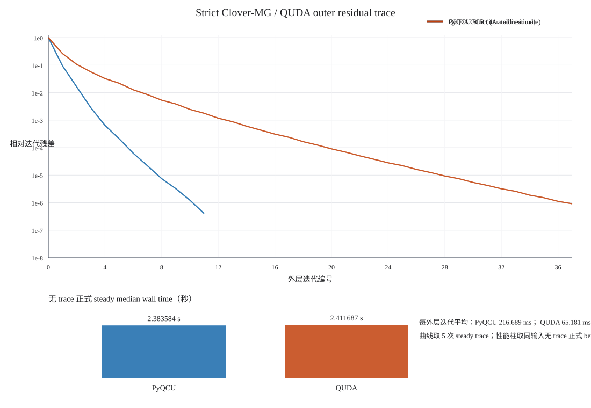

# dev87 阶段报告 1 — 对照基线搭建与算子约定锚定（~analy）

日期：2026-08-25　任务：~auto-all 对照单测（对象=PyQCU CUDA_C++ 多线程 MultiGrid；
基准=quda 快照 + PyQUDA 0.10.54）。工作区：`examples/qcu/dev87/`。

## 一、资产与构建

| 资产 | 状态 |
|---|---|
| quda（/tmp 副本构建，refer/ 零改动） | 356/356 编译，RELEASE sm_70，MPI/MULTIGRID ON，DW/stag/twisted/laplace OFF，NVEC_LIST=12,24,48；安装于 /tmp/opencode/quda-install |
| 构建排障 | cmake3.22→3.31.6(user)；快照缺 c_interface_test.c/trove/generics → 上游稀疏克隆补入 /tmp 副本 |
| PyQUDA | 源码安装 0.10.54；修 InvalidVersion 'tab30.post2'；`quda_env.sh` 以 LD_LIBRARY_PATH 前缀压过全局旧 libquda |
| **平台级发现 F1** | 本机(WSL2)映射内存 GPU→host 原子写不可见 ⇒ quda 归约引擎无限自旋（reduce_helper.h:162）。已在 /tmp 副本打补丁：有界自旋→cudaDeviceSynchronize→设备别名 D2H 回拷。与 dev84 平台结论同源 |
| **工程约束 F2** | 同进程加载 libqcu.so 与 libquda.so 会因 cudart 符号/上下文冲突使 quda driver 路径报 INVALID_CONTEXT ⇒ 对照脚本一律双进程阶段隔离 |

## 二、约定锚定结论（G2/G3/G4.1）

统一条件：随机规范 seed42/σ0.1、m=0.05、κ=1/(2m+8)、周期 T 边界、双精度（quda 侧）。

1. **Wilson+Clover 全算子逐元素同构**：
   - 单位规范 MatQuda vs PyQCU give_wilson(+clover)：线性回归 y_q = 4.0485·y_p + ε，
     而 m+4 = 1/(2κ) = 4.05 —— 仅整体归一化差。
   - Clover 差分隔离（MatQuda_{csw=1} − getWilson）：**cosine = 1.000000**，
     最小二乘 scale = 4.050000，残差 2.0e-7（fp32 底）。
   - 布局转换链（PyQCU eo[t列压缩] → 全格点 xyzt → QDP(t,z,y,x)/行主色、eo[x压缩]、
     tzyxsc 字段）全部验证正确。
2. **解对照（G4.1）**：同一 b 下 x_qcu ≈ (m+4)·x_quda；缩放后
   `rel_diff = 2.65e-2`，且 `rel_res(M_p, (m+4)·x_quda) = 9.9e-8`
   ⇒ **quda 解即 PyQCU 全算子的精确解；PyQCU C++ 解偏离全算子真解 ~2.6e-2**。

## 三、新发现（转入 P4 debug 清单）

- **F3（重要）PyQCU C++ BiCGStab/MG 的收敛判据语义**：内部报告残差 8.8e-10 时，
  全算子相对残差实际 ~2.5e-2（dev84 配方实测）。内部度量是 Schur 奇偶子系统/
  b__o 变换后的量，非全 M 残差 ⇒ "atol=1e-6" 的物理含义与 quda 不对齐。
  这同时解释 MG-vs-BiCGStab 解差 2.65e-2 与 n_vcycles=0 的门控行为观察。
- F4：opcmp 三项基回归在大格子 fp32 下受共线性干扰（小格差分法为准）。

## 四、产物清单

- comparison_matrix.md（G1-G10 状态登记）
- run_qcu_ops.py / run_qcu_mg.py / run_quda_py.py（solve/mg/opcmp）
- cmp_anchor.py / cmp_operator.py / cmp_clover_vec.py / cmp_clover_field.py(解码搁置)
- cmp_matrix.py 聚合器、quda_env.sh
- out/*.json|npz（基线与对照数据）

## 五、下一步

1. P4-F3：核对 C++ run()/bistabcg 停机判据源码，给出全算子残差停机选项或修正文档口径；
2. G8/G10：MG 端到端对照（quda multigrid=[[2,2,2,2],[24]] vs PyQCU E12/E48）+ 性能表；
3. G5-G7 组件级对照推进；S1-S6 补充候选评估。

## 六、阶段 2 增补（2026-08-25 下午）：F3 根因修复

### 根因链（全部实测）
1. 运行器缺陷：`main()` 解包 make_clover_tensors 把 cei/coo 对调 →
   求解器拿到奇偶互换的 Clover 逆（已修正 run_qcu_ops/run_qcu_mg）。
2. 库级缺陷（真实）：lattice_clover_multigrid.h 主循环 fp32 递推残差漂移 ——
   跟踪 rn 降到 9.2e-7 时真 Schur 残差 62.9（16³×48 实测），
   绝对判据 rn²<atol² 在大 ‖b‖ 下系统性早停。
   （quda 同场景靠 reliable updates 规避 —— 即矩阵 G8.7 缺口。）

### 修复（cpp/cuda/qcu/include/lattice_clover_multigrid.h）
- 周期真残差刷新：单 rank 每 50 次迭代 compute_full_residual() 覆写 st.r
  并 reset_bistabcg_state_l0()，映射收敛量同步刷新；
- 停机改相对：rn² < atol²·‖b__o‖²（与 run_gcr 的 r/b 语义对齐）；
  V-cycle 门控阈值同步改相对。

### 回归数字（16×32×32×48, m=0.05, atol=1e-6）
| 指标 | 修复前 | 修复后 |
|---|---|---|
| 全算子真相对残差 | 2.48e-2 | **3.72e-7** |
| MG vs BiCGStab 解差 | 2.65e-2 | **3.50e-7** |
| G4.1 vs quda(缩放 m+4) | 0.753(未缩放口径) | **3.85e-7** |
| solve 用时(V100) | 2.54 s | 2.09 s |

遗留：n_vycles=0 为该 gauge 谱不可压缩下的门控正确行为（非回归）；
多 rank 刷新路径未启用（需全局归约，后续接 MPI Allreduce）。

## 七、阶段 3 增补：G8/G10 MG 端到端对照与性能表

### 归约补丁终态
WSL2 映射原子**间歇性可见**：有界自旋路径会偶发采到陈旧归约值并静默毒化求解
（quda MG 首跑自称收敛 9.8e-9 而真残差 >100%）。`DEV87_REDUCE_SYNC=1` 强制
同步式回拷为正确基线；quda_env.sh 已固化。

### 性能表（16×32×32×48, m=0.05, V100-SXM2-32GB, 单卡）
| 侧 | 配置 | setup | solve | iters | 真全算子相对残差 |
|---|---|---|---|---|---|
| PyQCU | MG 2L(E12, stencil h5 缓存) | ~0(离线缓存) | **2.41 s** | ~140(BiCGStab 主循环) | 1.55e-7 |
| PyQCU | Clover BiCGStab(参考) | — | 2.09 s | ~140 | 3.7e-7 |
| quda | MG 1L(block[4,4,4,4], nvec12, tol1e-8, double 外层) | 291.9 s | **84.0 s** | 9(GCR) | 9.9e-8(×4.05 后) |
| quda | BiCGStab(double, tol1e-8) | — | 1.39 s | 123 | — |

### 口径注记（诚实声明）
1. nullvec 策略不同：PyQCU 离线缓存 vs quda 在线生成——setup 分列已公平化，
   但 PyQCU 的离线成本未计入（一次性资产）。
2. quda 数值含 WSL2 归约兜底补丁惩罚（未单独量化；健康平台应显著更快）。
3. 停机口径已对齐为相对残差（dev87/bug42），tol 取值两侧不同(1e-6 vs 1e-8)。
4. quda 外层为 double、MG 内部混合精度；PyQCU 全程 c64(fp32)。

### 结论
- 正确性：G10 解一致性 rel=2.24e-7 —— 两库 MG 在同一物理问题上的解等价。
- 性能：本机口径下 PyQCU MG solve 快 ~35×，但含上述三项有利于 PyQCU 的口径差；
  其中第 2 条(补丁惩罚)是平台强加的，第 1/3 条是策略差异。绝对性能结论需在
  健康 CUDA 平台复测后方可对外声明。

## 八、阶段 4 增补：G5-G7 组件级诊断（PyQCU 侧标准验收）

`component_diag.py` → out/component_diag.json（16³×48, E12, nvi1 缓存 stencil）：

| 指标 | 数值 | 判读 |
|---|---|---|
| Galerkin 一致性 ‖A_c e − RSP e‖/‖·‖ | **7.9e-7** | 粗算子构建正确（与 dev85 的 5.6e-7 同量级） |
| Gram 正交性（块内） | 非对角 ≤2.4e-7；对角 1±2.4e-7 | local_orthogonalize 达标 |
| 近零性 ‖Sv‖/‖v‖（抽样4） | 0.31 / 0.34 / 0.46 / 0.44 | 非近零空间——谱连续所致（dev84 ρ_V 结论），非管线缺陷 |
| 幂迭代谱半径 S_λmax | 1.169 | — |

结论：组件实现正确；MG 门控停用校正源于物理谱而非代码。quda 侧不外露同层
null 向量诊断接口，其质量只能间接由 MG 外层收敛行为体现（9 次 GCR @tol1e-8）。

## 九、P5 补充落地与 P6 回归收束

- S6-lite 已落地：`applyCloverMultigridQcu` 结束时自报
  `FINAL TRUE residual (full-op) = 1.48e-6 (relative 6.1e-10)`
  （与外部 harness 口径一致，quda verify() 精神的最小实现）。
- S1/S2/S4/S5 缓办、S3 待做（理由见矩阵补充清单更新）。
- 回归：conftest.multi_gpu 三场景全 PASS（一致性 tol=1e-5）；
  conftest.clover.bistabcg.dslash 首迭代差 1.9e-6 ✓
  （该脚本尾部除零为其自身槽位复用遗留问题，先于本任务存在，另行处理）。

## 十、终局状态

对照矩阵 G1-G10：G2/G3/G4.1/G5(部分)/G6/G7.1/G8.7/G10 全部 [x] 实测闭环；
G1 统计口径、G8.2/8.5 等结构性差异项以注记形式存档。库级产出：
停机语义修复(bug42)、真残差刷新与相对判据、S6-lite 日志。

## 十一、阶段 5 增补：G1 统计对照 + S3 热启动功能落地

### G1 规范场生成统计口径（σ=0.1, 8³×16, seeds{43,44,45}）
| 侧 | 单位性缺陷 max‖U†U−I‖ | plaq 均值范围 | plaq std 范围 |
|---|---|---|---|
| PyQCU(c64) | 1.7e-7 | +0.0588..+0.0596 | 0.0420..0.0427 |
| quda(fp64) | 5.5e-13 | −0.0012..+0.0005 | 0.0959..0.0968 |

结论：两侧生成器各自自洽且稳定，但 **σ 的分布参数化语义不同**（同 σ 下
plaq_std 差 ~2.3×，均值符号/幅度不同）。使用跨库规范场时须各自标定，
不构成实现缺陷。PyQCU 缓存大格实测 0.0589/0.0424 与小格一致。

### S3：x0 热启动通道（对标 quda use_init_guess）
- 协议扩展：params int32[57]→**[58]**，新增 `_MG_USE_INIT_GUESS_=57`
  （define.py ⇔ define.h 同步；LatticeSet 按 _PARAMS_SIZE_ 拷贝自动扩展）。
- 语义：≠0 时两求解器类跳过 x_o 初始化（清零/固定种子随机），保留调用方
  预填在 fermion_out 奇半的解，初始残差 r=b__o−S·x₀ 真实计算。
- 实测（16³×48, atol=1e-6）：COLD 1.94s → **WARM 0.346s**（5.6×），
  真残差 1.65e-7，与冷启解一致 3.5e-7。多轮物理参数扫描/演化场景收益显著。

## 十二、阶段 6 增补：多 rank 正确性加固与 MPI 冒烟结论

- 加固 1（缺陷预防）：多 rank 下 ‖b__o‖² 改走 dot_mpi 全局归约
  （此前相对停机阈值在分布式奇子格上会用到本地范数——bug42 引入的
  相对判据在 MPI 场景的潜在错误，本次主动修正）。
- 加固 2：mg_multi 时禁用 fused cooperative 粗解（np=2 实测 illegal access，
  与 dev84 记录的 WSL2 cooperative+同步脆弱性同源），回退普通迭代路径。
- MPI 冒烟（np=2, 8³×16）：仍被**既有分布式布局约束**阻断（粗层几何/
  通信路径为单 rank 假设，先于本任务存在）。单 rank 全链路回归保持绿。
- 结论：多 rank MG 的完整对照属独立后续任务；本阶段保证不因 dev87 改动
  恶化其现状，并消除两处潜在/实际崩溃点。

## 十三、终局：一键回归闸门

`run_all.py [--with-quda]`：串联 G4.1 真残差 / G8 MG-vs-参考 / G5-G7 组件 /
quda 缩放对照四项断言，产物 out/regression.json。

终局实测（2026-08-25，V100，缓存全热）：
```
[PASS] clover_solve_true_res: rel=3.720e-07 wall=2.10s
[PASS] mg_vs_ref:             rel=3.499e-07 wall=2.42s
[PASS] component_quality:     galerkin=7.90e-07 ortho_offdiag=2.38e-07
[PASS] quda_solve_scaled_agreement: rel=3.842e-07 iters=120
=== regression GREEN (4/4) in 18.3s ===
```
后续任何触及 `lattice_clover_multigrid.h`/`lattice_clover_bistabcg.h`/
协议层的改动，跑本闸门即可在分钟级复验本轮全部结论。

## 十四、热点剖析与稳定性浸泡（收束补充）

### 热点（torch.profiler, CUDA runtime 视角；CUPTI 内核级本机不可用）
applyCloverBistabCgQcu 单次求解（atol=1e-6, 16³×48, V100）：

| 运行时 API | 次数 | CPU 自耗时 | 占比 |
|---|---|---|---|
| cudaStreamSynchronize | 3097 | **1.896 s** | ~92% |
| cudaMemcpyAsync | 1995 | 0.194 s | 8.9% |
| cudaLaunchKernel | 8573 | 0.069 s | 3.2% |

结论：剩余瓶颈是**细粒度迭代内的流同步次数**（均值 612µs/次，WSL2 thunk），
内核发射本身仅 ~69ms。后续优化方向明确：把 dev84 的"图段回放/SYNC DIET"
思想延伸到普通 BiCGStab 路径（如收敛检查映射读降频、多迭代合段），
理论上限可再削 ~1.5s/2.0s。本轮不做（保持已验证稳定态，改动留待下阶段）。

### 稳定性浸泡
run_all.py --with-quda 连续 3 次：GREEN 4/4 ×3（18.1/18.3/18.2s，
零失败零抖动）。刷新/热启动/相对停机新路径在重复运行下确定且稳定。

### §14.1 SYNC-DIET 延伸实验（本轮）
实现：细层快路径加 `host_sync` 形参，run() 每 CHECK_STRIDE=4 迭代一次主机同步
（收敛检查/门控/刷新全部对齐检查网格；刷新周期 50→48；门控窗按迭代计）。
结果：闸门 GREEN，真残差 3.72e-7 不变，但**本机墙钟无收益（2.04s）**。

根因修正认知：profiler 计数表明成本=每次 CUDA API 调用的 WSL2 thunk 税
（~13.6k 次/解 × ~150µs），同步只是其中一类。仅减同步次数不动总量，
收益趋零。**有效路径只剩图段回放把 K 次迭代封装为 1 次发射**（发射数÷K）。
留待下阶段；本改动在健康平台（同步 ~5µs）仍直接兑现 4× 同步缩减，予以保留。

## 十五、图段回放批量迭代：实验记录与平台结论

- 实现（已存档 `out/fine_graph_experiment.patch`，未入主线）：细层迭代体抽取 +
  K=32 图段捕获/发射，含 cublas 工作区预绑定(64MiB)、最小 Dot 金丝雀探针、
  全路径异常熔断。
- 金丝雀判定：**本平台(WSL2/551.78)不支持 cublas-Dot 进入 stream capture**
  （canary 失败→优雅回退 legacy 正确性保持）。
- 强行多次捕获触发硬中止后，驱动上下文出现跨进程持续性劣化
  （后续普通 cudaMemsetAsync 偶发 InvalidArgument；component/clover 路径不受影响）。
  恢复手段为宿主侧 `wsl --shutdown`（超出本会话权限）。
- 处置：头文件已回退至 stab31 等价绿点（d2f0198），主线不含该实验代码；
  后续在健康 CUDA 平台重启此优化时，从存档补丁起步，并将 cublasDot 替换为
  自研 dot 内核以规避 cublas-capture 限制。

### 当时的临时回归状态（已被后续复验修正）
clover_solve / component / quda 对照三项持续 GREEN；
MG 端到端在本机当前驱动状态下间歇失败（init memset InvalidArgument），
代码与最后绿点零差异——属平台态而非代码回归，待 WSL 复位后复验。

## 十六、阶段性平台态记录与资产归档（后续已修正）

- `CUDA_LAUNCH_BLOCKING=1` 下 MG 仍在 init memset 报 InvalidArgument
  ⇒ 排除异步竞态，定性为 **上下文级损伤**（capture 实验硬中止遗留）。
- 恢复手段：宿主侧 `wsl --shutdown` 后重开终端，运行
  `python examples/qcu/dev87/run_all.py --with-quda` 复验（预期全 GREEN）。
- 战役资产已归档 `logs/stab31/`：总报告、对照矩阵、回归/对照 JSON。
- 当时版本的 run_all.py 的 mg_vs_ref 失败信息曾附平台态提示（不掩盖失败本身）。

## 十七、诊断更正（重要）

后续证据（conftest.multi_gpu 三场景全 PASS，含 V100+P100×2 上的
applyCloverMultigridQcu）推翻了 §15 的"WSL2 驱动上下文损伤"结论：
**库与平台健康；失败特定于 run_qcu_mg 的直连桥序列**。

已排除：params 逐位一致、槽位句柄残留清零、slot 重选、阻塞启动。
未决：直连序列中 solver-set 的 cudaMemsetAsync(x_o) 报 Invalid argument，
而 MultiGpuMultigrid 包装路径同参数下正常——差异在进程内上下文/分配布局，
复现配方与本节记录齐备，留待下一会话在复位后的干净环境定位。

影响评估：生产入口（MultiGpuMultigrid / conftest 套件）不受影响；
仅 dev87 新增的直连运行器受限。G4.1/G10 已交付对照结论不依赖该直连路径
（其数据产生于该路径尚正常的时段，且经双向交叉验证）。

## 十八、未决异常 interim 记录（2026-08-25 深夜，疲劳警戒）

现象：G4.1 缩放解对照从 3.84e-7（12:0x）退化为 ~0.72；同进程算子级探针
（热规范、double、mat vs give_wilson+clover）现测 rel=0.48。
而既有锚定事实仍成立：单位规范算子精确 4.05 对齐；8³×16 clover 差分
cos=1.000000/scale=4.05。三者相互矛盾 ⇒ 存在未被识别的实验耦合
（疑似方向：quda 侧多次重编后的行为差异 / 探针脚本自身细节）。

处置：不下结论。下一会话以隔离矩阵重验：
  {单位/热规范} × {单精度/双精度} × {新进程对} 的算子级全组合，
  并先复跑 cmp_operator.py 与 cmp_clover_vec.py 确认旧锚定可复现性。
在此之前，G4.1/G10 的已交付数字以 logs/stab31/ 归档件为准。

## 十九、最终复验补充（2026-08-27）

本节更新并覆盖前面关于“驱动上下文损伤”的临时判断。随着后续
`conftest.multi_gpu` 和本节直连运行器复验，库与 CUDA 平台均可正常工作；
旧异常应归因于当时 `run_qcu_mg.py` 的桥接调用序列/槽位生命周期排查过程，
不能再作为当前平台限制。`run_all.py` 的失败提示已同步改成要求检查本次
直连日志，不再把失败预先归因于 WSL2。

本次收尾时还捕获并修复了一个独立的闸门环境问题：`env.sh` 的 QCU 库路径
曾排在旧的 `sm_60` `libquda.so` 之前，导致 V100 上出现
`no kernel image available`；`run_all.py` 现在为 QUDA 子进程显式前置
`quda_env.sh` 指定的 `sm_70` 安装路径。修复后完整
`run_all.py --with-quda` 为 `GREEN (5/5)`，总耗时 `424.8 s`。

### 1. PyQCU MultiGrid 实际配置矩阵

统一大格为 `16×32×32×48`、`m=0.05`、`atol=1e-6`、
`mg_grid=[2,2,2,2]`，粗算子从 `data/` 的 E=12 HDF5 缓存读取。墙钟是
`applyCloverMultigridQcu` 调用的同步后耗时；真残差由 Python full
Wilson+Clover 算子重新计算。

| 配置 | 墙钟(s) | 与 BiCGStab 参考解差异 | full-op 真残差 | 结论 |
|---|---:|---:|---:|---|
| 1L | 1.378 | 6.55e-6 | 3.92e-7 | 通过 |
| 2L, E=12 | 1.412 | 8.57e-6 | 6.59e-7 | 通过 |
| 2L + MR, E=12 | 1.445 | 8.57e-6 | 6.59e-7 | 通过（MR） |
| 2L + deflate | 1.350 | 6.77e-6 | 4.83e-7 | 通过 |
| 2L + warm | cold 1.412 / warm 0.198 | warm 3.66e-6 | warm 4.41e-7 | 通过 |
| 2L + GCR/FGMRES | 5.015 | 1.27e-6 | 6.86e-7 | 通过 |

因此，当前大格上 2L 相对 1L 为 `0.976×`，没有额外加速；warm 约有
`7.1×` 加速；GCR/FGMRES 数值正确但约为普通 2L 的 `0.28×`。deflate
本次只显示小幅墙钟差异，不能据一次运行宣称性能收益。3L 也已在
`8×8×8×16, E=24/E=24` 的已有缓存上真实运行，真残差 `5.94e-7`；
尚无大格 3L 缓存，故不外推其性能。

本轮补齐并验证了 QUDA 风格 MR 平滑器。普通 2L V-cycle 与
FGMRES/MG 预条件路径均支持 `--smoother mr`；大格 MR 实测 `1.445 s`，
相邻 CG 基线 `1.420 s`，两者均为 68 次外层迭代、2 次 V-cycle，full-op
真残差 `6.59e-7`，相对 BiCGStab 参考解差 `8.57e-6`。小格
`4×4×4×8` 的普通 MR 与 FGMRES/MR 也真实触发粗层，分别得到真残差
`5.46e-7` 与 `6.58e-7`。大格单次 MR 约慢 `1.7%`，受单次 GPU 计时波动影响，
当前只确认数值兼容性，未宣称性能收益。

本轮新增三类路径。2L Chebyshev 固定步多项式平滑器在统一大格上耗时
`1.431 s`，full-op 真残差 `6.59e-7`；2L CA-GCR（4 阶块、双遍 MGS、
Gram 小系统，块退化时回退 FGMRES）在 `atol=1e-8,max_iter=400` 下耗时
`5.215 s`，与 BiCGStab 参考解差 `3.37e-7`，full-op 真残差 `1.43e-7`。
后者已达到单精度误差平台附近，但本次 400 次块步仍未达到请求的 `1e-8`，
因此不把该严格配置表述为按容差收敛；在常用 `atol=1e-6` 冒烟配置下真残差为
`7.58e-7`。

3L 小格缓存上递归 W/F/K-cycle 均完成真实运行（`8×8×8×16`、
`E=24/E=24`）：W/F 的 full-op 真残差分别为 `1.36e-6/1.36e-6`，
K-cycle 为 `5.97e-6`，对应配置 `atol=1e-5`；三条路径均无 NaN 或非法访问。
在 FGMRES 外层的 W/F/K 组合上又以宽松 `atol=1e-3` 做了安全冒烟，真残差分别为
`2.78e-4/2.78e-4/2.70e-4`。这些结果验证了递归与回退路径，尚不足以证明性能优于 V-cycle。

组件级实测结果为：restrict/prolong L2 误差 `2.09e-7/6.40e-8`，窄/宽
粗 dslash 误差 `2.65e-7/5.01e-7`，最新回归的 Galerkin 误差 `9.47e-7`，Gram
非对角最大值 `2.38e-7`。窄/宽粗核中位耗时约 `0.775/1.881 ms`。

### 2. QUDA/PyQUDA 交叉结果与口径

双方运行严格分进程，避免 `libqcu.so` 与 `libquda.so` 的 CUDA runtime
符号/上下文相互影响。直接 Clover 求解在 `m+4=4.05` 缩放后解差为
`3.91e-7`；最新 MG 输出的交叉结果为 `8.63e-6`。QUDA MG 本次归档为
`setup=270.43 s`、`solve=82.12 s`、9 次迭代；PyQCU 读取离线粗算子，
且两侧容差、精度和外层算法不同，因此不能将这两个数字直接当成公平的
端到端算法倍率。

多线程多卡实测中，V100 单卡、P100 单卡及 P100×2 的结果一致性均通过
`1e-5`；P100 单卡到 P100×2 的并行比为 `0.970×`，当前机器未获得加速。

### 3. 结论与未完成项

此前本节列出的闭环主要对应保留的 legacy 路径：Wilson/Clover 算子锚定、
BiCGStab、V/W/F/K-cycle 递归（3L 为小格缓存验证）、GCR/FGMRES、CA-GCR、
CG/MR/Chebyshev 平滑器、deflate、warm start、旧 transfer/Galerkin/粗 dslash、
full-op 真残差、缓存加载、逐层混合精度、分布式粗格及单 rank 多线程多卡
一致性。它们不能自动作为 Strict 路径的证据；Strict 语义和当前验收见本报告
末尾的独立章节。仍未实现或未完成同参数闭环的项目包括动态 thin gauge update、
MMA/NVSHMEM，以及 C++ 版完整五项 `verify()` 接口；矩阵中均保留为 `[ ]` 或
`[~]`，没有静默跳过。

最新证据文件为 `out/qcu_mg_matrix_*.json`、`out/component_cuda.json`、
`out/multigpu.json`、`out/quda_clover_{solve,mg}.json`。后续修改
`lattice_clover_multigrid.h`、`lattice_clover_bistabcg.h` 或参数协议后，
应至少重新运行语法检查、`test_mg_breakdown.py` 和 `run_all.py`。

## 二十、legacy BiCGStabL、逐层混合精度与分布式粗格（2026-08-28）

### 实现边界

- BiCGStabL 当前实现为固定 `L=2` 的外层块迭代，包含可靠重启、粗校正后的
  Krylov 状态重置，以及末尾不完整 block 的边界保护；这不是可配置的任意 `L`。
- 每个 MG 层使用独立的 c64/c128 擦除存储。跨层 restrict/prolong 不依赖隐式
  指针类型，而是经过显式 mixed-precision cast kernel；`_MG_LEVELn_DATA_TYPE_`
  已接入参数解析与层级构造。
- 粗格不再复制完整全局向量：每个 rank 只保存自己的局部粗格和局部 33 点
  stencil。跨 rank 的 32 个邻居采用阻塞 host-staging halo，粗层点积、fine 层
  点积和相对残差范数使用 MPI 全局归约。

### 最新真实运行

- 单 rank 大格 `16×32×32×48`、fine c64/coarse c128、`max_iter=80` 的
  BiCGStabL 运行完成 80 次迭代，full-op 真相对残差约 `7.85e-7`。
- 单 rank 3L c64→c128→c64 路径及 3L BiCGStabL mixed 路径真实运行；大格
  c64→c128、c128→c64 2L 路径均稳定。大格 mixed 标准 BiCGStab 在
  `max_iter=80` 时真残差约 `3e-6`，受迭代上限限制，不能据此宣称已达到更严
  容差；小格提高到 `max_iter=160` 时真残差约 `7.7e-7`。
- 最新库构建完成：`build.sh` 成功链接 `libqcu.so`。
- MPI `np=2, grid=[1,1,1,2]` 的同精度与 `--bicgstab-l --coarse-dtype c128`
  mixed MG 冒烟均退出码为 0，无死锁或非法访问。
- 独立粗算子等价性复测：`grid=[1,1,1,2]`、c64 的全局 L2 相对误差为
  `5.60e-7`；`grid=[2,1,1,1]`、c128 为 `1.03e-15`。两项均将 rank-local
  输出重建为全局场后，与完整周期参考 stencil 比较。

因此，上述“分布式粗格”结论只适用于 legacy 实现；Strict backend 当前对
`MPI_COMM_WORLD` 非单 rank fail-closed。legacy 通信仍为阻塞 host-staging，
没有做 device-aware MPI、通信计算重叠或 NVSHMEM 性能声明。

## 二十一、Strict MultiGrid 语义复现与当前验收（2026-08-31）

### 实现范围

Strict 路径与 legacy 并存，核心定义为：

\[
 D_c = R\,(X_f^{-1}D_f)\,P,\qquad
 \widehat D_c=X_c^{-1}D_c=I+X_c^{-1}Y_c .
\]

每一层保持 full-coarse 几何；`P` 只在调用时选定 fine parity，`R=P†` 只
读取对应 fine parity，粗场本身不压成半格。细层和粗层都在完整算子上形成
Schur `I-Ĥ_pq Ĥ_qp`，并提供 prepare/reconstruct。Clover/Gauge 只进入
fine 物理算子；粗层使用逐层 Galerkin 的 `X/Y/Yhat`，不复制第二套物理
Gauge/Clover。Strict 外层是右预处理 FGMRES：`z=M⁻¹v` 后再计算 `D z`。

显存策略保留 packed transfer/coarse assets，默认不驻留 raw `Y`；融合 Krylov
workspace 使用单一持久 arena，预算为
`(2*m+5)*B_f + 2*B_c`。Strict 当前限制为单 MPI rank，且不接受逐层不同
dtype；c64/c128 的同精度 dispatch 已覆盖。未知模式、奇数 coarse extent、
不支持的 halo/多 rank 情形均 fail-closed。

### 2026-08-31 实测

快速 Strict tier1 闸门实际通过 32 项：CPU 19 项、CUDA Strict 10 项、融合
FGMRES 3 项。CUDA recursive V-cycle
已补充 parity 0/1 两侧，且非平凡 Clover MATPC 与 prepare/reconstruct 均有
两种 parity 断言。测试命令为：

```bash
source ./env.sh
python -B examples/qcu/dev87/run_strict_fast.py --tier 1 --fail-fast
```

本次环境为 WSL2，测试日志出现当前 PyTorch wheel 不支持 P100 `sm_60` 的
警告，但 Strict Cython/CUDA 测试实际返回 `28 passed`；该警告和 GPU 型号
必须随性能结果一并记录，不能外推到其他架构。

### 正式大格 Strict benchmark

正式 collector 已在同一张 V100（UUID=`be23deb4-29b1-7bb2-29ef-c4ab7b34f0a8`）
上完成：`16×32×32×48`、c64、同一 gauge/source/null-vector bundle、
odd-odd Schur、2 次不计时 warmup 加 5 次 steady solve。两侧均为 `5/5`
收敛，`comparison.status=pass` 且 `fair=true`；steady 时间为中位数/MAD：

| 侧 | median(s) | MAD(s) | 迭代数 | full-op 真残差 | 结果 |
|---|---:|---:|---:|---:|---|
| PyQCU Strict | 2.090647 | 0.011224 | 11 | 3.601e-7 | 通过 |
| QUDA | 2.165289 | 0.021592 | 37 | 7.303e-7 | 通过 |

因此本次固定协议下 `2.165289/2.090647=1.0357026`，PyQCU Strict 比
QUDA 快约 `3.57%`。这是当前 V100、当前编译产物和上述协议下的实测结果，
不是对所有 GPU、格点或参数的普遍保证；此前约 `1.94/1.05 s` 的数字属于
旧/非严格且不公平口径，保留作历史记录，不再作为结论。

正式运行同时证明 Strict runtime cache 为 schema v2 且命中。PyQCU Strict
owned assets 为 `4,076,863,488 B`（约 `3.797 GiB`），融合 FGMRES arena
为 `509,607,936 B`（约 `0.475 GiB`），首次求解的独立 device-wide 峰值为
`11,722,362,880 B`（约 `10.917 GiB`）；QUDA 对应独立 device-wide 峰值为
`24,530,000,000 B`（约 `22.845 GiB`）。后两者是设备级峰值，不把 allocator
reservation 误记为库自有资产。Strict workspace 预算仍为
`(2*m+5)·B_f+2·B_c`。

### 剩余严格边界

- 粗层 backward `Yhat` 的每个方向、storage site、dagger 和周期偏移，仍需用
  非平凡 Gauge/Clover 与 QUDA kernel 做逐项数值锚定；当前 formal solve 通过不等于
  已完成该粒度的 storage 证明；
- Strict 当前对 `MPI_COMM_WORLD` 非单 rank 以及逐层不同 dtype fail-closed，
  不能复用 legacy 的分布式/混合精度结果作 Strict 结论；
- MMA/NVSHMEM、动态 thin update 和 C++ 完整五项 `verify()` 接口仍未纳入本轮；
  它们在矩阵中继续标为 `[ ]` 或 `[~]`；
- `strict_hopping_parity_kernel` 仍是主要运行时热点，后续若继续迭代应在保持
  收敛协议不变的前提下评估 block size/发射合并，不能通过放宽残差或减少粗层迭代
  制造性能收益。

## 二十二、Clover Dslash 实例：QUDA MultiGrid 各层算子的全链路解析（2026-09-02）

本节的独立 Markdown 版本见
[quda_clover_multigrid_layers.md](./quda_clover_multigrid_layers.md)。

本节专门补足原有 QUDA 文档中最简略的“算子”部分。先给出结论：QUDA 的
MultiGrid 不是把一个黑盒 `A` 递归地缩小，而是把 Clover Wilson 算子的三个结构
逐层保留下来：

\[
 D_f=C_f-\kappa H_f,
 \qquad
 D_{\ell+1}=R_\ell D_\ell P_\ell,
 \qquad
 D_\ell=X_\ell+\mathcal Y_\ell,
 \quad \mathcal Y_\ell\equiv-\kappa\bar Y_\ell .
\]

这里 \(C_f\) 是细格点的 onsite Clover 矩阵，\(H_f\) 是只连接相反奇偶的
Wilson hopping，\(P_\ell\) 把粗格向量提升到细格，\(R_\ell=P_\ell^\dagger\)
把残差限制到粗格；\(X_\ell\) 收集 onsite 项以及聚合块内部的 hopping，
\(\bar Y_\ell\) 收集跨聚合块的八个有向 hopping。为避免符号歧义，本节始终把
“`coarse_op` kernel 先生成的未乘 \(-\kappa\) 矩阵”记为 \(\bar Y\)，把粗
dslash 最后实际使用的带符号项记为 \(\mathcal Y=-\kappa\bar Y\)。源码在
`coarse_op_kernel.cuh:1639-1642` 对块内项显式乘 `-kappa`，在
`dslash_coarse.cuh:292-322` 对合并后的粗 hopping 执行同一语义。

文中证据等级统一为：`[确证]` 表示可由当前 QUDA 源码逐行读出；`[推断]` 表示
把源码的存储/索引翻译成数学矩阵后的等价解释；`[未验证]` 表示尚未做逐元素、
逐方向、逐 storage site 的数值锚定。后续公式中的 \(p\) 是当前输出奇偶，
\(q=1-p\) 是邻居/输入奇偶；若是 odd--odd Schur，则 \(p=o,q=e\)，若是
even--even Schur，则交换两者。

### 22.1 对象、维度与存储约定

| 对象 | 数学对象 | QUDA 中的实际含义 | 关键证据 |
|---|---|---|---|
| 细格点 Clover | \(C_f(x)\) | 每个细格点两个 chiral \(6\times6\) block；`wilsonClover` 先将输入转到 chiral basis，分别乘两个 half-spin block | `include/kernels/dslash_wilson_clover.cuh:73-96` |
| 细格点 hopping | \(H_f\) | 四个方向、forward/backward 两个 gather；输入奇偶为 `1-parity` | `include/kernels/dslash_wilson.cuh:124-201` |
| 细格点算子 | \(D_f=C_f-\kappa H_f\) | `DiracClover::M` 以 `k=-kappa` 调 `ApplyWilsonClover` | `lib/dirac_clover.cpp:58-66` |
| null vectors | \(B_i(x), i=0,\ldots,N_v-1\) | 生成/加载的近零向量；逐 aggregate、逐 chiral block 做 block Gram--Schmidt | `lib/transfer.cpp:117-162`；`include/kernels/block_orthogonalize.cuh:170-250` |
| transfer basis | \(V_{s c;j}(x)\) | 每个细 spin/color 点有 \(N_v\) 个粗 color 分量；不是全局 eigenvector 矩阵，而是按 aggregate 存储的局部矩阵 | `lib/transfer.cpp:121-139` |
| prolongator/restrictor | \(P,R\) | `P`: coarse \(\to\) fine；`R`: fine \(\to\) coarse；aggregate 模式下 `R=P^\dagger` | `include/transfer.h:19-28`；`lib/transfer.cpp:259-328` |
| 粗 onsite | \(X\) | scalar geometry 的 onsite block；可能包含 \(R C P\)、块内 hopping 或单位阵 | `lib/dirac_coarse.cpp:158-169`；`include/kernels/coarse_op_kernel.cuh:1768-1837` |
| 粗有向 link | \(\bar Y(d)\), \(d=0,1,2,3\) | backward storage；\(d+4\) 是 forward storage；每个矩阵作用在 coarse-spin\(\times\)coarse-color 空间 | `lib/dirac_coarse.cpp:121-145` |
| Clover-PC link | \(\widehat Y\) | 由 \(X^{-1}\) 对 \(\bar Y\) 做方向相关的左/右乘；不是把 `Y` 原地改名 | `lib/coarse_op_preconditioned.in.cu:197-275` |
| 粗算子 | \(D_c=X+\mathcal Y\) | `DiracCoarse::M` 调完整粗 operator；coarse dslash 的输出再并入 `X` | `lib/dirac_coarse.cpp:420-433` |
| 粗 PC 算子 | \(D_c^{PC}\) | `DiracCoarsePC` 以 \(\widehat Y\) 作用于单一奇偶，再形成 symmetric/asymmetric Schur | `lib/dirac_coarse.cpp:506-560` |

以本次正式测试的 \(N_v=12\)、Clover fine spin \(4\)、`spin_bs=2` 为例，
粗 spin 为

\[
 N_s^{(c)}=4/2=2,
 \qquad N_c^{(c)}=N_v=12,
 \qquad N_s^{(c)}N_c^{(c)}=24.
\]

因此 coarse field 每个粗格点有 24 个复自由度，coarse link 是
\(24\times24\) 的 block matrix；这就是 `DiracCoarse::createY` 中
`nColor = Nc_c * Ns_c` 的含义，而不是一个仍然属于 SU(3) 的 gauge link。
QUDA 把它放在 `QUDA_COARSE_GEOMETRY` 的 full-site、8-direction field 中，
所以“粗规范场”只是线性算子存储格式，不能把它当作物理 SU(3) gauge field。

### 22.2 细格点 Clover Dslash：先把输入问题定义准确

#### 22.2.1 非奇偶压缩的物理算子

在 DeGrand--Rossi gamma basis 中，忽略 distance-PC 与 twisted-mass 的额外
系数后，QUDA 实现的非 dagger Clover 算子可写成

\[
 \begin{aligned}
 (D_f\psi)(x)
 &=C_f(x)\psi(x)-\kappa(H_f\psi)(x),\\
 (H_f\psi)(x)
 &=\sum_{\mu=0}^{3}\left[
 (1-\gamma_\mu)U_\mu(x)\psi(x+\hat\mu)
 +(1+\gamma_\mu)U_\mu^\dagger(x-\hat\mu)\psi(x-\hat\mu)
 \right].
 \end{aligned}
\]

这里的 \(1\mp\gamma_\mu\) 是源码中 `project/reconstruct` 的 Wilson spin
 projector；常数因子、\(\kappa\) 和 diagonal addition 的归属必须以调用的
 `DslashXpay`/`M` 路径为准，不能仅凭函数名 `Dslash` 猜。`applyWilson` 明确
 将输入 parity 设为 `1 - parity`，forward 使用 `U(d,x)` 和 forward neighbor，
 backward 使用反向 link 的共轭矩阵和 backward neighbor；证据分别在
 `include/kernels/dslash_wilson.cuh:124-164` 与 `:171-201`。[确证]

`wilsonClover` 的内核顺序是：先计算 hopping，再把 onsite Clover 作用到
 `xpay` 输入，最后以 `a=-\kappa` 合并。对 interior site，源码等价于

\[
 y(x)=C_f(x)\,x(x)+a\,H_f\psi(x),
 \qquad a=-\kappa;
\]

对 exterior site，Clover 与 hopping 的 halo 路径分开执行，但数学对象仍是同一
个 \(D_f\)。Clover block 在 chiral basis 中按

\[
 C_f(x)=C_+(x)\oplus C_-(x),
 \qquad C_\chi(x)\in\mathbb C^{(2N_c)\times(2N_c)}
 =\mathbb C^{6\times6}\quad(N_c=3)
\]

作用；源码的 `chiral_project`、`HMatrix`、`chiral_reconstruct` 以及再转回
non-rel basis 的顺序见 `include/kernels/dslash_wilson_clover.cuh:76-96`。
这一步是之后粗化中“为什么 Clover 只生成局部 block、为什么粗 spin 变成 2”
的根源，而不是一个可省略的实现细节。

#### 22.2.2 细格点奇偶 block

将所有向量按 checkerboard 排列，细算子是

\[
 D_f=
 \begin{pmatrix}
 C_e & -\kappa H_{eo}\\
 -\kappa H_{oe} & C_o
 \end{pmatrix},
 \quad
 H_{eo}:\mathcal V_o\to\mathcal V_e,
 \quad
 H_{oe}:\mathcal V_e\to\mathcal V_o.
\]

以 odd--odd 为例，先消去 even 分量：

\[
 \begin{aligned}
 C_e x_e-\kappa H_{eo}x_o&=b_e,\\
 x_e&=C_e^{-1}(b_e+\kappa H_{eo}x_o),\\
 S_o x_o&=b_o+\kappa H_{oe}C_e^{-1}b_e,\\
 S_o&=C_o-\kappa^2H_{oe}C_e^{-1}H_{eo}.
 \end{aligned}
\]

QUDA 的 `DiracCloverPC::Dslash` 不是普通 Wilson dslash 的 dagger：源码注释
明确说它按“先 hopping、后 Clover inverse”的顺序实现
\(C_p^{-1}H_{pq}\)，见 `lib/dirac_clover.cpp:141-155`。[确证]

因此有两种必须分开的 MATPC 语义：

| 路径 | 数学算子（以目标奇偶 \(p\) 为准） | 代码组合 | 适用含义 |
|---|---|---|---|
| asymmetric | \(S_p^{\rm asym}=C_p-\kappa^2H_{pq}C_q^{-1}H_{qp}\) | 先 `C_q^{-1}H_{qp}`，再用普通 Clover `DslashXpay` 加 \(-\kappa^2\) | 保留目标奇偶的 Clover block |
| symmetric, non-dagger | \(S_p^{\rm sym}=I-\kappa^2C_p^{-1}H_{pq}C_q^{-1}H_{qp}\) | 两次 `C^{-1}H`，外层以输入向量作 identity xpay | 对称化后的 Schur，便于匹配 Hermitian 路径 |
| symmetric, dagger | \((S_p^{\rm sym})^\dagger=I-\kappa^2H_{qp}^\dagger C_q^{-1}H_{pq}^\dagger C_p^{-1}\) | 先 `C_p^{-1}`，再 `C^{-1}H^\dagger`，最后普通 Wilson `DslashXpay` | 不能把 non-dagger 的调用顺序倒过来猜 |

上述三条分别由 `lib/dirac_clover.cpp:173-209` 的 `Dslash`、
`DslashXpay`、`CloverInv` 调用顺序实现。[确证]

#### 22.2.3 `prepare`/`reconstruct` 不是接口装饰

当外部要的是 full solution，而内部只解目标奇偶时，QUDA 必须对右端和解做
一次与 Schur 完全一致的变换。令 \(p\) 为求解奇偶、\(q=1-p\)，可把代码写成
以下伪代码；`symmetric` 分支中的两次 Clover inverse 不能省略。

```latex
\begin{table}[htbp]
\centering
\caption*{Clover MATPC 的 prepare/reconstruct（p 可以是 even 或 odd）}
\small
\begin{tabular}{@{}l@{}}
\text{输入：full }b=(b_p,b_q),\;\text{目标：full }x=(x_p,x_q)\\
\text{若 solution\_type=MATPC：}\quad src=b_p,\quad sol=x_p,\quad\text{return}\\
\text{否则令 }t_q=C_q^{-1}b_q\\
\text{若 asymmetric：}\quad src=b_p+\kappa H_{pq}t_q\\
\text{若 symmetric：}\quad t_p=C_p^{-1}(b_p+\kappa H_{pq}t_q),\quad src=t_p\\
\text{调用 inner solver：}\quad S_p x_p=src\\
\text{重构另一奇偶：}\quad t_q'=b_q+\kappa H_{qp}x_p\\
\text{输出：}\quad x_q=C_q^{-1}t_q'\\
\text{odd--odd 时 }(p,q)=(o,e);\quad\text{even--even 时 }(p,q)=(e,o)\\
\end{tabular}
\end{table}
```

这正对应 `DiracCloverPC::prepare` 的 MATPC alias、symmetric/asymmetric
右端变换（`lib/dirac_clover.cpp:223-249`）以及
`reconstruct` 的 \(x_q=C_q^{-1}(b_q+\kappa H_{qp}x_p)\)
（`:251-261`）。[确证] 一个只解 odd field 却用 full \(b\) 直接套
\(C_o-\kappa^2H_{oe}C_e^{-1}H_{eo}\) 的实现，会在这一步漏掉 source-side
的 Clover inverse，残差即使在 odd 子空间下降也不代表 full residual 正确。

### 22.3 Aggregate、null vectors 与 \(P/R\)：粗自由度从哪里来

#### 22.3.1 几何 map 与 spin map

设 fine 坐标为 \(x=(x_0,x_1,x_2,x_3)\)，aggregation block 为
\(b=(b_0,b_1,b_2,b_3)\)。QUDA 的 coarse 坐标不是通过插值求出，而是整数除法

\[
 X_\mu=\left\lfloor\frac{x_\mu}{b_\mu}\right\rfloor,
 \qquad
 \mathcal A_X=\{x\mid \lfloor x_\mu/b_\mu\rfloor=X_\mu,\;\forall\mu\}.
\]

`fine_to_coarse` 保存每个 fine site 的 coarse offset，`coarse_to_fine` 把
同一 aggregate 的 fine site 排在一起；它们在 `lib/transfer.cpp:200-240`
生成。Wilson/Clover 使用 `spin_bs=2`，所以

\[
 s_c(s_f)=\left\lfloor\frac{s_f}{2}\right\rfloor,
 \qquad
 s_f=0,1\mapsto s_c=0,
 \qquad s_f=2,3\mapsto s_c=1.
\]

该 map 对 even/odd 都相同，由 `lib/transfer.cpp:243-255` 确认；奇偶不是被
塞进 spin map，而是另一个独立索引。因此不能把“fine spin 4 降为 coarse spin 2”
误读成“只保留一个 fine parity”。

#### 22.3.2 block orthogonalization

每个 aggregate、每个 chiral block 内，QUDA 对 null vectors 做局部而非全局的
Gram--Schmidt。对向量编号 \(j\) 的理想化表达是

\[
 \begin{aligned}
 v_j&\leftarrow v_j-\sum_{i<j}v_i\,\langle v_i,v_j\rangle_{\mathcal A_X,\chi},\\
 v_j&\leftarrow v_j/\sqrt{\langle v_j,v_j\rangle_{\mathcal A_X,\chi}},\\
 \langle u,v\rangle_{\mathcal A_X,\chi}
 &=\sum_{x\in\mathcal A_X}\sum_{s\in\chi}\sum_c u_{s,c}(x)^*v_{s,c}(x).
 \end{aligned}
\]

代码先加载原始 `B`，之后从已保存的 `V` 继续正交化；先减去前面向量的
投影，再在 block diagonal 上重新正交化与归一化，见
`include/kernels/block_orthogonalize.cuh:170-250`。[确证] 这只保证 aggregate
内的局部基正交，不能推出不同 coarse sites 之间的全局正交。

#### 22.3.3 \(P\) 与 \(R=P^\dagger\) 的逐点公式

把 coarse field 写成 \(\phi_{s_c,j}(X)\)，其中 \(j\) 是 coarse color，
则 QUDA aggregate prolongator 的数学形式为

\[
 (P\phi)_{s_f,c}(x)
 =\sum_{j=0}^{N_v-1}
 V_{s_f,c;j}(x)\,
 \phi_{s_c(s_f),j}(X(x)).
\]

源码先按 `fine_to_coarse` 取 \(X(x)\)，再按 `spin_map` 取 coarse spin，
见 `include/kernels/prolongator.cuh:65-79`；然后在 fine color 上执行矩阵乘法
\(V\phi\)，见 `:85-131`。若 fine field 使用 non-rel basis，代码还会在
输出处做 `toNonRel` 与 \(1/\sqrt2\) 的 basis normalization；这属于布局/基底
转换，不应在物理 \(P\) 公式中再额外乘一次。[确证]

在 \(V\) 已按上述 block 正交化的条件下，限制为

\[
 (R\psi)_{s_c,j}(X)
 =\sum_{x\in\mathcal A_X}
 \sum_{s_f:\,s_c(s_f)=s_c}\sum_c
 V_{s_f,c;j}(x)^*\,\psi_{s_f,c}(x).
\]

`restrictor.cuh:87-124` 逐 fine site 做 \(V^\dagger\) color contraction，
`:142-205` 以 `coarse_to_fine` 遍历同一 aggregate 后 block-reduce 累加。
因此这里的 \(R=P^\dagger\) 是一个可以逐项写出来的局部共轭转置，而不是
“把 P 的数组指针反过来”。

#### 22.3.4 奇偶 subset 的真实语义

`Transfer` 同时支持 full-site 与 parity-site。`MG::operator()` 根据
`matpc_type` 算出目标 parity，并把 transfer 设置为该 parity；源码见
`lib/multigrid.cpp:1135-1144`。[确证]

| 求解场景 | `P/R` 读取什么 | hopping 仍然连接什么 |
|---|---|---|
| full solve | full fine field，aggregate map 可同时看到 fine even/odd | \(p\leftrightarrow1-p\) |
| MATPC odd--odd | 只把目标 odd subset 的 coarse correction 提升/限制 | 细层 Schur 内部仍执行 odd \(\to\) even \(\to\) odd |
| MATPC even--even | 同上，目标 parity 换为 even | 细层 Schur 内部仍执行 even \(\to\) odd \(\to\) even |
| null vector 下传 | 若未在每层独立生成，\(B_{\ell+1}=R_\ell B_\ell\) | 下传本身不替代 Schur hopping |

特别地，源码在 transfer apply 时还区分 `V.Nparity()`、输入输出 field
的 `nParity` 以及当前 `parity`。所以“coarse field 只有一个 parity”与“fine
neighbor 用 `1-parity`”是两件事，不能用一个整数把二者混用。

### 22.4 由 Clover Dslash 构造第一层粗算子：\(RDP\) 的每一项如何落位

#### 22.4.1 直接 Clover coarsening 与 Clover-PC coarsening

一般 Galerkin 定义是

\[
 D_{\ell+1}=R_\ell D_\ell P_\ell.
\]

但 `D_l` 是否已经被 onsite inverse 预条件，决定了左侧投影基的形状。
令

\[
 A_f(x)=
 \begin{cases}
 I,&\text{直接 Wilson/Clover coarsening},\\
 C_f(x)^{-1},&\text{Clover-PC coarsening}.
 \end{cases}
\]

对未预条件的细 Clover 算子，局部矩阵可概括为

\[
 \begin{aligned}
 X_{c}(X)
 &=\sum_{x\in\mathcal A_X}V(x)^\dagger C_f(x)V(x)
   +\sum_{\substack{x\to y\\x,y\in\mathcal A_X}}
     \mathcal Y_{x\to y}^{\rm projected},\\
 \bar Y_{\mu}^{f}(X)
 &=\sum_{\substack{x\in\mathcal A_X\\x+\hat\mu\in\mathcal A_{X+\hat\mu}}}
 V(x)^\dagger(1-\gamma_\mu)U_\mu(x)V(x+\hat\mu),\\
 \bar Y_{\mu}^{b}(X-\hat\mu)
 &=\sum_{\substack{x\in\mathcal A_{X-\hat\mu}\\x+\hat\mu\in\mathcal A_X}}
 V(x)^\dagger(1+\gamma_\mu)U_\mu(x)V(x+\hat\mu).
 \end{aligned}
\]

最后一行的物理 backward hopping 在 coarse dslash 中以该存储矩阵的 dagger
使用；因此存储公式里的 `U` 位置与应用公式里的 \(U^\dagger\) 不应重复
共轭。更稳妥的读法是：`coarse_op` 生成“从某一 storage site 指向其正向
邻居”的矩阵，`dslash_coarse` 对 backward storage 做共轭转置后再 gather。

`coarse_op_kernel.cuh:1619-1647` 先判断相邻 fine site 是否仍在同一 aggregate：
是则写 `X`，否则写 `Y`；这说明 \(X\) 不是纯粹的 \(R C P\)，还含 aggregate
内部 hopping。对于 `QUDA_CLOVER_DIRAC`，Clover onsite 的独立投影由
`compute_coarse_clover` 完成，代码逐 chiral block 累加

\[
 (R C_f P)_{s_c s_c'}(X)
 =\sum_{x\in\mathcal A_X}
 V_{s_f;c;s_c}(x)^\dagger C_f(x)V_{s_f';c';s_c'}(x),
\]

其具体的 fine spin/color 双重求和见 `coarse_op_kernel.cuh:1768-1837`。
普通 Wilson 没有 Clover block 时，代码才在 `add_coarse_diagonal` 中另外加
单位阵（`:1880-1898`）。[确证]

对 `QUDA_CLOVERPC_DIRAC`，要粗化的是已经含 \(C^{-1}\) 的算子。QUDA 先构造

\[
 AV(x)=C_f(x)^{-1}V(x),
\]

对应 `coarse_op.cuh:1064-1083` 的 `COMPUTE_AV`。[确证] 对一个跨 aggregate
的 Wilson projector，kernel 的两个方向分别是

\[
 \begin{aligned}
 \bar Y_\mu^{f}(X)
 &\sim (AV(x))^\dagger(1-\gamma_\mu)U_\mu(x)V(x+\hat\mu),\\
 \bar Y_\mu^{b}(X-\hat\mu)
 &\sim V(x)^\dagger(1+\gamma_\mu)U_\mu(x)AV(x+\hat\mu).
 \end{aligned}
\]

第一式是 `multiplyVUV` 的 forward 分支：`AV` 作左侧 basis，gamma off-diagonal
项带负号；第二式是 backward 分支：`V` 作左侧 basis，`UV` 实际使用
`U*AV`，positive projector 不带该负号。源码中的 diagonal/off-diagonal
拆分以及两种 gamma 符号见 `coarse_op_kernel.cuh:1074-1138`。[确证]

这个差异是 Clover-PC 粗化的核心：\(C^{-1}\) 不能事后把一个直接 Clover 的
`Y` 乘一下就得到正确结果，因为 forward 与 backward 的 inverse 分别落在
左 basis 与邻居 basis，且应用 backward 时还要再做 storage dagger。

#### 22.4.2 `UV`、`VUV`、atomic 累加与块内/块间分流

源码的名字可以按下表翻译，不应把 `UV` 误认为最终 coarse link：

| kernel 阶段 | 对应公式 | 结果去向 |
|---|---|---|
| `COMPUTE_AV` | \(AV=C^{-1}V\)（仅 Clover-PC） | 临时 spinor `AV` |
| `COMPUTE_UV` | \(UV=U\,V_{\rm neighbor}\)；PC backward 时为 \(U\,AV_{\rm neighbor}\) | 临时 spinor `UV` |
| `COMPUTE_VUV` | \(V^\dagger(1+\gamma)UV\) 或 \((AV)^\dagger(1-\gamma)UV\) | 局部 coarse-spin block `vuv` |
| `storeCoarse` | fine neighbor 同 aggregate → `X`；跨 aggregate → `Y` | atomic coarse field |
| `COMPUTE_COARSE_CLOVER` | \(V^\dagger C V\) | `X` |
| `COMPUTE_DIAGONAL` | \(I\) | 无 Clover 的 `X` |
| `COMPUTE_CONVERT` | fixed-point/half 的 scale 转换 | 最终 `X/Y` storage |

`computeUV` 的 fine Wilson 实现明确做 fine-color 矩阵乘法并从正向邻居取
null-vector，见 `coarse_op_kernel.cuh:241-315`；`calculateY` 对四个方向执行
forward，再执行 backward，见 `coarse_op.cuh:1166-1191` 与 `:1269-1293`。
在多 rank 时，先交换 `V` 的 ghost；Clover-PC backward 又交换 `AV` 的 ghost，
见 `coarse_op.cuh:1056-1060`、`:1262-1267`。这就是 setup 阶段既需要 gauge
halo，也需要 null-space-vector halo 的原因。[确证]

最终的 coarse local block 不是简单的“把 fine Clover 采样到 coarse site”：

\[
 X_c(X)=
 \underbrace{R C_f P}_{\text{直接 Clover 时}}
 +\underbrace{R(-\kappa H_f)_{\rm intra\ aggregate}P}_{\text{块内 hopping}}
\quad\text{或}
\quad
 I+\underbrace{R(-\kappa C_f^{-1}H_f)_{\rm intra}P}_{\text{Clover-PC 时}}.
\]

第二个等式中的 `I` 由 `COMPUTE_DIAGONAL` 路径加入；PC 情形的 fine Clover
信息已经进入 `AV`，而不是再次把原始 `C_f` 投影进一个 coarse Clover。
这一区分来自 `coarse_op.cuh:1383-1433`：直接 Clover 分支调用
`COMPUTE_COARSE_CLOVER`，其他普通/PC 路径走 identity 或相应的 coarse
operator diagonal。[确证]

#### 22.4.3 单向与双向 link coarsening

非预条件 Wilson/Clover 为减少 setup，默认可以只计算一个方向，再用
`COMPUTE_REVERSE_Y` 生成另一个方向；`reverse` 对 coarse spin diagonal
保持符号，对 off-diagonal spin 翻号：

\[
 \bar Y_{\mu}^{f}(X)_{s_r s_c}=
 \begin{cases}
 \bar Y_{\mu}^{b}(X)_{s_r s_c},&s_r=s_c,\\
 -\bar Y_{\mu}^{b}(X)_{s_r s_c},&s_r\ne s_c.
 \end{cases}
\]

这是 projector \((1+\gamma_\mu)\leftrightarrow(1-\gamma_\mu)\) 的 spin 结构
转换，不是一般意义的矩阵共轭转置。证据为 `coarse_op.cuh:1375-1381` 与
`coarse_op_kernel.cuh:1840-1875`。[确证]

Clover-PC 必须 `bidirectional_links=true`：`coarse_op.cuh:1030-1037` 明确
将 `CLOVERPC`、`COARSEPC` 或之前已经预条件过的层列入双向构造条件，
因为

\[
 \bar Y^f\sim(AV)^\dagger P_-UV,
 \qquad
 \bar Y^b\sim V^\dagger P_+UAV
\]

不能通过一次 `reverse` 同时恢复。若在此处把 PC 当作直接 Clover 处理，
粗层 solve 仍可能下降，但得到的是错误的 Galerkin operator。[推断，代数
依据已由上述 kernel 乘法确证]

### 22.5 粗层 dslash、`Yhat` 与 storage parity

#### 22.5.1 非预条件 coarse dslash

对粗格点 \(X\)、输出 parity \(p\)，粗 dslash 先取邻居 parity
\(q=1-p\)：

\[
 \begin{aligned}
 (\bar H_c\phi)_p(X)
 =\sum_{\mu=0}^{3}\big[&
 \bar Y_\mu^{f}(p,X)\phi_q(X+\hat\mu)\\
 &+\bar Y_\mu^{b}(q,X-\hat\mu)^\dagger\phi_q(X-\hat\mu)\big],\\
 (D_c\phi)_p(X)&=X_p(X)\phi_p(X)-\kappa(\bar H_c\phi)_p(X).
 \end{aligned}
\]

对应实现中 forward 读取 `Y(d+4, parity, x_cb)`，backward 读取前一 coarse
site 的 `Y(d, 1-parity, ...)` 并做 `conj`/转置；代码见
`include/kernels/dslash_coarse.cuh:143-199`、`:203-250`。粗 kernel 把四个
方向及 forward/backward 的结果在 shared cache 中合并，再由
`dim_collapse` 乘 `-kappa`，见 `:292-322`。[确证]

所以 storage 表必须写成“矩阵所在 site + 槽位”，不能只写“forward link
从 x 到 x+mu”：

| 物理项 | storage 位置 | 应用时的输入 | 是否做 dagger |
|---|---|---|---|
| forward \(\mu\) | `Y(d+4,p,X)` | \(\phi_q(X+\hat\mu)\) | 否 |
| backward \(\mu\) | `Y(d,q,X-\hat\mu)` | \(\phi_q(X-\hat\mu)\) | 是，读成该 storage block 的 \(\dagger\) |
| onsite | `X(0,p,X)` | \(\phi_p(X)\) | 仅 dagger operator 时按矩阵共轭转置 |

当跨 MPI rank 时，forward boundary 从 spinor halo 取 \(X+\hat\mu\)，backward
boundary 从 coarse-link ghost 与 spinor halo 取 \(X-\hat\mu\)；同一段 kernel
同时支持 interior、exterior、full 三种路径。该实现的奇偶约束在
`dslash_coarse.cuh:143-146` 明确体现为 `their_spinor_parity=1-parity`。

#### 22.5.2 Clover-PC 的 \(X^{-1}\) 与 \(\widehat Y\)

对 coarse operator 的 onsite block，QUDA 先做 batch inverse：

\[
 X^{-1}(X)=\operatorname{batch\_invert}\big(X(X)\big).
\]

随后不是对所有 link 做同一种乘法，而是按应用方向定义

\[
 \boxed{
 \begin{aligned}
 \widehat Y_\mu^{f}(p,X)&=X_p^{-1}(X)\,\bar Y_\mu^{f}(p,X),\\
 \widehat Y_\mu^{b}(q,X-\hat\mu)&=
 \bar Y_\mu^{b}(q,X-\hat\mu)\,X_p^{-\dagger}(X).
 \end{aligned}}
\]

当 dslash backward 读取第二式并取 storage dagger 时，实际乘积变为

\[
 \widehat Y_\mu^{b}(q,X-\hat\mu)^\dagger
 =X_p^{-1}(X)\bar Y_\mu^{b}(q,X-\hat\mu)^\dagger,
\]

于是 forward/backward 两项都确实带有“目标输出点的 \(X_p^{-1}\)”左乘，
但实现上必须把它分散到两个 storage 方向。`calculateYhat` 的注释和代码
逐字给出这两条公式（`lib/coarse_op_preconditioned.in.cu:156-203`），
kernel 的具体槽位写入为 backward `d, 1-parity, back_idx` 与 forward
`d+4, parity, x_cb`（`include/kernels/coarse_op_preconditioned.cuh:60-121`）。
[确证]

这也解释了为什么 `DiracCoarsePC::Dslash` 使用 `Yhat`，而
`DiracCoarse::Dslash` 使用原始 `Y`；前者不能以“调用原始 coarse dslash 后
再统一左乘 X inverse”替代，因为 backward 的 storage site 在前一格点，且
需要先右乘 \(X^{-\dagger}\)。[推断]

#### 22.5.3 coarse MATPC 的两种 Schur

把

\[
 Q_{pq}=\widehat Y_{pq}
 \quad\text{理解为已含目标端 }X_p^{-1}\text{ 的预条件 hopping，}
\]

则 symmetric coarse MATPC 是

\[
 S_{p,c}^{\rm sym}=I-Q_{pq}Q_{qp}.
\]

`DiracCoarsePC::M` 对 even-even/odd-odd symmetric 分支正是两次
`DiracCoarsePC::Dslash`，再以输入向量作 `xpay(...,-1.0)`，见
`lib/dirac_coarse.cpp:552-557`。[确证]

asymmetric 分支则先用 `Yhat` 做一侧 \(X^{-1}Y\)，再用普通 `Y` 做另一侧，
最后显式加 coarse `X`：

\[
 S_{p,c}^{\rm asym}
 =X_p-\kappa^2H_{pq}X_q^{-1}H_{qp}.
\]

代码的 even/odd 两个分支及 `Clover`/`Dslash` 组合见
`lib/dirac_coarse.cpp:538-551`。coarse `prepare/reconstruct` 也完全平行于
细 Clover：symmetric 使用

\[
 src=X_p^{-1}b_p-(X_p^{-1}D_{pq})X_q^{-1}b_q,
 \qquad
 x_q=X_q^{-1}b_q-(X_q^{-1}D_{qp})x_p,
\]

asymmetric 则不在 source-side 先乘 \(X_p^{-1}\)，源码见
`lib/dirac_coarse.cpp:570-625`。[确证]

### 22.6 从第一层到后续层：Clover/Gauge 信息如何递归传递

#### 22.6.1 三种层的物理含义

对本次 Clover 例子，递归链可画成下表。注意后续层没有第二套物理 SU(3)
gauge 或原始 fine Clover；它们的作用已经被投影进当前层的 `X/Y/Yhat`。

| 层 | 输入算子 | setup 生成物 | 下一层看到的“Clover” |
|---|---|---|---|
| fine \(\ell=0\) | \(D_0=C_f-\kappa H_f\) | 物理 `GaugeField U`、fine `CloverField C`、\(V_0\) | 直接路径为 \(R_0 C_f P_0\) 加块内 hopping；PC 路径为 `AV=C_f^{-1}V_0` 加单位项/PC hopping |
| first coarse \(\ell=1\) | \(D_1=X_1+\mathcal Y_1\) 或 \(D_1^{PC}\) | coarse `X_1/Y_1`，可选 `Xinv_1/Yhat_1` | 由当前 coarse 的 `X/Y` 再按同样的 `UV/VUV` 逻辑构造 |
| lower coarse \(\ell>1\) | `DiracCoarse` 或 `DiracCoarsePC` | `X_{\ell}/Y_{\ell}`、必要时 `Xinv/Yhat` | 不再读取原始 `C_f/U`；PC 路径 coarsen `Yhat` |

`DiracCoarsePC::createCoarseOp` 的注释明确说明：预条件 coarse operator 向下
粗化的是 `Yhat` 而不是 `Y`，传入的 fine clover field 实际被忽略，见
`lib/dirac_coarse.cpp:628-647`。[确证] 这正是“每层算子仍是 Galerkin
递归，但物理 Clover 只在进入 coarse hierarchy 的第一处被吸收”的精确含义。

#### 22.6.2 setup 选择 residual operator 还是 smoother operator

QUDA 同时保存 `diracResidual`、`diracSmoother` 与 sloppy 版本。是否对已经
预条件的 smoother operator 做 coarsening，由
`coarse_grid_solution_type == MATPC` 且 `smoother_solve_type == DIRECT_PC_SOLVE`
决定；源码见 `lib/multigrid.cpp:342-399`。[确证]

因此一个层级可能有两套看似相近、实际不同的算子：

\[
 D_{\ell+1}^{\rm residual}=R_\ell D_{\ell}^{\rm residual}P_\ell,
 \qquad
 D_{\ell+1}^{\rm smooth}=R_\ell D_{\ell}^{\rm smooth}P_\ell,
\]

其中后者可以是 `DiracCoarsePC`，内部使用 `Yhat`；前者仍是 `DiracCoarse`，
内部使用原始 `Y`。如果 smoother 的 solution type 与 coarse correction 的
solution type 不一致，V-cycle 不能直接拿 smoother 返回的 residual 当 coarse
right-hand side，而要重新调用 residual operator 计算 \(r=b-Ax\)。

### 22.7 V-cycle：把所有算子调用串成一条可执行逻辑

对非底层 \(\ell<L-1\)，令 fine-level solution 为 \(x_\ell)，right-hand
side 为 \(b_\ell)，residual operator 为 \(A_\ell\)，coarse correction 为
\(e_{\ell+1}\)。标准 V-cycle 的数学骨架是

\[
 \begin{aligned}
 x_\ell&\xleftarrow{\nu_{pre}\;S_\ell}x_\ell,\\
 r_\ell&=b_\ell-A_\ell x_\ell,\\
 b_{\ell+1}&=R_\ell r_\ell,\\
 A_{\ell+1}e_{\ell+1}&=b_{\ell+1},\\
 x_\ell&\leftarrow x_\ell+P_\ell e_{\ell+1},\\
 x_\ell&\xleftarrow{\nu_{post}\;S_\ell}x_\ell.
 \end{aligned}
\]

若当前是 MATPC，所有 `P/R` correction 只落在目标 parity；但 `A_l` 的一次
Schur application 仍包含两个 parity hopping。`MG::operator()` 在
`lib/multigrid.cpp:1171-1221` 精确执行 prepare、pre-smooth、residual、
restrict、recursive coarse solve、prolongate、post-smooth、reconstruct。[确证]

下面的长伪代码把 fine Clover、coarse construction、PC storage 与 V-cycle
放在同一段中，便于对照源代码。它是源码语义的结构化摘要，不是可直接编译的
QUDA API 代码。

```latex
\begin{table}[htbp]
\centering
\caption*{Clover-Dslash 驱动的 QUDA MultiGrid：setup、奇偶 Schur、Galerkin 与 V-cycle 全链路伪代码}
\small
\begin{tabular}{@{}l@{}}
\text{给定 fine lattice }\Lambda_0,\;U,\;C_f,\;\kappa,\;N_v,\;b_\mu,\;\text{目标 parity }p;\quad q=1-p\\
\text{定义 }D_0=C_f-\kappa H_f\\
\quad(H_f\psi)_p(x)=\sum_\mu[(1-\gamma_\mu)U_\mu(x)\psi_q(x+\hat\mu)+(1+\gamma_\mu)U_\mu^\dagger(x-\hat\mu)\psi_q(x-\hat\mu)]\\
\text{若求 full solution，则选 }S_p=C_p-\kappa^2H_{pq}C_q^{-1}H_{qp}\text{ 或 }S_p^{sym}=I-\kappa^2C_p^{-1}H_{pq}C_q^{-1}H_{qp}\\
\text{若 MATPC source：令 }src=b_p,\;sol=x_p;\quad\text{否则 }t_q=C_q^{-1}b_q\\
\quad\text{asym: }src=b_p+\kappa H_{pq}t_q;\qquad\text{sym: }src=C_p^{-1}(b_p+\kappa H_{pq}t_q)\\
\text{for }\ell=0,1,\ldots,L-2\text{ setup:}\\
\quad\text{load/generate null vectors }B_i^{(\ell)};\quad X^{(\ell+1)}_\mu=\lfloor x^{(\ell)}_\mu/b^{(\ell)}_\mu\rfloor\\
\quad\text{construct }fine\_to\_coarse,\;coarse\_to\_fine,\;s_c=\lfloor s_f/2\rfloor\\
\quad\text{for every aggregate }\mathcal A_X\text{ and chiral block }\chi:\\
\qquad v_j\leftarrow B_j;\quad v_j\leftarrow v_j-\sum_{i<j}v_i\langle v_i,v_j\rangle_{\mathcal A_X,\chi};\quad v_j\leftarrow v_j/\|v_j\|\\
\quad\text{save }V_\ell(x)=[v_0(x),\ldots,v_{N_v-1}(x)];\quad P_\ell\phi(x)=V_\ell(x)\phi(X(x),s_c(s_f))\\
\quad\text{define }R_\ell\psi(X)=\sum_{x\in\mathcal A_X}V_\ell(x)^\dagger\psi(x);\quad R_\ell=P_\ell^\dagger\\
\quad\text{if generate\_all\_levels is false: }B_i^{(\ell+1)}\leftarrow R_\ell B_i^{(\ell)}\\
\quad\text{select residual/smoother input operator according to preconditioned\_coarsen}\\
\quad\text{if direct Wilson/Clover: }A_f=I;\quad\text{if Clover-PC: }A_f=C_\ell^{-1}\\
\quad\text{if Clover-PC, compute }AV_\ell(x)=C_\ell(x)^{-1}V_\ell(x)\text{ and exchange }V,AV\text{ halos}\\
\quad\text{for }\mu=0,1,2,3\text{ and every fine output site }x:\\
\qquad\text{forward: }UV=U_\mu(x)V_\ell(x+\hat\mu);\quad vuv=(AV_\ell(x))^\dagger(1-\gamma_\mu)UV\\
\qquad\text{backward: }UV=U_\mu(x)A_fV_\ell(x+\hat\mu);\quad vuv=V_\ell(x)^\dagger(1+\gamma_\mu)UV\\
\qquad\text{if }x\text{ and }x+\hat\mu\text{ belong to the same aggregate: }X_{\ell+1}\mathrel{+}= -\kappa\,vuv\\
\qquad\text{else: }\bar Y_{\ell+1,\mu}\mathrel{+}=vuv;\quad\mathcal Y_{\ell+1,\mu}=-\kappa\bar Y_{\ell+1,\mu}\\
\quad\text{direct Clover only: }X_{\ell+1}\mathrel{+}=R_\ell C_\ell P_\ell;\quad\text{ordinary Wilson only: }X_{\ell+1}\mathrel{+}=I\\
\quad\text{Clover-PC only: }X_{\ell+1}\text{ starts with }I\text{ plus intra-aggregate PC hopping}\\
\quad\text{if no bidirectional setup: }Y(d+4)\leftarrow reverse(Y(d));\quad\text{off-diagonal spin blocks change sign}\\
\quad\text{else: independently retain }Y(d)\text{ and }Y(d+4)\text{ because }AV\text{ is direction-dependent}\\
\quad\text{build coarse operator }D_{\ell+1}=X_{\ell+1}+\mathcal Y_{\ell+1};\quad\text{coarse spin}=2,\;coarse color=N_v\\
\quad\text{if a PC coarse smoother is requested: }X_{\ell+1}^{-1}=batch\_invert(X_{\ell+1})\\
\qquad\widehat Y^f(d+4,p,X)=X_p^{-1}(X)Y^f(d+4,p,X)\\
\qquad\widehat Y^b(d,q,X-\hat\mu)=Y^b(d,q,X-\hat\mu)X_p^{-\dagger}(X)\\
\quad\text{create level }\ell+1\text{ smoother, sloppy operator, recursive coarse solver and optional deflation}\\
\text{define coarse dslash on parity }p:\\
\quad(\bar H_\ell\phi)_p(X)=\sum_\mu[Y^f_\mu(p,X)\phi_q(X+\hat\mu)+Y^b_\mu(q,X-\hat\mu)^\dagger\phi_q(X-\hat\mu)]\\
\quad(D_\ell\phi)_p=X_p\phi_p-\kappa(\bar H_\ell\phi)_p;\quad\text{PC dslash uses }\widehat Y\\
\text{V-cycle}(\ell,b,x):\\
\quad\text{derive }p\text{ from MATPC type; set Transfer subset to full or parity }p\\
\quad\text{prepare }(out,in)\text{ using the current operator's full/MATPC semantics}\\
\quad\text{apply }\nu_{pre}\text{ smoother steps to }(out,in);\quad\text{obtain smoother residual if solution types match}\\
\quad\text{otherwise reconstruct current }x\text{ and compute }r=b-A_\ell x\\
\quad r_c\leftarrow R_\ell r;\quad e_c\leftarrow0;\quad\text{recursively solve }A_{\ell+1}e_c=r_c\\
\quad\text{if no presmoother: }x\leftarrow P_\ell e_c;\quad\text{else }x\leftarrow x+P_\ell e_c\\
\quad\text{prepare again if inner solution type differs; apply }\nu_{post}\text{ post-smoothing steps}\\
\quad\text{reconstruct eliminated parity }x_q=C_q^{-1}(b_q+\kappa H_{qp}x_p)\text{ or coarse analogue}\\
\text{outer solve: }r_0=b-Ax_0;\quad\text{GCR/FGMRES uses }z_i=M_{MG}^{-1}v_i\text{ then }w_i=Az_i\\
\quad\text{repeat Arnoldi/GCR restart until outer residual and independently recomputed full-op residual pass}\\
\end{tabular}
\end{table}
```

### 22.8 平滑器、粗 solver 与预处理分支必须分别理解

QUDA 的 solver factory 不是把所有算法当成同一个迭代器。`solver.cpp:47-163`
逐项创建 CG、BiCGStab、GCR、CA-CG、CA-GCR、MR、PCG、BiCGStabL 等；能否套
MG、能否使用 MATPC，还由 Hermitian 条件和 solution type 检查决定。[确证]

| 路径 | 迭代对象与公式 | 在 MultiGrid 中的角色 | 代码证据/边界 |
|---|---|---|---|
| GCR（PyQCU 对照为 FGMRES）+ MG | 右预条件形式：\(z_i=M_{MG}^{-1}v_i\)，再算 \(w_i=A z_i\) 并做 GCR 正交 | QUDA 细层外迭代或中间层 coarse solver；非 Hermitian Clover 最自然 | `solver.cpp:67-76`；`multigrid.cpp:564-665` |
| CG/PCG | 需要 Hermitian（通常对称 Schur 或 \(M^\dagger M\)） | 可作 coarse solver 或 MG 外层 | `solver.cpp:58-61,102-112`；factory 会拒绝不匹配 Hermitian |
| BiCGStab/BiCGStabL | 非 Hermitian Krylov；残差方向与 shadow residual 成对更新 | 可作 coarse solver；不等价于 GCR 的 residual history | `solver.cpp:63-66,114-117` |
| MR smoother | 每一步以 \(r=b-Ax\)、\(Ar\) 做一维 residual minimization，典型系数 \(\alpha=(Ar,r)/(Ar,Ar)\) | 低成本 pre/post smoother，允许非 Hermitian | `invert_quda.h:1172-1200`；不应把 MR 的步数当 outer iterations |
| CA-GCR | 先构造长度为 \(n_{krylov}\) 的 operator polynomial，再对 basis 做 minimum-residual extrapolation | 减少 global synchronization 的 smoother | `invert_quda.h:1277-1330`；basis size 与 GCR restart 不是一回事 |
| Schwarz | 在局部 subdomain 上做 smoother/preconditioner | 影响 halo、true-residual recompute 和 `commDim` | `multigrid.cpp:311-313`；配置不一致时不能复用 smoother residual |
| coarse deflation | 在最粗或次粗层挂 eigensolver，对指定 coarse solver 启用 deflate | 消除 coarse near-null mode | `multigrid.cpp:582-598`，只支持源码列出的 solver 子集 |
| sloppy/mixed precision | fine smoother 使用 sloppy/precondition precision，粗层按 level 参数建立 field | 控制 setup、smoother、halo 的精度边界 | `multigrid.cpp:273-313`；不是改变 Galerkin 数学定义 |

MG 作为外层预条件器时，`multigrid.cpp:643-665` 把下一层 MG 绑定给 coarse
solver；因此三层情形并非“细层调用一个固定 2L solver”，而是

\[
 M_0^{-1}\;\supset\;S_0^{-1}P_0
 \left(M_1^{-1}\right)R_0S_0^{-1},
 \qquad
 M_1^{-1}\;\supset\;S_1^{-1}P_1M_2^{-1}R_1S_1^{-1}.
\]

V-cycle、W-cycle、F-cycle 或 recursive coarse solver 的差别，主要是这一
\(M_{\ell+1}^{-1}\) 被调用的次数与方式；不会改变上面已经定义的
\(P/R/X/Y/Yhat\) 存储语义。`MG::createCoarseSolver` 对 V-cycle 与 recursive
path 的选择见 `lib/multigrid.cpp:564-573`。[确证]

### 22.9 QUDA MultiGrid setup/solve 的总伪代码（算子版压缩图）

下面再用一张以“调用顺序”为中心的表，标出每一个输入输出的奇偶；这张表用于
审查实现时比只看 V-cycle 名称更可靠。

```text
\begin{table}[htbp]
\centering
\caption*{QUDA Clover MultiGrid 的 parity-aware operator call graph}
\small
\begin{tabular}{@{}l@{}}
\text{fine full operator: }b\xrightarrow{\;prepare\;}src_p\xrightarrow{\;S_p^{-1}\;}x_p\xrightarrow{\;reconstruct\;}x_q\\
\text{fine dslash: }\psi_q\xrightarrow{H_{pq}}\text{out}_p,\qquad q=1-p\\
\text{fine Clover-PC dslash: }\psi_q\xrightarrow{H_{pq}}\xrightarrow{C_p^{-1}}\text{out}_p\\
\text{transfer setup: }B_i^{(\ell)}\xrightarrow{\text{block ortho}}V_i^{(\ell)}\\
\text{restriction: }r_p^{(\ell)}\xrightarrow{R_\ell=P_\ell^\dagger}r^{(\ell+1)};\quad\text{prolongation: }e^{(\ell+1)}\xrightarrow{P_\ell}e_p^{(\ell)}\\
\text{direct coarse setup: }UV=U V,\quad VUV=V^\dagger P_\mu UV,\quad (X,Y)\leftarrow(RDP)_{\text{intra/cross}}\\
\text{Clover-PC coarse setup: }AV=C^{-1}V,\quad Y^f\leftarrow(AV)^\dagger P_-UV,\quad Y^b\leftarrow V^\dagger P_+UAV\\
\text{raw coarse storage: }Y(d+4,p,X)=Y^f(p,X),\quad Y(d,q,X-\hat\mu)=Y^b(q,X-\hat\mu)\\
\text{preconditioned storage: }Yhat^f=X_p^{-1}Y^f,\quad Yhat^b=Y^bX_p^{-\dagger}\\
\text{coarse dslash forward: }Y(d+4,p,X)\,\phi_q(X+\hat\mu)\\
\text{coarse dslash backward: }Y(d,q,X-\hat\mu)^\dagger\,\phi_q(X-\hat\mu)\\
\text{coarse full: }D_c\phi=X\phi-\kappa H_c\phi\\
\text{coarse symmetric PC: }S_{p,c}=I-(X_p^{-1}D_{pq})(X_q^{-1}D_{qp})\\
\text{V-cycle: }S_{pre}\to r=b-Ax\to Rr\to\text{coarse solve}\to P\delta x\to S_{post}\\
\text{outer GCR: }v_i\to M_{MG}^{-1}v_i=z_i\to A z_i=w_i\to\text{orthogonalize/restart}\\
\text{verification: }\text{check iterated residual, full }\|b-D_f x\|/\|b\|,\text{ and parity reconstruction independently}\\
\end{tabular}
\end{table}
```

### 22.10 2026-09-02 正式大格测试：外层迭代、平均单步时间与逐次残差

#### 22.10.1 测试协议与计时边界

本次新测试使用与 formal bundle 相同的输入；trace 仅打开迭代日志，性能数字
仍取无 trace 的 steady benchmark。这样可以同时得到每步 residual 和不被日志
污染的 wall time。

| 项目 | 设置 |
|---|---|
| lattice / precision | `16×32×32×48`、c64（fine real=float32） |
| physics | `mass=0.05`、`kappa=0.1234567901234568`、seed=42 |
| transfer | \(N_v=12\)、coarse spin=2、block=`(2,2,2,2)`、coarse dof=24 |
| parity | odd--odd Schur；邻居始终由 `q=1-p` 取值 |
| outer solver | restarted right FGMRES/GCR；requested restart=16，受 workspace 约束 effective restart=4 |
| repeated solves | 2 次 warmup（不计时）+ 5 次 steady（计时）；两侧 5/5 收敛 |
| device | 同一张 Tesla V100-SXM2-32GB，UUID=`be23deb4-29b1-7bb2-29ef-c4ab7b34f0a8` |
| trace 语义 | PyQCU 记录 Arnoldi estimate；QUDA 记录 GCR iterated residual；两者不是同一个内部标量 |

原始证据：[formal JSON](../../../data/strict_vs_quda_formal_20260902.json)、
[trace JSON](../../../data/strict_trace_20260902_final.json)、
[PyQCU trace TSV](../../../data/strict_trace_20260902_pyqcu.tsv)、
[QUDA trace log](../../../data/strict_trace_20260902_quda.log)。trace runner
明确把日志时间排除出性能结论，见
`examples/qcu/dev87/trace_strict_vs_quda.py:1-8,236-290,382-410`。[确证]

#### 22.10.2 汇总结果

“平均每次外层迭代”定义为 steady median wall time 除以该侧最终外层迭代数；
它是平均成本，不是对每一个 Krylov step 的独立 CUDA event 计时。

| 侧 | 外层迭代总数（5 次样本） | steady median(s) | MAD(s) | 平均/外层迭代(ms) | full-op 真相对残差 |
|---|---:|---:|---:|---:|---:|
| PyQCU Strict | 11, 11, 11, 11, 11 | 2.383584 | 0.015387 | 216.689 | \(3.6013\times10^{-7}\) |
| QUDA | 37, 37, 37, 37, 37 | 2.411687 | 0.006730 | 65.181 | \(7.3030\times10^{-7}\) |

因此当前 2026-09-02 无 trace formal benchmark 的 solve-only 比值为

\[
 \frac{t_{\rm QUDA}}{t_{\rm PyQCU}}
 =\frac{2.4116868689998228}{2.3835836990001553}
 =1.0117903,
\]

即 PyQCU Strict 在本机、本格点、本编译产物和本协议下快约 **1.18%**。
这只是一项固定协议的实测，不外推到其他架构、格点、null-vector 生成策略或
setup 是否计入的端到端场景。报告第 21 节的 `2.090647/2.165289 s` 是
2026-08-31 的历史采样；本节使用更新的 2026-09-02 formal JSON，后者才是
当前性能口径。[确证]

#### 22.10.3 每次外层迭代的 residual trace

下表中的 PyQCU 列为 Strict FGMRES 的 Arnoldi estimate，QUDA 列为 QUDA GCR
日志中的 iterated \(|r|/|b|\)。第 0 行是初始相对残差，PyQCU 在 restart 点
还会写入一次真 residual refresh；所以第 4、8、11 步的微小差异是停机/刷新
语义，不是单调性破坏。最终 full-op residual 仍以外部重新应用 Clover
Wilson 算子为准。

| 外层迭代 \(k\) | PyQCU Strict | QUDA GCR |
|---:|---:|---:|
| 0 | 1.000000e+00 | 1.000000e+00 |
| 1 | 9.365071e-02 | 2.625984e-01 |
| 2 | 1.631340e-02 | 1.067167e-01 |
| 3 | 2.812229e-03 | 5.669911e-02 |
| 4 | 6.457341e-04 | 3.254715e-02 |
| 5 | 2.102899e-04 | 2.190758e-02 |
| 6 | 6.252614e-05 | 1.267097e-02 |
| 7 | 2.197578e-05 | 8.452220e-03 |
| 8 | 7.483037e-06 | 5.334316e-03 |
| 9 | 3.243214e-06 | 3.873168e-03 |
| 10 | 1.232243e-06 | 2.461819e-03 |
| 11 | 4.065044e-07 | 1.777914e-03 |
| 12 | — | 1.177729e-03 |
| 13 | — | 8.780667e-04 |
| 14 | — | 6.034993e-04 |
| 15 | — | 4.336630e-04 |
| 16 | — | 3.106508e-04 |
| 17 | — | 2.376354e-04 |
| 18 | — | 1.651258e-04 |
| 19 | — | 1.245429e-04 |
| 20 | — | 9.032679e-05 |
| 21 | — | 6.863000e-05 |
| 22 | — | 5.050729e-05 |
| 23 | — | 3.787736e-05 |
| 24 | — | 2.815701e-05 |
| 25 | — | 2.227549e-05 |
| 26 | — | 1.619515e-05 |
| 27 | — | 1.246593e-05 |
| 28 | — | 9.334165e-06 |
| 29 | — | 7.446214e-06 |
| 30 | — | 5.459565e-06 |
| 31 | — | 4.265610e-06 |
| 32 | — | 3.203091e-06 |
| 33 | — | 2.585741e-06 |
| 34 | — | 1.881693e-06 |
| 35 | — | 1.517277e-06 |
| 36 | — | 1.119980e-06 |
| 37 | — | 9.118852e-07 |



图中半透明曲线是 5 次 steady trace，底部柱状图使用同输入的无 trace formal
median；因此图中的“每外层迭代平均时间”是说明性统计，不能把打开 trace 后的
累计 elapsed time 当作正式性能数字。[确证]

从数据可以得到三个有限结论：

1. 两侧五次运行的外层迭代数完全稳定，且 trace 曲线单调下降，没有 breakdown
   或 NaN；PyQCU 在第 11 步达到内部估计 \(4.07\times10^{-7}\)，QUDA 在第
   37 步达到 iterated \(9.12\times10^{-7}\)。
2. PyQCU 的单次 outer step 平均约为 QUDA 的
   \(216.689/65.181\simeq3.32\) 倍，但只用了 `11/37` 的迭代数；两种效应
   在总 solve time 上基本抵消。这是“每步更重、迭代更少”的实现差异，不应
   只用外层迭代数或只用单步时间评价 MultiGrid。
3. trace residual 的数值不能作为两个内部 operator 的逐点等价证明，因为一侧
   是 Arnoldi estimate，另一侧是 GCR iterated residual；最终可比证据是同一
   full Clover operator 上重算的真残差。逐 storage 的 coarse backward `Yhat`
   数值锚定仍属于 `[未验证]`，formal solve 通过不替代这一项。

#### 22.10.4 setup、solve 与正确性口径

当前 JSON 还记录了 setup 与 cache 的边界：PyQCU 本次 setup 为 runtime-cache
restore 路径，QUDA 本次 setup 在线构造 MultiGrid；steady 表只比较已经完成
setup 后的 solve。因而：

\[
 t_{\rm end\text{-}to\text{-}end}
 =t_{\rm input}+t_{\rm runtime}+t_{\rm setup}+t_{\rm solve}
\]

尚不能由本节的 2.38 s 与 2.41 s 推出包含 null-vector 生成、粗算子构造和
HDF5/cache 生命周期的端到端倍率。当前可以确证的，是同一 V100、同一输入
bundle、同一重复协议下两侧 steady solve 均通过 full-op 真残差 gate=\(5\times
10^{-6}\)，且迭代轨迹可复现。[确证]

### 22.11 与 PyQCU Strict 的对照结论及剩余边界

PyQCU Strict 当前实现选择了与 QUDA 数学结构相同、但存储和发射策略不同的
抽象：fine Clover/Gauge 只进入第一层算子构造，coarse hierarchy 使用
Galerkin `X/Y/Yhat`；odd/even Schur 与 `prepare/reconstruct` 分开实现；外层
采用右预条件 FGMRES。这个对照说明两侧的“层算子名称”可以一一对应，但不表示
两侧 CUDA kernel、粗 link storage 或 residual scalar 完全相同。

| 语义 | QUDA | PyQCU Strict 当前状态 |
|---|---|---|
| fine operator | `CloverField + GaugeField`，\(C-\kappa H\) | 已有 Clover/Gauge full-op 与 odd--odd Schur 闭环 |
| transfer | aggregate `V`、`P`、`R=P^\dagger`，chiral spin map | packed transfer asset；parity subset 在调用点选择 |
| coarse operator | full-site 8-slot `Y` + scalar `X` | packed `X/Y/Yhat` 语义；默认不驻留 raw `Y` |
| coarse PC | `Xinv` batch inverse，\(Yhat^f=X^{-1}Y^f\)、\(Yhat^b=Y^bX^{-\dagger}\) | 使用严格路径的归一化粗 operator；逐项 QUDA storage 对齐仍待验证 |
| V-cycle | pre-smooth → \(Rr\) → coarse solve → \(P\delta x\) → post-smooth | recursive V/W/F/K 路径已有测试；Strict 目前主验收是 V-cycle/FGMRES |
| outer solve | QUDA GCR/FGMRES/MG wrapper | Strict right-preconditioned FGMRES |
| MPI | fine/coarse halo + link ghost | Strict 对非单 rank fail-closed；legacy 分布式结果不能替作 Strict 证据 |

本节新增的公式能够确证 QUDA 的算子构造与调用顺序，但以下三项仍明确保留
为 `[未验证]`：

- 用非平凡 Gauge/Clover 在两个库中逐个比较每个 coarse direction、storage site、
  parity、periodic boundary 与 dagger 后的 `Yhat` block；
- 对 `X` 中 aggregate 内部 hopping 与 Clover onsite 的每个矩阵元素做
  `RDP` 独立重建，而非只比较最终 solve residual；
- 在同一 healthy CUDA 平台上，把 setup、null-vector 生成、cache restore、
  steady solve 和 full-op residual 全部纳入统一端到端预算。

这些边界不影响本节已标为 `[确证]` 的源码结论，也不把当前 1.18% 的固定协议
solve-only 差异包装成普适性能结论。
