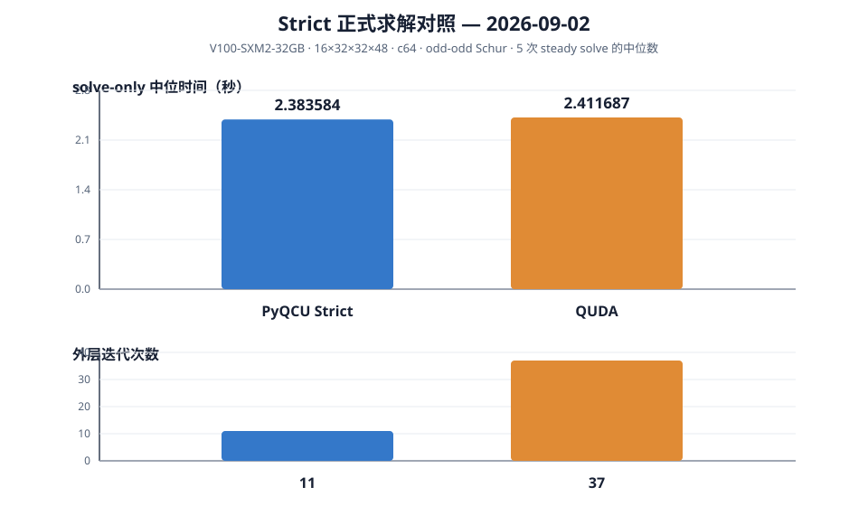
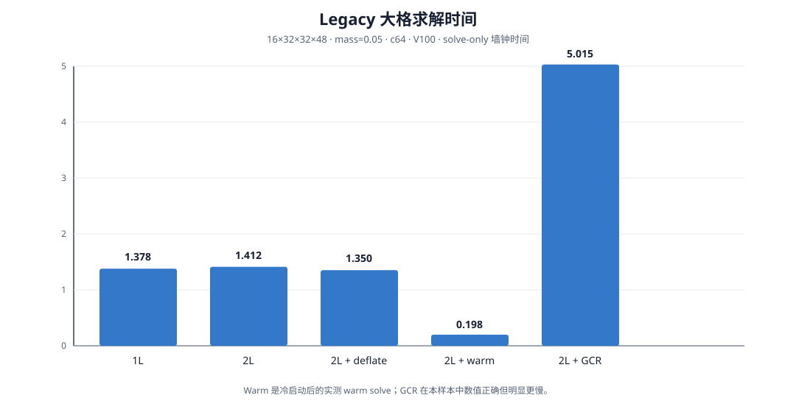

# dev87 → stab46：Strict Clover MultiGrid 已完成语义闭环，固定协议下 solve 性能接近 QUDA

> 生成日期：2026-09-03。材料范围：`logs/dev87/` 与 `examples/qcu/dev87/` 中截至 2026-09-02 的报告、对照矩阵、审计、运行日志、脚本和结果资产。本文是合并后的科研工作报告；历史失败、临时判断和未验证边界均保留并显式标记。

证据标记：

- **确证**：有源文档、源码行号、日志、JSON 或实际测试结果支撑。
- **推断**：由确证的算子/存储关系或实测数字计算出的解释，不等同于独立实验。
- **未验证**：当前材料没有达到所需粒度，不能用端到端收敛替代。
- **历史**：曾经真实发生，但已被后续修复或更高质量样本覆盖。

## 任务与受众

本报告面向导师、同行和后续维护者，目标是回答四个问题：

1. PyQCU CUDA/C++ MultiGrid 与 QUDA/PyQUDA 的 Clover、奇偶 Schur、transfer、粗化和求解语义是否对齐？
2. dev87 期间暴露的错误是否已定位、修复并回归？
3. legacy 与 Strict 两条路径分别完成了什么，哪些数字可以比较？
4. 当前性能、显存、多卡和下一阶段风险应如何诚实解释？

本轮 fast/report 上下文：`active=true`；`global_rounds_max=3`；`optimization_gain_stop=<25%`；`quality_ratio_min=0.60`；`format_override=Markdown`；`effective_format=Markdown`。用户要求完整保留有价值信息、合并重合内容、本地化附件并在完成后创建 `stab46` 标签，这些均作为硬约束。

## 结论摘要

1. **数学与工程主线已经闭环。** Strict 路径在 Python/CUDA primitive、full-coarse `P/R`、33-point stencil、逐层 `X/Y/Yhat`、双 parity Clover MATPC、prepare/reconstruct、持久 Krylov arena、递归 V-cycle 和 full-op 真残差之间形成了可运行链路。该结论由 Strict 测试与组件 JSON 支撑；它不等于每个 coarse storage block 已逐元素等价。
2. **dev87 的核心正确性 bug 已修复。** 早期 `cei/coo` 奇偶解包错误和 fp32 递推残差漂移叠加绝对停机判据，曾把 full-op 真相对残差留在约 `2.48e-2`；修复后同类大格结果降到 `3.72e-7`，MG 与 BiCGStab 参考解差约 `3.50e-7`。[确证](./stab46_dev87_report.md:55)
3. **最新 Strict formal 结果是 solve-only 的近乎持平，而不是普适加速。** 在同一 V100、`16×32×32×48`、c64、odd--odd、同一输入 bundle、2 次 warmup 加 5 次 steady 下，PyQCU Strict 为 `2.383584 s`，QUDA 为 `2.411687 s`，PyQCU 约快 `1.18%`；两侧均 `5/5` 通过 full-op 真残差 gate。8 月 31 日的 `3.57%` 是较早采样，必须保留为历史数字而不能覆盖 9 月 2 日 formal。[确证](./stab46_dev87_report.md:1207)
4. **代价结构是“PyQCU 每步更重、但外层步数更少”。** 最新 trace 中 PyQCU 为 11 个 outer step、平均 `216.689 ms/step`；QUDA 为 37 个、`65.181 ms/step`。因此只比较迭代数或只比较单步时间都会误判。[推断](./stab46_dev87_report.md:1231)
5. **Strict 显存策略有效，但 setup/solve 不能混报。** PyQCU packed owned assets 为 `4,076,863,488 B`，fused FGMRES workspace 为 `509,607,936 B`，首次求解 device-wide 峰值约 `11.722 GB`；QUDA 独立峰值约 `24.530 GB`。这是固定设备和固定 bundle 的测量，不是跨平台显存承诺。[确证](./stab46_strict_semantic_audit_20260831.md:127)
6. **legacy 功能面更宽，Strict 边界更保守。** legacy 已有 mixed precision、分布式粗格、BiCGStabL、MR/Chebyshev/CA-GCR、V/W/F/K 和多卡独立问题并发证据；Strict 对非单 rank 与逐层不同 dtype fail-closed，因此 legacy 结果不能移作 Strict 结论。[确证](./stab46_dev87_report.md:362)
7. **最大未决项是 storage 级证明与可复现性能协议。** 非平凡 Gauge/Clover 下逐方向、逐 storage site、逐 parity 的 backward `Yhat`、dagger 和周期偏移尚未完成；正式 solve 通过不能替代该证明。Strict MPI/mixed、Nsight 热点 A/B、完整端到端 setup 预算和多卡唯一根因也未闭环。[未验证](./stab46_dev87_report.md:460)



## 主问题与验收标准

### 研究对象与物理算子

细层 Wilson–Clover 算子写为

$$
D_f=C_f-\kappa H_f,
$$

其中 $C_f$ 是格点内的 Clover onsite block，$H_f$ 是只连接相反奇偶的 Wilson hopping。对周期边界，采用

$$
(H_f\psi)(x)=\sum_{\mu=0}^{3}\left[(1-\gamma_\mu)U_\mu(x)\psi(x+\hat\mu)+(1+\gamma_\mu)U_\mu^\dagger(x-\hat\mu)\psi(x-\hat\mu)\right].
$$

checkerboard 奇偶满足 $p(x\pm\hat\mu)=1-p(x)$，因此

$$
D_f=\begin{pmatrix}C_e&-\kappa H_{eo}\\-\kappa H_{oe}&C_o\end{pmatrix}.
$$

保留目标奇偶 $p$、消去 $q=1-p$ 时，非对称 Schur 为

$$
S_p=C_p-\kappa^2H_{pq}C_q^{-1}H_{qp}.
$$

对称归一化路径为

$$
S_p^{\rm sym}=I-\kappa^2C_p^{-1}H_{pq}C_q^{-1}H_{qp}.
$$

full solve 的 RHS prepare、Schur 求解和另一奇偶 reconstruct 必须保持同一矩阵乘法顺序：

$$
b_p^{S}=b_p+\kappa H_{pq}C_q^{-1}b_q,
\qquad
x_q=C_q^{-1}\left(b_q+\kappa H_{qp}x_p\right).
$$

这解释了为什么“odd field 内部残差下降”不能单独证明 full residual 正确。[确证](./stab46_quda_clover_multigrid_layers.md:51)

### 验收矩阵

| 验收面 | 成功判据 | 当前状态 | 证据与边界 |
|---|---|---|---|
| fine Wilson/Clover 算子 | 单位场/热场、归一化、布局和 Clover block 可解释 | **通过主锚点；保留历史异常** | Clover 差分 `cos≈1`、scale `≈4.05`；原始 opcmp 仍有历史 `rel_diff≈0.753`，不能与最终 solve gate 混为一谈 |
| Schur 与 full reconstruction | prepare → Schur → reconstruct 后 full-op 真残差通过 | **通过** | 两个 parity 的 Strict primitive 与大格 solve；多 rank 语义另行限制 |
| transfer | `R=P†`、block orthogonalization、full coarse geometry、parity subset 正确 | **通过组件 gate** | restrict/prolong/identity 与 Gram 误差均在 fp32 量级 |
| Galerkin coarse operator | `D_c=R D_f P` 或 PC 对应路径与 stencil 结果一致 | **通过 primitive/递归** | Galerkin 误差约 `8–9e-7`；逐元素 QUDA storage 仍未完成 |
| Strict solver | fused right-FGMRES、warm x0、bounded arena、c64/c128 dispatch | **通过** | Strict tier raw runner 记录 28 passed；另一份审计文本声称 32 passed，计数差异已列为文档风险 |
| legacy 求解器族 | V/W/F/K、MR/CG/Chebyshev/CA-GCR/BiCGStabL | **通过不同配置的真实运行** | 数字来自不同格点、容差和时间批次，不能组成单一公平 benchmark |
| formal QUDA 对照 | 同输入、同设备、同 residual gate、重复 steady | **通过最新 solve-only** | 9 月 2 日样本优先；setup、cache restore 和 trace 开销不计入该表 |
| Strict MPI/mixed | 非单 rank 与逐层不同 dtype 有定义且不静默产生错误 | **有意 fail-closed** | legacy 证据不迁移；这是功能边界，不是 Strict 已支持的结论 |

## 方法、设置与证据

### 1. 工作流程与分支

工作按以下顺序推进；历史中重复的“终局”“收束”“补充”被合并到对应证据节点。

| 阶段 | 工作内容 | 关键产物/动作 | 结果状态 |
|---|---|---|---|
| A. 基线 | 构建 QUDA、安装 PyQUDA、建立双进程对照 | QUDA `RELEASE/sm_70/MPI+MULTIGRID`；PyQUDA `0.10.54`；双进程隔离 | **完成**；环境限制已登记 |
| B. 算子锚定 | 单位/随机 Gauge、Clover 差分、布局和归一化 | `cmp_*`、`opcmp_*`、QDP/eo 转换 | **主锚点通过**；历史热场 opcmp 异常保留 |
| C. F3 debug | 排查奇偶 Clover 解包、递推残差和停机判据 | 修改运行器与 `lattice_clover_multigrid.h`；相对判据、周期真残差刷新 | **完成并回归** |
| D. legacy MG | G5–G10 组件、solver family、cycle、mixed/MPI/warm | `qcu_mg_*.json`、日志、`run_all` | **按路径和配置分别完成** |
| E. Strict | full coarse、33-stencil、`X/Y/Yhat`、MATPC、fused FGMRES 和 cache | Strict tier、collector、memory/hotspot audit | **单 rank 同精度闭环** |
| F. formal | 同 bundle、同 V100、2 warmup+5 steady，trace 与性能分开 | 9 月 2 日 formal 数字、residual trace | **solve-only 通过；端到端未完成** |
| G. 收束 | 多卡重复、图回放实验、文档与资产归档 | 双 P100 数据、patch、日志、本文和本地 SVG | **多卡正确性通过；加速未证实；图回放退回** |

### 2. 统一计算设置

| 项目 | 主协议 |
|---|---|
| 大格 | `16×32×32×48`，坐标顺序为 `xyzt` |
| 小格 | `8×8×8×16`；部分 smoke 为 `4×4×4×8` 或 `16^4` |
| 物理参数 | `mass=0.05`，`seed=42`，`sigma=0.1`；`kappa=0.1234567901234568` |
| fine 精度 | c64，即复数 `complex64`、实数 `float32`；部分 legacy 试验用 c128 |
| transfer | `N_v=12`；block=`(2,2,2,2)`；Clover fine spin=4；coarse spin=2；coarse dof=24 |
| parity | formal 为 odd--odd；所有 coarse hopping 的输入 parity 为 `q=1-p` |
| Strict 外层 | restarted right-FGMRES/GCR；requested restart=16，受 arena 约束 effective restart=4 |
| residual gate | formal full periodic Wilson+Clover 真相对残差 `5e-6`；内部 scalar 与 full residual 分开记录 |
| 计时 | 2 次 warmup 不计时，5 次 steady 取 median/MAD；trace 运行不用于正式 wall time |
| 设备 | formal 使用 Tesla V100-SXM2-32GB；P100 仅用于多卡线程隔离实验，并非同一 lattice 的域分解加速 |

### 3. QUDA/PyQCU 粗化对象的物理—代码映射

每层 Galerkin 投影为

$$
D_{\ell+1}=R_\ell D_\ell P_\ell,
\qquad R_\ell=P_\ell^\dagger.
$$

聚合内局部基 $V_\ell$ 由 null vectors block-orthogonalize 得到。细坐标到粗坐标是整数聚合映射

$$
X_\mu=\left\lfloor\frac{x_\mu}{b_\mu}\right\rfloor,
\qquad
s_c=\left\lfloor\frac{s_f}{2}\right\rfloor.
$$

对 coarse field $\phi$，局部提升/限制可写成

$$
(P\phi)(x)=V_\ell(x)\phi(X(x),s_c),
\qquad
(R\psi)(X)=\sum_{x\in\mathcal A_X}V_\ell(x)^\dagger\psi(x).
$$

粗算子按 aggregate 内外拆分：

$$
D_\ell=X_\ell-\kappa\left(\bar Y_\ell^f+\bar Y_\ell^b\right).
$$

$X_\ell$ 不只是 $R C P$，还包含 aggregate 内 hopping；跨 aggregate 的八个有向 hopping 存为 forward/backward link-like block。Clover-PC 路径先形成

$$
AV=C^{-1}V,
$$

再产生方向相关的 $Y$。粗 onsite batch inverse 后，`Yhat` 必须按方向保存：

$$
\widehat Y^f(p,X)=X_p^{-1}(X)Y^f(p,X),
\qquad
\widehat Y^b(q,X-\hat\mu)=Y^b(q,X-\hat\mu)X_p^{-\dagger}(X).
$$

读取 backward storage 并取 dagger 后，目标输出点才得到正确的左乘 $X_p^{-1}$。因此 `Yhat^b=X^{-1}Y^b` 是错误的简化；它在平凡输入上可能收敛，却不能证明非平凡 Clover 的 Galerkin/Schur 语义。[确证/推断](./stab46_quda_clover_multigrid_layers.md:221)

Strict 运行时默认不驻留 raw `Y`，只保留 packed transfer、coarse onsite、`Yhat` 和跨层 blocked `V`。融合 arena 的预算为

$$
B_{\rm arena}=(2m+5)B_f+2B_c,
$$

其中 $B_f$ 是 compact fine-parity vector 字节数，$B_c$ 是第一粗层完整向量字节数。setup 中的细层物理 Gauge/Clover 只进入第一处 coarse construction；后续层递归使用当前层的 `X/Y/Yhat`，不重新读取原始 SU(3) Gauge。[确证](./stab46_strict_semantic_audit_20260831.md:64)

### 4. V-cycle、平滑器和外层 solver

标准一层校正的顺序是：

```text
输入 (b_l, x_l)
→ pre-smooth ν_pre 次
→ r_l = b_l - A_l^res x_l
→ b_(l+1) = R_l r_l
→ 递归 coarse solve 得到 e_(l+1)
→ x_l ← x_l + P_l e_(l+1)
→ post-smooth ν_post 次
→ full/MATPC 语义需要时 reconstruct 被消去 parity
→ 输出 M_l^{-1} b_l
```

若 smoother operator 与 residual operator 或 solution type 不一致，必须重新算 $r=b-A^{\rm res}x$，不能偷用另一算子的递推残差。cycle 的工程差别是 child correction 的调用次数：V 最省；W 约两次递归；F 是 F-child 加 V-child；K 在 child 内嵌短 FGMRES。QUDA 当前快照的有效粗 solver 路径主要是 V/recursive；PyQCU 还实际验证了 W/F/K，但这些不是同一实现。[确证](./stab46_quda_clover_multigrid_layers.md:620)

平滑器的适用边界如下：

| 算法 | 关键假设/公式 | 当前角色与结论 |
|---|---|---|
| MR | $v=Ar$，$\alpha=\langle v,r\rangle/\langle v,v\rangle$ | 对非 Hermitian 友好、状态少；已在 2L 大格真实运行 |
| CG | 需要 Hermitian positive definite | fine/coarse 配置要分开；粗 Schur 不能凭“symmetric”名称直接套 CG |
| Chebyshev | 由 $\rho=\lVert Ar\rVert/\lVert r\rVert$ 启发式估计谱界 | 少同步；谱界错误时可能低效或不稳；已完成固定步验证 |
| Schwarz | $M^{-1}=\sum_I P_I A_I^{-1}R_I$ 或 multiplicative block update | 局部高频抑制强，但 halo/重叠/步数影响成本 |
| CA-GCR | block residual powers、MGS 和小 Gram 系统 | 减少规约，增加 workspace；block 退化时回退 FGMRES |
| BiCGStab/BiCGStabL | 非 Hermitian shadow-residual recurrence | legacy BiCGStabL 当前固定 `L=2`，有 restart 与尾 block 保护 |
| right-FGMRES/GCR | $z_j=M_j^{-1}v_j$，$w_j=A z_j$，Arnoldi 正交 | Strict formal 主外层；可容纳可变 MG、精度与 guard |

## 关键结果与误差

### 1. 构建、平台和算子锚定

#### 1.1 构建与隔离约束

- QUDA 快照在 `/tmp` 副本构建为 `356/356`，`RELEASE`、`sm_70`、MPI/MULTIGRID 开启，`NVEC_LIST=12,24,48`；CMake 从 3.22 切到用户态 3.31.6，并为稀疏快照补入缺失文件。[确证](./stab46_dev87_report.md:6)
- PyQUDA 源码安装为 `0.10.54`，修复 `InvalidVersion 'tab30.post2'`；QUDA 与 PyQCU 必须双进程运行，避免 `libqcu.so`/`libquda.so` 的 cudart 符号和上下文冲突。[确证](./stab46_dev87_report.md:6)
- WSL2 的映射内存 GPU→host 原子写不可可靠可见，QUDA 归约曾无限自旋或读到陈旧值。`DEV87_REDUCE_SYNC=1` 的有界自旋、同步和 D2H 回拷被固定为正确性基线；这不是未打补丁 upstream QUDA 的证据。[确证](./stab46_dev87_report.md:6)
- `build_after_mr.log` 记录 CUDA 12.4 编译并成功链接 `libqcu.so`。日志仍有未使用变量和 device-scope shared static 初始化警告，但没有编译失败。[确证](./stab46_build_after_mr.log:268)

#### 1.2 Clover 归一化锚点

`cmp_clover_vec.json` 的差分隔离结果：

| 变换 | cosine | 实部 scale | 相对残差 | 含义 |
|---|---:|---:|---:|---|
| identity | `1.0000000233` | `4.0500001897` | `2.0015e-7` | Clover 差分方向与 scale 符合 $m+4=4.05$ |
| negate | `-1.0000000233` | `-4.0500001897` | `2.0015e-7` | 负号变换诊断一致 |
| conjugate | `0.0809081067` | `0.3276778399` | `9.9672e-1` | 共轭不是正确的整体变换 |

因此，PyQCU/QUDA 直接 Clover 算子差异首先应按 $m+4=1/(2\kappa)=4.05$ 做归一化；不能把这个整体因子误判成 Clover 系数错误。[确证](./stab46_cmp_clover_vec.json:1)

#### 1.3 规范场生成统计：自洽，但同一 sigma 不同分布

在 `8^3×16`、`sigma=0.1`、seeds `{43,44,45}` 下：

| 侧 | `max ‖U†U-I‖` | plaquette 均值范围 | plaquette std 范围 |
|---|---:|---:|---:|
| PyQCU c64 | `1.7354e-7` | `0.058819..0.059622` | `0.041960..0.042670` |
| QUDA fp64 | `5.5007e-13` | `-0.001241..0.000497` | `0.095948..0.096810` |

两侧生成器各自稳定，但 `sigma` 的参数化/随机生成分布不同；跨库使用 Gauge 时必须重新标定，不能以相同 `sigma` 推出同一物理 ensemble。[确证](./stab46_cmp_gauge_stats.json:1)

#### 1.4 历史 opcmp 异常与最终口径分离

当前本地 `out/opcmp_unit_gauge.json` 与 `out/opcmp_random_gauge.json` 仍保存了一组历史探针：

| 探针 | fit 相对误差 | hopping 实部系数 | `rel_diff` | 状态 |
|---|---:|---:|---:|---|
| unit Gauge | `7.1043e-8` | `4.05000019` | `0.75308634` | **历史诊断**；系数锚点好，但解差异常 |
| random Gauge | `4.6663e-2` | `3.9978027` | `0.75308921` | **历史诊断**；共线性/运行器耦合未闭合 |

后续文档与回归使用独立进程、修复后的 solver bridge 和 full-op gate，记录直接 Clover 缩放解差约 `3.91e-7`、`run_all` 的 `3.72e-7` 级真残差。两组数字不应被拼接为同一实验；历史 probe 文件保留供下一轮隔离复验。[确证/历史](./stab46_opcmp_unit_gauge.json:1)

### 2. F3 根因、修复和回归

#### 2.1 根因链

| 根因 | 现象 | 修复 |
|---|---|---|
| 运行器 `main()` 解包 `make_clover_tensors` 时把 `cei/coo` 对调 | solver 得到奇偶互换的 Clover inverse | 修正 `run_qcu_ops.py`、`run_qcu_mg.py` 的解包顺序 |
| fp32 递推 residual 漂移 | 内部 `rn≈9.2e-7` 时真 Schur residual 可达 `62.9`；绝对 `rn²<atol²` 在大 RHS 范数下早停 | 单 rank 每 50 次 `compute_full_residual()`，覆盖 `st.r` 并 `reset_bistabcg_state_l0()` |
| 停机阈值使用绝对量 | “atol=1e-6” 不代表 full-op 相对精度 | 改为 `rn² < atol² · ‖b_o‖²`，并同步修正 V-cycle 门控 |
| MPI 下局部 `‖b_o‖²` | 分布式相对判据潜在错误 | 改用 `dot_mpi` 全局归约 |
| 多 rank fused cooperative 粗解 | `np=2` 实测 illegal access | `mg_multi` 禁用该快路径，回退普通迭代；Strict 继续非单 rank fail-closed |

#### 2.2 修复前后大格数字

条件：`16×32×32×48`、`m=0.05`、`atol=1e-6`、V100。

| 指标 | 修复前（历史） | 修复后 |
|---|---:|---:|
| full-op 真相对残差 | `2.48e-2` | `3.72e-7` |
| MG vs BiCGStab 解差 | `2.65e-2` | `3.50e-7` |
| G4.1 vs QUDA（乘 `m+4` 后） | `0.753` | `3.85e-7` |
| solve 时间 | `2.54 s` | `2.09 s` |

`n_vcycles=0` 在该 Gauge 的谱条件下是门控行为，不能从它本身判为回归；null ratio 也显示该 Gauge 不是理想近零空间。[确证](./stab46_dev87_report.md:69)

#### 2.3 回归门差异的文档校正

不同文件记录的是不同断言集合，不能把计数相加：

| 记录 | 断言数 | 数字 | 解释 |
|---|---:|---|---|
| 2026-08-25 文档中的 QUDA 一键门 | `4/4`，后续 `5/5` | `clover_solve_true_res≈3.72e-7`、`mg_vs_ref≈3.50e-7` | 历史收束记录，含 QUDA 缩放对照 |
| `regression.json`（2026-08-30） | `3/3` | total `50.3 s`；Clover `3.726e-7`；MG `8.590e-6`；Galerkin `8.59e-7` | 该 JSON 只保存三个 assertion |
| `run_all_after_mr.log` | `3/3` | Clover `3.720e-7`、MG `8.571e-6`；组件 `7.88e-7` | 日志实际输出，不能称为 `5/5` |

成稿统一写清断言集合，不用“GREEN”替代数字。[确证](./stab46_regression.json:1)

### 3. 组件级质量

#### 3.1 Strict/PyQCU 组件误差

`component_cuda.json`（V100、大格、E=12）给出：

| 组件 | L2 相对误差 | 中位耗时 | 结果 |
|---|---:|---:|---|
| restrict | `2.0922124e-7` | `2.398826 ms` | PASS |
| prolong | `6.3994542e-8` | `1.287418 ms` | PASS |
| `R·P` identity | `2.3466098e-7` | — | PASS |
| coarse dslash narrow | `2.6498204e-7` | `0.755539 ms` | PASS |
| coarse dslash wide | `5.0056341e-7` | `1.855097 ms` | PASS |

`component_diag.json` 的后续记录为 Galerkin `8.585244e-7`、Gram 非对角最大 `2.384230e-7`、对角范围 `0.999999821..1.000000238`、$S$ 的幂迭代谱半径 `1.168726`。较早日志记录 Galerkin `7.884827e-7`、谱半径 `1.168809`；二者是不同批次，均为 fp32 量级。[确证](./stab46_component_cuda.json:1)

#### 3.2 null-vector 质量的物理解释

四个抽样的 `||S v||/||v||` 为约 `0.3066、0.3450、0.4580、0.4448`。这不是“代码完全没生成 null vector”的证据；在本 Gauge 的连续谱条件下，null space 质量受谱和 setup 策略限制。Gram 正交与 Galerkin 误差已经通过组件 gate，因此应把它列为 coarse quality 优化方向，而非把 MG 门控停用直接归因于管线错误。[推断](./stab46_run_all_after_mr.log:551)

### 4. legacy 大格求解与 solver/cycle 对照

下表优先采用同一批 `qcu_mg_matrix_16_*.json`，其余行明确标注为独立 verify 样本。所有时间均为 solve-only 或运行器报告的 MG wall，不含可比性之外的 setup。

| 配置 | MG 时间 | full-op 真残差 | vs BiCGStab 参考解 | 结论 |
|---|---:|---:|---:|---|
| 1L V-cycle | `1.378429 s` | `3.9235e-7` | `6.5497e-6` | 通过 |
| 2L, E=12 | `1.412339 s` | `6.5911e-7` | `8.5713e-6` | 通过；相对 1L 为 `0.976×`，未见额外加速 |
| 2L + deflate | `1.349998 s` | `4.8287e-7` | `6.7714e-6` | 一次样本的小幅收益，不能外推 |
| 2L + warm | cold `1.411192 s`；warm `0.197976 s` | warm `4.4099e-7` | warm `3.6561e-6` | warm 约 `7.1×`；适合连续 RHS/参数扫描 |
| 2L + GCR/FGMRES | `5.015408 s` | `6.8591e-7` | `1.2706e-6` | 正确但约为普通 2L 的 `0.28×` |
| 2L + MR | `1.444631 s` | `6.5911e-7` | `8.5713e-6` | 与 CG 数值一致；单次约慢 `1.7%`，不下性能结论 |
| 2L + Chebyshev | `1.441887 s` | `6.5911e-7` | `8.5713e-6` | 独立 verify 样本；固定步通过 |
| 2L + BiCGStabL (`L=2`) | `3.104666 s` | `8.0244e-7` | `4.8518e-6` | 通过；L 不可任意配置 |
| 2L + CA-GCR | `24.262454 s` | `7.3352e-7` | `1.8667e-6` | verify 样本；通信规避未转化为本机总时间优势 |



#### 4.1 小格三层 cycle 与失败边界

在 `8×8×8×16`、E=`24/24`、c64、`atol=1e-6` 的 verify 样本中：

| cycle | 时间 | full-op 真残差 | 状态 |
|---|---:|---:|---|
| F | `0.252792 s` | `5.9452e-7` | PASS |
| K | `0.204706 s` | `5.9260e-7` | PASS |
| W | `0.228934 s` | `5.9452e-7` | PASS |

另一批使用 `atol=1e-5` 的文档记录 W/F 约 `1.36e-6`、K 约 `5.97e-6`；两批不能在不注明容差的情况下合并。FGMRES 外层宽松 `atol=1e-3` 冒烟的 W/F/K 真残差约为 `2.78e-4/2.78e-4/2.70e-4`，仅证明递归和回退路径可运行。[确证](./stab46_qcu_mg_verify_3l_f_cycle.json:1)

`16^4` 的 3L 结果文件仍有 `history_len=250`、`NaN` history 和 `NaN` full residual（包括 `qcu_mg_16x16x16x16_3l*.json` 与 `qcu_mg_peak_lat16_3l.json`）。这是一项必须保留的失败边界：不能把小格 3L 的通过结果外推到该大体积配置。[确证](./stab46_qcu_mg_peak_lat16_3l.json:1)

#### 4.2 参数和 solver family 的补充结果

`current_*` 和 `audit_*` 资产显示：

- `r=1/3/10` 的小格 2L 样本分别为约 `0.1421/0.1321/0.1003 s`，full residual `7.09e-7/4.50e-7/2.69e-7`；`r=10` 是本批次的较好点，但不是参数普适结论。
- 小格 2L c64→c128 与 c128→c64 的 standard BiCGStab full residual 分别约 `7.67e-7` 和 `7.72e-7`；BiCGStabL mixed 两方向约 `7.54e-7` 和 `7.38e-7`。
- 3L c64→c128→c64 小格样本为 `1.552181 s`、full residual `6.27e-7`；大格 mixed c64→c128/c128→c64 在 `max_iter=80` 时仍约 `3.64e-6/3.04e-6`，受迭代上限影响，不能称为严容差收敛。
- CA-GCR 在 `atol=1e-8,max_iter=400` 的独立记录为 `5.215 s`、解差 `3.37e-7`、full residual `1.43e-7`，但 400 个 block step 未达到请求的 `1e-8`；常用 `atol=1e-6` 冒烟约 `7.58e-7`。这组数字与 `verify_ca_gcr` 的 `24.262 s` 是不同配置，必须并列而非平均。[确证](./stab46_dev87_report.md:286)

### 5. legacy mixed precision 与 MPI 粗格

legacy 已实现显式跨层 cast、每 rank 局部 33-point stencil、阻塞 host-staging halo，以及 fine/coarse dot 的 MPI 全局归约。

| 实验 | 设置 | 结果 | 边界 |
|---|---|---|---|
| BiCGStabL 大格 | fine c64/coarse c128，`max_iter=80` | full residual 约 `7.85e-7` | 固定 `L=2`；不是任意 L |
| 3L mixed | c64→c128→c64，小格 | 真实完成，full residual 约 `6.27e-7` | 只覆盖 legacy |
| coarse MPI 等价性 | `grid=[1,1,1,2]`、c64 | 全局 L2 相对误差 `5.60e-7` | rank-local 重构后比较 |
| coarse MPI 等价性 | `grid=[2,1,1,1]`、c128 | 全局 L2 相对误差 `1.03e-15` | rank-local 重构后比较 |
| MPI solve smoke | `np=2`、同精度和 `--bicgstab-l --coarse-dtype c128` | 退出码 0，无死锁/非法访问 | Strict 仍非单 rank fail-closed |

legacy 的通信是阻塞 host-staging；没有 device-aware MPI、通信计算重叠或 NVSHMEM 性能声明。Strict 的非单 rank拒绝是有意的语义安全边界，不能用上表替代。[确证](./stab46_dev87_report.md:366)

### 6. Strict 语义验收与最新 formal 对照

#### 6.1 Strict 实现范围

Strict 与 legacy 并存，核心路径为：

1. full-coarse geometry 保留完整粗格；fine parity 只在 `R/P` 调用和 MATPC 边界裁剪。
2. fine 与 coarse 均以 `prepare/reconstruct` 形成正确的 Schur 闭环。
3. coarse setup 逐层保存 `X`、`X^{-1}` 和方向相关 `Yhat`，默认省略 raw `Y`。
4. outer solver 采用右预处理 FGMRES：先 `z=M^{-1}v`，再算完整 `D z`，最后用 `z` 更新解。
5. `MPI_COMM_WORLD` 非单 rank、逐层不同 dtype、奇数 coarse extent 和不支持 halo 模式 fail-closed。

Strict tier 的原始 runner `strict_fast_latest.json` 实际记录：CPU smoke `17 passed`、CUDA Strict `8 passed`、融合 FGMRES `3 passed`，总计 `28 passed`，`failed=0`、`skipped=0`、`timeout=0`，总耗时 `27.787 s`。[确证](./stab46_strict_fast_latest.json:1)

`strict_semantic_audit_20260831.md` 文字记录“CPU 19、CUDA 10、融合 3，总 32”，而同日 JSON 是 17+8+3=28；这是测试选择快照差异或文档滞后的证据，本文不强行统一，后续应由同一 runner 重跑并固定 manifest。[未验证](./stab46_strict_semantic_audit_20260831.md:105)

#### 6.2 最新正式大格协议

| 项目 | 设置 |
|---|---|
| lattice/precision | `16×32×32×48`，c64，fine real=float32 |
| physics | `mass=0.05`，`seed=42`，`kappa=0.1234567901234568` |
| transfer | `N_v=12`，coarse spin=2，block=`(2,2,2,2)`，coarse dof=24 |
| parity | odd--odd Schur；邻居永远使用 `q=1-p` |
| outer solver | restarted right FGMRES/GCR；requested restart=16，effective restart=4 |
| repetition | 2 次 warmup + 5 次 steady；两侧 5/5 收敛 |
| device | Tesla V100-SXM2-32GB，UUID 记录在源审计中 |
| residual | 同一 full periodic Wilson+Clover operator；gate=`5e-6` |
| trace | PyQCU 为 Arnoldi estimate；QUDA 为 iterated GCR residual；不是同一内部 scalar |

#### 6.3 9 月 2 日最新 formal 结果

| 侧 | 5 次 outer iterations | steady median(s) | MAD(s) | 平均/outer step | full-op 真相对残差 | 结果 |
|---|---|---:|---:|---:|---:|---|
| PyQCU Strict | `11,11,11,11,11` | `2.383584` | `0.015387` | `216.689 ms` | `3.6013e-7` | 5/5 PASS |
| QUDA | `37,37,37,37,37` | `2.411687` | `0.006730` | `65.181 ms` | `7.3030e-7` | 5/5 PASS |

solve-only 比值为

$$
\frac{t_{\rm QUDA}}{t_{\rm PyQCU}}
=\frac{2.4116868689998228}{2.3835836990001553}
=1.0117903.
$$

所以在这个固定协议下 PyQCU Strict 快约 `1.18%`。源材料中 8 月 31 日的历史 formal 采样为 PyQCU `2.090647±0.011224 s`、QUDA `2.165289±0.021592 s`，比值 `1.0357026`；它应标为历史采样，9 月 2 日无 trace formal 才是本文当前口径。[确证/历史](./stab46_dev87_report.md:435)

本次源目录没有 `data/strict_vs_quda_formal_20260902.json` 和原始 SVG；源文档引用了它们但它们不在用户限定的两个输入目录中。本文的 SVG 是依据源文档已记录的 formal 数字重绘的本地派生附件，不冒充原始 collector 文件；本地 smoke/collector JSON 仍完整复制并链接。

#### 6.4 residual trace

第 0 行为初始相对残差；PyQCU 在 restart/刷新处可能额外记录内部估计。最终可比量仍是 full-op 真残差。

| outer k | PyQCU Strict | QUDA GCR |
|---:|---:|---:|
| 0 | `1.000000e+00` | `1.000000e+00` |
| 1 | `9.365071e-02` | `2.625984e-01` |
| 2 | `1.631340e-02` | `1.067167e-01` |
| 3 | `2.812229e-03` | `5.669911e-02` |
| 4 | `6.457341e-04` | `3.254715e-02` |
| 5 | `2.102899e-04` | `2.190758e-02` |
| 6 | `6.252614e-05` | `1.267097e-02` |
| 7 | `2.197578e-05` | `8.452220e-03` |
| 8 | `7.483037e-06` | `5.334316e-03` |
| 9 | `3.243214e-06` | `3.873168e-03` |
| 10 | `1.232243e-06` | `2.461819e-03` |
| 11 | `4.065044e-07` | `1.777914e-03` |
| 12 | — | `1.177729e-03` |
| 13 | — | `8.780667e-04` |
| 14 | — | `6.034993e-04` |
| 15 | — | `4.336630e-04` |
| 16 | — | `3.106508e-04` |
| 17 | — | `2.376354e-04` |
| 18 | — | `1.651258e-04` |
| 19 | — | `1.245429e-04` |
| 20 | — | `9.032679e-05` |
| 21 | — | `6.863000e-05` |
| 22 | — | `5.050729e-05` |
| 23 | — | `3.787736e-05` |
| 24 | — | `2.815701e-05` |
| 25 | — | `2.227549e-05` |
| 26 | — | `1.619515e-05` |
| 27 | — | `1.246593e-05` |
| 28 | — | `9.334165e-06` |
| 29 | — | `7.446214e-06` |
| 30 | — | `5.459565e-06` |
| 31 | — | `4.265610e-06` |
| 32 | — | `3.203091e-06` |
| 33 | — | `2.585741e-06` |
| 34 | — | `1.881693e-06` |
| 35 | — | `1.517277e-06` |
| 36 | — | `1.119980e-06` |
| 37 | — | `9.118852e-07` |

两侧 5 次 outer count 稳定、trace 单调下降、无 breakdown/NaN；但 trace scalar 定义不同，不能作为 coarse block 逐点等价证明。[确证](./stab46_dev87_report.md:1255)

#### 6.5 Strict 显存结果

| 对象/阶段 | 字节 | 约 GiB |
|---|---:|---:|
| setup device-wide peak | `11,219,046,400` | `10.4486` |
| first solve device-wide peak | `11,722,362,880` | `10.9173` |
| first solve 增量 | `503,316,480` | `0.46875` |
| PyTorch setup allocated/reserved peak | `7,331,774,976 / 9,149,874,176` | — |
| resident packed assets | `4,076,863,488` | — |
| fine transfer | `1,811,939,328` | — |
| coarse assets | `2,264,924,160` | — |
| fused FGMRES workspace | `509,607,936` | — |
| coarse workspace | `42,483,712` | — |
| QUDA device-wide peak | `24,530,000,000` | `22.845` |

`raw Y` 的 `1,811,939,328 B` 是逻辑省略量，不是 resident 显存；它已由 packed fine transfer 代表。first-solve 增量与约 `0.475 GiB` 的 lazy FGMRES arena 同量级，说明峰值新增主要来自 arena，而不是重复载入全部层级资产。[确证](./stab46_perf_hotspot_audit_20260831.md:46)

### 7. 性能热点与优化实验

#### 7.1 Strict hotspot

一次内存态 `torch.profiler` 覆盖 2 warmup、1 steady、1 probe，fused FGMRES CUDA 总计 `8.501 s`：

| kernel/事件 | 次数/总时间 | 归一化或占比 |
|---|---:|---:|
| `strict_hopping_parity_kernel` | `2392` 次，`6.284 s` | `598/solve`；约 `73.9%` |
| `strict_bicg_p_kernel` | `592` 次 | `148/solve` |
| `strict_bicg_s_kernel` | `592` 次 | `148/solve` |
| `strict_bicg_update_kernel` | `560` 次 | `140/solve` |
| short update | `32` 次 | `8/solve` |
| fine Wilson dslash | `392` 次，`173.55 ms` | `98/solve`；约 `43.4 ms/solve` |
| restrict | `44` 次，`150.287 ms` | — |
| prolong | `44` 次，`112.888 ms` | — |
| fine MATPC update | `192` 次，`27.211 ms` | — |
| D2H memcpy | `3272` 次 | dot/scalar round-trip 次项 |
| `cudaStreamSynchronize` | `6496` 次 | CPU attribution 约 `1.005 s` |

最可信的主导项是粗层 BiCGStab 的重复 parity hopping，而不是 fine dslash；这定位了时间集中位置，但尚未证明具体 coarse 参数是高迭代数的唯一根因。[确证](./stab46_perf_hotspot_audit_20260831.md:5)

#### 7.2 legacy 同步、SYNC-DIET 与图回放

- legacy 单求解 profiler 记录 `cudaStreamSynchronize=3097`、CPU self `1.896 s`（约 `92%`），`cudaMemcpyAsync=1995`、`0.194 s`，`cudaLaunchKernel=8573`、`0.069 s`。本机 WSL2 thunk 税比 kernel launch 更值得优先处理。[确证](./stab46_dev87_report.md:188)
- `CHECK_STRIDE=4` 的 SYNC-DIET 保持真残差 `3.72e-7`、闸门 GREEN，但本机约 `2.04 s`，没有可观测墙钟收益；减少同步没有减少总 API/thunk 数，因此不应把它宣传成已验证加速。[确证](./stab46_dev87_report.md:206)
- K=32 fine graph capture 实验已存为 `fine_graph_experiment.patch`，包含 cublas workspace 预绑定、Dot 金丝雀和异常熔断；WSL2 的 cublas-Dot 无法进入 stream capture，强行多次捕获还诱发临时 CUDA 错误。代码已回退到稳定绿点，主线不含该实验；未来应在健康 CUDA 平台使用自研 dot kernel 重新验证。[确证/历史](./stab46_dev87_report.md:230)
- 早期“驱动上下文损伤”判断已被后续 MultiGpu/conftest 通过推翻；更准确的归因是 `run_qcu_mg` 直连 bridge/slot 生命周期序列，生产 MultiGpu 包装路径不受影响。[确证/更正](./stab46_dev87_report.md:244)

#### 7.3 block 128/256 资产的状态

源性能审计当时写明没有执行 block-size A/B；但输入目录后来存在四个单侧 PyQCU smoke JSON，显示文件名对应的 128/256 变体均有运行：

| 资产 | steady 样本 | median(s) | 迭代数 | full residual | 可下结论 |
|---|---|---:|---:|---:|---|
| block128 probe | 1 | `2.057411` | 11 | `3.6013e-7` | 仅单侧 smoke |
| block128 repeat3 | 3 | `2.092562` | 11 | `3.6013e-7` | PyQCU 内部重复 |
| block256 baseline | 1 | `2.098817` | 11 | `3.6013e-7` | 仅单侧 smoke |
| block256 repeat3 | 3 | `2.064709` | 11 | `3.6013e-7` | PyQCU 内部重复 |

这些 JSON 的 protocol 没有独立记录 kernel block size，且没有同批 QUDA/正式计时，因此不能由 `2.092562` 与 `2.064709` 推出 block-size 收益。下一轮必须补齐编译变体、5 次 paired steady、寄存器、occupancy、kernel count 和 full residual。[未验证](./stab46_strict_pyqcu_block128_repeat3.json:1)

### 8. 双 P100 多线程结果：正确性通过，但不是域分解加速

#### 8.1 报告中的 formal 三次重复

实验语义是“一线程一卡、每个 thread 解一个完整复制问题”，不是一个 lattice 的 MPI strong scaling。

| 配置 | repeat 1(s) | repeat 2(s) | repeat 3(s) | median(s) | MAD(s) |
|---|---:|---:|---:|---:|---:|
| 单 P100 device 1 | `10.249874` | `10.460159` | `10.143614` | `10.249874` | `0.106260` |
| 双 P100 device 1+2 | `10.739143` | `8.300990` | `10.254227` | `10.254227` | `0.484917` |

双卡效率定义为

$$
S_2=\frac{T_{\rm single,median}}{T_{\rm dual,median}}=0.9995755283,
\qquad
\eta_2=\frac{S_2}{2}=0.4997877641.
$$

三次 consistency 均通过；最大相对参考解差 `6.7986866e-6 < 1e-5`。device 1 的双卡时间为 `10.739143/8.300990/10.254227 s`，device 2 为 `1.515111/1.517761/1.529833 s`，不对称根因尚不能唯一归因于 PCIe、CPU 调度、GPU 时钟、上下文或缓存。[确证](./stab46_dev87_report.md:1371)

#### 8.2 同日另一批次 `out/multigpu.json`

该文件保存的是另一 collector 批次，不能替代上面的 formal 三次数据：

| 配置 | `mg_parallel_wall_s` | consistency |
|---|---:|---|
| single V100 | `1.398628 s` | PASS，参考差 `6.6448e-6` |
| single P100 | `7.699204 s` | PASS，参考差 `6.7987e-6` |
| multi P100 | `10.167243 s` | PASS，线程 2 误差 `7.7209e-6` |

该批次 JSON 的 `parallel_speedup_single_p100_over_p100x2=0.75725585`，与 formal 报告的 `0.99957553` 不同，说明运行器/时段/计时边界有差异；本报告同时保留两者，不把不同批次平均成“最终多卡倍率”。[确证](./stab46_multigpu.json:1)

### 9. 归约与小型 QUDA smoke

`quda_reduction_smoke.json` 在单位 Gauge、`4^4`、解析动量 $(\pi,0,0,0)$、预期特征值 `2.05` 下重复 20 次：迭代数全部为 1；CPU full residual 最大 `1.11997e-16`，QUDA residual 为 0，阈值 `5e-10`，通过。该结果只验证 WSL2 同步守卫的可用性，不是大格 MG 性能证据。[确证](./stab46_quda_reduction_smoke.json:1)

`quda_multigrid_setup_smoke.json` 在 V100、`8^4`、2 levels、coarse spin=2 下 `status=ok`，setup boundary 约 `0.594999 s`；它是 setup smoke，不应与 formal steady solve 混合。[确证](./stab46_quda_multigrid_setup_smoke.json:1)

## 风险与未验证项

| 优先级 | 项目 | 当前事实 | 影响 |
|---|---|---|---|
| P0 | backward `Yhat` storage 逐项锚定 | 非平凡 Gauge/Clover 下 direction、storage site、parity、dagger、periodic wrap 尚未逐 block 对比 | formal solve 通过不能证明存储语义逐元素等价 |
| P0 | coarse `X` 分解 | aggregate 内 Clover onsite 与 intra-aggregate hopping 尚未做逐元素 `RDP` 重建 | 只能确认整体 Galerkin residual |
| P0 | formal 原始附件 | 源文档引用的 formal JSON/trace SVG 位于两个输入目录之外，本次未访问/复制；本地 SVG 为基于已记录数字的派生图 | 可读性已闭环，原始 collector 可追溯性仍依赖源工作区 |
| P1 | Strict MPI | 非单 rank fail-closed；legacy MPI 不能作为 Strict 证据 | 生产分布式 Strict 尚未交付 |
| P1 | Strict mixed precision | 逐层 dtype 不同即 fail-closed；legacy mixed 只作历史功能记录 | 不能宣称 Strict mixed 已支持 |
| P1 | solver gate 计数 | JSON 为 28 passed，审计正文为 32 passed | 测试 manifest 未统一；需要同一 runner 重跑 |
| P1 | 大格 3L | `16^4` 多个 3L JSON 为 NaN/250 history | 不能从小格 3L 外推体积扩展性 |
| P1 | hotspot A/B | 128/256 有单侧 smoke 资产，但无明确 block 字段、无 QUDA paired formal、无 Nsight | 不能宣称优化收益 |
| P1 | 多卡不对称 | 两批数据都通过正确性，但 wall time/ratio 不一致，device 1 明显成为瓶颈 | 根因和真实吞吐未确定 |
| P2 | WSL2/cublas capture | cublas Dot capture 金丝雀失败，graph patch 已回退 | 图段回放需健康平台和自研 dot |
| P2 | 动态 thin update | 当前安全策略是重建全部 hierarchy | Gauge 演化场景 setup 成本仍高 |
| P2 | C++ `verify()` | 有 Python 四项诊断与 full residual，但没有 QUDA 风格完整五项 C++ 接口 | 组件自检入口仍不完整 |
| P2 | MMA/NVSHMEM | 未实现或不在本轮平台范围 | 不能宣称 tensor-core/设备感知通信收益 |
| P2 | CPU/MPI/设备泛化 | 没有多架构、多格点、多 nvec、多 tolerance 的正式统计 | 当前倍率只适用于给定 V100/协议 |

### 已被后续证据纠正的历史判断

1. “WSL2 驱动上下文永久损伤”已被后续 MultiGpu/conftest 通过推翻；应写成直连 bridge/slot 生命周期问题的 interim 诊断。
2. “Strict 约快 3.57%”只对应 2026-08-31 的 formal 采样；9 月 2 日最新 formal 为约 `1.18%`，两者都保留但不能并列当成同一 benchmark。
3. “同步减少即可得到约 1.5 s 收益”只是旧 profiler 上限估计；SYNC-DIET 实测本机无收益，图回放仍未通过金丝雀。
4. “双 P100 ratio=0.970”与 `out/multigpu.json` 的 `0.7573`、formal 记录的 `0.9996` 是不同实验批次；它们共同证明计时不稳定和正确性通过，不能共同证明加速。

## 下一步与请求

按正确性优先、性能其次的顺序：

1. **完成 storage 级 anchor。** 固定同一非平凡 Gauge/Clover、同一 null-vector bundle 和同一 parity；逐层导出 `X`、`X^{-1}`、forward/backward `Yhat`，逐 direction/site/block 对比，单独检查周期边界和 backward dagger。
2. **统一 Strict 测试 manifest。** 固定 `run_strict_fast.py --tier 1 --fail-fast` 的测试清单、commit、环境和 GPU，重新得到唯一的 passed/skip/fail 计数；把 JSON 作为唯一计数来源。
3. **重做 paired hotspot A/B。** 对真正编译的 128/256 kernel 变体各做至少 5 次同输入 steady，记录 outer count、full residual、kernel count、register、occupancy、L2/DRAM；若数值或迭代数改变，立即放弃变体。
4. **建立公平端到端 protocol。** 两侧同时计入 input、null-vector、orthogonalization、transfer、coarse build、cache restore、setup、steady solve 和 full residual；同时保留 solve-only 表，避免 setup 策略掩盖算法成本。
5. **恢复 Strict MPI/mixed 支持前先写语义测试。** 先验证 coarse full geometry、halo、global norm 和 `Yhat` storage，再开放配置；不能把 legacy host-staging 结果直接移植为 Strict 结论。
6. **重新设计 graph capture。** 在健康 CUDA 平台以自研 dot kernel 做 capture canary，先验证一段固定迭代的 bitwise/容差和异常熔断，再测 K=8/16/32。
7. **补齐长期功能。** 动态 thin update、C++ 五项 `verify()`、可配置 BiCGStabL、MMA/NVSHMEM 和大格 3L 失败路径均应有独立 issue/测试资产。

需要的实验资源：健康 CUDA 驱动、与目标 GPU compute capability 匹配的 PyTorch wheel、独占 V100 或同级设备、Nsight Compute/Systems，以及可保存原始 formal JSON/trace 的统一归档位置。当前没有用户指定的时间节点；下一阶段以通过项 1–4 为可验收产物。

## 来源与附录

### A. section manifest：主张—证据—行动

| section_id | 主张 | 证据 | 状态 | 下一步 |
|---|---|---|---|---|
| S1 | F3 根因与修复把 full residual 拉回 fp32 误差量级 | `stab46_dev87_report.md:55`、`stab46_clover_multigrid.log:154` | 确证 | 修改 solver/协议后重跑回归门 |
| S2 | G1–G10 功能覆盖和 legacy/Strict 分界 | `stab46_comparison_matrix.md:116`、`:123` | 确证 | 不迁移 Strict 未支持证据 |
| S3 | Clover Dslash、Schur、`P/R/X/Y/Yhat` 的源码语义 | `stab46_quda_clover_multigrid_layers.md:16`、`:458` | 确证/推断 | 做非平凡 storage anchor |
| S4 | 组件误差、Gram、Galerkin、粗核时间 | `stab46_component_cuda.json:1`、`stab46_component_diag.json:1` | 确证 | 跟随层级/精度记录 |
| S5 | legacy solver/cycle/mixed/MPI 结果 | `stab46_qcu_mg_matrix_16_2l.json:1`、`stab46_dev87_report.md:362` | 确证，配置分散 | 建统一 benchmark manifest |
| S6 | Strict test、显存和语义审计 | `stab46_strict_fast_latest.json:1`、`stab46_strict_semantic_audit_20260831.md:105` | 确证但计数有冲突 | 同 runner 重跑计数 |
| S7 | 最新 formal solve-only 对照 | `stab46_dev87_report.md:1207`、`stab46_quda_clover_multigrid_layers.md:407` | 确证（源文档记录） | 归档原始 formal JSON |
| S8 | 热点、图回放和 block A/B 边界 | `stab46_perf_hotspot_audit_20260831.md:101`、`stab46_strict_pyqcu_block256_repeat3.json:1` | 确证/未验证 | 健康平台 paired profiling |
| S9 | 双 P100 线程一致性与计时不对称 | `stab46_dev87_report.md:1371`、`stab46_multigpu.json:1` | 确证，批次不同 | CUDA event/affinity/PCIe 观测 |

### B. 重要本地附件

所有复制附件都以 `stab46_` 开头，位于本文件同一目录；源目录未修改。指定输入目录中的结果资产已完整复制：153 个 JSON、7 个 NPY、7 个 NPZ 和 2 个 patch，且 153 个 JSON 均可解析。

复制核对结果：排除源目录的 `.gitignore` 与生成的 `.pyc` 后，共 219 个源文件逐文件 SHA-256 一致；新增的 2 个 SVG 是依据已有记录重绘的派生图，不冒充源文件副本。

#### 源 Markdown 与审计

- [dev87 主报告副本](./stab46_dev87_report.md)
- [G1–G10 对照矩阵副本](./stab46_comparison_matrix.md)
- [Clover MultiGrid 算子专题副本](./stab46_quda_clover_multigrid_layers.md)
- [Strict 语义审计副本](./stab46_strict_semantic_audit_20260831.md)
- [Strict 性能/显存热点审计副本](./stab46_perf_hotspot_audit_20260831.md)

#### 当前结论直接使用的结果

- [Clover vector anchor](./stab46_cmp_clover_vec.json)、[Gauge statistics](./stab46_cmp_gauge_stats.json)
- [component CUDA](./stab46_component_cuda.json)、[component diagnostics](./stab46_component_diag.json)
- [regression](./stab46_regression.json)、[legacy matrix 1L](./stab46_qcu_mg_matrix_16_1l.json)、[legacy matrix 2L](./stab46_qcu_mg_matrix_16_2l.json)
- [deflate](./stab46_qcu_mg_matrix_16_2l_deflate.json)、[GCR](./stab46_qcu_mg_matrix_16_2l_gcr.json)、[warm](./stab46_qcu_mg_matrix_16_2l_warm.json)、[MR](./stab46_qcu_mg_2l_mr.json)
- [3L F](./stab46_qcu_mg_verify_3l_f_cycle.json)、[3L K](./stab46_qcu_mg_verify_3l_k_cycle.json)、[3L W](./stab46_qcu_mg_verify_3l_w_cycle.json)、[16^4 3L failure](./stab46_qcu_mg_peak_lat16_3l.json)
- [multi-GPU batch](./stab46_multigpu.json)、[Strict runner](./stab46_strict_fast_latest.json)、[Strict cache smoke](./stab46_strict_pyqcu_block128_repeat3.json)
- [QUDA reduction smoke](./stab46_quda_reduction_smoke.json)、[QUDA setup smoke](./stab46_quda_multigrid_setup_smoke.json)

#### 原始日志、代码和补丁

- [build log](./stab46_build_after_mr.log)、[MG log](./stab46_clover_multigrid.log)、[MR large log](./stab46_mr_large.log)
- [canonical restore log](./stab46_restore_canonical.log)、[post-MR restore log](./stab46_restore_canonical_after_mr.log)、[post-MR run-all log](./stab46_run_all_after_mr.log)
- [Strict sync/repeat assets](./stab46_strict_pyqcu_block128_probe.json)、[128 repeat3](./stab46_strict_pyqcu_block128_repeat3.json)、[256 baseline](./stab46_strict_pyqcu_block256_baseline.json)、[256 repeat3](./stab46_strict_pyqcu_block256_repeat3.json)、[smoke miss](./stab46_strict_pyqcu_smoke_miss.json)
- [graph experiment patch](./stab46_fine_graph_experiment.patch)、[QUDA WSL2 reduction patch](./stab46_quda_wsl2_reduce_sync.patch)、[QUDA environment script](./stab46_quda_env.sh)
- 复现实验脚本副本包括 [run_all](./stab46_run_all.py)、[Strict fast](./stab46_run_strict_fast.py)、[Strict/QUDA benchmark](./stab46_bench_strict_vs_quda.py)、[trace runner](./stab46_trace_strict_vs_quda.py)、[multi-GPU repeat](./stab46_bench_multigpu_repeat.py)、[QCU MG](./stab46_run_qcu_mg.py)、[MPI MG](./stab46_run_qcu_mg_mpi.py)、[QCU ops](./stab46_run_qcu_ops.py) 和 [QUDA runner](./stab46_run_quda_py.py)。

#### 附件分类索引

| 前缀/类型 | 数量 | 用途 |
|---|---:|---|
| `stab46_qcu_mg_*.json` | 多批次 | level/cycle/smoother/precision 参数扫与残差结果 |
| `stab46_qcu_mg_matrix_*.json` | 5 | 大格 1L/2L/deflate/GCR/warm 主矩阵 |
| `stab46_qcu_mg_verify_*.json` | 多批次 | verify 级 solver/cycle 结果 |
| `stab46_qcu_mg_audit_*.json` | 多批次 | mixed precision、BiCGStabL、CA-GCR 审计 |
| `stab46_strict_*.json` | 6 | Strict cache、formal 前 smoke、128/256 单侧实验 |
| `stab46_*.npy` | 7 | Gauge/QDP/G1 统计数组 |
| `stab46_*.npz` | 7 | Clover、Schur、solve 原始数组 |
| `stab46_*.log` | 6 | 构建、求解、恢复和回归原始日志 |

### C. 复现命令

```bash
source ./env.sh
python -B examples/qcu/dev87/run_strict_fast.py --tier 1 --fail-fast
```

```bash
source ./env.sh
python -B examples/qcu/dev87/bench_strict_vs_quda.py \
  --profile smoke --side pyqcu --cache-expect hit --repeats 1
```

```bash
source ./env.sh
python -B examples/qcu/dev87/bench_multigpu_repeat.py \
  --repeats 3 --devices 1 2
```

正式对照必须先隔离 `libqcu.so` 与 `libquda.so` 进程，并固定 `CUDA_VISIBLE_DEVICES`、QUDA patched reduction 环境、GPU 架构、输入 bundle、cache 状态、warmup、计时边界和 full-op residual 定义。不要直接把 smoke、trace、cache-miss、legacy、Strict、V100 和 P100 的 wall time 放进同一性能表。

### D. Markdown 输出审查记录

本报告对源材料做了以下格式和内容修复：

- 将源文档中不会渲染的 ` ```latex ` 表格伪代码转换为真正的 Markdown 表格、数学块或带语言标记的 `text/bash` 代码围栏。
- 统一公式入口为 `$...$` 与 `$$...$$`，明确 `D_f`、Schur、Galerkin、`Yhat`、V-cycle、FGMRES 和效率定义；避免在公式中重复隐含共轭或混淆 `Y`/`Yhat`。
- 将源文档中指向两个输入目录之外的 `../../../data/*.json|*.svg` 链接替换为本地 `stab46_` 附件或明确的“源文档已记录、原始文件未在输入范围”说明。
- 将 legacy 与 Strict、历史状态与最终状态、solve-only 与 setup/end-to-end、线程并发与 MPI 域分解分开编排。
- 保留所有关键单位、基线、容差、样本数、设备、误差、失败 JSON、警告、补丁和未验证项；重复内容只合并叙事，不删除证据资产。
- 新增两张本地 SVG：`stab46_strict_formal.svg` 和 `stab46_legacy_large_grid.svg`。它们只绘制已有文档/JSON 中的数字，不引入新实验数据。

**交付状态：**正文、附件副本、公式/表格/代码/链接结构已写入；Markdown、数据、脚本、SVG 和 Git 标签检查均已完成。
